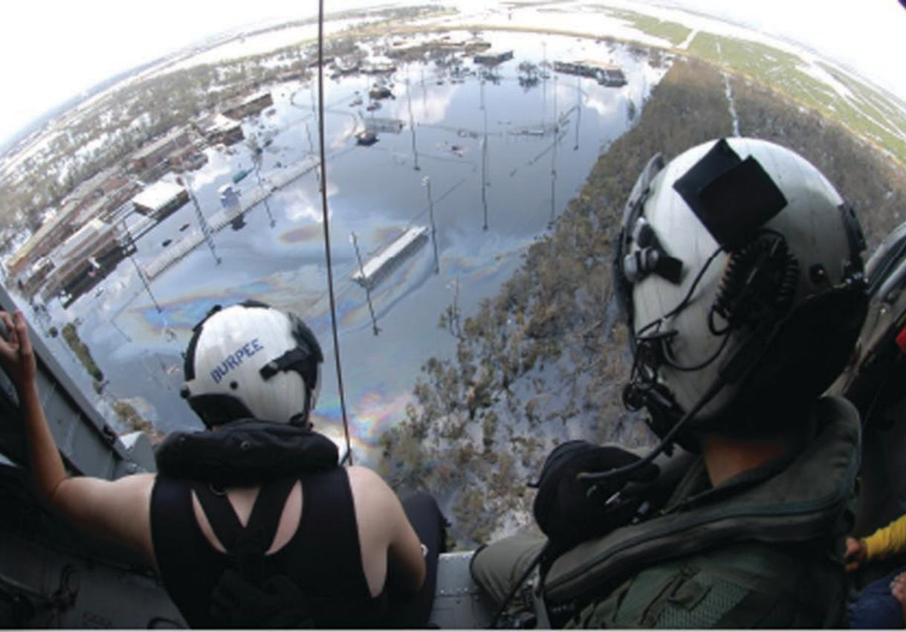
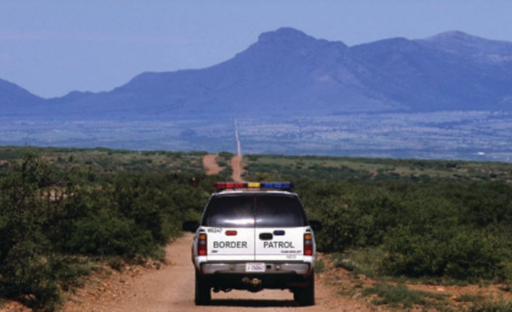
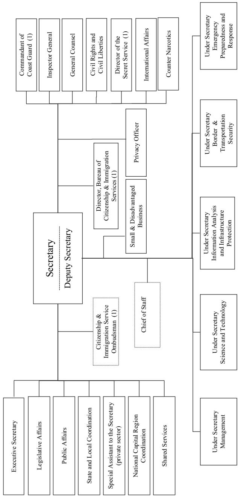
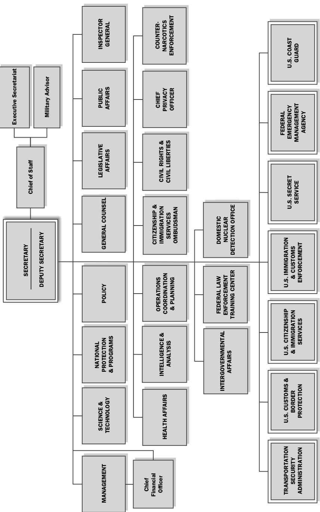

# Introduction to Homeland Security

Edited by KEITH GREGORY LOGAN and JAMES D. RAMSAY

# Introduction to Homeland Security

# IN T R O D U C TIO N TO Homeland Security

EDITED BY

Keith Gregory Logan Kutztown University

James D. Ramsay

Embry-Riddle Aeronautical University

First published 2012 by Westview Press

Published 2018 by Routledge 711 Third Avenue, New York, NY 10017, USA 2 Park Square, Milton Park, Abingdon, Oxon OX14 4RN

Routledge is an imprint of the Taylor & Francis Group, an informa business

Copyright $^ ©$ 2012 Taylor & Francis

All rights reserved. No part of this book may be reprinted or reproduced or utilised in any form or by any electronic, mechanical, or other means, now known or hereafter invented, including photocopying and recording, or in any information storage or retrieval system, without permission in writing from the publishers.

Notice:

Product or corporate names may be trademarks or registered trademarks, and are used only for identification and explanation without intent to infringe.

Every effort has been made to secure required permisions for al text, images, maps, and other art reprinted in this volume.

Library of Congress Cataloging-in-Publication Data Introduction to homeland security / edited by Keith Gregory Logan, James D. Ramsay.

P. cm. Includes bibliographical references and index. ISBN 978-0-8133-4598-7 (pbk. : alk. paper) ISBN 978-0-8133-4599-4 (ebook)

To my beautiful wife, Patricia, the only woman I have ever loved. —Keith

To my lovely wife, Trish, and my children, Margo and David, for their unqualified love and support, which make everything I do possible. —Jim

# Contents

Introduction, Keitb Gregory Logan Acronyms

# PARTI The Organization and Administration of Homeland Security

1 A First Look at the Department of Homeland Security 5 KEITH GREGORY LOGAN

2 Homeland Security Law and Policy 19 EMILY BENTLEY

3 Public- and Private-Sector Partnerships in Homeland Security 47 MICHAEL CHUMER

# PART II Homeland Security Resources

4 Critical Infrastructure Protection 73 STEvEN D. HART and JAMES D. RAMSAY

5 Homeland Security Intelligence 97 WILLIAM J. LAHNEMAN

6 Defense Support of Civil Authorities 125 BERT TUSSING

Contents

7 Homeland Security Technology 161

RANDY R. GRIFFITH

8 Environmental Security and Public Health TERREnCE M. O'SULlIVaN and JAMEs D. RaMSaY

203

# PART III

# Homeland Security Strategies

9 Emergency Management 241 SCOTT ROBINSON

10 Strategic Communication 263 GAIL FANN THOMAS

11 Strategic Planning 285 SAMUEL H. CLOVIS JR.

12 Terrorism and Counterterrorism 313 GEORGE MICHAEL

13 America and Terorism in the Twenty-First Century MICHAEL L.HUMMEL

351

14 Foundations of Homeland Security Education 365 JOHN M. PERsyN and CHERYL J. POLsON

Epilogue 379 JAMES D. RAMSAY

Acknowledgments 387

About the Editors and Autbors 389

Index 395

# Introduction

KEITH GREGORY LOGAN

September 11, 2001 (9/11) changed how the United States would view its security and its approach to counterterrorism (CT). No longer could terrorism, particularly Islamic extremist—based terrorism, be viewed as a problem that existed only in other countries. Although we have always recognized that it was a factor in how Americans were viewed and treated around the globe, it was never as significant an issue as on 9/11. As we have heard, the words uttered to President George Bush by Andrew Card, his chief of staff, "America is under attack," were shocking, and he was at a loss to immediately know how to respond, but that did not last very long.1 What followed was an extensive reorganization of federal agencies and more than a decade of war. The events of 9/1 1 were totally unprecedented, even in comparison with December 7, 1941. But in each case, the sleeping tiger was awakened, and the world would never be the same.

At the time, everyone asked: What happened? How did this happen? What can be done to ensure that it will never happen again?2 Nine days later, President Bush took the first major step to strengthen domestic national security and announced that Pennsylvania governor Tom Ridge would lead the new Office of Homeland Security (OHS), to "oversee and coordinate a comprehensive national strategy to safeguard our country against terrorism and respond to any attacks that may come."3 President Bush and others recognized that our intellgence and law enforcement systems were not working as well as they should have been to prevent the attack. Technology could carry postCold War intelligence efforts just so far; changes were needed. The president commissioned the new OHS director to coordinate the "counterterrorism functions' that were scattered across several organizations, including the Central Intelligence Agency (CIA), Federal Bureau of Investigation (FBI), National Guard, state and local police, and numerous other agencies and departments. OHS director Ridge went on to become the first secretary of the Department of Homeland Security (DHS), shepherding the largest federal government reorganization since the passage of the National Security Act of 1947 that created the Department of Defense (DOD) and the CIA.

# NOTES

1. http://www.msnbc.msn.com/id/32782623/ns/us_news-9_11_eight_years_later/t/he -told-bush-america-under-attack/. 2. Unfortunately, very similar questions were asked in the wake of Hurricane Katrina. 3. http://pittsburgh.about.com/lbrary/weekly/aa100801a.htm.

# Acronyms

ACP area contingency plan ADS Active Denial System AFIS Automated Fingerprint Identification Systems AG attorney general AOR area of operations   
ISME-ITI American Society of Mechanical Engineers Innovative Technologies Institute ATSA Aviation and Transportation Security Act AUMF Authorization for Use of Military Force BAC Basic Access Control BEOC Business Emergency Operations Centers   
Cal EMA California Emergency Management Agency CAT United Nations Convention Against Torture and Other Cruel, Inhuman or Degrading Treatment or Punishment CBIRF Chemical and Biological Incident Response Force CBP Customs and Border Protection   
CBRNE chemical, biological, radiological, nuclear, or high-yield explosive   
CCMRF CBRN Consequence Management Response Force CDC Centers for Disease Control CERFP CBRN Enhanced Response Force Package CFR Code of Federal Regulations CHDS Center for Homeland Defense and Security CI critical infrastructure CIA Central Intelligence Agency CI/KR Critical Infrastructure/Key Resource CIP critical infrastructure and its protection CIP/R critical infrastructure protection and resilience CNCI Comprehensive National Cybersecurity Initiative COI community of interest   
NPLAN contingency plan COOP continuity of operations COP community of practice   
CRINT criminal intelligence CT counterterrorism $\mathrm { C } ^ { 2 }$ (cid:) command and control   
(cid:) $\mathrm { C } ^ { 2 } \mathrm { C R E }$ (cid:) Command and Control CBRN Response Elements DCI director of central intelligence DCRF Defense CBRN Response Force DEA Drug Enforcement Administration DHS Department of Homeland Security   
DHSES Division of Homeland Security and Emergency Service   
DHS IP Department of Homeland Security Infrastructure Protection DIA Defense Intelligence Agency   
DMA2K Disaster Mitigation Act of 2000 DNI director of national intelligence DOD Department of Defense DPC Disaster Preparedness Commission DSCA defense support of civil authorities EAS Emergency Alert System EM emergency management EMAC Emergency Management Assistance Compact EMPC Emergency Management Planning Commission EO executive order ES environmental security ESF Emergency Support Function FAR false acceptance rate FBI Federal Bureau of Investigation FEMA Federal Emergency Management Agency FISA Foreign Intelligence Surveillance Act   
FLETC Federal Law Enforcement Training Center FMD foot-and-mouth disease FPS Federal Protective Service FRR false rejections rate GAO Government Accountability Office   
iEOINT geospatial intelligence GHG greenhouse gas HD homeland defense HEAP Human Effects Advisory Panel HHS Department of Health and Human Services HRF Homeland Response Forces HS homeland security HSIN Homeland Security Information Network HSPD Homeland Security Presidential Directive   
HUMINT human intelligence IA information assurance I&A Office of Intelligence and Analysis IAFIS Integrated AFIS IAIP Office of Information Analysis and Infrastructure Protectic IC Intellgence Community ICE Immigration and Customs Enforcement ICS Incident Command System IHL international humanitarian law IMINT imagery intelligence INS Immigration and Naturalization Service IP infrastructure protection IPCC Intergovernmental Panel on Climate Change IR infrared radiation IRTPA Intelligence Reform and Terrorist Prevention Act of 2004 ISR intelligence, surveillance, and reconnaissance JDL Jewish Defense League JTF Joint Task Force JTTF Joint Terrorism Task Force LEINT law enforcement intelligence LRAD Long Range Acoustic Device LRE launch-and-recovery element   
MASINT measurement and signatures intelligence MCA Military Commissions Act MCE mission-control element MIP Military Intelligence Program   
M19CO May 19th Communist Organization MTI moving-target indicator NAS National Airspace System NCTC National Counterterrorism Center NGO nongovernmental organization NIC National Intelligence Council NIE National Intelligence Estimate NIMS National Incident Management System NIP National Intelligence Program NIPP National Infrastructure Protection Plan NMI neuromuscular incapacitation   
IHCOM US Northern Command NPG National Preparedness Guidelines NPS Naval Postgraduate School NRF National Response Framework NSB National Security Branch NSC National Security Council NSS National Security Strategy   
NVOAD National Voluntary Organizations Active in Disaster NYPD New York Police Department ODNI Office of the Director of National Intelligence ODP Office for Domestic Preparedness OEP Office of Emergency Preparedness OGC Office of the General Counsel OHS Office of Homeland Security OIA Office of Intelligence and Analysis OIG Office of the Inspector General OIP Office of Infrastructure Protection   
OKOHS Oklahoma Office of Homeland Security OMB Office of Management and Budget OS Office of the Secretary OSINT open-source intelligence PCA Posse Comitatus Act PD presidential directive PDD presidential decision directive PEMA Pennsylvania Emergency Management Agency PI pulse induction ppm parts per million PPP private-sector and public-sector partnerships PSO Private Sector Office PS-Prep Private Sector Preparedness Accreditation and Certification Program   
RAMCAP Risk Analysis and Management for Critical Asset Protection RCCC Regional Consortium Coordinating Council RFID radio-frequency identification RPV remotely piloted vehicle RTLS real-time locating system SCADA supervisory control and data acquisition SIGINT signals intelligence SIM Subscriber Identity Module   
LTTGCC State, Local, Tribal, and Territorial Government Coordinatir Council

SOP standard operating procedure SSP Sector-Specific Plan SWOT strengths, weaknesses, opportunities, and threats TFER Task Force for Emergency Readiness TSA Transportation Security Administration UAS Unmanned Aerial System UCMJ Uniform Code of Military Justice UGCS Universal Ground Control Station UNFCCC UN Framework Convention on Climate Change USA PATRIOT Uniting and Strengthening America by Providing Appropriate Tools Required to Intercept and Obstruct Terrorism Act USBP US Border Patrol USC United States Code USCG US Coast Guard USSS US Secret Service VOAD Voluntary Organizations Active in Disaster WHO World Health Organization WMD weapons of mass destruction XREP eXtended Range Electronic Projectile ZOG Zionist Occupation Government

# The Organization and Administration of Homeland Security

n Part I, the authors examine the basic structure of what has come to now be known as "homeland security" (HS). The concept of protecting our 】 nation is not new, but the term is one that grew out of the devastating attacks on the American homeland, in New York, Washington, DC, and Pennsylvania. As we know, the United States is primarily a nation of immigrants, with a small percentage of our population being true "Native" Americans. But for all of us, naturally born American citizens or naturalized citizens, it is indeed our homeland. In a post-9/11 environment, there have been significant steps taken by all Americans to secure our homeland. The chapters that follow explore just a few of those steps.

# Chapter 1: A First Look at the Department of Homeland Security

This chapter is an introduction to the Department of Homeland Security. But this is clearly just a first look. The author will present a very basic explanation of the DHS's mission and the organizations within the DHS that are charged with our security. We examine homeland security from the "top down," examining the responsibilities of the federal government and what it does. But many of the other authors will describe different structures, some starting at the bottom with local governments and others that rest with the private enterprise or even the military (state and federal).

# Chapter 2: Homeland Security Law and Policy

In the United States, we would like to believe that homeland security is a straightforward mission. However, when it is carried out within a free society, with a complex legal structure designed with checks and balances on government power and protections for individual liberties, it is anything but straightforward. It is vital that those with homeland security or emergency management responsibilities (or both) have an understanding of the governmental and legal parameters in which homeland security policy and emergency operations function. This author presents the reader with an overview of areas of law and policy that impact homeland security in the United States, exploring the meaning of law and policy, sources of legal authority, basics of constitutional law, US agencies and government structures that address homeland security, and examples of major federal statutes, executive orders (EOs), and presidential directives (PDs) impacting homeland security. She also provides brief descriptions of several relevant areas of law, including public health law, laws impacting the detainment of terrorism suspects, and mutual aid agreements.

# Chapter 3: Public- and Private-Sector Partnerships in Homeland Security

All too often, the assumption is made that homeland security is a strictly government function. That is not true, however. This chapter begins with a review of several key structural documents, particularly the pertinent Homeland Security Presidential Directives (HSPDs) that relate to the incorporation of the private sector within preparedness, prevention and mitigation, response, and recovery dimensions of emergency management. The author then addresses the role of the private sector as Critical Infrastructure Key Resource (CI/KR) owners and operators to include a review of the governance council structure currently in place within the Department of Homeland Security Infrastructure Protection (DHS IP) Directorate. This direction reflects the manner in which the DHS both interprets and implements the appropriate HSPDs, as well as the private-sector responsibilities as directed by the Federal Emergency Management Agency (FEMA) and US Northern Command (NORTHCOM). The chapter concludes with a description of several public-sector and privatesector models being considered by various jurisdictions as well as the salience and effectiveness of these models. Two key models examined by this author are the "top-down"' model, which suggests private-sector partnerships need to be constructed and managed by the public sector, and the "bottom-up" model, based on community of practice and community of interest "grassroots" initiatives.

# A First Look at the Department of Homeland Security

KEITH GREGORY LOGAN

They that can give up essential liberty to obtain a littl temporary safety deserve neither liberty nor safety. —Benjamin Franklin, Historical Review of Pennsylvania (1759)

# September 11

September 11, 2001, like many other days of tragedy and infamy, burned into the psyche of every American the mark of terrorism. We wil never forget where we were and what we were doing when our homeland came under attack. The consequences of that day have challenged the freedom of all Americans. The loss of lives, the loss of property, and the loss of our security have changed us forever. We all asked how our intelligence and defense agencies failed to protect us. One response was to reorganize the government to ensure that this would not happen again.

# Department of Homeland Security

On November 25, 2002, President Bush signed the Homeland Security Act of 2002 (Public Law [PL] 107-296; 116 Stat. 2135), creating the DHS, effective January 24, 2003. The new department was intended to improve government operations and communications, by moving all the essential elements for domestic national security and intelligence under one manager. There have been numerous reorganizations at the DHS since $2 0 0 3 ^ { 1 }$ to improve communications and operations (see Figures 1.1 and 1.2).2

The intent was to include within the DHS all of the federal organizations that had a primary responsibility for homeland security and the sharing of domestic intelligence in order to facilitate communication, policies, strategies, tactics, and control among them. Several agencies were moved under the aegis of the new department, including the US Secret Service (USSS), US Coast Guard (USCG), Federal Emergency Management Agency (FEMA), Transportation Security Administration (TSA), Federal Protective Service (FPS), and Federal Law Enforcement Training Center (FLETC).3 Other organizations or functions were moved, in part, from their parent agencies to the DHS and assigned to various DHS directorates.4 The new DHS Science and Technology Directorate included the CBRN (Chemical-Biological-RadiologicalNuclear) Countermeasures Programs, Environmental Measurements Laboratory, National BW Defense Analysis Center, and Plum Island Animal Disease Center.5 The Nuclear Incident Response Team, Domestic Emergency Support Teams, National Domestic Preparedness Ofice, and Office for Domestic Preparedness (ODP) were included within FEMA's new structure.6 The functions of the US Customs Service and the US Immigration and Naturalization Service (INS) were transferred into US Customs and Border Protection (CBP) and US Immigration and Customs Enforcement (ICE), both within the DHS.7 The following other entities were also moved to the DHS: part of the Animal and Plant Inspection Service, Federal Computer Incident Response Center, National Communications System, National Infrastructure Protection Center, and Energy Security and Assurance Program.8

# Key DHS Elements

The present DHS organization reflects refinements that have evolved since its initial creation in 2003.' The USSS, FEMA, USCG, and TSA remain within the DHS and are very similar to their initial organization. Other DHS components have refined their structure, function, and responsibilities. For example, when the FPS was transferred from the General Services Administration to the DHS, it was included as a part of ICE until 2009, and it is now part of the National Protection and Programs Directorate. There have been other refinements within the DHS organization as well. Although not allinclusive, the list below provides a brief look at three distinct segments within the department: the Office of the Secretary (OS), key components and agencies, and advisory panels and committees.

# Tbe Office of thbe Secretary

The secretary and his or her staff are responsible for the management and strategic direction of the DHS. In particular, the secretary leverages resources among federal, state, and local governments to ensure that there is an integrated focus on protecting the American people and the homeland.10 Reporting directly to the secretary are the following five functional and administrative areas:

1. Office of the General Counsel (OGC): The OGC is an OS staff office, responsible for providing legal advice and coordinating the activities of approximately seventeen hundred attorneys throughout the DHS and its components. The OGC works closely with the Department of Justice (DOJ) to ensure uniformity among the administration's legal actions.

2. Office of the Inspector General (OIG): By conducting audits, inspections, and investigations, the OIG is responsible for combating any fraud, waste, and mismanagement that may exist within the DHS or any of its programs, including contracts, grants, and so on. The OIG is considered an independent element of the DHS and makes only recommendations to the secretary for improving the department. The OIG is also responsible for reporting its findings to the US Congress. As with the DHS secretary, the inspector general is appointed by the president of the United States.

3. FLETC: FLETC is where most federal law enforcement officers receive the training necessary to fulfill their agencies' law enforcement or homeland security missions. The training center of FLETC is based in Glynco, Georgia. FLETC also has a western campus and several satellite centers for specialized training. Special agents, police officers, and security officers receive in-service and refresher training at FLETC's base or one of its campuses. The two exceptions, the Federal Bureau of Investigation and the Drug Enforcement Administration (DEA), train in Quantico, Virginia, at the FBI's National Academy facilities. Many agencies such as the US Border Patrol (USBP) and Secret Service also have their own specialized training schools for agency-specific courses after officers complete their basic training at FLETC. FLETC is also involved in training foreign law enforcement personnel. Since 9/11 FLETC has expanded its homeland security training, along with its basic law enforcement training. In addition, FLETC has broadened into new subject areas, such as counterterrorism, security, intelligence, and law enforcement management. The increased FLETC curriculum is a positive reflection of the growth of homeland security as a discipline.

4. Directorate for Science and Technology: This directorate is the primary research and development segment of the DHS. It provides federal, state, and local agencies with improved technology capabilities that are essential to homeland security.

5. Office of Intelligence and Analysis (OIA): The OIA serves a critical mission that addresses weaknesses in communications and analyses that enabled the events of 9/11. The OIA represents the DHS in the Intelligence Community (IC), as one of the sixteen intelligence agencies under the guidance of the director of national intelligence (DNI). The USCG Intelligence program, another key DHS component, is also part of the IC because of its responsibilities for maritime security and safety. The OIA analyzes information from various sources to assess the threat to homeland security. It is also responsible for communicating the appropriate information to other members of the IC as well as to federal, state, local, and tribal counterparts directly and through Fusion Centers.11

# Key DHS Components and Agencies

There are seven independent agencies that are clearly integral to the DHS, each with law enforcement authority. The inclusion of these components played a key role in the creation of the DHS and the centralization of homeland security.

1. US CBP: This is the primary organization that is responsible for border security. The CBP is the largest and most complex DHS organization and has the first-line responsibility of keeping terrorists and their weapons away from the homeland. The CBP has its roots in the USBP, INS, and US Customs Service (USCS). The USCS's origins date back to the Tariff Act of 1789, when the USCS was the primary source of revenue for our new nation.

2. US Citizenship and Immigration Services: This DHS component is responsible for overseeing lawful immigration to the United States.

(The responsibility for issuing passports and visas remains with the US Department of State.)

3. US Immigration and Customs Enforcement: ICE is responsible for homeland security law enforcement, encompassing both criminal and civil federal laws relating to border control, customs, trade, and immigration. Its agents are involved in an extensive array of criminal and national security investigations and are assigned to posts in forty-eight foreign countries.

4. US Secret Service: The USSS is responsible for protecting the president, vice president, and other leaders. It also safeguards the nation's financial infrastructure, with responsibility for conducting criminal investigations regarding the counterfeiting of US currency, credit card fraud, and other crimes.

5. US Coast Guard: The USCG's origin in 1790 predates that of the Department of the Navy; its initial purpose involved revenue enforcement. The USCG now has the primary responsibility for maritime and port security, including navigable domestic waterways, and enforcing US laws at sea. As a key player in fighting transnational crime, it works with the DEA, ICE, and CBP to prevent drug and human smuggling across US borders and waterways. Although not part of the Department of Defense, it is considered one of the nation's five military services. As noted above, it is a member of the IC.

6. TSA: This DHS component is renowned for ensuring the transportation safety of people and commerce. It is the most visible DHS element for the air-traveling public, as it represents the first line of security at the airport. When providing air marshals for flight security, the TSA represents the least-visible aspect of transportation security.12

7. FEMA: Whether confronted by natural or man-made disasters, FEMA is the first-responder federal agency.13 FEMA is most visible during times of crisis, and it must be prepared to respond to any and every challenge, at any time. It is responsible for ensuring that first responders and emergency workers are qualified pursuant to the National Incident Management System (NIMS), so that workers from one area of the country operate under the same command and control $( \mathbf { C } ^ { 2 } )$ rules as workers from another area who arrive at the scene of a disaster to lend assistance. It has been the subject of criticism for its handling of the nation's response to Hurricane Katrina, and it has received high marks after other disasters. Some question whether it was more effective as an independent agency before its affiliation with the DHS, whereas others favor its inclusion in the DHS as part of a unified homeland security response. It works to ensure that as a nation, we are able to "prepare for, protect against, respond to, recover from, and mitigate al hazards."14

# Advisory Panels and Committees

There are a series of advisory groups that are part of the DHS. They include the Homeland Security Advisory Council, National Infrastructure Advisory Council, Homeland Security Science and Technology Advisory Committe, Critical Infrastructure Partnership Advisory Council, Interagency Coordinating Council on Emergency Preparedness and Individuals with Disabilities, Task Force on New Americans, and DHS Labor-Management Forum.

# State and Local Homeland Security and Emergency Management (EM) Organizations

There are more than eighty-seven thousand federal, state, local, and tribal organizations that are responsible in some manner for homeland security and emergency management.15 As was learned on 9/11, these organizations do not always follow the same procedures or connect al the dots. Key to being able to prevent and respond to terrorism and natural disasters is the ability to communicate effectively. Ensuring a clear and continuing line of communication is a primary responsibility of the DHS, working with the state, local, and tribal homeland security offices. One aspect of communication is the nationwide Emergency Alert System (EAS), an early warning system that was established to enable the president to address the American public during emergencies. The EAS was also designed for use by the National Oceanic and Atmospheric Administration's National Weather Service, state governors, and state and local authorities for emergency alerts. Under the law, each state is a sovereign, and it is a challenge for the DHS to ensure cooperation and communication, but the EAS is a move in the right direction.16

Each state has established its own homeland security or emergency management structure(s). It is important to note that both security and emergency response work from the bottom (such as a local township) up, as well as from the top (federal government) down, depending on the nature of the emergency In Pennsylvania, for example, the Pennsylvania Emergency Management Agency (PEMA) takes the lead in homeland security, with the PEMA director also serving as the homeland security adviser to the governor and the

PEMA deputy as the director for homeland security.17 PEMA is responsible for coordinating local and county governments in the areas of civil defense, disaster mitigation, and preparedness, planning, and response to and recovery from man-made or natural disasters.18 Local governments also have emergency management structures. For example, Upper Uwchlan Township (Chester County), Pennsylvania, has an Emergency Management Planning Commission (EMPC), composed of volunteers who provide community assistance in coordinating disaster response. Like the police and fire departments, EMPC personnel receive training and participate in drills to be better prepared to respond to different disasters. The training includes what actions should be taken regarding evacuation; biological, chemical, or radiological hazards; explosions; dam breaches; and the like. The EMPC has a series of protocols to reflect how it handles certain disasters and when it is appropriate to look beyond its first responders to the county and state for assistance.

It is the responsibility of each township to provide the first responders to any disaster or emergency within its jurisdiction. If an incident expands beyond the township's ability to handle it, the local government will work with adjoining townships and then bring in the countys emergency management units for assistance. If the problem extends to multiple jurisdictions and grows beyond local or county abilities, the local leaders will look to the state and possibly to the federal government for assistance. At the local level, a township's (or citys) police and fire departments would likely be the first responders.

Even at the local level, it is important to look at communications, media relations, special equipment, and other resources, not the least of which is where the financial means necessary to pay for additional contractual services will derive. All the issues that confront these local township supervisors tend to be faced by other managers and elected officials, all the way up to the federal level. As reflected in several of the subsequent chapters, grants from the federal (DHS) and the state organizations (such as PEMA) assist in funding "top-down" training and the ability of each level of government to respond in a uniform manner. It is important that responders from one location are able to assist in another without additional training. This should include command, control, communications, policies, procedures, and more. It is also important to note that the type of resources needed at the federal level or in a large metropolitan city may be entirely different from that required in a small, rural town. The devastation from river flooding in the Dakotas may be just as "deadly" as a hurricane in the Gulf or a bomb in a city, but the preparation and response needs are entirely different.

Like the citizens of Pennsylvania and New York, Oklahomans have also experienced the devastation of terrorist acts on home soil. Unlike the organizations found in either the federal government or Pennsylvania, Oklahoma has two separate agencies, one for homeland security and another for emergency management. The Oklahoma legislature passed the Oklahoma Homeland Security Act (House Bill 2280) and established the Oklahoma Office of Homeland Security (OKOHS), the state agency responsible for countering terrorism. The responsiblities of OKOHS include the following: developing and implementing a comprehensive statewide homeland security strategy, planning and implementing a statewide response system, administering the homeland security advisory system, and implementing national homeland security plans. Oklahoma also has the Oklahoma Emergency Management Agency that handles most emergency management issues. Oklahoma's major threats involve natural disasters, such as the damage caused by tornadoes, which prompted the state to start the safe-room project, designed to provide shelter for those under the threat of a tornado. The implementation of this project starts at the community level; municipalities and townships raise a portion of the money needed, and the state provides the remaining funds to finish the project. Oklahoma has become more proactive in its emergency management initiations, attempting to prevent problems experienced in the past and mitigate the loss and damage from future natural disasters.19

New York State has a homeland security and emergency management structure that is different from those in both Pennsylvania and Oklahoma. New York has a Division of Homeland Security and Emergency Service (DHSES) that includes several offices with specific responsibilities for different aspects of homeland security and emergency management. Included within the DHSES are the Office of Counter Terrorism, Office of Cyber Security, Office of Interoperable and Emergency Communications, Office of Fire Prevention and Control, and Office of Emergency Management.

During World War I and the Cold War, US cities had developed civil defense programs through the Office of Civil Defense. In 1978 New York shifted its emphasis from civil defense to an "all-hazards"” program approach, creating the Disaster Preparedness Commission (DPC). New York's DPC is composed of the commissioners, directors, and chairpersons of the thirty-three state agencies and one volunteer organization, the American Red Cross. The DPC's responsibilities include the preparation of state disaster plans, directing state disaster operations and coordinating those with local government operations, and coordinating federal, state, and private recovery eforts.20

The California model is similar to Pennsylvania's, including homeland security as part of its emergency management agency, reporting to the governor's office. The California Emergency Management Agency (Cal EMA) is vested with the duties, powers, purposes, responsibilities, and jurisdictions previously held within the governor's Ofices of Homeland Security and Emergency Services. Cal EMA is responsible for designing and implementing homeland security initiatives, coordinating and supporting the emergency activities of all of California's state agencies that have an operational role in state emergencies, promoting and sustaining effective criminal justice programs, and ensuring California's readiness to respond to and quickly recover from the effects of all emergencies.21

Although it is relatively easy to examine an emergency management structure within a state, it is less obvious how the homeland security aspect is structured. Some states view homeland security as separate and distinct from emergency management; it is viewed as a law enforcement responsibility and assigned to a state police agency. As noted above, within the federal government, the DHS has responsibility for FEMA, and it is part of the IC (through both the OIA and the USCG), but the primary responsibility for domestic intelligence, antiterrorism, and counterterrorism law enforcement does not rest with either the DHS or FEMA. The FBI, operating under the direction of the attorney general (AG), is the domestic law enforcement agency responsible for domestic intelligence and counterterrorism and is also part of the IC. The FBI's National Security Branch, Intelligence Directorate, is primarily responsible for the coordination of domestic intelligence efforts that protect America. The FBI must identify security threats and transnational networks that have the intent and capability to harm America; these networks include terrorist organizations, foreign intellgence services, those groups that seek to proliferate weapons of mass destruction (WMD), and criminal enterprises.2 The other members of the IC include the Central Intellgence Agency, Defense Intelligence Agency (DIA), National Geospatial-Intelligence Agency, National Reconnaissance Office, DEA, Department of State (Bureau of Intelligence and Research), Department of the Treasury (Office of Intelligence and Analysis), Department of Energy (Office of Intelligence and Counterintelligence), National Security Agency, and the four military service intelligence components. These IC members are responsible for the collection of national security intelligence gathering and counterterrorism activities outside the United States. However, several of the IC members are also involved with the gathering of law enforcement intelligence.

# Fusion Centers

The DHS's OIA is responsible for collecting, analyzing, and sharing intelligence information, both within the $\mathrm { I C } ^ { 2 3 }$ and among the appropriate state, local, and tribal agencies.24 It is important to remember that the OIA does not have an active role in the collection of intelligence on a level that is comparable with the FBI; its collection is relative to the work that it does through the IC and Fusion Centers.25 In order to collect and share information in a timely manner, the DHS has funded and participated in Fusion Centers throughout the United States. These centers serve as primary focal points for the receipt, analysis, gathering, and sharing of threat-related information. Fusion Centers empower frontline law enforcement, fire service, emergency management, public safety, public health, critical infrastructure and key resource protection, and private-sector security personnel to lawfully gather and share threat-related information. Although the centers are primarily supported by federal funding, they are the responsibility of the states and local entities for staffing and operations. The centers are effective at analyzing and sharing information to assist law enforcement and homeland security partners in preventing, protecting against, and responding to crime and terrorism.26 The Department of Defense provides select state and major urban-area Fusion Center personnel with access to its Secret Internet Protocol Router Network to improve information sharing regarding terrorism-related classified information. These centers also work closely with the FBI's Joint Terrorism Task Forces (JT'TFs), based in 106 cities; 71 JTTFs have been created since 9/11, involving 4,400 members and 650 federal, state, and local agencies.

Pursuant to the National Strategy for Information Sharing, the DHS is charged with improving information sharing as well as America's ability to gather, analyze, disseminate, and utilize information to prevent terrorist attacks. Fusion Centers provide actionable intelligence for dissemination, but do not usually participate in the related investigations.27 Additional Fusion Center responsibilities include, but are not limited to:

1. fostering a culture that recognizes the importance of fusing all crimes with national security implications and all hazards information that may involve identifying criminal activity and other information that might be a precursor to a terorist plot;   
2. supporting critical counterterrorism, homeland security, and activities related to homeland defense (HD);   
3. developing critical infrastructure protection plans to ensure security and resilience of infrastructure operations;   
4. prioritizing emergency management, response, and recovery planning based on likely threat scenarios and high-risk targets;   
5. ensuring that all locally generated terrorism-related information including suspicious activity and incident reports is communicated to the federal, state, and local governments through the appropriate mechanisms and systems.28

# A First Look

The information in this chapter is provided to present a brief first look at the DHS. It is not intended to address whether it is successful or well organized, effectively managed or just the opposite. It is simply meant to present the reader with the basic structure of the department and the twenty-two federal agencies that were brought under the direction of one person in order to make America a safer place to live and work. It also provides a first look at state homeland security and emergency management structures. Each of the chapters that follow will address a different aspect of homeland security and emergency management. Each of the authors will provide the reader with another look at their respective subjects. When you have finished reading each of the chapters, and the events of the news each day, you will have a better understanding of the strength of our homeland security efforts to ensure that we continue to enjoy our freedom, our liberty, and security——our life in America.

# NOTES

1. http://www.dhs.gov/xlibrary/assets/dhs-org-chart-2003.pdf.   
2. Final Report of the National Commission on Terrorist Attacks upon the United States (July 22, 2004), 221–222.   
3. The USSS was transferred from the Department of the Treasury to the DHS. The USCG was transferred from the Department of Transportation (DOT) to the DHS. FEMA and the TSA were independent agencies. The FPS was part of the General Services Administration. FLETC was transferred from the Department of the Treasury.   
4. The Strategic National Stockpile and National Disaster Medical System was initially transferred from the Department of Health and Human Services (HHS) to the DHS, but is was returned to the HHS in July 2004.   
5. The CBRN (Chemical-Biological-Radiological-Nuclear) Countermeasures Programs were transferred from the Department of Energy (DOE). The Environmental Measurements Laboratory was transferred from the Department of Energy. The National BW Defense   
Analysis Center was transferred from the Department of Defense. The Plum Island Animal   
Disease Center was transferred from the Department of Agriculture. 6. The Nuear Iidet Rpn Ta anse f Depent of.   
The Domestic Emergency Support Teams transferred from the Department of Justice.   
The National Domestic Preparedness Office transferred from the FBI. The Office for Do  
mestic Preparedness transferred from the Department of Justice. 7. The US Customs Service transferred from the Department of the Treasury. The Im  
migration and Naturalization Service transfered from the Department of Justice. 8. The Animal and Plant Inspection Service transferred from the Department of Agricul  
ture. The Federal Computer Incident Response Center transferred from the General Services   
Administration. The National Communications System transferred from the Department of   
Defense. TeNPon   eBIe   
Security and Assurance Program transferred fom the Department of Energy. 9. http://www.dhs.gov/xlibrary/assets/dhs-orgchart.pdf. 10. http://www.dhs.gov/xabout/structure/#2. 11. Keith Gregory Logan, ed., Homeland Security and Intelligence (Santa Barbara, CA:   
Praeger Security International, 2010), 39, 41, 79. 12. http://www.tsa.gov/who_we_are/org/editorial_multi_image_with_table_0102.shtm. 13. http://www.fema.gov/. 14. http://www.dhs.gov/xabout/structure/#2. 15. See also PPD-8, National Preparedness, htp://www.dhs.gov/xabout/laws/gc_1215   
444247124.shtm; and http://www.dhs.gov/xlibrary/assets/NIPP_Plan.pdf. 16. FEMA and the Federal Communications Commission will conduct their first test   
of theEA i h/ayus/sieae/f-tia   
-alert-test-set-for-november/3d09b530392bb786c1404f3f21c773a4.html. 17. Pennsylyania merged its Ofice of Homeland Security, an independent office that re  
ported directly to the governor, into PEMA. 18. http://www.portal.state.pa.us/portal/server.pt/community/pema_home/4463. 19. http://www.ok.gov/homeland/documents/HB%202280%20(2004).pdf. 20. http://www.dhses.ny.gov/oem/. 21. http://www.oes.ca.gov/WebPage/oeswebsite.nsf/PDF/Cal%20EMA%20Consoli   
dation%20Plan/\$file/CalEMAConsolidationPlan_FINAL.pdf. 22. http://www.fbi.gov/about-us/nsb/mission. 23. United States Intellgence Community Information Sharing Strategy (February 22,   
2008), 17. 24. http://www.dhs.gov/xlibrary/assets/ia-fy2011-fy2018-strategic-plan.pdf. 25. DHS, Fusion Center Guidelines, 2005, it.ojp.gov/documents/fusion_center_guidelines   
_law_enforcement.pdf. 26. http://www.dhs.gov/files/programs/gc_1296484657738.shtm. 27. DHS, Information Sharing Strategy, 2008, http://www.dhs.gov/xlibrary/assets   
/dhs_information_sharing_strategy.pdf. 28. The White House, National Security Council, National Strategy for Information Shar  
ing, Appendix 1: Establishing a National Integrated Network of State and Major Urban Area Fu  
sion Centers, http://georgewbush-whitehouse.archives.gov/nsc/infosharing/sectionIX.html.

# Homeland Security Law and Policy

EM ILY BEN T LE Y

# Introduction to Homeland Security Law and Policy

Homeland security and emergency management are part of a key function of government: protection of its citizens. Both policy and operational documents in homeland security and emergency management often refer to "protection of lives and property” or similar language, reflecting this foundation. In the United States, homeland security activities are conducted within a free society and complex government structures designed with checks and balances on government power and protections for individual liberties. It is vital that those who have homeland security or emergency management responsibilities have an understanding of the government and legal parameters in which homeland security policy and emergency operations function. This chapter provides an overview of areas of law and policy that impact homeland security in the United States. The chapter explores the meaning of law and policy, sources of legal authority, basics of constitutional law, US agencies and government structures that address homeland security, major federal statutes impacting homeland security, and relevant areas of law, such as hazardous materials law and laws impacting detention of terrorism suspects.

Laws are rules established by government that require compliance or adherence. They are mandatory rather than optional—"shall" rather than "should." James Madison stated the obvious in the Federalist No. 51 in 1788, noting, "If men were angels, no government would be necessary." Laws in the United States cover a wide range of topics, programs, and issues, from establishing a branch or agency of government to setting penalties for crimes and giving authority to isolate individuals il with an infectious disease to protect the health of others. The term law refers to established governmental authority or requirements and can be found in several sources: constitutions (federal and state), statutes and ordinances, regulations, executive orders (EOs), and court decisions.

In general, laws determine the responsibility and authority to conduct a host of homeland security-related activities, from planning and preparedness to evacuation and surveillance. Policy is a defined course or method of action selected from among alternatives and in light of given conditions to guide and determine present and future decisions.' Policy refers collectively to laws, goals, programs, and other documents and actions that guide decision making and activities in a particular area, such as homeland security policy or flood mitigation policy. The first key step in creating policy is identifying the problem or issue to be addressed. Agreeing on the need for and the purpose of policy making can be a long-term process, such as developing an approach for mitigating and dealing with the effects of climate change, or quick developing, such as Congres's move to make airport security screening a government responsibility after the terrorist attacks of September 11, 2001. There are several recognized steps in formulating policy:

• Problem recognition involves identifying and agreeing on the issue. What is to be solved or addressed with the policy? Lack of agreement on the definition of the problem will result in challenges in other steps of policy making. The problem can also be confused or cluttered with collateral results caused by the problem. Make sure the stated issue is the problem and not a result of the problem. Problem identification may involve gathering data or other information that helps define the problem. Problem recognition should result in stated or implied objectives for the policy, against which policy impacts can later be measured.

• Agenda setting means bringing the issue to the attention of those who can do something about it. Information gathered in the previous step can be used to illustrate the problem with decision makers and the public.

• Policy formulation requires researching and exploring possible approaches to address the problem. If time is available, engaging diverse perspectives in brainstorming options can be beneficial. Results of this step should include a clear articulation of policy options, with benefits, risks, and practical considerations for each.   
Policy adoption requires settling on a policy option or a combination of options. This step is an action taken by the office or organization with the authority to adopt or approve the policy and task its implementation. It is ideal for those who make the decision on policy adoption to have input from those who will be charged with implementing the policy.   
• Budgeting addresses how the policy will be funded, including within what agencies, over what time period, and with what benchmarks or expectations.   
• Implementation of the policy involves putting the policy into action. In government, one or more agencies are generally tasked with specific roles in the implementation of a policy. Challenges can occur when roles and responsibilities regarding implementation—who or what is responsible for an action or an area of activity——are not clear.   
• Evaluation measures the success of the policy in addressing the problem or issue. Objectives, timelines, and data from previous steps in the process are used to gauge to what degree the policy is having the intended effects——as well as unintended consequences. Evaluation should occur regularly and should result in adjustments to policy or implementation.

There is a wide range of policies put into place by each level of government, with the federal government sometimes taking the lead in establishing policy while other times incorporating policy tested or suggested by those in state government. For an example of policy that is not necessarily enacted as a law or regulation, see the Comprehensive National Cybersecurity Initiative:

President Obama has identified cybersecurity as one of the most serious economic and national security challenges we face as a nation, but one that we as a government or as a country are not adequately prepared to counter. Shortly after taking office, the President therefore ordered a thorough review of federal efforts to defend the U.S. information and communications infrastructure and the development of a comprehensive approach to securing Americas digital infrastructure.

In May 2009, the President accepted the recommendations of the resulting Cyberspace Policy Review, including the selection of an Executive Branch Cybersecurity Coordinator who will have regular access to the President. The Executive Branch was also directed to work closely with all key players in U.S. cybersecurity, including state and local governments and the private sector, to ensure an organized and unified response to future cyber incidents; strengthen public/private partnerships to find technology solutions that ensure U.S. security and prosperity; invest in the cuttingedge research and development necessary for the innovation and discovery to meet the digital challenges of our time; and begin a campaign to promote cybersecurity awareness and digital literacy from our boardrooms to our classrooms and begin to build the digital workforce of the 21st century. Finally, the President directed that these activities be conducted in a way that is consistent with ensuring the privacy rights and civil liberties guaranteed in the Constitution and cherished by all Americans.

The activities under way to implement the recommendations of the Cyberspace Policy Review build on the Comprehensive National Cybersecurity Initiative (CNCI) launched by President George W. Bush in National Security Presidential Directive 54/Homeland Security Presidential Directive 23 (NSPD-54/HSPD-23) in January 2008. President Obama determined that the CNCI and its associated activities should evolve to become key elements of a broader, updated national U.S. cybersecurity strategy.?2

The document then outlines a number of goals and objectives to improve cybersecurity.

It also is important to understand that policy and legal changes often follow a significant disaster. This is referred to as a "policy window."3 This opportunity to expedite a shift in policy is the result of both the desire to improve capabilities to deal with disasters and the impacts of political reality. Elected officials experience pressure to take action to address damage and human suffering and to improve government response. This can be a positive in that we need to learn lessons from mistakes of the past so that we can prevent disasters when possible and improve outcomes from disasters when they occur. However, reacting to the specifics of a particular disaster or hazard can also create imbalances in policy focus and resource allocation.

Consider the reorganization of US federal government agencies after the terrorist attacks of September 11, 2001, combining twenty-two federal agencies and 175,000 employees in the new US Department of Homeland Security (DHS). In the years immediately following the creation of the DHS, some expressed concern that an accompanying shift in focus to terrorism prevention, post-9/1 1, negatively impacted comprehensive disaster preparedness and response activities at the federal level, as well as state and local priorities and funding.4 This policy challenge of balancing corrective action based on lessons of recent incidents with the need to continue ongoing fundamental prevention and preparedness activities is evident in the development and evolution of homeland security; it continues to impact homeland security and emergency management law, policy, and practice.

# Sources of Law

Law takes several forms. The US Constitution is the ultimate law of the land by which actions by the branches of government are established and limited. Statutes are laws passed by a legislative body and signed by the president. Regulations are rules adopted by executive branch agencies, such as the federal Environmental Protection Agency (EPA), the Internal Revenue Service, or the Transportation Security Administration (TSA, which is part of the DHS), to implement or carry out statutes passed by Congress. This is the same manner by which state agencies carry out responsibilities in statutes passed by their state legislature or assembly. Regulations are adopted following a formal administrative procedure that requires proposal of the regulation with time for public review and comment. Regulatory and administrative procedure is developed more fully in a special area of law called "administrative law."

Executive orders are written directives issued by the executive, meaning the president at the federal level or the governor at the state or territorial level, based on the powers granted to that office in the respective constitution. EOs cannot expand the power of the executive branch at the expense of the other branches, and because an EO can be rescinded or modified by the next person to hold that executive office, EOs are less durable than statutory law.

Court decisions collectively form what is known as case law, which amounts to judicial branch application of constitutional principles or language to statutes or actions of the two other branches or of lower levels of government. Case law from court decisions may assist with understanding how policies can be implemented in ways that are legally or constitutionally permissible; courts sometimes find laws or actions unconstitutional, which means they cannot continue as currently written or implemented.

# Defining Homeland Security

Homeland security and emergency management activities cannot be separated from the policies of governments. Even something as seemingly simple as the definition of terrorism can be a matter of considerable policy debate, as illustrated by the multiple terrorism definitions used by federal agencies, the US Code, and state governments. Laws usually define terms to clarify the application of the powers and responsibilities addressed. Although there is no universally accepted definition of terrorism among various federal and state laws, Title 28 of the Code of Federal Regulations (CFR), the compendium of regulations promulgated by federal agencies, defines terrorism as "the unlawful use of force or violence against persons or property to intimidate or coerce a government, the civilian population, or any segment thereof, in furtherance of political or social objectives."5 Implied in this definition and stated in most others is the element of "fear." It is fear that is the terrorist's key weapon when striking at noncombatant civilian populations. It was fear used during the French Revolution's Reign of Terror in the 1790s that gave birth to the use of the word terrorism in the twenty-first century.

Although the United States was familiar with terrorism long before September 11, 2001, the term bomeland security was not commonly used until the aftermath of the 2001 terrorist attacks on New York and Washington, DC. With the creation of the White House Office of Homeland Security (OHS) in the fall of 2001 and then Congresss creation of the US Department of Homeland Security, the federal government adopted a previously little-used and now broadly accepted term: homeland security.

National security refers to protection of a nation' citizens and its interests. So how does homeland security differ? The term bomeland defense had been used in military and national security materials. Homeland security was used around the turn of the twenty-first century in US military materials to address a combination of the prevention of external threats, the protection of critical assets, and the support for domestic response. The term was used in a US Army Homeland Security Initiative in June 2001, encompassing:

Active and passive measures taken to protect the population, area, and infrastructure of the United States, its possessions, and territories by:

• Deterring, defending against, and mitigating the effects of threats, disasters, and attacks;

• Supporting civil authorities in crisis and consequence management; and • Helping to ensure the availability, integrity, survivability, and adequacy of critical national assets.6

The term bomeland security was adopted by the Bush administration when it created the OHS in the White House after 9/11 to focus on improving terrorism prevention and response policy. Despite the assumed clarity of mission in preventing future terrorism attacks, the lack of definition of what is meant by homeland security and how it related to existing civilian agencies and their missions resulted in challenges for the new department, for agencies that were combined in it, and for state government counterparts. The federal government agencies that morphed into the new DHS had a range of responsibilities, separate and distinct from their "homeland security" missions, yet they were combined because of the post-9/11 focus on preventing terrorism.

# Constitutional Law and Principles

The US Constitution is the basis for all law in the United States and establishes the three branches of government: legislative (Congress), executive (president and the executive departments and agencies), and judicial (Supreme Court and lower courts). Each branch has specific areas of authority and responsibility, as well as the authority to restrain or "check" one or both of the other branches. Although Congress passes laws, it also sets policy through its spending power. Congress determines the amount of money that federal agencies have in their budgets for various programs——called appropriations. The president establishes policy through his or her direction and supervision of executive branch agencies, which includes most of the federal government. The judicial branch, with the Supreme Court as the final arbiter, has the authority to determine the constitutionality of actions by the other branches as well as by state governments. The Constitution also establishes the relationship between state governments and the federal government.

In response to disasters, local and state governments and organizations prepare for and respond to local hazards, and they can be supported by the federal government when local and state capabilities are overwhelmed. State and local governments have a tiered system, providing on-the-ground capabilities for disaster prevention, preparedness, mitigation, response, and recovery and the federal government providing a dual and supplementary response capability.

Federalism refers to the concept of shared government between the central federal government and the state governments.7 Each has responsibilities and authorities independent of the other, derived from the citizens and the US Constitution. Concurrent powers, or shared powers, include the power to levy taxes to raise money to fund government activities; both federal and state governments can levy taxes. Some powers are exclusive, such as the powers to establish a monetary system or enter into treaties with other countries; only the federal government has these powers. As James Madison, writing as Publius, said in Federalist Paper No. 45 in 1788 as part of his campaign to generate support for the proposed US Constitution:

The powers delegated by the proposed Constitution to the federal government are few and defined. Those which are to remain in the State governments are numerous and indefinite. The former will be exercised principally on external objects, as war, peace, negotiation, and foreign commerce; with which last the power of taxation will, for the most part, be connected. The powers reserved to the several States will extend to all the objects which, in the ordinary course of affairs, concern the lives, liberties, and properties of the people, and the internal order, improvement, and prosperity of the State. The operations of the federal government will be most extensive and important in times of war and danger; those of the State governments, in times of peace and security.

The federal system adds to the complexity of a decentralized homeland security and emergency management system in the United States in that multiple agencies with diverse responsibilities, legal authority, and capabilities are involved and must be coordinated at each level of government: federal, state, and local. For example, both federal and state agencies (representing a sovereign power) have legal authority and responsibilities for law enforcement, including crime prevention. These powers are established in state and federal statutes for state and federal governments and by state laws and local ordinances for local law enforcement. Local law enforcement handles day-to-day incidents and crimes within its political jurisdiction; however, if an incident occurs that may involve terrorism, the Federal Bureau of Investigation (FBI) exercises its primary jurisdiction because of the national security implications of terrorism incidents.8

In addition to establishing the structure of government, the US Constitution includes the Bill of Rights, which guarantees civil liberties of individuals.