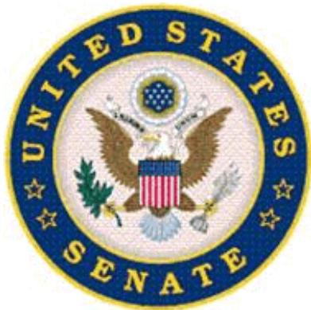

# SELECT COMMITTEE ON INTELLIGENCE

UNITED STATES SENATE

Additional Prehearing Questions for Dennis C. Blair upon nomination to be

Director of National Intelligence

# QUESTION 1:

Explain your understanding of the responsibility of the Director of National Intelligence (DNI):

• As the head of the Intelligence Community (IC);

• As the principal adviser to the President, the National Security Council, and the Homeland Security Council for intelligence matters related to the national security; and

• In overseeing and directing the implementation of the National Intelligence Program.

Answer: As head of the intelligence community, the DNI not only develops policies and procedures to guide the work of U.S. intelligence agencies, but oversees their performance to ensure compliance with these policies and procedures. His ultimate objective, pursuant to the Intelligence Reform and Terrorism Prevention Act, is to create a unified intelligence effort at the national level that is both effective and efficient. A significant part of this responsibility also includes representing the interests and positions of the intelligence community to the outside world, including the rest of the Executive branch, the Congress, foreign governments, and the public.

As principal intelligence adviser to the President, the DNI is the official who ensures that the President and his senior policy advisers receive the substantive intelligence support they require to carry out their responsibilities. This entails keeping them apprised of current, ongoing developments around the world: having intelligence analysis prepared to meet their daily needs, preparing longer-term assessments to support their policy decisions, and responding to whatever questions they may have about the intelligence they have received. In short, the DNI, as the official who is the head of the entire intelligence community, including both its collection and analytical capabilities, serves as the President’s focal point for the

provision of substantive intelligence. This responsibility also entails providing the President and his senior advisers information and insights to assist their decision-making on matters of secret policy or covert action.

The DNI’s responsibility for overseeing and directing the implementation of the National Intelligence Program (NIP) entails building the NIP and monitoring the activities undertaken by elements of the intelligence community to ensure that appropriated funds are, in fact, allocated and spent in accordance with the National Intelligence Program budget, and that they are achieving their objectives. Should elements of the community wish to allocate and spend funds that have been appropriated for a different purpose, the DNI must approve such transfers or reprogrammings in accordance with applicable law. If the DNI should find that appropriated funds are not being allocated or spent as provided by the National Intelligence Program, it is his responsibility to address such failures with the head of the department or agency concerned, and, if a suitable resolution of the matter cannot be found, to elevate the matter to the President.

# QUESTION 2:

A. Explain your understanding of the role of the DNI in overseeing elements of the IC that reside within various departments of the federal government.

Answer: I see the principal oversight responsibility of the DNI for the elements of the intelligence community as ensuring that the whole is greater than the sum of its parts. I do not envision the DNI second-guessing operational decisions made by the agencies, so long as they are consistent with law and applicable policies, nor do I envision the DNI attempting to evaluate how well elements of the intelligence community are serving their own parent organizations, although he should be alert to opportunities to assist them, especially through the budget process, in performing their functions. The DNI’s focus should be on how well they are combining their skills on the most significant intelligence challenges that confront the national intelligence effort as a whole.

In addition to the general oversight role given the ODNI, the DNI is given specific authorities by law to guide elements of the intelligence community– most of whom reside in other government departments –for the overall

effectiveness of the national intelligence effort. For example, the DNI provides budget guidance to these elements and ultimately approves and presents a consolidated budget to the Congress. He is also authorized to provide budget guidance for any element of the intelligence community that is not in the National Intelligence Program. He must approve all transfers and reprogrammings of appropriated funds; he also has authority to propose transfers of personnel among intelligence agencies. He is entitled by law to be consulted with respect to the appointment of heads of intelligence agencies.

B. What issues have you become aware of through your general observation, professional experience, or through your preparation for your confirmation, with respect to the role of the DNI in overseeing intelligence elements of the Department of Defense? What is your understanding of the issues and how would you approach them if confirmed?

Answer: It has been my experience that the conflict between military and national intelligence is exaggerated by many. The President, who is the primary policy maker, is also the commander in chief. He needs the best possible intelligence support in making policy choices, and the troops he commands need the best possible intelligence support once he commits them to combat in support of his policies. When I was a military commander, it was extremely important for me that the policies under which I was ordered to conduct military operations were realistic and based on good intelligence. The Iraq war has demonstrated vividly the penalty that the armed forces pay when the policies are not informed by good intelligence. Conversely, once troops are committed by the nation to combat under the decisions of the President and the Congress, it is vital that they have excellent tactical level intelligence support. The success of the recent surge operations in Iraq owe as much to good intelligence as they do to the additional troops that were deployed, and the success has had profound benefits for the United States at the strategic level.

The issues that often arise between the demands of military operations and of other intelligence requirements have to do with the capacity of collection systems and with assignment of analysts. Sometimes multi-purpose collections systems for signals and imagery intelligence do not have the capacity to handle all requirements. Sometimes analysts are taken from one area and assigned to another. It is incorrect always to characterize these priority-based decisions as conflicts between military and national requirements. They are rather the

decisions that have to be made by the intelligence enterprise of a global power that needs good intelligence in many different areas of the world and for many different potential threats.

The law provides the DNI significant authority when it comes to engaging with elements of the intelligence community, including those in the Department of Defense. It also specifically provides that he will participate in the development of the annual budgets for the Military Intelligence Program. If confirmed, I intend to exercise these authorities fully. I believe my background suits me well to guide the intelligence community to satisfy the many requirements on it, from both policymakers and tactical front-line troops and other officials.

C. What issues have you become aware of through your general observation, professional experience, or through your preparation for your confirmation, with respect to the role of the DNI in overseeing intelligence elements of other departments of the United States government? What is your understanding of the issues and how would you approach them if confirmed?

Answer: The DNI's challenge in overseeing the activities of intelligence elements in other departments and agencies is to integrate their efforts. Most of the elements outside of the Department of Defense are analytical elements that serve their parent departments. It is the DNI's responsibility that these elements have access to all the intelligence that can support their department in its mission. For example, the Department of Homeland Security Office of Intelligence and Analysis has no intelligence collection capability, so the DNI must ensure that adequate collection from other agencies is directed to satisfying its requirements. By the same token, intelligence elements in different departments have analytical skills that can help other departments and address larger national intelligence questions. It is the DNI's responsibility to ensure that the nation's intelligence enterprise operates as an integrated team.

D. Are you aware of any DNI’s authorities that have not been used or used sufficiently? In your opinion, could the DNI’s authority be exercised more fully? If so, please describe in what way.

Answer: I have read comments in the press that some believe the prior two incumbents of the DNI’s position have not fully exercised the authorities provided them by the 2004 law. I do not know whether those comments are accurate. Indeed, I am aware that my predecessors made progress in several areas, including security clearances and personnel management. In addition, I know that achieving the objectives of legislation as far-reaching as the IRTPA of 2004 is the work of many years. I can only say, if confirmed, I intend to exercise fully the authorities of the DNI’s office in order to accomplish its mission. If those authorities should prove inadequate, then I will ask the President and Congress to strengthen them.

# QUESTION 3:

A. Do you believe additional legislation is needed to clarify or strengthen the authorities and responsibilities of the DNI with respect to the IC?

Answer: Unless and until I am confirmed and have undertaken to exercise these authorities, I do not feel able to give an informed response to this question. If confirmed, I will advise the President and the Congress if I conclude these authorities need to be strengthened.

B. Do you believe new or revised executive orders are needed to clarify or strengthen the authorities and responsibilities of the DNI with respect to the IC?

Answer: The revisions to Executive Order 12333 were issued this past July, and more time is needed to assess whether further changes are necessary or desirable.

C. If confirmed, what will be your priorities, process, and goals in completing the policies, guidelines, and procedures necessary to fully implement the newly revised Executive Order 12333? In answering this question, please identify and discuss the most important issues that you believe need to be addressed with respect to the implementation of Executive Order 12333.

Answer: The revised Executive Order 12333 requires the DNI to issue implementing guidance in a number of significant areas. The most important are provisions that go to the core of the intelligence business, e.g. setting objectives, priorities, and guidance for collection, processing, analysis, and dissemination (para. 1.3.b.1); guidance with respect to how intelligence is provided to, or accessed by the Intelligence Community (para. 1.3.a.2); and guidance concerning the deconfliction, coordination, and integration of intelligence activities (para. 1.3.b.20 and 21). I also see guidance concerning the functional managers and mission managers (para. 1.3.b.12) as extremely important to the community’s efficiency and effectiveness. If confirmed, I will focus immediately on these areas to satisfy myself that we have adequate implementing guidance in place.

# QUESTION 4:

A. Explain your understanding of the obligations of the DNI under Sections 502 and 503 of the National Security Act of 1947.

Answer: The basic obligation imposed by section 502 of the National Security Act of 1947 is to keep the two intelligence committees “fully and currently informed” of all U.S. intelligence activities (excepting covert actions that are covered in section 503), including “significant anticipated intelligence activities” and “significant intelligence failures.” This section clearly contemplates that the committees will be notified of all “significant” intelligence activities before they are undertaken. These obligations are conditioned by the opening phrase in this section that says “to the extent consistent with due regard for the protection from unauthorized disclosure of classified information relating to sensitive sources and methods or other exceptionally sensitive matters.” I interpret this phrase to provide the DNI with a degree of latitude in deciding how (not whether) he will bring extremely sensitive matters to the committee’s attention. In such cases, it may be prudent to begin by notifying the leaders and staff directors of the intelligence committees and attempt to reach an accommodation with them in terms of how and when the committee as a whole should be brought into the matter in question. Section 502 also requires the DNI to furnish the intelligence committees any information or material in his custody or control that the committees request in order to carry out their responsibilities.

Similar obligations are imposed upon the DNI where covert actions are concerned by Section 503 of the National Security Act of 1947. He is charged with keeping the committees “fully and currently informed” of all covert actions that may be undertaken by elements of the U.S. Government, including any “significant intelligence failure.” He is also required to furnish the intelligence committees any information or material in his custody or control that the committees request in order to carry out their responsibilities. (Both obligations are conditioned by the same preambular language that is found in section 502.) Most of the obligations imposed by section 503, to include the approval of covert actions and reporting them to the two intelligence committees, run to the President rather than the DNI. As the principal intelligence adviser to the President, however, the DNI should be expected to advise him with respect to the exercise of these responsibilities.

B. Describe the responsibility of the DNI, or steps the DNI should take, to ensure that all departments, agencies, and other entities of the United States Government involved in intelligence activities in general, and covert action in particular, comply with the reporting requirements in those sections.

Answer: In addition to imposing obligations upon the DNI, sections 502 and 503 impose the same obligations on the “heads of all departments, agencies, and other entities of the United States Government involved in intelligence activities” to keep the intelligence committees “fully and currently informed” of both intelligence activities and covert actions they may be involved in. Thus, the statute imposes the obligation regardless of further direction or instruction from the DNI. Having said that, I think it is incumbent upon the DNI to promulgate community-wide policy that incorporates, and, where necessary and desirable, expands upon the language of these sections to ensure a uniform and consistent approach to the two intelligence committees throughout the intelligence community.

C. What lessons learned do you believe a new DNI should derive from the experiences of the last several years concerning the implementation of Sections 502 and 503, including the decisions not to brief the entire membership of the congressional intelligence committees on significant intelligence programs at their inception such as the Central Intelligence Agency (CIA) detention, interrogation and rendition program and the

National Security Agency (NSA) electronic communications surveillance program (often referred to as the Terrorist Surveillance Program or TSP)?

Answer: Although I have had no access to classified information relating to these matters, as I understand it the Bush Administration utilized the so-called “Gang of $8 "$ procedure (rather than notice to the full committees) to notify of the CIA’s rendition, detention, and interrogation programs, as well as the NSA’s Terrorist Surveillance Program. All of these programs involved sensitive collection activities rather than covert actions. The “Gang of $8 "$ notice is available pursuant to section 503 only where notice of covert action is concerned, and its use in these programs was not expressly allowed. I believe it is also the case that these programs were less effective and did not have sufficient legal and constitutional foundations because the intelligence committees were prevented from carrying out their oversight responsibilities. If I am confirmed, I will urge the President to limit the “Gang of $8 "$ notice procedures to covert actions of extraordinary sensitivity, as the law expressly allows.

D. Under what circumstances do you believe notification may be limited to the Chairman and Vice Chairman or Ranking Member of the congressional intelligence committees? In those circumstances, if any, what is the obligation of the DNI to notify subsequently the full membership of the committees as expeditiously as possible?

Answer: If confirmed, and if I have extremely sensitive collection activities to brief to the committee – activities, for example, which could involve the loss of life if disclosed – I would go to the leaders of the intelligence committees first, to discuss my concerns and how and when notice could prudently be provided to the entire committee.

# QUESTION 5:

A. What principles should govern future detention, interrogation and rendition practices and policies of the IC, and what changes should be made to current practices? In answering, include your understanding of the obligations of the United States under US law and international law, as applied to the IC, with respect to detention and interrogation of detainees and also with respect to access to them by the International Committee of the Red Cross.

Answer: I agree with the President-elect that Guantanamo has become a damaging symbol to the world and that it must be closed. It is a rallying cry for terrorists and harmful to our international reputation, so closing it is important for our national security. I agree with the President-elect that the guiding principles for closing Guantanamo should be protecting our national security, respecting the Geneva Conventions and the rule of law, and respecting the existing institutions of justice in this country. I also believe we should revitalize the efforts to transfer detainees to their countries of origin or other countries whenever that would be consistent with these principles.

I believe the U.S. Government has to have clear and consistent standards for treatment of detainees. Those standards must comply with the Detainee Treatment Act, the Convention Against Torture, and Common Article 3 of the Geneva Conventions. All who are responsible for treatment of detainees must receive training on those standards and training must be reinforced regularly. It is not enough to set a standard and announce it.. Regular reinforcement and oversight is necessary to make sure the standards are being applied correctly.

Any program of detention and interrogation must comply with the Geneva Conventions and the law, and there must be clear standards for humane treatment. The United States should not subject prisoners to treatment that we would consider unacceptable against our own people. That requirement should be uniform throughout the U.S. government.

I agree with the President-elect that the United States must not render or otherwise transfer anyone to a country unless we have credible assurances that they will not be subject to torture or other unacceptable treatment. The U.S. must take great care not only that we receive assurances but that those assurances are credible and will be complied with. The practice of rendition in some form can be an important tool, but if confirmed I would examine its use, consult, and make recommendations about how any rendition can be conducted consistent with the law.

B. Should there be uniform rules for military and intelligence interrogations? And if not, what differences do you believe would be justified?

Answer: Rules for detention and interrogation should be uniform throughout the U.S. government.

C. What is the appropriate use, if any, of contractors within the IC in the interrogation of detainees?

Answer: In view of the importance and sensitivity of interrogation operations, my preference would be for them to be conducted by a cadre of very skilled intelligence officials under clear guidance and supervision. I do not know the current practice, but, if confirmed, I will review it and ensure that the program is legal, effective and resourced correctly.

# National Security Threats

# QUESTION 6:

A. What are the principal threats to national security with which the IC must concern itself in the coming years?   
B. What is the nature of each such threat and what are the questions that the IC should address in its collection activities and assessments?   
C. In your opinion, how has the IC performed in adjusting its policies, resource allocations, planning, training, and programs to address these threats?

D. If not otherwise addressed, discuss your view of the appropriate IC roles and responsibilities with respect to the issues of climate change and energy security, and how well the IC has performed in these areas.

Answer: Based on my experience and background, the following is my current understanding of the principal threats to national security and opportunities to enhance national security. To understand how well the IC is addressing these threats and opportunities will take some time on the job to assess. If confirmed, I look forward to briefing the Committee on that assessment.

The Intelligence Community is charged with the task of assessing threats and providing timely warning. This Committee holds an annual hearing assessing threats, and, if confirmed, it will be my privilege to appear before you on that topic.

The United States is engaged in three campaigns in which there are immediate threats to American lives, properties and interests. First is the campaign against anti-American terrorists with global reach who seek to harm us or our allies, partners and friends. These groups include al-Qaeda and other extremist organizations as well as the groups they inspire but do not control. The second campaign is in Iraq and the third in Afghanistan, where the United States has deployed troops, diplomats, and nation builders. Providing intelligence support for these three campaigns consumes the largest share of Intelligence Community resources.

The day-to-day demands for tactical intelligence for these missions, geographically concentrated in Southwest Asia, cannot be allowed to crowd out the mission of building a deeper understanding of the complicated interlocking dynamics of the entire region, from Kashmir to Istanbul. We will need that understanding as we forge a strategy for the region.

Additional near-term issues of concern are many. They include North Korea’s nuclear weapons and missile programs; Iran’s nuclear capabilities and intentions, as well as its missile program; the security of Pakistan’s nuclear arsenal; and peace and stability in South Asia. They include Israeli-Palestinian violence, with its possibilities for escalation, and its implications for regional stability.

Many important threats to American national security go well beyond the traditional nation-state-based threats of the past. The intelligence services need to have open minds, change traditional ways of thinking and be bold and creative in identifying possible threats to the nation. It is the responsibility of the intelligence services to penetrate and understand these new transnational threats just as thoroughly as we did the Soviet Union in the days of the Cold War.

In addition to anti-American terrorists with global reach, our adversaries include organizations –some nation states, some private and some criminal –that proliferate weapons of mass destruction and the means to deliver them.

They include organizations trafficking in drugs.

They include those using the global communications system to learn our secrets and proprietary information to compete with us or attack us.

There are additional trends that affect American security, and may pose grave dangers – global warming, energy supplies, food prices, and pandemic diseases, among others.

Today's threats to American interests are more diffuse, more fast-paced and seem more urgent than ever because of the trends of globalization –worldwide transportation, worldwide information systems, the spread of scientific and technical knowledge, an interlocking global economy, and the ubiquitous and incessant news cycle. The intelligence agencies must look beneath the breathless headlines to understand the facts and their significance for American interests.

The Intelligence Community also needs to address the longer-term geopolitical challenges. How the United States adjusts to and manages the growing power and influence of China, India, and key countries in the developing world is a major long-term challenge for policymakers. The Industrial Revolution caused a centuries-long shift in power to the West; globalization is now shifting the balance again. The Global Trends 2025 report is one example of the Intelligence Community’s contribution to this discussion.

Failing states pose another set of challenges. Countries without effective governments, with internal economic disparities, and with domestic religious, ethnic, or tribal tensions can slip into anarchy, with tragic consequences for their own citizens, and with potential dangers to other countries. Somalia is one example, among many.

The Intelligence Community has global responsibilities. We need to understand better the interplay of trends, threats and opportunities in Latin America and Africa, so that our leaders can forge wise policies and take effective actions as the importance of these regions increases.

Identifying opportunities as well as threats is an extremely important balance for intelligence agencies to strike.

While the United States must hunt down those terrorists who are seeking to do us harm, the Intelligence Community also needs to support policymakers who are looking for opportunities to engage and work with Arab and Muslim leaders who are striving for a progressive and peaceful future for their religion and their countries;

While the United States must understand China's military buildup - its extent, its technological sophistication and its vulnerabilities - in order to offset it, the Intelligence Community also needs to support policymakers who are looking for opportunities to work with Chinese leaders, who believe that Asia is big enough for both of us, and can be an Asia in which both countries can benefit as well as contribute to the common good;

While the United States needs to understand Russia's military plans and ambitions in what it calls its "near abroad," the Intelligence Community also needs to help policymakers understand the dynamics of European security issues including the actions of our allies and friends, in order to craft policies that will support American objectives.

While the United States must identify weak places in worldwide medical surveillance systems and prepare for pandemics, the Intelligence Community can also find opportunities to work with governments and other organizations on behalf of our common interest in strengthening the world's early-warning, defensive and recovery systems;

While policymakers need to understand anti-American leaders, policies and actions in Iran, the Intelligence Community can also help policymakers identify and understand other leaders and political forces, so that it is possible to work toward a future in both our interests;

While traditional friends of the United States disagree with individual American policies on specific countries and issues, the Intelligence Community can also help policymakers identify the many government leaders and influential private leaders –in Europe, in Asia and elsewhere – who share American ambitions for the future and are willing to work together for the common good.

Identifying these opportunities for American policy and statecraft is as important as predicting hostile threats.

There is a final cluster of subjects on which intelligence agencies must provide good advice to policymakers and officials taking action:

Science and technology developments – where is innovation taking place around the world, and how can it help or hurt American interests?

Economics and finance – how is power being redistributed, and what are the developments that will make a difference to the United States?

For these areas, and also for many of the others outlined here, the analysts and information in our intelligence agencies are not the sole, and often not the best, resources. Private organizations –businesses as well as consultants – think tanks, NGOs, universities, national labs, federally funded research and development centers, other government analysts and similar international and foreign centers have a great deal to offer. Policymakers will rightly expect U.S. intelligence to help cover fast-breaking events in these areas, however, as well as the related intentions and actions of foreign governments.

# Challenges Facing the Intelligence Community

# QUESTION 7:

Apart from national security threats discussed in answer to Question 6, what do you consider to be the highest priority management challenges facing the IC at this time? If confirmed as DNI, what will you do, specifically, to address these challenges?

Answer: High priority management challenges include moving beyond coordination to integration of intelligence operations, ensuring that intelligence resources are prioritized against our most important intelligence needs, investing in and rewarding innovative use of technology, and ensuring a quality workforce.

If confirmed, I will:

o improve cooperation between members of the IC, develop and implement policies to achieve key objectives, including information sharing, and take other appropriate steps to move beyond coordination to integration of intelligence operations;   
o ensure that there is an appropriate balance of intelligence resources to meet the needs of national, military, homeland defense and other departments and agencies;   
o position the Intelligence Community to take advantage of cutting-edge innovation by improving how the IC adjusts to the dynamic information environment and by working to maintain needed levels of research and development funding in the National Intelligence Program; and   
o ensure that the IC has a high-quality workforce through effective recruitment, retention, training, and efforts to make the workforce diverse in the broadest sense of the word—in background, culture, gender, ethnicity, age, and experience.

# Office of the Director of National Intelligence

# QUESTION 8:

There has been considerable debate in the Congress concerning the appropriate size and function of the ODNI. The Congress has considered proposals to cap the size of the ODNI. In answering this question, please address the staff functions of the ODNI and the specific components of the ODNI, where appropriate, such as the National Counterterrorism Center.

A. What is your view of the ODNI’s size and function?

Answer: Unless and until I become DNI, it is impossible for me to evaluate the whether the size of the DNI’s staff should be changed. The organization, responsibilities and size of the ODNI staff will be priority issues for me, if I am confirmed. I will be looking to see that the ODNI staff is helping me manage the intelligence community by setting objectives and monitoring their achievement, not duplicating or micromanaging the activities of the intelligence agencies. I will be looking to see that it is concentrating on the areas in which intelligence agencies must be integrated to produce better intelligence.

B. Do you believe that the ODNI has sufficient personnel resources to carry out its statutory responsibilities effectively?

Answer: Unless and until I am confirmed, and have had the opportunity to assess the question of personnel resources in the ODNI, I am in not in a position to offer a judgment. If confirmed, I will want to consult with this Committee about my assessment of this issue.

C. In your view, what are the competing values and interests at issue in determining to what degree there should be a permanent cadre of personnel at the ODNI, or at any of its components, and to what degree the ODNI should utilize detailees from the IC elements?

Answer: In my view, the staff of the DNI needs a mix of career employees and detailees from the elements of the intelligence community. A portion should be career employees of the DNI, who can provide continuity over many years, without favoring one particular agency or point of view over another. At the same time, the ODNI needs employees detailed from agencies within the community who are intimately familiar with the workings and policies of their parent agency. This is particularly true with respect to the “centers,” e.g. the National Counterterrorism Center, that comprise a substantial part of the ODNI. It is also important for agency employees to gain the wider perspective that comes from working at the ODNI level.

D. If confirmed, what approach would you take to any further reorganization, or assignment of responsibilities, with respect to the staff functions of the ODNI?

Answer: I have ideas of how big organizations work and are organized based on my own experience. However, before making any changes, I would want to review the current organization, talk to those who are in the jobs now, consult with former intelligence officials, perhaps bring in outside consultants, and take advantage of the expertise of this committee.

# QUESTION 9:

A. Describe your understanding of the role played by mission managers in the IC since the enactment of the Intelligence Reform and Terrorism Prevention Act of 2004 (IRTPA).

Answer: The authority for mission managers derives from the IRTPA, which states that the DNI shall “determine requirements and priorities for, and manage and direct the tasking of, collection, analysis, production and dissemination of national intelligence by elements of the intelligence community.”

Intelligence Community Directive 900, which governs the establishment and roles of mission managers, describes their role broadly as “the principal IC officials overseeing all aspects of national intelligence related to their respective mission areas.” I believe strongly in mission-based organization, bringing together officials with different skills to integrate their efforts to achieve a clear goal.

The DNI has established the following mission managers: counter-terrorism (who also serves as the director of the National Counter-Terrorism Center);

counter-proliferation (who also serves as the director of the National CounterProliferation Center); counter-intelligence (who also serves as the National Counter-Intelligence Executive); Iran; North Korea; and Cuba/Venezuela. I look forward to in-depth briefings from each of these mission managers.

In short, a mission manager identifies analytic gaps against a specific target and works with the collectors to implement collection strategies to fill those gaps.

o A mission manager determines what we need to know; and then figures out how we get it.   
o Mission managers are also responsible for ensuring that intelligence is disseminated and shared across the IC and the broader policymaking community.

I have served as an outside advisor to Ambassador Joseph DeTrani, mission manager for North Korea and, consequently, have gained some insight into the mission manager framework.

Based on that experience, as well as some informal discussions I have had, my impression is that the mission manager system has been a useful framework for integrating the tasking of collection in certain key areas.

o The purpose of the 2004 law was to empower the DNI to bring all of the “INTs” around the table and ensure that collectors were not merely de-conflicting operations but, in fact, coordinating their work, collaborating on how to prosecute a target, and working to fill analytic gaps identified by policymakers.   
o I recognize that this is a challenge because, despite the broad mandate envisioned in the 2004 law and ICD 900, mission managers do not have chain-of-command authority over the collection assets. Successful mission management requires in-depth knowledge of the target, strong backing from the DNI and the heads of the agencies, and the ability to work collaboratively across the IC.

B. If confirmed, what questions would you ask of the existing mission managers and members of the IC to assess the performance of the mission manager system?

Answer: I would ask the mission managers the following questions:

a. Have you been able to drive a collection strategy against your target? If not, what obstacles do you face?   
b. Do you play a role in the allocation of budget and resources against your target? If not, what authorities would you recommend be given to your office?   
c. Do you receive clear guidance from policymakers about analytic gaps? How can this process be improved?   
d. What collection capabilities do you wish the IC had that would contribute to a richer understanding of your target?   
e. Are you making sufficient use of open source intelligence?   
f. What obstacles, if any, are you facing in the dissemination of intelligence in your mission area? Have we moved from a “needto-know” culture to one that fosters a “duty-to-share”?

I would ask the IC the following questions:

a. Has the mission manager helped fill analytic gaps?   
b. Has the mission manager enhanced coordination of collection?   
c. Ha the mission manager enhanced dissemination of relevant intelligence to you?   
d. What recommendations, if any, do you have to strengthen missio management?

C. Are there any particular subjects that you believe would benefit from the appointment of an additional mission manager?

Answer: If confirmed, I will assess the current set of mission managers and determine whether additional ones are required. I would welcome the opportunity to consult with the Committee about that assessment.

# QUESTION 10:

A. Explain your understanding of the responsibilities of the following officers:

The individual assigned responsibilities for analytic integrity under Section 1019 of the Intelligence Reform and Terrorism Prevention Act of 2004 (IRTPA)

Answer: Analytic integrity is one of the linchpins to improving the quality of analysis. It is important to have an official working this issue full time, but the ultimate responsibility lies with the DNI, and, if confirmed, I will accept this responsibility fully.

This official has overall responsibility for working with all IC analytic components to ensure that intelligence products are timely, accurate, free of political bias, objective, relevant to policymaker requirements, and drawn from all appropriate sources of intelligence.

This official also helps ensure that finished intelligence products clearly explain the sources upon which the judgments are based – identifying, as specifically as possible, the quality and reliability of the underlying reporting, any counter-intelligence concerns about the sources, and any caveats, dissents, or gaps in the judgments. This official also ensures the products distinguish between intelligence and assumptions and, where appropriate, include “red-team” analysis, or alternative views.

o The ongoing and annual review responsibilities of this official are outlined in Section 1019 of the IRTPA. I look forward to a comprehensive briefing on how this process has worked, as well as feedback from consumers – including Members of the Committee – as to whether these practices have yielded more reliable and useful analysis.

The individual assigned responsibilities for safeguarding the objectivity of intelligence analysis under Section 1020 of the IRTPA

Answer: This “analytic ombudsman” plays a critical role in guarding against the politicization of intelligence.

o Under the IRTPA, this individual is empowered to initiate inquiries into “real or perceived problems of analytic tradecraft or politicization, biased reporting, or lack of objectivity in intelligence analysis.” The inscription on the wall of the Old Headquarters Building of CIA quotes scripture: “And ye shall know the truth, and the truth shall make you free.” Speaking “truth to power” is the solemn duty of every intelligence officer. If confirmed, I will vigilantly protect the objectivity of our intelligence.

• The General Counsel for the Office of the DNI (ODNI)

Answer: As the chief legal officer of the ODNI, this official assists the DNI in ensuring that all ODNI practices comply fully with the Constitution and laws of the United States, as well all relevant Executive Branch regulations, orders, guidelines, and policies.

o This official plays a critical role in developing directives and policies for the IC and for working with the General Counsels at all IC components to ensure that intelligence operations of the United States are in full compliance with all legal obligations.

The fact that Congress required this position to be appointed by the President and confirmed by the Senate indicates the enormous responsibility that the GC shoulders in ensuring legal oversight of the IC.

o Under the National Security Act of 1947 (as amended), the President is required to keep Congress “fully and currently”

informed of all intelligence activities. In advising the DNI, who in turn advises the President, the GC must be vigilant in ensuring that the Administration’s statutory reporting obligation is strictly followed.

o To fulfill this role, the GC should have visibility into any IC activity that implicates Constitutional, legal, or regulatory equities.

• The Inspector General for the ODNI

Answer: This official is charged with several critical responsibilities: to audit and investigate the ODNI; to advise the Director on any deficiencies, abuses of power, evidence of fraud or mismanagement, or other wrongdoing; to provide reports on his or her findings; to promote integrity and effectiveness of ODNI activities; and to keep Congress informed of such findings.

o If confirmed, I will rely heavily on the Inspector General to help me ensure that ODNI is performing its mission effectively and free of waste, fraud, and abuse.   
o I will also use the Inspector General to evaluate the processes and functioning of the ODNI looking for ways to improve effectiveness, morale and productivity.

B. For each of these officers, what would be your expectations and what questions would you ask as DNI to ensure that each officer is performing the mission required by law?

Answer: In addition to the expectations outlined above, I would ask these officers the following questions:

a. The individual assigned the responsibility for analytic integrity and objectivity –

i. What are the results of your efforts to establish analytic standards within the community?

ii. What obstacles, if any, have you encountered in ensuring analytic integrity across IC components?

iii. How can ODNI strengthen analytic integrity?

iv. How do you assess the quality of analysis? Do you measure feedback from policymakers, including Congressional officials?

v. Have you seen evidence of “politicization of intelligence?” If so, where? How have you worked to mitigate this problem?

b. The General Counsel –

i. Are you aware of any intelligence activities that have not been properly reported to Congress?

ii. Is your process for communicating regularly with the GCs of other IC components functioning well; how might it be improved?

iii. Are there any areas of ODNI or IC governance that require additional clarity through written IC Directives or other policies?

iv. What obstacles, if any, are you experiencing in gaining visibility into intelligence activities that implicate constitutional, statutory, regulatory, or other legal equities?

c. The Inspector General –

i. What are your principal findings with respect to any audits or investigations completed by your office to date?

ii. What recommendations, if any, have been made by your office to the previous DNI, and what were the results of those recommendations?

iii. Do you believe you have sufficient authority to achieve the objectives of promoting accountability, efficiency, and effectiveness of the ODNI?

# QUESTION 11:

The Congress approved legislation to create a statutory, Senate-confirmed Inspector General of the Intelligence Community in the Intelligence Authorization Act for Fiscal Year 2008, which did not become law as a result of a presidential veto. Do you support establishing in law an independent, fully empowered Inspector General for the Intelligence Community?

Answer: If confirmed, I will need some time to answer this question. I would not want to add an additional unnecessary layer of bureaucracy on top of a system that is functioning adequately. On the other hand, there may be some merit in a coordinator of the efforts of inspectors general across the intelligence community for issues that are larger than a single intelligence agency.

# QUESTION 12:

A. Describe the role of the Joint Intelligence Community Council (JICC) in assisting the DNI in his responsibility to lead the IC.

Answer: Established in the Intelligence Reform and Terrorism Prevention Act, the JICC is an advisory council made up of the DNI’s major partners and customers, the Secretaries of Defense, Homeland Security, State, Energy and Treasury, and the Attorney General. The Council is to meet regularly to advise the DNI on requirements, budgets, financial management and performance of the Intelligence Community. There is also a provision ensuring that dissenting views from members of the Council are presented to the President or the NSC along with the DNI’s recommendation, when it is presented in his role as Chairman of the JICC.

B. In your understanding has this mechanism been useful in assisting the DNI and should the manner in which it is used be improved?

Answer: I am not privy to how the JICC was used by the first two DNIs. On the face of it, a forum where the DNI can hear from his key customers about their intelligence requirements, and their assessments of how well the Intelligence Community is meeting their needs, seems to serve a useful function.

C. Explain the types of issues on which you would seek JICC assistance, should you be confirmed as DNI.

Answer: If confirmed, I would use the JICC as I believe the statute intended, to solicit cabinet-level advice on strategic programmatic or policy decisions that affect multiple departments. I would also expect its members to use this forum to keep me apprised of emerging intelligence requirements that need to be factored into the intelligence planning and programming processes.

However, it has been my experience that the intelligence community cannot rely simply on periodic meetings of a high-level council like the JICC to ensure it is working on the right intelligence questions. The IC must be in continual contact in many ways and at many levels with policymakers and their staffs and with frontline officials alike to ensure that it understands their intelligence needs and is meeting them.

# Cyber Security

# QUESTION 13:

The Bush Administration has launched a major initiative to improve government cyber security, the Comprehensive National Cybersecurity Initiative (CNCI), with a prominent role for the IC.

A. Do you believe that the CNCI should continue under the new Administration?

Answer: I am not familiar with the details of the CNCI, as it is a highly classified program. If confirmed, I plan to be briefed on the program as a matter of priority.

Based on my experience in government, I strongly support efforts to strengthen the defense of government networks. This is an urgent task, as nearly everything we do as a government and, in particular, as an intelligence community requires integrity of our networks, particularly our classified

networks. DNI McConnell and the IC deserve great credit for bringing attention to this task and leading a cross-governmental effort to address it (the Comprehensive National Cybersecurity Initiative (CNCI)).

President-elect Obama has identified cyber security as a priority for his administration. I agree with the President-elect that countering the cyber threat requires a coordinated strategy from the federal government and one that includes the private sector, which owns and operates the vast majority of the nation’s critical infrastructure. If confirmed, I will work closely with the heads of departments and agencies to implement a comprehensive national cyber strategy. Also, I believe there is an important role for government to play in working with the private sector to safeguard private or commercial networks in accordance with the Constitution and applicable laws.

B. What are the major privacy or civil liberties issues concerning the CNCI that you would address?

Answer: I have not had the opportunity to review the CNCI in detail because of its highly classified nature, nor have I had the benefit of a review of the major privacy and civil liberties issues involved in CNCI. Therefore, I am not in position to comment on the privacy and civil liberties issues in an informed way. If confirmed, I will make it a priority to learn about CNCI and privacy and civil liberties issues, and consult with the Committee.

Any cybersecurity initiative must be conducted pursuant to the Constitution and applicable laws. Any cybersecurity initiative that involved government monitoring of personal data or activity on the internet requires a solid legal basis and strict oversight. Any activities undertaken by the IC in this realm should be carefully reviewed by the Department of Justice for their legal basis.

C. What changes to the CNCI and the DNI’s role within it would you recommend that the Administration consider?

Answer: The Intelligence Community plays a vital role in providing support (technology, information) to those charged with protecting the nation’s critical infrastructure, and a leading role in cyber counterintelligence operations.

I look forward to participating in the further development of a national cyber strategy that builds on the CNCI, engages all stakeholders, and lays out a cyber governance structure with clearly defined roles and responsibilities. If confirmed as DNI, I am prepared to and will support that strategy and its implementation.

D. What should be the IC’s role in helping to protect U.S. commercial computer networks? What cyber threat information (classified or unclassified) should be shared with managers of the Nation’s critical infrastructure to enable them to protect their networks from possible cyber attack?

Answer: The Intelligence Community can play a critical role in identifying malicious activity on commercial networks and in working with the private sector to develop defenses to activity that threatens the integrity of those private networks.

Americans rely on the private networks to facilitate banking, the delivery of essential services, such as health care, and for both business and personal communications. Our military and government entities also rely, to a large degree, on private networks.

In my view, protecting these networks requires robust sharing and cooperation with the private sector. Since most critical infrastructure sectors are privately owned and operated, the government has a great deal to learn from them. Their sensitive business data must be protected and the government should provide warning and other intelligence that can assist them in protecting their networks. By the same token, the intelligence community has developed knowledge and tools for computer network defense that may be useful to the private sector, and should share them to the extent it can.

If confirmed, I will be better positioned to offer concrete recommendations about what information can be shared with the private sector, once I have had an opportunity to be briefed on this matter.

# QUESTION 14:

A. If confirmed, how would you improve the cyber security of IC systems?

Answer: The security of IC systems is a subject best left for discussions in a classified setting.

Because of the highly classified nature of this subject, I am not familiar with the operational details at this time.

I can assure the Committee, that, if confirmed, I will make review and study of this issue a top priority.

B. What are your top priorities for cyber security reforms within the IC in your first 100 days?

Answer: If confirmed, I would like an opportunity to provide a more robust and comprehensive answer to this question after I have had an opportunity to review and study the IC cyber security program.

I look forward to detailed consultation with this Committee regarding the results of that review and plans for reform.

# Science & Technology and Research & Development

# QUESTION 15:

A. How do you assess the state of science and technology (S&T) activities within the IC?

Answer: Science and Technology (S&T) activities are having a positive impact on operations and are generating innovations of lasting value for the IC, but questions remain about whether these activities are being funded at an adequate level and whether they are as effective as they can be.

I am encouraged by the creation of IARPA, which addresses the community’s fundamental need to have a source of revolutionary research.

B. What have you done in the past to improve S&T management?

Answer: For the intelligence community, information technology is the most important part of S&T. I have found that the best way to find the most promising technological advances in this area is through experimentation and close contact between the S&T community and the users in the field. I spearheaded the development of joint tactical information systems through experimentation when I was in senior positions in the armed forces, and I think many of the concepts of experimentation used in those projects are relevant to the needs of the IC.

C. If confirmed, how do you intend to improve S&T activities in the IC and improve recruiting and retention of the best available S&T talent?

Answer: If confirmed, I will ensure that the S&T arm of the IC has an appropriate role in major budget and planning decisions, ensure an appropriate level of funding and manpower for S&T activities, emphasize cross-agency S&T activities, and look into the effectiveness of current mechanisms for interacting with the most innovative and advanced companies in the private sector.

To improve recruiting and retention of the best available S&T talent, I will look into developing better career planning programs and expanding existing programs like the DNI S&T Fellows Program.

D. What are your top priorities for S&T reforms in your first year in office?

Answer: If confirmed, my top priorities for S&T reforms are ensuring S&T has an appropriate role in major budget and planning decisions, ensuring adequate funding for S&T activities with a particular focus on IARPA, initiating an experimentation ethos in the S&T community, setting up a system to assess what is working and what is not so that resources can be directed to the most promising programs and improving how technology is transitioned into operations.

E. What qualities are most important to you in your top S&T official, the legislatively mandated Director of Science & Technology, and what role and priorities would you assign to this S&T leader?

Answer: If confirmed, I would look for a strong technical background, a track record of creative use of technology, and proven leadership and communication skills in selecting a Director of Science and Technology. Experience working within and across the IC’s S&T enterprise would also be desirable.

I would expect this S&T leader to function as my senior advisor on S&T matters, to serve as the voice of the S&T community at the most senior levels, to take a hard look at the successes and failures of S&T in recent years, and to focus on enhancing the ability of agencies to carry out S&T activities, both in support of their own unique missions and as part of an Intelligence Community S&T enterprise.

# QUESTION 16:

The Committee has been clear in its recommendations for increased IC research & development (R&D) funding and in its support for the IC’s new R&D organization, the Intelligence Advanced Research Projects Activity (IARPA).

A. What is your philosophy of the role of R&D in the IC?

Answer: In my view, R&D should play an important role in efforts to strengthen the capabilities of the IC. R&D activities in the IC should be focused on unique needs and niches that are critical to the IC but are underfunded by other government agencies and the commercial sector.

R&D should focus on leveraging the explosive world-wide growth in technology and applying innovation to intelligence missions faster and more effectively than do our adversaries.

R&D needs to be a source of innovation for the entire Intelligence Community, supporting the nearer-term missions but also reaching out for game-changing developments that can revolutionize how the IC carries out its mission.

Based on the experience I have had with the Defense Advanced Research Projects Agency, the model for IARPA I would look at closely is the mechanism for transitioning promising IARPA initiative into operational systems. A demonstration project in IARPA does no good unless it moves into the hands of operators and analysts.

B. What are your top priorities with respect to R&D in the IC?

Answer: The intelligence community deals in information, and it is the information technology field that is the most dynamic, with computational capabilities increasing exponentially, communications bandwidth around the world exploding, databases multiplying and new information applications being developed by the millions, by both large teams and by individuals. The intelligence community needs to keep up with this field both to take advantage of it to gather intelligence, and to protect government information from new developments that could be used by our adversaries.

Space technology is also of continuing importance to the intelligence community, as satellites are becoming smaller and less expensive and more widespread. Again, the challenge is to take advantage of technology for American purposes, while understanding the threat that can be posed as others use it against us.

I believe the future of the Intelligence Community lies in the creative equipping of our collectors and analysts with information technology.

# QUESTION 17:

The Committee’s Technical Advisory Group (TAG), a volunteer group of nationally recognized national security S&T leaders, plays a key role in advising the Committee on high priority S&T issues every year. If confirmed, will you fully support Committee TAG studies and allow the TAG members to have access to the people and information throughout the IC that is required for their studies upon our request?

Answer: Yes. If confirmed, I will work closely with the Committee to support TAG studies. I am a great believer in the contributions made by patriotic

Americans who serve on advisory groups for government organizations. They simply want to help their government, and they bring tremendous knowledge and many ideas that can be of benefit to the IC.

# IC Missions and Capabilities

# QUESTION 18:

Explain your understanding of strategic analysis and its place within the IC, including what constitutes such analysis and what steps should be taken to ensure adequate strategic coverage of important issues and targets.

A. Have you had the opportunity to review long-range analysis recently produced by the IC and what is your view of such analysis?

Answer: Strategic analysis is an essential part of the National Intelligence mission.

The Intelligence Community has an important role to play in assisting policymakers by addressing longer-range developments and their implications for U.S. national security and foreign policy interests. The Intelligence Community can help identify issues and trends that may have gone unnoticed or are currently little appreciated.

Strategic analysis requires collaboration with outside experts, whose perspectives and insight add greatly to the work of all-source analysts within the Intelligence Community. Strategic analysis can help to place in context and give meaning to a set of events, and help the policymaker to formulate a coherent and long-term response. It can also foster further collection and analysis by an intelligence community that has been sensitized to be alert for possible trends and developments.

There are many topics that require the Intelligence Community’s attention to the longer-term. They include trends in the Islamic world; trends relating to terrorism and weapons proliferation; trends in science and technology, the rise of India, China and other emerging market economies; food security, energy security and environmental issues; and demographic issues. If confirmed, I will work to ensure an allocation of resources within the Intelligence Community so that strategic analysis is appropriately addressed.

My experience has been that strategic intelligence analyses need to strike a balance between simple straightlining of current trends on the one hand, and gamechanging but improbably discontinuities on the other. One of the tools that I have found to be very successful in striking this balance is the use of gaming techniques, in which experts play the roles of the leaders of different countries or other influential organizations. Often out of the results of games looking at future events can come a range of developments that will affect American interests, so that policymakers can test different strategies for their resilience.

B. What is your view of the initiative to produce unclassified analysis such as Global Trends 2025: A Transformed World?

Answer: It is my impression that the Global Trends 2025 report can be an important contribution by the Intelligence Community to policymaker deliberations. However, I will want to get a more detailed understanding of policymakers’ views of the Global Trends report. If confirmed, I would want to continue such periodic reports if policymakers found them useful.

# QUESTION 19:

A. Explain your views concerning the quality of intelligence analysis conducted by the IC.   
B. What is your assessment of steps taken by the ODNI, and the elements of the IC, to improve the quality of intelligence analysis within the IC, including through the creation of an Analytic Integrity and Standards Unit, the use of alternative analysis and “red teaming,” and the use of collaboration tools such as Intellipedia?   
C. If confirmed, would you pursue additional steps to improve intelligence analysis? What benchmarks will you use to judge the success of future analytic efforts by the ODNI and the elements of the IC?

Answer: Intelligence analysis requires timeliness, objectivity, and accuracy.

It must be independent of political considerations, and reflect the highest standards of analytic tradecraft and integrity. While intelligence analysis cannot be written to support pre-conceived policies, it must be relevant to the policy questions that the President and his national security team are facing, and it must help policymakers forge good policies. If confirmed, I will work to uphold and meet these high standards.

It is my understanding from public sources that the DNI, through the Office of Analytic Integrity and Standards, has been promulgating IC-wide analytic standards, and has been involved in both the evaluation of analytic product, as well as assisting IC agencies conduct their own internal evaluations. In addition, it is my understanding that the DNI has made efforts to improve the ability of analysts to validate and evaluate of sources. I believe the DNI has an important role to play in establishing analytic standards and working to ensure that IC agencies meet them.

It is also extremely important for intelligence analysis to be directed toward answering the right questions. Busy policymakers rarely take the time to sit down to give detailed guidance to the IC as to the questions they really need to be answered. It is frustrating for intelligence analysts who are trying to support them, and the result often is the production of analysis that is not relevant or influential. The DNI and the IC need to use many approaches to identify the right questions so that the intelligence analysis is useful to the policymaker. It is much easier to identify the intelligence questions that need to be answered at the tactical action level, whether they come from tactical military units, counterterrorism teams in the field, diplomats involved in negotiations or DHS front-line officials. IC analysis for policymakers needs to be just as accurate in its aim as it is for tactical users in the field.

I share the view that alternative analysis and “red teaming” are powerful techniques to assist analysts in probing alternative interpretations of data, and thereby to provide richer analysis and a wider range of interpretations for the policy customer. They are important checks on tendencies toward “groupthink.”

The Office of the DNI also has an important role to play in fostering greater communication among analysts across the IC: the sharing of information, the exchange of analysis, and conversations that lead both to constructive collaboration among analysts as well as the clear articulation of analytic differences. Intellipedia, an online collaborative encyclopedia, and the beginnings of “A-Space,” an online collaborative environment for analysts, appear to be important developments in this regard, and I will want to evaluate the utility of these and other efforts to foster analytic communication.

If confirmed, I will work to uphold and meet the highest standards of analysis and analytic integrity. I will make it a priority to evaluate steps already taken to improve intelligence analysis. I will assess benchmarks and standards currently in place to evaluate the quality of analysis, and work to ensure that they measure the goals of timeliness, accuracy, relevance and objectivity.

# QUESTION 20:

A. Explain your views concerning the quality of intelligence collection conducted by the IC and your assessment of the steps that have been taken to date by the ODNI to improve intelligence collection.

Answer: If confirmed, a review of the quality of intelligence collection will be one of my priorities. I welcome consulting with this Committee after I have had the opportunity to review these sensitive programs with collectors, analysts and mission managers. I also intend to seek assistance in this review from outside advisors.

In an evaluation of collection, it is important to assess the community’s performance against the needs of decision-makers at all levels – tactical, operational and strategic, policy and action. The Office of the DNI has a process for mapping collectors’ capabilities against needs. This step is helpful for identify emerging gaps in the collection architecture and planning ways to address them.

Quality collection includes capacities for processing and exploitation, as well as communications systems for sending the collected data to users. Without careful management of these aspects of the collection process, investments in gathering more information may be wasted.

B. If confirmed, would you pursue additional steps to improve intelligence collection and, if so, what benchmarks will you use to judge the success of future collection efforts by the ODNI?

Answer: Yes. If confirmed, I will pursue additional steps to improve intelligence collection. I will not hesitate to use all of the authorities available to the DNI under the 2004 law, including the authority to “determine requirements and priorities for, and manage and direct the tasking of, collection … of national intelligence by elements of the intelligence community.”

The world we face in this century is a complicated, fluid one. The U.S. budget for national security is constrained, while threats are multiple and changing.

In a time of rapid technological change, finding ways to incorporate new technologies from the private sector into collection efforts will be very importan

Collection methods should be judged not only by the quantity of useful products generated, but also by their efficiency and agility in addressing shifting collection priorities.

Many of our collection systems serve many purposes – they gather information that is relevant to many different users of intelligence. An area of particular emphasis for me will be the way in which multipurpose systems are used to support multiple customers to ensure that we are covering the most important and the most requirements.

The DNI should help the IC develop sound, durable collection architectures that build synergies among the INTs, so that the whole becomes much more than the sum of its parts. That architecture requires resilience, flexibility and productivity against the most important targets, in the most cost-effective way.

The test, in the end, is not how much we are able to collect, but if what we collect – whether derived from open sources or secret ones – provides a critical edge for decision-makers at all levels.

Usefulness to policymakers will be the key metric of success in our collection efforts. While this is not as easy to measure as the satisfaction of the more granular and quantifiable requirements of tactical collection requirements, I believe that a close and continuing dialogue with the policymaker community can help us assess whether we are making strides in collection.

# QUESTION 21:

The National Intelligence Strategy of the United States of America was published in October 2005.

A. Do you believe the National Intelligence Strategy is in need of updating?   
B. If so, what areas do you believe are most in need of change, what would be the objective of those changes, and what actions will you take to accomplish those changes?

Answer: The current National Intelligence Strategy is a product of its time. It is rooted in President Bush’s National Security Strategy.

President-elect Obama will put his own stamp on national security strategy. For this reason, a new National Intelligence Strategy may be appropriate.

Much of the current strategy reflects challenges that will remain under the new Administration. If confirmed, my first step will be to determine how effectively the current strategy has been implemented, and what needs to be done to support the Administration’s national security strategy. Once I have a good understanding on these topics, I will be in a better position to consult with this Committee and craft appropriate policies and guidance for the Intelligence Community.

# QUESTION 22:

The ODNI has attempted several processes for conducting strategic planning. The most recent effort, “Strategic Enterprise Management,” could face the problems of inadequate information on program life-cycle costs and lack of full cooperation from IC elements.

A. If confirmed, what will be your approach to IC strategic planning? B. What do you believe are the most effective means for gaining acceptance for this approach from the individual IC elements?

Answer: The essentials of good strategic planning are quite simple, but difficult to accomplish well:

Where is the organization now in its ability to carry out its mission? Where should it be in four years? How do we get from here to there with the resources available?

Strategic planning in the IC begins with a realistic appreciation of current capabilities – are we doing our job to support both national security policymakers in Washington and front-line units that are carrying out those policies in the field? The next step is to form a vision of what the IC capability should be by the end of this administration's term in office. The vision begins with general concepts, but has to be translated to measurable capabilities. The third step is the development of a plan to achieve the future capabilities from the current status.

The development of a strategic plan is just the beginning. It is crucial to continually check progress against the plan, adjusting either goals or resources as experience is gained.

For a strategic plan to be effective, it must be formulated by those who will carry it out. For the IC, this means that the leaders of the intelligence agencies and organizations must be fully involved in all phases of its development and in the periodic reviews and adjustments in its realization. There is no substitute for devoting the time to personal efforts by the top leadership in meetings and off-sites. Once the plan is made, it is a contract between the leaders of the intelligence organizations and the DNI, and between the DNI and the President.

# QUESTION 23:

In addition to the answer you gave to Question 6(c), do you believe that IC funding is properly allocated among the various IC functions of analysis, collection, and covert action? If not, what changes would you consider making?

Answer: My knowledge of the contents of the National Intelligence Program is dated, so I cannot answer this question at this time. However, if confirmed, I will carefully review the composition of the NIP, with special attention to the question of the appropriate balance between collection and “downstream activities” such as processing, exploitation and analysis. The President and the NSC will make the appropriate determinations on covert action funding, although I will work with the Director of the CIA to ensure that all activities funded pursuant to covert action findings are achieving results commensurate with their cost and risk.

# QUESTION 24:

The ODNI has created a process known as the Intelligence Collection Architecture (ICA) as a way to guide future IC investment decisions. To date, the process has not led to major investment decisions terminating underperforming programs despite projected budget shortfalls.

A. What is your understanding of the main elements of the ICA?

Answer: I have not been briefed on the ICA, which is classified. As a general matter, I believe that the DNI should evaluate the full range of collection assets arrayed against global targets and, in coordination with agency heads, make the necessary decisions about which collection platforms require more resources or fewer resources, and which capabilities need to be developed or terminated.

B. What is your view of the effectiveness of the ICA process as an investment decision-making tool and are there any changes that you would make?

Answer: As I have not been briefed on the ICA, I am not able to evaluate its effectiveness. If confirmed, I will make it a priority to evaluate the ICA process, and consult with the Committee about my assessment.

C. What are your views on the best mechanisms for the ODNI in managing investment decisions concerning the IC’s major systems acquisitions?

Answer: Sound acquisition policy is vital to ensuring that we have the proper collection platforms for our near- and long-term intelligence requirements. Acquisition must be driven by our intelligence requirements (i.e., what do we want to know), taking full advantage of available off-theshelf solutions where possible, and turning to unique, custom solutions only where absolutely necessary.

In an era of fiscal constraint, these decisions must be made with an eye toward living within our means. This will require a careful sorting of the “must-haves” from the “nice-to-haves.”

Major programs require vigorous oversight. If confirmed, I will look to Congress as a key partner in major funding decisions based on the findings of its oversight work.

# Authorities of the DNI: Personnel

# QUESTION 25:

DNI McConnell requested legislation to enhance the authority of the DNI for flexible personnel management within the IC (See Section 303 of S. 2296, The Intelligence Authorization Act for Fiscal Year 2009). Explain your views of this legislation and whether you support its enactment.

Answer: If confirmed, I will want to review DNI McConnell’s requested legislation carefully before I take a position on it. I share what I believe is its intent, to enable the DNI to increase the quality and the flexibility of the workforce across the entire national intelligence enterprise.

The scope of personnel authorities in the IC varies significantly. The ODNI and the CIA have the most flexible authority under title 50, followed by the Department of Defense IC elements that derive their authority from title 10. Those

IC elements of the Departments of State, Energy, the Treasury, Homeland Security, and Justice, that have employees covered by title 5, have the least amount of personnel flexibility.

In my view, the rules that govern the entire IC workforce should, to the greatest extent possible, reward merit, allow flexible assignment of personnel based on mission requirements, and allow for the removal of poor performers. In addition, having similar workforce authorities and workforce rules can help to build an integrated IC and culture. It will always be a challenge, however, to blend the career paths of the civilian, military, law enforcement and Foreign Service personnel who serve in the IC.

# QUESTION 26:

A. Explain the DNI’s authority to direct the transfer or detail of particular personnel from one element of the IC to another.

Answer: Section 102A(e) of the IRTPA provided the DNI with the authority to transfer IC civilian personnel throughout the community to meet mission critical requirements under two different circumstances. First, the DNI, with the approval of the Director of the Office of Management and Budget (OMB), may transfer up to 100 personnel from the IC element within the first year of the establishment of a national intelligence center. Second, the DNI, with the approval of the OMB Director, may transfer an unlimited number of personnel between elements of the IC, for a period not to exceed two years. However, the DNI may only do so if the personnel are being transferred to a “higher priority intelligence activity,” or if the transfer “supports an emergent need, improves program effectiveness, or increases efficiency.”

B. What policies should govern the role and responsibilities of IC elements and of the DNI with respect to transfers and details?

Answer: There will always be a tension between the understandable desire of IC elements to keep their best people within the element, and the broader responsibilities of the DNI to staff with top talent the national centers and other teams that work on intelligence missions that span several agencies. In addition, there are often shortages of overall numbers of personnel to satisfy all intelligence requirements. The best way to move forward is with a long-range plan that is worked out through negotiations between the IC elements and the ODNI, and that is then matched with resources in the budget process. The plan and the budgets will inevitably involve compromises and prioritizations, but once the plan is approved by the DNI, the centers and elements can operate effectively knowing the level of manning they will have.

C. What approach would you take if the head of an IC element or the head of a concerned department or agency objects to the transfer of particular personnel from one element of the IC to another?

Answer: If the long-range staffing plan described above is realistic, there should be fewer one-off issues. However those that arise will have to be decided by the DNI based on the merits of the case.

# QUESTION 27:

In June 2007 the DNI issued implementing guidelines for the IC’s Joint Duty Program that makes such joint duty assignments a mandatory qualification requirement for promotion to any civilian position classified above General Schedule Grade 15. Do you support this program, and if so, what will you do, if confirmed, to continue its execution and limit the number of waivers to the mandatory requirement for promotion?

Answer: Yes, I support the IC Civilian Joint Duty Program. This program gives IC senior leaders and professionals an understanding of organizations and cultures other than their own home agency. Such a program is essential to ensuring the IC has senior leaders who have an enterprise perspective, and facilitates collaboration and integration across the IC.

Currently, only two individuals have the authority to approve IC civilian joint duty waivers, exemptions, and designate internal joint duty positions (those positions which afford joint duty assignment credit without the individual having to leave his/her home agency): the DNI for non-DoD IC elements, and the USDI in his/her role as the Director of Defense Intelligence (DDI) for DoD IC elements. If confirmed, I will want to continue a policy of a centralized and limited waiver authority to ensure that the program achieves its objectives.

# QUESTION 28:

Explain your view of the principles that should guide the use of contractors, rather than full-time government employees, to fulfill intelligence-related functions.

A. Are there functions particularly suited for the use of contractors? Are there some functions that should never be conducted by contractors or for which use of contractors should be discouraged or require additional approvals, including by the DNI?

Answer: Yes, I believe there are functions particularly suited for contractors. It is appropriate and necessary to use contractors when they offer the IC unique, highly specialized, or scarce expertise not available in the full-time staff– in the sciences, engineering, or with regard to a particular country, region and culture. At the other end of the spectrum are services more economically available in the private sector, such as food and janitorial services.

The IC should not use contractors to accomplish work that is inherently governmental in nature, nor should it use contractors over an extended period of time to compensate for shortages in full-time government personnel. For example, contractors should not make decisions about the allocation of resources; contractors should not supervise other contractors. If a contractor is working full-time for an extended period in the same job in an organization, it raises in my mind a question about whether that job is inherently governmental in nature.

The expanded use of contractors in national security departments and agencies including the IC in recent years has raised many questions. It is an important area that I will review if I am confirmed as DNI.

B. What consideration should be given to the cost of contractors versus government employees? What legislation or administrative policies and practices should be implemented to facilitate the replacement of contractors by full-time employees?

Answer: Unless activities are inherently governmental in nature, my preference would be to consider the use of contractors in circumstances when it is determined that they are more cost-effective than federal employees. For example, it is often more efficient to use contractors to install, operate, and maintain an agency’s management information and telecommunications systems, especially when they rely on commercial products or platforms.

At the same time, the IC should also look for opportunities to facilitate the replacement of contractors with full-time employees when appropriate, as part of its strategic workforce planning efforts. If confirmed, I will want to review this question and consult with the Committee.

# QUESTION 29:

A. Explain your responsibilities if confirmed in making decisions on recommendations concerning the accountability of officials of the IC, both by the DNI and within IC elements, with respect to matters of serious misconduct.

Answer: Disciplinary decisions within the intelligence community to punish serious misconduct are normally taken by the head of the department or agency involved. I do not see the DNI as intervening in, or commenting upon, the decisions in such cases, unless he has personal knowledge of such cases, or unless the case involved the head of an intelligence agency, in which case I believe the DNI should offer his advice to the President or to the official charged with rendering a decision in such matter, e.g. the Secretary of Defense.

B. What is your assessment of the strengths and weaknesses of the accountability system that has been in place at the IC, both by the DNI and within IC elements, and what actions, if any, should be taken both to strengthen accountability and ensure fair process in the IC?

Answer: Accountability systems should not only concern themselves with punishing shortcomings; accountability means also rewarding exceptional performance. In either case, the key to an effective accountability system lies in the careful and explicit assignment of responsibility, and in the clear and

explicit establishment of standards and limits. Ensuring that IC accountability systems have these characteristics is the responsibility of the DNI.

Every agency within the intelligence community has an accountability system of some kind for considering allegations of malfeasance as well as procedures to ensure a fair process for the person accused of such malfeasance. I have not had an opportunity to assess them in terms of their strengths and weaknesses, but this is an area where a DNI review could yield dividends, not only in ensuring employees are held accountable where they deserve to be, but in ensuring uniform standards of due process regardless of the intelligence agency involved.

# QUESTION 30:

A. Explain the DNI’s authority to formulate, implement, and enforce ICwide information access policies, including those policies related to the development of an information sharing environment and whether the recent modifications to Executive Order 12333 have sufficiently established a framework to enable the IC to operate like a true “information enterprise” where information is accessible by all IC elements.

Answer: The DNI has broad authorities in the IRTPA and EO 12333 relating to IC-wide information access policies, and it is my understanding has made significant progress in achieving some level of policy agreement within the IC on information access. Ultimately, to operate like a true “information enterprise,” the IC must accept some risk and shift the balance between information access and protecting sources and methods in favor of information access. The DNI has a statutory responsibility to drive the process of information sharing forward. He should also be alert to security or counterintelligence measures that could help limit the risk inherent in an information sharing environment.

B. Should additional modifications in executive orders or statute, or in implementing policies, be made to facilitate the IC operating like an “information enterprise?”

Answer: If confirmed, I will want to assess whether existing executive orders and statutes are sufficient. If I believe modifications are necessary, I will consult with the President and with this Committee, as appropriate.

C. Explain the information technology challenges facing the IC in light of the DNI’s authority and capability to establish an information technology enterprise that promotes DNI policies and directives on information access.

Answer: My knowledge of this topic is dated, but the legacy of the IC is that the IC elements are “data owners” and control the distribution of their reports and analytical products and that their communications networks are limited to their own agencies. These systems are numerous, complex, and often antiquated. The legacy systems must be modernized and consolidated to allow for data to actually be shared across an enterprise, and the organizations that collect intelligence must be trained and incentivized to distribute it widely. The idea of “ownership” is a cultural issue best addressed by DNI leadership and the reinforcement of an IC-wide sense of community and culture. If confirmed, I will endeavor to provide that leadership.

D. Have you reviewed Admiral McConnell's "Vision 2015: A Globally Networked and Integrated Intelligence Enterprise"? If so, do you endorse it? If confirmed, how will you implement it given the obstacles that have stalled similar efforts?

Answer: Yes, and I endorse its vision of information sharing. The main obstacle to implementation, which has stalled similar efforts, is cultural resistance and can be addressed through the right incentive system, training, leadership, thoughtful collaboration with all elements of the IC, measured performance, and accountability. However, if issues cannot be resolved, the DNI must use his authority to override IC elements’ objections to achieve an integrated intelligence enterprise. If confirmed, I am prepared to exercise that authority.

# QUESTION 31:

Section 103G of the National Security Act establishes the authorities of the Chief Information Officer of the Intelligence Community (IC CIO), including procurement approval authority over all information technology items related to the enterprise architectures of all intelligence community components.

A. How do you interpret this statute with respect to the authorities of the IC CIO for programs funded by the Military Intelligence Program (MIP)?

Answer: In the briefings I have received in preparation for these hearings, it has been explained to me that the IC CIO does not view its authorities differently for programs funded by MIP vs. NIP but interprets the statute to provide authorities over intelligence programs at the TS/SCI vice secret level. At the TS/SCI level, the IC CIO has always viewed the IC architecture as a single enterprise and, as such, sets the standards for procurement of IC information technology items.

B. What is your view of the authority of the IC CIO to create an integrated national intelligence and military intelligence information sharing enterprise?

Answer: In my view, the IC CIO with the DNI's strong support has the authority to create an integrated national intelligence and military intelligence information enterprise.

C. If confirmed, how do you intend to achieve true integration of national intelligence and military intelligence information sharing enterprises?

Answer: It will take relentless application of the measures listed in the answer to question 30: establishment of the correct incentives –rewards and punishments; training reports writers and analysts to classify to share at the outset, rather than later in the process; tight security procedures; information systems that can work across multiple agencies; and continual assessment of progress.

# Authorities of the DNI: Financial Management and Infrastructure

# QUESTION 32:

A. What is your view of the legislation passed by the Congress to create a comprehensive Intelligence Community Business Enterprise Architecture, but which did not become law as a result of a presidential veto, for controlling financial management and financial reporting within all IC elements?

Answer: I am not sufficiently familiar with the proposed legislation to have an informed view. However, I do support improving the Intelligence Community’s ability to allocate and manage financial resources efficiently. It is certainly logical to explore whether there are solutions that might work across the enterprise to improve the quality of financial information and avoid the costs of maintaining agency-specific business systems. However, it is important to do the up-front work of analyzing agency and enterprise business processes to ensure that we are improving those processes and not just automating bad ones.

B. What is your view of the authority of the DNI to create this architecture and the steps required, if any, to do so?

Answer: Creating architectures to optimize performance and implementing the policy and resource decisions to realize them seem to be exactly what the DNI was created to do and are well within the DNI’s authorities.

# QUESTION 33:

The Committee has sought to ensure that IC elements be able to produce auditable financial statements. The majority of the IC elements still lack the internal controls necessary to receive even a qualified audit opinion. If confirmed, what will you do to ensure that existing commitments to improve the IC’s financial and accounting practices are carried out in an effective and timely manner, and that IC reporting on the status of these efforts is factual and accurate?

Answer: I will first need to review the current financial management situation and the commitments that have been made to Congress on producing auditable financial statements. I am committed to ensuring that taxpayers’ dollars are expended for the purposes for which they were authorized and appropriated, and that there is no waste or fraud within the Intelligence Community.

To modernize intelligence agency business systems (as discussed in question 32) at the same time as the agencies strive to become auditable or achieve clean opinions, for which they would need stable systems and processes, will require a balance. If confirmed, I will want to consult with Congress on achieving the right balance between these two important goals, while not compromising the IC’s ability to meet its ongoing operational requirements.

# QUESTION 34:

Explain your understanding of the DNI’s authority to direct advances or changes in infrastructure within the IC, particularly with respect to computer compatibility across the IC and access to Sensitive Compartmented Information Facilities.

A. What is your assessment of the current state of the infrastructure needs of the IC?

Answer: I do not know the details of the current state of the IC’s infrastructure, and, if confirmed, I will want to make it a priority to get up to speed quickly on this question.

There is a tendency in any organization to defer infrastructure investment during periods of high operational demand. At some point, deferred investment begins to degrade ability to meet current operational requirements, and can compromise the ability to meet future requirements. If confirmed as DNI, I will be vigilant to make sure this scenario does not play out, and I will work to balance needed infrastructure investment with maintaining operations tempo.

B. What, if any, legislation do you believe is necessary to assist the IC in meeting its infrastructure needs or, if no legislation is needed, what administrative actions should be taken?

Answer: I believe the DNI has the authorities he needs to address IC infrastructure needs. If I am confirmed and discover otherwise, I will consult with the intelligence committees on this topic.

# QUESTION 35:

Explain your understanding of Section 102A (i) of the National Security Act of 1947, which directs the DNI to establish and implement guidelines for the classification of information, and for other purposes.

A. If confirmed, how would you go about implementing this section of the law?

Answer: Section 102A(i) of the National Security Act of 1947 provides that the DNI shall issue guidelines for the Intelligence Community to protect intelligence sources and methods from unauthorized disclosure. It also goes on to specify that these guidelines will accomplish three separate purposes: (1) they will provide for the classification of such information pursuant to applicable law and policy; (2) they will provide guidance regarding access to, and dissemination of, intelligence; and (3) they will provide for the preparation of intelligence products, where possible, so that source information is removed, thus allowing for dissemination in unclassified form or at the lowest level of classification possible. If confirmed, I will review the guidelines already promulgated to implement this section, consult with this Committee, assess whether and how well they meet the objectives of the statute and, if necessary, amend the guidelines.

B. What other issues would you seek to address, and what would be your objectives and proposed methods, regarding the classification of information? Please include in this answer your views, and any proposals you may have, concerning the over-classification of information.

Answer: We need a classification system that adequately protects information that requires protection, e.g. intelligence sources and methods, but at the same time allows such information to be shared as needed among agencies of the intelligence community, as well as with consumers at all levels of government. To the extent that we can eliminate the concern for intelligence sources and methods by writing intelligence reports or analysis in a way that removes any references to sources and methods (yet retains its value to the reader), we should do so. Indeed, this should become part of the training that all intelligence analysts (or report writers) receive.

An underlying problem is that there are many penalties for those who disclose classified information and few rewards for those who take the additional effort to write at lower levels of classification. It is much safer to write and classify at higher levels, than to go through a time-consuming declassification process for wider distribution. Unless the incentives are right at the level of the reports writers and analysts, all the high-level exhortations to share intelligence will have only limited effectiveness. If confirmed, I will be looking for ways to reform the system at its lowest levels so that incentives are created at the very outset of creating intelligence reports to make them as widely available as possible.

C. What approach would you take to the systematic review and declassification of information in a manner consistent with national security, including the annual disclosure of aggregate intelligence appropriations?

Answer: I believe the annual disclosure of the aggregate intelligence appropriation, as required by law, should continue. It has not, to my knowledge, caused harm to the national security, and provides important information to the American public. With regard to other classified information held by the intelligence community, I support the existing policy calling for systematic review of all information deemed to constitute “permanently valuable records of the government” as it reaches 25 years of age. While much intelligence information remains sensitive even at 25 years, that which can be released to the public should be. Intelligence– especially the intelligence that informed key policy decisions–can and should ultimately become part of the country’s historical record.

# QUESTION 36:

Explain your understanding of the use of supplemental appropriations bills to fund the IC. To what extent should IC activities be funded through the regular appropriations process as opposed to supplemental appropriations and what actions, on what timetable, should be taken to ensure that supplemental appropriations are not used to circumvent the regular appropriations process?

Answer: I understand that the Intelligence Community has requested and received substantial amounts of supplemental funding for intelligence operations in Iraq and Afghanistan and to counter terrorism worldwide. IC intelligence funding has been appropriated under the same procedures as that of the other national security departments including Defense and State.

Although the emergency funding of unforeseen contingencies is appropriate, prolonged use of this funding mechanism distorts responsible budget planning and execution, and can hurt future budgets as supplementals come to an end. I have experience with supplemental funding in the Department of Defense, and am very aware of the adverse impact it has on responsible future planning. If confirmed, I will assess the situation in the National Intelligence Program, to ensure that supplemental funding is not creating harmful effects that will be felt in the future. Control of supplemental funding is not just an IC problem, and the solution will be across all national security departments and agencies.

# The Department of Defense

# QUESTION 37:

Explain your understanding of the need to balance the requirements of national and military consumers, specifically between establishing a unified intelligence effort that includes Department of Defense (DoD) intelligence elements with the continuing requirement that combat support agencies be able to respond to the needs of military commanders.

Answer: In the answer to question 2, I provided my approach to the question of balancing military intelligence needs with the needs of other departments and agencies. If confirmed, I believe that I will be in a good position to strike the correct balance, as my primary responsibility will be for national intelligence, yet from my background I have a deep appreciation of the requirements for military intelligence.

A. What is your assessment of how this balance has been handled since the creation of the ODNI and what steps would you take, if confirmed, to achieve a proper balance?

Answer: I have insufficient knowledge at this point to make an assessment of how this balance has been handled. If confirmed, making such an assessment will be one of my priorities, and I will be in close consultation with this Committee about that assessment.

B. What is your assessment of the national intelligence effort to satisfy the needs of military commanders for human intelligence collection and what steps would you take to prevent or redress any deficiencies?

Answer: There are different types of human intelligence needed at different levels of military command: a squad leader on the street needs to know the sympathies of the families on the street and the identity of those who might attack his men; the general commanding all U.S. forces in a country needs to know the political alignments in the country, major sources of external support for those who oppose U.S. objectives, and the effects of U.S. military operations are having on local political judgments. Military human intelligence units have the primary responsibility for tactical human intelligence. At the higher military levels, CIA human intelligence capabilities come into play, and these case officers will also be seeking information of use to ambassadors, and policy officials in Washington. If confirmed, I will review the balance of effort for applying limited CIA human intelligence capabilities, in the context of other means for collecting relevant intelligence, and ensure that balance is correct.

C. What is your assessment of the military intelligence effort and what role do you see for the DNI in the challenges faced by programs funded by the Military Intelligence Program?

Answer: My knowledge of the military intelligence effort is incomplete, but have some insights from the advisory work that I have done in recent years.

I understand that our military forces in Iraq enjoy probably the finest intelligence support that have ever been provided to a deployed American joint force. The support comes primarily from military intelligence forces, and from surveillance systems such as reconnaissance manned aircraft and unmanned aerial vehicles that are largely funded under the Military Intelligence Program.

I am familiar with much of the intelligence support for military commanders in the Pacific, and although the details are classified, there are gaps in that support that need to be addressed.

In both these cases, and in most others, some of the support is funded through the NIP and some through the MIP.

If confirmed, I will work with the Secretary of Defense and his

Undersecretary for Intelligence to ensure that there is common effort, understanding and synchronization of National and Military Intelligence Programs, to maximize effectiveness and minimize costs.

# QUESTION 38:

What is your understanding of the role that the Under Secretary of Defense for Intelligence has played with respect to the elements of the IC that are within DoD?

Answer: The USDI exercises the Secretary of Defense’s authority, direction and control over the defense intelligence and combat support agencies (NSA, NGA, DIA). Thus, the USD(I) is an important partner for the DNI.

The USD(I) also exercises the Secretary’s statutory requirement to advise the DNI on his requirements from the National Intelligence Program, and he is the entry point for the DNI’s participation in developing the Military Intelligence Program, for which USD(I) is the program manager.

While it is important and proper to coordinate policies and procedures with the USD(I), the DNI maintains a direct relationship both with his program managers in the defense intelligence agencies and with the Secretary of Defense.

A. Please describe any issues that you believe require the attention of the DNI and the Secretary of Defense with regard to the role of that office.

Answer: If confirmed, I will inform myself in detail about the current relationship between the ODNI and the Department of Defense.

One of the questions deserving attention appears to be the National Intelligence and the Military Intelligence Programs.

The NIP and the MIP are very different constructs. The USD(I)’s authorities over the MIP are not equivalent to the DNI's authorities over the NIP.

Before the establishment of the USD(I), the then-DCI entered into programmatic agreements with the Deputy Secretary of Defense, who had the authority to commit the entire Department. It is my understanding that the procedures for reaching agreement on resource allocations to shared responsibilities between the NIP and the MIP have not become firmly established.

If confirmed, I look forward to discussing with the Secretary of Defense the most appropriate mechanisms for developing future intelligence and programmatic agreements between the Department and the DNI.

B. Do you believe any issues with regard to that office should be addressed through legislation?

If confirmed, I will review these issues, discuss them with the Secretary of Defense, and will request additional legislation if needed.

# Covert Action

# QUESTION 39:

What is your view of the DNI’s responsibility to supervise, direct, or control the conduct of covert action by the CIA?

Answer: The DNI should review all covert action proposals prior to their being submitted to the National Security Council to ensure that they are needed to support the foreign policy objectives of the United States, that the expected gains justify the risk should the operational activity be disclosed, and that the methods contemplated to accomplish the objective are both lawful and sound. If he has issues or concerns about aspects of the operation, they ought to be addressed before the proposal goes forward. If the DNI has a different point of view from the Director of the CIA, then the DNI has the final recommendation, but should inform the National Security Council of the different view of the DCIA. Once covert actions are mounted, the DNI should continue to monitor their implementation, including any new activities that may be undertaken pursuant to the original finding.

A. Do you believe any additional authorities are necessary to ensure that covert action programs are lawful, meet the public policy goals of the United States, or for any other purpose?

Answer: Based on my current understanding, I do not believe additional authorities are needed by the DNI in order to carry out his responsibilities where covert action is concerned.

B. Do you support the enactment of statutory requirements for regular audits by the CIA Inspector General of any ongoing covert action program with appropriate reporting to Congress?

Answer: I do not see the need for a statutory requirement for regular audits by the CIA Inspector General of ongoing covert action programs. The CIA Inspector General has this authority already and ought to focus his resources on the covert action programs that will benefit from such a review. Given the fact that all ongoing programs receive quarterly reviews by the CIA and the NSC, requiring regular IG audits by law does not appear necessary. If Committee members have differing views on this matter, I would welcome the opportunity to explore them.

# The Central Intelligence Agency

# QUESTION 40:

A. Explain the DNI’s authority to supervise, direct, or control the manner in which the Director of the Central Intelligence Agency (D/CIA) exercises statutory responsibility to provide overall direction for and coordination of the collection of national intelligence outside the United States through human sources (i.e., the D/CIA’s “national human intelligence (HUMINT) manager” responsibilities).

Answer: Under the Intelligence Reform and Terrorism Prevention Act (IRTPA) of 2004 and Executive Order 12333 (the Order), as amended, the DNI as head of the Intelligence Community establishes policies, objectives, and priorities while the DCIA has the responsibility to coordinate the clandestine collection of foreign intelligence of foreign intelligence collected through human sources or through human-enabled means outside of the U.S. and to serve as Functional Manager for

HUMINT. Through appropriate policies and procedures, the DNI also is responsible under the Order for ensuring the deconfliction, coordination, and integration of intelligence activities, while the DCIA exercises the operational coordination responsibilities. Under this framework, intended to separate the DNI from the day-to-day responsibilities of the DCIA to head the CIA, the DNI provides strategic guidance and oversight. The DCIA carries out DNI policies and, while not in the Office of the DNI, reports to the DNI regarding the activities of the CIA and concerning the execution of his role as the HUMINT Functional Manager.

B. If confirmed, how and with what objectives would you exercise that authority?

Answer: If confirmed, I will carry out my authority as DNI by issuing overarching policies and procedures to help ensure necessary coordination and integration of all intelligence activities. This would include, for example, establishing thresholds for coordination and defining the types of activities to be coordinated, focusing ODNI resources to provide strategic leadership and direction, and leveraging the resources and experience of all IC component elements to carry out day-to-day intelligence activities. Accordingly, I would look to the CIA Director to coordinate HUMINT programs and, in collaboration with affected departments and agencies, set collection and training standards across the IC in a manner consistent with DNI-mandated strategic objectives and policies. I believe this approach – centralized policy and oversight with decentralized implementation by agency heads who would be accountable to the DNI – is an appropriate model for conduct and coordination of all intelligence activities overseas.

# QUESTION 41:

Explain the DNI’s authority to supervise, direct, or control the manner in which the D/CIA exercises the position’s statutory responsibilities to coordinate the relationships between IC elements and the intelligence and security services of foreign governments or international organizations.

Answer: The IRTPA provides that the DNI oversees the coordination of foreign intelligence relationships and that the Director of the CIA coordinates those relationships under the direction of the DNI. To avoid having U.S. intelligence elements pursue independent approaches on common policies in dealing

with our foreign partners, the DNI establishes policies and strategies that align and synchronize relationships across the IC and ensure maximum returns from foreign intelligence relationships. The CIA implements DNI policies and objectives by conducting liaison activities, providing operational coordination on the ground, and facilitating coordination among the IC elements.

A. If confirmed, how and with what objectives would you exercise this authority?

Answer: As noted in my response with respect to coordination of HUMINT, the DNI provides the IC strategic direction and oversight, while IC elements are responsible for day-to-day conduct of operational activities. If confirmed, I would expect the DCIA to lead the implementation of DNI guidance and direction with respect to foreign intelligence relationships. The DCIA, working closely with other US elements, should be responsible to ensure an integrated approach that provides a united front in dealings with our partners. If coordination issues arise that cannot be resolved among the various IC elements, I would expect the heads of these elements and the DCIA to identify such issues and resolve them within appropriate IC forums in Washington and, if necessary, raise them to the DNI.

B. What is your understanding of the relevant provision of Executive Order 12333 concerning this authority?

Answer: With regard to the establishment and conduct of intelligence arrangements and agreements with foreign governments and international organizations, Executive Order 12333 gives the DNI authorities:

1) to enter into intelligence and counterintelligence arrangements and agreements with foreign governments and international organizations; 2) to formulate policies concerning such arrangements and agreements; and 3) to align and synchronize such arrangements and agreements among the elements of the Intelligence Community to further United States national security, policy, and intelligence objectives.

These provisions enable establishment of DNI policies that govern all U.S, elements that deal with foreign intelligence services to ensure a consistent approach in our foreign relations. Under the DNI’s direction and guidance, the DCIA coordinates the implementation of such arrangements and agreements among the IC elements to further those policies.

C. What approach will you take with respect to the required policy review on this matter under Executive Order 12333?

Answer: The Executive Order gives the DNI broad responsibilities to ensure intelligence and counterintelligence foreign relationships conducted by elements of the IC are aligned and synchronized to advance US national security objectives. At the same time, I believe it is imperative that, when dealing with foreign intelligence services, the U.S. Government speak with one voice. There can be no ambiguity between the roles of the DNI and the DCIA when it comes to the conduct of foreign liaison activities.

If confirmed, I intend to collaborate closely with CIA and IC leadership, and will instruct my senior officers to do likewise with their counterparts, to finalize an Intelligence Community Directive and implementing policies needed to ensure IC liaison activities are carried out in a manner that best enhances our intelligence and national security interests.

# The Department of Justice and the Federal Bureau of Investigation

# QUESTION 42:

A. Explain your understanding of the relationship between the National Security Branch of the Federal Bureau of Investigation and the DNI, particularly with respect to collection priorities and information sharing.

Answer: As I understand it from open sources, the FBI’s National Security Branch (NSB) is the FBI’s element of the Intelligence Community. It is comprised of the Counterterrorism and Counterintelligence Divisions, and the Intelligence and WMD Directorates.

As is the case for all members of the IC, the FBI follows the DNI’s intelligence collection priorities as expressed in the National Intelligence

Priorities Framework.

The DNI confirms the appointment of the NSB Executive Assistant Director and can recommend his or her removal.

The NSB Executive Assistant Director submits the FBI intelligence budget to the DNI for approval; that portion of the FBI’s total budget is “scored” to the National Intelligence Program (NIP) through the Commerce, Justice, and Science Appropriations Subcommittee.

The NSB, together with Department of Justice’s National Security Division, has responsibility for ensuring that all national security information that is collected by the FBI is shared with the IC and the larger National Security Community, consistent with Intelligence Reform and Terrorism Prevention Act.

B. What is your view of the role of the FBI within the IC?

Answer: The FBI is a full member of the Intelligence Community. DNI Negroponte expanded the concept of the Intelligence Community’s “Big Five” to the “Big Six” in recognition of the role the FBI plays in the IC, particularly with regard to threats within the United States.

The FBI has two missions: law enforcement and intelligence. The FBI conducts foreign intelligence and counterintelligence operations within the U.S., using information collection authorities from its law enforcement mission.

The NSB is the lead for counterintelligence operations and coordinates all IC human collection operations within the United States.

# QUESTION 43:

A. What is your assessment of the changes within the FBI since the 9/11 attacks?   
Answer: This is a new area for me, and one I have had the opportunity to   
review only briefly.

I am aware that the FBI has taken steps to strengthen its intelligence capabilities, as outlined in Title II of the Intelligence Reform and Terrorism Prevention Act.

I look forward to studying these changes in detail and working with the Attorney General and the Director of the FBI to further strengthen FBI intelligence capabilities.

B. If confirmed, what steps should be taken to remedy any deficiencies that you have noted?

Answer: I am not sufficiently familiar with FBI intelligence capabilities to answer this question in detail.

A review of those capabilities and the FBI’s progress in implementing the reforms mandated by IRTPA will be a top priority for me, if I am confirmed as DNI. I will consult with this Committee on the results of that review.

If deficiencies are discovered, I will work with the Attorney General, the Director of the FBI, and with the Congress to bring the resources of the larger IC to bear on their remediation.

# QUESTION 44:

A. What is your assessment of the recently approved Attorney General’s Guidelines for Domestic FBI Operations?

Answer: I have not had an opportunity to review and study the Guidelines in detail.

I would defer to the Attorney General for a discussion of the law enforcement investigative procedures themselves.

If confirmed, I will establish a close partnership with the Attorney General to ensure that policies are in place to ensure that the national security information produced by domestic FBI operations is shared, as appropriate,

with my office and the larger Intelligence and National Security Communities.

B. Do you have any recommendations for modifications of these guidelines?

Answer: I have not had the opportunity to review and study the Guidelines in detail. Recommendations regarding law enforcement investigative guidelines are appropriately under the purview of the Attorney General.

# QUESTION 45:

A. Explain your understanding of the relationship between the National Security Division (NSD) of the Department of Justice and the DNI.

Answer: The National Security Division is not a member of the Intelligence Community, but there are two areas where the DNI and the NSD interact:

The National Security Division is responsible for the processing and approval of FISA applications and for oversight of FISA collection operations.

The NSD also implements DOJ policies for information sharing, and as such is responsible for ensuring that national security information is made available, to the DNI and, as appropriate, to the larger Intelligence and National Security Communities.

B. What lessons learned, if any, do you believe a new DNI should derive from the progress of establishing the NSD since its creation in statute?

Answer: The NSD was established well after I left the Intelligence Community, and I am not familiar with the details of its operations.

For that reason, I cannot comment as to whether it offers a new DNI lessons that can be learned from its progress since its creation in statute.

If confirmed, I will make it a point to familiarize myself with NSD operations and progress early in my tenure.

# Privacy and Civil Liberties

# QUESTION 46:

A. Describe the efforts of the IC to protect privacy and civil liberties and what, if any, challenges face the IC in these areas.

Answer: The IC and the DNI, in particular, play an important role in protecting the privacy and civil liberties of Americans. This is as crucial a duty as any that the DNI fulfills.

o As Executive Order 12333 states: “The United States Government has a solemn obligation … to protect fully the legal rights of all United States persons, including freedoms, civil liberties, and privacy rights guaranteed by Federal law.”

The IC has a range of ongoing efforts to protect privacy and civil liberties.

o First, it should go without saying that each IC component is bound by the Constitution and laws of the United States. In this way, an Intelligence Community that is carefully bound by law is the most important safeguard against illegal or abusive IC activities. Each component has a chief legal officer charged with ensuring the legality of all activities for that component.

o Second, the IC has a number of officers charged specifically with reviewing IC activities, assessing their impact on civil liberties, and making recommendations on ways to strengthen privacy and civil liberties. IRTPA established a Civil Liberties Protection Officer within the ODNI, who reports directly to the DNI. This officer’s responsibilities are spelled out in statute. This officer may also refer matters of the Office of Inspector General of any IC component to conduct investigations of any reported abuses.

Third, the IC is governed by a number of orders, regulations, and internal policies requiring, for example, escalating levels of approval for particularly intrusive activities, period reviews of collection programs, training for certain officers who deal with U.S. person information, and checklists/guidelines to ensure that U.S. person information is handled appropriately.

In my view, the key challenges faced by the IC in this realm are threefold.

o First, the IC engages in certain activities (such as surveillance) that are, by their nature, intrusive. The only way to safeguard the privacy of an American who is the subject of surveillance is to provide sufficient checks and balances on executive authority. The checks and balances come from the legislative and judicial branches, but must also come from within the executive branch itself.   
o Second, more personal information is available on-line than ever before. This presents never-before opportunities for intelligence collectors, but there must be sufficient checks on the collection and dissemination of information regarding U.S. persons. It is one thing for a private company to have detailed private information; it is another for the U.S. government, with all its power and authority, to have the same information.   
o Third, the merging of foreign and domestic intelligence presents a challenge in that there must be different rules of engagement when dealing with U.S. persons. Although foreign intelligence can (and, in some limited cases, must) be collected from U.S. persons, this must be done with the utmost care, pursuant to a clear legal framework.

In this area of civil liberties, the tone at the top of the intelligence organization is crucial, and, if confirmed, I see it as my responsibility to make it clear that protecting the privacy and civil liberties of Americans is as important as gathering intelligence.

B. Explain the roles of the Civil Liberties Protection Officer, the department privacy and civil liberties officers, the Privacy and Civil Liberties Board, and the Intelligence Oversight Board in ensuring that the IC complies with the Constitution and applicable laws, regulations, and implementing guidelines governing intelligence activities.

Answer: The Civil Liberties Protection Officer at ODNI ensures that the protection of civil liberties and privacy is appropriately incorporated into policies and procedures of ODNI and IC elements; oversees legal compliance by ODNI with respect to civil liberties and privacy protections; investigates complaints concerning possible abuses of privacy and civil liberties; ensures that technologies enhance but do not erode privacy protections; ensures that personal information is handled in compliance with the Privacy Act; conducts privacy impact assessments; and, where appropriate, refers matters to the Inspectors General of IC components.

o If confirmed, I look forward to a specific briefing on how this officer has carried out his duties and whether this officer has any recommendations about resources or authorities necessary to strengthen his important role.

The department privacy and civil liberties officers have similar duties to the Civil Liberties Protection Officer at ODNI. They are the front-line officers to whom an agency head turns for guidance on whether any activities (undertaken or contemplated) erode privacy and civil liberties.

o For these officials to be effective, they must be empowered to investigate complaints and work with Inspectors General and/or the agency senior leadership to prevent any possible abuses. o If confirmed, I look forward to a specific briefing on how these officers are carrying out their duties, and I will send a clear signal to all Agency heads within the IC that I view these officers as vital to the mission of each agency and to the IC as a whole.

The Privacy and Civil Liberties Oversight Board was initially established by Congress in the IRTPA. The Board’s purpose is to review executive branch activities in the counter-terrorism realm and ensure that liberty concerns are appropriately considered in the development and implementation of new laws, policies, guidelines and practices.

The original board existed within the Executive Office of the President and lacked subpoena authority.

Congress expanded the mission and authorities of the Board, appropriately my view, in 2007 with the passage of legislation to implement the 9/11 Commission’s recommendations. The new board now functions outside the White House, essentially as an independent agency.

o I concur with the statement in the 2007 law that a “shift of power and authority to the Government calls for an enhanced system of checks and balances to protect the precious liberties that are vital to our way of life and to ensure that the Government uses its powers for the purposes for which the powers were given.”

The Board’s purpose is to review executive branch activities in the counterterrorism realm and ensure that liberty concerns are appropriately considered in the development and implementation of new laws, policies, guidelines and practices.

o The Board’s authorities include: the review of proposed bills, regulations and policies; the review of implementation of new and existing regulations and guidelines, including those governing information sharing; and advising the President and other executive branch entities on ways to ensure that privacy and civil liberties are protected. o The Board’s oversight role includes working with privacy officers in the various departments and agencies, in reviewing regulations, policies and procedures, including information sharing practices.

o The Board is charged with reviewing reports of privacy and civil liberties officers and submitting semi-annual reports to Congress and the President detailing the activities of the board and its principal findings. The Board also has a duty to report its findings in unclassified form, where possible, so that the public may be informed of its work. o The revised mandate for the Board included enhanced authority to gain access to information from the executive branch, including, if necessary, working with the Attorney General to issue subpoenas.

If confirmed, I pledge my full cooperation with the Board’s oversight and investigatory role.

The Intelligence Oversight Board (IOB) is a committee of the President’s Intelligence Advisory Board (formerly, the PFIAB). The IOB plays an important role in ensuring that the President is informed of any intelligence activities that are unlawful or contrary to Executive Order or presidential directive. The IOB establishes criteria for reporting matters to the IOB and then informs the President of any such matters that are not being adequately addressed by the Attorney General, the DNI, or the head of the department. The IOB reviews how the DNI and other department heads perform their functions under the IOB reporting structure. The IOB also reviews information submitted by the DNI and makes recommendations on any corrective actions. The IOB may also conduct, or request that the DNI or department head conduct, investigations of certain intelligence activities.

Whether the IOB is sufficiently empowered to play a strong oversight role for the President is something that will be evaluated by the new Administration. It is the President’s decision whether the authorities of the IOB – which were modified by the previous Administration – should be modified again. If confirmed, and if asked by the President for my views, I will provide them once I have an opportunity to evaluate how the present system is operating.

Taking each of these individual organizations and officials together, I believe the DNI’s role is to provide an integrated oversight architecture within the IC that the privacy and civil liberties protection of U.S. persons demands. If I am confirmed, a thorough assessment and review of that

architecture will be one of my top priorities. I would look forward to consulting with this Committee about the results of that review.

# QUESTION 47:

Section 102A of the National Security Act provides that the DNI shall ensure compliance with the Constitution and laws of the United States by the CIA and shall ensure such compliance by other elements of the IC through the host executive departments that manage the programs and activities that are part of the National Intelligence Program.

A. What are the most important subjects concerning compliance with the Constitution and laws of the United States that the DNI should address in fulfilling this responsibility?

Answer: In terms of the Constitution, I would say the Fourth Amendment guarantee against “unreasonable searches and seizures,” which has been interpreted to preclude warrantless searches by the government where there is a “reasonable expectation of privacy” on the part of an American citizen, is the constitutional issue most often raised by intelligence gathering.

In terms of U.S. laws, intelligence gathering certainly needs to be carried out in compliance with the Foreign Intelligence Surveillance Act and PATRIOT Act. It also needs to be carried out in a manner consistent with other U.S. laws, such as those which implement U.S. treaty obligations.

B. What methods, and through what officials, should a DNI use to ensure compliance with the Constitution and laws, including but not limited to the Office of the General Counsel, the ODNI Inspector General, and the Civil Liberties Protection Officer?

Answer: It is crucial that the DNI make clear his personal commitment to acting in compliance with the Constitution and laws, and that he makes it clear he expects the entire Intelligence Community to do so. To help turn this commitment into reality, the DNI should rely on the elements of his staff mentioned in the question, and by insisting that elements of the intelligence community conduct their own legal reviews prior to undertaking operations that raise issues of privacy.

Where there is a dispute within the intelligence community in terms of whether proposed or ongoing activities are in compliance with applicable law, I believe the DNI should seek a legal opinion from the Office of Legal Counsel at the Department of Justice.

C. What do you understand to be the obligation of the DNI to keep the intelligence committees fully and currently informed about matters relating to compliance with the Constitution and laws?

Answer: I interpret this obligation as requiring notice to the intelligence committees when serious misconduct occurs in an element of the intelligence community or when senior intelligence officials have been found culpable of misconduct.

# QUESTION 48:

In your view, to what degree, if any, does the DNI have authority to direct elements of the IC to conduct national intelligence collection activities concerning a particular U.S. person?

Answer: The DNI’s authority to direct collection is governed by applicable law. Under the IRTPA, the DNI is authorized to: “direct the tasking of, collection, analysis, production and dissemination of national intelligence by elements of the intelligence community.” Such tasking may “concern” a particular U.S. person.

In directing an IC component to collect intelligence concerning a particular U.S. person, the DNI is bound by certain statutory restrictions, EO 12333, and particular regulations and guidelines governing U.S. person information.

Under FISA, for example, the government may not target a particular U.S. person for electronic surveillance without an Order from the Foreign Intelligence Surveillance Court. FISA also governs the collection of business records, pen-trap and traces, and physical searches that may involve U.S. persons. FISA also requires the establishment of minimization procedures to ensure that U.S. person information is stored and disseminated in a way that protects the privacy of that individual.

Under EO 12333, elements of the IC are directed to use the least intrusive collection techniques feasible within the U.S. or directed against U.S. persons abroad. Any such collection must be done in accordance with established procedures that have been approved by the Attorney General.

# QUESTION 49:

In your view, should the provisions of the Foreign Intelligence Surveillance Act (often referred to as the lone wolf, roving wiretap, and Section 215 provisions) which expire on December 31, 2009, be extended? If so, should they be modified in light of any lessons learned concerning their implementation?

Answer: The purpose of a “sunset provision” is to provide for a period of evaluation, to assess the costs and benefits of such a provision. If confirmed, I plan to conduct such an evaluation.

If confirmed, I would want to consult with intelligence professionals, intelligence community legal advisors and the Attorney General before opining as to whether particular provisions should be extended to determine whether these tools have been useful and what, if any, erosion in civil liberties has occurred as a result of their use.

# QUESTION 50:

A. What is your evaluation of the Foreign Intelligence Surveillance Act Amendments Act of 2008 (FAA), including the title concerning protections for electronic communication service providers?

Answer: I agree with President-elect Obama that supporting the FISA legislation was the correct decision. The FISA Amendments Act is not perfect, but it is a significant improvement in oversight of intelligence collection programs while giving the Intelligence Community the tools it needs to protect our nation.

The FAA makes clear to the President and to the telecommunications service providers that FISA is the only legal authority for conducting surveillance within the United States for intelligence purposes.

The FAA spells out protections for electronic communication services providers, and, if confirmed, I would ensure that all surveillance activities for intelligence purposes are conducted pursuant to law.

B. What measures will you take if confirmed to ensure the appropriate implementation of the FAA, including the Inspector General review of the Terrorist Surveillance Program required under Title III of the Act? Include   
in your answer the approach you will take to the declassification of the report.

Answer: The DNI has several statutory responsibilities for ensuring appropriate implementation of the FAA.

o Every six months, the DNI and Attorney General are required to assess compliance with the targeting and minimization procedures and must submit this assessment to the Foreign Intelligence Surveillance Court, as well as the Senate and House Judiciary and Intelligence Committees.   
o The DNI will receive any IG compliance review of the program.   
o In addition, the head of IC elements that conduct acquisition under the FAA must conduct an annual review, which includes a detailed review of the impact on U.S. person information. This review must be provided to the DNI, the Attorney General, and the relevant congressional committees.   
o In sum, there are many avenues for the DNI to review implementation of the FISA Amendments Act. If confirmed, I will carry out the law’s requirements and consult closely with the Committee.

I look forward to the Inspector General review of the Terrorist Surveillance Program required by Title III of the FAA and, if confirmed, addressing any changes that may be required in IC practices.

The law requires that an unclassified version of the IG review be produced. I believe that as much as possible should be declassified, consistent with the requirement to protect intelligence sources and methods.

# Professional Experience

# QUESTION 51:

For each of the following, describe specifically how your experiences will enable you to serve effectively as the head of the IC. Include within each response a description of the issues relevant to the leadership of the IC that you can identify based on those experiences:

• Deputy Executive Director, Project on National Security Reform; John M. Shalikashvili Chair in National Security Studies, The National Bureau of Asian Research, and the General of the Army Omar N. Bradley Chair of Strategic Leadership, Dickinson College and the U.S. Army War College;   
• President, Institute for Defense Analyses;   
• Commander in Chief, U.S. Pacific Command;   
• Director, Joint Staff, Office of the Chairman of Joint Chiefs of Staff;   
• Associate Director of Central Intelligence for Military Support;   
• Any other professional experiences you deem relevant.

# Answer:

Deputy Executive Director, Project on National Security Reform (2005 to 2008)

For the past three years, I have worked intensively with twenty-one senior colleagues of the Guiding Coalition of the Project on National Security Reform (PNSR) to analyze the U.S. national security structure and develop recommendations to improve its effectiveness.

One of the primary findings in the PNSR report released in November 2008 is that our nation’s security is threatened not only by “a profusion of new and unpredictable threats,” but also by the fact that our national security

structures are “increasingly misaligned with a rapidly changing global security environment.”

In this new, accelerated, diversified environment, the importance of intelligence has grown dramatically. Enhancing the capabilities of the IC is necessary, in order to serve all of the institutions of our foreign affairs and national security establishment.

Private Sector and Academia: Fellow and John M. Shalikashvili Chair in National Security Studies, National Bureau of Asian Research (NBR); various corporate boards in national security field (EDO Corporation, Tyco International, Iridium Satellite LLC, Center for a New American Security); and General of the Army Omar N. Bradley Chair of Strategic Leadership, Dickinson College and the U.S. Army War College.

In my years since I retired from the U.S. Navy, I have had the opportunity to continue my national security service in the private sector and in association with Dickinson College and the U.S. Army War College. I have learned more about open source capabilities and other private sector skills that can be used by the IC. NBR, for example, publishes an annual survey called Strategic Asia that provides analysis, including intelligence assessments and projections, of important American security issues based entirely on open sources, written by the foremost academic and consulting experts in the field. I find that these documents are often as useful to policymakers as the classified documents I am occasionally invited to read as an outside expert for the National Intelligence Council. I have also worked with the Office of the Director of National Intelligence directly as an advisor to the North Korea Mission Manager, where I also find that combining outside information with classified intelligence information can provide a more complete picture for policymakers.

President and CEO, Institute for Defense Analyses (IDA), 2003 to 2006 (Senior Fellow, 2002 to 2003; Consultant, 2006 to present)

As leader of one of the nation’s foremost national security analysis centers, I supported our armed forces and other national security organizations, including in the intelligence agencies. I helped craft a proposed vision for the science and technology directorate of the Central Intelligence Agency, and worked with the newly established intelligence element at the Homeland Security Department. I established a new division at IDA to provide analytical support to many agencies in the Intelligence Community. One important study by that division was a methodology to relate resources to results in intelligence. While the study did not achieve a simple algorithm for resource decisions based on the effectiveness of results, it assisted the USDI in assessing alternative resource allocations.

Staff Member for Western Europe, National Security Council (1981 to 1983); Commanding Officer, U.S.S. Cochrane (1984 to 19860 Commander, U.S.S. Kitty Hawk Battle Group, (1993 to 1994) Director, Joint Staff (1996 to 1998); Commander-in-Chief, U.S. Pacific Command (1999 to 2002)

In these positions, I was a consumer of intelligence products. My Navy commands enabled me to see the value of military and national intelligence from military tactical and strategic standpoints, while in my NSC, Joint Staff, and PACOM positions I relied upon intelligence products to support formulation, coordination, and execution of both military operations and broader national security policies. My varied experiences have given me an appreciation of the importance both to operational units and to policymakers of analytic accuracy, integrity, timeliness, and actionability in intelligence support.

As Commander in Chief of the Pacific Command in the months after 9/11, I developed and implemented a major initiative against fundamentalist Islamic terrorist groups in Southeast Asia, thereby acquiring a combatant commander’s familiarity with the particular challenges we face and the importance of intelligence in understanding and neutralizing these lethal but elusive transnational, non-state actors. I gained an understanding of the importance of an integrated campaign including the different national security departments and intelligence agencies.

Associate Director of Central Intelligence for Military Support (1995 to 1996)

In this position I served within the IC at a senior level in intelligence production and distribution, working to integrate military and national intelligence to support all levels of national security decision makers from the President to troops in the field. My period of service included

supporting United States and NATO combat operations in Bosnia. I was the representative of the Director of Central Intelligence in interagency committees forming American policy, and gained an appreciation for the kind of intelligence support needed by policymakers in complex contingencies involving military, diplomatic, economic and other responses by the United States in a multilateral context. In addition, I participated in activities that brought together the capabilities of the CIA and both the special forces and conventional military capabilities of the Department of Defense in common missions.

Advisory Boards of the Missile Defense Agency (Chairman, 2005 to present), U.S. Northern Command (Member, 2003 to present), U.S. Strategic Command (Member, 2004 to present)

As Chairman of the Missile Defense Advisory Board, I reviewed a great deal of very technical intelligence about foreign ballistic and cruise missile development programs. I gained a sense of both the capabilities and the limitations of technical intelligence collection.

As a member and chairman of the Northern Command Advisory Board, I was exposed to the intelligence requirements of homeland defense, and the relationship between the requirements of intelligence for the military mission of homeland defense as opposed to the civil mission of homeland security.

# QUESTION 52

A. What is your understanding of the allegations made against you with respect to the role you played during the 1999 East Timor crisis?   
B. What is your response to those allegations, including:   
a. What was your role in communicating U.S. policy to the leadership of the Indonesian armed forces during the spring and summer of 1999?   
b. Did you act in accordance with your instructions from Washington with respect to your interaction with the Indonesian military? If not, explain.

Answer: I have been surprised by questions and allegations raised about Indonesia and East Timor because they arose well after I had left my position as CINCPAC, and also because they have been flatly inaccurate.

The objective of the U.S. government at the time was to bring about East Timorese independence and to stop abuses by the Indonesian military. I strongly agreed that both objectives were good ones and worked in concert with our embassy to advance them.

I visited Indonesia several times while I was CINCPAC and in every meeting was accompanied by the U.S. Ambassador to Indonesia. In every meeting there was a note taker, who produced a cable back to Washington reporting on our meetings.

In discussing our policy with Indonesian military officials with the U.S. Ambassador participating, I condemned the conduct of Indonesian troops in East Timor. I emphasized that if their troops behaved irresponsibly, they risked negative consequences, but if they behaved responsibly, the U.S. was prepared to respond positively.

Within the U.S. government, in order to draw the Indonesian military out of their narrow perspective, I argued for including them in regional meetings of senior military officers so that they would understand from their colleagues in other countries that their actions in East Timor cast Indonesia in a negative light. Moreover, I recommended that they send promising young officers to the United States for education and training – for the same objective. My recommendations were accepted for some of these activities and not for others.

My support of U.S. policy is a matter of record. My conversations specifically included strong opposition to violence against civilians. I emphasized the importance of respect for human rights.

Our policy worked. The Indonesian military became far more responsible in its behavior, and East Timor is now an independent country.

I do not understand the suggestions I have read in the media that my actions were other than as I have described. I was in the meetings I described with other

American officials advancing the American agenda – and the detractors of my actions were not. It was a difficult period, but it has ended well, and I am pleased that I was able to play a role in the positive outcome.

# QUESTION 53:

To the extent not addressed in your answers to any earlier question, explain:

A. Your understanding of the Department of Defense Inspector General investigation of, and report about, an alleged conflict of interest during your tenure as President of the Institute for Defense Analyses (IDA) with respect to studies conducted by IDA for the proposed U.S. Air Force F22 aircraft multiyear procurement that could have affected the financial interests of two corporations where you served as a member of the board of directors;

Answer: I agree with the inspector general's conclusion that I should have recused myself from the F-22 study and that my failure to do so was a violation of the conflict of interest standards of the Institute for Defense Analyses. My failure to recuse myself was a serious mistake not only because it cast doubt on the results of the study; it also damaged my personal reputation for high integrity, a reputation I built over thirty-four years of naval service, and on which I place the very highest value.

B. What actions you took as President of IDA with respect to the F-22 studies;

# Answer:

I signed the task orders and the final reports of these studies and received periodic reports on their progress. For the Independent Cost Estimate (ICE) study, I participated in two meetings of the senior advisory panel that advised the study leader. The F-22 studies by IDA were technical, parametric cost analyses of the correct cost of F-22 aircraft, individually, and as part of multi-year procurements. As the inspector general's report confirms, these studies had no effect on the quantity of F-22 aircraft purchased, and therefore no effect on the revenues or profits of EDO or Tyco, two corporations where I served as a member of the board of directors. As the report also states, I did not intend to, nor did I, attempt to influence the results of the studies. As President of IDA, I was concerned only that the studies on such a controversial program be thorough, accurate and of high quality.

I should have been concerned about conflict of interest, and the appearance of a conflict of interest, whether or not those studies affected the revenues or profits of EDO or Tyco. In addition, I should have established previously a better procedure for my participation in studies that raised the potential for conflict of interest, procedures that involved the IDA General Counsel and the Board of Trustees.

C. Your response to the allegations that gave rise to the investigation and to the report of the Inspector General, including the steps you took to address the allegations;

Answer: I now appreciate that decisions on potential conflicts of interest like this one should be referred to counsel under an established process. During my tenure as the president and chief executive officer of IDA, I made decisions on whether or not to recuse myself from individual studies based on my own judgment. There were no procedures in place for the president to consult with his superiors, the board of trustees, on individual cases. I did not consider it appropriate to consult with the IDA general counsel, as other IDA employees did, as she worked directly for me as a vice president of IDA for finance and administration with a range of duties in addition to her designation as general counsel. The lack of a procedure was a serious handicap I should have recognized and corrected. I initiated these corrective formal procedures before I left IDA, and they are now in place.

D. What lessons, if any, that you learned from this experience.

Answer: For that past two years this incident has caused me great personal regret and public embarrassment, and has forged a determination never to put myself in a similar position again. If confirmed, I will be acutely aware of potential conflicts of interest and will follow established procedures for avoiding them, involving full consultation with my general counsel and unswerving adherence to established regulations and procedures.

# QUESTION 54:

Respect for human rights is a fundamental American value. How to promote respect for human rights by foreign governments, including how to bring justice for those whose human rights have been violated by foreign military and intelligence services, has been a matter of considerable debate, particularly where foreign military and intelligence services could assist in combating terrorism or countering proliferation.

A. What are your views on this issue?

Answer: I agree that respect for human rights is a fundamental American value, right from the creation of our country with assertion of the basic right to “life, liberty and the pursuit of happiness.” The United States in its intelligence work should lead by example, actively demonstrating respect for human rights in our collaboration with the military and intelligence personnel of other countries, and making clear the importance we attach to such behavior.

B. What role do you see for the Intelligence Community in the collection and analysis of information concerning the abuse of human rights by foreign governments?

Answer: Because the respect for human rights is fundamental American policy, the reporting and analysis of the IC should cover human rights matters. Our policymakers need to know the human rights records and behaviors in countries on which the IC reports. Further, they need to know possible ramifications regarding human rights decisions they make.

C. If confirmed, how will you address questions concerning violations of human rights by foreign intelligence services that may be working with U.S. intelligence agencies?

Answer: The primary role and responsibilities of the ODNI and its 16 agencies are protecting the United States by collecting and analyzing information to help inform policymakers and help them make wise decisions. That work is critical to our national security. In carrying it out, the IC needs to emphasize in its relationships around the world that the United States respects and seeks to advance respect for human rights, and that IC agencies do not condone behavior that violates this core American value.