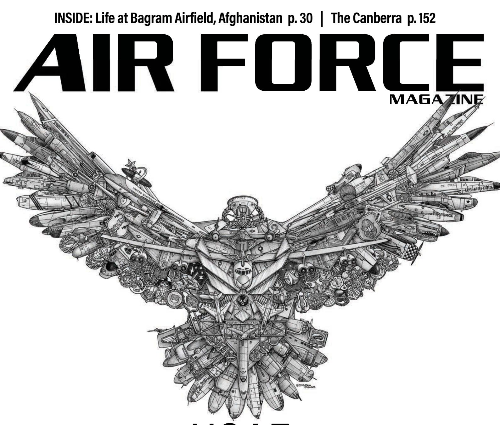

USAF   
ALMANAC   
2017

# READY TO KEEP GPS III ON TRACK.

For GPS III, Boeing can deliver a seamless and technically proven digital payload solution. Based upon the successful 702 satellite series, Boeing’s GPS digital payload is simpler to integrate and test, offering a resilient, modular, flexible product with proven reliability. Add Boeing’s 40 years of GPS experience, and you’ve got a one-of-a-kind commitment to keeping GPS III right on track while further modernizing this vital service.

# AIR FORCE

2017 USAF ALMANAC

# IN THIS ISSUE

# 30 Life at Bagram

By Brian W. Everstine   
As the number of US military forces in country declines, much still stays the same.

# 38 USAF Almanac 2017

# 40 The Air Force in Facts and Figures

• Structure of the Force   
• People   
• Budgets   
• Equipment   
• Grades and Insignia   
• Awards and Decorations

# 67 Major Commands and Air Reserve Components

• Air Combat Command   
• Air Education and Training Command   
• Air Force Global Strike Command   
• Air Force Materiel Command   
• Air Force Reserve Command   
• Air Force Space Command   
• Air Force Special Operations Command   
• Air Mobility Command   
• Pacific Air Forces   
• US Air Forces in Europe   
• Air National Guard

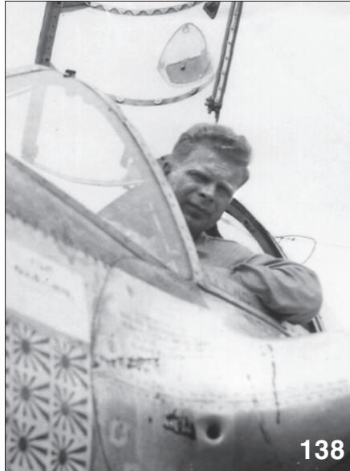

# 80 FOAs, DRUs, and Auxiliary

• Air Force Agency for Modeling and Simulation   
• Air Force Audit Agency   
• Air Force Cost Analysis Agency   
• Air Force District of Washington   
• Air Force Flight Standards Agency   
• Air Force Historical Research Agency   
• Air Force Inspection Agency   
• Air Force Legal Operations Agency   
• Air Force Manpower Analysis Agency   
• Air Force Medical Operations Agency   
• Air Force Medical Support Agency   
• Air Force Mortuary Affairs Operations   
• Air Force Office of Special   
Investigations   
• Air Force Operational Test and Evaluation Center   
• Air Force Operations Group   
• Air Force Personnel Center   
• Air Force Public Affairs Agency   
• Air Force Review Boards Agency   
• Air Force Safety Center   
• Air National Guard Readiness Center   
• US Air Force Academy   
• Civil Air Patrol

82 Guide to Air Force Installations Worldwide • Active Duty Installations • ANG and AFRC Installations

# 95 Gallery of USAF Weapons

A directory of US Air Force aircraft, missiles, and other aerospace assets.

# 126 Leaders Through the Years

• The Nation’s Air Arm and Its Early Leaders • Headquarters USAF Leaders • fMajor Command and ANG Leaders • Historic Major Commands • Headquarters DOD Leaders • Unifi ed Command, National Guard Bureau, and NORAD Leaders • Historic Unifi ed Command Leaders

# 138 Guide to Aces and Heroes

• Major Decorations • Air Force Aces

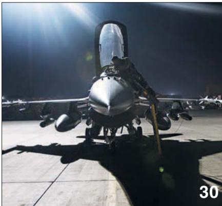

Cover Illustration: The ballpoint pen drawing “Aiming High,” by Don Stewart, depicts a falcon composed of aircraft and insignia. Half the proceeds from sales of this print will be donated to AFA’s Wounded Airman Program. See dsart.com for details and a description of aircraft and insignia in this drawing.

# AIR FORCE

#

2017 USAF ALMANAC

# DEPARTMENTS

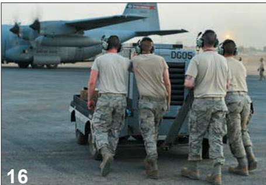

Letters

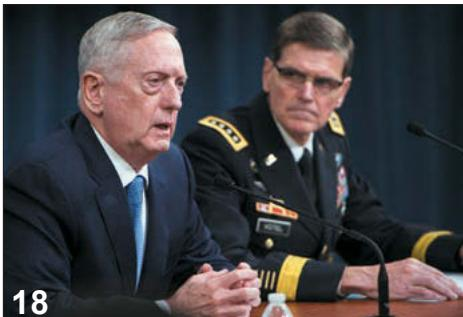

# 4 Editorial: Stretch Mobility

By Adam J. Hebert Excessive demand grinds away at USAF’s mobility force.

10 Index to Advertisers

11 Senior Staff Changes

12 Aperture: Zoomie in charge; A long road back; Chinese stealth; Not the one, but the many ....

# WINGMAN

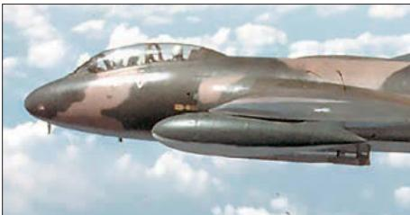

# 152 The Canberra

By Steven Beeny   
It began as an RAF aircraft, but USAF knew it as the B-57.

Verbatim

16 Forward Deployed: The tyranny of distance; Singular circumstances; Bolstering security; Supporting Somalia ....

18 Action in Congress: All Mattis on Deck

Screenshot

24 Air Force World

29 Infographic: What Is the Intelligence Community?

156 Namesakes: McConnell

154 Chapter News

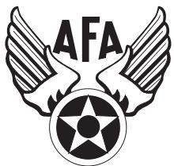

June 2017, Vol. 100, No. 6

Publisher: Larry O. Spencer Editor in Chief: Adam J. Hebert

Managing Editor: Juliette Kelsey Chagnon Editorial Director: John A. Tirpak News Editor: Amy McCullough Deputy Managing Editor: Frances McKenney Senior Designer: Betsy Moore Pentagon Editor: Brian W. Everstine Senior Editor: Wilson Brissett Digital Platforms Editor: Gideon Grudo Associate Editor: June L. Kim Production Manager: Eric Chang Lee Photo Editor: Mike Tsukamoto Media Research Editor: Chequita Wood Contributors: Steven Beeny, Aaron M. U. Church, Robert S. Dudney, Jennifer Hlad, Brendan McGarry, Megan Scully

# Advertising:

Arthur Bartholomew (213) 596-7239 Tom Buttrick (917) 421-9051 James G. Elliott Co., Inc. airforcemagsales@afa.org

1501 Lee Highway Arlington, VA 22209-1198

# Subscribe & Save

Subscribe to Air Force Magazine and save big off the cover price, plus get a free membership to the Air Force Association.

Call 1-800-727-3337 for more information or to subscribe.

Read the Daily Report: airforcemag.com

# Follow us:

  
twitter.com/ airforcemag

  
instagram.com/ airforcemag

facebook.com/ airforcemag

# LESS NOISE. CLEARER COMMUNICATION.

Whatever the mission, every communication in the air is critical. Crews need to hear what they need to hear the first time, to get the job done. That’s why this one piece of equipment is so important. Whatever the situation, it provides improved communications and helps you achieve

# GREATER mission EFFECTIVENESS.

# WHY IT WILL HELP YOU:

• Military studies show that reducing noise improves aircrew communications and increases mission effectiveness.   
It delivers 30% greater noise reduction than conventional aviation headsets.   
Military grade headset design that is both   
robust and durable.   
Audio is crystal-clear with active equalization.   
With 30% less clamping force, even the longest flights are more comfortable.   
• It is among the lightest of all noise cancelling headsets, with a weight of just 12 ounces.   
Simple, intuitive headset operation.   
Currently certified in C-5, C-130, KC-135 and P-8, among others.   
Now available with a coil cord down-cable.   
• Backed by exceptional customer support and a 5-year worldwide warranty.

# GSA Schedule Contract GS07F0232N

After 25 years of providing noise cancelling headsets to military aircrews, the Bose A20 Aviation Headset continues our tradition of improving situational awareness and increasing mission effectiveness. Contact us today and ask about our noobligation military evaluation program.

Bose® A20® Aviation Headset

# Stretch Mobility

April 13, 2017

his spring, Air Mobility Command’s tankers and airlifters were busy supplying everything from beans to bullets, moving passengers and patients, and supplying fuel to aircraft flying combat missions worldwide. This is no surprise. Mobility has been in surge mode since at least 1990.

Wartime operations atop nonstop steady-state requirements will grind down the force if there are not enough pilots, maintainers, healthy airframes, or training opportunities to keep up the pace. This is the bind AMC finds itself in today.

The command’s expeditionary airmen are deployed to 77 locations around the world—building and sustaining airfields, supporting flying operations, and assisting local governments and suffering populations. Some of the 23 nations AMC’s expeditionary airmen have recently operated in include Iraq, Afghanistan, and Syria.

A remote airfield in northern Syria was built up from just a flat spot on the ground late last year. By the end of February, it had already hosted more than 150 C-17 and C-130 missions, according to US Air Forces Central Command (AFCENT).

These mobility flights provide US special operations forces and allied Syrian rebels the supplies and ammunition needed for attacks on ISIS strongholds deep inside Syria, AFCENT Deputy Commander Maj. Gen. Jay B. Silveria said at AFA’s Air Warfare Symposium in March. Without this base it would be “much more difficult to get [supplies] into Syria,” Silveria noted.

Overhead, AMC tankers are flying more than 40 percent of the sorties in the war against ISIS. They allow the Air Force, other military services, and international aircraft to survey the battlefield and press their attacks. Many of the same KC-135s that once flew over Vietnam now refuel coalition aircraft (one every five minutes) over the Middle East.

Meanwhile, a hemisphere away, AMC crews quickly responded to deadly flooding and landslides in Peru that killed more than 100 and left 150,000 people homeless. In April, two C-130Js and 25 airmen from Little Rock AFB, Ark., delivered urgently needed relief supplies to the devastated area.

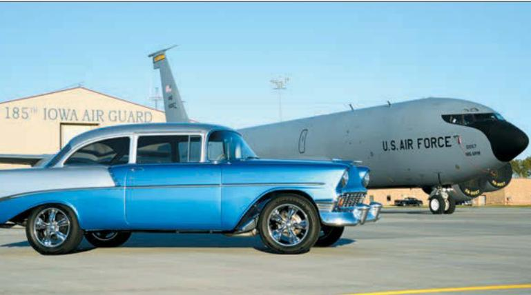  
1956: The year this Chevy and the KC-135 were born.

In the aggregate, an AMC aircraft takes off for a mission once every 2.8 minutes, around the clock, every day. The command does this with far fewer airmen than it had in 1990, 2001, or even 2011—with an aircraft inventory that is getting ever smaller and older.

USAF is “too small for what the nation expects of it,” Air Force Secretary nominee Heather A. Wilson told lawmakers at her confirmation hearing in March. “I think we sometimes take for granted American dominance in air and space power.”

The nation should not take anything for granted when the airmen operating and supporting today’s KC-135 and KC-10 tankers typically perform their missions in aircraft older than they are. The Stratotanker’s first flight was in 1956 and the fleet averages 55 years old.

# Excessive demand grinds away at USAF’s mobility force.

Even the KC-10 Extender, the “new” tanker, is now 31 years old.

This fleet is being run ragged and is only sustained through careful planning and airmen’s perseverance and sweat.

“Between Fiscal Year 2012 and Fiscal Year 2016, AMC’s tanker fleet—the KC-135s and KC-10s—overflew their program flying hours by 237 percent and 178 percent, respectively,” said Gen. Carlton D. Everhart II, AMC commander, in an April meeting with defense reporters.

In other words, for four straight years, USAF’s tankers flew about twice as many hours as expected. “The demand on Air Mobility Command is excessive,” Everhart stated, “and I don’t see that stopping.”

The question is: How long can USAF keep this up? Hopefully for a long time, because under current plans those geriatric KC-135s will, shockingly, be nearly 100 years old before the last of them is replaced under a three-phase modernization program.

Phase one, the nascent KC-46 program, will deliver 179 aircraft. That acquisition then needs to be followed by two additional tanker recapitalization programs.

The notion of airmen someday flying century-old tankers into war would be comical if it were not so frightening, but this will have to be addressed in stages. First things first: The Air Force and Boeing need to quickly work out the kinks in the KC-46 program, get deliveries up to speed, and hopefully accelerate or increase purchases in the future.

No other nation has air mobility comparable to the United States. Allies have “always relied on us, and they’ll continue to rely on us,” Everhart said.

Mobility capability allows America to be a global leader— able to deliver aid or lead a fight, anywhere on Earth, on short notice. Don’t take that for granted. ✪

# CHOOSE ANY THREE.

CERTIFIED. FLYING. AFFORDABLE.

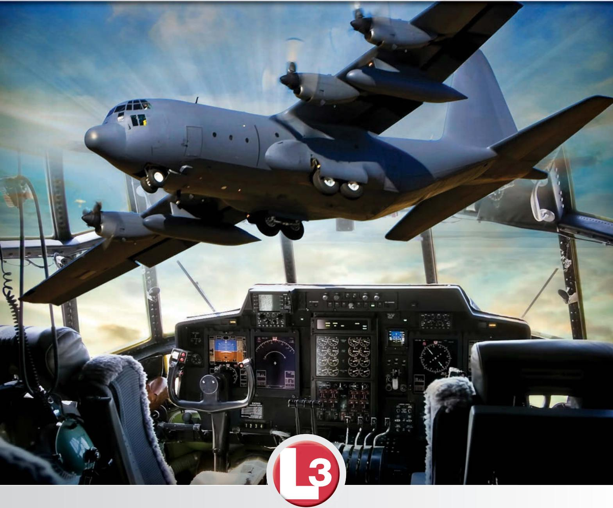

# Affordable CNS/ATM-Compliant Solutions for C -130 and Other Aircraft

L3 Platform Integration’s certified avionics solutions provide modern, affordable capabilities that keep aircraft flying well into the future. Our systems feature modern glass cockpits and solutions designed for each customer’s fleet. In addition to being CNS /ATM-compliant, our systems fly with U.S. and inter national military and civilian airworthiness certifications.

To learn more about our avionics and aircraft solutions, visit us at L3T.com/PID.

Platform Integration

# Selfridge Selflessness

I certainly enjoyed Wilson Brissett’s fine article commemorating the 100th anniversary of the Selfridge Air National Guard Base [“A Century of Action,” March, p. 46].

The outstanding record of the host unit, the 127th Wing, is certainly commendable. I am, however, compelled to question the accuracy of: “The sixmonth stretch was the longest mass deployment of Selfridge airmen since the Korean War,” attributed to wing officials, and describing the wing’s 2015 deployment in support of Operation Inherent Resolve.

In October 1990, the Selfridgebased 927th (then Tactical Airlift Group) deployed eight C-130E aircraft along with several hundred airmen in support of Operations Desert Shield and Desert Storm. The 927th joined its sister 914th TAG with eight additional aircraft and airmen from Niagara Falls, N.Y., to form the 1650th TAW Provisional at Sharjah Airport in the UAE. The deployed base was affectionately named Mirage.

As of February of 1991, the 1650th had flown 10,000 sorties moving 15,000 passengers and 12,000 tons of cargo. Five thousand hours were flown over 3,200 sorties during 42 days of combat coded action.

Just before the initiation of Desert Storm, the tactics officers from the

Do you have a comment about a current article in the magazine? Write to “Letters,” Air Force Maga zine, 1501 Lee Highway, Arlington, VA 22209-1198. (Email: letters@afa.org.) Letters should be concise and timely. We cannot acknowledge receipt of letters. We reserve the right to condense letters. Letters without name and city/base and state are not acceptable. Photographs can not be used or returned.

—THE EDITORS

various deployed C-130 units met to plan the air logistics phase of the “left hook” redeployment of ground forces.

Over 100 C-130s flew nonstop for three days to complete the critical strategic move to the west. If my memory serves correctly, not a single missed sortie assignment was recorded during the entire six-month deployment of the combined 927th and 914th. The 1650th was reported to be the only AFRES support flying unit deployed to Desert Storm.

Col. Richard Sipp, USAF (Ret.) Midland, Mich.

# Nukes Not for Everyone

I thoroughly enjoyed the feature article “Rebuilding the Missile Force” by Senior Editor Wilson Brissett in the February 2017 issue [p. 20].

I wrote a letter to the Secretary of Defense and the Secretary of the Air Force in 2014, based on newspaper [Associated Press] articles; TV shows; interviews with missile crew members on their concerns about missile duty [and the] firing of colonels at the operational wings, in the Air Force Times; and my operational ICBM experience starting in the 1960s.

As some background, I was commissioned in 1962 and was a procurement officer for the first 18 months. Then in 1963 and ’64, the Air Force pulled most of the support officers into the missile field to fill slots for Minuteman, Atlas, and Titan missile crew commander positions. You had to be at least a first lieutenant as a deputy commander, and commanders were senior captains or junior majors (many of whom were on flying status). We were a very important part of the Strategic Air Command (SAC), one of the premier, if not the best, major commands to be in. All of us considered these crew commander positions very important and excellent opportunities for promotion. The flying status officers transferred into SAC from other major commands for the promotion potential.

# Air Force Association

1501 Lee Highway Arlington, VA 22209-1198

Website: afa.org Telephone: 703.247.5800 Toll-free: 800.727.3337 Fax: 703.247.5853

# AFA’s Mission

Our mission is to promote a dominant United States Air Force and a strong national defense and to honor airmen and our Air Force heritage.

# To accomplish this, we:

• Educate the public on the critical need for unmatched aerospace power and a technically superior workforce to ensure US national security. • Advocate for aerospace power and STEM education. • Support the Total Air Force family and promote aerospace education.

# Contacts

Field Services field@afa.org Government Relations . . . . . . . . grl@afa.org Membership . . . . . . . membership@afa.org News Media . . communications@afa.org CyberPatriot . . . . info@uscyberpatriot.org

Advertising . . .airforcemagsales@afa.org Editorial O ce . afmag@afa.org Letters to Editor Column . . letters@afa.org Wingman . . .wingman@afa.org

# Change of Address/Email

In an e ort to stay connected with AFA and your local chapter, please update your mailing and email addresses. Change of address requires four weeks’ notice.

# To update your contact information you may:

• Email: membership@afa.org   
• Visit: The Members Only area of our   
website, afa.org   
• Call: Our Membership Department at 1-800-727-3337   
Mail your magazine label and your fi rst and last name to our Membership Department at 1501 Lee Highway, Arlington, VA 22209-1198

We were posturing the Minuteman I wing at F. E. Warren Air Force Base in Wyoming, and I was deputy missile crew commander for over a year. During that time, my first crew commander, in training, was a senior captain (pilot) whom I turned in as not being stable to be in charge of nuclear weapons. This was under the Air Force Human Reliability Program, I think AFR 35-99, maybe now called the Personnel Reliability Program. This was with great risk to me, turning this senior captain into my lieutenant colonel squadron operations officer. Subsequently, he was relieved of his duties and left the Air Force. This point is extremely important. Not all officers are suited to be in charge of nuclear weapons.

I wrote a letter to DOD/AF officials because the Defense Department has, for whatever reasons, degraded the importance of the Air Force ICBM mission as a critical part of our nuclear deterrence strategy. When the Air Force reorganized and SAC was replaced by Space Command and then by Global Strike Command and defused further by Air Combat Command, the premier status of the nuclear strike force crumbled. Instead of seeking and getting the best and brightest officers with extremely high promotion potential, the Air Force demonstrated a lack of importance of the ICBM force, and consequently, problems followed. I do not believe it is only a money issue. It is a perceived nonchallenging assignment with minimal support of the Air Force leadership and with minimal rewards. Why are the academy officers so concerned about getting a missile crew assignment? I do not believe that the two general officer pilots, who were never missile crew commanders, should have been selected to head the investigation of the problems of the ICBM force.

More opportunities, challenging assignments, and promotions are needed for the MM III operational force. There should be a variety of career paths that allow this critical operational force to advance and experience challenging Air Force careers. In your article, there appears to be more career opportunities and wing-wide assignments with effective senior leadership in the 13N career field, which is good. However, there should be an expansion as follows: The junior officers should see multiple paths, while going in and out of the operational MM III positions. This could include related assignments at the MM III Program Office (various acquisition positions), the national targeting organization, depot assignments using their operational experience, operational test launch positions to include more live launches, RV acquisition and depot assignments, and related developmental work at the labs and industry. This is in addition to headquarters and Defense Department positions. This will allow a wide wealth of experience and will ultimately allow advancement into senior level missile operational positions.

Col. Don Damm, USAF (Ret.) Sumter, S.C.

# The Right Stuff

As a cover-to-cover reader of your magazine, usually on the day it reaches my mailbox, and also having been a schoolboy who followed every detail on Project Mercury, it was very gratifying to see the great tribute to John Glenn in the current issue [“Air Force World: John H. Glenn, 1921-2016,” March, p. 22].

I would, however, like to point out a technical error, which seems to be in most of the recent discussions of his mission. In point of fact, the MA-6 mission was not reduced in duration but was scheduled as a three-orbit mission, as was the following MA-7 “proving” mission flown by Scott Carpenter three months later. The confusion has arisen apparently from the radio transmission to Glenn when he reached orbit that his trajectory was “good for at least seven orbits.” That meant only that the Atlas booster had inserted Friendship 7 into the planned orbit.

As described by the legendary flight controller Gene Kranz in his classic book of 17 years ago, Failure Is Not an Option, the mission plan was to have a trajectory good enough for additional orbits in the event it was desired to keep him up longer for some reason. The faulty indication that the heat shield had come loose did create much concern and a change in mission sequence in order to leave the retrorocket package on throughout re-entry, and that with consequent concern for damage to the shield, but it did not cause the mission to be cut short.

Details aside, thanks for all the great articles, especially the tribute to Colonel Glenn.

Joseph Cunningham Jackson Heights, N.Y.

Learn more at T-100.us

# Honeywell

# Out of Their Depth

John Correll’s excellent article gave an in-depth account of the British aerial torpedo attack on the Italian battleships in Taranto Harbor [“The Air Raid at Taranto,” March, p. 60]. This attack occurred more than a year before the Japanese raid on Pearl Harbor. Yet it did not lead to actions that could have protected the American fleet.

Mr. Correll reports that Taranto Harbor was 40 feet deep, about the same depth as Pearl Harbor. He also states that when Admiral Ingersoll sent a warning about Taranto to Pearl Harbor, the admiral erroneously listed the depth of the water where torpedoes were dropped at Taranto. He said that they were much deeper—between 84 to 90 feet, with a few runs at 66- to 72-foot depths. This difference in stated depths between Taranto and Pearl Harbor may have caused Admiral Kimmel to not consider the memo relevant to his situation.

Certainly, nearly every source on the Taranto Raid lists its depth as being about 40 feet, and that would make Ingersoll’s memo incorrect. The book on Taranto by Lowry and Wellham is particularly noteworthy because Wellham was one of the pilots in the attack. On p. 68 of the 2000 paperback edition, the book states that Mare Grande is about 45 feet deep.

However, we may need to rethink this depth. Actual hydrographic studies of Taranto Harbor paint a very different picture of Mare Grande. Several have been done, and they agree that Mare Grande is a fairly deep harbor, citing depths of over 100 feet in many locations. Based on the after-action report by Captain Boyd of the HMS Illustrious, all torpedoes were dropped in and all battleships were moored [in depths ranging from 64 to 93 feet]. Based on hydrographic information, then, it appears that we should seriously question the statement that the British Taranto raid took place at Pearl Harbor depths. Where Ingersoll came up with his depth information is unknown, but it appears that he was actually correct.

If Ingersoll’s correct statement of drop depths at Taranto deterred Kimmel from considering the memo as being relevant to Pearl Harbor, that was unfortunately because Taranto was only part of the British aerial torpedo story. As Mr. Correll notes, the British had earlier dropped their torpedoes successfully in water as shallow as 22 feet. That would certainly have gotten Kimmel’s attention.

Ray Panko Honolulu

The numerous operational accounts that I have seen on the Taranto attack report an average depth in the outer harbor of between 39 and 49 feet.

The after-action report Mr. Panko cites from Capt. D. W. Boyd, commander of Illustrious, includes information on range and altitude of the attacks but does not mention harbor depth. The approximate point at which the torpedoes struck the water could be estimated from the range and the general direction of approach.

Two of the battleships struck by the torpedoes were left with their decks awash but not completely submerged. Conte di Cavour, with a 40-foot hole in the hull, settled on the bottom with its superstructure above water. This is at odds with the assumption of greater depth. The Italians managed to beach a third battleship to keep it from sinking.

The gist of the advisory from US Rear Adm. Royal E. Ingersoll, assistant Chief of Naval Operations, in June 1941, was to state the threat level warning for aerial torpedoes at 75 feet or deeper. The quality of his assessment was seen six months later when Japanese torpedo bombers attacked the US fleet in 40 feet of water at Pearl Harbor.—John T. Correll

# Getting Modern

I enjoyed retired Colonel Meilinger’s article, “Learning the Not-So-Obvious Lessons,” in the March 2017 issue [p. 68], but think that he and the Air Force are both failing to learn an extremely important, but which seems to be the not-so-obvious, lesson about what developments in technology are making possible regarding service roles. Thanks to advances in Ground Moving Target Indicator (GMTI) surveillance and moving target precision attack technologies that make it possible to locate and then destroy an enemy army’s vehicles when they are moving deep in enemy territory, US Air Force airpower now has the potential to duplicate the change in roles that naval forces achieved during World War II.

Before Pearl Harbor, the US Navy’s leaders expected that their naval aviation forces would be employed in support of their surface forces, with close combat battleship gunfire being their primary means of defeating the Japanese Navy. However, instead of just locating the opposing fleet, naval aviation proved to be able to defeat that fleet before it could move into gunfire range of our ships. But this change in roles between air and surface forces was not possible on land at that time because of the great difficulties airmen experienced in locating and then hitting an enemy army’s vehicles, especially when they moved at night or during bad weather. As a result, it was necessary to employ airpower in support of our army by attempting to delay the movement of enemy vehicles through the targeting of fixed transportation infrastructure, like bridges and tunnels, and then providing close air support when the two armies had moved into close proximity to each other.

But during Desert Storm, advances in technology revealed the potential to change roles was possible because now we could detect and hit an enemy army’s vehicles, even when they moved at night, well before they could get into close proximity to our land forces. During the Battle of Khafji, which someday historians will see as the land warfare equivalent of the Battle of the Coral Sea in World War II, Iraqi army vehicles attempting to use the cover of darkness to achieve a surprise attack were detected, located, and targeted by a prototype Joint Surveillance Target Attack Radar System (JSTARS) long before most of these vehicles could move into close proximity to coalition land forces.

The immense importance of being able to detect, locate, and precisely target an opposing army’s vehicles when they are moving results from the fact that movement is how armies achieve the advantages of surprise, favorable position, and superior mass. Moreover, in addition to their mobility, modern armies depend on their vehicles for armored protection, heavy firepower, supplies, and engineering support. By targeting these vehicles when they are moving, the US gains a number of important advantages. Attacks will not be wasted on decoys or previously destroyed vehicles. Since they will be occupied by enemy soldiers, lethal precision air attacks can create such fear that enemy soldiers will become unwilling to risk occupying a moving vehicle, making it possible to achieve widespread paralysis faster and with far fewer attacks than could be achieved solely by attrition. (We have already seen the value of using fear of precision HARM air attacks to suppress surface-to-air missile sites.) Yet another advantage of creating paralysis by targeting moving vehicles is the ability to measure effectiveness in real time.

Once widespread paralysis is achieved, friendly land forces will possess the dominant maneuver needed to complete the enemy’s defeat with relatively little risk. But before this occurs, friendly land forces should be employed in support of our airpower by using their maneuver to put the enemy commander on the horns of a dilemma that has no satisfactory answer. The dilemma is this: If the enemy attempts to counter our Army’s maneuver by moving, he makes his vehicles vulnerable to being seen and destroyed by precision air attacks, but if he attempts to reduce the risks from air attacks by dispersing and not moving, he will be unable to counter our Army’s maneuver while providing even more time for his forces to be located and destroyed by air attacks. Unfortunately, this same issue of Air Force Magazine [“Air Force World: Moving Forward with JSTARS Recap, p. 19] states that the Air Force plans to limit the JSTARS recap fleet to only 17 aircraft, indicating that this not-soobvious lesson regarding the potential of exploiting GMTI surveillance and targeting to reverse Air Force and Army roles has yet to be learned.

Lt. Col. Price T. Bingham, USAF (Ret.) Melbourne, Fla.

Forces,” purported establishing a permanent Air Force presence in the Middle East by moving two wings of the retiring B-52Ds to Southwest Asia,rather than sending them to the USAF “Bone Yard.” Half of the aircraft would remain flyable and the other half could be used for cannibalization. Unfortunately, the timing was not good for such a plan. The B-1s were nearing readiness, and funding and maintaining a maintenance-demanding, vintage 1950 aircraft did not appear to meet serious headquarters consideration.

Hindsight is always nice, but what if USAF would have made such a move in the early or mid-80s? Would the presence of a full-time military force using even an old, but viable, weapon system have changed the environment of the Middle East during this period?

It is interesting that 35 years later, B-52Hs, not B-52Ds, are performing the same function for US Central Command that was envisioned in the paper.

Col. Jimmie W. Hanes Jr., USAF (Ret.) Crawford, Texas

# They Ain’t Perks

# A Modest Proposal

I enjoyed Mr. Everstine’s article, “Continuous Sandbox Presence,” in the April/May edition of your magazine [p. 30]. However, the employment of a permanent bomber presence in the Middle East was proposed many years ago.

In the January 2017 issue of Air Force Magazine, Megan Scully’s article, “Retention Questions,” touched on a variety of challenges our Air Force and DOD as a whole face, some of them repeats from various decades. On p. 49, Ms. Scully describes the comparison of military service to civilian service as “apples to oranges,” which is a very key observation. However, she describes recent policies that the military has implemented as “perks that go along with military service” to improve retention. Ms. Scully should have used the term “readiness” rather than “perks” because that is what those policies support. As a squadron commander I had to look a female senior airman, who was a single parent, in the eye and order this professional to deploy to Southwest Asia for four months, so I don’t view this policy in military service as a “perk.” Also on p. 49, Ms. Scully states the “biggest challenge is convincing those airmen with six to 16 years”—again, the term “convincing” is misleading. The vast majority of airmen patriotically volunteered to be a member of the greatest Air Force in the world. There comes a point in an airman’s career to weigh the facts when deciding it’s time to separate from military service. Some of those key facts are family needs, medical issues, separation from the family, and pure deployment “burnout.” So, there is no “convincing,” but readiness

In 1981-82, I was fortunate enough to be selected as a USAF research associate (RA) and spent the year at the Mershon Center, Ohio State University. One of the requirements as an RA was to prepare and present a scholarly paper for the Air Staff. My paper, “Chain of Thunder: B-52D Firepower for America’s Conventional

  
Learn more at T-100.us

# Honeywell

opportunities, to consider. The funding expended on bonuses to pilots and now remotely piloted aircraft operators will continue to be a challenge in meeting retention goals for these career fields.

Congress should put their money where their mouth is since congressional staffers seem to continue to always compare military service to the civilian workforce. My recommendations for military readiness improvements are: provide a program to fund a percentage of military members’ college student loans (those who didn’t attend a service academy or didn’t utilized tuition assistance), institute an allowance program to qualifying service members for child care costs, make the officer and enlisted Basic Allowance for Housing (BAH) rates the same or near the same rate, and increase the household goods (HHGs) weight allowance for our enlisted corps at least 60 percent across the board. In the late 1980s, the military changed the policy for TDY per diem for all service members. The old policy entitled officers a higher per diem rate versus our enlisted corps. This didn’t make sense to me because all service members have to eat while TDY, so why should rank factor into this? Now the per diem is the same rate. Our enlisted airmen who qualify for off-base housing need to live somewhere with their dependents, just as officers do. Why have segregated BAH rates? For example, an E-5 with dependents, assigned to the BAH Washington, D.C., area, has a BAH rate of $\$ 2,262$ , versus an O-3 with dependents, same area, having a BAH rate of $\$ 2,874$ . Why shouldn’t the E-5 earn the same BAH as the O-3? Yes, there are all types of factors influencing the BAH rate, but does the E-5 pay less for public utilities than the O-3? This is a readiness concern because when the E-5 has to support a deployment, he/she can deploy, knowing dependents’ housing will be secure. As for the HHGs weight allowance: In comparison to a federal civilian service employee, our enlisted airmen are at a disadvantage. For example, per the Defense Transportation Regulation, Part IV, for civilian employees the authorized HHGs allowance is $^ { * } 1 8 , 0 0 0$ pounds net weight for each employee” who are funded for a move. An E-5 with over 10 years’ time in service earns approximately $\$ 38,563$ annually in base pay (not factoring in other allowances), in comparison to a GS-6 (Step 7), who earns $\$ 38$ ,185 annually in pay (doesn’t include locality pay), and the GS-6 (Step 7), if authorized a move, can ship 18,000 pounds in HHGs, but the E-5 with dependents can only ship 9,000 pounds. The issue is “readiness” not “retention” because if the services jointly advocate to Congress the readiness perspective, present the facts and basis to improve readiness, then our military members, especially our great airmen, will continue to be patriotic and serve a career of 16-plus years.

Col. Steven L. Amato, USAF (Ret.) Woodbridge, Va.

# Good Mag, Bad Mag

You outdid yourselves with the March issue of Air Force Magazine! I found myself reading the whole issue from cover to cover. The clarity and strong statements in each of the articles came through loud and clear. Keep up the great work.

Lt. Col. David Newbern, USAF (Ret.) Fredericksburg, Va.

As one of the majority of voters who did not vote for President Trump, I would like to take issue with Mr. Leibundguth’s critique of your editorial policies [“Letters: Soundly Defeated,” April/May, p. 8]. Please continue to strongly question the policies and actions of the current administration, just as you did of President Obama’s.

Sean M. Mallory Edinboro, Pa.

Since becoming a member of the Air Force Association in 1968, I have anticipated receiving Air Force Magazine. Heretofore the magazine has been a refreshing alternative to the biases of the mainstream media. The content and tone of the March 2017 issue fell short of the standards set by the magazine for decades. One article in particular stands out as falling far below the standard we members expect.

“Action in Congress: Fasten Your Seatbelts” by Megan Scully [p. 13] is a thinly veiled, pedantic, anti-Trump piece that missed the mark and is an insult to our intelligence.

AFA members, whether or not they voted for the President, do not come to Air Force Magazine to ingest the same biased fodder we see in the mainstream media. We do not expect to see an irrelevant critique of the President’s “tweeting” style. The caption of the picture, “Tweeting the strike fighter,” is sophomoric.

Most, if not all of us, know that the contracting officials and not the President sign the contracting documents. But it is patently naïve to believe that the President, and other politicians, do not impact the decisions on which systems are selected. Where was Scully when Obama and Gates killed the F-22 buy? [See “State of the Arsenal,” July 2009, p. 50.]

Scully writes: “The tweet underscores his aggressive negotiation tactics, but also highlighted his unfamiliarity with some of the intricacies of Pentagon acquisition.” One can argue that the President’s negotiation tactics have proved to be successful in business. Moreover, what has transpired during the last few days to lower the costs of the F-35, since President Trump weighed in, would suggest that the President can and does influence negotiations. Apparently the “intricacies of Pentagon acquisition” that have historically resulted in protracted acquisition and cost overruns did not stymie the President who pledged to voters to drain the bureaucratic swamp.

Scully writes: “The layers of bureaucracy between the President (or any other political figure, for that matter) and the contract officer exist for good reason: to prevent any undue political influence on the process.” What is “undue political influence”? Why does

# Index to Advertisers

Boeing.... .Cover II, 17 Bose... ...3 Bradford Exchange.. ...151 DRS.. ..7. 9. 11,13 L3 Technologies.. ..5 Pratt & Whitney.. .15 Rolls Royce.. .Cover IV Starkey Hearing Technologies.. ...63 USAA.. .Cover III

AFA Hotel Benefits. .79   
AFA Resume Service.. .79   
AFA Member Benefits Reference.. .59   
AFA Membership. .47   
AFA Monthly Giving . .21   
AFA Air, Space & Cyber Conference.. .19   
Air Force Magazine.. .55   
Air Force Magazine Subscriptions.. .28   
Air Warfare Symposium 2018.. .55   
MASA. .63   
Budget Rental Car.. .94   
Hangar Store.. .74   
Hawaiian Airlines.. .94

Scully think the A-10 is still in service? I doubt that Sen. John McCain or Sen. Mark Levin would agree to her absurd assertion.

The readers of Congressional Quarterly might be accustomed to such journalistic dribble. The readers of

Air Force Magazine are not. We can only hope Air Force Magazine will be able to find material that meets AFA standards for the coming issues.

Col. Eldon DeVere Henderson, USAF (Ret.) Gardnerville, Nev.

# Senior Staff Changes

RETIREMENTS: Gen. Herbert J. Carlisle, Maj. Gen. Frederick H. Martin, Maj. Gen. Robert N. Polumbo, Brig. Gen. Jeffrey K. Barnson, Brig. Gen. Thomas G. Clark.

CONFIRMATIONS: To be Major General: Tony D. Bauernfeind, William T. Cooley, Stephen L. Davis, Patrick J. Doherty, James A. Jacobson, David A. Krumm, Jeffrey A. Kruse, Michael A. Minihan, Shaun Q. Morris, Thomas E. Murphy, David S. Nahom, Stephen W. Oliver Jr., John M. Pletcher, Scott L. Pleus, John T. Rauch Jr., Brian S. Robinson, Ricky N. Rupp, Dirk D. Smith, Kirk W. Smith, Paul W. Tibbets IV, Andrew J. Toth, Mark E. Weatherington.

To be Brigadier General: Dagvin R. M. Anderson, Jason R. Armagost, Craig R. Baker, Gentry W. Boswell, Richard H. Boutwell, Ryan L. Britton, Brian R. Bruckbauer, Lance R. Brunch, Todd D. Canterbury, Case A. Cunningham, Evan C. Dertien, Michael L. Downs, Troy E. Dunn, Derek C. France, David M. Gaedecke, Philip A. Garrant, Anthony W. Genatempo, Kristen E. Goodwin, Christopher J. Ireland, David R. Iverson, Joel D. Jackson, Ronald E. Jolly Sr., Michael G. Koscheski, David J. Kumashiro, John D. Lamontagne, Leah G. Lauderback, Charles B. McDaniel, John C. Millard, Albert G. Miller, John J. Nichols, Robert G. Novotny, Lansing R. Pilch, Donna D. Shipton, Jeremy T. Sloane, Phillip A. Stewart, David H. Tabor.

NOMINATIONS: To be Major General: Mark D. Camerer, Sean L. Murphy.

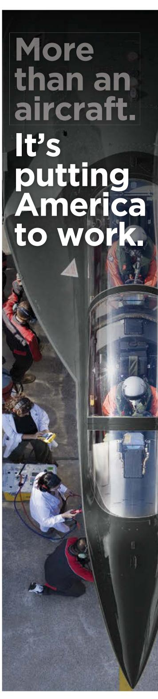  
Learn more at T-100.us

CHANGES: Brig. Gen. Mark A. Baird, from Vice Cmdr., SMC, AFSPC, Los Angeles AFB, Calif., to Dir., Space Prgms., Office of the Asst. SECAF, Acq., Pentagon … Brig. Gen. Andrew A. Croft, from Dir., Plans, Prgms., Rqmts., & Assessments, AETC, JBSA-Randolph, Texas, to Dep. Commanding General-Air, Combined Jt. Forces Land Component Command-Iraq, Southwest Asia … Maj. Gen. Timothy G. Fay, from Dir., Ops., Strat. Deterrence & Nuclear Integration, USAFE, Ramstein AB, Germany, to Vice Cmdr., USAFE, Ramstein AB, Germany … Maj. Gen. James B. Hecker, from Cmdr., 19th AF, AETC, JBSA-Randolph, Texas, to Cmdr., 9th Air & Space Expeditionary Task Force-Afghanistan, CENTCOM, Kabul, Afghanistan … Maj. Gen. John M. Hicks, from C/S, SOCOM, MacDill AFB, Fla., to Cmdr., SOCOM-Africa, SOCOM, Stuttgart, Germany … Brig. Gen. Matthew C. Isler, from Dep. Commanding General-Air, Combined Jt. Force Land Component Command-Iraq, Southwest Asia, to Asst. Dep. Cmdr., 9th Air Expeditionary Task Force, ACC, Shaw AFB, S.C. … Brig. Gen. Mark K. Johnson, from Cmdr., Oklahoma City ALC, AFMC, Tinker AFB, Okla., to Dir., Log. Ops., Defense Log. Agency, Fort Belvoir, Va. … Brig. Gen. Walter J. Lindsley, from Dir., Log., DCS, Log., Engineering, & Force Dev., USAF, Pentagon, to Dir., Instl., Log., & Mission Spt., AFGSC, Barksdale AFB, La. … Brig. Gen. Chad T. Manske, from Dep. Cmdr., Canadian NORAD, Winnipeg, Canada, to Commandant, Natl. War College, NDU, Fort McNair, D.C. … Brig. Gen. Tom D. Miller, from Vice Cmdr., AF Sustainment Center, AFMC, Tinker AFB, Okla., to Cmdr., Oklahoma City ALC, AFMC, Tinker AFB, Okla. … Maj. Gen. Michael T. Plehn, from C/S, SOCOM, Miami, to Vice Cmdr., AFSOC, Hurlburt Field, Fla. … Maj. Gen. James C. Slife, from DCS, United Nations Command & US Forces Korea, Yongsan Army Garrison, Republic of Korea, to C/S, SOCOM, MacDill AFB, Fla. … Maj. Gen. Scott F. Smith, from DCS, Ops., Allied Jt. Force Command, NATO, Brunssum, Netherlands, to Dir., Current Ops., DCS, Ops., USAF, Pentagon … Brig. Gen. William A. Spangenthal, from Dir., SECAF, USAF, Pentagon, to Dir., Plans, Prgms., Rqmts., & Assessments, AETC, JBSA-Randolph, Texas … Maj. Gen. Jeffrey B. Taliaferro, from Cmdr., 9th Air & Space Expeditionary Task Force-Afghanistan, CENTCOM, Kabul, Afghanistan, to Dir., Ops., NORTHCOM, Peterson AFB, Colo. … Maj. Gen. (sel.) Paul W. Tibbets IV, from Cmdr., 509th BW, AFGSC, Whiteman AFB, Mo., to Vice Cmdr., AFGSC, Barksdale AFB, La. … Brig. Gen. Andrew J. Toth, from Asst. Dep. Cmdr., AFCENT, Shaw AFB, S.C., to Dir., Ops., ACC, JB Langley-Eustis, Va.

# CHIEF MASTER SERGEANT RETIREMENT: CMSAF James A. Cody.

CMS CHANGES: CMSgt. Benjamin J. Higginbotham, from Command Chief, 70th ISR Wg., Fort Meade, Md., to Command Sr. Enlisted Leader, Combined Jt. Task Force-Horn of Africa, Camp Lemonnier, Djibouti … CMSgt. Kaleth O. Wright to Chief Master Sergeant of the Air Force, USAF, Pentagon. J

# Honeywell

# Zoomie in charge; A long road back; Chinese stealth; Not the one, but the many ....

April 10, 2017

# WILSON'S POINTS

Heather A. Wilson, president of the South Dakota School of Mines and Technology and a former New Mexico congresswoman, is likely to be confirmed as the new Secretary of the Air Force, succeeding Deborah Lee James. Her nomination was approved by the Senate Armed Services Committee by a 22-to-five vote on April 5 and referred to the full Senate, where it was expected to pass without further debate, although no vote had been scheduled by press time.

President Trump nominated Wilson on Jan. 23, and she is the only one of his three initial service Secretary nominations to advance to the confirmation process. Vincent Viola and Philip Bilden, his first choices for Army and Navy Secretary, respectively, withdrew from their nominations over issues related to divestment of their financial holdings.

At her March 30 confirmation hearing, Wilson promised to push for a larger Air Force end strength, manage tightly a large bow wave of USAF modernization programs, and remain open to new contracting mechanisms and innovative schemes to develop combat capability quickly and at the lowest possible cost. She argued for repeal of the Budget Control Act (BCA) and its attending military sequester, saying the law is “hurting the Air Force and our ability to defend ourselves.”

She tallied the long list of modernization programs the Air Force must carry out in the next decade if it is to reverse the increasing age of its equipment, now standing at an average age of 27 years for aircraft. SASC Chairman Sen. John McCain (R-Ariz.) warned Wilson that if she were to be confirmed, the committee would not be patient with overly rosy reports on the health of acquisition programs and said flatly that if the BCA is not repealed, the Air Force won’t be able to afford all the equipment it now plans to buy.

Wilson deflected comments on reported Air Force plans to retire the F-15C/D fleet, saying the service is properly looking at all its what-if options. However, she would be willing to consider a restart of the F-22 production line as a potential offset or competitor to the F-35. Top Air Force leaders have said that while they would like to have more F-22s, increasing the buy rate on the F-35 to replace aging fighters is a higher priority and would yield more overall combat power.

Both McCain and Sen. Richard Blumenthal (D-Conn.) raised an ethics question for Wilson. Almost immediately after leaving her House seat in January 2009, she took consultancy work with Sandia National Laboratories—then managed by Lockheed Martin—but according to a 2013 Department of Energy inspector general report, on an invoice she did not detail the work she performed, and the lab was criticized for keeping sloppy records.

“I did the work. I complied with the contract. ... The review found ... no fault with me, and the DOE auditors never even bothered ... to talk to me,” she said.

Wilson told McCain she did the consulting work for 18 months and acknowledged she directed Lockheed’s effort to get its Sandia contract renewed without an open competition, but said she did not lobby any members of Congress in this regard. Sandia ultimately reimbursed the government $\$ 442,877$ paid to Wilson. At Sandia, Oak Ridge, and other nuclear labs, “I helped them, I think, a great deal with respect to strategic planning on nonproliferation and their nonproliferation advisory board with respect to nuclear materials, did numerous program reviews, helped with cyber security,” she told McCain. She promised him she would promote open competition on Air Force programs, but only where appropriate.

# A-10 AGAIN

Asked by Sen. Lindsey O. Graham (R-S.C.) whether the A-10 is the ideal platform for fighting ISIS and “other asymmetrical threats,” Wilson answered obliquely that “40,000 munitions have been put on the ISIS target since 2014; 90 percent of them have been delivered by the United States Air Force. It’s an air commander who has to decide at the moment what platform he needs to do a particular job in a particular place. Whether that’s an F-16, or … [an] F-18, or an A-10 just … depends on the job.”

Though she did not address the A-10 retirement question directly, she said that fourth generation aircraft will be “around for a long time” and added, “it’s really important to get capabilities from the drawing board to the flight line faster. The cycle of innovation has to be faster.” With regard to an ongoing evaluation of the F-35 vs. the F/A-18, however, she said, “I don’t see how we can stop modernizing and expect to win a near-peer fight. And I’d rather have that fight be unfair and on our side.” She told Sen. Elizabeth Warren (D-Mass.) she would put fresh priority on funding for basic and applied research.

About the Air Force’s readiness crisis—with a lack of pilots and maintainers as symptoms—Wilson told McCain, “I think we all know we’re not going to get out of this in a single year.”

Wilson would be the first graduate of the Air Force Academy and the third woman to hold the service’s top position. She graduated from the academy in 1982 and, as a Rhodes scholar, continued her studies in England, receiving a master's and doctorate in international relations from Oxford University by 1985. Oxford published a book by Wilson, titled International Law and the Use of Force

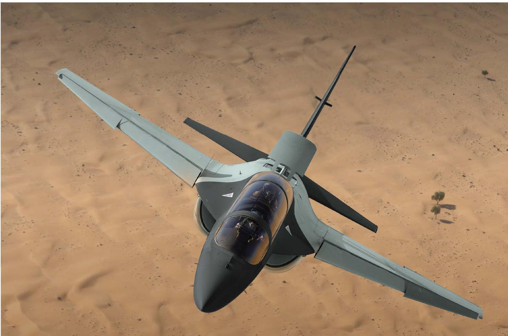

# More than an aircraft. It’s the preferred T-X solution.

The T-100 is the world’s most advanced integrated air-to-ground jet pilot training system. It features the combined expertise of Leonardo DRS, CAE and Honeywell – the only team building a brand-new U.S. manufacturing facility to generate high-tech jobs here at home. Together, they’ve created a low-cost, operationally proven T-X solution. Making the T-100 the right choice for the next generation of USAF pilots. And the right choice for America.

by National Liberation Movements. She served on Active Duty seven years, as a host-country negotiator in the UK and then as a NATO defense planning officer, where she was also involved in arms control negotiations.

After the Air Force, Wilson worked for two years on the National Security staff in the George H. W. Bush White House, as director for Defense Policy and Arms Control. Afterward, in 1991, she founded Keystone International, Inc., in New Mexico, promoting scientific business development in the US and Russia.

Wilson served in the cabinet of New Mexico Gov. Gary Johnson from 1995 to 1998, as secretary for the New Mexico Children, Youth, and Families Department, a state agency overseeing the juvenile justice system and child welfare.

She quit her post to run for Congress from New Mexico’s 1st District in 1998, winning a special election. She became the first woman veteran to serve in Congress, and after winning the general election later that year, served in the House for five more terms. Wilson served on the committees on Armed Services, Intelligence, and Energy and Commerce and chaired the Intelligence subcommittee on technical and tactical intelligence.

Wilson made two unsuccessful bids for the Senate from New Mexico, in 2008 and 2012. She took up the South Dakota School of Mines and Technology job in 2013.

# DRAGON RACES

One of the Air Force’s persistent nightmares came true in March when China, with little fanfare, declared its first stealth fighter operational. The prospect of USAF potentially confronting another air force armed with stealth aircraft, once unthinkable, is now a reality.

The dozen or so J-20 “Mighty Dragons”—announced by Chinese state television as operational on March 9—are more likely than not simply entering a period of operational test and evaluation. Their deployment at Dingxin air base in north-central China probably signals the start of exploring concepts of operation and working out how the Dragon will be integrated with other types of Chinese aircraft. From their initial perch, they pose little immediate threat to US forces in the Pacific region.

That they are there at all, however, is evidence of what former Air Combat Command chief Gen. Herbert J. “Hawk” Carlisle told Air Force Magazine in a recent interview: The Chinese are moving “faster than we expected” with regard to modernizing the People’s Liberation Army Air Force (PLAAF).

Low-rate production of the J-20 seems to have begun in 2014, and in addition to the dozen aircraft at Dingxin, there are about eight other prototypes in various configurations that continue to be used for missile tests and other evaluations. The J-20, like the stealthy, supercruising American F-22 Raptor, can carry six missiles internally, and both air-to-air and air-to-ground ordnance have been seen in its weapon bays. Although the growth in China’s defense spending has slowed in the last two years, the J-20 is said to be a high priority, conferring prestige on the PLAAF and enhancing its conventional deterrent capabilities. The production rate can be expected to increase as Chengdu, the

Chinese outfit that builds the J-20, beats down the learning curve, which has been high.

The Pentagon’s 2016 Annual Report to Congress about China’s military capabilities states that the country sees stealth aircraft as providing an “offensive operational advantage that denies an adversary the time to mobilize and to conduct defensive operations.” Observers of the PLAAF say the J-20 seems optimized to make high-speed, stealthy hit-and-run attacks on ships and air bases and to attack critical airborne enablers, such as AWACS and tankers, rather than dogfighting.

# SURPRISE, SURPRISE

The J-20 was revealed in 2011, when images of a prototype circulated on the internet. Then-Defense Secretary Robert M. Gates was visiting China at the time, and the revelation was clearly meant to embarrass him. He had famously predicted that Chinese stealth fighters would not even appear until the late 2010s and not enter operational service until the 2020s. Based on that prediction, Gates terminated production of the F-22 at less than half the required inventory—a move USAF leaders have lamented since. The F-22 has proved a prodigy in combat, but the 100 or so deployable aircraft simply aren’t enough to cover all the Air Force’s air superiority obligations.

Two J-20s made the type’s air show premiere at Zhuhai, China, in November 2016, and China-watchers speculated correctly at the time that their appearance indicated operational service was imminent.

The J-20 bears a family resemblance to the F-22 and F-35, and US leaders have said in so many words that this is because of a successful Chinese cyber espionage campaign against the US defense industry since the late 1990s. Carlisle showed a split-screen image of the Chinese J-31 and US F-35 at AFA’s Air Warfare Symposium in March, and it was hard to tell the difference between them. The J-20 sports a chin-mounted electro-optical targeting system externally identical to that on the F-35.

Outwardly, the Air Force doesn’t express too much concern about the J-20. At a state of the Air Force press briefing last August, USAF Chief of Staff Gen. David L. Goldfein said comparing the F-22 and F-35 against the J-20 and J-31 is “almost an irrelevant comparison” because the US has a decided advantage when it comes to networking its systems to provide an unmatched picture of the battlespace to combat pilots and operational commanders alike. At a February speech at the Center for Strategic and International Studies, Goldfein said, “It’s not about what the F-35, or the J-20, or the F-22, or the J-31 can actually do ... one-versus-one.” While that’s an “interesting” discussion, he said, “it’s actually not very compelling because we’re not going to ever have an F-35 in there by itself, ever. We do ‘family of systems.’ ”

Privately, though, senior USAF leaders say the introduction of a stealthy adversary sharply complicates the air battle. “We’ve known this was coming a long time, and we’ve prepared,” said one, “but it means we’re going to have to do things [differently], and we knew we would have a harder time on the front end” of any potential conflict with China or a Chinese-supplied client.

The power for today’s defense.   
The technology for tomorrow’s.

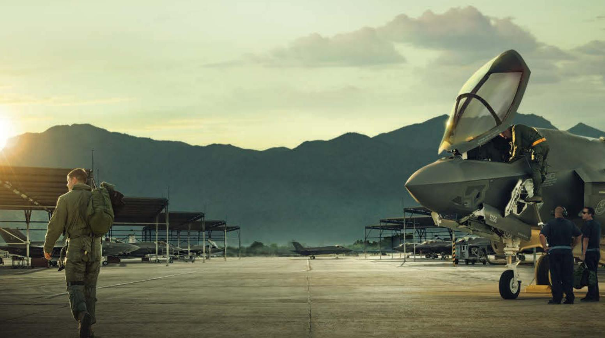

F-35A Lightning IIs have flown thousands of sorties powered by the F135 propulsion system developed from the highly successful fifth-generation engine for the F-22 Raptor. Pratt & Whitney partners with customers around the world to provide sustainment solutions that keep the F-35 Lightning II dependable and affordable. We are proud to power today’s most advanced fighter aircraft. Now we are advancing engine technology to provide the next generation of fighter engines for tomorrow’s defense needs. Learn more at www.pw.utc.com.

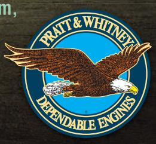

# The tyranny of distance; Singular circumstances; Bolstering security; Supporting Somalia ....

# ENABLERS

The bulk of Flintlock—US Africa Command’s premier special operations forces exercise—is based on one-to-one contact between troops on the ground. But about 60 Ohio Air National Guardsmen played a critical role in this year’s iteration: transporting people and equipment via air around a training area nearly twice the size of the continental United States.

More than 20 countries and 2,000 people participated in Exercise Flintlock 2017. It included events in Chad, Niger, Burkina Faso, Morocco, Tunisia, Cameroon, and Mauritania.

“We’re a force enabler, we’re able to bridge the gap between these large geographical locations,” said Lt. Col. Jeremy Ford, the director of operations for the 164th Airlift Squadron, 179th Airlift Wing, from Mansfield, Ohio. He served as director of the air operations center for Exercise Flintlock, headquartered in N’Djamena, Chad.

“We’re solving the tyranny of distance for this exercise,” Ford told Air Force Magazine.

The multinational activity is designed to build and strengthen partnerships and build the capacity to help the African nations “protect the civilian population, particularly against crossborder attacks from violent extremist groups,” Ford said.

The unit sent two C-130s and some five dozen people to Africa for the exercise, and as the “primary airlift mover” for Flintlock, they transported more than 400 people and 50 tons of cargo over the course of three weeks.

# HOT, DUSTY, SANDY

“These conditions, you can’t simulate back in the state of Ohio,” Ford said. “So being here in Africa with the hot, sandy, dusty conditions, where we’ve got to work through challenges with a limited amount of resources, … we had to kind of think outside the box and become creative.”

Ford said the exercise provided critical operational experience the airmen can use in the future and an opportunity for the unit to hone its skills as a force multiplier for Active Duty troops, particularly special operations forces.

“All these contingency operations we’re involved in today, it’s not just our Active Duty forces. It’s a combination of Active Duty, ANG, and Reserve forces. So when we’re able to train together and work together in an environment like this, it makes us more interoperable and it makes a better Total Force package,” Ford explained. “That real-world experience is going to pay off in the future for us.”

Ford said the airmen “learned a lot from this exercise about what we can expect from our special operations forces if we ever wanted to integrate with them in the future.”

Flintlock was also a way to increase interoperability with African partner nations and Western partner nations, he said.

Chadian Brig. Gen. Zakaria Ngobongue noted at the exercise’s opening ceremony that the environment “is plagued with insecurity” and said that Flintlock is “a great opportunity for our special forces to benefit from the shared training of participating nations.”

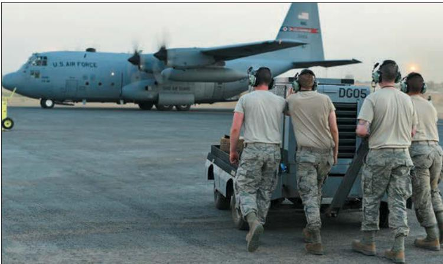  
179th Airlift Wing aircraft maintainers from the Ohio Air National Guard prepare a C-130 for the Flintlock 17 exercise.

“Terrorism, one of the major dangers of the third millennium, threatens the stability of states and security of citizens while fueling violence and hatred,” Ngobongue said.

The Air Guardsmen weren’t the only USAF personnel involved in the exercise; several Air Force Special Operations Command troops embedded in US Special Operations Command Africa participated, as well. Many were involved in medical training on the ground, Ford said.

“We’ve done the first-ever Chadian [casualty evacuation] training here in Chad this year, with our AFSOC folks and our Air Guard aircraft,” Ford explained.

The event included training on the ground and more in the air, with soldiers playing roles as patients, he said.

# GOING AFTER AL-SHABAB

Also in March, President Donald J. Trump approved a plan to provide offensive air strikes for the African Union Mission and efforts to defeat al-Shabab militants in Somalia. The authorization designated Somalia as an “active area of hostilities” for 180 days.

“This authority is consistent with our approach of developing capable Somali security forces and supporting regional partners in their efforts to combat al-Shabab,” Pentagon spokesman Navy Capt. Jeff Davis told reporters at the Pentagon.

Davis said the help will increase pressure on the Islamic militant group.

“We stand with the international community in supporting the federal government of Somalia as it strives to improve stability and security in Somalia. The additional support provided by this authority will help deny al-Shabab safe havens from which it could attack US citizens or US interests in the region,” Davis stated.

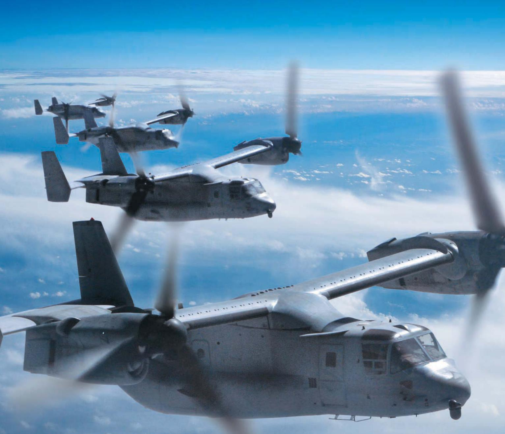

# V22 MAKES A DIFFERENCE. ALL THE DIFFERENCE.

# C O M B A T · H U M A N I T A R I A N · L O G I S T I C S · R E S C U E · S P E C I A L O P S · R E F U E L I N G

Every day, V-22 Ospreys are making a critical difference around the globe—executing combat, search and rescue, humanitarian, MEDEVAC and special operations missions in a fraction of the time of conventional rotorcraft. The tiltrotor’s unique blend of helicopter and turboprop performance is making it the platform of choice where speed, long range and survivability make all the difference.

# All Mattis on Deck

Defense Secretary James N. Mattis has had the unenviable job of presiding over his first budget drill—including the distribution of an additional $\$ 54$ billion for defense accounts next year—without any of his key civilian lieutenants in place.

Typically, a small army of Pentagon appointees, from the military services to the Office of the Secretary of Defense, weighs in on the annual budget, helping establish policy and priorities for a department that consumes more than $\$ 600$ billion annually.

But President Donald J. Trump has been slow to name his picks for the Pentagon’s most prestigious posts, leaving Mattis as the sole Trump appointee through much of the formation of the Fiscal 2018 budget request.

By early April, Heather A. Wilson, the President’s choice for Air Force Secretary, was the only defense nominee officially pending before the Senate. With about a month to go before the anticipated release of budget details, Trump had voiced his intention to nominate several people for other top jobs, including key budget positions like deputy secretary and comptroller.

In mid-March, the administration claimed a topline for defense spending that exceeds budget caps for next year by $\$ 54$ billion to help improve what the new Commander in Chief considers a depleted military.

Trump has made clear that aircraft, including advanced fighters, and ships are among his top priorities. But the administration won’t reveal the individual line items and their justifications until the full budget release later this spring, giving the department time to match the budget to the administration’s policies.

With Mattis alone at the Pentagon for the first several months of the administration, the task of drafting the budget falls to those who remain in the department, including Obama administration holdovers like Robert O. Work, who continued in his role as the No. 2 civilian. Many of those officials are budget veterans and perfectly capable of drafting the 2018 proposal, but their priorities may not line up with the new administration’s.

Meanwhile, career civilians and military officials are always heavily involved in the budget process but, in the absence of Senate-confirmed appointees, presumably have more sway this year. Like Obama holdovers, however, they do not have a stake in the politics and policies of the new administration.

All of this means that, while the budget will get done, longterm policies may have to wait until next year. The administration’s first real crack at using the defense budget to set the national security agenda likely will come in Fiscal 2019, after Trump’s picks have settled into the Pentagon.

In the meantime, however, Mattis and his team, once they receive Senate confirmation, will have to sell the request to Congress, a task made all the more difficult because of the additional defense funding requested for next year.

Indeed, the $\$ 54$ billion plus-up seems to have irked both sides of the aisle before the release of the formal budget request.

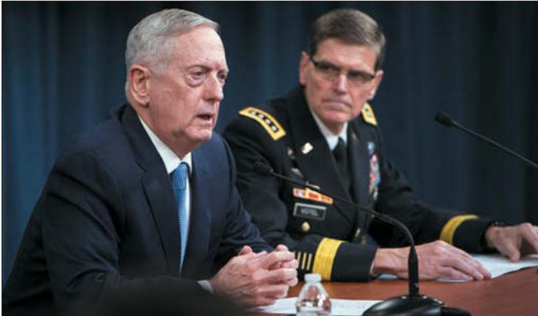  
Secretary of Defense James Mattis, here with Army Gen. Joseph Votel, head of US Central Command, is alone at the top.

Defense hawks such as the chairmen of the House and Senate Armed Services Committees don’t think it’s generous enough and would like to see another $\$ 37$ billon added to the Pentagon topline next year to pay for the military’s stated requirements, such as accelerated purchases of the F-35 strike fighter, and to boost lagging readiness levels.

During Wilson’s March confirmation hearing, Senate Armed Services Chairman John McCain (R-Ariz.) warned of a modernization bow wave facing the service, ticking off a number of expensive programs like the F-35, KC-46A tanker, and B-21 bomber.

“There is simply no way all of these important, yet expensive modernization programs will fit into the Air Force budget as constrained by the Budget Control Act,” McCain said. “It will be your task to develop and make the case for a path through this tremendous budget crunch.”

Democrats—particularly in the Senate, where 60 votes are required to pass any contentious legislation—may pose an even more difficult challenge to the Trump administration’s proposed defense boost.

The minority party has opposed previous GOP efforts to raise defense caps without a similar increase in nondefense spending. With deep cuts proposed at the State Department and for domestic programs, Democrats may wield their filibuster power to get more of their priorities funded. The result could be a stalled appropriations process across the federal government.

Senate Appropriations Ranking Member Sen. Patrick Leahy (D-Vt.) stressed during a March hearing that national security doesn’t fall only to the Defense Department, arguing that failure to invest in America will make the world less secure.

“While we must ensure that we do not have a ‘hollow force,’ we must also avoid a ‘hollow country,’” he said. “That is precisely what President Trump’s budget proposes,” Leahy asserted.

A Professional Development Event

# BREAKING BARRIERS: HERITAGE TO HORIZONS

S e p t e m b e r 1 8 - 2 0 2 0 1 7 N a t o n a H a r b o r M D

# Breaking Faith

“Pilots who don’t fly, maintainers who don’t maintain, air traffic controllers [who] don’t control—leave. ... An extended CR [continuing resolution] will also negate the pilot bonuses Congress authorized, which will ... break faith with the force. ... As a service Chief, I have many obligations, but one remains paramount: Every airman we send into harm’s way must be properly organized, trained, and equipped, and led to succeed in [his or her] mission. ... This is our moral obligation. A yearlong CR makes meeting this obligation extremely difficult.”—Gen. David L. Goldfein, USAF Chief of Staff, House Armed Services Committee, April 5.

# Turnabout

“The traditional warfighting paradigm of ground forces leading the fight supported by air forces has been supplanted by a construct where air forces supported by ground forces is often a much more responsive, effective, efficient, and less costly—in terms of both lives and dollars—manner in which to conduct warfare.”—Retired USAF Lt. Gen. David A. Deptula, prepared statement to Senate Armed Services airland subcommittee, Feb. 9.

# Vlad Vs. the Impaler

“What we need to do is understand Vladimir Putin for what he is—a murderer and a thug.”—Sen. John McCain (R-Ariz.), on the nature of the president of Russia, The Hill, Feb 9.

# Top of the Pack

“I am the first one that would like to see ... nobody have nukes, but we’re never going to fall behind any country, even if it’s a friendly country. We’re never going to fall behind on nuclear power. ... It would be wonderful, a dream would be that no country would have nukes, but if countries are going to have nukes, we’re going to be at the top of the pack.”—President Donald J. Trump, interview with Reuters, Feb. 23.

# Hard Truth

“No longer can the American taxpayer carry a disproportionate share of the defense of Western values. Americans cannot care more for your children’s future security than you do.”—Secretary of Defense James N. Mattis, address to NATO defense ministers in Brussels, Feb. 15.

# Naval Confusion

“We went from [a policy of] ‘Let’s not talk about gay people’ to complex conversations of gender identity and bathrooms. We leapfrogged 10 years of social growth in the Navy, and people from leadership all the way down to the deck plates did not know what to make of it.”—Retired Navy Capt. Rick Hoffman, Navy Times, Feb. 4.

# Abracadabra ... Not

“So much of what [USAF] does is assumed capability, and the way I describe it is it’s like a light switch. ... I actually don’t know how lights work, ... but here’s what I know. I know that when I walk into this room, I flip that switch and those lights come on. ... Much of what we do as an Air Force has become a light switch. ‘I don’t know how I got three bars on my GPS phone. It ... just happens. It’s magic.’ No, it ain’t magic. It’s 31 satellites being flown by airmen at Schriever Air Force Base right now. ... So here’s my concern: [If] we don’t put the resources against some of these key mission sets that the entire joint team relies on, those lights aren’t going to come on.”—Gen. David L. Goldfein, USAF Chief of Staff, remarks at Center for Strategic and International Studies, Feb. 23.

# The Warbot Cometh

“The winner of the next conflict will not likely be determined primarily by the state of their technologies, but by how well a nation’s military thinkers conceptualize future warfare in an integrated manner and then apply robotic systems, or warbots. ... ‘Warbots’ can be defined as robotic combat systems that can detect, identify, and apply lethal force to enemy combatants within prescribed parameters and without immediate human intervention. ... Most militaries continue to look at warbots as support weapons ... because it is easier to keep humans in the loop. ... Yet warbots offer tremendous potential advantages as primary combatants. They are simply more capable, cheaper, and offer less risk to humans than manned equivalents in many, if not most, combat situations.”—US Army Col. Brian M. Michelson, senior fellow at Atlantic Council, writing in The Bridge, Feb. 28.

# Gag Those Terrorists

“If you can’t talk, you can’t fight. It’s that simple. Our job is to create massive confusion in the Daesh [a pejorative Arabic nickname for ISIS] network. We are attacking their ability to command and control their forces and preventing them from executing against our Iraqi allies.”—Lt. Col. Josh Koslov, commander of an EC-130H Compass Call electronic warfare squadron, quoted in airforcetimes.com, Feb. 6.

# Message to Beijing

“Our long-standing policy on the Senkaku Islands stands. The US will continue to recognize Japanese administration of the islands and, as such, Article 5 [collective defense] of the US-Japan Security Treaty applies.”— Secretary of Defense James N. Mattis, joint press conference with Japanese Defense Minister Tomomi Inada, Feb. 4. The Senkakus are claimed by both Japan and China.

# Hope for the Hollow

“The important thing to me is this [the Trump administration’s proposed increase in DOD spending] is a clear statement of recognition that we are heading towards a hollow force. There’s not just a readiness crisis. There’s enormous modernization challenges, and you have trouble maintaining [operational] tempo. That’s the textbook definition of a force that’s heading to hollow.”—James Jay Carafano, Heritage Foundation national security specialist, quoted in defensenews.com, Feb. 27.

# Keep the Politics Out

“The oath we take, and we retake every time we are promoted, is to support and defend the Constitution of the United States against all enemies, foreign and domestic. By design, we don’t pledge support to any particular party or any particular leader. We’re an apolitical military.”—Gen. David L. Goldfein, USAF Chief of Staff, remarks to reporters in Washington, D. C., Feb. 7.

# Become aFLIGHT LEADER

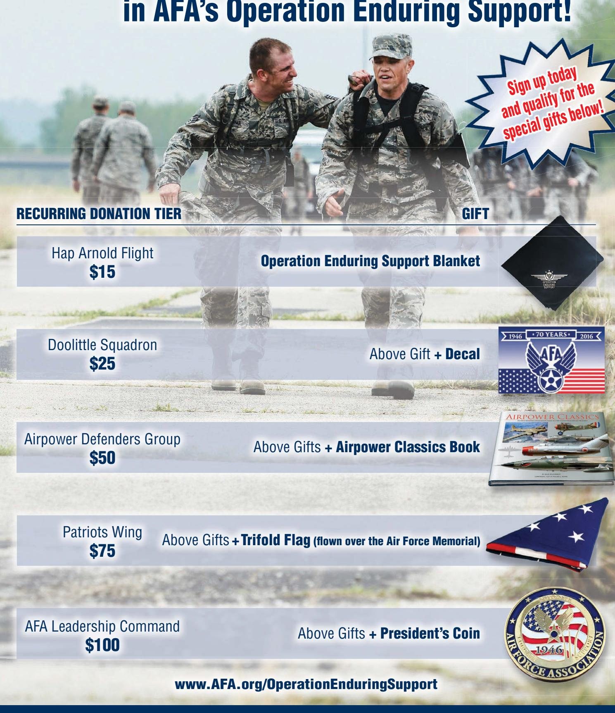

# We are YOUR Air Force Association We are AIRMEN for LIFE

# 04.15.2017

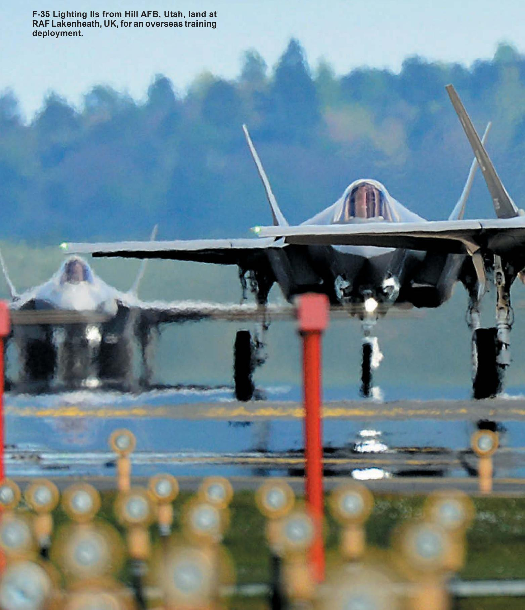

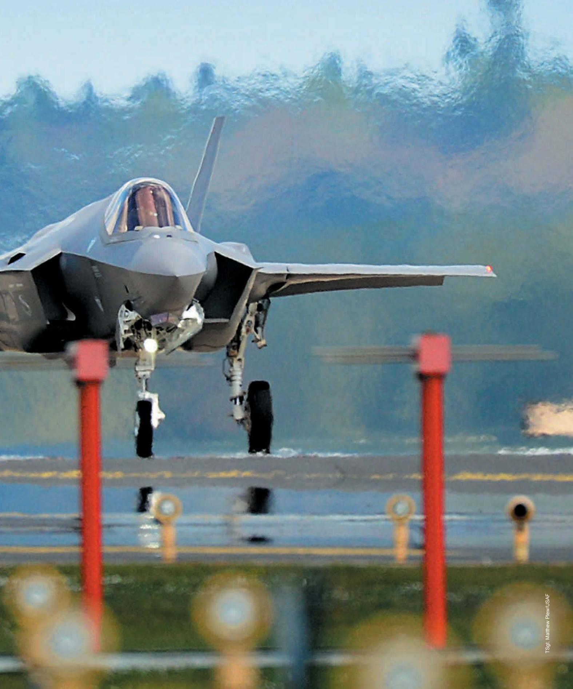

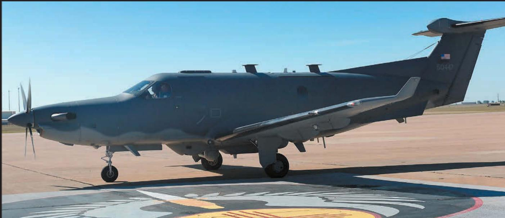

A 318th Special Operations Squadron U-28A aircraft at Cannon Air Force Base, N.M., in 2013.

# ■ Three Airmen Killed in Cannon U-28 Crash

Three airmen died March 14 when their U-28A aircraft crashed during a training fl ight near Cannon AFB, N.M.

Capt. Andrew Becker, 33, was a pilot for the 318th Special Operations Squadron at Cannon. He was from Novi, Mich. Capt. Kenneth Dalga, 29, was a combat systems offi cer for the 318th SOS, from Goldsboro, N.C. First Lt. Frederick Dellecker, 26, was a copilot assigned to the 318th SOS. He was from Daytona Beach, Fla.

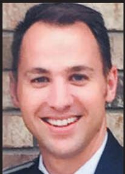  
Becker

The airmen were fl ying a routine training sortie when the aircraft went down at about 6:50 p.m. near Clovis Municipal Airport, said 27th Special Operations Wing Commander Col. Benjamin R. Maitre. The Air Force has launched an investigation into the crash.

  
Dalga

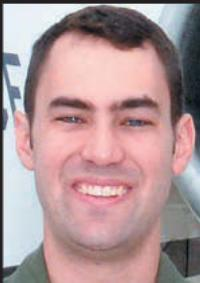  
Dellecker

“Cannon Air Force Base [is] a tight-knit installation and wing-focused on getting the mission done, and obviously any time an incident like this occurs, it hits us hard,” Maitre said.

# ■ Mountain Home Airman Killed

# in Southwest Asia

SSgt. Alexandria Mae Morrow, 25, of Dansville, N.Y., died March 22 while deployed to Southwest Asia for Operation Inherent Resolve. Morrow was part of the 366th Aircraft Maintenance Squadron at Mountain Home AFB, Idaho.

She died while performing maintenance duties, according to a Pentagon statement. Mountain Home, on its Facebook page, said Morrow sustained a fatal injury while “executing her duties as a weapons loader” and that “those who knew her valued her love of life and art, her leadership, her skills, and her passion.”

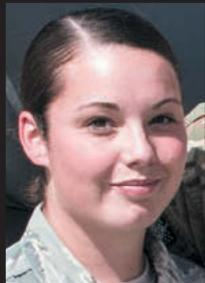  
Morrow

# ■ Security Forces Airman Dies in Syria

SSgt. Austin Bieren, 25, of Umatilla, Ore., died March 28 in northern Syria of reported natural causes. He was assigned to the 21st Space Wing at Peterson AFB, Colo., and was deployed in support of combat operations, according to a Defense Department statement.

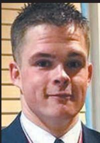  
Bieren

Bieren, a security forces airman, was the second US service member to die in Syria during Operation Inherent

Resolve. In November, Navy explosive ordnance disposal technician Senior Chief Petty Officer Scott Cooper Dayton was killed in a combat incident.

# ■ The Air Force’s Low Aircraft Availability Rates

Across nearly all of its combat and mobility aircraft, the Air Force is failing to meet aircraft availability standards, according to data the service recently provided to Congress.

“The Air Force has a challenge in aircraft availability, and we are trying to shore that up,” Col. Michael Lawrence, chief of the maintenance division in the logistics directorate, told Air Force Magazine.

Aircraft availability measures what percent of an entire aircraft fl eet is ready to perform its primary mission and, unlike more commonly cited mission capable rates, includes aircraft undergoing major repairs or overhauls. It offers “a mechanism to understand the relative health of any fl eet,” he said. The data show that in the fourth quarter of 2016, 16 of the 17 USAF aircraft fl eets included in the survey had availability rates below the standard that indicates a fl eet in good health. Additionally, only six of the 17 aircraft types had availability rates within fi ve percentage points of the standard, considered by maintainers as an acceptable deviation from the norm.

While warning that “every weapons system has its own story,” Lawrence said three main factors contribute to the servicewide low rates of aircraft availability. Some of the lowest rates during that time period were among platforms undergoing service life extension programs, like the B-1 and B-2.

Here, “there is a need to prepare for a near-peer adversary,” Lawrence said. “It’s painful to take these aircraft off the front lines, but we know we’ve got to do it.”

The F-22A Raptor also suffered a low availability rate, at 46 percent. Lawrence said this was primarily caused by work on the aircraft’s stealthy low observable platform surfaces.

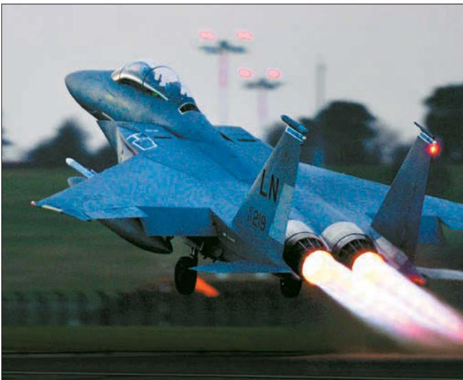  
An F-15E takes off from RAF Lakenheath, UK, in February.

Second, as the average age of the Air Force inventory increases, “the amount of time we have to spend working on those aircraft tends to increase,” leaving them in the depots longer.

Third, “the maintenance manpower shortfall” has had an impact on aircraft availability. The data were provided to the House Armed Services readiness subcommittee ahead of a March 22 hearing on the current state of the Air Force.

<table><tr><td rowspan=1 colspan=1></td><td rowspan=1 colspan=1>Models</td><td rowspan=1 colspan=1>Total AircraftInventory</td><td rowspan=1 colspan=1>Aircraft Availability(AA) Standard</td><td rowspan=1 colspan=1>3-Month AA Avg(Oct-Dec 16)</td><td rowspan=1 colspan=1>10-yr AA Avg(FY 06-16)</td></tr><tr><td rowspan=11 colspan=1>.CombatAir Forces</td><td rowspan=1 colspan=1>A-10C</td><td rowspan=1 colspan=1>283</td><td rowspan=1 colspan=1>72%</td><td rowspan=1 colspan=1>62%</td><td rowspan=1 colspan=1>62%</td></tr><tr><td rowspan=1 colspan=1>B-1B</td><td rowspan=1 colspan=1>62</td><td rowspan=1 colspan=1>55%</td><td rowspan=1 colspan=1>40%</td><td rowspan=1 colspan=1>41%</td></tr><tr><td rowspan=1 colspan=1>B-2A</td><td rowspan=1 colspan=1>20</td><td rowspan=1 colspan=1>58%</td><td rowspan=1 colspan=1>39%</td><td rowspan=1 colspan=1>38%</td></tr><tr><td rowspan=1 colspan=1>B-52H</td><td rowspan=1 colspan=1>75</td><td rowspan=1 colspan=1>61%</td><td rowspan=1 colspan=1>59%</td><td rowspan=1 colspan=1>59%</td></tr><tr><td rowspan=1 colspan=1>CV-22B</td><td rowspan=1 colspan=1>50</td><td rowspan=1 colspan=1>71%</td><td rowspan=1 colspan=1>65%</td><td rowspan=1 colspan=1>51%</td></tr><tr><td rowspan=1 colspan=1>F-15C</td><td rowspan=1 colspan=1>212</td><td rowspan=1 colspan=1>63%</td><td rowspan=1 colspan=1>56%</td><td rowspan=1 colspan=1>62%</td></tr><tr><td rowspan=1 colspan=1>F-15D</td><td rowspan=1 colspan=1>24</td><td rowspan=1 colspan=1>63%</td><td rowspan=1 colspan=1>60%</td><td rowspan=1 colspan=1>61%</td></tr><tr><td rowspan=1 colspan=1>F-15E</td><td rowspan=1 colspan=1>218</td><td rowspan=1 colspan=1>66%</td><td rowspan=1 colspan=1>69%</td><td rowspan=1 colspan=1>65%</td></tr><tr><td rowspan=1 colspan=1>F-16C</td><td rowspan=1 colspan=1>791</td><td rowspan=1 colspan=1>66%</td><td rowspan=1 colspan=1>65%</td><td rowspan=1 colspan=1>67%</td></tr><tr><td rowspan=1 colspan=1>F-16D</td><td rowspan=1 colspan=1>156</td><td rowspan=1 colspan=1>66%</td><td rowspan=1 colspan=1>54%</td><td rowspan=1 colspan=1>65%</td></tr><tr><td rowspan=1 colspan=1>F-22A</td><td rowspan=1 colspan=1>182</td><td rowspan=1 colspan=1>72%</td><td rowspan=1 colspan=1>46%</td><td rowspan=1 colspan=1>56%</td></tr><tr><td rowspan=6 colspan=1>MobilityAir Forces</td><td rowspan=1 colspan=1>C-17A</td><td rowspan=1 colspan=1>222</td><td rowspan=1 colspan=1>79%</td><td rowspan=1 colspan=1>72%</td><td rowspan=1 colspan=1>72%</td></tr><tr><td rowspan=1 colspan=1>C-130H</td><td rowspan=1 colspan=1>217</td><td rowspan=1 colspan=1>64%</td><td rowspan=1 colspan=1>63%</td><td rowspan=1 colspan=1>62%</td></tr><tr><td rowspan=1 colspan=1>C-130J</td><td rowspan=1 colspan=1>107</td><td rowspan=1 colspan=1>72%</td><td rowspan=1 colspan=1>69%</td><td rowspan=1 colspan=1>74%</td></tr><tr><td rowspan=1 colspan=1>KC-10A</td><td rowspan=1 colspan=1>59</td><td rowspan=1 colspan=1>78%</td><td rowspan=1 colspan=1>64%</td><td rowspan=1 colspan=1>70%</td></tr><tr><td rowspan=1 colspan=1>KC-135R</td><td rowspan=1 colspan=1>344</td><td rowspan=1 colspan=1>80%</td><td rowspan=1 colspan=1>66%</td><td rowspan=1 colspan=1>68%</td></tr><tr><td rowspan=1 colspan=1>KC-135T</td><td rowspan=1 colspan=1>54</td><td rowspan=1 colspan=1>80%</td><td rowspan=1 colspan=1>61%</td><td rowspan=1 colspan=1>69%</td></tr></table>

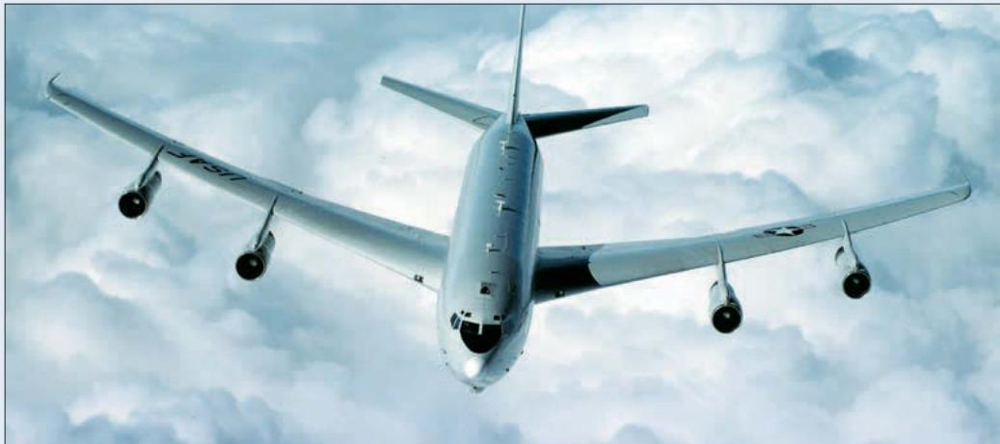

An E-8C JSTARS assigned to the 116th Air Control Wing at Robins AFB, Ga., was aged by contractors in 2015-16.

in the radome, damaging the antenna and other electrical components, including 240 circuit cards, according to AFMC.

The AFMC Accident Investigation Board determined the contract personnel did not ensure the drain holes were uncovered during an inspection after a washing and during four prefl ight inspections.

# ■ Maintenance Error Causes $\$ 7.35$ Million in Damage

Contract maintainers left drain holes covered during depot maintenance of an E-8C JSTARS between March 2015 and July 2016. This let water accumulate and caused about $\$ 7.35$ million in damage to the aircraft, according to an Air Force Materiel Command investigation.

The E-8C, assigned to the 116th Air Control Wing at Robins AFB, Ga., was in depot maintenance at a Northrop Grumman facility in Lake Charles, La. During the maintenance, contractor personnel covered three holes in the radome on the belly of the aircraft. Water from washings and rain collected

# ■ Holmes Takes Command of ACC

Gen. James M. “Mike” Holmes assumed control of Air Combat Command from Gen. Herbert J. “Hawk” Carlisle on March 10 during a ceremony at JB Langley-Eustis, Va. Holmes previously served as USAF deputy chief of staff for strategic plans and requirements at the Pentagon. Carlisle, who had led the command since 2014, retired after 39 years in uniform.

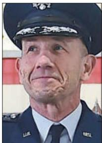

# Holmes

“There has never been a more important time to serve in uniform, and you truly represent the greatest treasure in our nation’s arsenal,” Chief of Staff Gen. David L. Goldfein told the audience of ACC airmen during the ceremony. Carlisle said, “I have absolute, complete confidence in Mike Holmes and Sarah, that they are the right team to lead this command in the future and to greater heights.”

“Northrop maintenance quality assurance inspectors were required to ensure all drain holes were free from obstructions after being washed, but failed to do so,” the report states. “The accumulated water, and subsequent cycling of the antenna, which produced an electrical current, damaged the antenna’s electrical components.”

After assuming command, Holmes told the ACC airmen, “We now face new and revised challenges from both great and regional powers who threaten the survival of our American experiment.” He went on to say the ability of the nation to fend off these threats “certainly depends on the capabilities you bring as part of a joint team.”

The Air Force has not determined if Northrop Grumman will incur a fi nancial penalty for the incident; however, the maintenance contract lets the service evaluate if the contractor’s performance merits the payment of an award fee, according to AFMC.

# By the Numbers

3,878

The number of weapons released by US and coalition forces in the month of March for Operation Inherent Resolve—a new high for the operation that is now more than two years old.

Source: US Air Forces Central Command Airpower Summary, March 2017.

# ■ THAAD Deployment Begins in South Korea

A C­17 delivered the first elements of a Terminal High Altitude Area Defense system to Osan AB, South Korea, in early March.

“The timely deployment of the THAAD system by US Pacific Command and the Secretary of Defense gives my command great confidence in the support we will receive when we ask for reinforcement or advanced capabilities,” the US Forces Korea commander, Army Gen. Vincent K. Brooks, said in a news release.

The deployment came the same day North Korea launched four ballistic missiles into the Sea of Japan. Defense Secretary James N. Mattis and Japanese Minister of Defense Tomomi Inada agreed “that these launches are an unacceptable and irresponsible act” that undermines stability in the region, according to a Pentagon statement.

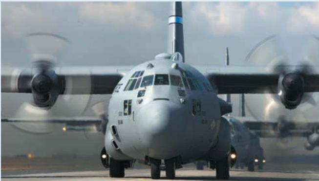  
US and Polish C-130 Hercules aircraft prepare to fly a fourship formation at Powidz AB, Poland, in March.

# ■ It’s Official: USAF Needs a Minimum of 100 B-21s

The Air Force’s requirement for the B­21 Raider bomber, initially stated as $\mathfrak { a } _ { 0 }$ to ${ 1 0 0 } ^ { \mathfrak { n } }$ airplanes, is now officially at least 100 aircraft, the Air Force said. Written testimony presented to the House Armed Services Committee by Vice Chief of Staff Gen. Stephen W. Wilson indicated that 100 is now the minimum number of B­21s required.

Through a spokesman, the Air Force confirmed the number, saying the change happened “in spring $2 0 1 6 "$ at the request of Air Force Global Strike Command. At that time, USAF established 100 “as the floor—not the ceiling” for the B­21 fleet size, he said. AFGSC “requires a minimum of 100 B­21 Raider aircraft, with a mix of legacy bombers, to meet future COCOM [combatant commander] requirements,” the spokesman said.

He said that AFGSC chief Gen. Robin Rand told AFA’s Mitchell Institute in July last year that 100 aircraft, and “not one single one below that,” was his “best military advice” on the B­21 fleet size.

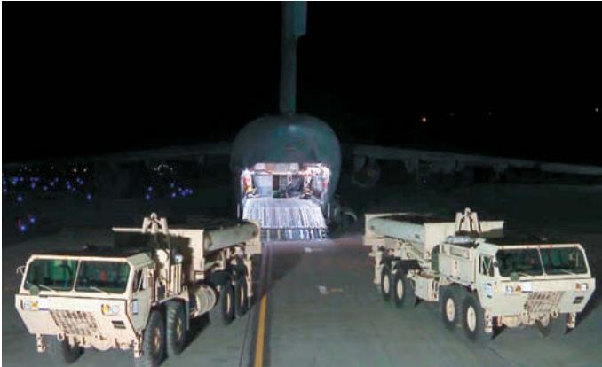  
An Air Force C-17 delivers the first two Terminal High Altitude Area Defense (THAAD) launchers to Osan AB, South Korea, in March.

North Korean leader Kim Jong Un has already fired some 120 ballistic missiles in his five years of reign—that’s a significant increase from his father, Kim Jong Il, who fired just 34 ballistic missiles over the course of 17 years, Pacific Air Forces boss Gen. Terrence J. O’Shaughnessy told reporters at AFA’s Air Warfare Symposium in Orlando, Fla.

# ■ Air Force To Increase Rotational Presence in Europe

The Air Force will increase its rotational presence in Europe thanks to a significant boost in European Reassurance Initiative funding in the Fiscal 2017 budget, US Air Forces in Europe Commander Gen. Tod D. Wolters said at AFA’s Air Warfare Symposium. The increased number of theater security packages will be “equivalent to what you see with the introduction of the brigade combat team” in Europe, he said.

In November 2016, the Army announced plans to deploy 5,700 troops from two brigades to Europe for Operation Atlantic Resolve, which provides reassurance to NATO allies in response to Russian aggression in the region. Wolters said he’s also “very excited about the insertion” of four multinational battlegroups in Estonia, Latvia, Lithuania, and Poland on a rotational basis.

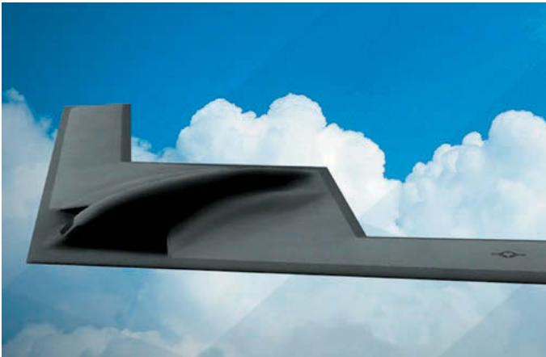

“I can’t imagine how I would deal with the missions I have, with fewer bombers than we have in today’s inventory,” Rand said in his Mitchell remarks. Because of the B­21’s secrecy, it was not explained then that Rand’s advice had become official policy.

# The War on Terrorism

# US Central Command Operations: Freedom’s Sentinel and Inherent Resolve

# ■ Casualties

As of April 18, a total of 35 Americans had died in Operation Freedom’s Sentinel in Afghanistan, and 39 Americans had died in Operation Inherent Resolve in Iraq and Syria.

The total includes 71 troops and three Department of Defense civilians. Of these deaths, 31 were killed in action with the enemy while 43 died in noncombat incidents.

There have been 165 troops wounded in action during OFS and 34 troops in OIR.

# ■ Civilian Deaths in Mosul Air Strike Investigated

US Central Command is investigating a March 17 strike in Mosul that reportedly killed more than 100 civilians. The strike in Mosul’s al-Jadida neighborhood hit a building where more than 100 people were hiding. Iraqi security forces requested the strike, which targeted ISIS fi ghters and equipment, Combined Joint Task Force-Operation Inherent Resolve said.

CENTCOM chief Army Gen. Joseph L. Votel said in a statement that the death of the civilians is a tragedy, and “we are investigating the incident to determine exactly what happened and will continue to take extraordinary measures to avoid harming civilians.” The fi ght in Mosul is diffi cult because ISIS fi ghters are operating among civilians.

# ■ Death of Top Al Qaeda, Taliban Leaders Confi rmed

A Febuary air strike killed Mullah Abdul Salam, the Taliban’s commander for the province of Kunduz. The

Taliban said a remotely piloted aircraft killed Salam, along with four of his top associates.

“Mullah Salam and the Taliban fighters under him murdered and terrorized the people of Kunduz for too long,” said Army Gen. John W. Nicholson Jr., commander of US forces in Afghanistan, according to Voice of America.

The Department of Defense also confirmed that a March 19 US air strike in Paktika province, Afghanistan, killed high-ranking al Qaeda leader Qari Yasin. A native of Pakistan, Yasin helped plan a September 2008 bombing of the Marriott Hotel in Islamabad that killed dozens, including USAF Maj. Rodolfo I. Rodriguez and Navy 3rd Class Petty Officer Matthew J. O’Bryant. Yasin was also implicated in a 2009 attack on a bus carrying the Sri Lankan cricket team in Lahore.

“The death of Qari Yasin is evidence that terrorists who defame Islam and deliberately target innocent people will not escape justice,” said Secretary of Defense James N. Mattis, in a DOD press release.

# ■ Three US Soldiers Injured in Insider Attack

Three US soldiers stationed at Camp Antonik, in the Washer district of Helmand province, were wounded there when an Afghan soldier opened fire on them March 19. Coalition forces on base responded and killed the shooter, according to US Forces Afghanistan.

The shooting was the first insider attack on US forces in Afghanistan this year.

# What Is the Intelligence Community?

President Donald Trump’s new administration has been at odds with the Intelligence Community (IC) from the onset, to put it mildly.

In mid-February, news outlets announced that the White House planned a broad review of American intelligence agencies.

The news came the same day Trump blamed the Intelligence Community for leaks resulting in his National Security Advisor Michael T. Flynn’s resignation.

The next day, the FBI released 398 pages of documents connected to a 1973 Justice Department lawsuit against Trump that alleged housing discrimination by his real estate company in New York City.

Tensions between the President and the IC have been high since before the election, so what exactly is the Intelligence Community?

# TWO PARTS OF THE DNI’S BUDGET

1. The national intelligence program consists of all Intelligence Community programs, projects, and activities that primarily support more than one department or agency or provide a service of common concern for the IC.

2. The military intelligence program comprises intelligence programs, projects, and activities that primarily support military operations or address a unique Department of Defense requirement.

Simply put, the IC is a group of 16 intelligence agencies or departments, like the FBI and NSA, and the overseer of them all is the Office of the Director of National Intelligence. The ODNI, created by 2004 legislation, exists to integrate efforts, make operations efficient, and communicate succinctly with the White House.

Trump chose former Republican Sen. Dan Coats of Indiana to be his Director of National Intelligence, and the Senate confirmed him in midMarch.

The DNI’s budget is broken into two parts. A DNI spokesperson told Air Force Magazine the office doesn’t disclose details about its budget or how it’s allocated among the intel community, nor how many employees each component has.

For 2016, DNI requested $\$ 53.9$ billion for its national intelligence program, or the part of the budget addressing the Intelligence Community. It received $\$ 53$ billion.

Below, we break out each of the Intelligence Community members alphabetically.

<table><tr><td rowspan=1 colspan=1>INTELLIGENCE COMMUNITY MEMBERS</td><td rowspan=1 colspan=1>AROUNDSINCE</td><td rowspan=1 colspan=1>HEADED BY</td></tr><tr><td rowspan=1 colspan=1>Office of the Director of National Intelligence</td><td rowspan=1 colspan=1>2004</td><td rowspan=1 colspan=1>Dan Coats</td></tr><tr><td rowspan=1 colspan=1>Air Force Intelligence, Surveillance, and Reconnaissance</td><td rowspan=1 colspan=1>1948</td><td rowspan=1 colspan=1>Lt. Gen. VeraLinn &quot;Dash&quot; Jamieson, USAF</td></tr><tr><td rowspan=1 colspan=1>Army Intelligence</td><td rowspan=1 colspan=1>1885</td><td rowspan=1 colspan=1>Lt. Gen. Robert P. Ashley Jr, USA</td></tr><tr><td rowspan=1 colspan=1>Central Intelligence Agency</td><td rowspan=1 colspan=1>1947</td><td rowspan=1 colspan=1>Michael R. Pompeo</td></tr><tr><td rowspan=1 colspan=1>Coast Guard Intelligence</td><td rowspan=1 colspan=1>2001</td><td rowspan=1 colspan=1>RearAdm. Robert P. Hayes</td></tr><tr><td rowspan=1 colspan=1>Defense Intelligence Agency</td><td rowspan=1 colspan=1>1961</td><td rowspan=1 colspan=1>Lt. Gen. Vincent R. Stewart, USMC</td></tr><tr><td rowspan=1 colspan=1>Department of Energy&#x27;s Office of Intelligence and Counterintelligence</td><td rowspan=1 colspan=1>2006</td><td rowspan=1 colspan=1>Steven K. Black</td></tr><tr><td rowspan=1 colspan=1>Department of Homeland Securit&#x27;s Office of Intelligence and Analysis</td><td rowspan=1 colspan=1>2005</td><td rowspan=1 colspan=1>Patricia F. S. Cogswell</td></tr><tr><td rowspan=1 colspan=1>Department of State&#x27;s Bureau of Intelligence and Research</td><td rowspan=1 colspan=1>1947</td><td rowspan=1 colspan=1>Daniel B. Smith</td></tr><tr><td rowspan=1 colspan=1>Department of Treasury&#x27;s Office of Intelligence and Analysis</td><td rowspan=1 colspan=1>2004</td><td rowspan=1 colspan=1>Daniel McGlynn (acting)</td></tr><tr><td rowspan=1 colspan=1>Drug Enforcement Administration&#x27;s Office of National Security Intelligence</td><td rowspan=1 colspan=1>2006</td><td rowspan=1 colspan=1>Doug Poole</td></tr><tr><td rowspan=1 colspan=1>Federal Bureau of Investigation&#x27;s Intelligence Branch</td><td rowspan=1 colspan=1>2014</td><td rowspan=1 colspan=1>Joshua D. Skule</td></tr><tr><td rowspan=1 colspan=1>Marine Corps Intelligence</td><td rowspan=1 colspan=1>1939</td><td rowspan=1 colspan=1>Brig. Gen. William H. SeelyI, USMC</td></tr><tr><td rowspan=1 colspan=1>National Geospatial-iteligence Agency</td><td rowspan=1 colspan=1>2003</td><td rowspan=1 colspan=1>Robert Cardillo</td></tr><tr><td rowspan=1 colspan=1>National Reconnaissance Office</td><td rowspan=1 colspan=1>1961</td><td rowspan=1 colspan=1>Betty J. Sapp</td></tr><tr><td rowspan=1 colspan=1>National Security Agency/Central Security Service</td><td rowspan=1 colspan=1>1952</td><td rowspan=1 colspan=1>Adm. Michael S. Rogers</td></tr><tr><td rowspan=1 colspan=1>Naval Intelligence</td><td rowspan=1 colspan=1>1882</td><td rowspan=1 colspan=1>Vice Adm. Jan Tighe</td></tr></table>

# Life at Bagram

# forces in country declines, much still stays the same.

n January, the number of US military personnel inside Afghanistan decreased to about 8,500 focused on both Operation Resolute Support, the continuing commitment to training, advising, and assisting the Afghan forces, and Operation Freedom’s Sentinel, the military mission to target the Taliban, al Qaeda, and now ISIS in the country. The majority of these forces are at Bagram, home of the Air Force’s 455th Air Expeditionary Wing. US, NATO, and Afghan aircraft line the two, 9,800-plus foot long airstrips and 32 acres of ramp space.

The wing includes about 2,000 airmen, fl ying and maintaining dozens of aircraft that make their way through the fi ght in Afghanistan.

That number has dropped in recent years, however. Bagram houses only one dedicated fi ghter squadron for the operations. In January, that unit was the 79th Expeditionary Fighter Squadron deployed from Shaw AFB, S.C. The F-16s of the 79th stay on call, able to fl y anywhere in the country within one hour to conduct close air support.

“Even though there is only one person in the airplane, we always fl y as a team,” Major Joseph, the squadron’s director of operations, said in a news release. (The Air Force doesn’t provide the last names of deployed combat pilots.) This gives the pilot “access to countless resources.”

These combat aircraft have been increasingly busy in Afghanistan, as fi ghts against the Taliban and ISIS have increased.

A 79th Expeditionary Fighter Squadron F-16 is prepared for a mission on Jan. 13, 2017, at Bagram Airfi eld, Afghanistan. For thousands of airmen, Bagram is, at least for now, home.

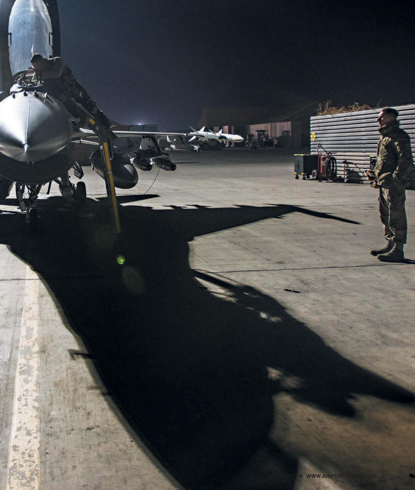

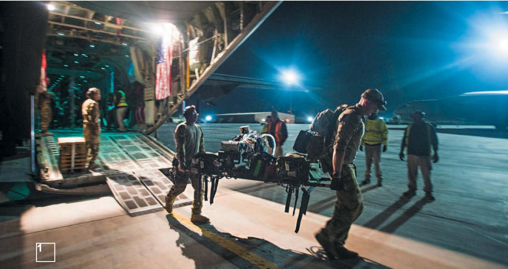

In February, US aircraft dropped 200 bombs in Afghanistan. This is the highest since October 2016—and the second highest since September 2014. This uptick came after the Obama administration in 2015 gave US forces increased authority to go after ISIS, and USAF took on that mission without boosting the number of deployed aircraft.

The combat effort has continued from Bagram even as the amount of tanker support at the base has dropped. As of early 2017, the Air Force no longer deploys tankers to the base full time and instead flies support missions from outside the country, said Maj. Gen. Jay B. Silveria, deputy commander of US Air Forces Central Command.

The Air Force keeps rescue aircraft, including HH-60G Pave Hawks, and aircrews deployed to Bagram on alert for personnel recovery missions. A flow of mobility aircraft and intelligence, surveillance, and reconnaissance aircraft rotate through Bagram’s massive apron.

The Air Force’s longest deployed unit in Afghanistan passed 15 years in country in January. The 41st Electronic Combat Squadron and the 755th Aircraft Maintenance Squadron of Davis-Monthan AFB, Ariz., have been continuously deployed with their EC130H Compass Call aircraft since Operation Enduring Freedom began and have been at Bagram since 2004. The Compass Call disrupts enemy command and control by “jamming” electronics. The 41st has flown more than 39,000 hours during 6,800 combat sorties in Afghanistan.

The renewed threat from the Taliban means that as of March, some 15-and-a-half years since combat began, “we are at a stalemate,” US Central Command chief Army Gen. Joseph L. Votel told lawmakers in late March. “But stalemates have a tendency to decline over time.”

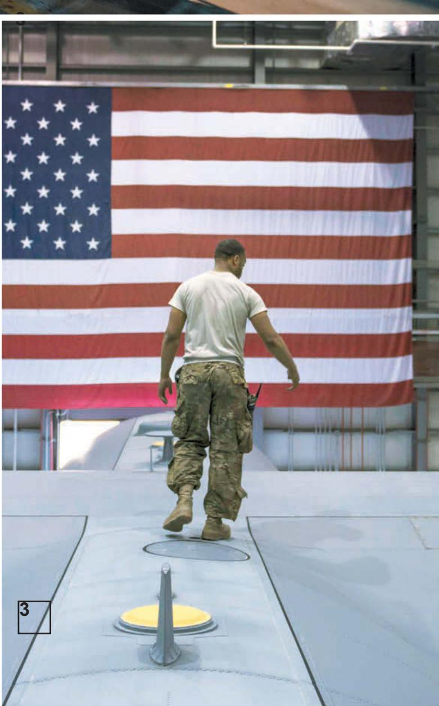

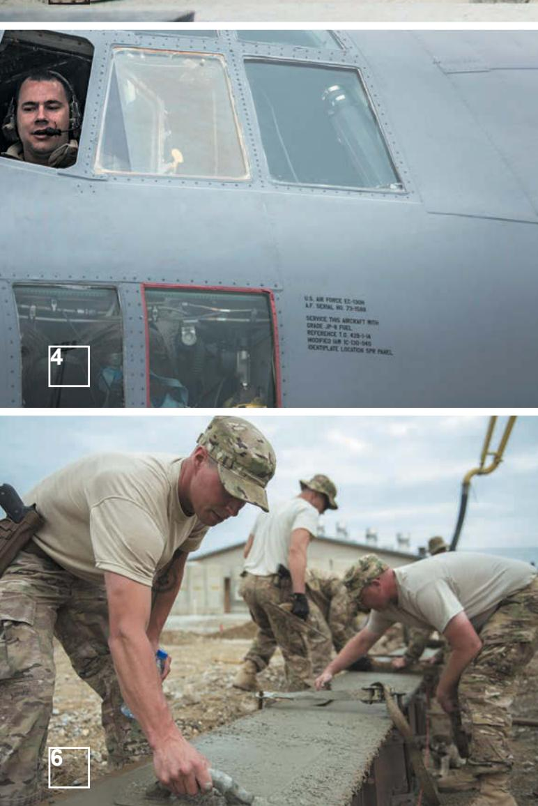

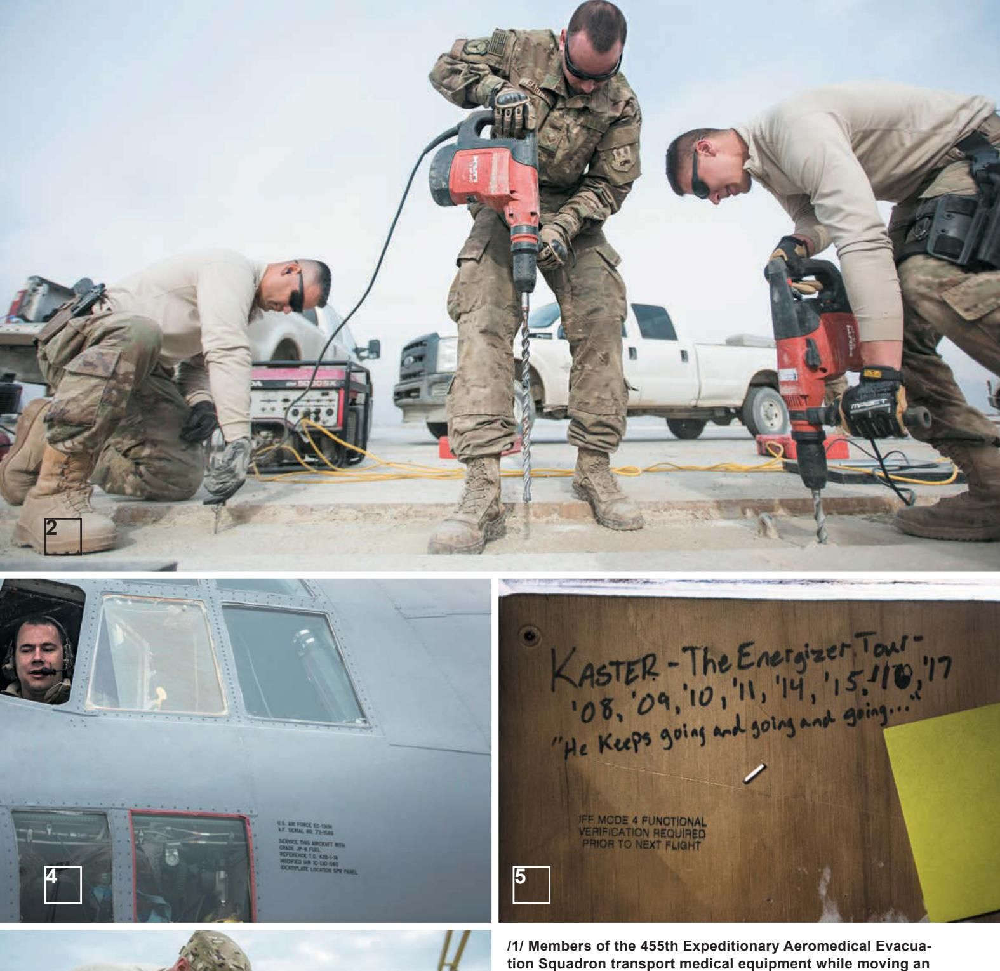  
injured Afghan National Army soldier from Kandahar Airfield to the Craig Joint Theater Hospital at Bagram Airfield on Feb. 22. /2/ TSgt. Miguel Castano, left, SrA. Adam Parizo, and A1C Abram Burkhart repair a section of Bagram’s runway on Feb. 1. Constant aircraft traffic wears down the concrete of the base’s two huge airstrips. /3/ SrA. Shannon Wilson, a crew chief with the 455th EAMXS, inspects a C-130J Super Hercules for damage on June 4, 2016. /4/ TSgt. Tony Rivera, a crew chief, in the cockpit of a EC-130H Compass Call. Members of his unit have 146 deployments among them. /5/ TSgt. Bob Kaster, a technician for EC-130Hs, displays deployment dates on his office door. /6/ SSgt. Jacob Skjei, 455th Expeditionary Civil Engineer Squadron, smooths out a concrete footer.

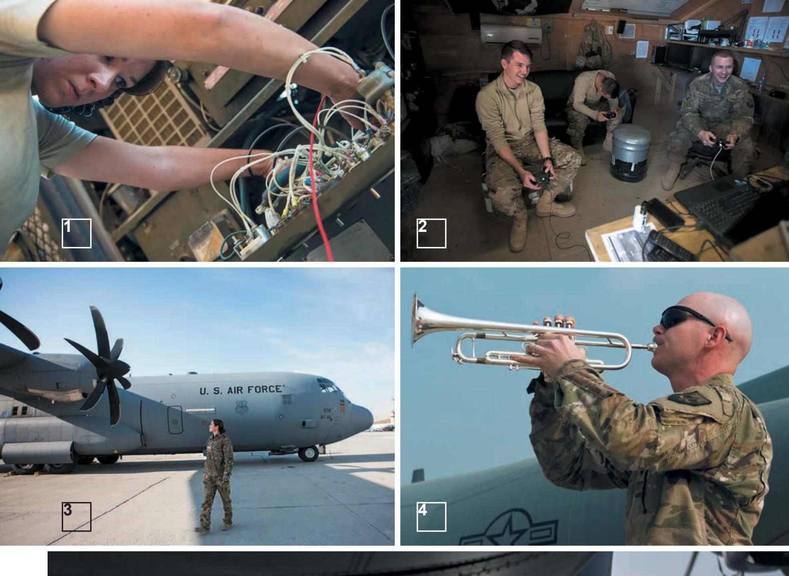

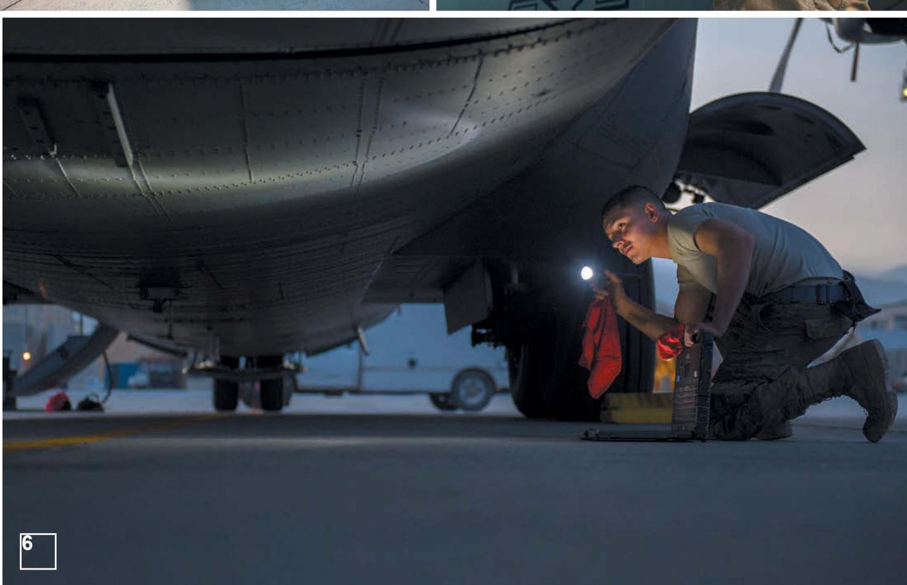

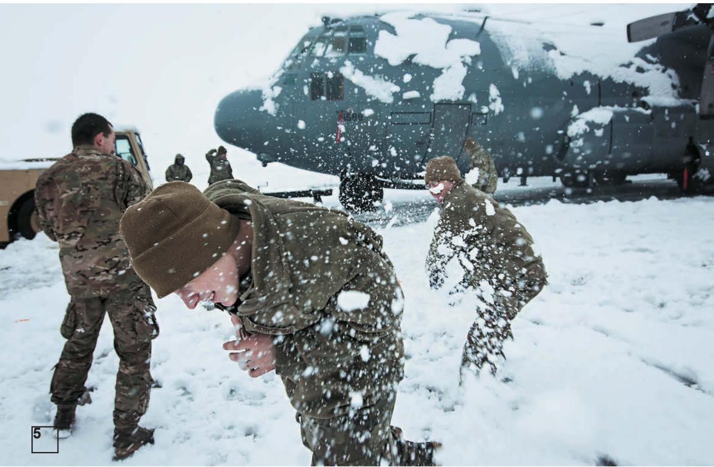

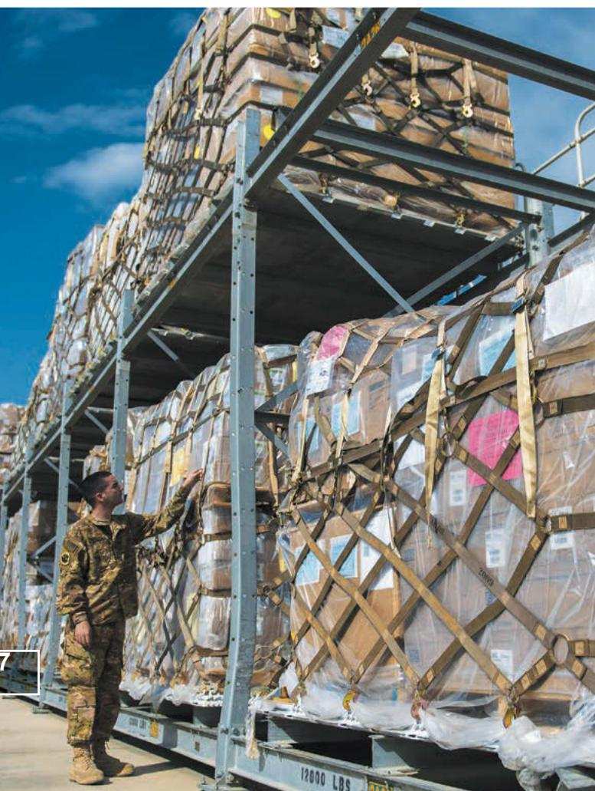

NATO as of early 2017 has a 13,000-member force deployed as part of the International Security Assistance Force for the Resolute Support mission, with its hub at Bagram. The number in Afghanistan peaked at 130,000 in 2011. Those at Bagram not focused on counterterrorism work with the Afghan force to build its capability, and for the US Air Force that involves helping to stand up and assist in the operation of Afghanistan’s small but busy fleet.

The Afghan air force has 12 A-29 Super Tucanos, four delivered early this year. The pilots and maintainers are trained in the US at Moody AFB, Ga., and have recently been flying /1/ SSgt. Amy Teston, 455th EAMXS aerospace ground equipment journeyman, completes a generator voltage check on Sept. 22, 2016. /2/ SrA. Domynic Panto, Kaster, and A1C Mitchell Dillon, play a video game Jan.12 at Bagram. /3/ Capt. Amanda Montague, 774th Expeditionary Airlift Squadron pilot, performs a prefl ight inspection of her aircraft. /4/ A bugler with the US Forces Afghanistan Band plays taps during a 2016 remembrance ceremony for victims of a Jalalabad Airfi eld C-130J Super Hercules crash in 2015. /5/ Personnel with the 455th EAMXS Compass Call maintenance unit have a snowball fi ght as they clear snow under the aircraft. The unit ensured the EC-130 was clear to return to the mission after the base received several inches of snow in February. /6/ SrA. Alec Flores, a crew chief, conducts an inspection of a C-130J Super Hercules in 2016. /7/ SrA. Michael Montalyo, from the 455th Expeditionary Logistics Readiness Squadron Traffi c Management Offi ce, checks shipment tags in the cargo yard at Bagram in 2016.

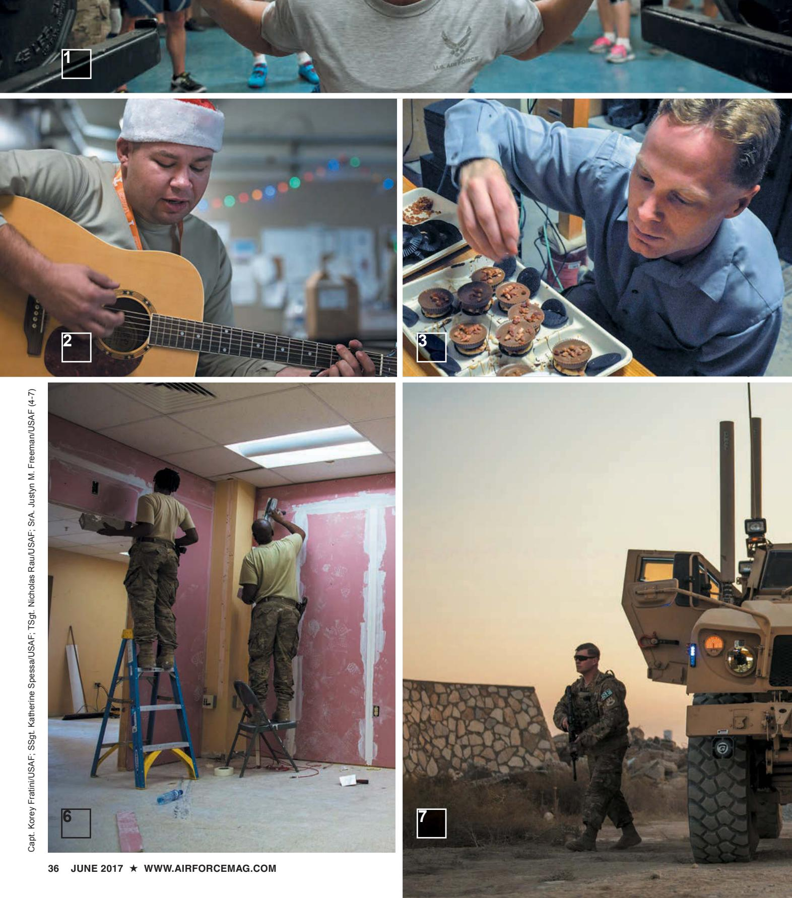

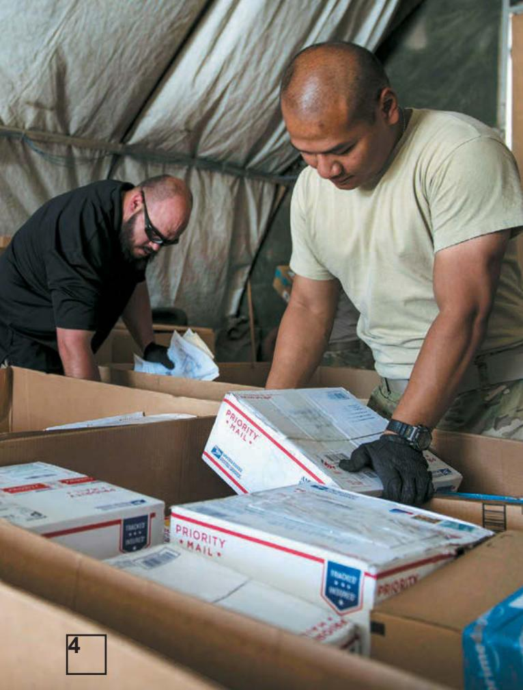

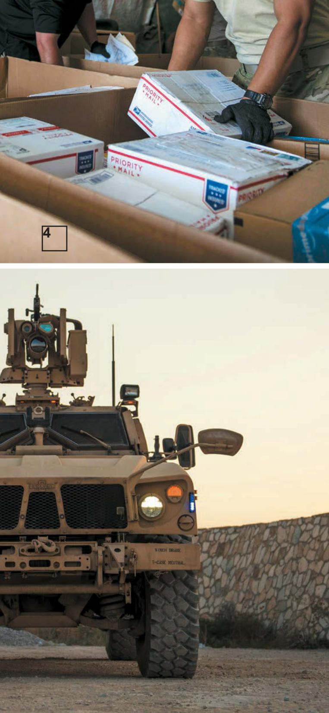

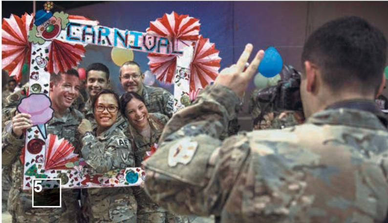

more combat operations. The Afghan air force also flies USmade MD-530 attack helicopters, C-130 cargo aircraft, and Mi-17 cargo helicopters, among others. All need US support and training to maintain combat capability. While the Afghan forces have a limited training pipeline and have struggled to identify enough candidates, they have been effective in combat.

As of summer 2016, the Super Tucanos have fl own two to four combat missions every week. They are “rapidly gaining capability” with help from US trainers and advisors, US Army Gen. John W. Nicholson Jr., commander of the Resolute Support mission, said in a December press briefi ng.

“It’s important to remember that fi ve years ago, when we started building the Afghan security forces, we had about 140,000 US and coalition troops in the country,” Nicholson said. “We are now down to less than one-tenth of that. Today it’s the Afghan security forces who are responsible for securing their own country, with the assistance of our advisory and [counterterrorism] effort.”

The US military’s footprint inside Afghanistan has dwindled from its peak during the almost 16-year war, but for the thousands of troops that remain inside the walls of Bagram Airfi eld, Afghanistan is their temporary home and the misson endures.

/1/ MSgt. Lindsey Glover, 455th EAMXS, pumps iron during a 2016 powerlifting competition. /2/ TSgt. Joe Collett strums a Christmas tune on Dec. 25, 2016. The mission at Bagram did not take a holiday break, but service members took a moment to speak with their families or spend some down time with their units. /3/ Dan Johnson, a contractor with the 455th Expeditionary Mission Support Group, completes a batch of “Dead Elvis” cookies—peanut butter Oreos topped with bacon and chocolate. /4/ SSgt. Tony Tran, 455th Expeditionary Communications Squadron, prepares packages so mail orderlies can pick them up for their units. /5/ Airmen from the 455th EAES are framed and ready for their group photo during a 2016 carnival block party. /6/ A1C Taylor Davis and SSgt. Donald Scott seal drywall joints during a base construction project. /7/ SrA. Michael Van Deusen, 455th Expeditionary Security Forces Squadron, leaves his mine-resistant ambush-protected (MRAP) vehicle during a patrol of Bagram Airfi eld in 2016.

# USAF ALMANAC

2017

On the following pages appears a variety of information and statistical material about the US Air Force—its people, organization, equipment, fund ing, activities, bases, and heroes. This Almanac section was compiled by Brendan McGarry and the staff of Air Force Magazine under the direction of Gideon Grudo. We especially acknowledge the help of the Secretary of the Air Force Offi ce of Public Affairs, Air Staff agencies, major commands, and reserve components in bringing up to date the comparable data from last year’s Almanac.

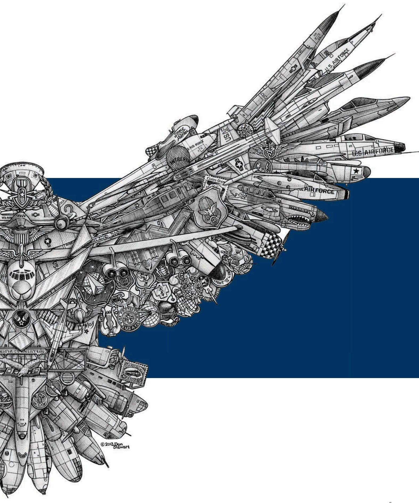

# The Air Force in Facts & Figures

2017 USAF Almanac

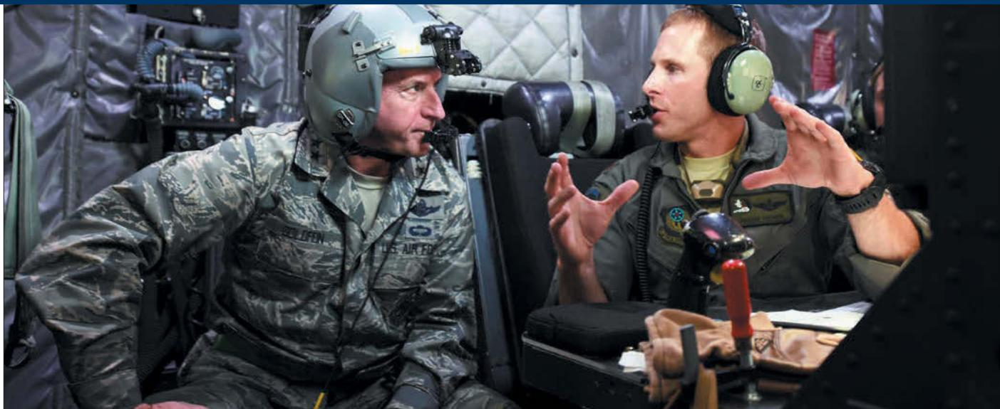  
Air Force Chief of Staff Gen. David Goldfein (left) listens as fire control officer Maj. Travis Tucker explains an AC-130U’s weapons.

# Structure of the Force

There is considerable variation in how the major commands and subordinate units of the Air Force are organized. This overview describes the Air Force’s primary organizational structures.

■ DEPARTMENT OF DEFENSE (DOD) A Cabinet agency headed by the Secretary of Defense. It comprises three military departments— Air Force, Army, and Navy—each with a civilian Secretary.

■ JOINT CHIEFS OF STAFF DOD’s corporate military leadership. The Chairman and vice chairman serve full time in their positions, while the service chiefs also serve as the military heads of their respective services.

# Current Air Force Leaders

■ SECRETARY OF THE AIR FORCE Lisa S. Disbrow (acting): Jan. 20, 2017 ■ AIR FORCE CHIEF OF STAFF Gen. David L. Goldfein: July 1, 2016 ■ CHIEF MASTER SERGEANT OF THE AIR FORCE CMSAF Kaleth O. Wright: Feb. 17, 2017

■ DEPARTMENT OF THE AIR FORCE Headed by the Secretary of the Air Force. Supporting the SECAF are the Secretariat Staff and the Chief of Staff of the Air Force, who oversees the Air Staff, among other duties. The heads of the major commands report to the CSAF.

■ MAJOR COMMAND Most Air Force units fall under a majcom, having broad functional responsibilities. Majcoms are organized under a unit-oriented scheme, with one or more numbered air forces, or a major non-unit scheme, with one or more centers.

■ WING The predominant command entity within USAF. The typical Air Force base is built around a wing.

GROUP Four groups make up a standard wing, covering operations (operates primary mission equipment and includes such functions as intelligence); maintenance (provides weapon system maintenance); mission support (provides base support and services, including civil engineer, logistics readiness, and security forces); and medical.

■ SQUADRON The basic organizational building block of the Air Force. Squadrons generally work under one of the four groups to provide either mission or functional support.

■ FLIGHTS Several flights may exist within squadrons.

■ FOAs, DRUs, AUXILIARY The Air Force organization also includes field operating agencies (FOAs), carrying out specialized activities; direct reporting units (DRUs), performing specific missions not covered by majcoms; and an auxiliary.

Estimate Estimate

<table><tr><td></td><td>FY08</td><td>FY09</td><td>FY10</td><td>FY11</td><td>FY12</td><td>FY13</td><td>FY14</td><td>FY15</td><td>FY16</td><td>FY17</td></tr><tr><td>Air Force Active Duty</td><td></td><td></td><td></td><td></td><td></td><td></td><td></td><td></td><td></td><td></td></tr><tr><td>Officers</td><td>64,805</td><td>65,496</td><td>66,201</td><td>65,487</td><td>64,932</td><td>64,806</td><td>62,349</td><td>61,004</td><td>60,961</td><td>62,000</td></tr><tr><td>Enlisted</td><td></td><td></td><td></td><td></td><td></td><td></td><td></td><td></td><td>258,092 263,351 263,437 263,542263,964 261,976 250,104 246,322 252,762 251,000</td><td></td></tr><tr><td>Cadets</td><td>4,482</td><td>4,561</td><td>4,558</td><td>4,341</td><td>4,022</td><td>3,912</td><td>3,879</td><td>4,031</td><td>4,160</td><td>4,000</td></tr><tr><td>Total Air Force Active Duty</td><td></td><td></td><td></td><td></td><td></td><td></td><td></td><td></td><td>327,379 333,408 334,196 333,370 332,918 330,694 316,332 311,357 317,883 317,000</td><td></td></tr><tr><td>Civilian Personnel</td><td></td><td></td><td></td><td></td><td></td><td></td><td></td><td></td><td></td><td></td></tr><tr><td>Direct Hire (excluding technicians)</td><td></td><td></td><td>124,698 123,106 134,183 145,407 142,047 141,496 129,120 129,985 134,146 133,693</td><td></td><td></td><td></td><td></td><td></td><td></td><td></td></tr><tr><td>Air National Guard Technicians</td><td>22,353</td><td>22,391</td><td>22,657</td><td>22,139</td><td>22,859</td><td>22,568</td><td>22,225</td><td>23,448</td><td>22,290</td><td>22,453</td></tr><tr><td>Air Force Reserve Command Technicians</td><td>8,857</td><td>9,147</td><td>10,068</td><td>9,397</td><td>10,366</td><td>9,277</td><td>10,429</td><td>8,501</td><td>9,904</td><td>10,151</td></tr><tr><td>Total Direct Hire</td><td></td><td></td><td></td><td></td><td></td><td></td><td></td><td></td><td>155,908 154,644 166,908 176,943 175,272 173,341 161,774 161,934 166,340 166,297</td><td></td></tr><tr><td>Indirect Hire</td><td>6,515</td><td>6,346</td><td>6,564</td><td>6,776</td><td>6,714</td><td>6,501</td><td>4,823</td><td>4,090</td><td>4,679</td><td>4,490</td></tr><tr><td>Total Civilian Personnel 162,423 160,990 173,472 183,719 181,986 179,842 166,597 166,024 171,019 170,787</td><td></td><td></td><td></td><td></td><td></td><td></td><td></td><td></td><td></td><td></td></tr><tr><td>Air National Guard</td><td></td><td></td><td></td><td></td><td></td><td></td><td></td><td></td><td></td><td></td></tr><tr><td>Selected Reserve Officers</td><td>14,115</td><td>14,326</td><td>14,389</td><td>14,418</td><td>14,598</td><td></td><td>15,024</td><td>15,084</td><td></td><td></td></tr><tr><td>Selected Reserve Enlisted</td><td>93,564</td><td>94,870</td><td>93,287</td><td>91,267</td><td>90,791</td><td>14,731 90,977</td><td>91,356</td><td>90,644</td><td>14,593 90,907</td><td>14,610 91,090</td></tr><tr><td>Total ANG</td><td></td><td></td><td></td><td></td><td></td><td></td><td></td><td></td><td>107,679 109,196 107,676 105,685 105,389 105,708 106,380 105,728 105,500 105,700</td><td></td></tr><tr><td>Air Force Reserve Command</td><td></td><td></td><td></td><td></td><td></td><td></td><td></td><td></td><td></td><td></td></tr><tr><td>Selected Reserve Officers</td><td>15,169</td><td>14,753</td><td>14,560</td><td>14,535</td><td>14,303</td><td>14,060</td><td>13,817</td><td>13,937</td><td>14,896</td><td></td></tr><tr><td>Selected Reserve Enlisted</td><td>52,396</td><td>53,233</td><td>55,559</td><td>56,786</td><td>57,125</td><td>56,853</td><td>55,967</td><td>54,557</td><td>54,304</td><td>14,370 54,630</td></tr><tr><td>Total AFRC Selected Reserve</td><td>67,565</td><td>67,986</td><td>70,119</td><td>71,321</td><td>71,428</td><td>70,913</td><td>69,784</td><td>68,494</td><td>69,200</td><td>69,000</td></tr><tr><td>Individual Ready Reserve Officers</td><td>13,633</td><td>12,833</td><td>11,692</td><td>11,692</td><td>11,222</td><td>11,222</td><td>11,222</td><td>7,302</td><td>7,492</td><td>7,492</td></tr><tr><td>IRR Enlisted</td><td>35,668</td><td>30,349</td><td>28,863</td><td>28,863</td><td>24,271</td><td>24,271</td><td>24,271</td><td>29,449</td><td>29,359</td><td>29,359</td></tr><tr><td>Total AFRC IRR</td><td>49,301</td><td>43,182</td><td>40,555</td><td>40,555</td><td>35,493</td><td>35,493</td><td>35,493</td><td>36,751</td><td>36,851</td><td>36,851</td></tr><tr><td>Total AFRC</td><td></td><td></td><td></td><td></td><td></td><td>116,866 111,168 110,674 111,876 106,921 106,406 105,277 105,245 106,051 105,851</td><td></td><td></td><td></td><td></td></tr><tr><td>Total Ready Reserve</td><td>224,545 220,364 218,350 217,561 212,310 212,114 211,657 210,973 211,551 211,550</td><td></td><td></td><td></td><td></td><td></td><td></td><td></td><td></td><td></td></tr></table>

ARMED FORCES MANPOWER TRENDS, END STRENGTH (IN THOUSANDS) (As of Sept. 30, 2016) Estimate Estim   

<table><tr><td></td><td>FY08</td><td>FY09</td><td>FY10</td><td>FY11</td><td>FY12</td><td>FY13</td><td>FY14</td><td>FY15</td><td>FY16</td><td>FY17</td></tr><tr><td>Active Duty Military</td><td></td><td></td><td></td><td></td><td></td><td></td><td></td><td></td><td></td><td></td></tr><tr><td>Air Force</td><td>327</td><td>333</td><td>334</td><td>333</td><td>333</td><td>331</td><td>316</td><td>311</td><td>317</td><td>317</td></tr><tr><td>Army</td><td>544</td><td>553</td><td>566</td><td>566</td><td>550</td><td>532</td><td>508</td><td>491</td><td>475</td><td>460</td></tr><tr><td>Marine Corps</td><td>199</td><td>203</td><td>202</td><td>201</td><td>198</td><td>196</td><td>188</td><td>184</td><td>182</td><td>182</td></tr><tr><td>Navy</td><td>332</td><td>329</td><td>328</td><td>325</td><td>318</td><td>324</td><td>326</td><td>328</td><td>327</td><td>323</td></tr><tr><td>Total</td><td>1,402</td><td>1,418</td><td>1,430</td><td>1,425</td><td>1,399</td><td>1,383</td><td>1,338</td><td>1,314</td><td>1,301</td><td>1,282</td></tr><tr><td>Guard and Reserve (selected reserve)</td><td></td><td></td><td></td><td></td><td></td><td></td><td></td><td></td><td></td><td></td></tr><tr><td>Air National Guard</td><td>108</td><td>109</td><td>108</td><td>107</td><td>105</td><td>106</td><td>106</td><td>106</td><td>106</td><td>106</td></tr><tr><td>Air Force Reserve</td><td>68</td><td>68</td><td>70</td><td>71</td><td>71</td><td>71</td><td>70</td><td>68</td><td>69</td><td>69</td></tr><tr><td>Army National Guard</td><td>360</td><td>358</td><td>362</td><td>358</td><td>358</td><td>358</td><td>354</td><td>350</td><td>342</td><td>335</td></tr><tr><td>Army Reserve</td><td>197</td><td>205</td><td>205</td><td>205</td><td>201</td><td>198</td><td>195</td><td>199</td><td>198</td><td>195</td></tr><tr><td>Marine Corps Reserve</td><td>38</td><td>39</td><td>39</td><td>40</td><td>40</td><td>40</td><td>40</td><td>39</td><td>39</td><td>39</td></tr><tr><td>Naval Reserve</td><td>68</td><td>67</td><td>65</td><td>66</td><td>65</td><td>62</td><td>59</td><td>57</td><td>57</td><td>58</td></tr><tr><td>Total</td><td>839</td><td>846</td><td>849</td><td>847</td><td>840</td><td>835</td><td>824</td><td>819</td><td>811</td><td>802</td></tr><tr><td>Direct-hire Civilian (full-time equivalents)</td><td></td><td></td><td></td><td></td><td></td><td></td><td></td><td></td><td></td><td></td></tr><tr><td>Air Force</td><td>156</td><td>155</td><td>167</td><td>177</td><td>175</td><td>173</td><td>162</td><td>162</td><td>166</td><td>166</td></tr><tr><td>Army</td><td>230</td><td>247</td><td>260</td><td>269</td><td>250</td><td>242</td><td>195</td><td>194</td><td>190</td><td>185</td></tr><tr><td>Navy/Marine Corps</td><td>178</td><td>186</td><td>195</td><td>201</td><td>201</td><td>197</td><td>182</td><td>186</td><td>191</td><td>192</td></tr><tr><td>Defense Agencies</td><td>108</td><td>115</td><td>120</td><td>125</td><td>133</td><td>127</td><td>185</td><td>183</td><td>191</td><td>190</td></tr><tr><td>Total</td><td>672</td><td>703</td><td>742</td><td>772</td><td>759</td><td>739</td><td>724</td><td>725</td><td>738</td><td>733</td></tr></table>

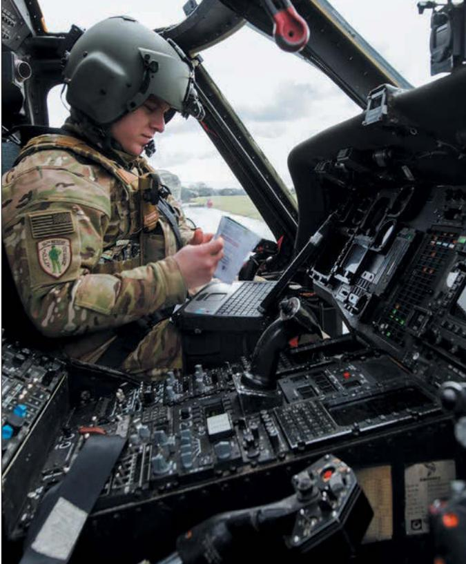  
First Lt. Andrej Pulver of the 56th Rescue Squadron, RAF Lakenheath, UK, performs a prefl ight check. More than 27,000 airmen are stationed in Europe.

ACTIVE DUTY AIRMEN BY RANK (As of Sept. 30, 2016)   

<table><tr><td>Officers</td><td>Men</td><td>Women</td><td>Total</td></tr><tr><td>General</td><td>11</td><td>2</td><td>13</td></tr><tr><td>Lieutenant General</td><td>35</td><td>5</td><td>40</td></tr><tr><td>Major General</td><td>82</td><td>9</td><td>91</td></tr><tr><td>Brigadier General</td><td>146</td><td>7</td><td>153</td></tr><tr><td>Colonel</td><td>2,858</td><td>462</td><td>3,320</td></tr><tr><td>Lieutenant Colonel</td><td>8,112</td><td>1,473</td><td>9,585</td></tr><tr><td>Major</td><td>10,376</td><td>2,526</td><td>12,902</td></tr><tr><td>Captain</td><td>16,443</td><td>4,809</td><td>21,252</td></tr><tr><td>First Lieutenant Second Lieutenant</td><td>5,192</td><td>1,709</td><td>6,901</td></tr><tr><td>Total</td><td>5,147 48,402</td><td>1,557 12,559</td><td>6,704 60,961</td></tr><tr><td colspan="4">Enlisted</td></tr><tr><td>Chief Master Sergeant</td><td>2,151</td><td>364</td><td>2,515</td></tr><tr><td>Senior Master Sergeant</td><td>3,967</td><td>1,028</td><td>4,995</td></tr><tr><td>Master Sergeant</td><td>19,519</td><td>4,965</td><td>24,484</td></tr><tr><td>Technical Sergeant</td><td>32,148</td><td>7,529</td><td>39,677</td></tr><tr><td>Staff Sergeant</td><td>48,381</td><td>11,014</td><td>59,395</td></tr><tr><td>Senior Airman</td><td>48,834</td><td>10,716</td><td>59,550</td></tr><tr><td>Airman First Class</td><td>34,912</td><td>8,940</td><td>43,852</td></tr><tr><td>Airman First Class</td><td>5,572</td><td>1,449</td><td>7,021</td></tr><tr><td>Airman Basic</td><td>8,992</td><td>2,281</td><td>11,273</td></tr><tr><td>Total</td><td>204,476</td><td>48,286</td><td>252,762</td></tr><tr><td>Cadets</td><td>3,113</td><td>1,047</td><td>4,160</td></tr><tr><td>Total Personnel</td><td>255,991</td><td>61,892</td><td>317,883</td></tr></table>

NUMBER AND PERCENTAGE OF ACTIVE DUTY AIRMEN BY GENDER (As of Sept. 30, 2016)   

<table><tr><td></td><td>1950</td><td>1960</td><td>1970</td><td>1980</td><td>1990</td><td>2000</td><td>2010</td><td>2016</td></tr><tr><td>Officers</td><td></td><td></td><td></td><td></td><td></td><td></td><td></td><td></td></tr><tr><td>Male</td><td>55,474</td><td>126,014</td><td>125,136</td><td>89,156</td><td>86,714</td><td>57,204</td><td>53,838</td><td>48,402</td></tr><tr><td>Percentage</td><td>97.3%</td><td>97.2%</td><td>96.4%</td><td>91.3%</td><td>86.7%</td><td>82.9%</td><td>81.3%</td><td>79.4%</td></tr><tr><td>Female</td><td>1,532</td><td>3,675</td><td>4,667</td><td>8,493</td><td>13,331</td><td>11,819</td><td>12,363</td><td>12,559</td></tr><tr><td>Percentage</td><td>2.7%</td><td>2.8%</td><td>3.6%</td><td>8.7%</td><td>13.3%</td><td>17.1%</td><td>18.7%</td><td>20.6%</td></tr><tr><td>Total Officers</td><td>57,006</td><td>129,689</td><td>129,803</td><td>97,649</td><td>100,045</td><td>69,023</td><td>66,201</td><td>60,961</td></tr><tr><td>Enlisted</td><td></td><td></td><td></td><td></td><td></td><td></td><td></td><td></td></tr><tr><td>Male</td><td>350,489</td><td>679,412</td><td>652,559</td><td>399,517</td><td>374,385</td><td>231,620</td><td>212,491</td><td>204,476</td></tr><tr><td>Percentage</td><td>98.9%</td><td>99.2%</td><td>98.6%</td><td>86.8%</td><td>86.0%</td><td>80.8%</td><td>80.7%</td><td>80.9%</td></tr><tr><td>Female</td><td>3,782</td><td>5,651</td><td>8,987</td><td>60,803</td><td>60,803</td><td>55,011</td><td>50,946</td><td>48,286</td></tr><tr><td>Percentage</td><td>1.1%</td><td>0.8%</td><td>1.4%</td><td>13.2%</td><td>14.0%</td><td>19.2%</td><td>19.3%</td><td>19.1%</td></tr><tr><td>Total Enlisted</td><td>354,271</td><td>685,063</td><td>661,546</td><td>460,320</td><td>435,188</td><td>286,631</td><td>263,437</td><td>252,762</td></tr><tr><td>Cadets</td><td></td><td></td><td></td><td></td><td></td><td></td><td></td><td></td></tr><tr><td>Male</td><td>0</td><td>1,949</td><td>4,144</td><td>3,907</td><td>3,817</td><td>3,617</td><td>3,592</td><td>3,113</td></tr><tr><td>Percentage</td><td>0.0%</td><td>100.0%</td><td>100.0%</td><td>88.6%</td><td>87.3%</td><td>84.6%</td><td>78.8%</td><td>74.8%</td></tr><tr><td>Female</td><td>0</td><td>0</td><td>0</td><td>504</td><td>553</td><td>658</td><td>966</td><td>1,047</td></tr><tr><td>Percentage</td><td>0.0%</td><td>0.0%</td><td>0.0%</td><td>11.4%</td><td>12.7%</td><td>15.4%</td><td>21.2%</td><td>25.2%</td></tr><tr><td>Total Cadets</td><td>0</td><td>1,949</td><td>4,144</td><td>4,411</td><td>4,370</td><td>4,275</td><td>4,558</td><td>4,160</td></tr></table>

ACTIVE DUTY AIRMEN BY REGION (As of Sept. 30, 2016)   

<table><tr><td>REGIONS</td><td>1950</td><td>1960</td><td>1970</td><td>1980</td><td>1990</td><td>2000</td><td>2010</td><td>2016</td></tr><tr><td>US and its Territories</td><td>342,437</td><td>633,327</td><td>565,098</td><td>445,886</td><td>418,027</td><td>291,260</td><td>277,123</td><td>254,565</td></tr><tr><td>Europe</td><td>24,531</td><td>104,899</td><td>72,937</td><td>76,788</td><td>69,296</td><td>32,901</td><td>30,963</td><td>27,105</td></tr><tr><td>East Asia, Pacific</td><td>36,412</td><td>50,679</td><td>139,666</td><td>32,263</td><td>33,558</td><td>22,030</td><td>12,649</td><td>19,629</td></tr><tr><td>Africa, Mideast, S. Asia</td><td>1,491</td><td>11,160</td><td>608</td><td>674</td><td>376</td><td>8,972</td><td>891</td><td>7,901</td></tr><tr><td>Western Hemisphere</td><td>6,266</td><td>14,106</td><td>5,348</td><td>2,211</td><td>2,356</td><td>345</td><td>339</td><td>308</td></tr><tr><td>Other</td><td>140</td><td>581</td><td>7,692</td><td>147</td><td>11,620</td><td>146</td><td>12,231</td><td>8,375</td></tr><tr><td>Total</td><td>411,277</td><td>814,752</td><td>791,349</td><td>557,969</td><td>535,233</td><td>355,654</td><td>334,196</td><td>317,883</td></tr></table>

se are permanently assigned airmen. Those deployed for operations in Afghanistan, Syria, and Iraq are included in US (transients) and Other t

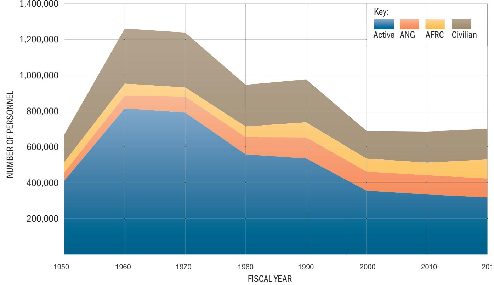  
TOTAL FORCE OVER TIME   
Data for 1950 and 1960 as of June 30; data for other years as of Sept. 30. Sources: Air Force Magazine’s “USAF Almanac,” various years; US Census Bureau, “Statistical Abstract of the United States”; “Department of Defense Selected Manpower Statistics,” various years.

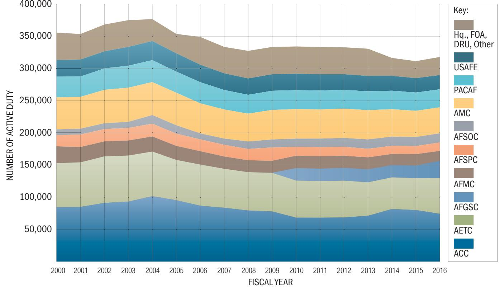  
ACTIVE DUTY AIRMEN BY ACTIVE DUTY MAJOR COMMAND

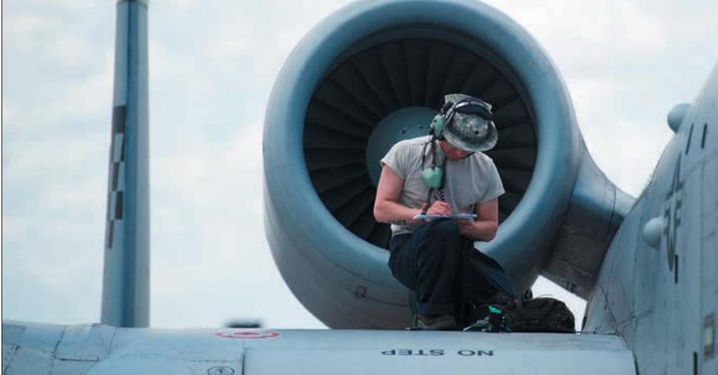  
Crew chief SrA. Peter Espinoza, deployed from Osan AB, South Korea, goes through an A-10 checklist at Clark AB, Philippines. About 28,000 military personnel are assigned to PACAF.

PERSONNEL STRENGTH BY COMMANDS, FOAs, & DRUs (As of Sept. 30, 2016)

<table><tr><td>Air Force Global Strike Command</td><td>26,677</td><td>3,969</td><td>30,646</td></tr><tr><td>Air Force Materiel Command</td><td>15,475</td><td>61,941</td><td>77,416</td></tr><tr><td>Air Force Space Command</td><td>13,064</td><td>6,880</td><td>19,944</td></tr><tr><td>Air Force Special Operations Command</td><td>14,223</td><td>1,732</td><td>15,955</td></tr><tr><td>Air Mobility Command</td><td>40,403</td><td>8,191</td><td>48,594</td></tr><tr><td>Pacific Air Forces</td><td>28,003</td><td>3,296</td><td>31,299</td></tr><tr><td>US Air Forces in Europe</td><td>22,143</td><td>1,662</td><td>23,805</td></tr><tr><td>Total Major Commands</td><td>289,805</td><td>112,693</td><td>402,498</td></tr><tr><td>Field Operating Agencies (FOAs)</td><td></td><td></td><td></td></tr><tr><td>Air Force Agency for Modeling and Simulation</td><td>7</td><td>13</td><td>20</td></tr><tr><td>Air Force Audit Agency</td><td>0</td><td>589</td><td>589</td></tr><tr><td>Air Force Cost Analysis Agency</td><td>12</td><td>73</td><td>85</td></tr><tr><td>Air Force Flight Standards Agency</td><td>113</td><td>57</td><td>170</td></tr><tr><td>Air Force Historical Research Agency</td><td>0</td><td>37</td><td>37</td></tr><tr><td>Air Force Inspection Agency</td><td>90</td><td>25</td><td>115</td></tr><tr><td>Air Force Legal Operations Agency</td><td>566</td><td>242</td><td>808</td></tr><tr><td>Air Force Manpower Analysis Agency</td><td>117</td><td>130</td><td>247</td></tr><tr><td>Air Force Medical Operations Agency</td><td>165</td><td>194</td><td>359</td></tr><tr><td>Air Force Medical Support Agency</td><td>190</td><td>83</td><td>273</td></tr><tr><td>Air Force Mortuary Affairs Operations</td><td>19</td><td>29</td><td>48</td></tr><tr><td>Air Force Office of Special Investigations</td><td>1,487</td><td>841</td><td>2,328</td></tr><tr><td>Air Force Operations Group</td><td>39</td><td>3</td><td>42</td></tr><tr><td>Air Force Personnel Center</td><td>646</td><td>1,412</td><td>2,058</td></tr><tr><td>Air Force Public Affairs Agency</td><td>220</td><td>37</td><td>257</td></tr><tr><td>Air Force Review Boards Agency</td><td>14</td><td>77</td><td>91</td></tr><tr><td>Air Force Safety Center</td><td>41</td><td>64</td><td>105</td></tr><tr><td>Air National Guard Readiness Center</td><td>48</td><td>816</td><td>864</td></tr><tr><td>Total FOAs</td><td>3,774</td><td>4,722</td><td>8,496</td></tr><tr><td>Direct Reporting Units (DRUs)</td><td></td><td></td><td></td></tr><tr><td>Air Force District of Washington</td><td>3,576</td><td>981</td><td>4,557</td></tr><tr><td>Air Force Operational Test and Evaluation Center</td><td>340</td><td>237</td><td>577</td></tr><tr><td>US Air Force Academy</td><td>1,984</td><td>1,309</td><td>3,293</td></tr><tr><td>Total DRUs</td><td>5,900</td><td>2,527</td><td>8,427</td></tr><tr><td>Other</td><td></td><td></td><td></td></tr><tr><td>Hq. USAF</td><td>1,718</td><td>2,068</td><td>3,786</td></tr><tr><td>Other</td><td>12,526</td><td>44,330</td><td>56,856</td></tr><tr><td>Cadets</td><td>4,160</td><td>0</td><td>4,160</td></tr><tr><td>Total Other</td><td>18,404</td><td>46,398</td><td>64,802</td></tr><tr><td>Total Strength</td><td>317,883</td><td>166,340*</td><td>484,223</td></tr></table>

ACTIVE DUTY PERSONNEL STRENGTH   

<table><tr><td colspan="3">(As of Sept. 30, 2016)</td></tr><tr><td>YEAR</td><td>NUMBER</td><td>YEAR NUMBER</td></tr><tr><td>1907</td><td>3</td><td>1963 869,431</td></tr><tr><td>1908</td><td>13 1964</td><td>856,798</td></tr><tr><td>1909</td><td>27 1965</td><td>824,662</td></tr><tr><td>1910</td><td>11 1966</td><td>887,353</td></tr><tr><td>1911</td><td>23 1967</td><td>897,494</td></tr><tr><td>1912</td><td>51 1968</td><td>904,850</td></tr><tr><td>1913</td><td>114 1969</td><td>862,353</td></tr><tr><td>1914</td><td>122 1970</td><td>791,349</td></tr><tr><td>1915</td><td>208 1971</td><td>755,300</td></tr><tr><td>1916</td><td>311 1972</td><td>725,838</td></tr><tr><td>1917</td><td>1,218 1973</td><td>691,182</td></tr><tr><td>1918</td><td>195,023 1974</td><td>643,970</td></tr><tr><td>1919</td><td>25,603 1975</td><td>612,751</td></tr><tr><td>1920</td><td>9,050 1976</td><td>585,416</td></tr><tr><td>1921</td><td>11,649 1977</td><td>570,695</td></tr><tr><td>1922</td><td>9,642 1978</td><td>569,712</td></tr><tr><td>1923</td><td>9,441 1979</td><td>559,455</td></tr><tr><td>1924</td><td>10,547 1980</td><td>557,969</td></tr><tr><td>1925</td><td>9,670 1981</td><td>570,302</td></tr><tr><td>1926</td><td>9,674 1982</td><td>582,845</td></tr><tr><td>1927</td><td>10,078 1983</td><td>592,044</td></tr><tr><td>1928</td><td>10,549 1984</td><td>597,125</td></tr><tr><td>1929</td><td>12,131 1985</td><td>601,515</td></tr><tr><td>1930</td><td>13,531 1986</td><td>608,199</td></tr><tr><td>1931</td><td>14,780 1987</td><td>607,035</td></tr><tr><td>1932</td><td>15,028</td><td>1988 576,446</td></tr><tr><td>1933</td><td>15,099</td><td>1989 570,880</td></tr><tr><td>1934</td><td>15,861</td><td>1990 535,233</td></tr><tr><td>1935</td><td>16,247 1991</td><td>510,432</td></tr><tr><td>1936</td><td>17,233</td><td>1992 470,315</td></tr><tr><td>1937</td><td>19,147</td><td>1993 444,351</td></tr><tr><td>1938</td><td>21,089</td><td>1994 426,327</td></tr><tr><td>1939</td><td>23,455</td><td>1995 400,409</td></tr><tr><td>1940</td><td>51,165</td><td>1996 389,001</td></tr><tr><td>1941</td><td>152,125</td><td>1997 377,385</td></tr><tr><td>1942</td><td>764,415</td><td>1998 367,470</td></tr><tr><td>1943</td><td>2,197,114</td><td>1999 360,590</td></tr><tr><td>1944</td><td>2,372,292</td><td>2000 355,654</td></tr><tr><td>1945</td><td>2,282,259</td><td>2001 353,571</td></tr><tr><td>1946</td><td>455,515</td><td>2002 368,251</td></tr><tr><td>1947</td><td>305,827</td><td>2003 375,062</td></tr><tr><td>1948</td><td>387,730</td><td>2004 376,616</td></tr><tr><td>1949</td><td>419,347 2005</td><td>353,696</td></tr><tr><td>1950</td><td>411,277</td><td>2006 348,953</td></tr><tr><td>1951</td><td>788,381 2007</td><td>333,495</td></tr><tr><td>1952</td><td>983,261</td><td>2008 327,379</td></tr><tr><td>1953</td><td>977,593 2009</td><td>333,408</td></tr><tr><td>1954</td><td>947,918 2010</td><td>334,196</td></tr><tr><td>1955</td><td>959,946 2011</td><td>333,370</td></tr><tr><td>1956</td><td>909,958</td><td>2012 332,918</td></tr><tr><td>1957</td><td>919,835 2013</td><td>330,694</td></tr><tr><td>1958</td><td>871,156 2014</td><td>316,332</td></tr><tr><td>1959</td><td>840,435 2015</td><td>311,357</td></tr><tr><td>1960</td><td>814,752</td><td>2016 317,883</td></tr><tr><td>1961 1962</td><td>821,151 884.025</td><td>2017 317,000</td></tr></table>

2017 number is an estimate.

MONTHLY MILITARY BASIC RATES OF PAY (Effective Jan. 1, 2017)   
  

<table><tr><td rowspan=3 colspan=1></td><td rowspan=2 colspan=16>YEARS OF SERVICE&lt;2     2      3      4      6      8     10    12    14    16    18    20     22     24     26Pay Grade</td></tr><tr><td rowspan=1 colspan=4></td><td rowspan=1 colspan=1></td></tr><tr><td rowspan=1 colspan=1>0-10a</td><td rowspan=1 colspan=1></td><td rowspan=1 colspan=1></td><td rowspan=1 colspan=1></td><td rowspan=1 colspan=1></td><td rowspan=1 colspan=1></td><td rowspan=1 colspan=1></td><td rowspan=1 colspan=1></td><td rowspan=1 colspan=1></td><td rowspan=1 colspan=1></td><td rowspan=1 colspan=1></td><td rowspan=1 colspan=1></td><td rowspan=1 colspan=1>$15,583</td><td rowspan=1 colspan=1>$15,583</td><td rowspan=1 colspan=1>$15,583</td><td rowspan=1 colspan=1>$15,583</td></tr><tr><td rowspan=1 colspan=1></td><td rowspan=1 colspan=1>0-9a</td><td rowspan=1 colspan=1></td><td rowspan=1 colspan=1></td><td rowspan=1 colspan=1></td><td rowspan=1 colspan=1></td><td rowspan=1 colspan=1></td><td rowspan=1 colspan=1></td><td rowspan=1 colspan=1></td><td rowspan=1 colspan=1></td><td rowspan=1 colspan=1></td><td rowspan=1 colspan=1></td><td rowspan=1 colspan=1></td><td rowspan=1 colspan=1>14,352</td><td rowspan=1 colspan=1>14,559</td><td rowspan=1 colspan=1>14,858</td><td rowspan=1 colspan=1>15,379</td></tr><tr><td rowspan=1 colspan=1>R</td><td rowspan=1 colspan=1>0-8a</td><td rowspan=1 colspan=1>10,155</td><td rowspan=1 colspan=1>10,488</td><td rowspan=1 colspan=1>10,709</td><td rowspan=1 colspan=1>10,770</td><td rowspan=1 colspan=1>11,046</td><td rowspan=1 colspan=1>11,506</td><td rowspan=1 colspan=1>11,613</td><td rowspan=1 colspan=1>12,050</td><td rowspan=1 colspan=1>12,175</td><td rowspan=1 colspan=1>12,552</td><td rowspan=1 colspan=1>13,097</td><td rowspan=1 colspan=1>13,599</td><td rowspan=1 colspan=1>13,934</td><td rowspan=1 colspan=1>13,934</td><td rowspan=1 colspan=1>13,934</td></tr><tr><td rowspan=1 colspan=1>E</td><td rowspan=1 colspan=1>0-7a</td><td rowspan=1 colspan=1>8,438</td><td rowspan=1 colspan=1>8,830</td><td rowspan=1 colspan=1>9,011</td><td rowspan=1 colspan=1>9,156</td><td rowspan=1 colspan=1>9,417</td><td rowspan=1 colspan=1>9,675</td><td rowspan=1 colspan=1>9,973</td><td rowspan=1 colspan=1>10,270</td><td rowspan=1 colspan=1>10,569</td><td rowspan=1 colspan=1>11,506</td><td rowspan=1 colspan=1>12,297</td><td rowspan=1 colspan=1>12,297</td><td rowspan=1 colspan=1>12,297</td><td rowspan=1 colspan=1>12,297</td><td rowspan=1 colspan=1>12,360</td></tr><tr><td rowspan=1 colspan=1>F</td><td rowspan=1 colspan=1>0-6a</td><td rowspan=1 colspan=1>6,399</td><td rowspan=1 colspan=1>7,030</td><td rowspan=1 colspan=1>7,491</td><td rowspan=1 colspan=1>7,491</td><td rowspan=1 colspan=1>7,520</td><td rowspan=1 colspan=1>7,842</td><td rowspan=1 colspan=1>7,885</td><td rowspan=1 colspan=1>7,885</td><td rowspan=1 colspan=1>8,333</td><td rowspan=1 colspan=1>9,125</td><td rowspan=1 colspan=1>9,590</td><td rowspan=1 colspan=1>10,055</td><td rowspan=1 colspan=1>10,319</td><td rowspan=1 colspan=1>10,587</td><td rowspan=1 colspan=1>11,106</td></tr><tr><td rowspan=1 colspan=1>0</td><td rowspan=1 colspan=1>0-5</td><td rowspan=1 colspan=1>5,334</td><td rowspan=1 colspan=1>6,009</td><td rowspan=1 colspan=1>6,425</td><td rowspan=1 colspan=1>6,503</td><td rowspan=1 colspan=1>6,763</td><td rowspan=1 colspan=1>6,918</td><td rowspan=1 colspan=1>7,260</td><td rowspan=1 colspan=1>7,511</td><td rowspan=1 colspan=1>7,834</td><td rowspan=1 colspan=1>8,330</td><td rowspan=1 colspan=1>8,565</td><td rowspan=1 colspan=1>8,798</td><td rowspan=1 colspan=1>9,063</td><td rowspan=1 colspan=1>9,063</td><td rowspan=1 colspan=1>9,063</td></tr><tr><td rowspan=1 colspan=1>E</td><td rowspan=1 colspan=1>0-4</td><td rowspan=1 colspan=1>4,603</td><td rowspan=1 colspan=1>5,328</td><td rowspan=1 colspan=1>5,684</td><td rowspan=1 colspan=1>5,762</td><td rowspan=1 colspan=1>6,092</td><td rowspan=1 colspan=1>6,446</td><td rowspan=1 colspan=1>6,887</td><td rowspan=1 colspan=1>7,230</td><td rowspan=1 colspan=1>7,469</td><td rowspan=1 colspan=1>7,606</td><td rowspan=1 colspan=1>7,685</td><td rowspan=1 colspan=1>7,685</td><td rowspan=1 colspan=1>7,685</td><td rowspan=1 colspan=1>7,685</td><td rowspan=1 colspan=1>7,685</td></tr><tr><td rowspan=1 colspan=1>0</td><td rowspan=1 colspan=1>0-3</td><td rowspan=1 colspan=1>4,047</td><td rowspan=1 colspan=1>4,587</td><td rowspan=1 colspan=1>4,951</td><td rowspan=1 colspan=1>5,398</td><td rowspan=1 colspan=1>5,657</td><td rowspan=1 colspan=1>5,941</td><td rowspan=1 colspan=1>6,124</td><td rowspan=1 colspan=1>6,426</td><td rowspan=1 colspan=1>6,584</td><td rowspan=1 colspan=1>6,584</td><td rowspan=1 colspan=1>6,584</td><td rowspan=1 colspan=1>6,584</td><td rowspan=1 colspan=1>6,584</td><td rowspan=1 colspan=1>6,584</td><td rowspan=1 colspan=1>6,584</td></tr><tr><td rowspan=1 colspan=1>S</td><td rowspan=1 colspan=1>0-2</td><td rowspan=1 colspan=1>3,497</td><td rowspan=1 colspan=1>3,982</td><td rowspan=1 colspan=1>4,586</td><td rowspan=1 colspan=1>4,741</td><td rowspan=1 colspan=1>4,839</td><td rowspan=1 colspan=1>4,839</td><td rowspan=1 colspan=1>4,839</td><td rowspan=1 colspan=1>4,839</td><td rowspan=1 colspan=1>4,839</td><td rowspan=1 colspan=1>4,839</td><td rowspan=1 colspan=1>4,839</td><td rowspan=1 colspan=1>4,839</td><td rowspan=1 colspan=1>4,839</td><td rowspan=1 colspan=1>4,839</td><td rowspan=1 colspan=1>4,839</td></tr><tr><td rowspan=1 colspan=1>M</td><td rowspan=1 colspan=1>0-1</td><td rowspan=1 colspan=1>3,035</td><td rowspan=1 colspan=1>3,159</td><td rowspan=1 colspan=1>3,819</td><td rowspan=1 colspan=1>3,819</td><td rowspan=1 colspan=1>3,819</td><td rowspan=1 colspan=1>3,819</td><td rowspan=1 colspan=1>3,819</td><td rowspan=1 colspan=1>3,819</td><td rowspan=1 colspan=1>3,819</td><td rowspan=1 colspan=1>3,819</td><td rowspan=1 colspan=1>3,819</td><td rowspan=1 colspan=1>3,819</td><td rowspan=1 colspan=1>3,819</td><td rowspan=1 colspan=1>3,819</td><td rowspan=1 colspan=1>3,819</td></tr><tr><td rowspan=1 colspan=1></td><td rowspan=1 colspan=1>0-3Eb</td><td rowspan=1 colspan=1></td><td rowspan=1 colspan=1></td><td rowspan=1 colspan=1></td><td rowspan=1 colspan=1>5,398</td><td rowspan=1 colspan=1>5,657</td><td rowspan=1 colspan=1>5,941</td><td rowspan=1 colspan=1>6,124</td><td rowspan=1 colspan=1>6,426</td><td rowspan=1 colspan=1>6,681</td><td rowspan=1 colspan=1>6,827</td><td rowspan=1 colspan=1>7,026</td><td rowspan=1 colspan=1>7,026</td><td rowspan=1 colspan=1>7,026</td><td rowspan=1 colspan=1>7,026</td><td rowspan=1 colspan=1>7,026</td></tr><tr><td rowspan=1 colspan=1></td><td rowspan=1 colspan=1>O-2E</td><td rowspan=1 colspan=1></td><td rowspan=1 colspan=1></td><td rowspan=1 colspan=1></td><td rowspan=1 colspan=1>4,741</td><td rowspan=1 colspan=1>4,839</td><td rowspan=1 colspan=1>4,993</td><td rowspan=1 colspan=1>5,253</td><td rowspan=1 colspan=1>5,454</td><td rowspan=1 colspan=1>5,604</td><td rowspan=1 colspan=1>5,604</td><td rowspan=1 colspan=1>5,604</td><td rowspan=1 colspan=1>5,604</td><td rowspan=1 colspan=1>5,604</td><td rowspan=1 colspan=1>5,604</td><td rowspan=1 colspan=1>5,604</td></tr><tr><td rowspan=1 colspan=1></td><td rowspan=1 colspan=1>O-1Eb</td><td rowspan=1 colspan=1></td><td rowspan=1 colspan=1></td><td rowspan=1 colspan=1></td><td rowspan=1 colspan=1>3,819</td><td rowspan=1 colspan=1>4,078</td><td rowspan=1 colspan=1>4,229</td><td rowspan=1 colspan=1>4,382</td><td rowspan=1 colspan=1>4,534</td><td rowspan=1 colspan=1>4,741</td><td rowspan=1 colspan=1>4,741</td><td rowspan=1 colspan=1>4,741</td><td rowspan=1 colspan=1>4,741</td><td rowspan=1 colspan=1>4,741</td><td rowspan=1 colspan=1>4,741</td><td rowspan=1 colspan=1>4,741</td></tr><tr><td rowspan=1 colspan=1></td><td rowspan=1 colspan=1></td><td rowspan=1 colspan=1></td><td rowspan=1 colspan=1></td><td rowspan=1 colspan=1></td><td rowspan=1 colspan=1></td><td rowspan=1 colspan=1></td><td rowspan=1 colspan=1></td><td rowspan=1 colspan=1></td><td rowspan=1 colspan=1></td><td rowspan=1 colspan=1></td><td rowspan=1 colspan=1></td><td rowspan=1 colspan=1></td><td rowspan=1 colspan=1></td><td rowspan=1 colspan=1></td><td rowspan=1 colspan=1></td><td rowspan=1 colspan=1></td></tr><tr><td rowspan=2 colspan=1></td><td rowspan=1 colspan=1>E-9C</td><td rowspan=1 colspan=1></td><td rowspan=1 colspan=1></td><td rowspan=1 colspan=1></td><td rowspan=1 colspan=1></td><td rowspan=1 colspan=1></td><td rowspan=1 colspan=1></td><td rowspan=1 colspan=1>5,053</td><td rowspan=1 colspan=1>5,167</td><td rowspan=1 colspan=1>5,312</td><td rowspan=1 colspan=1>5,481</td><td rowspan=1 colspan=1>5,653</td><td rowspan=1 colspan=1>5,927</td><td rowspan=1 colspan=1>6,159</td><td rowspan=1 colspan=1>6,403</td><td rowspan=1 colspan=1>6,776</td></tr><tr><td rowspan=1 colspan=1>E-8</td><td rowspan=1 colspan=1></td><td rowspan=1 colspan=1></td><td rowspan=1 colspan=1></td><td rowspan=1 colspan=1></td><td rowspan=1 colspan=1></td><td rowspan=1 colspan=1>4,136</td><td rowspan=1 colspan=1>4,319</td><td rowspan=1 colspan=1>4,432</td><td rowspan=1 colspan=1>4,568</td><td rowspan=1 colspan=1>4,715</td><td rowspan=1 colspan=1>4,980</td><td rowspan=1 colspan=1>5,115</td><td rowspan=1 colspan=1>5,344</td><td rowspan=1 colspan=1>5,471</td><td rowspan=1 colspan=1>5,783</td></tr><tr><td rowspan=1 colspan=1>B</td><td rowspan=1 colspan=1>E-7</td><td rowspan=1 colspan=1>2,875</td><td rowspan=1 colspan=1>3,138</td><td rowspan=1 colspan=1>3,258</td><td rowspan=1 colspan=1>3,417</td><td rowspan=1 colspan=1>3,542</td><td rowspan=1 colspan=1>3,755</td><td rowspan=1 colspan=1>3,875</td><td rowspan=1 colspan=1>4,089</td><td rowspan=1 colspan=1>4,267</td><td rowspan=1 colspan=1>4,388</td><td rowspan=1 colspan=1>4,517</td><td rowspan=1 colspan=1>4,567</td><td rowspan=1 colspan=1>4,735</td><td rowspan=1 colspan=1>4,825</td><td rowspan=1 colspan=1>5,168</td></tr><tr><td rowspan=1 colspan=1>E</td><td rowspan=1 colspan=1>E-6</td><td rowspan=1 colspan=1>2,487</td><td rowspan=1 colspan=1>2,737</td><td rowspan=1 colspan=1>2,857</td><td rowspan=1 colspan=1>2,975</td><td rowspan=1 colspan=1>3,097</td><td rowspan=1 colspan=1>3,373</td><td rowspan=1 colspan=1>3,480</td><td rowspan=1 colspan=1>3,688</td><td rowspan=1 colspan=1>3,752</td><td rowspan=1 colspan=1>3,798</td><td rowspan=1 colspan=1>3,852</td><td rowspan=1 colspan=1>3,852</td><td rowspan=1 colspan=1>3,852</td><td rowspan=1 colspan=1>3,852</td><td rowspan=1 colspan=1>3,852</td></tr><tr><td rowspan=1 colspan=1>M</td><td rowspan=1 colspan=1>E-5</td><td rowspan=1 colspan=1>2,278</td><td rowspan=1 colspan=1>2,432</td><td rowspan=1 colspan=1>2,549</td><td rowspan=1 colspan=1>2,669</td><td rowspan=1 colspan=1>2,857</td><td rowspan=1 colspan=1>3,053</td><td rowspan=1 colspan=1>3,214</td><td rowspan=1 colspan=1>3,233</td><td rowspan=1 colspan=1>3,233</td><td rowspan=1 colspan=1>3,233</td><td rowspan=1 colspan=1>3,233</td><td rowspan=1 colspan=1>3,233</td><td rowspan=1 colspan=1>3,233</td><td rowspan=1 colspan=1>3,233</td><td rowspan=1 colspan=1>3,233</td></tr><tr><td rowspan=1 colspan=1>E</td><td rowspan=1 colspan=1>E-4</td><td rowspan=1 colspan=1>2,089</td><td rowspan=1 colspan=1>2,196</td><td rowspan=1 colspan=1>2,315</td><td rowspan=1 colspan=1>2,432</td><td rowspan=1 colspan=1>2,536</td><td rowspan=1 colspan=1>2,536</td><td rowspan=1 colspan=1>2,536</td><td rowspan=1 colspan=1>2,536</td><td rowspan=1 colspan=1>2,536</td><td rowspan=1 colspan=1>2,536</td><td rowspan=1 colspan=1>2,536</td><td rowspan=1 colspan=1>2,536</td><td rowspan=1 colspan=1>2,536</td><td rowspan=1 colspan=1>2,536</td><td rowspan=1 colspan=1>2,536</td></tr><tr><td rowspan=1 colspan=1>S</td><td rowspan=1 colspan=1>E-3</td><td rowspan=1 colspan=1>1,886</td><td rowspan=1 colspan=1>2,004</td><td rowspan=1 colspan=1>2,126</td><td rowspan=1 colspan=1>2,126</td><td rowspan=1 colspan=1>2,126</td><td rowspan=1 colspan=1>2,126</td><td rowspan=1 colspan=1>2,126</td><td rowspan=1 colspan=1>2,126</td><td rowspan=1 colspan=1>2,126</td><td rowspan=1 colspan=1>2,126</td><td rowspan=1 colspan=1>2,126</td><td rowspan=1 colspan=1>2,126</td><td rowspan=1 colspan=1>2,126</td><td rowspan=1 colspan=1>2,126</td><td rowspan=1 colspan=1>2,126</td></tr><tr><td rowspan=1 colspan=1></td><td rowspan=1 colspan=1>E-2</td><td rowspan=1 colspan=1>1,793</td><td rowspan=1 colspan=1>1,793</td><td rowspan=1 colspan=1>1,793</td><td rowspan=1 colspan=1>1,793</td><td rowspan=1 colspan=1>1,793</td><td rowspan=1 colspan=1>1,793</td><td rowspan=1 colspan=1>1,793</td><td rowspan=1 colspan=1>1,793</td><td rowspan=1 colspan=1>1,793</td><td rowspan=1 colspan=1>1,793</td><td rowspan=1 colspan=1>1,793</td><td rowspan=1 colspan=1>1,793</td><td rowspan=1 colspan=1>1,793</td><td rowspan=1 colspan=1>1,793</td><td rowspan=1 colspan=1>1,793</td></tr><tr><td rowspan=1 colspan=1>-</td><td rowspan=1 colspan=1>E-1</td><td rowspan=1 colspan=1>1,600</td><td rowspan=1 colspan=1>1,600</td><td rowspan=1 colspan=1>1,600</td><td rowspan=1 colspan=1>1,600</td><td rowspan=1 colspan=1>1,600</td><td rowspan=1 colspan=1>1,600</td><td rowspan=1 colspan=1>1,600</td><td rowspan=1 colspan=1>1,600</td><td rowspan=1 colspan=1>1,600</td><td rowspan=1 colspan=1>1,600</td><td rowspan=1 colspan=1>1,600</td><td rowspan=1 colspan=1>1,600</td><td rowspan=1 colspan=1>1,600</td><td rowspan=1 colspan=1>1,600</td><td rowspan=1 colspan=1>1,600</td></tr></table>

Amounts have been rounded to the nearest dollar. aBasic pay for pay grades O-7 through O-10 is limited to \$15,583.20. Basic pay for O-6 and below is limited to $\$ 12,641,70$ . bApplicable to O-1 to O-3 with at least four years and one day of Active Duty or more than 1,460 points as an enlisted member. cBasic pay for the Chief Master Sergeant of the Air Force is \$8,165.

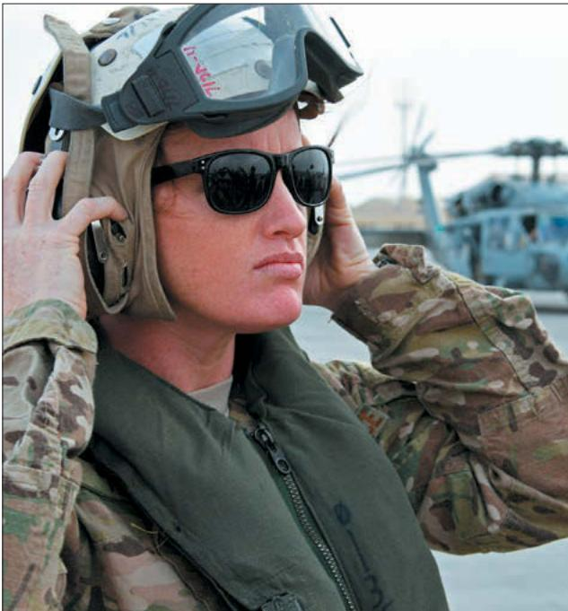

At a fl ight safety briefi ng at Al Udeid AB, Qatar, 1st Lt. Bridget Henry, a critical care nurse, dons a helmet. The Air Force had an Active Duty end strength of 317,883 in 2016.

AVIATION CAREER INCENTIVE PAY (Effective Jan. 1, 2017)   

<table><tr><td>Monthly Rate</td><td>Years of Service as an Aviation Officer</td></tr><tr><td>$125</td><td>Two or fewer</td></tr><tr><td>156</td><td>More than two</td></tr><tr><td>188</td><td>More than three</td></tr><tr><td>206</td><td>More than four</td></tr><tr><td>650</td><td>More than six</td></tr><tr><td>840</td><td>More than 14</td></tr><tr><td>585</td><td>More than 22</td></tr><tr><td>495</td><td>More than 23</td></tr><tr><td>385</td><td>More than 24</td></tr><tr><td>250</td><td>More than 25</td></tr></table>

Provided to qualifi ed rated offi cers. Continuous pay ends following the 25th year of service.

# CAREER ENLISTED FLIER INCENTIVE PAY

(Effective Jan. 1, 2017)

<table><tr><td>Monthly Rate</td><td>Years of Aviation Service as an Enlisted Member</td></tr><tr><td>$150</td><td>Four or fewer</td></tr><tr><td>225</td><td>More than four</td></tr><tr><td>350</td><td>More than eight</td></tr><tr><td>400</td><td>More than 14</td></tr></table>

HAZARDOUS DUTY PAY (Effective Jan. 1, 2017)   

<table><tr><td>Pay Grade</td><td>Monthly Rate</td></tr><tr><td>0-10</td><td>$150</td></tr><tr><td>0-9</td><td>150</td></tr><tr><td>0-8</td><td>150</td></tr><tr><td>0-7</td><td>150</td></tr><tr><td>0-6</td><td>250</td></tr><tr><td>0-5</td><td>250</td></tr><tr><td>0-4</td><td>225</td></tr><tr><td>0-3</td><td>175</td></tr><tr><td>0-2</td><td>150</td></tr><tr><td>0-1</td><td>150</td></tr><tr><td>E-9</td><td>$240</td></tr><tr><td>E-8</td><td>240</td></tr><tr><td>E-7</td><td>240</td></tr><tr><td>E-6</td><td>215</td></tr><tr><td>E-5</td><td>190</td></tr><tr><td>E-4</td><td>165</td></tr><tr><td>E-3</td><td>150</td></tr><tr><td>E-2</td><td>150</td></tr><tr><td>E-1</td><td>150</td></tr></table>

ANNUAL PAY FOR FEDERAL CIVILIANS (Effective Jan. 1, 2017)   

<table><tr><td colspan="10">GENERAL SCHEDULE</td></tr><tr><td>Grade</td><td>Step 1</td><td>Step 2</td><td>Step 3</td><td>Step 4</td><td>Step 5</td><td>Step 6</td><td>Step 7</td><td>Step 8</td><td>Step 9</td><td>Step 10</td></tr><tr><td>GS-1</td><td>$18,526</td><td>$19,146</td><td>$19,762</td><td>$20,375</td><td>$20,991</td><td>$21,351</td><td>$21,960</td><td>$22,575</td><td>$22,599</td><td>$23,171</td></tr><tr><td>GS-2</td><td>20,829</td><td>21,325</td><td>22,015</td><td>22,599</td><td>22,853</td><td>23,525</td><td>24,197</td><td>24,869</td><td>25,541</td><td>26,213</td></tr><tr><td>GS-3</td><td>22,727</td><td>23,485</td><td>24,243</td><td>25,001</td><td>25,759</td><td>26,517</td><td>27,275</td><td>28,033</td><td>28,791</td><td>29,549</td></tr><tr><td>GS-4</td><td>25,514</td><td>26,364</td><td>27,214</td><td>28,064</td><td>28,914</td><td>29,764</td><td>30,614</td><td>31,464</td><td>32,314</td><td>33,164</td></tr><tr><td>GS-5</td><td>28,545</td><td>29,497</td><td>30,449</td><td>31,401</td><td>32,353</td><td>33,305</td><td>34,257</td><td>35,209</td><td>36,161</td><td>37,113</td></tr><tr><td>GS-6</td><td>31,819</td><td>32,880</td><td>33,941</td><td>35,002</td><td>36,063</td><td>37,124</td><td>38,185</td><td>39,246</td><td>40,307</td><td>41,368</td></tr><tr><td>GS-7</td><td>35,359</td><td>36,538</td><td>37,717</td><td>38,896</td><td>40,075</td><td>41,254</td><td>42,433</td><td>43,612</td><td>44,791</td><td>45,970</td></tr><tr><td>GS-8</td><td>39,159</td><td>40,464</td><td>41,769</td><td>43,074</td><td>44,379</td><td>45,684</td><td>46,989</td><td>48,294</td><td>49,599</td><td>50,904</td></tr><tr><td>GS-9</td><td>43,251</td><td>44,693</td><td>46,135</td><td>47,577</td><td>49,019</td><td>50,461</td><td>51,903</td><td>53,345</td><td>54,787</td><td>56,229</td></tr><tr><td>GS-10</td><td>47,630</td><td>49,218</td><td>50,806</td><td>52,394</td><td>53,982</td><td>55,570</td><td>57,158</td><td>58,746</td><td>60,334</td><td>61,922</td></tr><tr><td>GS-11</td><td>52,329</td><td>54,073</td><td>55,817</td><td>57,561</td><td>59,305</td><td>61,049</td><td>62,793</td><td>64,537</td><td>66,281</td><td>68,025</td></tr><tr><td>GS-12</td><td>62,722</td><td>64,813</td><td>66,904</td><td>68,995</td><td>71,086</td><td>73,177</td><td>75,268</td><td>77,359</td><td>79,450</td><td>81,541</td></tr><tr><td>GS-13</td><td>74,584</td><td>77,070</td><td>79,556</td><td>82,042</td><td>84,528</td><td>87,014</td><td>89,500</td><td>91,986</td><td>94,472</td><td>96,958</td></tr><tr><td>GS-14</td><td>88,136</td><td>91,074</td><td>94,012</td><td>96,950</td><td>99,888</td><td>102,826</td><td>105,764</td><td>108,702</td><td>111,640</td><td>114,578</td></tr><tr><td>GS-15</td><td>103,672</td><td>107,128</td><td>110,584</td><td>114,040</td><td>117,496</td><td>120,952</td><td>124,408</td><td>127,864</td><td>131,320</td><td>134,776</td></tr></table>

SENIOR EXECUTIVE SERVICE (Effective Jan. 1, 2017)   

<table><tr><td>SES Pay System Structure</td><td>Minimum</td><td>Maximum</td></tr><tr><td>Certified SES performance appraisal system</td><td>$124,405</td><td>$187,000</td></tr><tr><td>Noncertified SES performance appraisal system</td><td>$124,406</td><td>$172,100</td></tr></table>

The pay scale does not include locality pay.

HOUSING ALLOWANCE (Effective Jan. 1, 2017)   

<table><tr><td>Pay Grade</td><td>Without Dependents</td><td>With Dependents</td></tr><tr><td>0-10</td><td>$1,655</td><td>$2,036</td></tr><tr><td>0-9</td><td>1,655</td><td>2,036</td></tr><tr><td>0-8</td><td>1,655</td><td>2,036</td></tr><tr><td>0-7</td><td>1,655</td><td>2,036</td></tr><tr><td>0-6</td><td>1,518</td><td>1,833</td></tr><tr><td></td><td>1,462</td><td>1,767</td></tr><tr><td>0-5 0-4</td><td>1,354</td><td>1,558</td></tr><tr><td>0-3</td><td>1,086</td><td>1,289</td></tr><tr><td>0-2</td><td>860</td><td>1,100</td></tr><tr><td></td><td>739</td><td>984</td></tr><tr><td>0-1 O-3E</td><td></td><td></td></tr><tr><td></td><td>1,172</td><td>1,385</td></tr><tr><td>0-2E</td><td>997</td><td>1,250</td></tr><tr><td>O-1E</td><td>867</td><td>1,155</td></tr><tr><td></td><td></td><td></td></tr><tr><td>E-9</td><td>$1,003</td><td>1,323</td></tr><tr><td>E-8</td><td>922</td><td>1,220</td></tr><tr><td>E-7</td><td>850</td><td>1,133</td></tr><tr><td>E-6</td><td>785</td><td>1,046</td></tr><tr><td>E-5</td><td>706</td><td>942</td></tr><tr><td>E-4</td><td>614</td><td>818</td></tr><tr><td>E-3</td><td>571</td><td>761</td></tr><tr><td>E-2</td><td>545</td><td>725</td></tr><tr><td>E-1</td><td>545</td><td>725</td></tr></table>

The Basic Allowance for Housing Reserve Component/Transit (BAH RC/T) is a nonlocality housing allowance for members in particular circumstances, such as reservists on Active Duty for 30 or fewer days or an Active Duty member in transit from overseas.

  
Airmen play football during the 445th Airlift Wing’s Family Day at Wright-Patterson AFB, Ohio, in 2016.

# SUBSISTENCE ALLOWANCE

(Effective Jan. 1, 2017)

<table><tr><td>Officers</td><td>Enlisted Members</td></tr><tr><td>$254/month</td><td>$368/month</td></tr></table>

The allowance did not increase in 2017 for the fi rst time in years because average food costs in the US remained fl at.

# We are YOUR Air Force Association We are AIRMEN for LIFE

For a \$45/year Membership or a \$30/year E-Membership, you too can be part of an organization that believes whether you are Active Duty, Guard, Reserve, or Civil Air Patrol; in uniform or civilian; students, cadets, or family members – we are all Airmen for Life.

The Air Force Association exists so we can all be Airmen for Life.   
It is the very foundation on which General Jimmy Doolittle built AFA.

Of course the world and the Air Force have changed a lot since 1946. However, one fact remains unchanged: We are all Airmen who believe deeply in a dominant Air Force for our nation.

# Join today at www.AFA.org

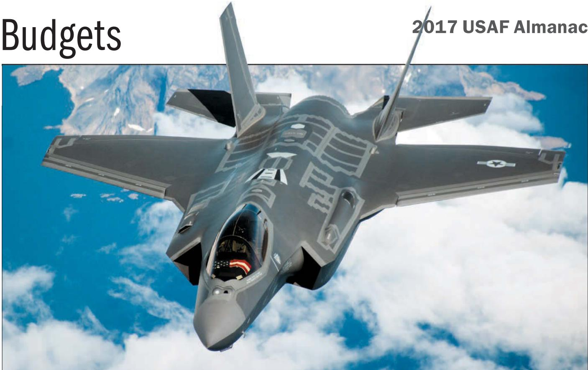  
Some $\$ 5$ billion was budgeted in 2017 for the F-35A Lightning II.

Funding levels can be expressed in several ways. Budget authority is the value of new obligations the federal government is authorized to incur, including some obligations to be met in later years. Figures can also be expressed in outlays (actual expenditures, some of which are covered by amounts previously authorized).

Another difference concerns the value of money. When funding is in current or then-year dollars, it is not adjusted for inflation. This is the actual amount of dollars that has been or is to be spent, budgeted, or forecast. When funding is expressed in constant dollars, or real dollars, the effect of inflation has been taken into account to make direct comparisons between budget years possible. A specific year, often the present one, is chosen as a baseline for constant dollars.

Normally, Congress first authorizes payment, then appropriates it. Authorization establishes or continues a federal program or agency and sets forth guidelines to which it must adhere. Appropriation enables federal agencies to spend money for specific purposes.

# About the FY18 Budget

President Donald Trump in March released a Fiscal 2018 budget blueprint of $\$ 639$ billion for the Defense Department, including $\$ 574$ billion for the base budget and $\$ 65$ billion for Overseas Contingency Operations. However, as of mid-April, the Pentagon hadn’t released its offi cial budget request for the fi scal year beginning Oct. 1. As a result, this year’s edition of the almanac uses fi gures from last year’s defense budget (adjusted for infl ation), except where the Pentagon’s supplemental 2017 budget request provides more current data.

<table><tr><td colspan="5">Acronyms and Abbreviations</td><td>Budget Sources</td></tr><tr><td>AEHF</td><td>Advanced Extremely High</td><td>GPS</td><td>Global Positioning</td><td>NAOC National Airborne</td><td>Congressional Budget Office</td></tr><tr><td rowspan="2">AGS</td><td>Frequency Alliance Ground</td><td>System helo helicopter</td><td></td><td>Operations Center 0&amp;M</td><td>cbo.gov</td></tr><tr><td>Surveillance</td><td>ICBM</td><td>intercontinental ballistic</td><td>operation and maintenance</td><td>■ Topics&gt;&gt;Budget</td></tr><tr><td rowspan="2"></td><td>AMRAAM Advanced Medium-Range</td><td>missile</td><td></td><td>PAR Presidential Aircraft</td><td></td></tr><tr><td>Air-to-Air Missile</td><td>ISR</td><td>intelligence, surveillance,</td><td>Replacement</td><td>Defense Department Comptroller</td></tr><tr><td>AWACS</td><td>Airborne Warning and</td><td></td><td>and reconnaissance</td><td>RDT&amp;E research, development,</td><td>comptroller.defense.gov Budget materials by fiscal year</td></tr><tr><td rowspan="2">BM</td><td>Control System</td><td>JASSM</td><td>Joint Air-to-Surface</td><td>test, and evaluation</td><td>■ Links to budget pages for each</td></tr><tr><td>battle management</td><td></td><td>Standoff Missile</td><td>SATCOM satellite communications</td><td></td></tr><tr><td>C3</td><td>command, control, and</td><td>JDAM</td><td>Joint Direct Attack</td><td>SBIRS Space Based Infrared</td><td>service</td></tr><tr><td rowspan="2">DCGS</td><td>communications</td><td></td><td>Munition</td><td>System</td><td></td></tr><tr><td>Distributed Common</td><td>JSTARS</td><td>Joint Surveillance Target SDB</td><td>Small Diameter Bomb</td><td>Office of Management and Budget</td></tr><tr><td></td><td>Ground System</td><td></td><td>Attack Radar System</td><td>Sigint signals intelligence</td><td>whitehouse.gov/omb</td></tr><tr><td rowspan="2">DSRP</td><td>Defense Space</td><td>Milcon</td><td>Military construction</td><td>SOF</td><td>■ Budget Special operations forces</td></tr><tr><td></td><td>MilSatComm</td><td></td><td></td><td> Links to past budgets, including</td></tr><tr><td></td><td>Reconnaissance Program</td><td></td><td></td><td>UAV unmanned aerial vehicle</td><td>appendices and historical tables (via</td></tr><tr><td rowspan="2">EELV</td><td>Evolved Expendable</td><td>Military Satellite</td><td></td><td></td><td>GPO)</td></tr><tr><td>Launch Vehicle</td><td></td><td>Communications</td><td></td><td></td></tr></table>

AIR FORCE BUDGET—A 10-YEAR PERSPECTIVE (Budget authority in millions of current and constant FY18 dollars; excludes war funding)   

<table><tr><td>CURRENT DOLLARS</td><td>FY08</td><td>FY09</td><td>FY10</td><td>FY11</td><td>FY12</td><td>FY13</td><td>FY14</td><td>FY15</td><td>FY16</td><td>FY17</td></tr><tr><td>Military Personnel</td><td>$30,677</td><td>$31,847</td><td>$33,614</td><td>$34,235</td><td>$35,131</td><td>$34,704</td><td>$35,103</td><td>$33,617</td><td>$33,892</td><td>$34,697</td></tr><tr><td>0&amp;M</td><td>40,957</td><td>44,353</td><td>42,267</td><td>45,820</td><td>47,007</td><td>42,550</td><td>43,196</td><td>44,596</td><td>44,111</td><td>50,189</td></tr><tr><td>Procurement</td><td>35,136</td><td>35,938</td><td>35,830</td><td>36,277</td><td>36,020</td><td>30,341</td><td>31,259</td><td>33,914</td><td>41,003</td><td>41,736</td></tr><tr><td>RDT&amp;E</td><td>26,261</td><td>26,305</td><td>27,700</td><td>26,982</td><td>26,113</td><td>22,766</td><td>23,655</td><td>23,568</td><td>24,476</td><td>28,954</td></tr><tr><td>Military Construction</td><td>2,507</td><td>2,591</td><td>2,317</td><td>1,416</td><td>1,468</td><td>482</td><td>1,291</td><td>1,045</td><td>1,649</td><td>2,181</td></tr><tr><td>Family Housing</td><td>1,001</td><td>990</td><td>569</td><td>591</td><td>490</td><td>520</td><td>465</td><td>328</td><td>492</td><td>336</td></tr><tr><td>Revolving Funds</td><td>60</td><td>61</td><td>64</td><td>67</td><td>65</td><td>45</td><td>150</td><td>67</td><td>63</td><td>64</td></tr><tr><td>Total</td><td></td><td></td><td></td><td></td><td></td><td></td><td></td><td></td><td></td><td>$136,600 $142,086 $142,360 $145,386 $146,295 $131,408 $135,120 $137,134 $145,685 $158,156</td></tr></table>

<table><tr><td>CONSTANT DOLLARS</td><td>FY08</td><td>FY09</td><td>FY10</td><td>FY11</td><td>FY12</td><td>FY13</td><td>FY14</td><td>FY15</td><td>FY16</td><td>FY17</td></tr><tr><td>Military Personnel</td><td>$35,309</td><td>$36,783</td><td>$38,286</td><td>$37,898</td><td>$38,152</td><td>$37,168</td><td>$37,034</td><td>$35,432</td><td>$35,282</td><td>$35,495</td></tr><tr><td>0&amp;M</td><td>47,142</td><td>51,228</td><td>48,142</td><td>50,723</td><td>51,050</td><td>45,571</td><td>45,572</td><td>47,004</td><td>45,920</td><td>51,343</td></tr><tr><td>Procurement</td><td>40,442</td><td>41,508</td><td>40,810</td><td>40,159</td><td>39,118</td><td>32,495</td><td>32,978</td><td>35,745</td><td>42,684</td><td>42,696</td></tr><tr><td>RDT&amp;E</td><td>30,226</td><td>30,382</td><td>31,550</td><td>29,869</td><td>28,359</td><td>24,382</td><td>24,956</td><td>24,841</td><td>25,480</td><td>29,620</td></tr><tr><td>Military Construction</td><td>2,886</td><td>2,993</td><td>2,639</td><td>1,568</td><td>1,594</td><td>516</td><td>1,362</td><td>1,101</td><td>1,717</td><td>2,231</td></tr><tr><td>Family Housing</td><td>1,152</td><td>1,143</td><td>648</td><td>654</td><td>532</td><td>557</td><td>491</td><td>346</td><td>512</td><td>344</td></tr><tr><td>Revolving Funds</td><td>69</td><td>70</td><td>73</td><td>74</td><td>71</td><td>48</td><td>158</td><td>71</td><td>66</td><td>65</td></tr><tr><td>Total</td><td>$157,227 $164,109 $162,148 $160,942 $158,876 $140,738 $142,552 $144,539 $151,658 $161,794</td><td></td><td></td><td></td><td></td><td></td><td></td><td></td><td></td><td></td></tr></table>

<table><tr><td>PERCENTAGE CHANGE</td><td>FY08</td><td>FY09</td><td>FY10</td><td>FY11</td><td>FY12</td><td>FY13</td><td>FY14</td><td>FY15</td><td>FY16</td><td>FY17</td></tr><tr><td>Military Personnel</td><td>-1.6%</td><td>4.2%</td><td>4.1%</td><td>-1.0%</td><td>0.7%</td><td>-2.6%</td><td>-0.4%</td><td>-4.3%</td><td>-0.4%</td><td>0.6%</td></tr><tr><td>0&amp;M</td><td>2.8%</td><td>8.7%</td><td>-6.0%</td><td>5.4%</td><td>0.6%</td><td>-10.7%</td><td>0.0%</td><td>3.1%</td><td>-2.3%</td><td>11.8%</td></tr><tr><td>Procurement</td><td>8.0%</td><td>2.6%</td><td>-1.7%</td><td>-1.6%</td><td>-2.6%</td><td>-16.9%</td><td>1.5%</td><td>8.4%</td><td>19.4%</td><td>0.0%</td></tr><tr><td>RDT&amp;E</td><td>4.4%</td><td>0.5%</td><td>3.8%</td><td>-5.3%</td><td>-5.1%</td><td>-14.0%</td><td>2.4%</td><td>-0.5%</td><td>2.6%</td><td>16.3%</td></tr><tr><td>Military Construction</td><td>6.2%</td><td>3.7%</td><td>-11.8%</td><td>-40.6%</td><td>1.7%</td><td>-67.6%</td><td>163.8%</td><td>-19.1%</td><td>55.9%</td><td>30.0%</td></tr><tr><td>Family Housing</td><td>-49.0%</td><td>-0.8%</td><td>-43.3%</td><td>1.0%</td><td>-18.7%</td><td>4.7%</td><td>-11.9%</td><td>-29.5%</td><td>48.2%</td><td>-32.9%</td></tr><tr><td>Revolving Funds</td><td>32.0%</td><td>2.0%</td><td>3.5%</td><td>1.8%</td><td>-4.8%</td><td>-31.7%</td><td>228.4%</td><td>-55.4%</td><td>-7.1%</td><td>-0.2%</td></tr><tr><td>Total</td><td>2.7%</td><td>4.4%</td><td>-1.2%</td><td>-0.7%</td><td>-1.3%</td><td>-11.4%</td><td>1.3%</td><td>1.4%</td><td>4.9%</td><td>6.7%</td></tr></table>

Numbers do not add due to rounding.

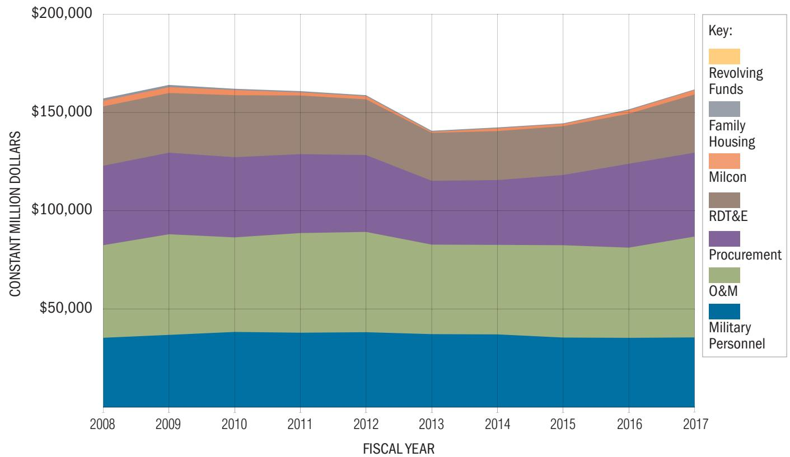  
10-YEAR SPENDING TREND BY CATEGORY (Budget authority in millions of constant FY18 dollars)

# DEFENSE BUDGET AUTHORITY

(In billions)   

<table><tr><td colspan="2">Actual</td><td rowspan="2">Enacted Planned</td><td colspan="5"></td></tr><tr><td></td><td>2015</td><td>2016</td><td>2017</td><td>2018</td><td>2019</td><td>2020 2021</td></tr><tr><td>No War Costs, Current Dollars</td><td>$497.3</td><td>$521.7</td><td>$549.6</td><td>$556.7</td><td>$564.8</td><td>$570.4</td><td>$585.2</td></tr><tr><td>No War Costs, Constant FY18 Dollars</td><td>524.2</td><td>543.1</td><td>562.2</td><td>556.7</td><td>551.8</td><td>543.6</td><td>543.7</td></tr><tr><td>With War Costs, Current Dollars</td><td>560.4</td><td>580.3</td><td>619.2</td><td>626.4*</td><td>634.5*</td><td>640.1*</td><td>654.9*</td></tr><tr><td>With War Costs, Constant FY18 Dollars</td><td>590.7</td><td>604.1</td><td>633.4</td><td>626.4*</td><td>619.9*</td><td>610.0*</td><td>608.4*</td></tr></table>

\*Includes placeholder value of $\$ 69.7$ billion in war funding.

# SERVICE AND AGENCY SHARES OF BASE DOD BUDGET

(Budget authority in billions of constant FY18 dollars)

<table><tr><td colspan="8">Planned</td></tr><tr><td></td><td>2015</td><td>2016</td><td>2017</td><td>2018</td><td>2019</td><td>2020</td><td>2021</td></tr><tr><td>Constant Dollars</td><td></td><td></td><td></td><td></td><td></td><td></td><td></td></tr><tr><td>Air Force</td><td>$144.5</td><td>$151.7</td><td>$161.8</td><td>$159.2</td><td>$157.3</td><td>$155.4</td><td>$155.8</td></tr><tr><td>Army</td><td>126.5</td><td>128.3</td><td>133.3</td><td>132.1</td><td>129.8</td><td>128.1</td><td>127.1</td></tr><tr><td>Navy/Marine Corps</td><td>157.5</td><td>165.9</td><td>168.5</td><td>165.0</td><td>162.7</td><td>159.3</td><td>160.2</td></tr><tr><td>Defense Agencies</td><td>95.6</td><td>97.2</td><td>98.6</td><td>100.4</td><td>102.1</td><td>100.7</td><td>100.7</td></tr><tr><td>Total</td><td>$524.2</td><td>$543.1</td><td>$562.2</td><td>$556.7</td><td>$551.8</td><td>$543.6</td><td>$543.7</td></tr><tr><td>Percentages</td><td></td><td></td><td></td><td></td><td></td><td></td><td></td></tr><tr><td>Air Force</td><td>27.6%</td><td>27.9%</td><td>28.8%</td><td>28.6%</td><td>28.5%</td><td>28.6%</td><td>28.7%</td></tr><tr><td>Army</td><td>24.1%</td><td>23.6%</td><td>23.7%</td><td>23.7%</td><td>23.5%</td><td>23.6%</td><td>23.4%</td></tr><tr><td>Navy/Marine Corps</td><td>30.0%</td><td>30.5%</td><td>30.0%</td><td>29.6%</td><td>29.5%</td><td>29.3%</td><td>29.5%</td></tr><tr><td>Defense Agencies</td><td>18.2%</td><td>17.9%</td><td>17.5%</td><td>18.0%</td><td>18.5%</td><td>18.5%</td><td>18.5%</td></tr></table>

USAF shares above include non-Blue funding. Outyears estimates based on FY18 shares.

<table><tr><td colspan="3">USAF&#x27;s Blue-only Share</td><td></td></tr><tr><td>Dollars</td><td>$113.2</td><td>$121.9</td><td>$120.4</td></tr><tr><td>Percentages</td><td>21.6%</td><td>22.4%</td><td>21.4%</td></tr></table>

The Air Force budget includes Blue dollars, money for USAF programs, and non-Blue dollars, money (such as some intelligence- and space-related funding) USAF does not manage but that simply passes through Air Force accounts.

# SERVICE AND AGENCY PERCENTAGE OF BASE DOD BUDGET

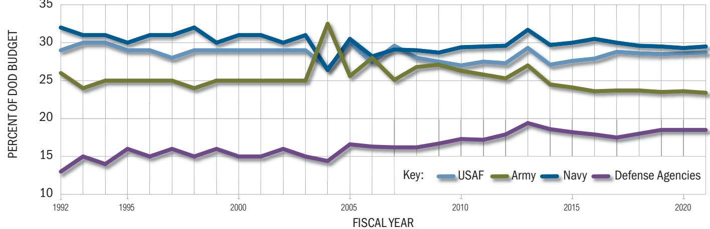

# CUTTING THE PIE: WHO GETS WHAT

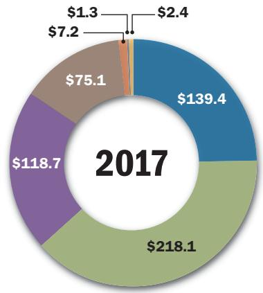

<table><tr><td></td><td>2015</td><td>2016</td><td>2017</td><td>2018</td><td>2019</td><td>2020</td><td>2021</td></tr><tr><td>Military Personnel</td><td>$142.2</td><td>$140.8</td><td>$139.4</td><td>$137.9</td><td>$136.9</td><td>$136.7</td><td>$136.3</td></tr><tr><td>0&amp;M</td><td>206.9</td><td>205.6</td><td>218.1</td><td>219.0</td><td>219.7</td><td>218.5</td><td>217.0</td></tr><tr><td>Procurement</td><td>99.0</td><td>115.2</td><td>118.7</td><td>115.3</td><td>113.4</td><td>113.0</td><td>115.4</td></tr><tr><td>RDT&amp;E</td><td>66.9</td><td>71.6</td><td>75.1</td><td>75.2</td><td>73.3</td><td>67.9</td><td>66.9</td></tr><tr><td>Military Construction</td><td>5.7</td><td>7.2</td><td>7.2</td><td>7.9</td><td>6.9</td><td>5.9</td><td>6.6</td></tr><tr><td>Family Housing</td><td>1.2</td><td>1.4</td><td>1.3</td><td>1.4</td><td>1.5</td><td>1.3</td><td>1.4</td></tr><tr><td>Revolving Funds</td><td>2.3</td><td>1.2</td><td>2.4</td><td>0.1</td><td>0.1</td><td>0.1</td><td>0.2</td></tr><tr><td>Total</td><td>$524.2</td><td>$543.1</td><td>$562.2</td><td>$556.7</td><td>$551.8</td><td>$543.6</td><td>$543.7</td></tr></table>

(Budget authority in billions of constant FY18 dollars)

FEDERAL BUDGET OUTLAY CATEGORIES AS PERCENTAGE OF GDP   

<table><tr><td>YEAR</td><td>TOTAL OUTLAYS</td><td>DEFICIT/ SURPLUS</td><td>ENTITLEMENTS DEFENSE</td></tr><tr><td>1974</td><td>18.1</td><td>-0.5</td><td>8.8 5.4</td></tr><tr><td>1975</td><td>20.6</td><td>-3.4</td><td>10.5 5.4</td></tr><tr><td>1976</td><td>20.8</td><td>-3.9</td><td>10.6 5.0</td></tr><tr><td>1977</td><td>20.2</td><td>-2.5</td><td>10.0 4.8</td></tr><tr><td>1978</td><td>20.1</td><td>-2.4</td><td>10.0 4.6</td></tr><tr><td>1979</td><td>19.6</td><td>-1.5</td><td>9.6 4.5</td></tr><tr><td>1980</td><td>21.1</td><td>-2.6</td><td>10.4 4.8</td></tr><tr><td>1981</td><td>21.6</td><td>-2.4</td><td>10.8 5.0</td></tr><tr><td>1982</td><td>22.5</td><td>-3.6</td><td>11.2 5.6</td></tr><tr><td>1983</td><td>22.8</td><td>-5.9</td><td>11.6 5.9</td></tr><tr><td>1984</td><td>21.5</td><td>-4.7</td><td>10.3 5.8</td></tr><tr><td>1985</td><td>22.2</td><td>-5.2</td><td>10.5 5.9</td></tr><tr><td>1986</td><td>21.8</td><td>-5.2</td><td>10.2 6.0</td></tr><tr><td>1987</td><td>21.0</td><td>-3.5</td><td>9.9 5.9</td></tr><tr><td>1988</td><td></td><td></td><td></td></tr><tr><td>1989</td><td>20.6</td><td>-3.7</td><td>9.8 5.6</td></tr><tr><td>1990</td><td>20.5 21.2</td><td>-3.7 -4.7</td><td>9.8 5.5 10.6</td></tr><tr><td>1991</td><td>21.7</td><td>-5.3</td><td>5.1</td></tr><tr><td></td><td></td><td></td><td>11.5 5.2</td></tr><tr><td>1992</td><td>21.5</td><td>-5.3</td><td>11.2 4.7</td></tr><tr><td>1993</td><td>20.7</td><td>-4.4</td><td>10.8 4.3</td></tr><tr><td>1994</td><td>20.3</td><td>-3.6</td><td>10.9 3.9</td></tr><tr><td>1995</td><td>20.0</td><td>-3.0</td><td>10.8 3.6</td></tr></table>

This data is based on fi gures from the the White House Offi ce of Management and Budget.

<table><tr><td>YEAR</td><td>TOTAL OUTLAYS</td><td>DEFICIT/ SURPLUS</td><td>ENTITLEMENTS</td><td>DEFENSE</td></tr><tr><td>1996</td><td>19.6</td><td>-2.2</td><td>10.7</td><td>3.3</td></tr><tr><td>1997</td><td>18.9</td><td>-1.2</td><td>10.6</td><td>3.2</td></tr><tr><td>1998</td><td>18.5</td><td>-0.3</td><td>10.5</td><td>3.0</td></tr><tr><td>1999</td><td>17.9</td><td>-0.0</td><td>10.3</td><td>2.9</td></tr><tr><td>2000</td><td>17.6</td><td>+0.9</td><td>10.2</td><td>2.9</td></tr><tr><td>2001</td><td>17.6</td><td>-0.3</td><td>10.4</td><td>2.9</td></tr><tr><td>2002</td><td>18.5</td><td>-2.9</td><td>11.0</td><td>3.2</td></tr><tr><td>2003</td><td>19.1</td><td>-4.8</td><td>11.3</td><td>3.6</td></tr><tr><td>2004</td><td>19.0</td><td>-4.7</td><td>11.1</td><td>3.8</td></tr><tr><td>2005</td><td>19.2</td><td>-3.8</td><td>11.2</td><td>3.8</td></tr><tr><td>2006</td><td>19.4</td><td>-3.2</td><td>11.4</td><td>3.8</td></tr><tr><td>2007</td><td>19.1</td><td>-2.4</td><td>11.4</td><td>3.8</td></tr><tr><td>2008</td><td>20.2</td><td>-4.4</td><td>12.1</td><td>4.2</td></tr><tr><td>2009</td><td>24.4</td><td>-10.8</td><td>15.9</td><td>4.6</td></tr><tr><td>2010</td><td>23.4</td><td>-9.3</td><td>14.3</td><td>4.7</td></tr><tr><td>2011</td><td>23.4</td><td>-8.9</td><td>14.5</td><td>4.5</td></tr><tr><td>2012</td><td>22.1</td><td>-7.2</td><td>14.1</td><td>4.2</td></tr><tr><td>2013</td><td>20.9</td><td>-4.4</td><td>14.2</td><td>3.8</td></tr><tr><td>2014</td><td>20.4</td><td>-3.0</td><td>13.8</td><td>3.5</td></tr><tr><td>2015</td><td>20.6</td><td>-2.6</td><td>14.3</td><td>3.3</td></tr><tr><td>2016</td><td>20.9</td><td>-3.4</td><td>14.5</td><td>3.2</td></tr></table>

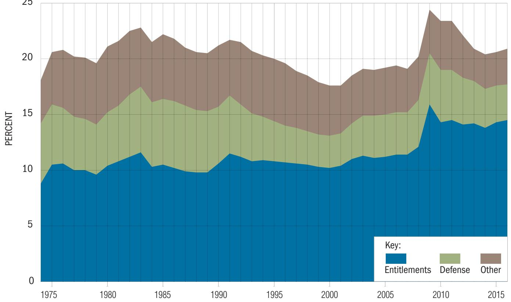  
FEDERAL BUDGET OUTLAY CATEGORIES AS PERCENTAGE OF GDP   
Source: “The Budget and Economic Outlook: 2017 to 2027,” Congressional Budget Offi ce, January 2017.

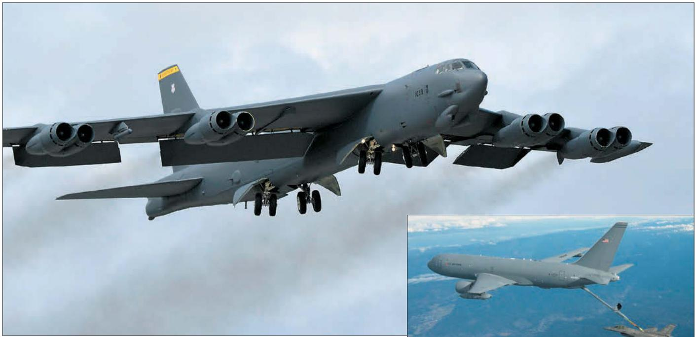

Above: B-52s average 55 years old and had $\$ 78$ million budgeted for RDT&E in 2017. Right: KC-46A tankers, such as this one refueling an F-16, are still in testing and had a $\$ 262$ million RDT&E budget for 2017.

DEFENSE OUTLAYS (In billions)   
Planned   

<table><tr><td></td><td>2015</td><td>2016</td><td>2017</td><td>2018</td><td>2019</td><td>2020</td><td>2021</td></tr><tr><td>Current Dollars</td><td>$562.5</td><td>$576.3</td><td>$586.8</td><td>$568.6</td><td>$569.9</td><td>$575.3</td><td>$582.0</td></tr><tr><td>Constant FY18 Dollars</td><td>$592.9</td><td>$599.9</td><td>$600.3</td><td>$568.6</td><td>$556.8</td><td>$548.3</td><td>$540.7</td></tr></table>

This data is based on fi gures from the the White House Offi ce of Management and Budge

# DEFENSE OUTLAYS AS A SHARE OF GROSS DOMESTIC PRODUCT

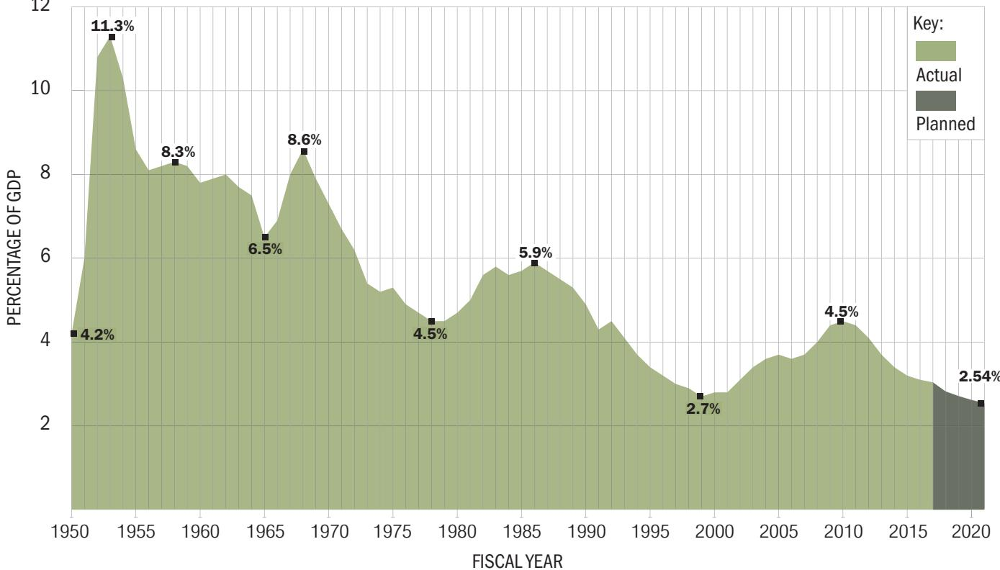  
This data is based on fi gures from the the White House Offi ce of Management and Budget.

# MAJOR USAF PROGRAMS RDT&E

(Current million dollars)

Enacted   

<table><tr><td></td><td></td><td>2016</td><td></td><td>2018</td></tr><tr><td></td><td>B-1B Lancer</td><td>$2.2</td><td>$5.8</td><td>$17.9</td></tr><tr><td></td><td>B-2A Spirit</td><td>380.1</td><td>468.1</td><td>487.3</td></tr><tr><td></td><td>B-21 Raider</td><td>736.2</td><td>1,358.3</td><td>2,167.5</td></tr><tr><td></td><td>B-52H Stratofortress</td><td>74.5</td><td>78.3</td><td>140.3</td></tr><tr><td></td><td></td><td></td><td></td><td></td></tr><tr><td></td><td>A-10C Thunderbolt II</td><td>16.2</td><td>14.9</td><td>13.4</td></tr><tr><td></td><td>F-15C/D/E Eagle/Strike Eagle</td><td>386.7</td><td>613.4</td><td>410.8</td></tr><tr><td></td><td>F-16C/D Fighting Falcon</td><td>166.3</td><td>132.8</td><td>235.9</td></tr><tr><td></td><td>F-22A Raptor</td><td>372.2</td><td>457.9 603.5</td><td>423.0 486.8</td></tr><tr><td></td><td>F-35A Lightning II</td><td>640.9</td><td></td><td></td></tr><tr><td>星</td><td>HH-60G/U Pave Hawk UH-1N Iroquois</td><td>156.1</td><td>319.3 14.1</td><td>453.5</td></tr><tr><td></td><td></td><td>0.0</td><td></td><td>19.7</td></tr><tr><td></td><td>Minuteman II</td><td>349.0</td><td>481.4</td><td>437.9</td></tr><tr><td></td><td>Air &amp; Space Ops Center</td><td></td><td></td><td></td></tr><tr><td></td><td></td><td>68.7</td><td>66.5</td><td>17.8</td></tr><tr><td></td><td>Airborne Recon Systems</td><td>60.1</td><td>3.8</td><td>3.4</td></tr><tr><td></td><td>Airborne Sigint Enterprise</td><td>112.8</td><td>90.8</td><td>128.6</td></tr><tr><td></td><td>DCGS</td><td>51.0</td><td>42.0</td><td>52.7</td></tr><tr><td></td><td>E-3B/C/G Sentry (AWACS)</td><td>131.8</td><td>86.6</td><td>121.1</td></tr><tr><td></td><td>E-4B NAOC</td><td>76.8</td><td>30.9</td><td>20.6</td></tr><tr><td></td><td>E-8C STARS</td><td>44.3</td><td>128.0</td><td>414.0</td></tr><tr><td></td><td>EC-130H/J Compass Call/Commando Solo</td><td>14.2</td><td>13.7</td><td>14.0</td></tr><tr><td></td><td>Endurance UAV</td><td>5.0</td><td>0.0</td><td>0.0</td></tr><tr><td></td><td>MQ-1B Predator</td><td>0.0</td><td>0.0</td><td>0.0</td></tr><tr><td></td><td>MQ-9A Reaper</td><td>122.7</td><td>151.4</td><td>164.0</td></tr><tr><td></td><td>NATOAGS</td><td>138.4</td><td>38.9 0.0</td><td>0.0 0.0</td></tr><tr><td></td><td>RC-135S/U/V/W</td><td>0.0 188.1</td><td>256.3</td><td>321.8</td></tr><tr><td></td><td>RQ-4B Global Hawk U-2S Dragon Lady</td><td>34.5</td><td>37.2</td><td>6.9</td></tr><tr><td></td><td></td><td></td><td></td><td></td></tr><tr><td></td><td>C-5A/B/C/M Galaxy</td><td>22.9</td><td>66.1</td><td>46.7</td></tr><tr><td></td><td>C-17A Globemaster ⅢI</td><td>48.8</td><td>12.4</td><td>71.6</td></tr><tr><td></td><td>C-130H Hercules</td><td>34.0 25.0</td><td>15.6 16.8</td><td>90.7 18.3</td></tr><tr><td></td><td>C-130J Super Hercules</td><td>1.8</td><td>0.0</td><td>0.0</td></tr><tr><td></td><td>KC-10A Extender</td><td>592.4</td><td>261.7</td><td>21.2</td></tr><tr><td></td><td>KC-46A Pegasus</td><td>82.4</td><td>351.2</td><td>625.6</td></tr><tr><td></td><td>PAR</td><td></td><td></td><td></td></tr><tr><td></td><td>AGM-158A JASSM</td><td>9.8</td><td>30.0</td><td>20.3</td></tr><tr><td></td><td>AIM-9X Sidewinder</td><td>43.4</td><td>52.9</td><td>44.8</td></tr><tr><td></td><td>AIM-120AMRAAM</td><td>46.2</td><td>62.5</td><td>61.1</td></tr><tr><td></td><td>GBU-31/32/38 JDAM</td><td>0.0</td><td>9.9 54.8</td><td>14.9 47.4</td></tr><tr><td></td><td>GBU-39SDB</td><td>29.1 0.0</td><td>0.0</td><td>0.0</td></tr><tr><td>\$</td><td>AGM-114 Helfire</td><td></td><td></td><td></td></tr><tr><td></td><td>AC-130H/J/U/W</td><td>0.0</td><td>0.0</td><td>0.0</td></tr><tr><td></td><td>CV-22B Osprey HC/MC-130H/J/P</td><td>27.8 10.8</td><td>16.7 14.0</td><td>17.5 27.5</td></tr><tr><td></td><td>Tactical Air Control Party Modifications</td><td>12.4</td><td>11.8</td><td>10.6</td></tr><tr><td></td><td></td><td></td><td></td><td></td></tr><tr><td></td><td>AEHF Counterspace Systems</td><td>228.1 24.1</td><td>259.1</td><td>237.8</td></tr><tr><td></td><td>Cyberspace DSRP</td><td>117.4</td><td>34.8 232.6</td><td>40.8</td></tr><tr><td></td><td></td><td>0.0</td><td>0.0</td><td>306.3</td></tr><tr><td></td><td>EELV</td><td>227.8</td><td></td><td>0.0</td></tr><tr><td></td><td></td><td>671.4</td><td>296.6</td><td>296.7</td></tr><tr><td></td><td>GPS</td><td></td><td>813.3</td><td>599.2</td></tr><tr><td></td><td>Joint Space Ops Center</td><td>80.7</td><td>72.9</td><td>62.8</td></tr><tr><td></td><td>MilsatCom</td><td>71.9</td><td>50.8</td><td>24.5</td></tr><tr><td>SBIRS</td><td></td><td>291.5</td><td>182.0</td><td>444.2</td></tr><tr><td></td><td>Space Control Technology</td><td>4.1</td><td>7.5</td><td>7.8</td></tr><tr><td></td><td>Space Fence</td><td>240.7</td><td>168.4</td><td>50.2</td></tr><tr><td></td><td>Space Situation Awareness</td><td>61.6</td><td>82.7</td><td>119.9</td></tr><tr><td></td><td>Spacelift Range System</td><td>25.8</td><td>30.4</td><td>29.8</td></tr><tr><td></td><td>Wideband Global SATCOM</td><td>52.2</td><td>41.6</td><td>14.4</td></tr><tr><td>GRAND TOTAL</td><td></td><td>$7.412.8</td><td>$8.743.2</td><td>$9.919.3</td></tr></table>

# MAJOR USAF PROGRAMS PROCUREMENT

(Current million dollars)

<table><tr><td>2016</td><td>2017</td><td>2018</td></tr><tr><td>$114.1</td><td>$116.3</td><td>$97.8</td></tr><tr><td>38.8</td><td>43.5</td><td>38.7</td></tr><tr><td>0.0</td><td>0.0</td><td>0.0</td></tr><tr><td>150.8</td><td>137.1</td><td>133.3</td></tr><tr><td></td><td></td><td></td></tr><tr><td>0.0</td><td>25.1</td><td>0.0</td></tr><tr><td>602.2</td><td>108.7</td><td>539.8</td></tr><tr><td>19.1</td><td>112.5</td><td>170.7</td></tr><tr><td>117.0</td><td>211.5</td><td>185.9</td></tr><tr><td>5,790.2</td><td>4,982.2</td><td>5,765.9</td></tr><tr><td>67.1</td><td>91.4</td><td>75.9</td></tr><tr><td>2.5</td><td>18.3</td><td>171.4</td></tr><tr><td>50.3</td><td>85.8</td><td>104.1</td></tr><tr><td></td><td></td><td></td></tr><tr><td>24.8</td><td>46.1</td><td>53.2</td></tr><tr><td>0.0</td><td>0.0</td><td>0.0</td></tr><tr><td>0.0</td><td>0.0</td><td>0.0</td></tr><tr><td>177.0</td><td>170.0</td><td>165.9</td></tr><tr><td>191.1</td><td>312.8</td><td>258.3</td></tr><tr><td>19.9</td><td>53.3</td><td>32.8</td></tr><tr><td>18.0</td><td>6.2</td><td>10.7</td></tr><tr><td>97.0 0.0</td><td>130.3</td><td>102.0</td></tr><tr><td>3.2</td><td>0.0</td><td>0.0</td></tr><tr><td></td><td>0.0</td><td>0.0</td></tr><tr><td>816.5</td><td>829.5</td><td>453.1</td></tr><tr><td>0.0 165.7</td><td>0.0</td><td>0.0</td></tr><tr><td>79.9</td><td>211.4</td><td>201.2</td></tr><tr><td>22.1</td><td>45.1</td><td>113.9</td></tr><tr><td></td><td>36.1</td><td>26.6</td></tr><tr><td>2.6</td><td>24.2</td><td>39.9</td></tr><tr><td>58.8</td><td>45.1</td><td>109.9</td></tr><tr><td>136.7</td><td>9.2</td><td>76.1</td></tr><tr><td>921.3</td><td>308.1</td><td>154.7</td></tr><tr><td>5.6</td><td>4.6</td><td>3.5</td></tr><tr><td>2,350.6</td><td>2,884.6</td><td>3,043.4</td></tr><tr><td>0.0</td><td>0.0</td><td>0.0</td></tr><tr><td>425.6</td><td>431.6</td><td>440.5</td></tr><tr><td>198.2</td><td>127.4</td><td>114.2</td></tr><tr><td>380.0</td><td></td><td>445.5</td></tr><tr><td>534.0</td><td>350.1</td><td>204.0</td></tr><tr><td>135.1</td><td>707.1</td><td></td></tr><tr><td>697.7</td><td>275.5</td><td>93.0</td></tr><tr><td></td><td>179.1</td><td>34.8</td></tr><tr><td>0.0</td><td>0.0</td><td>0.0</td></tr><tr><td>126.5 1,352.7</td><td>63.4</td><td>65.9</td></tr><tr><td>0.0</td><td>980.3</td><td>690.7</td></tr><tr><td></td><td>0.0</td><td>0.0</td></tr><tr><td>327.4</td><td>645.6</td><td>56.9</td></tr><tr><td>43.1</td><td>27.0</td><td>22.7</td></tr><tr><td>98.5</td><td>146.9</td><td>226.2</td></tr><tr><td>128.7</td><td>0.0</td><td>0.0</td></tr><tr><td>1,250.9</td><td>1,506.4</td><td>1,426.6</td></tr><tr><td>178.4</td><td>49.4</td><td>763.7</td></tr><tr><td>0.0</td><td>0.0</td><td>0.0</td></tr><tr><td>35.5</td><td>41.8</td><td>33.0</td></tr><tr><td>542.7</td><td>362.5</td><td>933.2</td></tr><tr><td>0.0</td><td>0.0</td><td>0.0</td></tr><tr><td>0.0</td><td>0.0</td><td>0.0</td></tr><tr><td>0.0</td><td>0.0</td><td>0.0</td></tr><tr><td>103.3</td><td>123.1</td><td>123.6</td></tr><tr><td></td><td></td><td></td></tr><tr><td>74.5 $18,675.6</td><td>86.3 $17,152.6</td><td>90.7 $17,893.9</td></tr></table>

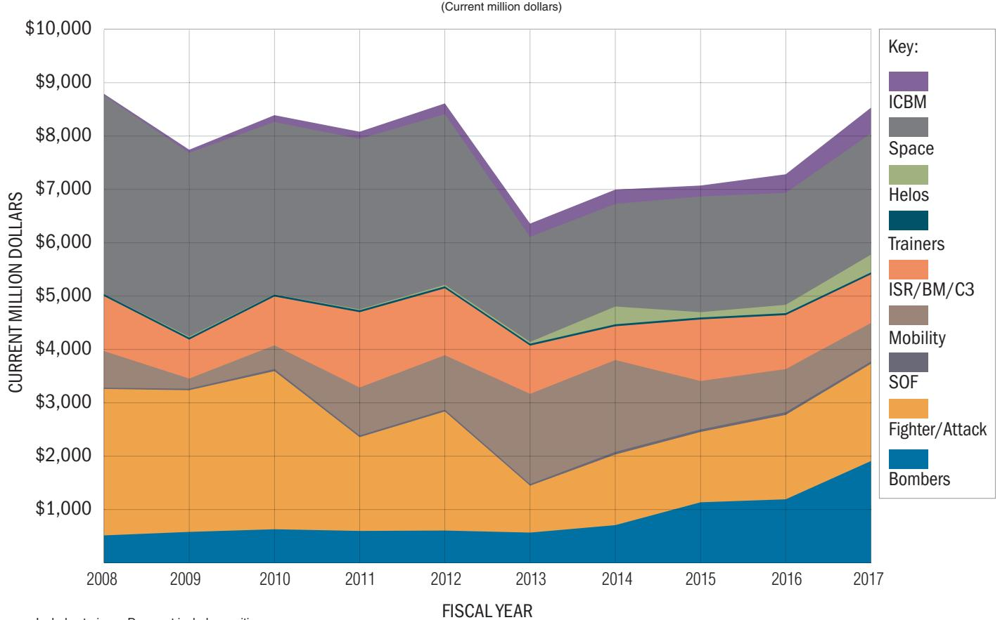  
10 YEARS OF RDT&E FUNDING FOR USAF MAJOR PROGRAMS BY CATEGORY10 YEARS OF RDT&E FUNDING FOR USAF MAJOR PROGRAMS BY CATEGOR   
Includes trainers. Does not include munitions.

(Current million dollars)

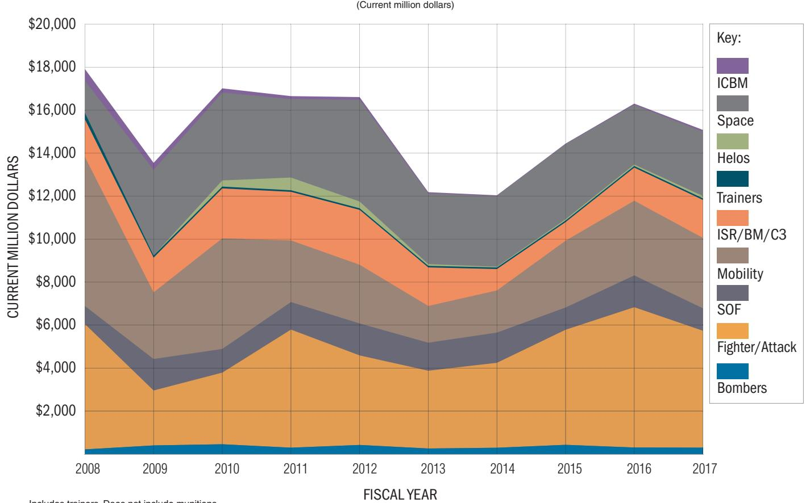  
10 YEARS OF PROCUREMENT FUNDING FOR USAF MAJOR PROGRAMS BY CATEGORY0 YEARS OF PROCUREMENT FUNDING FOR USAF MAJOR PROGRAMS BY CATEGOR

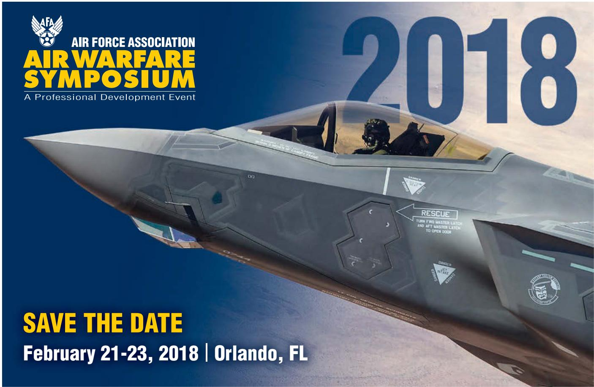

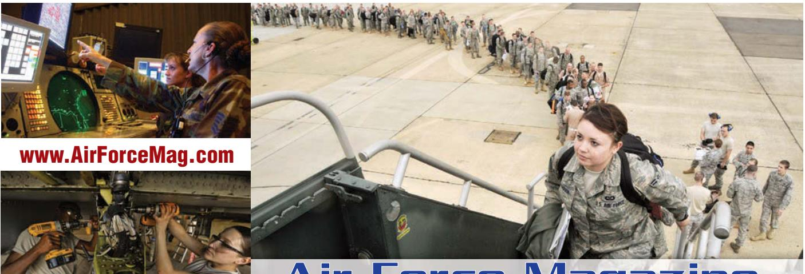

# Air Force Magazine

# For air and space power professionals who must stay informed

# www.AirForceMag.com is the online home to:

AIR FORCE Magazine's Daily Report—presenting current, credible, timely news coverage of aerospace and national security issues • The Daily Report's In More Depth—providing enhanced coverage of the day's most topical airpower and defense issues The online AIR FORCE Magazine—offering the magazine's monthly in-depth articles and a growing collection of historical articles ... And so much more—including wallpaper versions of USAF-in-action photos, reference documents, and Congressional testimony

<table><tr><td colspan="2">Special Operations Forces</td><td></td></tr><tr><td>AC-130J Ghostrider 3</td><td>0 0</td><td>3</td></tr><tr><td>AC-130U Spooky 16</td><td>0 0</td><td>16</td></tr><tr><td>AC-130W Stinger Il 12</td><td>0 0</td><td>12</td></tr><tr><td>CV-22B Osprey 49</td><td>0 0</td><td>49</td></tr><tr><td>MC-130H Combat Talon II 17</td><td>0 0</td><td>17</td></tr><tr><td>MC-130J Commando II 35</td><td>0 0</td><td>35</td></tr><tr><td>MC-130P Combat Shadow 0</td><td>4 0</td><td>4</td></tr><tr><td>Total 132</td><td>4 0</td><td>136</td></tr></table>

AIRCRAFT TOTAL ACTIVE INVENTORY (TAI) (As of Sept. 30, 2016)   

<table><tr><td rowspan=1 colspan=1>Tanker</td><td rowspan=1 colspan=1></td></tr><tr><td rowspan=1 colspan=1>HC-130J Combat King II      19      0    0</td><td rowspan=1 colspan=1>19</td></tr><tr><td rowspan=1 colspan=1>HC-130N King                2      6    0</td><td rowspan=1 colspan=1>8</td></tr><tr><td rowspan=1 colspan=1>HC-130P King                0      3    2</td><td rowspan=1 colspan=1>5</td></tr><tr><td rowspan=1 colspan=1>KC-10A Extender            59     0   0</td><td rowspan=1 colspan=1>59</td></tr><tr><td rowspan=1 colspan=1>KC-135R Stratotanker      126   148  70</td><td rowspan=1 colspan=1>344</td></tr><tr><td rowspan=1 colspan=1>KC-135T Stratotanker        30    24   0</td><td rowspan=2 colspan=1>54489</td></tr><tr><td rowspan=1 colspan=1>Total                      236   181  72</td></tr><tr><td rowspan=1 colspan=1>Transport</td><td rowspan=1 colspan=1></td></tr><tr><td rowspan=1 colspan=1>C-5A Galaxy                  0      0    5</td><td rowspan=1 colspan=1>5</td></tr><tr><td rowspan=1 colspan=1>C-5B Galaxy                  0     0   4</td><td rowspan=1 colspan=1>4</td></tr><tr><td rowspan=1 colspan=1>C-5C Galaxy                  1      0    0</td><td rowspan=1 colspan=1>1</td></tr><tr><td rowspan=1 colspan=1>C-5M Super Galaxy          35      0   3</td><td rowspan=1 colspan=1>38</td></tr><tr><td rowspan=1 colspan=1>C-12C Huron                16      0    0</td><td rowspan=1 colspan=1>16</td></tr><tr><td rowspan=1 colspan=1>C-12D Huron                 6     0   0</td><td rowspan=1 colspan=1>6</td></tr><tr><td rowspan=1 colspan=1>C-12F Huron                  3      0    0</td><td rowspan=1 colspan=1>3</td></tr><tr><td rowspan=1 colspan=1>C-12J Huron                  4      0    0</td><td rowspan=1 colspan=1>4</td></tr><tr><td rowspan=1 colspan=1>C-17A Globemaster II 170    34  18</td><td rowspan=1 colspan=1>222</td></tr><tr><td rowspan=1 colspan=1>C-20B Gulfstream             3     0    0</td><td rowspan=1 colspan=1>3</td></tr><tr><td rowspan=1 colspan=1>C-20H Gulfstream             2      0    0</td><td rowspan=1 colspan=1>2</td></tr><tr><td rowspan=1 colspan=1>C-21A Learjet               25      2    0</td><td rowspan=1 colspan=1>27</td></tr><tr><td rowspan=1 colspan=1>C-32A Air Force Two           4      0    0</td><td rowspan=1 colspan=1>4</td></tr><tr><td rowspan=1 colspan=1>C-32B Air Force Two           0     2    0</td><td rowspan=1 colspan=1>2</td></tr><tr><td rowspan=1 colspan=1>C-37A Gulfstream V           9      0    0</td><td rowspan=1 colspan=1>9</td></tr><tr><td rowspan=1 colspan=1>C-37B Gulfstream V           3      0    0</td><td rowspan=1 colspan=1>3</td></tr><tr><td rowspan=1 colspan=1>C-40B Clipper                 4      0    0</td><td rowspan=1 colspan=1>4</td></tr><tr><td rowspan=1 colspan=1>C-40C Clipper                0      3   4</td><td rowspan=1 colspan=1>7</td></tr><tr><td rowspan=1 colspan=1>C-130H Hercules            16   145  57</td><td rowspan=1 colspan=1>218</td></tr><tr><td rowspan=1 colspan=1>C-130J Hercules             81    16  10</td><td rowspan=1 colspan=1>107</td></tr><tr><td rowspan=1 colspan=1>LC-130H Hercules            0    10   0</td><td rowspan=1 colspan=1>10</td></tr><tr><td rowspan=1 colspan=1>VC-25A Air Force One         2     0   0</td><td rowspan=1 colspan=1>2</td></tr><tr><td rowspan=1 colspan=1>Total                      384   212101</td><td rowspan=1 colspan=1>697</td></tr></table>

<table><tr><td colspan="4">ISR/BM/C3</td><td colspan="2"></td></tr><tr><td>E-3B Sentry (AWACS)</td><td>16</td><td>0</td><td>0</td><td>16</td><td></td></tr><tr><td>E-3C Sentry (AWACS)</td><td>4</td><td>0</td><td>0</td><td></td><td>4</td></tr><tr><td>E-3G Sentry (AWACS)</td><td>11</td><td>0</td><td>0</td><td></td><td>11</td></tr><tr><td>E-4B NAOC</td><td>4</td><td>0</td><td>0</td><td></td><td>4</td></tr><tr><td>E-8C JSTARS</td><td>0</td><td>16</td><td>0</td><td></td><td>16</td></tr><tr><td>E-9A Widget</td><td>2</td><td>0</td><td>0</td><td></td><td>2</td></tr><tr><td>E-11A BACN</td><td>4</td><td>0</td><td>0</td><td></td><td>4</td></tr><tr><td>EC-130H Compass Call</td><td>14</td><td>0</td><td>0</td><td></td><td>14</td></tr><tr><td>EC-130J Commando Solo</td><td>0</td><td>7</td><td>0</td><td></td><td>7</td></tr><tr><td>MC-12W Liberty</td><td>4</td><td>0</td><td>0</td><td></td><td>4</td></tr><tr><td>MQ-1B Predator</td><td>96</td><td>33</td><td>0</td><td></td><td>129</td></tr><tr><td>MQ-9A Reaper</td><td>181</td><td>14</td><td>0</td><td></td><td>195</td></tr><tr><td>NC-135W (test bed)</td><td>1</td><td>0</td><td>0</td><td></td><td>1</td></tr><tr><td>OC-135B Open Skies</td><td>2</td><td>0</td><td>0</td><td></td><td>2</td></tr><tr><td>RC-26B Condor</td><td>0</td><td>11</td><td>0</td><td></td><td>11</td></tr><tr><td>RC-135S Cobra Ball</td><td>3</td><td>0</td><td>0</td><td></td><td>3</td></tr><tr><td>RC-135U Combat Sent</td><td>2</td><td>0</td><td>0</td><td></td><td>2</td></tr><tr><td>RC-135V Rivet Joint</td><td>8</td><td>0</td><td>0</td><td></td><td>8</td></tr><tr><td>RC-135W Rivet Joint</td><td>12</td><td>0</td><td>0</td><td></td><td>12</td></tr><tr><td>RQ-4B Global Hawk</td><td>33</td><td>0</td><td>0</td><td></td><td>33</td></tr><tr><td>TC-135W (trainer)</td><td>3</td><td>0</td><td>0</td><td></td><td>3</td></tr><tr><td>TE-8A</td><td>0</td><td>1</td><td>0</td><td></td><td>1</td></tr><tr><td>TU-2S (trainer)</td><td>5</td><td>0</td><td>0</td><td></td><td>5</td></tr><tr><td>U-2S Dragon Lady</td><td>27</td><td>0</td><td>0</td><td></td><td>27</td></tr><tr><td>WC-130H Hercules</td><td>0</td><td>7</td><td>0</td><td></td><td>7</td></tr><tr><td>WC-130J Hercules</td><td>0</td><td>0</td><td>10</td><td></td><td>10</td></tr><tr><td>WC-135C Constant Phoenix</td><td>1</td><td>0</td><td>0</td><td></td><td>1</td></tr><tr><td>WC-135W Constant Phoenix</td><td>1</td><td>0</td><td>0</td><td></td><td>1</td></tr><tr><td>Total</td><td>434</td><td>89</td><td>10</td><td></td><td>533</td></tr></table>

Total active inventory (TAI): aircraft assigned to operating forces for mission, training, test, or maintenance. Includes primary, backup, and attrition reserve aircraft. For other aircraft acronyms, see Gallery of Weapons.

<table><tr><td colspan="4">Helicopter</td><td></td></tr><tr><td>HH-60G Pave Hawk</td><td>66</td><td>17</td><td>15</td><td>98</td></tr><tr><td>HH-60U Pave Hawk</td><td>3</td><td>0</td><td>0</td><td>3</td></tr><tr><td>TH-1H Iroquois</td><td>28</td><td>0</td><td>0</td><td>28</td></tr><tr><td>UH-1N Iroquois</td><td>63</td><td>0</td><td>0</td><td>63</td></tr><tr><td>Total</td><td>160</td><td>17</td><td>15</td><td>192</td></tr></table>

TOTAL NUMBER OF AIRCRAFT IN SERVICE OVER TIME   
(As of Sept. 30, 2016)   

<table><tr><td>TYPE OF AIRCRAFT—ACTIVE</td><td>FY07</td><td>FY08</td><td>FY09</td><td>FY10</td><td>FY11</td><td>FY12</td><td>FY13</td><td>FY14</td><td>FY15</td><td>FY16</td></tr><tr><td>Bomber</td><td>173</td><td>153</td><td>154</td><td>150</td><td>144</td><td>144</td><td>141</td><td>141</td><td>140</td><td>140</td></tr><tr><td>Fighter/Attack</td><td>1,552</td><td>1,496</td><td>1,468</td><td>1,256</td><td>1,287</td><td>1,289</td><td>1,287</td><td>1,273</td><td>1,312</td><td>1,282</td></tr><tr><td>Special Ops Forces</td><td>100</td><td>94</td><td>89</td><td>98</td><td>105</td><td>117</td><td>122</td><td>124</td><td>144</td><td>132</td></tr><tr><td>ISR/BM/C3</td><td>266</td><td>292</td><td>320</td><td>362</td><td>381</td><td>413</td><td>394</td><td>444</td><td>437</td><td>434</td></tr><tr><td>Tanker</td><td>277</td><td>262</td><td>260</td><td>263</td><td>247</td><td>246</td><td>243</td><td>244</td><td>239</td><td>236</td></tr><tr><td>Transport</td><td>454</td><td>449</td><td>452</td><td>458</td><td>429</td><td>425</td><td>413</td><td>410</td><td>381</td><td>384</td></tr><tr><td>Helicopter</td><td>160</td><td>170</td><td>159</td><td>160</td><td>151</td><td>170</td><td>138</td><td>137</td><td>157</td><td>160</td></tr><tr><td>Trainer Total Active Duty</td><td>1,111</td><td>1,074</td><td>1,114</td><td>1,000</td><td>1,190</td><td>1,213</td><td>1,189</td><td>1,195</td><td>1,187</td><td>1,194</td></tr><tr><td></td><td>4,093</td><td>3,990</td><td>4,016</td><td>3,747</td><td>3,934</td><td>4,017</td><td>3,927</td><td>3,968</td><td>3,997</td><td>3,962</td></tr><tr><td colspan="9">TYPE OF AIRCRAFT—ANG</td><td></td></tr><tr><td>Bomber</td><td>0</td><td>0</td><td>0</td><td>0</td><td>0</td><td>0</td><td>0</td><td>0</td><td>0</td><td>0</td></tr><tr><td>Fighter/Attack</td><td>746</td><td>687</td><td>664</td><td>614</td><td>639</td><td>635</td><td>630</td><td>585</td><td>611</td><td>577</td></tr><tr><td>Special Ops Forces</td><td>4</td><td>4</td><td>4</td><td>4</td><td>4</td><td>4</td><td>4</td><td>4</td><td>4</td><td>4</td></tr><tr><td>ISR/BM/C3</td><td>28</td><td>45</td><td>45</td><td>80</td><td>80</td><td>87</td><td>86</td><td>88</td><td>91</td><td>89</td></tr><tr><td>Tanker</td><td>235</td><td>215</td><td>182</td><td>179</td><td>189</td><td>189</td><td>187</td><td>185</td><td>184</td><td>181</td></tr><tr><td>Transport</td><td>258</td><td>244</td><td>241</td><td>240</td><td>242</td><td>232</td><td>223</td><td>207</td><td>207</td><td>212</td></tr><tr><td>Helicopter</td><td>18</td><td>18</td><td>17</td><td>17</td><td>17</td><td>17</td><td>17</td><td>17</td><td>17</td><td>17</td></tr><tr><td>Total ANG</td><td>1,289</td><td>1,213</td><td>1,153</td><td>1,134</td><td>1,171</td><td>1,164</td><td>1,147</td><td>1,086</td><td>1,114</td><td>1,080</td></tr><tr><td colspan="9">TYPE OFAIRCRAFT—AFRC</td><td></td></tr><tr><td>Bomber</td><td>9</td><td>9</td><td></td><td></td><td></td><td></td><td></td><td></td><td></td><td></td></tr><tr><td>Fighter/Attack</td><td>104</td><td>103</td><td>9 108</td><td>9 97</td><td>18 100</td><td>18 101</td><td>18 95</td><td>18 104</td><td>18 111</td><td>18 111</td></tr><tr><td>Special Ops Forces</td><td>14</td><td>14</td><td>14</td><td>10</td><td>10</td><td>5</td><td>4</td><td>0</td><td>0</td><td>0</td></tr><tr><td>ISR/BM/C3</td><td>17</td><td>11</td><td>11</td><td>14</td><td>12</td><td>11</td><td>11</td><td>10</td><td>10</td><td>10</td></tr><tr><td>Tanker</td><td>85</td><td>69</td><td>69</td><td>69</td><td>72</td><td>72</td><td>71</td><td>68</td><td>68</td><td>72</td></tr><tr><td>Transport</td><td>152</td><td>149</td><td>149</td><td>149</td><td>152</td><td>148</td><td>147</td><td>145</td><td>139</td><td>101</td></tr><tr><td>Helicopter</td><td>15</td><td>15</td><td>15</td><td>15</td><td>15</td><td>15</td><td>15</td><td>15</td><td>15</td><td>15</td></tr><tr><td>TotalAFRC</td><td>396</td><td>370</td><td>375</td><td>363</td><td>379</td><td>370</td><td>361</td><td>360</td><td>361</td><td>327</td></tr><tr><td>TOTAL FORCE</td><td>5,778</td><td>5,573</td><td>5,544</td><td>5,244</td><td>5,484</td><td>5,551</td><td>5,435</td><td>5,414</td><td>5,472</td><td>5,369</td></tr></table>

ICBMs AND SPACECRAFT IN SERVICE OVER TIME (As of Sept. 30, 2016)   

<table><tr><td>TYPE OF SYSTEM</td><td>FY07</td><td>FY08</td><td>FY09</td><td>FY10</td><td>FY11</td><td>FY12</td><td>FY13</td><td>FY14</td><td>FY15</td><td>FY16</td></tr><tr><td>Minuteman IⅢI</td><td>450</td><td>450</td><td>450</td><td>450</td><td>450</td><td>450</td><td>450</td><td>450</td><td>450</td><td>406</td></tr><tr><td>Total ICBMs</td><td>450</td><td>450</td><td>450</td><td>450</td><td>450</td><td>450</td><td>450</td><td>450</td><td>450</td><td>406</td></tr><tr><td>AEHF</td><td>0</td><td>0</td><td>0</td><td>1</td><td>1</td><td>2</td><td>2</td><td>3</td><td>3</td><td>3</td></tr><tr><td>ATRR</td><td>0</td><td>0</td><td>0</td><td>0</td><td>0</td><td>1</td><td>1</td><td>0</td><td>0</td><td>0</td></tr><tr><td>DMSP</td><td>6</td><td>6</td><td>6</td><td>6</td><td>6</td><td>4</td><td>4</td><td>6</td><td>6</td><td>6</td></tr><tr><td>DSCS</td><td>9</td><td>9</td><td>9</td><td>8</td><td>8</td><td>8</td><td>8</td><td>7</td><td>6</td><td>6</td></tr><tr><td>DSP (classified)</td><td></td><td></td><td></td><td></td><td></td><td></td><td></td><td></td><td></td><td></td></tr><tr><td>GPS</td><td>30</td><td>30</td><td>30</td><td>36</td><td>34</td><td>30</td><td>31</td><td>38</td><td>41</td><td>37</td></tr><tr><td>GSSAP</td><td>0</td><td>0</td><td>0</td><td>0</td><td>0</td><td>0</td><td>0</td><td>2</td><td>2</td><td>4</td></tr><tr><td>Milstar</td><td>5</td><td>5</td><td>5</td><td>5</td><td>5</td><td>5</td><td>5</td><td>5</td><td>5</td><td>5</td></tr><tr><td>SBIRS (classiied)</td><td></td><td></td><td></td><td></td><td></td><td></td><td></td><td></td><td></td><td></td></tr><tr><td>SBSS</td><td>0</td><td>0</td><td>0</td><td>1</td><td>1</td><td>1</td><td>1</td><td>1</td><td>1</td><td>1</td></tr><tr><td>WGS</td><td>0</td><td>0</td><td>2</td><td>3</td><td>3</td><td>3</td><td>4</td><td>6</td><td>7</td><td>7</td></tr><tr><td>Total Satellites</td><td>50</td><td>50</td><td>54</td><td>62</td><td>60</td><td>56</td><td>58</td><td>68</td><td>69</td><td>69</td></tr></table>

AEHF: Advanced Extremely High Frequency; ATRR: Advanced Technology Risk Reduction; DMSP: Defense Meteorological Satellite Program; DSCS: Defense Satellite Communications System; DSP: Defense Support Program; GPS: Global Positioning System; GSSAP: Geosynchronous Space Situational Awareness Program; SBIRS: Space Based Infrared System; SBSS Space Based Surveillance System; WGS: Wideband Global SATCOM.

  
BOMBERS OVER TIME  
Source for historical data (1980-2000): “Arsenal of Airpower: USAF Aircraft Inventory, 1950-2009,” Mitchell Institute Press, November 2010.

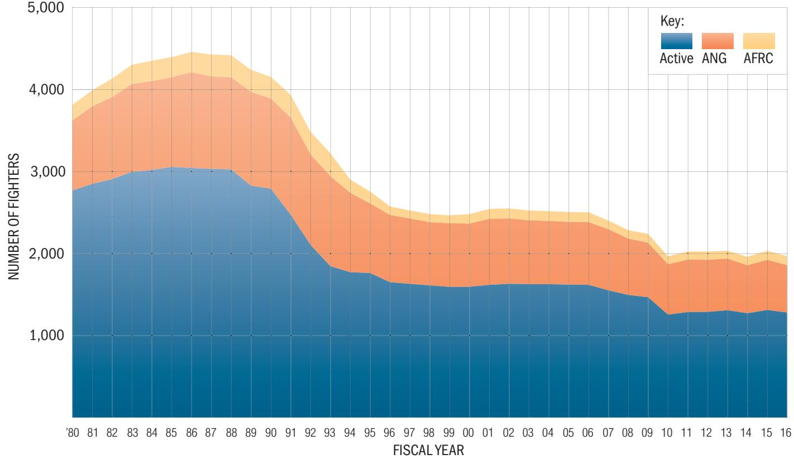  
FIGHTERS OVER TIME  
Source for historical data (1980-2000): “Arsenal of Airpower: USAF Aircraft Inventory, 1950-2009,” Mitchell Institute Press, November 2010.

# ARE YOU GETTING THE MOST OUT OF YOUR MEMBERSHIP?

# INSURANCE

·Medical Air Services Program 1-800-423-3226 or www.masaassist.com/afa

# CAREER/EDUCATION

· Group Accidental Death and   
Dismemberment Insurance   
· Group Term Life Insurance   
· Group Decreasing Term Life Insurance   
· Senior Whole Life Insurance   
· Long Term Care Insurance   
· Auto & Home Insurance   
· Dental Insurance   
· Vision Insurance   
·TRICARE Supplements   
· Medicare Supplements   
· Hospital Indemnity Insurance   
· Cancer Care Insurance   
· Hospital Income & Short Term   
Recovery Insurance   
· Pet Insurance 1-800-291-8480 or www.afainsure.com\*

# FINANCIAL

$\cdot$ AFA USAA Rewards™ Credit Cards   
$\cdot$ USAA Bank   
$\cdot$ USAA Financial Advice, Planning   
& Investments   
1-877-618-2473 or www.usaa.com/afa   
· LifeLock®   
1-800-LifeLock or www.LifeLock.com   
Use code AFA1 for 30 days free and $1 5 \%$ off

# LEGAL

# $\cdot$ Hyatt Group Legal Services

Open enrollment each Nov/Dec   
800-291-8480 or   
https://info.legalplans.com   
Use code 853-0010

# HEALTH

· Dental Benefi ts Max 1-866-481-6289 or www.benefi tservices.com/afa to try this plan free for 30 days $\cdot$ Prescription Discounts 1-877-321-6755 or www.dprxcard.com/AFA for your free RX discount card ·Hearing Benefi ts 1-888-809-7786 or www.americanhearing benefi ts.com/partners/afa for a free consultation

·Coast-to-Coast Vision Plan 1-888-632-5353 or www.afavisionplan.com Use Code EYECARE for $20 \%$ off and 3 months Free

·AFADentalPlans.com 1-888-606-8401 or www.afaDentalPlans.com Use code AFA20 for $20 \%$ off and 3 months Free

·LifeLine Screening, The Power of Prevention 1-800-908-9121 or www.LifeLineScreening.com/AFA Use code BBPA-001 for discounts

# ·Brain Training

www.mybrainsolutions.com/afa for brain training games

# SHOPPING

·Offi ce Depot/Offi ce Max Discounts www.offi cediscounts.org/afa.html

# ·Experticity.com

Discounts on Top Brands 888-814-4764 https://www.experticity.com/afa/

·GOVX   
1-888-468-5511 or   
www.GovX.com/AFA for   
$20 \%$ off apparel and sporting gear

# ·AFA Hangar Store

Items with AFA, AFM, Wounded Airman Program, and Cyberpatriot logos 1-800-727-3337 for a catalog or www.afa.org/store

·Apple Member Purchase Program 1-877-377-6362 or store.apple.com/us/go/ eppstore/airforce

·Dell’s Member Purchase Program 1-800-293-3492 or www.dell.com/afa Use ID DS 126348550

·Résumé Assistance 1-800-727-3337 or www.afa.org/resume ·eKnowledge™ SAT/ACT Discounts www.eKnowledge.com/AFA or 1-951-256-4076 Reference AFA

# TRAVEL

# ·Exclusive Worldwide Hotel Discount Program

1-800-892-2136 or www.afa.org/hotels Enter afa (lower case) for both login and password.

# ·Veterans Holidays®

Vacation resorts for $\$ 349$ /week 1-877-772-2322 or   
www.veteransholidays.com/afa   
Choose Air Force Association from “Installations” list.

·Government Vacation Rewards 1-866-691-5109 mention AFA Membership or www.govvacationrewards.com/afa

# ·Car & Truck Rental Discounts

AVIS: 1-800-698-5685 Reference D453800 or www.avis.com/afa Budget:1-800-455-2848 Reference BCD X201400 or www.budget.com/afa Budget Truck: 1-800-566-8422 Reference 56000083928 or www.budgettruck.com/airforce.aspx

·Wyndham Hotel Group Discounts www.wyndhamhotelgroup.com/?corporate_ id=1000007607 or 1-877-670-7088 (provide ID # 1000007607

# ·zipcar

www.zipcar.com/partners/afa 1-866-4ZIPCAR (866-494-7227)

\* For features, costs, eligibility, renewability, limitations & exclusions. AR Insurance License #100102691, CA Insurance License #0G39709

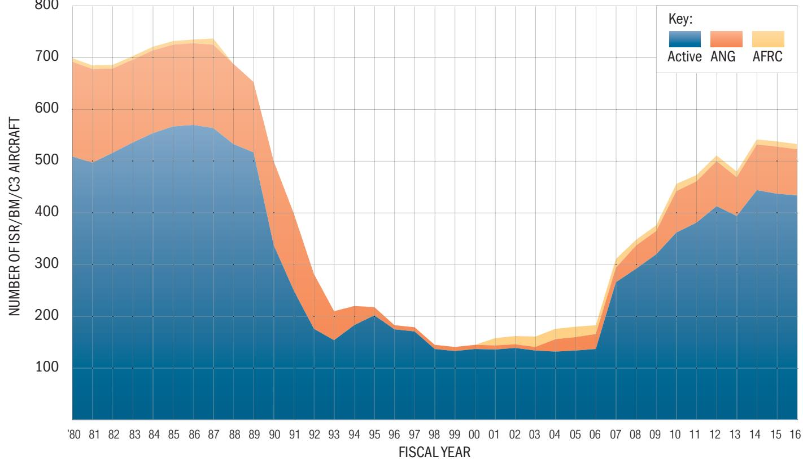  
ISR/BM/C3 AIRCRAFT OVER TIME   
Source for historical data (1980-2000): “Arsenal of Airpower: USAF Aircraft Inventory, 1950-2009,” Mitchell Institute Press, November 2010.

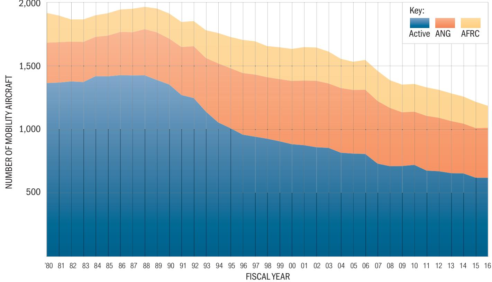  
MOBILITY AIRCRAFT OVER TIME   
Source for historical data (1980-2000): “Arsenal of Airpower: USAF Aircraft Inventory, 1950-2009,” Mitchell Institute Press, November 2010.

<table><tr><td rowspan=1 colspan=1>TOTAL FORCE TAI AVERAGE AGE</td></tr><tr><td rowspan=1 colspan=1>Bomber</td></tr><tr><td rowspan=1 colspan=1>B-1B Lancer                                62           29.1</td></tr><tr><td rowspan=1 colspan=1>B-2A Spirit                                 20          22.2</td></tr><tr><td rowspan=1 colspan=1>B-52H Stratofortress                        76          54.8</td></tr><tr><td rowspan=1 colspan=1>Total                                     158          40.6</td></tr></table>

<table><tr><td colspan="2">Fighter/Attack</td></tr><tr><td>A-10C Thunderbolt II</td><td>283 35.4</td></tr><tr><td>F-15C Eagle</td><td>212 32.4</td></tr><tr><td>F-15D Eagle</td><td>24 32.0</td></tr><tr><td>F-15E Strike Eagle</td><td>220 24.4</td></tr><tr><td>F-16C Fighting Falcon</td><td>793 25.7</td></tr><tr><td>F-16D Fighting Falcon</td><td>156 26.4</td></tr><tr><td>F-22A Raptor</td><td>186 9.0</td></tr><tr><td>F-35A Lightning II</td><td>96 2.2</td></tr><tr><td>Total</td><td>1,970 25.1</td></tr></table>

<table><tr><td colspan="2">Special Operations Forces</td></tr><tr><td>AC-130J Ghostrider</td><td>3 2.0</td></tr><tr><td>AC-130U Spooky 16</td><td>25.7</td></tr><tr><td>AC-130W Stinger Il</td><td>12 27.3</td></tr><tr><td>CV-22B Osprey</td><td>49 4.7</td></tr><tr><td>MC-130H Combat Talon II</td><td>17 28.2</td></tr><tr><td>MC-130J Commando II</td><td>35 2.7</td></tr><tr><td>MC-130P Combat Shadow</td><td>4 49.9</td></tr><tr><td>Total</td><td>136 12.9</td></tr></table>

<table><tr><td colspan="3">ISR/BM/C3</td></tr><tr><td>E-3B Sentry (AWACS)</td><td>16</td><td>38.5</td></tr><tr><td>E-3C Sentry (AWACS)</td><td>4</td><td>33.9</td></tr><tr><td>E-3G Sentry (AWACS)</td><td>11</td><td>35.9</td></tr><tr><td>E-4B NAOC</td><td>4</td><td>42.4</td></tr><tr><td>TE-8A JSTARS</td><td>1</td><td>25.7</td></tr><tr><td>E-8C JSTARS</td><td>16</td><td>15.8</td></tr><tr><td>E-9A Widget</td><td>2</td><td>24.0</td></tr><tr><td>E-11A BACN</td><td>4</td><td>4.7</td></tr><tr><td>EC-130H Compass Call</td><td>14</td><td>43.3</td></tr><tr><td>EC-130J Commando Solo</td><td>7</td><td>16.3</td></tr><tr><td>MC-12W Liberty</td><td>4</td><td>14.1</td></tr><tr><td>MQ-1B Predator</td><td>129</td><td>9.3</td></tr><tr><td>MQ-9A Reaper</td><td>195</td><td>4.3</td></tr><tr><td>NC-135W (test bed)</td><td>1</td><td>54.5</td></tr><tr><td>OC-135B Open Skies</td><td>2</td><td>54.4</td></tr><tr><td>RC-26B Condor</td><td>11</td><td>22.4</td></tr><tr><td>RC-135S Cobra Ball</td><td>3</td><td>54.5</td></tr><tr><td>RC-135U Combat Sent</td><td>2</td><td>51.7</td></tr><tr><td>RC-135V Rivet Joint</td><td>8</td><td>51.9</td></tr><tr><td>RC-135W Rivet Joint</td><td>12</td><td>53.7</td></tr><tr><td>RQ-4B Global Hawk</td><td>33</td><td>5.6</td></tr><tr><td>TC-135W (trainer)</td><td>3</td><td>54.3</td></tr><tr><td>TU-2S (trainer)</td><td>5</td><td>32.4</td></tr><tr><td>U-2S Dragon Lady</td><td>27</td><td>33.7</td></tr><tr><td>WC-130H Hercules</td><td>7</td><td>50.7</td></tr><tr><td>WC-130J Hercules</td><td>10</td><td>15.5</td></tr><tr><td>WC-135C Constant Phoenix</td><td>1</td><td>52.3</td></tr><tr><td>WC-135W Constant Phoenix</td><td>1</td><td>54.4</td></tr><tr><td>Total</td><td>533</td><td>15.5</td></tr></table>

Average age for category totals and grand total are weighted by quantity of aircraft.

<table><tr><td>TOTAL FORCE TAI AVERAGE AGE</td></tr><tr><td>Tanker</td></tr><tr><td>HC-130J Combat King II 19</td></tr><tr><td>2.9 HC-130N King 8 28.6</td></tr><tr><td>HC-130P King 5 50.6</td></tr><tr><td>KC-10A Extender 59 31.7</td></tr><tr><td>KC-135R Stratotanker 344 54.9</td></tr><tr><td>KC-135T Stratotanker 54 56.6</td></tr><tr><td>Total 489 49.8</td></tr></table>

<table><tr><td colspan="3">Transport</td></tr><tr><td>C-5A Galaxy</td><td>5</td><td>44.2</td></tr><tr><td>C-5B Galaxy</td><td>4</td><td>28.3</td></tr><tr><td>C-5C Galaxy</td><td>1</td><td>46.2</td></tr><tr><td>C-5M Super Galaxy</td><td>38</td><td>29.8</td></tr><tr><td>C-12C Huron</td><td>16</td><td>40.2</td></tr><tr><td>C-12D Huron</td><td>6</td><td>32.4</td></tr><tr><td>C-12F Huron</td><td>3</td><td>31.6</td></tr><tr><td>C-12J Huron</td><td>4</td><td>28.7</td></tr><tr><td>C-17A Globemaster I&quot;I</td><td>222</td><td>13.0</td></tr><tr><td>C-20B Gulfstream</td><td>3</td><td>29.2</td></tr><tr><td>C-20H Gulfstream</td><td>2</td><td>21.6</td></tr><tr><td>C-21A Learjet</td><td>27</td><td>31.4</td></tr><tr><td>C-32A Air Force Two</td><td>4</td><td>18.0</td></tr><tr><td>C-32B Air Force Two</td><td>2</td><td>13.3</td></tr><tr><td>C-37A Gulfstream V</td><td>9</td><td>15.7</td></tr><tr><td>C-37B Gulfstream V</td><td>3</td><td>6.7</td></tr><tr><td>C-40B Clipper</td><td>4</td><td>12.7</td></tr><tr><td>C-40C Clipper</td><td>7</td><td>10.4</td></tr><tr><td>C-130H Hercules</td><td>218</td><td>27.6</td></tr><tr><td>C-130J Hercules</td><td>107</td><td>8.1</td></tr><tr><td></td><td></td><td>31.1</td></tr><tr><td>LC-130H Hercules VC-25A Air Force One</td><td>10</td><td>26.0</td></tr><tr><td>Total</td><td>2 697</td><td>20.2</td></tr></table>

<table><tr><td colspan="3">Helicopter</td></tr><tr><td>HH-60G Pave Hawk</td><td>98</td><td>26.0</td></tr><tr><td>HH-60U Pave Hawk</td><td>3</td><td>5.4</td></tr><tr><td>TH-1H Iroquois</td><td>28</td><td>35.5</td></tr><tr><td>UH-1N Iroquois</td><td>63</td><td>43.7</td></tr><tr><td>Total</td><td>192</td><td>32.9</td></tr></table>

<table><tr><td colspan="2">Trainer</td></tr><tr><td>T-1A Jayhawk</td><td>178 21.9</td></tr><tr><td>T-6A Texan II</td><td>444 11.0</td></tr><tr><td>T-38A Talon</td><td>53 49.9</td></tr><tr><td>(A)T-38B Talon</td><td>6 53.1</td></tr><tr><td>T-38C Talon</td><td>445 49.2</td></tr><tr><td>T-41D Mescalero</td><td>4 47.1</td></tr><tr><td>T-51A</td><td>3 11.2</td></tr><tr><td>T-53A</td><td>24 4.7</td></tr><tr><td>UV-18B Twin Otter</td><td>3 32.5</td></tr><tr><td>Gliders</td><td>34 71.8</td></tr><tr><td>Total</td><td>1,194 30.6</td></tr><tr><td>GRAND TOTAL</td><td>5,369 27</td></tr></table>

Estimate

TACTICAL AIRCRAFT FLYING HOURS PER CREW PER MONTH (As of Sept. 30, 2016)   

<table><tr><td></td><td>FY07</td><td>FY08</td><td>FY09</td><td>FY10</td><td>FY11</td><td>FY12</td><td>FY13</td><td>FY14</td><td>FY15</td><td>FY16</td></tr><tr><td>Active Duty</td><td>15.9</td><td>14.4</td><td>17.0</td><td>19.4</td><td>17.7</td><td>13.5</td><td>14.8</td><td>13.2</td><td>13.2</td><td>12.9</td></tr><tr><td>ANG</td><td>10.0</td><td>9.0</td><td>9.0</td><td>8.5</td><td>7.8</td><td>7.1</td><td>9.6</td><td>9.3</td><td>10.9</td><td>9.6</td></tr><tr><td>AFRC</td><td>12.5</td><td>14.4</td><td>14.1</td><td>14.9</td><td>16.5</td><td>15.8</td><td>12.3</td><td>12.0</td><td>12.6</td><td>15.8</td></tr></table>

OPERATIONAL TRAINING RATES  

<table><tr><td></td><td>1990</td><td>2000</td><td>FY10</td><td>FY15</td><td>FY16</td><td>FY17</td></tr><tr><td>Air Force</td><td></td><td></td><td></td><td></td><td></td><td></td></tr><tr><td>Flying hours per crew per month, fighter/attack aircraft</td><td>19.5</td><td>17.2</td><td>19.4</td><td>13.2</td><td>12.9</td><td>14.1</td></tr></table>

# Army

# USAF Aircraft Tail Codes

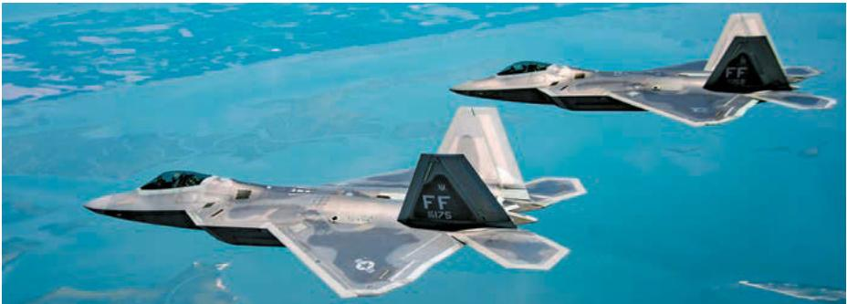

# F-22s displaying the FF tail code from JB Langley-Eustis, Va.

AC 177th FW (ANG), Atlantic City Arpt., N.J.   
AF USAF Academy, Colo.   
AK 3rd Wing (PACAF), JB Elmendorf-Richardson, Alaska 354th FW (PACAF), Eielson AFB, Alaska 176th Wing (ANG), JB Elmendorf-Richardson, Alaska   
AL 187th FW (ANG), Montgomery Regional Arpt., Ala.   
AP 12th FTW (AETC), NAS Pensacola, Fla.   
AV 31st FW (USAFE), Aviano AB, Italy   
AZ 162nd Wing (ANG), Tucson Arpt., Ariz.   
BB 9th RW (ACC), Beale AFB, Calif. Det. 2, 53rd Wing (ACC), Beale AFB, Calif.   
BD 307th BW (AFRC), Barksdale AFB, La.   
CA 129th RQW (ANG), Moffett Field, Calif. 144th FW (ANG), Fresno Yosemite Arpt., Calif. 163rd ATKW (ANG), March ARB, Calif.   
CB 14th FTW (AETC), Columbus AFB, Miss.   
CH 432nd Wing (ACC), Creech AFB, Nev.   
CO 140th Wing (ANG), Buckley AFB, Colo.   
CT 103rd AW (ANG), Bradley Arpt., Conn.   
D 100th ARW (USAFE), RAF Mildenhall, UK   
DC 113th Wing (ANG), JB Andrews, Md.   
DM 355th FW (ACC), Davis-Monthan AFB, Ariz.   
DR 943rd RQG (AFRC), Davis-Monthan AFB, Ariz.   
DY 7th BW (AFGSC), Dyess AFB, Texas   
ED 412th TW (AFMC), Edwards AFB, Calif.   
EG 33rd FW (AETC), Eglin AFB, Fla.   
EL 28th BW (AFGSC), Ellsworth AFB, S.D.   
EN 80th FTW (AETC), Sheppard AFB, Texas   
ET 96th TW (AFMC), Eglin AFB, Fla.   
FC 336th TRG (AETC), Fairchild AFB, Wash.   
FE 90th MW (AFGSC), F. E. Warren AFB, Wyo.   
FF 1st FW (ACC), JB Langley-Eustis, Va. 192nd FW (ANG), JB Langley-Eustis, Va.   
FL 920th RQW (AFRC), Patrick AFB, Fla.   
FM 482nd FW (AFRC), Homestead ARB, Fla.   
FS 188th Wing (ANG), Fort Smith Arpt., Ark.   
FT 23rd Wing (ACC), Moody AFB, Ga.   
GA 116th ACW (ANG), Robins AFB, Ga. 165th AW (ANG), Savannah Hilton Head Arpt., Ga.   
HD Det. 1, 53rd Wing (ACC), Holloman AFB, N.M.   
HH 15th Wing (PACAF), JB Pearl Harbor-Hickam, Hawaii 154th Wing (ANG), JB Pearl Harbor-Hickam, Hawaii   
HL 388th FW (ACC), Hill AFB, Utah 419th FW (AFRC), Hill AFB, Utah   
HO 49th Wing (ACC), Holloman AFB, N.M.   
IA 132nd Wing (ANG), Des Moines Arpt., Iowa   
ID 124th FW (ANG), Boise Air Terminal, Idaho   
IN 122nd FW (ANG), Fort Wayne, Ind.   
JZ 159th FW (ANG), NAS JRB New Orleans   
KC 442nd FW (AFRC), Whiteman AFB, Mo.   
LA 2nd BW (AFGSC), Barksdale AFB, La.   
LF 56th FW (AETC), Luke AFB, Ariz.   
LI 106th RQW (ANG), F. S. Gabreski Arpt., N.Y.   
LN 48th FW (USAFE), RAF Lakenheath, UK   
MA 104th FW (ANG), Barnes Arpt., Mass.   
MD 175th Wing (ANG), Martin State Arpt., Md.   
MI 127th Wing (ANG), Selfridge ANGB, Mich.   
MM 341st MW (AFGSC), Malmstrom AFB, Mont.   
MN 133rd AW (ANG), Minn.-St. Paul Arpt./ARS, Minn. 148th FW (ANG), Duluth Arpt., Minn.   
MO 366th FW (ACC), Mountain Home AFB, Idaho   
MT 5th BW (AFGSC), Minot AFB, N.D. 91st MW (AFGSC), Minot AFB, N.D.   
NY 174th ATKW (ANG), Hancock Fld., N.Y.   
OF 55th Wing (ACC), Offutt AFB, Neb.   
OH 179th AW (ANG), Mansfield Lahm Arpt., Ohio 180th FW (ANG), Toledo Express Arpt., Ohio   
OK 137th ARW (ANG), Will Rogers World Arpt., Okla. 138th FW (ANG), Tulsa Arpt., Okla. 552nd ACW (ACC), Tinker AFB, Okla.   
OS 51st FW (PACAF), Osan AB, South Korea   
OT 31st TES (ACC), Edwards AFB, Calif. 49th TES (ACC), Barksdale AFB, La. 53rd Wing (ACC), Eglin AFB, Fla. 88th TES (ACC), Nellis AFB, Nev. 337th TES (ACC), Dyess AFB, Texas 422nd TES (ACC), Nellis AFB, Nev. 556th TES (ACC), Creech AFB, Nev. Det. 4, 53rd Wing (ACC), Creech AFB, Nev.   
RA 12th FTW (AETC), JBSA-Randolph AFB, Texas   
RS 86th AW (USAFE), Ramstein AB, Germany   
SA 149th FW (ANG), JBSA-Lackland AFB, Texas   
SC 169th FW (ANG), McEntire JNGB, S.C.   
SD 114th FW (ANG), Joe Foss Fld., S.D.   
SJ 4th FW (ACC), Seymour Johnson AFB, N.C.   
SP 52nd FW (USAFE), Spangdahlem AB, Germany   
SW 20th FW (ACC), Shaw AFB, S.C.   
TD 53rd WEG (ACC), Tyndall AFB, Fla.   
TX 147th RW (ANG), Ellington Fld., Texas 301st FW (AFRC), NAS JRB Fort Worth, Texas   
TY 325th FW (ACC), Tyndall AFB, Fla.   
VN 71st FTW (AETC), Vance AFB, Okla.   
WA 57th Wing (ACC), Nellis AFB, Nev.   
WI 115th FW (ANG), Truax Fld., Wis.   
WM 72nd TES (ACC), Whiteman AFB, Mo. 509th BW (AFGSC), Whiteman AFB, Mo.   
WP 8th FW (PACAF), Kunsan AB, South Korea   
WV 130th AW (ANG), Yeager Arpt., W.Va.   
WW35th FW (PACAF), Misawa AB, Japan   
XL 47th FTW (AETC), Laughlin AFB, Texas   
YJ 374th AW (PACAF), Yokota AB, Japan   
ZZ 18th Wing (PACAF), Kadena AB, Japan

As an Air Force Association member, you and your family are eligible for exclusive American Hearing Benefits""

Discounts on today's latest technology, including hearing aids and tinnitus options

FREE annual hearing consultations Access to a nationwide network of $^ { 3 , 0 0 0 + }$ hearing professionals FREE one-year supply of batteries (40 cells per hearing aid purchased) One year of free office visits (limit of six) 60-day trial period" FREE Deluxe Warranty Plan, including loss and damage" $\$ 5$ Financing plans available (subject to credit approval)

Call (888) 809-7786 to schedule your FREE consuLtATion and receive your discounts.

www.americanhearingbenefits.com/partners/AFA

# Did you know:

of combat soldiers have moderately severe hearing loss or worse.

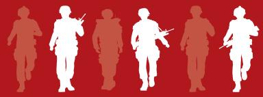

# MASA

# Medical TM Transport Solutions

# Are You Prepared?

# Emergencies can happen to anyone, anytime, and anywhere! No matter what, MASA MTS has you covered!

We provide medical emergency transportation solutions AND cover your out of pocket medical transport cost when your insurance falls short.

“All I had to do was send the bill which was never paid by Medicare and TriCare for Life --- and the rest is history. When MASA received that bill, it was paid and all amounts owed satisfied.”

--- MASA Member, 2015

# 35% OFF for AFA MEMBERS

Call 1-800-423-3226 today!

To find out how MASA MTS can become an employee benefit please contact Will Winters today by phone at (575) 513-9377 or email at wwinters@masamts.com.

# USAF Grades and Insignia

# Offi cer

# Enlisted

Second Lieutenant (O-1)

Brigadier General (O-7)

Airman Basic   
(E-1)   
No insignia

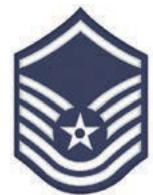

# Master Sergeant (E-7)

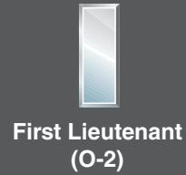

Major General (O-8)

Airman (E-2)

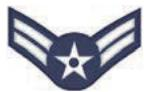

Airman First Class (E-3)

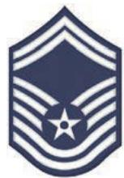

Senior Master Sergeant (E-8)

Captain (O-3)

Lieutenant General (O-9)

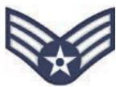

Senior Airman (E-4)

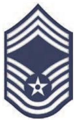

Major (O-4)

General (O-10)

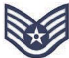

Staff Sergeant (E-5)

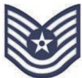

Chief Master Sergeant (E-9)

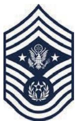

Lieutenant Colonel (O-5)

Technical Sergeant (E-6)

Chief Master Sergeant of the Air Force

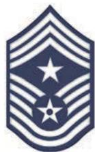

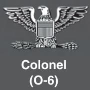

# First Sergeant

The diamond device, shown here   
on senior master sergeant stripes,   
denotes an E-7 through E-9 who   
advises and assists a squadron commander in managing unit activities.

Command Chief Master Sergeant The star device shown here denotes an E-9 who serves in a 9E000 position as a command’s senior enlisted advisor.

# Awards and Decorations

Shown in order of precedence.

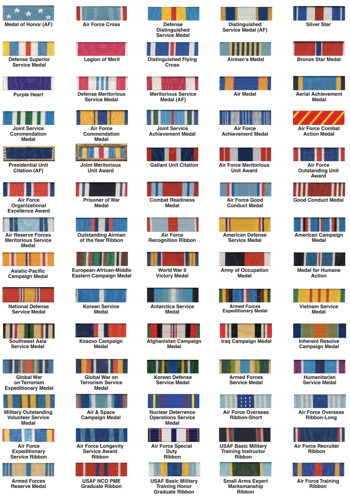

# Awards and Decorations, Continued

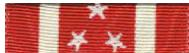

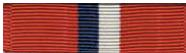

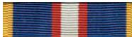

# Philippine Defense Ribbon

Philippine Liberation Ribbon

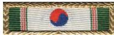  
ROK Presidential Unit Citation

# Philippine Independence Ribbon

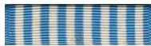

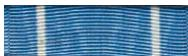

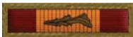  
RVN Gallantry Cross with Palm

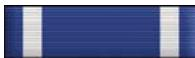

United Nations Service Medal

United Nations Medal

NATO Meritorious Service Medal

NATO Medal for Yugoslavia

# NATO Medal for Kosovo

Article 5 NATO MedalEagle Assist

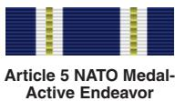

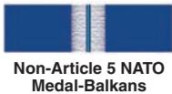

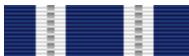

Non-Article 5 NATO Medal-ISAF

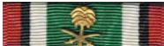

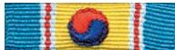

Republic of Vietnam Campaign Medal

# Devices

Kuwait Liberation   
Medal,   
Kingdom of Saudi   
Arabia

Kuwait Liberation Medal, Government of Kuwait

Republic of Korea Korean War Service Medal

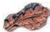

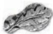

# Bronze Star

# Silver Star

# Silver and Bronze Stars

# Bronze Oak Leaf Cluster

# Silver Oak Leaf Cluster

For number of campaigns or operations, multiple qualifi cations, or an additional award of an authorized ribbon.

One silver star is worn in lieu of fi ve bronze service stars.

When worn together on a single ribbon, silver stars are worn to wearer’s right of a bronze star.

For second and subsequent awards.

For sixth, 11th, etc., entitlements or in lieu of fi ve bronze OLCs.

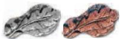

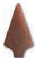

# Silver and Bronze OLCs

Silver OLCs are worn to the wearer’s right of the bronze OLCs on the same ribbon.

# Valor Device

For valor; not an additional award; only one per ribbon; worn to the wearer’s right of OLCs on the same ribbon.

# Arrowhead Device

Shows participation in assigned tactical combat parachute, glider, or amphibious assault landing; worn on campaign medals, Korean Service Medal, and Armed Forces and GWOT Expeditionary medals.

# Combat Device

For meritorious service under combat conditions.

# Remote Device

For remote contribution to a combat operation.

# Hourglass Device

Issued for the Armed Forces Reserve Medal in bronze for 10 years of service, silver for 20, and gold for 30.

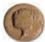

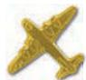

# Arctic Device

# Mobility Device

# Nuclear Device

# Wintered Over Device

# Plane Device

Worn on Air Force Overseas   
Ribbon-Short for service   
north of Arctic Circle; one   
per ribbon; worn to the   
wearer’s right of OLCs.

Worn with the Armed Forces Reserve Medal to denote Active Duty status for at least one day during a contingency; here with number of mobilizations.

Worn on the Nuclear Deterrence Operations Service Medal to indicate direct support.

Worn on Antarctica   
Service Medal to denote   
staying on the Antarctic   
continent over the winter— bronze for one; gold, two; silver, three.   
Worn on Army of   
Occupation Medal for 90   
consecutive days in direct   
support of the Berlin Airlift,   
June 26, 1948, to   
Sept. 30, 1949.

# USAF Specialty Berets

Airmen in seven USAF specialties are authorized to wear a colored beret along with the insignia of that particular fi eld.

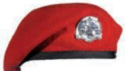  
Combat Controller/ Special Tactics Offi cer

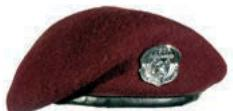  
Pararescue/Combat Rescue Offi cer

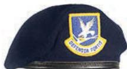  
Security Forces

Survival, Evasion, Resistance, and Escape

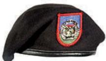

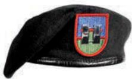

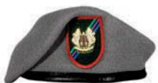

Tactical Air Command and Control (Tactical Air Control Party crest)

Air Liaison Offi cer (TACP fl ash and rank)

Weather Parachutist

# Major Commands and Reserve Components

2017 USAF Almanac

# Organization

The Air Force has 10 major commands and two Air Reserve Components. (Air Force Reserve Command is both a majcom and an ARC.)

■ MAJOR COMMANDS As signifi cant subdivisions of the Air Force, majcoms conduct a considerable part of the service’s mission and are directly subordinate to Headquarters, USAF.

Major commands are organized on a functional basis in the US and on a geographic basis overseas. In addition to accomplishing designated portions of USAF’s worldwide activities, they organize, administer, equip, and train their subordinate elements.

Majcoms, in general, include the following organizational levels: numbered air force (NAF), wing, group, squadron, and fl ight. The majcom sits at the top of a skip-eche

# Ten Major Commands

Air Combat Command   
Air Education and Training Command   
Air Force Global Strike Command   
Air Force Materiel Command   
Air Force Reserve Command   
Air Force Space Command   
Air Force Special Operations Command   
Air Mobility Command   
Pacifi c Air Forces   
US Air Forces in Europe

# Two Air Reserve Commands

Air Force Reserve Command Air National Guard

lon staffi ng s t r u c t u r e , which means every other organizational level (i.e., majcom, wing, and squadron) will have a f range of staff fun

The other organizations (NAF, group, and flight) are tactical, mission-centered echelons. These tactical echelons are designed to increase operational effectiveness without the burden of additional support staff functions.

There are two basic organizational schemes for Air Force major commands: unit-oriented organizations and major nonunit organizations. The standard unitoriented scheme comprises majcom, NAF, wing, group, squadron, and flight levels. Alternatively, a majcom may oversee a center, directorate, division, branch, and section levels, or a combination thereof.

USAF has two types of major commands: lead majcom and component majcom (C-majcom). Some major commands are both lead majcoms and C-majcoms.

■ COMPONENT MAJCOM A C-majcom is the USAF component to a unifi ed combatant command. The commander of a C-majcom

is the commander of air force forces (COM - AFFOR) and may function as a theater joint force air and space component commander (JFACC) hen required. A C-majcom e or more component NAFs (C-NAFs) through which it presents its (C-NAFs) forces to the combatant commander.forces

■ NUMBERED AIR FORCE A numbered air force, that level of command directly below a major command, provides operational leadership and supervision to its subordinate units: wings, groups, and squadrons. A C-NAF supports the commander of air forces at the operational and tactical level. USAF has designated some C-NAFs, rather than a majcom, as the Air Force component to a unified combatant command. In that role, the C-NAF functions at the strategic level as well as the operational and tactical levels and has a broader staff. (On the following pages, NAFs with “Air Forces” designations, such as Air Forces Southern, are C-NAFs.)

# ACC

# Air Combat Command

Headquarters: JB Langley-Eustis, Va. Date of current designation: June 1, 1992 Commander: Gen. James M. “Mike” Holmes

# Primary Mission

Primary force provider of combat airpower—fighter, conventional bomber, reconnaissance, battle management, and electronic combat aircraft—to combatant commands. Provide command, control, communications, and intelligence (C3I) systems. Conduct global information operations.

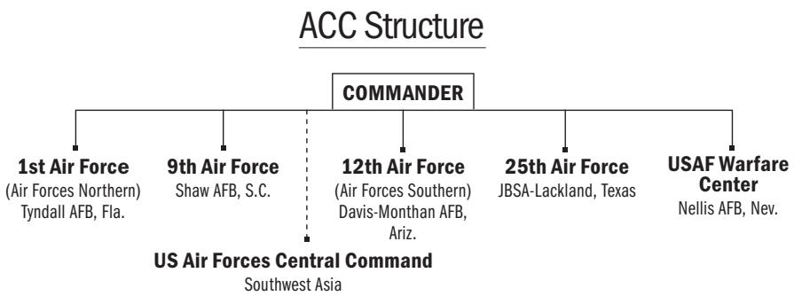

<table><tr><td colspan="3">PERSONNEL</td></tr><tr><td>Active Duty</td><td>Civilian</td><td>Total</td></tr><tr><td>74,240</td><td>10,610</td><td>84,850</td></tr></table>

<table><tr><td rowspan=1 colspan=1>EQUIPMENT (TAI)</td></tr><tr><td rowspan=1 colspan=1>Fighter/Attack                     646</td></tr><tr><td rowspan=1 colspan=1>Helicopter                          40</td></tr><tr><td rowspan=1 colspan=1>ISR/BM/C3                       363</td></tr><tr><td rowspan=1 colspan=1>Tanker                             16</td></tr><tr><td rowspan=1 colspan=1>Trainer                             45</td></tr></table>

<table><tr><td>WINGS/CENTERS</td><td>LOCATION</td><td>AIRCRAFT/MISSION/WEAPON</td></tr><tr><td>1st Fighter Wing (FW)</td><td>JB Langley-Eustis, Va.</td><td>F-22, T-38A</td></tr><tr><td>4th FW</td><td>Seymour Johnson AFB, N.C.</td><td>F-15E</td></tr><tr><td>9th Reconnaissance Wing</td><td>Beale AFB, Calif.</td><td>RQ-4, T-38A, U-2</td></tr><tr><td>20th FW</td><td>Shaw AFB, S.C.</td><td>F-16CM</td></tr><tr><td>23rd Wing</td><td>Moody AFB, Ga.</td><td>A-10C, HC-130J, HH-60G</td></tr><tr><td>49th Wing</td><td>Holloman AFB, N.M.</td><td>MQ-9, QF-16</td></tr><tr><td>53rd Wing</td><td>Eglin AFB, Fla.</td><td>A-10C, B-1B, B-52H, E-9A, F-15C/D/E, F-16C/D, F-22A, F-35A, HC-130J,</td></tr><tr><td>55th Wing</td><td>Offutt AFB, Neb.</td><td>HH-60G, MQ-1, MQ-9, QF-16, RQ-4 EC-130H, OC-135B, RC-135S/U/V/W, TC-135S/W, WC-135</td></tr><tr><td>57th Wing</td><td>Nellis AFB, Nev.</td><td>A-10C, EC-130, F-15, F-15E, F-16, F-22A, F-35A, HH-60G (23rd Wing), MQ-9</td></tr><tr><td>70th Intelligence, Surveillance, and Reconnaissance Wing (ISRW)</td><td>Fort Meade, Md.</td><td>Cryptologic operations</td></tr><tr><td>93rd Air Ground Operations Wing</td><td>Moody AFB, Ga.</td><td>Battlefield airmen operations, support</td></tr><tr><td>99th Air Base Wing (ABW)</td><td>Nellis AFB, Nev.</td><td>Base support</td></tr><tr><td>325th FW</td><td>Tyndall AFB, Fla.</td><td>F-22A</td></tr><tr><td>355th FW</td><td>Davis-Monthan AFB, Ariz.</td><td>A-10C, EC-130H (55th Wing), F-16CG, HC-130J, HH-60G (23rd Wing)</td></tr><tr><td>363rd ISRW</td><td>JB Langley-Eustis, Va.</td><td>Multi-intelligence analysis, targeting</td></tr><tr><td>366th FW</td><td>Mountain Home AFB, Idaho</td><td>F-15E</td></tr><tr><td>388th FW</td><td>Hill AFB, Utah</td><td>F-16C/D, F-35A</td></tr><tr><td>432nd Wing</td><td>Creech AFB, Nev.</td><td>MQ-1, MQ-9, RQ-170</td></tr><tr><td>480th ISRW</td><td>JB Langley-Eustis, Va.</td><td>DCGS, cyber ISR, CFACC support, Signals intelligence integration</td></tr><tr><td>461st Air Control Wing (ACW) 505th Command and Control Wing</td><td>Robins AFB, Ga.</td><td>E-8C (AA)</td></tr><tr><td>552nd ACW</td><td>Hurlburt Field, Fla.</td><td>Command and control operational-level tactics, testing, training</td></tr><tr><td>557th Weather Wing</td><td>Tinker AFB, Okla.</td><td>E-3B/C/G</td></tr><tr><td></td><td>Offutt AFB, Neb.</td><td>Weather information</td></tr><tr><td>601st Air &amp; Space Operations Center</td><td>Tyndall AFB, Fla.</td><td>Plan and direct air operations</td></tr><tr><td>633rd ABW</td><td>JB Langley-Eustis, Va.</td><td>Joint base facilities support</td></tr><tr><td>Air Force Rescue Coordination Center</td><td>Tyndall AFB, Fla.</td><td>National search and rescue coordination</td></tr><tr><td>Air Force Technical Applications Center</td><td>Patrick AFB, Fla.</td><td>Nuclear treaty monitoring, nuclear event detection</td></tr></table>

# AETC

# Air Education and Training Command

Headquarters: JBSA-Randolph, Texas Date of current designation: July 1, 1993 Commander: Lt. Gen. Darryl Roberson

# Primary Mission

Recruit, train, and educate airmen through basic military training, initial and advanced technical training, and professional military education.

# AETC Structure

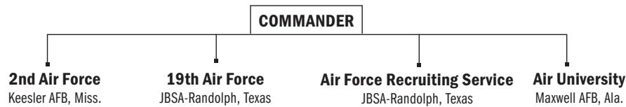

<table><tr><td colspan="3">PERSONNEL</td></tr><tr><td>Active Duty</td><td>Civilian</td><td>Total</td></tr><tr><td>55,577</td><td>14,412</td><td>69,989</td></tr></table>

<table><tr><td colspan="2">EQUIPMENT (TAI)</td></tr><tr><td>Fighter/Attack</td><td>168</td></tr><tr><td>Helicopter</td><td>50</td></tr><tr><td>Special Operations Forces</td><td>13</td></tr><tr><td>Tanker</td><td>23</td></tr><tr><td>Trainer</td><td>1,112</td></tr><tr><td>Transport</td><td>29</td></tr></table>

<table><tr><td>MAJOR UNITS</td><td>LOCATION</td><td>AIRCRAFT/MISSION/WEAPON</td></tr><tr><td>12th Flying Training Wing (FTW)</td><td>JBSA-Randolph, Texas</td><td>T-1A, T-6A, T-38C (CS0 at NAS Pensacola, Fla.)</td></tr><tr><td>14th FTW</td><td>Columbus AFB, Miss.</td><td>T-1A, T-6A, T-38C (A-29 at Moody AFB, Ga.)</td></tr><tr><td>17th Training Wing (TRW)</td><td>Goodfellow AFB, Texas</td><td>Technical training</td></tr><tr><td>33rd Fighter Wing (FW)</td><td>Eglin AFB, Fla.</td><td>F-35</td></tr><tr><td>37th TRW</td><td>JBSA-Lackland, Texas</td><td>Basic military and technical training</td></tr><tr><td>42nd Air Base Wing (ABW)</td><td>Maxwell AFB, Ala.</td><td>Base support</td></tr><tr><td>47th FTW</td><td>Laughlin AFB, Texas</td><td>T-1A, T-6A, T-38C</td></tr><tr><td>56th FW</td><td>Luke AFB, Ariz.</td><td>F-16, F-35</td></tr><tr><td>58th Special Operations Wing</td><td>Kirtland AFB, N.M.</td><td>CV-22, HC-130J/P/N, HH-60G, MC-130H/J/P, UH-1N, TH-1H</td></tr><tr><td>59th Medical Wing</td><td>JBSA-Lackland, Texas</td><td>Wilford Hall Ambulatory Surgical Center</td></tr><tr><td>71st FTW</td><td>Vance AFB, Okla.</td><td>T-1A, T-6A, T-38C</td></tr><tr><td>80th FTW</td><td>Sheppard AFB, Texas</td><td>T-6A, T-38C</td></tr><tr><td>81st TRW</td><td>Keesler AFB, Miss.</td><td>Technical training</td></tr><tr><td>82nd TRW</td><td>Sheppard AFB, Texas</td><td>Technical training</td></tr><tr><td>97th Air Mobility Wing</td><td>Altus AFB, Okla.</td><td>C-17, KC-135R</td></tr><tr><td>314th Airlift Wing</td><td>Little Rock AFB, Ark.</td><td>C-130J</td></tr><tr><td>502nd ABW</td><td>JBSA-Fort Sam Houston, Texas</td><td>S JBSA facilities support</td></tr><tr><td>Air Force Institute of Technology</td><td>Wright-Patterson AFB, Ohio</td><td>Postgraduate education</td></tr><tr><td>Air Force Research Institute</td><td>Maxwell AFB, Ala.</td><td>Historical research</td></tr><tr><td>Carl A. Spaatz Center for Officer Education</td><td>Maxwell AFB, Ala.</td><td>Officer professional military education (PME)</td></tr><tr><td>Curtis E. LeMay Center for Doctrine Dev. &amp; Education Ira C. Eaker Center for Professional Dev.</td><td>Maxwell AFB, Ala.</td><td>Air Force doctrine development</td></tr><tr><td>Jeanne M. Holm Center for Officer Accessions</td><td>Maxwell AFB, Ala.</td><td>Professional and technical continuing education</td></tr><tr><td>and Citizen Development</td><td>Maxwell AFB, Ala.</td><td>Officer training, ROTC and JROTC oversight</td></tr><tr><td>Muir S. Fairchild Research Information Center</td><td>Maxwell AFB, Ala.</td><td>Information resources</td></tr><tr><td>Thomas N. Barnes Center for Enlisted Education</td><td>Maxwell AFB, Ala.</td><td>Enlisted PME</td></tr></table>

# AFGSC

# Air Force Global Strike Command

Headquarters: Barksdale AFB, La. Date of current designation: Aug. 7, 2009 Commander: Gen. Robin Rand

Primary Mission

Organize, train, equip, maintain, and provide ICBM forces and long-range bomber forces to combatant commanders.

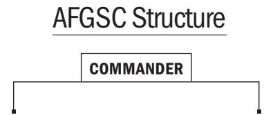

8th Air Force (Air Forces Strategic/Task Force 204) Barksdale AFB, La.

20th Air Force (Air Forces Strategic/Task Force 214) F. E. Warren AFB, Wyo.

<table><tr><td colspan="3">PERSONNEL</td></tr><tr><td>Active Duty</td><td>Civilian</td><td>Total</td></tr><tr><td>26,677</td><td>3,969</td><td>30,646</td></tr></table>

<table><tr><td colspan="2">EQUIPMENT (TAI)</td></tr><tr><td>Bomber</td><td>135</td></tr><tr><td>Helicopter</td><td>25</td></tr><tr><td>ICBM</td><td>406</td></tr><tr><td>ISR/BM/C3</td><td>4</td></tr><tr><td>Trainer</td><td>14</td></tr></table>

<table><tr><td>MAJOR UNITS</td><td>LOCATION</td><td>AIRCRAFT/MISSION/WEAPON</td></tr><tr><td>2nd Bomb Wing (BW)</td><td>Barksdale AFB, La.</td><td>B-52H</td></tr><tr><td>5th BW</td><td>Minot AFB, N.D.</td><td>B-52H</td></tr><tr><td>7th BW</td><td>Dyess AFB, Texas</td><td>B-1</td></tr><tr><td>28th BW</td><td>Ellsworth AFB, S.D.</td><td>B-1</td></tr><tr><td>90th Missile Wing (MW)</td><td>F. E. Warren AFB, Wyo.</td><td>Minuteman I, UH-1N</td></tr><tr><td>91st MW</td><td>Minot AFB, N.D.</td><td>Minuteman I, UH-1N</td></tr><tr><td>341st MW</td><td>Malmstrom AFB, Mont.</td><td>Minuteman I, UH-1N</td></tr><tr><td>377th Air Base Wing</td><td>Kirtland AFB, N.M.</td><td>Nuclear operations, expeditionary force training, base support</td></tr><tr><td>509th BW</td><td>Whiteman AFB, Mo.</td><td>B-2, T-38C</td></tr><tr><td>595th Command and Control Group</td><td>Offutt, Neb.</td><td>Command and control, E-4B</td></tr></table>

<table><tr><td>AA</td><td>active associate:</td><td>CRG</td><td>contingency response group</td><td>GA</td><td>Guardian Angel (pararescuemen, combat</td><td>MAFFS</td><td>Modular Airborne</td></tr><tr><td>AATTC</td><td>ANG/AFRC own aircraft Advanced Airlift Tactics</td><td>CRTC</td><td>Combat Readiness Training Center</td><td></td><td>rescue officers, and survival,</td><td>MGS</td><td>Firefighting System mobile ground station (space)</td></tr><tr><td></td><td>Training Center</td><td>CSDC</td><td>Consolidated Storage and</td><td></td><td>evasion, resistance, and</td><td>NAS</td><td>Naval Air Station</td></tr><tr><td>AEHF</td><td>Advanced Extremely High</td><td></td><td>Deployment Center (medical)</td><td></td><td>escape specialists)</td><td>NOSS</td><td>network operations security</td></tr><tr><td></td><td>Frequency</td><td>CSO</td><td>combat systems officer</td><td>GEODSS</td><td>Ground-based Electro-</td><td></td><td>squadron</td></tr><tr><td></td><td>Aoc/G/s air and space operations</td><td>cW</td><td>combat weather</td><td></td><td>Optical Deep Space</td><td>PARCS</td><td>Perimeter Acquisition</td></tr><tr><td></td><td>center/group/squadron</td><td>DCGS</td><td>Distributed Common</td><td></td><td>Surveillance system</td><td></td><td>Radar Attack</td></tr><tr><td>ARB</td><td>Air Reserve Base</td><td></td><td>Ground Station</td><td>GPS</td><td></td><td></td><td></td></tr><tr><td>BM</td><td></td><td>DMSP</td><td>Defense Meteorological</td><td>GSSAP</td><td>Global Positioning System</td><td></td><td>Characterization System</td></tr><tr><td>BMEWS</td><td>battle management</td><td></td><td></td><td></td><td>Geosynchronous Space</td><td>RAOC</td><td>regional air operations center</td></tr><tr><td></td><td>Ballistic Missile Early</td><td></td><td>Satellite Program</td><td></td><td>Situational Awareness</td><td>RCC</td><td>rescue coordination center</td></tr><tr><td></td><td>Warning System</td><td>DSCS</td><td>Defense Satellite</td><td></td><td>Program</td><td>ROTC</td><td>Reserve Officer Training Corps</td></tr><tr><td>C2</td><td>command and control</td><td></td><td>Communications System</td><td>ISR</td><td>intelligence, surveillance,</td><td>SBIRS</td><td>Space Based Infrared System</td></tr><tr><td>C3</td><td>command, control, and</td><td>DSP</td><td>Defense Support Program</td><td></td><td>and reconnaissance</td><td>SBSS</td><td>Space Based Surveillance</td></tr><tr><td>CACS</td><td>communications</td><td>DTOC</td><td>Distributed Training</td><td>JB</td><td>Joint Base</td><td></td><td>System</td></tr><tr><td></td><td>command and control</td><td></td><td>Operations Center</td><td>JBSA</td><td>Joint Base San Antonio</td><td>SoW</td><td>Special Operations Wing</td></tr><tr><td></td><td>squadron (space)</td><td>EOD</td><td>explosive ordnance disposal</td><td>JMS</td><td>Joint Space Operations Center</td><td>SPADOC</td><td>Space Defense Operations</td></tr><tr><td>CC CFACC</td><td>combat communications</td><td>FTU</td><td>formal training unit</td><td>JRB</td><td>(JSpOC) Mission System</td><td></td><td>Center</td></tr><tr><td></td><td>combined force air</td><td></td><td></td><td>JROTC</td><td>Joint Reserve Base</td><td>TACP</td><td>tactical air control party</td></tr><tr><td>CIRF</td><td>component commander</td><td></td><td></td><td></td><td>Junior Reserve Officer Training</td><td>TAI</td><td>total active inventory</td></tr><tr><td>repair facility</td><td>centralized intermediate</td><td></td><td></td><td></td><td>Corps</td><td>WGS</td><td>Wideband Global Satcom</td></tr></table>

# AFMC

# Air Force Materiel Command

Headquarters: Wright-Patterson AFB, Ohio Date of current designation: July 1, 1992 Commander: Gen. Ellen M. Pawlikowski

Primary Mission

Research, develop, procure, test, and sustain USAF weapon systems.

<table><tr><td colspan="3">PERSONNEL</td></tr><tr><td>Active Duty</td><td>Civilian</td><td>Total</td></tr><tr><td>15,475</td><td>61,941</td><td>77,416</td></tr></table>

<table><tr><td rowspan=1 colspan=1>EQUIPMENT (TAI)</td></tr><tr><td rowspan=1 colspan=1>Bomber                              5</td></tr><tr><td rowspan=1 colspan=1>Fighter/Attack                      46</td></tr><tr><td rowspan=1 colspan=1>Helicopter                            5</td></tr><tr><td rowspan=1 colspan=1>ISR/BM/C3                         22</td></tr><tr><td rowspan=1 colspan=1>Tanker                               2</td></tr><tr><td rowspan=1 colspan=1>Trainer                             23</td></tr><tr><td rowspan=1 colspan=1>Transport                           26</td></tr></table>

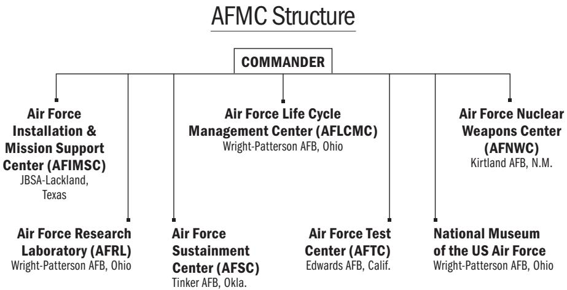

<table><tr><td>MAJOR UNITS</td><td>LOCATION</td><td>AIRCRAFT/MISSION/WEAPON</td></tr><tr><td rowspan="5">Air Force Civil Engineer Center </td><td>JBSA-Lackland, Texas</td><td></td><td>Installation support (civil engineering)</td></tr><tr><td>Air Force Financial Management Center of Expertise</td><td>Buckley AFB, Colo.</td><td>Installation support (financial analysis)</td></tr><tr><td>Air Force Financial Services Center</td><td>Ellsworth AFB, S.D.</td><td>Installation support (payment processing)</td></tr><tr><td>Air Force Security Forces Center</td><td>JBSA-Lackland, Texas</td><td>Installation support (security forces programs)</td></tr><tr><td>Air Force Program Executive Officer-Agile Combat Support AFPEO-Armament</td><td>Wright-Patterson AFB, Ohio</td><td>Systems acquisition</td></tr><tr><td rowspan="8"></td><td></td><td>Eglin AFB, Fla.</td><td>Systems acquisition</td></tr><tr><td>AFPEO-Battle Management</td><td>Hanscom AFB, Mass.</td><td>Systems acquisition</td></tr><tr><td>AFPEO-Business and Enterprise Systems</td><td>Maxwell AFB-Gunter Annex, Ala.</td><td>Systems acquisition</td></tr><tr><td>AFPEO-C3I and Networks</td><td>Hanscom AFB, Mass.</td><td>Systems acquisition</td></tr><tr><td>AFPEO-Fighters and Bombers</td><td>Wright-Patterson AFB, Ohio</td><td>Systems acquisition</td></tr><tr><td>AFPEO-ISR and Special Operations Forces</td><td>Wright-Patterson AFB, Ohio</td><td>Systems acquisition</td></tr><tr><td>AFPEO-Mobility</td><td>Wright-Patterson AFB, Ohio</td><td>Systems acquisition</td></tr><tr><td>AFPEO-Tanker</td><td>Wright-Patterson AFB, Ohio</td><td>Systems acquisition</td></tr><tr><td>88th Air Base Wing (ABW) AFPEO-Nuclear Command, Control,</td><td></td><td>Wright-Patterson AFB, Ohio</td><td>Base support</td></tr><tr><td>and Communications</td><td></td><td>Hanscom AFB, Mass.</td><td>Systems acquisition</td></tr><tr><td>AFPEO-Strategic Systems Aerospace Systems</td><td></td><td>Kirtland AFB, N.M.</td><td>Systems acquisition</td></tr><tr><td rowspan="7">F</td><td></td><td>Wright-Patterson AFB, Ohio</td><td>Research and development (R&amp;D)</td></tr><tr><td>Air Force Office of Scientific Research Air Force Strategic Development Planning and</td><td>Arlington, Va.</td><td>Research</td></tr><tr><td>Experimentation Office</td><td>Wright-Patterson AFB, Ohio</td><td>R&amp;D</td></tr><tr><td>Directed Energy</td><td>Kirtland AFB, N.M.</td><td>R&amp;D</td></tr><tr><td>Information</td><td>Rome, N.Y.</td><td>R&amp;D</td></tr><tr><td>Materials and Manufacturing</td><td>Wright-Patterson AFB, Ohio</td><td>R&amp;D</td></tr><tr><td>Munitions</td><td>Eglin AFB, Fla.</td><td>R&amp;D</td></tr><tr><td rowspan="8">Sensors Space Vehicles</td><td></td><td>Wright-Patterson AFB, Ohio</td><td>R&amp;D</td></tr><tr><td></td><td>Kirtland AFB, N.M.</td><td>R&amp;D</td></tr><tr><td>711th Human Performance Wing</td><td>Wright-Patterson AFB, Ohio</td><td>Human performance evaluation and research</td></tr><tr><td>Ogden Air Logistics Complex (ALC)</td><td>Hill AFB, Utah</td><td>Weapons sustainment</td></tr><tr><td>Oklahoma City ALC</td><td>Tinker AFB, Okla.</td><td>Weapons sustainment</td></tr><tr><td>Warner Robins ALC</td><td>Robins AFB, Ga.</td><td>Weapons sustainment</td></tr><tr><td>72nd ABW</td><td>Tinker AFB, Okla.</td><td>Base support</td></tr><tr><td>75th ABW</td><td>Hill AFB, Utah</td><td>Base and Utah Test and Training Range support</td></tr><tr><td rowspan="6">78th ABW</td><td></td><td></td><td></td></tr><tr><td>448th Supply Chain Management Wing</td><td>Robins AFB, Ga.</td><td>Base support</td></tr><tr><td>635th Supply Chain Operations Wing</td><td>Tinker AFB, Okla. Scott AFB, II..</td><td>Depot line repairables and consumables Global sustainment support</td></tr><tr><td>Arnold Engineering Development Complex</td><td>Arnold AFB, Tenn.</td><td>Flight, space, and missile ground testing</td></tr><tr><td>96th Test Wing (TW)</td><td>Eglin AFB, Fla.</td><td></td></tr><tr><td>412th TW</td><td>Edwards AFB, Calif.</td><td>Aircraft testing and base support Aircraft testing and base support</td></tr></table>

# AFRC

# Air Force Reserve Command

Headquarters: Robins AFB, Ga. Date of current designation: Feb. 17, 1997 Commander: Lt. Gen. Maryanne Miller

# Primary Mission

Provide strike, air mobility, special operations forces, rescue, aeromedical evacuation, aerial firefighting and spraying, weather reconnaissance, cyberspace operations, ISR, space, flying training, and other capabilities to support the Active Duty force and assist with domestic and foreign disaster relief.

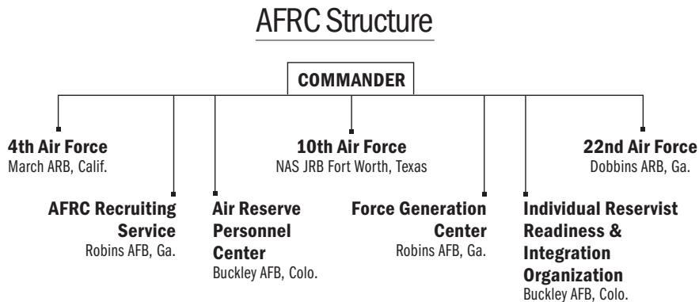

<table><tr><td colspan="4">PERSONNEL</td></tr><tr><td>Total (Selected reserve)</td><td>Active Duty</td><td>Civilian (Includes technicians)</td><td>Total</td></tr><tr><td>69,200</td><td>392</td><td>12,716</td><td>82,308</td></tr></table>

<table><tr><td rowspan=1 colspan=1>EQUIPMENT (TAI)</td></tr><tr><td rowspan=1 colspan=1>Bomber                              18</td></tr><tr><td rowspan=1 colspan=1>Fighter/Attack                       111</td></tr><tr><td rowspan=1 colspan=1>Helicopter                            15</td></tr><tr><td rowspan=1 colspan=1>ISR/BM/C3                          10</td></tr><tr><td rowspan=1 colspan=1>Tanker                               72</td></tr><tr><td rowspan=1 colspan=1>Transport                           101</td></tr></table>

<table><tr><td>WINGS/CENTERS</td><td>LOCATION</td><td>AIRCRAFT/MISSION/WEAPON</td></tr><tr><td>94th Airlift Wing (AW)</td><td>Dobbins ARB, Ga.</td><td>C-130H</td></tr><tr><td>301st Fighter Wing (FW)</td><td>NAS JRB Fort Worth, Texas</td><td>F-16 and F-22, MQ-1, and MQ-9 (Tyndall AFB, Fla.)</td></tr><tr><td>302nd AW</td><td>Peterson AFB, Colo.</td><td>C-130H (including Modular Airborne Firefighting System)</td></tr><tr><td>307th Bomb Wing</td><td>Barksdale AFB, La.</td><td>B-52H</td></tr><tr><td>310th Space Wing</td><td>Schriever AFB, Colo.</td><td>Space control and operations and warning, information operations</td></tr><tr><td>315th AW (classic associate)</td><td>JB Charleston, S.C.</td><td>C-17</td></tr><tr><td>349th Air Mobility Wing (classic associate)</td><td>Travis AFB, Calif.</td><td>C-5, C-17, KC-10</td></tr><tr><td>403rd Wing</td><td>Keesler AFB, Miss.</td><td>C-130J, WC-130J (Hurricane Hunters)</td></tr><tr><td>419th FW (classic associate)</td><td>Hill AFB, Utah</td><td>F-16, F-35A</td></tr><tr><td>433rd AW</td><td>JBSA-Lackland, Texas</td><td>C-5A/B, formal training unit</td></tr><tr><td>434th Air Refueling Wing (ARW)</td><td>Grissom ARB, Ind.</td><td>KC-135R</td></tr><tr><td>439th AW</td><td>Westover ARB, Mass.</td><td>C-5B</td></tr><tr><td>440th AW</td><td>Pope Field, N.C.</td><td>C-130H</td></tr><tr><td>442nd FW</td><td>Whiteman AFB, Mo.</td><td>A-10C</td></tr><tr><td>445th AW</td><td>Wright-Patterson AFB, Ohio</td><td>C-17</td></tr><tr><td>446th AW (classic associate)</td><td>JB Lewis-McChord, Wash.</td><td>C-17</td></tr><tr><td>452nd AMW</td><td>March ARB, Calif.</td><td>C-17, KC-135R</td></tr><tr><td>459th ARW</td><td>JB Andrews, Md.</td><td>KC-135R</td></tr><tr><td>482nd FW 507th ARW</td><td>Homestead ARB, Fla.</td><td>F-16C</td></tr><tr><td>512th AW (classic associate)</td><td>Tinker AFB, Okla.</td><td>KC-135R</td></tr><tr><td>514th AMW (classic associate)</td><td>Dover AFB, Del.</td><td>C-5M, C-17</td></tr><tr><td>908th AW</td><td>JB McGuire-Dix-Lakehurst, N.J.</td><td>C-17, KC-10</td></tr><tr><td>910th AW</td><td>Maxwell AFB, Ala.</td><td>C-130H</td></tr><tr><td>911th AW</td><td>Youngstown ARS, Ohio</td><td>C-130H</td></tr><tr><td>914th AW</td><td>Pittsburgh Arpt., Pa.</td><td>C-130H</td></tr><tr><td>916th ARW</td><td>Niagara Falls Arpt./ARS, N.Y.</td><td>KC-135 (planned)</td></tr><tr><td>919th Special Operations Wing</td><td>Seymour Johnson AFB, N.C.</td><td>KC-135R</td></tr><tr><td>920th Rescue Wing</td><td>Duke Field, Fla.</td><td>AC-130U, C-145A, C-146, MQ-9, PC-12, U-28 (classic associate)</td></tr><tr><td>926th Wing (classic associate)</td><td>Patrick AFB, Fla. Nellis AFB, Nev.</td><td>HC-130N/P, HH-60G</td></tr><tr><td></td><td></td><td>A-10, F-15C, F-15E, F-16, F-22A, F-35A, HH-60G, MQ-1 and MQ-9 (Creech AFB, Nev.)</td></tr><tr><td>927th ARW (classic associate)</td><td>MacDill AFB, Fla.</td><td>KC-135R</td></tr><tr><td>932nd AW 934th AW</td><td>Scott AFB, II..</td><td>C-40C</td></tr><tr><td>940th Wing (classic associate)</td><td>Minneapolis-St. Paul Arpt., Minn. Beale AFB, Calif.</td><td>C-130H</td></tr><tr><td>944th FW (classic associate)</td><td></td><td>AOC, DCGS, RQ-4</td></tr><tr><td></td><td>Luke AFB, Ariz.</td><td>F-15E (Seymour Johnson AFB, N.C.), F-16</td></tr></table>

Classic associate: Active Duty unit owns aircraft.

# AFSPC

# Air Force Space Command

Headquarters: Peterson AFB, Colo. Date of current designation: Sept. 1, 1982 Commander: Gen. John W. “Jay” Raymond

# Primary Mission

Organize, train, equip, maintain, and provide space and cyberspace operations forces. Develop, procure, and test space systems. Sustain national space launch facilities.

<table><tr><td colspan="3">PERSONNEL</td></tr><tr><td>Active Duty</td><td>Civilian</td><td>Total</td></tr><tr><td>13,064</td><td>6,880</td><td>19,944</td></tr></table>

# AFSPC Structure

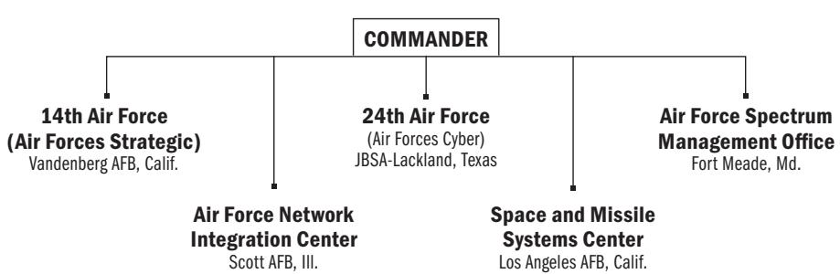

Air Force Satellite Control Network, BMEWS, Cyber Weapon Systems, GEODSS, JMS, Launch/test ranges, Pave Phased Array Warning System, PARCS, SPADOC, Space surveillance radars

Satellite systems (on orbit):   

<table><tr><td>AEHF</td><td>3</td></tr><tr><td>DMSP</td><td>6</td></tr><tr><td>DSCS</td><td>6</td></tr><tr><td>DSP</td><td>Classified</td></tr></table>

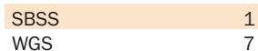

<table><tr><td>GPS</td><td>37</td></tr><tr><td>GSSAP</td><td>4</td></tr><tr><td>Milstar</td><td>5</td></tr><tr><td>SBIRS</td><td>Classified</td></tr></table>

<table><tr><td>WINGS/CENTERS</td><td>LOCATION</td><td>AIRCRAFT/MISSION/WEAPON</td></tr><tr><td>21st Space Wing (SW)</td><td>Peterson AFB, Colo.</td><td>Space control/warning</td></tr><tr><td>30th SW</td><td>Vandenberg AFB, Calif.</td><td>Space launch, ICBM test, aunch range operations</td></tr><tr><td>45th SW</td><td>Patrick AFB, Fla.</td><td>Space launch, launch range operations</td></tr><tr><td>50th SW</td><td>Schriever AFB, Colo.</td><td>C2 space operations</td></tr><tr><td>67th Network Warfare Wing</td><td>JBSA-Lackland, Texas</td><td>Cyberspace operations</td></tr><tr><td>460th SW</td><td>Buckley AFB, Colo.</td><td>Space surveillance/warning</td></tr><tr><td>614th Air &amp; Space Operations Center</td><td>Vandenberg AFB, Calif.</td><td>Theater and global space operations</td></tr><tr><td>624th Operations Center</td><td>JBSA-Lackland, Texas</td><td>Plan/direct cyber operations</td></tr><tr><td>688th Informations Operations Wing</td><td>JBSA-Lackland, Texas</td><td>Information operations, engineering installation</td></tr></table>

  
The 45th Space Wing supported this SpaceX launch on June 15, 2016, at Cape Canaveral AFS, Fla.

Unclassified Cyber Weapon Systems include Air Force Intranet Control (AFINC), Cyberspace Security and Control System (CSCS), Air Force Cyberspace Defense (ACD), Cyberspace Defense Analysis (CDA), and Cyberspace Vulnerability Assessment/Hunter (CVA/H).

# AFSOC

Headquarters: Hurlburt Field, Fla. Date of current designation: May 22, 1990 Commander: Lt. Gen. Marshall B. “Brad” Webb

Primary Mission

Organize, train, equip, maintain, and provide special operations airpower forces to combatant commanders.

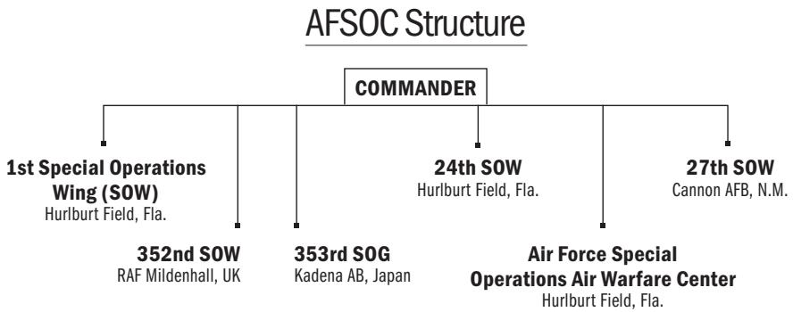

<table><tr><td colspan="2">PERSONNEL</td><td colspan="2">EQUIPMENT (TAI)</td></tr><tr><td>Active Duty Civilian</td><td>Total</td><td>ISR/BM/C3</td><td>36</td></tr><tr><td>14,223 1,732</td><td>15,955</td><td>Special Operations Forces</td><td>119</td></tr></table>

<table><tr><td>MAJOR UNITS</td><td>LOCATION</td><td>AIRCRAFT/MISSION/WEAPON</td></tr><tr><td>1st Special Operations Group (SOG)</td><td>Hurlburt Field, Fla.</td><td>AC-130U, CV-22, MC-130H/P, U-28A</td></tr><tr><td>27th S0G</td><td>Cannon AFB, N.M.</td><td>AC-130W, C-146A, CV-22B, MC-130J, MQ-1, MQ-9, U-28A</td></tr><tr><td>551st SOS</td><td>Cannon AFB, N.M.</td><td>AC-130H/W, CV-22, MC-130J, MQ-9</td></tr><tr><td>720th Special Tactics Group (STG)</td><td>Hurlburt Field, Fla.</td><td>Special tactics operations</td></tr><tr><td>724th STG</td><td>Pope Field, N.C.</td><td>Special tactics operations</td></tr><tr><td>752nd SOG</td><td>RAF Mildenhall, UK</td><td>CV-22, MC-130J</td></tr></table>

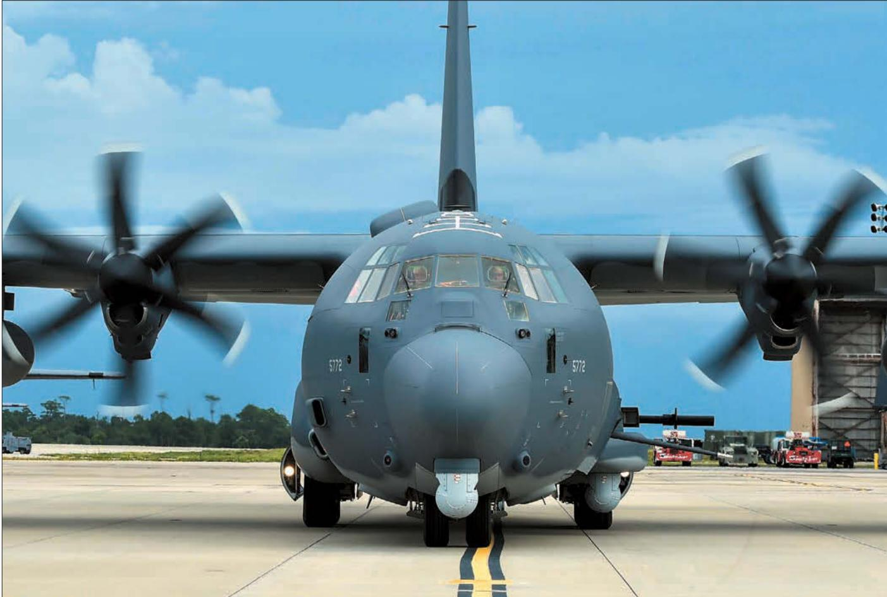

An AC-130J arrives at Hurlburt Field, Fla.

# AMC

Primary Mission

Organize, train, equip, maintain, and provide air mobility forces to sustain worldwide airpower operations.

# Air Mobility Command

Headquarters: Scott AFB, Ill. Date of current designation: June 1, 1992 Commander: Gen. Carlton D. Everhart II

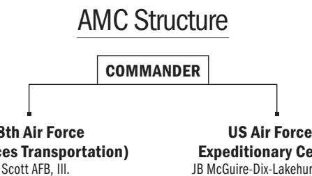

<table><tr><td colspan="3">PERSONNEL</td></tr><tr><td>Active Duty</td><td>Civilian</td><td>Total</td></tr><tr><td>40,403</td><td>8,191</td><td>48,594</td></tr></table>

<table><tr><td colspan="2">EQUIPMENT (TAI)</td></tr><tr><td>Tanker</td><td>164</td></tr><tr><td>Transport</td><td>266</td></tr></table>

<table><tr><td>WINGS/CENTERS</td><td>LOCATION</td><td>AIRCRAFT/MISSION/WEAPON</td></tr><tr><td>6th Air Mobility Wing (AMW)</td><td>MacDil AFB, FIa.</td><td>C-37, KC-135R</td></tr><tr><td>19th Airlift Wing (AW)</td><td>Little Rock AFB, Ark.</td><td>C-130H/J</td></tr><tr><td>22nd Air Refueling Wing (ARW)</td><td>McConnell AFB, Kan.</td><td>KC-135R</td></tr><tr><td>60th AMW</td><td>Travis AFB, Calif.</td><td>C-5, C-17, KC-10</td></tr><tr><td>62nd AW</td><td>JB Lewis-McChord, Wash.</td><td>C-17</td></tr><tr><td>87th Air Base Wing (ABW)</td><td>JB McGuire-Dix-Lakehurst, N.J.</td><td>Joint base facilities support</td></tr><tr><td>89th AW</td><td>JB Andrews, Md.</td><td>C-20B, C-32A, C-37A/B, C-40B, VC-25A</td></tr><tr><td>92nd ARW</td><td>Fairchild AFB, Wash.</td><td>KC-135R</td></tr><tr><td>305th AMW</td><td>JB McGuire-Dix-Lakehurst, N.J.</td><td>C-17, KC-10</td></tr><tr><td>319th ABW</td><td>Grand Forks AFB, N.D.</td><td>Base support</td></tr><tr><td>375th AMW</td><td>Scott AFB, II..</td><td>C-21, C-40 (AA), KC-135R (AA), NC-21</td></tr><tr><td>436th AW</td><td>Dover AFB, Del.</td><td>C-5, C-17</td></tr><tr><td>437th AW</td><td>JB Charleston, S.C.</td><td>C-17A</td></tr><tr><td>515th Air Mobility Operations Wing (AMOW)</td><td>JB Pearl Harbor-Hickam, Hawaii</td><td>Contingency airfield operations</td></tr><tr><td>521st AMOW</td><td>Ramstein AB, Germany</td><td>Contingency airfield operations</td></tr><tr><td>618th AOC (Tanker Airlift Control Center)</td><td>Scott AFB, II..</td><td>Tanker Airlift Control Center operations</td></tr><tr><td>621st Contingency Response Wing</td><td>JB McGuire-Dix-Lakehurst, N.J.</td><td>Rapidly deployable bare base operations</td></tr><tr><td>628th ABW</td><td>JB Charleston, S.C.</td><td>Joint base facilities support</td></tr></table>

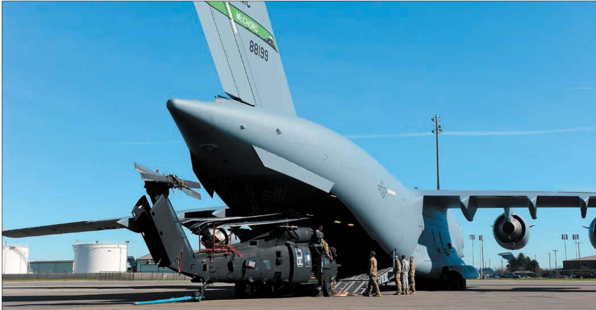  
An Army Black Hawk is loaded onto an Air Force C-17 at JB Lewis-McChord, Wash.

# PACAF

# cific Air Forces

dquarters: JB Pearl Harbor-Hickam, Hawaii e of current designation: July 1, 1957 mander: Gen. Terrence J. O’Shaughnessy

# Primary Mission

Provide US Pacific Command integrated expeditionary Air Force capabilities, including strike, air mobility, and rescue forces.

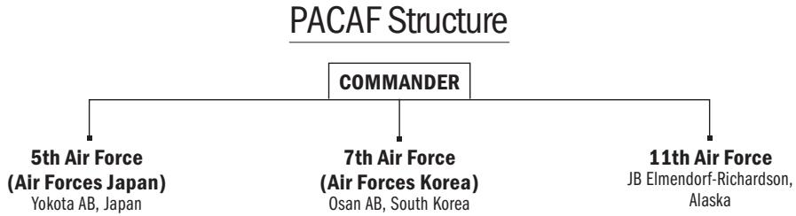

<table><tr><td colspan="3">PERSONNEL</td></tr><tr><td>Active Duty</td><td>Civilian</td><td>Total</td></tr><tr><td>28,003</td><td>3,296</td><td>31,299</td></tr></table>

<table><tr><td>EQUIPMENT (TAI)</td><td></td></tr><tr><td>Fighter/Attack</td><td>262</td></tr><tr><td>Helicopter</td><td>13</td></tr><tr><td>ISR/BM/C3</td><td>6</td></tr><tr><td>Tanker</td><td>15</td></tr><tr><td>Transport</td><td>38</td></tr></table>

<table><tr><td>WINGS/CENTERS</td><td>LOCATION</td><td>AIRCRAFT/MISSION/WEAPON</td></tr><tr><td>3rd Wing</td><td>JB Elmendorf-Richardson, Alaska</td><td>C-12, C-17, E-3, F-22A</td></tr><tr><td>8th Fighter Wing (FW)</td><td>Kunsan AB, South Korea</td><td>F-16C/D</td></tr><tr><td>15th Wing</td><td>JB Pearl Harbor-Hickam, Hawaii</td><td>C-17A, C-37A, C-40B, F-22A (AA), KC-135R (AA)</td></tr><tr><td>18th Wing</td><td>Kadena AB, Japan</td><td>E-3B/C, F-15C/D, HH-60G, KC-135R</td></tr><tr><td>35th FW</td><td>Misawa AB, Japan</td><td>F-16C/D</td></tr><tr><td>36th Wing</td><td>Andersen AFB, Guam</td><td>Operational platform for rotating combat forces</td></tr><tr><td>51st FW</td><td>Osan AB, South Korea</td><td>A-10C, F-16C/D</td></tr><tr><td>354th FW</td><td>Eielson AFB, Alaska</td><td>F-16C/D</td></tr><tr><td>374th Airlift Wing</td><td>Yokota AB, Japan</td><td>C-12J, C-130H, UH-1N</td></tr><tr><td>607th Air &amp; Space Operations Center (AOC) Osan AB, South Korea</td><td></td><td>Plan and direct air operations</td></tr><tr><td>611th AOC</td><td>JB Elmendorf-Richardson, Alaska</td><td>Plan and direct air operations</td></tr><tr><td>613th AOC</td><td>JB Pearl Harbor-Hickam, Hawaii</td><td>Plan and direct air operations</td></tr><tr><td>673rd Air Base Wing</td><td>JB Elmendorf-Richardson, Alaska Joint base facilities support</td><td></td></tr><tr><td>Regional Support Center</td><td>JB Elmendorf-Richardson, Alaska</td><td>Remote facility operations, communications, engineering</td></tr></table>

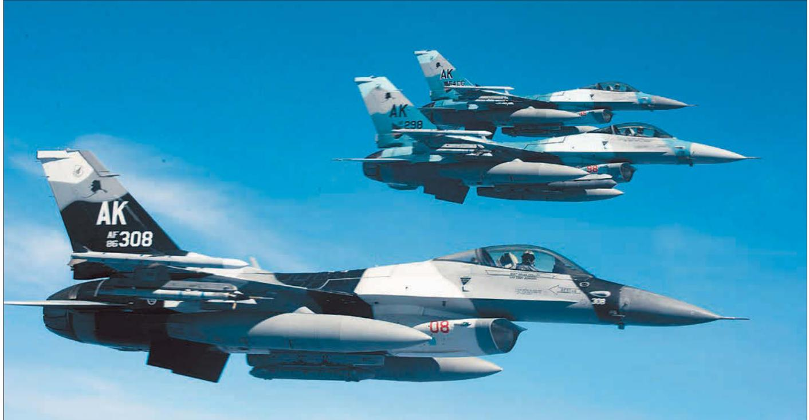

# US Air Forces in Europe

# USAFE 🙌 N

Headquarters: Ramstein AB, Germany Date of current designation: Aug. 7, 1945 Commander: Gen. Tod D. Wolters

# Primary Mission

Serves as the air component for US European Command and US Africa Command, directing air operations, including warfighting and humanitarian/peacekeeping actions, and maintains combatready forces for NATO responsibilities.

# USAFE Structure

3rd Air Force (Air Forces Europe) Ramstein AB, Germany

Hq. USAFE-AFAFRICA (Air Forces Africa) Ramstein AB, Germany

<table><tr><td colspan="3">PERSONNEL</td></tr><tr><td>Active Duty</td><td>Civilian</td><td>Total</td></tr><tr><td>22,143</td><td>1,662</td><td>23,805</td></tr></table>

<table><tr><td colspan="2">EQUIPMENT (TAI)</td></tr><tr><td>Fighter/Attack</td><td>157</td></tr><tr><td>Helicopter</td><td>5</td></tr><tr><td>Tanker</td><td>16</td></tr><tr><td>Transport</td><td>25</td></tr></table>

<table><tr><td>WINGS/CENTERS</td><td>LOCATION</td><td>AIRCRAFT/MISSION/WEAPON</td></tr><tr><td>31st Fighter Wing (FW)</td><td>Aviano AB, Italy</td><td>F-16C/D</td></tr><tr><td>39th Air Base Wing</td><td>Incirlik AB, Turkey</td><td>Operational location for deployed US and NATO forces</td></tr><tr><td>48th FW</td><td>RAF Lakenheath, UK</td><td>F-15C/D, F-15E, HH-60G</td></tr><tr><td>52ndFW</td><td>Spangdahlem AB, Germany</td><td>F-16C/D</td></tr><tr><td>86th Airlift Wing</td><td>Ramstein AB, Germany</td><td>C-20H, C-21, C-37A, C-40B, C-130J</td></tr><tr><td>100th Air Refueling Wing</td><td>RAF Mildenhall, UK</td><td>CV-22, KC-135R, MC-130J, RC-135V/W</td></tr><tr><td>435th Air Ground Operations Wing</td><td>Ramstein AB, Germany</td><td>Battlefield airmen support and operations</td></tr><tr><td>501st Combat Support Wing</td><td>RAF Alconbury, UK</td><td>Facilitates support for seven geographically separated units</td></tr><tr><td>603rd Air &amp; Space Operations Center</td><td>Ramstein AB, Germany</td><td>Plan and direct air operations</td></tr></table>

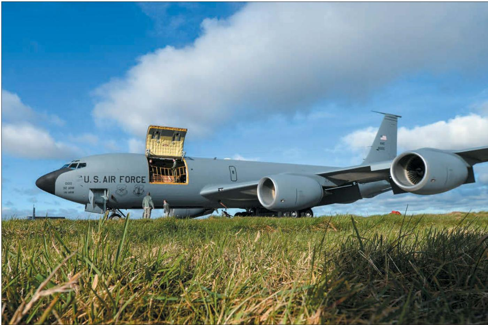  
Airmen from the 100th Air Refueling Wing inspect a KC-135 at RAF Mildenhall, UK.

# ANG

# Air National Guard

Headquarters: Washington, D.C. Date of current designation: Sept. 18, 1947 Director: Lt. Gen. L. Scott Rice

# Primary Mission

Provide combat capability to the Active Duty force and security for the homeland. Support US domestic and foreign humanitarian and disaster relief.

<table><tr><td colspan="3">PERSONNEL</td></tr><tr><td>Total (Selected reserve)</td><td>Active Duty</td><td>Civilian (Includes technicians) Total</td></tr><tr><td>105,500</td><td>27 23,597</td><td>129,124</td></tr><tr><td colspan="3"></td></tr><tr><td colspan="3">EQUIPMENT (TAI)</td></tr><tr><td>Fighter/Attack</td><td>577</td><td>Special Operations Forces 4</td></tr><tr><td>Helicopter</td><td>17</td><td>Tanker</td></tr><tr><td>ISR/BM/C3</td><td>89</td><td>181 Transport 212</td></tr></table>

<table><tr><td></td><td></td><td colspan="2"></td></tr><tr><td>WING (STATE)</td><td>SYSTEM/MISSION</td><td>WING (STATE)</td><td>SYSTEM/MISSION</td></tr><tr><td>101st Air Refueling Wing (Maine) KC-135R, CC, cyber</td><td></td><td>149th FW (Texas)</td><td>F-16, cyber, intel training</td></tr><tr><td>102nd Intelligence Wing (Mass.) AOG, CC, DCGS</td><td></td><td>150th SOW (N.M.)</td><td>C-26, special ops training (CA)</td></tr><tr><td>103rd Airlift Wing (Conn.)</td><td>C-130H</td><td>151st ARW (Utah)</td><td>KC-135R, cyber, intel</td></tr><tr><td>104th Fighter Wing (Mass.)</td><td>F-15C/D</td><td>152nd AW (Nev.)</td><td>C-130H, DCGS</td></tr><tr><td>105th AW (N.Y.)</td><td>C-17, cyber</td><td>153rd AW (Wyo.)</td><td>C-130H, MAFFS</td></tr><tr><td>106th Rescue Wing (N.Y.)</td><td>HC-130, HH-60G, GA</td><td>154th Wing (Hawaii)</td><td>C-17 (CA), F-22, KC-135R</td></tr><tr><td>107th AW (N.Y.)</td><td>MQ-9</td><td>155th ARW (Neb.)</td><td>KC-135R</td></tr><tr><td>108th Wing (N.J.)</td><td>KC-135R, C-40, intel</td><td>156th AW (Puerto Rico)</td><td>C-130E</td></tr><tr><td>109th AW (N.Y.)</td><td>C-130H, LC-130</td><td>157th ARW (N.H.)</td><td>KC-135R</td></tr><tr><td>110th Attack Wing (Mich.)</td><td>MQ-9, AOG, cyber</td><td>158th FW (Vt.)</td><td>F-16, cyber training</td></tr><tr><td>111th Attack Wing (Pa.)</td><td>MQ-9, AOG, CSDC, cyber</td><td>159th FW (La.)</td><td>F-15C/D, CC, cyber, intel, TACP</td></tr><tr><td>113th Wing (D.C.)</td><td>C-40, F-16</td><td>161st ARW (Ariz.)</td><td>KC-135R</td></tr><tr><td>114th FW (S.D.)</td><td>F-16C</td><td>162nd Wing (Ariz.)</td><td>F-16, MQ-1, RC-26B</td></tr><tr><td>115th FW (Wis.)</td><td>F-16</td><td>163rd Attack Wing (Calif.)</td><td>MQ-1, FTU</td></tr><tr><td>116th Air Control Wing (Ga.)</td><td>E-8C</td><td>164th AW (Tenn.)</td><td>C-17A</td></tr><tr><td>117th ARW (Ala.)</td><td>KC-135R, intel</td><td>165th AW (Ga.)</td><td>C-130H, CRTC, TACP, tactical comm</td></tr><tr><td>118th Wing (Tenn.)</td><td>MQ-9, cyber</td><td>166th AW (Del.)</td><td>C-130H, aeromed, cyber</td></tr><tr><td>119th Wing (N.D.)</td><td>MQ-1, ISR</td><td>167th AW (W.Va.)</td><td>C-17A, aeromed</td></tr><tr><td>120th AW (Mont.)</td><td>C-130H</td><td>168th ARW (Alaska)</td><td>KC-135R</td></tr><tr><td>121st ARW (Ohio)</td><td>KC-135R</td><td>169th FW (S.C.)</td><td>F-16</td></tr><tr><td>122nd FW (Ind.)</td><td>A-10C</td><td>171st ARW (Pa.)</td><td>KC-135R/T</td></tr><tr><td>123rd AW (Ky.)</td><td>C-130H, CRG, special tactics</td><td>172nd AW (Miss.)</td><td>C-17, aeromed</td></tr><tr><td>124th FW (ldaho)</td><td>A-10C, CACS, TACP</td><td>173rd FW (Ore.)</td><td>F-15C/D</td></tr><tr><td>125th FW (Fla.) 126th ARW (I.)</td><td>F-15C</td><td>174th Attack Wing (N.Y.)</td><td>MQ-9, AOC, CACS, TACP, FTU</td></tr><tr><td>127th Wing (Mich.)</td><td>KC-135R</td><td>175th Wing (Md.)</td><td>A-10C, cyber</td></tr><tr><td>128th ARW (Wis.)</td><td>A-10C, KC-135R, special ops weather</td><td>176th Wing (Alaska)</td><td>C-17 (CA), C-130H, HC-130,</td></tr><tr><td></td><td>KC-135R</td><td></td><td>HH-60G, GA, RAOC, RCC</td></tr><tr><td>129th RQW (Calif.)</td><td>MC-130P, HH-60G, GA</td><td>177th FW (N.J.)</td><td>F-16C, TACP</td></tr><tr><td>130th AW (W.Va.)</td><td>C-130H</td><td>178th Wing (Ohio)</td><td>MQ-1, cyber, ISR, space</td></tr><tr><td>131st Bomb Wing (Mo.)</td><td>B-2 (CA), AOG, CC</td><td>179th AW (Ohio)</td><td>C-130H</td></tr><tr><td>132nd Wing (lowa) 133rd AW (Minn.)</td><td>MQ-9, DTOC</td><td>180th FW (Ohio)</td><td>F-16C</td></tr><tr><td>134th ARW (Tenn.)</td><td>C-130H</td><td>181st IW (Ind.)</td><td>DCGS, TACP</td></tr><tr><td>136th AW (Texas)</td><td>KC-135R</td><td>182nd AW (I.)</td><td>C-130H, CC, TACP</td></tr><tr><td></td><td>C-130H,CC</td><td>183rd FW (I)</td><td>AOG, CIRF, cyber</td></tr><tr><td>137th SOW (Okla.)</td><td>MC-12, cyber, TACP</td><td>184th IW (Kan.)</td><td>CACS, cyber, DCGS, NOSS, TACP</td></tr><tr><td>138th FW (Okla.) 139th AW (Mo.)</td><td>F-16, cyber, TACP training</td><td>185th ARW (lowa)</td><td>KC-135R</td></tr><tr><td></td><td>C-130H, AATTC (ANG/AFRC)</td><td>186th ARW (Miss.)</td><td>KC-135R, RC-26, A0G, TACP</td></tr><tr><td>140th Wing (Colo.)</td><td>C-21, F-16, MGS</td><td>187th FW (Ala.)</td><td>F-16, RC-26</td></tr><tr><td>141st ARW (Wash.)</td><td>KC-135R,CC</td><td>188th Wing (Ark.)</td><td>MQ-9</td></tr><tr><td>142nd FW (Ore.)</td><td>F-15C, CW, special tactics</td><td>189th AW (Ark.)</td><td>C-130H</td></tr><tr><td>143rd AW (R.1.)</td><td>C-130J, CC, cyber</td><td>190th ARW (Kan.)</td><td>KC-135R, CW</td></tr><tr><td>144th FW (Calif.)</td><td>F-15C</td><td>192nd FW (Va.)</td><td>F-22 (CA), ISR</td></tr><tr><td>145th AW (N.C.) 146th AW (Calif.)</td><td>C-130H, aeromed, CC, MAFFS, TACP</td><td>193rd SoW (Pa.)</td><td>EC-130J, AOS, CC, cyber, TACP</td></tr><tr><td>147th Reconnaissance</td><td>C-130J, MAFFS MQ-1B, RC-26, TACP</td><td>194th Regional Support Wing (Wash.)</td><td>CC, CW, cyber, ISR, TACP</td></tr><tr><td>Wing (Texas)</td><td></td><td>195th Wing (Calif.)</td><td>cyber, intel, space</td></tr><tr><td>148th FW (Minn.)</td><td>F-16C, EOD</td><td></td><td></td></tr></table>

# WISH YOU WERE HERE?

www.afa.org/hotels

# Client Testimonials

"Yam ecstatic with the productslve receivedand the care you have put intocrafting them. Iam confident that wil not have a problem getting in the door for an interview with these." Colonel, USAF

"Yourproduct isundeniablyone ofthe fnest on the market.Ithankyou fortaking so much material,condensing it and returning t to me so quickly. And yourprice is lwl willnot hesitate torecommend your services tomy friends. Iam avery satisfied customer"Major, USAF

# Why does AFA's Résumé Servlce have completely satisfied clients?

Because AFA's principal résumé writer is David G. Henderson author of "Job Search: Marketing Your Military Experience." Mr. Henderson is a leading expert on planning a smooth transition of military experience to wellpaying civilian jobs.

Full R.sme，Prep.ratio.…. 160   
Reésumeé Review and Critique Service...50   
OF612 RésuméPreparation.……… ..5225

# FOAs, DRUs, and Auxiliary

2017 USAF Almanac

# Air Force Agency for Modeling and Simulation

Headquarters: Orlando, Fla. Date of Current Designation: June 3, 1996

Type: Field Operating Agency (FOA) Mission: Oversee air, space, and cyberspace modeling and simulation requirements and provide joint interoperability standards within live, virtual, and constructive (LVC) domains.

Total Personnel: 20

# Air Force Audit Agency

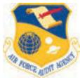

Headquarters: Pentagon   
Date of Current Designation: Dec. 31, 1971   
Type: FOA

Mission: Provide independent, objective, and quality internal audit service.

Total Personnel: 589

# Air Force Cost Analysis Agency

Headquarters: Arlington, Va. Date of Current Designation: Aug. 1, 1991 Type: FOA

Mission: Perform independent cost and risk analyses and provide special studies to aid long-range planning.

Total Personnel: 85

# Air Force District of Washington

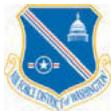

Headquarters: JB Andrews, Md. Date of Current Designation: July 7, 2005 Type: Direct Reporting Unit (DRU)

Mission: Orchestrate support for National Capital Region activities; train, equip, and provide forces for contingency, homeland, and ceremonial support operations.

Total Personnel: 4,557

# Air Force Flight Standards Agency

Headquarters: Oklahoma City Date of Current Designation: Oct. 1, 1991 Type: FOA

Mission: Develop, standardize, evaluate, and certify policy, procedures, and equipment for flight operations and centrally manage air traffic control and landing systems.

Total Personnel: 170

# Air Force Historical Research Agency

Headquarters: Maxwell AFB, Ala. Date of Current Designation: Sept. 1, 1991 Type: FOA Mission: Research, record, and dissemina collect, preserve, and manage historical document collection and oral history program; determine unit lineage and honors; verify aerial victory credits.

Total Personnel: 37

# Air Force Inspection Agency

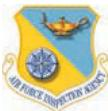

Headquarters: Kirtland AFB, N.M. Date of Current Designation: Aug. 1, 1991 Type: FOA

Mission: Provide independent assessments of operations and activities; conduct nuclear surety inspection oversight, training, and certification; serve as primary action arm of the Secretary of the Air Force’s inspection system.

Total Personnel: 115

# Air Force Legal Operations Agency

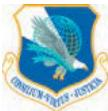

Headquarters: JB Andrews, Md. Date of Current Designation: Sept. 1, 1991 Type: FOA

Mission: Administer military justice programs; provide legal research technology and train legal professionals; support the Department of Justice in civil or criminal litigation pertaining to the Air Force.

Total Personnel: 808

# Air Force Manpower Analysis Agency

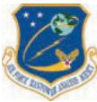

Headquarters: JBSA-Randolph, Texas Date of Current Designation: June 1, 2015 Type: FOA

Mission: Measure and document Air Force manpower requirements.

Total Personnel: 247

# Air Force Medical Operations Agency

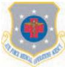

Headquarters: JBSA-Lackland, Texas Date of Current Designation: July 1, 1992 Type: FOA

Mission: Oversee execution of surgeon general policies; provide leadership for medical personnel and medical treatment facilities; promote a cost-effective, modern, and preventionbased health care continuum.

Total Personnel: 359

# Air Force Medical Support Agency

Headquarters: Falls Church, Va. Date of Current Designation: July 1, 1992 Type: FOA

Mission: Develop surgeon general plans and programs; provide medical expeditionary capabilities and national security strategy; define and execute health care policy.

Total Personnel: 273

# Air Force Mortuary Affairs Operations

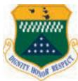

Headquarters: Dover AFB, Del. Date of Current Designation: Jan. 6, 2009

Type: FOA

Mission: Ensure respectful handling, dignity, and honor of the fallen; provide care, service, and support to family of the fallen; transfer remains.

Total Personnel: 48

# Air Force Office of Special Investigations

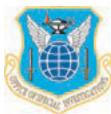

Headquarters: Quantico, Va. Date of Current Designation: Dec. 20, 1971

Type: FOA

Mission: Provide investigative service to USAF commanders; identify, exploit, and neutralize criminal, terrorist, and intelligence threats; combat threats to information systems and technologies; defeat fraud affecting acquisitions and baselevel capabilities.

Total Personnel: 2,328

# Air Force Operational Test and Evaluation Center

Headquarters: Kirtland AFB, N.M. Date of Current Designation: April 4, 1983

Type: DRU

Mission: Test and evaluate new weapon systems. Total Personnel: 577

# Air Force Operations Group

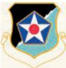

Headquarters: Pentagon   
Date of Current Designation: April 1, 1995   
Type: FOA

Mission: Provide 24-hour watch on current operations; train and staff Crisis Action Team; develop weather data for National Command Authority, Joint Chiefs of Staff, National Military Command Center, Army Operations Center, and other federal agencies.

Total Personnel: 42

# Air Force Personnel Center

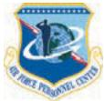

Headquarters: JBSA-Randolph, Texas Date of Current Designation: Oct. 1, 1995 Type: FOA

Mission: Identify proper grades, specialties, and skill levels for USAF mission; manage assignments; monitor professional development; plan and schedule expeditionary forces; oversee airmen and family readiness centers; assist casualty reporting and missing in action/prisoner of war actions.

Total Personnel: 2,058

# Air Force Public Affairs Agency

Headquarters: JBSA-Lackland, Texas Date of Current Designation: Oct. 1, 2008 Type: FOA

Mission: Develop and sustain public affairs products; provide combat camera and graphics support; test emerging technologies; manage public affairs personnel deployments.

Total Personnel: 257

# Air Force Review Boards Agency

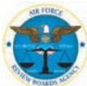

Headquarters: JB Andrews, Md. Date of Current Designation: Aug. 1, 1991 Type: FOA

Mission: Manage military and civilian appellate processes; serve as lead agent for DOD Physical Disability Board of Review.

Total Personnel: 91

# Air Force Safety Center

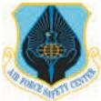

Headquarters: Kirtland AFB, N.M. Date of Current Designation: Jan. 1, 1996 Type: FOA

Mission: Manage mishap prevention, risk management, and nuclear surety programs; provide flight, ground, weapons, human factors, and space safety technical assistance; oversee major command mishap investigations and evaluate corrective actions; direct safety education programs.

Total Personnel: 105

# Air National Guard Readiness Center

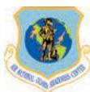

Headquarters: JB Andrews, Md. Date of Current Designation: June 1, 1992

Type: FOA

Mission: Ensure field units have resources to train and equip forces for state and federal missions; sustain airmen and help shape leadership capability.

Total Personnel: 864

# US Air Force Academy

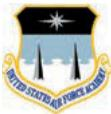

Headquarters: Colorado Springs, Colo. Date of Current Designation: April 1, 1954 Type: DRU

Mission: Develop and inspire young men and women to become USAF officers with knowledge, character, and discipline.

Total Personnel: 3,293

# Civil Air Patrol

Headquarters: Maxwell AFB, Ala. Date of Current Designation: Dec. 1, 1941 Type: Auxiliary

Mission: Provide operational capabilities to support search and rescue, disaster relief, a nationwide communications network, and counterdrug and homeland security missions; conduct leadership training, and career and technical education for CAP Cadet Program; promote aerospace education.

Total Volunteers: 56,000

# Guide to Installations Worldwide

2017 USAF Almanac

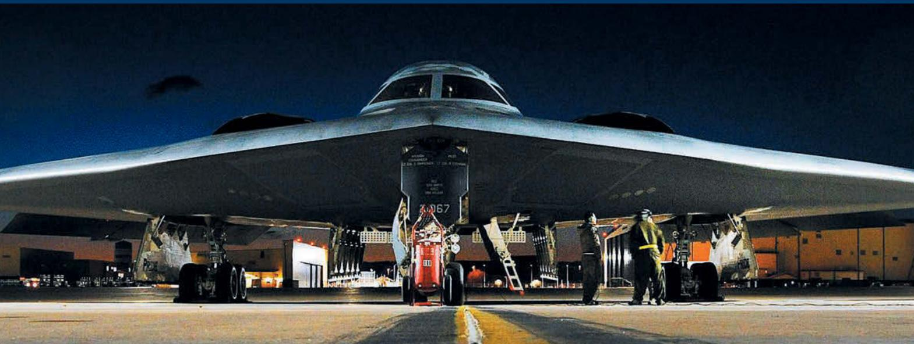

This section includes Air Force-owned and -operated facilities around the world. (It also lists the former USAF bases now under other service leadership as joint bases.) The section does not list all units or agencies at each base. Many USAF installations also host numerous tenants, including other USAF major command units and civil, DOD, federal, and other service entities.

Altus AFB, Okla. 73523. Nearest city: Altus. Phone: 580-482-8100. Owning command: AETC. Unit/mission: 97th AMW (AETC), training. History: activated January 1943. Inactivated May 1945. Reactivated August 1953.

Andersen AFB, Guam APO AP 96543. Nearest city: Yigo. Phone: 671-366-1110. Owning command: PACAF. Unit/mission: 9th Operations Group Det. 3 (ACC), RPA operations; 22nd SOPS Det. 5 (AFSPC), space operations; 36th Wing (PACAF), support; 36th CRG (PACAF), bare base operations; 44th APS (AFRC), aerial port operations; 254th ABG (ANG), support, bare base operations (254th RED HORSE); 724th ASTF (AFRC); 734th AMS (AMC), air transportation services. History: activated 1945 as North Field. Renamed 1949 for Brig. Gen. James R. Andersen, lost at sea Feb. 26, 1945. Became part of Joint Region Marianas 2009.

Arnold AFB, Tenn. 37389. Nearest city: Manchester. Phone: 931-454-3000. Owning command: AFTC/AFMC. Unit/mission: Arnold Engineering Development Complex (AFTC/ AFMC), flight, space, and missile ground testing. History: dedicated June 25, 1951. Named for Gen. of the Air Force Henry H. “Hap” Arnold.

Aviano AB, Italy APO AE 09604. Nearest city: Aviano. Phone: 011-39-0434-30-1110. Owning command: USAFE. Unit/mission: 31st FW (USAFE), fighter operations; 724th AMS (AMC), air transportation services. History: dates from 1911 as Italian air base. USAF began operations 1954.

Barksdale AFB, La. 71110. Nearest city: Bossier City. Phone: 318-456-1110. Owning command: AFGSC. Unit/mission: 2nd BW (AFGSC), bomber operations; 307th BW (AFRC), bomber operations, training; Hq. AFGSC, management; Hq. 8th Air Force (AFGSC), operational leadership; Global Power Museum (AFGSC). History: activated Feb. 2, 1933. Named for Lt. Eugene H. Barksdale, WWI airman killed in August 1926 crash.

Beale AFB, Calif. 95903. Nearest city: Marysville. Phone: 530-634-3000. Owning command: ACC. Unit/mission: 7th SWS (AFSPC), missile warning; 9th RW (ACC), ISR, RPA operations; 548th ISRG (ACC), DCGS; 940th Wing (AFRC), C2, ISR, RPA operations. History: opened October 1942 as Army’s Camp Beale. Named for Edward F. Beale, a former Navy officer who became a hero of the Mexican-American War and early developer of California, as well as a senior appointee/diplomat for four Presidents. Transferred to USAF 1948. Designated AFB April 1951.

Buckley AFB, Colo. 80011. Nearest city: Denver. Phone: 720-847-9431. Owning command: AFSPC. Unit/mission: 140th Wing (ANG), air mobility, fighter operations, mobile missile warning; 460th SW (AFSPC), space surveillance, missile warning; 566th IS (ACC), intelligence; Air Reserve Personnel Center, Guard and Reserve personnel support. History: activated April 1, 1942, as gunnery training facility. ANG assumed control from Navy 1959. Became Active Duty Air Force facility Oct. 1, 2000. Named for 1st Lt. John H. Buckley, WWI flier, killed Sept. 17, 1918.

Cannon AFB, N.M. 88103. Nearest city: Clovis. Phone: 575-784-4131. Owning command: AFSOC. Unit/mission: 27th SOW (AFSOC), special operations. History: activated August 1942. Named for Gen. John K. Cannon, WWII commander of all Allied air forces in the Mediterranean Theater and former commander, Tactical Air Command.

Cape Canaveral AFS, Fla. 32925. Nearest city: Cocoa Beach. Phone: 321-853-1110. Owning command: AFSPC. Unit/mission: 45th Space Wing (AFSPC), space launch operations.

History: formerly NAS Banana River. Site of Joint Long Range Proving Ground 1949. USAF took sole control 1950. Combined with NASA to form John F. Kennedy Space Center 1973. Designated Cape Canaveral AS 1974.

Cape Cod AFS, Mass. 02561. Nearest city: Sandwich. Phone: 508-968-3283. Owning command: AFSPC. Unit/mission: 6th SWS (AFSPC), missile warning. History: established April 4, 1980, as Cape Cod Missile Early Warning Station. Renamed Jan. 5, 1982.

Cavalier AFS, N.D. 58220. Nearest city: Cavalier. Phone: 701-993-3292. Owning command: AFSPC. Unit/mission: 10th SWS (AFSPC), missile warning. History: established 1975 as Army’s Mickelsen Complex, an anti-ballistic missile facility. All but perimeter acquisition radar inactivated 1976. USAF took radar operational control 1977 and site control 2007.

Cheyenne Mountain AFS, Colo. 80914. Nearest city: Colorado Springs. Phone: N/A. Owning command: AFSPC. Unit/mission: 721st MSG (AFSPC), support; NORAD/NORTHCOM Alternate Command Center, Integrated Tactical Warning and Attack Assessment operations, training. History: operational April 20, 1966.

Clear AFS, Alaska 99704. Nearest city: Fairbanks. Phone: 907-585-6384. Owning command: AFSPC. Unit/mission: 13th SWS (AFSPC), 213th SWS (ANG), missile warning. History: dates from 1961.

Columbus AFB, Miss. 39710. Nearest city: Columbus. Phone: 662-434-1110. Owning command: AETC. Unit/mission: 14th FTW (AETC), training. History: activated 1942 for pilot training.

Creech AFB, Nev. 89191. Nearest city: Indian Springs. Phone: 702-404-1110. Owning command: ACC. Unit/mission: 232nd Operations Sq. (ANG), 432nd Wing (ACC), 726th Operations Group (AFRC), RPA operations; 799th ABG (ACC), support. History: Built in 1943 as auxiliary landing field to support air-to-air gunnery and other AAF training. Called Indian Springs Arpt. Closed in 1947. Reopened in 1949. Became Indian Springs AFB in 1951. Transferred to Air Research and Development Command in 1952. Redesignated Indian Springs Air Force Auxiliary Field and assigned to Nellis AFB in 1964. In 2005, renamed Creech AFB for Gen. Wilbur L. “Bill” Creech, commander, Tactical Air Command, 1978 to 1984.

Davis-Monthan AFB, Ariz. 85707. Nearest city: Tucson. Phone: 520-228-3900. Owning command: ACC. Unit/mission: 55th ECG (ACC), electronic combat operations; 214th RG (ANG), RPA operations; 309th Aerospace Maintenance and Regeneration Group (AFMC), aerospace vehicle storage, regeneration; 355th FW (ACC), fighter operations; 563rd RQG (ACC), personnel recovery operations; 924th FG (AFRC), fighter operations; 943rd RQG (AFRC), personnel recovery operations; Hq. 12th Air Force (ACC), operational leadership. History: activated 1927. Named for two local aviators: 2nd Lt. Samuel H. Davis Jr., killed Dec. 28, 1921, and 2nd Lt. Oscar Monthan, killed March 27, 1924.

Dover AFB, Del. 19902. Nearest city: Dover. Phone: 302-677-3000. Owning command: AMC. Unit/mission: 436th AW (AMC), 512th AW (AFRC), air mobility operations; Air Force

Mortuary Affairs Operations (USAF). History: activated December 1941. Inactivated 1946. Reactivated February 1951.

Dyess AFB, Texas 79607. Nearest city: Abilene. Phone: 325-696-4820. Owning command: AFGSC. Unit/mission: 7th BW (AFGSC), bomber operations; 317th AG (AMC), air mobility operations. History: Abilene AAB opened Dec. 18, 1942. Inactivated Jan. 31, 1946. Reopened and renamed Dec. 1, 1956, for Lt. Col. William E. Dyess, WWII pilot who escaped from a Japanese prison camp, killed in P-38 crash in December 1943.

Edwards AFB, Calif. 93524. Nearest city: Rosamond. Phone: 661-277-1110. Owning command: AFMC. Unit/mission: 412th TW (AFMC), T&E, base support; Hq. Air Force Test Center (AFMC), T&E management; US Air Force Test Pilot School (AFMC), training. History: Muroc Bombing and Gunnery Range established September 1933. Designated Muroc AAB 1942. Renamed in 1949 for Capt. Glen W. Edwards, killed June 5, 1948, in crash of YB-49 “Flying Wing.”

Eglin AFB, Fla. 32542. Nearest city: NicevilleValparaiso. Phone: 850-882-1110. Owning command: AFMC. Unit/mission: 20th SPCS (AFSPC), space surveillance; 33rd FW (AETC), training; 53rd Wing (ACC), OT&E; 96th TW (AFMC), T&E, base support; Air Force Armament Museum (AFMC); AFRL Munitions Directorate (AFMC), R&D; PEO-Weapons/Air Force Life Cycle Management Center Armament Directorate (AFMC), acquisition. History: activated 1935. Named for Lt. Col. Frederick I. Eglin, WWI flier killed in aircraft accident Jan. 1, 1937.

Eielson AFB, Alaska 99702. Nearest city: Fairbanks. Phone: 907-377-2116. Owning command: PACAF. Unit/mission: 168th ARW (ANG), air mobility operations; 354th FW (PACAF), aggressor force, fighter, Red Flag-Alaska operations, Joint Pacific Alaska Range Complex support; Arctic Survival School (AETC), training. History: activated October 1944. Named for Carl Ben Eielson, Arctic aviation pioneer who died in Arctic rescue mission November 1929.

Ellsworth AFB, S.D. 57706. Nearest city: Rapid City. Phone: 605-385-5056. Owning command: AFGSC. Unit/mission: 28th BW (AFGSC), bomber operations; Air Force Financial Services Center (AFMC). History: activated January 1942 as Rapid City AAB. Renamed June 13, 1953, for Brig. Gen. Richard E. Ellsworth, killed March 18, 1953, in RB-36 crash.

Fairchild AFB, Wash. 99011. Nearest city: Spokane. Phone: 509-247-1212. Owning command: AMC. Unit/mission: 92nd ARW (AMC), 141st ARW (ANG), air mobility operations; USAF SERE School (AETC), training. History: activated January 1942. Named for Gen. Muir S. Fairchild, USAF vice chief of staff at his death in 1950.

F. E. Warren AFB, Wyo. 82005. Nearest city: Cheyenne. Phone: 307-773-1110. Owning command: AFGSC. Unit/mission: 90th MW (AFGSC), ICBM operations; 153rd CACS (ANG), space C2 operations; Hq. 20th Air Force (AFGSC), operational leadership; Warren ICBM and Heritage Museum. History: activated as

# AcronymsAcronyms and Abbreviationand Abbreviations

AAB   
AAF Army Airfield   
AB Air Base   
ABG Air Base Group   
ABW Air Base Wing   
ACC Air Combat Command   
ACG Air Control Group   
ACS Air Control Squadron   
ACTS Air Combat Training Squadron   
ACW Air Control Wing   
AETC Air Education and Training Command   
AFB Air Force Base   
AFDW Air Force District of Washington   
AFGSC Air Force Global Strike Command   
AFMC Air Force Materiel Command   
AFNWC Air Force Nuclear Weapons Center   
AFRC Air Force Reserve Command   
AFRL Air Force Research Laboratory   
AFS Air Force Station   
AFSOC Air Force Special Operations Command   
AFSPC Air Force Space Command   
AFTC Air Force Test Center   
AG Airlift Group   
AGOW Air Ground Operations Wing   
AGS Air Guard Station   
ALC Air Logistics Complex   
AMC Air Mobility Command   
AMOG Air Mobility Operations Group   
AMOW Air Mobility Operations Wing   
AMS Air Mobility Squadron   
AMW Air Mobility Wing   
ANG Air National Guard   
ANGB Air National Guard Base   
ANGS Air National Guard Station   
APO AP Army/Air Force Post Office Pacific   
APO AE Army/Air Force Post Office Europe   
AOC Air and Space Operations Center   
AOG Air and Space Operations Group   
APS Aerial Port Squadron   
ARB Air Reserve Base   
ARG Air Refueling Group   
Arpt. Airport   
ARS Air Refueling Squadron or Air Reserve Station   
ARW Air Refueling Wing   
AS Air Station or Airlift Squadron   
ASOG Air Support Operations Group   
ASOS Air Support Operations Squadron   
ASTF Aeromedical Staging Flight   
ATKW Attack Wing   
AW Airlift Wing   
BW Bomb Wing   
C2 command and control   
C3I command, control, communications, and intelligence   
C4 command, control, communications, and computers   
CACS Command and Control Squadron   
CBCS Combat Communications Squadron   
CCG Combat Communications Group   
CCW Command and Control Wing   
CENTCOM US Central Command   
CG Communications Group   
CIRF Centralized Intermediate Repair Facility   
CONUS continental US   
CRG Contingency Response Group   
CRW Contingency Response Wing   
CSAR combat search and rescue   
CTS Combat Training Squadron   
CW Cyberspace Wing   
DCGS Distributed Common Ground Station   
DMOC Distributed Mission Operations Center   
DTOC Distributed Training Operations Center   
ECG Electronic Combat Group   
EIS Engineering Installation Squadron

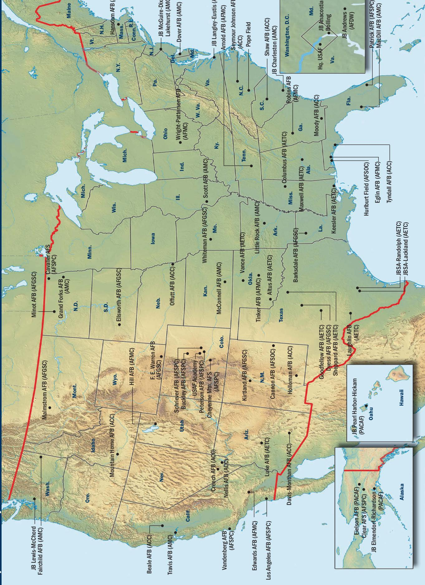

Fort D. A. Russell July 4, 1867. Renamed 1930 for Francis Emory Warren, Wyoming senator and first state governor. Reassigned to USAF in 1947 and received current designation in 1949.

Goodfellow AFB, Texas 76908. Nearest city: San Angelo. Phone: 325-654-1110. Owning command: AETC. Unit/mission: 17th TRW (AETC), training. History: established August 1940. Officially activated January 1941. Named for 1st Lt. John J. Goodfellow Jr., WWI observation airplane pilot killed in combat Sept. 14, 1918.

Grand Forks AFB, N.D. 58205. Nearest city: Grand Forks. Phone: 701-747-1110. Owning command: AMC. Unit/mission: 69th RG (ACC), RPA operations; 319th ABW (AMC), support. History: activated 1956. Named after town of Grand Forks, whose citizens bought the property for the Air Force.

Hanscom AFB, Mass. 01731. Nearest city: Boston. Phone: 781-225-1110. Owning command: AFMC. Unit/mission: 66th ABG (AFMC), support; PEO-Battle Management, PEO-C3I and Networks (AFMC), acquisition. History: activated 1941. Named for Laurence G. Hanscom, a pre-WWII advocate of private aviation, killed in lightplane accident 1941.

Hill AFB, Utah 84056. Nearest city: Salt Lake City. Phone: 801-777-1110. Owning command: AFMC. Unit/mission: 75th ABW (AFMC), support; 388th FW (ACC), fighter, Utah Test and Training Range operations; 419th FW (AFRC), fighter operations; 748th SCMG (AFMC), systems life cycle support; AFNWC ICBM Systems Directorate (AFMC), ICBM acquisition, support; Hill Aerospace Museum (AFMC); Ogden ALC (AFMC), weapons maintenance, repair. History: activated 1940. Named for Maj. Ployer P. Hill, killed Oct. 30, 1935, test flying first B-17.

Holloman AFB, N.M. 88330. Nearest city: Alamogordo. Phone: 575-572-1110. Owning command: ACC. Unit/mission: 49th Wing (ACC), RPA training; 54th FG (AETC), fighter operations; 704th TG (AFMC), test; 429th ACTS (AFRC), RPA training. History: activated 1941. Named for Col. George Holloman, guidedmissile pioneer.

Hurlburt Field, Fla. 32544. Nearest city: Fort Walton Beach. Phone: 850-884-7190. Owning command: AFSOC. Unit/mission: 1st SOW (AFSOC), special operations; 24th SOW (AFSOC), special tactics operations; 39th IOS (AFSPC), training; 361st ISRG (ACC), ISR operations; 505th CCW (ACC), C2, ISR TTP development, test; 556th RED HORSE (AFRC), 823rd RED HORSE (ACC), bare base operations; 2nd Combat Weather Systems Squadron (ACC), OT&E, training; Air Force Special Operations Air Warfare Center (AFSOC), training; Hq. AFSOC, management. History: activated 1943. Named for Lt. Donald W. Hurlburt, WWII pilot killed Oct. 1, 1943.

Incirlik AB, Turkey APO AE 09824. Nearest city: Adana. Phone: (commercial, from CONUS) 011- 90-322-316-1110. Owning command: USAFE. Unit/mission: 39th ABW (USAFE), support; 728th AMS (AMC), air transportation services. History: activated 1954. Named Adana AB Feb. 21, 1955. Renamed Incirlik AB Feb. 28, 1958.

JB Anacostia-Bolling, D.C. 20032. Nearest city: Washington, D.C. Phone: 703-545-6700. Bolling owning command: AFDW. Unit/mission: 11th Operations Group (AFDW), support; 579th MDG (AFDW), clinic operations; Hq. Surgeon General (USAF). History: site activated October 1917 with Army air and Navy elements. Formed joint base under Navy lead 2010. Naval Support Facility Anacostia named for adjacent Anacostia River. Bolling named for Col. Raynal C. Bolling, first high-ranking Army Air Service officer killed in WWI.

JB Andrews, Md. 20762. Nearest city: Washington, D.C. Phone: 301-981-1110. Owning command: AFDW. Unit/mission: 11th Wing (AFDW), helicopter operations, support; 79th MDW (AFDW); 89th AW (AMC), air mobility operations; 113th Wing (ANG), air mobility, fighter operations; 459th ARW (AFRC), air mobility operations; 844th CG (AFDW), cyber operations; Air Force Legal Operations Agency (USAF); Air Force Review Boards Agency (USAF); ANG Readiness Center (ANG), support. History: Andrews activated May 1943. NAF Washington dates from 1919 at Anacostia (above); moved to Andrews 1958. Formed JB Andrews-NAF Washington under Air Force lead 2010. Andrews named for Lt. Gen. Frank M. Andrews, military air pioneer and WWII commander of the European Theater, killed in aircraft accident May 3, 1943, in Iceland.

JB Charleston, S.C. 29404. Nearest city: Charleston. Phone: 843-963-1110. Owning command: AMC. Unit/mission: 315th AW (AFRC), 437th AW (AMC), air mobility operations; 628th ABW (AMC), support. History: activated 1942. Inactivated March 1946. Reactivated August 1953. Formed joint base with Naval Weapons Station Charleston under Air Force lead 2010. Named for city of Charleston.

JB Elmendorf-Richardson, Alaska 99506. Nearest city: Anchorage. Phone: 907-552-1110. Owning command: PACAF. Unit/mission: 3rd Wing (PACAF), air mobility, C2, fighter operations; 176th Wing (ANG), air mobility, personnel recovery operations; 477th FG (AFRC), fighter operations; 673rd ABW (PACAF), support; 715th AMOG (AMC), air mobility operations; Alaskan NORAD Region, operational leadership; Hq. 11th Air Force (PACAF), operational leadership; Hq. Alaskan Command (PACOM), management. History: activated July 1940. Formed as joint base under Air Force lead 2010. Elmendorf named for Capt. Hugh Elmendorf, killed Jan. 13, 1933, flying an experimental fighter. Richardson named for Army Brig. Gen. Wilds P. Richardson, who served in Alaska territory from 1897 to 1917.

JB Langley-Eustis, Va. 23665. Nearest city: Hampton. Phone: 757-764-1110. Langley owning command: ACC. Unit/mission: 1st FW (ACC), 192nd FW (ANG), fighter operations; 480th ISRW (ACC), ISR operations; 633rd ABW (ACC), support; 363rd ISRW (ACC), ISR operations; Hq. ACC, management. History: activated Dec. 30, 1916. Formed as joint base under Air Force lead 2010. Langley is first military base in US purchased and built specifically for military aviation. Langley named for aviation pioneer and scientist Samuel Pierpont Langley, who died 1906. Eustis named for Brevet Brig. Gen. Abraham Eustis, first commanding officer of Fort Monroe, Va.

JB Lewis-McChord, Wash. 98438. Nearest city: Tacoma. Phone: 253-982-1110. McChord Field

<table><tr><td>EOD FG FLTS FTG FTU FTW FW I0F I0S I0W IS ISR ISRG ISRW IW IWS JB JBSA JNGB JRB MAFFS MDG MDW MOH MSG MW NAF NAS NORTHcoM US Northern Command OT&amp;E PACAF PACOM PEO R&amp;D RG RPA RQG RQS RQW RS RSG RW SCMG SCMW scoW SERE SMC SOCOM SOF SOG SOPS SoW SPCS STRATCOM STS SW SWS T&amp;E TACC TACP TG TRANscom US Transportation Command TRG TRW</td><td>explosive ordnance disposal Fighter Group Flight Test Squadron Flying Training Group Formal Training Unit Flying Training Wing Fighter Wing Information Operations Flight Information Operations Squadron Information Operations Wing Intelligence Squadron intelligence, surveilance, and reconnaissance ISR Group ISR Wing Intelligence Wing Information Warfare Squadron Joint Base Joint Base San Antonio Joint National Guard Base Joint Reserve Base Modular Airborne Firefighting System Medical Group Medical Wing Medal of Honor Mission Support Group Missile Wing Naval Air Facility Naval Air Station operational test and evaluation Pacific Air Forces US Pacific Command Program Executive Officer research and development RED HORSE Rapid Engineer Deployable Heavy Operational Repair Squadron, Engineers Reconnaissance Group remotely pilted aircraft Rescue Group Rescue Squadron Rescue Wing Reconnaissance Squadron Regional Support Group Reconnaissance Wing Supply Chain Management Group Supply Chain Management Wing Supply Chain Operations Wing survival, evasion, resistance, and escape Space and Missile Systems Center Us Special Operations Command Special Operations Forces Special Operations Group Space Operations Squadron Special Operations Wing Space Control Squadron Us Strategic Command Special Tactics Squadron Space Wing Space Warning Squadron Test and Evaluation Tanker Airlift Control Center tactical air control party Test Group Training Group Training Wing</td></tr></table>

# Acronyms and Abbreviations

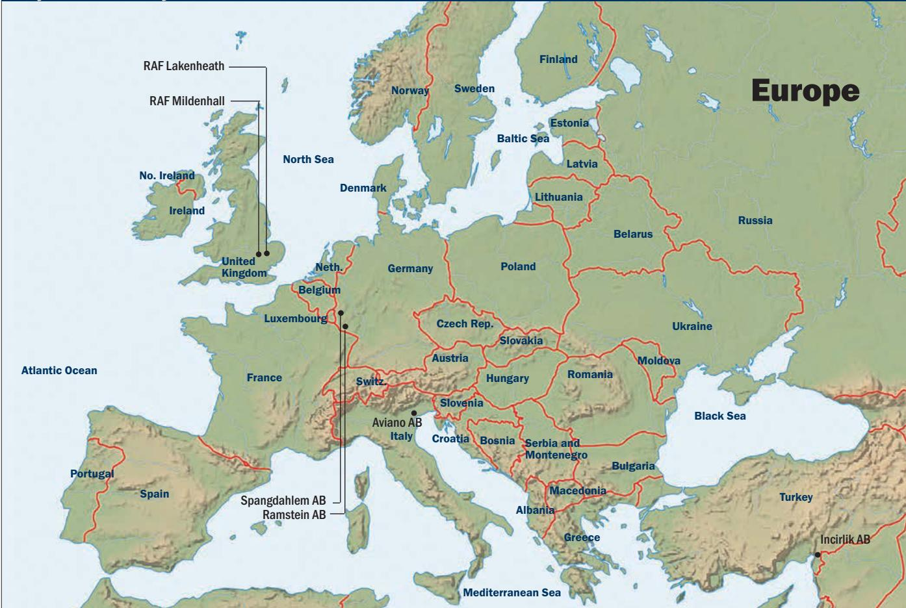  
All bases on this map are USAFE bases.

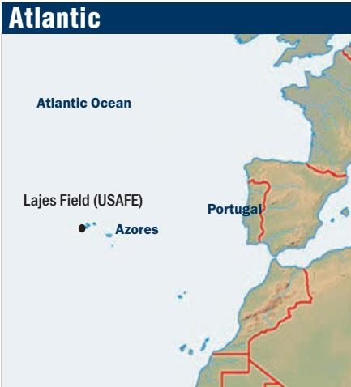

owning command: AMC. Unit/mission: 62nd AW (AMC), 446th AW (AFRC), air mobility operations; 627th ABG (AMC), support; Western Air Defense Sector (NORAD/ANG), warning and control. History: Fort Lewis established 1917; McChord Field activated July 3, 1940. Formed as joint base under Army lead 2010. Lewis named for Capt. Meriwether Lewis of Lewis and Clark Expedition (1804-05). McChord named for Col. William C. McChord, died in aircraft crash, Aug. 18, 1937.

JB McGuire-Dix-Lakehurst, N.J. 08641. Nearest city: Wrightstown. Phone: 609-754-1100. Owning command: AMC. Unit/mission: 87th ABW (AMC), support; 108th Wing (ANG), air mobility, bare base operations; 305th AMW (AMC), 514th AMW (AFRC), air mobility operations; 621st CRW (AMC), bare base operations; US Air Force Expeditionary Center (AMC), training. History: McGuire activated 1941 as Fort Dix AAB. Closed after WWII. Reopened as McGuire 1948. Dix activated 1917. Navy purchased Army’s Camp Kendrick in 1921 for airship station, renamed Lakehurst for city of Lakehurst, N.J. Formed as joint base under Air Force lead 2009. McGuire named for Maj. Thomas B. McGuire Jr., P-38 pilot, second leading US ace of WWII, MOH recipient, killed in action Jan. 7, 1945. Dix named for Maj. Gen. John Adams Dix, War of 1812 and Civil War veteran and US Senator.

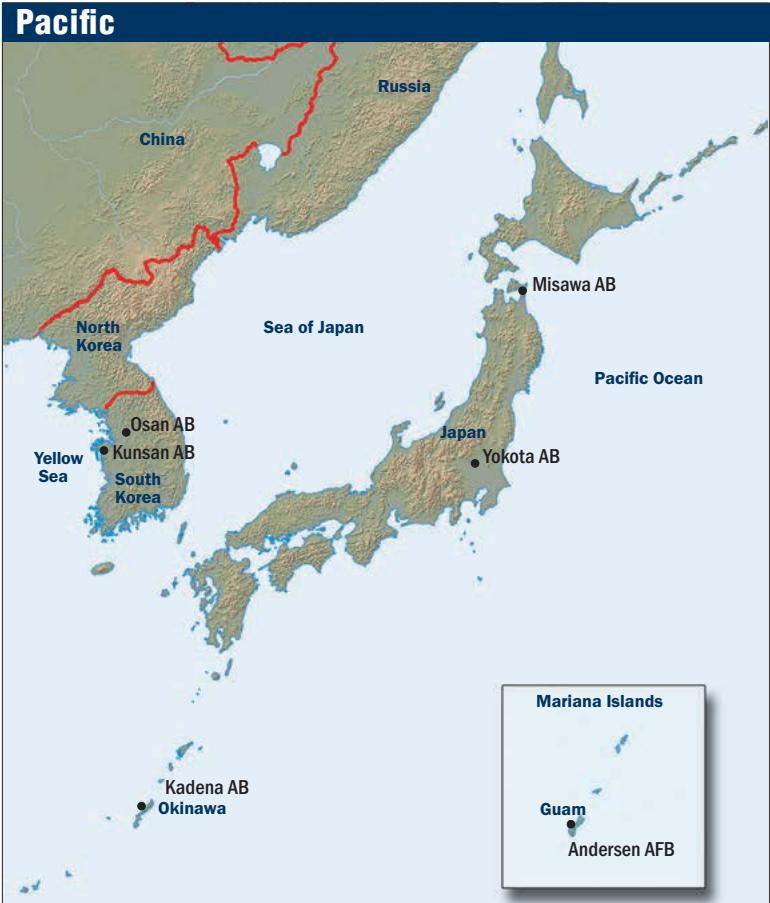  
All bases on this map are PACAF bases.

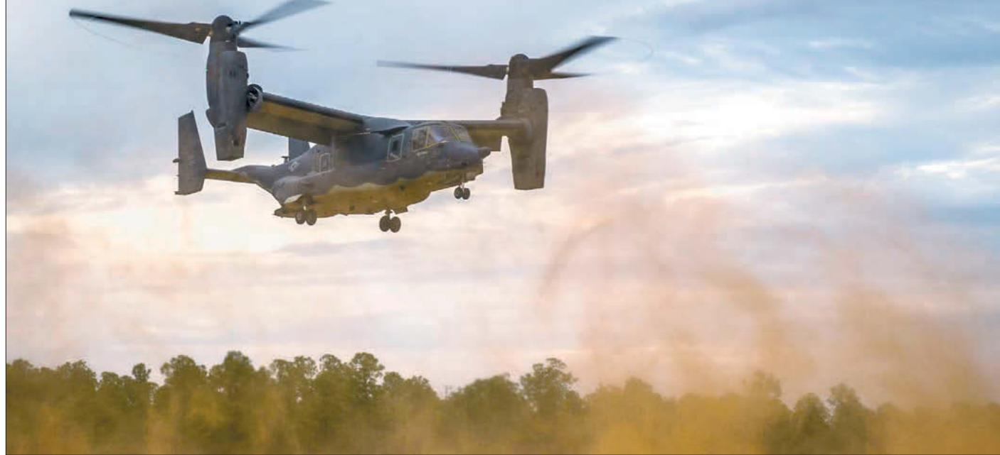  
Hurlburt Field, Fla.   
A1C Joseph Pick/USAF

JB Pearl Harbor-Hickam, Hawaii 96853. Nearest city: Honolulu. Phone: 808-449-7110. Hickam owning command: PACAF. Unit/mission: 15th Wing (PACAF), 154th Wing (ANG), air mobility, fighter operations; 515th AMOW (AMC); 613th AOC (PACAF), C2 operations; 624th RSG (AFRC), bare base operations; 647th ABG (PACAF), support; Hq. PACAF, management, operational leadership. History: Pearl Harbor established 1908. Hickam dedicated 1935. Activated 1938. Formed as joint base under Navy lead 2010. Hickam named for Lt. Col. Horace M. Hickam, aviation pioneer killed in crash in Texas Nov. 5, 1934.

JB San Antonio, Texas 78234. Nearest city: San Antonio. Phone: 210-221-1211. Major component: Fort Sam Houston, JBSA-Lackland, and JBSA-Randolph. Unit/mission: 502nd ABW (AETC), located at Fort Sam Houston, support. History: established 2009 to consolidate the installation management and support functions for the military facilities in San Antonio as part of 2005 base realignment and closure actions.

JBSA-Lackland, Texas 78236. Nearest city: San Antonio. Phone: 210-671-2908. Owning command: AETC. Unit/mission: 37th TRW (AETC), training; 59th MDW (AETC), ambulatory surgical, management, training; 67th CW (AFSPC), network defense operations; 149th FW (ANG), cyber, fighter operations; 433rd AW (AFRC), air mobility operations, C-5 FTU; 688th IOW (AFSPC), information operations, engineering infrastructure services; 802nd MSG (AETC), support; Air Force Civil Engineer Center (AFMC), engineering services; Air Force

Installation and Mission Support Center (AFMC), resourcing and combat support; Air Force Medical Operations Agency (USAF); Hq. 24th Air Force (AFSPC), operational leadership; Hq. 25th Air Force (ACC), operational leadership; Hq. Air Force Security Forces Center (AFMC), management. History: activated 1941 as part of Kelly Field. Designated independent installation July 1942 as San Antonio Aviation Cadet Center. Placed under Joint Base San Antonio installation management umbrella 2009. (See JBSA entry.) Named 1947 for Brig. Gen. Frank D. Lackland, early commandant of Kelly Field flying school, who died 1943. (Note: Several USAF agencies reside within Port San Antonio, the business development area created from the former Kelly AFB, but maintain JBSA-Lackland mailing addresses.)

JBSA-Randolph, Texas 78150. Nearest city: San Antonio. Phone: 210-652-1110. Owning command: AETC. Unit/mission: 12th FTW (AETC), training; 340th FTG (AFRC), training; 902nd MSG (AETC), support; Air Force Personnel Center (USAF), management; Air Force Recruiting Service (AETC), management; Hq. AETC, management. History: dedicated June 20, 1930. Placed under Joint Base San Antonio installation management umbrella 2009. (See JBSA) Named for Capt. William M. Randolph, died Feb. 17, 1928, on a training mission.

Kadena AB, Japan APO AP 96368. Nearest city: Naha. Phone: (commercial, from CONUS) 011-81-98-961-1110. Owning command: PACAF. Unit/mission: 18th Wing (PACAF), air mobility, fighter, ISR, personnel recovery operations; 82nd RS (ACC), reconnaissance; 353rd SOG (AFSOC), special operations; 390th IS (ACC), intelligence; 733rd AMS (AMC), air transportation services. History: occupied by US forces April 1945. Named for city of Kadena on island of Okinawa.

Keesler AFB, Miss. 39534. Nearest city: Biloxi. Phone: 228-377-1110. Owning command: AETC. Unit/mission: 81st TRW (AETC), training; 403rd Wing (AFRC), air mobility operations, weather reconnaissance; Hq. 2nd Air Force (AETC), operational leadership. History: activated June 12, 1941. Named for 2nd Lt. Samuel R. Keesler Jr., a native of Mississippi and WWI aerial observer killed in action Oct. 9, 1918.

Kirtland AFB, N.M. 87117. Nearest city: Albuquerque. Phone: 505-846-1110. Owning command: AFGSC. Unit/mission: 58th SOW (AETC), 150th SOW (ANG), special operations, CSAR training; 377th ABW (AFGSC), support, nuclear operations; Air Force Inspection Agency (USAF); 705th CTS-DMOC (ACC), virtual training; Air Force OT&E Center (USAF); AFNWC (AFMC), acquisition, sustainment; Air Force Safety Center (USAF), management; AFRL Directed Energy Directorate (AFMC), R&D; PEO-Strategic Systems (AFMC), acquisition; Space Development and Test Directorate (AFSPC), test; AFRL Space Vehicles Directorate (AFMC), R&D. History: activated January 1941. Named for Col. Roy C. Kirtland, aviation pioneer who died May 2, 1941.

Kunsan AB, South Korea APO AP 96264. Nearest city: Gunsan City. Phone: 011-82-63- 470-1110. Owning command: PACAF. Unit/ mission: 8th FW (PACAF), fighter operations. History: built by the Japanese in 1938. US operations began in April 1951.

Lajes Field, Azores, Portugal APO AE 09720. Nearest city: Praia de Vitoria. Phone: 011- 351-295-57-6161. Owning command: USAFE. Unit/mission: 65th ABG, support; 729th AMS (AMC), air transportation services. History: US operations began 1943.

Laughlin AFB, Texas 78843. Nearest city: Del Rio. Phone: 830-298-3511. Owning command: AETC. Unit/mission: 47th FTW (AETC), training. History: activated July 1942. Named for 1st Lt. Jack Thomas Laughlin, Del Rio native, B-17 pilot, killed Jan. 29, 1942.

Little Rock AFB, Ark. 72099. Nearest city: Jacksonville. Phone: 501-987-1110. Owning command: AMC. Unit/mission: 19th AW (AMC), air mobility operations; 913th AG (AFRC), 189th AW (ANG), air mobility operations, training; 314th AW (AETC), training. History: base opened Oct. 9, 1955.

Los Angeles AFB, Calif. 90245. Nearest city: El Segundo. Phone: 310-653-1110. Owning command: AFSPC. Unit/mission: 61st ABG (AFSPC), support; Hq. Space and Missile Systems Center (AFSPC), acquisition, R&D. History: designated Los Angeles AFS April 30, 1964. Redesignated Los Angeles AFB

Sept. 15, 1987. SMC, activated July 1, 1992, dates from Air Research and Development Command’s Western Development Division, activated July 1, 1954.

Luke AFB, Ariz. 85309. Nearest city: Phoenix. Phone: 623-856-6011. Owning command: AETC. Unit/mission: 56th FW (AETC), training, Barry M. Goldwater Range operations; 944th FW (AFRC), training. History: activated 1941. Named for 2nd Lt. Frank Luke Jr., observation balloon-busting ace of WWI and first aviator to receive MOH, killed in action Sept. 29, 1918.

Minot AFB, N.D. 58705. Nearest city: Minot. Phone: 701-723-1110. Owning command: AFGSC. Unit/mission: 5th BW (AFGSC), bomber operations; 91st MW (AFGSC), ICBM operations. History: activated January 1957. Named after city of Minot, whose citizens donated $\$ 50,000$ toward purchase of the land.

Misawa AB, Japan, APO AP 96319. Nearest city: Misawa. Phone: 011-81-176-53-5181, ext. 226-3075. Owning command: PACAF. Unit/ mission: 35th FW (PACAF), fighter operations. History: occupied by US forces September 1945.

fighting in July 1950 between US and North Korean forces.

Patrick AFB, Fla. 32925. Nearest city: Cocoa Beach. Phone: 321-494-1110. Owning command: AFSPC. Unit/mission: 45th SW (AFSPC), space launch operations; 114th SPCS (ANG), launch range support; 920th RQW (AFRC), personnel recovery operations; Air Force Technical Applications Center (ACC), nuclear monitoring. History: activated 1940. Named for Maj. Gen. Mason M. Patrick, Chief of American Expeditionary Forces’ Air Service in WWI and Chief of Air Service/Air Corps, 1921-27.

MacDill AFB, Fla. 33621. Nearest city: Tampa. Phone: 813-828-1110. Owning command: AMC. Unit/mission: 6th AMW (AMC), 927th ARW (AFRC), air mobility operations; Hq. CENTCOM, operational leadership; Hq. SOCOM, operational leadership; Hq. Joint Communications Support Element, C4 operations, management; Joint Special Operations University (SOCOM), education. History: activated April 15, 1941. Named for Col. Leslie MacDill, killed in aircraft accident Nov. 8, 1938.

Malmstrom AFB, Mont. 59402. Nearest city: Great Falls. Phone: 406-731-1110. Owning command: AFGSC. Unit/mission: 341st MW (AFGSC), ICBM operations; 819th RED HORSE (ACC/ANG), bare base operations. History: activated Dec. 15, 1942. Named for Col. Einar A. Malmstrom, WWII fighter commander killed in air accident Aug. 21, 1954.

Maxwell AFB, Ala. 36112. Nearest city: Montgomery. Phone: 334-953-1110. Owning command: AETC. Unit/mission: 42nd ABW (AETC), support; 908th AW (AFRC), air mobility operations; Air Force Historical Research Agency (USAF), historical documentation, research; Air University (AETC); Hq. Civil Air Patrol (USAF), management; Hq. Air Force Judge Advocate General Corps (USAF), management; PEO-Business and Enterprise Systems (AFMC), acquisition. History: activated 1918 at the site of the Wright brothers’ flight school. Named for 2nd Lt. William C. Maxwell, killed in air accident Aug. 12, 1920.

Moody AFB, Ga. 31699. Nearest city: Valdosta. Phone: 229-257-1110. Owning command: ACC. Unit/mission: 23rd Wing (ACC), fighter, personnel recovery operations; 81st FS (AETC); 93rd AGOW (ACC), battlefield airmen operations, expeditionary force protection, support; 476th FG (AFRC), fighter operations. History: activated June 1941. Named for Maj. George P. Moody, killed May 5, 1941.

Mountain Home AFB, Idaho 83648. Nearest city: Mountain Home. Phone: 208-828-2111. Owning command: ACC. Unit/mission: 366th FW (ACC), fighter operations, range management. History: activated August 1943 as B-24 training base. Inactivated October 1945. Reactivated December 1948. Inactivated April 1950. Reactivated 1951.

Nellis AFB, Nev. 89191. Nearest city: Las Vegas. Phone: 702-652-1110. Owning command: ACC. Unit/mission: 57th Wing (ACC), combat training; 99th ABW (ACC), support; 820th RED HORSE (ACC), bare base operations; 926th Wing (AFRC), associate missions at Creech, Eglin, Hurlburt, Nellis, Schriever; USAF Warfare Center (ACC), operational testing, tactics development, training; Nevada Test and Training Range (ACC), range management, operations. History: activated July 1941 as Las Vegas AAF with Army Air Corps Flexible Gunnery School. Closed 1947. Reopened 1948. Named for 1st Lt. William H. Nellis, WWII P-47 fighter pilot, killed Dec. 27, 1944.

Peterson AFB, Colo. 80914. Nearest city: Colorado Springs. Phone: 719-556-7321. Owning command: AFSPC. Unit/mission: 21st SW (AFSPC), missile warning, space operations, support; 52nd AS (AMC) (active associate), 200th AS (ANG), air mobility operations; 302nd AW (AFRC), air mobility, MAFFS operations; Hq. AFSPC, management; Hq. NORAD, Hq. NORTHCOM, operational leadership. History: activated 1942. Named for 1st Lt. Edward J. Peterson, killed Aug. 8, 1942.

Pope Field, N.C. 28308. Nearest city: Fayetteville. Phone: 910-394-1110. Unit/mission: 18th ASOG (ACC), combat weather, TACP operations; 21st STS, 24th STS (AFSOC), special tactics operations; 43rd AG (AMC), air mobility operations; USAF Combat Control School (AFSOC), training. History: activated 1919. Under 2005 base realignment and closure, Pope AFB became Pope Field, part of Fort Bragg, March 1, 2011. Named for 1st Lt. Harley H. Pope, WWI pilot, killed Jan. 7, 1919.

RAF Lakenheath, UK APO AE 09461. Nearest city: Cambridge. Phone: 011-44-1638-52-1110.

Owning command: USAFE. Unit/mission: 48th FW (USAFE), fighter, personnel recovery operations. History: began as Royal Air Force decoy field in 1930s. Activated as RAF airfield November 1941. USAF bombers arrived August 1948. USAF took administrative control May 1951. Named after nearby village.

McConnell AFB, Kan. 67221. Nearest city: Wichita. Phone: 316-759-6100. Owning command: AMC. Unit/mission: 22nd ARW (AMC), air mobility operations; 184th IW (ANG), cyber, DCGS, space C2, TACP operations; 931st ARG (AFRC), air mobility operations. History: activated June 5, 1951. Named for three Wichita natives, the McConnell brothers—Lt. Col. Edwin M. (died Sept. 1, 1997), Capt. Fred J. (died in a private airplane crash Oct. 22, 1945), and 2nd Lt. Thomas L. (killed July 10, 1943)—all WWII B-24 pilots.

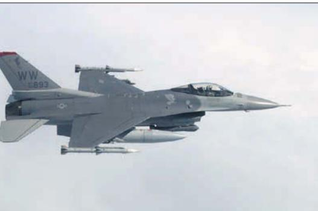  
Misawa AB, Japan Jim Haseltine

Offutt AFB, Neb. 68113. Nearest city: Bellevue. Phone: 402-294-1110. Owning command: ACC. Unit/mission: 55th Wing (ACC), 595th C2 Group (ACC), 170th Group (ANG), operations (C2, electronic attack, ISR), support, training; 577th Weather Wing (ACC), management; Hq. STRATCOM, operational leadership. History: activated 1896 as Army’s Fort Crook. Used for airships from 1918 and aircraft cross-country stop from 1921. Landing field named May 10, 1924, for 1st Lt. Jarvis J. Offutt, WWI pilot who died Aug. 13, 1918. Served as bomber production facility January 1942 to September 1945. Redesignated Offutt Field June 1946. Redesignated Offutt AFB with Jan. 13, 1948, transfer to USAF.

Osan AB, South Korea APO AP 96278. Nearest city: Seoul. Phone: 011-82-505-784-1110. Owning command: PACAF. Unit/mission: 5th RS (ACC), reconnaissance operations; 51st FW (PACAF), fighter operations; 694th ISRG (ACC), DCGS operations; 731st AMS (AMC), air transportation services; Hq. 7th Air Force (PACAF), operational leadership. History: originally designated K-55. Runway opened December 1952. Renamed Osan AB 1956 for nearby town that was the scene of first

RAF Mildenhall, UK APO AE 09459. Nearest city: Cambridge. Phone: 011-44-1638-54-1110. Owning command: USAFE. Unit/mission: 95th RS (ACC), reconnaissance operations; 100th ARW (USAFE), air mobility operations; 352nd SOW (AFSOC), special operations; 488th IS (ACC), intelligence operations; 727th AMS (AMC), air transportation services. History: activated as RAF bomber base October 1934. Named after nearby town. US bomber operations began July 1950. Strategic Air Command had control from October 1951 to September 1959, when USAFE took over.

Ramstein AB, Germany APO AE 09094. Nearest city: Ramstein. Phone: 011-49-6371-47-1110. Owning command: USAFE. Unit/mission: 86th AW (USAFE), air mobility operations, support (including Kaiserslautern Military Community); 435th AGOW (USAFE), bare base, combat communications, combat weather, TACP operations; 521st AMOW (AMC), air transportation services; 603rd AOC (USAFE), C2 operations; Hq. 3rd AF (USAFE), operational leadership; Hq. USAFE, management, operational leadership. History: originally Landstuhl AB, activated August 1952. Reactivated December 1957 as Ramstein-Landstuhl AB; later redesignated Ramstein AB.

Robins AFB, Ga. 31098. Nearest city: Warner Robins. Phone: 478-926-1110. Owning command: AFMC. Unit/mission: 78th ABW (AFMC), support; 94th APS (AFRC), aerial port operations; 116th ACW (ANG), 461st ACW (ACC), C2 operations; 638th SCMG (AFMC), systems life cycle support; 5th CCG (ACC), combat communications operations; Hq. AFRC, management; Warner Robins ALC (AFMC), weapons maintenance, repair. History: activated March 1942. Named for Brig. Gen. Augustine Warner Robins, an early chief of the Air Corps’ Materiel Division, who died June 16, 1940.

Schriever AFB, Colo. 80912. Nearest city: Colorado Springs. Phone: 719-567-1110. Owning command: AFSPC. Unit/mission: 50th SW (AFSPC), 310th SW (AFRC), space operations; US Air Force Warfare Center-Space (ACC/AFSPC), R&D. History: activated as Falcon AFS Sept. 26, 1985. Redesignated AFB June 13, 1988. Renamed for Gen. Bernard A. Schriever June 5, 1998.

Scott AFB, Ill. 62225. Nearest city: Belleville. Phone: 618-256-1110. Owning command: AMC. Unit/mission: 126th ARW (ANG), 375th AMW (AMC), air mobility operations; 618th AOC (TACC) (AMC), planning/directing worldwide air mobility operations; 635th SCOW (AFMC), global logistics support; 932nd AW (AFRC), air mobility operations; Air Force Network Integration Center (AFSPC), network integration, engineering, simulation; Hq. 18th Air Force (AMC), operational leadership; Hq. AMC, management; Hq. TRANSCOM, operational leadership. History: activated June 14, 1917. Named for Cpl. Frank S. Scott, first enlisted man to die in an aircraft accident, Sept. 28, 1912.

Seymour Johnson AFB, N.C. 27531. Nearest city: Goldsboro. Phone: 919-722-1110. Owning command: ACC. Unit/mission: 4th FW (ACC), 414th FG (AFRC), fighter operations; 567th RED HORSE (ACC), bare base operations; 916th ARW (AFRC), air mobility operations. History: activated Sept. 12, 1942. Named for Navy Lt. Seymour A. Johnson, Goldsboro native, killed March 5, 1941.

Shaw AFB, S.C. 29152. Nearest city: Sumter. Phone: 803-895-1110. Owning command: ACC. Unit/mission: 20th FW (ACC), fighter operations; Hq. 9th Air Force (ACC), management (Hq. Air Forces Central in Southwest Asia, operational leadership). History: activated Aug. 30, 1941. Named for 1st Lt. Ervin D. Shaw, one of the first Americans to see air action in WWI, killed in France July 9, 1918.

Sheppard AFB, Texas 76311. Nearest city: Wichita Falls. Phone: 940-676-1110. Owning command: AETC. Unit/mission: 80th FTW (AETC), Euro-NATO Joint Jet Pilot Training program; 82nd TRW (AETC), training. History: activated June 14, 1941. Named for US Sen. Morris E. Sheppard, who died April 9, 1941.

Spangdahlem AB, Germany APO AE 09126. Nearest city: Bitburg. Phone: 011-49-6565- 61-1110. Owning command: USAFE. Unit/ mission: 52nd FW (USAFE), fighter operations; 726th AMS (AMC), air transportation services. History: built by French 1951 and turned over to US 1952. Named after nearby town.

Thule AB, Greenland APO AE 09074. Nearest city: Qaanaaq. Phone: (through Cheyenne Mountain AFS operator) 719-474-3840. Owning command: AFSPC. Unit/mission: 12th SWS (AFSPC), missile warning; 821st ABG (AFSPC), support. History: dates from 1946 as a Danish-American radio and weather station. USAF Ballistic Missile Early Warning System radar began operations 1961.

Tinker AFB, Okla. 73145. Nearest city: Oklahoma City. Phone: 405-739-2026. Owning command: AFMC. Unit/mission: 72nd ABW (AFMC), support; 137th ARW (ANG), air mobility, cyber, TACP operations; 448th SCMW (AFMC), supply chain management; 507th ARW (AFRC), air mobility operations; 513th ACG (AFRC), 552nd ACW (ACC), C2 operations; Hq. Air Force Sustainment Center (AFMC), weapon systems sustainment; Oklahoma City ALC (AFMC), weapon systems maintenance, repair, overhaul. History: activated March 1942. Named for Maj. Gen. Clarence L. Tinker, who went down at sea June 7, 1942, leading a group of LB-30 bombers against Japan.

Travis AFB, Calif. 94535. Nearest city: Fairfield. Phone: 707-424-1110. Owning command: AMC. Unit/mission: 60th AMW (AMC), 349th AMW (AFRC), air mobility operations; David Grant USAF Medical Center. History: activated May 17, 1943. Named for Brig. Gen. Robert F. Travis, killed Aug. 5, 1950.

Tyndall AFB, Fla. 32403. Nearest city: Panama City. Phone: 850-283-1113. Owning command: ACC. Unit/mission: 53rd WEG (ACC), T&E; 101st AOG (ANG), C2 operations; 325th FW (ACC), 325th FW associate unit (ANG), training; 601st AOC (ACC/ANG), plan/direct air operations; Air Force Rescue Coordination Center (ACC), plan/direct inland rescue operations; Hq. Continental US NORAD Region (NORAD)/1st Air Force (Air Forces Northern) (ACC/ANG), operational leadership. History: activated Dec. 7, 1941. Named for 1st Lt. Frank B. Tyndall, WWI fighter pilot killed July 15, 1930.

US Air Force Academy, Colo. 80840. Nearest city: Colorado Springs. Phone: 719-333-1110. Owning command: USAF. Unit/mission: 10th ABW (Air Force Academy), support; 306th FTG (AETC), training; Air Force Academy (USAF), education. History: established April 1, 1954, at Lowry AFB, Colo. Moved to permanent location in Colorado Springs August 1958.

Vance AFB, Okla. 73705. Nearest city: Enid. Phone: 580-213-5000. Owning command: AETC. Unit/mission: 71st FTW (AETC), training. History: activated November 1941. Named for Lt. Col. Leon R. Vance Jr., Enid native, 1939 West Point graduate, and MOH recipient, killed July 26, 1944.

Vandenberg AFB, Calif. 93437. Nearest city: Lompoc. Phone: 805-606-1110. Owning command: AFSPC. Unit/mission: 30th SW (AFSPC), space and launch range operations, host unit; 381st TRG (AETC), training; 576th FLTS (AFSPC), test; 21st SOPS (AFSPC), space operations; Hq. 14th Air Force (AFSPC), operational leadership; Joint Space Operations Center (STRATCOM), space C2 operations. History: originally Army’s Camp Cooke; activated October 1941. Reassigned to USAF June 7, 1957. Renamed for Gen. Hoyt S. Vandenberg, USAF’s second Chief of Staff.

Whiteman AFB, Mo. 65305. Nearest city: Knob Noster. Phone: 660-687-1110. Owning command: AFGSC. Unit/mission: 72nd Test and Evaluation Squadron (AFGSC), T&E; 131st BW (ANG), bomber operations; 325th WPS (ACC), tactics training; 442nd FW (AFRC), fighter operations; 509th BW (AFGSC), bomber operations. History: activated 1942. Named for 2nd Lt. George A. Whiteman, first pilot to die in aerial combat during the attack on Pearl Harbor.

Wright-Patterson AFB, Ohio 45433. Nearest city: Dayton. Phone: 937-257-1110. Owning command: AFMC. Unit/mission: 88th ABW (AFMC), support; 445th AW (AFRC), air mobility operations; 591st SCMG (AFMC), systems life cycle support; Air Force Institute of Technology (AETC), education; PEO-Agile Combat Support, PEO-Fighters and Bombers, PEO-ISR and SOF, PEO-Mobility, PEO-Tanker (AFMC), acquisition; Hq. Air Force Life Cycle Management Center (AFMC), acquisition and development; Hq. AFMC, management; Hq. AFRL (AFMC), R&D; National Air and Space Intelligence Center (USAF), foreign aerospace analysis; National Museum of the US Air Force (AFMC); Wright-Patterson Medical Center (AFMC). History: originally separate, Wright Field and Patterson Field were merged and redesignated Wright-Patterson AFB Jan. 13, 1948. Named for aviation pioneers Orville and Wilbur Wright and for 1st Lt. Frank S. Patterson, killed June 19, 1918.

Yokota AB, Japan, APO AP 96328. Nearest city: Tokyo. Phone: 011-81-311-755-1110. Owning command: PACAF. Unit/mission: 374th AW (PACAF), air mobility, personnel recovery operations; 515th AMOG (AMC), air transportation services; Hq. 5th Air Force (PACAF), Hq. US Forces Japan (PACOM), operational leadership. History: opened as Tama AAF by Japan 1939. Turned over to US forces and renamed Yokota AB Sept. 6, 1945.

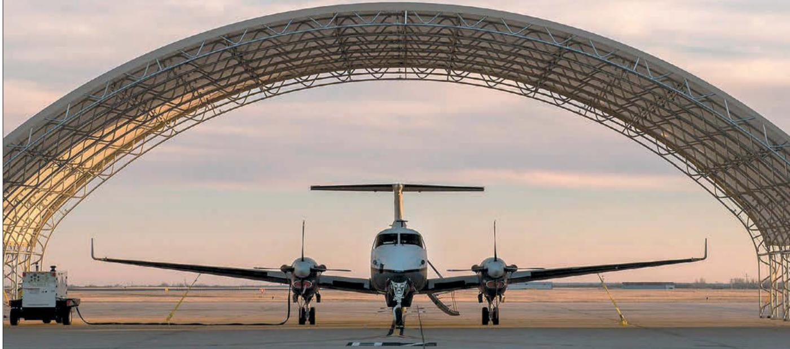

Will Rogers ANGB, Okla.

# ANG and AFRC Installations

This section consolidates Air National Guard and Air Force Reserve Command facilities, listing them by base names or according to the airport facilities they share. Some ANG and AFRC units are located on USAF bases and are included under those bases in the Active Duty Installations section. In addition, some Air Force Reserve Individual Mobilization Augmentees serve with various USAF and DOD commands and agencies.

Abraham Lincoln Capital Arpt., Ill. 62707. Nearest city: Springfield. Phone: 217-757-1219. Component: ANG. Unit/mission: 183rd Wing, CIRF; 183rd AOG, C2, cyber operations.

Allen C. Thompson Field/Jackson-Evers Arpt., Miss. 39232. Nearest city: Jackson. Phone: 601-405-8300. Component: ANG. Unit/mission: 172nd AW, 183rd AS, 183rd Aeromedical Evacuation Squadron, air mobility operations.

Alpena County Regional Arpt., Mich. 49707. Nearest city: Alpena. Phone: 989-354-6210. Component: ANG. Unit/mission: Alpena Combat Readiness Training Center.

Atlantic City Arpt., N.J. 08234. Nearest city: Egg Harbor Township. Phone: 609-645-6000. Component: ANG. Unit/mission: 177th FW, fighter, TACP operations.

Bangor Arpt., Maine 04401. Nearest city: Bangor. Phone: 866-359-2264. Component: ANG. Unit/mission: 101st ARW, air mobility, combat communications, cyber operations.

Barnes Arpt., Mass. 01085. Nearest city: Westfield. Phone: 413-568-9151. Component: ANG. Unit/mission: 104th FW, fighter operations.

Berry Field ANGB/Nashville Arpt., Tenn. 37217. Nearest city: Nashville. Phone: 615-660-8062. Component: ANG. Unit/mission: 118th Wing, cyber, RPA operations.

Birmingham-Shuttlesworth Arpt., Ala. 35217. Nearest city: Birmingham. Phone: 205-714- 2000. Component: ANG. Unit/mission: 99th ARS (AMC) (active associate), air mobility operations; 117th ARW, air mobility, intelligence operations.

Boise Air Terminal (Gowen Field), Idaho 83705. Nearest city: Boise. Phone: 208-422-5322. Component: ANG. Unit/mission: 124th FW, fighter, cyber, TACP operations. History: named for Lt. Paul R. Gowen, killed in B-10 crash in Panama July 11, 1938.

Bradley ANGB, Conn. 06026. Nearest cities: Hartford, Conn., and Springfield, Mass. Phone: 860-292-2310. Component: ANG. Unit/mission: 103rd AW, air mobility operations. History: named for Lt. Eugene M. Bradley, killed in P-40 crash August 1941.

Burlington Arpt., Vt. 05403. Nearest city: Burlington. Phone: 802-660-5215. Component: ANG. Unit/mission: 158th FW, fighter operations; 229th IOS, cyber training.

Channel Islands ANGS, Calif. 93041. Nearest city: Oxnard. Phone: 805-986-8000. Component: ANG. Unit/mission: 146th AW, air mobility, MAFFS operations.

Charlotte/Douglas Arpt., N.C. 28208. Nearest city: Charlotte. Phone: 704-391-4100. Component: ANG. Unit/mission: 145th AW, aeromedical evacuation, air mobility, combat communications, MAFFS, TACP operations.

Cheyenne Arpt., Wyo. 82009. Nearest city: Cheyenne. Phone: 307-772-6110. Component: ANG. Unit/mission: 153rd AW, air mobility, MAFFS operations.

Des Moines Arpt., Iowa 50321. Nearest city: Des Moines. Phone: 800-257-1693, ext. 210. Component: ANG. Unit/mission: 132nd Wing, DTOC and RPA, cyber, and ISR operations.

Dobbins ARB, Ga. 30069. Nearest city: Atlanta. Phone: 678-655-5000. Component: AFRC. Unit/mission: 94th AW, aeromedical evacuation, air mobility operations; Hq. 22nd Air Force, operational leadership. History: activated 1943. Named for Capt. Charles Dobbins, pilot killed in WWII.

Duke Field, Fla. 32542. Nearest city: Crestview.   
Phone: 850-883-6347. Component: AFRC.   
Unit/mission: 919th SOW, special operations.

History: named for Lt. Robert L. Duke, pilot killed Dec. 29, 1943, in test flight.

Duluth Arpt., Minn. 55811. Nearest city: Duluth. Phone: 218-788-7210. Component: ANG. Unit/ mission: 148th FW, EOD, fighter operations.

Eastern West Virginia Arpt. (Shepherd Field), W.Va. 25405. Nearest city: Martinsburg. Phone: 304-616-5100. Component: ANG. Unit/mission: 167th AW, air mobility operations.

Ellington Field, Texas 77034. Nearest city: Houston. Phone: 281-929-2337. Component: ANG. Unit/mission: 147th RW, ISR, RPA, TACP operations. History: named for Lt. Eric L. Ellington, pilot killed November 1913.

Forbes Field, Kan. 66619. Nearest city: Topeka. Phone: 785-862-1234. Component: ANG. Unit/mission: 190th ARW, air mobility, combat weather operations. History: named for Maj. Daniel H. Forbes Jr., pilot killed June 5, 1948, test-flying Northrop YB-49 “Flying Wing.”

Fort Smith Arpt., Ark. 72903. Nearest city: Fort Smith. Phone: 479-573-5100. Component: ANG. Unit/mission: 188th Wing, RPA, ISR.

Fort Wayne Arpt., Ind. 46809. Nearest city: Fort Wayne. Phone: 260-478-3210. Component: ANG. Unit/mission: 122nd FW, fighter operations.

Francis S. Gabreski Arpt., N.Y. 11978. Nearest city: Westhampton Beach. Phone: 631-723- 7400. Component: ANG. Unit/mission: 106th RQW, personnel recovery operations. History: named for Col. Francis S. Gabreski, WWII and Korean War ace.

Fresno Yosemite Arpt., Calif. 93727. Nearest city: Fresno. Phone: 559-454-5100. Component: ANG. Unit/mission: 144th FW, fighter, ISR operations.

General Mitchell Arpt., Wis. 53207. Nearest city: Milwaukee. Phone: 414-944-8410. Component: ANG. Unit/mission: 128th ARW, air mobility operations. History: named for Brig. Gen. William “Billy” Mitchell.

<table><tr><td colspan="2">PortlandArpt.(ANG/AFRC)</td><td colspan="2">Wash. Wyo.</td><td colspan="2">Great Falls Arpt. (ANG)</td><td></td><td colspan="2">a</td><td colspan="2">Burlington Arpt.(ANG)</td></tr><tr><td colspan="2">KlamathFallsArpt. (ANG)</td><td colspan="2">Mont. ldaho</td><td>N.D. HectorArpt.(ANG)</td><td colspan="2">Diuluth Arpt.(ANG) Minn. Wis.</td><td colspan="3">Alpena CountyArpt.(ANG) Schenectady County</td></tr><tr><td colspan="2">Fresno Yosemite Arpt.</td><td colspan="2">BoiseAir Terminal(ANG)</td><td>s.D. Joe Foss Field (ANG) ●</td><td colspan="2">Minn.-St. Paul Arpt. (AFRC) Truax and Volk Arpt.(ANG) Fields (ANG)</td><td colspan="3">Hancock Field(ANG) General Mitchell Niagara Falls Arpt. Mich. Selfrige ANGB (ANG)</td></tr><tr><td colspan="2">(ANG) Moffett Field (ANG)•</td><td colspan="2">Salt Lake City Apt.(ANG) Cheyenne Arpt.(ANG) Reno/TahoeArpt.(ANG)</td><td>Sioux GatewayArpts (ANG) Neb.</td><td colspan="2">W.K. Kellogg Arpt.(ANG) Toledo ExpressArpt. (ANG) lowa</td><td colspan="3">Stewart ANGB (ANG). Youngstown ARS Gabreski Arpt.(ANG) (AFRC) Pa</td></tr><tr><td colspan="2">Calif</td><td colspan="2">Utah Greeley ANGS</td><td>Des MoinesArpt. (ANG)• Lincoln Arpt.(ANG) • Rosecrans Memorial•</td><td colspan="2">GreaterPeoria Arpt. (ANG) Ⅲ. Abraham LincolnHulmanField (ANG)</td><td colspan="3">PittsburghArpt. (ANG)。Rickenbacker(AFRC) Del. aEastern:Ma-Arpt GrisSom ARB (AFRC) ANGB (ANG)1</td></tr><tr><td colspan="2"></td><td colspan="2">Colo.</td><td>Arpt.(ANG) Kan. Arpt. (ANG) Forbes Field (ANG) Mo.</td><td colspan="2">Capital Arpt. (ANG) Lambert-st.Louis Louisville Arpt.(ANG)</td><td colspan="3">W.Va. Va. YeagerArpt.(ANG) Ky.</td></tr><tr><td colspan="2">Channel Islands ANGS (ANG) GoldwaterANGB</td><td colspan="2">Ariz. (ANG)· N.M.</td><td>Tulsa Arpt. (ANG) Okla. Fort Smith (ANG)</td><td colspan="2">Memphis Arpt.(ANG) Dobbins ARB(AFRe)</td><td colspan="3">Beny Field ANGB/ NashwileArpt. (ANG)• McGhee/yson Arpt. (ANG) N.C. Tenn.</td></tr><tr><td colspan="2">March ARB (ANG/AFRC) Tucson Arpt (ANG)-</td><td colspan="7">Will Rogers ANGB (ANG) Texas Hensley Field (ANG)</td></tr><tr><td colspan="2">NAS JRB New Orleans (ANG) Ellington Field (ANG) 6 Duke Field (AFRC)</td><td colspan="7">·Birmingham-Shuttles Allen C. Thompson Field Miss. Ala. worthArpt.(ANG) Jackson Evers Arpt.(AN②) savannah Hilton Head Arpt. Montgomery Arpt. Ga. NASJRBFort WOrth(AFC/ANA) (ANG) (ANG) La. Gulfport-BiloxiArpt (ANG)。</td></tr></table>

Goldwater ANGB, Ariz. 85034. Nearest city: Phoenix. Phone: 602-302-9000. Component: ANG. Unit/mission: 161st ARW, air mobility operations.

Greater Peoria Arpt., Ill. 61607. Nearest city: Peoria. Phone: 800-942-3771. Component: ANG. Unit/mission: 182nd AW, air mobility, combat communications, TACP operations.

Great Falls Arpt., Mont. 59404. Nearest city: Great Falls. Phone: 406-791-0159. Component: ANG. Unit/mission: 120th AW, air mobility operations, RED HORSE.

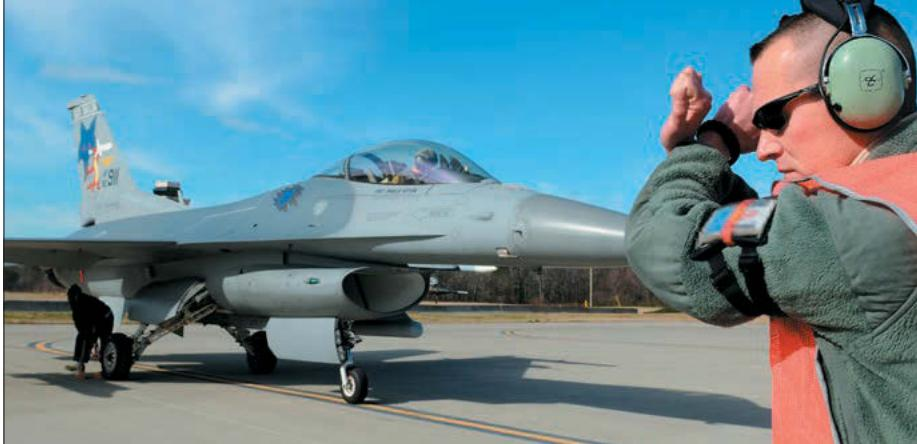

# McEntire JNGB, S.C.

Greeley ANGS, Colo. 80631. Nearest city: Greeley. Phone: 720-259-5001. Component: ANG. Unit/mission: 137th SWS, mobile missile warning. History: activated January 1996.

SrA. Ashleigh S. Pavelek/ANG

Grissom ARB, Ind. 46971. Nearest city: Kokomo. Phone: 765-688-5211. Component: AFRC. Unit/mission: 434th ARW, air refueling operations. History: activated 1942 as NAS Bunker Hill. Reactivated June 1954 as Bunker Hill AFB. Renamed May 1968 for Lt. Col. Virgil I. “Gus” Grissom, killed Jan. 27, 1967, in Apollo capsule fire. Realigned as AFRC base Oct. 1, 1994. Home to Air Force Reserve, Army Reserve, and Marine Corps Reserve units.

Gulfport-Biloxi Arpt., Miss. 39507. Nearest city: Gulfport. Phone: 228-214-6002. Component: ANG. Unit/mission: Trent Lott Combat Readiness Training Center.

Hancock Field, N.Y. 13211. Nearest city: Syracuse. Phone: 1-800-982-3696. Component: ANG. Unit/mission: 174th ATKW, ISR, RPA, space C2, TACP operations; ISR, RPA training.

Harrisburg Arpt., Pa. 17057. Nearest city: Middletown. Phone: 717-948-2231. Component: ANG. Unit/mission: 193rd SOW, C2, combat communications, cyber, special, TACP operations.

Hector Arpt., N.D. 58102. Nearest city: Fargo. Phone: 701-451-2110. Component: ANG. Unit/ mission: 119th Wing, RPA operations.

Hensley Field AGS, Texas 75211. Nearest city: Dallas. Phone: 972-619-4444. Component: ANG. Unit/mission: 254th CCG, combat communications.

Homestead ARB, Fla. 33039. Nearest city: Homestead. Phone: 786-415-7000. Component: AFRC. Unit/mission: 20th Operations Group Det. 2 (ACC) (active associate), 125th FW Det. 1 (ANG), 482nd FW (AFRC), fighter operations.

Hulman Field, Ind. 47803. Nearest city: Terre Haute. Phone: 812-877-5311. Component: ANG. Unit/mission: 181st IW, DCGS, TACP operations.

Jacksonville Arpt., Fla. 32218. Nearest city: Jacksonville. Phone: 904-741-7100. Component: ANG. Unit/mission: 125th FW, fighter, ISR operations.

Joe Foss Field, S.D. 57104. Nearest city: Sioux Falls. Phone: 605-988-5700. Component: ANG. Unit/mission: 114th FW, fighter operations. History: named for ANG Brig. Gen. Joseph J. Foss, WWII USMC ace and MOH recipient, former governor, former Air Force Association national president and board chairman, and founder of the South Dakota ANG.

Key Field, Miss. 39307. Nearest city: Meridian. Phone: 601-484-9000. Component: ANG. Unit/ mission: 186th ARW, air mobility, C2, ISR, TACP operations. History: named after Fred and Al Key, air-to-air refueling pioneers and 1935 flight endurance record holders for 27 days aloft in Ole Miss, on permanent display at the National Air and Space Museum.

Klamath Falls Arpt./Kingsley Field, Ore. 97603. Nearest city: Klamath Falls. Phone: 800-864- 6264. Component: ANG. Unit/mission: 173rd FW (active associate), training. History: named for 2nd Lt. David R. Kingsley, MOH recipient, killed June 23, 1944, on Ploesti, Romania, oil field bombing mission.

Lambert-St. Louis Arpt., Mo. 63044. Nearest city: St. Louis. Phone: 314-527-7000. Component: ANG. Unit/mission: 131st MSG, support; Jefferson Barracks: 157th AOG, C2 operations; 239th CBCS, combat communications.

Lincoln Arpt., Neb. 68524. Nearest city: Lincoln. Phone: 402-458-1234. Component: ANG. Unit/mission: 155th ARW, air mobility operations.

Louisville Arpt./AGS (Standiford Field), Ky. 40213. Nearest city: Louisville. Phone: 502- 413-4400. Component: ANG. Unit/mission: 123rd AW, air mobility, bare base, special tactics operations.

Luis Muñoz Marin Arpt., Puerto Rico 00979. Nearest city: San Juan. Phone: 787-253-5101. Component: ANG. Unit/mission: 156th AW, air mobility operations, weather reconnaissance.

Mansfield Lahm Arpt., Ohio 44903. Nearest city: Mansfield. Phone: 419-520-6100. Component: ANG. Unit/mission: 179th AW, air mobility operations. History: named in 1948 for nearby city and aviation pioneer Brig. Gen. Frank P. Lahm.

March ARB, Calif. 92518. Nearest city: Riverside. Phone: 951-655-4138. Component: ANG/ AFRC. Unit/mission: 163rd ATKW (ANG), RPA operations, training; 452nd AMW (AFRC), air mobility operations; Hq. 4th Air Force (AFRC), operational leadership. History: activated March 1, 1918. Named for 2nd Lt. Peyton C. March Jr., who died of crash injuries Feb. 18, 1918.

Martin State Arpt., Md. 21220. Nearest city: Baltimore. Phone: 410-918-6001. Component:

ANG. Unit/mission: 175th Wing, cyber, fighter operations.

McEntire JNGB, S.C. 29044. Nearest city: Columbia. Phone: 803-647-8300. Component: ANG. Unit/mission: 169th FW, 495th FG, Det. 157 (active associate), fighter operations. History: named for ANG Brig. Gen. B. B. McEntire Jr., killed in F-104 accident 1961.

McGhee Tyson Arpt., Tenn. 37777. Nearest city: Knoxville. Phone: 865-336-3205. Component: ANG. Unit/mission: 134th ARW, air mobility operations; 119th CACS, space C2 operations; 228th CBCS, combat communications; I. G. Brown ANG Training and Education Center. History: named for Naval aviator Lt. j.g. Charles McGhee Tyson, killed in WWI.

Memphis Arpt., Tenn. 38118. Nearest city: Memphis. Phone: 901-291-7111. Component: ANG. Unit/mission: 164th AW, air mobility operations.

Minneapolis-St. Paul Arpt./ARS, Minn. 55450. Nearest city: Minneapolis. Phone: 612-713- 1110. Component: ANG/AFRC. Unit/mission: 133rd AW (ANG), air mobility operations; 934th AW (AFRC), air mobility, cyber operations.

Moffett Field, Calif. 94035. Nearest city: Mountain View. Phone: 650-603-9129. Component: ANG. Unit/mission: 129th RQW, personnel recovery operations. History: activated as NAS Sunnyvale April 1933. Renamed Moffett Field June 1933 for Rear Adm. William A. Moffett, killed in crash of USS Akron airship April 4, 1933.

Montgomery Regional Arpt., Ala. 36108. Nearest city: Montgomery. Phone: 334-394-7200. Component: ANG. Unit/mission: 187th FW, fighter, ISR operations. History: originally named for Ens. Clarence Dannelly, Navy pilot killed in WWII.

NAS JRB Fort Worth, Texas 76127. Nearest city: Fort Worth. Navy-hosted switchboard: 817-782-5000. ANG Phone: 817-852-3136. Component: ANG/AFRC. Unit/mission: 136th AW (ANG), air mobility, combat communications operations; 301st FW (AFRC), fighter operations; Hq. 10th Air Force (AFRC), operational leadership.

NAS JRB New Orleans, La. 70143. Nearest city: New Orleans. Phone: 504-391-8600. Component: ANG. Unit/mission: 122nd ASOS (Pineville, La.), TACP; 159th FW, fighter operations; 214th EIS, cyber operations; 236th CBCS (Hammond, La.), combat communications.

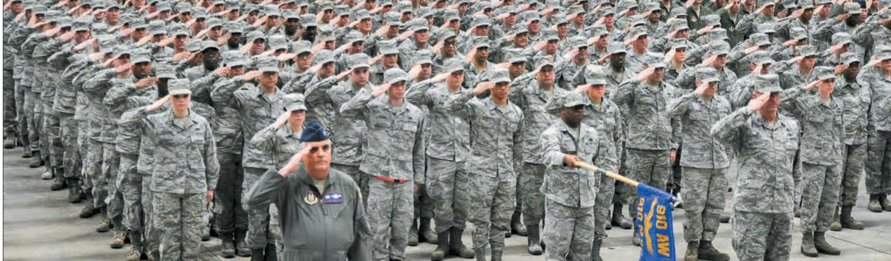

# Youngstown ARS, Ohio

New Castle County Arpt., Del. 19720. Nearest city: Wilmington. Phone: 302-323-3300. Component: ANG. Unit/mission: 166th AW, aeromedical evacuation, air mobility, cyber operations.

Niagara Falls Arpt./ARS, N.Y. 14304. Nearest city: Niagara Falls. Phone: 716-236-2000. Component: ANG/AFRC. Unit/mission: 107th ATKW (ANG), RPA operations; 914th AW (AFRC), air mobility operations.

Otis ANGB, Mass. 02542. Nearest city: Falmouth. Phone: 508-968-4003. Component: ANG. Unit/mission: 102nd IW, C2, DCGS operations; 202nd ISRG, cyber intelligence; 253rd CCG, combat communications. History: named for 1st Lt. Frank J. Otis, Massachusetts ANG flight surgeon and pilot killed in 1937 crash.

Pease Intl. Tradeport ANGS, N.H. 03803. Nearest city: Portsmouth. Phone: 603-430- 3577. Component: ANG. Unit/mission: 64th ARS (AMC) (active associate), 157th ARW (ANG), air mobility operations. History: site of former Portsmouth AFB, activated June 1956. Renamed Sept. 7, 1957, for Capt. Harl Pease Jr., MOH recipient, B-17 pilot killed in WWII. Base closed March 31, 1991.

Pittsburgh Arpt./ARS, Pa. 15108. Nearest city: Coraopolis. AFRC phone: 412-474-8511. ANG phone: 412-776-8010. Component: ANG/ AFRC. Unit/mission: 171st ARW (ANG), air mobility operations; 911th AW (AFRC), aeromedical evacuation, air mobility operations.

Portland Arpt., Ore. 97218. Nearest city: Portland. Phone: 503-335-4000. Component: ANG/AFRC. Unit/mission: 123rd WF (ANG), combat weather operations; 125th STS (ANG), special tactics operations; 142nd FW (ANG), fighter operations; 304th RQS (AFRC), personnel recovery operations.

Quonset State Arpt. (Quonset ANGB), R.I. 02852. Nearest city: North Kingstown. Phone: 401-886-1200. Component: ANG. Unit/mission: 102nd IWS, cyber operations; 143rd AW, air mobility operations.

Reno/Tahoe Arpt. (May Field), Nev. 89502. Nearest city: Reno. Phone: 775-788-4500. Component: ANG. Unit/mission: 152nd AW, air mobility, DCGS operations. History: named for Maj. Gen. James A. May, Nevada adjutant general, 1947 to 1967.

Rickenbacker ANGB, Ohio 43217. Nearest city: Columbus. Phone: 614-492-3408. Component: ANG. Unit/mission: 121st ARW, air mobility operations. History: activated 1942. Formerly Lockbourne AFB. Renamed May 7, 1974, for Capt. Edward V. Rickenbacker. Base transferred from Strategic Air Command to ANG April 1, 1980.

Rosecrans Memorial Arpt., Mo. 64503. Nearest city: St. Joseph. Phone: 816-236-3300. Component: ANG. Unit/mission: 139th AW (ANG), air mobility operations; Advanced Airlift Tactics Training Center (ANG/AFRC).

Salt Lake City Arpt., Utah 84116. Nearest city: Salt Lake City. Phone: 801-245-2200. Component: ANG. Unit/mission: 151st ARW, air mobility operations; 101st IOF, 130th EIS, cyber operations; 169th IS, intelligence operations.

Savannah Hilton Head Arpt., Ga. 31408. Nearest city: Garden City. Phone: 912-966- 8223. Component: ANG. Unit/mission: 165th AW, air mobility, tactical communications, TACP operations, Combat Readiness Training Center.

Schenectady County Arpt. (Stratton ANGB), N.Y. 12302. Nearest city: Scotia. Phone: 518-344-2300. Component: ANG. Unit/ mission: 109th AW, air mobility operations, Antarctic support.

Selfridge ANGB, Mich. 48045. Nearest city: Mount Clemens. Phone: 586-239-5576. Component: ANG. Unit/mission: 127th Wing, air mobility, fighter. Histor y: activated July 1917. Transferred to Michigan ANG July 1971. Named for 1st Lt. Thomas E. Selfridge, killed Sept. 17, 1908, at Fort Myer, Va., when airplane piloted by Orville Wright crashed.

Sioux Gateway Arpt./Col. Bud Day Field, Iowa 51111. Nearest city: Sioux City. Phone: 712-233-0200. Component: ANG. Unit/mission: 185th ARW, air mobility operations. History: activated as Sioux City AAB in July 1942. Closed in December 1945. Reopened in September 1946 as Sioux City ARB. Returned to joint civil-military use. Named in 2002 for retired Col. George E. “Bud” Day, a Vietnam War POW and MOH recipient.

Springfield-Beckley Arpt., Ohio 45502. Nearest city: Springfield. Phone: 800-851-4503. Component: ANG. Unit/mission: 178th Wing, cyber, ISR, space operations.

Stewart ANGB, N.Y. 12550. Nearest city: Newburgh. Phone: 845-563-2000. Component: ANG. Unit/mission: 105th AW, air mobility, cyber operations. History: Stewart AFB until 1969. Acquired by state of New York 1970.

Toledo Express Arpt., Ohio 43558. Nearest city: Swanton. Phone: 419-868-4250. Component: ANG. Unit/mission: 180th FW, fighter operations.

Truax Field, Wis. 53704. Nearest city: Madison. Phone: 608-245-4395. Component: ANG. Unit/ mission: 115th FW, fighter, ISR operations (active associate). History: activated June 1942 as AAF base. Taken over by Wisconsin ANG April 1968. Named for Lt. T. L. Truax, killed in P-40 training accident 1941.

Tucson Arpt., Ariz. 85706. Nearest city: Tucson. Phone: 520-295-6192. Component: ANG. Unit/mission: 162nd Wing, fighter, ISR, RPA (at Davis-Monthan AFB, Ariz.) operations, training.

Tulsa Arpt., Okla. 74115. Nearest city: Tulsa. Phone: 918-833-7000. Component: ANG. Unit/ mission: 138th FW, fighter, cyber operations, TACP training.

Volk Field ANGB, Wis. 54618. Nearest city: Madison. Phone: 608-427-1210. Component: ANG. Unit/mission: Combat Readiness Training Center; 128th ACS, C2 operations. History: named for Lt. Jerome A. Volk, first Wisconsin ANG pilot to be killed in the Korean War.

Westover ARB, Mass. 01022. Nearest city: Chicopee. Phone: 413-557-1110. Component: AFRC. Unit/mission: 439th AW, air mobility operations. History: dedicated April 6, 1940. Named for Maj. Gen. Oscar Westover, Chief of the Air Corps, killed Sept. 21, 1938.

W. K. Kellogg Arpt., Mich. 49015. Nearest city: Battle Creek. Phone: 269-969-3234. Component: ANG. Unit/mission: 110th ATKW, C2, cyber, RPA operations.

Will Rogers ANGB, Okla. 73159. Nearest city: Oklahoma City. Phone: 405-686-5227. Component: ANG/AFSOC. Unit/mission: 137th SOW, ISR operations; 146th ASOS, TACP operations; 205th EIS, cyber operations.

Yeager Arpt., W.Va. 25311. Nearest city: Charleston. Phone: 304-341-6249. Component: ANG. Unit/mission: 130th AW, air mobility, ISR operations. History: named for Brig. Gen. Charles E. “Chuck” Yeager.

Youngstown ARS, Ohio 44473. Nearest city: Youngstown. Phone: 330-609-1000. Component: AFRC. Unit/mission: 910th AW, air mobility operations.

# Experience Hawai‘i the moment you step aboard.

Ready to let someone else do the flying?   
AFA members receive a discount for   
air travel on Hawaiian Airlines flights from   
North America to Hawai‘i. To learn more,   
visit HawaiianAirlines.com/affiliate   
and enter code AFA.

# HAWAIAN AIRLINES.

# Adventure awaits.VE:

When it’s time to get away, get moving with more savings and rewards with Budget. You’ll enjoy these great benefi ts and rewards including:

Free weekend day with coupon # TUGZ032   
Save up to 25% always with BCD # X201400

For reservations and more deals, go to budget.com/afa or call 1-800-527-0700.

# Gallery of Weapons

By Aaron M. U. Church

2017 USAF Almanac

# B-1 Lancer

# BOMBER AIRCRAFT

# ■ B-1 LANCER

Brief: Long-range penetrating bomber capable of delivering the largest weapon load of any aircraft in the Air Force inventory.

# COMMENTARY

The B-1A was initially proposed as a replacement for the B-52, and four prototypes were developed and tested before program cancellation in 1977. The program was revived in 1981 as the B-1B. The vastly upgraded aircraft added 74,000 lb of usable payload, improved radar, and reduced radar cross section, but cut speed to Mach 1.2. B-1B saw fi rst combat in Iraq during Desert Fox in 1998. Its three internal weapons bays hold a substantial payload, allowing different weapons in each bay. The bomber’s blended wing/body confi guration, variable-geometry design, and turbofan engines provide long range and loiter time. Offensive avionics include SAR for terrain-following and tracking and targeting moving vehicles. Sniper pod was added in 2008. The ongoing integrated battle station modifi - cations is the most comprehensive refresh in the bomber’s history. The three-part upgrade includes the Vertical Situation Display (VSD), which adds a digital cockpit, Fully Integrated Data Link (FIDL) to enhance targeting, command and control, and Central Integrated Test System (CITS), giving aircrew real-time aircraft diagnostics and simplifying maintenance and troubleshooting. FIDL includes Link 16 and Joint Range Extension data link, enabling permanent secure LOS/BLOS/C2. It also adds Ethernet to enable rapid airborne retargeting. Ongoing life extension efforts will stretch service life to 2040. The fi rst Sustainment Block 16 airframe was redelivered to Ellsworth AFB, S.D., in May

2016. FY17 funds support development of higher powered Military Code (M-Code) jam-resistant GPS interface. B-1s resumed Pacifi c presence rotations to Guam in 2016.

# EXTANT VARIANT(S)

• B-1B. Upgraded production version of the canceled B-1A.   
Function: Long-range conventional bomber. Operator: AFGSC, AFMC.   
First Flight: Dec. 23, 1974 (B-1A); Oct. 18, 1984 (B-1B).   
Delivered: June 1985-May 1988.   
IOC: Oct. 1, 1986, Dyess AFB, Texas (B-1B). Production: 104.   
Inventory: 62.   
Aircraft Location: Dyess AFB, Texas; Edwards AFB, Calif.; Eglin AFB, Fla.; Ellsworth AFB, S.D. Contractor: Boeing (formerly Rockwell), Harris Corp.   
Power Plant: Four General Electric F101- GE-102 turbofans, each 30,780 lb thrust. Accommodation: Pilot, copilot, and two WSOs (offensive and defensive), on ACES II zero/ zero ejection seats.   
Dimensions: Span 137 ft (spread forward) to 79 ft (swept aft), length 146 ft, height 34 ft. Weight: Max T-O 477,000 lb.   
Ceiling: More than 30,000 ft.   
Performance: Speed ${ \mathfrak { g } } 0 0 +$ mph at S-L, range intercontinental.   
Armament: 84 Mk 82 (500-lb) or $2 4 ~ \mathsf { M k } ~ 8 4$ (2,000-lb) general-purpose bombs; $8 4 ~ \mathrm { M k } ~ 6 2$ (500-lb) or eight Mk 65 (2,000-lb) Quick Strike naval mines; 30 CBU-87/89 cluster bombs or 30 CBU-103/104/105 WCMDs; 24 GBU-31 or 15 GBU-38 JDAMs/GBU-54 LJDAM; 24 AGM158A JASSM or JASSM-ER.

# ■ B-2 SPIRIT

Brief: Stealthy, long-range nuclear and conventional strike bomber.

# COMMENTARY

The B-2 is a fl ying wing that combines LO stealth design with high aerodynamic effi ciency. Spirit entered combat against Serb targets during Allied Force on March 24, 1999. B-2 production was completed in three successive blocks and all aircraft were upgraded to Block 30 standards with AESA radar. AESA paves the way for future advanced weapons integration including Long-Range Standoff (LRSO) missile and B61-12 bomb. The aircraft’s smoothly blended “fuselage” holds two weapons bays capable of carrying nearly 60,000 lb of weapons in various combinations. New EHF satcom and high-speed computer upgrade recently entered full production. Both are part of the Defensive Management System-Modernization (DMSM). FY16 began production funding for a new VLF receiver to provide redundancy, and FY17 starts include radio cryptographic modernization for UHF/VHF comms, and a new Adaptable Communications Suite (ACS) to provide timesensitive mission data, targeting, intelligence, and C2 updates. AEHF comms will provide two-way, survivable communications for nuclear missions in A2/AD environments. Weapons integration includes the improved GBU-57 Massive Ordnance Penetrator, JASSM-ER, and future weapons such as GBU-53 SDB II, GBU-56 Laser JDAM, JDAM-5000, and LRSO. Flexible Strike Package mods will feed GPS data to the weapons bays, allowing prerelease guidance to thwart jamming. Phase 2 will allow nuclear and conventional weapons to be

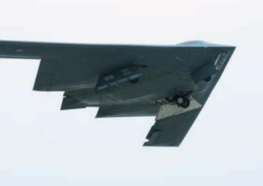  
A1C Arielle Vasquez/USAF

# B-2 Spirit

carried simultaneously to increase flexibility. USAF plans to add wideband nuclear C2 under the FAB-T program. Efforts are underway to increase fleet availability, shorten depot-level maintenance, and increase intervals between overhauls. Service life is projected to 2058.

# EXTANT VARIANT(S)

• B-2A. Production aircraft upgraded to Block 30 standards.

Function: Long-range heavy bomber.   
Operator: AFGSC, AFMC, ANG (associate). First Flight: July 17, 1989.   
Delivered: December 1993-December 1997. (Test asset redelivered as combat capable, July 2000.)   
IOC: April 1997, Whiteman AFB, Mo.   
Production: 21.   
Inventory: 20.   
Aircraft Location: Edwards AFB, Calif.; Whiteman AFB, Mo.   
Contractor: Northrop Grumman, Boeing, Vought.   
Power Plant: Four General Electric F118- GE-100 turbofans, each 17,300 lb thrust.

Accommodation: Two pilots, on ACES II zero/ zero ejection seats.

Dimensions: Span 172 ft, length 69 ft, height 17 ft.

Weight: Max T-O 336,500 lb.

Ceiling: 50,000 ft.

Performance: Speed high subsonic, estimated unrefueled range 5,000 miles.

Armament: Nuclear: 16 B61-7 or B83, or 8 B61- 11 bombs (on rotary launchers). Conventional: 80 Mk 62 (500-lb) sea mines, 80 Mk 82 (500-lb) bombs, 80 GBU-38 JDAMs, or 34 CBU-87/89 munitions (on rack assemblies); or 16 GBU-31 JDAMs, 16 Mk 84 (2,000-lb) bombs, 16 AGM154 JSOWs, 16 AGM-158 JASSMs, or eight GBU-28 LGBs.

# ■ B-52 STRATOFORTRESS

Brief: Long-range bomber capable of free-fall nuclear or conventional weapon delivery or cruise missile carriage.

# COMMENTARY

The B-52H is the last serving variant of the Stratofortress. It first flew in 1960, and 102 were delivered between May 1961 and October 1962. The aircraft is USAF’s only nuclear cruise missile carrier. Multimission capabilities include long-range precision strike, CAS, air interdiction, defense suppression, and maritime surveillance. Litening and Sniper targeting pods have been added. The overall B-52 System Improvements project is replacing key obsolescent components. The Combat Network Communications Technology (CONECT) program is replacing cockpit displays and comms and enabling machine-to-machine tasking/ retargeting. The first CONECT airframe was redelivered in 2014. CNS/ATM replaces the

B-52’s analog systems with digital systems. The Internal Weapons Bay Upgrade enables internal smart weapon carriage. The first six Conventional Rotary Launchers were delivered under the accelerated program in 2016. The CRL roughly doubles smart weapon payloads, while reducing drag and increasing range. The upgrade supports transition from CALCM to the AGM-158B JASSM-ER long-range cruise missile. Future weapons include the GBU-54 Laser JDAM. Thirty B-52s are undergoing conventional weapon-only modifications to comply with the New START nuclear arms reduction agreement. FY17 efforts will replace the bomber’s obsolescent radar with a reliable, modern, off-the-shelf system, add low-latency, jam-resistant C2/comms, and upgrade BLOS voice/data capability to preserve current capabilities.

# EXTANT VARIANT(S)

● B-52H. Dual-capable nuclear and conventional bomber.   
Function: Long-range heavy bomber.   
Operator: AFGSC, AFMC, AFRC.   
First Flight: April 15, 1952 (YB-52 prototype); 1960 (B-52H).   
Delivered: 1955-October 1962.   
IOC: June 19, 1955 (B-52A); May 1961 (B-52H). Production: 744.   
Inventory: 76.   
Aircraft Location: Barksdale AFB, La.; Edwards AFB, Calif.; Minot AFB, N.D.   
Contractor: Boeing, Harris.   
Power Plant: Eight Pratt & Whitney TF33-P-3 turbofans, each 17,000 lb thrust.   
Accommodation: Two pilots, side by side, plus navigator, radar navigator, and EWO on upward/ downward ejection seats.

# Acronyms and Abbreviations

<table><tr><td>A2/AD ACTD</td><td>anti-access, area denial Advanced Concept</td><td>Comint</td><td>communications intelligence</td><td>INS I0C</td><td>inertial navigation system initial operational capability</td><td>ROVER</td><td>Remotely Operated Video Enhanced Receiver</td></tr><tr><td></td><td>Technology Demonstration</td><td>CONUS CSAR</td><td>continental Us</td><td>IR</td><td>infrared</td><td>RPA</td><td>remotely piloted aircraft</td></tr><tr><td>AE AEHF</td><td>aeromedical evacuation Advanced Extremely High</td><td>CSO</td><td>combat search and rescue combat systems officer</td><td>ISR</td><td>intelligence, surveillance,</td><td>RWR</td><td>radar warning receiver</td></tr><tr><td></td><td></td><td></td><td></td><td></td><td>and reconnaissance</td><td>SAR</td><td>synthetic aperture radar</td></tr><tr><td></td><td>Frequency</td><td>DV</td><td>distinguished visitors</td><td>JASSM</td><td>Joint Air-to-Surface</td><td>satcom</td><td>satellite communications</td></tr><tr><td>AESA</td><td>active electronically</td><td>EA</td><td>electronic attack</td><td></td><td>Standoff Misile</td><td>SDB</td><td>Small Diameter Bomb</td></tr><tr><td></td><td>scanned array</td><td>ECM</td><td>electronic countermeasures</td><td>JDAM</td><td>Joint Direct Attack Munition</td><td>SEAD</td><td>suppression of enemy air</td></tr><tr><td>AGM</td><td>air-to-ground missile</td><td>EELV</td><td>Evolved Expendable Launch</td><td>JSOW</td><td>Joint Standoff Weapon</td><td></td><td>defenses</td></tr><tr><td>AIM</td><td>air intercept missile</td><td></td><td>Vehicle</td><td>JSUPT</td><td>Joint Specialized</td><td>SHF</td><td>super high frequency</td></tr><tr><td>ALCM</td><td></td><td>EHF</td><td>extremely high frequency</td><td></td><td></td><td></td><td></td></tr><tr><td></td><td>Air Launched Cruise Missile</td><td>Elint</td><td></td><td></td><td>Undergraduate Pilot</td><td>shp</td><td>shaft horsepower</td></tr><tr><td></td><td>AMRAAM Advanced Medium-Range</td><td></td><td>electronic intelligence</td><td></td><td>Training</td><td>Sigint</td><td>signals intelligence</td></tr><tr><td></td><td>Air-to-Air Missile</td><td>EO</td><td>electro-optical</td><td>JTIDS</td><td>Joint Tactical Information</td><td>S-L</td><td>sea level</td></tr><tr><td>ASIP</td><td>Airborne Signals</td><td>ER</td><td>extended range</td><td></td><td>Distribution System</td><td>SLEP</td><td>service life extension</td></tr><tr><td></td><td>Intelligence Payload</td><td>EW</td><td>electronic warfare</td><td>LANTIRN</td><td>Low-Altitude Navigation and</td><td></td><td>program</td></tr><tr><td>ATP</td><td>advanced targeting pod</td><td>EWO</td><td>electronic warfare officer</td><td></td><td>Targeting Infrared for Night</td><td>SOF</td><td>special operations forces</td></tr><tr><td>BLOS</td><td>beyond line of sight</td><td>FAB-T</td><td>Family of Advanced Beyond</td><td>LCD</td><td>liquid crystal display</td><td>START</td><td>Strategic Arms Reduction</td></tr><tr><td>BLU</td><td>bomb live unit</td><td></td><td>Line of Sight Terminals</td><td>LF</td><td>low frequency</td><td></td><td>Treaty</td></tr><tr><td>BM</td><td>battle management</td><td>FLIR</td><td>forward-looking infrared</td><td>LGB</td><td>laser guided bomb</td><td>STOL</td><td>short takeoff and landing</td></tr><tr><td>C2</td><td>command and control</td><td>FMV</td><td>full-motion video</td><td>LDAM</td><td>Laser Joint Direct Attack</td><td>TACAN</td><td>tactical air navigation</td></tr><tr><td>C3</td><td>command, control, and</td><td>FY</td><td>Fiscal Year</td><td></td><td>Munition</td><td>TBD</td><td>to be determined</td></tr><tr><td></td><td>communications</td><td>FYDP</td><td>Future Years Defense</td><td>L0</td><td>low observable</td><td>TF/TA</td><td>terrain-following/terrain-</td></tr><tr><td>CALCM</td><td>Conventional Air Launched</td><td></td><td>Program</td><td>LOS</td><td>line of sight</td><td></td><td>avoidance</td></tr><tr><td></td><td>Cruise Missile</td><td>GATM</td><td>Global Air Trffic</td><td>LRIP</td><td>low-rate initial production</td><td>T-0</td><td>takeoff</td></tr><tr><td>CAS</td><td>close air support</td><td></td><td>Management</td><td>MALD</td><td>Miniature Air Launched</td><td>UHF</td><td>ultrahigh frequency</td></tr><tr><td>CBU</td><td>cluster bomb unit</td><td>GBU</td><td>guided bomb unit</td><td></td><td>Decoy</td><td>USAFA</td><td>US Air Force Academy</td></tr><tr><td>CEM</td><td>combined effects munition</td><td>GCS</td><td>ground control station</td><td>Masint</td><td>measurement and</td><td>VHF</td><td>very high frequency</td></tr><tr><td>CEP</td><td>circular error probable</td><td>HARM</td><td>High-speed Anti-Radiation</td><td></td><td>signature intelligence</td><td>VLF</td><td>very low frequency</td></tr><tr><td>CFT</td><td>conformal fuel tank</td><td></td><td>Missile</td><td>MFD</td><td>multifunction display</td><td>WCMD</td><td>Wind-Corrected Munitions</td></tr><tr><td>CNS/ATM communications,</td><td></td><td>HE</td><td>high-explosive</td><td>N/A</td><td>not available</td><td></td><td>Dispenser</td></tr><tr><td></td><td>navigation, surveillance/air</td><td>HUD</td><td>head-up display</td><td>NVG</td><td>night vision goggles</td><td>WSO</td><td>weapon systems officer</td></tr><tr><td></td><td>traffic management</td><td>IFF</td><td>identification, friend or foe</td><td>PGM</td><td>precision guided munition</td><td></td><td></td></tr><tr><td></td><td></td><td>IIR</td><td>imaging infrared</td><td>PSP</td><td>Precision Strike Package</td><td></td><td></td></tr></table>

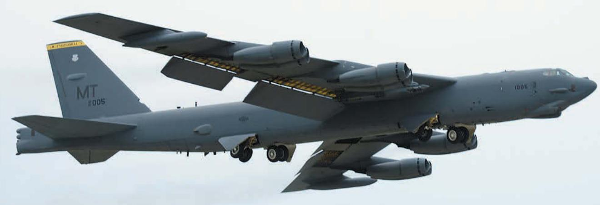  
B-52 Stratofortress

Dimensions: Span 185 ft, length 159.3 ft, height 40.7 ft.   
Weight: Max T-O 488,000 lb.   
Ceiling: 50,000 ft.   
Performance: Speed 650 mph, range $^ { 1 0 , 0 0 0 + }$ miles.   
Armament: Nuclear: 12 AGM-86B ALCMs externally, and eight ALCMs or gravity weapons internally. Conventional: AGM-86C/D CALCMs, Mk 62 sea mines, Mk 82/84 bombs, CBU-87/89 cluster bombs, CBU-103/104/105 WCMDs, GBU-31/38 JDAMs, AGM-158A JASSMs, and GBU-10/12/28 LGBs, MALD, and MALD-J jammer variant.

# FIGHTER & ATTACK AIRCRAFT

# ■ A-10 THUNDERBOLT II

Brief: Twin-engine aircraft designed for CAS against a wide range of ground targets, including tanks and armored vehicles.

# COMMENTARY

The A-10C is an A-10A with precision engagement modifications, including color cockpit MFDs, hands-on throttle and stick, digital stores management, improved fire-control system, GPS guided weapons, Litening/Sniper pods, advanced data links, and integrated sensors. A-10C deployed to combat for the first time in 2007. It combines a large, diverse weapons payload, long loiter times, austere airfield capability, maneuverability, and wide combat radius. Using night vision and targeting pods, it is capable of operating under 1,000-ft ceilings in darkness. The aircraft has 11 hardpoints for up to 16,000 lb of ordnance. Its $3 0 ~ \mathsf { m m }$ gun can destroy heavy armor, and its titanium cockpit tub protects the pilot. Current upgrades include advanced IFF and open architecture software to allow quick integration of future weapons and sensors. The last of 278 aircraft were upgraded with Helmet Mounted Cueing System (HMCS) in 2015, and USAF is pursuing wing replacement beyond the initial 173 aircraft program ending in FY16. Integration of the Advanced Precision Kill Weapon System (APKWS) recently added carriage of 98 low-collateral, laser guided rockets, immediately arming A-10s in combat over Iraq and Syria. USAF reversed early retirement plans in favor of retaining the A-10 in service until 2022. FY17 funds support Lightweight Airborne Recovery System/Combat Survivor Evader Locator (LARS/CSEL) upgrades to enhance the A-10’s ability to locate and aid recovery of downed aircrew.

# EXTANT VARIANT(S)

• A-10C. Upgraded version of the A-10A ground attack aircraft.

Function: Attack.   
Operator: ACC, AFMC, PACAF, ANG, AFRC. First Flight: Feb. 15, 1975 (preproduction). Delivered: October 1975-March 1984.   
IOC: October 1977 (A-10A); 2007 (A-10C). Production: 713.   
Inventory: 283.   
Aircraft Location: Barksdale AFB, La.; Boise Air Terminal, Idaho; Davis-Monthan AFB, Ariz.; Eglin AFB, Fla.; Fort Wayne Arpt., Ind.; Martin State Arpt., Md.; Moody AFB, Ga.; Nellis AFB, Nev.; Osan AB, South Korea; Selfridge ANGB, Mich.; Whiteman AFB, Mo.   
Contractor: Fairchild Republic (Lockheed Martin).   
Power Plant: Two General Electric TF34-GE-100 turbofans, each 9,065 lb thrust.   
Accommodation: Pilot on ACES II zero/zero ejection seat.   
Dimensions: Span 57.5 ft, length 53.3 ft, height 14.7 ft.   
Weight: Max T-O 51,000 lb.   
Ceiling: 45,000 ft.   
Performance: Speed 518 mph, range 800 miles. Armament: One 30 mm, seven-barrel GAU-8/A Gatling gun (1,174 rd), straight high-explosive incendiary (HEI), or anti-armor HE/armorpiercing incendiary (API). Combat mix incl various types of free-fall or guided bombs such as Mk 82, Mk 84, GBU-10/12/38, CBU-87, laser guided rockets, various WCMDs, illumination rockets/flares, AGM-65 Mavericks, and AIM-9 Sidewinders.

# ■ F-15 EAGLE

Brief: Supersonic, highly maneuverable, allweather fighter designed to swiftly gain and maintain combat air superiority.

# COMMENTARY

The F-15 was the world’s dominant air superiority fighter for more than 30 years. F-15C/Ds began replacing F-15A/Bs in 1979 and offered superior maneuverability and acceleration, range, weapons, and avionics. It incorporates internal EW countermeasures and an added 2,000 lb of internal fuel (with provision for CFTs). The aircraft accounted for 34 of 37 USAF air-to-air kills during combat debut in Desert Storm. The final 43 production aircraft received the F-15E’s APG-70 radar, and the Multistage Improvement Program enhanced tactical capabilities. The F-15C/D is undergoing vital improvements, including new AESA radar and self defenses, needed to survive and fight in future, contested airspace. The first APG-63(V)3 AESA-modified F-15 was delivered in 2010, and the Eagle Passive/Active Warning Survivability System (EPAWSS) engineering development contract was awarded in 2016. EPAWSS initially replaces the current, obsolete system. A second phase will add a towed decoy/angled countermeasure capability. A total of 214 aircraft will be upgraded to augment the limited F-22 fleet. Additional upgrades include jam-resistant Mode 5-compliant IFF and higher capacity, jam-resistant Link 16. Development includes infrared search and track (IRST) to discreetly detect, track, and engage air targets, and advanced data links to enhance interoperability with fifth generation aircraft. New digital cockpit displays will fully exploit AESA capabilities (common with the F-15E). USAF is seeking to rewing the fleet to extend its service life to 2045. The service reduced retirements over the FYDP to support increased European deployments.

# EXTANT VARIANT(S)

• F-15C/D. Upgraded version of the original F-15A/B air superiority fighter.   
Function: Air superiority fighter.   
Operator: ACC, AFMC, PACAF, USAFE, ANG. First Flight: July 27, 1972 (F-15A).   
Delivered: November 1974-79 (F-15A/B); 1979- 85 (F-15C/D).   
IOC: September 1975.   
Production: 874.   
Inventory: 212 (F-15C); 24 (F-15D).   
Aircraft Location: Barnes Arpt., Mass.; Eglin AFB, Fla.; Fresno ANGB, Calif.; Jacksonville Arpt., Fla.; Kadena AB, Japan; Klamath Falls (Kingsley Field), Ore.; NAS JRB New Orleans, La.; Portland Arpt., Ore.; RAF Lakenheath, UK. Contractor: McDonnell Douglas (now Boeing), BAE Systems (EPAWSS), Raytheon (AESA). Power Plant: Two Pratt & Whitney F100-PW-220 turbofan engines, each 23,450 lb thrust; or two P&W F100-PW-229 turbofan engines with afterburners, each 29,000 lb thrust.   
Accommodation: Pilot (C); two pilots (D) on ACES II zero/zero ejection seats.   
Dimensions: Span 42.8 ft, length 63.8 ft, height 18.7 ft.   
Weight: Max T-O 68,000 lb.   
Ceiling: 60,000 ft.   
Performance: F-15C: speed Mach 2.5, ferry range 2,878 miles (3,450 miles with CFTs and three external tanks).   
Armament: One internally mounted M61A1 $2 0 ~ \mathsf { m m }$ six-barrel cannon (940 rd); four AIM-9 Sidewinders and four AIM-120 AMRAAMs, or eight AIM-120s, carried externally.

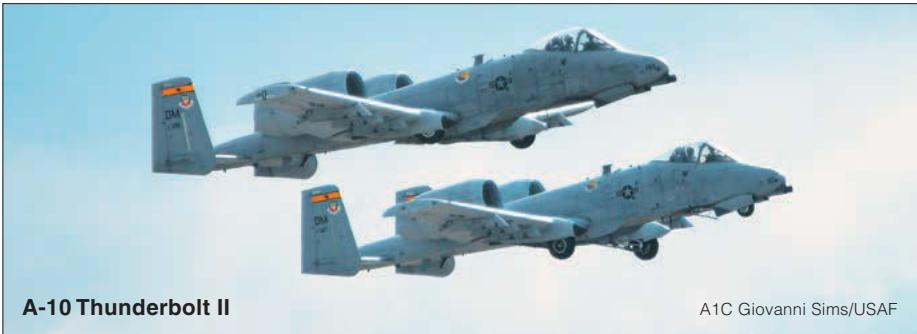

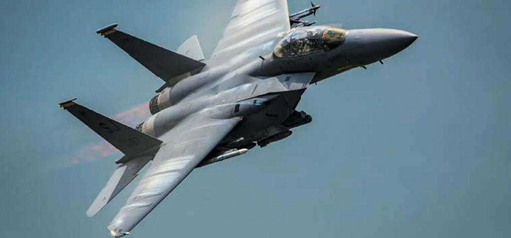  
F-15E Strike Eagle   
Amn. Daniel Snider/USAF

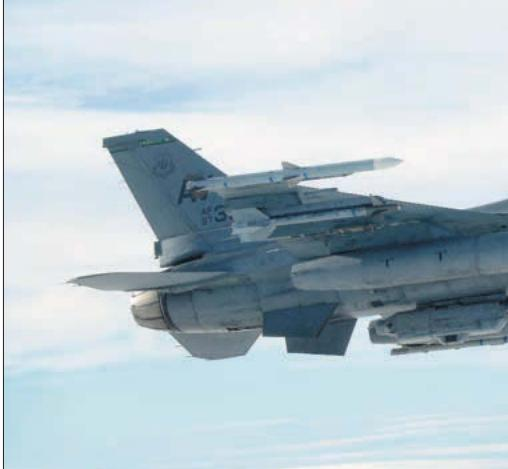  
F-16 Fighting Falcon

# ■ F-15E STRIKE EAGLE

Brief: Heavily modified two-seat dual-role F-15 designed for all-weather deep interdiction and attack as well as air-to-air combat.

# COMMENTARY

F-15E is an upgraded heavyweight, multirole F-15 capable of sustaining nine Gs throughout the flight envelope. It entered combat during Desert Storm in 1991. F-15E’s large, varied load of precision weapons and $2 0 \mathsf { m m }$ cannon gives it potent ground attack capability. Radar guided and IR-homing missiles give it an additional airto-air capability. Its advanced cockpit controls and displays include a wide-field-of-view HUD and helmet mounted cockpit-cueing, and its avionics permit all-weather day/night engagement. The F-15E carries LANTIRN, Sniper, and Litening ATPs on dedicated pylons. A SAR pod provides surveillance/reconnaissance capability. The aircraft are equipped with Link 16 and ARC-210 BLOS satcom. Ongoing upgrades include new APG-82(V)1 AESA radar and Eagle Passive/Active Warning Survivability System (EPAWSS) to replace its obsolete self-defense suite. The combined EPAWSS engineering development contract for all F-15 variants was awarded in 2016. USAF increased development, test, and evaluation funding for FY17 to support EPAWSS, AESA integration, new central computer and cockpit displays (in common with the F-15C/D), jam-resistant Link 16, Mode 5 IFF, and passive IR search and track (IRST). Fatigue testing is underway to determine SLEP requirements to reach 2035 or beyond.

# EXTANT VARIANT(S)

• F-15E. Multirole fighter aircraft derived from the F-15.

Function: Multirole fighter.   
Operator: ACC, AFMC, USAFE.   
First Flight: Dec. 11, 1986.   
Delivered: April 1988-2004.   
IOC: September 1989.   
Production: 236.   
Inventory: 220.   
Aircraft Location: Eglin AFB, Fla.; Mountain Home AFB, Idaho; Nellis AFB, Nev.; RAF Lakenheath, UK; Seymour Johnson AFB, N.C. Contractor: McDonnell Douglas (now Boeing), BAE Systems (EPAWSS), Raytheon (AESA). Power Plant: Two Pratt & Whitney F100- PW-220, each 23,450 lb thrust; or two F100- PW-229 turbofans with afterburners, each 29,000 lb thrust.   
Accommodation: Pilot and WSO on ACES II zero/zero ejection seats.   
Dimensions: Span 42.8 ft, length 63.8 ft, height 18.5 ft.   
Weight: Max T-O 81,000 lb.   
Ceiling: 50,000 ft.   
Performance: Speed Mach 2.5, ferry range 2,400 miles with CFTs and three external tanks. Armament: One internally mounted M61A1 $2 0 ~ \mathsf { m m }$ six-barrel cannon (500 rd); four AIM-9 Sidewinders and four AIM-120 AMRAAMs or eight AIM-120s; most air-to-surface weapons in USAF inventory (nuclear and conventional).

# ■ F-16 FIGHTING FALCON

Brief: Highly maneuverable multirole fighter proven in air-to-air combat, SEAD, and air-tosurface attack.

# COMMENTARY

The F-16 comprises 50 percent of USAF’s fighter fleet and is among the most maneuverable fighters ever built. It is a lightweight fighter capable of carrying the majority of PGMs. The F-16 entered combat during the 1991 Gulf War. The F-16C/D was introduced in 1984, at Block 25. It featured cockpit, airframe, and core avionics upgrades and added the increased-range APG-68 radar and AMRAAM. Block 30/32 added next stage improvements, new engines, and weapons including HARM. Block 40/42 delivered in 1988 introduced the LANTIRN pod, enabling automatic terrain following and high-speed night/all-weather penetration. It also introduced wide-angle HUD, increased takeoff weight, expanded flight envelope, and higher G limits. Block 50/52 delivered in 1991 is optimized for SEAD, employing HARM and a longer range radar. It added the uprated F110- GE-129 and F100-PW-229 engines, upgradable cockpit, Sniper/Litening ATPs, and ROVER to coordinate with strike controllers. Blocks 40 through 52 were cockpit-standardized with a new color MFD, modular mission computer,

Helmet Mounted Integrated Targeting (HMIT), and Link 16. Block 30/32 aircraft are still undergoing mods. Automatic Ground Collision Avoidance System (A-GCAS) was added in 2014. Future efforts include adding air collision avoidance and merging the two systems, as well as developing a similar system that is compatible with early block, analog flight-control systems. SLEP development efforts to extend fatigue life beyond 10,000 hours began in 2016. FY17 funds support modifying AESA radar retrofits to allow NORAD alert aircraft to counter cruise missile threats. JASSM-ER integration and high-capacity, secure, and civil-compliant comm/data link mods are ongoing.

# EXTANT VARIANT(S)

• F-16C/D Block 30/32. Multinational Staged Improvement Program II upgraded with new engines, flown by ANG, AFRC, and test and aggressor units.   
• F-16CG Block 40/42. Aircraft optimized for night and all-weather attack.   
• F-16CJ Block 50/52. Aircraft optimized for SEAD with new long-range radar, engines, and weapons.   
Function: Multirole fighter.   
Operator: ACC, AETC, AFMC, PACAF, USAFE, ANG, AFRC.   
First Flight: Dec. 8, 1976 (full-scale development).   
Delivered: January 1979-2005.   
IOC: October 1980, Hill AFB, Utah.   
Production: 2,206.   
Inventory: 793 (F-16C); 156 (F-16D).   
Aircraft Location: Aviano AB, Italy; Edwards AFB, Calif.; Eglin AFB, Fla.; Eielson AFB, Alaska; Hill AFB, Utah; Holloman AFB, N.M.; Homestead ARB, Fla.; Kunsan AB, South Korea; Luke AFB, Ariz.; Misawa AB, Japan; NAS JRB Fort Worth, Texas; Nellis AFB, Nev.; Osan AB, South Korea; Shaw AFB, S.C.; Spangdahlem AB, Germany; and ANG in Alabama, Arizona, Colorado, District of Columbia (flying out of Maryland), Minnesota, New Jersey, Ohio, Oklahoma, South Carolina, South Dakota, Texas, Vermont, Wisconsin.   
Contractor: General Dynamics (now Lockheed Martin), Northrop Grumman (radar).   
Power Plant: Block 40: one General Electric F110-GE-100 (29,000 lb thrust); Block 42: one Pratt & Whitney F100-PW-220 (24,000 lb thrust); Block 50: one F110-GE-129 (29,000 lb thrust); Block 52: one F100-PW-229 (29,000 lb thrust). Accommodation: Pilot (C); two pilots (D) on ACES II zero/zero ejection seats.   
Dimensions: Span 32.8 ft, length 49.3 ft, height 16.7 ft.   
Weight: F-16C: empty (F100-PW-229) 18,591 lb, (F110-GE-129) 18,917 lb; gross, with external load (Block 40/42) 42,000 lb. Ceiling: 50,000 ft.   
Performance: Speed Mach 2, ferry range $^ { 2 , 0 0 2 + }$ miles.   
Armament: One M61A1 $2 0 ~ \mathsf { m m }$ cannon (500 rd); up to six air-to-air missiles, AGMs, and ECM pods externally.

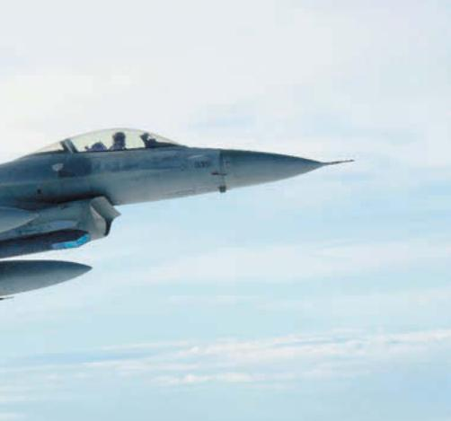  
SrA. Areca T. Bell/USAF

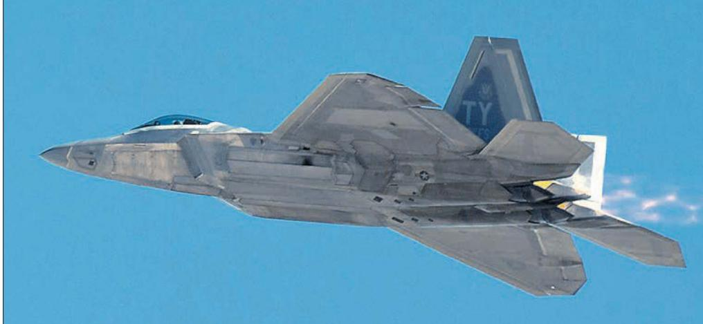  
F-22 Raptor

# ■ F-22 RAPTOR

Brief: Fifth generation, multirole fighter designed to penetrate advanced air defenses and achieve air dominance.

# COMMENTARY

The F-22 is built for day, night, and adverse weather full-spectrum operations. The world’s most advanced fighter, it combines stealth, supercruise, high maneuverability, and integrated avionics. Its integrated avionics and data links permit simultaneous multitarget engagement. Advanced flight controls and thrust vectoring high-performance engines lend great maneuverability. Features include six LCD color cockpit displays, APG-77 radar, EW system with RWR and missile launch detector, JTIDS, IFF system, laser gyroscope inertial reference, and GPS. The Raptor flew its first operational sortie during Noble Eagle in 2006 and debuted in combat during Inherent Resolve over Iraq and Syria in 2014. Four aircraft successfully employed 1,000-lb JDAMs against ISIS ground targets during the aircraft’s first combat sortie. Ongoing upgrades include the Reliability, Availability, and Maintainability Maturation Program (RAMMP), software Increment 3.1, and tactical capability improvements, which collectively retrofit combat-coded F-22s with enhanced ground attack, air-to-air, and networking. RAMMP is adding AIM-9X-capable launch rails, and the next software package will add high resolution ground mapping SAR, threat geolocation, EA capability, and integration of SDB I, AIM-120D, and AIM-9X. Five test aircraft are modified to 3.2 standards to begin operational testing in FY17, and fleetwide mods are slated to begin FY18. Additional upgrades include engine safety, performance, and maintainability mods, phase two structural upgrades to extend fleet life, and improved ISR and comms. USAF is exploring options to improve situational awareness and targeting with development of the Raptor Helmet Mounted Display and Cueing System (RHMDCS) and to upgrade training airframes to combat-coded specifications.

# EXTANT VARIANT(S)

• F-22A. Fifth generation air dominance fighter.   
Function: Multirole air dominance fighter.   
Operator: ACC, AFMC, AFRC (associate), PACAF, ANG.   
First Flight: Sept. 7, 1997. Delivered: 2002 (first production representative aircraft).   
IOC: Dec. 15, 2005.   
Production: 195.   
Inventory: 187.   
Aircraft Location: Edwards AFB, Calif.; JB Elmendorf-Richardson, Alaska; JB LangleyEustis, Va.; JB Pearl Harbor-Hickam, Hawaii; Nellis AFB, Nev.; Tyndall AFB, Fla.   
Contractor: Lockheed Martin, Boeing.   
Power Plant: Two Pratt & Whitney F119-PW-100 turbofans, each 35,000 lb thrust.   
Accommodation: Pilot on ACES II zero/zero ejection seat.   
Dimensions: Span 44.5 ft, length 62 ft, height 16.6 ft.   
Weight: Max T-O 83,500 lb.   
Ceiling: Above 50,000 ft.   
Performance: Speed Mach 2 with supercruise capability, ferry range $1 , 8 5 0 +$ miles with two external wing fuel tanks.   
Armament: One internal M61A2 $2 0 \ \mathsf { m m }$ gun (480 rds); two AIM-9 Sidewinders stored inside internal weapons bays; six AIM-120 AMRAAMs (air-to-air loadout) or two AIM-120s and two GBU-32 JDAMs (air-to-ground loadout) in main internal weapons bay.

# ■ F-35 LIGHTNING II

Brief: Stealthy, next generation, joint service strike aircraft.

# COMMENTARY

The F-35 is a joint and multinational program aimed at fielding an affordable, highly common family of next generation strike fighters. USAF’s F-35A will replace F-16 and A-10 fleets with a stealthy, multirole fighter capable of penetrating advanced enemy air defenses and striking targets at will. The F-35A carries up to 18,000 lb of weapons on 10 stations, including four internal bays (for maximum stealth) and six additional wing-mounted pylons. The service received its first production aircraft—AF-7—in 2008. USAF most recently awarded LRIP Lot 9 and Lot 10 covering delivery of 85 F-35As to the service through 2020. The Marine Corps declared F-35 IOC in 2015. USAF reached IOC at Hill AFB, Utah, on Aug. 2, 2016, with the first aircraft upgraded with Block 3I software. Block 3I improves the baseline Block 2B software, adding 89 percent of the code needed for full combat capability. The Block 3F software, in testing, will enable full combat capability, adding a range of precision guided munitions. Fiscal 2017 launches Block 4 development to add new weapons and sensors, improve the F-35’s EW capabilities, and integrate nuclear weapons beyond 2020. A fuel system flaw partially grounded the fleet last year, but jets were cleared to resume interim flight until depotlevel mods are completed. Lockheed Martin delivered the 100th F-35A to Luke AFB, Ariz., on Aug. 26, 2016, and FY17 funding supports procurement of 43 F-35As.

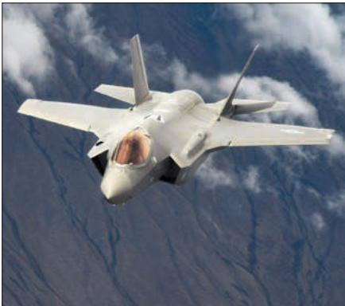  
F-35A Lightning II R. Nial Bradshaw/USAF

# EXTANT VARIANT(S)

• F-35A. Conventional takeoff and landing (CTOL) variant for the Air Force.   
• F-35B. Short takeoff and vertical landing (STOVL) variant for USMC.   
• F-35C. Carrier-capable variant for Navy. Function: Multirole fighter.   
Operator: ACC, AETC, AFMC, AFRC. Planned: PACAF, USAFE, ANG.   
First Flight: Dec. 15, 2006 (F-35A prototype). Delivered: April 2011 (first production aircraft). IOC: Aug. 2, 2016.   
Production: Planned: 1,763 USAF (F-35A); 680 Navy and Marine Corps (F-35B/C); unspecified number to development partners and foreign military sales customers.   
Inventory: 96 (USAF).   
Aircraft Location: Edwards AFB, Calif.; Eglin AFB, Fla.; Hill AFB, Utah; Luke AFB, Ariz.; Nellis AFB, Nev.; future locations include Burlington Arpt., Vt.; Eielson AFB, Alaska; RAF Lakenheath, UK; others TBD.   
Contractor: Lockheed Martin, BAE Systems, Northrop Grumman, Pratt & Whitney.   
Power Plant: F-35A: one Pratt & Whitney F135- PW-100, 40,000 lb thrust.   
Accommodation: Pilot on Martin Baker MK16 zero/zero ejection seat.   
Dimensions: Span 35 ft, length 51.4 ft, height 14.4 ft.   
Weight: Max T-O 70,000 lb.   
Ceiling: 50,000 ft.   
Performance: Speed Mach 1.6 with full internal weapons load, range 1,380 miles.   
Armament: F-35A: one 25 mm GAU-22/A cannon; standard internal loadout: two AIM-120 AMRAAMs and two GBU-31 JDAMs.

# ■ AC-130J GHOSTRIDER

Brief: Modified MC-130J armed with side-firing weapons, low-yield PGMs, and sensors optimized for CAS and air interdiction, specifically suited to urban operations.

# COMMENTARY

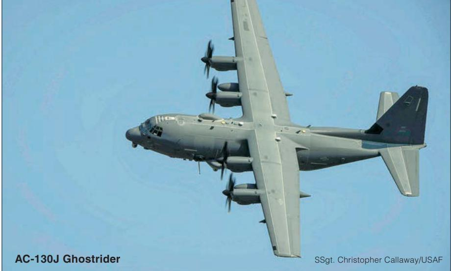

The AC-130J is a next generation gunship based on a significantly modified MC-130J, fitted with a modular PSP, and wing-mounted weapon racks. The AC-130J is designed to provide ground forces with a persistent direct-fire platform for urban operations. PSP includes a mission management console, robust communications suite, two EO/IR sensors, advanced fire-control equipment, PGM delivery capability, and trainable cannons. Initial Block 10 aircraft include fully integrated digital avionics cockpit, GPS/INS, integrated defensive systems, color weather radar, and PSP. Block 20 configuration adds a $1 0 5 \mathsf { m m }$ gun, laser guided SDB, a sidemounted pilot tactical display, and Large Aircraft Infrared Countermeasures (LAIRCM). Airframes are delivered as MC-130Js for subsequent modification as gunships. The prototype flew its first post-conversion flight in 2014, but was declared a loss after departing controlled flight during developmental testing at Eglin AFB, Fla. The first Block 20 was delivered to Hurlburt Field, Fla., in July 2016 and began live-fire evaluation of the $1 0 5 \mathrm { m m }$ cannon and Laser Guided SDB (LSDB). Block 20 operational testing at Hurlburt will continue through mid-2017. Four MC-130Js are undergoing conversion and FY17 funds convert four more. Future upgrades include a high-energy laser weapon, air-launched RPAs to provide below-the-cloud targeting data for all-weather strike, and integration of laser guided Hellfire missiles.

# EXTANT VARIANT(S)

• AC-130J Ghostrider Block 10. Prototype gunship based on the MC-130J.   
• AC-130J Ghostrider Block 20. Production standard gunship with additional $1 0 5 \mathsf { m m }$ gun. Function: Attack.   
Operator: AFSOC.   
First Flight: April 5, 1996 (basic C-130J). Delivered: From 2014 (prototype).   
IOC: 2017 (planned).   
Production: Four (37 to be converted from new-build MC-130Js).   
Inventory: Three.   
Aircraft Location: Hurlburt Field, Fla.   
Contractor: Lockheed Martin.   
Power Plant: Four Rolls Royce AE 2100D3 turboprops, each 4,700 shp.   
Accommodation: Two pilots, two CSOs, three gunners (four, with inclusion of $1 0 5 ~ \mathsf { m m }$ gun). Dimensions: Span 132.6 ft, length 97.7 ft, height 39.1 ft.   
Weight: Max T-O 164,000 lb.   
Ceiling: 28,000 ft., 42,000 lb payload.   
Performance: Speed 416 mph, range 3,000 miles.   
Armament: Trainable 30 mm GAU-23/A cannon; $1 0 5 ~ \mathsf { m m }$ cannon; PGMs.

# ■ AC-130U SPOOKY

Brief: Modified C-130H armed with side-firing weapons and sensors optimized for precision night and all-weather CAS, long-endurance interdiction, and armed reconnaissance.

# COMMENTARY

AC-130U is a gunship-configured C-130H modified with gun systems, electronic and EO sensors, fire-control systems, enhanced navigation, sophisticated comms, defensive systems, and in-flight refueling capability. All AC-130U weapons can be subordinated to the APQ-180 digital fire-control radar, FLIR, or all-light-level television (ALLTV) for adverse weather attack operations. Rockwell converted the initial 13 AC-130Us in 1994-95, and Boeing more recently converted four more, all dubbed “Spooky” in reference to the early AC-47D gunship. The command retired a single nonstandard AC-130U in 2015, before halting phaseout. AFSOC is retaining 16 legacy AC-130Us and accelerating center wing box replacements to extend serviceability and meet high operational demands until replaced by AC-130Js. Ongoing upgrades include Enhanced Situational Awareness (ESA) program mods to provide near realtime intel and data fusion of threat detection, avoidance, geolocation, and adversary-emitter identification. Other upgrades include replacing obsolescent mission computers and EO/IR sensors with a new high-definition suite, and GPS updates. All AC-130Us serve with the 1st Special Operations Wing at Hurlburt Field, Fla.

# EXTANT VARIANT(S)

• AC-130U Spooky II. Third generation gunship based on C-130H.   
Function: Attack.   
Operator: AFSOC.   
First Flight: 1967.   
Delivered: 1968-present.   
IOC: 1996.   
Production: 43, incl four more recent conversions.   
Inventory: 16 (AC-130U).   
Aircraft Location: Hurlburt Field, Fla.   
Contractor: Lockheed Martin (airframe), Boeing (formerly Rockwell).   
Power Plant: Four Allison T56-A-15 turboprops, each 4,910 shp.   
Accommodation: Two pilots, navigator, firecontrol officer, EWO; flight engineer, TV operator, IR detection set operator, loadmaster, four aerial gunners.   
Dimensions: Span 132.6 ft, length 97.8 ft, height 38.5 ft.   
Weight: Gross 155,000 lb.   
Ceiling: 25,000 ft.   
Performance: Speed 300 mph, range 1,300 miles.   
Armament: One $2 5 ~ \mathsf { m m }$ Gatling gun, plus one $4 0 \ \mathsf { m m }$ and one $1 0 5 ~ \mathsf { m m }$ cannon.

# ■ AC-130W STINGER II

Brief: Modified C-130H variant primarily de

signed for armed overwatch, reconnaissance, and direct ordnance delivery to support ground troops.

# COMMENTARY

The AC-130W is a C-130H significantly modified with improved navigation, threat detection, countermeasures, comms, and a standoff Precision Strike Package. The aircraft performs armed overwatch, CAS, and reconnaissance over friendly positions for threat prevention. AC-130Ws also provide strike coordination, nontraditional ISR, and C2. PSP mod includes a mission management console, communications suite, and flight deck hardware. The airframes were originally converted as MC-130W Combat Spear for SOF infiltration/exfiltration and in-flight refueling. Aircraft were redesignated Dragon Spear with the addition of the roll on/roll off PSP to fill a need for more gunships in 2010. The aircraft was redesignated AC-130W Stinger II after further enhancements in 2012. New AC-130Js will eventually replace the AC-130Ws, which average more than 24 years old. Ongoing upgrades include Enhanced Situational Awareness (ESA) program mods to provide near real-time intel and data fusion capability, including threat detection, avoidance, geolocation, and adversary-emitter identification. SDB was added in 2012, and all aircraft are slated for retrofit with a 105 mm gun in common with the AC-130U/J fleets. Ongoing weapons integration includes Hellfire and Laser Guided SDB (LSDB). Future development include enhanced IR suppression to reduce engine heat signatures. A single aircraft will be modified with a high-energy laser (in place of the $3 0 \mathsf { m m }$ gun) to develop future AC-130J armament.

# EXTANT VARIANT(S)

• AC-130W Stinger II. Converted MC-130W armed with PSP and PGMs.   
Function: Attack, armed reconnaissance. Operator: AFSOC.   
First Flight: Circa 2006 (Combat Spear). Delivered: November 2010 (Dragon Spear). IOC: 2010 (Dragon Spear).   
Production: 12 (converted).   
Inventory: 12.   
Aircraft Location: Cannon AFB, N.M.   
Contractor: Lockheed Martin.   
Power Plant: Four Allison T56-A-15 turboprops, each 4,910 shp.   
Accommodation: Two pilots, two CSOs, flight engineer, two special mission aviators.   
Dimensions: Span 132.6 ft, length 98.8 ft, height 38.5 ft.   
Weight: Max T-O 155,000 lb.   
Ceiling: 28,000 ft.

Performance: Speed 300 mph, range 2,875 miles.

Armament: $3 0 ~ \mathsf { m m }$ GAU-23/A Bushmaster II chain gun; PGMs, incl GBU-39 SDB and AGM-176A Griffin, $1 0 5 \mathsf { m m }$ cannon (planned).

# ■ C-145 SKYTRUCK

Brief: Militarized STOL multipurpose utility aircraft used for foreign internal defense and light SOF mobility missions.

# COMMENTARY

The C-145 is a version of the Polish-built PZL Mielec M-28 Skytruck high-wing STOL aircraft with nonretractable landing gear for austere operations. USSOCOM assets are operated by AFSOC as a nonstandard fleet initially supporting small combat teams. The aircraft first deployed in 2011 to Afghanistan. It is reconfigurable for 2,400 lb of cargo airdrop, casualty evacuation, CSAR, and humanitarian missions. C-145As later shifted to partnership capacity building Aviation Foreign Internal Defense (AvFID) missions. AFSOC now uses contract aircraft to provide partner countries with more tailored assistance and opted to cut the fleet from 16 to the current five aircraft in 2015. C-145s now provide aircrew proficiency for combat aviation advisors.

# EXTANT VARIANT(S)

• C-145A. Militarized civilian M-28 Skytruck used for SOF support and training.   
Function: Foreign training and light mobility. Operator: AFSOC, AFRC (associate).   
First Flight: July 1993 (PZL M-28).   
Delivered: From 2009.   
IOC: N/A.   
Production: 16.   
Inventory: Five, USSOCOM-owned.   
Aircraft Location: Duke Field, Fla.   
Contractor: PZL Mielec (Sikorsky subsidiary). Power Plant: Two Pratt & Whitney PT6A-65B turboprops, 1,100 shp.   
Accommodation: Crew: two pilots, one loadmaster. Load: 16 passengers or 10 paratroopers; up to four litters; max cargo 5,000 lb.   
Dimensions: Span 72.3 ft, length 43 ft, height 16.1 ft.   
Weight: Max T-O 16,534 lb.   
Ceiling: 25,000 ft.   
Performance: Speed 256.5 mph, range 1,161.5 miles.

# ■ C-146 WOLFHOUND

Brief: Militarized commuter airliner that provides flexible and responsive mobility support to SOF worldwide.

# COMMENTARY

The German-built Dornier 328 was purchased by USSOCOM, modified by Sierra Nevada Corp., and designated C-146. The aircraft are operated by AFSOC as a nonstandard fleet providing direct support to SOF teams worldwide, often from semiprepared airfields. Modifications include ARC-231, PRC-117, and Iridium communications suite, troop/cargocapable cabin, casualty evacuation capability, NVG compatibility, and STOL austere operations enhancements. The aircraft first deployed in support of USAFRICOM operations in 2011.

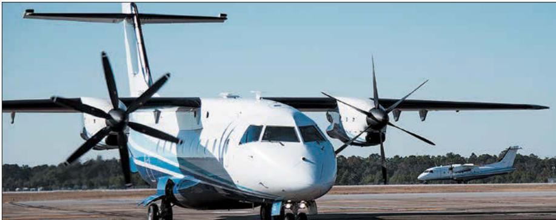  
C-146 Wolfhound   
TSgt. Samuel King Jr./USAF

# EXTANT VARIANT(S)

• C-146A. Preowned civil Dornier 328 modified for SOF airlift.   
Function: Multimission mobility.   
Operator: AFSOC.   
First Flight: December 1991 (Do 328).   
Delivered: From 2011.   
IOC: N/A.   
Production: 20 (converted).   
Inventory: USSOCOM-owned.   
Aircraft Location: Cannon AFB, N.M.; Duke Field, Fla.; forward operating locations worldwide.   
Contractor: Fairchild-Dornier, Sierra Nevada Corp.   
Power Plant: Two Pratt & Whitney 119C turboprops, 2,150 shp.   
Accommodation: Crew: two pilots, one loadmaster. Load: 27 passengers; up to four litters; max cargo 6,000 lb.   
Dimensions: Span 69.6 ft, length 68.8 ft, height 23.8 ft.   
Weight: Max T-O 30,843 lb.   
Ceiling: 31,000 ft.   
Performance: Speed 335 mph, range 2,070 miles (2,000 lb cargo).

# ■ CV-22 OSPREY

Brief: Long-range, multimission tilt-rotor designed to combine the vertical capability of a helicopter with the speed of a fixed wing aircraft.

# COMMENTARY

The CV-22 is a medium-lift vertical takeoff and landing (VTOL) tilt-rotor, primarily used for clandestine long-range, all-weather penetration to insert, recover, and support SOF teams. USAF CV-22Bs are equipped with a fully integrated precision TF/TA radar navigation, digital cockpit management system, FLIR, integrated NVG/ HUD, digital map system, robust self-defense systems, and secure anti-jam comms. CV-22 can conduct shipboard and austere forward operations. It is capable of operating in nuclear, biological, and chemical (NBC) warfare conditions. It deployed to Africa in November 2008 and first saw combat in Iraq in 2009. AFSOC is retrofitting the CV-22 to Block 20 standards, in common with USMC MV-22s. Mods include new cabin lighting, color helmet mounted displays, IR searchlight, lightweight ballistic armor, EW upgrades, and situational awareness enhancements. The Silent Knight TF/TA radar (common to the MC-130J) will replace the current radar with a stealthier, low-altitude night/all-weather navigation radar. Europe-based CV-22s will shift to Spangdahlem AB, Germany, with the planned closure of RAF Mildenhall, UK. New ANG associate units formed to jointly operate aircraft at Hurlburt Field, Fla., and Kirtland AFB, N.M. USAF plans to establish a Pacific-based presence at Yokota AB, Japan, and the final production aircraft is slated for delivery in 2017.

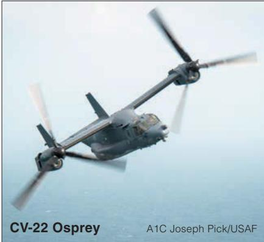

# EXTANT VARIANT(S)

• CV-22B. Air Force special operations variant of the V-22 Osprey.   
Function: Multimission lift.   
Operator: AETC, AFSOC, ANG (associate). First Flight: March 19, 1989 (V-22).   
Delivered: January 2007-present.   
IOC: 2009.   
Production: 50 planned (CV-22; incl two replacements).   
Inventory: 49.   
Aircraft Location: Cannon AFB, N.M.; Hurlburt Field, Fla.; Kirtland AFB, N.M.; RAF Mildenhall, UK. Planned: Spangdahlem AB, Germany. Yokota AB, Japan.   
Contractor: Boeing, Bell Helicopter Textron. Power Plant: Two Rolls Royce-Allison AE1107C turboshafts, each 6,200 shp.   
Accommodation: Crew: two pilots; two flight engineers. Load: 24 troops seated, 32 troops on floor, or 10,000 lb cargo.   
Dimensions: Span 84.6 ft, length 57.3 ft, height 22.1 ft, rotor diameter 38 ft.   
Weight: Max vertical T-O 52,870 lb; max rolling T-O 60,500 lb.   
Ceiling: 25,000 ft.   
Performance: Cruise speed 277 mph, combat radius 575 miles with one internal auxiliary fuel tank, self-deploy 2,100 miles with one in-flight refueling.   
Armament: One .50-caliber machine gun on ramp.

# ■ MC-130P/H COMBAT SHADOW/COMBAT TALON II

Brief: Modified C-130 tasked with day, night, and adverse weather special operations force insertion and air-drop resupply and rotary wing aerial refueling.

# COMMENTARY

The MC-130 is a special operations mobility aircraft, primarily used to conduct infiltration, resupply, and exfiltration of SOF. MC-130E/Hs are equipped with TF/TA radars, precision navigation systems using INS/GPS, and electronic and IR countermeasures for self-protection.

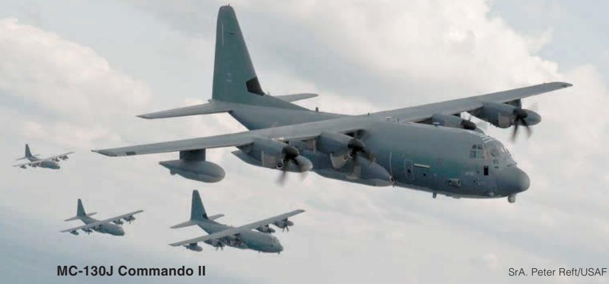

All models are capable of aerial refueling as a receiver and supplier. Aircraft are capable of airdrop, using Joint Precision Airdrop System, and operating from austere and unmarked strips. Fourteen MC-130E were converted from C-130Es. MC-130Ps (previously HC-130N/P) are a specialized aerial refueling version designed to support SOF and were delivered in the mid-1980s. MC-130H were converted from base-model C-130H to supplement the existing Combat Talon I and Combat Shadow fleets in the late 1980s and early 1990s. MC130Hs have integrated glass cockpit and a modernized pod-based aerial refueling system. Ongoing MC-130H mods include center wing replacement, new mission computers, GPS upgrades, permanent Sigint installation, threat warning upgrades, and new lightweight armor. AFSOC is replacing the MC-130P with the new MC-130J, and the California ANG is the variant’s sole remaining user. MC-130Hs from Kirtland AFB, N.M., consolidated to Hurlburt Field, Fla., in 2016, and Kadena AB, Japan, is retaining several H models only until its MC130Js achieve TF/TA capability.

# EXTANT VARIANT(S)

• MC-130P Combat Shadow. SOF support and aerial refueling tanker fielded in 1986.   
• MC-130H Combat Talon II. SOF support and aerial refueling tanker fielded in 1991.   
Function: Special operations airlift/aerial refueling.   
Operator: AFSOC, ANG.   
First Flight: Circa 1965 MC-130E; 1984 MC130H.   
Delivered: Initially 1966.   
IOC: 1986 MC-130P; 1991 MC-130H.   
Production: 22 new-build MC-130Hs.   
Inventory: Four (MC-130P); 17 (MC-130H). Aircraft Location: Hurlburt Field, Fla.; Kadena AB, Japan; Moffett Field, Calif. (MC-130P). Contractor: Lockheed Martin (airframe), Boeing.   
Power Plant: Four Allison T56-A-15 turboprops, each 4,910 shp.   
Accommodation: MC-130H crew: two pilots, navigator, EWO; flight engineer, two loadmasters. MC-130H load: 77 troops, 52 paratroops, or 57 litters.   
Dimensions: Span 132.6 ft, height 38.5 ft, length 99.8 ft.   
Weight: Max T-O 155,000 lb.   
Ceiling: 33,000 ft.   
Performance: Speed 290 mph, range $4 { , } 0 0 0 ^ { + }$ miles (MC-130P); speed 300 mph, range 3,105 miles (MC-130H).

# ■ MC-130J COMMANDO II

Brief: Modified C-130J optimized for lowlevel clandestine operations, aerial refueling

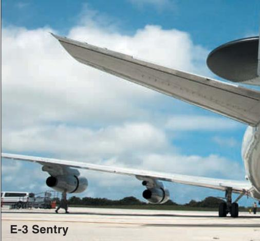

# COMMENTARY

of rotary wing aircraft, and resupply of special operations forces.

MC-130J is a specialized tanker variant of the C-130J, for clandestine intrusion into hostile areas to provide air refueling of SOF helicopters and CV-22s. MC-130J enables infiltration, exfiltration, and resupply. Mods include fully integrated INS/GPS, color cockpit LCDs, NVG lighting, HUDs, integrated defensive systems, digital moving map display, EO/IR system, dual secure voice/data satcom, enhanced cargo handling, and extended-life wings. MC-130Js have secondary leaflet and rubber raiding craft aerial delivery roles for psyops and littoral ingress/ egress. Crew is smaller than legacy models, but includes CSO/auxiliary flight deck stations to handle aerial refueling (otherwise performed by the flight engineer). Loadmasters handle remaining flight engineer/comms functions. The aircraft was redesignated from Combat Shadow II to Commando II in March 2012 and is replacing the MC-130P. European-based MC-130Js will move from RAF Mildenhall, UK, to Spangdahlem AB, Germany, as part of overall force structure adjustments. FY17 funding supports procurement of six airframes. Ongoing upgrades include new Radio Frequency Countermeasure (RFCM) EW system. The MC-130J currently lacks terrain-following/terrain-avoidance (TF/ TA) capability. An MC-130J completed several test sorties with experimental winglets to explore potential efficiency enhancements in 2016. Development and integration of the Silent Knight TF/TA radar will enable low-level nighttime and adverse weather flight with low probability of detection to fully replace legacy platforms.

# EXTANT VARIANT(S)

• MC-130J. New-build aircraft based on the standard-length fuselage C-130J.   
Function: Special operations airlift/aerial refueling.   
Operator: AETC, AFSOC.   
First Flight: April 20, 2011.   
Delivered: September 2011.   
IOC: 2011. Production: 57 (planned).   
Inventory: 35.   
Aircraft Location: Cannon AFB, N.M.; Kadena AB, Japan; Kirtland AFB, N.M.; RAF Mildenhall, UK. Planned: Spangdahlem AB, Germany. Contractor: Lockheed Martin (airframe), Boeing.   
Power Plant: Four Rolls Royce AE2100D3 turboprops, each 4,591 shp.   
Accommodation: Crew: two pilots, CSO; two loadmasters. Load: N/A.   
Dimensions: Span 132.6 ft, length 97.8 ft, height 38.8 ft.   
Weight: Max T-O 164,000 lb.   
Ceiling: 28,000 ft with 42,000-lb payload. Performance: Speed 416 mph, range 3,000 miles.

# ■ U-28A

Brief: A militarized single-engine turboprop used for tactical airborne ISR support to special operations teams.

# COMMENTARY

The U-28A is a modified Pilatus PC-12 employed on worldwide special operations missions. Mods include advanced radio-communications suite, aircraft survivability equipment, EO sensors, and advanced navigation systems. The USSOCOMowned aircraft are operated by AFSOC as a nonstandard fleet. AFSOC first employed the aircraft during Enduring Freedom in Afghanistan and Iraqi Freedom. Ongoing upgrades include Multispectral Targeting System sensor installation on three airframes and Advanced Threat Warning (ATW) system integration fleetwide in response to current threats.

# EXTANT VARIANT(S)

• U-28A. Special operations variant of the civilian Pilatus PC-12.   
Function: Tactical reconnaissance.   
Operator: AFSOC, AFRC.   
First Flight: Circa 1994 (PC-12).   
Delivered: 2006.   
IOC: N/A.   
Production: 36 (converted).   
Inventory: 20 (USSOCOM-owned). Aircraft Location: Cannon AFB, N.M.; Hurlburt Field, Fla.   
Contractor: Pilatus Aircraft Ltd.   
Power Plant: Single Pratt & Whitney PT6A67B, 1,200 shp.   
Accommodation: Two pilots, one CSO, one tactical systems officer.   
Dimensions: Span 53.3 ft, length 47.3 ft, height 14 ft.   
Weight: Max T-O 10,935 lb.   
Ceiling: 30,000 ft.   
Performance: Speed 253 mph, range 1,725 miles.

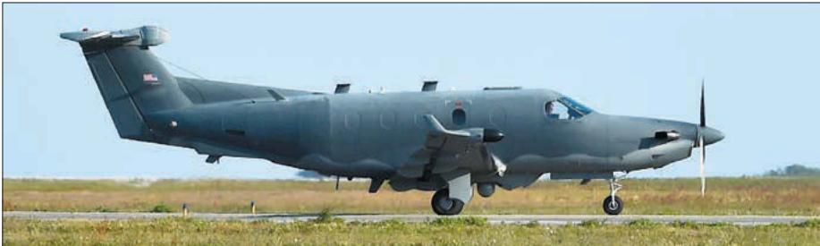

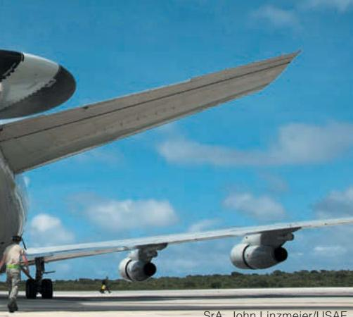

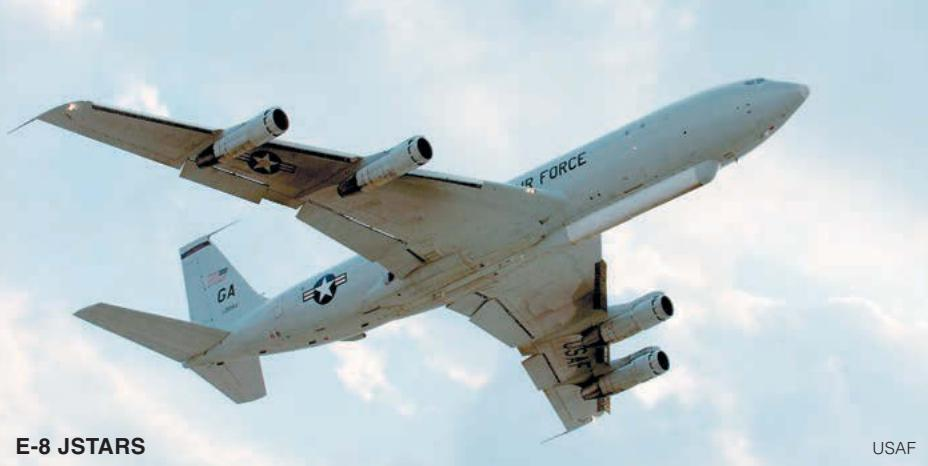

# ■ E-3 SENTRY

# ISR/BM/C3 AIRCRAFT

Brief: Modified Boeing 707 for all-weather air surveillance, command, and control.

# COMMENTARY

The Sentry airborne warning and control system (AWACS) is a heavily modified Boeing 707- 320B capable of surveilling airspace in excess of 200 miles from surface to stratosphere. AWACS coordinates theater air operations in direct subordination to joint/combined air and space operations centers. It can simultaneously conduct C2, BM, and target detection/tracking. E-3Bs were upgraded to Block 30/35 standards in 2001. USAF is equipping the aircraft with interim IFF to keep the variant airspace-compliant until Block 40/45 upgrade or divestiture. Block 40/45 aircraft are redesignated E-3G. The upgrade is the most comprehensive AWACS enhancement to date and improves tracking/ identification, system reliability, and life-cycle cost. Mods include open architecture computing, operator workload reduction, new consoles, improved electronic support measures (ESM), and passive surveillance capability. DRAGON (Diminishing Manufacturing Sources Replacement of Avionics for Global Operations and Navigation) upgrades add a digital cockpit and next generation CNS/GATM. The first of 24 upgraded airframes was delivered to Tinker AFB, Okla., on Jan. 9, 2017. Future upgrades include the Multifunctional Information Distribution System/Joint Tactical Radio System (MIDS/JTRS). Six airframes are undergoing Block 40/45 modification under LRIP, and the first was redelivered in 2014. USAF is upgrading 18 more under full-rate production. Seven AWACS slated for divestiture will be retained to FY19 due to operational demand.

# EXTANT VARIANT(S)

• E-3B. Block 30/35 upgraded aircraft. • E-3C. Block 30/35 upgraded aircraft with additional advanced capabilities. • E-3G. Block 40/45 upgraded aircraft.

Function: Battle management/early warning/C2. Operator: ACC, PACAF, AFRC (associate). First Flight: Oct. 31, 1975 (full avionics). Delivered: March 1977-84.   
IOC: 1977.   
Production: 31.   
Inventory: 16 (E-3B); four (E-3C); 11 (E-3G). Aircraft Location: JB Elmendorf-Richardson, Alaska; Kadena AB, Japan; Tinker AFB, Okla. Contractor: Boeing, Northrop Grumman (radar), Lockheed Martin (computer), Rockwell Collins (DRAGON cockpit upgrade).   
Power Plant: Four Pratt & Whitney TF33-PW100A turbofans, each 21,000 lb thrust.   
Accommodation: Four flight crew, 13-19 mission specialists.   
Dimensions: Span 145.8 ft, length 152.9 ft, height 41.8 ft.   
Weight: Max T-O 335,000 lb.   
Ceiling: Above 35,000 ft.   
Performance: Speed 360 mph, range $5 { , } 0 0 0 ^ { + }$ miles.

# ■ E-4 NATIONAL AIRBORNE OPERATIONSCENTER

Brief: Militarized Boeing 747 modified as airborne operations and nuclear command and control center.

# COMMENTARY

The E-4B is a highly survivable flying C3 center enabling national leaders to direct nuclear and conventional forces, execute emergency war orders, and coordinate civil response actions. It is hardened against the effects of nuclear explosions, including electromagnetic pulse (EMP). Comm and data processing capabilities include EHF Milstar satellite, six-channel International Maritime Satellite, and a triband radome houses SHF communications antenna. All aircraft underwent Block 1 upgrades, enhancing electronic and communications infrastructure with commercial off-the-shelf (COTS) systems. Ongoing development includes replacing Milstar data links with AEHF compatible FAB-T. Other developments include replacing the VLF/LF transmitter and CNS/ATM with civil compliant systems. FY17 funds support purchasing the first production Low Frequency Transmit System (LFTS) kit. USAF is drafting requirements to replace E-4B with a more modern platform. Airframes are viable to 2039, but phaseout of commercial 747-200s hampers sustainment beyond 2020. The fleet transferred from ACC to AFGSC in 2016, aligning with its primarily nuclear role.

# EXTANT VARIANT(S)

• E-4B. Modified Boeing 747-200 equipped as a NAOC.

Function: Nuclear command and control.

Operator: AFGSC.   
First Flight: June 13, 1973 (E-4A); June 10, 1978 (E-4B).   
Delivered: December 1974-85.   
IOC: December 1974 E-4A; January 1980 E-4B. Production: Four.   
Inventory: Four.   
Aircraft Location: Offutt AFB, Neb.   
Contractor: Boeing, Rockwell, Raytheon. Power Plant: Four General Electric CF6-50E2 turbofans, each 52,500 lb thrust.   
Accommodation: Up to 112 flight crew and mission crew.   
Dimensions: Span 195.7 ft, length 231.3 ft, height 63.4 ft.   
Weight: Max T-O 800,000 lb.   
Ceiling: Above 30,000 ft.   
Performance: Speed 602 mph, range 7,130 miles.

# ■ E-8 JSTARS

Brief: Modified Boeing 707 for locating, classifying, and tracking moving ground targets.

# COMMENTARY

E-8C primarily provides theater commanders ground surveillance data to support tactical operations. E-8 evolved from the Army/Air Force Joint Surveillance Target Attack Radar System program. The first two aircraft deployed for Desert Storm while still under development, and early airframes were eventually retrofit to Block 20 production standards, featuring more powerful computers, an Internet protocol local area network, and BLOS connectivity. JSTARS is equipped with a canoe-shaped radome under the forward fuselage housing a 24-ft-long side-looking phased array radar antenna. It can locate, classify, and track vehicles at distances exceeding 124 miles, and recent refinements enable human-target tracking. Target data is transmitted via data link to ground stations or other aircraft. USAF halted modernization funds and retired the program’s T-3 systems integration testbed aircraft in 2015. The service issued a request for proposals to replace the E-8 with a more affordable business-class airframe in late 2016. A contract for 17 aircraft is planned in 2018, with IOC slated for FY24. USAF postponed retiring five aircraft to FY19. Fleetwide retirement depends on full fielding of a replacement.

# EXTANT VARIANT(S)

• E-8C. Block 20 upgraded JSTARS platform based on the Boeing 707-300.   
•TE-8A. Crew training aircraft based on the E-8. Function: Ground surveillance/battle management/C2.   
Operator: ANG.   
First Flight: December 1988. Delivered: May 1996-2005.   
IOC: Dec. 18, 1997.   
Production: 18.   
Inventory: 16 (E-8C); one (TE-8).   
Aircraft Location: Robins AFB, Ga.   
Contractor: Northrop Grumman, Raytheon. Power Plant: Four Pratt & Whitney TF33-102C turbojets, each 19,200 lb thrust.   
Accommodation: Flight crew: four; mission crew: 15 Air Force and three Army operators (can be augmented according to mission). Dimensions: Span 145.8 ft, length 152.9 ft, height 42.5 ft.   
Weight: Max T-O 336,000 lb.   
Ceiling: 42,000 ft.   
Performance: Speed 584 mph (optimal orbit), range 9 hr normal endurance, longer with air refueling.

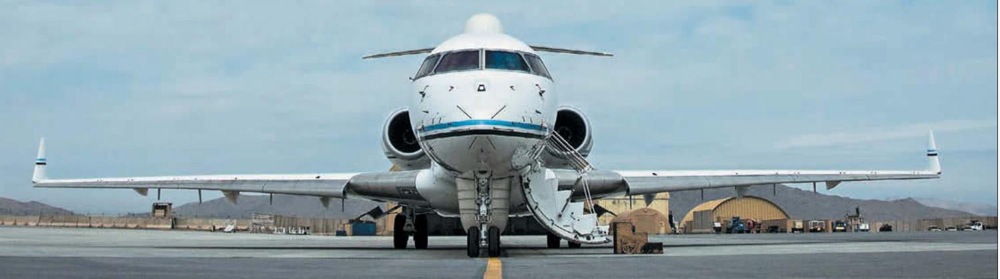

# ■ E-9A WIDGET

Brief: Modified commuter airliner for test tracking and range clearance.

# COMMENTARY

The E-9A is a modified DHC-8 commuter aircraft that provides air-to-air telemetry support for weapons testing, target drone operations, and range clearance for the vast Eglin Test and Training Range over the Gulf of Mexico. Upgrades include AN/APS-143(V-1) airborne sea surveillance radar, UHF telemetry, and signal relay systems. The E-9 is able to track flying and surface targets. It can detect small watercraft at ranges up to 25 miles and alert range safety personnel to clear the area before live-fire testing. The aircraft can also remotely initiate destruction of damaged or malfunctioning aerial target drones.

# EXTANT VARIANT(S)

• E-9A. Military surveillance version of the DHC-8 commuter airliner.   
Function: Range control.   
Operator: ACC.   
First Flight: June 1983 (De Havilland Canada Dash 8).   
Delivered: 1988.   
IOC: June 1988.   
Production: Two.   
Inventory: Two.   
Aircraft Location: Tyndall AFB, Fla.   
Contractor: De Havilland Canada, now Bombardier (airframe), Sierra Research (conversion).   
Power Plant: Two Pratt & Whitney PW-120A turboprop engines, each 1,800 shp.   
Accommodation: Crew: two pilots; two mission operators.   
Dimensions: Span 39.5 ft, length 48.6 ft, height 12.2 ft.   
Weight: Max T-O 34,500 lb.   
Ceiling: 30,000 ft.

Performance: Speed 280 mph, range 1,000 miles.

# ■ E-11A BATTLEFIELD AIRBORNE COMMUNICATIONS NODE

Brief: Modified business jet equipped for tactical communications and data relay.

# COMMENTARY

The E-11A is a modified Bombardier Global Express 6000/BD-700-1A10 business jet equipped with specialized communications relay equipment to translate between tactical data links, provide joint range extension, BLOS C2, and Internet protocol-based data transfer between dissimilar systems. It was fielded to meet an urgent operational need for BLOS communications relay capability between ground troops and other airborne platforms. The system entered combat in Afghanistan in 2008 and enables troops to overcome the limitations of LOS comms in rugged terrain. The Battlefield Airborne Communications Node (BACN) payload is integrated on a mixed fleet of manned E-11As and unmanned EQ-4B Global Hawks. The combined BACN fleet has provided nearconstant coverage in theater. The service is seeking to extend operations and possibly acquire the E-11A as a long-term program.

# EXTANT VARIANT(S)

• E-11A. Modified Bombardier BD-700 equipped with the BACN payload.   
Function: Communications relay.   
Operator: ACC.   
First Flight: Oct. 6, 2003 (BD-700).   
Delivered: December 2008.   
IOC: N/A.   
Production: Four.   
Inventory: Four.   
Aircraft Location: Kandahar Airfield, Afghanistan.   
Contractor: Northrop Grumman, Bombardier. Power Plant: Two Rolls Royce BR710A2-20 turbofans, each 14,750 lb thrust.   
Accommodation: Flight crew: two; mission crew: N/A.   
Dimensions: Span 94 ft, length 99 ft 5 in, height 25 ft 6 in.   
Weight: Max T-O 99,500 lb.   
Ceiling: 51,000 ft.   
Performance: Speed Mach 0.88, range 6,900 miles.

# ■ EC-130H COMPASS CALL

Brief: Heavily modified C-130H used for electronic warfare missions.

# COMMENTARY

The EC-130H is a modified C-130H designed to disrupt enemy C3 and limit adversary coordination essential for force management. The fleet has been deployed near-constantly since the beginning of combat operations in Afghanistan in 2001. All aircraft have been retrofitted to Block 35 standards, and all are aerial refuelable. The aircraft was designed to be easily updated and modified. Mission equipment upgrades, such as new IR countermeasures and modernized comms, occur about every three years to ensure continued protection against evolving threats. USAF is replacing the center wing box to meet wing service life expiration. Ongoing development includes counter-radar/countersatellite navigation, and ongoing upgrades include installation of digital glass cockpits. The first two cockpit-upgraded airframes were redelivered to Davis-Monthan AFB, Ariz., in August 2016. USAF requested to retire seven aircraft, converting one as an NEC-130H testbed. The sole TC-130H crew trainer was retired in July 2016. Congress barred fleetwide retirement, citing emergent high-end threats, and required USAF to draft plans to extend or replace the aircraft with a comparable capability.

# EXTANT VARIANT(S)

• EC-130H. Electronic attack variant of the C-130H.   
• TC-130H. Aircrew trainer stripped of mission equipment.   
Function: EW.   
Operator: ACC.   
First Flight: 1981.   
Delivered: 1982.   
IOC: 1983; Block 30 from February 1999. Production: (Converted).   
Inventory: 14 (EC-130H).   
Aircraft Location: Davis-Monthan AFB, Ariz. Contractor: Lockheed Martin.   
Power Plant: Four Allison T56-A-15 turboprops, each 4,910 shp.   
Accommodation: Two pilots, navigator, two EWOs; flight engineer, mission crew supervisor (cryptologic experienced), four cryptologic linguists, acquisition operator, and airborne maintenance technician.   
Dimensions: Span 132.6 ft, length 99 ft, height 38 ft.   
Weight: Max T-O 155,000 lb.   
Ceiling: 25,000 ft.   
Performance: Speed 300 mph at 20,000 ft.

# ■ EC-130J COMMANDO SOLO/SUPER J

Brief: Modified C-130 designed for psychological warfare, radio/television broadcast, or SOF mobility, depending on variant.

# COMMENTARY

The EC-130 is the Air Force’s primary psychological warfare platform, providing military information support operations (MISO) and civil affairs broadcast. Commando Solo aircraft conducted psychological operations in almost every

US war or contingency operation since 1980. The EC-130J Commando Solo is equipped with radio and color television broadcast equipment for psychological warfare, enhanced navigation, self-protection, and an aerial refueling receptacle. With transition to the EC-130J, USAF added a new, secondary mission resulting in a second variant. Three heavily modified EC-130J Commando Solo aircraft serve as a standard broadcasting station for psychological warfare operations. Four EC-130Js, dubbed Super J, perform secondary, low-cost EA role on top of their special operations mobility (SOFFLEX) mission. SOFFLEX includes personnel and cargo airdrop, combat offload, and infiltration/ exfiltration. FY17 funding supports demodification of three Super Js to make them multimission capable, and procurement of three of the seven planned roll-on/roll-off Removable Airborne MISO Systems (RAMS). RAMS is based on the Army’s Fly Away Broadcast System and will allow the Super J to supplement Commando Solo. All variants are operated by the ANG’s 193rd Special Operations Wing.

# EXTANT VARIANT(S)

• EC-130J Commando Solo. Modified C-130J used for broadcast and psyops.   
• EC-130J Super J. Modified C-130J used for SOF mobility and psyops.   
Function: Psychological warfare/special operations airlift.   
Operator: ANG.   
First Flight: April 5, 1996 (C-130J).   
Delivered: 2003.   
IOC: 2004.   
Production: Seven.   
Inventory: Three (Commando Solo); four (Super J).   
Aircraft Location: Harrisburg Arpt., Pa.   
Contractor: Lockheed Martin, Raytheon.   
Power Plant: Four Rolls Royce-Allison AE2100D3 turboprops, each 4,637 shp.   
Accommodation: Two pilots, flight systems officer, mission systems officer; two loadmasters, five electronic communications systems (CS) operators.   
Dimensions: Span 132.6 ft, length 97.8 ft, height 38.8 ft.   
Weight: Max T-O 164,000 lb.   
Ceiling: 28,000 ft.   
Performance: Speed 335 mph cruise, range 2,645 miles.

# ■ MC-12W LIBERTY

Brief: Militarized commercial twin-engine turboprop used for medium/low-altitude ISR.

# COMMENTARY

The MC-12W is a manned tactical ISR, Sigint, and targeting platform based on the Beechcraft

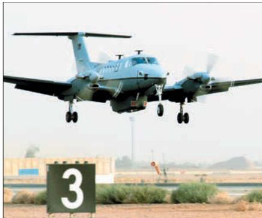  
MC-12W Liberty   
SrA. Tiffany Trojca/USAF

King Air 350. The MC-12W is capable of complete ISR collection, processing, analysis, and dissemination. The aircraft provides ground forces with targeting data and other tactical ISR. Specialized equipment includes FMV, laser designation, various sensors, BLOS connectivity, and satcom. An initial seven King Air 350s were modified with FMV, a ROVER compatible LOS satcom data link, limited Sigint, and basic BLOS connectivity. An additional 30 extended-range King Air 350s were modified, adding enhanced FMV with laser designator, improved Sigint, and increased bandwidth BLOS. The sensor-equipped C-12s were acquired to augment RPA systems operating in Southwest Asia and entered combat in both Iraq and Afghanistan in 2009. ACC divested its 33-strong MC-12 fleet in 2015. The Oklahoma ANG acquired 13 of the airframes to form a dedicated SOF support mission, deploying for the first time to Afghanistan in 2016.

# EXTANT VARIANT(S)

• MC-12W. Modified Beechcraft King Air equipped for battlefield ISR and targeting. Function: Tactical reconnaissance.   
Operator: ANG.   
First Flight: April 2009.   
Delivered: From April 2009.   
IOC: June 2009.   
Production: 42.   
Inventory: 13.   
Aircraft Location: Will Rogers ANGB, Okla. Contractor: Beechcraft, L3 Communications. Power Plant: Two Pratt & Whitney Canada PT6A-60A turboprops, each 1,050 shp.   
Accommodation: Two pilots and two sensor operators.   
Dimensions: Span 57.9 ft, length 46.7 ft, height 14.3 ft.   
Weight: Max T-O 15,000 lb (350) and 16,500 lb (350ER).   
Ceiling: 35,000 ft.   
Performance: Speed 359 mph, range 1,725 miles (350) and 2,760 miles (350ER).

# ■ OC-135 OPEN SKIES

Brief: C-135 variant used for unarmed observation and arms control treaty verification flights.

# COMMENTARY

The OC-135 is a modified WC-135B used for specialized arms control treaty observation and imagery collection missions over nations that are party to the 1992 Open Skies Treaty. Specialized mission equipment includes sidelooking synthetic aperture radar, infrared line scanning devices, video camera, and framing and panoramic optical cameras installed in the rear of the aircraft. The two oblique KS87E framing cameras permit photography from approximately 3,000-ft altitude, and one KA-91C panoramic allows for wide sweep photography from approximately 35,000 ft. USAF is developing a digital camera suite to replace the increasingly obsolete and difficult to maintain wet-film cameras in compliance with a presidential directive. FY17 funds support testing and certification of a prototype digital imaging suite.

# EXTANT VARIANT(S)

• OC-135B. Modified C-135 equipped for photo reconnaissance/treaty verification.   
Function: Observation.   
Operator: ACC.   
First Flight: 1993.   
Delivered: 1993-96.

# OC-135 Open Skies

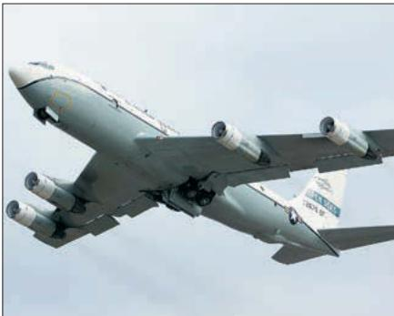  
Tim Felce

IOC: October 1993.   
Production: Three.   
Inventory: Two.   
Aircraft Location: Offutt AFB, Neb.   
Contractor: Boeing.   
Power Plant: Four Pratt & Whitney TF33-P-5 turbofans, each 16,050 lb thrust.   
Accommodation: Flight crew: two pilots, two navigators, and two sensor maintenance technicians; Defense Threat Reduction Agency mission crew: mission commander, deputy, two sensor operators, and one flight follower; total seating: 35, incl space for foreign country representatives.   
Dimensions: Span 131 ft, length 135 ft, height $^ { 4 2 \mathrm { ~ f t ~ } }$ .   
Weight: Max T-O 297,000 lb.   
Ceiling: 50,000 ft (basic C-135).   
Performance: Speed $5 0 0 +$ mph, range 3,900 miles.

# ■ RC-26 CONDOR

Brief: Modified commuter airliner optimized for counternarcotics/manned ISR.

# COMMENTARY

The RC-26 is a modified Fairchild Metro 23 with specialized digital cameras, IR video, and communications equipment, primarily used for domestic and international anti-trafficking operations. The aircraft has a secondary role providing real-time video streaming to disaster relief personnel following hurricanes, wildfires, and other disasters. An extensive communications suite allows communications from 29 to 960 MHz, including provisions for plugging in ${ 8 0 0 ~ \mathsf { M H z } }$ handheld radios, and air phone capabilities. The Air Force originally planned to divest the fleet in FY15, but is funding continued operations.

# EXTANT VARIANT(S)

• RC-26B. Surveillance version of Fairchild C-26.   
Function: Counternarcotics/surveillance/C2.   
Operator: ANG.   
First Flight: 1990.   
Delivered: C-26 first delivered 1989.   
IOC: N/A.   
Production: 11.   
Inventory: 11.   
Aircraft Location: Des Moines Aprt., Iowa;   
Ellington Field, Texas; Fairchild AFB, Wash.;   
Fresno Yosemite Arpt., Calif.; Hancock Field, N.Y.; Jacksonville Arpt., Fla.; Key Field, Miss.;   
Kirtland AFB, N.M.; Montgomery Regional Arpt., Ala.; Truax Field, Wis.; Tucson Arpt., Ariz.;   
Yeager Arpt., W.Va.   
Contractor: Fairchild (airframe).   
Power Plant: Two Garrett TPE331-12UAR-701 turboprops, each 1,100 shp.   
Accommodation: Two pilots, one navigatormission systems operator. Dimensions: Span 57 ft, length 59.5 ft, height 16.6 ft.   
Weight: Max T-O 16,500 lb.   
Ceiling: 25,000 ft.   
Performance: Speed 334 mph, range 2,070 miles.

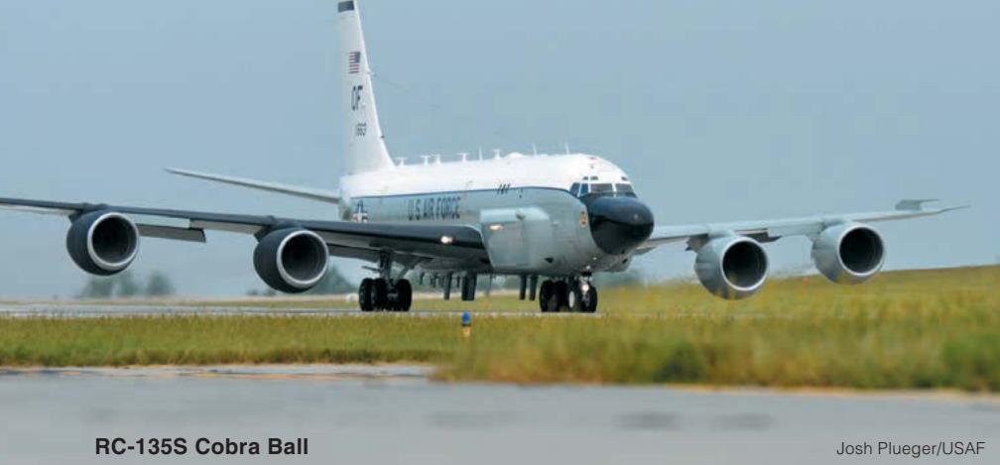

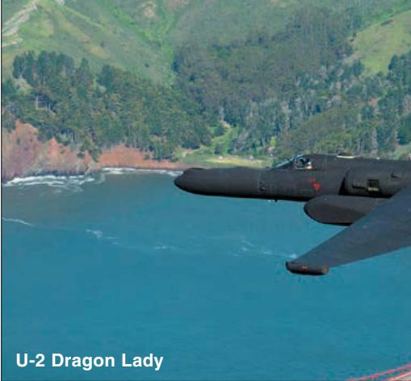

# ■ RC-135S COBRA BALL

Brief: Specially equipped C-135 used to gather measurement and signature intelligence (Masint) on ballistic missile flights.

# COMMENTARY

The RC-135S monitors missile-associated signatures and tracks missiles during boost and re-entry phases to provide reconnaissance for treaty verification and theater ballistic missile nonproliferation. Its specialized equipment includes wide-area IR sensors, long-range optical cameras, and an advanced communications suite. Cobra Ball collects optical and electronic data on ballistic missile activity. It can deploy anywhere in the world in 24 hours and provide on-scene EO reconnaissance. Ongoing upgrades include Wideband Global Satellite reachback connectivity, new airborne tracking system, improved operator interface, liquid cooling system, Rivet Joint Comint suite integration, and capabilities enhancements for operations in dense signal environments.

# EXTANT VARIANT(S)

• RC-135S Cobra Ball. Modified C-135 equipped for Masint/treaty verification.   
Function: Electronic reconnaissance.   
Operator: ACC.   
First Flight: N/A.   
Delivered: Circa 1969-99.   
IOC: Circa 1972.   
Production: Converted.   
Inventory: Three.   
Aircraft Location: Offutt AFB, Neb.   
Contractor: Boeing (original airframe), L3 Communications.   
Power Plant: Four CFM International F108- CF-201 turbofans, each 21,600 lb thrust. Accommodation: Flight crew: two pilots, navigator. Mission crew: three EWOs; two airborne systems engineers, two airborne mission specialists.   
Dimensions: Span 131 ft, length 135 ft, height 42 ft.   
Weight: Max T-O 297,000 lb.   
Ceiling: 45,000 ft.   
Performance: Speed $5 0 0 +$ mph, range 3,900 miles.

# ■ RC-135U COMBAT SENT

Brief: Specially equipped C-135 used to gather technical intelligence (Techint) on adversary radar emitter systems.

# COMMENTARY

The RC-135U collects and examines data on airborne, land, and naval radar systems, providing strategic analysis for National Command Authorities and combatant forces. Its distinctive antennae arrays on the chin and wing tips, large cheek fairings, and extended tail contain specialized Sigint suites to collect scientific and technical Elint data against air-, land-, and sea-based emitter systems. Each airframe has unique reconnaissance equipment. Combat Sent is critical to effective design, programming, and reprogramming of RWRs as well as jammers, decoys, and anti-radiation missiles and to the development of effective threat simulators. FY17 funds support wideband satcom reachback connectivity, integration of Rivet Joint’s Comint suite, improved operator interface, new intercom, and capability enhancement for dense signal environments.

# EXTANT VARIANT(S)

• RC-135U Combat Sent. Modified C-135 equipped for radar emissions analysis.   
Function: Electronic reconnaissance.   
Operator: ACC.   
First Flight: N/A.   
Delivered: Circa 1970-78.   
IOC: Circa 1970s.   
Production: Converted.   
Inventory: Two.   
Aircraft Location: Offutt AFB, Neb.   
Contractor: Boeing (original airframe), L3 Communications, Textron.   
Power Plant: Four CFM International F108- CF-201 turbofans, each 21,600 lb thrust. Accommodation: Flight crew: two pilots, two navigators, two airborne systems engineers; mission crew: 10 EW officers, six or more electronic, technical, mission area specialists. Dimensions: Span 135 ft, length 140 ft, height 42 ft.   
Weight: Max T-O 299,000 lb.   
Ceiling: 35,000 ft.   
Performance: Speed $5 0 0 +$ mph, range unlimited with air refueling.

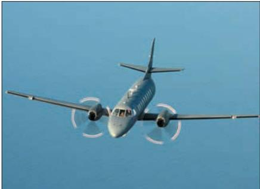  
RC-26 Condor   
Sgt. Lalita Laksbergs/ARNG

# ■ RC-135V/W RIVET JOINT

Brief: Specially equipped C-135 used to gather real-time electronic and signals intelligence for theater and tactical-level commanders.

# COMMENTARY

The RC-135V/W is an extensively modified C-135 performing worldwide reconnaissance missions to detect, identify, and geolocate signals throughout the electromagnetic spectrum. Rivet Joint is mostly used to exploit electronic battlefield intelligence and deliver near realtime ISR information to tactical forces, combatant commanders, and National Command Authorities. Onboard capabilities encompass rapid search, detection, measurement, identification, demodulation, geolocation, and fusion of data from potentially thousands of electronic emitters. Current development efforts include new Sigint signal sets and capability upgrades. Ongoing Baseline 11 upgrades include new direction finding Comint, precision Elint/Sigint system integration, wideband satcoms, enhanced near real-time data dissemination, new steerable beam antenna, improved weather radar, digital cockpit instruments, modernized operator interface, and improved dense signal environment capabilities. Planned upgrades include increased signal bandwidth/exploitation, Distributed Common Ground Station (DCGS) interoperability, and operator station 3-D maps. Britain will receive the last of three RC-135W (dubbed Airseeker) in FY17, to fill an urgent capability gap. USAF/RAF personnel co-crew both fleets.

# EXTANT VARIANT(S)

• RC-135V/W Rivet Joint. Self-contained standoff airborne Sigint variant of the C-135.   
• TC-135W. Training version of the operational aircraft.   
• NC-135W. Rivet Joint systems integration testbed operated by AFMC.   
Function: Electronic reconnaissance.   
Operator: ACC, AFMC.   
First Flight: N/A.   
Delivered: Circa 1973-99. Continuous equipment updates.   
IOC: Circa 1973.   
Production: Converted.   
Inventory: Eight (RC-135V); nine (RC-135W); three (TC-135W); one (NC-135W).   
Aircraft Location: Offutt AFB, Neb.; Kadena AB, Japan; RAF Mildenhall, UK; RAF Waddington, UK (USAF co-manned).   
Contractor: Boeing (original airframe), L3 Communications.   
Power Plant: Four CFM International F108- CF-201 turbofans, each 21,600 lb thrust. Accommodation: Flight crew: three pilots, two navigators; mission crew: three EW officers, 14 intelligence operators, four airborne maintenance technicians, and up to six more, depending on mission.   
Dimensions: Span 131 ft, length 135 ft, height 42 ft.   
Weight: Max T-O 297,000 lb.   
Ceiling: 50,000 ft.   
Performance: Speed $5 0 0 +$ mph, range 3,900 miles.

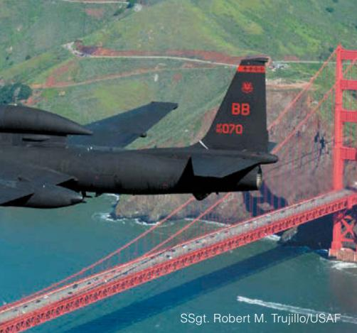

# ■ U-2 DRAGON LADY

Brief: Manned, single-engine, high-altitude, long endurance ISR aircraft.

# COMMENTARY

The U-2 is the Air Force’s manned high-altitude ISR platform, capable of carrying multiple, simultaneous intelligence sensors. U-2 can carry a variety of advanced optical, multispectral EO/IR, SAR, Sigint, and other payloads. U-2 was initially designed in the 1950s, but current U-2s date to the 1980s when the production was reopened to produce the larger and more capable TR-1. S model conversions began in 1994, and all current aircraft are Block 20 configured, featuring a glass cockpit, digital autopilot, modernized EW system, and updated data links. Sensor upgrades include the ASARS-2A SAR sensor, SYERS-2A multispectral EO/IR imagery system, and enhanced Airborne Signals Intelligence Payload (ASIP). The legacy optical bar camera is still in use, providing broad-area synoptic imagery coverage. U-2’s modular payload and open system architecture allow new sensors to be rapidly fielded to meet emerging needs. USAF planned to start retiring the fleet in FY16 due to budget constraints. Congress stipulated the RQ-4 Block 30 achieve sensor parity with the U-2 before the fleet is phased out, delaying retirement to FY19. U-2s are heavily tasked meeting operational demands, and retirement would reduce high altitude ISR capacity by 50 percent. Future funds are limited to flight safety and sustainment, unless critical to national security. Ongoing upgrades include ASARS development, integration, and testing, as well as EO sensor and EW system upgrades, and flight safety and airspace compliance mods. A two-seat TU-2S was destroyed in a crash near Beale AFB, Calif., on Sept. 20, 2016.

# EXTANT VARIANT(S)

• U-2S. Current variant of the U-2/TR-1.   
• TU-2S. A two-seat trainer aircraft originally designated U-2ST.   
Function: High-altitude reconnaissance.   
Operator: ACC.   
First Flight: Aug. 4, 1955 (U-2); 1967 (U-2R);   
October 1994 (U-2S).   
Delivered: 1955-October 1989.   
IOC: Circa 1956. Production: 35 (T/U-2S).   
Inventory: 27 (U-2); five (TU-2 trainers).   
Aircraft Location: Beale AFB, Calif.; permanent forward operating locations worldwide.   
Contractor: Lockheed Martin, Northrop Grumman (ASIP), Raytheon (ASARS), UTC Aerospace (SYERS/Optical Bar Camera).   
Power Plant: General Electric F118-GE-101 turbojet.   
Accommodation: Pilot (U-2S); two pilots (TU-2S) on RQ201 zero/zero ejection seats.   
Dimensions: Span 105 ft, length 63 ft, height 16 ft.   
Weight: Max T-O 40,000 lb.   
Ceiling: Above 70,000 ft.   
Performance: Speed 410 mph, range $^ { 7 , 0 0 0 + }$ miles.

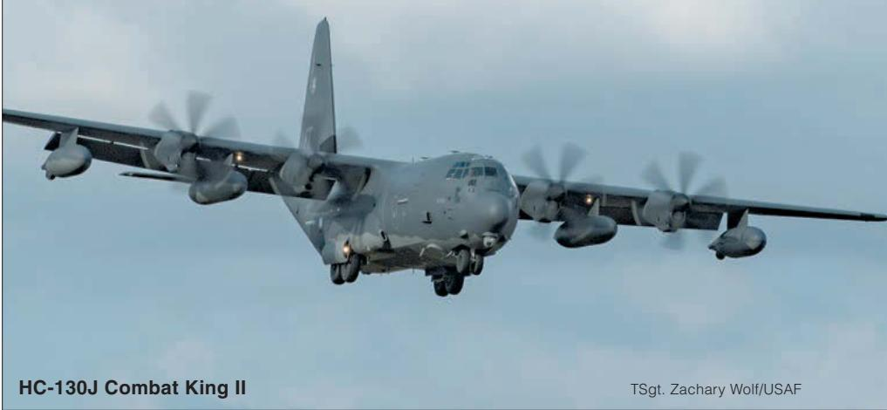

# ■ WC-135 CONSTANT PHOENIX

Brief: Modified C-135 that samples particulate and gaseous atmospheric debris to verify international nuclear test ban treaty compliance.

# COMMENTARY

The WC-135 is either a modified C-135B or EC-135C Looking Glass equipped with air sampling and collection equipment. The air sampling program using the original WB-29 detected debris from the Soviet Union’s first atomic test in 1949 and has since monitored both weapons tests and nuclear disasters, including Chernobyl and more recently Fukushima, Japan. The WC-135’s primary air-sampling mission supports the Nuclear Test Ban Treaty, and its collection suite allows mission crew to detect radioactive “clouds” in real time. The collection system uses external flow-through devices to collect particles on filter paper for later analysis. The fleet has recently been heavily tasked monitoring increased North Korean nuclear weapons tests.

# EXTANT VARIANT(S)

• WC-135C. Modified EC-135C equipped for radiological monitoring and air sampling.   
• WC-135W. Modified C-135B equipped for radiological monitoring and air sampling. Function: Air sampling and collection.   
Operator: ACC.   
First Flight: 1965.   
Delivered: 1965-96.   
IOC: December 1965.   
Production: Converted.   
Inventory: One (WC-135C); one (WC-135W). Aircraft Location: Offutt AFB, Neb.   
Contractor: Boeing.   
Power Plant: Four Pratt & Whitney TF33-P-5 turbofans, each 16,050 lb thrust.   
Accommodation: Seating for 33, incl cockpit crew. Dimensions: Span 131 ft, length 140 ft, height 42 ft. Weight: Max T-O 300,500 lb.   
Ceiling: 40,000 ft.   
Performance: Speed 403 mph, range 4,600 miles.

# TANKER AIRCRAFT

# ■ HC-130J COMBAT KING II

Brief: Extended-range C-130J tanker variant designed for personnel recovery in hostile environments, C2, deploying pararescue (PJ), and helicopter in-flight refueling.

# COMMENTARY

The HC-130J aircraft replaces legacy HC130N/Ps and is based on the USMC’s KC-130J tanker. It adds an enhanced service life wing, improved cargo handling system, refueling receptacle, EO/IR sensor, flight deck CSO console, and dual satcom. Features include integrated INS/GPS, NVG-compatible lighting, FLIR, radar/missile warning receivers, and chaff/flare dispensers. Upgrades would add the Lightweight Airborne Radio System V12 to speed locating isolated personnel and would add the ALQ 213 EW management system to automate/integrate defensive systems. Plans call for continuous common block upgrades for the combined HC/MC-130J fleet. Block 8.1 upgrades which include Link 16, civil GPS and data link, flight management mods, advanced IFF, special mission interface, and satellite-updating real-time flight information are undergoing development and integration. Mode 5 IFF and CNS/ATM upgrades will be fielded ahead of cycle to meet FAA compliance deadlines, in line with the baseline C-130J. USAF awarded two contracts, including a multiyear deal in 2015, covering 14 additional HC-130Js. FY17 funding supports production of three aircraft and USAF expects to complete fleet recap by 2023.

# EXTANT VARIANT(S)

• HC-130J. C-130J modified for CSAR and aerial refueling.   
Function: Aerial refueling/airlift.   
Operator: ACC, AETC. Planned: ANG, AFRC. First Flight: July 29, 2010.   
Delivered: From 2010.   
IOC: 2013.   
Production: 37 (planned).   
Inventory: 19.   
Aircraft Location: Davis-Monthan AFB, Ariz.; Kirtland AFB, N.M.; Moody AFB, Ga. Planned: Francis S. Gabreski Arpt., N.Y.; JB ElmendorfRichardson, Alaska; Patrick AFB, Fla.   
Contractor: Lockheed Martin.   
Power Plant: Four Rolls Royce AE2100D3 turboprops, each 4,591 shp. Accommodation: Flight crew: two pilots, CSO, two loadmasters.   
Dimensions: Span 132.6 ft, length 97.8 ft, height 38.8 ft.   
Weight: Max T-O 164,000 lb.   
Ceiling: 33,000 ft.   
Performance: Speed 363.4 mph at S-L, range $4 { , } 0 0 0 +$ miles.

# ■ HC-130N/P KING

Brief: Extended-range C-130H tanker variant converted for personnel recovery in hostile environments, deploying pararescue (PJ), and helicopter in-flight refueling.

# COMMENTARY

The HC-130N/P conducts operations to austere airfields and denied territory for expeditionary, all-weather personnel recovery operations, including airdrop, air-land, helicopter air-to-air refueling, and forward area refueling point missions. Secondary roles include humanitarian assistance, disaster response, security cooperation/aviation advisory, emergency medical evacuation, noncombatant evacuation, and spaceflight support for NASA. Features include integrated GPS/INS navigation package, NVG lighting, FLIR, radar/missile warning receivers, chaff/flare dispensers, and data-burst communications. Both models suffer airworthiness, maintainability, and operational limitations and are being replaced by HC-130J. Corrosion issues forced early retirement of a significant part of the remaining fleet. Serviceable aircraft were diverted from storage to fill an operational gap at Patrick AFB, Fla., until recapitalization with the HC-130J. The last Active Duty HC-130N/P assigned to AETC at Kirtland AFB, N.M., retired Oct. 4, 2016. The Alaska ANG also retired its final HC-130N/P in January 2017, before reequipping with the HC-130J.

# EXTANT VARIANT(S)

• HC-130N. C-130H model modified with C130E radome, new center wing, and aerial refueling capability.   
• HC-130P. C-130H modified for CSAR and aerial refueling.   
Function: Aerial refueling/airlift.   
Operator: ACC, AETC, ANG, AFRC.   
First Flight: Dec. 8, 1964 (as HC-130H).   
Delivered: From 1965.   
IOC: 1986.   
Production: 33 converted N/P models.   
Inventory: Eight (HC-130N); five (HC-130P). Aircraft Location: Francis S. Gabreski Arpt., N.Y.; Kirtland AFB, N.M.; JB Elmendorf-Richardson, Alaska; Patrick AFB, Fla. Contractor: Lockheed Martin.   
Power Plant: Four Allison T56-A-15 turboprops, each 4,910 shp.   
Accommodation: Two pilots, navigator; flight engineer, airborne comm specialist, two loadmasters, three PJs.   
Dimensions: Span 132.6 ft, length 98.8 ft, height 38.5 ft.   
Weight: Max T-O 155,000 lb.   
Ceiling: 33,000 ft.   
Performance: Speed 289 mph at S-L, range $4 { , } 0 0 0 ^ { + }$ miles.

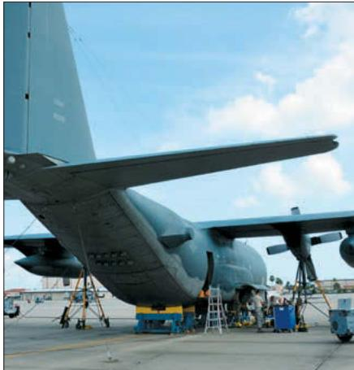

# ■ KC-10 EXTENDER

Brief: Modified McDonnell Douglas DC-10 that combines fixed wing aerial refueling and simultaneous passenger, cargo, or aeromedical transport.

# COMMENTARY

The KC-10 is a modified McDonnell Douglas DC-10-30CF and USAF’s largest air refueling aircraft. It is simultaneously capable of tanker and cargo roles, enabling it to support worldwide fighter deployments. The aircraft employs an advanced aerial refueling boom and hose and drogue system, allowing it to refuel a wide variety of US and allied aircraft within the same mission. It is refuelable by boom-equipped tankers. The aircraft has three large fuel tanks under the cargo floor, an air refueling operator’s station, aerial refueling boom and integral hose reel/ drogue unit, a receiver refueling receptacle, and military avionics. Ongoing mods include modernized navigation, surveillance, and air traffic management (CNS/ATM). Advanced Mode 5 IFF integration is ongoing. Modifications extend service life through 2045.

# EXTANT VARIANT(S)

• KC-10A. Modified McDonnell Douglas DC-10 designed as a multirole cargo-tanker.   
Function: Aerial refueling/airlift.   
Operator: AMC, AFRC (associate).   
First Flight: April 1980.   
Delivered: March 1981-April 1990.   
IOC: August 1982.   
Production: 60.   
Inventory: 59.   
Aircraft Location: JB McGuire-Dix-Lakehurst, N.J.; Travis AFB, Calif.   
Contractor: McDonnell Douglas (now Boeing).   
Power Plant: Three General Electric CF6-50C2 turbofans, each 52,500 lb thrust.   
Accommodation: Crew: two pilots, flight engineer, boom operator; AE crew: two flight nurses, three medical technicians; other crew depending on mission. Load: up to 75 people and 17 pallets or 27 pallets—a total of nearly 170,000 lb.   
Dimensions: Span 165.4 ft, length 181.6 ft, height 58 ft.   
Weight: Max T-O 590,000 lb.   
Ceiling: 42,000 ft.   
Performance: Speed 619 mph, range 11,500 miles, or 4,400 miles with max cargo.

# ■ KC-46 PEGASUS

Brief: Next generation cargo-tanker that will provide fixed wing aerial refueling and simultaneous passenger, cargo, or aeromedical transport.

# COMMENTARY

The KC-46A is a modified Boeing 767-200ER multirole cargo-tanker equipped with flying boom and probe-and-drogue refueling capabil

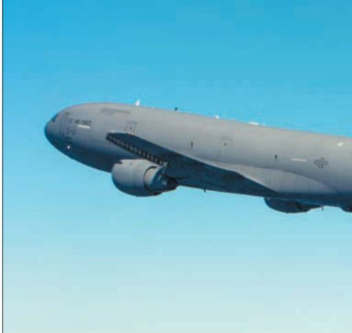

# KC-10 Extender and CV-22 Osprey

ity. In 2011 Boeing was awarded a contract for 179 KC-46A tankers, the first increment (KC-X) toward replacing USAF’s KC-135R fleet. Compared to the 50-year-old KC-135, the KC-46A will have enhanced capabilities, including more fuel capacity, improved efficiency, and enhanced cargo and AE capability. Like the KC-10, it will employ both an advanced refueling boom and independently operating hose and drogue system. The program’s provisioned 767-2C prototype (without refueling boom) flew in late 2014, and the full-up KC-46A flew for the first time from Everett, Wash., Sept. 25, 2015. Japan became the KC-46’s first export customer in 2015. Four airframes are supporting developmental testing at Edwards AFB, Calif., and have completed more than 1,000 combined flight test hours to date. Operational testing is scheduled to begin in April 2017. Higher than expected stress loads encountered during C-17 refueling-compatibility trials forced a limited boom redesign before clearance for LRIP. The service awarded LRIP Lot 1 and Lot 2 contracts for seven and 12 aircraft respectively in August 2016 and a follow-on Lot 3 contract for 15 tankers in January 2017. Eighteen airframes are slated for delivery ahead of planned IOC, which slipped six months to January 2018 due to boom mods.

# EXTANT VARIANT(S)

• KC-46A. Modified Boeing 767 designed as a multirole cargo-tanker.   
Function: Aerial refueling/airlift.   
Operator: AFMC; AMC (planned).   
First Flight: Dec. 28, 2014 (provisioned 767- 2C prototype).   
Delivered: from 2017 (planned).   
IOC: August 2017 (planned).   
Production: 179 (planned).   
Inventory: Two (KC-46A); two (provisioned 767-2C).   
Aircraft Location: Edwards AFB, Calif.; Paine Field, Wash. Planned: Altus AFB, Okla.; McConnell AFB, Kan.; Pease ANGB, N.H.; others TBD. Contractor: Boeing.   
Power Plant: Two Pratt & Whitney 4062, each 62,000 lb thrust.   
Accommodation: 15 crew seats, incl AE crew. Passenger load: 58 or up to 114 for contingency operations. AE load: 58 patients (24 litters and 34 ambulatory). Cargo load: 18 pallet positions, max 65,000 lb.   
Dimensions: Span 157.7 ft, length 165.5 ft, height 52.8 ft.   
Weight: Max T-O 415,000 lb.   
Ceiling: 43,000 ft (767).   
Performance: (767) cruise speed 530 mph, range 6,500 miles.

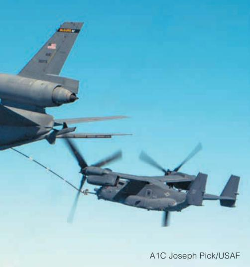

# ■ KC-135 STRATOTANKER

Brief: Medium-range tanker aircraft capable of cargo and AE support.

# COMMENTARY

The KC-135 has been the mainstay of the USAF tanker fleet for some 50 years. It is similar in size and appearance to commercial 707 aircraft but designed to military specifications. The current KC-135R variant first flew in October 1982 and deliveries began in July 1984. Twenty were modified with the Multipoint Refueling System (MPRS), allowing the use of hose-and-drogue pods on each wing to simultaneously refuel two NATO or US Navy aircraft. Non-MPRS modified KC-135s use a single drogue adapter attached to the boom. Upgrades include a modernized digital flight deck. New Global Air Traffic Management upgrades were completed in 2011. Link 16 capability was also added to a limited number of aircraft. KC-135Ts are upgraded and sustained alongside the KC-135R fleet under common programs. USAF plans to modify 395 aircraft with Block 45 upgrades through 2026. These include additional glass cockpit display for engine instrumentation, a radar altimeter, advanced autopilot, and flight director to replace obsolescent systems. The first Block 45 aircraft was redelivered in 2013, and the 45th aircraft was turned over Jan. 27, 2017. Fleet service life is projected out to 2040.

# EXTANT VARIANT(S)

• KC-135R. Re-engined KC-135A/Es fitted with CFM turbofan engines.   
• KC-135T. Former KC-135Qs, able to carry different fuels in wing and fuselage tanks. Function: Aerial refueling/airlift.   
Operator: AETC, AFMC, AMC, PACAF, USAFE, ANG, AFRC.   
First Flight: August 1956.   
Delivered: January 1957-65.   
IOC: June 1957, Castle AFB, Calif.   
Production: 732.   
Inventory: 387 (KC-135R); 54 (KC-135T). Aircraft Location: Altus AFB, Okla.; Beale AFB, Calif.; Fairchild AFB, Wash.; Grissom ARB, Ind.; JB Andrews, Md.; Kadena AB, Japan; MacDill AFB, Fla.; March ARB, Calif.; McConnell AFB, Kan.; RAF Mildenhall, UK; Seymour Johnson AFB, N.C.; Tinker AFB, Okla.; and ANG in Alabama, Alaska, Arizona, Hawaii, Illinois, Iowa, Kansas, Maine, Michigan, Mississippi, Nebraska, New Hampshire, New Jersey, Ohio, Pennsylvania, Tennessee, Utah, Washington, Wisconsin. Planned: New York.   
Contractor: Boeing, Rockwell Collins (Block 45).   
Power Plant: Four CFM International CFM56-

2 (USAF designation F108) turbofans, each   
21,634 lb thrust.

Accommodation: Flight crew: two pilots, boom operator, plus navigator, depending on mission; AE crew: two flight nurses, three medical technicians (adjusted for patient needs). Load: 37 passengers, six cargo pallets, max 83,000 lb.

Dimensions: Span 130.8 ft, length 136.3 ft, height 41.7 ft.

Weight: Max T-O 322,500 lb.

Ceiling: 50,000 ft.

Performance: Speed 530 mph, range 1,500 miles with 150,000 lb transfer fuel, up to 11,015 miles for ferry mission.

# AIRLIFT AIRCRAFT

# ■ C-5 GALAXY

Brief: Air refuelable long-range strategic cargo transport for massive/outsize cargo.

# COMMENTARY

The C-5 is USAF’s largest airlifter and one of the world’s largest aircraft. It can carry unusually heavy cargo over intercontinental ranges. It can take off and land in relatively short distances and taxi on substandard surfaces, if required. The Galaxy’s front and rear cargo doors permit simultaneous drive-through loading/unloading. A total of 81 C-5As were delivered and underwent major wing modifications to extend their service lives but are now being retired. The C-5B first flew in 1985 and embodies all C-5A improvements, including improved turbofans, color weather radar, and triple INS. The first C-5B was delivered in January 1986, and some are equipped with a defensive system. Two C-5As were modified to carry outsize space cargo and redesignated C-5Cs. USAF was upgrading the C-5 fleet through a combination of the Avionics Modernization Program (AMP)—completed in 2011—and Reliability Enhancement and Reengining Program (RERP), ongoing. Upgraded aircraft are designated C-5M Super Galaxy and incorporate new GE CF6-80C2 (F138-GE-100) turbofans, with 200 percent increased thrust, along with avionics and structural reliability fixes. USAF plans to modernize 52 C-5s to C-5M standards, including 49 B models, two C models, and one C-5A. The final C-5B departed for conversion to Super Galaxy standards in January 2017. FY17 funds support CNS/ATM upgrades aided by a new core mission computer and weather radar. Other mods include modernized IR countermeasures and lavatory redesign to address leaking/corrosion issues.

# EXTANT VARIANT(S)

• C-5B. Improved aircraft with strengthened wings and improved engines and avionics.

• C-5A. Basic model delivered between 1969 and 1973.

• C-5C. Modified C-5As capable of carrying outsize NASA space cargo.   
• C-5M. Super Galaxy, including AMP and RERP modified legacy C-5s.   
• C-5M-SCM. Super Galaxy converted from C-5C to carry large NASA cargo.   
Function: Strategic airlift.   
Operator: AFMC, AMC, AFRC.   
First Flight: June 30, 1968 (C-5A); June 6, 2006 (C-5M).   
Delivered: October 1969-April 1989.   
IOC: September 1970.   
Production: 131.   
Inventory: Five (C-5A); four (C-5B); one (C-5C); 37 (C-5M); one (C-5M-SCM).   
Aircraft Location: Dover AFB, Del.; JBSALackland, Texas; Travis AFB, Calif.; Westover ARB, Mass.   
Contractor: Lockheed Martin.   
Power Plant: Four General Electric TF39-GE1C turbofans, each 43,000 lb thrust; (C-5M) four General Electric F138-GE-100 turbofans. Accommodation: Crew: two pilots, two flight engineers, three loadmasters. Load: 81 troops and 36 standard pallets, max 270,000 lb. There is no piece of Army combat equipment the C-5 can’t carry.   
Dimensions: Span 222.9 ft, length 247.1 ft, height 65.1 ft.   
Weight: Max T-O 840,000 lb.   
Ceiling: 45,000 ft.   
Performance: Speed 518 mph, range 2,473 miles with max payload (plus additional 575 miles after offload).

# ■ C-12 HURON

Brief: Militarized civil twin-engine turboprops used for diplomatic/special duties, light passenger/cargo airlift, and test support.

# COMMENTARY

The C-12 family includes a series of military versions based on the Beechcraft King Air A200 and 1900C aircraft. Flight decks and cabins are pressurized for high-altitude flight. The most common variant incorporates a cargo door with an integral airstair. Both C-12C and C-12D aircraft are deployed to US embassies worldwide. The C-12J is a completely different aircraft, based on the Beechcraft 1900C commuter airliner. C-12Js are operated by PACAF and can transport two litters or 10 ambulatory patients in the AE role. C-12Js incorporate extensive avionics upgrades, including three MFDs, integrated GPS, flight management systems, autopilot, VHF/UHF radios, and weather radar. Current updates encompass basic safety, reliability, and maintainability mods.

# EXTANT VARIANT(S)

• C-12C. C-12As retrofit with PT6A-41 engines. • C-12D. C-12 with enlarged cargo doors and strengthened wings.

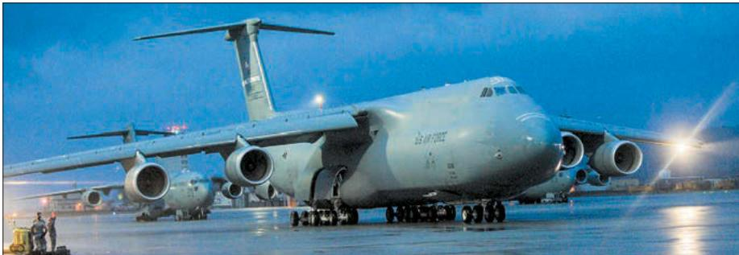  
C-5M Galaxy

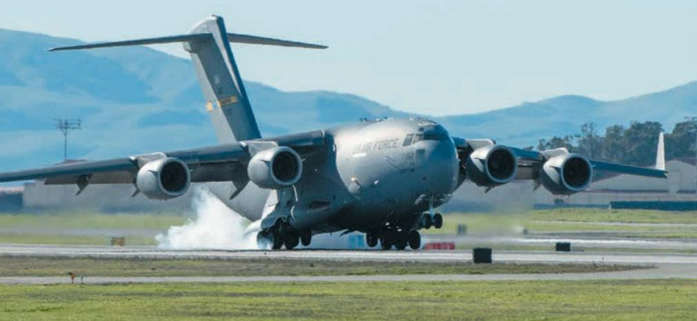  
Heide Couch/USAF

# C-20B Gulfstream

# C-17 Globemaster III

• C-12F. C-12 with uprated PT6A-42 engines, eight passenger capacity, and AE litter accommodation.   
• C-12J. Military version of the Beechcraft Model 1900C commuter airliner.   
Function: Light airlift.   
Operator: AFMC, PACAF.   
First Flight: Oct. 27, 1972 (Super King Air 200). Delivered: 1974-late 1980s.   
IOC: Circa 1974.   
Production: 88.   
Inventory: 16 (C-12C); six (C-12D); three (C12F); four (C-12J).   
Aircraft Location: Edwards AFB, Calif.; Holloman AFB, N.M.; JB Elmendorf-Richardson, Alaska; Yokota AB, Japan; various US embassies.   
Contractor: Beechcraft.   
Power Plant: (C-12J) two Pratt & Whitney Canada PT6A-65B turboprops, each 1,173 shp. Accommodation: Crew: two pilots; load: (C-12J) up to 19 passengers or 3,500 lb cargo.   
Dimensions: (C-12J) Span 54.5 ft, length 57 ft, height 15 ft.   
Weight: (C-12J) max T-O 16,710 lb.   
Ceiling: (C-12J) 25,000 ft.   
Performance: (C-12J) speed 284 mph, range 1,669 miles.

# ■ C-17 GLOBEMASTER III

Brief: Heavy-lift, air refuelable cargo aircraft capable of both strategic airlift and direct tactical delivery of all classes of military cargo.

# COMMENTARY

C-17 is the US military’s core airlifter. It is able to operate on small, austere airfields (3,500 ft by 90 ft) previously limited to C-130s. It is the only aircraft able to directly deliver or air-drop outsize cargo into a tactical environment and is the first military transport to feature full digital fly-by-wire control. Boeing delivered the 223rd and final USAF aircraft on Sept. 12, 2013, and the final international aircraft on Nov. 29, 2015. Fleetwide Block 16 avionics and weather radar mods were completed in 2015, and all aircraft will be upgraded to the final Block 20 production standard through regular programmed depot maintenance cycles. Block 20 retrofits include some 60 programs to bring early production aircraft to a common configuration. Ongoing mods include next generation Large Aircraft Infrared Countermeasures (LAIRCM) to combat the proliferation of man portable air defenses, next generation CNS/GATM, Mode 5 IFF, dynamic retasking, and structural, safety, and sustainment mods. Ongoing development includes the C-17 Advanced Technology Demonstration (ATD), which is testing high efficiency engines and drag-reduction devices to improve economy; next generation BLOS comms and GPS; and HUD replacement.

# EXTANT VARIANT(S)

• C-17A. Long-range airlifter.   
Function: Tactical/strategic airlift.   
Operator: AETC, AMC, PACAF, ANG, AFRC. First Flight: Sept. 15, 1991.   
Delivered: June 1993-September 2013.   
IOC: Jan. 17, 1995.   
Production: 223.   
Inventory: 222.   
Aircraft Location: Allen C. Thompson Field-Jackson-Evers Arpt., Miss.; Altus AFB, Okla.; Dover AFB, Del.; Eastern West Virginia Arpt., W.Va.; JB Charleston, S.C.; JB Elmendorf-Richardson, Alaska; JB Lewis-McChord, Wash.; JB McGuireDix-Lakehurst, N.J.; JB Pearl Harbor-Hickam, Hawaii; March ARB, Calif.; Stewart ANGB, N.Y.; Travis AFB, Calif.; Wright-Patterson AFB, Ohio. Contractor: Boeing.   
Power Plant: Four Pratt & Whitney F117-PW-100 turbofans, each 40,440 lb thrust.   
Accommodation: Flight crew: two pilots, loadmaster; AE crew: two flight nurses, three medical technicians (altered as required). Load: 102 troops/paratroops; 36 litter and 54 ambulatory patients; 18 pallet positions; max payload 170,900 lb.   
Dimensions: Span 169.8 ft, length 174 ft, height 55.1 ft.   
Weight: Max T-O 585,000 lb.   
Ceiling: 45,000 ft.   
Performance: Speed 518 mph at 25,000 ft, range 2,760 miles with 169,000 lb payload.

# ■ C-20 GULFSTREAM

Brief: Twin-engine executive airlift asset for transporting high-ranking government officials.

# COMMENTARY

C-20A/B transport DOD and other government officials worldwide. The C-20B, delivered in 1988, has specialized mission communications equipment and a revised interior. The

C-20H, equipped with advanced technology flight management systems and upgraded Rolls Royce engines, was acquired in 1992. Specialized features include GPS, vertical separation equipment, GATM, and traffic collision avoidance system (TCAS). The Air Force is divesting the C-20B and C-20H aircraft, due to the limited life remaining on the airframes.

# EXTANT VARIANT(S)

• C-20B. Modified and upgraded Gulfstream III aircraft.   
• C-20H. Modified Gulfstream IV SP aircraft. • C-20K. Modified Gulfstream III comm integration testbed.   
Function: VIP transport.   
Operator: AMC, USAFE.   
First Flight: December 1979.   
Delivered: September 1983-89.   
IOC: Circa 1983.   
Production: N/A.   
Inventory: Three (C-20B); two (C-20H).   
Aircraft Location: JB Andrews, Md.; Ramstein AB, Germany.   
Contractor: Gulfstream.   
Power Plant: Two Rolls Royce Spey MK511-8 turbofans (C-20B), each 11,400 lb thrust; two Rolls Royce Tay MK611-8 turbofans (C-20H), each 13,850 lb thrust.   
Accommodation: Crew: two pilots, flight engineer, communications system operator, flight attendant. Load: 12 passengers.   
Dimensions: Span 77.8 ft, length 83.1 ft (B), 88.3 ft (H), height 24.5 ft.   
Weight: Max T-O 69,700 lb (B), 74,600 lb (H). Ceiling: 45,000 ft.   
Performance: Speed 576 mph, range 4,250 miles (B), 4,850 miles (H).

# ■ C-21 LEARJET

Brief: Light airlift asset capable of cargo, passenger, and aeromedical transport.

# COMMENTARY

The C-21 is a militarized Learjet 35 equipped

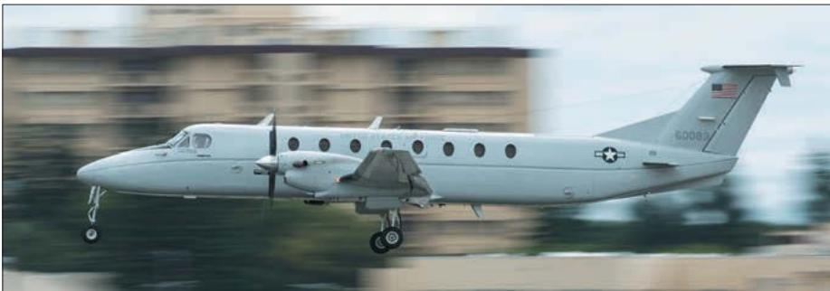  
C-12 Huron

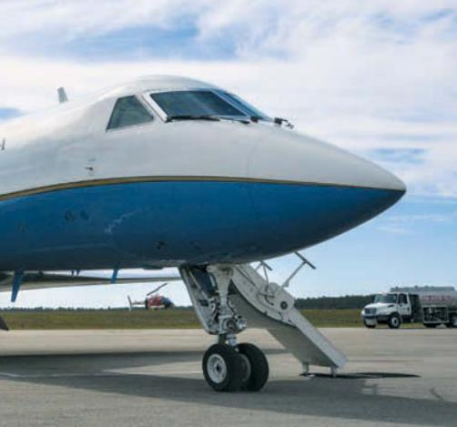  
SMSgt. Kevin Wallace/USAF

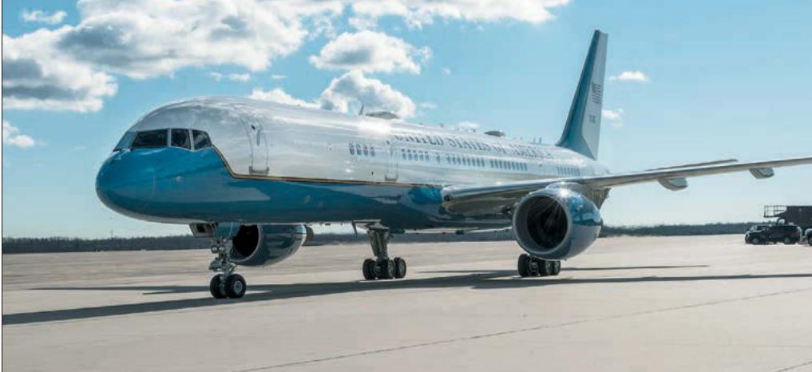

# C-32 Air Force Two

with color weather radar, TACAN, and HF/VHF/ UHF radios. It provides operational support for time-sensitive movement of people and cargo throughout the US and the European Theater, including AE missions if required. Ongoing upgrades support modifying 19 aircraft with modern digital systems, including new weather radar, GPS, flight management system, Mode 5 transponder, and satellite-updating real-time flight information to comply with FAA standards.

# EXTANT VARIANT(S)

• C-21A. Military version of the Learjet 35A. Function: Light airlift.   
Operator: AMC, USAFE, ANG.   
First Flight: January 1973.   
Delivered: April 1984-October 1985.   
IOC: April 1984.   
Production: 84.   
Inventory: 24.   
Aircraft Location: JB Andrews, Md.; Peterson AFB, Colo.; Ramstein AB, Germany; Scott AFB, Ill.   
Contractor: Bombardier (previously Gates Learjet).   
Power Plant: Two AlliedSignal TFE731-2 turbofans, each 3,500 lb thrust.   
Accommodation: Crew: two pilots; AE crew: flight nurse, two medical technicians (adjusted as required). Load: eight passengers and 3,153 lb cargo; one litter or five ambulatory patients. Dimensions: Span 39.5 ft, length 48.6 ft, height 12.2 ft.   
Weight: Max T-O 18,300 lb.   
Ceiling: 45,000 ft.   
Performance: Speed 530 mph at 41,000 ft, range 2,306 miles.

# ■ C-32B/C-32A AIR FORCE TWO

Brief: Commercial aircraft used for dedicated vice presidential and distinguished visitor (DV) airlift.

# COMMENTARY

The C-32A was acquired as a commercial Boeing 757 and primarily provides vice presidential airlift under the call sign Air Force Two. Aircraft assigned to the 89th Airlift Wing at JB Andrews, Md., additionally serve the first lady, the vice president, and Congress and Cabinet officials. The cabin is divided into sections including a worldwide clear and secure voice and data communications suite, first-class cabin, two business-class cabins, center galley, lavatories, fully enclosed stateroom, and a conference and staff area. The C-32B provides DOD rapid, global airlift in support of government crisis response efforts. The C-32’s modern flight deck avionics are upgradable, and new developments include nitrogen fuel-tank inerting and commercial wideband satcom mods. FY17 funds support commercial WGS integration as well as CNS/ATM upgrades to meet future airspace standards.

# EXTANT VARIANT(S)

• C-32A. Presidential support-configured commercial Boeing 757-200 airliner.   
• C-32B. Commercial Boeing 757-200 tasked with global crisis response airlift.   
Function: VIP transport.   
Operator: AMC, ANG.   
First Flight: Feb. 19, 1982 (USAF Feb. 11, 1998). Delivered: June-December 1998.   
IOC: 1998.   
Production: Six.   
Inventory: Four (C-32A); two (C-32B).   
Aircraft Location: JB Andrews, Md.; JB McGuire-Dix-Lakehurst, N.J.   
Contractor: Boeing.   
Power Plant: Two Pratt & Whitney PW2040 turbofans, each 41,700 lb thrust.   
Accommodation: Crew: 16 (varies with mission). Load: up to 45 passengers.   
Dimensions: Span 124.6 ft, length 155.2 ft, height 44.5 ft.   
Weight: Max T-O 255,000 lb.   
Ceiling: 42,000 ft.   
Performance: Speed 530 mph, range 6,325 miles.

# ■ C-37 GULFSTREAM V

Brief: Modified business jet used for worldwide special air missions and DV support.

# COMMENTARY

The C-37 family consists of military versions of ultra-long-range Gulfstream business aircraft. The C-37A is based on the Gulfstream V and equipped with separate VIP and passenger areas, secure global voice and data communications suites, enhanced weather radar, autopilot, and advanced HUD. The C-37B incorporates directional IR countermeasures for self-defense and the advanced Honeywell Plane-View flight deck. Ongoing mods include commercial wideband satcom, to ensure senior leaders access to secure data and voice networks, and FAA-required CNS/ATM updates.

# EXTANT VARIANT(S)

• C-37A. Military version of the Gulfstream V.   
• C-37B. Military version of the Gulfstream G550.   
Function: VIP transport.   
Operator: AMC, PACAF, USAFE.   
First Flight: USAF October 1998.   
Delivered: From October 1998.   
IOC: Dec. 9, 1998.   
Production: 10 (C-37A); three (C-37B).   
Inventory: Nine (C-37A); three (C-37B). Aircraft Location: Chievres, Belgium; JB Andrews, Md.; JB Pearl Harbor-Hickam, Hawaii; MacDill AFB, Fla.   
Contractor: Gulfstream.   
Power Plant: Two BMW/Rolls Royce BR710A1-10 turbofans, each 14,750 lb thrust.   
Accommodation: Crew: five. Load: up to 12 passengers.   
Dimensions: Span 93.5 ft, length 96.4 ft, height 25.8 ft.   
Weight: Max T-O 90,500 lb.   
Ceiling: 51,000 ft.   
Performance: Speed 600 mph, range 6,300 miles.

# ■ C-40 CLIPPER

Brief: Commercial-based aircraft used primarily for medium-range DV airlift.

# COMMENTARY

The C-40 is based on the commercial Boeing 737-700 and is used to transport senior military commanders, Cabinet officials, and members of Congress and to perform other operational support missions. C-40Bs are equipped with an office-in-the-sky arrangement, including clear and secure voice/data communication and broadband data/video. C-40Cs lack the advanced communications suite, are VIP configured with sleep accommodations, and are reconfigurable to carry 42 to 111 passengers. Both versions have modern avionics, integrated GPS and flight management system/electronic flight instrument system, and HUD. Each aircraft has auxiliary fuel tanks and managed passenger communications. Ongoing mods include nitrogen fuel tank inerting for the C-40C and commercial wideband satcom on the C-40B, to ensure leader’s secure top-secret voice, data, and video links. Additional mods include navigation, and air traffic management compliance, and low-cost sustainment upgrades. The fleet is designed for a 30-year service life, with 23 years remaining.

# EXTANT VARIANT(S)

• C-40B. Military version of the Boeing 737-700 with added winglets.   
• C-40C. VIP configured Boeing 737-700 with added winglets, but lacking advanced comms. Function: VIP transport.   
Operator: AMC, PACAF, USAFE, ANG, AFRC. First Flight: USN C-40A: April 14, 1999.   
Delivered: 2002.   
IOC: N/A.   
Production: 11.   
Inventory: Four (C-40B); seven (C-40C). Aircraft Location: JB Andrews, Md.; JB Pearl Harbor-Hickam, Hawaii; Ramstein AB, Germany; Scott AFB, Ill.   
Contractor: Boeing. Power Plant: Two General Electric CFM56-7 turbofans, each 27,000 lb thrust.   
Accommodation: Crew: 10 (varies with model and mission). Load: up to 89 passengers (C40B); up to 111 (C-40C).   
Dimensions: Span 117.4 ft, length 110.3 ft, height 41.2 ft.   
Weight: Max T-O 171,000 lb.   
Ceiling: 41,000 ft.   
Performance: Speed 530 mph, range 5,750 miles.

# C-130H HERCULES

Brief: Medium-range tactical airlifter capable of operating from unimproved airstrips and providing intertheater support.

# COMMENTARY

The C-130H is an all-purpose theater transport that performs diverse roles, including tactical and intertheater airlift and airdrop support, Arctic resupply, AE, aerial spraying, aerial firefighting, and humanitarian missions. The H model improved on the C-130E and was delivered starting in 1965, with the current, more advanced models delivered starting in 1974. Improvements included uprated engines, redesigned outer wing, improved pneumatic systems, new avionics, improved radar, and NVG lighting. The last C-130E retired in FY15, and C-130Hs are being replaced by the C-130J. The New York ANG operates the small fleet of LC-130H for Antarctic support. The LC-130H had been upgraded with eight-bladed propellers, digital displays and flight management systems, multifunction radar, modernized comms, and a single air data computer. WC-130Hs are operated by the Puerto Rico ANG and are equipped with palletized mission equipment for tropical storm data collection. Ongoing upgrades include C-130H Avionics Modernization Program (previously Viability and Airspace Access Program). It will bring legacy aircraft in compliance with international airspace, navigation, and communications rules, as well as critical center wing box replacement to 54 airframes.

# EXTANT VARIANT(S)

• C-130H Hercules. Updated legacy C-130 version.   
• LC-130H Skibird. Arctic support variant with wheel-ski gear.   
• WC-130H. Weather reconnaissance version of C-130H.   
Function: Tactical airlift.   
Operator: AMC, PACAF, ANG, AFRC.   
First Flight: August 1954 (C-130A).   
Delivered: 1974-96.   
IOC: Circa 1974.   
Production: 308.   
Inventory: 217 (C-130H); 10 (LC-130H); seven (WC-130H).   
Aircraft Location: Dobbins ARB, Ga.; Little Rock AFB, Ark.; Maxwell AFB, Ala.; Minneapolis-St. Paul Arpt./ARS, Minn.; Peterson AFB, Colo.; Pittsburgh Arpt., Pa.; Yokota AB, Japan; Youngstown ARS, Ohio; and ANG in Alaska, Arkansas, Connecticut, Delaware, Georgia, Illinois, Kentucky, Minnesota, Missouri, Montana, Nevada, New York, North Carolina, Ohio, Puerto Rico, Texas, West Virginia, Wyoming. Contractor: Lockheed Martin.   
Power Plant: Four Allison T56-A-15 turboprops, each 4,591 shp.   
Accommodation: Crew: two pilots, navigator, flight engineer, loadmaster. Load: up to 92 combat troops or 64 paratroopers or 74 litters or six cargo pallets or 16 Container Delivery System (CDS) bundles or any combination of these up to max weight for each version.   
Dimensions: Span 132.6 ft, length 97.8 ft, height 38.8 ft.; J-30 length 112.8 ft.   
Weight: Max T-O 155,000 lb; max payload 42,000 lb. Ceiling: With max payload, 23,000 ft.   
Performance: Speed 366 mph; range with 35,000 lb payload 1,496 miles.

# ■ C-130J SUPER HERCULES

Brief: Medium-range tactical airlifter capable of operating from unimproved airstrips and providing intertheater support.

# COMMENTARY

The C-130J is the upgraded, current production version of the C-130 all-purpose theater transport. Missions include tactical and intertheater airlift and airdrop support, AE, weather reconnaissance, wildfire suppression using the Modular Airborne Firefighting System (MAFFS), and humanitarian relief. The aircraft first deployed in combat in Southwest Asia in 2004. AFRC’s “Hurricane Hunters” at Keesler AFB, Miss., operated the only WC-130Js, which are equipped with palletized equipment to measure tropical and winter storms. The Super Hercules features a three-crew flight operations system, more powerful engines, composite six-blade propeller system, digital avionics, and mission computers. The C-130J can fly faster, higher, and farther than earlier C-130s. The C-130J-30 variant features a 15-foot longer “stretched” fuselage. The combined fleet is sustained via block upgrades. USAF is combining the future Block 7/8.1 upgrades to reduce modification down time. Block 7 includes Link 16, new flight management systems, civil GPS, and a special mission processor. Block 8.1 adds improved LOS data link and BLOS comms, improved precision navigational aids, enhanced covert lighting, replaces UHF comms with satcoms, and updates mission planning systems. Mode 5 IFF and air traffic management upgrades will be fielded ahead of cycle to meet FAA compliance deadlines. The current multiyear contract includes 29 USAF C-130Js. FY17 funds support production of three aircraft, including one operational loss replacement.

# EXTANT VARIANT(S)

• C-130J Super Hercules. Current production version.

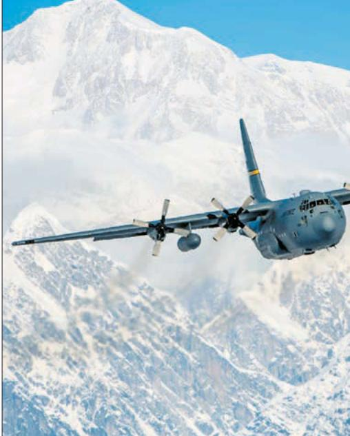

# C-130 Hercules

• C-130J-30 Super Hercules. Stretched version capable of larger payloads.   
• WC-130J. Weather reconnaissance version of C-130J.   
Function: Tactical airlift.   
Operator: AETC, AMC, PACAF, USAFE, ANG, AFRC.   
First Flight: April 1996.   
Delivered: February 1999-present.   
IOC: October 2006.   
Production: $^ { 3 3 0 + }$ .   
Inventory: 107 (C-130J); 10 (WC-130J).   
Aircraft Location: Dyess AFB, Texas; Keesler AFB, Miss.; Little Rock AFB, Ark.; Ramstein AB, Germany; and ANG in California, Kentucky, Rhode Island. Planned: Maryland. Contractor: Lockheed Martin.   
Power Plant: Four Rolls Royce AE2100D3 turboprops, each 4,700 shp.   
Accommodation: Crew: two pilots, loadmaster. Load: up to 92 combat troops or 64 paratroopers or 74 litters or six cargo pallets or 16 Container Delivery System (CDS) bundles or any combination of these up to max weight (J); 128 combat troops or 92 paratroopers or 97 litters or eight pallets or 24 CDS bundles or any combination of these up to max weight (J-30).   
Dimensions: Span 132.6 ft, length 97.8 ft, height 38.8 ft.; J-30 length 112.8 ft.   
Weight: Max T-O 155,000 lb (J), 164,000 lb (J30); max payload 42,000 lb (J), 44,000 lb (J-30). Ceiling: With max payload, 26,000 ft (J), 28,000 (J-30).   
Performance: Speed 417 mph (J), 410 mph (J-30); range with 35,000 lb payload 1,841 miles (J), 2,417 miles (J-30).

# ■ VC-25 AIR FORCE ONE

Brief: Modified Boeing 747 used for presidential air transport.

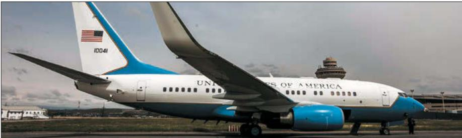  
C-40B Clipper

# COMMENTARY

The VC-25 is a specially configured Boeing 747-200B equipped for airlifting the President and his entourage. VC-25s operate under the call sign Air Force One when the President is aboard, and SAM (Special Air Mission) during non-presidential flights. Aircraft are equipped with staff work areas, a conference room, a general seating area, and an executive office. Communications capability includes worldwide secure and clear communications, data links, and a full self-defensive suite. The fleet is operated by the Presidential Airlift Group at the 89th Airlift Wing, JB Andrews, Md. Ongoing mods include nitrogen fuel tank inerting, commercial wideband satcom, and service life extension. USAF plans to replace VC-25s with a modified version of Boeing’s latest 747-8 intercontinental airliner. The fleet has five years’ estimated service life remaining and requires a life extension/block upgrade to remain viable until replacement aircraft are fielded. Required mods include protected satcom, chillers, nitrogen generation system, weather radar, digital/ voice data, and network upgrades. SLEP efforts will be accomplished during regular depot maintenance starting in FY17. Boeing is conducting initial design and risk reduction work to modify two 747-8 replacement aircraft, planned for delivery starting in 2024.

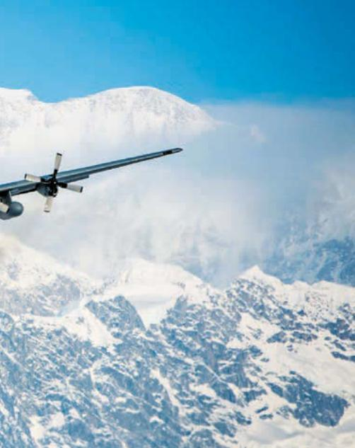  
SSgt. Edward Eagerton/ANG

# EXTANT VARIANT(S)

• VC-25A. Specially configured presidential support version of the Boeing 747-200B.   
Function: Presidential airlift.   
Operator: AMC.   
First Flight: First flown as Air Force One Sept. 6, 1990.   
Delivered: August-December 1990.   
IOC: Circa 1990.   
Production: Two.   
Inventory: Two.   
Aircraft Location: JB Andrews, Md.   
Contractor: Boeing.   
Power Plant: Four General Electric CF6-80C2B1 turbofans, each 56,700 lb thrust.   
Accommodation: Crew: 26; load: up to 76 passengers.   
Dimensions: Span 195.7 ft, length 231.8 ft, height 63.4 ft.   
Weight: Max T-O 833,000 lb.   
Ceiling: 45,100 ft.   
Performance: Speed 630 mph, range 7,800 miles.

# HELICOPTERS

# ■ HH-60 PAVE HAWK

Brief: Armed CSAR variant of the UH-60 Black Hawk capable of medevac, disaster, and humanitarian response and other support missions.

# COMMENTARY

The HH-60G Pave Hawk is a highly modified

# VC-25 Air Force One

Black Hawk helicopter equipped with advanced INS/GPS/Doppler navigation systems, satcom, and secure/anti-jam communications. It is fitted with a personnel locating system (PLS) that aids location of survivor’s radio. It includes automatic flight control, NVG lighting, FLIR, engine/rotor blade anti-ice system, in-flight refueling probe, additional fuel tanks, and an integral rescue hoist. Combat enhancements include a full selfdefensive suite and two miniguns or .50-caliber guns. Ongoing fleet upgrades include color weather radar, improved TACAN, new RWR, auto direction finding, and digital intercoms. Future upgrades include new FLIR/Laser Radar turret to enhance situational awareness in low visibility condition, over-the-horizon comms for long-range ops in remote areas, and a rotor brake for shipboard operations. The first Army surplus UH-60L converted as an operational loss replacement was delivered June 28, 2016. The converted airframes will help restore the fleet to 112 aircraft. USAF plans to replace the HH-60G with the new HH-60W Combat Rescue Helicopter (CRH). The more powerful helicopter will improve hot weather/high-altitude performance and feature an enlarged cabin and longer range. Nine HH-60Ws will begin developmental testing at Eglin AFB, Fla., in 2018. The first of 112 new-build helicopters is planned for delivery in 2019, and FY17 funds support procurement of five test aircraft.

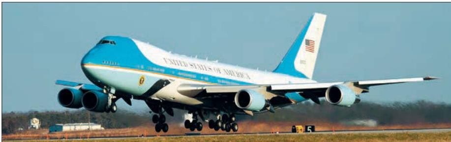  
TSgt. Matt Hecht/ANG

# EXTANT VARIANT(S)

• HH-60G. Modified UH-60 helicopter equipped for CSAR.   
• HH-60U. Converted surplus UH-60L.   
• HH-60W. Developmental next generation Combat Rescue Helicopter.   
Function: Personnel recovery/medium lift. Operator: ACC, AETC, AFMC, PACAF, USAFE, ANG, AFRC.   
First Flight: October 1974.   
Delivered: From 1982.   
IOC: Circa 1982.   
Production: 115.   
Inventory: 98 (HH-60G); three (HH-60U). Aircraft Location: Davis-Monthan AFB, Ariz.; Eglin AFB, Fla.; Francis S. Gabreski Arpt., N.Y.; JB Elmendorf-Richardson, Alaska; Kadena AB, Japan; Kirtland AFB, N.M.; Moffett Field, Calif.; Moody AFB, Ga.; Nellis AFB, Nev.; Patrick AFB, Fla.; RAF Lakenheath, UK.   
Contractor: Sikorsky (Lockheed Martin).   
Power Plant: Two General Electric T700-GE700/701C turboshafts, each 1,560-1,940 shp. Accommodation: Crew: two pilots, flight engineer, gunner. Load: mission dependent.   
Dimensions: Rotor diameter 53.6 ft, overall length 64.7 ft, height 16.7 ft.   
Weight: Max T-O 22,000 lb.   
Ceiling: 14,000 ft.   
Performance: Speed 184 mph; range 580 miles. Armament: Two $7 . 6 2 ~ \mathsf { m m }$ miniguns or two .50-caliber machine guns.

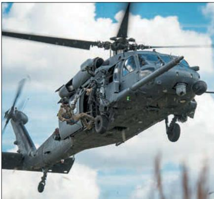  
HH-60 Pave Hawk SSgt. Ryan Callaghan/USAF

# ■ UH-1 HUEY/IROQUOIS

Brief: Utility helicopter for missile field security, pilot training, and executive airlift.

# COMMENTARY

The UH-1N aircraft initially provided search and rescue capabilities before replacing UH1Hs in the ICBM field security and support role. UH-1Ns provide administrative lift to US National Capital Region and PACAF officials from JB Andrews, Md., and Yokota AB, Japan, respectively, and support aircrew survival training at Fairchild AFB, Wash. The TH-1H fleet provides Air Force helicopter pilot training at Fort Rucker, Ala. USAF converted all single-engine UH-1H models to twin-engine TH-1H variants, extending their service lives by at least 20 years. With termination of the earlier Common Vertical Lift Support Program (CVLSP), AFGSC is modifying its UH-1N with NVG-compatible cockpit, upgraded sensors, and safety and sustainment improvements to bridge the gap to a replacement helicopter. USAF launched the UH-1N Replacement Program in 2016 to recapitalize the fleet with up to 84 off-the-shelf helicopters suitable for mission-specific modification. Competitive contract award is planned for 2018, with operational testing beginning as early as FY19.

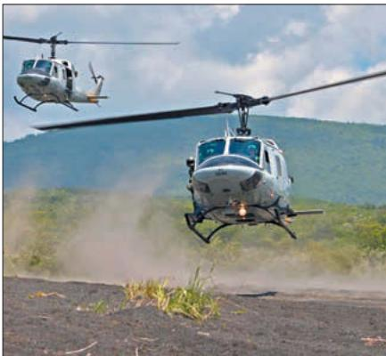  
UH-1 Huey/Iroquois SrA. David Owsianka/USAF

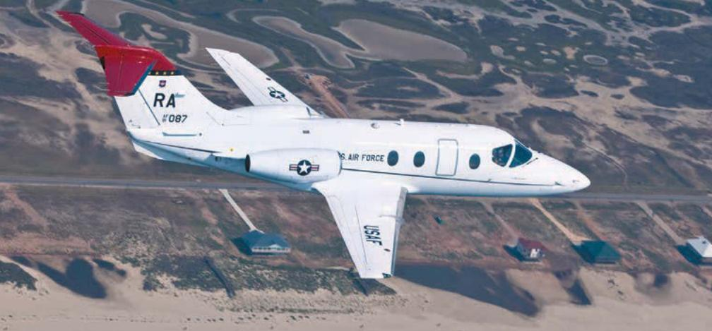  
USAF

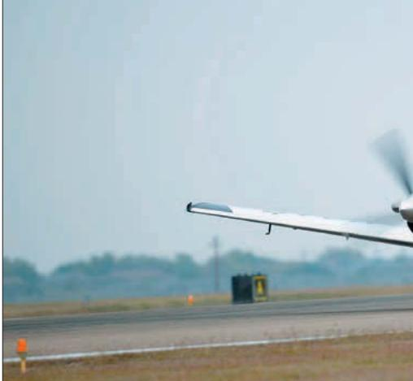  
T-6 Texan II

# T-1 Jayhawk

# EXTANT VARIANT(S)

• TH-1H. Modified twin-engine version of UH-1H used for flight training.   
• UH-1N. Military version of the Bell 212 used for utility support and light lift.   
Function: Light lift/training.   
Operator: AETC, Air Force District of Washington, AFGSC, AFMC, PACAF.   
First Flight: 1956 (UH-1A).   
Delivered: From September 1970 (UH-1N). IOC: Circa 1970.   
Production: 28 (TH-1H); 63 (UH-1N).   
Inventory: 28 (TH-1H); 63 (UH-1N).   
Aircraft Location: Eglin AFB, Fla.; Fairchild AFB, Wash.; F. E. Warren AFB, Wyo.; Fort Rucker, Ala.; JB Andrews, Md.; Kirtland AFB, N.M.; Malmstrom AFB, Mont.; Minot AFB, N.D.; Yokota AB, Japan. Contractor: Bell Helicopter, Lockheed Martin (TH-1H prime).   
Power Plant: TH-1H: one Honeywell T53-L-703 turboshaft, 1,800 shp. UH-1H: one Lycoming T53-L-13B turboshaft, 1,400 shp. UH-1N: two Pratt & Whitney Canada T400-CP-400 turboshafts, 1,290 shp.   
Accommodation: UH-1N crew: two pilots, flight engineer; load: up to 13 passengers (depending on fuel and atmospheric conditions) or up to six litters or, without seats, bulky, oversize cargo. Dimensions: TH-1H: rotor diameter 48 ft, length 57 ft, height 13 ft. UH-1N: rotor diameter 48 ft, length 57.1 ft, height 12.8 ft.   
Weight: Max gross 10,500 lb.   
Ceiling: 15,000 ft (10,000 ft with $^ { 1 0 , 0 0 0 + }$ lb). Performance: (UH-1N) speed 149 mph, range ${ 3 0 0 + }$ miles.   
Armament: (Optional) two General Electric 7.62 mm miniguns or two $4 0 \ \mathsf { m m }$ grenade launchers; two seven-tube 2.75-in rocket launchers.

# TRAINER AIRCRAFT

# ■ T-1 JAYHAWK

Brief: Medium-range, twin-engine jet trainer for pilot and CSO training.

# COMMENTARY

The T-1A is a military version of Beechcraft 400A used in the advanced phase of JSUPT for students selected to fly tanker or transport aircraft, as well as CSOs. Cockpit seats an instructor and two students. Mods include UHF/ VHF radios, INS, TACAN, airborne detection finder, increased bird-strike resistance, and an additional fuselage fuel tank. CSO training aircraft also incorporate GPS-driven SAR and simulated RWR, as well as a second student and instructor station. Upgrade efforts are focused on avionics modernization and include new MFD and terrain collision avoidance systems. FY17 funds support avionics proof-of-concept mods to 15 initial aircraft. Service life of 18,000 flying hours is estimated to keep the T-1 structurally airworthy to 2032.

# EXTANT VARIANT(S)

• T-1A. Military trainer version of Beechcraft 400A.   
Function: Advanced trainer.   
Operator: AETC.   
First Flight: Sept. 22, 1989 (Beechcraft 400A). Delivered: Jan. 17, 1992-July 1997.   
IOC: January 1993.   
Production: 180.   
Inventory: 178.   
Aircraft Location: Columbus AFB, Miss.; Laughlin AFB and JBSA-Randolph, Texas; Vance AFB, Okla.; NAS Pensacola, Fla.   
Contractor: Beechcraft.   
Power Plant: Two Pratt & Whitney Canada JT15D-5B turbofans, each 2,900 lb thrust. Accommodation: Three pilots, two side by side, one to the rear.   
Dimensions: Span 43.5 ft, length 48.4 ft, height 13.9 ft.   
Weight: Max T-O 16,100 lb.   
Ceiling: 41,000 ft.   
Performance: Speed 538 mph, range 2,555 miles.

# ■ T-6 TEXAN II

Brief: Single-engine turboprop primary trainer.

# COMMENTARY

The T-6 is a joint Air Force/Navy trainer developed under the Joint Primary Aircraft Training System program, based on Swiss Pilatus PC-9. Mods include a strengthened fuselage, zero/zero ejection seats, upgraded engine, increased fuel capacity, pressurized cockpit, bird-resistant canopy, and digital avionics with sunlight-readable LCDs. The tandem student and instructor positions are interchangeable, including single-pilot operation from either seat. The T-6 is fully aerobatic and features an anti-G system. USAF production completed in 2010, with an expected service life of 21 years. Ongoing mods include airspace compliant avionics, improved canopy fracture initiation system, replacement of unavailable components, and updated training aids.

# EXTANT VARIANT(S)

• T-6A. Joint service primary training aircraft, based on the Pilatus PC-9.   
• T-6B. Navy-only variant.   
Function: Primary trainer.   
Operator: AETC, USN.   
First Flight: July 15, 1998.   
Delivered: From May 2000 (operational aircraft). IOC: November 2001.   
Production: Planned: 452 (USAF); 328 (USN). Inventory: 444 (USAF).   
Aircraft Location: USAF: Columbus AFB, Miss.; Laughlin AFB, JBSA-Randolph, and Sheppard AFB, Texas; Vance AFB, Okla. Navy: NAS Corpus Christi, Texas; NAS Pensacola, Fla.; NAS Whiting, Fla.   
Contractor: Beechcraft Defense (formerly Raytheon).   
Power Plant: One Pratt & Whitney Canada PT6A-68 turboprop, 1,100 shp.   
Accommodation: Two pilots, in tandem, on Martin Baker MK16LA zero/zero ejection seats.   
Dimensions: Span 33.5 ft, length 33.4 ft, height 10.7 ft.   
Weight: Basic 6,500 lb.   
Ceiling: 31,000 ft.   
Performance: Speed 320 mph, range 1,035 miles.

# ■ T-38 TALON

Brief: Twin-engine, supersonic advanced jet trainer.

# COMMENTARY

The T-38 was the first supersonic trainer aircraft and is primarily used by AETC for advanced JSUPT fighter/bomber tracks and Introduction to Fighter Fundamentals. The aircraft is used to teach supersonic techniques, aerobatics, formation, night and instrument flying, and cross-country/low-level navigation. The T-38 is also used by the USAF Test Pilot School to train test pilots and flight-test engineers and by ACC and AFGSC as a companion trainer to maintain pilot proficiency. ACC uses regenerated T-38s as dedicated aggressor aircraft for F-22 training. T-38Bs are equipped with a gunsight and centerline hardpoint for mounting external stores including ECM pod/practice bomb dispensers. Aircraft were redesignated T-38Cs after avionics modernization that added a glass cockpit and HUD, color MFDs, mission computer, integrated INS/GPS, and reshaped air intakes. T-38Cs were delivered from 2002 to 2007. Sustainment measures include replacement of major engine components to improve reliability and maintainability. Full fleet replacement is not projected until 2034, and USAF is additionally extending aircraft. The structural renewal effort is the most intensive in the T-38’s history, replacing major longerons, bulkheads/formers, intakes, internal skins, and structural floors. The first airframe was redelivered in 2015. Additional upgrades include wingset replacement, digital avionics upgrades, replacement HUD, VHF nav/comms, airspace compliance, safety, and low-cost mods. USAF aims to field the next generation T-X aircraft with initial capability in 2024.

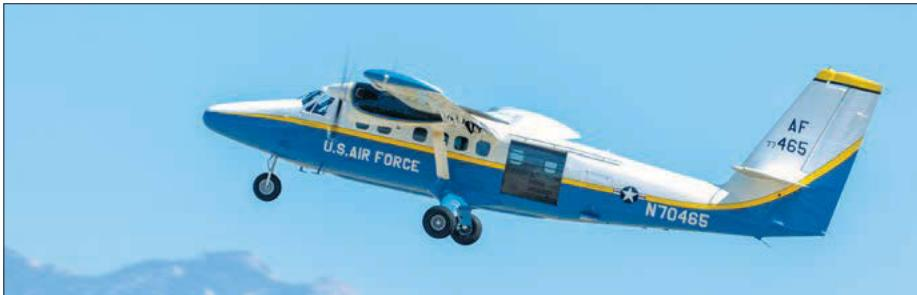  
UV-18 Twin Otter

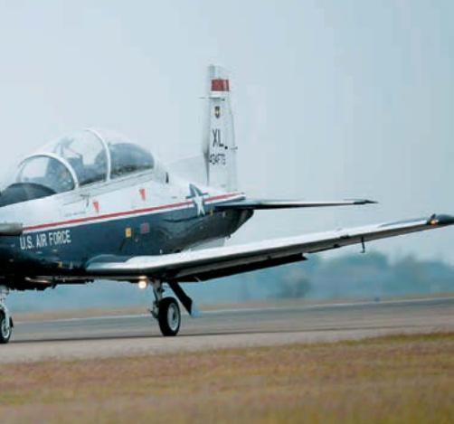  
SrA. Ariel D. Partlow/USAF

# EXTANT VARIANT(S)

• T-38A. Upgraded version with Pacer Classic I and II mods.   
• AT-38B. Armed weapons training version. • T-38C. Modernized airframes incorporating glass cockpits and upgraded engines.   
Function: Advanced trainer.   
Operator: ACC, AETC, AFGSC, AFMC.   
First Flight: April 1959.   
Delivered: 1961-72 (T-38A).   
IOC: March 1961.   
Production: More than 1,100.   
Inventory: 53 (T-38A); six (AT-38B); 445 (T-38C). Aircraft Location: Beale AFB and Edwards AFB, Calif.; Columbus AFB, Miss.; Holloman AFB, N.M.; JB Langley-Eustis, Va.; JBSA-Randolph and Sheppard AFB, Texas; Tyndall AFB, Fla.; Vance AFB, Okla.; Whiteman AFB, Mo.   
Contractor: Northrop Grumman.   
Power Plant: Two General Electric J85-GE-5 turbojets, each 2,900 lb thrust with afterburning. Accommodation: Two pilots, in tandem, on Martin Baker MK16T zero/zero ejection seats. Dimensions: Span 25.3 ft, length 46.3 ft, height 12.8 ft.   
Weight: Max T-O 12,093 lb.   
Ceiling: Above 55,000 ft.   
Performance: Speed 812 mph, range 1,093 miles.

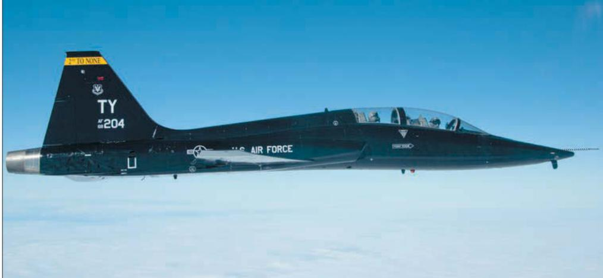

# T-38 Talon

# ■ T-53

Brief: Military designated sport aircraft.

# COMMENTARY

The T-53 is the military designated civilian Cirrus SR20, primarily used by USAFA’s Powered Flight Program. It is an all-composite monoplane with advanced avionics and safety features that include GPS, Cirrus Airframe Parachute System, integrated fuselage roll cage, cuffed wing design, and other active and passive safety systems standard on Cirrus aircraft. T-53s are designed for 12,000 flying hours. Upgrades are limited to FAA-mandated airworthiness compliance mods and simulator updates.

# EXTANT VARIANT(S)

• T-53A. Military designated Cirrus SR20.   
Function: Trainer.   
Operator: AETC.   
Delivered: 2012.   
Inventory: 24.   
Aircraft Location: USAFA, Colo.   
Contractor: Cirrus.   
Power Plant: One Continental IO-360-ES sixcylinder, fuel-injected, air-cooled engine, 200 hp.   
Accommodation: Two, side by side, plus three passengers.   
Dimensions: Span 38.3 ft, length 26 ft, height 8.9 ft.   
Weight: Max T-O 3,050 lb.   
Ceiling: 17,500 ft.   
Performance: Speed 178 mph, range 690 miles.

# ■ UV-18 TWIN OTTER

Brief: Modified utility transport used for parachute jump training.

# COMMENTARY

The UV-18 is a military variant of the civilian De Havilland DHC-6 Twin Otter. It is used at USAFA to support various parachuting activities and perform general utility missions. Special use includes supporting the Air Force Academy parachute team, Wings of Blue. Upgrades are limited to FAA-mandated airworthiness compliance mods.

# EXTANT VARIANT(S)

• UV-18B. Military variant of the DHC-6 Twin Otter.   
Function: Utility.   
Operator: AETC.   
First Flight: May 1965 (commercial version).   
Delivered: 1977 (two); 1982 (one).   
IOC: 1977.   
Production: Three.   
Inventory: Three.   
Aircraft Location: USAFA, Colo.   
Contractor: De Havilland Canada. Power Plant: Two Pratt & Whitney Canada PT6A-27 turboprops, each 620 shp.   
Accommodation: Crew: two pilots; load: up to 20 passengers.   
Dimensions: Span 65 ft, length 51.9 ft, height 18.7 ft.   
Weight: Max T-O 12,500 lb.   
Ceiling: 25,000 ft.   
Performance: Speed 210 mph, range 806 miles.

# REMOTELY PILOTED AIRCRAFT

# ■ MQ-1 PREDATOR

Brief: Medium-altitude, long-endurance RPA, with ISR and strike capability.

# COMMENTARY

The MQ-1 is a multimission weaponized RPA with near real-time FMV and multispectral targeting with combined laser designator/illuminator and EO/IR sensors. The fully operational system comprises four air vehicles, GCS, satellite link, and about 55 personnel for 24-hour operations. RQ-1 became a fully USAF system in 1996, and the designation was changed to MQ-1 (denoting multimission capability) when it was armed with the Hellfire missile in 2002. USAF forward deploys launch and recovery element (LRE) systems and support personnel for takeoff and landing operations, while the CONUS-based GCSs conduct the mission via extended BLOS satcom data link. USAF received its last MQ-1B in March 2011, but continues to fund GCS and airframe mods. The service is also integrating the advanced Airborne Cueing and Exploitation System Hyperspectral Sensor (ACES HY) to fill ISR shortfalls. USAF is increasingly relying on contractors to operate MQ-1s for nonkinetic ISR support. The MQ-1 is being replaced by the MQ9, and USAF plans to retire the fleet by 2018.

# EXTANT VARIANT(S)

• MQ-1B. Armed version of the General Atomics Predator.

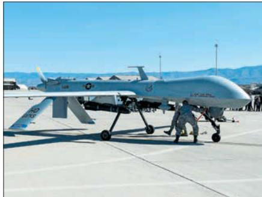  
MQ-1 Predator SSgt. Stacy Jonsgaard/USAF

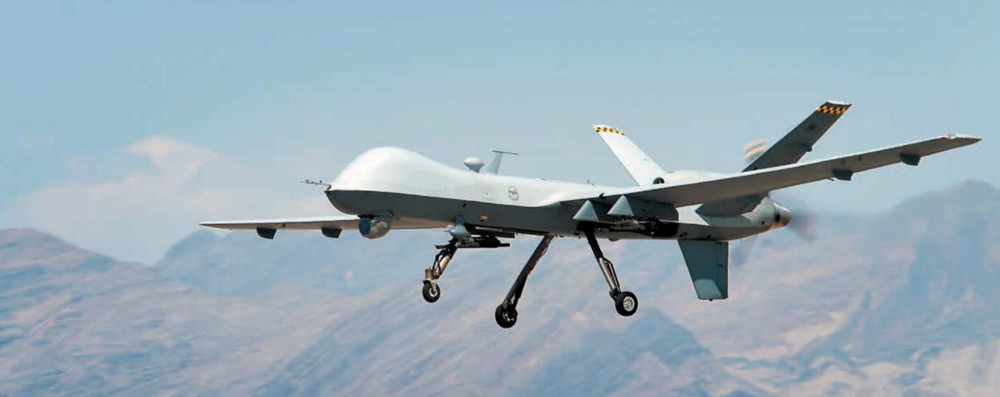

Function: Armed reconnaissance/target acquisition.   
Operator: ACC, AFMC, AFSOC, ANG.   
First Flight: July 1994.   
Delivered: July 1994 (USAF from 1996)-2011. IOC: 2005.   
Production: 268 air vehicles.   
Inventory: 129.   
GCS Location: Cannon AFB, N.M.; Creech AFB, Nev.; Davis-Monthan AFB, Ariz.; Ellington Field, Texas; Hector Arpt., N.D.; Holloman AFB, N.M.; Nellis AFB, Nev.; Springfield-Beckley Arpt., Ohio.; Whiteman AFB, Mo.   
Aircraft Location: Cannon AFB, N.M.; Creech AFB, Nev.; Fort Polk Airfield, La.; Fort Huachuca, Ariz.; Hector Arpt., N.D.; Holloman AFB, N.M.; Whiteman AFB, Mo., and deployed locations worldwide.   
Contractor: General Atomics Aeronautical Systems.   
Power Plant: One Rotax 914F turbo engine. Accommodation: GCS: pilot, sensor operator. Dimensions: Span 55 ft, length 27 ft, height 6.9 ft. Weight: Max T-O 2,250 lb.   
Ceiling: 25,000 ft.   
Performance: Speed 84-135 mph, range 770 miles, max endurance 40 hr.   
Armament: Two AGM-114 Hellfire missiles.

# ■ MQ-9 REAPER

Brief: Medium- to high-altitude hunter-killer RPA.

# COMMENTARY

The MQ-9B is a medium- to high-altitude, longendurance hunter-killer RPA, primarily tasked with eliminating time-critical and high-value targets in a permissive combat environment. The MQ-9 fulfills a secondary tactical ISR role utilizing its Multispectral Targeting System-B (MTS-B). The system integrates EO/IR, color/ monochrome daylight TV, image-intensified TV, and a laser designator/illuminator. MTS-B provides FMV as separate video streams or fused together, and the MQ-9 employs SAR for GBU-38 JDAM targeting. Additional roles include CAS, CSAR, precision strike, armed overwatch, target development/designation, and terminal weapon guidance. MQ-9B debuted in combat in Afghanistan in 2007. The Reaper system comprises three aircraft, GCS, LOS/ BLOS satellite and terrestrial data links, support equipment/personnel, and crews for deployed 24-hour operations. Development is underway to incorporate automatic takeoff and landing capability, Counter-Improvised Explosive

Device (C-IED), Dismount Detection Radar (DDR), Gorgon Stare wide-area surveillance, missile defense, and other sensor upgrades, weapons integration, and reliability enhancements. The Extended Range Reaper reached IOC and entered combat in 2015. Reaper ER adds external fuel tanks, a four-bladed propeller, engine alcohol/water injection, heavyweight landing gear, longer wings and tail surfaces, and other enhancements to Block 1 aircraft. Production shifted from MQ-9 Block 1 to Block 5 aircraft in 2015, and 12 of the planned 155 airframes have been delivered. Block 5 incorporates improved electrical system and avionics bay, new radio and encrypted data links, digital engine control, high definition video, lighter bomb racks, upgraded software, and the new Block 30 GCS. Block 5 aircraft/Block 30 GCS fielding is planned for early FY17, with production running through FY21.

# EXTANT VARIANT(S)

• MQ-9B Reaper Block 1. Air Force version of the General Atomics Predator B.   
• MQ-9B Reaper Block 5. Improved, current production Reaper.   
• MQ-9B Reaper ER. Extended range MQ-9 with external fuel tanks, longer wings, and other enhancements.   
Function: Attack/armed reconnaissance.   
Operator: ACC, AFMC, AFSOC, ANG.   
First Flight: February 2001.   
Delivered: November 2003.   
IOC: October 2007.   
Production: 346 (planned).   
Inventory: 188.   
GCS Location: Cannon AFB, N.M.; Creech AFB, Nev.; Des Moines Arpt., Iowa; Ellsworth AFB, S.D.; Fort Smith Arpt., Ark.; Hancock Field, N.Y.; Holloman AFB, N.M.; March ARB, Calif. Planned: Niagara Falls Arpt., N.Y.; Shaw AFB, S.C.   
Aircraft Location: Cannon AFB, N.M.; Creech AFB, Nev.; Eglin AFB, Fla.; Fort Drum, N.Y.; Hancock Field, N.Y.; Holloman AFB, N.M.; March ARB, Calif.; Nellis AFB, Nev., and deployed locations worldwide.   
Contractor: General Atomics Aeronautical Systems, L3 Communications, Raytheon. Power Plant: One Honeywell TPE331-10GD turboprop, max 900 shp.   
Accommodation: GCS: pilot, sensor operator. Dimensions: Span 66 ft, length 36 ft, height 12.5 ft. Weight: Max T-O 10,500 lb.   
Ceiling: 50,000 ft.

Performance: Cruise speed $2 3 0 \ m \mathsf { p h }$ , range 1,150 miles, endurance 27 hr; 34 hr (ER).

Armament: Combination of AGM-114 Hellfires, GBU-12/49 Paveway IIs, and GBU-38 JDAMs.

# ■ RQ-4 GLOBAL HAWK

Brief: High-altitude, long-range, long-endurance RPA sensor platform.

# COMMENTARY

The Global Hawk is primarily a long-endurance, high altitude, “deep look” ISR platform to complement satellite and manned strategic ISR. The weapon system consists of an aircraft with an integrated sensor suite, launch and recovery element (LRE), mission control element (MCE), and communications and mission planning equipment. Block 20 aircraft were initially delivered as an imagery intelligence (Imint) platform incorporating the Enhanced Integrated Sensor Suite (EISS). Four airframes were subsequently converted to EQ-4B communications relay platforms with the Battlefield Airborne Communications Node (BACN), and three remain active. The Block 30 variant is a multi-intelligence platform equipped with EO/IR, SAR, as well as Sigint sensors and has supported combat operations worldwide. The Block 40 ground surveillance platform is equipped with the Multiplatform Radar Technology Insertion Program (MPRTIP) sensor suite that incorporates AESA and SAR to simultaneously gather stationary target imagery and detect and track moving ground targets as well as cruise missiles. USAF reversed its FY13 decision to divest the Block 30 fleet, electing to instead retire the U-2 in 2019. Congress stipulated the RQ-4 demonstrate sensor parity with the U-2 before divestment. The developmental universal payload adapter will enable carriage of several U-2-unique sensors, including the MS-177 electro-optical sensor and wet-film Optical Bar Camera. Initial sensor capability is planned circa 2017. Planned improvements include weather-avoidance radar and anti-icing system for all-weather operations, Airborne Signals Intelligence Payload (ASIP) increment I Sigint improvement, reliability improvements, and airspace compatibility mods.

# EXTANT VARIANT(S)

• EQ-4B Block 20. Battlefield Airborne Communications Node (BACN) comm relay platform.

• RQ-4B Block 30. Multi-intelligence platform equipped with EO/IR and SAR sensors.   
• RQ-4B Block 40. AESA and SAR equipped ground moving target indication (GMTI) and battlefield ISR platform.   
Function: High-altitude reconnaissance.   
Operator: ACC, AFMC.   
First Flight: Feb. 28, 1998.   
Delivered: From 1995 (ACTD versions).   
IOC: August 2011 (Block 30); Aug. 29, 2016 (Block 40).   
Production: 33.   
Inventory: Three (Block 20); 19 (Block 30); 11 (Block 40).   
Aircraft Location: Beale AFB, Calif.; Grand Forks AFB, N.D. (Block 40). Forward operating locations: Andersen AFB, Guam; Misawa AB, Japan; NAS Sigonella, Italy.   
Contractor: Northrop Grumman, Raytheon, L3 Communications.   
Power Plant: One Rolls Royce-North American F137-RR-100 turbofan, 7,600 lb thrust.   
Accommodation: One LRE pilot, one MCE pilot, one MCE sensor operator.   
Dimensions: Span 130.9 ft, length 47.6 ft, height 15.3 ft.   
Weight: Max T-O 32,500 lb.   
Ceiling: 60,000 ft.   
Performance: Speed 356.5 mph, range 10,000 miles.

# ■ RQ-170 SENTINEL

Brief: Low-observable RPA.

# COMMENTARY

Although the RQ-170 was still under development and test, USAF employed it in Southwest Asia for Enduring Freedom. The RPA was developed in response to DOD’s call for additional RPA support for combatant commanders. USAF publicly acknowledged the aircraft after photos appeared in foreign news media of operations over Afghanistan in 2009. The type is operated by the 432nd Wing at Creech AFB, Nev., and the 30th Reconnaissance Squadron at Tonopah Test Range, Nev. An RQ-170 strayed into Iranian airspace, crashed, and was captured during a mission in 2011.

# EXTANT VARIANT(S)

• RQ-170. No data available.   
Function: Unmanned surveillance and reconnaissance.   
Operator: ACC.   
GCS Location: Creech AFB, Nev.; Tonopah Test Range, Nev.   
Aircraft Location: Tonopah Test Range, Nev.; deployed worldwide.   
Contractor: Lockheed Martin.

# FULL-SCALE AERIAL TARGETS

# ■ QF-4 PHANTOM II

Brief: Regenerated F-4 Phantom IIs converted as aerial targets to support missile testing.

# COMMENTARY

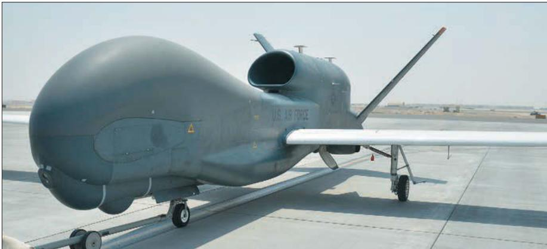  
RQ-4 Global Hawk   
TSgt. Christopher Boitz/USAF

The QF-4 became USAF’s Full-scale Aerial Target (FSAT) system in 1997 and was primarily used to support missile and weapon systems development, testing, and evaluation. The majority of flights were conducted with a safety pilot in the cockpit to facilitate air combat training and evaluation. For live-shot weapons tests or training, QF-4s flew in the “not under live local operator” (NULLO) control configuration, equipped with explosive charges to terminate flight if damaged, and 16 to 20 kills were conducted annually. Retired F/RF-4 airframes were refurbished and converted to drone configuration by BAE Systems, with installation of drone specific equipment including remote control, missile telemetry and scoring, and safe flight-termination systems. The final QF-4 was converted from an RF-4C and delivered in November 2013. QF-16s began replacing QF-4s in 2015. Holloman AFB, N.M., launched the final unmanned QF-4 sortie Aug. 17, 2016, ahead of the aircraft’s retirement on Dec. 21, 2017. The remaining airframes will be used as ground targets.

# EXTANT VARIANT(S)

• QF-4E. Converted from F-4E stocks, delivered starting in 2000 to 2008.   
• QF-4G. Converted from retired F-4G airframes, delivered 1997 to 2000.   
• QRF-4C. Converted from RF-4C stocks, delivered 2008 to 2013.   
Function: Full-scale aerial target.   
Operator: ACC.   
First Flight: June 30, 1967 (F-4E).   
Delivered: 1997.   
IOC: 1997.   
Production: 317.   
Inventory: 13.   
Aircraft Location: Holloman AFB, N.M.   
Contractor: Boeing (previously McDonnell Douglas), BAE Systems.   
Power Plant: Two General Electric J79-GE-17G afterburning turbojets, each 17,900 lb thrust. Accommodation: Safety pilot (optional) on Martin Baker MK7 zero/zero ejection seat. Dimensions: Span 38 ft 15 in, length 63 ft 1 in, height 16 ft 6 in.   
Weight: Max T-O 62,000 lb.   
Ceiling: 60,000 ft.   
Performance: Speed 1,600 mph, range 1,300 miles.

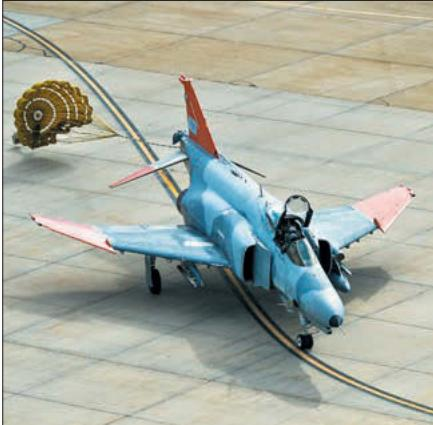  
QF-4 Phantom II R. Nial Bradshaw/USAF

# ■ QF-16 FULL-SCALE AERIAL TARGET

Brief: Regenerated F-16s converted as aerial targets to support missile testing.

# COMMENTARY

The QF-16 began replacing the dwindling and obsolescent QF-4 Full-scale Aerial Target (FSAT) starting in FY15. Aircraft will primarily support missile and weapon systems development, testing, and evaluation. QF-16s are capable of manned or “not under live local operator” (NULLO) control operations. Boeing completed six conversions to support testing. QF-16 completed developmental testing in October 2013 and initial operational testing in September 2014, culminating in an AIM-9X live operational test shot to validate the QF16’s missile scoring system. The first of LRIP QF-16s was delivered to Tyndall AFB, Fla., in early 2015. Boeing is under contract to deliver 62 converted airframes in three production lots through October 2017. ACC declared IOC with 15 operational aircraft on Sept. 23, 2016, and full operational capability is planned for late 2017. Current efforts include developing new EA pods and software to more accurately replicate adversary capabilities and tactics, ground control improvements, preliminary development of two-seat trainer, and future F-16 block conversions. Holloman AFB, N.M., launched its first operational QF-16 sortie on Feb. 10, 2017.

# EXTANT VARIANT(S)

• QF-16A/B. Converted from retired F-16A/B Block 15.   
• QF-16C/D. Converted from retired F-16C/D Block 25 and Block 30.   
Function: Full-scale aerial target.   
Operator: ACC.   
First Flight: May 4, 2012.   
Delivered: February 2015.   
IOC: Sept. 23, 2016.   
Production: 126 (planned).   
Inventory: seven (QF-16A); 10 (QF-16C). Aircraft Location: Tyndall AFB, Fla. Planned: Holloman AFB, N.M.   
Contractor: Lockheed Martin (previously General Dynamics), Boeing.   
Power Plant: Block 15: one Pratt & Whitney F100-PW-200 turbofan, 23,830 lb thrust. Block 25: one Pratt & Whitney F100-PW-220 turbofan, 23,830 lb thrust. Block 30: one General Electric F110-GE-100 turbofan, 28,984 lb thrust.   
Accommodation: Safety pilot (optional) on ACES II zero/zero ejection seat.   
Dimensions: Span 32.8 ft, length 49.3 ft, height 16.7 ft.

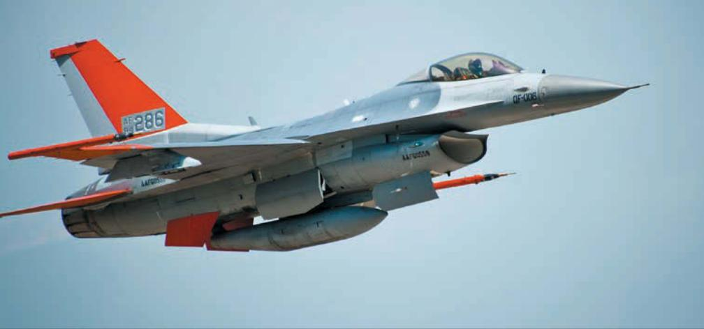  
Sara Vidoni/USAF

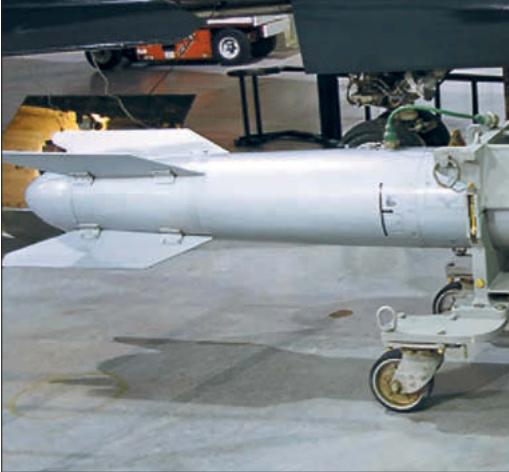  
B61 Thermonuclear Bomb

# QF-16 Full-Scale Aerial Target

Weight: F-16A: empty (F100-PW-200) 16,285 lb; F-16C: empty (F110-GE-100) 18,238 lb. Ceiling: 50,000 ft.   
Performance: Speed Mach 2, ferry range ${ 2 , 0 0 0 + }$ miles.

# STRATEGIC WEAPONS

# ■ AGM-86 AIR LAUNCHED CRUISE MISSILE(ALCM)

Brief: Nuclear or conventional armed small, air launched, subsonic air vehicle.

# COMMENTARY

ALCM is programmed to conduct strategic attack—nuclear or conventional—on surface targets. Its small radar signature and lowlevel flight capability enhance the missile’s effectiveness. The nuclear AGM-86B was the first production version. A total of 1,715 were delivered through 1986. USAF is to cut inventory to 528 and consolidate it at Minot AFB, N.D. The conventional AGM-86C, called CALCM, was first delivered in 1987, and few remain in the inventory. It was operationally employed for the first time in Desert Storm and widely used in subsequent operations. CALCM is capable of adverse weather, day/night, air-to-surface, accurate, standoff strike capability at ranges greater than 500 miles. Block 1A enhancements offer improved accuracy and increased immunity to electronic jamming. The AGM-86D is CALCM’s Block II penetrator version with AUP3(M) warhead. It provides standoff capability against hardened, deeply buried targets and was successfully used in Afghanistan. ALCM is undergoing a SLEP to stretch its in-service life to 2030 to allow for planned replacement by the Long-Range Standoff (LRSO) missile. USAF released a request for proposal for the LRSO in 2016 and plans to field the nuclear missile by the late 2020s, possibly followed by a conventional derivative thereafter.

# EXTANT VARIANT(S)

• AGM-86B. Nuclear ALCM variant.   
• AGM-86C. Conventional CALCM variant.   
• AGM-86D. Penetrating CALCM Block II variant.   
Function: Strategic air-to-surface cruise missile.   
Operator: AFGSC.   
First Flight: June 1979 (full-scale development).   
Delivered: From 1981.   
IOC: December 1982, Griffiss AFB, N.Y.   
Production: 1,715.   
Unit Location: Andersen AFB, Guam (conventional only); Barksdale AFB, La.; Minot AFB, N.D.   
Contractor: Boeing.   
Power Plant: Williams/Teledyne CAE F107- WR-10 turbofan, 600 lb thrust. Guidance: Inertial plus Terrain Contour Matching (B); inertial plus GPS (C/D).   
Warhead: W80-1 nuclear (B), blast/fragmentation conventional (C), hard target penetrating warhead (D).   
Dimensions: Span 12 ft, length 20.8 ft, body diameter 2 ft.   
Weight: 3,150 lb.   
Performance: Speed 550 mph (B), high subsonic (C/D); range $^ { 1 , 5 0 0 + }$ miles (B), 690 miles (C/D).

# ■ B61 THERMONUCLEAR BOMB

Brief: Air-dropped nuclear freefall weapon.

# COMMENTARY

B61 is the primary strategic nuclear weapon for the B-2 bomber and equips both the F-16 and F-15E, providing forward deployed, extended deterrence to allies. The weapon was first delivered in 1966, and the most recent B61 Mod 11 introduced in 1997 adds a ground-penetrating capability, enhancing its destructive effect to destroy buried and hardened targets. The weapon incorporates several preselectable yield options, tailored to mission requirements. Work is underway on the next B61 Mod 12 life extension program (LEP), which entered developmental testing in 2012. The LEP aims to improve the safety, security, and reliability of the weapon through 2040, adding a new guided tail kit in addition to warhead upgrade/refurbishment. USAF completed inert, developmental test drops in 2015, and production engineering work was scheduled to begin in 2016. B61-12 will consolidate the B61-3, -4, -7, and -10 weapons into a single, standardized configuration. The first production example is scheduled for delivery in 2020, and integration work is planned on the B-2, F-15E, F-16, and the F-35A starting in 2018.

# EXTANT VARIANT(S)

• B61. Current supersonic-droppable freefall thermonuclear weapon.   
• B61 Mod 12. Upgraded, life-extended B61 with precision guided tail kit assembly.   
Function: Air-to-surface thermonuclear bomb. Delivered: From 1966.   
IOC: N/A.   
Contractor: Los Alamos National Laboratory (weapon), Boeing (B61-12 tail kit).   
Guidance: None (B61 Mod 1 to 11); N/A (B61 Mod 12).   
Warhead: One B61 -3, -4, -7, -10, or -11.   
Dimensions: Length 11 ft 8 in., diameter 1 ft 1 in. Weight: 700 lb.   
Performance: N/A.

# ■ LGM-30 MINUTEMAN

Brief: Silo-launched, solid-fuel ICBM capable of delivering up to three thermonuclear warheads.

# COMMENTARY

Minuteman is a three-stage, solid-propellant ICBM housed in an underground silo. Minuteman III became operational in 1970, providing improved range, rapid retargeting, and the capability to place three re-entry vehicles on three targets with a high accuracy. It is the sole remaining US land-based ICBM. Major life extension program ensures viability to 2020. Ongoing mods, including updated warhead fuzes, guidance and propulsion upgrades, and modernized re-entry vehicles would extend that to 2030. AFGSC initially deployed 550, later reducing toward 400 based at Malmstrom AFB, Mont., Minot AFB, N.D., and F. E. Warren AFB, Wyo. AFGSC completed reducing its deployed ICBMs to a single warhead in 2014, under limits imposed by the New START agreement. USAF issued a request for proposal to replace Minuteman with a future Ground Based Strategic Deterrent (GBSD) in 2016.

# EXTANT VARIANT(S)

• LGM-30G. Current Minuteman III variant. Function: Strategic surface-to-surface ballistic missile.   
Operator: AFGSC.   
First Flight: February 1961.   
Delivered: 1962-December 1978.   
IOC: December 1962, Malmstrom AFB, Mont. Production: 1,800.   
Inventory: 406.   
Unit Location: F. E. Warren AFB, Wyo.; Malmstrom AFB, Mont.; Minot AFB, N.D.   
Contractor: Boeing, BAE Systems, General Electric, Lockheed Martin, Orbital ATK.   
Propulsion: Stage 1: Orbital ATK refurbished M55 solid-propellant motor, 202,600 lb thrust; stage 2: Orbital ATK refurbished SR19 solidpropellant motor, 60,721 lb thrust; stage 3:

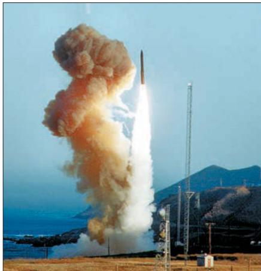  
LGM-30 Minuteman MSgt. Lorenzo Gaines/USAF

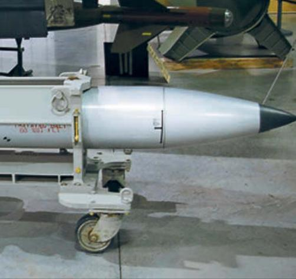

  
A1C Micaiah Anthony/USAF

# ADM-160 Miniature Air Launched Decoy

Orbital ATK refurbished SR73 solid-propellant motor, 34,400 lb thrust.   
Guidance: Inertial guidance system.   
Re-entry Vehicle: One Mk 21 RV; one to three Mk 12/12A MIRVs.   
Warhead: One (currently) to three 300 kiloton W87 enriched uranium thermonuclear weapons. Dimensions: Length 59.9 ft, diameter 5.5 ft. Weight: 79,432 lb.   
Performance: Speed at burnout approx 15,000 mph, range ${ \scriptstyle 6 , 0 0 0 + }$ miles.

# LONG-RANGE STANDOFF WEAPONS

# ■ ADM-160 MINIATURE AIR LAUNCHED DECOY (MALD)

Brief: Air launched programmable electronic warfare platform designed to thwart enemy integrated air defense systems (IADS).

# COMMENTARY

MALD is a low-cost, modular, autonomous flight vehicle that mimics US or allied aircraft to enemy IADS. MALD-J adds radar jamming capability to the basic decoy platform and can operate alone or in concert with other EW platforms. The jammer version is designed as an expendable, close-in jammer to degrade and deny an early warning or acquisition radar’s ability to establish a track on strike aircraft. It also maintains the ability to fulfill the basic decoy mission. F-16 or B-52 are lead employment aircraft for MALD. USAF capped procurement in FY12, converting Lot 4 to the MALD-J variant. Plans call for 3,000, of which 2,400 are the jammer version. USAF demonstrated a new data link in 2014 to potentially enable in-flight retargeting. Operational testing revealed material durability problems with both variants and navigational accuracy problems with MALD-J in GPS degraded/denied environments. Both platforms are considered operationally effective, and software development efforts are underway to address shortcomings. USAF awarded a MALD-J contract option for Lot 10 production in 2016.

# EXTANT VARIANT(S)

• ADM-160B. MALD base decoy variant.   
• ADM-160C. MALD-J jammer/decoy variant.   
Function: Aircraft decoy; close-in radar jammer.   
First Flight: 1999 (MALD); 2009 (MALD-J).   
Delivered: From September 2012 (MALD-J).   
IOC: N/A.   
Contractor: Raytheon.   
Guidance: GPS/INS.   
Dimensions: Span 5.6 ft (extended), length 9.3 ft.   
Weight: Less than 300 lb.

Performance: Range up to 575 miles, endurance 90 minutes (50 minutes on-station loiter).

# ■ AGM-154 JOINT STANDOFF WEAPON(JSOW)

Brief: Low-cost glide weapon.

# COMMENTARY

JSOW is a joint USAF and Navy family of medium-range, GPS/INS guided, standoff airto-ground weapons. They are used to attack a variety of soft and armored area targets during day and night and adverse weather conditions. The baseline BLU-97 CEM variant is used against soft and area targets. The BLU-108 variant provides anti-armor capability. The AGM-154C incorporates an additional imaging IR seeker and is intended for use against hardened, stationary targets. JSOW is integrated onto the B-1, B-2, B-52, F-15E, and F-16, and an F-35C conducted the strike fighter’s first drop during integration testing on March 23, 2016. The new AGM-154C-1 variant that adds moving, maritime strike capability to the baseline C variant reached IOC with the Navy in 2016 and will eventually equip the F-35A/C.

# EXTANT VARIANT(S)

• AGM-154A. Baseline BLU-97 CEM variant for soft/area targets.   
• AGM-154B. The BLU-108 submunition variant for anti-armor.   
• AGM-154C. Imaging IR guided variant for hardened tactical targets.   
Function: Air-to-surface guided missile.   
First Flight: December 1994.   
Delivered: 2000-05 (USAF).   
IOC: 2000 (USAF).   
Contractor: Raytheon.   
Guidance: GPS/INS.   
Warhead: See variants above.   
Dimensions: length 13.3 ft, diameter 13 in. Performance: range 13.8 miles low altitude, 73 miles high altitude.

# ■ AGM-158 JOINT AIR-TO-SURFACE STANDOFF MISSILE (JASSM)

Brief: Advanced weapon designed to precisely attack heavily defended targets at extended, standoff range.

# COMMENTARY

JASSM is a joint USAF-Navy autonomous precision strike weapon. It can attack both fixed and relocatable targets, including moderately hardened buried targets. The base variant is a stealthy low-cost airframe equipped with GPS/ INS guidance and IIR terminal seeker. The base variant is integrated on the B-1B, B-2, B-52H, F-15E, and F-16 Block 50. Planned integration includes F-16 Block 40 and F-35A. The JASSM-Extended Range (JASSM-ER) version uses same baseline body but a new engine and fuel system that increases range to more than 500 miles. The ER variant was cleared for combat use on the B-1B in 2015 and is planned for integration on the B-52H, F-15E, all F-16 blocks, and the F-35A. Full rate production of the ER began the same year and JASSM production shifted to ER-only in FY16. Lockheed Martin surpassed 2,000 weapons delivered in 2016. Lockheed Martin is developing a new anti-shipping variant, dubbed Long-Range Anti-Ship Missile (LRASM), for both the Air Force and Navy. Initial integration is planned on the B-1B in 2019.

# EXTANT VARIANT(S)

• AGM-158A JASSM. Base variant.   
• AGM-158B JASSM-ER. Extended-range variant.   
• AGM-158C LRASM. Long-Range Anti-Ship Missile based on JASSM.   
Function: Air-to-surface guided weapon.   
First Flight: April 8, 1999.   
Delivered: Through FY19 (planned).   
IOC: September 2003; December 2014 (ER variant).   
Contractor: Lockheed Martin, Raytheon, Honeywell.   
Power Plant: Teledyne Technologies J402 turbojet (JASSM); Williams Intl. F107-WR-105 turbofan (JASSM-ER).   
Guidance: GPS/INS and IIR terminal seeker. Warhead: 1,000-lb class penetrator.   
Dimensions: Length 14 ft.   
Performance: 1,000-lb dual mode penetrator/ blast-fragmentation warheads; range ${ } ^ { 2 0 0 + }$ miles (baseline), $5 0 0 +$ miles (ER).

# AIR-TO-AIR MISSILES

# ■ AIM-9 SIDEWINDER

Brief: Short-range, supersonic, IR guided airto-air missile.

# COMMENTARY

Sidewinder was developed by the Navy for fleet air defense and adapted by USAF for fighter aircraft use. Early versions were used extensively in the Vietnam War. The AIM-9M is a joint Navy-USAF, all-altitude, all-aspect, launch-and-leave intercept missile. It has improved defense against IR countermeasures, background discrimination, and reduced-smoke rocket motor. It first flew in 1978. AIM-9X is the newest jointly funded variant. It employs passive IR tracking, jet-vane steering for increased maneuverability, and Joint Helmet-Mounted

Cueing System (JHMCS) compatibility. The current production AIM-9X Block 2 was cleared for full rate production in September 2015, and an F-35A conducted its first live-fire with the weapon in early 2016. Ongoing development includes control actuation, IR counter-countermeasures, improved lock-after-launch, added partial/degraded cue capability, and improved small target acquisition and surface attack capability. FY17 funds procure 287 AIM-9X and several developmental AIM-9X Block II-plus with enhanced aircraft survivability features.

# EXTANT VARIANT(S)

• AIM-9M. Early variant.   
• AIM-9M-9. Expanded anti-countermeasure capability variant.   
• AIM-9X. Newest, highly maneuverable, JHMCS compatible variant.   
Function: Air-to-air missile.   
First Flight: September 1953.   
Delivered: AIM-9M from 1983; AIM-9X 2002- 2011 (Block I); 2011 to present (Block II). IOC: Circa 1983 (9M); 2003 (9X).   
Contractor: Raytheon, Orbital ATK (propulsion). Propulsion: Mk 36 Mod 11 (9M); Orbital ATK Mk 139 solid-propellant rocket motor (9X). Guidance: Passive IR homing guidance.   
Warhead: HE annular blast fragmentation. Dimensions: Span 2.1 ft, length 9.4 ft, diameter 5 in.   
Performance: Speed Mach $^ { 2 + }$ , range $^ { 1 0 + }$ miles.

# ■ AIM-120 ADVANCED MEDIUM-RANGE AIR-TO-AIR MISSILE (AMRAAM)

Brief: Supersonic, medium-range, active radar guided air-to-air missile.

# COMMENTARY

AMRAAM is a joint USAF-Navy follow-on to the AIM-7 Sparrow with launch-and-maneuver capability. The AIM-120B is an upgraded, reprogrammable variant of the original missile. The AIM-120C incorporated smaller control surfaces for internal carriage on F-22 and F-35 and a high-angle off-boresight (HOBS) launch capability. AIM-120D completed operational testing in July 2014 and was fielded in January 2015. The latest variant offers improved range, GPS-assisted guidance, updated data links, and jam resistance, in addition to greater lethality. Ongoing upgrades undergoing operational testing will further enhance weapon performance and electronic protection. FY17 funds procure 256 AIM-120D missiles.

# EXTANT VARIANT(S)

• AIM-120B. Upgraded, reprogrammable variant of AIM-120A.   
• AIM-120C. Production variant optimized for the F-22/F-35.   
• AIM-120D. Latest variant with GPS guidance, improved range, lethality, and jam-resistance. Function: Air-to-air guided missile.   
First Flight: December 1984.   
Delivered: From 1988.   
IOC: September 1991; July 2015 (120D). Contractor: Raytheon, Orbital ATK and Nammo Group (propulsion).   
Propulsion: Boost-sustain solid-propellant rocket motor.   
Guidance: Active radar terminal/inertial midcourse.   
Warhead: HE blast fragmentation.   
Dimensions: Span 1.7 ft, length 12 ft, diameter 7 in.   
Performance: Supersonic, range $^ { 2 0 + }$ miles.

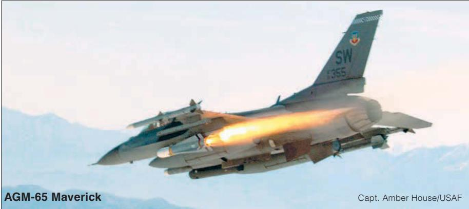

# AIR-TO-GROUND WEAPONS

# ■ AGM-65 MAVERICK

Brief: A tactical, TV-, IIR-, or laser guided standoff air-to-surface missile.

# COMMENTARY

Maverick was first employed during the Vietnam War and was used extensively in Desert Storm and Iraqi Freedom. It is employed by the A-10 and F-16 against tanks, vehicles, and air defenses. AGM-65B is a launch-andleave, EO/TV guided missile, equipped with “scene magnification” TV allowing acquisition of small/distant targets. Fielded in 1986, AGM65D employs an IIR seeker for all-weather day/night use. The AGM-65E is laser guided with a heavyweight penetrator warhead. The AGM-65G fielded in 1989 combines an IIR seeker, software to track larger targets, with a heavyweight penetrator warhead, digital autopilot, and a pneumatic actuation system. The AGM-65H is an upgraded B variant that recently completed tracker upgrades. The AGM-65K is a modified G variant, replacing IR guidance with EO TV guidance, and is also undergoing a tracker upgrade. The AGM65L is the newest EO TV/semiactive-laser seeker equipped, Laser Maverick, designed to strike high-speed moving targets. FY17 funds modify 244 legacy missiles to Laser Maverick standards and replenish weapons expended in ongoing combat.

# EXTANT VARIANT(S)

• AGM-65B. A launch-and-leave EO TV seeker variant.   
• AGM-65D. Adverse weather B variant.   
• AGM-65E. Laser guided version heavyweight penetrator variant.   
• AGM-65G. IIR seeker heavyweight penetrator variant.   
• AGM-65H. Upgraded B variant.   
• AGM-65K. Modified EO TV seeker G variant. • AGM-65L. Laser guided EO TV seeker variant for fast moving targets.   
Function: Air-to-surface guided missile.   
First Flight: August 1969.   
Delivered: From August 1972.   
IOC: February 1973.   
Contractor: Raytheon, Orbital ATK (propulsion).   
Propulsion: Two-stage sustain thrust solidpropellant rocket motor.   
Guidance: EO TV guidance system (B/H/K); IIR seeker (D/G); laser seeker (E).   
Warhead: 125-lb cone-shaped (B/D/H); 300-lb delayed-fuse penetrator (E/G/K).   
Dimensions: Span 2.3 ft, length 8.2 ft, diameter 12 in.   
Performance: Supersonic, range 20 miles.

# ■ AGM-88 HIGH-SPEED ANTI-RADIATION MISSILE (HARM)

Brief: Tactical anti-radar air-to-surface missile.

# COMMENTARY

HARM is a joint USAF-Navy weapon, highly effective against enemy ground radar, and carried by USAF F-16CJs dedicated to the SEAD mission. AGM-88B is equipped with erasable and electronically programmable read-only memory, permitting in-field changes to missile memory. The AGM-88C is the current production model with a more lethal warhead. Raytheon began a HARM Control Section Mod (HCSM) in 2013 to convert current models to more precise AGM-88Fs incorporating improved GPS/INS guidance, anti-counter measure performance, and reduced risk of collateral damage.

# EXTANT VARIANT(S)

• AGM-88B. Early production variant.   
• AGM-88C. Current production variant.   
• AGM-88F. Upgraded variant with greater accuracy and precision.   
Function: Air-to-surface anti-radiation missile. First Flight: April 1979.   
Delivered: 1982-98.   
IOC: Circa 1984.   
Contractor: Raytheon.   
Propulsion: Thiokol dual-thrust, solid-propellant rocket motor.   
Guidance: Proportional with fixed antenna and seeker head in missile nose.   
Warhead: HE fragmentation.   
Dimensions: Span 3.7 ft, length 13.7 ft, diameter 10 in.   
Performance: Supersonic, range $^ { 3 0 + }$ miles.

# ■ AGM-114 HELLFIRE

Brief: Laser guided, low-collateral, air-to-ground anti-armor/anti-personnel missile.

# COMMENTARY

Hellfire is a precision missile utilizing semiactive laser guidance. Missiles are used on the MQ-1 Predator and MQ-9 Reaper, and AFSOC aims to integrate the weapons onto its AC-130W gunships. Hellfire is procured through the Army, and numerous variants are utilized based on overseas contingency demands. An MQ-1 Predator successfully fired an AGM-114 for the first time in February 2000. The combo was employed in combat for the first time in Afghanistan on Oct. 7, 2001. USAF is working to integrate the latest AGM-114R, which replaces several types with a single, multitarget weapon, onto the MQ-9. The Army had to divert missiles to the Air Force to replace stocks severely depleted by combat over Iraq and Syria. FY17 funds support procurement of 1,536 missiles.

# EXTANT VARIANT(S)

• AGM-114. Numerous subvariants, depending on target and mission requirements.   
Function: Air-to-surface guided missile.   
First Flight: Feb. 16, 2000 (USAF).   
Delivered: September 2001-present.   
IOC: N/A.   
Contractor: Lockheed Martin, Orbital ATK (propulsion).   
Propulsion: Solid-propellant rocket motor.   
Guidance: EO TV guidance system (B/H/K);   
IIR seeker (D/G); laser seeker (E).   
Warhead: Shaped charge and blast fragmentation.   
Dimensions: Span 28 in, length 5.33 ft, diameter 17 in.   
Performance: Subsonic, range $^ { 5 + }$ miles.

# ■ AGM-176 GRIFFIN

Brief: GPS and inertial guided air-to-ground missile with semi-active laser seeker for highly accurate, low-collateral attack.

# COMMENTARY

Griffin is a light, low cost, multiservice airlaunched weapon with GPS-aided inertial guidance and semi-active laser seeker. The AGM-176A forms part of the PSP employed on AFSOC’s AC-130W Dragon Spear, and AC-130J Ghostrider gunships. The AGB-176B is employable on RPAs.

# EXTANT VARIANT(S)

• AGM-176A. Aft-ejecting missile employed as part of the PSP.   
• AGM-176B. Forward-firing variant optimized for light aircraft/RPAs.   
Function: Air-to-surface guided missile.   
First Flight: Feb. 16, 2000 (USAF).   
Delivered: September 2001.   
IOC: N/A.   
Contractor: Raytheon.   
Propulsion: Solid-propellant rocket motor.   
Guidance: GPS/INS/semi-active laser.   
Warhead: Blast fragmentation.   
Dimensions: Length 43 in, diameter 5.5 in.   
Performance: Subsonic, range $^ { 1 2 + }$ miles.

# ■ CBU-105 SENSOR FUZED WEAPON (SFW)

Brief: Anti-armor munition capable of destroying multiple moving and stationary land combat vehicles per pass.

# COMMENTARY

SFW is a tactical munitions dispenser with a payload of 10 BLU-108 submunitions, each containing four skeet projectiles, totaling 40 lethal, target-seeking projectiles. The skeet’s active laser and passive IR sensors can detect a vehicle’s shape and IR signature; if no target is detected, the warhead detonates at a preset time. Primary targets are massed tanks, armored personnel carriers, and self-propelled targets. CBU-105 is a basic gravity-type 1,000-lb SFW with a WCMD tail kit. It can be delivered from high altitude and in adverse weather. It debuted in combat in Iraq in 2003. CBU-105 is the only standard USAF cluster munition that meets the less-than-one-percent failure rate mandated by DOD for use beyond 2018.

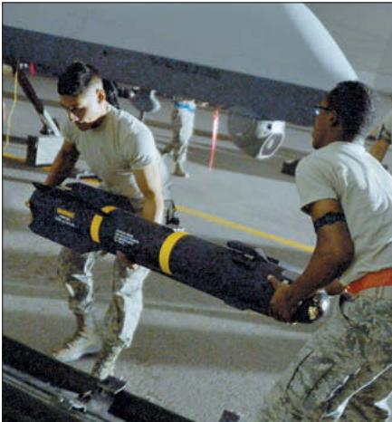  
AGM-114 Hellfire A1C Christian Clausen/USAF

# EXTANT VARIANT(S)

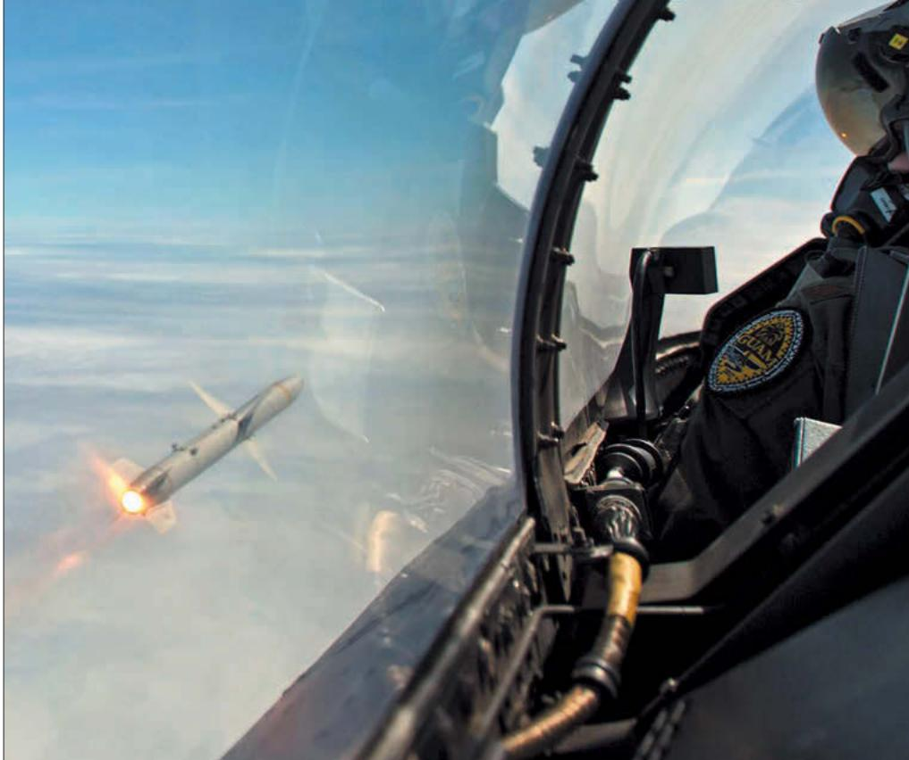  
AGM-88 High-speed Anti-Radiation Missile (HARM)   
Jim Haseltine/courtesy USAF

• CBU-105. CBU-97 with WCMD tail kit.   
Function: Wide-area munition.   
First Flight: Circa 1990.   
IOC: 1997.   
Contractor: Textron Systems.   
Guidance: IR sensors in each warhead.   
Dimensions: Length 7.7 ft, diameter 15 in.   
Performance: Delivers 40 lethal projectiles over an area of about 500 ft x 1,200 ft.

# ■ CBU-107 PASSIVE ATTACK WEAPON

Brief: Area munition used to inflict minimal collateral and environmental damage attacking nonhardened surface targets.

# COMMENTARY

Passive Attack Weapon glides toward its target after release. Before impact, its inner chamber begins to rotate, and projectiles are ejected in rapid succession by centrifugal force, penetrating targets within a 200-ft radius. The weapon contains various-size, penetrating projectiles but no explosive. Full production was completed in six months. The weapon was used during Iraqi Freedom.

# EXTANT VARIANT(S)

• CBU-107A. Centrifugally dispersed, armorpenetrating weapon.   
Function: Wide-area munition.   
First Flight: 2002.

IOC: December 2002.

Contractor: General Dynamics (kinetic energy penetrator payload and canister), Lockheed Martin (WCMD), Textron (tactical munition dispenser kit).

Guidance: Via WCMD.

Dimensions: Length 7.7 ft, diameter 15 in.

Performance: Delivers a high-speed volley of nearly 4,000 metal projectiles in three sizes from a single canister; projectiles: 15 in rods (350), 7 in rods (1,000), and smallnail size (2,400).

# ■ GBU-10/12/49 PAVEWAY II

Brief: Laser guided free-fall bomb used for targets at short standoff range.

# COMMENTARY

The Paveway II kit is a folding wing version of the earlier, fixed wing Paveway I, with seeker and reliability improvements. GBU-10 is the Paveway II seeker and tail kit mounted on a 2,000-lb general-purpose bomb and primarily used against nonhardened targets. It is, however, capable of penetration. The GBU-12 uses a 500-lb bomb body and is primarily used against stationary armored targets. GBU-49 is also a 500-lb body, but adds GPS guidance for all-weather precision delivery. The weapons can be employed from 2,500 ft up to 40,000 ft.

# EXTANT VARIANT(S)

• GBU-10. Laser/GPS guided 2,000-lb bomb. • GBU-12. Laser guided 500-lb bomb.   
• GBU-49. Laser/GPS guided 500-lb bomb. Function: Air-to-surface guided munition. First Flight: Early 1970s.   
IOC: 1976.   
Contractor: Lockheed Martin, Raytheon.   
Guidance: Semi-active laser.   
Warhead: Mk 84 bomb 2,000 lb (GBU-10); Mk 82 500-lb blast/fragmentation bomb (GBU-12/49). Dimensions: Span 5.5 ft, length approx 14.8 ft, diameter 18 in (GBU-10); span 4.4 ft, length 10.8 ft, diameter 11-18 in (GBU-12/49).

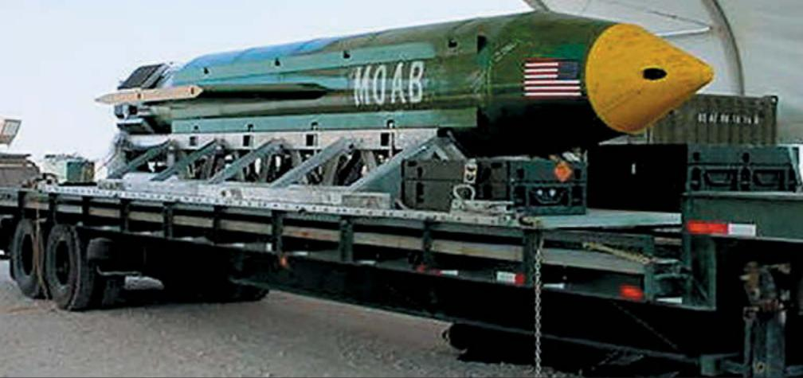  
Courtesy Eglin AFB, Fla.

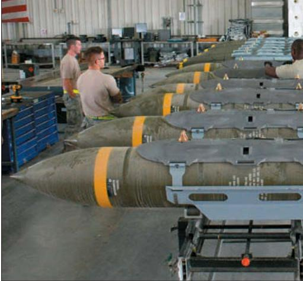  
GBU-31 Joint Direct Attack Munition

# GBU-43/B Massive Ordnance Air Blast (MOAB) Bomb

Performance: CEP 29.7 ft, range 9.2 miles (GBU-10); CEP 29.7 ft, range about six miles (GBU-12/49).

# ■ GBU-24/28 PAVEWAY III

Brief: Advanced laser guided free-fall bomb used against high-value targets from medium standoff range and any altitude.

# COMMENTARY

Paveway III is the third generation laser guided seeker/tail kit package. Its advanced guidance enables greater precision over Paveway II, and its high-lift airframe enables longer glide slopes for greater standoff employment. It can be dropped from low, medium, or high altitude and is effective against a broad range of high-value targets. GBU-24 is fitted to a 2,000-lb bomb body, with a BLU-109 penetrating warhead. GBU-28 variants are large 5,000-lb class air-toground penetrators developed for use against Iraq’s deeply buried, hardened C2 facilities. The GBU-28B adds GPS/INS guidance to the existing laser seeker for all-weather targeting and entered production in 1999. The GBU-28C adds a more powerful penetrating BLU-122 warhead in addition to the enhanced guidance package and entered production in 2005.

# EXTANT VARIANT(S)

• GBU-24. Laser guided 2,000-lb penetrating bomb.   
• GBU-28B/B. Laser/GPS/INS guided 5,000-lb penetrating bomb.   
• GBU-28C/B. Laser/GPS/INS guided 5,000-lb improved penetrating bomb.   
Function: Air-to-surface penetrating glide bomb. First Flight: GBU-24 in service May 1985. IOC: 1986 (GBU-24); 1991 (GBU-28).   
Contractor: Raytheon.   
Guidance: Semi-active laser.   
Warhead: BLU-109 2,000-lb bomb (GBU-24); BLU-113 or BLU-122 5,000-lb bombs (GBU-28). Dimensions: Span 6.7 ft, length 14.4 ft, diameter 18 in (GBU-24); length approx 20 ft, diameter 15 in (GBU-28).   
Performance: Range more than 11 miles (GBU24); range more than 5.75 miles (GBU-28).

# ■ GBU-31/32/38 JOINT DIRECT ATTACK MUNITION (JDAM)

Brief: GPS/INS guided family of weapons designed for highly accurate, autonomous, all-weather conventional attack.

# COMMENTARY

JDAM is a joint USAF-Navy program that upgrades the existing inventory of general-purpose bombs by integrating them with a GPS/INS guidance kit to provide accurate all-weather attack from medium/high altitudes. The weapons acquire targeting information from the aircraft’s avionics system. After release, an inertial guidance kit directs the weapon, aided by periodic GPS updates. JDAM seeker/tail kits can be mounted on general-purpose or penetrating warheads in each weight class. A JDAM kit is under development for the 5,000-lb BLU-113 penetrating weapon, slated for integration and flight testing on the F-15E. FY17 funds support priority procurement of more than 30,000 JDAM variants to replenish depleted stocks.

# EXTANT VARIANT(S)

• GBU-31. GPS/INS guided 2,000-lb GP, or BLU-109 penetrating weapon.   
• GBU-32. GPS/INS guided 1,000-lb GP, or BLU-110 penetrating weapon.   
• GBU-38. GPS/INS guided 500-lb GP, or BLU111 penetrating weapon.   
Function: Air-to-surface guided bomb.   
First Flight: Oct. 22, 1996.   
IOC: 1998.   
Contractor: Boeing, Textron, Honeywell.   
Guidance: GPS/INS.   
Warhead: 2,000-lb Mk 84/BLU-109 (GBU-31), 1,000-lb Mk 83/BLU-110 (GBU-32), 500-lb Mk 82/BLU-111 (GBU-38).   
Dimensions: Span 25 in (GBU-31), 19.6 in (GBU-32), 14 in (GBU-38); length (with JDAM and warhead) approx 12 ft (GBU-31), 10 ft (GBU-32), 7.8 ft (GBU-38).   
Performance: Range up to 15 miles, CEP with GPS 16.4 ft, CEP with INS only 98 ft.

# ■ GBU-39 SMALL DIAMETER BOMB I/II

Brief: Standoff precision guided munition.

# COMMENTARY

SDB is a low-yield, all-weather precision guided munition designed to limit collateral damage and strike targets from up to 46 miles away. Its size allows it to be carried in fighters’ and bombers’ internal weapons bays or to increase overall loadout to enable more independent strikes per sortie. SDB I employs an advanced anti-jam GPS/INS and acquires target coordinates before release. Several SDBs can be simultaneously released against multiple targets. The weapon was first employed by an F-15E over Iraq in 2006. SDB II is a joint USAF-Navy program to attack moving targets from standoff range in all weather. SDB II adds a millimeter-wave radar, IIR, and semiactive laser packaged into a tri-mode seeker. The bomb is retargetable after release. Improvements include reduced susceptibility to countermeasures and network-enablement through Link 16/UHF data links. SDB II is in operational testing and is slated to begin live drops from the F-15E in 2017. SDB I is a major procurement priority, and funds support acquisition of 4,507 weapons.

# EXTANT VARIANT(S)

• GBU-39/B SDB I. GPS/INS guided 250-lb low-yield bomb.   
• GBU-53/B SDB II. Tri-mode guided 250-lb low-yield bomb.   
First Flight: May 23, 2003 (guided SDB I); 2012 (SDB II).   
IOC: Oct. 2, 2006.   
Production: 24,000 (planned) (SDB I); 12,000 (planned) (SDB II).   
Contractor: Boeing (SDB I), Raytheon (SDB II). Guidance: GPS/INS (SDB I); Tri-mode seeker millimeter-wave radar, uncooled IIR, and digital semi-active laser (SDB II).   
Warhead: 250-lb class penetrating blast fragmentation munition.   
Dimensions: Bomb: length 6 ft, width 7.5 in; BRU-61/A carriage (four bombs) length 12 ft, width 16 in, height 16 in.   
Performance: Near-precision capability at standoff range up to 46 miles.

# ■ GBU-43 MASSIVE ORDNANCE AIR BLAST(MOAB) BOMB

Brief: Massive weapon designed to destroy large area or buried targets.

# COMMENTARY

MOAB is the largest satellite guided, air-delivered weapon ever employed. The conventional HE bomb is GPS guided, with fins and inertial gyro for pitch and roll. It was developed in only nine weeks to be available for the 2003 Iraq campaign and given the name Massive Ordnance Air Blast (MOAB) but was unofficially known as “Mother of All Bombs.” The weapon is designed for deployment from the ramp of a C-130 without a parachute. It provides the power to attack large area targets or enemy hidden in tunnels or caves. A total of 18,700 lb of the weapon’s 21,000-lb weight is attributed to BLU-120/B warhead. Used operationally for the first time in April 2017 against ISIS-occupied cave complex in Afghanistan.

# EXTANT VARIANT(S)

• GBU-43/B. GPS guided 21,000-lb bomb.   
Function: Massive guided bomb.   
Guidance: GPS/INS.   
Warhead: BLU-120/B 18,700-lb HE.   
Dimensions: Length 30 ft, diameter 3.3 ft.

# ■ GBU-54 LASER JOINT DIRECT ATTACK MUNITION (LJDAM)

Brief: GPS/INS guided weapon equipped with additional laser seeker for highly accurate, autonomous, all-weather conventional attack against fixed and moving targets.

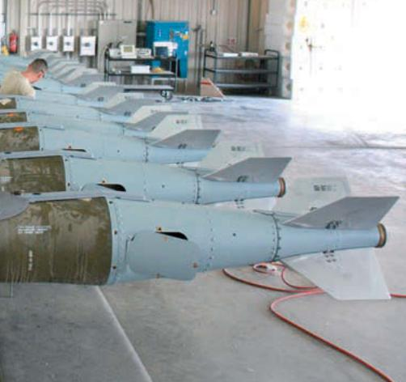  
TSgt. James Hodgman/USAF

# COMMENTARY

LJDAM is a joint USAF-Navy development that combines a laser guidance kit with the GPS/ INS-based navigation of existing GBU-38 JDAM. The current LJDAM is a dual mode 500-lb guided weapon capable of attacking moving targets with precision. It was developed as an urgent operational need, and testing was completed in less than 17 months. It was first delivered in May 2008 and deployed in combat in Iraq three months later. Boeing is also developing GBU-31 and GBU-32 variants.

# EXTANT VARIANT(S)

• GBU-54 Laser JDAM. Laser/GPS/INS guided 500-lb bomb.   
Function: Air-to-surface guided bomb.   
First Flight: 2005.   
IOC: 2008.   
Contractor: Boeing.   
Guidance: GPS/INS with laser.   
Warhead: Mk 82 500-lb munition.   
Dimensions: Length (with JDAM and warhead) approx 8 ft.   
Performance: Range up to 15 miles.

# ■ GBU-57 MASSIVE ORDNANCE PENETRATOR

Brief: Massive, GPS guided, earth-penetrating weapon used against hard and deeply buried targets.

# COMMENTARY

MOP was developed and tested through a USAF and Defense Threat Reduction Agency partnership in 2004. Flight testing was conducted from 2008 to 2010, when the program transitioned to USAF. Boeing received the contract in 2009 for B-2A bomber integration, which was completed in 2011. A B-2 successfully test-dropped the GBU-57 in 2014 and 2015. Recent tests proved the effectiveness of several enhancements and cleared the way for continued testing and potential early fielding, though the Air Force’s recommendation is classified.

# EXTANT VARIANT(S)

• GBU-57B. GPS guided 5,300-lb penetrating weapon.   
Function: Massive PGM.   
Guidance: GPS.   
Warhead: 5,300-lb HE.   
Dimensions: length 20.5 ft, diameter 31.5 in.

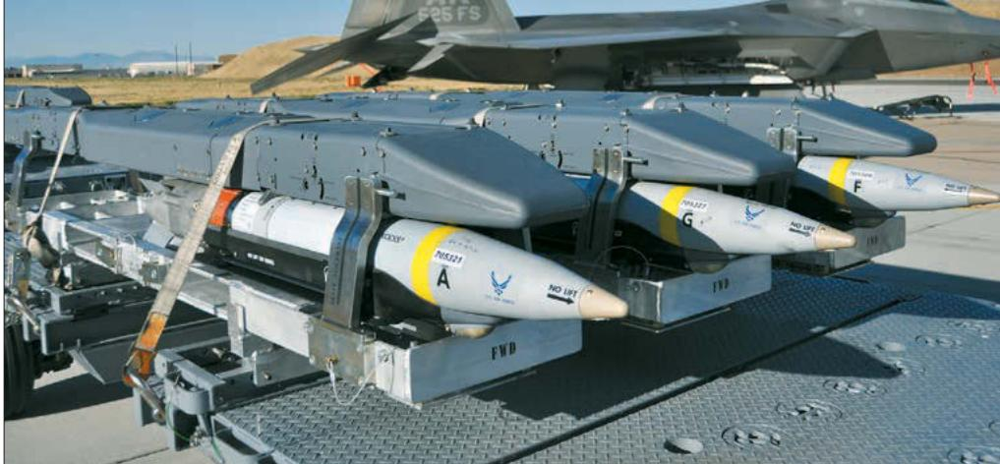  
TSgt. Dana Rosso/USAF

# SATELLITE SYSTEMS

Brief: Constellation providing global, secure,

protected, and jam-resistant military communication.

# GBU-39 Small Diameter Bomb

# COMMENTARY

AEHF is replacing existing Milstar satellites and operates at a much higher capacity and data rate. It offers secure, anti-jam tactical and strategic communications around the world. AEHF uses cross-linked satellites, eliminating the need for ground relay stations. The program is a collaboration with Canada, the Netherlands, and the United Kingdom. The AEHF system achieved IOC in 2015. SV-4 is scheduled to launch in 2017, paving the way for full operational capability.

# ■ ADVANCED EXTREMELY HIGH FREQUENCY (AEHF) SATELLITE SYSTEM

# EXTANT SYSTEMS

• AEHF SV-1. Launched in 2010, on orbit and operational.   
• AEHF SV-2. Launched in 2012, on orbit and operational.   
• AEHF SV-3. Launched in 2013, on orbit and operational.   
• AEHF SV-4. Planned for launch in 2017. Function: Communications.   
Operator: AFSPC.   
First Launch: August 2010.   
IOC: 2017 (planned).   
Constellation: Four.   
Design Life: 14 years.   
Launch Vehicle: Atlas V.   
Operational Location: Schriever AFB, Colo. Orbit Altitude: Geosynchronous at $^ { 2 2 , 0 0 0 + }$ miles.   
Contractor: Lockheed Martin, Northrop Grumman.   
Power: Solar arrays generating 20,000 watts. Dimensions: Length ${ } _ { 3 1 } \ t { } \mathrm { t }$ , width 98 ft (with full solar array extension).   
Weight: 13,400 lb.   
Performance: 24-hr low, medium, and extended data rate connectivity from 65 north to 65 south latitude worldwide.

# ■ DEFENSE METEOROLOGICAL SATELLITE PROGRAM (DMSP)

Brief: Satellite constellation used to collect air, land, sea, and space environmental data in support of worldwide military operations.

# COMMENTARY

DMSP provides timely and high-quality weather information to strategic and tactical combat units worldwide. It uses operational linescan sensor to image cloud cover in visible and thermal IR and analyze cloud patterns. It is equipped with microwave imagers and sounders and a suite of space environment sensors that provide critical land, sea, and space environment data. Block 5D-3 improved spacecraft bus and sensors for longer and more capable missions. Six operational DMSP satellites now survey the entire Earth four times a day. The oldest operational satellite, DMSP-13, suffered an apparent electrical short and exploded, creating a cloud of debris in space in 2015. DMSP-19 most recently launched in 2014. The vehicle subsequently suffered a power failure in early 2016, rendering it uncontrollable. Data from the craft remains usable until its orbit decays. Congress canceled the DMSP program before the final spacecraft (DMSP-20) could be launched. DMSP-20 is in storage awaiting a decision to launch it as a replacement to DMSP-19 or to dispose of the vehicle. USAF is also considering requirements for a follow-on system.

# EXTANT VARIANT(S)

• Block 5D-2. Launched 1982 to 1997; one active (DMSP-14).   
• Block 5D-3. Improved spacecraft bus and sensors for longer, more capable missions. Function: Space and Earth environmental data collection.   
Operator: National Oceanic and Atmospheric Administration (NOAA).   
First Launch: May 23, 1962.   
IOC: 1965.   
Constellation: Six low Earth orbit (LEO).   
Design Life: Five yr (Block 5D-3).   
Launch Vehicle: Delta IV; Atlas V.   
Operational Location: NOAA Satellite Operations Facility, Suitland, Md.   
Orbit Altitude: Approx 527 miles.   
Contractor: Lockheed Martin, Northrop Grumman.   
Power: Solar arrays generating 1,200-1,300 watts.   
Dimensions: Length 25 ft (with array deployed), width 4 ft.   
Weight: 2,545 lb, incl 772-lb sensor; 2,270 lb with 592-lb sensor payload.   
Performance: Polar orbits; covers Earth in about 6 hr; primary sensor scans 1,800-mile-wide area.

# ■ DEFENSE SATELLITE COMMUNICATIONS SYSTEM (DSCS)

Brief: Joint service satellite system providing high-capacity communications for deployed air, land, and sea forces.

# COMMENTARY

DSCS is the workhorse of US military’s SHF communications system. It provides military communications to troops in the field and commanders worldwide. The last of 14 DSCS IIIs launched in 2003. AFSPC deactivated its two oldest DSCS satellites, B-12 in July 2014 and DSCS-10 in June 2015. B-12 exceeded its designed lifespan by 12 years. The final four DSCS satellites received SLEP before launch, providing higher power amplifiers, more sensitive receivers, and increased antenna connection options. The satellites also carry a single channel transponder to disseminate emergency action and force direction messages to nuclear-capable forces.

# EXTANT VARIANT(S)

• DSCS III. Current base on orbit variant. • DSCS III. SLEP. Upgrade configuration of last four satellites launched.   
Function: Communications.   
Operator: AFSPC.   
First Launch: DSCS II 1971; DSCS III 1982; DSCS III/SLEP 2000.   
IOC: Dec. 13, 1978 (DSCS II).   
Constellation: Five (III); 14 deployed/seven operational.   
Design Life: 10 yr (III).   
Launch Vehicle: Atlas II and EELV.   
Operational Location: Schriever AFB, Colo. Orbit Altitude: $^ { 2 2 , 0 0 0 + }$ miles in geosynchronous orbit.   
Contractor: Lockheed Martin.   
Power: Solar arrays generating 1,269 watts, decreasing to 980 watts after 10 yr; 1,500 watts (SLEP).   
Dimensions: Rectangular body 6 x 6 x 7 ft, 38-ft span with solar arrays deployed.   
Weight: 2,580 lb; 2,716 lb (SLEP).   
Performance: Employs six independent SHF transponder channels for secure voice and high-rate data communications.

# ■ DEFENSE SUPPORT PROGRAM (DSP)

Brief: Ballistic missile early warning spacecraft in geosynchronous orbit, guarding US forces and the US homeland against attack.

# COMMENTARY

DSP is a key part of North American and theater early warning systems. It is capable of detecting missile launches and nuclear detonations and was originally aimed at the Soviet military. It was used extensively in 1991 Gulf War to detect Iraqi theater missile launches against coalition forces and allies in the region. The 23rd and final DSP satellite launched in December 2007. Block 5 is the latest variant and is more survivable than predecessors. It includes a medium wavelength IR sensor for more mission utility and accommodates 6,000 detectors. Nine Block 5 satellites were deployed between 1989 and 2007. Control of the constellation was consolidated to the new Block 10 Mission Control Station at Buckley AFB, Colo., in early 2016.

# EXTANT VARIANT(S)

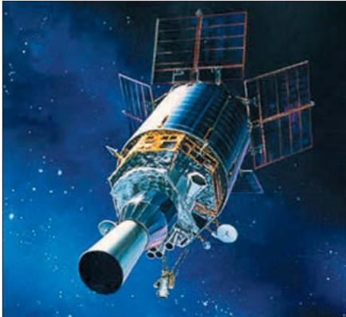

# Defense Support Program USAF illustration

Weight: Approx 5,200 lb.   
Performance: Uses IR sensors to sense heat from missile and booster plumes against Earth’s background.

# ■ GEOSYNCHRONOUS SPACE SITUATIONAL AWARENESS PROGRAM (GSSAP)

Brief: Space-based platform to track and characterize manmade objects in geosynchronous orbit to aid safety and avoidance.

# COMMENTARY

GSSAP are “neighborhood watch” satellites that augment the legacy Space Based Space Surveillance (SBSS) system. SBSS tracks and classifies manmade objects in low Earth orbit, and GSSAP extends this coverage to geosynchronous orbit. Two GSSAP satellites were launched in 2014 and attained IOC on Sept. 29, 2015. The satellites operate in neargeosynchronous orbit to effectively monitor objects and aid in preventing collisions in space. GSSAP carry EO/IR sensors and are able to maneuver to observe objects at close range and can track objects without the weather and atmospheric disruptions affecting ground systems.

# EXTANT VARIANT(S)

• GSSAP. Launched 2014; two active.   
Operator: AFSPC.   
First Launch: July 28, 2014.   
IOC: Sept. 29, 2015.   
Constellation: Two spacecraft.   
Launch Vehicle: Delta IV.   
Operational Location: Schriever AFB, Colo.   
Orbit Altitude: 22,300 miles, above geosynchronous.   
Contractor: Orbital Sciences Corp.   
Power: Solar panels.

# ■ GLOBAL POSITIONING SYSTEM (GPS)

capabilities, and a second civil signal. GPS Block IIF is a follow-on to IIR-M. Upgrades include extended design life, faster processors, and improved anti-jam and accuracy, with a new military signal and a second and third dedicated civil signal. The last of 12 GPS IIF satellites deployed since 2010 launched from Cape Canaveral AFS, Fla., on Feb. 5, 2016. The next generation GPS Block IIIA currently in production is expected to improve accuracy, availability, integrity, and resistance to jamming. The first launch was pushed back from 2014 to a tentative 2017 target. SpaceX was awarded its first GPS launch contract to launch the second GPS IIIA on its Falcon 9 booster in May 2018. USAF recently contracted Lockheed Martin to build GPS IIIA vehicles nine and 10 for expected launch in 2022.

# EXTANT VARIANT(S)

• GPS Block IIA. Launched 1990 to 1997; final satellite retired in 2016.   
• GPS Block IIR. Launched 1997 to 2004; 12 active.   
• GPS Block IIR-M. Launched in 2005 to 2009; seven active.   
• GPS Block IIF. Launched in 2010 to 2016; 11 active, one recently launched.   
• GPS Block IIIA. Future generation expected to launch in 2017.   
Function: Worldwide navigation, timing, and velocity data.   
Operator: AFSPC.   
First Launch: Feb. 22, 1978.   
IOC: Dec. 9, 1993.   
Constellation: 31 spacecraft.   
Design Life: 7.5 yr (II/IIA); 7.5 yr (IIR/IIR-M); 12 yr (IIF); 15 yr (IIIA).   
Launch Vehicle: Delta II, Delta IV, Falcon 9 (planned).   
Operational Location: Schriever AFB, Colo. Orbit Altitude: 10,988 miles.   
Contractor: Boeing (II, IIA, IIF), Lockheed Martin (IIR, IIR-M, IIIA).   
Power: Solar panels generating 700 watts (II/IIA); 1,136 watts (IIR/IIR-M); up to 2,900 watts (IIF).   
Dimensions: (IIR/IIR-M) $5 \times 6 . 3 \times 6 . 2 5$ ft, span incl solar panels 38 ft; (IIF) $9 . 6 \times 6 . 5 \times 1 2 . 9$ ft, span incl solar panels 43.1 ft.   
Weight: On orbit, 2,370 lb (IIR/IIR-M); 3,439 lb (IIF).   
Performance: Orbits the Earth every $^ { 1 2 \textsf { h r } }$ , emitting continuous signals, providing time to within one-millionth of a second, velocity within a fraction of a mile per hour, and location to within a few feet.

# ■ MILSTAR SATELLITE COMMUNICATIONS SYSTEM (MILSTAR)

• Block 5. Most current on-orbit version.   
Function: Strategic and tactical launch detection. Operator: AFSPC.   
First Launch: November 1970.   
IOC: Circa 1972.   
Constellation: Classified.   
Design Life: Three-year requirement and fiveyear goal.   
Launch Vehicle: Titan IV with inertial upper stage; Delta IV Heavy EELV.   
Operational Location: Buckley AFB, Colo. Orbit Altitude: Geosynchronous at $^ { 2 2 , 0 0 0 + }$ miles.   
Contractor: TRW (now Northrop Grumman), Aerojet.   
Power: Solar arrays generating 1,485 watts. Dimensions: Diameter 22 ft, height 32.8 ft, with solar paddles deployed.

Brief: Space-based radio-positioning constellation providing highly accurate worldwide location, velocity, and timing services to military and civilian users.

# COMMENTARY

GPS is a fundamental contribution to precision bombing, CSAR, mapping, and rendezvous. Provides accurate 3-D (latitude, longitude, and altitude) position, velocity, and time data in an uninterrupted way. GPS Block IIA first launched in 1990. The Air Force decommissioned the final Block IIA, launched to replace original GPS Block I series, on Aug. 26, 2016. GPS Block IIR and IIR-M (modernized) included 21 vehicles launched between 2005 and 2009. Modernization upgrades included two new signals, enhanced encryption, anti-jamming

Brief: Joint service satcom constellation that provides global, secure, protected, and jamresistant military communications.

# COMMENTARY

Milstar is the backbone of strategic-tactical DOD communications. It provides secure, anti-jam communications around the world and uses cross-linked satellites, eliminating the need for ground relay stations. Offers 24-hours-a-day capability. The last of six satellites launched in 2003. AEHF will eventually replace Milstar as the DOD’s primary satcom.

# EXTANT VARIANT(S)

• Block I. Milstar I satellites launched 1994-95. • Block II. Milstar II satellites launched 1999- 2003.

Function: Communications.   
Operator: AFSPC.   
First Launch: Feb. 7, 1994.   
IOC: July 1997 (Milstar I).   
Constellation: Five: two Milstar I; three Milstar II.   
Design Life: 10 yr.   
Launch Vehicle: Titan IV/Centaur.   
Operational Location: Schriever AFB, Colo. Orbit Altitude: Geosynchronous at $^ { 2 2 , 0 0 0 + }$ miles.   
Contractor: Lockheed Martin, Boeing, TRW (now Northrop Grumman).   
Power: Solar arrays generating 8,000 watts. Dimensions: Length 51 ft, width 116 ft with full solar array extension.   
Weight: 10,000 lb.   
Performance: Milstar I sats have low data rate (LDR) payload, transmitting 75 to 2,500 bps of data over 192 channels in EHF range; Milstar II sats have both LDR and medium data rate (MDR) payloads, transmitting 4,800 bps to 1.5 Mbps over 32 channels.

# ■ SPACE BASED INFRARED SYSTEM(SBIRS)

Brief: Advanced space surveillance and missile warning system, capable of battlespace characterization and technical intelligence gathering.

# COMMENTARY

SBIRS is the follow-on to the Defense Support Program satellite. The system includes IR sensor payloads on host satellites in highly elliptical orbit (HEO), two IR sensors each on dedicated satellites in geosynchronous Earth orbit (GEO), and ground assets. HEO sensor detects launch of submarine-launched ballistic missiles (SLBMs) from the North Pole region and can be tasked for other IR detection missions. GEO scanning IR sensor performs the strategic missile warning mission, global technical intelligence, and initial phase for the strategic missile defense mission, providing two times the revisit rate and three times the sensitivity of DSP. USAF announced plans to allow civil use of SBIRS data to aid weather prediction, Arctic ice monitoring, and wildfire tracking. GEO-3 launched into orbit Jan. 20, 2017, after delays to validate the performance of its liquid apogee engine. GEO-4 is slated to launch in 2017. The next two GEO satellites are under contract and will eventually replace the oldest two on orbit. SBIRS Control was consolidated to the new Block 10 Mission Control Station at Buckley AFB, Colo., in early 2016.

# EXTANT SYSTEM(S)

• SBIRS HEO-1. Payload operational in 2008;   
currently active.   
• SBIRS HEO-2. Payload operational in 2009;   
active.

  
Milstar   
USAF illustration

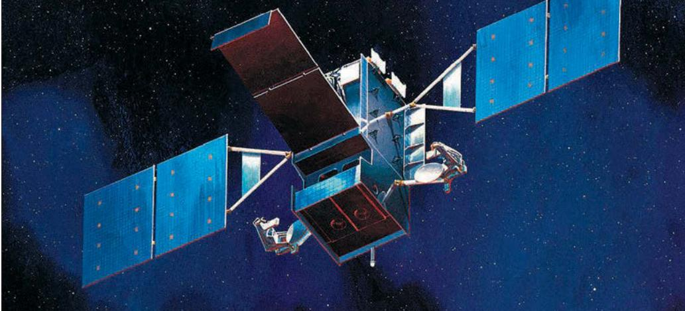

# Space Based Infrared System

• SBIRS HEO-3. Payload operational in 2015;   
active.   
• SBIRS GEO-1. Launched in 2011; active.   
• SBIRS GEO-2. Launched in 2013; active.   
• SBIRS GEO-3. Launched in 2017; active.   
Function: Space surveillance.   
Operator: AFSPC.   
First Launch: GEO 1, May 2011.   
IOC: HEO 1, Dec. 5, 2008. (Increment 1, Dec.   
8, 2001).   
Constellation: Four GEO sats, three HEO sensors (hosted).   
Design Life: N/A.   
Launch Vehicle: GEO, Atlas V.   
Operational Location: Buckley AFB, Colo.   
Orbit Altitude: Geosynchronous and high elliptical.   
Contractor: Lockheed Martin, Northrop Grumman.   
Power: Solar array, 2,435 watts (GEO).   
Dimensions: GEO $7 \times 6 . 3 \times 1 9 . 7$ ft.   
Weight: 5,603 lb (GEO on orbit).

# ■ SPACE BASED SURVEILLANCE SYSTEM(SBSS)

Brief: Satellite constellation used to track, characterize, and measure orbital vehicles and hazardous orbital debris.

# COMMENTARY

SBSS is designed to track and collect optical signatures of Earth-orbiting objects, including space debris, from a space-based platform. AFSPC is working to extend SBSS service life to cover a potential four-year gap in coverage before it can launch a follow-on spacecraft in 2021—the earliest date based on projected funding.

# EXTANT SYSTEM(S)

• SBSS Block 10. Launched in 2010; active. Function: Space surveillance and object identification.   
Operator: AFSPC.   
First Launch: Sept. 25, 2010.   
IOC: Aug. 17, 2012.   
Constellation: One LEO satellite.   
Design Life: Seven yr.   
Launch Vehicle: Minotaur IV.   
Operational Location: Schriever AFB, Colo. Orbit Altitude: 390 miles, sun-synchronous orbit.   
Contractor: Boeing (system integration, ground segment, operations, and sustainment), Ball Aerospace (satellite).   
Power: Solar arrays and batteries generating 750 watts.   
Dimensions: Height approx 10 ft; $1 0 \times 3 . 2$ ft, plus solar panels.   
Weight: Approx 2,273 lb.

# ■ WIDEBAND GLOBAL SATCOM (WGS) SATELLITE

Brief: Satellites providing high-capacity communications for deployed air, land, and sea forces.

# COMMENTARY

WGS is designed to provide worldwide communications coverage for tactical and fixed users and to augment and then replace DSCS X-band frequency service. Augments the oneway Global Broadcast Service Joint Program Ka-band frequency capabilities. WGS satellites also provide a new high-capacity two-way Ka-band frequency service. Block I includes: SV-1 (Pacific region), SV-2 (Middle East), and SV-3 (Europe and Africa). Block II satellites are modified to better support the airborne ISR mission and include: SV-4 (Indian Ocean) and SV-5 and SV-6, purchased by Australia in 2013. The US is partnering with Canada, Denmark, Luxembourg, the Netherlands, and New Zealand on Block II follow-on sats SV-7 to SV-10. SV-7 launched on July 23, 2015, and became operational that October. SV-8 launched into orbit on Dec. 7, 2016, and SV-9 launched March 18, 2017. All four satellites are expected to be aloft and operational by 2019. USAF recently contracted industry to develop anti-jamming capability for tactical users and is reviewing alternatives to eventually replenish the constellation with three additional satellites or develop a follow-on system.

# EXTANT VARIANT(S)

• Block I. Satellites SV-1 to SV-3; launched 2007 to 2009; active.   
• Block II. Satellites SV-4 to SV-8; launched 2009 to 2016; active.   
Function: Communications.   
Operator: AFSPC.   
First Launch: October 2007.   
IOC: April 16, 2008.   
Constellation: Seven satellites.   
Design Life: 14 yr.   
Launch Vehicle: Atlas V, Delta IV.   
Operational Location: Schriever AFB, Colo.   
Orbit Altitude: Geosynchronous at $^ { 2 2 , 0 0 0 + }$ miles.   
Contractor: Boeing.   
Power: Solar arrays generating 9,934 watts.   
Dimensions: Based on Boeing 702 Bus.   
Weight: 13,000 lb at launch.   
Performance: Approx 10 times the capability of a DSCS satellite.

# Leaders 8 Through the Years

2017 USAF Almanac

# The Nation’s Air Arm and Its Early Leaders

<table><tr><td>DESIGNATION</td><td>COMMANDER</td><td>DATES OF SERVICE</td><td></td></tr><tr><td colspan="4">AERonAUTICAL DIvIsIoN, Us sIGNAL coRPS Aug. 1, 1907 - July 18, 1914</td></tr><tr><td rowspan="4">Chief, Aeronautical Division</td><td>Capt. Charles deForest Chandler</td><td>Aug. 1, 1907</td><td>June 30, 1910</td></tr><tr><td>Capt. Arthur S. Cowan</td><td>July 1, 1910</td><td>June 19, 1911</td></tr><tr><td>Capt. Charles deForest Chandler</td><td>June 20, 1911</td><td>Sept.9, 1913</td></tr><tr><td>Maj. Samuel Reber</td><td>Sept. 10, 1913</td><td>July 17, 1914</td></tr><tr><td colspan="2">AvIATion sEcTioN, Us sIGNAL CoRPsa July 18, 1914 - May 20, 1918 Chief, Aviation Section</td><td colspan="2"></td></tr><tr><td rowspan="6"></td><td>Lt. Col. Samuel Reber</td><td>July 18, 1914</td><td>May 5, 1916</td></tr><tr><td>Lt. Col. George O. Squier</td><td>May 20, 1916</td><td>Feb. 19, 1917</td></tr><tr><td>Lt. Col. John B. Bennet</td><td>Feb. 19, 1917</td><td>June 30, 1917</td></tr><tr><td>Maj. Benjamin D. Foulois</td><td>June 30, 1917</td><td>Nov. 12, 1917</td></tr><tr><td>Brig. Gen. Arthur I. Dade</td><td>Nov. 12, 1917</td><td>Feb.27, 1918</td></tr><tr><td>Col. Lawrence Brown</td><td>Feb. 27, 1918</td><td>May 20, 1918</td></tr><tr><td colspan="2"> DIVIsioN oF MILITARY AERoNAUTicS, SEcRETARY 0F WAR May 20, 1918 - May 24, 1918</td><td colspan="2"></td></tr><tr><td>Director of Military Aeronautics</td><td>Maj. Gen. William L. Kenly (Kept same title three months into absorption by Air Service)</td><td>May 20, 1918</td><td>August 1918</td></tr><tr><td colspan="2">AIR sERVIcE May 24, 1918 - July 2, 1926</td><td colspan="2"></td></tr><tr><td rowspan="2">Director of Air Service</td><td>John D. Ryan</td><td>Aug. 28, 1918</td><td>Nov. 27, 1918</td></tr><tr><td>Maj. Gen. Charles T. Menoher</td><td>Jan. 2, 1919</td><td>June 4, 1920</td></tr><tr><td rowspan="2">Chief of Air Service</td><td>Maj. Gen. Charles T. Menoher</td><td>June 4, 1920</td><td>Oct. 4, 1921</td></tr><tr><td>Maj. Gen. Mason M. Patrick</td><td>Oct. 5, 1921</td><td>July 2, 1926</td></tr><tr><td colspan="2">AIR coRPsb July 2, 1926 - Sept. 18, 1947 Chief of Air Corps</td><td>July 2, 1926</td><td></td></tr><tr><td rowspan="4"></td><td>Maj. Gen. Mason M. Patrick Maj. Gen. James E. Fechet</td><td>Dec. 14, 1927</td><td>Dec. 13, 1927 Dec. 19, 1931</td></tr><tr><td>Maj. Gen. Benjamin D. Foulois</td><td>Dec. 20, 1931</td><td>Dec.21, 1935</td></tr><tr><td>Maj. Gen. Oscar Westover</td><td>Dec.22, 1935</td><td>Sept. 21, 1938</td></tr><tr><td>Maj. Gen. Henry H. Arnold</td><td>Sept. 29, 1938</td><td>June 20, 1941</td></tr><tr><td colspan="2">ARMY AIR FoRcEs (AAF) June 20, 1941 - Sept. 18, 1947</td><td></td><td></td></tr><tr><td>Chief, Army Air Forces</td><td>Lt. Gen. Henry H. Arnold</td><td>June 20, 1941</td><td>March 9, 1942</td></tr><tr><td>Commanding General, AAF</td><td>Gen. of the Army Henry H. Arnoldc Gen. Car A. Spaatz</td><td>March 9, 1942 Feb.9,1946</td><td>Feb.9, 1946 Sept. 26, 1947</td></tr><tr><td colspan="2">UNITED STATEs AIR FORCE Sept. 18, 1947</td><td></td><td></td></tr><tr><td colspan="2">Chief of Staff Gen. Carl A. Spaatz</td><td>Sept. 26, 1947 April 29, 1948</td><td></td></tr></table>

aBetween April 1917 and May 1918, the Aviation Section was known by various other names: Aeronautical Division, Airplane Division, Air Division, and Air Service Division.

bThe Air Corps became a subordinate element of the Army Air Forces June 20, 1941. Since the Air Corps had been established by statute in 1926, its disestablish me required an act of Congress, which did not take place until 1947. Between March 9, 1942, and Sept. 18, 1947, the Air Corps continued to exist as a combatant arm, a personnel of the Army Air Forces were still assigned to the Air Corps.

<table><tr><td colspan="6">SECRETARY OF THE AIR FORCE</td></tr><tr><td>Stuart Symington</td><td>Sept. 18, 1947</td><td>April 24, 1950</td><td>James F. McGovern (acting)</td><td>Dec. 16, 1988</td><td>April 29, 1989</td></tr><tr><td>Thomas K. Finletter</td><td>April 24, 1950</td><td>Jan. 20, 1953</td><td>John J. Welch Jr. (acting)</td><td>April 29, 1989</td><td>May 21, 1989</td></tr><tr><td>Harold E. Talbott</td><td>Feb. 4, 1953</td><td>Aug. 13, 1955</td><td>Donald B. Rice</td><td>May 22, 1989</td><td>Jan. 20, 1993</td></tr><tr><td>Donald A. Quarles</td><td>Aug. 15, 1955</td><td>April 30, 1957</td><td>Michael B. Donley (acting)</td><td>Jan. 20, 1993</td><td>July 13, 1993</td></tr><tr><td>James H. Douglas Jr.</td><td>May 1, 1957</td><td>Dec. 10, 1959</td><td>Gen. Merrill A. McPeak (acting)</td><td>July 14, 1993</td><td>Aug. 5, 1993</td></tr><tr><td>Dudley C. Sharp</td><td>Dec. 11, 1959</td><td>Jan. 20, 1961</td><td>Sheila E. Widnall</td><td>Aug. 6, 1993</td><td>Oct. 31, 1997</td></tr><tr><td>Eugene M. Zuckert</td><td>Jan. 23, 1961</td><td>Sept.30, 1965</td><td>F. Whitten Peters*</td><td>Nov. 1, 1997</td><td>Jan. 20, 2001</td></tr><tr><td>Harold Brown</td><td>Oct. 1, 1965</td><td>Feb. 14, 1969</td><td>Lawrence J. Delaney (acting)</td><td>Jan. 20, 2001</td><td>June 1, 2001</td></tr><tr><td>Robert C. Seamans Jr.</td><td>Feb. 15, 1969</td><td>May 14, 1973</td><td>James G. Roche</td><td>June 1, 2001</td><td>Jan. 20, 2005</td></tr><tr><td>John L. McLucas*</td><td>May 15, 1973</td><td>Nov. 23, 1975</td><td>Peter B. Teets (acting)</td><td>Jan. 20, 2005</td><td>March 25, 2005</td></tr><tr><td>James W. Plummer (acting)</td><td>Nov. 23, 1975</td><td>Jan.2, 1976</td><td>Michael L. Dominguez (acting)</td><td>March 25, 2005</td><td>July 29, 2005</td></tr><tr><td>Thomas C. Reed</td><td>Jan. 2, 1976</td><td>April 6, 1977</td><td>Preston M. Geren (acting)</td><td>July 29, 2005</td><td>Nov. 3, 2005</td></tr><tr><td>John C. Stetson</td><td>April 6, 1977</td><td>May 18, 1979</td><td>Michael W. Wynne</td><td>Nov. 3, 2005</td><td>June 20, 2008</td></tr><tr><td>Hans M. Mark*</td><td>May 18, 1979</td><td>Feb. 9, 1981</td><td>Michael B. Donley*</td><td>June 21, 2008</td><td>June 21, 2013</td></tr><tr><td>Verne Orr</td><td>Feb. 9, 1981</td><td>Nov. 30, 1985</td><td>Eric Fanning (acting)</td><td>June 21, 2013</td><td>Dec. 20, 2013</td></tr><tr><td>Russell A. Rourke</td><td>Dec.6, 1985</td><td>April 7, 1986</td><td>Deborah Lee James</td><td>Dec. 20, 2013</td><td>Jan. 19, 2017</td></tr><tr><td>Edward C. AIldridge Jr.*</td><td>April 8, 1986</td><td>Dec.16, 1988</td><td>Lisa S. Disbrow (acting)</td><td>Jan. 20, 2017</td><td></td></tr></table>

<table><tr><td></td><td></td><td></td><td></td><td></td><td></td></tr><tr><td>Verne Orr</td><td>Feb.9, 1981</td><td>Nov. 30, 1985</td><td>Eric Fanning (acting)</td><td>June 21, 2013</td><td>Dec.20, 2013</td></tr><tr><td>Russell A. Rourke</td><td>Dec. 6, 1985</td><td>April 7, 1986</td><td>Deborah Lee James</td><td>Dec. 20, 2013</td><td>Jan. 19, 2017</td></tr><tr><td>Edward C. Aldridge Jr.*</td><td>April 8, 1986</td><td>Dec. 16, 1988</td><td>Lisa S. Disbrow (acting)</td><td>Jan. 20, 2017</td><td></td></tr><tr><td colspan="6"></td></tr><tr><td colspan="6">CHIEF OF STAFF OF THE AIR FORCE</td></tr><tr><td>Gen. Carl A. Spaatz</td><td>Sept. 26, 1947</td><td>April 29, 1948</td><td>Gen. Michael J. Dugan</td><td>July 1, 1990</td><td>Sept. 17, 1990</td></tr><tr><td>Gen. Hoyt S. Vandenberg</td><td>April 30, 1948</td><td>June 29, 1953</td><td>Gen. John Michael Loh (acting)</td><td>Sept. 18, 1990</td><td>Oct. 27, 1990</td></tr><tr><td>Gen. Nathan F. Twining</td><td>June 30, 1953</td><td>June 30, 1957</td><td>Gen. Merrill A. McPeak</td><td>Oct.27, 1990</td><td>Oct. 25, 1994</td></tr><tr><td>Gen. Thomas D. White</td><td>July 1, 1957</td><td>June 30, 1961</td><td>Gen. Ronald R. Fogleman</td><td>Oct. 25, 1994</td><td>Sept. 1, 1997</td></tr><tr><td>Gen. Curtis E. LeMay</td><td>June 30, 1961</td><td>Jan. 31, 1965</td><td>Gen. Ralph E. Eberhart (acting)</td><td>Sept. 1, 1997</td><td>Oct.6, 1997</td></tr><tr><td>Gen. John P. McConnell</td><td>Feb. 1, 1965</td><td>July 31, 1969</td><td>Gen. Michael E. Ryan</td><td>Oct. 6, 1997</td><td>Sept. 6, 2001</td></tr><tr><td>Gen. John D. Ryan</td><td>Aug. 1, 1969</td><td>July 31, 1973</td><td>Gen. John P. Jumper</td><td>Sept. 6, 2001</td><td>Sept.2, 2005</td></tr><tr><td>Gen. George S. Brown</td><td>Aug. 1, 1973</td><td>June 30, 1974</td><td>Gen. T. Michael Moseley Gen. Duncan J. McNabb (acting)</td><td>Sept. 2, 2005</td><td>July 12, 2008</td></tr><tr><td>Gen. David C. Jones</td><td>July 1, 1974</td><td>June 20, 1978</td><td>Gen. Norton A. Schwartz</td><td>July 12, 2008</td><td>Aug. 12, 2008</td></tr><tr><td>Gen. Lew Allen Jr.</td><td>July 1, 1978</td><td>June 30, 1982</td><td>Gen. Mark A. Welsh II</td><td>Aug. 12, 2008</td><td>Aug. 10, 2012</td></tr><tr><td>Gen. Charles A. Gabriel</td><td>July 1, 1982</td><td>June 30, 1986</td><td></td><td>Aug. 10, 2012</td><td>July 1, 2016</td></tr><tr><td>Gen. Larry D. Welch</td><td>July 1, 1986</td><td>June 30, 1990</td><td>Gen. David L. Goldfein</td><td>July 1, 2016</td><td></td></tr><tr><td colspan="6">VICE CHIEF OF STAFF OF THE AIR FORCE</td></tr><tr><td>Gen. Hoyt S. Vandenberg</td><td>Oct. 10, 1947</td><td>April 28, 1948</td><td>Gen. Lawrence A. Skantze</td><td>Oct. 6, 1983</td><td>July 31, 1984</td></tr><tr><td>Gen. Muir S. Fairchild</td><td>May 27, 1948</td><td>March 17, 1950</td><td>Gen. Larry D. Welch</td><td>Aug. 1, 1984</td><td>July 31, 1985</td></tr><tr><td>Lt. Gen. Lauris Norstad (acting)</td><td>May 22, 1950</td><td>Oct.9, 1950</td><td>Gen. John L. Piotrowski</td><td>Aug. 1, 1985</td><td>Jan. 31, 1987</td></tr><tr><td>Gen. Nathan F. Twining</td><td>Oct.10, 1950</td><td>June 29, 1953</td><td>Gen. Monroe W. Hatch Jr.</td><td>Feb. 1, 1987</td><td>May 24, 1990</td></tr><tr><td>Gen. Thomas D. White</td><td>June 30, 1953</td><td>June 30, 1957</td><td>Gen. John Michael Loh</td><td>May 25, 1990</td><td>March 25, 1991</td></tr><tr><td>Gen. Curtis E. LeMay</td><td>July 1, 1957</td><td>June 30, 1961</td><td>Gen. Michael P. C. Carns</td><td>May 16, 1991</td><td>July 28, 1994</td></tr><tr><td>Gen. Frederic H. Smith Jr.</td><td>July 1, 1961</td><td>June 30, 1962</td><td>Gen. Thomas S. Moorman Jr.</td><td>July 29, 1994</td><td>July 11, 1997</td></tr><tr><td>Gen. William F. cKee</td><td>July 1, 1962</td><td>July 31, 1964</td><td>Gen. Ralph E. Eberhart</td><td>July 11, 1997</td><td>May 26, 1999</td></tr><tr><td>Gen. John P. McConnell</td><td>Aug. 1, 1964</td><td>Jan.31, 1965</td><td>Gen. Lester L. Lyles</td><td>May 27, 1999</td><td>April 17, 2000</td></tr><tr><td>Gen. William H. Blanchard</td><td>Feb. 19, 1965</td><td>May 31, 1966</td><td>Gen. John W. Handy</td><td>April 17, 2000</td><td>Nov.5, 2001</td></tr><tr><td>Lt. Gen. Hewitt T. Wheless (acting) June 13, 1966</td><td></td><td>July 31, 1966</td><td>Gen. Robert H. Foglesong</td><td>Nov. 5, 2001</td><td>Aug. 11, 2003</td></tr><tr><td>Gen. Bruce K. Holloway</td><td>Aug. 1, 1966</td><td>July 31, 1968</td><td>Gen. T. Michael Moseley</td><td>Aug. 12, 2003</td><td>Sept. 2, 2005</td></tr><tr><td>Gen. John D. Ryan</td><td>Aug. 1, 1968</td><td>July 31, 1969</td><td>Gen. John D. W. Corley</td><td>Sept.2, 2005</td><td>Sept. 17, 2007</td></tr><tr><td>Gen. John C. Meyer</td><td>Aug. 1, 1969</td><td>April 30, 1972</td><td>Gen. Duncan J. McNabb</td><td>Sept. 17, 2007</td><td>Sept. 4, 2008</td></tr><tr><td>Gen. Horace M. Wade</td><td>May 1, 1972</td><td>Oct. 31, 1973</td><td>Gen. William M. Fraser I</td><td>Oct. 8, 2008</td><td>Aug. 27, 2009</td></tr><tr><td>Gen. Richard H. Ellis</td><td>Nov. 1, 1973</td><td>Aug. 18, 1975</td><td>Gen. Carrol H. Chandler</td><td>Aug. 27, 2009</td><td>Jan. 14, 2011</td></tr><tr><td>Gen. William V. McBride</td><td>Sept. 1, 1975</td><td>March 31, 1978</td><td>Gen. Philip M. Breedlove</td><td>Jan. 14, 2011</td><td>July 27, 2012</td></tr><tr><td>Gen. Lew Allen Jr.</td><td>April 1, 1978</td><td>June 30, 1978</td><td>Gen. Larry O. Spencer</td><td>July 27, 2012</td><td>Aug. 6, 2015</td></tr><tr><td>Gen. James A. Hill</td><td>July 1, 1978</td><td>Feb.29, 1980</td><td>Gen. David L. Goldfein</td><td>Aug. 6, 2015</td><td>July 1, 2016</td></tr><tr><td>Gen. Robert C. Mathis</td><td>March 1, 1980</td><td>May 31, 1982</td><td>Gen. Stephen W. Wilson</td><td>July 22, 2016</td><td></td></tr><tr><td>Gen. Jerome F. O&#x27;Malley</td><td>June 1, 1982</td><td>Oct.5, 1983</td><td></td><td></td><td></td></tr><tr><td colspan="6">CHIEF MASTER SERGEANT OF THE AIR FORCE</td></tr><tr><td>CMSAF PauI W. Airey</td><td>April 3, 1967</td><td>July 31, 1969</td><td>CMSAF Gary R. Pfingston</td><td>Aug. 1, 1990</td><td>Oct.25, 1994</td></tr><tr><td>CMSAF Donald L. Harlow</td><td>Aug. 1, 1969</td><td>Sept. 30, 1971</td><td>CMSAF David J. Campanale</td><td>Oct. 26, 1994</td><td>Nov. 4, 1996</td></tr><tr><td>CMSAF Richard D. Kisling</td><td>Oct. 1, 1971</td><td>Sept. 30, 1973</td><td>CMSAF Eric W. Benken</td><td>Nov. 5, 1996</td><td>July 30, 1999</td></tr><tr><td>CMSAF Thomas N. Barnes</td><td>Oct. 1, 1973</td><td>July 31, 1977</td><td>CMSAF Frederick J. Finch</td><td>July 30, 1999</td><td>July 1, 2002</td></tr><tr><td>CMSAF Robert D. Gaylor</td><td>Aug. 1, 1977</td><td>July 31, 1979</td><td>CMSAF Gerald R. Murray</td><td>July 1, 2002</td><td>June 30, 2006</td></tr><tr><td>CMSAF James M. McCoy</td><td></td><td></td><td>CMSAF Rodney J. McKinley</td><td></td><td></td></tr><tr><td></td><td>Aug. 1, 1979</td><td>July 31, 1981</td><td></td><td>June 30, 2006</td><td>June 30, 2009</td></tr><tr><td>CMSAF Arthur L. Andrews</td><td>Aug. 1, 1981</td><td>July 31, 1983</td><td>CMSAF James A. Roy</td><td>June 30, 2009</td><td>Jan.24, 2013</td></tr><tr><td>CMSAF Sam E. Parish</td><td>Aug. 1, 1983</td><td>June 30, 1986</td><td>CMSAF James A. Cody</td><td>Jan. 24, 2013</td><td>Feb. 17, 2017</td></tr><tr><td>CMSAF James C. Binnicker</td><td>July 1, 1986</td><td>July 31, 1990</td><td>CMSAF Kaleth O. Wright</td><td>Feb. 17, 2017</td><td></td></tr></table>

# Major Command and ANG Leaders

This section presents the leaders of USAF’s major commands and the Air National Guard (ANG) under a command’s current designa tion. Leaders of historic Air Force major commands (and of active commands’ previous designations) are listed in the next section.

#

<table><tr><td colspan="3">AIR COMBAT COMMAND</td></tr><tr><td>Gen. John Michael Loh</td><td>June 1, 1992</td><td>June 23, 1995</td></tr><tr><td>Gen. Joseph W. Ralston</td><td>June 23, 1995</td><td>Feb. 28, 1996</td></tr><tr><td>Lt. Gen. Brett M. Dula (acting)</td><td>Feb.28, 1996</td><td>April 5, 1996</td></tr><tr><td>Gen. Richard E. Hawley</td><td>April 5, 1996</td><td>June 11, 1999</td></tr><tr><td>Gen. Ralph E. Eberhart</td><td>June 11, 1999</td><td>Feb.8, 2000</td></tr><tr><td>Gen. John P. Jumper</td><td>Feb.8, 2000</td><td>Aug. 25, 2001</td></tr><tr><td>Lt. Gen. Donald G. Cook (acting)</td><td>Aug. 25, 2001</td><td>Nov. 14, 2001</td></tr><tr><td>Gen. HaI M. Hornburg</td><td>Nov. 14, 2001</td><td>Nov. 17, 2004</td></tr><tr><td>Lt. Gen. Bruce A. Wright (acting)</td><td>Nov. 17, 2004</td><td>Feb.3, 2005</td></tr><tr><td>Lt. Gen. William Fraser Il(acting) Feb. 3, 2005</td><td></td><td>May 27, 2005</td></tr><tr><td>Gen. Ronald E. Keys</td><td>May 27, 2005</td><td>Oct. 2, 2007</td></tr><tr><td>Gen. John D. W. Corley</td><td>Oct. 2, 2007</td><td>Sept. 10, 2009</td></tr><tr><td>Gen. William M. Fraser II</td><td>Sept. 10, 2009</td><td>Sept. 13, 2011</td></tr><tr><td>Gen. Gilmary Michael Hostage I1 Sept. 13, 2011</td><td></td><td>Nov. 4, 2014</td></tr><tr><td>Gen. Herbert J. Carlisle</td><td>Nov. 4, 2014</td><td>March 10, 2017</td></tr><tr><td>Gen. James M. Holmes</td><td>March 10, 2017</td><td></td></tr></table>

# AIR EDUCATION AND TRAINING COMMAND

<table><tr><td>Gen. Henry Viccellio Jr.</td><td>July 1, 1993</td><td>June 20, 1995</td></tr><tr><td>Gen. Billy J. Boles</td><td>June 20, 1995</td><td>March 17, 1997</td></tr><tr><td>Gen. Lloyd W. Newton</td><td>March 17, 1997 June 22, 2000</td><td></td></tr><tr><td>Gen. Hal M. Hornburg</td><td>June 22, 2000</td><td>Nov. 10, 2001</td></tr><tr><td>Lt. Gen. John D. Hopper Jr. (acting) Nov. 10, 2001</td><td></td><td>Dec.15, 2001</td></tr><tr><td>Gen. Donald G. Cook</td><td>Dec. 15, 2001</td><td>June 17, 2005</td></tr><tr><td>Gen. William R. Looney II</td><td>June 17, 2005</td><td>July 2, 2008</td></tr><tr><td>Gen. Stephen R. Lorenz</td><td>July 2, 2008</td><td>Nov. 17, 2010</td></tr><tr><td>Gen. Edward A. Rice Jr.</td><td>Nov. 17, 2010</td><td>Oct. 10, 2013</td></tr><tr><td>Gen. Robin Rand</td><td>Oct. 10, 2013</td><td>July 21, 2015</td></tr><tr><td>Lt. Gen. DarryI L. Roberson</td><td>July 21, 2015</td><td></td></tr></table>

# AIR FORCE GLOBAL STRIKE COMMAND

<table><tr><td>Lt. Gen. Frank G. Klotz</td><td>Aug. 7, 2009</td><td>Jan.6, 2011</td></tr><tr><td>Lt. Gen. James M. Kowalski</td><td>Jan. 6, 2011</td><td>Oct. 23, 2013</td></tr><tr><td>Lt. Gen. Stephen W. Wilson</td><td>Oct. 23, 2013</td><td>July 28,2015</td></tr><tr><td>Gen. Robin Rand</td><td>July 28, 2015</td><td></td></tr></table>

# AIR FORCE MATERIEL COMMAND

<table><tr><td>Gen. Ronald W. Yates</td><td>July 1, 1992</td><td>June 30, 1995</td></tr><tr><td>Gen. Henry Viccellio Jr.</td><td>June 30, 1995</td><td>May 9, 1997</td></tr><tr><td>Lt. Gen. Kenneth Eickmann (acting) May 9, 1997</td><td></td><td>May 29, 1997</td></tr><tr><td>Gen. George T. Babbitt Jr.</td><td>May 29, 1997</td><td>April 20, 2000</td></tr><tr><td>Gen. Lester L. Lyles</td><td>April 20, 2000</td><td>Aug. 22, 2003</td></tr><tr><td>Gen. Gregory S. Martin</td><td>Aug. 22, 2003</td><td>Aug. 19, 2005</td></tr><tr><td>Gen. Bruce Carlson</td><td>Aug. 19, 2005</td><td>Nov. 21, 2008</td></tr><tr><td>Gen. Donald J. Hoffman</td><td>Nov. 21, 2008</td><td>June 5, 2012</td></tr><tr><td>Gen. Janet C. Wolfenbarger</td><td>June 5, 2012</td><td>June 8, 2015</td></tr><tr><td>Gen. Ellen M. Pawlikowski</td><td>June 8, 2015</td><td></td></tr></table>

# AIR FORCE RESERVE COMMAND

<table><tr><td>Maj. Gen. Robert A. Mclntosh</td><td>Feb. 17, 1997</td><td>June 9, 1998</td></tr><tr><td>Maj. Gen. David R. Smith (acting) June 9, 1998</td><td></td><td>Sept. 25, 1998</td></tr><tr><td>Lt. Gen. James E. Sherrard III</td><td>Sept. 25, 1998</td><td>June 1, 2004</td></tr><tr><td>Maj. Gen. J. J. Batbie Jr. (acting)</td><td>June 1, 2004</td><td>June 24, 2004</td></tr><tr><td>Lt. Gen. John A. Bradley</td><td>June 24, 2004</td><td>June 24, 2008</td></tr><tr><td>Lt.Gen.Charles E.Stenner Jr.</td><td>June 24, 2008</td><td>July 30, 2012</td></tr><tr><td>Lt. Gen. James F. Jackson</td><td>July 30, 2012</td><td>July 15, 2016</td></tr><tr><td>Lt. Gen. Maryanne Miller</td><td>July 15, 2016</td><td></td></tr></table>

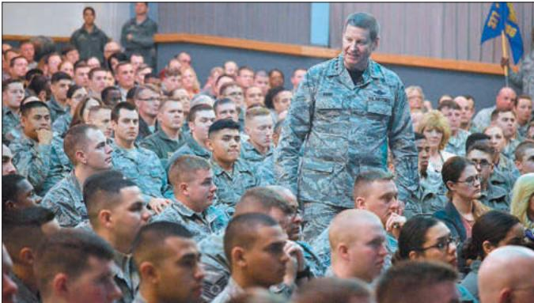  
Gen. Robin Rand, head of Air Force Global Strike Command, hosts a commander’s call at Kirtland AFB, N.M.

# AIR FORCE SPACE COMMAND

<table><tr><td>Gen. James V. Hartinger</td><td>Sept. 1, 1982</td><td>July 30, 1984</td></tr><tr><td>Gen. Robert T. Herres</td><td>July 30, 1984</td><td>Oct. 1, 1986</td></tr><tr><td>Maj. Gen. Maurice C. Padden</td><td>Oct. 1, 1986</td><td>Oct. 29, 1987</td></tr><tr><td>Lt. Gen. Donald J. Kutyna</td><td>Oct. 29, 1987</td><td>March 29, 1990</td></tr><tr><td>Lt. Gen. Thomas S. Moorman Jr.</td><td></td><td>March 29, 1990 March 23, 1992</td></tr><tr><td>Gen. Donald J. Kutyna</td><td></td><td>March 23, 1992 June 30, 1992</td></tr><tr><td>Gen. Charles A. Horner</td><td>June 30, 1992</td><td>Sept. 13, 1994</td></tr><tr><td>Gen. Joseph W. Ashy</td><td></td><td>Sept. 13, 1994 Aug. 26, 1996</td></tr><tr><td>Gen. Howell M. Estes III</td><td>Aug. 26, 1996</td><td>Aug. 14, 1998</td></tr><tr><td>Gen. Richard B. Myers</td><td>Aug. 14, 1998</td><td>Feb.22, 2000</td></tr><tr><td>Gen. Ralph E. Eberhart</td><td>Feb. 22, 2000</td><td>April 19, 2002</td></tr><tr><td>Gen. Lance W. Lord</td><td>April 19, 2002</td><td>April 1, 2006</td></tr><tr><td>Lt. Gen. Frank G. Klotz (acting)</td><td>April 1, 2006</td><td>June 26, 2006</td></tr><tr><td>Gen. Kevin P. Chilton</td><td>June 26, 2006</td><td>Oct. 3, 2007</td></tr><tr><td>Lt. Gen. Michael A. Hamel (acting) Oct. 3, 2007</td><td></td><td>Oct. 12, 2007</td></tr><tr><td>Gen. C. Robert Kehler</td><td>Oct. 12, 2007</td><td>Jan. 5, 2011</td></tr><tr><td>Gen. William L. Shelton</td><td>Jan.5, 2011</td><td>Aug. 15, 2014</td></tr><tr><td>Gen. John E. Hyten</td><td>Aug. 15, 2014</td><td>Oct. 25, 2016</td></tr><tr><td>Gen. John W. Raymond</td><td>Oct. 25, 2016</td><td></td></tr></table>

# AIR FORCE SPECIAL OPERATIONS COMMAND

<table><tr><td>Maj. Gen. Thomas E. Eggers</td><td>May 22, 1990</td><td>June 30, 1991</td></tr><tr><td>Maj. Gen. Bruce L. Fister</td><td>June 30, 1991</td><td>July 22, 1994</td></tr><tr><td>Maj. Gen. James L. Hobson Jr.</td><td>July 22, 1994</td><td>July 9, 1997</td></tr><tr><td>Maj. Gen. Charles R. Holland</td><td>July 9, 1997</td><td>Aug. 5, 1999</td></tr><tr><td>Lt. Gen. Maxwell C. Bailey</td><td>Aug. 5, 1999</td><td>Jan. 16, 2002</td></tr><tr><td>Lt. Gen. Paul V. Hester</td><td>Jan. 16, 2002</td><td>July 1, 2004</td></tr><tr><td>Lt. Gen. Michael W. Wooley</td><td>July 1, 2004</td><td>Nov. 27, 2007</td></tr><tr><td>Lt. Gen. Donald C. Wurster</td><td>Nov. 27, 2007</td><td>June 24, 2011</td></tr><tr><td>Lt. Gen. Eric E. Fiel</td><td>June 24, 2011</td><td>July 3, 2014</td></tr><tr><td>Lt. Gen. Bradley A. Heithold</td><td>July 3, 2014</td><td>July 19, 2016</td></tr><tr><td>Lt. Gen. Marshall B. Webb</td><td>July 19, 2016</td><td></td></tr></table>

# AIR MOBILITY COMMAND

<table><tr><td>Gen. Hansford T. Johnson</td><td>June 1, 1992</td><td>Aug. 25, 1992</td></tr><tr><td>Gen. Ronald R. Fogleman</td><td>Aug. 25, 1992</td><td>Oct. 18, 1994</td></tr><tr><td>Gen. Robert L. Rutherford</td><td>Oct. 18, 1994</td><td>July 15, 1996</td></tr><tr><td>Gen. Walter Kross</td><td>July 15, 1996</td><td>Aug. 3, 1998</td></tr><tr><td>Gen. Charles T. Robertson Jr.</td><td>Aug. 3, 1998</td><td>Nov. 5, 2001</td></tr><tr><td>Gen. John W. Handy</td><td>Nov. 5, 2001</td><td>Sept. 7, 2005</td></tr><tr><td>Lt. Gen. Christopher Kelly (acting) Sept. 7, 2005</td><td></td><td>Oct.14, 2005</td></tr><tr><td>Gen. Duncan J. McNabb</td><td>Oct. 14, 2005</td><td>Sept. 7, 2007</td></tr><tr><td>Gen. Arthur J. Lichte</td><td>Sept. 7, 2007</td><td>Nov. 20, 2009</td></tr><tr><td>Gen. Raymond E. Johns Jr.</td><td>Nov. 20, 2009</td><td>Nov. 30, 2012</td></tr><tr><td>Gen. Paul J. Selva</td><td>Nov. 30, 2012</td><td>May 5, 2014</td></tr><tr><td>Gen. Darren W. McDew</td><td>May 5, 2014</td><td>Aug. 11, 2015</td></tr><tr><td>Gen. Carlton D. Everhart II</td><td>Aug. 11, 2015</td><td></td></tr><tr><td colspan="3">AIR NATIONAL GUARD</td></tr><tr><td>Col. William A. R. Robertson</td><td>Nov. 28, 1945</td><td>October 1948</td></tr><tr><td>Maj. Gen. George G. Finch</td><td>October 1948</td><td>Sept. 25, 1950</td></tr><tr><td>Maj. Gen. EarI T. Ricks</td><td>Oct. 13, 1950</td><td>Jan.4, 1954</td></tr><tr><td>Maj. Gen. Winston P. Wilson</td><td>Jan. 26, 1954</td><td>Aug. 5, 1962</td></tr><tr><td>Maj. Gen. I. G. Brown</td><td>Aug. 6, 1962</td><td>April 19, 1974</td></tr><tr><td>Maj. Gen. John J. Pesch</td><td>April 20, 1974</td><td></td></tr><tr><td>Maj. Gen. John T. Guice</td><td>Feb. 1, 1977</td><td>Jan. 31, 1977</td></tr><tr><td>Maj. Gen. John B. Conaway</td><td>April 1, 1981</td><td>April 1, 1981</td></tr><tr><td>Maj. Gen. Philip G. Killey</td><td>Nov. 1, 1988</td><td>Nov. 1, 1988</td></tr><tr><td>Maj. Gen. Donald W. Shepperd</td><td>Jan. 28, 1994</td><td>Jan. 28, 1994</td></tr><tr><td>Maj. Gen. Paul A. Weaver Jr.</td><td></td><td>Jan. 28, 1998</td></tr><tr><td>Brig. Gen. David Brubaker (acting) Dec. 3, 2001</td><td>Jan. 28, 1998</td><td>Dec.3, 2001</td></tr><tr><td>Lt. Gen. Daniel James III</td><td></td><td>June 3, 2002</td></tr><tr><td></td><td>June 3, 2002</td><td>May 20, 2006</td></tr><tr><td>Lt. Gen. Craig R. McKinley</td><td>May 20, 2006</td><td>Nov. 17, 2008</td></tr><tr><td>Maj. Gen. Emmett Titshaw (acting) Nov. 17, 2008</td><td></td><td>Feb.2, 2009</td></tr><tr><td>Lt. Gen. Harry M. Wyatt III</td><td>Feb.2,2009</td><td>March 22, 2013</td></tr><tr><td>Lt. Gen. Stanley E. Clarke III</td><td></td><td>March 22, 2013 Dec.18, 2015</td></tr><tr><td>Maj. Gen. Brian G. Neal (acting)</td><td>Dec. 18, 2015</td><td>May 10, 2016</td></tr><tr><td>Lt. Gen. L. Scott Rice</td><td>May 10, 2016</td><td></td></tr></table>

# PACIFIC AIR FORCES

<table><tr><td>Gen. Laurence S. Kuter</td><td>July 1, 1957</td><td>Aug. 1, 1959</td></tr><tr><td>Gen. Emmett O&#x27;Donnell Jr.</td><td>Aug. 1, 1959</td><td>Aug. 1, 1963</td></tr><tr><td>Gen. Jacob E. Smart</td><td>Aug. 1, 1963</td><td>Aug. 1, 1964</td></tr><tr><td>Gen. Hunter Harris Jr.</td><td></td><td>Feb. 1, 1967</td></tr><tr><td>Gen. John D. Ryan</td><td>Aug. 1, 1964</td><td>Aug. 1, 1968</td></tr><tr><td>Gen. Joseph J. Nazzaro</td><td>Feb. 1, 1967</td><td>Aug. 1, 1971</td></tr><tr><td>Gen. Lucius D. Clay Jr.</td><td>Aug. 1, 1968</td><td></td></tr><tr><td></td><td>Aug. 1, 1971</td><td>Oct. 1, 1973</td></tr><tr><td>Gen. John W. Vogt Jr.</td><td>Oct.1, 1973</td><td>July 1, 1974</td></tr><tr><td>Gen. Louis L. Wilson Jr.</td><td>July 1, 1974</td><td>June 3, 1977</td></tr><tr><td>Lt. Gen. James A. Hill</td><td>June 3, 1977</td><td>June 15, 1978</td></tr><tr><td>Lt. Gen. James D. Hughes</td><td>June 15, 1978</td><td>June 8, 1981</td></tr><tr><td>Lt. Gen. Arnold W. Braswell</td><td>June 8, 1981</td><td>Oct.8, 1983</td></tr><tr><td>Gen. Jerome F. O&#x27;Malley</td><td>Oct.8, 1983</td><td>Sept. 25, 1984</td></tr><tr><td>Gen. Robert W. Bazley</td><td>Sept. 25, 1984</td><td>Dec.16, 1986</td></tr><tr><td>Gen. Jack I. Gregory</td><td>Dec. 16, 1986</td><td>July 22, 1988</td></tr><tr><td>Gen. MerrilI A. McPeak</td><td>July 22, 1988</td><td>Nov. 5, 1990</td></tr><tr><td>Lt. Gen. James B. Davis</td><td>Nov.5, 1990</td><td>Feb. 19, 1991</td></tr><tr><td>Gen. Jimmie V. Adams</td><td>Feb. 19, 1991</td><td>Jan. 22, 1993</td></tr><tr><td>Gen. Robert L. Rutherford</td><td>Jan. 22, 1993</td><td>Oct. 12, 1994</td></tr><tr><td>Gen. John G. Lorber</td><td>Oct. 12, 1994</td><td>July 7, 1997</td></tr><tr><td>Gen. Richard B. Myers</td><td>July 7, 1997</td><td>July 23, 1998</td></tr><tr><td>Gen. Patrick K. Gamble</td><td>July 23, 1998</td><td>April 9, 2001</td></tr><tr><td>Lt. Gen. Lansford E. Trapp (acting) April 9, 2001</td><td></td><td>May 4, 2001</td></tr><tr><td>Gen. Wiliam J. Begert</td><td>May 4, 2001</td><td>July 2, 2004</td></tr><tr><td>Gen. Paul V. Hester</td><td>July 2, 2004</td><td>Nov. 30, 2007</td></tr><tr><td>Gen. Carrol H. Chandler</td><td>Nov. 30, 2007</td><td>Aug. 19, 2009</td></tr><tr><td>Gen. Gary L. North</td><td>Aug. 19, 2009</td><td>Aug. 3, 2012</td></tr><tr><td>Gen. Herbert J. Carlisle</td><td>Aug. 3, 2012</td><td>Oct. 16, 2014</td></tr><tr><td>Gen. Lori J. Robinson</td><td>Oct. 16, 2014</td><td>May 11, 2016</td></tr><tr><td>Lt. Gen. Russell J. Handy (acting) May 11, 2016</td><td></td><td>July 12, 2016</td></tr><tr><td>Gen. Terrence J. O&#x27;Shaughnessy</td><td>July 12, 2016</td><td></td></tr></table>

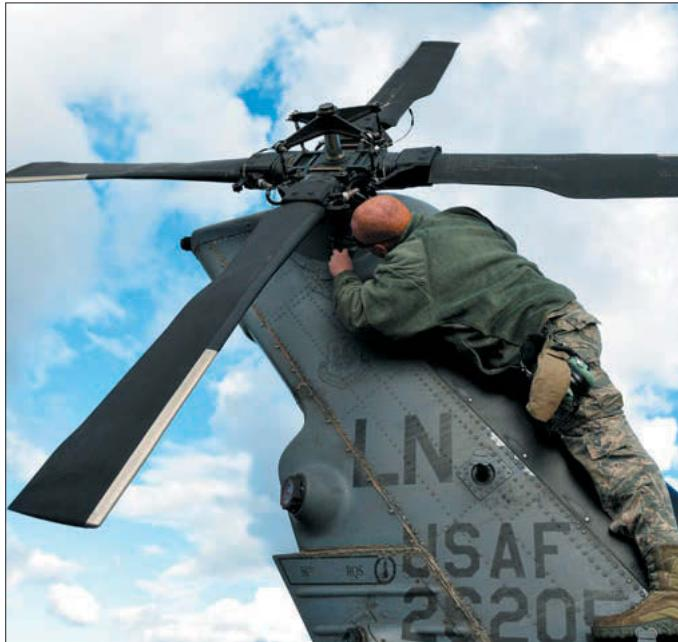

A maintenance crew chief with the 56th Rescue Squadron, US Air Forces in Europe, works on an HH-60G Pave Hawk anti-icing component.

# US AIR FORCES IN EUROPE

<table><tr><td>Lt. Gen. John K. Cannon</td><td>Aug. 7, 1945</td><td>Aug. 14, 1947</td></tr><tr><td>Brig. Gen. John F. McBlain (acting) Aug. 14, 1947</td><td></td><td>Oct. 20, 1947</td></tr><tr><td>Lt. Gen. Curtis E. LeMay</td><td>Oct. 20, 1947</td><td>Oct. 16, 1948</td></tr><tr><td>Lt. Gen. John K. Cannon</td><td>Oct. 16, 1948</td><td>Jan. 21, 1951</td></tr><tr><td>Gen. Lauris Norstad</td><td>Jan. 21, 1951</td><td>July 27, 1953</td></tr><tr><td>Lt. Gen. William H. Tunner</td><td>July 27, 1953</td><td>July 1, 1957</td></tr><tr><td>Gen. Frank F. Everest</td><td>July 1, 1957</td><td>Aug. 1, 1959</td></tr><tr><td>Gen. Frederic H. Smith Jr.</td><td>Aug. 1, 1959</td><td>July 1, 1961</td></tr><tr><td>Gen. Truman H. Landon</td><td>July 1, 1961</td><td>Aug. 1, 1963</td></tr><tr><td>Gen. Gabriel P. Disosway</td><td>Aug. 1, 1963</td><td>Aug. 1, 1965</td></tr><tr><td>Gen. Bruce K. Holloway</td><td>Aug. 1, 1965</td><td>Aug. 1, 1966</td></tr><tr><td>Gen. Maurice A. Preston</td><td>Aug. 1, 1966</td><td>Aug. 1, 1968</td></tr><tr><td>Gen. Horace M. Wade</td><td>Aug. 1, 1968</td><td>Aug. 1, 1969</td></tr><tr><td>Gen. Joseph R. Holzapple</td><td>Feb. 1, 1969</td><td>Sept. 1, 1971</td></tr><tr><td>Gen. David C. Jones</td><td>Sept. 1, 1971</td><td>July 1, 1974</td></tr><tr><td>Gen. John W. Vogt</td><td>July 1, 1974</td><td>Sept. 1, 1975</td></tr><tr><td>Gen. Richard H. Ellis</td><td>Sept. 1, 1975</td><td>Aug. 1, 1977</td></tr><tr><td>Gen. William J. Evans</td><td>Aug. 1, 1977</td><td>Aug. 1, 1978</td></tr><tr><td>Gen. John W. Pauly</td><td>Aug. 1, 1978</td><td>Aug. 1, 1980</td></tr><tr><td>Gen. Charles A. Gabriel</td><td>Aug. 1, 1980</td><td>June 30, 1982</td></tr><tr><td>Gen. Billy M. Minter</td><td>July 1, 1982</td><td>Nov. 1, 1984</td></tr><tr><td>Gen. Charles L. Donnelly Jr.</td><td>Nov. 1, 1984</td><td>May 1, 1987</td></tr><tr><td>Gen. William L. Kirk</td><td>May 1, 1987</td><td>April 12, 1989</td></tr><tr><td>Gen. Michael J. Dugan</td><td>April 12, 1989</td><td>June 26, 1990</td></tr><tr><td>Gen. Robert C. Oaks</td><td>June 26, 1990</td><td>July 29, 1994</td></tr><tr><td>Gen. James L. Jamerson</td><td></td><td>July 17, 1995</td></tr><tr><td>Gen. Richard E. Hawley</td><td>July 29, 1994</td><td>April 4, 1996</td></tr><tr><td>Gen. Michael E. Ryan</td><td>July 17, 1995 April 4, 1996</td><td>Oct.6, 1997</td></tr><tr><td>Lt. Gen. William J. Begert (acting)</td><td>Oct. 6, 1997</td><td>Dec.5, 1997</td></tr><tr><td>Gen. John P. Jumper</td><td>Dec. 5, 1997</td><td>Jan.13,2000</td></tr><tr><td>Gen. Gregory S. Martin</td><td>Jan. 13, 2000</td><td>Aug. 12, 2003</td></tr><tr><td>Gen. Robert H. Foglesong</td><td>Aug. 12, 2003</td><td>Dec.6, 2005</td></tr><tr><td>Gen. William T. Hobbins</td><td>Dec. 6, 2005</td><td>Dec. 10, 2007</td></tr><tr><td>Lt. Gen. Robert D. Bishop Jr.</td><td>Dec. 10, 2007</td><td>Jan. 9, 2008</td></tr><tr><td>Gen. Roger A. Brady</td><td>Jan.9, 2008</td><td>Dec. 13, 2010</td></tr><tr><td>Gen. Mark A. Welsh I"I</td><td>Dec. 13, 2010</td><td>July 31, 2012</td></tr><tr><td>Gen. Philip M. Breedlove</td><td>July 31, 2012</td><td>May 10, 2013</td></tr><tr><td>Lt. Gen. Noel T. Jones (acting)</td><td>May 10, 2013</td><td>Aug. 2, 2013</td></tr><tr><td>Gen. Frank Gorenc</td><td>Aug. 2, 2013</td><td>Aug. 11, 2016</td></tr><tr><td>Gen. Tod D. Wolters</td><td>Aug. 11, 2016</td><td></td></tr><tr><td colspan="3">AIR (AEROSPACE) DEFENSE COMMAND</td></tr><tr><td>Lt. Gen. George E. Stratemeyer</td><td>March 27, 1946 Nov.30, 1948</td><td></td></tr><tr><td>Maj. Gen. Gordon P. Saville</td><td>Dec. 1, 1948</td><td>Sept. 1, 1949</td></tr><tr><td>Lt. Gen. Ennis C. Whitehead</td><td>Jan. 1, 1951</td><td>Aug. 24, 1951</td></tr><tr><td>Gen. Benjamin W. Chidlaw</td><td>Aug. 25, 1951</td><td>May 31, 1955</td></tr><tr><td>Maj. Gen. Frederic Smith (acting) June 1, 1955</td><td></td><td>July 19, 1955</td></tr><tr><td>Gen. Earle E. Partridge</td><td>July 20, 1955</td><td>Sept. 16, 1956</td></tr><tr><td>Lt. Gen. Joseph H. Atkinson</td><td>Sept. 17, 1956</td><td>Feb. 28, 1961</td></tr><tr><td>Lt. Gen. Robert M. Lee</td><td>March 1, 1961</td><td>July 5, 1963</td></tr><tr><td>Maj. Gen. Robert H. Terrill (acting) July 6, 1963</td><td></td><td>July 31, 1963</td></tr><tr><td>Lt. Gen. Herbert B. Thatcher</td><td>Aug. 1, 1963</td><td>July 31, 1967</td></tr><tr><td>Lt. Gen. Arthur C. Agan Jr.</td><td>Aug. 1, 1967</td><td>Feb. 28, 1970</td></tr><tr><td>Lt. Gen. Thomas K. McGehee</td><td>March 1, 1970</td><td>June 30, 1973</td></tr><tr><td>Gen. Seth J. McKee</td><td>July 1, 1973</td><td>Sept. 30, 1973</td></tr><tr><td>Gen. Lucius D. Clay Jr.</td><td>Oct. 1, 1973</td><td>Aug. 31, 1975</td></tr><tr><td>Gen. Daniel James Jr.</td><td>Sept. 1, 1975</td><td>Dec. 6, 1977</td></tr><tr><td>Gen. James E. Hill</td><td>Dec. 6, 1977</td><td>Dec. 31, 1979</td></tr><tr><td>Gen. James V. Hartinger</td><td>Jan.1, 1980</td><td>March 31, 1980</td></tr></table>

Established March 21, 1946. Assigned to Continental Air Command 1948. Discontinued 1950. Regained majcom status 1951. Redesignated Aerospace Defense Command Jan. 15, 1968. Inactivated March 31, 1980.

# AIR FORCE COMMUNICATIONS COMMAND

<table><tr><td>Maj. Gen. Harold W. Grant</td><td>July 1, 1961</td><td>Feb.15, 1962</td></tr><tr><td>Maj. Gen. Kenneth P. Bergquist</td><td>Feb. 16, 1962</td><td>June 30, 1965</td></tr><tr><td>Maj. Gen. J. Francis Taylor (acting) July 1, 1965</td><td></td><td>Oct. 18, 1965</td></tr><tr><td>Maj. Gen. Richard P. Klocko</td><td>Oct.19, 1965</td><td>July 2, 1967</td></tr><tr><td>Maj. Gen. Robert W. Paulson</td><td>July 15, 1967</td><td>Aug. 1, 1969</td></tr><tr><td>Maj. Gen. Paul R. Stoney</td><td>Aug. 1, 1969</td><td>Oct. 31, 1973</td></tr><tr><td>Maj. Gen. Donald L. Werbeck</td><td>Nov. 1, 1973</td><td>Aug. 24, 1975</td></tr><tr><td>Maj. Gen. Rupert H. Burris</td><td>Aug. 25, 1975</td><td>Oct.31, 1977</td></tr><tr><td>Maj. Gen. Robert E. Sadler</td><td>Nov. 1, 1977</td><td>June 21, 1979</td></tr><tr><td>Maj. Gen. Robert T. Herres</td><td>June 22, 1979</td><td>July 27, 1981</td></tr><tr><td>Maj. Gen. Robert F. McCarthy</td><td>July 27, 1981</td><td>June 1, 1984</td></tr><tr><td>Maj. Gen. Gerald L. Prather</td><td>June 1, 1984</td><td>Aug. 28, 1986</td></tr><tr><td>Maj. Gen. John T. StihI</td><td>Aug. 28, 1986</td><td>March 29, 1988</td></tr><tr><td>Maj Gen. James S. Cassity Jr.</td><td>March 29, 1988 May 16, 1989</td><td></td></tr><tr><td>Maj. Gen. Robert H. Ludwig</td><td>May 16, 1989</td><td></td></tr><tr><td>Maj. Gen. John S. Fairfield</td><td>Nov. 9, 1990</td><td>Nov. 9, 1990 July 1, 1991</td></tr></table>

Formerly Air Force Communications Service. Redesignated Air Force Communications Command 1979. Changed to field operating agency July 1, 1991.

# AIR FORCE LOGISTICS COMMAND

<table><tr><td>Lt. Gen. Nathan F. Twining</td><td>March 9, 1946</td><td>Oct. 13, 1947</td></tr><tr><td>Gen. Joseph T. McNarney</td><td>Oct. 14, 1947</td><td>Aug. 31, 1949</td></tr><tr><td>Lt. Gen. Benjamin W. Chidlaw</td><td>Sept. 1, 1949</td><td>Aug. 20, 1951</td></tr><tr><td>Gen. Edwin W. Rawlings</td><td>Aug. 21, 1951</td><td>Feb.28,1959</td></tr><tr><td>Lt. Gen. William F. McKee (acting) March 1, 1959</td><td></td><td>March 14, 1959</td></tr><tr><td>Gen. Samuel E. Anderson</td><td>March 15, 1959 July 31, 1961</td><td></td></tr><tr><td>Gen. William F. McKee</td><td>Aug. 1, 1961</td><td>June 30, 1962</td></tr><tr><td>Gen. Mark E. Bradley Jr.</td><td>July 1, 1962</td><td>July 31, 1965</td></tr><tr><td>Gen. Kenneth B. Hobson</td><td>Aug. 1, 1965</td><td>July 31, 1967</td></tr><tr><td>Gen. Thomas P. Gerrity</td><td>Aug. 1, 1967</td><td>Feb.24, 1968</td></tr><tr><td>Lt. Gen. Lewis L. Mundell (acting) Feb. 24, 1968</td><td></td><td>March 28, 1968</td></tr><tr><td>Gen. Jack G. Merrell</td><td>March 29, 1968 Sept. 11, 1972</td><td></td></tr><tr><td>Gen. Jack J. Catton</td><td>Sept. 12, 1972</td><td>Aug. 31, 1974</td></tr><tr><td>Gen. William V. McBride</td><td>Sept. 1, 1974</td><td>Aug. 31, 1975</td></tr><tr><td>Gen. F. Michael Rogers</td><td>Sept. 1, 1975</td><td>Jan. 31, 1978</td></tr><tr><td>Gen. Bryce Poe II</td><td>Feb. 1, 1978</td><td>July 31, 1981</td></tr><tr><td>Gen. James P. Mullins</td><td>Aug. 1, 1981</td><td>Nov. 1, 1984</td></tr><tr><td>Gen. Earl T. O&#x27;Loughlin</td><td>Nov. 1, 1984</td><td>July 31, 1987</td></tr><tr><td>Gen. Alfred G. Hansen</td><td>July 31, 1987</td><td>Oct. 31, 1989</td></tr><tr><td>Gen. Charles C. McDonald</td><td>Oct. 31, 1989</td><td>July 1, 1992</td></tr></table>

Antecedents: AAF Materiel and Services 1944; AAF Technical Service Command 1944; Air Technical Service Command 1945; Air Materiel Command 1946; Air Force Logistics Command 1961. Inactivated July 1, 1992.

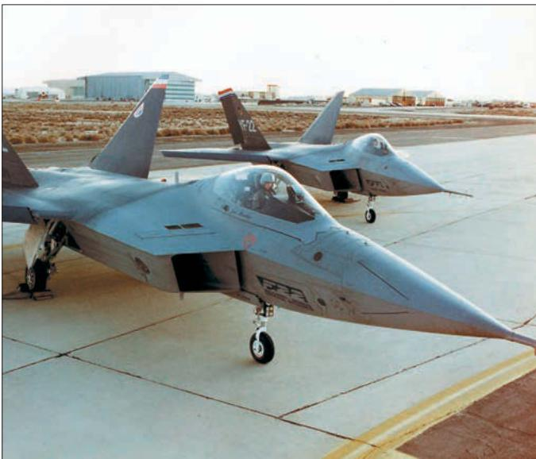  
YF-22 Advanced Tactical Fighters were delivered to Air Force Systems Command before its inactivation.

# AIR FORCE RESERVE

<table><tr><td>Maj. Gen. Rollin B. Moore Jr.</td><td>Aug. 1, 1968</td><td>Jan. 27, 1972</td></tr><tr><td>Brig. Gen. Alfred Verhulst (acting)</td><td>)Jan.27, 1972</td><td>March 16, 1972</td></tr><tr><td>Maj. Gen. Homer I. Lewis</td><td>March 16, 1972 April 16, 1975</td><td></td></tr><tr><td>Maj. Gen. William Lyon</td><td>April 16, 1975</td><td>April 17, 1979</td></tr><tr><td>Maj. Gen. Richard Bodycombe</td><td>April 17, 1979</td><td>Nov. 1, 1982</td></tr><tr><td>Maj. Gen. Sloan R. Gill</td><td>Nov. 1, 1982</td><td>Nov. 1, 1986</td></tr><tr><td>Maj. Gen. Roger P. Scheer</td><td>Nov. 1, 1986</td><td>Nov. 1, 1990</td></tr><tr><td>Maj. Gen. John J. Closner II</td><td>Nov. 1, 1990</td><td>Nov. 1, 1994</td></tr><tr><td>Maj. Gen. Robert A McIntosh</td><td>Nov. 1, 1994</td><td>Feb. 17, 1997</td></tr></table>

Established as Air Force Reserve, an operating agency, June 21, 1968. Became a direct reporting unit July 1, 1978. Returned to agency status May 1, 1983. Became a field operating agency Feb. 5, 1991. Redesignated Air Force Reserve Command Feb. 17, 1997. For current leaders, see Air Force Reserve Command in Major Command and ANG Leaders.

# AIR FORCE SYSTEMS COMMAND

<table><tr><td>Maj. Gen. David M. Schlatter</td><td>Feb. 1, 1950</td><td>June 24, 1951</td></tr><tr><td>Lt. Gen. Earle E. Partridge</td><td>June 24, 1951</td><td>June 20, 1953</td></tr><tr><td>Lt. Gen. Donald L. Putt</td><td>June 30, 1953</td><td>April 14, 1954</td></tr><tr><td>Lt. Gen. Thomas S. Power</td><td>April 15, 1954</td><td>June 30, 1957</td></tr><tr><td>Maj. Gen. John Sessums (acting) July 1, 1957</td><td></td><td>July 31, 195</td></tr><tr><td>Lt. Gen. Samuel E. Anderson</td><td>Aug. 1, 1957</td><td>March 9, 1959</td></tr><tr><td>Maj. Gen. John Sessums (acting)</td><td>)March 10, 1959 April 24, 1959</td><td></td></tr><tr><td>Gen. Bernard A. Schriever</td><td>April 25, 1959</td><td>Aug. 31, 1966</td></tr><tr><td>Gen. James Ferguson</td><td>Sept. 1, 1966</td><td>Aug. 30, 1970</td></tr><tr><td>Gen. George S. Brown</td><td>Sept. 1, 1970</td><td>July 31, 1973</td></tr><tr><td>Gen. Samuel C. Phillips</td><td>Aug. 1, 1973</td><td>Aug. 31, 1975</td></tr><tr><td>Gen. William J. Evans</td><td>Sept. 1, 1975</td><td>July 31, 1977</td></tr><tr><td>Gen. Lew Allen Jr.</td><td>Aug. 1, 1977</td><td>March 13, 1978</td></tr><tr><td>Gen. Alton D. Slay</td><td>March 14, 1978 Feb. 1, 1981</td><td></td></tr><tr><td>Gen. Robert T. Marsh</td><td>Feb. 1, 1981</td><td>Aug. 1, 1984</td></tr><tr><td>Gen. Lawrence A. Skantze</td><td>Aug. 1, 1984</td><td>July 17, 1987</td></tr><tr><td>Gen. Bernard P. Randolph</td><td>July 17, 1987</td><td>April 1, 1990</td></tr><tr><td>Gen. Ronald W. Yates</td><td>April 1, 1990</td><td>July 1, 1992</td></tr></table>

Formerly Air Research and Development Command. Redesignated Air Force Systems Command April 1, 1961. Inactivated July 1, 1992.

# AIR PROVING GROUND COMMAND

<table><tr><td>Maj. Gen. Carl A. Brandt</td><td>October 1946</td><td>August 1948</td></tr><tr><td>Maj. Gen. William E. Kepner</td><td>August 1948</td><td>June 1950</td></tr><tr><td>Maj. Gen. Bryant L. Boatner</td><td>July 1950</td><td>July 1952</td></tr><tr><td>Maj. Gen. Patrick W. Timberlake</td><td>July 1952</td><td>April 1955</td></tr><tr><td>Maj. Gen. Robert W. Burns</td><td>August 1955</td><td>July 1957</td></tr></table>

<table><tr><td colspan="6">AIR TRAINING COMMAND</td></tr><tr><td>Lt. Gen. Barton K. Yount</td><td>Jan. 28 1942</td><td>Sept. 27, 1945</td><td>Lt. Gen. George B. Simler</td><td>Sept. 1, 1970</td><td>Sept. 9, 1972</td></tr><tr><td>Maj. Gen. James P. Hodges</td><td>Sept. 27, 1945</td><td>April 13, 1946</td><td>Lt. Gen. William V. McBride</td><td>Sept. 9, 1972</td><td>Aug. 31, 1974</td></tr><tr><td>Lt. Gen. John K. Cannon</td><td>April 13, 1946</td><td>Oct. 13, 1948</td><td>Lt. Gen. George H. McKee</td><td>Sept. 1, 1974</td><td>Aug. 28, 1975</td></tr><tr><td>Lt. Gen. Robert W. Harper</td><td>Oct. 14, 1948</td><td>June 30, 1954</td><td>Gen. John W. Roberts</td><td>Aug. 29, 1975</td><td>April 1, 1979</td></tr><tr><td>Maj. Gen. Glenn 0. Barcus (acting) July 1, 1954</td><td></td><td>July 25, 1954</td><td>Gen. BennieL. Davis</td><td>April 1, 1979</td><td>July 28, 1981</td></tr><tr><td>Lt. Gen. Charles T. Myers</td><td>July 26, 1954</td><td>July 31, 1958</td><td>Gen. Thomas M. Ryan Jr.</td><td>July 29, 1981</td><td>June 22, 1983</td></tr><tr><td>Lt. Gen. Frederic H. Smith Jr.</td><td>Aug. 1, 1958</td><td>July 31, 1959</td><td>Gen. Andrew P. Iosue</td><td>June 23, 1983</td><td>Aug. 27, 1986</td></tr><tr><td>Lt. Gen. James E. Briggs</td><td>Aug. 1, 1959</td><td>July 31, 1963</td><td>Lt. Gen. John A. Shaud</td><td>Aug. 28, 1986</td><td>June 5, 1988</td></tr><tr><td>Lt. Gen. Robert W. Burns</td><td>Aug. 1, 1963</td><td>Aug. 10, 1964</td><td>Lt. Gen. Robert C. Oaks</td><td>June 6, 1988</td><td>June 24, 1990</td></tr><tr><td>Lt. Gen. William W. Momyer</td><td>Aug. 11, 1964</td><td>June 30, 1966</td><td>Lt. Gen. Joseph W. Ashy</td><td>June 25, 1990</td><td>Dec. 9, 1992</td></tr><tr><td>Lt. Gen. Sam Maddux Jr.</td><td>July 1, 1966</td><td>Aug. 30, 1970</td><td>Gen. Henry Viccellio Jr.</td><td>Dec. 11, 1992</td><td>June 30, 1993</td></tr></table>

Established as Air Corps Flying Training Command Jan. 23, 1942. Redesignated as AAF Flying Training Command March 15, 1942; AAF Training Command July 31, 1943; Air Training Command July 1, 1946; Air Education and Training Command July 1, 1993. For current leaders, see Air Education and Training Command in Major Command and ANG Leaders.

<table><tr><td rowspan=1 colspan=1>Maj. Gen. Muir S. Fairchild       March 15, 1946 May 17, 1948</td></tr><tr><td rowspan=1 colspan=1>Maj. Gen. Robert W. Harper      May 17, 1948  Oct. 15, 1948</td></tr><tr><td rowspan=1 colspan=1>Gen. George C. Kenney          Oct. 16, 1948   July 27, 1951</td></tr><tr><td rowspan=1 colspan=1>Lt. Gen. ldwal H. Edwards        July 28, 1951   Feb.28, 1953</td></tr><tr><td rowspan=1 colspan=1>Maj. Gen. John DeF. Barker (acting) March 1, 1953  April 14, 1953</td></tr><tr><td rowspan=1 colspan=1>Lt. Gen. Laurence S. Kuter       April 15, 1953  May 31, 1955</td></tr><tr><td rowspan=1 colspan=1>Lt. Gen. Dean C. Strother         June 1, 1955    June 30, 1958</td></tr><tr><td rowspan=1 colspan=1>Lt. Gen. Walter E. Todd           July 15, 1958   July 31, 1961</td></tr><tr><td rowspan=1 colspan=1>Lt. Gen. Troup Miller Jr.           Aug. 1, 1961    Dec. 31, 1963</td></tr><tr><td rowspan=1 colspan=1>Lt. Gen. Ralph P. Swofford Jr.    Jan. 1, 1964    July 31, 1965</td></tr><tr><td rowspan=1 colspan=1>Lt. Gen. John W. Carpenter II     Aug. 1, 1965    July 31, 1968</td></tr><tr><td rowspan=1 colspan=1>Lt. Gen. Albert P. Clark           Aug. 1, 1968    July 31, 1970</td></tr></table>

With lineage dating to the Air Service School, Feb. 25, 1920. Designated Air University, a major command, March 12, 1946. Lost majcom status July 1, 1978; regained July 1, 1983; lost again July 1, 1993.

# ALASKAN AIR COMMAND

<table><tr><td>Lt. Gen. Alvan C. Gillem II</td><td>Aug. 1, 1970</td><td>Oct. 31, 1973</td></tr><tr><td>Lt. Gen. F. Michael Rogers</td><td>Nov. 1, 1973</td><td>Aug. 31, 1975</td></tr><tr><td>Lt. Gen. Raymond B. Furlong</td><td>Sept. 1, 1975</td><td>July 1, 1979</td></tr><tr><td>Lt. Gen. Stanley M. Umstead</td><td>July 1, 1979</td><td>July 24, 1981</td></tr><tr><td>Lt. Gen. Charles G. Cleveland</td><td>July 24, 1981</td><td>Aug. 1, 1984</td></tr><tr><td>Lt. Gen. Thomas C. Richards</td><td>Aug. 1, 1984</td><td>Nov.6, 1986</td></tr><tr><td>Lt. Gen. Truman Spangrud</td><td>Nov.6, 1986</td><td>July 12, 1988</td></tr><tr><td>Lt. Gen. Ralph E. Havens</td><td>July 12, 1988</td><td>Oct. 6, 1989</td></tr><tr><td>Maj. Gen. David C. Reed</td><td>Oct. 6, 1989</td><td>Jan.4, 1990</td></tr><tr><td>Lt. Gen. Charles G. Boyd</td><td>Jan. 4, 1990</td><td>Oct. 26, 1992</td></tr><tr><td>Lt. Gen. Jay W. Kelley</td><td>Oct. 27, 1992</td><td>June 30, 1993</td></tr></table>

<table><tr><td>Brig. Gen. Joseph H. Atkinson</td><td>Oct. 1, 1946</td><td>Feb. 25, 1949</td></tr><tr><td>Brig. Gen. Frank A. Armstrong Jr.</td><td>Feb. 26, 1949</td><td>Dec. 27, 1950</td></tr><tr><td>Maj. Gen. William D. OId</td><td>Dec. 27, 1950</td><td>Oct. 14, 1952</td></tr><tr><td>Brig. Gen. W. R. Agee</td><td>Oct. 27, 1952</td><td>Feb. 26, 1953</td></tr><tr><td>Maj. Gen. George R. Acheson</td><td>Feb. 26, 1953</td><td>Feb.1, 1956</td></tr><tr><td>Brig. Gen. T. Alan Bennett (acting) Feb. 1, 1956</td><td></td><td>Feb. 24, 1956</td></tr><tr><td>Lt. Gen. Joseph H. Atkinson</td><td>Feb. 24, 1956</td><td>July 16, 1956</td></tr><tr><td>Maj. Gen. Frank A. Armstrong Jr. July 17, 1956</td><td></td><td>Oct. 23, 1956</td></tr><tr><td>Maj. Gen. James H. Davies</td><td>Oct.24, 1956</td><td>June 27, 1957</td></tr><tr><td>Lt. Gen. Frank A. Armstrong Jr.</td><td>June 28, 1957</td><td>Aug. 18, 1957</td></tr><tr><td>Brig. Gen. Kenneth H. Gibson</td><td>Aug. 19, 1957</td><td>Aug. 13, 1958</td></tr><tr><td>Maj. Gen. C. F. Necrason</td><td>Aug. 14, 1958</td><td>July 19, 1961</td></tr><tr><td>Brig. Gen. Jack A. Gibbs (acting) July 20, 1961</td><td></td><td>July 25, 1961</td></tr><tr><td>Maj. Gen. Wendell W. Bowman</td><td>July 26, 1961</td><td>Aug. 8, 1963</td></tr><tr><td>Col. Alfred Walton (acting)</td><td>Aug. 9, 1963</td><td>Aug. 14, 1963</td></tr></table>

Activated as Alaskan Air Force 1942. Redesignated: Eleventh Air Force 1942; Alaskan Air Command 1945; 11th Air Force Aug. 9, 1990, under Pacific Air Forces.

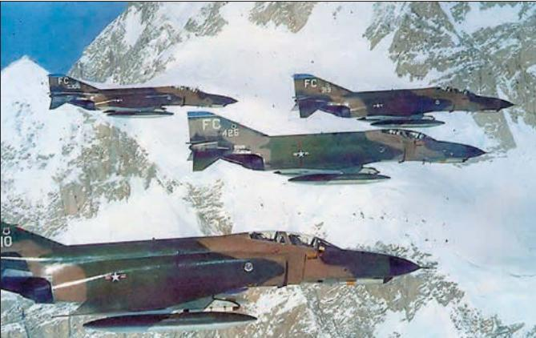  
In 1980, F-4E Phantoms from the 21st Tactical Fighter Wing, Elmendorf AFB, Alaska, fly past Mount McKinley. They were assigned to Alaskan Air Command.

<table><tr><td>Aug. 15, 1963 Nov. 14, 1966</td></tr><tr><td>Maj. Gen. James C. Jensen Maj. Gen. Thomas E. Moore</td></tr><tr><td>Nov. 15, 1966 July 24, 1969</td></tr><tr><td>Maj. Gen. Joseph A. Cunningham July 25, 1969 July 31, 1972</td></tr><tr><td>Maj. Gen. Donavon F. Smith Aug. 1, 1972 June 5, 1973</td></tr><tr><td>Maj. Gen. Charles W. Carson Jr. June 18, 1973 March 2, 1974</td></tr><tr><td>Col. David T. Stockman (acting) March 3, 1974 March 18, 1974</td></tr><tr><td>Maj. Gen. Jack K. Gamble March 19, 1974 June 30, 1975</td></tr><tr><td>Lt. Gen. James E. Hill July 1, 1975 Oct. 14, 1976</td></tr><tr><td>Lt. Gen. M. L. Boswell Oct. 15, 1976 June 30, 1978</td></tr><tr><td>Lt. Gen. Winfield W. Scott Jr. July 1, 1978 April 1, 1981</td></tr><tr><td>Lt. Gen. Lynwood E. Clark April 1, 1981 Aug. 31, 1983</td></tr><tr><td>Lt. Gen. Bruce K. Brown Sept. 1, 1983 Sept. 26, 1985</td></tr><tr><td>Lt. Gen. David L. Nichols Sept. 27, 1985 May 22, 1988</td></tr><tr><td>Lt. Gen. Thomas G. Mclnerney May 22, 1988 Aug.9, 1990</td></tr></table>

# CONTINENTAL AIR COMMAND

<table><tr><td>Lt. Gen. George E. Stratemeyer</td><td>Dec. 1, 1948</td><td>April 15, 1949</td></tr><tr><td>Lt. Gen. Ennis C. Whitehead</td><td>April 15, 1949</td><td>Dec. 14, 1950</td></tr><tr><td>Maj. Gen. Willis H. Hale</td><td>Dec. 14, 1950</td><td>Feb.18, 1952</td></tr><tr><td>Lt. Gen. Leon W. Johnson</td><td>Feb.18,1952</td><td>Dec. 14, 1955</td></tr><tr><td>Lt. Gen. Charles B. Stone III</td><td>Dec. 15, 1955</td><td>June 30, 1957</td></tr><tr><td>Lt. Gen. William E. Hall</td><td>July 1, 1957</td><td>Sept. 30, 1961</td></tr><tr><td>Lt. Gen. Gordon A. Blake</td><td>Sept. 30, 1961</td><td>June 30, 1962</td></tr><tr><td>Lt. Gen. Edward J. Timberlake</td><td>July 1, 1962</td><td>June 19, 1965</td></tr><tr><td>Maj. Gen. Albert Wilson (acting)</td><td>June 19, 1965</td><td>Aug. 18, 1965</td></tr><tr><td>Lt. Gen. Cecil H. Childre</td><td>Aug. 18, 1965</td><td>May 1966</td></tr><tr><td>Maj. Gen. Stanley Holtoner (acting) May 1966</td><td></td><td>July 30, 1966</td></tr><tr><td>Lt. Gen. Henry Viccellio Sr. Established Dec. 1, 1948. Inactivated Aug. 1, 1968.</td><td>Aug. 1, 1966</td><td>Aug. 1, 1968</td></tr></table>

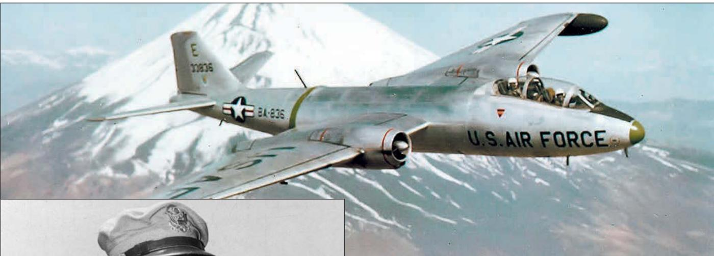

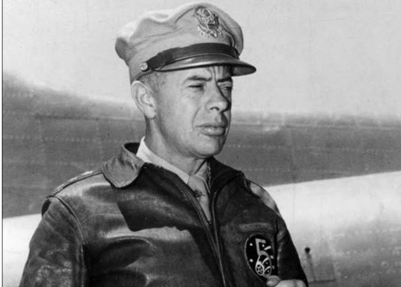  
Then-Lt. Gen. George Kenney in Australia.

# ELECTRONIC SECURITY COMMAND/AIR FORCE INTELLIGENCE COMMAND

<table><tr><td>Col. Roy H. Lynn</td><td>Oct. 26, 1948</td><td>July 5, 1949</td></tr><tr><td>Col. Travis M. Hetherington</td><td>July 6, 1949</td><td>Feb. 21, 1951</td></tr><tr><td>Maj. Gen. Roy H. Lynn</td><td>Feb. 22, 1951</td><td>Feb. 13, 1953</td></tr><tr><td>Maj. Gen. Harold H. Bassett</td><td>Feb. 14, 1953</td><td>Jan. 3, 1957</td></tr><tr><td>Maj. Gen. Gordon L. Blake</td><td>Jan. 4, 1957</td><td>Aug.5, 1959</td></tr><tr><td>Maj. Gen. John B. Ackerman</td><td>Aug. 6, 1959</td><td>Sept. 20, 1959</td></tr><tr><td>Maj. Gen. Millard Lewis</td><td>Sept. 21, 1959</td><td>Aug.31, 1962</td></tr><tr><td>Maj. Gen. Richard P. Klocko</td><td>Sept. 1, 1962</td><td>Oct.15, 1965</td></tr><tr><td>Maj. Gen. Louis E. Coira</td><td>Oct.16, 1965</td><td>July 18, 1969</td></tr><tr><td>Maj. Gen. Carl W. Stapleton</td><td>July 19, 1969</td><td>Feb. 23, 1973</td></tr><tr><td>Maj. Gen. Walter T. Galligan</td><td>Feb. 24, 1973</td><td>May 16, 1974</td></tr><tr><td>Maj. Gen. Howard P. Smith</td><td>May 17, 1974</td><td>July 31, 1975</td></tr><tr><td>Maj. Gen. Kenneth D. Burns</td><td>Aug. 1, 1975</td><td>Jan.18, 1979</td></tr><tr><td>Maj. Gen. Doyle E. Larson</td><td>Jan. 19, 1979</td><td>July 31, 1983</td></tr><tr><td>Maj. Gen. John B. Marks</td><td></td><td></td></tr><tr><td>Maj. Gen. Paul H. Martin</td><td>Aug. 1, 1983 April 17, 1985</td><td>April 16, 1985</td></tr><tr><td>Maj. Gen. Gary W. O&#x27;Shaughnessy Aug. 15, 1989</td><td></td><td>Aug. 14, 1989 June 1, 1993</td></tr><tr><td>Maj. Gen. Kenneth A. Minihan</td><td>June 2, 1993</td><td>Oct. 1, 1993</td></tr></table>

Formerly USAF Security Service. Redesignated Electronic Security Command Aug. 1, 1979; Air Force Intelligence Command Oct. 1, 1991. Changed to field operating agency, Air Intelligence Agency, Oct. 1, 1993.

# FAR EAST AIR FORCES

<table><tr><td>Gen. George C. Kenney</td><td>Aug. 3, 1944</td><td>Dec. 30, 1945</td></tr><tr><td>Lt. Gen. Ennis C. Whitehead</td><td>Dec. 30, 1945</td><td>April 26, 1949</td></tr><tr><td>Lt. Gen. George E. Stratemeyer</td><td>April 26, 1949</td><td>May 21, 1951</td></tr><tr><td>Lt. Gen. Earle E. Partridge (acting) May 21, 1951</td><td></td><td>June 10, 1951</td></tr><tr><td>Gen. Otto P. Weyland</td><td>June 10, 1951</td><td>March 26, 1954</td></tr><tr><td>Gen. Earle E. Partridge</td><td>March 26, 1954 June 4, 1955</td><td></td></tr><tr><td>Gen. Laurence S. Kuter</td><td>June 4, 1955</td><td>July 1, 1959</td></tr></table>

Activated as Far East Air Forces Aug. 3, 1944. Redesignated Pacific Air Command, US Army, Dec. 6, 1945; Far East Air Forces Jan. 1, 1947; Pacific Air Forces July 1, 1957. For current leaders, see Pacific Air Forces in Major Command and ANG Leaders.

A Far East Air Forces B-57 passes Mount Fuji, Japan, about 1957.

# HEADQUARTERS COMMAND

<table><tr><td>Brig. Gen. Burton M. Hovey</td><td>Jan.3, 1946</td><td>Dec. 13, 1948</td></tr><tr><td>Brig. Gen. Sydney D. Grubbs</td><td>Dec. 14, 1948</td><td>Oct. 1, 1950</td></tr><tr><td>Brig. Gen. Morris J. Lee</td><td>Oct. 2, 1950</td><td>June 13, 1952</td></tr><tr><td>Brig. Gen. Stoyte O. Ross</td><td>June 14, 1952 July 4, 1956</td><td></td></tr><tr><td>Maj. Gen. Reuben C. Hood Jr.</td><td>Aug. 1, 1956</td><td>June 30, 1959</td></tr><tr><td>Maj. Gen. Brooke E. AIllen</td><td>Aug. 3, 1959</td><td>Dec. 31, 1965</td></tr><tr><td>Maj. Gen. Rollen H. Anthis</td><td>Jan. 10, 1966</td><td>Nov. 30, 1967</td></tr><tr><td>Maj. Gen. Milton B. Adams</td><td>Dec. 1, 1967</td><td>June 30, 1968</td></tr><tr><td>Maj. Gen. Nils O. Ohman</td><td>July 5, 1968</td><td>April 30, 1972</td></tr><tr><td>Maj. Gen. John L. Locke</td><td>May 1, 1972</td><td>Feb. 25, 1974</td></tr><tr><td>Maj. Gen. Maurice R. Reilly</td><td>Feb. 26, 1974</td><td>August 1975</td></tr><tr><td>Maj. Gen. William C. Norris</td><td>Sept. 1, 1975</td><td>June 30, 1976</td></tr></table>

Established as Bolling Field Command 1946. Redesignated Headquarters Command, USAF, March 17, 1948. Inactivated 1976.

# MILITARY AIRLIFT COMMAND

<table><tr><td>Maj. Gen. Robert M. Olds</td><td>May 29, 1941</td><td>April 1, 1942</td></tr><tr><td>Lt. Gen. Harold L. George</td><td>April 1, 1942</td><td>Sept. 20, 1946</td></tr><tr><td>Maj. Gen. Robert M. Webster</td><td>Sept. 20, 1946</td><td>July 1, 1947</td></tr><tr><td>Maj. Gen. Robert W. Harper</td><td>July 1, 1947</td><td>June 1, 1948</td></tr><tr><td>Lt. Gen. Laurence S. Kuter</td><td>June 1, 1948</td><td>Nov. 19, 1951</td></tr><tr><td>Lt. Gen. Joseph Smith</td><td>Nov. 19, 1951</td><td>July 1, 1958</td></tr><tr><td>Lt. Gen. William H. Tunner</td><td>July 1, 1958</td><td>June 1, 1960</td></tr><tr><td>Gen. Joe W. Kelly</td><td>June 1, 1960</td><td>July 19, 1964</td></tr><tr><td>Gen. Howell M. Estes Jr.</td><td>July 19, 1964</td><td>Aug. 1, 1969</td></tr><tr><td>Gen. Jack J. Catton</td><td>Aug. 1, 1969</td><td>Sept. 12, 1972</td></tr><tr><td>Lt. Gen. Jay T. Robbins (acting)</td><td>Sept.12, 1972 Sept.20, 1972</td><td></td></tr><tr><td>Gen. Paul K. Carlton</td><td>Sept. 20, 1972 April 1, 1977</td><td></td></tr><tr><td>Gen. William G. Moore Jr.</td><td>April 1, 1977</td><td>July 1, 1979</td></tr><tr><td>Gen. Robert E. Huyser</td><td>July 1, 1979</td><td>June 26, 1981</td></tr><tr><td>Gen. James R. AIllen</td><td>June 26, 1981</td><td>June 30, 1983</td></tr><tr><td>Gen. Thomas M. Ryan Jr.</td><td>June 30, 1983</td><td>Sept. 20, 1985</td></tr><tr><td>Gen. Duane H. Cassidy</td><td>Sept. 20, 1985</td><td>Sept. 22, 1989</td></tr><tr><td>Gen. Hansford T. Johnson</td><td>Sept. 22, 1989</td><td>June 1, 1992</td></tr></table>

Established as Air Corps Ferrying Command May 29, 1941. Redesignated AAF Ferry Command March 9, 1942; AAF Ferrying Command March 31, 1942; Air Transport Command July 1, 1942; Military Air Transport Service June 1, 1948; Military Airlift Command Jan. 1, 1966. Inactivated June 1, 1992. Consolidated with Air Mobility Command. For current leaders, see Air Mobility Command in Major Command and ANG Leaders.

# NORTHEAST AIR COMMAND

<table><tr><td>Maj. Gen. Lyman P. Whitten</td><td>Oct.6, 1950</td><td>March 14, 1952</td></tr><tr><td>Maj. Gen. Charles T. Myers</td><td>March 14, 1952 July 26, 1954</td><td></td></tr><tr><td>Lt. Gen. Glenn O. Barcus</td><td>July 26, 1954</td><td>March 31, 1957</td></tr></table>

Newfoundland Base Command, part of Military Air Transport Service, was reorganized and redesignated Northeast Air Command, a new major command, Oct. 1, 1950. Inactivated March 31, 1957.

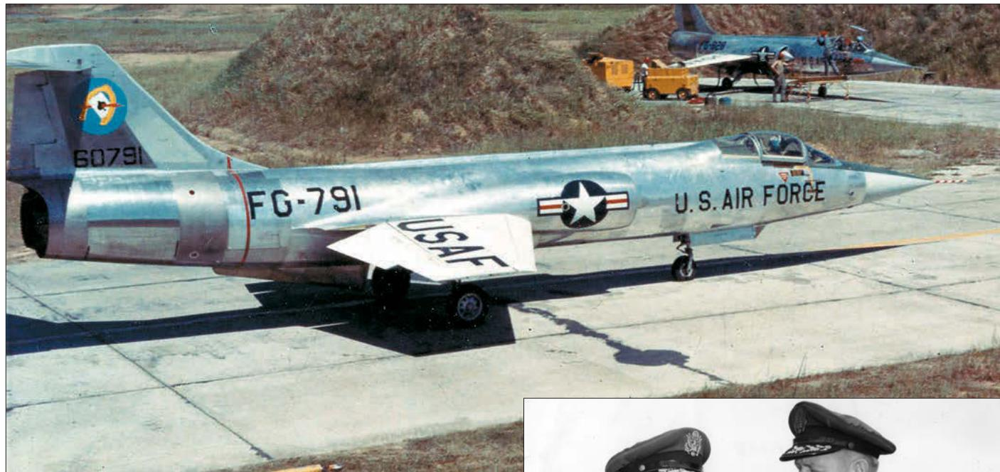

Tactical Air Command F-104s from Hamilton AFB, Calif., at Taeyan AB, Taiwan, during a 1958 operation.   

<table><tr><td colspan="3">STRATEGIC AIR COMMAND</td></tr><tr><td>Brig. Gen. Eugene H. Beebe</td><td>Dec.15, 1944</td><td>March 1, 1945</td></tr><tr><td>Maj. Gen. St. Clair Streett</td><td>March 1, 1945</td><td>July 1, 1945</td></tr><tr><td>Gen. Henry H. Arnold</td><td>July 1, 1945</td><td>March 21, 1946</td></tr><tr><td>Gen. George C. Kenney</td><td>March 21, 1946 0ct.18, 1948</td><td></td></tr><tr><td>Gen. Curtis E. LeMay</td><td>Oct. 19, 1948</td><td>June 30, 1957</td></tr><tr><td>Gen. Thomas S. Power</td><td>July 1, 1957</td><td>Nov. 30, 1964</td></tr><tr><td>Gen. John D. Ryan</td><td>Dec. 1, 1964</td><td>Jan. 31, 1967</td></tr><tr><td>Gen. Joseph J. Nazzaro</td><td>Feb. 1, 1967</td><td>July 28, 1968</td></tr><tr><td>Gen. Bruce K. Holloway</td><td>July 29, 1968</td><td>April 30, 1972</td></tr><tr><td>Gen. John C. Meyer</td><td>May 1, 1972</td><td>July 31, 1974</td></tr><tr><td>Gen. Russell E. Dougherty</td><td>Aug. 1, 1974</td><td>July 31, 1977</td></tr><tr><td>Gen. Richard H. Ellis</td><td>Aug. 1, 1977</td><td></td></tr><tr><td>Gen. Bennie L. Davis</td><td>Aug. 1, 1981</td><td>July 31, 1981</td></tr><tr><td></td><td>Aug. 1, 1985</td><td>July 31, 1985</td></tr><tr><td>Gen. Larry D. Welch</td><td>July 1, 1986</td><td>June 30, 1986</td></tr><tr><td>Gen. John T. Chain</td><td></td><td>Jan. 31, 1991</td></tr><tr><td>Gen. George L. Butler</td><td>Feb. 1, 1991</td><td>June 1, 1992</td></tr></table>

Established as Continental Air Forces Dec. 13, 1944. Redesignated Strategic Air Command March 21, 1946. Inactivated June 1, 1992. Redesignated and activated as Air Force Global Strike Command Aug. 7, 2009. For current leaders, see Air Force Global Strike Command in Major Command and ANG Leaders.

# TACTICAL AIR COMMAND

<table><tr><td>Lt. Gen. Elwood R. Quesada</td><td>March 21, 1946 Nov.24, 1948</td><td></td></tr><tr><td>Maj. Gen. Robert M. Lee</td><td>Nov. 24, 1948</td><td>July 8,1950</td></tr><tr><td>Maj. Gen. Otto P. Weyland</td><td>July, 8 1950</td><td>July 17, 1950</td></tr><tr><td>Maj. Gen. Glenn O. Barcus</td><td>July 17, 1950</td><td>Jan. 25, 1951</td></tr><tr><td>Gen. John K.Cannon</td><td>Jan. 25, 1951</td><td>May 1, 1954</td></tr><tr><td>Gen. Otto P. Weyland</td><td>May 1, 1954</td><td>Aug. 1, 1959</td></tr><tr><td>Gen. Frank F. Everest</td><td>Aug. 1, 1959</td><td>Oct. 1, 1961</td></tr><tr><td>Gen. Walter C. Sweeney Jr.</td><td>Oct. 1, 1961</td><td>Aug. 1, 1965</td></tr><tr><td>Gen. Gabriel P. Disosway</td><td>Aug. 1, 1965</td><td>Aug. 1, 1968</td></tr><tr><td>Gen. William W. Momyer</td><td>Aug. 1, 1968</td><td>Oct.1, 1973</td></tr><tr><td>Gen. Robert J. Dixon</td><td>Oct. 1, 1973</td><td>May 1, 1978</td></tr><tr><td>Gen. W. L. Creech</td><td>May 1, 1978</td><td>Sept. 28, 1984</td></tr><tr><td>Gen. Jerome F. O&#x27;Malley</td><td>Sept. 28, 1984</td><td>May 22, 1985</td></tr><tr><td>Gen. Robert D. Russ</td><td>May 22, 1985</td><td>March 26, 1991</td></tr><tr><td>Gen. John Michael Loh</td><td>March 26, 1991 June 1, 1992</td><td></td></tr></table>

Established as Tactical Air Command March 21, 1946. Lost majcom status and assigned to Continental Air Command Dec. 1, 1948. Returned to majcom status Dec. 1, 1950. Inactivated June 1, 1992. Consolidated with Air Combat Command. For current leaders, see Air Combat Command in Major Command and ANG Leaders.

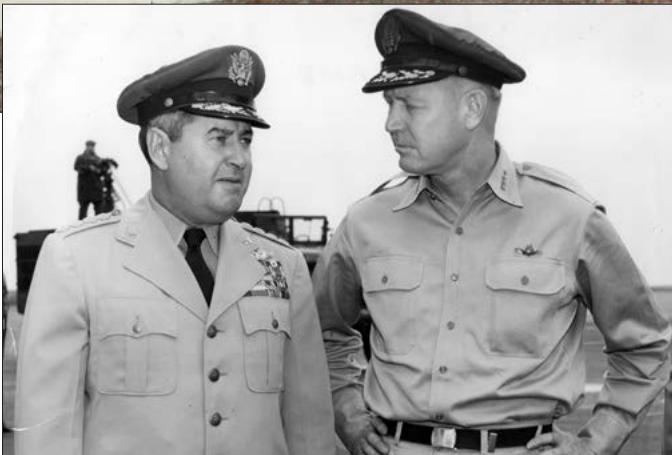

# Gen. Curtis LeMay (left), head of Strategic Air Command, and Gen. Otto Weyland, Far East Air Forces commander, in 1952.

# US AIR FORCES SOUTHERN COMMAND/CARIBBEAN

<table><tr><td>Maj. Gen. Hubert R. Harmon</td><td>July 31, 1946</td><td>Oct. 3, 1947</td></tr><tr><td>Brig. Gen. Glen C. Jamison (acting) Oct. 4, 1947</td><td></td><td>Nov. 12, 1947</td></tr><tr><td>Maj. Gen. Willis H. Hale</td><td>Nov. 13, 1947</td><td>Oct. 19, 1949</td></tr><tr><td>Brig. Gen. Rosenham Beam</td><td>Oct. 20, 1949</td><td>Nov.5,1950</td></tr><tr><td>Brig. Gen. Emil C. Kiel</td><td>Nov. 6, 1950</td><td>June 10, 1953</td></tr><tr><td>Maj. Gen. Reuben C. Hood Jr.</td><td>June 11, 1953</td><td>June 16, 1956</td></tr><tr><td>Maj. Gen. Truman H. Landon</td><td>June 20, 1956</td><td>June 1, 1959</td></tr><tr><td>Maj. Gen. Leland S. Stranathan</td><td>Aug. 3, 1959</td><td>Sept.8, 1963</td></tr><tr><td>Maj. Gen. Robert A. Breitweiser</td><td>Sept. 11, 1963</td><td>July 9, 1966</td></tr><tr><td>Maj. Gen. Reginald J. Clizbe</td><td>Aug. 6, 1966</td><td>June 14, 1968</td></tr><tr><td>Maj. Gen. Kenneth O. Sanborn</td><td>June 14, 1968</td><td>April 7, 1972</td></tr><tr><td>Maj. Gen. Arthur G. Salisbury</td><td>April 7, 1972</td><td>Oct. 31, 1974</td></tr><tr><td>Maj. Gen. James M. Breedlove</td><td>Oct. 31, 1974</td><td>Jan. 1, 1976</td></tr></table>

Antecedents: Panama Canal Air Force 1940; Caribbean Air Force 1941; Sixth Air Force 1942; Caribbean Air Command July 31, 1946; US Air Forces Southern Command July 8, 1963. Inactivated Jan. 1, 1976.

# US STRATEGIC AIR FORCES IN EUROPE

<table><tr><td>Brig. Gen. Asa N. Duncan</td><td>Jan 28, 1942</td><td>May 5, 1942</td></tr><tr><td>Maj. Gen. Carl A. Spaatz</td><td>May 5, 1942</td><td>Dec. 1, 1942</td></tr><tr><td>Lt. Gen. Ira C. Eaker</td><td>Dec. 1, 1942</td><td>Jan. 6, 1944</td></tr><tr><td>Gen. Carl A. Spaatz</td><td>Jan. 6, 1944</td><td>June 3, 1945</td></tr><tr><td>Lt. Gen. John K. Cannon</td><td>June 3, 1945</td><td>June 13, 1945</td></tr><tr><td>Gen. Carl A. Spaatz</td><td>June 13, 1945</td><td>July 4, 1945</td></tr><tr><td>Lt. Gen. John K. Cannon</td><td>July 4, 1945</td><td>Aug. 7, 1945</td></tr></table>

Established as 8th Air Force Jan. 19, 1942. Redesignated Eighth Air Force Sept. 18, 1942; United States Strategic Air Forces in Europe Feb. 22, 1944; US Air Forces in Europe Aug. 7, 1945. For current leaders, see US Air Forces in Europe in the Major Command and ANG Leaders.

<table><tr><td colspan="6">SECRETARY OF DEFENSE</td></tr><tr><td>James V. Forrestal</td><td>Sept. 17, 1947</td><td>March 28, 1949</td><td>Harold Brown</td><td>Jan.21, 1977</td><td>Jan. 20, 1981</td></tr><tr><td>Louis A. Johnson</td><td>March 28, 1949</td><td>Sept. 19, 1950</td><td>Caspar W. Weinberger</td><td>Jan. 21, 1981</td><td>Nov. 23, 1987</td></tr><tr><td>George C. Marshall</td><td>Sept. 21, 1950</td><td>Sept. 12, 1951</td><td>Frank C. Carlucci</td><td>Nov. 23, 1987</td><td>Jan. 20, 1989</td></tr><tr><td>Robert A. Lovett</td><td>Sept. 17, 1951</td><td>Jan. 20, 1953</td><td>Richard B. Cheney</td><td>March 21, 1989</td><td>Jan.20, 1993</td></tr><tr><td>Charles E. Wilson</td><td>Jan. 28, 1953</td><td>Oct.8, 1957</td><td>Les Aspin</td><td>Jan. 21, 1993</td><td>Feb.3, 1994</td></tr><tr><td>Neil H. McElroy</td><td>Oct. 9, 1957</td><td>Dec. 1, 1959</td><td>William J. Perry</td><td>Feb. 3, 1994</td><td>Jan. 23, 1997</td></tr><tr><td>Thomas S. Gates</td><td>Dec.2, 1959</td><td>Jan. 20, 1961</td><td>William S. Cohen</td><td>Jan. 24, 1997</td><td>Jan. 20, 2001</td></tr><tr><td>Robert S. McNamara</td><td>Jan. 21, 1961</td><td>Feb.29, 1968</td><td>Donald H. Rumsfeld</td><td>Jan. 20, 2001</td><td>Dec. 18, 2006</td></tr><tr><td>Clark M. Clifford</td><td>March 1, 1968</td><td>Jan.20, 1969</td><td>Robert M. Gates</td><td>Dec. 18, 2006</td><td>July 1, 2011</td></tr><tr><td>Melvin R. Laird</td><td>Jan. 22, 1969</td><td>Jan. 29, 1973</td><td>Leon E. Panetta</td><td>July 1, 2011</td><td>Feb. 27, 2013</td></tr><tr><td>Elliot L. Richardson</td><td>Jan. 30, 1973</td><td>May 24, 1973</td><td>Chuck Hagel</td><td>Feb.27, 2013</td><td>Feb.17, 2015</td></tr><tr><td>James R. Schlesinger</td><td>July 2, 1973</td><td>Nov. 19, 1975</td><td>Ashton B. Carter</td><td>Feb. 17, 2015</td><td>Jan. 19, 2017</td></tr><tr><td>Donald H. Rumsfeld</td><td>Nov. 20, 1975</td><td>Jan. 20, 1977</td><td>James N. Mattis</td><td>Jan. 20, 2017</td><td></td></tr><tr><td colspan="6">CHAIRMAN OF THE JOINT CHIEFS OF STAFF</td></tr><tr><td colspan="6">Gen. of the Army Omar N. Bradley Aug. 16, 1949</td></tr><tr><td>Adm. Arthur W. Radford, USN</td><td></td><td>Aug. 15, 1953 Aug. 15, 1957</td><td>Adm. William J Crowe Jr, USN Gen. Colin L. Powell, USA</td><td>Oct. 1, 1985</td><td>Sept. 30, 1989</td></tr><tr><td>Gen. Nathan F. Twining, USAF</td><td>Aug. 15, 1953 Aug. 15, 1957</td><td>Sept. 30, 1960</td><td>Adm. David Jeremiah, USN (acting) Oct. 1, 1993</td><td>Oct. 1, 1989</td><td>Sept. 30, 1993 Oct.24, 1993</td></tr><tr><td>Gen. Lyman L. Lemnitzer, USA</td><td>Oct. 1, 1960</td><td>Sept. 30, 1962</td><td>Gen. John M. Shalikashvili, USA</td><td>Oct. 25, 1993</td><td>Sept. 30, 1997</td></tr><tr><td>Gen. Maxwell D. Taylor, USA</td><td>Oct. 1, 1962</td><td>July 1, 1964</td><td>Gen. Henry H. Shelton, USA</td><td>Oct. 1, 1997</td><td>Oct. 1, 2001</td></tr><tr><td>Gen. Earle G. Wheeler, USA</td><td>July 3, 1964</td><td>July 2, 1970</td><td>Gen. Richard B. Myers, USAF</td><td>Oct. 1, 2001</td><td>Sept. 30, 2005</td></tr><tr><td>Adm. Thomas H. Moorer, USN</td><td>July 2, 1970</td><td>July 1, 1974</td><td>Gen. Peter Pace, USMC</td><td>Sept.30, 2005</td><td>Oct. 1, 2007</td></tr><tr><td>Gen. George S. Brown, USAF</td><td>July 1, 1974</td><td>June 20, 1978</td><td>Adm. Michael G. Mullen, USN</td><td>Oct. 1, 2007</td><td>Sept. 30, 2011</td></tr><tr><td>Gen. David C. Jones, USAF</td><td>June 21, 1978</td><td>June 18, 1982</td><td>Gen. Martin E. Dempsey, USA</td><td>Sept. 30, 2011</td><td>Sept. 25, 2015</td></tr><tr><td>Gen. John W. Vessey Jr., USA</td><td>June 18, 1982</td><td>Sept. 30, 1985</td><td>Gen. Joseph F. Dunford Jr, USMC Sept. 25, 2015</td><td></td><td></td></tr><tr><td></td><td></td><td></td><td></td><td></td><td></td></tr><tr><td colspan="6">VICE CHAIRMAN OF THE JOINT CHIEFS OF STAFF</td></tr><tr><td>Gen. Robert T. Herres, USAF</td><td>Feb. 6, 1987</td><td>Feb.28, 1990</td><td>Gen. Peter Pace, USMC</td><td>Oct. 1, 2001</td><td>Aug. 12, 2005</td></tr><tr><td>Adm. David E. Jeremiah, USN</td><td>March 1, 1990</td><td>Feb. 28, 1994</td><td>Adm. Edmund Giambastiani Jr., USN Aug. 12, 2005</td><td></td><td>Aug. 3, 2007</td></tr><tr><td>Adm. William A. Owens, USN</td><td>March 1, 1994</td><td>Feb.27, 1996</td><td>Gen. James E. Cartwright, USMC</td><td>Aug. 4, 2007</td><td>Aug. 4, 2011</td></tr><tr><td>Gen. Joseph W. Ralston, USAF</td><td>March 1, 1996</td><td>Feb. 29, 2000</td><td>Adm. James A. Winnefeld Jr., USN Aug. 4, 2011</td><td></td><td>July 31, 2015</td></tr><tr><td>Gen. Richard B. Myers, USAF</td><td>March 1, 2000</td><td>Oct. 1, 2001</td><td>Gen. Paul J. Selva, USAF</td><td>July 31, 2015</td><td></td></tr></table>

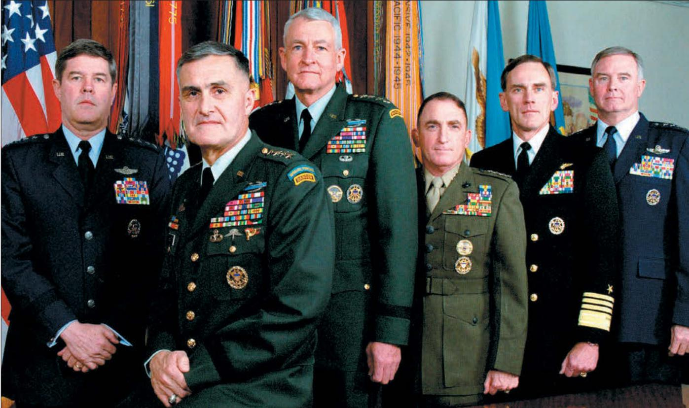  
The Joint Chiefs of Staff in 1997 (left to right): Air Force Gen. Joseph Ralston, vice chairman of the Joint Chiefs of Staff; Army Gen. Henry Shelton, Chairman of the Joint Chiefs of Staff; Gen. Dennis Reimer, Army Chief of Staff; Gen. Charles Krulak, Marine Corps Commandant; Adm. Jay Johnson, Chief of Naval Operations; and Gen. Michael Ryan, Air Force Chief of Staff.

# ified Command, National Guard Bureau, and NORAD Leaders

This section presents the leaders of DOD’s unified commands, the National Guard Bureau, and NORAD under the current designation.   
Leaders of historic DOD commands (and of active commands’ previous designations) are listed in the next section.

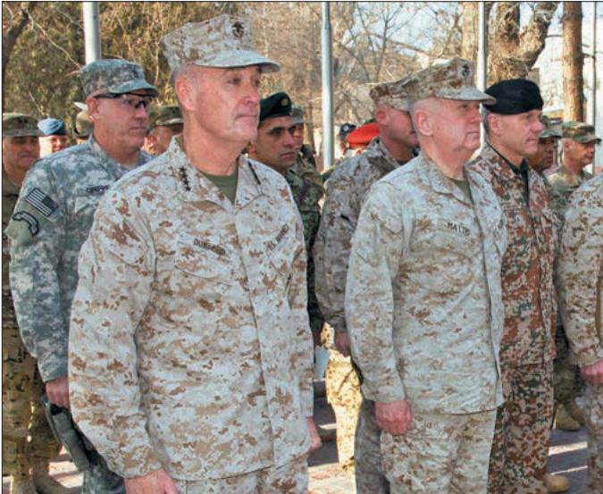

Gen. Joseph Dunford, then International Security Assistance Force commander (left), and Gen. James Mattis, then CENTCOM commander, in Afghanistan in 2013.

# US AFRICA COMMAND

<table><tr><td>Gen. William E. Ward, USA</td><td>Oct.1, 2008</td><td>March 9, 2011</td></tr><tr><td>Gen. Carter F. Ham, USA</td><td>March 9, 2011 April 5, 2013</td><td></td></tr><tr><td>Gen. David M. Rodriguez, USA</td><td>April 5, 2013 July 18, 2016</td><td></td></tr><tr><td>Gen. Thomas D. Waldhauser, USMC July 18, 2016</td><td></td><td></td></tr></table>

# US CENTRAL COMMAND

<table><tr><td>Gen. Robert C. Kingston, USA</td><td>Jan. 1, 1983</td><td>Nov. 27, 1985</td></tr><tr><td>Gen. George B. Crist, USMC</td><td>Nov. 27, 1985 Nov. 23, 1988</td><td></td></tr><tr><td>Gen. H. Norman Schwarzkopf, USA Nov. 23, 1988 Aug. 9, 1991</td><td></td><td></td></tr><tr><td>Gen. Joseph P. Hoar, USMC</td><td>Aug. 9, 1991 Aug. 5, 1994</td><td></td></tr><tr><td>Gen. J. H. Binford Peay Il, USA</td><td></td><td>Aug.5, 1994 Aug.13, 1997</td></tr><tr><td>Gen. Anthony C. Zinni, USMC</td><td>Aug. 13, 1997 July 6, 2000</td><td></td></tr><tr><td>Gen. Tommy R. Franks, USA</td><td>July 6, 2000</td><td>July 7, 2003</td></tr><tr><td>Gen. John P. Abizaid, USA</td><td>July 7, 2003</td><td>March 16, 2007</td></tr><tr><td>Adm. William J. Fallon, USN</td><td></td><td>March 16, 2007 March 31, 2008</td></tr><tr><td>Lt. Gen. Martin Dempsey, USA (acting) March 31, 2008Oct. 31, 2008</td><td></td><td></td></tr><tr><td>Gen. David H. Petraeus, USA</td><td>Oct. 31, 2008 June 30, 2010</td><td></td></tr><tr><td>Lt. Gen. John R. Allen, USMC (acting) June 30, 2010 Aug. 11, 2010</td><td></td><td></td></tr><tr><td>Gen. James N. Mattis, USMC</td><td>Aug.11, 2010 March 22, 2013</td><td></td></tr><tr><td>Gen. Lloyd J. Austin I, USA</td><td></td><td></td></tr><tr><td>Gen. Joseph L. Votel, USA</td><td>March 30, 2016</td><td>March 22, 2013March 30, 2016</td></tr></table>

# US EUROPEAN COMMAND

<table><tr><td>Gen. Matthew B. Ridgway, USA</td><td>Aug. 1, 1952</td><td>July 11, 1953</td></tr><tr><td>Gen. AIfred M. Gruenther, USA</td><td>July 11, 1953 Nov. 20, 1956</td><td></td></tr><tr><td>Gen. Lauris Norstad, USAF</td><td>Nov. 20, 1956 Nov. 1, 1962</td><td></td></tr><tr><td>Gen. Lyman L. Lemnitzer, USA</td><td>Nov. 1, 1962</td><td>2 May5, 1969</td></tr><tr><td>Gen. Andrew J. Goodpaster, USA</td><td>May 5, 1969 Nov.1, 1974</td><td></td></tr><tr><td>Gen. Alexander M. Haig Jr., USA</td><td></td><td>Nov. 1, 1974 June 27, 1979</td></tr><tr><td>Gen. Bernard W. Rogers, USA</td><td>June 27, 1979 June 25, 1987</td><td></td></tr><tr><td>Gen. John R. Galvin, USA</td><td></td><td>June 25, 1987 June 23, 1992</td></tr><tr><td>Gen. John M. Shalikashvili, USA</td><td>June 23, 1992 0ct. 21, 1993</td><td></td></tr><tr><td>Gen. George A. Joulwan, USA</td><td>Oct. 21, 1993 July 10, 1997</td><td></td></tr><tr><td>Gen. Wesley K. Clark, USA</td><td>July 10, 1997 May 2, 2000</td><td></td></tr><tr><td>Gen. Joseph W. Ralston, USAF</td><td>May 2, 2000</td><td>Jan. 16, 2003</td></tr><tr><td>Gen. James L. Jones, USMC</td><td>Jan.16, 2003 Dec.4, 2006</td><td></td></tr><tr><td>Gen. Bantz J. Craddock, USA</td><td>Dec.4, 2006</td><td>June 30, 2009</td></tr><tr><td>Adm. James G. Stavridis, USN</td><td></td><td>June 30, 2009 May 10, 2013</td></tr><tr><td>Gen. Philip M. Breedlove, USAF</td><td>May 10, 2013 May 3, 2016</td><td></td></tr><tr><td>Gen. Curtis M. Scaparrotti, USA</td><td colspan="2">May 3, 2016</td></tr></table>

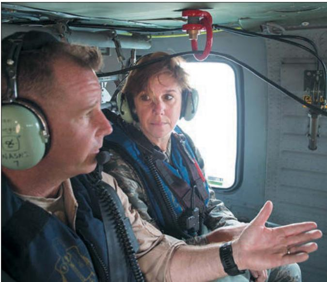  
NORAD and NORTHCOM commander Gen. Lori Robinson (right) is briefed by a customs and border patrol official.

# US NORTHERN COMMAND

<table><tr><td>Gen. Ralph E. Eberhart, USAF</td><td>Oct. 1, 2002</td><td>Nov. 5, 2004</td></tr><tr><td>Adm. Timothy J. Keating, USN</td><td>Nov. 5, 2004</td><td>March 23, 2007</td></tr><tr><td>Gen. Victor E. Renuart Jr., USAF</td><td>March 23, 2007May 19, 2010</td><td></td></tr><tr><td>Adm. James A. Winnefeld Jr., USN May 19, 2010 Aug. 4, 2011</td><td></td><td></td></tr><tr><td>Gen. Charles H. Jacoby Jr., USA</td><td>Aug. 4, 2011</td><td>Dec.5, 2014</td></tr><tr><td>Adm. William E. Gortney, USN</td><td>Dec. 5, 2014 May 13, 2016</td><td></td></tr><tr><td>Gen. Lori J. Robinson, USAF</td><td>May 13, 2016</td><td></td></tr></table>

# US PACIFIC COMMAND

<table><tr><td>Adm. John H. Towers, USN</td><td>Jan. 1, 1947</td><td>Feb. 28, 1947</td></tr><tr><td>Adm. Louis E. Denfeld, USN</td><td></td><td>Feb. 28, 1947 Dec. 3, 1947</td></tr><tr><td>Adm. Dewitt C. Ramsey, USN</td><td></td><td>Dec. 3, 1947 April 30, 1949</td></tr><tr><td>Adm. Arthur W. Radford, USN</td><td></td><td>April 30, 1949 July 10, 1953</td></tr><tr><td>Adm. Felix B. Stump, USN</td><td></td><td>July 10, 1953 July 31, 1958</td></tr><tr><td>Adm. Harry D. Felt, USN</td><td></td><td>July 31, 1958 June 30, 1964</td></tr><tr><td>Adm. U. S. Grant Sharp, USN</td><td></td><td>June 30, 1964 July 31, 1968</td></tr><tr><td>Adm. John S. McCain Jr., USN</td><td></td><td>July 31, 1968 Sept. 1, 1972</td></tr><tr><td>Adm. Noel A. M. Gayler, USN</td><td></td><td>Sept. 1, 1972 Aug. 30, 1976</td></tr><tr><td>Adm. Maurice E. Weisner, USN</td><td></td><td>Aug. 30, 1976 0ct. 31, 1979</td></tr><tr><td>Adm. Robert L. J. Long, USN</td><td>Oct. 31, 1979– July 1, 1983</td><td></td></tr><tr><td>Adm. William J. Crowe Jr., USN</td><td></td><td>July 1, 1983 Sept. 18, 1985</td></tr><tr><td>Adm. Ronald J. Hays Jr., USN</td><td></td><td>Sept. 18, 1985 Sept. 30, 1988</td></tr><tr><td>Adm. Huntington Hardisty, USN</td><td></td><td>Sept. 30, 1988 March 1, 1991</td></tr><tr><td>Adm. Charles R. Larson, USN</td><td></td><td>March 1, 1991 July 11, 1994</td></tr><tr><td>Lt. Gen. Harold Fields, USA (acting) July 11, 1994 July 19, 1994</td><td></td><td></td></tr><tr><td>Adm. Richard C. Macke, USN</td><td></td><td>July 19, 1994 Jan.31, 1996</td></tr><tr><td>Adm. Joseph W. Prueher, USN</td><td></td><td>Jan. 31, 1996 Feb.20, 1999</td></tr><tr><td>Adm. Dennis C. Blair, USN</td><td>Feb. 20, 1999 May 2, 2002</td><td></td></tr><tr><td>Adm. Thomas B. Fargo, USN</td><td></td><td>May 2, 2002 Feb.26, 2005</td></tr><tr><td>Adm. William J. Fallon, USN</td><td></td><td>Feb. 26, 2005 March 12, 2007</td></tr><tr><td>Lt. Gen. Daniel Leaf, USAF (acting)</td><td></td><td>) March 12, 2007March 26, 2007</td></tr><tr><td>Adm. Timothy J. Keating, USN</td><td>March 26, 20070ct. 19, 2009</td><td></td></tr><tr><td>Adm. Robert F. Willard, USN</td><td></td><td>Oct. 19, 2009 March 9, 2012</td></tr><tr><td>Adm. Samuel J. Locklear Il, USN</td><td>March 9, 2012 May 27, 2015</td><td></td></tr><tr><td>Adm. Harry B. Harris Jr., USN</td><td>May 27, 2015</td><td></td></tr><tr><td colspan="3">US SOUTHERN COMMAND</td></tr><tr><td>Gen. Andrew P. O'Meara, USA</td><td>June 6, 1963 Feb.22, 1965</td><td></td></tr><tr><td>Gen. Robert W. Porter Jr., USA</td><td>Feb. 22, 1965</td><td>Feb.18,1969</td></tr><tr><td>Gen. George R. Mather, USA</td><td>Feb. 18, 1969</td><td>Sept. 20, 1971</td></tr><tr><td>Gen. George V. Underwood, USA</td><td>Sept. 20, 1971 Jan.17, 1973</td><td></td></tr><tr><td>Gen. William B. Rosson, USA</td><td>Jan. 17, 1973 Aug. 1, 1975</td><td></td></tr><tr><td>Lt. Gen. Dennis P. McAuliffe, USA</td><td>Aug. 1, 1975</td><td>Oct. 1, 1979</td></tr><tr><td>Lt. Gen. Wallace H. Nutting, USA</td><td>Oct. 1, 1979</td><td>May 24, 1983</td></tr><tr><td>Gen. Paul F. Gorman, USA</td><td>May 24, 1983 March 1, 1985</td><td></td></tr><tr><td>Gen. John R. Galvin, USA</td><td>March 1, 1985 June 6, 1987</td><td></td></tr><tr><td>Gen. Fred F. Woerner, USA</td><td>June 6, 1987</td><td>Oct. 1, 1989</td></tr><tr><td>Gen. Maxwell R. Thurman, USA</td><td>Oct. 1, 1989</td><td>Nov. 21, 1990</td></tr><tr><td>Gen. George A. Joulwan, USA</td><td>Nov.21, 1990 0ctober 1993</td><td></td></tr><tr><td>Maj. Gen. W. Worthington, USAF (acting) October 1993 Feb. 17, 1994</td><td></td><td></td></tr><tr><td>Gen. Barry R. McCaffrey, USA</td><td></td><td>Feb.17, 1994 March 1, 1996</td></tr><tr><td>RAdm. James Perkins, USN (acting) March 1, 1996 June 26, 1996</td><td></td><td></td></tr><tr><td>Gen. Wesley K. Clark, USA</td><td>June 26, 1996 July 13, 1997</td><td></td></tr><tr><td>RAdm. Walter F. Doran, USN (acting) July 13, 1997 Sept. 25, 1997</td><td></td><td></td></tr><tr><td>Gen. Charles E. Wilhelm, USMC</td><td>Sept. 25, 1997 Sept.8, 2000</td><td></td></tr><tr><td>Gen. Peter Pace, USMC</td><td>Sept.8,2000</td><td>Sept. 30, 2001</td></tr><tr><td>Maj. Gen. G. D. Speer, USA (acting) Sept. 30, 2001 Aug. 18, 2002</td><td></td><td></td></tr><tr><td>Gen. James T. Hil, USA</td><td>Aug. 18, 2002 Nov. 9, 2004</td><td></td></tr><tr><td>Gen. Bantz J. Craddock, USA</td><td>Nov. 9, 2004</td><td>Oct. 19, 2006</td></tr><tr><td>Adm. James G. Stavridis, USN</td><td>Oct. 19, 2006</td><td>June 25, 2009</td></tr><tr><td>Gen. Douglas M. Fraser, USAF</td><td>June 25, 2009– Nov. 19, 2012</td><td></td></tr><tr><td>Gen. John F. Kelly, USMC</td><td>Nov. 19, 2012 Jan 14, 2016</td><td></td></tr><tr><td>Adm. Kurt W. Tidd, USN</td><td>Jan.14, 2016</td><td></td></tr></table>

Formerly US Caribbean Command Nov. 1, 1947. Redesignated June 6, 1963. For historical leaders, see US Caribbean Command in Historic Unified Command Leaders section.

# US SPECIAL OPERATIONS COMMAND

<table><tr><td>Gen. James J. Lindsay, USA</td><td></td><td>April 16, 1987 June 27, 1990</td></tr><tr><td>Gen. Carl W. Stiner, USA</td><td>June 27, 1990 May 20, 1993</td><td></td></tr><tr><td>Gen. Wayne A. Downing, USA</td><td>May 20, 1993 Feb.29, 1996</td><td></td></tr><tr><td>Gen. Henry H. Shelton, USA</td><td></td><td>Feb. 29, 1996 Sept. 25, 1997</td></tr><tr><td>Gen. Peter J. Schoomaker, USA</td><td>Nov. 5, 1997</td><td>Oct. 27, 2000</td></tr><tr><td>Gen. Charles R. Holland, USAF</td><td>Oct. 27, 2000 Sept. 2, 2003</td><td></td></tr><tr><td>Gen. Bryan D. Brown, USA</td><td>Sept.2, 2003 July 9, 2007</td><td></td></tr><tr><td>Adm. Eric T. OIson, USN</td><td>July 9, 2007</td><td>Aug. 15, 2011</td></tr><tr><td>Adm. William H. McRaven, USN</td><td></td><td>Aug.15, 2011 Aug.28, 2014</td></tr><tr><td>Gen. Joseph L. Votel, USA</td><td></td><td>Aug. 28, 2014 March 30, 2016</td></tr><tr><td>Gen. Raymond A. Thomas, USA</td><td>March 30, 2016</td><td></td></tr></table>

# US STRATEGIC COMMAND

<table><tr><td>Gen. George L. Butler, USAF</td><td>June 1, 1992</td><td>Feb. 13, 1994</td></tr><tr><td>Adm. Henry G. Chiles Jr., USN</td><td>Feb.14,1994 F</td><td>Feb.21, 1996</td></tr><tr><td>Gen. Eugene E. Habiger, USAF</td><td>Feb. 22, 1996 </td><td>June 25, 1998</td></tr><tr><td>Adm. Richard W. Mies, USN</td><td></td><td>June 26, 1998 Nov. 30, 2001</td></tr><tr><td>Adm. James O. Ellis Jr, USN</td><td>Nov. 30, 2001 July 9, 2004</td><td></td></tr><tr><td>Gen. James E. Cartwright, USMC</td><td>July 9, 2004</td><td>Aug. 10, 2007</td></tr><tr><td>Lt. Gen. Robert Kehler, USAF (acting) Aug. 10, 2007</td><td></td><td>Oct. 3, 2007</td></tr><tr><td>Gen. Kevin P. Chilton, USAF</td><td>Oct. 3,2007</td><td>Jan. 28, 2011</td></tr><tr><td>Gen. Robert Kehler, USAF</td><td>Jan. 28, 2011</td><td>Nov. 15, 2013</td></tr><tr><td>Adm. Cecil D. Haney, USN</td><td>Nov. 15, 2013 Nov. 3, 2016</td><td></td></tr><tr><td>Gen. John E. Hyten, USAF</td><td>Nov. 3, 2016</td><td></td></tr></table>

Merged the functions of US Space Command into US Strategic Command Oct. 1, 2002.

<table><tr><td colspan="3">US TRANSPORTATION COMMAND</td></tr><tr><td>Gen. Duane H. Cassidy, USAF</td><td>July 1, 1987</td><td>Sept. 21, 1989</td></tr><tr><td>Gen. H. T. Johnson, USAF</td><td></td><td>Sept. 22, 1989 Aug. 24, 1992</td></tr><tr><td>Gen. Ronald R. Fogleman, USAF</td><td></td><td>Aug. 25, 1992 0ct.17, 1994</td></tr><tr><td>Gen. Robert L. Rutherford, USAF</td><td></td><td>Oct. 18, 1994 July 14, 1996</td></tr><tr><td>Gen. Walter Kross, USAF</td><td>July 15, 1996</td><td>Aug. 2, 1998</td></tr><tr><td>Gen. Charles T. Robertson Jr., USAF Aug. 3, 1998</td><td></td><td>Nov. 5, 2001</td></tr><tr><td>Gen. John W. Handy, USAF</td><td>Nov. 5, 2001</td><td>Sept. 7, 2005</td></tr><tr><td>Gen. Norton A. Schwartz, USAF</td><td>Sept. 7, 2005</td><td>Aug. 11, 2008</td></tr><tr><td>VAdm. Ann E. Rondeau, USN (acting) Aug. 12, 2008</td><td></td><td>3 Sept.4, 2008</td></tr><tr><td>Gen. Duncan J. McNabb, USAF</td><td>Sept. 5, 2008</td><td>Oct. 14, 2011</td></tr><tr><td>Gen. William M. Fraser Il, USAF</td><td>Oct. 14, 2011</td><td>May 5, 2014</td></tr><tr><td>Gen. Paul J. Selva, USAF</td><td>May 5, 2014</td><td>July 31, 2015</td></tr><tr><td>VAdm. Wiliam Brown, USN (acting) July 31, 2015</td><td></td><td>Aug. 26, 2015</td></tr><tr><td>Gen. Darren W. McDew, USAF</td><td>Aug. 26, 2015</td><td></td></tr></table>

# NATIONAL GUARD BUREAU

<table><tr><td rowspan=1 colspan=1>Maj. Gen. Butler B. Miltonberger, USA Feb. 1, 1946   Sept. 29, 1947</td></tr><tr><td rowspan=1 colspan=1>Maj. Gen. Kenneth F. Cramer, USA Sept. 30, 1947 Sept. 4, 1950</td></tr><tr><td rowspan=1 colspan=1>Maj. Gen. Raymond H. Fleming, USA Sept. 5, 1950 Feb. 15, 1953</td></tr><tr><td rowspan=1 colspan=1>Maj. Gen. Earl T. Ricks, USAF (acting) Feb. 16, 1953 June 21, 1953</td></tr><tr><td rowspan=1 colspan=1>Maj. Gen. Edgar C. Erickson, USA   June 22, 1953 May 31, 1959</td></tr><tr><td rowspan=1 colspan=1>Maj. Gen. Winston P. Wilson,       June 1, 1959 July 19, 1959USAF (acting)</td></tr><tr><td rowspan=1 colspan=1>Maj. Gen. Donald W. McGowan, USA July 20, 1959 Aug. 30, 1963</td></tr><tr><td rowspan=1 colspan=1>Maj. Gen. Winston P. Wilson, USAF Aug. 31, 1963 Aug. 31, 1971</td></tr><tr><td rowspan=1 colspan=1>Maj. Gen. Francis S. Greenlief, USA Sept. 1, 1971June 23, 1974</td></tr><tr><td rowspan=1 colspan=1>Lt. Gen. La Vern E. Weber, USA     Aug. 16, 1974 Aug. 15, 1982</td></tr><tr><td rowspan=1 colspan=1>Lt. Gen. Emmett H. Walker Jr., USA Aug. 16, 1982 Aug. 15, 1986</td></tr><tr><td rowspan=1 colspan=1>Lt. Gen. Herbert R. Temple Jr., USA Aug. 16, 1986 Jan. 31, 1990</td></tr><tr><td rowspan=1 colspan=1>Lt. Gen. John B. Conaway, USAF    Feb. 1, 1990  Dec. 1, 1993</td></tr><tr><td rowspan=1 colspan=1>Maj. Gen. Raymond Rees, USA (acting) Jan. 1, 1994 July 31, 1994</td></tr><tr><td rowspan=1 colspan=1>Lt. Gen. Edward D. Baca, USA      Oct. 1, 1994  July 31, 1998</td></tr><tr><td rowspan=1 colspan=1>Lt. Gen. Russell C. Davis, USAF     Aug. 4, 19988 Aug.3, 2002</td></tr><tr><td rowspan=1 colspan=1>Maj. Gen. Raymond Rees, USA (acting) Aug. 4, 2002  April 10, 2003</td></tr><tr><td rowspan=1 colspan=1>Lt. Gen. H. Steven Blum, USA       April 11, 2003 Nov. 16, 2008</td></tr><tr><td rowspan=1 colspan=1>Gen. Craig R. McKinley, USAF       Nov. 17, 2008 Sept. 7, 2012</td></tr><tr><td rowspan=1 colspan=1>Gen. Frank J. Grass, USA          Sept. 7, 2012 Aug. 3, 2016</td></tr><tr><td rowspan=1 colspan=1>Gen. Joseph L. Lengyel, USAF      Aug. 3, 2016</td></tr></table>

Served as acting chief: Fleming until Aug. 14, 1951.

# NORTH AMERICAN AEROSPACE DEFENSE COMMAND

<table><tr><td>Gen. Earle E. Partridge, USAF</td><td>Sept. 12, 1957 July 30, 1959</td><td></td></tr><tr><td>Gen. Laurence S. Kuter, USAF</td><td>Aug. 1, 1959</td><td>July 30, 1962</td></tr><tr><td>Gen. John K. Gerhart, USAF</td><td>Aug. 1, 1962</td><td>March 30, 1965</td></tr><tr><td>Gen. Dean C. Strother, USAF</td><td>April 1, 1965</td><td>July 29, 1966</td></tr><tr><td>Gen. Raymond J. Reeves, USAF</td><td>Aug. 1, 1966</td><td>July 31, 1969</td></tr><tr><td>Gen. Seth J. McKee, USAF</td><td>Aug. 1, 1969</td><td>Sept. 30, 1973</td></tr><tr><td>Gen. Lucius D. Clay Jr., USAF</td><td>Oct. 1, 1973</td><td>Aug. 29, 1975</td></tr><tr><td>Gen. Daniel James Jr., USAF</td><td>Sept. 1, 1975</td><td>Dec. 5, 1977</td></tr><tr><td>Gen. James E. Hill, USAF</td><td>Dec. 6, 1977</td><td>Dec.31, 1979</td></tr><tr><td>Gen. James V. Hartinger, USAF</td><td>Jan. 1, 1980</td><td>July 30, 1984</td></tr><tr><td>Gen. Robert T. Herres, USAF</td><td>July 30, 1984</td><td>Feb. 5, 1987</td></tr><tr><td>Gen. John L. Piotrowski, USAF</td><td>Feb. 6, 1987</td><td>March 30, 1990</td></tr><tr><td>Gen. Donald J. Kutyna, USAF</td><td>April 1, 1990</td><td>June 30, 1992</td></tr><tr><td>Gen. Charles A. Horner, USAF</td><td></td><td>June 30, 1992 Sept. 12, 1994</td></tr><tr><td>Gen. Joseph W. Ashy, USAF</td><td></td><td>Sept. 13, 1994 Aug. 26, 1996</td></tr><tr><td>Gen. Howell M. Estes Il, USAF</td><td></td><td>Aug. 27, 1996 Aug. 13, 1998</td></tr><tr><td>Gen. Richard B. Myers, USAF</td><td></td><td>Aug. 14, 1998 Feb.22, 2000</td></tr><tr><td>Gen. Ralph E. Eberhart, USAF</td><td>Feb. 22, 2000 Nov.5, 2004</td><td></td></tr><tr><td>Adm. Timothy J. Keating, USN</td><td>Nov.5, 2004</td><td>March 23, 2007</td></tr><tr><td>Gen. Victor E. Renuart Jr., USAF</td><td></td><td>March 23, 2007 May 19, 2010</td></tr><tr><td>Adm. James A. Winnefeld Jr., USN</td><td>May 19, 2010 Aug. 4, 2011</td><td></td></tr><tr><td>Gen. Charles H. Jacoby Jr., USA</td><td>Aug. 4, 2011</td><td>Dec. 5, 2014</td></tr><tr><td>Adm. William E. Gortney, USN</td><td>Dec.5, 2014 May 13, 2016</td><td></td></tr><tr><td>Gen. Lori J. Robinson, USAF</td><td>May 13, 2016</td><td></td></tr></table>

# ALASKAN COMMAND

<table><tr><td>Maj. Gen. Howard A. Craig, USAF</td><td>Jan. 1, 1947</td><td>Oct. 17, 1947</td></tr><tr><td>Lt. Gen. Nathan F. Twining, USAF</td><td>Oct. 17, 1947 July 1, 1950</td><td></td></tr><tr><td>Lt. Gen. William E. Kepner, USAF</td><td>July 1, 1950</td><td>March 1, 1953</td></tr><tr><td>Lt. Gen. Joseph A. Atkinson, USAF March 1, 1953 Oct. 1, 1956</td><td></td><td></td></tr><tr><td>Lt. Gen. Frank A. Armstrong Jr., USAF Oct. 1, 1956</td><td></td><td>Aug. 1, 1961</td></tr><tr><td>Lt. Gen. George W. Mundy, USAF Aug. 1, 1961 Aug. 1, 1963</td><td></td><td></td></tr><tr><td>Lt. Gen. Raymond J. Reeves, USAF Aug. 1, 1963</td><td></td><td>July 28, 1966</td></tr><tr><td>Lt. Gen. Glen R. Birchard, USAF</td><td></td><td>July 28, 1966 June 29, 1967</td></tr><tr><td>Lt. Gen. Robert A. Breitweiser, USAF June 29, 1967 Aug. 1, 1969</td><td></td><td></td></tr><tr><td>Lt. Gen. Robert G. Ruegg, USAF</td><td>Aug. 1, 1969</td><td>Aug. 1, 1972</td></tr><tr><td>Lt. Gen. James C. Sherrill, USAF</td><td>Aug. 1, 1972</td><td>Sept. 1, 1974</td></tr><tr><td>Lt. Gen. James E. Hill, USAF Disestablished July 1, 1975.</td><td>Sept. 1, 1974 July 1, 1975</td><td></td></tr></table>

# CONTINENTAL AIR DEFENSE COMMAND

<table><tr><td>Gen. Benjamin W. Chidlaw, USAF</td><td>Sept. 1, 1954</td><td>July 1, 1955</td></tr><tr><td>Gen. Earle E. Partridge, USAF</td><td>July 1, 1955</td><td>Aug. 1, 1959</td></tr><tr><td>Gen. Laurence S. Kuter, USAF</td><td>Aug. 1, 1959</td><td>Aug. 1, 1960</td></tr><tr><td>Gen. John K. Gerhart, USAF</td><td>Aug. 1, 1960</td><td>April 1, 1965</td></tr><tr><td>Gen. Dean C. Strother, USAF</td><td>April 1, 1965</td><td>Aug. 1, 1966</td></tr><tr><td>Gen. Raymond J. Reeves, USAF</td><td>Aug. 1, 1966</td><td>Aug. 1, 1969</td></tr><tr><td>Gen. Seth J. McKee, USAF</td><td>Aug. 1, 1969</td><td>Oct. 1, 1973</td></tr><tr><td>Gen. Lucius D. Clay Jr., USAF</td><td>Oct. 1, 1973</td><td>June 30, 1975</td></tr></table>

Disestablished June 30, 1975. Established as specified command, Aerospace Defense Command, July 1, 1975. ADCOM disestablished Dec. 19, 1986.

# EUROPEAN COMMAND

Gen. Lucius D. Clay, USA March 15, 1947 Aug. 23, 1949   
Gen. Thomas T. Handy, USA Aug. 23, 1949 Aug. 1, 1952

Redesignated US Army Europe as Army component of new US European Command Aug. 1, 1952.

# FAR EAST COMMAND

<table><tr><td>Gen. of the Army Douglas MacArthur, USA</td><td>Jan. 1, 1947</td><td>April 11, 1951</td></tr><tr><td>Gen. Matthew B. Ridgway, USA</td><td>April 11, 1951 May 9, 1952</td><td></td></tr><tr><td>Gen. Mark W. Clark, USA</td><td>May 9, 1952</td><td>Oct. 5, 1953</td></tr><tr><td>Gen. John E. Hull, USA</td><td>Oct.5, 1953</td><td>April 1, 1955</td></tr><tr><td>Gen. Maxwell D. Taylor, USA</td><td>April 1, 1955</td><td>June 5, 1955</td></tr><tr><td>Gen. Lyman L. Lemnitzer, USA</td><td>June 5, 1955</td><td>5July 1, 1957</td></tr><tr><td colspan="3">Disestablished July 1, 1957. Functions assumed by US Pacific Command.</td></tr></table>

# NORTHEAST COMMAND

<table><tr><td>Maj. Gen. Lyman P. Whitten, USAF</td><td>Oct. 1, 1950 March 20, 1952</td></tr><tr><td>Lt. Gen. Charles T. Myers, USAF</td><td>March 20, 1952 July 26, 1954</td></tr><tr><td>Lt. Gen. Glenn O. Barcus, USAF</td><td>July 26, 1954 Sept.1, 1956</td></tr></table>

Disestablished Sept. 1, 1956.

# US CARIBBEAN COMMAND

<table><tr><td>Lt. Gen. Willis D. Crittenberger, USA Nov. 1, 1947</td><td></td><td>June 28, 1948</td></tr><tr><td>Lt. Gen. Matthew B. Ridgway, USA</td><td>June 28, 1948 0ct.1, 1949</td><td></td></tr><tr><td>Lt. Gen. William H. H. Morris, USA</td><td>Oct. 1, 1949</td><td>April 1, 1952</td></tr><tr><td>Lt. Gen. Horace L. McBride, USA</td><td>April 1, 1952</td><td>June 15, 1954</td></tr><tr><td>Lt. Gen. William K. Harrison Jr., USA June 15, 1954 Jan. 5, 1957</td><td></td><td></td></tr><tr><td>Lt. Gen. Robert M. Montague, USA Jan. 5, 1957</td><td></td><td>Feb. 20,1958</td></tr><tr><td>Maj. Gen. Truman Landon, USAF (acting) Feb. 20, 1958 April 1, 1958</td><td></td><td></td></tr><tr><td>Lt. Gen. Ridgely Gaither, USA</td><td></td><td>April 1, 1958 July 15, 1960</td></tr><tr><td>Lt. Gen. Robert F. Sink, USA</td><td></td><td>July 15, 1960 Feb.1, 1961</td></tr><tr><td>Gen. Andrew P. O&#x27;Meara, USA</td><td>Feb.1, 1961</td><td>June 6, 1963</td></tr></table>

Redesignated US Southern Command June 6, 1963.

<table><tr><td colspan="3">US JOINT FORCES COMMAND</td></tr><tr><td>Adm. William H. P. Blandy, USN</td><td>Dec. 1, 1947</td><td>Feb.1, 1950</td></tr><tr><td>Adm. William M. Fechteler, USN</td><td>Feb.1, 1950</td><td>Aug. 15, 1951</td></tr><tr><td>Adm. Lynde D. McCormick, USN</td><td>Aug. 15, 1951 April 12, 1954</td><td></td></tr><tr><td>Adm. Jerauld Wright, USN</td><td></td><td>April 12, 1954 Feb. 28, 1960</td></tr><tr><td>Adm. Robert L. Dennison, USN</td><td></td><td>Feb.28, 1960 April 30, 1963</td></tr><tr><td>Adm. Harold P. Smith, USN</td><td></td><td>April 30, 1963 April 30, 1965</td></tr><tr><td>Adm. Thomas H. Moorer, USN</td><td></td><td>April 30, 1965 June 17, 1967</td></tr><tr><td>Adm. Ephraim P. Holmes, USN</td><td></td><td>June 17, 1967 Sept. 30, 1970</td></tr><tr><td>Adm. Charles K. Duncan, USN</td><td></td><td>Sept. 30, 1970 0ct. 31, 1972</td></tr><tr><td>Adm. Ralph W. Cousins, USN</td><td></td><td>Oct. 31, 1972 May 30, 1975</td></tr><tr><td>Adm. Isaac C. Kidd Jr., USN</td><td></td><td>May 30, 1975 Sept.30, 1978</td></tr><tr><td>Adm. Harry D. Train Il, USN</td><td></td><td>Sept. 30, 1978 Sept. 30, 1982</td></tr><tr><td>Adm. Wesley D. McDonald, USN</td><td></td><td>Sept. 30, 1982 Nov. 27, 1985</td></tr><tr><td>Adm. Lee Baggett Jr., USN</td><td></td><td>Nov. 27, 1985 Nov. 22, 1988</td></tr><tr><td>Adm. Frank B. Kelso II, USN</td><td>Nov. 22, 1988</td><td>3 May 18, 1990</td></tr><tr><td>Adm. Leon A. Edney, USN</td><td>May 18, 1990</td><td>July 13, 1992</td></tr><tr><td>Adm. Paul D. Miller, USN</td><td>July 13, 1992</td><td>Oct. 31, 1994</td></tr><tr><td>Gen. John J. Sheehan, USMC</td><td>Oct. 31, 1994</td><td>Sept. 24, 1997</td></tr><tr><td>Adm. Harold W. Gehman Jr., USN</td><td></td><td>Sept. 24, 1997 Sept.5, 2000</td></tr><tr><td>Gen. William F. Kernan, USA</td><td>Sept. 5, 2000 0ct.2, 2002</td><td></td></tr><tr><td>Adm. Edmund Giambastiani Jr., USN Oct. 2, 2002</td><td></td><td>Aug. 1, 2005</td></tr><tr><td>Lt. Gen. Robert Wagner, USA (acting) Aug. 1, 2005</td><td></td><td>Nov. 10, 2005</td></tr><tr><td>Gen. Lance L. Smith, USAF</td><td>Nov. 10, 2005 Nov.9, 2007</td><td></td></tr><tr><td>Gen. James N. Mattis, USMC</td><td>Nov. 9, 2007</td><td>Aug. 8, 2010</td></tr><tr><td>Lt. Gen. Keith L. Huber, USA (acting) Aug. 8, 2010</td><td></td><td>Oct. 29, 2010</td></tr><tr><td>Gen. Raymond T. Odierno, USA</td><td>Oct. 29, 2010 Aug. 4, 2011</td><td></td></tr></table>

Formerly US Atlantic Command, established Dec. 1, 1947. Redesignated US Joint Forces Command Oct. 7, 1999. Disestablished Aug. 4, 2011.

# US READINESS COMMAND

<table><tr><td>Gen. Paul D.Adams, USA</td><td>Oct. 9, 1961</td><td>Nov. 1, 1966</td></tr><tr><td>Gen. Theodore J. Conway, USA</td><td>Nov. 1, 1966</td><td>Aug. 1, 1969</td></tr><tr><td>Gen. John L. Throckmorton, USA</td><td>Aug. 1, 1969</td><td>Feb. 1, 1973</td></tr><tr><td>Gen. Bruce Palmer Jr., USA</td><td>Feb. 1, 1973</td><td>Dec. 9, 1974</td></tr><tr><td>Gen. John J. Hennessey, USA</td><td>Dec. 9, 1974</td><td>Aug. 1, 1979</td></tr><tr><td>Gen. Volney F. Warner, USA</td><td>Aug. 1, 1979</td><td>Aug. 1, 1981</td></tr><tr><td>Gen. Donn A. Starry, USA</td><td>Aug. 1, 1981</td><td>June 22, 1983</td></tr><tr><td>Gen. Wallace H. Nutting, USA</td><td>June 22, 1983 June 28, 1985</td><td></td></tr><tr><td>Gen. Fred K. Mahaffey, USA</td><td>June 28, 1985 Sept.30, 1986</td><td></td></tr><tr><td>Lt. Gen. Harry Goodall, USAF (acting) Sept. 30, 1986 Oct. 10, 1986</td><td></td><td></td></tr><tr><td>Gen. James J. Lindsay, USA</td><td>Oct. 10, 1986 Sept. 30, 1987</td><td></td></tr></table>

Assumed functions of US Strike Command, which was established December 1961 and disestablished Dec. 31, 1971. US Readiness Command disestablished Sept. 30, 1987.

# US SPACE COMMAND

<table><tr><td>Gen. Robert T. Herres, USAF</td><td>Sept.23, 1985 Feb.5, 1987</td><td></td></tr><tr><td>Gen. John L. Piotrowski, USAF</td><td>Feb. 6, 1987</td><td>March 30, 1990</td></tr><tr><td>Gen. Donald J. Kutyna, USAF</td><td>April 1, 1990</td><td>June 30, 1992</td></tr><tr><td>Gen. Charles A. Horner, USAF</td><td></td><td>June 30, 1992 Sept. 12, 1994</td></tr><tr><td>Gen. Joseph W. Ashy, USAF</td><td></td><td>Sept.13, 1994 Aug.26, 1996</td></tr><tr><td>Gen. Howell M. Estes I, USAF</td><td></td><td>Aug. 27, 1996 Aug. 13, 1998</td></tr><tr><td>Gen. Richard B. Myers, USAF</td><td></td><td>Aug. 14, 1998 Feb.22, 2000</td></tr><tr><td>Gen. Ralph E. Eberhart, USAF</td><td>Feb. 22, 2000 0ct. 1, 2002</td><td></td></tr><tr><td colspan="3">Disestablished Oct. 1, 2002. Functions assumed by US Strategic Command.</td></tr></table>

# Guide to Aces and Heroes

2017 USAF Almanac

# Major Decorations

# USAF Recipients of the Medal of Honor

<table><tr><td>NAME AND RANK AT TIME OF ACTION</td><td>PLACE OF BIRTH</td><td>DATE OF ACTION</td><td>PLACE OF ACTION</td></tr><tr><td>World War I</td><td></td><td></td><td></td></tr><tr><td>Bleckley, 2nd Lt. Erwin R.</td><td>Wichita, Kan.</td><td>Oct. 6, 1918</td><td>Binarville, France</td></tr><tr><td>Goettler, 1st Lt. Harold E.</td><td>Chicago</td><td>Oct. 6, 1918</td><td>Binarville, France</td></tr><tr><td>Luke, 2nd Lt. Frank Jr.</td><td>Phoenix</td><td>Sept. 29, 1918</td><td>Murvaux, France</td></tr><tr><td>Rickenbacker, 1st Lt. Edward V.</td><td>Columbus, Ohio</td><td>Sept. 25, 1918</td><td>Billy, France</td></tr></table>

<table><tr><td colspan="4">World War II</td></tr><tr><td>Baker, Lt. Col. Addison E.</td><td>Chicago</td><td>Aug. 1, 1943</td><td>Ploesti, Romania</td></tr><tr><td>Bong, Maj. Richard I.</td><td>Superior, Wis.</td><td>Oct. 10-Nov. 15, 1944</td><td>Southwest Pacific</td></tr><tr><td>Carswell, Maj. Horace S. Jr.</td><td>Fort Worth, Texas</td><td>Oct. 26, 1944</td><td>South China Sea</td></tr><tr><td>Castle, Brig. Gen. Frederick W.</td><td>Manila, Philippines</td><td>Dec. 24, 1944</td><td>Liège, Belgium</td></tr><tr><td>Cheli, Maj. Ralph</td><td>San Francisco</td><td>Aug. 18, 1943</td><td>Wewak, New Guinea</td></tr><tr><td>Craw, Col. Demas T.</td><td>Traverse City, Mich.</td><td>Nov. 8, 1942</td><td>Port Lyautey, French Morocco</td></tr><tr><td>Doolittle, Lt. Col. James H.</td><td>Alameda, Calif.</td><td>April 18, 1942</td><td>Tokyo</td></tr><tr><td>Erwin, SSgt. Henry E.</td><td>Adamsville, Ala.</td><td>April 12, 1945</td><td>Koriyama, Japan</td></tr><tr><td>Femoyer, 2nd Lt. Robert E.</td><td>Huntington, W.Va.</td><td>Nov. 2, 1944</td><td>Merseburg, Germany</td></tr><tr><td>Gott, 1st Lt. Donald J.</td><td>Arnett, Okla.</td><td>Nov. 9, 1944</td><td>Saarbrücken, Germany</td></tr><tr><td>Hamilton, Maj. Pierpont M.</td><td>Tuxedo Park, N.Y.</td><td>Nov. 8, 1942</td><td>Port Lyautey, French Morocco</td></tr><tr><td>Howard, Lt. Col. James H.</td><td>Canton, China</td><td>Jan. 11, 1944</td><td>Oschersleben, Germany</td></tr><tr><td>Hughes, 2nd Lt. Lloyd H.</td><td>Alexandria, La.</td><td>Aug. 1, 1943</td><td>Ploesti, Romania</td></tr><tr><td>Jerstad, Maj. John L.</td><td>Racine, Wis.</td><td>Aug. 1, 1943</td><td>Ploesti, Romania</td></tr><tr><td>Johnson, Col. Leon W.</td><td>Columbia, Mo.</td><td>Aug. 1, 1943</td><td>Ploesti, Romania</td></tr></table>

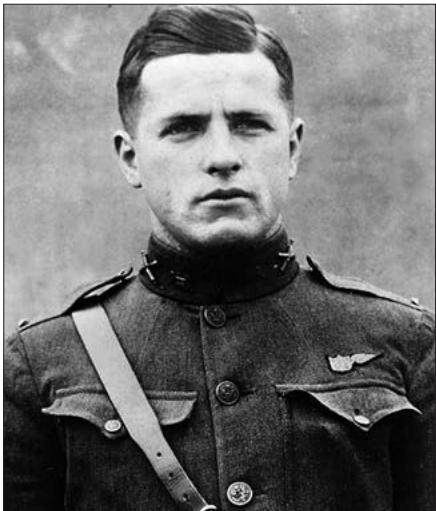  
Erwin Bleckley

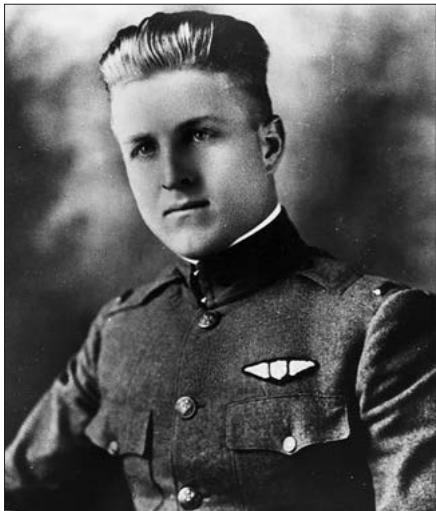  
Frank Luke

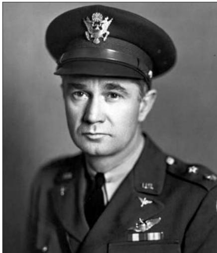

Demas Craw

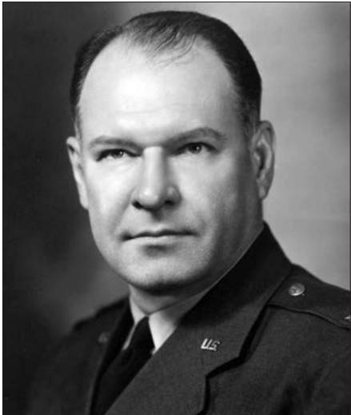  
John Kane

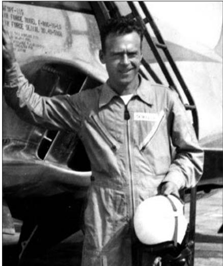  
Louis Sebille

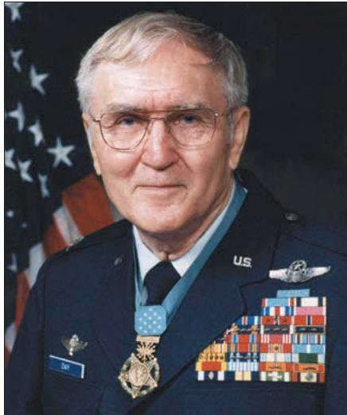  
George Day

<table><tr><td>NAME AND RANK AT TIME OF ACTION</td><td>PLACE OF BIRTH</td><td>DATE OFACTION</td><td>PLACE OF ACTION</td></tr><tr><td>World War II (continued)</td><td></td><td></td><td></td></tr><tr><td>Kane, Col. John R.</td><td>McGregor, Texas</td><td>Aug. 1, 1943</td><td>Ploesti, Romania</td></tr><tr><td>Kearby, Col. Neel E.</td><td>Wichita Falls, Texas</td><td>Oct. 11, 1943</td><td>Wewak, New Guinea</td></tr><tr><td>Kingsley, 2nd Lt. David R.</td><td>Portland, Ore.</td><td>June 23, 1944</td><td>Ploesti, Romania</td></tr><tr><td>Knight, 1st Lt. Raymond L.</td><td>Houston</td><td>April 25, 1945</td><td>Po Valley, taly</td></tr><tr><td>Lawley, 1st Lt. William R. Jr.</td><td>Leeds, Ala.</td><td>Feb. 20, 1944</td><td>Leipzig, Germany</td></tr><tr><td>Lindsey, Capt. Darrell R.</td><td>Jefferson, lowa</td><td>Aug. 9, 1944</td><td>Pontoise, France</td></tr><tr><td>Mathies, Sgt. Archibald</td><td>Scotland</td><td>Feb.20, 1944</td><td>Leipzig, Germany</td></tr><tr><td>Mathis, 1st Lt. Jack W.</td><td>San Angelo, Texas</td><td>March 18, 1943</td><td>Vegesack, Germany</td></tr><tr><td>McGuire, Maj. Thomas B. Jr.</td><td>Ridgewood, N.J.</td><td>Dec. 25-26, 1944</td><td>Luzon, Philippines</td></tr><tr><td>Metzger, 2nd Lt. William E. Jr.</td><td>Lima, Ohio</td><td>Nov. 9, 1944</td><td>Saarbrücken, Germany</td></tr><tr><td>Michael, 1st Lt. Edward S.</td><td>Chicago</td><td>April 11, 1944</td><td>Brunswick, Germany</td></tr><tr><td>Morgan, 2nd Lt. John C.</td><td>Vernon, Texas</td><td>July 28, 1943</td><td>Kiel, Germany</td></tr><tr><td>Pease, Capt. Harl Jr.</td><td>Plymouth, N.H.</td><td>Aug. 7, 1942</td><td>Rabaul, New Britain</td></tr><tr><td>Pucket, 1st Lt. Donald D.</td><td>Longmont, Colo.</td><td>July 9, 1944</td><td>Ploesti, Romania</td></tr><tr><td>Sarnoski, 2nd Lt. Joseph R.</td><td>Simpson, Pa.</td><td>June 16, 1943</td><td>Buka, Solomon Islands</td></tr><tr><td>Shomo, Maj. William A.</td><td>Jeannette, Pa.</td><td>Jan. 11, 1945</td><td>Luzon, Philipines</td></tr><tr><td>Smith, Sgt. Maynard H.</td><td>Caro, Mich.</td><td>May 1, 1943</td><td>Saint-Nazaire, France</td></tr><tr><td>Truemper, 2nd Lt. Walter E.</td><td>Aurora, I.</td><td>Feb. 20, 1944</td><td>Leipzig, Germany</td></tr><tr><td>Vance, Lt. Col. Leon R. Jr.</td><td>Enid, Okla.</td><td>June 5, 1944</td><td>Wimereux, France</td></tr><tr><td>Vosler, TSgt. Forrest L.</td><td>Lyndonville, N.Y.</td><td>Dec. 20, 1943</td><td>Bremen, Germany</td></tr><tr><td>Walker, Brig. Gen. Kenneth N.</td><td>Cerrillos, N.M.</td><td>Jan.5, 1943</td><td>Rabaul, New Britain</td></tr><tr><td>Wilkins, Maj. Raymond H.</td><td>Portsmouth, Va.</td><td>Nov. 2, 1943</td><td>Rabaul, New Britain</td></tr><tr><td>Zeamer, Capt. Jay Jr.</td><td>Carlisle, Pa.</td><td>June 16, 1943</td><td>Buka, Solomon Islands</td></tr></table>

<table><tr><td colspan="4">Korean War</td></tr><tr><td>Davis, Maj. George A. Jr.</td><td>Dublin, Texas</td><td>Feb. 10, 1952</td><td>Sinuiju, Yalu River, North Korea</td></tr><tr><td>Loring, Maj. Charles J. Jr.</td><td>Portland, Maine</td><td>Nov. 22, 1952</td><td>Sniper Ridge, North Korea</td></tr><tr><td>Sebille, Maj. Louis J.</td><td>Harbor Beach, Mich.</td><td>Aug. 5, 1950</td><td>Hamchang, South Korea</td></tr><tr><td>Walmsley, Capt. John S. Jr.</td><td>Baltimore</td><td>Sept. 14, 1951</td><td>Yangdok, North Korea</td></tr></table>

<table><tr><td colspan="4">Vietnam War</td></tr><tr><td>Bennett, Capt. Steven L.</td><td>Palestine, Texas</td><td>June 29, 1972</td><td>Quang Tri, South Vietnam</td></tr><tr><td>Day, Maj. George E.</td><td>Sioux City, lowa</td><td>Aug. 26, 1967-March 14, 1973</td><td>Conspicuous gallantry while POW</td></tr><tr><td>Dethlefsen, Capt. Merlyn H.</td><td>Greenville, lowa</td><td>March 10, 1967</td><td>Thai Nguyen, North Vietnam</td></tr><tr><td>Etchberger, CMSgt. Richard L.</td><td>Hamburg, Pa.</td><td>March 11, 1968</td><td>Phou Pha Thi, Laos</td></tr><tr><td>Fisher, Maj. Bernard F.</td><td>San Bernardino, Calif.</td><td>March 10, 1966</td><td>A Shau Valley, South Vietnam</td></tr><tr><td>Fleming, 1st Lt. James P.*</td><td>Sedalia, Mo.</td><td>Nov. 26, 1968</td><td>Duc Co, S. Vietnam</td></tr><tr><td>Jackson, Lt. Col. Joe M.*</td><td>Newnan, Ga.</td><td>May 12, 1968</td><td>Kham Duc, South Vietnam</td></tr><tr><td>Jones, Col. Wiliam A. IⅢ</td><td>Norfolk, Va.</td><td>Sept. 1, 1968</td><td>Dong Hoi, North Vietnam</td></tr><tr><td>Levitow, A1C John L.</td><td>Hartford, Conn.</td><td>Feb. 24, 1969</td><td>Long Binh, South Vietnam</td></tr><tr><td>Pitsenbarger, A1C Wiliam H.</td><td>Piqua, Ohio</td><td>April 11, 1966</td><td>Cam My, South Vietnam</td></tr><tr><td>Sijan, Capt. Lance P.</td><td>Milwaukee</td><td>Nov. 9, 1967-Jan. 22, 1968</td><td>Conspicuous gallantry while POW</td></tr><tr><td>Thorsness, Maj. Leo K.*</td><td>Walnut Grove, Minn.</td><td>April 19, 1967</td><td>North Vietnam</td></tr><tr><td>Wilbanks, Capt. Hilliard A.</td><td>Cornelia, Ga.</td><td>Feb.24, 1967</td><td>Da Lat, South Vietnam</td></tr><tr><td>Young, Capt. Gerald O.</td><td>Anacortes, Wash.</td><td>Nov. 9, 1967</td><td>Khe Sanh, South Vietnam</td></tr></table>

# World War I

Abernathy, 2nd Lt. Thomas J. Aldrich, 1st Lt. Perry H. Alexander, 1st Lt. Arthur H. Alexander, 1st Lt. Stirling C. Allen, 1st Lt. Gardner P. Andrew, 1st Lt. Flynn L. A. Armstrong, 1st Lt. Rodney M. Arthur, Capt. Dogan H. (2) Atwater, 1st Lt. Benjamin L. Avery, 1st Lt. Walter L. Babcock, 1st Lt. Philip R. Backus, 1st Lt. David H. (2) Badham, 1st Lt. William T. Baer, 1st Lt. Paul F. (2) Bagby, 1st Lt. Ralph B. Bartholf, 1st Lt. Herbert B. Baucom, Capt. Byrne V. (2) Beane, 1st Lt. James D. Beebe, 2nd Lt. David C. Bellows, 2nd Lt. Franklin B. Belzer, 2nd Lt. William E. Benell, 2nd Lt. Otto E. Bernheimer, 1st Lt. Louis G. (2) Biddle, Capt. Charles J. Bissell, 1st Lt. Clayton L. Blake, 1st Lt. Charles R. Bonnalie, 1st Lt. Allan F. Borden, 2nd Lt. Horace L. Bowers, 1st Lt. Lloyd G. Bowman, 2nd Lt. Samuel A. Boyd, 2nd Lt. Theodore E. Breese, 2nd Lt. Clinton S. Brereton, Maj. Lewis H. Brewster, 1st Lt. Hugh Brooks, 2nd Lt. Arthur R. Broomfield, 1st Lt. Hugh D. G. Brotherton, 2nd Lt. William E. Brown, 2nd Lt. Mitchell H. Buckley, 1st Lt. Harold R. (2) Buford, 1st Lt. Edward Jr. Burdick, 2nd Lt. Howard Burger, 2nd Lt. Valentine J. (2) Burns, 2nd Lt. James S. D.

Burt, 1st Lt. Byron T. Jr. Campbell, 1st Lt. Douglas (5) Carroll, 1st Lt. George C. Cassady, 1st Lt. Thomas G. (2) Castleman, 1st Lt. John R. Chambers, 1st Lt. Reed M. (4) Chapman, 2nd Lt. Charles W. Jr. Clapp, 2nd Lt. Kenneth S. Clarke, 1st Lt. Sheldon V. Clay, 1st Lt. Henry R. Coleman, 1st Lt. Wallace A. Conover, 1st Lt. Harvey Cook, Capt. Everett R. Cook, Capt. Harvey W. (2) Coolidge, Capt. Hamilton Cousins, 1st Lt. John W. Creech, 1st Lt. Jesse O. Curtis, 1st Lt. Edward P. Cutter, 1st Lt. Edward B. Dawson, 1st Lt. Leo H. (2) De Castro, 2nd Lt. Ralph E. Diekema, 1st Lt. Willis A. Dillon, 1st Lt. Raymond P. D’Olive, 1st Lt. Charles R. Donaldson, 2nd Lt. John O. Douglass, Capt. Kingman Dowd, 2nd Lt. Meredith L. Drew, 1st Lt. Charles W. Duckstein, 1st Lt. Arthur W. Easterbrook, 1st Lt. Arthur E. (2) Eaton, 1st Lt. Warren E. Elliott, 1st Lt. Robert P. Erwin, 1st Lt. William P. (2) Este, 1st Lt. J. Dickinson Farnsworth, 1st Lt. Thomas H. Ferrenbach, 1st Lt. Leo Fisher, Capt. George F. Fleeson, 2nd Lt. Howard T. (2) Follette, 1st Lt. Justin P. Fontaine, 1st Lt. Hugh L. (2) Ford, Capt. Christopher W. Frank, 1st Lt. William F. Frost, 1st Lt. John Furlow, 1st Lt. George W. (2) Gaylord, 1st Lt. Bradley J.

  
Frank Hunter

George, 1st Lt. Harold H.   
Giroux, 1st Lt. Ernest A.   
Goldthwaite, 1st Lt. George E.   
Grant, 1st Lt. Alfred A.   
Graveline, Sfc. Fred C.   
Greist, 1st Lt. Edwards H.   
Grey, Capt. Charles G.   
Gundelach, 1st Lt. Andre H.   
Guthrie, 1st Lt. Murray K. (3) Hall, Capt. James N.   
Hambleton, 1st Lt. John A. (2) Hamilton, 1st Lt. Lloyd A.   
Hammond, 1st Lt. Leonard C.   
Hart, 2nd Lt. Percival G.   
Hartney, Maj. Harold E.   
Harwood, 1st Lt. Benjamin P.   
Haslett, Capt. Elmer R.   
Hays, 2nd Lt. Frank K.   
Healy, 1st Lt. James A.   
Henderson, 1st Lt. Phil A.   
Herbert, 1st Lt. Thomas J.   
Higgs, 1st Lt. James A. Jr.   
Hill, Capt. Maury Hill, 1st Lt. Raymond C.   
Hitchcock, 2nd Lt. Roger W.   
Holden, 1st Lt. Kenneth H.   
Holden, 1st Lt. Lansing C. Jr. (2) Holland, 1st Lt. Spessard L.   
Hoover, 1st Lt. William J.   
Hopkins, 2nd Lt. Stephen T.   
Hudson, 1st Lt. Donald Hunter, 1st Lt. Frank O’D. (5) Irving, 1st Lt. Livingston G.   
Jeffers, 1st Lt. John N.   
Jervey, 1st Lt. Thomas M.   
Jones, 2nd Lt. Arthur H.   
Jones, 2nd Lt. Clinton (2) Jordan, 2nd Lt. John W.   
Kahle, 1st Lt. Clarence C.   
Kaye, 1st Lt. Samuel Jr. (2) Keating, 1st Lt. James A.   
Kelty, 1st Lt. Asher E.   
Kenney, 1st Lt. George C.   
Kindley, 1st Lt. Field E. (2) Kinney, 1st Lt. Clair A.   
Kinsley, 2nd Lt. Wilbert E.   
Knotts, 2nd Lt. Howard C.   
Knowles, 1st Lt. James Jr.   
Lake, 2nd Lt. Horace A.   
Lambert, 1st Lt. John H.   
Landis, Capt. Reed G.   
Larner, 1st Lt. Gorman D. (2) Lawson, Capt. Walter R.   
Lee, 2nd Lt. John B.   
Lindsay, 1st Lt. Robert O.   
Littauer, Maj. Kenneth P.   
Llewellyn, Capt. Frank A.   
Lowry, 2nd Lt. Francis B.   
Luke, 2nd Lt. Frank Jr. (2) MacArthur, 2nd Lt. John K.   
MacBrayne, 1st Lt. Winfred C.   
Manning, 1st Lt. James F. Jr.   
Maughan, 1st Lt. Russell L.   
McClendon, 1st Lt. Joel H.   
McDermott, 2nd Lt. Cleveland W.   
McDevitt, 1st Lt. James A.   
McDougall, 1st Lt. Harry O. McKay, 1st Lt. James R.   
McMurry, 1st Lt. Ora R. (2)   
Meissner, 1st Lt. James A. (2)   
Mell, 1st Lt. Patrick H.   
Michener, 1st Lt. John H.   
Mitchell, Capt. John   
Mitchell, Brig. Gen. William   
Moore, 1st Lt. Edward R.   
Morris, 2nd Lt. Edward M.   
Morse, 2nd Lt. Guy E.   
Myers, 1st Lt. Oscar B.   
Neel, 2nd Lt. Roland H.   
Neibling, 1st Lt. Harlow P.   
Neidecker, 1st Lt. Bertrande C. Nichols, Sfc. Harold O.   
Nixon, 1st Lt. George R.   
Norris, 2nd Lt. Sigbert A. G.   
Norton, 1st Lt. Fred W.   
Noyes, Capt. Stephen H.   
Nutt, 1st Lt. Alan   
O’Donnell, 2nd Lt. Paul J.   
O’Neill, 1st Lt. Ralph A. (3)   
Orr, 1st Lt. Edward   
Page, Capt. Richard C. M.   
Palmer, 2nd Lt. Joseph A.   
Palmer, 1st Lt. William W.   
Paradise, 1st Lt. Robert C.   
Patterson, 1st Lt. Alfred B. Jr. (2) Payne, 1st Lt. Karl C.   
Pegues, 1st Lt. Josiah J.   
Pendell, 1st Lt. Elmer   
Peterson, Capt. David M. (2)   
Petree, 1st Lt. Harris E.   
Phelps, 1st Lt. Glenn   
Phillips, 1st Lt. George R.   
Plummer, 2nd Lt. Charles W.   
Plush, 1st Lt. Lewis C.   
Polley, 1st Lt. Britton   
Ponder, 1st Lt. William T.   
Porter, 2nd Lt. Charles P. (2)   
Porter, 2nd Lt. Earl W.   
Porter, 2nd Lt. Kenneth L.   
Potter, 1st Lt. William C.   
Preston, 2nd Lt. Glen A. (3)   
Putnam, 1st Lt. David E.   
Pyne, 1st Lt. Percy R.   
Quinn, 1st Lt. John J.   
Raible, 1st Lt. Joseph C. Jr.   
Ralston, 1st Lt. Orville A.   
Rancourt, 1st Lt. John I.   
Rath, 2nd Lt. Howard G.   
Raymond, 1st Lt. Robert F.   
Reeves, 1st Lt. Dache M.   
Reynolds, Capt. Clearton H.   
Reynolds, Maj. John N. (2)   
Richardson, 2nd Lt. James M.   
Rickenbacker, Capt. Edward V. (7) Rooney, 1st Lt. Paul N. A.   
Rorison, 1st Lt. Harmon C.   
Ross, 1st Lt. Cleo J.   
Rucker, 1st Lt. Edward W.   
Rummell, 1st Lt. Leslie J.   
Saunders, Capt. William H. Schenck, 1st Lt. Alexander P.   
Schoen, 1st Lt. Karl J.   
Seaver, 1st Lt. Arthur F.   
Sellers, 1st Lt. Cecil G.   
Sewall, 1st Lt. Sumner (2) Shelby, 1st Lt. Richard D.   
Simon, 1st Lt. Louis C. Jr. (2) Snyder, 1st Lt. John H.   
Spaatz, Maj. Carl A.   
Springs, 1st Lt. Elliott W.   
Steele, 2nd Lt. Richard W.   
Stenseth, 1st Lt. Martinus Stevens, 2nd Lt. John H.   
Stokes, 1st Lt. John Y. Jr.   
Stout, 1st Lt. Penrose V.   
Stovall, 1st Lt. William H.   
Strahm, Maj. Victor H.   
Suiter, 1st Lt. Wilbur C.   
Swaab, 1st Lt. Jacques M.   
Taylor, 1st Lt. William H. Jr.   
Taylor, 1st Lt. W. J. R.   
Ten Eyck, 2nd Lt. Walton B. Jr.   
Thaw, Maj. William (2) Thomas, 2nd Lt. Gerald P.   
Thompson, 2nd Lt. Robert E.   
Tillman, 2nd Lt. Fred A.   
Tittman, 1st Lt. Harold H.   
Tobin, 1st Lt. Edgar G.   
Treadwell, 1st Lt. Alvin H.   
Vail, 1st Lt. William H.   
Vaughn, 1st Lt. George A.   
Vernam, 1st Lt. Remington D.   
Wallis, Capt. James E. Jr.   
Waring, 1st Lt. William W.   
Warner, 1st Lt. Donald D.   
Way, 2nd Lt. Pennington H.   
Wehner, 1st Lt. Joseph F. (2) White, 2nd Lt. Wilbert W. (2) Williams, 1st Lt. Bertram Winslow, 2nd Lt. Alan F.   
Wright, 1st Lt. Burdette S.   
Wright, 1st Lt. Chester E. (2) Wyly, 1st Lt. Lawrence T.

# World War II

Able, Sgt. Johnnie J. Jr.   
Adams, 1st Lt. Jack Adams, Maj. Robert H.   
Adkins, 2nd Lt. Frank E.   
Alexander, 1st Lt. John A.   
Alison, Maj. John R.   
Allen, Lt. Col. Brooke E.   
Allen, Lt. Col. Keith N.   
Alsip, Cpl. Raymond H.   
Ambrose, 1st Lt. Talmadge L.   
Anderson, 2nd Lt. Bernard E.   
Anderson, Lt. Col. Bernard L.   
Anderson, 1st Lt. Marshall J.   
Anderson, 1st Lt. Richard H.   
Anderson, 2nd Lt. Sheldon K.   
Anderson, 1st Lt. Sherman E.   
Anderson, Maj. William N.   
Anderson, Cpl. William T.   
Andres, Capt. Arthur E.   
Appold, Maj. Norman C.   
Armsby, 2nd Lt. Sherman Armstrong, Brig. Gen. Frank A. Jr.   
Arnold, Pfc. Altus L.   
Arooth, SSgt. Michael Aschenbrener, Capt. Robert W.   
Ashley, Pfc. Earl D.   
Atkinson, Col. Gwen G.   
Atkinson, Capt. Paul G.   
Avery, 1st Lt. Lloyd Bade, 2nd Lt. Jack A.   
Bail, 1st Lt. Bernard W.   
Bakalar, 1st Lt. John E.   
Bankey, Capt. Ernest E. Jr.   
Banks, 2nd Lt. Arthur E.   
Barbiero, TSgt. Samuel S.   
Barbosa, Cpl. Vicente R.   
Barnicle, 2nd Lt. Gerald J.   
Barrall, 1st Lt. Robert W.   
Battaglia, SSgt. Salvatore Battalio, 1st Lt. Samuel T.   
Beam, Maj. James C. Beam, 1st Lt. Ralph E.   
Beck, 1st Lt. Joseph A. Jr.   
Beckham, Capt. Walter C.   
Beerbower, Maj. Don M.   
Beeson, Capt. Duane W.   
Beeson, 2nd Lt. Frank H.   
Bell, 1st Lt. Robert D.   
Bengel, TSgt. George H.   
Benn, Maj. William G.   
Benson, 1st Lt. Marion A.   
Berryman, 1st Lt. Richard C.   
Bevlock, 2nd Lt. James J.   
Billingsley, Capt. Leonard F.   
Blakeslee, Col. Donald J. M. (2) Bleyer, Lt. Col. Julian M.   
Blickenstaff, Lt. Col. Wayne K.   
Blissard, 2nd Lt. Grover C.   
Blumer, Capt. Laurence E.   
Boelens, 1st Lt. Leo A.   
Boggs, Capt. Hampton E.   
Bolefahr, Capt. Wayne N.   
Bong, 1st Lt. Richard I.   
Booth, Capt. Charles H. Jr.   
Bostrom, Capt. Frank P.   
Boudreaux, TSgt. Marcus A.   
Boyd, Maj. Charles K.   
Boyle, 1st Lt. Francis M.   
Bradley, Maj. Jack T.   
Brandon, Maj. William H.   
Breeding, 1st Lt. Paul R.   
Brereton, Lt. Gen. Lewis H.   
Bright, SSgt. James C. Jr.   
Brill, 1st Lt. Allen Britton, 2nd Lt. John T.   
Brooks, Lt. Col. John A. III Brown, Sgt. Albert C.   
Brown, Sgt. David W.   
Brown, Maj. George S.   
Brown, 2nd Lt. Henry W.   
Brown, Maj. Samuel J.   
Brown, SSgt. Walter I.   
Brueland, Capt. Lowell K.   
Bryan, Capt. Donald S.   
Buck, Lt. Col. William E. Jr.   
Burdue, SSgt. Clayton C.   
Burleson, 1st Lt. Robert B.   
Burney, 2nd Lt. Willis W.

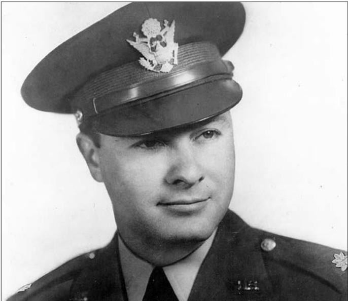  
Horace Carswell

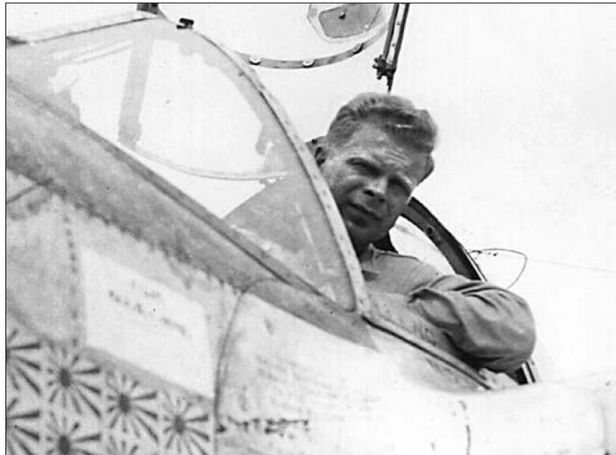

# Richard Bong

Burns, Sgt. Wilbert R.   
Caldwell, Capt. Kenneth M.   
Caldwell, 2nd Lt. Wilma T. Jr.   
Cameron, Capt. William R.   
Campbell, 1st Lt. David A.   
Cannon, SSgt. James L.   
Carmichael, Col. Richard H. (2) Carpenter, 1st Lt. Reginald L.   
Carr, 1st Lt. Bruce W.   
Carrington, TSgt. John R.   
Carruth, 1st Lt. Thomas A.   
Carswell, Capt. Horace S. Jr.   
Catallo, SSgt. Albert L.   
Caton, SSgt. Edward H.   
Ceuleers, Maj. George F.   
Christensen, 1st Lt. Harold R.   
Christianson, 1st Lt. Franklin O.   
Christopher, 2nd Lt. Guyton M.   
Church, 1st Lt. Russell M.   
Clark, 2nd Lt. Phillip R.   
Clary, SSgt. Guy W.   
Classen, Capt. Thomas J.   
Cleven, Maj. Gale W.   
Cobb, Capt. James B.   
Cockriel, Sgt. James R.   
Coleman, Capt. Carlyle Coleman, Capt. William F.   
Collett, SSgt. Howard G.   
Collins, Capt. James F.   
Coltharp, Maj. Chester A.   
Compton, Col. Keith K.   
Conger, Capt. Paul A.   
Connick, 2nd Lt. Arden D.   
Corl, TSgt. George P.   
Corsetti, 1st Lt. John Cox, 1st Lt. Leonard L.   
Cox, Capt. Ray L.   
Cragg, Maj. Edward Crandall, SSgt. Donald O.   
Crenshaw, Capt. Claude J.   
Crimmins, 1st Lt. Fred T. Jr.   
Crosbie, 1st Lt. Maurice G.   
Cullerton, 1st Lt. William J.   
Curtis, Capt. Robert C.   
Czechowski, Sgt. Chester M.   
Dadson, SSgt. Pat J.   
Dahlberg, Capt. Kenneth H. Dale, 2nd Lt. Jack D.   
Dallas, Capt. Frederick W. Jr.   
Dalton, SSgt. Malcolm C.   
Daniell, 1st Lt. J. S.   
Danver, SSgt. Edison K.   
Davies, Lt. Col. James H.   
Davis, Capt. Clayton E.   
Davis, 1st Sgt. Robert R.   
Davis, 1st Lt. Robert T.   
Dawkins, 2nd Lt. Cecil H.   
Deal, 2nd Lt. James F.   
Decker, SSgt. Richard C.   
DeGenaro, 2nd Lt. August V.   
Dello-Buono, 2nd Lt. Thomas J.   
Dent, Capt. Elliott E. Jr.   
Diehl, Capt. John H. Jr. (2) Dillman, TSgt. Forrest E.   
Dinn, 1st Lt. Wallace S.   
Dixon, Capt. Robert J.   
Doherty, Maj. William K.   
Dolk, 1st Lt. Carl E.   
Donaldson, 2nd Lt. I. B. Jack Donegan, 1st Lt. John M.   
Dorwart, 1st Lt. Robert J.   
Douglas, Lt. Col. Paul P. Jr. (2) Dregne, Col. Irwin H.   
Drier, Capt. William C.   
Dubisher, Capt. Francis E.   
Dufrane, 1st Lt. John L. Jr.   
Dunagan, 1st Lt. Sidney W.   
Dunaway, 1st Lt. John S.   
Duncan, 2nd Lt. Daniel D.   
Duncan, Maj. Glen E.   
Dunham, Maj. William D.   
Dunn, 1st Lt. Edward B.   
Dunn, Sgt. Jack D.   
Dunn, Capt. John A.   
Durand, 2nd Lt. Edward D.   
Durand, SSgt. Frederick W.   
Duval, 1st Lt. Jessie B.   
Dyer, 1st Lt. Fred W.   
Dyess, Maj. William E. (2) Eagleston, Capt. Glen T.   
Eareckson, Col. William O.   
Eaton, Lt. Col. Frederick C. Jr.   
Eckrich, 2nd Lt. James F.   
Edeburn, F.O. Harry E.   
Elam, Maj. Daniel F.   
Ellis, 1st Lt. Lewis N.   
Ellis, Lt. Col. Richard H.   
Embree, SSgt. Hoy D.   
Emerson, 2nd Lt. Elwood R.   
Emmer, Capt. Wallace N.   
Endres, Pvt. Robert J.   
Engel, 2nd Lt. Russel W.   
England, 2nd Lt. George H.   
Ent, Brig. Gen. Uzal G.   
Erickson, 2nd Lt. Irving A.   
Evans, Capt. John G.   
Exon, Maj. Arthur E.   
Faires, SSgt. George D.   
Falletta, 2nd Lt. Charlie Fegan, SSgt. Robert W.   
Ferguson, 1st Lt. William H. Jr.   
Fields, Maj. Virgil C. Jr. Fletcher, 1st Lt. Leo C.   
Forrest, Brig. Gen. Nathan B.   
Forti, SSgt. Joseph J.   
Fowler, Lt. Col. Gordon W.   
Fox, TSgt. Edward K.   
Fox, 1st Lt. Joseph M.   
Frazier, SSgt. James L.   
French, TSgt. Clifford E.   
Fridge, Maj. Benjamin W.   
Fries, Cpl. Robert A.   
Fry, Capt. Robert M.   
Fulmer, 2nd Lt. Edward S.   
Gabreski, Maj. Francis S.   
Gallagher, 1st Lt. Robert J.   
Galloway, TSgt. Paul E.   
Gambonini, 2nd Lt. Paul B.   
Garris, 2nd Lt. Benjamin L.   
Garry, 1st Lt. William J.   
Gatterdam, Maj. Richard P.   
Gause, 1st Lt. Damon J.   
Gautier, Capt. George J.   
Gay, Capt. William M.   
Geiser, Capt. Anthony W.   
Gentile, Capt. Dominic S. (2) Gerrits, 2nd Lt. James F.   
Gettys, SSgt. Richard O.   
Gibbs, Maj. David R.   
Gibson, 1st Lt. Balfour C.   
Gies, 2nd Lt. Carl P.   
Gilliland, Capt. Leown A.   
Gilpin, 2nd Lt. John A.   
Glades, TSgt. Harry V.   
Glass, Capt. Walter L. Jr.   
Glober, Maj. George E.   
Glover, 2nd Lt. John G.   
Gogoj, SSgt. John J.   
Goldberg, 2nd Lt. Hyman M.   
Gooden, 1st Lt. Clarence W.   
Goodson, Maj. James A.   
Gowder, 2nd Lt. Charles F.   
Gozar, 3rd Lt. Jose P.\* Grashio, 2nd Lt. Samuel C.   
Gray, Maj. Leon W.   
Green, Maj. Herschel H.   
Greene, 1st Lt. George B. Jr.   
Grundmann, 1st Lt. Hugh S.   
Guilfoil, SSgt. William K.   
Haberle, 2nd Lt. Frank J.   
Hageman, 1st Lt. Earl L. Jr.   
Hagerstrom, 1st Lt. James P.   
Hahn, Maj. Delbert H.   
Hall, Lt. Col. Donald P. (2) Hall, 2nd Lt. Jack W.   
Hambleton, Capt. Roscoe L.   
Haning, 1st Lt. William F. Jr.   
Hanson, 1st Lt. Robert T.   
Hantman, 1st Lt. Sidney Hardison, Maj. Felix M.   
Hargis, 2nd Lt. William D. Jr.   
Harriger, 1st Lt. Robert L.   
Harrington, 1st Lt. Archibald A Harris, TSgt. Arizona T.   
Harrison, SSgt. Edgar E.   
Harrison, SSgt. James A.   
Hascall, TSgt. Alva S.   
Hasek, 1st Lt. Ivan S. Jr.   
Hass, 1st Lt. Floyd N. Hedlund, Maj. Earl C.   
Heidger, Maj. Luther C.   
Helder, 2nd Lt. Ronald L.   
Heller, 1st Lt. Edwin L.   
Helmick, 1st Lt. Frederick E.   
Helmick, Capt. George H.   
Henderson, Cpl. Ivan W.   
Hendricks, Maj. Randall W.   
Henebry, Maj. John P.   
Henry, TSgt. Maurice V.   
Herlevic, TSgt. Frank A.   
Herres, F.O. Francis E.   
Herriott, 2nd Lt. Harold T.   
Herron, 1st Lt. Christian I.   
Herron, 1st Lt. Edwin R.   
Hicks, F.O. Paul L.   
Hill, Maj. David L.   
Hill, Maj. James E.   
Hill, Capt. Robert J.   
Hillebrand, 1st Lt. Mahlon A.   
Hillsinger, Lt. Col. Loren B.   
Hinze, Capt. Frederick S. Jr.   
Hipps, Maj. William G.   
Hively, Capt. Howard D.   
Hoag, 2nd Lt. Carl L. Jr.   
Hodge, Maj. Dexter L.   
Hodges, 1st Lt. Charles W.   
Hoenshell, 1st Lt. Carl C.   
Hoevet, Maj. Dean C.   
Hoff, SSgt. Thomas A.   
Holbury, Capt. Robert J.   
Holliday, Cpl. Robert L.   
Holmes, Capt. Walter T.   
Holsberg, 2nd Lt. Wilfred G.   
Holub, TSgt. Anthony Homer, Capt. Cyril F.   
Hoover, Maj. John R.   
Horton, 1st Lt. Robert W.   
House, 2nd Lt. A. T.   
Hovde, Maj. William J.   
Howat, 2nd Lt. Kenneth W.   
Howell, 1st Lt. John J.   
Hubbard, Capt. Ronald D.   
Hudson, 2nd Lt. Charles S.   
Huffstickler, Sgt. Benjamin F.   
Hughes, 2nd Lt. Charles W.   
Hull, 2nd Lt. Charles T.   
Hull, 2nd Lt. Jack T.   
Hunt, Capt. Raymond C. Jr.   
Ingelido, Lt. Col. Michael J.   
Inman, SSgt. Harold R.   
Irons, MSgt. John P.   
Jackson, 1st Lt. Roland B.   
James, SSgt. Joseph H. Jr.   
Jamison, 1st Lt. Roger W.   
Jernigan, Capt. William D. J. Jr.   
Jewell, 1st Lt. Kenneth G.   
Johnson, Capt. Albert L.   
Johnson, Maj. Gerald R. (2) Johnson, Capt. Gerald W.   
Johnson, Capt. Robert S.   
Johnson, 2nd Lt. Russell H.   
Johnson, SSgt. Theron E.   
Johnson, SSgt. Thomas E.   
Johnson, 1st Lt. William H.   
Johnston, Maj. Robert D.

# RANK ABBREVIATIONS

Cpl.: Corporal   
F.O.: Flight Officer   
Pfc.: Private First Class   
Pvt.: Private   
Sfc.: Sergeant First Class   
Sgt.: Sergeant Johnston, 1st Lt. Ruby E.   
Jolly, 1st Lt. Hoyt A. Jr.   
Jones, 1st Lt. Charles T.   
Jones, 1st Lt. Cyril W. Jr.   
Jones, 1st Lt. William Jr.   
Joyce, Cpl. John D.   
Juchheim, 1st Lt. Alwin M.   
Judy, 2nd Lt. James D.   
Kase, TSgt. Louis N.   
Kaufman, Sgt. Robert P.   
Keator, 2nd Lt. Randall Keen, 2nd Lt. Robert J.   
Kegelman, Capt. Charles C.   
Kehoe, 1st Lt. John W.   
Kelly, TSgt. Arthur G.   
Kelly, Capt. Colin P. Jr.   
Kemp, 1st Lt. William T.   
Kendrick, TSgt. George E.   
Kenney, Lt. Gen. George C.   
Keogh, Maj. Bernard M.   
Kerr, 1st Lt. William M.   
Key, Maj. Algene E.   
Kimmey, SSgt. Doyle Kinnard, Lt. Col. Claiborne H. Jr.   
Kiser, 1st Lt. George E.   
Kjosness, 2nd Lt. Gustav D.   
Klepinger, 2nd Lt. Nolan W.   
Klette, Lt. Col. Immanuel Knickerbocker, 2nd Lt. Malcolm M.   
Koenig, 1st Lt. Charles W.   
Koon, Col. Ralph E.   
Kosters, TSgt. Allen Kovacik, TSgt. Steve H.   
Kramer, 1st Lt. Vernon J.   
Krause, Maj. John E.   
Krug, 2nd Lt. Richard M.   
Kunkle, 2nd Lt. James K.   
Lackness, 1st Lt. Berdines Ladisic, SSgt. Peter Lael, 1st Lt. Francis V.   
LaFleur, 1st Lt. Joseph V.   
Lambert, SSgt. James V.   
Land, 2nd Lt. George R.   
Landry, 2nd Lt. Larry D. Jr.   
Lannon, TSgt. Louis A.   
Larson, 1st Lt. Harold B.   
Latham, Capt. John L. Jr.   
Lauraine, 1st Lt. Loye J.   
Laven, 1st Lt. George Jr.   
Ledford, Capt. Jack C.   
LeMay, Col. Curtis E.   
Leverette, Maj. William L.   
Levi, 1st Lt. Nelson Liimatainen, Sgt. Alvar A.   
Lillis, Cpl. Joseph D.   
Lines, 1st Lt. Ted E.

For other ranks, see USAF Grades and Insignia.

Lipscomb, 1st Lt. Paul M.   
Littge, Capt. Raymond H.   
Litton, Lt. Col. William P.   
Loegering, Sgt. Weston A.   
Lohmeyer, 2nd Lt. Marvin E.   
London, Capt. Charles P.   
Lonsway, SSgt. Louis G.   
LoPresti, TSgt. Nicholas O.   
Lowery, Capt. Herman F.   
Lowry, 1st Lt. Allan W.   
Ludolph, 1st Lt. George L.   
Ludwig, 1st Lt. Vance P.   
Luksic, 1st Lt. Carl J.   
Lyle, Lt. Col. Lewis E.   
Lynch, Capt. Thomas J.   
MacDonald, Col. Charles H. (2) Magoffin, Col. Morton D.   
Mahoney, SSgt. John F.   
Mahony, 1st Lt. Grant M.   
Mahurin, Capt. Walker M.   
Manders, Capt. John H.   
Marett, 1st Lt. Samuel H.   
Marpe, 1st Lt. Frank C. Jr.   
Marshall, Capt. Lyndon O.   
Martin, SSgt. Ernest V.   
Martin, 1st Lt. John C.   
Martin, Col. Kenneth R.   
Martinson, SSgt. Meynard L.   
Mason, Col. Joe L.   
Matchitt, Pvt. Ray J.   
Matson, SSgt. Rex E.   
Matte, 1st Lt. Joseph Z.   
Matthews, Pfc. John E.   
Mayes, 1st Lt. Herbert C.   
McArthur, 1st Lt. Paul G.   
McCabe, 2nd Lt. Ernest J.   
McCall, 2nd Lt. Ben J.   
McCallister, 2nd Lt. Garrett H.   
McCallum, 1st Lt. Gerald McCormick, Capt. John B.   
McCullar, Maj. Kenneth D.   
McCurdy, TSgt. Jimmy E.   
McDaniel, 1st Lt. Gordon H.   
McElroy, Pfc. Joseph G.   
McFarland, 1st Lt. Kenton D.   
McGrath, SSgt. Thomas J.   
McGuire, Maj. Thomas B. Jr.   
McHenry, 2nd Lt. William S.   
McLaughlin, 1st Lt. Frank B.   
McLoughlin, 2nd Lt. John A.   
McLeod, Sgt. Stanley A.   
McMahan, 1st Lt. Darrell E.   
McMahon, 2nd Lt. Robert F.   
McNees, Capt. Richard A.   
McNeese, 1st Lt. Harold G.   
Meals, Capt. Elbert O.   
Megura, 1st Lt. Nicholas Melo, Cpl. Frank L. Jr.   
Merkel, Capt. Howard W.   
Merrill, 1st Lt. John O.   
Meyer, Lt. Col. John C. (3) Middlebrook, Capt. Garrett E.   
Middleditch, 1st Lt. Lyman Jr.   
Miles, Capt. James E.   
Miller, 2nd Lt. Guy M.   
Miller, Capt. Robert E.   
Millikan, 1st Lt. Willard W.   
Milton, Lt. Col. Theodore R. Mitchell, Capt. John W.   
Mix, TSgt. Joseph E.   
Moats, 1st Lt. Sanford K.   
Mohler, TSgt. William A.   
Mohon, Sgt. Ernest M. Jr.   
Molina, Capt. Pedro Q.   
Momyer, Col. William W.   
Monkton, Capt. Lyle Montgomery, Lt. Col. Robert P.   
Mooney, Capt. Robert C.   
Moore, Sgt. Carl W.   
Moore, 1st Lt. Clarence J.   
Moore, 1st Lt. Joseph H.   
Moore, 1st Lt. Pren L.   
Moore, 2nd Lt. William W.   
Moran, 1st Lt. Harold D.   
Morehead, 2nd Lt. James B.   
Morgan, Maj. Marion W.   
Morris, Capt. James M.   
Morrissey, Capt. Robert L.   
Moses, 2nd Lt. John H.   
Moullen, 2nd Lt. Roy F.   
Moye, 2nd Lt. Albert J.   
Muckley, 2nd Lt. Dwight S.   
Mueller, 1st Lt. Alvin J.   
Muir, 2nd Lt. Marvin F.   
Mulligan, Sgt. Charles D.   
Munsey, 1st Lt. James S.   
Muri, 1st Lt. James P.   
Murphy, Cpl. Philip J.   
Myers, Capt. Joseph Negley, 1st Lt. Richard V. W. Jr.   
Nepil, SSgt. Slavomir Nielsen, Capt. Leland C.   
Noell, 1st Lt. Robert E.   
Norton, 1st Lt. Charles E.   
Nuchols, 2nd Lt. William L.   
O’Brien, Maj. Kenneth J.   
O’Connor, Maj. Frank Q.   
Oestreicher, 2nd Lt. Robert G.   
Oettel, Sgt. Fred W.   
Old, Col. Archie J.   
Oldham, Capt. Richard G.   
O’Leary, SSgt. Eugene B.   
Olson, 1st Lt. Henry L.   
O’Neal, TSgt. James A.   
O’Neill, Lt. Col. Brian O’Neill, 1st Lt. Lawrence F.   
O’Rourke, 1st Lt. Edward J.   
Orr, Capt. William F.   
Owen, Sgt. Albert E.   
Owens, 1st Lt. Marion P.   
Paisley, 2nd Lt. Melvyn R.   
Partridge, SSgt. Donald D.   
Patrick, SSgt. Augustus R. Jr.   
Pawloswski, Capt. Edward J.   
Pear, 2nd Lt. Sidney A.   
Pearson, 1st Lt. John M.   
Pederson, 2nd Lt. Harold L.   
Pell, Maj. Floyd J.   
Perdomo, 1st Lt. Oscar F.   
Peres, 2nd Lt. Jack R.   
Perry, 2nd Lt. Elton S.   
Peters, 1st Lt. Robert O.   
Petersen, SSgt. Jacob Peterson, Lt. Col. Chesley G.   
Petty, 2nd Lt. Charles A.   
Phillips, TSgt. Claude B. Phillips, TSgt. Hubert E.   
Phillips, Capt. Reginald H.   
Pickard, Maj. John G.   
Pierce, 1st Lt. Sammy A.   
Pittman, 1st Lt. Charles K.   
Ploetz, 1st Lt. Frederick F.   
Polifka, Lt. Col. Karl L.   
Poore, 1st Lt. Wesley A.   
Posey, Lt. Col. James T.   
Post, Capt. Arthur L.   
Potter, SSgt. A. J.   
Potts, Maj. Ramsey D. Jr.   
Preddy, Maj. George E.   
Price, 1st Lt. Herbert M.   
Price, 1st Lt. Raymond E.   
Priest, 2nd Lt. Royce W.   
Prince, 1st Lt. George A.   
Prince, TSgt. William H.   
Pugh, Sgt. Herbert W.   
Putnam, Capt. Walter B.   
Radtke, 1st Lt. Dean M.   
Rahner, 2nd Lt. Raymond M.   
Rairigh, 1st Lt. John E.   
Ramey, 1st Lt. Gordon A.   
Ramey, Brig. Gen. Howard K.   
Ramey, Col. Roger M.   
Randerson, Maj. Luther W.   
Rankin, 1st Lt. Robert J.   
Rau, 1st Lt. Oscar J.   
Rauschkolb, 1st Lt. Frank Ray, 2nd Lt. Charles P.   
Ray, 1st Lt. John W.   
Reams, 1st Lt. Luther S.   
Reeder, 1st Lt. Sumner H.   
Reeves, TSgt. Charles T.   
Rice, 2nd Lt. Burt H.   
Richards, 2nd Lt. Conrad B.   
Ridolfi, SSgt. Peter J.   
Righetti, Col. Elwyn G.   
Rist, 2nd Lt. Robert P.   
Ritchey, 1st Lt. Andrew J.   
Robbins, 1st Lt. Jay T. (2) Roberts, Capt. Daniel T.   
Roberts, Maj. Eugene P.   
Robinson, Lt. Col. Stanley K.   
Roche, Capt. John R.   
Rogers, Lt. Col. Arthur H.   
Rogers, 2nd Lt. Robert J. Roller, SSgt. John R.   
Rorer, 1st Lt. George A. Jr.   
Rose, 1st Lt. Dudley E.   
Rose, 2nd Lt. Henry J.   
Rosenthal, Maj. Robert Royce, Brig. Gen. Ralph Ruegg, 1st Lt. Robert G.   
Sacks, 2nd Lt. Seymour Sanford, Sgt. James T.   
Sanford, Capt. William L.   
Sans, SSgt. Charles H.   
Saunders, SSgt. Lester W.   
Schellin, SSgt. Roy L.   
Schild, 1st Lt. William C.   
Schilling, Lt. Col. David C. (2) Schiltz, 1st Lt. Glenn D. Jr.   
Scholz, 1st Lt. Richard J.   
Schreiber, Capt. Leroy A.   
Schulman, 2nd Lt. Herbert E.   
Schuman, 2nd Lt. John P.   
Sconiers, 2nd Lt. Ewart T.   
Seaman, 1st Lt. Theodore L.   
Seith, Capt. Louis T.   
Seitz, Cpl. Bernard C.   
Sellers, 2nd Lt. Thomas D.   
Sewart, Maj. Allan J. Jr.   
Shaw, Capt. William S.   
Shelton, 2nd Lt. Stephen C.   
Shingler, Maj. Herbert I.   
Shirey, SSgt. Harry R.   
Shubin, 1st Lt. Murray J.   
Silva, MSgt. Louis T.   
Simeral, Maj. George A.   
Sims, 2nd Lt. Tommie J.   
Skinner, TSgt. William E.   
Slade, 1st Lt. Richard J.   
Slessor, 2nd Lt. Lee D.   
Smart, Col. Jacob E.   
Smith, 1st Lt. Donovan F.   
Smith, SSgt. Edmond H.   
Smith, Maj. George A.   
Smith, 2nd Lt. Harry W.   
Smith, Sgt. Jack E.   
Smith, 1st Lt. James R.   
Smith, SSgt. Mack H.   
Smith, 1st Lt. Stephen M.   
Snyder, TSgt. Donald L.   
Spencer, 2nd Lt. Charles W. Spencer, 2nd Lt. Dale F.   
Sprague, Lt. Col. Charles A.   
Stach, Maj. Paul J.   
Starczweski, 1st Lt. Phillip R.   
Starks, 2nd Lt. Richard F.   
Steele, 1st Lt. Henry P.   
Steen, SSgt. Zerrill J.   
Steffy, 1st Lt. Robert F.   
Stewart, Maj. James C.   
Stewart, 1st Lt. Walter T.   
Stipe, Sgt. Leon D.   
Stireman, SSgt. John O.   
Storovich, SSgt. Robert D.   
Strand, 1st Lt. Robert E.   
Strasburger, 1st Lt. Alvin Stricker, 1st Lt. Thomas A.   
Strickland, 1st Lt. Robert F.   
Strother, Capt. Donald R.   
Sullivan, 2nd Lt. Leroy R.   
Sussky, 1st Lt. Ira M.   
Swain, Cpl. Andrew J.   
Sweeney, Lt. Col. Walter C. Jr.   
Talbott, Capt. Carlos M.   
Tapp, Maj. James B.   
Tarrant, Lt. Col. Yancey S.   
Taylor, 2nd Lt. Kenneth M.   
Taylor, 1st Lt. Robert L.   
Tennille, Maj. William G. Jr.   
Thomas, Capt. Jay P.   
Thornbrough, Capt. George W.   
Thornell, 1st Lt. John F. Jr.   
Tibbets, Col. Paul W. Jr.   
Tidwell, SSgt. Billy M.   
Tiedemann, 1st Lt. John R.   
Tompkins, 1st Lt. Frederick L.   
Toomey, SSgt. Winston M.   
Trauth, 2nd Lt. Leo J. Jr.   
Travis, Brig. Gen. Robert F.   
Trimingham, 2nd Lt. Charles E.   
Trout, 1st Lt. Chester E.   
Troy, SSgt. Edward P.   
True, Lt. Col. Clinton U.   
Truluck, Capt. John H. Jr.   
Tubman, 1st Lt. Thomas J.

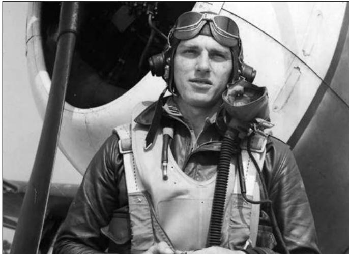  
Leroy Schreiber

\*Philippine Army Air Corps pilot, assigned to US Army Air Forces.

Tufty, Capt. Iver O.   
Turner, 2nd Lt. William L.   
Underwood, 1st Lt. Carol E.   
Urso, Maj. James D.   
Van Deventer, Capt. Cowell Van Ness, TSgt. James F.   
Vance, 1st Lt. Paul W.   
Vaughan, Sgt. William Via, 1st Lt. Charles A. Jr.   
Via, Sgt. James E.   
Villamor, Capt. Jesus A. $( 2 ) ^ { \ast }$   
Villines, 2nd Lt. Colin O.   
Vitali, 1st Lt. Chester A.   
Vogt, Capt. John E.   
Voll, Capt. John J.   
Vondrachek, SSgt. Charles E.   
Voss, SSgt. Raymond J.   
Wagner, 1st Lt. Boyd D.   
Wagner, 2nd Lt. Donald F.   
Wainwright, 1st Lt. John H. Jr.   
Walker, 2nd Lt. Clyde B.   
Walker, 2nd Lt. Leland A.   
Walker, 2nd Lt. William R.   
Wallace, Capt. Robert D.   
Walter, 2nd Lt. Donald A.   
Walters, Pvt. Roy W.   
Walton, 1st Lt. Victor E.   
Ward, Capt. Emery M.   
Ward, 1st Lt. Ralph E. Jr.   
Warmer, SSgt. Benjamin F.   
Waskowitz, 1st Lt. Frank T.   
Watkins, Capt. James A.   
Watson, 2nd Lt. William S.   
Watt, Lt. Col. James R.   
Wayland, 1st Lt. William J.   
Weeks, 1st Lt. Elbert W.   
Weems, 2nd Lt. Thomas N. Jr.   
Welch, 2nd Lt. George S.   
Werner, SSgt. William T. L.   
Wesche, Capt. Frederick F. III West, 1st Lt. Richard L.   
Westbrook, Maj. Robert B.   
Westby, 1st Lt. Morton K.   
Westerbeke, 1st Lt. Donald G.   
Wetmore, Capt. Ray S. (2) Whalen, 2nd Lt. Norman M.   
Wheless, 1st Lt. Hewitt T.

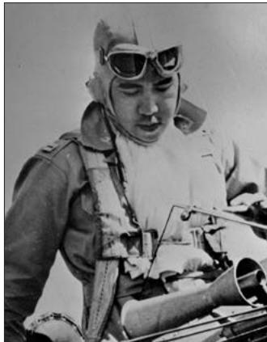

# Jesus Villamor

Wherry, TSgt. William B.   
Whisner, Capt. William T. Jr. (2) White, TSgt. Raymond S.   
Whitehead, Brig. Gen. Ennis C.   
Whitson, Capt. William D.   
Whittington, 2nd Lt. Leonard H.   
Wiecks, 2nd Lt. Max R.   
Wiegand, 2nd Lt. Arthur H.   
Wilde, 2nd Lt. Robert M.   
Wilkinson, Capt. James W.   
Williams, Pfc. Greeley B.   
Williamson, Capt. Felix D.   
Wilson, SSgt. Avis K.   
Wilson, SSgt. Frederick M.   
Wilson, Lt. Col. James W.   
Wilson, Col. Russell A.   
Winters, TSgt. Elmer R.   
Witt, 1st Lt. Gerald S.   
Witt, Capt. Lynn E. Jr.   
Wolf, 2nd Lt. John K.   
Woliver, 2nd Lt. Robert M.   
Wood, 2nd Lt. Howard C.   
Wood, Col. Jack W.   
Wood, 2nd Lt. Richard M.   
Woods, 1st Lt. Francis Woods, Lt. Col. Sidney S.   
Woody, Capt. Robert E.   
Wright, 2nd Lt. Arthur M. Jr.   
Wright, Sgt. Clifton J.   
Wright, Capt. Ellis W. Jr. Wright, Capt. John B.   
Wylie, 2nd Lt. John W.   
Yearwood, Lt. Col. Roy W.   
Yevich, SSgt. Edward S.   
Zemke, Col. Hubert Baker, Col. Royal N.   
Blesse, Maj. Frederick C.   
Bryan, Maj. William E. Jr.   
Davis, Maj. George A. Jr.   
Dixon, Lt. Col. Jacob W.   
Fernandez, Capt. Manuel J. Jr.   
Fischer, Capt. Harold E.   
Freligh, Maj. Lawrence E.   
Garrison, Lt. Col. Vermont Gebaur, Lt. Col. Arthur W. Jr.   
Georgi, Lt. Col. William F.   
Halton, Col. William T.   
Hicks, 1st Lt. Forrest L.   
Jabara, Capt. James Johnson, Col. James K.   
Ledford, TSgt. James H.   
MacArthur, 1st Lt. David W.   
McConnell, Capt. Joseph C. Jr.   
Moore, Capt. Lonnie R.   
Morse, 1st Lt. John Jr.   
Najarian, 1st Lt. John J.   
Nichols, Capt. Donald O’Donnell, Maj. Gen. Emmett Jr.   
Orr, Col. Robert H.   
Overton, 1st Lt. Dolphin D. III Parker, 1st Lt. Robert B.   
Parr, Capt. Ralph S. Jr.   
Partridge, Maj. Gen. Earle E.   
Rhoads, Capt. John K.   
Savage, 1st Lt. Richard L.   
Shields, 1st Lt. Everett L. Jr.   
Spath, 1st Lt. Charles R.   
Stratemeyer, Lt. Gen. George E.   
Tunner, Maj. Gen. William H.   
Vojvodich, Capt. Mele Jr.   
Whisner, Maj. William T. Jr.   
Wilkerson, Pfc. Desmond R.

# Korean War

Originally based on a compilation by C.   
Douglas Sterner.

# World War II

Brown, 2nd Lt. Charles L.   
Drew, 1st Lt. Urban L.   
Sloan, Lt. Col. William J.

# Cuban Missile Crisis

Anderson, Maj. Rudolph Jr.

# Vietnam War

Adams, TSgt. Victor R.   
Allee, Maj. Richard K.   
Allison, Lt. Col. John V.   
Armstrong, Maj. Larry D.   
Atterberry, Lt. Col. Edwin L.   
Baer, Lt. Col. Allan R.   
Baldwin, Maj. Robert L. Beale, Maj. Robert S.   
Black, A3C Arthur N.   
Bode, Maj. John R.   
Boyd, Capt. Charles G.   
Boyd, Lt. Col. William Jr.   
Brickel, Lt. Col. James R.   
Britt, Maj. Aquilla F.   
Britton, Col. Warner A.   
Broughton, Col. Jacksel M.   
Brower, Capt. Ralph W.   
Bucher, Maj. Bernard L.   
Burroughs, Maj. William D.   
Caldwell, Capt. William R.   
Campbell, Maj. Jesse W.   
Campbell, Maj. Thomas A.   
Carroll, Maj. John L.   
Carter, 1st Lt. William R.

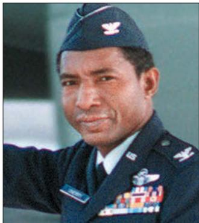

Fred Cherry Cherry, Col. Fred V. Clarke, Maj. Colin A.

Clay, SSgt. Eugene L.   
Cobeil, Lt. Col. Earl G.   
Cody, Capt. Howard R.   
Collins, Capt. Willard M.   
Conley, Lt. Col. Eugene O.   
Conran, Maj. Philip J.   
Cooper, Lt. Col. William E.   
Corder, Capt. John A.   
Courtney, Capt. Terence F.   
Curtis, Capt. Thomas J.   
Dallman, Lt. Col. Howard M.   
Day, Col. George E.   
Dayton, Maj. Thomas E.   
DeBellevue, Capt. Charles B.   
DeTar, Maj. Dean E.   
Donelson, Capt. Nicholas J.   
Donohue, Maj. Frederic M.

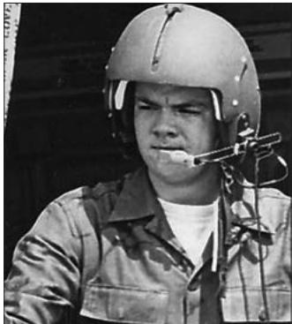

# Duane Hackney

Dorsett, Capt. Tracey K. Jr.   
Draeger, Capt. Walter F. Jr.   
Dramesi, Col. John A. (2) Engle, Capt. Charles E.   
Eppinger, Maj. Dale L.   
Etzel, Capt. Gregory A. M.   
Feinstein, Capt. Jeffrey S.   
Feuerriegel, Lt. Col. Karl T.   
Finck, Maj. George C.   
Firse, Capt. John A.   
Fish, Sgt. Michael E.   
Fleener, Capt. Delbert W.   
Flynn, Lt. Gen. John P.   
Francisco, Capt. Michael C.   
Funderburk, Capt. Leonard J.   
Gamlin, Sgt. Theodore R.   
Gibson, Maj. James K.   
Gilroy, Capt. Kevin A.   
Gonzales, Maj. Leonard A.   
Green, Maj. Joe B.   
Griggs, Maj. Jerry M.   
Gruver, Capt. John C.   
Guarino, Col. Lawrence N.   
Gustafson, Maj. Gerald C.   
Guy, Col. Theodore W.   
Hackney, A2C Duane D.   
Hackney, Maj. Hunter F.   
Hall, 1st Lt. James H.   
Hamilton, Col. John S.   
Harding, Maj. James C.   
Harp, Capt. Tilford W.   
Henning, Capt. Hal P.   
Hickman, Capt. Vincent J.   
Hoblit, Capt. Jerry N.   
Hoggatt, Lt. Col. Ralph S.   
Holland, Maj. Lawrence T. Hopkins, Lt. Col. James R.   
Horinek, Capt. Ramon A.   
Hudson, Capt. Jackson L.   
Hunt, Sgt. Russell M.   
Jeanotte, Lt. Col. Alfred J. Jr.   
Johnson, Capt. Harold E.   
Kalen, Maj. Herbert D.   
Kasler, Lt. Col. James H. (3) Kennedy, Capt. Leland T. (2) Kent, Sgt. Nacey Jr.   
Killian, Col. Melvin J.   
King, A1C Charles D.   
Kirk, Col. Thomas H. Jr.   
Knight, Col. Roy A. Jr.   
Koeltzow, Maj. Paul F.   
Lackey, Capt. John E.   
Leetun, Capt. Darel D.   
Lielmanis, 1st Lt. Atis K.   
Lukasik, Capt. Bernard F.   
Madden, Maj. Joseph B.   
Maisey, Capt. Reginald V. Jr.   
Martin, 1st Lt. Duane W.   
Martin, Capt. William R.   
Marx, Capt. Donald L.   
Mason, Capt. Larry B.   
Maysey, Sgt. Larry W.   
Maywald, Capt. Phillip V.   
McAllister, Maj. William W.   
McCarthy, Col. James R.   
McGrath, Sgt. Charles D.   
McInerney, Lt. Col. James E. Jr.   
McKnight, Lt. Col. George G.   
McTasney, Capt. John B.   
Mehr, Maj. Richard L.   
Mitchell, Maj. Carl B.   
Mize, Capt. John D.   
Mongillo, Maj. Paul J.   
Moorberg, Capt. Monte L.   
Nagel, Capt. Richard A. Jr.   
Newman, Sgt. Thomas A.   
Norris, Lt. Col. William C.   
O’Mara, Capt. Oliver E.   
Olds, Col. Robin Olsen, Maj. Don P.   
Orrell, Capt. Bennie D.   
Parr, Col. Ralph S. Jr.   
Personett, Capt. Joseph A.   
Peterson, Capt. Delbert R.   
Pogreba, Lt. Col. Dean A.   
Poling, Capt. Richard L.   
Price, Capt. Donald S.

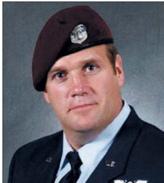

# Keary Miller

Richardson, Sgt. Dennis M.   
Richter, 1st Lt. Karl W.   
Risner, Lt. Col. James R. (2) Ritchie, Capt. Richard S.   
Robinson, A1C William A.   
Robinson, Maj. William P.   
Ronca, Maj. Robert F.   
Rowan, Maj. John M.   
Schaneberg, Capt. Leroy C.   
Schmidt, Col. Norman Schurr, Lt. Col. Harry W.   
Scott, Capt. Travis H. Jr.   
Sellers, Maj. Jerry A.   
Sellers, Capt. Kenneth H.   
Shannon, Capt. Fred Shaub, SSgt. Charles L.   
Smith, TSgt. Donald G.   
Smith, Lt. Col. Robert W.   
Smith, Capt. Ronald E.   
Smith, Capt. Rowland F. Jr. Smith, Maj. Weston T.   
Stevens, Capt. Donald D.   
Stocks, Maj. Bruce D.   
Storz, Lt. Col. Ronald E.   
Stovall, Capt. Dale E.   
Talley, Amn. Joel E.   
Titus, Lt. Col. Robert F.   
Trautman, Maj. Konrad W.   
Traynor, Capt. Dennis W. III Tsouprake, Maj. Peter Turner, Maj. Robert E.   
Weatherby, Capt. Jack W.   
Wells, Capt. Norman L.   
Whatley, Maj. Wayne N.   
White, Col. Robert M.   
Whitesides, Capt. Richard L.   
Wilke, Col. Robert F.   
Williams, Capt. David H.   
Wofford, Maj. Travis Wood, Maj. Patrick H.   
Worrell, 1st Lt. Rowland H. III Wright, Capt. Garth A.   
Wright, TSgt. LeRoy M.   
York, Maj. Glen P.

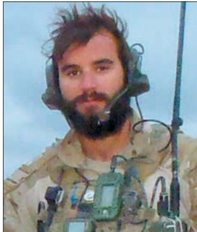  
Christopher Baradat

# Mayaguez Incident

Backlund, 1st Lt. Donald R.   
Brims, 1st Lt. Richard C.   
Harston, SSgt. Jon D.   
Purser, Capt. Rowland W.

# Operation Desert Storm

Andrews, Capt. William F.   
Johnson, Capt. Paul T.

# Somalia

Wilkinson, TSgt. Timothy A.

# Operation Enduring Freedom

Baradat, SSgt. Christopher G.   
Chapman, TSgt. John A.   
Crawford, Capt. Barry F. Jr.   
Cunningham, SrA. Jason D.   
Gutierrez, SSgt. Robert Jr.   
Miller, MSgt. Keary, J.   
Rhyner, SSgt. Zachary J.   
Ruiz, MSgt. Ivan M.   
Temple, SrA. Dustin H.

# SAF Recipients of Special Congressional Medals (highest noncombat award)

<table><tr><td> NAME AND RANK AT TIME OF AWARD</td><td>TYPE</td><td>DATE APPROVED ACHIEVEMENT</td><td></td></tr><tr><td>American Fighter Aces</td><td>Gold</td><td>May 19, 2014</td><td>Heroic military service and defense of freedom</td></tr><tr><td>Aldrin, Col. Buzz</td><td>Gold</td><td>Aug. 7, 2009</td><td>Second person to walk on the moon, Apollo 11 mission, July 20, 1969</td></tr><tr><td>Collins, Maj. Gen. Michael</td><td>Gold</td><td>Aug. 7, 2009</td><td>Command module pilot, Apollo 11 mission, July 20, 1969</td></tr><tr><td>Doolittle Tokyo Raiders</td><td>Gold</td><td>May 23, 2014</td><td>Bombing raid over Japan&#x27;s capital, Apri 18, 1942</td></tr><tr><td>Eaker, Lt. Gen. Ira C.</td><td>Gold</td><td>Oct. 10, 1978</td><td>Distinguished aviation pioneer and Air Force leader</td></tr><tr><td>Filipino World War II Veterans</td><td>Gold</td><td>Dec. 14, 2016</td><td>Courage and perseverance during the war</td></tr><tr><td>Lindbergh, Col. Charles A.</td><td>Gold</td><td>May 4, 1928</td><td>Achievements, specifically New York City-Paris flight, May 20-21, 1927</td></tr><tr><td>Mitchell, Brig. Gen. William</td><td>Gold</td><td>Aug. 8, 1946</td><td>Outstanding pioneer service and foresight in American military aviation</td></tr><tr><td>Tuskegee Airmen</td><td>Gold</td><td>April 11, 2006</td><td>Unique military record, inspiring revolutionary reform in US armed forces</td></tr><tr><td>Women&#x27;s Airforce Service Pilots</td><td>Gold</td><td>July 2, 2009</td><td>Pioneering military service and exemplary record</td></tr><tr><td>World War Il members of CAP</td><td>Gold</td><td>May 30, 2014</td><td>Wartime civilian volunteers for patrol and humanitarian missions</td></tr><tr><td>Yeager, Brig. Gen. Charles E.</td><td>Silver</td><td>Dec. 23, 1975</td><td>Risking life, piloting X-1 aircraft faster than speed of sound, Oct. 14, 1947</td></tr></table>

# Air Force Aces

<table><tr><td colspan="2">Some Famous Firsts</td></tr><tr><td>April 23, 1918</td><td>First Air Service ace in World War I: 1st Lt. Paul F. Baer</td></tr><tr><td>Dec. 7, 1941</td><td>First AAF victories of World War II (Pearl Harbor): Lt. Harry W. Brown, Lt. Philip M. Rasmussen, Lt. Lewis M. Sanders, Lt. Gordon H. Sterling Jr., Lt. Kenneth M. Taylor, Lt. George S. Welch</td></tr><tr><td>Dec. 16, 1941</td><td>First AAF ace of World War I: 1st Lt. Boyd D. Wagner</td></tr><tr><td>Nov. 8, 1950</td><td>First jet-to-jet victory (Korean War): 1st Lt. Russell J. Brown</td></tr><tr><td>May 20, 1951</td><td>First USAF ace of the Korean War: Capt. James Jabara</td></tr><tr><td>Nov. 30, 1951</td><td>First USAF ace of two wars (World War Il and Korea): Maj. George A. Davis Jr. (seven in World War Il and 14 in Korea)</td></tr><tr><td>Jan. 2, 1967</td><td>First (and only) USAF ace with victories in World War Il and Vietnam: Col. Robin Olds (12 in World War Il and four in Vietnam)</td></tr><tr><td>Aug. 28, 1972</td><td>First USAF ace of Vietnam: Capt. Richard S. Ritchie</td></tr></table>

By tradition, anyone with five official aerial victory credits is an ace. In compiling this list of aces who flew with the US Air Force and predecessor organizations (the Air Service, Air Corps, and Army Air Forces), Air Force Magazine relies on USAF’s official accounting of air-to-air aerial victory credits, which is the responsibility of the Air Force Historical Research Agency, Maxwell AFB, Ala.

This record does not include some 300 pilots credited by Eighth Air Force in World War II with destroying aircraft on the ground. Eighth was the only numbered air force to count ground kills, and the Air Force subsequently limited its official recognition of World War II aces to air-toair victories.

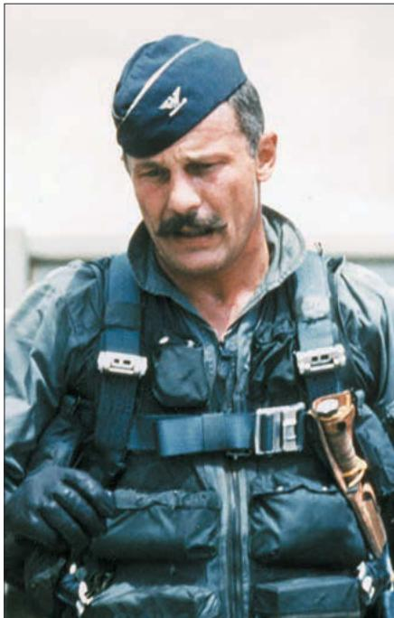  
Robin Olds is the only USAF ace with aerial victories in both World War II and the Vietnam War.

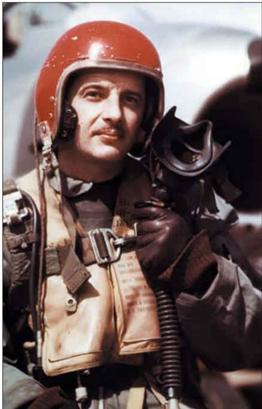  
Manuel Fernandez earned 14.5 aerial victory credits in the Korean War.

Air Force historians have kept the official records of aerial victories by USAF pilots and crew members since 1957. The Office of the Air Force Historian initially published four separate listings—for World War I, World War II, the Korean War, and the Vietnam War. The four volumes were corrected, updated, and combined into one comprehensive volume. AFHRA continues to correct records and update its listing.

The criteria that the Air Force established for awarding aerial victory credits varied from war to war.

In many cases during World War I, several aviators worked together to down a single aircraft. The Air Service awarded one whole credit to each aviator who contributed to the victory. A single victory could—and often did—result in three or four victory credits.

In World War II and Korea, the criteria were changed. The service divided one credit among all aviators who contributed to destruction of an enemy airplane. With the awarding of fractional credits, a single victory could result in no more than one credit.

The rules were changed again in the Vietnam War. When an F-4 downed an enemy aircraft, USAF would award two full aerial victory credits—one to the frontseater and one to the backseater. As in World War I, a single victory resulted in multiple victory credits.

Thus, the standards for World War II and Korea were more restrictive than those for World War I and Vietnam.

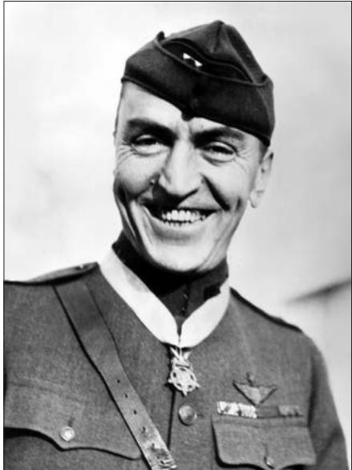  
Eddie Rickenbacker (26)

Rickenbacker, Capt. EdwardV. 26   
Luke, 2nd Lt. Frank Jr. 18   
Vaughn, 1st Lt. George A. 13   
Kindley, 1st Lt. Field E. 12   
Springs, 1st Lt. Elliott W. 12   
Landis, 1st Lt. Reed G. 10   
Swaab, 1st Lt. Jacques M. 10   
Baer, 1st Lt. Paul F. 9   
Cassady, 1st Lt. Thomas G. 9   
Hamilton, 1st Lt. Lloyd A. 9   
Wright, 1st Lt. Chester E. 9   
Clay, 1st Lt. Henry R. Jr. 8   
Coolidge, Capt. Hamilton 8   
Donaldson, 2nd Lt. John O. 8   
Erwin, 1st Lt. William P. 8   
Hunter, 1st Lt. Frank O’D. 8   
Jones, 2nd Lt. Clinton 8   
Meissner, Capt. James A. 8

# In World War I, pilots who shared victories were each given one credit. This list uses the World War I counting rule.

Stenseth, 1st Lt. Martinus 8   
White, 2nd Lt. Wilbert W. 8   
Burdick, 2nd Lt. Howard 7   
Chambers, 1st Lt. Reed M. 7   
Cook, 1st Lt. Harvey W. 7   
Creech, 1st Lt. Jesse O. 7   
Holden, 1st Lt. Lansing C. 7   
Robertson, 1st Lt. Wendel A. 7   
Rummell, 1st Lt. Leslie J. 7   
Schoen, 1st Lt. Karl J. 7   
Sewall, 1st Lt. Sumner 7   
Beane, 1st Lt. James D. 6   
Biddle, Capt. Charles J. 6   
Brooks, 2nd Lt. Arthur R. 6   
Campbell, 1st Lt. Douglas 6   
Curtis, 1st Lt. Edward P. 6   
Easterbrook, 1st Lt. Arthur E. 6   
Guthrie, 1st Lt. Murray K. 6   
Hammond, 1st Lt. Leonard C. 6   
Hays, 2nd Lt. Frank K. 6   
Hudson, 1st Lt. Donald 6   
Knotts, 2nd Lt. Howard C. 6   
Lindsay, 1st Lt. Robert O. 6   
MacArthur, 2nd Lt. John K. 6   
Ponder, 2nd Lt. William T. 6   
Putnam, 1st Lt. David E. 6   
Stovall, 1st Lt. William H. 6   
Tobin, 1st Lt. Edgar G. 6   
Vasconcells, 1st Lt. Jerry C. 6   
Badham, 2nd Lt. William T. 5   
Bair, 1st Lt. Hilbert L. 5   
Bissell, 1st Lt. Clayton L. 5   
Buckley, 1st Lt. Harold R. 5   
Cook, 1st Lt. Everett R. 5   
D’Olive, 1st Lt. Charles R. 5   
Furlow, 1st Lt. George W. 5   
George, 1st Lt. Harold H. 5   
Grey, 1st Lt. Charles G. 5   
Haight, 1st Lt. Edward M. 5   
Healy, 1st Lt. James A. 5   
Keating, 1st Lt. James A. 5   
Knowles, 1st Lt. James Jr. 5   
Larner, 1st Lt. G. DeFreest 5   
Luff, 1st Lt. Frederick E. 5   
O’Neill, 2nd Lt. Ralph A. 5   
Owens, 2nd Lt. John S. 5   
Porter, 2nd Lt. Kenneth L. 5   
Ralston, 1st Lt. Orville A. 5   
Seerley, 1st Lt. John J. 5   
Strahm, Capt. Victor H. 5   
Todd, 2nd Lt. Robert M. 5   
Vernam, 1st Lt. Remington D. B. 5   
Wehner, 1st Lt. Joseph F. 5

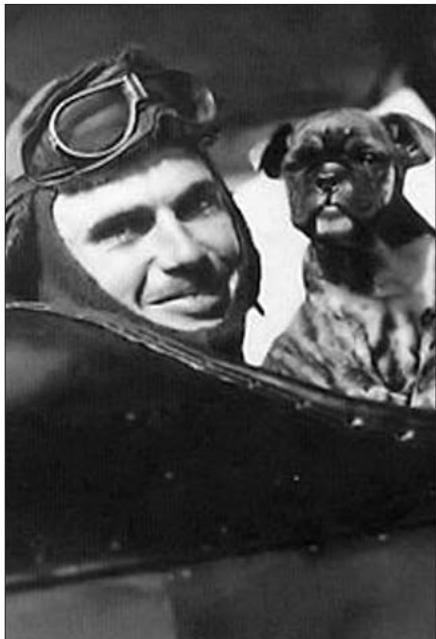  
Field Kindley (12)

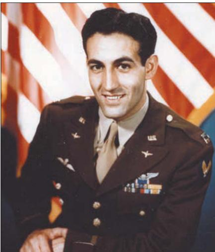  
Don Gentile (19.83)

# Ranks are as of last victory in World War II.

<table><tr><td>Bong, Maj. Richard I.</td><td>40</td></tr><tr><td>McGuire, Maj. Thomas B. Jr.</td><td>38</td></tr><tr><td>Gabreski, Lt. Col. Francis S.</td><td>28</td></tr><tr><td>Johnson, Capt. Robert S.</td><td>27</td></tr><tr><td>MacDonald, CoI. Charles H.</td><td>27</td></tr><tr><td>Preddy, Maj. George E.</td><td>26.83</td></tr><tr><td>Meyer, Lt. Col. John C.</td><td>24</td></tr><tr><td>Schilling, Col. David C.</td><td>22.5</td></tr><tr><td>Johnson, Lt. Col. Gerald R.</td><td>22</td></tr><tr><td>Kearby, Col. Neel E.</td><td>22</td></tr><tr><td>Robbins, Maj. Jay T.</td><td>22</td></tr><tr><td>Christensen, Capt. Fred J.</td><td>21.5</td></tr><tr><td>Wetmore, Capt. Ray S.</td><td>21.25</td></tr><tr><td>Voll, Capt. John J.</td><td>21</td></tr><tr><td>Mahurin, Maj. Walker M.</td><td>20.75</td></tr></table>

<table><tr><td>Lynch, Lt. Col. Thomas J.</td><td>20</td></tr><tr><td>Westbrook, Lt. Col. Robert B.</td><td>20</td></tr><tr><td>Gentile, Capt. Don S.</td><td>19.83</td></tr><tr><td>Duncan, Col. Glenn E.</td><td>19.5</td></tr><tr><td>Carson, Capt. Leonard K.</td><td>18.5</td></tr><tr><td>Eagleston, Maj. Glenn T.</td><td>18.5</td></tr><tr><td>Beckham, Maj. Walter C.</td><td>18</td></tr><tr><td>Green, Maj. Herschel H.</td><td>18</td></tr><tr><td>Herbst, Lt. Col. John C.</td><td>18</td></tr><tr><td>Zemke, Col. Hubert</td><td>17.75</td></tr><tr><td>England, Maj. John B.</td><td>17.5</td></tr><tr><td>Beeson, Capt. Duane W.</td><td>17.33</td></tr><tr><td>Thornell, 1st Lt. John F. Jr.</td><td>17.25</td></tr><tr><td>Varnell, Capt. James S. Jr.</td><td>17</td></tr><tr><td>Johnson, Maj. Gerald W.</td><td>16.5</td></tr><tr><td>Godfrey, Capt. John T.</td><td>16.33</td></tr><tr><td>Anderson, Capt. Clarence E. Jr.</td><td>16.25</td></tr><tr><td>Dunham, Lt. Col. William D.</td><td>16</td></tr><tr><td>Harris, Lt. Col. BilI</td><td>16</td></tr><tr><td>Welch, Capt. George S.</td><td>16</td></tr><tr><td>Beerbower, Capt. Don M.</td><td>15.5</td></tr><tr><td>Brown, Maj. Samuel J.</td><td>15.5</td></tr><tr><td>Peterson, Capt. Richard A.</td><td>15.5</td></tr><tr><td>Whisner, Capt. William T. Jr.</td><td>15.5</td></tr><tr><td>Bradley, Lt. Col. Jack T.</td><td>15</td></tr><tr><td>Cragg, Maj. Edward</td><td>15</td></tr><tr><td>Dahlberg, Capt. Kenneth H.</td><td>15</td></tr><tr><td>Foy, Maj. Robert W.</td><td>15</td></tr><tr><td>Hofer, 2nd Lt. Ralph K.</td><td>15</td></tr><tr><td>Homer, Capt. Cyril F.</td><td>15</td></tr><tr><td>Landers, Lt. Col. John D.</td><td>14.5</td></tr><tr><td>Powers, Capt. Joe H.</td><td>14.5</td></tr><tr><td>Brown, Capt. Henry W.</td><td>14.2</td></tr><tr><td>Carr, 1st Lt. Bruce W.</td><td>14</td></tr><tr><td>Curtis, Maj. Robert C.</td><td>14</td></tr><tr><td>DeHaven, Capt. Robert M.</td><td>14</td></tr><tr><td>Emmer, Capt. Wallace N.</td><td>14</td></tr><tr><td>Goodson, Maj. James A.</td><td>14</td></tr><tr><td>Jeffrey, Lt. Col. Arthur F.</td><td>14</td></tr><tr><td>McComas, Lt. Col. Edward O.</td><td>14</td></tr><tr><td>Roberts, Capt. Daniel T. Jr. West, Capt. Richard L.</td><td>14</td></tr><tr><td></td><td>14</td></tr><tr><td>Bochkay, Maj. Donald H.</td><td>13.83</td></tr><tr><td>Strait, Maj. Donald J.</td><td>13.5</td></tr><tr><td>Bryan, Capt. Donald S.</td><td>13.33</td></tr><tr><td>Carpenter, Maj. George</td><td>13.33</td></tr><tr><td>Brooks, 1st Lt. James L.</td><td>13</td></tr><tr><td>Hampshire, Capt. John F. Jr.</td><td>13</td></tr><tr><td>Head, Capt. Cotesworth B. Jr.</td><td>13</td></tr><tr><td>Holloway, Col. Bruce K.</td><td>13</td></tr><tr><td>Millikan, Capt. Willard W.</td><td>13</td></tr><tr><td>Moran, 1st Lt. Glennon T.</td><td>13</td></tr><tr><td>Parker, Capt. Harry A.</td><td>13</td></tr><tr><td>Stephens, Maj. Robert W.</td><td>13</td></tr><tr><td>Williamson, Capt. Felix D.</td><td>13</td></tr><tr><td>Brueland, Maj. Lowell K.</td><td>12.5</td></tr><tr><td>Brown, Maj. Quince L.</td><td>12.33</td></tr><tr><td>Brezas, 1st Lt. Michael</td><td>12</td></tr><tr><td>Chase, Lt. Col. Levi R.</td><td>12</td></tr><tr><td>East, Capt. Clyde B.</td><td>12</td></tr></table>

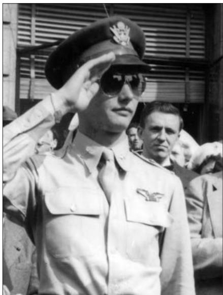  
George Welch (16)

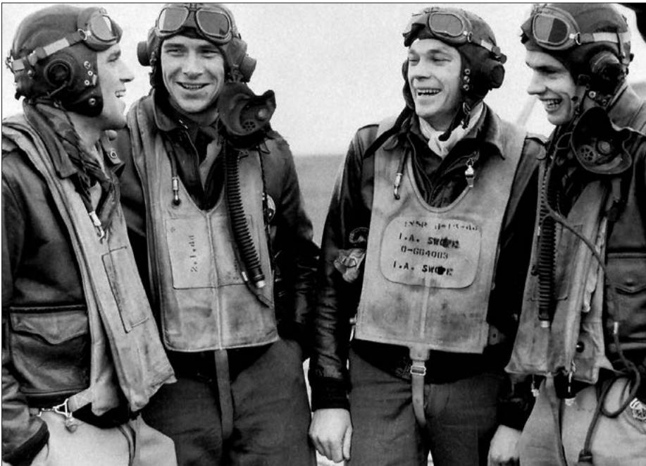  
Left to right: Richard Peterson (15.5), Leonard Carson (18.5), John England (17.5), and Clarence Anderson (16.25).

<table><tr><td rowspan=1 colspan=1>Gleason, Capt. George W.           12</td></tr><tr><td rowspan=1 colspan=1>Hively, Maj. Howard D.              12</td></tr><tr><td rowspan=1 colspan=1>Ladd, Capt. Kenneth G.              12</td></tr><tr><td rowspan=1 colspan=1>Moore, Maj. Robert W.              12</td></tr><tr><td rowspan=1 colspan=1>Olds, Maj. Robin                    12</td></tr><tr><td rowspan=1 colspan=1>Schreiber, Capt. Leroy A.            12</td></tr><tr><td rowspan=1 colspan=1>Skogstad, 1st Lt. Norman C.         12</td></tr><tr><td rowspan=1 colspan=1>Sloan, 1st Lt. William J.             12</td></tr><tr><td rowspan=1 colspan=1>Watkins, Capt. James A.            12</td></tr><tr><td rowspan=1 colspan=1>Megura, Capt. Nicholas             11.83</td></tr><tr><td rowspan=1 colspan=1>Blakeslee, Col. Donald J. M.         11.5</td></tr><tr><td rowspan=1 colspan=1>Conger, Maj. Paul A.                11.5</td></tr><tr><td rowspan=1 colspan=1>Kirla, 1st Lt. John A.                11.5</td></tr><tr><td rowspan=1 colspan=1>McDonald, Maj. Norman L.          11.5</td></tr><tr><td rowspan=1 colspan=1>Stewart, Maj. James C.              11.5</td></tr><tr><td rowspan=1 colspan=1>Yeager, Capt. Charles E.            11.5</td></tr><tr><td rowspan=1 colspan=1>Norley, Maj. Louis H.                11.33</td></tr><tr><td rowspan=1 colspan=1>Frantz, 1st Lt. Carl M.               11</td></tr><tr><td rowspan=1 colspan=1>Goebel, Capt. Robert J.             11</td></tr><tr><td rowspan=1 colspan=1>Lawler, Capt. John B.               11</td></tr><tr><td rowspan=1 colspan=1>Lent, 1st Lt. Francis J.               11</td></tr><tr><td rowspan=1 colspan=1>Leverette, Lt. Col. William L.         11</td></tr></table>

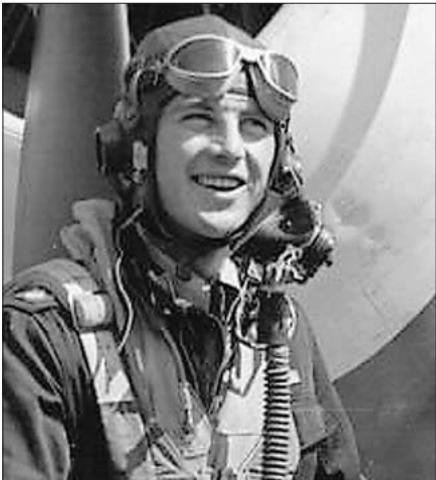  
Hubert Zemke (17.75)

<table><tr><td>Loisel, Maj. John S.</td><td>11</td></tr><tr><td>Lowry, 1st Lt. Wayne L.</td><td>11</td></tr><tr><td>McCorkle, Col. Charles M.</td><td>11</td></tr><tr><td>McKennon, Maj. Pierce W.</td><td>11</td></tr><tr><td>Mitchell, Lt. Col. John W.</td><td>11</td></tr><tr><td>Molland, Capt. Leland P.</td><td>11</td></tr><tr><td>Quirk, Capt. Michael J.</td><td>11</td></tr><tr><td>Riddle, 1st Lt. Robert E.</td><td>11</td></tr><tr><td>Shubin, 1st Lt. Murray J.</td><td>11</td></tr><tr><td>Smith, Capt. Cornelius M. Jr.</td><td>11</td></tr><tr><td>Sparks, 1st Lt. Kenneth C.</td><td>11</td></tr><tr><td>Turner, Maj. Richard E.</td><td>11</td></tr><tr><td>O'Connor, Capt. Frank Q.</td><td>10.75</td></tr><tr><td>Ceuleers, Lt. Col. George F.</td><td>10.5</td></tr><tr><td>Clark, Lt. Col. James A. Jr.</td><td>10.5</td></tr><tr><td>Doersch, Capt. George A.</td><td>10.5</td></tr><tr><td>Halton, Maj. Wiliam T.</td><td>10.5</td></tr><tr><td>Hovde, Maj. William J.</td><td>10.5</td></tr><tr><td>Littge, Capt. Raymond H.</td><td>10.5</td></tr><tr><td>Storch, Lt. Col. John A.</td><td>10.5</td></tr><tr><td>Glover, Maj. Fred W.</td><td>10.33</td></tr><tr><td>Anderson, 1st Lt. Charles F.</td><td>10</td></tr><tr><td>Aschenbrener, Capt. Robert W.</td><td>10</td></tr><tr><td>Blickenstaff, Lt. Col. Wayne K.</td><td>10</td></tr><tr><td>England, Maj. James J.</td><td>10</td></tr><tr><td>Giroux, Capt. William K.</td><td>10</td></tr><tr><td>Gladych, Squadron Leader Michael*</td><td>10</td></tr><tr><td>Goehausen, Capt. Walter J. Jr.</td><td>10</td></tr><tr><td>Harris, Capt. Ernest A.</td><td>10</td></tr><tr><td>Lines, 1st Lt. Ted E.</td><td>10</td></tr><tr><td>Rankin, 1st Lt. Robert J.</td><td>10</td></tr><tr><td>Reynolds, 1st Lt. Andrew J.</td><td>10</td></tr><tr><td>Scott, Col. Robert L. Jr.</td><td>10</td></tr><tr><td></td><td></td></tr><tr><td>Stanch, Capt. Paul M.</td><td>10</td></tr><tr><td>Summer, Capt. Elliot</td><td>10</td></tr><tr><td>McConnell, Capt. Joseph C. Jr.</td><td>16</td></tr><tr><td>Jabara, Maj. James</td><td>15</td></tr><tr><td>Fernandez, Capt. Manuel J. Jr.</td><td>14.5</td></tr><tr><td>Davis, Maj. George A. Jr.</td><td>14</td></tr><tr><td>Baker, Col. Royal N.</td><td>13</td></tr><tr><td>Blesse, Maj. rederick C.</td><td>10</td></tr><tr><td>Fischer, Capt. Harold E.</td><td>10</td></tr><tr><td>Garrison, Lt. Col. Vermont</td><td>10</td></tr><tr><td>Johnson, Col. James K.</td><td>10</td></tr><tr><td>Moore, Capt. Lonnie R.</td><td>10</td></tr><tr><td>Parr, Capt. Ralph S. Jr.</td><td>10</td></tr><tr><td>Foster, Capt. Cecil G.</td><td>9</td></tr><tr><td>Low, 1st Lt. James F.</td><td>9</td></tr><tr><td>Hagerstrom, Maj. James P.</td><td>8.5</td></tr><tr><td>Risner, Capt. James R.</td><td>8</td></tr><tr><td>Ruddell, Lt. Col. George I.</td><td>8</td></tr><tr><td>Buttelmann, 1st Lt. Henry</td><td>7</td></tr><tr><td>Jolley, Capt. Clifford D.</td><td>7</td></tr><tr><td>Lilley, Capt. Leonard W.</td><td>7</td></tr><tr><td>Adams, Maj. Donald E.</td><td>6.5</td></tr><tr><td>Gabreski, Col. Francis S.</td><td>6.5</td></tr><tr><td>Jones, Lt. Col. George L.</td><td>6.5</td></tr><tr><td>Marshall, Maj. Winton W.</td><td>6.5</td></tr><tr><td>Bolt, Maj. John F.*</td><td>6</td></tr><tr><td>Kasler, 1st Lt. James H.</td><td>6</td></tr><tr><td>Love, Capt. Robert J.</td><td>6</td></tr><tr><td>Whisner, Maj. William T. Jr.</td><td>5.5</td></tr><tr><td>Baldwin, Col. Robert P.</td><td>5</td></tr><tr><td>Becker, Capt. Richard S.</td><td>5</td></tr><tr><td>Bettinger, Maj. Stephen L.</td><td>5</td></tr><tr><td>Cleveland, 1st Lt. Charles G.</td><td>5</td></tr><tr><td>Creighton, Maj. Richard D.</td><td>5</td></tr></table>

\*USMC exchange pilot.

DeBellevue, Capt. Charles B. 6   
Feinstein, Capt. Jeffrey S. 5   
Ritchie, Capt. Richard S. 5   
Curtin, Capt. Clyde A. 5   
Gibson, Capt. Ralph D. 5   
Kincheloe, Capt. Iven C. Jr. 5   
Latshaw, Capt. Robert T. Jr. 5   
Moore, Capt. Robert H. 5   
Overton, Capt. Dolphin D. III 5   
Thyng, Col. Harrison R. 5   
Wescott, Maj. William H. 5

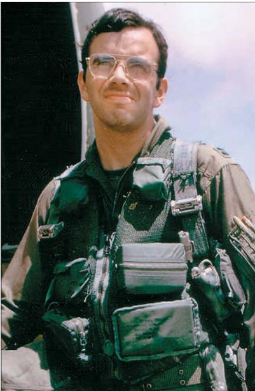  
Jeffrey Feinstein (5)

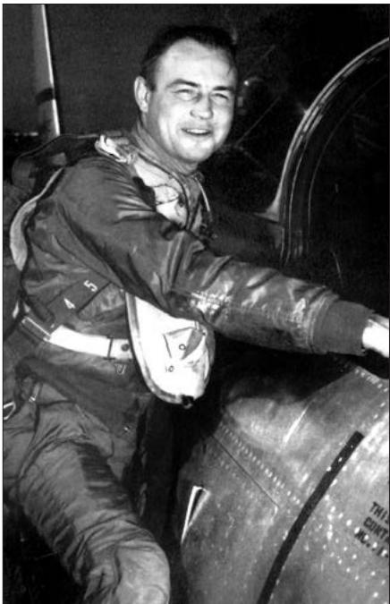  
James Hagerstrom (8.5)

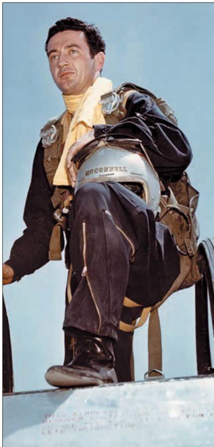  
Joseph McConnell (16)

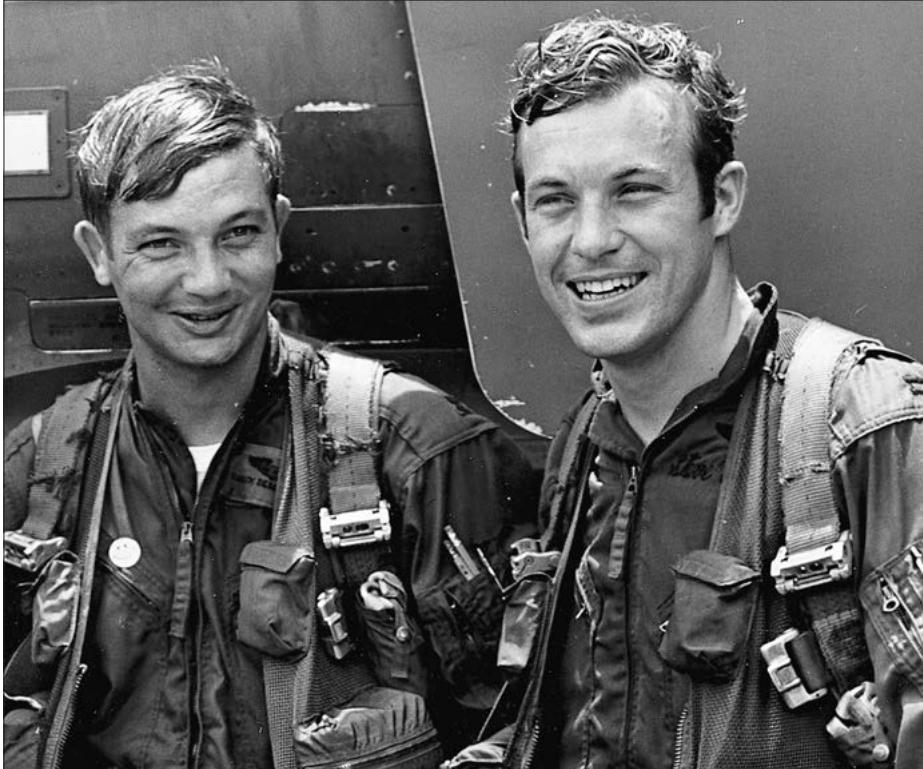  
Charles DeBellevue (left) (6) and Richard Ritchie (right) (5)

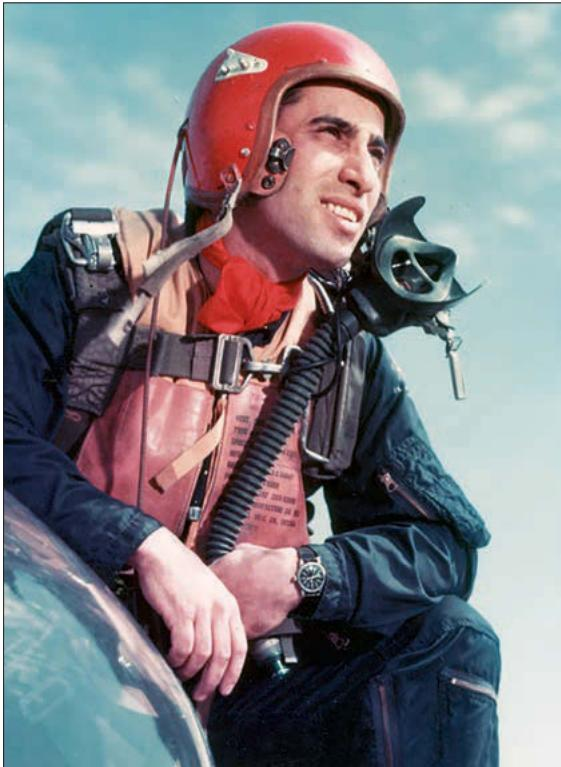  
James Jabara, the first USAF ace of the Korean War. Jabara scored 15 victories before the end of the war.

<table><tr><td></td><td>WWⅡI</td><td>KOREA</td><td>VIETNAM TOTAL</td></tr><tr><td>Gabreski, Col. Francis S.</td><td>28</td><td>6.5</td><td>34.5</td></tr><tr><td>Meyer, Col. John C.</td><td>24</td><td>2</td><td>26</td></tr><tr><td>Mahurin, Col. Walker M.</td><td>20.75</td><td>3.5</td><td>24.25</td></tr><tr><td>Davis, Maj. George A. Jr.</td><td>7</td><td>14</td><td>21</td></tr><tr><td>Whisner, Maj. William T. Jr.</td><td>15.5</td><td>5.5</td><td>21</td></tr><tr><td>Eagleston, Col. Glenn T.</td><td>18.5</td><td>2</td><td>20.5</td></tr><tr><td>Garrison, Lt. Col. Vermont</td><td>7.33</td><td>10</td><td>17.33</td></tr><tr><td>Baker, Col. Royal N.</td><td>3.5</td><td>13</td><td>16.5</td></tr><tr><td>Jabara, Maj. James</td><td>1.5</td><td>15</td><td>16.5</td></tr><tr><td>Olds, Col. Robin</td><td>12</td><td></td><td>4 16</td></tr><tr><td>Mitchell, Col. John W.</td><td>11</td><td>4</td><td>15</td></tr><tr><td>Brueland, Maj. Lowell K.</td><td>12.5</td><td>2</td><td>14.5</td></tr><tr><td>Hagerstrom, Maj. James P.</td><td>6</td><td>8.5</td><td>14.5</td></tr><tr><td>Hovde, Lt. ColI. William J.</td><td>10.5</td><td>1</td><td>11.5</td></tr><tr><td>Johnson, Col. James K.</td><td>1</td><td>10</td><td>11</td></tr><tr><td>Ruddell, Lt. Col. George I.</td><td>2.5</td><td>8</td><td>10.5</td></tr><tr><td>Thyng, Col. Harrison R.</td><td>5</td><td>5</td><td>10</td></tr><tr><td>Colman, Capt. Philip E.</td><td>5</td><td>4</td><td>9</td></tr><tr><td>Heller, Lt. Col. Edwin L.</td><td>5.5</td><td>3.5</td><td>9</td></tr><tr><td>Chandler, Maj. Van E.</td><td>5</td><td>3</td><td>8</td></tr><tr><td>Hockery, Maj. John J.</td><td>7</td><td>1</td><td>8</td></tr><tr><td>Little, Maj. James W.</td><td>7</td><td>1</td><td>8</td></tr><tr><td>Creighton, Maj. Richard D.</td><td>2</td><td>5</td><td>7</td></tr><tr><td>Emmert, Lt. Col. Benjamin H. Jr.</td><td>6</td><td>1</td><td>7</td></tr><tr><td>Bettinger, Maj. Stephen L.</td><td>1</td><td>5</td><td>6</td></tr><tr><td>Visscher, Maj. Herman W.</td><td>5</td><td>1</td><td>6</td></tr><tr><td>Liles, Capt. Brooks J.</td><td>1</td><td>4</td><td>5</td></tr><tr><td>Mattson, Capt. Conrad E.</td><td>1</td><td>4</td><td>5</td></tr><tr><td>Shaeffer, Maj. William F.</td><td>2</td><td>3</td><td>5</td></tr></table>

<table><tr><td>Bong, Maj. Richard I.</td><td>40</td><td>WW IⅡl</td></tr><tr><td>McGuire, Maj. Thomas B. Jr.</td><td>38</td><td>WWII</td></tr><tr><td>Gabreski, CoI. Francis S.</td><td>34.5</td><td>WW Il, Korea</td></tr><tr><td>Johnson, Capt. Robert S.</td><td>27</td><td>WWII</td></tr><tr><td>MacDonald, Col. Charles H.</td><td>27</td><td>WWⅡl</td></tr><tr><td>Preddy, Maj. George E.</td><td>26.83</td><td>WWⅡl</td></tr><tr><td>Meyer, Col. John C.</td><td>26</td><td>WW I, Korea</td></tr><tr><td>Rickenbacker, Capt. Edward V.</td><td>26</td><td>WWI</td></tr><tr><td>Mahurin, Col. Walker M.</td><td>24.25</td><td>WW I, Korea</td></tr><tr><td>Schilling, ColI. David C.</td><td>22.5</td><td>WWⅡ</td></tr><tr><td>Johnson, Lt. Col. Gerald R.</td><td>22</td><td>WWⅡI</td></tr><tr><td>Kearby, Col. Neel E.</td><td>22</td><td>WWⅡI</td></tr><tr><td>Robbins, Maj. Jay T.</td><td>22</td><td>WWⅡI</td></tr><tr><td>Christensen, Capt. Fred J.</td><td>21.5</td><td>WWI</td></tr><tr><td>Wetmore, Capt. Ray S.</td><td>21.25</td><td>WW ⅡI</td></tr><tr><td>Davis, Maj. George A. Jr.</td><td>21</td><td>WW I, Korea</td></tr><tr><td>Voll, Capt. John J.</td><td>21</td><td>WWⅡl</td></tr><tr><td>Whisner, Capt. William T. Jr.</td><td>21</td><td>WW I, Korea</td></tr><tr><td>Eagleston, Col. Glenn T.</td><td>20.5</td><td>WW Il, Korea</td></tr><tr><td>Lynch, Lt. Col. Thomas J.</td><td>20</td><td>WW ⅡI</td></tr><tr><td>Westbrook, Lt. Col. Robert B.</td><td>20</td><td>WWⅡl</td></tr><tr><td>Gentile, Capt. Don S.</td><td>19.83</td><td>WWI</td></tr><tr><td>Duncan, Col. Glenn E.</td><td>19.5</td><td>WWⅡl</td></tr><tr><td>Carson, Capt. Leonard K.</td><td>18.5</td><td>WWII</td></tr><tr><td>Beckham, Maj. Walter C.</td><td>18</td><td>WW ⅡI</td></tr><tr><td>Green, Maj. Herschel H.</td><td>18</td><td>WWⅡ</td></tr><tr><td>Herbst, Lt. Col. John C.</td><td>18</td><td>WW ⅡI</td></tr><tr><td>Luke, 2nd Lt. Frank Jr.</td><td>18</td><td>WWI</td></tr><tr><td>Zemke, Col. Hubert</td><td>17.75</td><td>WWⅡI</td></tr><tr><td>England, Maj. John B.</td><td>17.5</td><td>WWⅡ</td></tr><tr><td>Beeson, Capt. Duane W.</td><td>17.33</td><td>WW ⅡI</td></tr><tr><td>Garrison, Lt. Col. Vermont</td><td>17.33</td><td>WW Il, Korea</td></tr><tr><td>Thornell, 1st Lt. John F. Jr.</td><td>17.25</td><td>WWⅡl</td></tr><tr><td>Varnell, Capt. James S. Jr.</td><td>17</td><td>WWI</td></tr></table>

<table><tr><td>Baker, Col. Royal N.</td><td>16.5</td></tr><tr><td>Jabara, Maj. James</td><td>WW Il, Korea 16.5 WW I, Korea</td></tr><tr><td>Johnson, Maj. Gerald W.</td><td>16.5 WW II</td></tr><tr><td>Godfrey, Capt. John T.</td><td>16.33 WW II</td></tr><tr><td>Anderson, Capt. Clarence E. Jr.</td><td>16.25 WWⅡI</td></tr><tr><td>Dunham, Lt. Col. William D.</td><td>16 WWⅡI</td></tr><tr><td>Harris, Lt. Col. Bill</td><td>16 WWⅡI</td></tr><tr><td>McConnell, Capt. Joseph C. Jr.</td><td>16 Korea</td></tr><tr><td>Olds, Col. Robin</td><td>16 WW Il, Vietnam</td></tr><tr><td>Welch, Capt. George S.</td><td>16 WWIⅡI</td></tr><tr><td>Beerbower, Capt. Don M.</td><td>15.5 WWIⅡI</td></tr><tr><td>Brown, Maj. Samuel J.</td><td>15.5 WW II</td></tr><tr><td>Peterson, Capt. Richard A.</td><td>15.5 WWⅡI</td></tr><tr><td>Bradley, Lt. Col. Jack T.</td><td>15 WW ⅡI</td></tr><tr><td>Cragg, Maj. Edward</td><td>15 WW IⅡI</td></tr><tr><td>Dahlberg, Capt. Kenneth H.</td><td>15 WW ⅡI</td></tr><tr><td>Foy, Maj. Robert W.</td><td>15 WW ⅡI</td></tr><tr><td>Hofer, 2nd Lt. Ralph K.</td><td>15 WW ⅡI</td></tr><tr><td>Homer, Capt. Cyril F.</td><td>15 WW ⅡI</td></tr></table>

  
Walker Mahurin (24.25)

# An Expression of Air Force Pride JUST FOR YOU

Have your name embroidered on the jacket at no additional cost!

Classic style in comfortable woven twill featuring proud Air Force art

Available in men’s sizes M-XXL

# Air Force Salute Men’s Jacket

You’ll enjoy the classic look of a bomber-style jacket and the warmth, comfort and durability of quality woven black twill, all while saluting our members of the U.S. Air Force. Featured on the front is an embroidered patch of the Air Force symbol. The back boldly showcases an appliqué patch displaying the Air Force emblem along with handsome embroidery of the words “Air Force” and “Fly Fight Win”. Best of all, you can personalize the front of the jacket with a name (up to 12 characters) in customcrafted embroidery. This jacket has a zip front, contrasting gray www.bradfordexchange.com/airforcetwill sleeve details, two front pockets, knit cuffs and hem, woven lining, and a roomy, comfortable fi t. Imported.

# A Remarkable Value... Satisfaction Guaranteed

Available in four sizes, the “Air Force Salute” Men’s Jacket can be yours now for $\$ 189.95$ , payable in 5 convenient installments of just $\$ 37.99$ each, and backed by our 30-day, money-back guarantee. To reserve yours, send no money now; just return your Priority Reservation today!

# A Custom-Crafted Exclusive

# THE CANBERRA

It began as an RAF aircraft, but USAF knew it as the B-57.

aos, March 1966: Piloting their US Air Force B-57B on a ground attack mission during the Vietnam War, Capt. Larry Mason and Capt. Jere Joyner were about to learn the meaning of the word “rugged”—both in terms of machine and man.

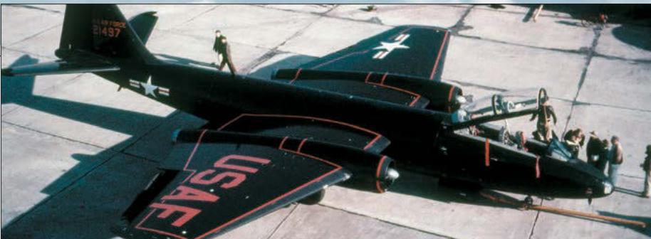

On their second attack run of the day, they were pounded by ground fire. Cannon shells punched into the cockpit area and blew away large sections of wing and flap surface.

With an engine on fire and backseater Joyner critically injured and losing blood, Mason nursed the B-57 home and brought it in for a landing with severe damage. Both crew and machine survived.

# Middle Child

The Canberra, or Martin B-57 as it was known within USAF, began as a design by the English Electric Co. in the UK. In the US, the Glenn L. Martin Co. license-built it, and it first entered Air Force service in 1953.

The B-57 met the Air Force requirement for a medium-range tactical bomber. It went on to fill the gap in the post-Korean War period as a nuclear-armed intruder, serve as a highly adaptable test bed for many development programs, and deliver an impressive performance during the Vietnam War.

Despite decades of solid and varied service, the B-57 is an often-overlooked USAF aircraft.

# I Was Smitten

But I knew it well. I grew up in England, near RAF Wyton, home of the Royal Air Force’s last Canberra squadrons.

My grandfather had worked on the bombers during his RAF career, and I was smitten with the plane as a child.

In my 20s, I began a series of email conversations with former crews that

Ferry crews pick up a new B-57B at Glenn Martin Arpt., Md., in 1955. This B model clearly shows early night intruder paint work and the hinged canopy.

had maintained and flown the Canberra. This gradually snowballed into a much larger oral history project.

Ten years later—last fall—I completed a book, The Canberra Experience, compiling recollections and photos of airmen from 11 of the many countries that flew this aircraft.

On these pages are some of the photos I collected while working on the book.

A B-57B Canberra on the prowl over South Vietnam. The type was used heavily during the war. Although they were effective in ground attack, man were destroyed in combat or because of guerilla attacks.

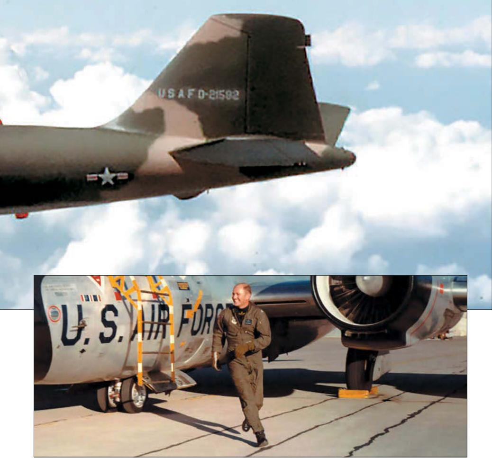

Air Force Lt. Col. Charles Leonard exits his WB-57F at a run. He had just completed more than 1,000 fl ight hours in the type. Leonard was one of the few to have fl own in all models, amassing over 5,000 hours total.

# He Asked. AFA Answered.

In 2014, Steven Beeny contacted the Air Force Association, looking for members willing to tell their personal B-57 stories for the US Air Force section of his book, The Canberra Experience. AFA obliged Beeny by sending out a blast email seeking Canberra reminiscences, and the association’s marketing director went on to ask him if he was a member—hint, hint. Beeny joined.

By the way, he reported that AFA’s call for B-57 veterans generated six replies in less than an hour. The members at right are included in Beeny’s book. —The Editors

B-57 FACTS

Number built (USAF): 403

First Flight:   
07.20.1953   
(US-built aircraft)

First Flight Location: Middle River, Md.

Models/Variants: B-57, EB-57, RB-57, WB-57

Retired: 1974 (RB-57). 1982 (ANG EB-57)

# USAF Nickname: Cranberry

# In Service With:

Argentina, Australia, Chile, Ecuador, Ethiopia, France, India, New Zealand, Peru, Rhodesia, South Africa, Sweden, UK, Venezuela, West Germany (English Electric version). Pakistan, Republic of China, US (Martin version).

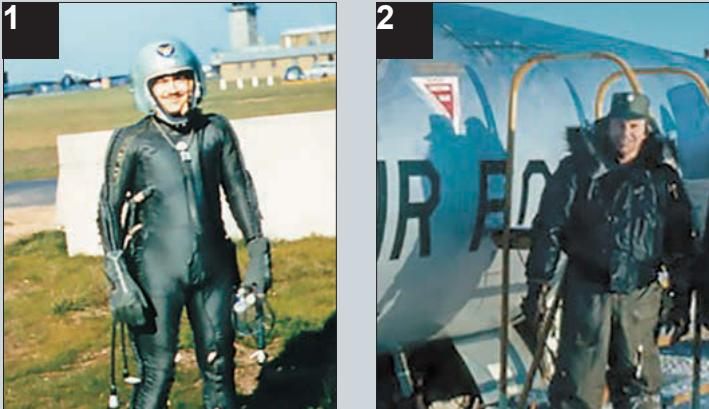  
/1/ Now a retired USAF major general and an Alamo Chapter (Texas) member, Gerry Cooke poses in 1955 at Rhein Main AB, West Germany, in high-altitude gear. /2/ Bertrand Buckhout, now a retired USAF colonel and a member of Michigan’s Mount Clemens Chapter, stands next to an RB-57A at Elmendorf AFB, Alaska, in 1957. He was assigned to the 172nd Tactical Reconnaissance Squadron, Battle Creek, Mich.

# CHAPTER NEWS

# LANCE P. SIJAN CHAPTER

The Lance P. Sijan Chapter (Colo.) held an impressive Casino Night in February for wounded airmen in Colorado Springs, Colo. It was a “fresh new approach” to the chapter’s annual fundraiser for the Wounded Airman Program, said Colorado State President Linda Aldrich.

Some 400 people attended the event, held on the last day of the Cyberspace Symposium, which was hosted by the Armed Forces Communications and Electronics Association.

The chapter raised $\$ 6,000$ from door prize tickets and donations. All of that money went toward ily Programs, for the Wounded Airman Program, said Aldrich. One of the top prizes for locals was the chance to host their own mini Casino night, which came with a gaming table and a dealer. Other prizes were Cuban cigars, gift cards to stores and restaurants, and beverages. All prizes were donated by chapter members or Community Partners.

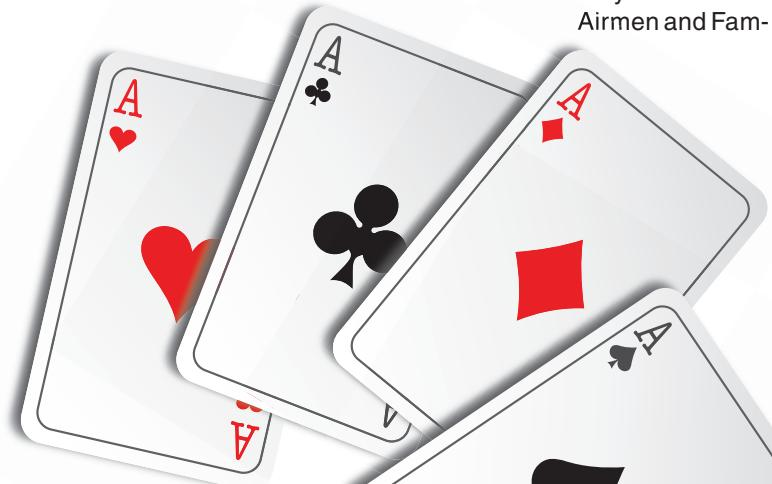  
The Lance P. Sijan Chapter held a Casino Night to raise funds for AFA’s Wounded Airman Program. Some 400 people attended the fund-raiser in Colorado Springs, Colo.

The event was such a success that other AFA chapters asked for help to host similar events, she said.

AFA Chairman of the Board F. Whitten Peters, AFA Executive Vice President Denise Hollywood, and AFA Director Emeritus Jerry White were also present.

# SHOOTING STAR CHAPTER

The Shooting Star Chapter (N.J.) heard from one of their own during a chapter meeting in February. Aviation artist Keith C. Ferris talked about his latest completed artwork, “Lightning at Sea.”

“We ask him periodically if he would like to give us a talk,” said Chapter Treasurer Howard Leach.

Ferris explained to a crowd of 20 people how he started sketching the painting on a napkin, “drawing the objects using descriptive geometry with adjustments for the horizon, [and] painting of the objects with warm and cool colors using just three basic colors,” said Leach.

This was the third and last installment of F-35 paintings commissioned by Pratt & Whitney, said Leach. The painting shows an F-35C taking off from soonto-be commissioned aircraft carrier USS Gerald R. Ford, according to a Pratt & Whitney news release.

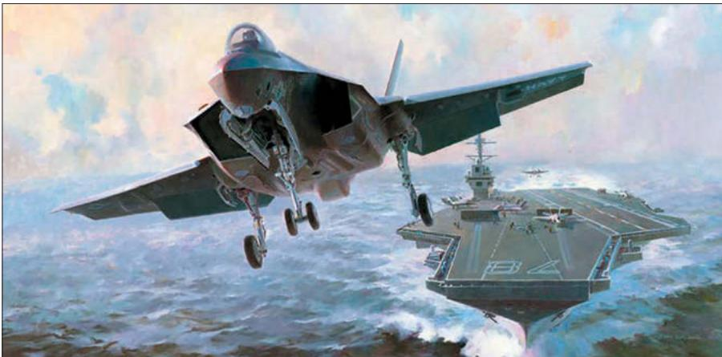  
A close-up of Shooting Star Chapter member Keith Ferris’ painting, “Lightning at Sea.” Ferris, an aviation artist, talked about the painting at a chapter meeting in February.

“It’s like a photo. Only better,” said Leach.

# AFA EMERGING LEADER: Evan T. McCauley

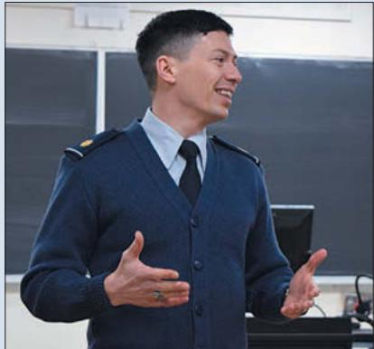

Home State: New Jersey   
Chapter: Baltimore Chapter   
Joined AFA: 2004   
AFA Offi ce: Maryland State President   
Military Service: 2006-current,   
Active Duty   
Occupation: Engineer,   
AFROTC instructor   
Education: B.S., Computer   
Engineering, B.S., Electrical   
Engineering, North Carolina State   
University; M.A., Military Studies,   
Air University

Maj. Evan McCauley, an AFROTC instructor at the University of Maryland and Maryland State President, speaks to his cadets in March.

the Air Warfare Symposium. In particular, in my role as an ROTC instructor, my AFA membership gives me the chance to connect my cadets (our future AF leaders) with unique opportunities like last year’s Airpower Advocates teleconference with then-CSAF General Welsh!

# What does AFA need to do to get more members?

I don’t need more members. I need more involvement. I need more active members doing things in the community that support that AFA mission. ... Give me [fewer] members [who] are more actively engaged and I’ll turn this state upside down for AFA!

# How did you fi rst hear of AFA?

I joined AFA as a cadet member ... and then my involvement took a nosedive when I commissioned and went Active Duty in 2006. That’s probably a common trend with [Arnold Air Society] members, one that I am trying to address with our

Arnies. ... I reactivated my AFA membership in summer 2015.

What do you enjoy most about it? Hands down, the best [things] ... are the professional development opportunities like Air, Space & Cyber Conference and

# How do we build awareness about it?

Engagement. Human connection at the fi eld level. ... If we do a good job of engagement at the fi eld level and develop a strong base of active membership, expect that will snowball into both higher membership and higher awareness of AFA.

# Get your Airman for Life polo by visiting our Affi nity partnerTarget Marketing Group at THE HANGAR

www.tmgwebstores.com/thehangar

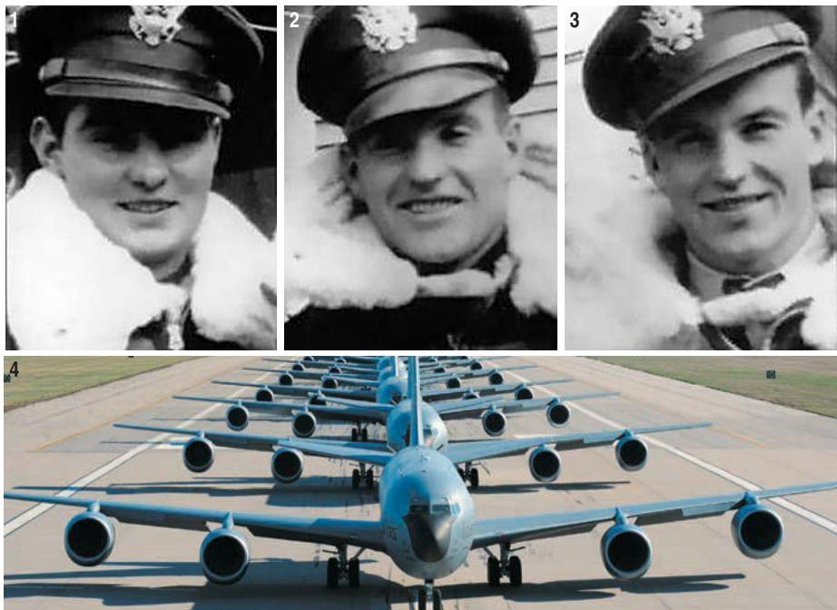

Born: April 9, 1923, Wichita, Kan.   
Died: July 10, 1943 (KIA), Guadalcanal, Solomon Islands   
Service: US Army Air Forces   
Era: World War II   
Combat: South Pacific   
Final Grade: Second Lieutenant   
Years Active: 1943   
Occupation: US military officer

# Brothers in Arms

They were the “Flying McConnells,” three brothers from the American heartland who gained lasting fame in air battles of World War II. Thomas L., Fred J., and Edwin M. McConnell, all natives of Kansas, today lend their illustrious surname to one of the Air Force’s largest bases.

Born: April 23, 1918, Wichita, Kan.   
Died: Oct. 22, 1945, Garden Plain, Kan. Service: US Army Air Forces   
Era: World War II   
Combat: South Pacific   
Final Grade: Captain   
Years Active: 1943-45   
Occupation: US military officer

The three all grew up in Wichita and attended North High School, where they excelled in academics and sports. Fred was 24, Edwin was 21, and Thomas was 19 when they joined the Army Air Forces as aviation cadets on the same day (March 22, 1943) at Fort Riley, Kan. They trained together in California and received their pilot’s wings on the same day at Luke Field, Ariz.

# McCONNELL

# FRED JUNIOR McCONNELL

# THOMAS L. McCONNELL

The brothers were a media sensation, billed as “Three of a Kind.” All three became B-24 copilots and joined the same squadron in the South Pacific theater, where they went into action on the same day. Yet the brothers fought together for only a few months.

Second Lt. Thomas McConnell, the youngest of the three, was killed in action on July 10, 1943, on his third combat mission. His B-24 had just bombed Japan’s Kahili airfield at Bougainville and was returning to base on Guadalcanal when the bomber, in dense fog, crashed into a mountainside. All 11 crew died. Thomas was 20.

The other two McConnells survived the war. Fred flew 61 missions and attained the grade of captain only to perish on active duty after returning home. He was a military flying instructor stationed at Cook Field, Neb., and was flying to a new assignment at Garden Plain, Kan., when his aircraft on Oct. 22, 1945, struck a power line and crashed. Fred was killed instantly. He was 27.

Edwin flew 56 combat missions and returned home with a Distinguished Flying Cross. He resigned from active duty in August 1945 and spent two years as a commercial airline pilot, eventually enrolling in college and taking a job in industry. Edwin remained in the Air Force Reserve and finally ended his military career in 1981. Retired Lt. Col. Edwin McConnell died at his home in Englewood, Colo., on Sept. 1, 1997. He was 76.

On April 12, 1954, Wichita AFB, Kan., was rechristened McConnell Air Force Base in honor of Tom and Fred. Edwin was not included due to policy against naming a base after a living person. At a rededication ceremony on June 14, 1999, Edwin’s name was added.

Throughout World War II, B-29s were built at a Boeing factory adjacent to the base. McConnell became a Strategic Air Command base for B-47 bombers. Today, McConnell’s mission is to provide global reach via its many airlift and tanker aircraft.

# EDWIN MAURICE McCONNELL

Born: Jan. 29, 1921, 0Wichita, Kan.   
Died: Sept. 1, 1997, Englewood Colo.   
Colleges: Michigan State University,   
University of Colorado   
Service: US Army Air Forces, Air Force Reserve Era: World War II   
Years Active: 1943-45 (active duty); 1945-81 (Reserve duty)   
Combat: South Pacific   
Final Grade: Lieutenant Colonel   
Honors: Distinguished Flying Cross   
Occupations: US military officer, Engineer

# McCONNELL AFB, KAN.

State: Kansas   
Nearest City: Wichita   
Area: 4.7 sq mi/3,000 acres   
Status: Open, operational   
Opened (Wichita Municipal Airport):   
June 28, 1929   
Leased: by USAAF August 1941   
Returned to Civilian Use: Oct. 11, 1942   
Reopened: (by USAF) May 31, 1951   
Renamed: Wichita AFB, May 15, 1953   
Renamed: McConnell AFB, April 12, 1954   
Current Owner: Air Mobility Command   
Former Owners: Air Training Command, Strategic   
Air Command, Tactical Air Command, Air Combat   
Command   
Home of: 22nd Air Refueling Wing

1. Thomas McConnell. 2. Fred McConnell. 3. Edwin McConnell. 4. KC-135s perform an elephant walk on the runway at McConnell AFB, Kan. Tanker and transport aircraft at the Air Mobility Command base sustain airpower operations worldwide.

# USE THE CREDIT CARD THAT SUPPORTS THE AIR FORCE ASSOCIATION.

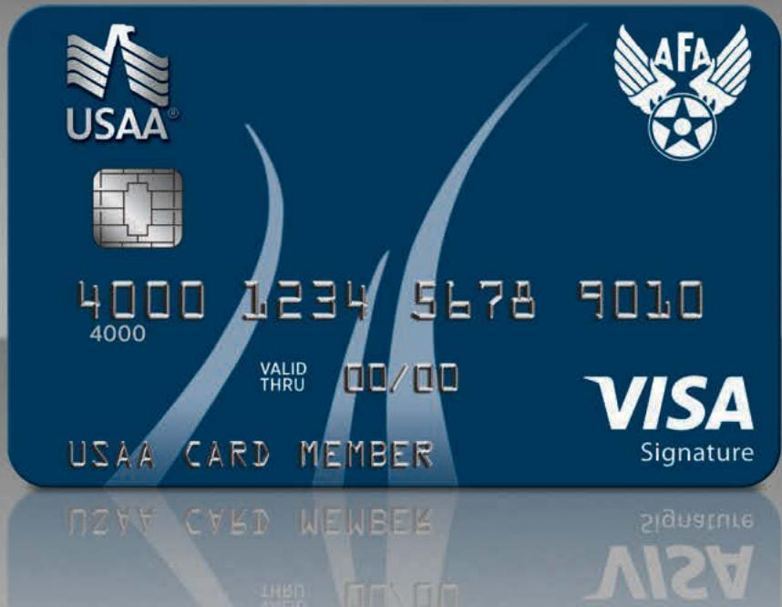

USAA Bank is proud to offer members ways to support organizations like the Air Force Association. You can also benefit from great rewards, competitive rates and USAA’s legendary customer service. Plus, now you can extend your support by redeeming your rewards points for a donation to the Air Force Association.

# APPLY TODAY.

usaa.com/afavisa or 877-618-2473

USAA means United Services Automobile Association and its affiliates. USAA products are available only in those jurisdictions where USAA is authorized to sell them.

# Flying together

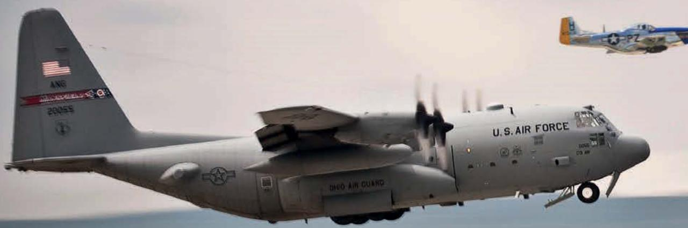

For seven decades, U.S. Air Force pilots have taken to the skies, and Rolls-Royce has proudly supplied thousands of engines to keep them aloft. From the early V-1710 engines powering P-51 Mustangs, to the current fleet of C-130Js, CV-22s and Global Hawks powered by Rolls-Royce AE engines, our facility in Indianapolis has kept those aircraft soaring.

Congratulations for 7o years full of aerospace innovation. We've been happy to be along for the ride into the wild blue yonder.