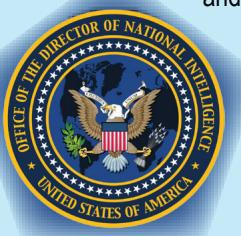
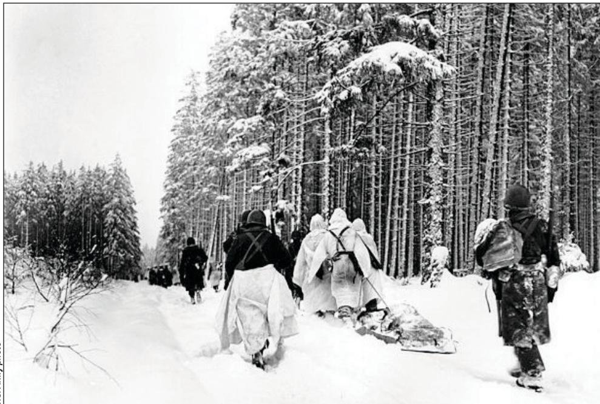
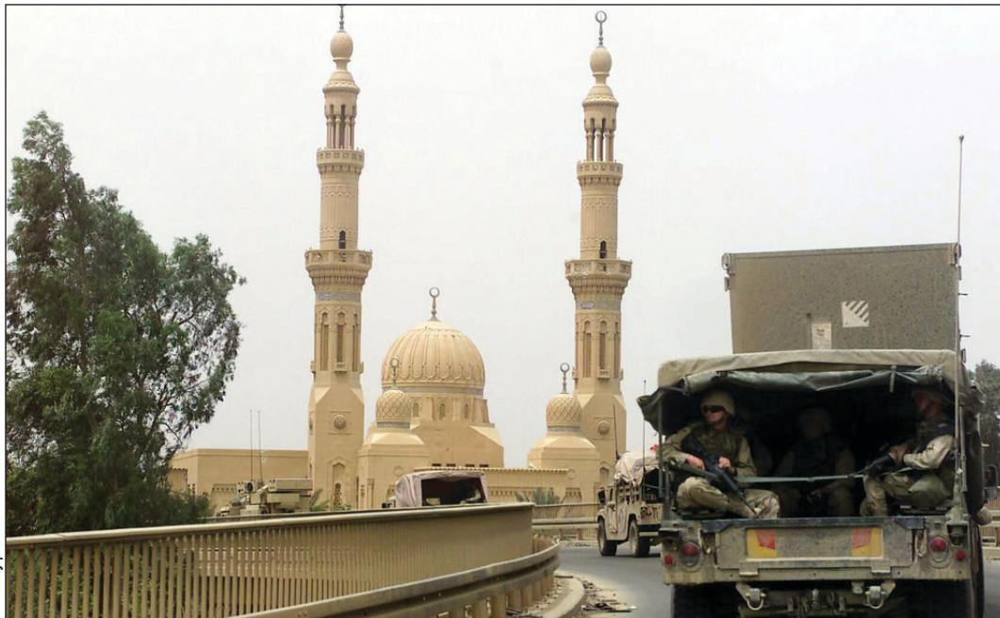
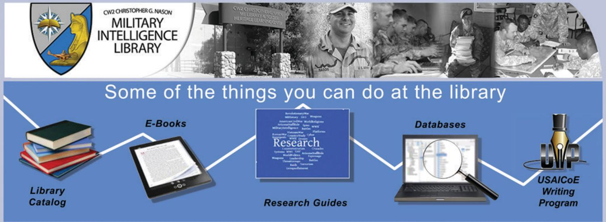

# Cognitive Biases and the Need for Analytic Tradecraft Standards in Large-Scale Ground Combat Operations

by Major James Kwoun

When inferring the causes of behavior, too much weight is accorded to personal qualities and dispositions of the actor and not enough to situational determinants of the actor’s behavior.

—Richards J. Heuer Jr.

# Introduction

The U.S. Army’s focus on prevailing in large-scale ground combat operations will present unique challenges for the intelligence warfighting function. As stated in FM 3-0, Operations, these types of operations have historically been “more chaotic, intense, and highly destructive than those the Army has experienced in the past several decades.”1 The enormous pressures generated during large-scale ground combat operations will make Army all-source analysts particularly vulnerable to cognitive biases. Dr. Richards Heuer Jr., author of the Psychology of Intelligence Analysis, defines cognitive biases as “predictable mental errors caused by simplified information processing strategies.”2 Studies have shown that these biases become more likely under ambiguous, traumatic, and time-constrained circumstances, which are exactly the challenges analysts will encounter during a large-scale ground combat operations environment.3

The Army’s past participation in large-scale ground combat operations suggests these challenges are enduring and will require a Service-wide solution. The Army can mitigate the inevitable onset of cognitive biases in its analysts by implementing analytic tradecraft standards. Cognitive biases are manageable and even preventable because they are natural tendencies that recur throughout history. This article will examine historical lessons to identify examples of cognitive biases that could re-emerge in future large-scale ground combat operations.

# Cognitive Biases and Analytic Tradecraft Standards

Cognitive biases are natural human tendencies to rely on experiences or what Dr. Heuer calls pre-existing “mental models” when thinking about issues.4 Our brains subconsciously develop patterns of thought and general expectations based on life experiences. These thought patterns and expectations can be valuable, especially if they develop into expertise. They can also become a liability because they vary widely between individuals and place limits on thinking. For example, Army analysts may subconsciously filter out enemy courses of action that are inconsistent with their experiences. Additionally, analysts may automatically default to previously successful mental templates or frameworks when assessing current threats with similarities to past threats. These situations leave commanders to gamble the success of their operations on the intuition of analysts operating without a common framework to mitigate cognitive biases.

The intelligence community recognized the importance of mitigating cognitive biases and established eight analytic tradecraft standards, which eventually became nine standards, when it first published ICD 203, Analytic Standards, in 2007.5 This directive applies primarily to those all-source organizations under the purview of the Director of National Intelligence, signified by whether they received funding through the National Intelligence Program. ICD 203 is not binding on the entire Army unless directed by policy, given that only a portion of the Army Military Intelligence Corps is funded through the National Intelligence Program or conducts a national-level mission. However, ICD 203 is based on widely applicable principles that promote critical and creative thinking. An examination of past large-scale ground combat operations reveals the enduring need for critical and creative thinking to mitigate cognitive biases. The nine analytic tradecraft standards in ICD 203 provide the Army with a starting point toward this end.

# ICD 203 and Army Doctrine

ATP 2-33.4, Intelligence Analysis, 10 January 2020, includes an appendix that details the Intelligence Community Analytic Standards established by ICD 203, as well as the integration of the standards into Army intelligence analysis in action.6 Army doctrine forms a systematic body of thought describing how Army forces intend to operate. It applies to all operations, describing how to think about operations and what to train. It is an authoritative guide for leaders and Soldiers.7

# Analytic Standards

# Objectivity

Unbiased perspective, free of emotion

Timeliness Delivery of timely, accurate, and relevant intelligence

Political Neutrality Not distorted by political views

All Sources   
Based on all   
relevant information   
Tradecraft   
Quality and reliability   
of sources

# Analytic Tradecraft Standards:

• Properly describe the quality and credibility of all underlying sources, information, and methodologies.   
Properly express and explain uncertainties associated with major analytical judgments.   
Properly distinguish between underlying intelligence information and analysts’ assumptions and judgments. Incorporate analysis of alternatives.   
Demonstrate relevance and address implications.   
Use clear and logical argumentation.   
Explain change to or consistency of analytical judgments.   
Make accurate judgments and assessments.   
• Incorporate effective visual presentations when feasible.

# Historical Case Studies

Three case studies demonstrating cognitive bias are described below: Battle of the Bulge, Gulf War Scud hunt, and consolidating gains during Operation Iraqi Freedom.

Case 1: Battle of the Bulge. The Battle of the Bulge was the last major German offensive on the Western Front during World War II. On December 16, 1944, a German force consisting of 38 divisions and 240,000 troops attacked a weak part of the Allied line across the Ardennes forest, achieving complete surprise.9 This operation was Adolf Hitler’s risky attempt to regain the initiative and reverse the tide of the war through a decisive victory. Initially, United States Army GEN Omar Bradley assessed that the Germans were merely conducting a spoiling attack to disrupt Allied offensive preparations farther north, indicating the degree to which the Allies were caught off guard.10 The Allies ultimately defeated the German offensive, but the cost of unpreparedness was high. Reports indicated American casualties were 41,315 people killed, wounded, and missing in the 18-day period between December 16 and January 2.11 The actual numbers were likely higher, and American casualties may have totaled 75,000 by the time the battle ended in late January.12

Apparent anchoring biases existed throughout Allied formations before the battle. As Dr. Heuer describes, anchoring biases occur when “some starting point, perhaps from a previous analysis of the same subject or from some partial calculation,” subconsciously influences analysts to arrive at conclusions close to that starting point.13 This type of bias can be so powerful that even arbitrary anchors or starting points can influence analysts. Between September and December 1944, Allied “optimism” that the Germans were nearing defeat “conditioned all estimates of the enemy’s plans and capabilities,” according to the United States Army Center for Military History.14 Four days before the German attack, $1 2 ^ { \mathrm { t h } }$ Army Group intelligence assessments were still reinforcing this optimism and highlighting the Germans’ deteriorating military situation.15 In this case, the general tone of optimism served as an anchor or starting point that appeared to have subconsciously biased analysts and commanders into making conclusions that the Germans were incapable of offensive operations.

Confirmation biases may have reinforced this anchoring effect. Confirmation biases occur when analysts subconsciously recall or interpret information in a manner that supports their existing beliefs. By December 1944, Allied intelligence had largely concluded that the rugged, heavily forested region of the Ardennes was merely a transit point for the Germans to shift forces north and south. The official United States Army history of the battle also suggests that the Allies ruled out a German offensive in the area because of a “subconscious assumption” that the Ardennes was “impassable” for vehicles.16 These conclusions influenced how the Allies filtered and interpreted new information. For example, two United States divisions near the Ardennes reported increased nighttime vehicle activity by the Germans in the days leading up to the battle.17 These reports were discounted as normal occurrences as enemy units transited the area. Confirmation bias even filtered down to the regimental level. One regimental commander even “rebuked” his S-2 for labeling increased German vehicular activity as “enemy movement,” according to the United States Army Center for Military History.18

cal decisions. The decision calculus that Hitler used turned out to be far different from the one the Allies assumed the Germans would use.

Case 2: Gulf War Scud Hunt. Iraqi Scud missiles represented a strategic concern for the George H. W. Bush administration during Operation Desert Storm in 1991. The Iraqis fired 88 Scuds against targets in Israel and Saudi Arabia throughout the 44 days of the conflict, with 26 of these attacks occurring against Israel in the first week.21 The Scuds themselves were inaccurate, unreliable, and militarily insignificant. However, Israeli threats to retaliate against Iraq concerned the Bush administration because of the diplomatic and political implications if Israel followed through. The administration feared Israeli military action would cause Arab members to leave the coalition that formed after Iraq invaded and occupied Kuwait in August 1990. As Michael Gordon and Bernard Trainor write in The Generals’ War, “there were few things the president and his top aides worried about more” than keeping Israel out of the war.22 Despite this emphasis, the coalition’s counter-Scud campaign failed to prevent strikes against Israel and never produced a confirmed kill of a mobile launcher.

  
American troops drag a heavily loaded ammunition sled through the snow as they move for an attack on Herresbach, Belgium, January 1945.

The intelligence community made a faulty assumption that contributed to the lack of preparedness to address the Iraqi Scud threat. Cognitive biases frequently manifest themselves in the form of assumptions that analysts take

Another cognitive bias may have influenced the Allies— mirror imaging. The mirror-imaging bias occurs when analysts project their own mindset onto others or assume that adversaries will act in the same manner as the United States. In retrospect, the German offensive was overly ambitious and irrational if viewed from an Allied military perspective. Hitler squandered valuable resources in a risky operation from which the German military never recovered. Allied commanders were expecting “an enemy reaction which would be rational and therefore predictable” before the battle, according to the U.S. Army Center for Military History.19 Furthermore, the Allies expected that the highly respected German commander in the West, Field Marshal Gerd von Rundstedt, would realize the limitations of his forces and wage a defensive campaign within his means.20 It turned out, however, that Hitler was making all the critifor granted because of subconscious beliefs. Before the war, the intelligence community assumed that Iraqi Scud crews would follow the same launch procedures that the Soviet Union had used, which took up to 90 minutes.23 Iraqi Scuds at the time were modified Soviet missiles that could be fired from fixed sites or mobile transporter erector launchers. These launchers proved to be particularly challenging to detect and target. If Iraq had used Soviet procedures, coalition forces could have targeted the mobile transporter erector launchers with a reasonable chance of success. Instead, Iraq skipped many Soviet calibration procedures and reduced the time for these launchers to launch and evacuate an area to 10 to 30 minutes.24 Gen. Merrill McPeak, the Air Force Chief of Staff at the time, remarked after the war, “we put about three times the effort that we thought we would on this job [of destroying Scuds].”25

GEN Norman Schwarzkopf, U.S. Central Command commander at the time, provided congressional testimony that is relevant to this discussion of cognitive biases. Cognitive biases are hard to detect because they exist in the subconscious mind. At the same time, the conditions that make these biases more likely are easier to identify. After the war, GEN Schwarzkopf testified that the intelligence community needed a “standardized methodology…for making estimates and predictive analysis.”26 He criticized the intelligence community for providing “unhelpful” analysis that was “so caveated” and contained “so many disclaimers” in an apparent effort to hedge against being incorrect.27 In one anecdote, he described the irony involved when a battle damage assessment claimed a bridge was only 50 percent destroyed despite the fact that no vehicles could cross it.28 GEN Schwarzkopf’s testimony reinforces the importance of uniform standards on how to express analytic uncertainty and clearly communicate conclusions to commanders. Enforcing these standards will prevent cognitive biases by requiring analysts to put thought into their arguments with a level of rigor that otherwise would not occur.

Case 3: Consolidating Gains during Operation Iraqi Freedom. The legacy of Operation Iraqi Freedom is one in which U.S. and coalition partners were successful in their initial military objectives but failed to consolidate gains sufficiently to enable enduring success. In March 2003, President George W. Bush ordered the initiation of Operation Iraqi Freedom to remove Saddam Hussein from power. In less than 3 weeks, United States–led coalition forces seized the capital Baghdad and ended Hussein’s regime in Iraq.

  
A V Corps convoy enters Baghdad April 26, 2003, at the end of its journey “jumping” the corps main command post from Camp Virginia, Kuwait, to Camp Victory on the outskirts of Baghdad.

The coalition struggled, however, to bring stability throughout the country and adjust as an insurgency began developing. Soon, United States forces became involved in sustained counterinsurgency and counterterrorism operations in Iraq that lasted for years, stretching Army resources in particular to a critical point. The consolidation of gains will always be an important requirement during large-scale ground combat operations, one for which the Army must continuously prepare.

The U.S. military intelligence community exhibited cognitive biases when assessing the enemy that the Army expected would resist the coalition’s drive to seize Baghdad. Before the war, military intelligence analysts focused on studying Iraq’s elite Republication Guard and conventional army formations. An Army War College study of the war states that the United States–led coalition had an “analytical bias toward a familiar, hierarchical, Soviet-style enemy.”29 Because of this anchoring bias, analysts initially failed to forecast the significant role that Iraq’s paramilitary forces would play during the fight to remove Hussein from power. Furthermore, the same Army War College report describes how intelligence analysts before the war had difficulty “analyzing new information outside their premade templates of Iraqi regime forces.”30 This description fits the classic definition of confirmation biases, in which analysts subconsciously filter new information in a manner that supports their pre-existing beliefs or mental frameworks. Thus, an initial anchoring bias appears to have influenced military intelligence analysts, which confirmation biases continued to reinforce.

These biases endured even after the fall of Baghdad as coalition forces began efforts to consolidate gains. The U.S.-led coalition remained anchored in a conventional warfighting mindset even as the focus turned to counterinsurgency operations. Consequently, military intelligence analysts “continued to try to explain the enemy in terms of large land forces,” according to the same Army War College report cited earlier.31 COL Derek Harvey, an intelligence officer in Iraq at the time, expressed frustration that “unless you could lay out a militarystyle hierarchy of command and control, a bad organization didn’t exist.”32 These anchoring biases prevented intelligence analysts from achieving a more comprehensive understanding of the political, social, and economic factors driving the growing violence at the time. The coalition’s continued fixation on conventional warfighting even as an insurgency was developing suggests that confirmation biases occurred as well, with analysts interpreting new information through a lens that reinforced the initial anchoring bias.

# Recommendations

The Army must recognize the importance of mitigating cognitive biases to prepare for future large-scale ground combat operations and avoid repeating the mistakes of the past. Cognitive biases are inevitable to varying degrees, but they can be managed and even prevented if deliberate steps are taken. Analysts can mitigate the biases illustrated in the case studies, for example, by employing three techniques.

$\blacktriangle$ First—Routine checks of key assumptions can increase the odds of recognizing subconscious biases. Cognitive biases often manifest themselves as hidden assumptions that analysts do not even realize they are making.   
$\blacktriangle$ Second—Analysts should identify at least one plausible alternative and associated indicators every time a major analytic conclusion is being made. This process will ensure analysts consider all plausible possibilities, rather than settling on the first reasonable conclusion that comes to mind.   
$\blacktriangle$ Third—An emphasis on inclusivity can prevent groups from being dominated by a single mental paradigm of how to approach problems. In short, teaching analysts good habits can mitigate cognitive biases.

As the Army prepares for future large-scale conflicts, it will need a comprehensive approach for mitigating cognitive biases beyond these three historical examples. The case studies provide only a mere sampling of the many cognitive biases that occur routinely. The Army will need to institutionalize analytic tradecraft standards across the force to establish a common set of expectations and a culture that demands rigor in all-source analysis at all levels. Furthermore, the Army should teach structured analytic techniques that can help analysts adhere to tradecraft standards and avoid common mental pitfalls. Application of these tradecraft standards and structured techniques can be deliberate or done in an abbreviated manner, depending on the circumstances. They can also be applied at the lowest echelon. Analysts at the tactical level are arguably the most vulnerable to cognitive biases. Dr. Heuer states that cognitive biases affect accurate perception the most when analysts encounter ambiguous situations, vivid or traumatic events, and time-sensitive circumstances.33 Army analysts at the tactical level in a future large-scale conflict are likely to encounter these conditions simultaneously.

When implementing analytic tradecraft standards, the Army should align itself with the rest of the intelligence community and the Defense Intelligence Enterprise to ensure interoperability. The nine tradecraft standards in ICD 203 represent a starting point for all-source analytic organizations in the intelligence community. The Defense Intelligence Agency (DIA), for example, has its own tailored standards nested under those in ICD 203. Most civilian analysts assigned to combatant commands are also subject to DIA standards as agency employees. The Army should ensure its analytic tradecraft standards are also nested under ICD 203 and consistent with DIA-specific tradecraft, while ensuring these standards are sufficiently tailored to the Army’s mission.

# Conclusion

This careful balancing of analytic tradecraft standards can be achieved through frequent working groups and annual tradecraft conferences between the military Services, combatant commands, DIA, and the rest of the intelligence community. This type of collaboration will ensure that all-source analysts throughout the intelligence community are mitigating cognitive biases and adhering to the same standards of rigor in support of Army and joint commanders.

# Epigraph

Richards J. Heuer Jr., Psychology of Intelligence Analysis (Langley, VA: Center for the Study of Intelligence, Central Intelligence Agency, 1999), 127, https://www.ialeia.org/docs/Psychology_of_Intelligence_Analysis.pdf.

# Endnotes

1. Department of the Army, Field Manual 3-0, Operations (Washington, DC: U.S. Government Publishing Office [GPO], 6 October 2017), 1-2. Change 1 was issued on 6 December 2017.

2. Heuer, Psychology of Intelligence Analysis, 2.

3. Ibid., 14, 116.

4. Ibid., 4.

5. “Our Values: Objectivity,” Office of the Director of National Intelligence website, accessed April 27, 2020, https://www.intelligence. gov/mission/our-values/342-objectivity?fbclid $=$ IwAR1hBf94t3QSphCajJBWhIYvfjS1P8SvCUap9-8Be_p3V29PO3kELF2Q-4.

6. Department of the Army, Army Techniques Publication (ATP) 2-33.4, Intelligence Analysis (Washington, DC: U.S. GPO, 10 January 2020), xiv.

7. Department of the Army, Training and Doctrine Command (TRADOC) Regulation 25-36, The TRADOC Doctrine Publication Program (Washington, DC: U.S. GPO, 21 May 2014), 16.

8. Department of the Army, ATP 2-33.4, Intelligence Analysis, 1-8. Adapted from Figure 1-4. Analytic standards.

9. Mark Perry, Partners in Command: George Marshall and Dwight Eisenhower in War and Peace (New York: The Penguin Press, 2007), 339.

10. Ibid., 340.

11. Hugh M. Cole, The Ardennes: Battle of the Bulge (Washington, DC: U.S. Army Center for Military History, 1964), 674, https://history.army.mil/html/ books/007/7-8-1/CMH_Pub_7-8-1.pdf.

12. “Battle of the Bulge,” U.S. Army Center for Military History, accessed May   
7, 2020, https://history.army.mil/html/reference/bulge/index.html.

13. Heuer, Psychology of Intelligence Analysis, 150.

14. Cole, The Ardennes, 57.

15. Ibid.

16. Ibid., 59.

17. Ibid.

18. Ibid.

19. Ibid., 57.

20. Ibid.

21. Anthony H. Cordesman, The Gulf War (Washington, DC: Center for Strategic and International Studies, 1994), 68, https://www.csis.org/ programs/burke-chair-strategy/lessons-war/gulf-war; and William Rosenau, Special Operations Forces and Elusive Enemy Ground Targets: Lessons from Vietnam and the Persian Gulf War (Santa Monica, CA: RAND Corporation,

2001), https://www.rand.org/content/dam/rand/pubs/monograph_reports/ MR1408/MR1408.ch3.pdf.

22. Michael R. Gordon and Bernard E. Trainor, The Generals’ War (New York: Little, Brown and Company, 1995), 231.

23. Cordesman, Gulf War, 65.

24. Ibid.; and Rosenau, Special Operations Forces, 32.

25. Stewart Powell, “Scud War, Round Two,” Air Force Magazine, April 1,   
1992, https://www.airforcemag.com/article/0492scud/.

26. “Schwarzkopf Critiques of Intelligence,” Intelligence Successes and Failures in Operations Desert Shield/Storm, Report of the Oversight and Investigations Subcommittee of the Committee on Armed Services, House of Representatives (Washington, DC: U.S. GPO, August 16, 1993), 30, https://apps.dtic.mil/dtic/ tr/fulltext/u2/a338886.pdf.

27. Ibid.

28. Ibid., 29.

29. Joel D. Rayburn and Frank K. Sobchak, eds., The US Army in the Iraq War: Volume 1 (Carlisle, PA: United States Army War College Press, 2019), 248, https://publications.armywarcollege.edu/pubs/3667.pdf.

30. Ibid., 104.

31. Ibid., 179.

32. Ibid.

33. Heuer, Psychology of Intelligence Analysis, 14, 116.

The MI Library website is located at: https://auls.insigniails.com/Library/Home?LibraryID=0010&Language=English