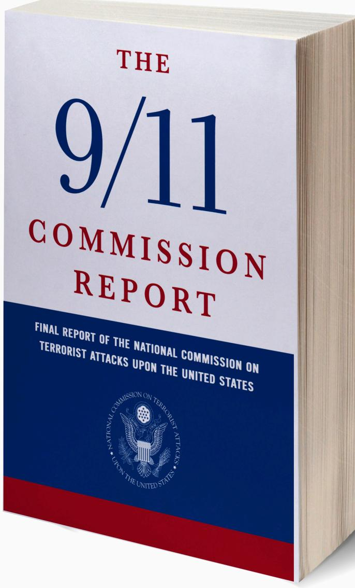
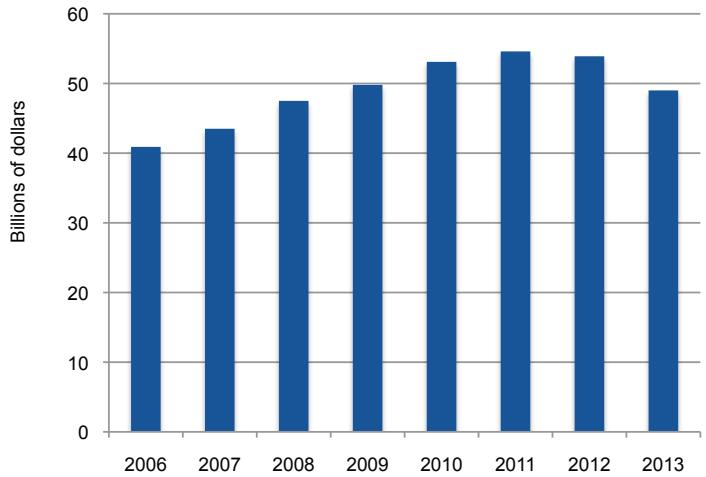
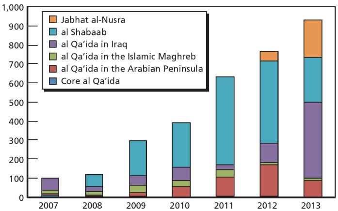
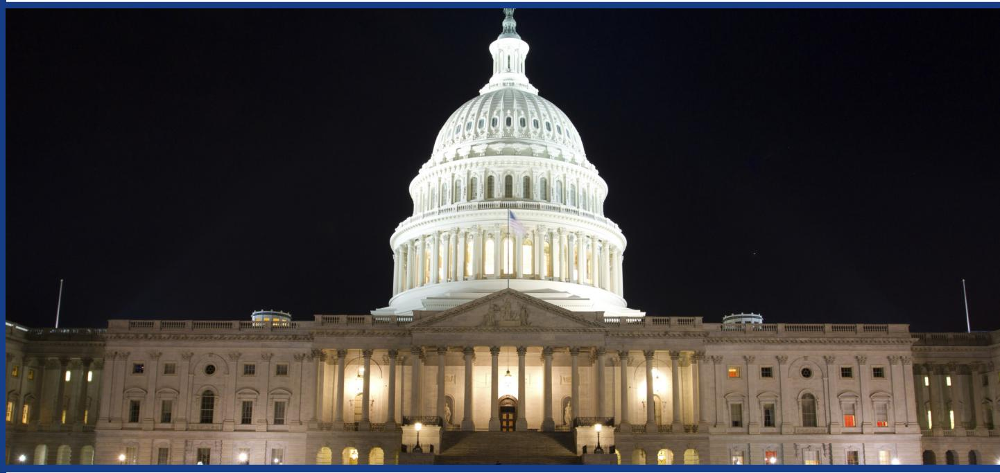
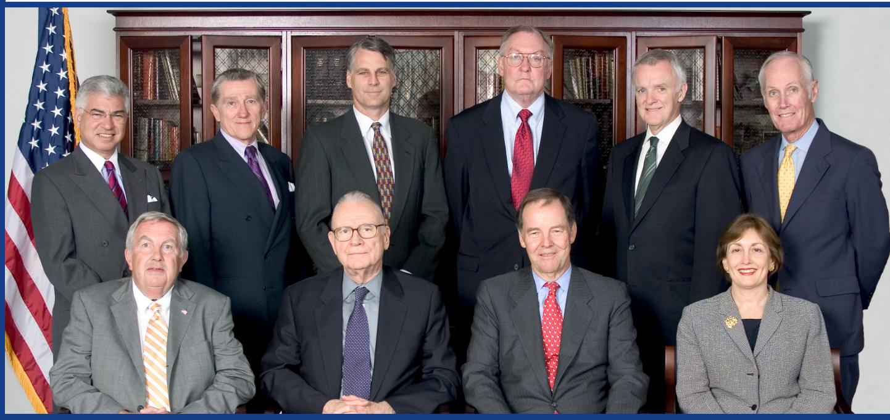
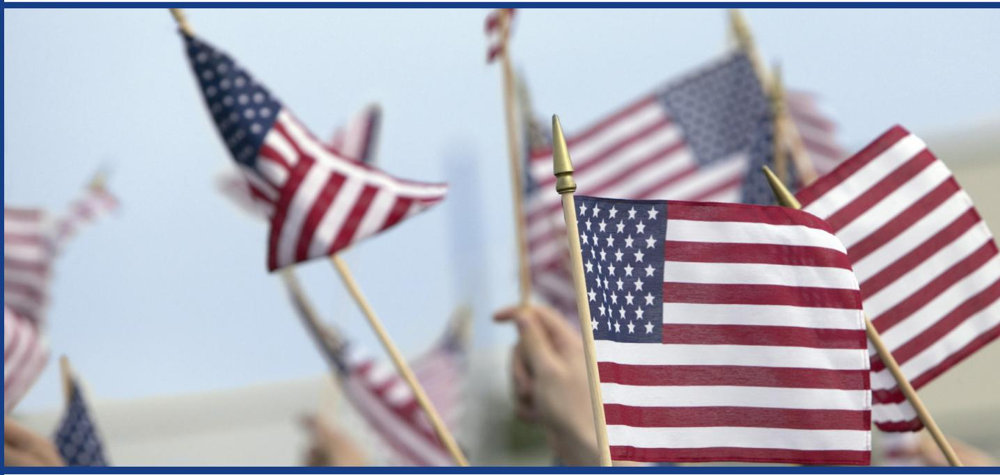

National Security Program Homeland Security Project

Today’s Rising Terrorist Threat and the Danger to the United States:

Reflections on the Tenth Anniversary of The 9/11 Commission Report

# A C K N O W L E D G M E N T S

The Bipartisan Policy Center would like to express its sincere appreciation for the support of the Annenberg Public Policy Center of the University of Pennsylvania and the Carnegie Corporation of New York, which made this report possible.

# D I S C L A I M E R

This report is the product of the former 9/11 Commissioners. The findings and recommendations expressed herein do not necessarily represent the views or opinions of the Bipartisan Policy Center, its founders, or its board of directors.

# Former 9/11 Commission Members

Thomas H. Kean Chair

Lee H. Hamilton Vice Chair

Richard Ben-Veniste Fred F. Fielding Jamie S. Gorelick

Slade Gorton Bob Kerrey John F. Lehman

Timothy J. Roemer James R. Thompson

#

National Security Program Homeland Security Project

# Acknowledgments

Over the past eight months, in anticipation of the 10th anniversary of The 9/11 Commission Report, the former members of the commission reconvened to reflect on how the world has changed over the past decade, to assess the current terrorist threat to the United States, and to agree on recommendations for improving U.S. national security.

The Bipartisan Policy Center sponsored and provided a home for this project. We thank BPC Homeland Security Project Director Carie Lemack for organizing and leading the process and express our gratitude to BPC President Jason Grumet, Senior Vice President Julie Anderson, Lindsay Boroush and her editorial team, and Michael Garcia for supporting this intensive effort.

We thank the Annenberg Public Policy Center (APPC) for its generous financial support for this project. In addition, APPC’s Director Kathleen Hall Jamieson and Director of Communications Michael Rozansky devoted considerable time to reviewing this paper and providing editorial and substantive input. We thank them for those contributions.

Over the course of this project, we had the opportunity to speak with many of the nation’s most senior current and former counterterrorism and national security officials. We are indebted to Director of National Intelligence James Clapper; Director of the Central Intelligence Agency John Brennan; Director of the National Counterterrorism Center Matt Olsen; Chairman of the Privacy and Civil Liberties Oversight Board David Medine; Director of the Federal Bureau of Investigation James Comey; Secretary of Homeland Security Jeh Johnson; National Security Agency General Counsel Raj De; former Secretary of Defense and Director of the Central Intelligence Agency Leon Panetta; former Secretary of Homeland Security Michael Chertoff; former Secretary of Homeland Security Tom Ridge; former Director of the Federal Bureau of Investigation Robert Mueller; former director of the National Security Agency General Keith Alexander; former Director of the National

Counterterrorism Center Michael Leiter; former Deputy Director of the Central Intelligence Agency Michael Morell; and former Assistant Secretary of Homeland Security David Heyman. While the views expressed in this paper are those of commissioners alone, we are indebted to these leaders for their time and expertise. Each of them spoke to us about the dedication, professionalism and sacrifices of their colleagues serving without fanfare to protect this country. We believe that if our fellow Americans had the same opportunity to speak directly with these leaders, they would share our profound respect and appreciation for their commitment to protecting the country. Each of them has our sincere thanks.

Peter Bergen and his team at the New America Foundation made a valuable contribution to the paper. We would also like to express our thanks to Alexis Albion, Warren Bass, Al Felzenberg, and Daniel Marcus for their thoughtful contributions. As always, Philip Zelikow, the executive director of the 9/11 Commission, provided sound advice and helpful suggestions.

Finally, Michael Hurley and Adam Klein assisted us greatly in the drafting of the paper. Their commitment was steadfast, and we relied immensely on their judgment and talents.

Thomas H. Kean, Chair

Lee H. Hamilton, Vice Chair

# □□□□

National Security Program Homeland Security Project

# Table of Contents

Acknowledgments. .   
Executive Summary..   
Introduction. .   
I: Evolving Threats 13 II: Looking Forward: Policy Challenges. . 17 Imagination. . . 17 Management. . . 20 Capabilities. . . 25 Policy. . . 29

# III: Bipartisanship in National Security .. 33

# IV: Recommendations. . 37

Sustaining Counterterrorism Authorities and Budgets. . . 37   
Congressional Oversight. . . 37   
Office of the Director of National Intelligence ... 38   
National Intelligence Program Budget. . . 38   
Defending the Cyber Domain. . . 39   
Transparency. . . 39

Conclusion .. 43

Endnotes. . 45

#

National Security Program Homeland Security Project

# Executive Summary

Ten years ago today, as members of the National Commission on Terrorist Attacks Upon the United States, we issued The 9/11 Commission Report, the official account of the horrific attacks of September 11, 2001. A decade later, we have reconvened, as private citizens, to reflect on the changes of the past ten years and the emerging threats we face as a country. In recent months, we have spoken with some of the country’s most senior current and recently retired national security leaders.

Here, in brief, is what we have learned:

The struggle against terrorism is far from over—rather, it has entered a new and dangerous phase. The dedicated men and women in the U.S. military and intelligence services have hit “core” al Qaeda—the Afghanistan- and Pakistan-based organization that struck the United States on 9/11—with hammer blows, most notably by killing Usama bin Ladin. But that does not mean that al Qaeda no longer poses a threat. Al Qaeda-affiliated groups are gaining strength throughout the greater Middle East. Two are most alarming. First, as of this writing, the fanatical Islamic State of Iraq and Syria (ISIS) has conquered parts of Syria and much of Western Iraq, slaughtering thousands of people in the process. As we wrote in The 9/11 Commission Report: If “Iraq becomes a failed state, it will go to the top of the list of places that are breeding grounds for attacks against Americans at home.” That nightmare scenario may now be coming to pass. Second, al Qaeda in the Arabian Peninsula has advanced bombmaking capabilities and has already attempted several attacks on U.S. aviation targets. While the various al Qaeda spinoffs are primarily focused on regional conflicts, they hate the United States and will not forego opportunities to strike at the U.S. homeland.

In short: The “generational struggle” against terrorism described in The 9/11 Commission Report is far from over. Rather, it is entering a new and dangerous phase, and America cannot afford to let down its guard.

Strenuous counterterrorism efforts will remain a fact of our national life for the foreseeable future.

Foreign fighters returning from Syria (and now Iraq) pose a grave threat to the U.S. homeland and Western Europe. More than 10,000 foreign fighters have flooded into Syria. Many are fighting alongside extremist groups there and in neighboring Iraq, learning battlefield skills and absorbing extremist ideology. More than 1,000 of them hold European passports, which (in most cases) would enable them to enter the United States without a visa. Of even greater concern, more than 100 American citizens have traveled to Syria. When these battle-hardened, radicalized fighters return to their home countries, they will pose a serious terrorist threat to both the United States and Europe.

Cyber readiness lags far behind the threat. The senior leaders with whom we spoke are uniformly alarmed by the cyber threat to the country. One former agency head said, “We are at September 10th levels in terms of cyber preparedness.” American companies’ most-sensitive patented technologies and intellectual property, U.S. universities’ research and development, and the nation’s defense capabilities and critical infrastructure, are all under cyber attack. Former National Security Agency Director General Keith Alexander has described the ongoing cyber theft of American intellectual property as “the greatest transfer of wealth in history.” One lesson of the 9/11 story is that, as a nation, Americans did not awaken to the gravity of the terrorist threat until it was too late. History may be repeating itself in the cyber realm.

Congress has proved resistant to needed reforms. In 2004, the Department of Homeland Security reported to 88 committees and subcommittees of Congress. We urged Congress to dramatically reduce that number. Incredibly, it has since increased to 92. This fragmented oversight detracts from national security by impeding the department’s development. Nor has Congress reformed its system for appropriating funds for the National Intelligence Program, leaving control over the intelligence budget similarly fragmented. Congress has passed numerous laws requiring executive branch agencies to implement far-reaching reforms, yet it has stubbornly refused to change its duplicative and wasteful oversight system.

Counterterrorism fatigue and a waning sense of urgency among the public threaten U.S. security. Many Americans think that the terrorist threat is waning—that, as a country, we can begin turning back to other concerns. They are wrong. The absence of another major attack on the homeland is a success in itself but does not mean that the terrorist threat has diminished. The threat remains grave, and the trend lines in many parts of the world are pointing in the wrong direction. We cannot afford to be complacent—vigorous counterterrorism

efforts are as important as ever. Without public support, the government will not be able to sustain the robust capabilities and policies needed to keep Americans safe.

In Part I of this report, we elaborate on these observations. In Part II, we discuss policy challenges. In Part III of the report, we reflect on our experience as members of the 9/11 Commission, with a particular focus on how we were able to achieve bipartisan accord. The 9/11 Commission achieved a bipartisan outcome not because we came from apolitical backgrounds—we did not—but because of favorable circumstances and specific choices we made in structuring our work. In recounting this history, we hope to offer concrete, practical approaches that today’s national security leaders can employ to achieve bipartisan success. Finally, in Part IV, we offer a few recommendations for continued reform. Like the recommendations in The 9/11 Commission Report, these derive from the facts we have found together.

#

National Security Program Homeland Security Project

# Introduction

With temperatures in the low 50s, April 15, 2013, promised to be an almost ideal day for the 23,000 runners competing in the 117th Boston Marathon. Held annually on the Massachusetts holiday called Patriots’ Day, this rite of spring hosts hundreds of thousands of spectators gathered to watch and cheer along the 26.2-mile route. As runners approached the finish line, a bomb lay hidden in a trash can on Boylston Street. At 2:49 p.m., the bomb detonated, its blast ripping through the densely packed crowd. A second bomb exploded close by only 12 seconds later. Within an instant, a beloved national sporting event turned into a scene of death and mayhem. Three people died and 264 were injured. Sixteen required amputations.

Within days, authorities using advanced video forensics identified two brothers, Tamerlan and Dzhokhar Tsarnaev, as the perpetrators. The brothers later killed an MIT police officer. There is evidence that Tamerlan, who was killed in a shootout with police, had become increasingly influenced by trips to the Russian region of Dagestan, and was likely radicalized by extremist messages on the Internet. Dzhokhar later told investigators that he and Tamerlan built the bombs in Tamerlan’s Cambridge apartment.

Meanwhile, halfway across the globe, the global terrorist threat was evolving in a dangerous new direction. Chaos in Syria boosted two al Qaeda-affiliated groups: Jabhat al Nusra and the Islamic State of Iraq and Syria (ISIS), the ruthless successor to al Qaeda in Iraq. Earlier this year, ISIS, which had alienated many Syrians with its fanaticism and brutal violence, split with the “core” al Qaeda organization headed by Usama bin Ladin’s former second-in-command, Ayman al Zawahiri. But the worst was yet to come: In June, ISIS fighters swept across Western Iraq to the outskirts of Baghdad, capturing several major cities and killing many unarmed people along the way. In the process, ISIS also looted hundreds of millions of dollars and significant caches of American-made military equipment. As of this writing, hundreds of thousands of Iraqis have fled their homes, and these territories remain in ISIS’s hands.

# The challenge today is to identify, understand, and be proactive about these changes—before they develop into attacks against the United States.

Almost 13 years have passed since the 9/11 attacks. In that time, the United States has not experienced another catastrophic attack on the same scale, and the government’s counterterrorism capabilities have improved dramatically. Yet these two events—neither of which was orchestrated by the al Qaeda hierarchy that attacked America on 9/11—show us that the terrorist threat has not disappeared. Rather, it is evolving in new and worrisome directions. The challenge today is to identify, understand, and be proactive about these changes—before they develop into attacks against the United States.

# □□□□

National Security Program Homeland Security Project

# I: Evolving Threats

Ten years ago today, we issued The 9/11 Commission Report, the official report of the devastating attacks of September 11, 2001. As we wrote in that report, we were acutely mindful of the responsibility we bore to the American people—and the families of the victims—to provide the most complete account possible of the events leading up to that terrible day. We used what we learned from that awful history to make recommendations as to how to make America safer. Most of those recommendations have been enacted into law or adopted as policy.

A decade later, we are struck by how dramatically the world has changed. In the United States, federal, state, and local authorities have implemented major security reforms to protect the country. Overseas, the United States and allies went on the offensive against al Qaeda and related terrorist organizations. Ten years ago, many feared that al Qaeda would launch more catastrophic attacks on the United States. That has not happened. While homegrown terrorists struck Fort Hood and the Boston Marathon, with tragic results, and while major attempted attacks on aviation have been disrupted, no attack on a scale approaching that of 9/11 has taken place.

# A decade later, we are struck by how dramatically the world has changed.

U.S. and allied efforts have hurt “core” al Qaeda badly. Al Qaeda’s leadership has been seriously diminished, most notably by the killing of Usama bin Ladin. The blows the United States has dealt those who struck on 9/11 are a credit to the ceaseless work of dedicated men and women in our military and in our intelligence services, who often serve their country without accolades or even public acknowledgement.

However, the threat from jihadist terrorism persists. While the core al Qaeda group that struck the United States on

9/11 has been damaged in recent years, its affiliates and associated groups have dispersed throughout the greater Middle East. Al Qaeda associates—some small, some worryingly large—now have a presence in more theaters of operation than they did half a decade ago, operating today in at least 16 countries. In The 9/11 Commission Report, we succinctly explained one of the key lessons of the 9/11 story: “No sanctuaries” for terrorist groups. Geographic sanctuaries (like pre-9/11 Afghanistan) enable terrorist groups to gather, indoctrinate, and train recruits, and they offer breathing space in which to develop complex plots (like the 9/11 attacks). ISIS now controls vast swaths of territory in Iraq and Syria, creating a massive terrorist sanctuary. One knowledgeable former Intelligence Community leader expressed concern that Afghanistan could revert to that condition once most American troops depart at the end of 2014. The recent coordinated Taliban offensive against police stations and government facilities in Helmand Province, as well as Taliban attacks in several areas near Kabul, illustrate that danger.

# Facts from BPC’s Jihadist Terrorism: A Threat Assessment1

As of September 2013

The number of theaters of operation where al-Qaeda and allied groups have a presence.

# 20K+

The number of people on the TSA No-Fly List.

Meanwhile, al Qaeda in the Arabian Peninsula (AQAP) remains interested in striking the United States. The Saudi-born Ibrahim al-Asiri, AQAP’s chief bomb maker, devised the underwear bomb worn by Umar Farouk Abdulmutallab. Al-Asiri remains at large and there are concerns that he is gaining experience in the concealment and miniaturization of bombs and manufacturing them from nonmetallic materials, making them far harder to detect.

# These are reminders that dedicated terrorists can, at a minimum, successfully pull off deadly attacks against regional targets.

More than 10,000 foreign fighters have flooded into Syria, which is effectively a failed state. Once there, these fighters have access to on-the-job training in military operations, fashioning improvised explosive devices, and using assault weapons. Many come from Western Europe, but more than 100 are believed to be from the United States. One of these Americans, a Florida man in his early 20s, recently blew himself up in a suicide attack in northern Syria, the first instance of an American suicide bomber there. American counterterrorism and homeland security officials and European allies are deeply concerned that hardened fighters from Syria may redirect their venom and battlefield experience toward the United States or their European countries of origin. In at least one instance, this appears already to have happened: The suspect in the deadly May 24 shooting attack on the Jewish Museum in Brussels had spent more than a year in Syria, where he is believed to have joined up with jihadist groups.

Senior officials with whom we spoke are uniformly alarmed by this development. FBI Director James Comey has described the situation in Syria as, in several respects, “an order of magnitude worse” than the terrorist training ground that existed in Afghanistan before 9/11.2 It is unclear whether the United States and its allies have sufficient resources in place to monitor foreign fighters’ activities in Syria (and neighboring Iraq) and to track their travel back to their home countries.

Nigeria’s Boko Haram, which can be translated as “Western education is forbidden,” bitterly opposes secular education and Western culture. Its violent attacks, killing teachers and students, have closed nearly all the schools in northeastern Nigeria. Between 2002 and 2013, Boko Haram killed more than 10,000 people; already in 2014, it has killed 1,500. On the night of April 14-15, well-armed Boko Haram militiamen kidnapped hundreds of young schoolgirls in the town of Chibok in northeast Nigeria, and drove off into the night. Unfortunately, this shocking atrocity may be a harbinger of things to come.

The convulsions across the Muslim world, from the Sahel to Pakistan, create opportunities for extremist groups to work their will. Opportunities to exert power may, to some extent, keep terrorists focused on their home regions. According to the State Department, terrorist attacks rose 43 percent worldwide in 2013. These attacks killed 17,891 and wounded 32,577. The department reports that the vast majority of these incidents were local or regional, not international, in focus.

# The terrorist threat is evolving, not defeated.

It does not follow, however, that terrorist groups have relaxed their enmity toward the United States and its allies. The 2012 attack on U.S. facilities in Benghazi, Libya, resulted in the deaths of four Americans, including the American ambassador. In 2013, Al Shabaab attacked the Westgate mall in Nairobi, Kenya, murdering more than 60 innocent people. And in mid-June, Al Shabaab struck again in Kenya, killing dozens of villagers in two coastal towns. These are reminders that dedicated terrorists can, at a minimum, successfully pull off deadly attacks against regional targets.

A senior national security official told us that the forces of Islamist extremism in the Middle East are stronger than in the last decade. Partly, this is a consequence of the Arab Spring and the power vacuums and ungoverned spaces that have sprung up in its wake. Partly, it is the result of America’s inability or reluctance to exert power and influence in a number of places. Officials are also deeply concerned at the region’s seemingly endless supply of disaffected young people vulnerable to being recruited as suicide bombers. We explained in our report that the “United States finds itself caught up in a clash within a civilization,” which “arises from particular conditions in the Muslim world.” This clash has only intensified since then.

In short, the terrorist threat is evolving, not defeated. While al Qaeda’s various affiliates are enmeshed in their own local conflicts, hatred of the United States remains a common thread. While some of these groups are not currently fixated on or capable of striking the U.S. homeland, they may seek to attack outposts of the U.S. presence overseas, including diplomatic posts, military bases, or softer targets such as American businesses in foreign countries.

Homegrown terrorism remains a serious concern as well. Purveyors of hatred spread their radical ideology over the Internet, attempting to recruit new terrorists both abroad and in the United States. The risk is not only that new terrorist cells are being created; online propaganda can also influence “lone wolf” terrorists, who can be extremely difficult for authorities to spot. The support of the American Muslim community in opposing extremism, increased awareness by the public at large, and a massive law enforcement effort have made the United States a much harder target than it was on 9/11. But the tragedy of the Boston Marathon bombing is a reminder of how dangerous homegrown extremists can be, despite these advances.

In sum, the terrorist threat has evolved, but it is still very real and very dangerous. The absence of another 9/11-style attack does not mean the threat is gone: As 9/11 showed, a period of quiet can be shattered in a moment by a devastating attack. The pressing question is whether the United States is prepared to face the emergent threats of today—and those it is likely to face in the years to come.

  
National Intelligence Program Budget3   
Note: 2013 budget reduced by sequester from 52.7 billion to 49.0 billion

  
Number of Attacks by al Qaeda and Affiliates, 2007–20134   
Source: RAND National Defense Research Institute

#

National Security Program Homeland Security Project

# II: Looking Forward: Policy Challenges

The 9/11 Commission Report explained how failures of imagination, management, capabilities, and policy contributed to the failure to prevent the 9/11 attacks. In many respects, in the years before 9/11, the U.S. national security system was still organized along lines suited for the Cold War. In the late 1990s, however, a new and virulent threat to the country emerged—al Qaeda. U.S. institutions did not change fast enough to deal with this agile new adversary, a non-state actor sheltered in ungoverned territories, operating in the shadows.

Where does the United States stand today? Ten years after the 9/11 attacks, has the U.S. government institutionalized imagination in the national security departments and agencies? Has the United States defined, and is it prepared to detect, the indicators that would alert America to an impending operation? Equally important, has the U.S. government made the changes in management, capabilities, and policy necessary to keep the country safe?

# Imagination

Imagination has long been one of the great strengths of the United States, though not always in its national security apparatus. Meanwhile, America’s foes showed lethal ingenuity of their own by turning civilian airliners into missiles. It is no easy feat to institutionalize imagination, but it can and must be done if the United States is to foresee and prevent the type of world-changing shocks absorbed on 9/11. We perceive several challenges on this front: growing public fatigue and a waning sense of urgency, the emergence of a new and rapidly shifting cyber threat, and the easily overlooked but exceptionally important risk of terrorism from weapons of mass destruction.

# Counterterrorism Fatigue And Waning Urgency Among the American People

One of America’s most pressing challenges as a country is to resist the natural urge to relax our guard after 13 years of a draining counterterrorism struggle. In the absence of a major attack, it is easier for some who did not lose loved ones to forget the trauma of 9/11. Increased vigilance has helped us avoid another attack on that scale, but vigilance inevitably wanes over time.

# One of America’s most pressing challenges as a country is to resist the natural urge to relax our guard.

A complacent mindset lulled us into a false sense of security before 9/11. The first World Trade Center bombing in 1993, the East Africa embassy bombings in 1998, and the Cole attack in 2000, were warnings of the virulence of the al Qaeda threat. But the United States did not do enough. In particular, the government did not explain to the American people the pattern that was emerging. Without appropriate public understanding, there was insufficient political support for the strenuous counterterrorism efforts that would have been necessary to defeat al Qaeda.

Avoiding complacency also means taking seriously small things that could be warning signs of something larger beginning to take shape. American officials knew suspicious men were attending flight schools, but in the pre-9/11 mindset it was not considered urgent. Is the April 2013 rifle attack on an electrical substation in Metcalf, California, a harbinger of a more concerted assault on the national electrical grid or another component of critical infrastructure? What might we be missing today that, three years from now, will prove to have been a signal, a piece of a larger mosaic?

As we survey the changes in government made during the last decade, it is evident that the government has come a long way. But the threat remains very real, and the United States cannot lose focus now. Terrorists can still hurt Americans, abroad and here at home.

# Protecting the Digital Realm

Our mandate as a commission was to recommend national security reforms to prevent another 9/11. In our recent conversations with senior national security leaders, however, we encountered another concern over and over again: intensifying attacks on the country’s information systems, in both the private and public sectors.

# The Internet’s vulnerabilities are outpacing the nation’s ability to secure it.

Over the past decade, cyber threats have grown in scale and intensity, with major breaches at government agencies and private businesses. The threat emanates largely not from terrorist groups but from traditional state actors such as China, Russia, and Iran. The U.S. government has confirmed that Chinese-government-backed hackers gained access to more than two dozen of America’s most advanced weapons systems, including missiles, fighter jets, and advanced ships. In September 2013, Iran hacked into U.S. Navy computer systems. Iran has also been behind cyber attacks on banks and oil companies operating in the Middle East. The Shamoon virus, attributed by many to Iran, infected a key state-owned oil company in Saudi Arabia and left 30,000 computers inoperable.

Non-state actors are also causing increasing damage in the digital world. Sophisticated computer hackers have infiltrated, exploited, and disrupted military, government and private-sector systems. Denial-of-service attacks have tied up companies’ websites, inflicting serious economic losses. A Russian teenage hacker may have been behind the massive malware attack on the U.S. retailer Target, compromising the credit-card data of 40 million customers. Increasingly, cyber attacks are targeting smartphones as well.

Cyber attacks can constitute another form of asymmetric terrorism. The Syrian Electronic Army is a collection of computer hackers who are loyal to Bashar al-Assad but who operate independently. It has targeted Syrian opposition political groups as well as Western websites. This is the first instance in the Arab world of an organization of civilian cyber experts forming to target groups it deems to be enemies. Security officials are concerned that terrorist groups’ skills in computer technology—and in particular in manipulating offensive cyber capabilities—will increase in the years ahead. Terrorists may also seek to acquire malicious software from adversary nations or from hackers who are proficient at malware coding. This will make an already unpredictable and dangerous cyber realm even more so.

The importance of the Internet to American life and to societies across the globe has expanded at a phenomenal rate. As the country becomes ever more dependent on digital services for the functioning of critical infrastructure, business, education, finances, communications, and social connections, the Internet’s vulnerabilities are outpacing the nation’s ability to secure it. Just as the United States needs to protect its physical infrastructure, so too must we protect the cyber domain.

This cannot happen without some government involvement. The National Security Agency (NSA), widely acknowledged as the government’s deepest reservoir of expertise on cyber issues, will inevitably play a key role. Domestic agencies, like the FBI and the Department of Homeland Security, should complement, rather than replicate, the NSA’s technical capabilities. Because most of America’s critical electronic infrastructure is in the private sector, the nation will also need regularized public-private cooperation. The National Cyber-Forensics and Training Alliance, a nonprofit entity that produces cyber threat intelligence and assists cyber crime prosecutions, is a promising example of the type of cross-sector collaboration that will be needed to combat this threat.

The Department of Justice’s May 2014 indictment of five Chinese military officers for hacking into the systems of large American companies has helped bring attention to this problem, but the American people remain largely unaware of the magnitude of the cyber threat. That needs to change. Senior leaders in the executive branch and Congress must describe to the American people, in terms as specific as possible, the nature of the threat and the tools they need to combat it. Former NSA Director General Keith Alexander has described the ongoing cyber theft of American companies’ intellectual property (IP) as “the greatest transfer of wealth in history.”5 According to the Commission on the Theft of American Intellectual Property, the annual losses from IP theft are over $\$ 300$ billion—approximately the amount of U.S. exports to Asia. This ongoing plunder will harm American competitiveness, depress job creation, and ultimately reduce the U.S. standard of living. If this case is made to the American people, we believe that they will support the measures needed to counter the cyber threat.

But even the best strategy and legal authorities cannot be implemented without the right personnel. Adversary nations and malevolent hackers have advanced computer science skills at their disposal. The United States has a rich and deep pool of talented software engineers and computer scientists, the very best in the world. To prevail in maintaining the integrity and security of the Internet, the government must be able to call on that pool. Agencies must have the hiring and compensation flexibility needed to tap into the very best talent the country produces in technical fields.

Recruiting is also a concern. While there was a post9/11 upsurge in the number of young people applying for national security jobs, recent headwinds appear to have seriously affected recruiting efforts. We see at least two potential factors behind this troubling trend. One is the Edward Snowden leaks, which may have dented young Americans’ enthusiasm for national security work. NSA applications reportedly fell by one-third in the wake of these disclosures, and the NSA was apparently disinvited from conferences at which it had recruited in the past. That is regrettable and harmful: The threat to the country remains very real, and these agencies are doing work that keeps us all safe. These leaks should not dissuade talented, patriotic young people from considering careers in national security. A second factor is what we see as a waning sense of urgency on this issue, particularly among a younger generation for whom the 9/11 attacks were not a formative experience. The absence of a major attack on American soil does not mean that the terrorist threat has diminished. To the contrary: The threat persists, and the trend lines— in Syria, Iraq, Afghanistan, and elsewhere—are pointing in the wrong direction. We hope it will not take another catastrophic attack to reinvigorate the sense of urgency about counterterrorism among the young Americans who represent the future of our national security agencies.

A growing chorus of senior national security officials describes the cyber domain as the battlefield of the future. Yet Congress has been unable to pass basic cybersecurity legislation, despite repeated attempts. In the words of one former senior leader with whom we spoke, “We are at September 10th levels in terms of cyber preparedness.” That needs to change. One lesson of the 9/11 story is that, as a nation, Americans did not awaken to the gravity of the terrorist threat until it was too late. We must not repeat that mistake in the cyber realm.

# Catastrophic Threats

In The 9/11 Commission Report, we noted that al Qaeda had repeatedly tried to obtain weapons of mass destruction, and we accordingly urged a “maximum effort” to prevent the spread of such weapons. Terrorist attacks involving biological, nuclear, radiological, or chemical weapons are more difficult and therefore less probable than attacks using conventional weapons. But the United States cannot afford to lose sight of such “low-probability, high-consequence” threats. These nightmare scenarios, while less likely than

conventional attacks, would pose an existential threat to the American way of life. As we explained in the report: “The greatest danger of another catastrophic attack in the United States will materialize if the world’s most dangerous terrorists acquire the world’s most dangerous weapons.” An additional concern is that unregulated small boats or private aircraft could be used to transport weapons of mass destruction, or malevolent individuals, into the country.6

# Nuclear terrorism is another enduring concern.

Security officials remain particularly concerned about the possibility of terrorists attempting to develop biological weapons. To accomplish that, terrorists need only recruit operatives possessing the requisite expertise and gain access to lab facilities. Senior officials emphasize the need to be on the lookout for al Qaeda-associated individuals who appear to be pursuing the development of biological agents in labs or colleges in various countries. Someone who trained overseas, succeeded in developing a biological pathogen, and then brought it to the United States could unleash a lethal plague. A major biological attack, in terms of the numbers killed and the psychological damage to the country, would be devastating.

Nuclear terrorism is another enduring concern. We acknowledge the administration’s longstanding commitment to securing the world’s nuclear materials and recognize that progress has been made. But the job is not yet done. According to the Nuclear Threat Initiative (NTI), in 2013 there were 153 instances when nuclear and radiological material were lost, stolen, or out of regulatory control. A large portion of nuclear materials reported lost or stolen each year are never recovered. Perhaps even more worrying, a large portion of nuclear and radiological materials eventually recovered was never reported stolen in the first place. That is deeply disconcerting. A “maximum effort” is as essential today as it was ten years ago.

# Management

Since 9/11, the U.S. government has undergone dramatic changes. Entirely new agencies and departments have been created, among them the Department of Homeland Security (DHS), the Transportation Security Administration (TSA), the FBI’s National Security Branch, the military’s Cyber Command, the Office of the Director of National Intelligence (ODNI), and the National Counterterrorism Center (NCTC). The Intelligence Reform and Terrorism Prevention Act of 2004 ushered in the most significant restructuring of the Intelligence Community since 1947. Despite this progress, some recommendations from The 9/11 Commission Report remain unimplemented.

# Fragmented Congressional Oversight of the Department of Homeland Security

First and foremost is reform of Congress’s committee structure for overseeing homeland security. In The 9/11 Commission Report, we said that Congress, as a whole, adjusted slowly to the rise of transnational terrorism as a threat to national security. In the years before September 11, terrorism seldom registered as important, and Congress did not reorganize itself after the end of the Cold War to address new threats. Committee jurisdiction over terrorism was splintered in both the House and Senate. In short, Congress’s treatment of the issue of terrorism before 9/11 was episodic and inadequate; its overall attention level was low. We wrote bluntly about Congress’s shortcomings, saying that its oversight of intelligence and terrorism was “dysfunctional.”

We also predicted that of “all our recommendations, strengthening congressional oversight may be among the most difficult.” Unfortunately, we were right. While the executive branch has undergone historic change and institutional reform, Congress has proved deeply resistant to needed change. It has made some minor adjustments, but not the necessary structural changes in oversight and appropriations for homeland security and intelligence.

With respect to DHS, we urged in 2004, “Through not more than one authorizing committee and one appropriating subcommittee in each house, Congress should be able to ask the Secretary of Homeland Security whether he or she has the resources to provide reasonable security against major terrorist acts within the United States and to hold the Secretary accountable for the department’s performance.” Regrettably, the Department of Homeland Security is still being simultaneously overseen by an unwieldy hodgepodge of committees. In 2004, we remarked with astonishment and alarm that DHS reported to 88 committees and subcommittees of Congress. Incredibly, Congress over the past ten years has increased this plethora of oversight bodies to 92.

In 2004, we remarked with astonishment and alarm that DHS reported to 88 committees and subcommittees of Congress. Incredibly, Congress over the past ten years has increased this plethora of oversight bodies to 92.

Again and again, past and present DHS senior managers have told us that this fragmented congressional oversight is counterproductive to national security goals. DHS is still a young department, continually learning and striving to improve. Optimally, Congress should help guide senior officials in managing the department as a cohesive whole, rather than as a collection of disparate parts. The proliferation of oversight committees, however, has the opposite effect. More than 90 different committees and subcommittees cannot develop expertise about the department as a whole. Nor can committees that only oversee certain DHS components understand the

department’s overall mission or assess competing priorities. Emblematic of this inability is the fact that Congress has not, since the department’s creation, enacted a final comprehensive DHS authorization bill setting policy and spending priorities.

Reporting to this vast array of committees also places an extraordinary administrative burden on DHS, which must prepare reams of written testimony and respond to countless questions for the record. This burden distracts from other, higher-priority tasks. While Congress often complains about government “waste, fraud, and abuse,” it seems to be complicit in squandering DHS resources here.

Effective congressional oversight is especially important in areas, like homeland security, where much government activity necessarily occurs out of public view. Unlike other areas of policy, where the press and public can themselves monitor what their government is doing, the public must rely on Congress to be its eyes and ears with respect to sensitive and classified national security programs. Put simply: If Congress is not effectively overseeing these programs, no one is. Congress’s failure to reform itself makes the country less safe.

Put simply: If Congress is not effectively overseeing these programs, no one is.

# National Intelligence Program Appropriations

While the Office of the Director of National Intelligence does not suffer under the burden of having to report to nearly as many oversight committees as DHS, it is also hampered by Congress’s failure to update its practices to reflect post-9/11 reforms. One such anachronism: Intelligence Community funds are not conveyed in a single appropriation. Instead,

House Committee on Agriculture House Committee on Appropriations Homeland Security

# House Committee on Armed Services Military Personnel

House Committee on Energy and Commerce   
Commerce, Manufacturing, and Trade   
Communications and Technology   
Environment and the Economy   
Oversight and Investigations

# House Committee on Financial Services

Financial Institutions and Consumer Credit Insurance, Housing, and Community Opportunity

# House Committee on Foreign Affairs

Africa, Global Health, and Human Rights   
Europe and Eurasia   
Western Hemisphere

# House Committee on Homeland Security

Border and Maritime Security   
Counterterrorism and Intelligence   
Cybersecurity, Infrastructure Protection, and Security   
Technology   
Emergency Preparedness, Response, and Communications   
Oversight, Investigations, and Management   
Transportation Security

# House Permanent Select Committee on Intelligence

Terrorism, Human Intelligence, Analysis, and Counterintelligence

# House Committee on the Judiciary

Crime, Terrorism, and Homeland Security Immigration Policy and Enforcement Intellectual Property, Competition, and the Internet

# House Committee on Natural Resources

Energy and Mineral Resources Fisheries, Wildlife, Oceans, and Insular Affairs National Parks, Forests, and Public Lands

# House Committee on Oversight and Government Reform

Federal Workforce, U.S. Postal Service, and Labor Policy   
Healthcare, District of Columbia, Census, and National   
Archives   
Government Organization, Efficiency, and Financial   
Management   
National Security, Homeland Defense, and Foreign   
Operations   
Technology, Information Policy, Intergovernmental Relations,   
and Procurement Reform

# House Committee on Science, Space, and Technology

Investigations and Oversight Research and Science Technology and Innovation

House Committee on Small Business

# House Committee on Transportation and Infrastructure

Aviation   
Coast Guard and Maritime Transportation   
Economic Development, Public Buildings, and Emergency   
Management   
Water Resources and Environment

# House Committee on Veterans’ Affairs

Economic Opportunity   
House Committee on Ways and Means   
Human Resources   
Oversight   
Social Security   
Trade

Senate Committee on Agriculture, Nutrition, and Forestry

Senate Committee on Armed Services

# Senate Committee on Appropriations

Defense   
Financial Services and General Government   
Homeland Security   
Transportation, Housing and Urban Development, and   
Related Agencies

Senate Committee on Banking, Housing, and Urban Affairs

Senate Committee on the Budget

# Senate Committee on Commerce, Science, and Transportation

Competitiveness, Innovation, and Export Promotion Oceans, Atmosphere, Fisheries, and the Coast Guard Surface Transportation and Merchant Marine Infrastructure, Safety, and Security

Senate Committee on Energy and Natural Resources

# Senate Committee on Environmental and Public Works

Transportation and Infrastructure

# Senate Committee on Finance

Energy, Natural Resources, and Infrastructure International Trade, Customs, and Global Competitiveness

Senate Committee on Foreign Relations

# Senate Committee on Health, Education, Labor, and Pensions (HELP)

Primary Health and Aging

# Senate Committee on Homeland Security and Governmental Affairs

Oversight of the Government Management, the Federal Workforce, and the District of Columbia

Senate Committee on Indian Affairs

Senate Select Committee on Intelligence

# Senate Committee on the Judiciary

The Constitution, Civil Rights, and Human Rights Crime and Terrorism Immigration, Refugees, and Border Security

Senate Committee on Rules and Administration

Senate Committee on Small Business and Entrepreneurship

many Community funds are buried in appropriations for the Department of Defense (DOD), a vestige of bygone days when the top-line intelligence budget was classified. With that figure now a matter of public record, there is no longer any reason to hide intelligence funds in the DOD budget. A unified Intelligence Community budget, managed by the Director of National Intelligence and overseen by a single committee in each house of Congress, would enable ODNI to manage Community resources without navigating a bureaucratic labyrinth. We believe that there is today greater agreement on this point than ten years ago: We were particularly struck by the statement of a former senior leader of the Department of Defense that ODNI should have full authority to manage the Intelligence Community’s budget.

Many experts have told us that Congress’s refusal to reform its antiquated oversight weakens the country’s security by diminishing Congress’s effectiveness as a partner in the overall security endeavor. Ultimately, streamlining Congress’s oversight of DHS and intelligence is not a question of preserving committee chairs’ power or prerogatives. It is an imperative of national security.

# Intelligence Reform

The 9/11 Commission recommended creating a Director of National Intelligence (DNI) to oversee national intelligence centers on specific subjects of interest across the U.S. government, and to manage the national intelligence program and oversee the agencies that contribute to it. The commission also recommended the establishment of a National Counterterrorism Center staffed by personnel from the various agencies.

Congress passed both of these recommendations into law in the Intelligence Reform and Terrorism Prevention Act of 2004. Despite differences of opinion ten years ago, the broad view in the Intelligence Community today is that these institutions have begun to find their roles in the national security apparatus. The DNI has been accepted as the manager of the Community. Joint duty is becoming more

common: More than 10,000 Intelligence Community civilian employees are certified as having done joint duty, with 1,000 doing so each year.

# It is not just a law that makes an organization or system work; it is the people.

Many senior officials told us that personal chemistry among the leaders of the Intelligence Community and Pentagon is as important, if not more important, than legislated authority for the overall smooth and effective functioning of the national security system. It is not just a law that makes an organization or system work; it is the people. The current DNI’s conception of his office has enabled him to successfully manage the Community and elicit cooperation from its components. In particular, future DNIs should follow these key policies: (1) coordinating the work of the various intelligence agencies, rather than replicating that work or turning the office itself into an operational entity; (2) advancing interagency information sharing, unified IT capabilities, joint duty, and other Community-wide initiatives; and (3) providing centralized budgetary planning to ensure that the Community as a whole possesses the most effective combination of tools. To that end, we reiterate our original recommendation that the DNI have full authority to apportion appropriated funds among Community agencies and reprogram them as needed to meet new priorities.

In The 9/11 Commission Report, we envisioned that this office would have a “relatively small staff.” Some commissioners remain concerned that the Office of the Director of National Intelligence risks growing too large and burdening intelligence activities with an additional layer of bureaucracy. We urge vigilance to ensure that this does not occur, and that future DNIs preserve the current focus on promoting joint action within the Community.

# The FBI

In addition to its role as the premier federal law enforcement agency, the FBI must also be an intelligence-driven organization with a parallel national security mission. To that end, the commission recommended that the FBI build a national security workforce consisting of a cadre of agents, analysts, linguists, and other specialists, who would develop a culture with deep expertise in intelligence and national security. We believe that FBI leadership, past and present, is making progress toward this goal. The FBI now has many talented analysts who are making valuable contributions to the bureau’s national security work. Joint duty in other Intelligence Community entities, which has become far more common across the Community, should also help. A faster pace and deeper institutional change are still needed, however. A sustained focus on recruiting highquality candidates for the analytic workforce is essential if this progress is to continue. We hope to see a clear career path for analysts to be promoted and to serve in executivelevel leadership positions in the FBI. We are also concerned about what appears to be a pattern of frequent turnover in the leadership of the FBI’s National Security Branch.

From the outside, it is difficult to assess precisely the rate at which institutional reform is advancing inside the FBI. Congress has created an independent review panel— chaired by former Attorney General Ed Meese, former Ambassador and 9/11 Commissioner Tim Roemer, and Georgetown Professor Bruce Hoffman—to evaluate how well the FBI has implemented post-9/11 reforms. The FBI should cooperate with this panel, which should be given sufficient resources to accomplish its mission and issue its report.

The threat remains real, and indeed is evolving rapidly. The challenge is for our national security institutions to keep up.

In sum, the U.S. government has made great progress in correcting the shortcomings that existed before the 9/11 attacks. While Americans should appreciate these many improvements, it would be a mistake to retreat to a pre-9/11 posture. The threat remains real, and indeed is evolving rapidly. The challenge is for our national security institutions to keep up.

# Capabilities

There is no doubt that the country is better equipped to prevent and respond to terrorist attacks than in 2001. In the wake of the 9/11 attacks, the government federalized airport security, upgraded security measures at ports of entry, and devoted hundreds of billions of dollars to bolstering the Intelligence Community and protecting the homeland.

These measures have largely succeeded. The masscasualty attacks many feared in the wake of 9/11 did not materialize. Today, in large part because of these many reforms, the United States is a much harder target.

Senior leaders agree that America’s layered approach to homeland defense, which recognizes that no single security measure is foolproof, has improved our security. Each layer is effective in its own right, and each is supported by other layers of security. The system begins with intelligence gathered overseas and at home about individuals and organizations who may intend to do us harm. It includes screening systems that prevent suspects from boarding planes or entering the country via other means. At its best, a layered system integrates the capabilities of federal, state, and local government agencies.

America’s resilience has improved as well. Federal, state, and local authorities have absorbed and applied the lessons of 9/11 over the last decade. For example, joint federal, state, and local exercises staged in Boston over the last several years paid dividends in the well-executed response to the Boston Marathon bombings. Years of investment and planning helped ensure that the consequences of a terrible tragedy were dealt with in a controlled and systematic way. Most importantly, the people of Massachusetts—and in particular the many heroic law-enforcement officers, medical personnel, and bystanders who saved lives and limbs that day—showed extraordinary courage under fire. This year’s triumphant marathon sent an unmistakable message to the world: Americans will not bend to terrorism.

The country must continue to prepare for the unforeseen, but it appears to be moving in the right direction. With that introduction, we note a few areas of continued concern.

# The Importance of Data Collection and Analysis

In The 9/11 Commission Report, we noted the importance of intelligence collection and analysis in counterterrorism, and we recommended reforms to improve both. Intelligence gathering is the single most effective way to thwart terrorism—but identifying and finding terrorists, who go to great lengths to cover their tracks, is a very difficult task. Often no single report is definitive. Rather, it is the accumulation and filtering of vast amounts of information, zeroing in on what is relevant, that leads to intelligence breakthroughs. This was true of the hunt for bin Ladin, which was conducted over a decade and built on the efforts of hundreds, if not thousands, of intelligence officers.

At the same time, we recommended various measures to protect civil liberties. Since 2004, when we issued the report, the public has become markedly more engaged in the debate over the balance between civil liberties and national security. In the mid-2000s, news reports about the National Security Agency’s surveillance programs caused only a slight public stir. That changed with last year’s leaks by Edward Snowden, an NSA contractor who stole 1.7 million pages of classified material. Documents taken by Snowden and given to the media revealed NSA data collection far more widespread than had been popularly understood. Some reports exaggerated the scale of the

programs. While the government explained that the NSA’s programs were overseen by Congress and the courts, the scale of the data collection has alarmed the public. Internationally, the revelations triggered an uproar by world leaders, including such close U.S. allies as Germany’s Angela Merkel. This past January, the Obama administration issued new rules and guidelines constraining to some extent the NSA’s programs. And in March, the President announced plans to replace the NSA telephone metadata program with a more limited program of specific courtapproved searches of call records held by private carriers. This remains a matter of contention with some intelligence professionals, who expressed to us a fear that these restrictions might hinder U.S. counterterrorism efforts in urgent situations where speedy investigation is critical.

# Data collection and analysis are vital tools for preventing terrorist attacks.

Data collection and analysis are vital tools for preventing terrorist attacks. Terrorist networks rely on a variety of technologies to communicate, to plan operations, and to recruit new personnel. The government currently makes use of powerful technology to collect and analyze data from communications. Those capabilities will be enhanced as technology advances in the years ahead. As these technical capabilities advance, it will be even more important to define legal parameters that limit these technologies’ uses to true needs.

We believe these programs are worth preserving, albeit with additional oversight. Every current or former senior official with whom we spoke told us that the terrorist and cyber threats to the United States are more dangerous today than they were a few years ago. And senior officials explained to us, in clear terms, what authorities they would need to address those threats. Their case is persuasive, and we encountered general agreement about what needs to be done.

Senior leaders must now make this case to the public. The President must lead the government in an ongoing effort to explain to the American people—in specific terms, not generalities—why these programs are critical to the nation’s security. If the American people hear what we have heard in recent months, about the urgent threat and the ways in which data collection is used to counter it, we believe that they will be supportive. If these programs are as important as we believe they are, it is worth making the effort to build a more solid foundation in public opinion to ensure their preservation. While the American public has become more skeptical, now is the time to engage them in an honest, transparent discussion of these issues.

Greater oversight would also help bolster these programs’ legitimacy. It imperils public and political support for these programs to limit classified briefings on their details (and often existence) to only eight leaders in Congress, known as the “Gang of Eight.” All members of the intelligence oversight committees in the House and Senate should be briefed. The Privacy and Civil Liberties Oversight Board, whose creation was a 9/11 Commission recommendation, is finally functioning, providing an array of well-informed voices on the civil-liberties implications of sensitive national security programs. The President’s meeting with the Board and subsequent modification of the Section 215 metadatacollection program suggest that the Board’s work is having an effect.

# Information-sharing

The 9/11 Commission Report said that the “biggest impediment to all-source analysis—to a greater likelihood of connecting the dots—is the human or systemic resistance to sharing information.” Before 9/11, the government had a weak system for processing and using the vast pool of intelligence information it possessed. One striking example of this inadequacy: In January 2000, the NSA acquired information that could have helped identify one of the

eventual hijackers, Nawaf al Hazmi. This information was not shared with other agencies because no agency made a specific request for it. Such failures underscore that intelligence-sharing among agencies is critically important and will not happen without leadership driving it.

There is a consensus among the senior officials with whom we spoke that information-sharing has improved significantly since 9/11. The tone is set at the top. A number of senior officials have described for us a regularly scheduled meeting on threats convened by the President and attended by the heads of agencies with responsibilities for counterterrorism. The President is directly involved. Participants have told us that this forum helps ensure the President is kept up to date on threats to the country and what each agency is doing in response. The President’s active participation ensures that agencies collaborate (rather than compete) and that they are focused on delivering their best. The meeting also enables senior officials to share information with each other. This valuable practice should be carried over into future administrations.

A senior official with decades of experience in the Intelligence Community told us that sharing is far better than it has ever been. In particular, he said that “horizontal” sharing—that is sharing across federal agencies such as the NCTC, FBI, CIA, DHS, DOD, and others—is profoundly better. Despite these successes, however, there is evidence that sharing is still not sufficiently routinized. One former senior DHS official noted that the FBI did not disseminate information it had obtained from Russian security officials concerning the travels and associations of Tamerlan Tsarnaev, one of the brothers responsible for the 2013 Boston Marathon bombings. A recent report on the bombings by four Intelligence Community inspectors general noted that the FBI’s legal attaché in Moscow “did not coordinate with or notify the CIA in March 2011 after receiving the lead information concerning Tsarnaev” from the Russian intelligence service.8

# The National Counterterrorism Center (NCTC) is given high marks by the officials with whom we have spoken.

A major step toward improved information-sharing is underway in the form of the Intelligence Community Information Technology Enterprise (ICITE). In this system, the Intelligence Community will have a single desktop for agencies in the Community, providing a common computing environment. Instead of each agency building its own software, which was the practice in the past, the Community is implementing an architecture that will be used by all. Authorized users will be able to use common email and related applications. The Intelligence Community cloud will be privately hosted inside the Intelligence Community itself, managed under the Community’s security standards and under the Community’s security watch.

The National Counterterrorism Center (NCTC) is given high marks by the officials with whom we have spoken. NCTC has helped make progress toward instilling a “need-to-share” culture among agencies responsible for counterterrorism, and we have heard that NCTC has received exceptional cooperation from the key intelligence collectors in the government. In general, we believe that government officials now recognize that the government cannot prevent terrorist attacks without bringing together relevant information from many different sources and agencies. Responsibility for making this a reality ultimately rests with managers in each agency: As a former Cabinet secretary with national security responsibilities put it, the system must hold accountable every manager with responsibility for sharing information.

“Vertical” sharing, we have been told, has not improved at the same pace. This means sharing among federal, state, local, and tribal officials, as well as the private sector. Before

9/11, this form of sharing was woefully inadequate. It has improved substantially since then, but according to one senior intelligence official, the process is still maturing. It is possible that if Boston authorities had been advised of concerns about Tamerlan Tsarnaev’s interest in connecting with overseas extremist elements, they could have kept a watchful eye on him. The report of the inspectors general identified “greater sharing of threat information with state and local partners” as an opportunity for improvement. Joint Terrorism Task Forces and Fusion Centers should foster a greater flow of information to state and local authorities.

We note, however, that this cannot be a one-way street. State and local law enforcement can also be generators of useful information. The 9/11 hijackers had several encounters with local law enforcement during their time in the United States. Boston Marathon bomber Tamerlan Tsarnaev also had several run-ins with the law. At a minimum, state and local law enforcement officials should be trained to recognize the precursors of radicalization.

State and local governments, like their federal counterparts, also bear responsibility for sustaining vigilance against a creeping tide of complacency. We note that some major cities have begun reallocating resources away from counterterrorism. State and local officials must remain vigilant and maintain a vigorous defense against terrorist attacks.

According to senior government officials, the leaks of classified information by former Army Private Bradley Manning and NSA contractor Edward Snowden have done serious damage to our national security and our foreign policy. Snowden’s and Manning’s actions are reprehensible, but their violations cannot be allowed to interfere with the sharing of terrorism-related intelligence among agencies. While need-to-know controls may be appropriate in other areas, counterterrorism presents a uniquely strong case for information-sharing. Detecting terrorist plots requires intelligence officials to synthesize disparate pieces of

seemingly unrelated information, each of which is often anodyne when viewed in isolation, and to do so in time to disrupt potential attacks. We note that Manning and Snowden, both junior-level employees, evidently had wideranging access to vast troves of classified material that they did not need to perform their tasks. The legitimate operational-security concerns raised by the Snowden and Manning breaches should be addressed by improving data security and access controls—which senior officials have told us is being done.

# Counterterrorism presents a uniquely strong case for information-sharing.

Improving the security-clearance process is another way to improve operational security without curtailing information sharing. The clearance process remains outdated. Investigators doing background checks on those applying for jobs requiring security clearances routinely speak with the applicant’s neighbors, teachers, and past employers. In the digital age, however, the best predictors of worrying tendencies may be found online. Screening also needs to focus more on an applicant’s association with non-state security threats: from jihadi networks to groups like WikiLeaks or the quasi-anarchist hacker network Anonymous.

# Aviation Security and Terrorist Travel

Aviation security was another key focus of The 9/11 Commission Report. Fortunately, there has been significant progress toward securing commercial aviation. Before September 11, there were only 16 names on the nofly list. Today, there are more than 1,000 times that many, along with a redress process to correct mistakes. Continued oversight of TSA is important, and Americans are understandably frustrated by the inconveniences of travel in a post-9/11 world. But TSA officers are performing a vital national security role. Meanwhile, TSA leaders are striving to mitigate the burden of enhanced screening by expanding Trusted Traveler programs. As 9/11 fades into the rearview mirror, we must keep in mind that terrorists have repeatedly targeted aircraft. It would be a mistake to retreat from post9/11 gains or lose focus on this critical area.

Our report identified terrorists’ travel and need for identification documents as vulnerable points in their operations. With the REAL ID Act gradually being implemented by the states, the country is poised to fulfill our recommendation that the federal government “set standards for the issuance of birth certificates and sources of identification, such as drivers licenses.” But another key recommendation, a biometric exit-tracking system, has still not been implemented, and there is no end in sight. Without exit-tracking, our government does not know when a foreign visitor admitted to the United States on a temporary basis has overstayed his or her admission. Had this system been in place before 9/11, we would have had a better chance of detecting the plotters before they struck. Creating an exittracking system is a difficult and expensive challenge, but there is no excuse for the fact that 13 years after 9/11 we do not have this capability in place.

# Policy

Today’s diffusion of al Qaeda offshoots presents a different counterterrorism challenge than did the more-centralized group that perpetrated 9/11. At the same time, the posture from which we confront this threat is changing as well. A significant impending change is that the United States and its NATO allies are on a path to withdraw almost all of their troops from Afghanistan by the end of 2014. The now 13- year deployment of these forces—America’s longest war— has denied al Qaeda the safe haven that was so important to it in the years before 9/11. Next year, for the first time since the attacks, we will confront al Qaeda as we did before 2002—without a large and heavy boots-on-the-ground presence in South Asia and the Middle East.

Going forward, we will have to rely on other military, intelligence, and homeland-security tools to fill the vacuum. As President Obama’s recent West Point speech explained, empowering partner countries to better defend themselves will be essential. Civilian counterterrorism assistance, exemplified by the U.S.-India Homeland Security Dialogue, should accompany traditional military and intelligence assistance programs.

We also note that the legal basis for military operations against al Qaeda, the September 2001 Authorization for the Use of Military Force (AUMF), has not been updated to track the evolution of the terrorist threat. Some have questioned, for example, whether the 2001 AUMF encompasses ISIS, which has publicly split with “core” al Qaeda. While the President has promised to “engage” with Congress on revisiting the AUMF, that engagement has not yet borne fruit.

# Before September 11, there were only 16 names on the no-fly list. Today, there are more than 1,000 times that many, along with a redress process to correct mistakes.

We applaud ongoing efforts in the Congress to hold hearings on this question and to craft legislation updating the AUMF. The Constitution assigns Congress a central constitutional role in authorizing the use of military force. Congressional approval also confers greater legitimacy, both at home and in the eyes of the world. Whatever course is ultimately chosen, this is not a decision that can or should be taken by the executive branch alone. Continuing to indefinitely rely on the September 2001 AUMF without further congressional action threatens to erode the constitutionally mandated separation of powers.

#

National Security Program Homeland Security Project

# III: Bipartisanship in National Security

Ten years ago, when we released The 9/11 Commission Report, national security and foreign policy were hot-button issues for the American public—subjects of intense political debate in the Congress and on the campaign trail. We felt as passionately about these issues as anyone, yet we were ultimately able to work together and achieve consensus. Bipartisanship is essential to address the very real problems our country faces today. To that end, we offer here a few reflections on that experience and the circumstances and choices that made it possible.

The 9/11 Commission performed its work from 2003 to 2004, which included the run-up to a presidential election. Partisan passions were high. The Iraq War, the most contentious national security issue of the post-9/11 era, was the subject of fierce debate. If we hoped to succeed, that partisanship could not be allowed to define how we conducted our investigation.

The principal driving force that urged a bipartisan approach was the horror of the tragedy that had befallen our country on September 11, 2001. That, in turn, produced a high level of public engagement in our work. Because of the great damage and trauma the attacks produced, the public wanted action and had high expectations for reforms that would make the nation safer. The public also demanded answers: Why did this happen? How was it that the government failed to prevent the attacks? Were more attacks coming? Would the government be able to keep Americans safe? While each of us had strong political convictions, we felt at the outset that after the deep pain of 9/11, a partisan stalemate that did not deliver plain answers to these questions would be unacceptable.

Intense citizen engagement, most notably by the families of the victims of 9/11, also fed this commitment. The families demanded answers; their determination to uncover the truth made the 9/11 Commission a reality and pushed the group to do its job. Over the commission’s lifetime,

the families intervened at critical points to ensure that the commission’s members gained access to all of the witnesses and documents it needed to write the history of the attacks. And once the commission issued its final report, the families went into overdrive to ensure that its recommendations became law and policy. Their perseverance changed the face of American government.

The 9/11 Commission’s statutory mandate, which charged us with, above all, finding the facts, also helped keep us on a bipartisan path. Our mandate was limited and clear: The commission was authorized to investigate the facts and circumstances surrounding the 9/11 attacks and to make recommendations to keep the country safe. From the empaneling of the commission, the group’s leaders made clear that our work would be focused on uncovering the factual record of the attacks. Focusing on facts before deriving lessons allowed us to build trust and created a shared starting point for drafting our recommendations. We certainly had many vigorous disagreements along the way. But again and again, as disagreements arose, we went back to the shared factual record we had amassed. Working from that common starting point helped make possible bipartisan conclusions.

The 9/11 Commission’s early decision to be as transparent as possible in its work fostered this atmosphere of bipartisan fact-finding. Besides countless hours of private interviews and document review, the commission held 19 days of public hearings, including questioning the highest officials of two administrations. These hearings connected commissioners to average Americans and gave them a window into how the commission was doing its work. As the commission’s work progressed, the public was able to judge for itself whether the commission was pursuing a political agenda or conducting an impartial investigation, following the facts wherever they led. Commissioners and staff also met regularly with the families of the 9/11 victims, listened to their concerns, and answered their questions as well as we could.

The 9/11 Commission’s leaders, a Republican and a Democrat, decided from the beginning to work as a team in their management of the commission. They decided never to appear in the media without the other, departing from the usual Washington practice. By making decisions jointly, talking through all issues together, and appearing together publicly, they set an example for their fellow commissioners and for staff. Staff members were not hired on the basis of political affiliation—they were never asked about it. Instead, they were chosen because they had specific skills or expertise in particular areas of the investigation that needed to be covered. Staff members worked for the commission as a whole and did not report to specific commissioners. We did not have a majority or minority staff, and we did not produce a majority or minority report.

Finally, the report was written in plain English, so that all Americans could understand the 9/11 story. We sought to tell that story as a straightforward narrative history, without hyperbole or polemic, to allow the reader to judge for him- or herself how government agencies and officials had responded to the al Qaeda threat. We also thought it important that key documents—including some of the most sensitive material produced by the U.S. government—be declassified for discussion in the report. In this fashion, the public was able to understand in detail how their government had responded to the growing threat of al Qaeda before the 9/11 attacks.

Our purpose in recounting this history is to illustrate concrete approaches that national security leaders can use to achieve bipartisan outcomes. We remain convinced that bipartisanship in national security is essential. The recommendations in The 9/11 Commission Report would not have been taken up with such urgency had the report been less than unanimous or perceived as a partisan document.

The partisan environment is at least as intense today as it was in 2003 and 2004, when the 9/11 Commission did its work. Unable to reach agreement, the parties have shut the government down once and repeatedly walked up to a fiscal brink. Political acrimony appears the norm and compromise the rare exception.

We urge the administration and Congress to rededicate themselves to the unity of purpose everyone felt after 9/11 and to move forward on national security issues in a spirit of bipartisanship.

The overwhelming tragedy of 9/11 itself, and all Americans’ shared experience of that terrible day, provided a powerful impetus for the 9/11 Commission to reach a bipartisan outcome. But many other features of our experience apply equally to today’s national security challenges, and should motivate today’s policymakers to strive for bipartisan solutions. First, while the terrorist threat has evolved, that threat is still very real: A small number of dedicated terrorists can still inflict serious damage on our nation. Second, homeland security remains the preeminent responsibility of our leaders in both parties—no task is more important for political leaders. Third, our agencies are filled with dedicated, nonpartisan professionals working to keep Americans safe at home and abroad. And finally, bipartisan cooperation on national security can help rebuild Americans’ trust in government at a moment when it has sunk to troubling levels.

The nation deserves and expects better. In the weeks and initial months following the 9/11 attacks, the country was unified to a degree that might seem astonishing today.

Of course, people come together instinctively in times of tragedy. But that unity translated into bipartisan support for major policy decisions: creating a Department of Homeland Security, granting broader powers to U.S. law enforcement agencies, launching military action to strike back at al Qaeda in Afghanistan, and reforming our Intelligence Community to avoid failures like those that preceded the 9/11 attacks. Across the ideological spectrum, Americans wanted unified action.

That unity of purpose has melted away. Americans and the leaders we elect struggle to find common ground. We recognize that today’s partisan tensions are, in part, the product of diverging views of the right answers. Yet we

cannot afford for those antagonisms to undermine our national security. The terrorist threat has not subsided. The “Twilight War” against terrorists will continue, likely for a long time. It will take bipartisan trust and cooperation to develop policies that can be sustained until the struggle is won.

We urge the administration and Congress to rededicate themselves to the unity of purpose everyone felt after 9/11 and to move forward on national security issues in a spirit of bipartisanship. This is a solemn duty we owe to the 2,977 victims of 9/11. It is certainly what the families of the victims expect, and what our nation has done in the past. We can do it again.

#

National Security Program Homeland Security Project

# IV: Recommendations

As we reflect on the last ten years, we believe the government’s record in counterterrorism is good. Our capabilities are much improved, while institutional vigilance and imagination are both far better than before 9/11. Good people in government have absorbed the lessons of the 9/11 attacks, are tracking the evolving threat, and are thinking one step ahead in order to prevent the next attack.

Our serious concern now is that public fatigue and waning urgency will undermine these accomplishments. We cannot afford that. The terrorist threat, while altered, remains very dangerous, and we still need vigorous and proactive counterterrorism efforts to protect the United States. In that spirit, we offer the following recommendations.

# Sustaining Counterterrorism Authorities and Budgets

With growing fatigue after 13 years of counterterrorism struggle, with 9/11 receding into memory, and with a younger generation with only the vaguest recollection of the attacks, complacency is setting in. There is a danger that this waning sense of urgency will divert attention and needed resources from counterterrorism efforts.

As we have explained, the terrorist threat to the United States has changed, but it remains grave. Core al Qaeda has been badly damaged, but al Qaeda offshoots threaten our allies and the U.S. homeland. The legal authorities on which the U.S. government has relied were addressed to the threat as it existed in the immediate aftermath of the 9/11 attacks; meanwhile, entities other than core al Qaeda are increasingly the central focus of our counterterrorism efforts. ISIS, perhaps the most urgent threat we face today, has publicly broken with core al Qaeda, which objected to ISIS’s brutal methods in Syria. As the President’s recent West Point speech articulated, the posture in which we confront the threat is also changing. With our heavy, boots-on-the

ground footprint in the region coming to an end, we must rely on different tools going forward.

# Recommendations:

To sustain public support for policies and resource levels, national security leaders must communicate to the public—in specific terms—what the threat is, how it is evolving, what measures are being taken to address it, why those measures are necessary, and what specific protections are in place to protect civil liberties. In this era of heightened skepticism, platitudes will not persuade the public. Leaders should describe the threat and the capabilities they need with as much granularity as they can safely offer.

Congress and the President should revise the September 2001 Authorization for the Use of Military Force. The administration should clearly explain (1) whether it needs new legal authority to confront threats like ISIS and (2) how far, in its view, any new authority should extend.

# Congressional Oversight

Congressional reform is the most important unfulfilled recommendation of the 9/11 Commission.

Ninety-two committees and subcommittees of Congress now exercise some jurisdiction over the Department of Homeland Security. Every former Secretary of Homeland Security as well as current high-level DHS officials report—as they have for a decade—that this fragmented oversight is a significant impediment to the department’s successful development. This Balkanized system of oversight detracts from the department’s mission and has made Americans less safe. It is long past time for Congress to oversee the department as a cohesive organization rather than a collection of disparate parts. Only a committee with responsibility for all DHS components will be able to provide the department with useful strategic guidance. Reducing jurisdictional overlap

will also enable Congress to finally begin enacting regular authorizing legislation to guide DHS.

# Recommendations:

We reiterate what we said in The 9/11 Commission Report: Congress should oversee and legislate for DHS through one primary authorizing committee. The Department of Homeland Security should receive the same streamlined oversight as the Department of Defense. At the very minimum, the next Congress should sharply reduce the number of committees and subcommittees with some jurisdiction over the department.

These changes should take effect when the next Congress convenes and the House and Senate adopt new rules in January. Planning should begin now to make this possible.

# Office of the Director of National Intelligence

The current DNI’s conception of the job is well aligned with the original concept of the position: to coordinate the work of the various intelligence agencies without replicating their functions or superimposing an additional layer of bureaucracy on existing activities.

# Recommendations:

Future DNIs should focus on: (1) coordinating the work of the various intelligence agencies, rather than replicating that work or turning ODNI itself into an operational entity; (2) advancing interagency information sharing, unified IT capabilities, joint duty, and other Communitywide initiatives; and (3) providing centralized budgetary planning. ODNI is designed to add value by promoting joint action within the Intelligence Community; it should not simply impose an additional layer of bureaucracy on top of existing activities.

The DNI should continue his efforts to instill counterterrorism information sharing throughout the Intelligence Community. Agency heads must hold subordinate managers responsible for ensuring that key counterterrorism information is disseminated appropriately.

# National Intelligence Program Budget

The DNI needs authority to manage the Intelligence Community as a cohesive entity. That includes, as it does for any agency, the authority to establish budgets, transfer personnel, and set priorities. With the top-line National Intelligence Program (NIP) budget now declassified, there is no longer an excuse to bury NIP appropriations in appropriations for the Department of Defense. Yet this anachronistic practice not only persists, but also has been reinforced by language in the past several Defense appropriations bills prohibiting the use of funds to separate the National Intelligence Program budget from the Department of Defense. We strongly disagree with this approach, which detracts from the efficiency and effectiveness of our Intelligence Community. A separate appropriation for the National Intelligence Program will also enhance congressional oversight of intelligence.

# Recommendation:

Congress should fund the entire National Intelligence Program through a unitary appropriations bill. Routing all NIP appropriations through ODNI will improve the DNI’s ability to manage the Intelligence Community as a cohesive entity.

# Defending the Cyber Domain

The digital world is of profound importance to U.S. national security and the American way of life. At the same time, U.S. cyber systems are highly vulnerable; attacks from state and non-state adversaries are increasing. Yet our policies are not keeping pace with the breathtakingly rapid advances in technology.

As a nation, we have been studying this issue since the 1997 report of the President’s Commission on Critical Infrastructure, which concluded that cyber vulnerability “jeopardizes our national security, global economic competitiveness, and domestic well being”—words that ring true today. Yet each of the national security leaders with whom we spoke felt that the nation’s cyber readiness—whether in terms of public awareness, legal authorities, resources, strategic vision, or all of the above— lags far behind the threat. Congress’s failure to enact comprehensive cybersecurity legislation exacerbates this unpreparedness and puts the country at risk.

Every current and recent-former official with whom we spoke described the cyber threat in urgent terms. Yet public awareness is lagging far behind official awareness. If the American people hear this message, they will be willing to support the measures needed to counter cyber threats.

The American people also need to be told what they can do to protect themselves from cyber attacks, both at home and in their workplaces. Most of the country’s critical infrastructure and vulnerable data rests in private hands, so private-sector preparedness is essential.

# Recommendations:

Government officials should explain to the public—in clear, specific terms—the severity of the cyber threat and what the stakes are for our country. Public- and privatesector leaders should also explain what private citizens and businesses can do to protect their systems and data.

n Congress should enact cybersecurity legislation to enable private companies to collaborate with the government in countering cyber threats. Companies should be able to share cyber threat information with the government without fear of liability. Congress should also consider granting private companies legal authority to take direct action in response to attacks on their networks.

The U.S. government can and should do more to deter cyber attacks from state adversaries. The administration should determine and communicate through appropriate channels what the consequences of cyber attacks against us will be, and then act on the basis of those statements. And we should work with our allies to establish norms of cyberspace, clearly defining what is considered an attack by one country on another.

The administration and Congress need to clearly delineate the respective responsibilities of the various agencies in the cyber realm. DHS and other domestic agencies need to complement, rather than attempt to replicate, the technical capabilities of the NSA.

# Transparency

As we noted in The 9/11 Commission Report, complexity and over-classification produced an intelligence apparatus that in many respects “defie[d] public comprehension.” The report was valuable to the American people in large part because it included a tremendous amount of previously classified information—information about the 9/11 plot, the al Qaeda conspirators, and counterterrorism policy and actions in the Clinton and Bush administrations. The job of fully informing the American people is incomplete, however. The commission’s records, including summaries of our interviews and important intelligence and policy documents, are held by the National Archives. Some of those documents and records remain classified and are thus unavailable to the public. Authority to declassify

those documents rests with the agencies that created them. Distressingly, little progress has been made by the National Archives and Records Administration (NARA) in encouraging the relevant executive branch agencies to declassify those records and documents. Ten years after the Commission closed its doors, scholars and the general public should be given broad access to these documents, absent a compelling national security justification for withholding a given record.

# Recommendation:

NARA and the administration should work expeditiously to make all remaining 9/11 Commission records available to the public.

#

National Security Program Homeland Security Project

# Conclusion

The 9/11 Commission Report explained that the American people were shocked, but should not have been surprised, by the attacks. In the years leading up to 9/11, al Qaeda had already attacked us a number of times. Unfortunately, except for counterterrorism specialists in the government, most Americans did not see the connections among these events. The government did not effectively explain to the public the evil that was stalking us.

We fear that this is happening again. On issue after issue— the resurgence and transformation of al Qaeda, Syria, the cyber threat—public awareness lags behind official Washington’s. If this gap persists, the political support for needed national security capabilities will fade. In today’s very dangerous world, that is something we can ill afford.

One former senior national security leader told us recently that he expects that his children and grandchildren will be carrying on this fight. Young Americans need to know that terrorism is not going away. And they need to know that many of our military personnel, intelligence officers, and diplomats on the front lines in the most dangerous parts of the world are like them—young people with dreams of bright futures.

# Young Americans need to know that terrorism is not going away.

We ask much of those with the responsibility to protect us. Thousands of people, whose names never appear in the headlines, have risen to the occasion and kept the United States safe. Facing danger with courage, American military personnel, intelligence officers, and diplomats are doing hard things in hard places. Police, firefighters, homeland security officials, and other first responders keep Americans safe at home. For all of these public servants, every day feels as urgent as the day after 9/11. Far too many have given their lives protecting their country and their fellow citizens.

All of them have our profound admiration and gratitude.

#

National Security Program Homeland Security Project

# Endnotes

Founded in 2007 by former Senate Majority Leaders Howard Baker, Tom Daschle, Bob Dole and George Mitchell, the Bipartisan Policy Center (BPC) is a non-profit organization that drives principled solutions through rigorous analysis, reasoned negotiation and respectful dialogue. With projects in multiple issue areas, BPC combines politically balanced policymaking with strong, proactive advocacy and outreach.