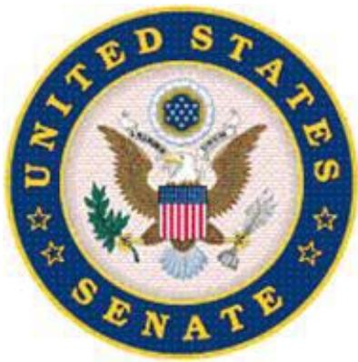

# SELECT COMMITTEE ON INTELLIGENCE

UNITED STATES SENATE

# Additional Prehearing Questions for

James R. Clapper, Jr.

Upon his nomination to be

Director of National Intelligence

1. What is your understanding of the following responsibilities of the Director of National Intelligence (DNI)?

a. As the head of the Intelligence Community (IC).   
b. As the principal adviser to the President, the National Security Council, and the Homeland Security Council for intelligence matters related to the national security.   
c. In overseeing and directing the implementation of the National Intelligence Program.   
d. In managing the Office of the Director of National Intelligence (ODNI).

As head of the intelligence community, the DNI not only develops policies and procedures to guide the work of U.S. intelligence agencies, but also oversees their performance to ensure compliance with these policies and procedures. The DNIís ultimate objective, pursuant to the Intelligence Reform and Terrorism Prevention Act, is to create a unified intelligence effort at the national level that is both effective and efficient. A significant part of this responsibility also includes representing the interests and positions of the intelligence community to the rest of the Executive branch, the Congress, foreign governments, and the public.

As principal intelligence adviser to the President, the DNI ensures that the President and senior government officials receive the substantive intelligence support they require to carry out their responsibilities. This entails keeping them apprised of current, ongoing developments around the world; having intelligence analysis prepared to meet short-term needs, preparing longer-term assessments to support longer-term policy decisions; and responding to questions they have about intelligence they have received. In short, the DNI, as the head of the entire intelligence community, including both its collection and analytical capabilities, serves as the Presidentís focal point for the provision of substantive intelligence.

The DNIís responsibility for the National Intelligence Program (NIP) entails building and shaping the NIP and monitoring the activities undertaken by elements of the intelligence community to ensure that appropriated funds are, in fact,

allocated and spent in accordance with the National Intelligence Program budget, and that they are achieving objectives. Should elements of the community wish to allocate and spend funds that have been appropriated for a different purpose, the DNI must approve such transfers or reprogramming in accordance with applicable law. If the DNI should find that appropriated funds are not being allocated or spent as provided by the National Intelligence Program, it is his responsibility to address such failures with the head of the department or agency concerned, and, if a suitable resolution of the matter cannot be found, to report the matter to the President and Congress.

Managing the ODNI requires clearly setting priorities and direction so that ODNI staff can assist the DNI in leading the IC. The National Intelligence Strategy provides an overall roadmap for the direction of the IC, and the ODNI assists in monitoring the ICís achievement of NIS mission and enterprise objectives. The ODNI contributes by concentrating on areas where issues cannot be resolved by individual agencies, as well as areas where intelligence agencies must be better integrated and more collaborative to produce better intelligence.

2. Please reflect on specific experiences you have had in your profession in intelligenceóin the military, private sector and civilian leadership of the DoDóto illustrate how your background and experience will enable you to serve effectively as the head of the IC. With respect to the different aspects of your career and the positions you have held, please identify within your response a description of the issues relevant to the leadership of the IC that you see based on your background and experience.

I feel my experience in the military ñ starting with my two tours of duty during the Southeast Asia conflict ñ provided a wealth of experience in intelligence which has been expanded and honed by the things I've done since retiring from military service in l995. I have been a practitioner in virtually every aspect of intelligence. I was trained as a SIGINT officer, and worked in SIGINT collection and analysis. During my tour in Vietnam, I was a warning watch officer, allsource analyst, and briefer. Following this tour, I was selected to be the Aide-decamp to two successive commanders of the Air Force Security Service, which was an invaluable "leadership laboratory,î as I observed these senior officers lead a world-wide enterprise, with thousands of people, engaged in (at the time) very complex and demanding missions. I learned early on the attributes of command, leadership, and executive skills required of such leaders. I later served in a similar capacity as Military Assistant to two Directors of NSA, and was able to observe, and draw lessons learned for later in my career when I was in similar positions as Director of two of the major intelligence agencies.

Over the course of my military career, I served as a Commander in combat, (flying 72 combat support airborne radio direction finding missions over Laos and Cambodia) as well a Wing Commander, and Commander of a Scientific and Technical Intelligence Center. Also, I have served as a Director of Intelligence (J2) for three war-fighting commands (US Forces Korea, Pacific Command, and the then Strategic Air Command). I learned every aspect of intelligence collection, analysis, operations, planning and programming, and application and in all other disciplines ó HUMINT, GEOINT, MASINT, Foreign Material, Counterintelligence, and other more arcane forms of technical intelligence. I have been widely exposed to the workings of the entire U.S. Intelligence Community around the globe.

As Director of the Defense Intelligence Agency in the early 1990s, I led a major effort to essentially re-shape the Agency, prompted by a mandated reduction of approximately $20 \%$ , to help reap "peace dividend" savings by virtue of the demise of the Soviet Union. This required an alternative organizational scheme, a reduction and re-orientation of the work-force, while minimizing negative morale effects. I orchestrated the founding of the Defense HUMINT Service, which moved all strategic HUMINT resources from the Military Services to DIA ñ a transformation fraught with controversy and opposition, as well as absorbing into DIA two formerly self-standing organizations ñ the Army Missile and Space Intelligence Center (MSIC), and the then Armed Force Medical Intelligence Center (AFMIC) (now the National Center for Medical Intelligence).

After retirement from active duty in the United States Air Force, I worked as a contractor for four companies, with intelligence as my primary focus. This gave me great insight into the roles as well as the strengths and limits of contractors, how the government looks from the outside, and what drives a commercial entity as it competes for, wins, and fulfills contracts. As the first civilian Director of NGA, I accordingly was able, I think, to deal much more effectively with contractors as a part of the work force.

During the six year interval after I retired from the Air Force in l995 and before I became Director of NGA in 2001, I served on many government Boards,

Commissions, and Panels. Notable among them was service as the lead intelligence and counter-intelligence investigator for the Downing Assessment Task Force, which investigated the bombing of the Khobar Towers Air Force facility in Saudi Arabia on June 25, 1996. This was an epiphany experience for me, since I learned directly of the horrific effects of an improvised explosive device planted by terrorists.

I also served as Vice Chairman of a Congressionally mandated Commission chaired by former Governor of Virginia Jim Gilmore for almost three years. The purpose was to study the potential for a weapons of mass destruction attack on the Homeland, to recommend what should be done to prevent such attacks, and how to respond to them should they happen. Governor Gilmore and I briefed the Vice President in May of 2001 on the Commission's findings, and warned him that it was not a question of whether we would be attacked, but when. Because of this experience I learned a great deal about such issues as perceived at the state and local levels, and helped formulate recommendations which in part presaged the subsequent formation of the Department of Homeland Security.

Additionally, I participated in a study led by former Deputy Secretary of Defense John Hamre on the intelligence and counter-intelligence capabilities and shortfalls in the Department of Energy.

I became Director of the National Geospatial Intelligence Agency (then the National Imagery and Mapping Agency, NIMA) two days after 9/11. NIMA was then generally considered the most dysfunctional component of the IC. It had failed to live up to the vision of the original founders of the Agency to meld mapping, charting, and geodesy on one hand, with imagery and imagery intelligence on the other. Using a very useful report produced by the Congressionally-chartered NIMA Commission as a ìroadmapî. I led the metamorphosis into the now well recognized intelligence discipline of Geospatial Intelligence (GEOINT), and the symbolically important change in the Agency's name. Now, NGA stands as a productive, efficient, and mature component of the IC.

I concurrently gained the experience of serving for almost nine years as manager of two of the major programs in what is now the National Intelligence Program ñ the General Defense Intelligence Program (GDIP), and the National Geospatial Intelligence Program (NGP), as well as serving as the Executive for the

Military Intelligence Program in my current capacity as USD(I), for over three years.

As the Under Secretary of Defense for Intelligence, I helped exercise civilian control over the military, served as Program Executive for the Military Intelligence Program, and developed and promulgated standards and policy across the entire range of the intelligence, counter-intelligence, and security dimensions of the DoD. I have taught intelligence at the graduate level at the then Joint Military Intelligence College and, briefly at Georgetown University. I have also worked with the Intelligence Oversight Committees of the Congress since the early 1980s.

I have traveled widely to dozens of countries, and am familiar with their intelligence capabilities, and know many senior foreign intelligence leaders personally. I have known and worked for and with all Directors of Central Intelligence and Directors of National Intelligence for the last two decades. I have accordingly participated at the highest levels of intelligence decision making on allocating scarce resources, determining priorities, approving critical intelligence judgments as a member of the National Foreign Intelligence Board/National Intelligence Board, and briefed senior national security officials both in the United States and overseas.

Apart from all this functional experience, I have lived the history of the intelligence community for that same time span. I think the amalgam of this experience ñ the breadth, depth, and scope ñ equips me to deal with the extreme demands of the DNI ñ a position, which demands extensive knowledge of the entirety of the US intelligence enterprise.

3. Based on your professional experience, and in particular your experience as the Under Secretary of Defense for Intelligence (USD(I)), what is your view of the role of the DNI in overseeing the 16 agencies of the intelligence community and integrating them into an effective intelligence enterprise? Please answer separately for the following:

a. The DoD (DoD) intelligence components.   
b. The Central Intelligence Agency (CIA).

c. The intelligence agencies that reside in other departments of the federal government.

d. If confirmed as DNI, what steps will you take to improve the integration, coordination and collaboration of the agencies of the Intelligence Community (IC)?

With respect to the four intelligence agencies in the Department (DIA, NSA, NGA and NRO), the DNI plays a crucial role in supervising their performance and output. The DNI allocates resources in the National Intelligence Program, and monitors the intelligence agenciesí operations and production. The DNI sets standards, and formulates policies governing these agencies, and insures they fulfill their missions. Each has unique missions, requiring unique insights and understanding. Three of them are also Combat Support Agencies, so the DNI, with the support of the USD(I), must also see to their performance in that capacity ñ striking balance between their national and defense missions. The service intelligence components for the Army, Navy, Air Force, and Marine Corps also play unique and distinct roles for their services, as well as for the national intelligence community. I served as Chief of Air Force Intelligence, so I understand this domain as well, from personal experience. Having served as a Director for two of these agencies (DIA and NGA), and having spent a great deal of time in NSA, both on active duty, and, subsequently after retirement on the NSA Advisory Board, I believe I have a thorough understanding of the distinct roles each of these organizations play both in the Department, as well as in the IC. I tried to use the "double-hat" I wore as the DNI's Director of Defense Intelligence, as a "bridging" capacity, to help the DNI manage the DOD intelligence components.

While I have never been assigned to the CIA, I have worked closely with it over a period of almost 30 years. I believe it is a national treasure, and a crown jewel of the IC. I feel the DNI does have both a partnership and oversight role to play in relation to the CIA. It has unique capabilities, and unique responsibilities which must be synchronized with the other components of the IC.

The intelligence components of four of the other cabinet departments (State, Homeland Security, Treasury, Energy) generally are not "agencies" within those departments, but provide unique staff support to their respective cabinet heads, and, in turn, unique capabilities and perspectives for the larger IC. The FBI, in the

Department of Justice, represents a unique combination of intelligence and law enforcement responsibilities. Most recently, I worked very closely with the FBI in the aftermath of the Ft Hood shootings. Also in the Department of Justice, the DEA provides unique contributions to the Intelligence Community.

The DNI must understand the complementary contributions of each of these unique components, lead them with a "unity of effort" perspective, and forge a sense of teamwork among their leaders.

If confirmed as DNI, I will continue the efforts of the previous DNIs to "work the seams" between and among the 16 components, to eliminate policy barriers (which have always been more formidable than the technological barriers). I also believe that all such efforts do not have to be exclusively managed within the Office of the DNI, but can be de-centralized and delegated to the components, to act as "executive agents" on behalf of the DNI ñ thereby extending the reach and authority of the DNI.

4. Based on your four decades of professional experience, do you believe the current organizational structure of U.S. intelligence is the best structure to support the military and national intelligence needs?

1. If not, what changes would you recommend to the current structure?

# 2. What is your current view of the concept of setting up a cabinet-level Department of Intelligence composed of the major intelligence agencies?

I have either been a part of, or in fact led, many re-organizations throughout my career in intelligence ñ some successful, some not so. I have become convinced that there is no such thing as the perfect wiring diagram. I can't say that the current organizational construct is the "best", any more than I can commend some other structure as "better". The current arrangement obviously has its drawbacks, but so did its predecessor, the DCI. I am more from the school of trying to make what we have work better, rather than advocating yet another organizational upheaval ñ which, too, would incur the law of unintended consequences. I think what we have today provides the best intelligence support to national and military users in our history ñ and we dwarf the rest of the nations of the world in this respect.

At this point, I have no plan to recommend to the President any dramatic change to what we have today ñ but, rather, would work to improve it.

I do not believe a "Department of Intelligence" is a viable alternative. I think such a construct could potentially jeopardize civil liberties. If such a cabinet department were organized, the donor organizations ñ to include the DoD ñ would, over time, simply re-generate the resources lost to such an intelligence monolith.

Moreover, the upheaval and disruption this would cause would be highly problematic and profoundly disruptive to the intelligence mission.

5. The Intelligence Reform and Terrorism Prevention Act of 2004 (IRTPA) was a significant reform effort intended to improve the management and coordination of the U.S. IC to meet the national security challenges of the $2 1 ^ { \mathrm { s t } }$ century.

a. Based on the experience of the last five years under IRTPA, do you believe additional legislation, beyond what has been included in intelligence authorization bills passed by the House or Senate, is needed to either clarify or strengthen the authorities of the DNI? If so, what legislation would you recommend?   
b. Do you believe new or revised executive orders, beyond the 2008 amendments to Executive Order 12333, are needed to clarify or strengthen the authorities and responsibilities of the DNI with respect to the IC? If so, what would you recommend to the President?   
c. It has been reported that prior to your nomination you sent the President a letter or memorandum with your views of what the role of the DNI should be and how the IC should function. Please provide a copy of this document or provide an answer that covers the full substance of the views you expressed.   
d. One possible means of strengthening the DNIís authorities may be through granting the position more statutory administrative (vice operational) control over the national intelligence agencies. What are your views on the benefits of using such a statutory approach to clarify the current ambiguity in the law about the DNIís authority over intelligence information technology (IT) systems?

# e. Do you believe that granting the DNI more control over the intelligence agenciesí personnel and training programs would accelerate the integration of the IC and break down the cultural and bureaucratic walls between agencies?

I believe the area of greatest ambiguity in the IRTPA is the relationship with and authority of the DNI over the CIA. I would be in a better position to judge this, if I am confirmed as DNI, and have some practical, first-hand experience.

The recent amendments to Executive Order 12333 were an important step in the Intelligence Community reform effort. Like the IRTPA, which provided the foundation for the recent intelligence reform efforts, the amending of Executive Order 12333 was another step in the process that includes, among other things, ongoing development and issuance of Intelligence Community policies implementing the Order. As the ICís implementation of the Executive Order progresses, and if confirmed, I will be in a better position to assess whether to advise the President on any need for executive action to clarify or strengthen the authorities and responsibilities of the DNI.

I have shared with the President my views on the role of the DNI. I believe in the importance of the relationships between and among the White House, the CIA, and the DNI, and the importance of clarity as to roles and missions. I have a philosophical "model" for the DNI, and I believe it is important for anyone serving in this position to be a "truth to power" DNI .

With specific respect to the DNI's authorities over Information Technology systems, I think the DNI already has considerable authorities in this area ñ whether explicit in the law, or implicitly. I am not in position to assess how well this function is being carried out at this time; if confirmed, I would intend to look into this, and then would be in a better position to respond more thoughtfully to this question.

At this time, I do not feel that more authority over Cabinet Department personnel and training is necessarily required. There are many common challenges (e.g. language training and proficiency), but I believe the DNI should focus on "outputs" rather than providing exquisite management of "inputs." Again, if confirmed, I would certainly assess this area, and then would be in a better position to judge whether I would recommend to the President that legislation is needed to enhance the DNI's authorities.

# Keeping the congressional intelligence committees fully and currently informed

6. What is your understanding of the obligations of the DNI under Title V of the National Security Act of 1947?

a. What steps should the DNI take to ensure that all departments, agencies, and other entities of the United States Government involved in intelligence activities in general, and covert action in particular, comply with the reporting requirements in those sections?   
b. Under what circumstances do you believe notification may and should be limited to the Chairman and Vice Chairman or Ranking Member of the congressional intelligence committees? In those circumstances, if any, what is the obligation of the DNI to notify subsequently the full membership of the committees as expeditiously as possible?

The basic obligation imposed by section 502 of the National Security Act is to keep the two intelligence oversight committees ìfully and currently informedî of all U.S. intelligence activities (excepting covert actions that are covered in section 503), including ìsignificant anticipated intelligence activitiesî and ìsignificant intelligence failures.î Although section 502 provides that congressional notifications must be made ìto the extent consistent with due regard for the protection from unauthorized disclosures of classified information relating to sensitive sources and methods or other exceptionally sensitive matters,î I believe that this phrase does not limit the obligation to keep the intelligence committees ìfully and currently informed.î Rather, this phrase provides the DNI with a degree of latitude in deciding how (not whether) to bring extremely sensitive matters to the committeeís attention. In certain rare circumstances, I believe it could be appropriate to brief only the Chairman and Vice Chairman of the intelligence committee on particular sensitive matters. Limited initial notifications should be undertaken only in the most exceptional circumstances.

Similar obligations are imposed upon the DNI by section 503 of the National Security Act where covert actions are concerned. The DNI is charged with

keeping the committees ìfully and currently informedî of all covert actions that may be undertaken by elements of the U.S. Government, including any ìsignificant failure.î

Most of the obligations imposed by section 503, to include the approval of covert actions and reporting them to the two intelligence committees, run to the President rather than the DNI. The DNI, however, should oversee and provide advice to the President and the NSC with respect to all ongoing covert action activities.

In addition to imposing obligations upon the DNI, sections 502 and 503 impose the same obligations on the ìheads of all departments, agencies, and other entities of the United States Government to keep the intelligence committees ìfully and currently informedî of both intelligence activities and covert actions they may be involved in. Thus, the statute imposes the obligation regardless of further direction or instruction from the DNI. If I were confirmed as the DNI, I would have an obligation under the National Security Act to ensure that elements of the Intelligence Community comply with the Constitution and laws of the United States, including sections 501, 502, and 503 of the National Security Act. I will also ensure that Intelligence Community directives related to the disclosure of information to Congress are vigorously adhered to.

# National Security Threats

7. What in your view are the principal threats to national security with which the IC must concern itself in the coming years?

a. What are the questions that the IC should address in its collection activities and assessments?   
b. In your opinion, how has the IC performed in adjusting its policies, resource allocations, planning, training, and programs to address these threats?   
c. If not otherwise addressed, discuss your view of the appropriate IC roles and responsibilities with respect to the issues of climate change and energy security, and how well the IC has performed in these areas.

I believe the principal threats to national security are those portrayed in the Intelligence Communityís annual threat assessment. They include:

1. The far-reaching impact of the cyber threat. The U.S. confronts a dangerous combination of known and unknown vulnerabilities, strong and rapidly expanding adversary capabilities, and a lack of comprehensive threat awareness. Malicious cyber activity is occurring on an unprecedented scale with extraordinary sophistication. Acting independently, neither the U.S. Government nor the private sector can fully control or protect the countryís information infrastructure. With increased national attention and investment in cyber security initiatives, the US can implement measures to mitigate this negative situation. The Comprehensive National Cybersecurity Initiative (CNCI) is designed to help mitigate vulnerabilities being exploited by our cyber adversaries and provide long-term strategic operational and analytic capabilities to U.S. Government organizations.

2. The continuing terrorist threat. Al-Qaíida, al-Qaíida-associated groups and al-Qaíida inspired terrorists remain committed to striking the U.S. and US interests. We can take it as a sign of progress that while complex, multiple cell-based attacks could still occur, we are making them very difficult to execute. It is even more difficult to identify and track small numbers of terrorists recently recruited and trained, as well as, short-term plots, than to find and follow terrorist cells engaged in plots that have been ongoing for years.

3. The growing proliferation threat, especially from Iranís and North Koreaís nuclear programs: Ongoing efforts of nation-states to develop and/or acquire dangerous weapons constitute a major threat to the safety of our nation, our deployed troops, and our allies. Technologies, often dual-use, circulate easily in our globalized economy, as do the personnel with scientific expertise who design and use them. It is difficult for the United States and its partners to track efforts to acquire WMD components and production technologies that are widely available. The IC continues to focus on discovering and disrupting the efforts of those who seek to acquire these weapons and those who provide support to weapons programs elsewhere. The IC also works with other elements of the government on the safeguarding and security of nuclear weapons and fissile materials, pathogens, and chemical weapons in select countries.

4. Threats to U.S. troops in Afghanistan and Iraq. Although a generally positive security trend in Iraq over the past year has meant a drop in overall violence, the protracted formation of a government in Baghdad is straining security. The IC has stepped up efforts to support commanders and forces in the field, as well as to assist and inform policymaker efforts in enhancing security, improving governance and extending economic development in Afghanistan and Iraq. In both cases, the IC is particularly concerned about terrorists using Afghanistan and Iraq as safe havens from which they can attack the U.S. or U.S. interests.

Besides these aforementioned immediate threats, we confront numerous concerns and geopolitical challenges equally important for the Intelligence Community to understand in order to help policymakers promote the U.S.ís long term interests. Among the many such issues, are the following illustrative examples:

Notwithstanding some stresses and potentially troublesome long-term effects inside China, Beijing is becoming a more prominent regional and emerging global player.

We see some encouraging signs that Russia is prepared to be more cooperative with the U.S., although Russia also looks at relations with its neighbors largely in zero-sum terms, vis-a-vis the United States.

The financial crisis was transmitted broadly and rapidly through international capital and trade channels and has challenged the view that globalization is the road to prosperity.

The daunting array of challenges facing African nations make it likely that we will see new outbreaks of political instability, economic distress, and humanitarian crises demanding U.S. government attention and response in coming years. In the Middle East, we will face additional uncertainty as several states undergo anticipated changes in leadership following the passing of their heads of state, many of whom have ruled for decades.

International organized crime, including drug trafficking, continues to threaten U.S. interests.

Health policies of governments and non-state organizations can have longterm detrimental implications for the U.S. The ability to detect and contain foreign disease outbreaks before they reach this country is partially dependent on U.S. relationships with host governments, and state willingness to share health data with non-governmental and international organizations. Working on health matters with foreign governments and non-state organization also provides opportunities for reducing biological threats. Overall, the IC works with other U.S. government agencies to assess foreign preparedness and provide warning of national security implications of health events, whether naturally occurring or the result of intentional use.

Global climate change could have wide-ranging implications for US national security interests over the next 20 years because it would aggravate existing world problemsósuch as poverty, social tensions, environmental degradation, ineffectual leadership and weak political institutionsóthat threaten state stability. Since the 2008 publication of the National Intelligence Assessment (NIA) on the national security implications of climate change, the IC has stepped up analysis and collection to look more in depth at climate change implications in individual countries and regions important to U.S. long term interests. The CIA has also created a center to provide all-source analysis on the impact of climate change on political, economic, military and social stability. It is also responsible for the MEDEA program which reviews and declassifies imagery for sharing with the climate scientific community.

Energy security has also been an important topic for Intelligence Community analysis and collection. To meet demand growth in next three to 10 years and reduce the risk of future price spikes, international and national oil companies will need to re-engage on major projects that were shelved when prices fell in late 2008. Within OPEC, Iraq is a bright spot for oil capacity expansion. Recent developments in the U.S. gas sector, primarily shale gas, have made the U.S. essentially gas independent for at least a decade or two, if not longer. The IC has for some time closely followed energy security developments, warning of longer term trends and highlighting potential opportunities for mitigating negative implications for U.S. national security.

8. What lessons do you see for the ODNI, in particular, and the Intelligence Community as a whole, with respect to the following events and developments in recent months?

a. The Fort Hood attack and the attempted attacks on Flight 253 and in Times Square. With respect to the Fort Hood attack and the attempted attack on Flight 253, please describe what you would do to carry out recommendations to correct deficiencies identified by the Executive and Legislative Branch panels that have reviewed these incidents. b. The Cheonan incident and other provocative activities of North Korea. c. The evolution of the role of the United States in Iraq and Afghanistan.

The Fort Hood attack and the attempted attacks on Flight 253 and in Times Square: I have reviewed each of the Executive and Legislative Branch reports on the recent attempted terrorist attacks and take all of the recommendations very seriously. In my view, the major themes of the intelligence shortfalls and the resultant recommendations prescribed by the reports are consistent. If confirmed as DNI, I will aggressively work with the agencies across the IC and the Congress to carry out the recommended corrective actions addressing the deficiencies identified by the reviews. Learning from these incidents is a continuing process. I will build upon the work already completed and highlighted below.

The independent review panel established by former DNI Blair to review the intelligence aspects of the 5 November Fort Hood shootings and the attempted bombing of Northwest Airlines Flight 253 on Christmas Day arrayed its recommendations in four broad areas: strengthening our processes for finding terrorists in the ever-growing amount of intelligence data, enhancing information technology support across the IC, closing mission seams, and eliminating existing confusion related to the sharing and handling of U.S. person information.

In parallel with the DNI-directed independent review, NCTC led a community-wide effort to develop an integrated resource proposal and implementation plan for a variety of community initiatives. This action plan and resource recommendation became the basis for the Administrationís proposal for FY 2010 and 2011 Overseas Contingency Operations funding. The majority of the request is aimed at technology enhancements to aid in the discovery, correlation, and fusion of data consistent with the overall strategy for community information technology under the direction of the IC Chief Information Officer.

In addition to these Executive Branch studies, your Committee Report of the Attempted Terrorist Attack on Northwest Airlines Flight 253 also found systemic failures across the community. Your report cited inadequate organization at NCTC to fulfill its mission, a lack of clarity in responsibility for tracking and identifying all terrorism threats, as well as the need for technology enhancements to assist analysts in data searches and the correlation of information.

Among other things, the initial IC response to the above Executive and Legislative Branch reviews includes:

1. Pursuit Analysis: In mid-January, NCTC established a center-wide Pursuit Group that incorporates personnel from across the Intelligence Community to pursue intelligence leads to detect and disrupt terrorist activities. The Pursuit Groupís work is informed and driven by allsource analysis and its teamsóorganized by terrorist group and region focuses on early detection of potential threats to the Homeland and to US citizens and interests abroad. In addition to conducting analytical pursuit of intelligence leads, the Pursuit Group prioritizes threat threads across the IC and coordinates, deconflicts, and synchronizes similar pursuit activities across the IC.

2. Information Technology/Information Sharing: The Intelligence Community Chief Information Officer (IC CIO) and NCTC have developed plans to address near-term technology enhancements and improved data accessibility, as well as longer-term solutions to information availability and usability. NCTC has gained greater access to data since 12/25 and has accelerated efforts to integrate terrorism data, making solid progress in consolidating information and applying tools to streamline searches and correlate data. However, an integrated repository of terrorism data, capable of ingesting terrorism-related information from outside sources, remains necessary to establish a foundation from which a variety of sophisticated technology tools can be applied. These capabilities can help automate the display of links and alerts, as well as provide a mechanism for visualizing complex relationships.

3. U.S. Persons Rules and FISA handling procedures: The ODNI Office of General Counsel is also leading an interagency effort to assess, refine, and clarify U.S. Person rules and procedures for handling information obtained under FISA to improve IC information sharing, including with respect to SIGINT. By conducting extensive interviews of IC analysts and attorneys, ODNI/OGC has been working to identify each of the specific issues that need to be resolved. The next step is to prioritize these issues and assign them to ODNI offices, IC elements, as well as other U.S. Government entities, to identify and carry out solutions to these critical problems.

NSA continues to work with the Department of Justice and FBI to fully leverage all current authorities to accomplish its counterterrorism mission and effectively share USP information consistent with the law.

4. DHS Partnership with NCTC: DHS has entered into a series of MOUs with NCTC that provide NCTC with access to appropriate passenger, travel, and border exit and entry information. These new data flows greatly enhance the ability of DHS, NCTC, FBI, and the broader law enforcement and intelligence communities to identify potential threats by having additional information that could allow them to tie together previously disparate pieces of information.

5. Enhanced Watchlisting Procedures: NCTC continues to work with the interagency to enhance overall watchlisting support procedures including: review of those individuals from select counties who were immediately upgraded after 12/25 to a higher watchlisting status as a precautionary measures; coordination with interagency partners to review watchlisting related standards; and examining end-to-end business processes associated with enhancing a TIDE record.

6. Visas: NCTC and the Department of State have improved coordination to ensure that known or suspected terrorist are flagged and visas are denied or revoked as appropriate. Further, the State Department is working closely with the Department of Homeland Security (DHS)/Customs and Border Protection (CBP) to ensure that airlines are aware of any travelers with revoked visas prior to boarding.

The Cheonan incident and other provocative activities of North Korea: As you know, I served as the J2 of U.S. Forces Korea and as the Deputy C2 of the Republic of Korea/United States Combined Forces Command from June 1985 to June 1987. From July 1987 to July 1989, I was the J2 of the United States Pacific Command. In those years, violent North Korean provocations were more common than they have been during the past decade. I am particularly reminded of North Koreaís bombing of Korean Airlines Flight 858 on 29 November 1987, killing all 115 persons on board, when I consider in context the recent North Korean ambush of the Cheonan in the Republic of Koreaís territorial waters and Pyongyangís concurrent, unsuccessful dispatch of an assassination team to South Korea to kill senior North Korean defector Hwang Jang-yop.

The most important lesson for all of us in the Intelligence Community from this yearís provocations by Pyongyang is to realize that we may be entering a dangerous new period when North Korea will once again attempt to advance its internal and external political goals through direct attacks on our allies in the Republic of Korea. Coupled with this is a renewed realization that North Koreaís military forces still pose a threat that cannot be taken lightly.

For the ODNI, the Cheonan attack reemphasizes the importance of the DNIís responsibility to coordinate the ICís analytic and collection efforts against the North Korean threat.

The evolution of the role of the United States in Iraq and Afghanistan: It is critical that the Intelligence Community continue to monitor Iraqís internal stability as the drawdown of U.S. military forces progresses. Intelligence agencies are focused on this and are contributing to national-level assessments that directly inform policy and military decision-makers of potentially worrisome political, security, and economic trends. The IC also must focus on longer-term trends in Iraq and the region after U.S. forces depart in 2011. To this end, the ODNI/National Intelligence Council this summer will examine international and regional reactions to future developments in Iraq in a strategic gaming exercise with regional subject matter experts from government, industry, and academia. In addition, Intelligence Community assessments for the remainder of this year will take a longer-term look at political and security dynamics in Iraq and the region in 2012 and beyond.

The ODNI also must plan for the allocation of resources during and after the U.S. drawdown from Iraq to ensure that the Intelligence Community can continue to collect on critical trends and threat issues related to U.S. personnel in Iraq. The Intelligence Community's performance in Iraq has been a model of collaboration, innovation, and direct support to a wide range of customers. Intelligence agencies are now demonstrating that same flexibility and teamwork as they respond to the tremendous changes taking place in Iraq ñ including the transition to a new government ñ while maintaining their ability to meet the needs of U.S. forces in Iraq. I have been deeply impressed by this degree of teamwork, which will be even more important in the future in addressing the strategic intelligence priorities of U.S. policymakers and senior military officials.

The role of the Intelligence Community in Afghanistan is to assess threats and provide timely warning of developments detrimental to the national security policies of the United States. The IC collects intelligence on threats emanating from the border region between Afghanistan and Pakistan, evaluates terrorist and security trends, provides assessments in support of U.S. military and civilian efforts to stabilize Afghanistan in line with the Presidentís overarching directive to disrupt, dismantle, and defeat al-Qaíida and its allies and prevent them from reestablishing bases in Afghanistan from which to plan attacks against the Homeland. IC assessments cover military, terrorist, insurgent, governance, political, and economic developments in Afghanistan.

The Intelligence Community provided extensive support to US Special Operations Forces during the ouster of the Afghan Taliban in 2001. For several years after the Talibanís defeat, the U.S. IC focused on counterterrorism (CT) targets in the region. The IC has continued to allocate additional collection and analytical resources following the Presidentís 1 December 2009 West Point speech announcing an increase in U.S. troop and civilian levels to support ISAFís counterinsurgency strategy.

# Challenges Facing the Intelligence Community

9. Apart from national security threats discussed in answer to Questions 7 and 8, what do you consider to be the highest priority leadership and management challenges facing the IC at this time?

# • If confirmed as DNI, what will you do, specifically, to address these challenges?

High priority leadership and management challenges include continuing to improve information sharing with intelligence customers, improving the integration and coordination of intelligence operations, ensuring that intelligence resources are prioritized against our most important intelligence needs, investing in and rewarding innovative use of technology, and ensuring a diverse, quality workforce.

If confirmed, I will (1) continue to improve information sharing in and outside of the IC through promulgation and implementation of policies, processes and new technologies, and under Attorney General approved guidelines; (2) improve integration and coordination among members of the IC by enhancing mission management and integrating the capabilities provided by functional managers to meet the needs of national, military, homeland security and other departments and agencies; (3) develop timely, accurate, and insightful intelligence to policy makers in support of national security actions through flexible, tailored intelligence products and effective implementation of the roles and responsibilities of DNI representatives; (4) use a fully integrated planning, programming, budgeting, and evaluation system to ensure National Intelligence Program resources are directed toward the ICís highest priorities and deliver effective and efficient capabilities; (5) position the IC to take advantage of cutting-edge innovations by improving how the IC adjusts to the dynamic information environment and by working to maintain needed levels of research and development funding in the National Intelligence Program; (6) continue the Joint Duty program to give IC senior leaders and professionals an understanding of other IC organizations and cultures, and ensure the IC has senior leaders who have an enterprise perspective; and (7) promote a high-quality workforce through effective recruitment, retention, training, and related efforts to make the workforce diverse in the broadest sense of the wordóin background, culture, gender, ethnicity, age, and experience.

# Office of the Director of National Intelligence

10. There has been considerable debate in the Congress concerning the appropriate size and function of the ODNI. In answering this question, please address the staff functions of the ODNI and the specific components of the ODNI, where appropriate, such as the National Counterterrorism Center.

a. What is your view of the ODNIís size and function?   
b. Do you believe that the ODNI has sufficient personnel resources to carry out its statutory responsibilities effectively?   
c. Are there any functions being carried out by the ODNI that should be assigned to another element of the IC?

For a global enterprise of the size and complexity of the U.S. intelligence community, the ODNI staff, I believe, is a relatively small "corporate headquarters". Some of the functions for which it is responsible are mandated in law; NCTC is a prime example. By virtue of the ODNI's separation from a host agency (i.e. the former Community Management Staff, as it was located in, and supported by, the CIA), it has to provide many support resources as a self-standing entity.

Here is another case where, if confirmed, it would be one of my first orders of business to do a detailed survey of the ODNI organization, and numbers of people and how they are allocated, to determine if there is bloat, or whether the ODNI is perhaps only plagued with urban legend. In general, if confirmed, I would look to see if any functions could be moved to an executive agent somewhere else in the IC. For example, a DNI could use the staffs of other Agencies and Departments to discharge specific functions and activities on behalf of the DNI.

11. What in your view has been the role played by mission managers in the IC since the enactment of IRTPA?

• If confirmed, would you make changes in the mission manager system?

The concept of mission managers in the Office of the Director of National Intelligence (ODNI) originated in the 2005 report of the Commission on the Intelligence Capabilities of the United States Regarding Weapons of Mass Destruction (ìWMD Commissionî). The WMD Commission recommended that ìthe DNI bring a mission focus to the management of Community resources for high-priority intelligence issues by creating a group of ìMission Managersî on the DNI staff, responsible for all aspects of the intelligence process related to those issues.

As the ODNI took on the creation of Mission Managers, there have been some trials and course corrections along the way, and recognition that different countries and topics require varying degrees of attention on different aspects of mission management. Intelligence Community Directive 900 (Mission Management, December 2006) states that Mission Managers are the ìprincipal IC officials overseeing all aspects of national intelligence related to their respective mission areas.î Specific responsibilities include: (1) understanding and conveying the full range of customer requirements; (2) driving collection and setting analysis priorities; (3) identifying collection gaps, developing integrated collection strategies, and tasking the collection enterprise accordingly with the Deputy Director of National Intelligence for Collection;(4) identifying analytic gaps and tasking analysis, as well as evaluating analytic quality accordingly with the Deputy Director of National Intelligence for Analysis; (5) ensuring that intelligence related to their targets is shared appropriately; (6) recommending transfer of personnel and funds to the National Intelligence Mission Management Board; (7) identifying outstanding requirements for inclusion in research and development plans and science and technology budgets; and (8) evaluating the effectiveness of the ICís efforts against their assigned missions.

As the concept of mission management became operational reality, the ODNI recognized the importance of the role the National Intelligence Officers play in mission management and expanded that role in Intelligence Community Directive 207 (National Intelligence Council, June 2008). Two of the specific responsibilities outlined in Intelligence Community Directive 207 are (1)where there is a DNI-designated Mission Manager, work in close collaboration with that Mission Manager on all analytic issues affecting its mission; and (2) for the issues and countries where there is no DNI-designated Mission Manager, fulfill mission management responsibilities to provide substantive leadership, drive collection, and oversee all aspects of national intelligence relating to its area of responsibility.

The Members are already aware of the DNI-designated Mission Managers we have in place, the expanded mission management roles that certain NIOs have been asked to take on, and the appointment of the Associate DNI for Afghanistan and Pakistan, who fulfills mission management responsibilities in that area. Many of you have also been briefed on the outstanding successes that have been enabled by the mission management approach, both by the DNI-designated Mission Managers and by the Directorates for Analysis and Collection working together. In response to your question on what changes I would make, I think it is too early for me to describe specific changes. I will say that I am aware of some of the great work that has been accomplished using the concept of mission management. If confirmed, it will be one of my priorities to review the current construct and make whatever changes are necessary to capitalize on the work that has been done and ensure that it is replicated across as many critical priorities as possible. I look forward to remaining engaged with the Committee on this issue.

12. What is your understanding of the responsibilities of the following officers, and for each of them, how would you ensure that each officer is performing the mission required by law?

• The General Counsel of the ODNI.   
• The Inspector General of the IC.   
• The ODNI Privacy and Civil Liberties Protection Officer. The individual assigned responsibilities for analytic integrity under Section 1019 of the IRTPA. The individual assigned responsibilities for safeguarding the objectivity of intelligence analysis under Section 1020 of IRTPA.

The General Counsel of the ODNI: The fact that Congress required the General Counsel position to be appointed by the President and confirmed by the Senate indicates the enormous responsibility that the General Counsel shoulders in ensuring legal oversight of the IC.

As the ODNIís chief legal officer, the General Counsel assists the DNI by ensuring that all ODNI practices comply fully with the Constitution and laws of the United States, including all relevant Executive Branch regulations, orders, guidelines, and policies. This includes vigilantly advising the DNI, who in turn advises the President, to ensure that the Administrationís statutory reporting obligation to keep Congress ìfully and currentlyî informed of all intelligence

activities is strictly followed. To do this the General Counsel should have visibility into any IC activity that implicates Constitutional, legal, or regulatory equities.

Moreover, the General Counsel is responsible for working with IC elementsí General Counsels General to ensure that the countryís intelligence operations are also in full compliance with these legal obligations.

Finally, The General Counsel is also a necessary participant in developing directives and policies for the IC.

The Inspector General of the IC: The Inspector General for the Office of the Director of National Intelligence (ODNI) is one of the ODNIís three key oversight offices, along with the General Counsel and the Chief Civil Liberties and Privacy Officer. The Inspector General plans, conducts, supervises, and coordinates inspections, audits, investigations, and other inquiries relating to the programs and operations of the ODNI and the authorities and responsibilities of the Director. The Inspector General is charged with detecting fraud, waste, and abuse; evaluating performance; and making recommendations to promote economy, efficiency, and effectiveness in the ODNI and the Intelligence Community.

If confirmed, I will support a strong and independent Inspector General and will ensure that the Inspector General has access to appropriate information and cooperation from ODNI personnel. I will ensure that reports issued by the Inspector General are promptly considered, and that a process to track the implementation of all management-approved OIG recommendations is strongly supported.

The ODNI Privacy and Civil Liberties Protection Officer: The Civil Liberties Protection Officerís responsibilities include ensuring that the policies and procedures of IC elements incorporate appropriate privacy and civil liberties protections; overseeing compliance by the ODNI with privacy and civil liberties requirements (including under the Privacy Act); ensuring that the use of technology sustains privacy protection for personal information; investigating complaints; and providing advice and oversight relating to privacy and civil liberties matters within ODNIís purview.

If confirmed, I intend to meet regularly with the Civil Liberties Protection Officer to assure myself that he has the vision, plans, resources, support, and access to information necessary to carry out these important responsibilities.

The responsibility of protecting privacy and civil liberties is not that of this Officer alone. It is a responsibility that is shared by every IC professional. It is a mission imperative. We cannot accomplish our mission without the trust of the Congress and the American people. To earn and retain that trust, we must demonstrate that we can use the authorities we have in a manner that exemplifies Americaís values and protects privacy and civil liberties.

At the same time, we owe our professionals clear guidance, ample training, and the confidence they need to do their jobs knowing that they are in compliance with applicable requirements. If confirmed, I intend to make sure this Officer is fully engaged with ODNIís OGC and other relevant offices around the community to make sure we are clarifying and simplifying our rules so that we both enhance our civil liberties protections and optimize our ability to access and share relevant information.

The individual assigned responsibilities for analytic integrity under Section 1019 of the IRTPA: Analytic integrity is absolutely essential to the Intelligence Communityís mission and to ensure the highest quality analysis. It is important to have an official working this issue full time, but the ultimate responsibility lies with the DNI, and, if confirmed, I will accept this responsibility fully.

The official that the DNI assigned to be responsible for analytic integrity under Section 1019 of the IRTPA has overall responsibility for working with all IC analytic elements to ensure that intelligence products are timely, objective, independent of political considerations, based on all sources of available intelligence, and employ the standards of proper analytic tradecraft. These standards of tradecraft are further identified in Section 1019 of IRTPA and incorporated into Intelligence Community Directive 203 (Analytic Standards, June 2007).

This official is responsible for performing on a regular basis detailed reviews of IC analytic products on a particular topic or subject matter to assess how well the products concerned met the analytic standards for rigorous, objective, timely

and thorough analysis. Based on these reviews, the individual may draft lessons learned, identify best practices, and make recommendations for improvement. A description, with associated findings, of these reviews is submitted each year in a report to the congressional intelligence committees, heads of the relevant analytic elements of the IC, and heads of analytic training departments.

This official works with IC analytic elements to help ensure that analytic methodologies, tradecraft, and practices meet the highest standards of analytic integrity, and that finished intelligence products properly describe the quality and reliability of sources, express uncertainty or confidence in analytic judgments, distinguish between intelligence and analytic assumptions and judgments, and incorporate where appropriate, alternative analysis.

If confirmed, I look forward to a comprehensive briefing on how this process has worked, as well as feedback from consumers ñ including Members of the Committee ñ as to whether these practices have yielded more reliable and useful analysis.

The individual assigned responsibilities for safeguarding the objectivity of intelligence analysis under Section 1020 of IRTPA: The ODNI Analytic Ombudsman plays a critical role in guarding against the politicization of intelligence. This individual is empowered to initiate inquiries into ìreal or perceived problems of analytic tradecraft or politicization, biased reporting, or lack of objectivity in intelligence analysis.î The individual is also available to counsel analysts, conduct arbitration, and offer recommendations on these issues. If confirmed, I will vigilantly protect the objectivity and integrity of our intelligence, and I will maintain appropriate communication with the ODNI Analytic Ombudsman.

13. What is your understanding of the role and responsibilities of the Principal Deputy Director of National Intelligence (PDDNI).

# a. If confirmed, what relationship would you establish with the PDDNI in order to carry out the duties and responsibilities of both positions?

The PDDNIís responsibilities derive from the DNIísówhether assisting, acting for, or serving alongside the DNI. The PDDNI must be capable of discharging the full range of the DNIís responsibilities and authorities.

The ideal relationship that should exist between the DNI and PDDNI is one of a complete trusting partnership, symbolized by the maxim: ìThe PDDNI speaks for the DNI, even when they havenít spoken.î

# Cyber Security

14. Concern over the security of the nationís cyber infrastructure has grown over the last several years. The United States Government now has underway the Comprehensive National Cybersecurity Initiative (CNCI). General Keith Alexander has recently been confirmed as the head of the U.S. Cyber Command and will remain the Director of the National Security Agency.

a. Are there any changes that you would recommend in the CNCI and the DNIís and ICís roles within it?   
b. Is there any major privacy or civil liberties issue concerning the CNCI that you would address?   
c. What should be the ICís role in helping to protect US commercial computer networks? What cyber threat information (classified or unclassified) should be shared with managers of the Nationís critical infrastructure to enable them to protect their networks from possible cyber attack?

The cyber threat is dynamic and evolving at ìnetwork speedsî, and, in turn, our national cybersecurity responseóincluding the CNCIómust be accordingly proactive. The Presidentís Cyberspace Policy Review released in May 2009 indicated some key areas of emphasis beyond the CNCI, including additional focus on education and public awareness; closer engagement with the private sector and our international partners; and a more holistic approach to managing the risks that come with the benefits of cyberspace and information technology.

The DNI remains responsible for monitoring and coordinating the implementation of the CNCI on behalf of the President. An interagency task force led by staff from the Office of the DNI is working closely with the Cybersecurity Coordinator and other elements of the Executive Office of the President to monitor the implementation of the CNCI. The Office of the DNI, as well as other elements of the IC, also plays an active role in the interagency policy process shaping the further evolution of our cybersecurity policies and capabilities.

The IC can play a pivotal role in the nationís cybersecurity, but must continue to adhere to privacy and civil liberties safeguards stipulated in the Constitution, applicable laws, and executive orders. As we continue the deployment and implementation phases of the CNCI, and as the government contemplates how to provide assistance for protecting critical infrastructure, I will ensure, if confirmed, that we pay close attention to applying those protections ñ and complying with them. For example, the ICís roles in assisting with attribution, and providing indications and warning for cybersecurity are vital, and must continue to take place within the legal and oversight framework established to protect privacy and civil liberties.

Under the CNCI, ODNI has been working to increase our national intelligence capabilities to discover critical information about foreign cyber threats and to use this insight to inform the Department of Homeland Security, which partners with the public and private sector owners and operators of Critical Infrastructure and Key Resources to strengthen their resilience against cyber threats. A key focus of this partnership is public-private sharing of information on cyber threats and incidents ñ and consistent with the protection of sources and methods, the IC needs to get actionable intelligence, such as the digital signatures associated with specific malicious cyber activities, to those who own and operate critical infrastructures. The government-wide cyber counterintelligence plan created under the CNCI will also help coordinate Federal activities to detect, deter, and mitigate the foreign-sponsored cyber intelligence threat to the private sector as well as to government networks and information.

15. If confirmed, how would you as the DNI seek to improve the cyber security of the information technology systems utilized by the IC?

Network defense is crucial to the IC and the critical missions it performs. Countering the cyber-threat requires a coordinated strategy from the federal government and one that includes the private sector, which owns and operates the vast majority of the nationís critical infrastructure. If confirmed as DNI, I will continue to build upon and expand the cyber security capabilities currently being developed and deployed in partnership with the Presidentís Cybersecurity

Coordinator and the heads of departments and agencies and other government entities for both unclassified and classified networks. I would continue to leverage existing initiatives, such as the Comprehensive National Cyber Initiatives (CNCI) and work to strengthen the security and defense of government networks.

# Financial Intelligence

16. Understanding and disrupting the illicit financial and commercial networks that support or enable violent actors are central to addressing 21st century threats ranging from WMD smuggling and nuclear proliferation to terrorism and insurgent groups.

Please describe your strategy for improving the Intelligence Communityís collection and analysis efforts regarding financial intelligence, including the use of open source and proprietary commercial information and obtaining the cooperation of other countries.

If confirmed, it would be my intent to use all available intelligence resources to support the designation, interdiction, and disruption of all aspects of terrorist finances and their supporting networks. The Community will work with departmental and foreign partners to support the acquisition and exchange of necessary information, and I would intend to be a strong advocate for Treasury's Terrorist Finance Tracking Program to ensure this continues. We must continue to improve collection and analysis against the full range of funding sources ñ governmental and non-governmental funding mechanisms and networks, location of assets; identification of key financiers, modes and means for accessing assets; and illegal and illicit financial activities, such as money laundering and cash courier activities. It is my understanding that the ODNI, in conjunction with NCTC and the Department of the Treasury, has already been working on a number of initiatives to improve collection and analysis against terrorist financial managers, financiers and financial facilitators. These initiatives are driving collection against specific terror finance targets in order to increase the IC's responsiveness to key intelligence gaps. I will ensure that the Community will continue to support these critical initiatives and assess their effectiveness, while highlighting additional areas needing focused analytical resources or improved collection.

17. How do you assess the state of science and technology (S&T) activities within the IC?

• If confirmed, how would you improve S&T activities in the IC and improve recruiting and retention of the best available S&T talent?

I have learned over the course of my career that Science & Technology activities make crucial, mission-enabling contributions across the entire IC, through a combination of extraordinary talent within the agencies themselves, as well as through close partnerships with industry and academia. If confirmed, I will work with the DDNI/A&T to ensure that the IC S&T community has an appropriate role in major budget and planning decisions, an appropriate level of funding and manpower for S&T activities, a proper emphasis on cross-agency collaboration, and the tools it needs to engage effectively with the most innovative minds throughout government, industry, and academia.

18. The Committee has been clear in its recommendations for increased IC research & development (R&D) funding and in its support for the ICís R&D organization, the Intelligence Advanced Research Projects Activity (IARPA).

a. What is your philosophy of the role of R&D in the IC?

b. If confirmed, what would be your top priorities with respect to R&D in the IC?

It is my conviction that R&D will continue to play a critical role in the success of the IC. R&D will be a source of innovative solutions for both our immediate challenges and those in the future.

As someone who is very familiar with DARPA and the positive contributions it has made to the DOD over the years, I believe that IARPA, an IC organization modeled after DARPA, fulfills a unique and important role in the ICís overall R&D strategy.

If confirmed, I will work closely with the DDNI/A&T to ensure that the R&D organizations across the IC have the appropriate level of funding and support to develop innovative capabilities to help address both our near-term and future challenges. It is my understanding that the DDNI/A&T is currently working with the R&D community to develop a strategy that will help the community prioritize its R&D investments. It is clear to me that the challenges that R&D must address include the timely extraction of actionable intelligence from massive and disparate sources of information, ensuring the security of our information whether at rest or in motion, and building collection methods, devices and systems that obtain reliable, timely, and relevant information.

19. The Committeeís Technical Advisory Group (TAG), a volunteer group of nationally recognized national security S&T leaders, plays a key role in advising the Committee on high priority S&T issues every year.

If confirmed, will you fully support Committee TAG studies and allow the TAG members to have access to the people and information throughout the IC that is required for their studies upon our request?

Yes, I will fully support all TAG studies and will work with the Committee to get the TAG members appropriately cleared for access to U.S. Government information required for their studies.

# IC Missions and Capabilities

20. What is your assessment of the quality of intelligence analysis currently being conducted by the IC and the steps that have been taken by the ODNI to improve it?

• If confirmed, would you pursue additional steps to improve intelligence analysis, and, if so, what benchmarks will you use to judge the success of future analytic efforts by the ODNI and the elements of the IC?

Intelligence analysis must be held to the highest standards of integrity, objectivity, independence from political considerations, timeliness, and rigorous analytic tradecraft.

I believe the Intelligence Community has made significant progress in improving analytic quality by critically evaluating our work and learning from our efforts, building tradecraft expertise, and collaborating to ensure diverse

perspectives and a broad range of substantive knowledge are brought to bear on intelligence issues. The quality of intelligence analysis benefits from the tradecraft direction contained in IRTPA, and analysts are provided training and structured analytic techniques and are encouraged to share ideas, challenge assumptions, and conduct alternative analysis.

If confirmed, I would aggressively pursue steps to continue to improve intelligence analysis. I believe the Intelligence Community cannot rest on its accomplishments, but must strive for continuous learning and improvement. If confirmed, I will work to leverage technology, training, and education resources to ensure that our analysts have the depth and breadth of expertise they need to meet todayís intelligence demands and to be prepared for the challenges of tomorrow. I will assess benchmarks and plans currently in place, and refine or expand them if necessary to measure the effectiveness of our efforts.

21. What is your view of strategic analysis and its place within the IC, including what constitutes such analysis and what steps should be taken to ensure adequate strategic coverage of important issues and targets?

Strategic analysis is an essential part of the national intelligence mission. The Intelligence Community has an important role to play in assisting policymakers by addressing longer-range developments and their implications for U.S. national security and foreign policy interests. The Intelligence Community can identify key drivers likely to shape future developments, explore alternative outcomes, bound uncertainty, and alert decision makers to emerging threats. Intelligence Community Directive 203, (Analytic Standards, June 2007), provides guidance that should be applied to strategic as well as other analysis. Particularly applicable to strategic coverage is tradecraft standard 5, ìDemonstrates relevance to U.S. national security,î which discusses warning, opportunity analysis, and long-term implications.

Strategic analysis must draw not only on the information and insight available within the Intelligence Community, but also draw upon expertise from outside the Intelligence Communityóincluding academia, the private sector, and federal, state, local, and tribal partners.

If confirmed, I will work to ensure an allocation of resources within the Intelligence Community so that strategic analysis is appropriately addressed. The

Deputy Director for National Intelligence for Analysis chairs the National Intelligence Analysis and Production Board which brings together heads of the Intelligence Communityís analysis and production elements to work issues. This is one forum where this issue could be addressed.

22. What are your views concerning the quality of intelligence collection conducted by the IC and your assessment of the steps that have been taken to date by the ODNI to improve intelligence collection?

If confirmed, would you pursue additional steps to improve intelligence collection and, if so, what benchmarks will you use to judge the success of future collection efforts by the ODNI?

The Intelligence Community responds to a wide range of pressing intelligence needs, and the IC is continually looking for ways to not only improve its ability to collect on these needs, but to do so in as timely manner as possible. If confirmed, I would make it a priority to review the quality of intelligence collection across the IC, in coordination with collection managers, mission managers and Functional Managers. I would welcome the opportunity to consult with this Committee on this issue, as ODNI works to improve present and future collection.

During my tenure as USD(I), the National Intelligence Priorities Framework (NIPF) has reached maturity. As you are aware, the NIPF is the DNIís strategic guidance to the IC on what is important to senior policymakers for intelligence support, and the NIPF plays an important role in informing and driving collection. The NIPF process recognizes that resources and collection capabilities are not limitless, and has brought accountability to the collection system. The NIPF process will continue to be a key part of the IC collection management posture into the future.

Yes, I would pursue additional steps to improve intelligence collection. The DNI is charged with determining requirements and priorities for, and managing and directing the tasking of, collection conducted by the intelligence community.

As the IC continues to support the changing requirements of war fighters, nation builders, homeland defenders and policy makers, in the face of diminishing resources, our collection activities must be efficient, agile and effective. The role of the DNI will be to ensure the success of the Collection enterprise across the IC. This can be accomplished in part by identifying opportunities for further integration of collection capabilities; by pursuing collaborative collection strategies across the IC; and through greater partnering and integration of national, defense and domestic intelligence capabilities.

Current reporting metrics are helpful, but there is more work to be done. The IC needs a system which measures whether the intelligence produced advances customersí understanding about important issues confronting the security of our nation. As part of managing the Collection enterprise, ODNI must promote IC strategies and enabling technologies which will allow the IC to collate inputs from collectors, collection managers, analysts and customers in support of efficient and effective collection collaboration.

Metrics will be essential as we examine the performance of collection programs and budget for future programs. In the past few years, the ODNI has conducted several assessments of collection programs: in some areas, these reviews resulted in restructuring and eliminating under-performing programs and providing additional resources to high-performing programs and programs that showed promise in closing intelligence gaps. We will continue to evaluate collection programs to ensure the requirements and products are commensurate with the cost.

23. Do you believe that IC funding is properly allocated among the various IC functions of analysis, collection, counterintelligence, and covert action? If not, what changes would you consider making?

Yes, I believe IC funding is properly allocated. But, if confirmed, I will carefully review the composition of the National Intelligence Program (NIP), with special attention paid to the appropriate balance of funding across IC capabilities and missions to execute the National Intelligence Strategy. With respect to counter-intelligence, I consider this area under-resourced, and, if confirmed, will do what I can to bolster allocation of resources to this crucial area.

24. The Administration has requested legislation to enhance the authority of the DNI for flexible personnel management within the IC. (See, e.g., Section 303 of S. 1494, the Intelligence Authorization Act for Fiscal Year 2010). In addition to your answer to Question 5, do you believe there is any additional legislation that would be beneficial for the DNIís authority over the personnel of the elements of the IC?

At this time, based on my experience, I cannot with confidence recommend additional legislative authorities pertaining to IC personnel.

25. What is your assessment of the efforts of the ODNI to date to establish a Joint Duty Program for the IC? If confirmed, what priority would you give this effort?

From my vantage point, the program has made great strides. I believe there is widespread support for joint duty across the IC. The program has become an integral part of career development. The number of IC personnel on joint assignments continues to climbómore than 13,000 have already earned joint duty creditóand as of 1 October of this year, joint duty will be a requirement for promotion to the senior ranks. I am a product of ìjointnessî, and I have seen firsthand the power of an integrated force taking unified action in support of mission. If confirmed, I will use the recent 2009 ODNI IG Joint Duty Assignment Program Evaluation to help guide my decisions about how to improve and take the JDP to the next level. I will make joint duty assignments and training one of my highest priorities. Our mission demands it.

26. What is your view of the principles that should guide the use of contractors, rather than full-time government employees, to fulfill intelligence-related functions?

Based on my experience as a contractor for the IC, and as a supervisor of large numbers of contractors (as Director of NGA), I believe the crucial operating principle here is how well the government directs, supervises and oversees contractors. This requires that the government maintain sufficient qualified cadre of personnel to ensure contractors meet their contractual obligations, and do so in an ethical manner. If confirmed, I will be especially vigilant to insure that contractors do not perform "inherently governmental" functions.

27. What is your assessment of the strengths and weaknesses of the personnel accountability system that has been in place at the IC, both by the DNI and within IC elements, and what actions, if any, should be taken both to strengthen accountability and ensure fair process in the IC?

Since the creation of the DNI, the IC has improved its internal oversight structure. The existence and attention of the DNI, PDDNI, and ODNI provides the IC with additional levels of oversight. Moreover, IC-wide coordination bodies, e.g., EXCOM and DEXCOM, facilitate sharing of information and concerns across agencies. Such management oversight is supplemented by Inspectors General, Offices of General Counsel, Civil Liberties Protection Officers, and other organizations within the IC elements. For example, the ODNI IG leads IGs across the community in identifying systemic issues, reducing redundancy, sharing best practices, and conducting cross-cutting IC examinations that result in recommendations to agency heads and the DNI.

Specific personnel accountability measures include (1) response to the views and perceptions of employees through the annual IC Employee Climate Survey; (2) commitments of IC leaders through Personal Performance Agreements signed by the DNI and IC agency heads, and (3) establishment of a common system of performance management through the National Intelligence Civilian Compensation Program.

My commitment is to ensure that leadership carries out its responsibilities to mission and the workforce and the above tools assist in that effort.

28. What is your assessment of the sufficiency of the DNIís authorities to be involved in the selection of senior intelligence officers (below the level of the head of the component) outside the ODNI?

While the DNI does not have explicit authority to extend his/her reach below the component head, implicitly, the DNI can have great influence, depending on his familiarity with the people in each such component. The revision to EO 12333 strengthened the role of the DNI in the selection and removal of component heads, in coordination/consultation with the Cabinet Department head.

29. Explain the DNIís authority to formulate, implement, and enforce IC-wide information access policies, including those policies related to the development of an information sharing environment.

a. What is your view of the efforts taken to date to establish a framework to enable the IC to operate like a true ìinformation enterpriseî where information is accessible by all IC elements?   
b. What in your view are the appropriate steps that should be taken to increase access to sensitive intelligence information across agency borders?

The DNI has broad authorities under the IRPTA and EO 12333 relating to IC-wide information access policies.

Intelligence Community Directive 501 (ICD-501) ìDiscovery and Dissemination or Retrieval of Information within the Intelligence Community,î established the policy framework for discovery, retrieval, and the adjudication of disputes that arise regarding access to sensitive intelligence information within the IC. I believe this ICD laid the proper foundation for continued information sharing.

To operate like a true ìinformation enterpriseî IC elements have to accept some level of risk and strike a responsible balance between information access and protection of sources and methods. Enhanced security and counterintelligence measures will play an important role in helping to limit the risk inherent in an information sharing environment.

The foundation of the ìinformation enterpriseî consists of technology, common services, standards, governance, and policies that permit people-topeople, people-to-information, and information-to-information interactions across agency boundaries to improve decision-making capabilities. The backbone of the effort relies on people willing to accept a new vision of greater information sharing. From what Iíve seen, the main obstacle to information sharing is cultural resistance. If confirmed as the DNI, I will use my leadership position to reinforce an IC-wide sense of community and culture in an effort to achieve an integrated intelligence enterprise.

30. Section 103G of the National Security Act establishes the authorities of the Chief Information Officer of the Intelligence Community (IC CIO), including procurement approval authority over all information technology items related to the enterprise architectures of all intelligence community components.

a. What is your view of the authority of the IC CIO to create an integrated national intelligence and military intelligence information sharing enterprise? b. If confirmed, how do you intend to achieve true integration of national intelligence and military intelligence information sharing enterprises?

I believe the IC CIO, using the DNIís and IC CIOís existing authorities in IRTPA and EO12333 and with the DNI's strong support, has adequate authority to create an integrated national intelligence and military intelligence information enterprise.

If confirmed, I will focus intensely on the goal of implementing and operationalizing an assured information sharing infrastructure across the IC in close harmony with DHS, the FBI and the Department of Defense. This requires relentless application of incentives and accountability, and the continual assessment of progress. Building on the efforts identified in Question 29, I believe this will require disciplined application of incentives ñ both rewards and consequences, accountability; proper classification to ensure interagency sharing early on; information systems that can work across multiple agencies; and continual assessment of the progress being made.

31. During consideration of your nomination to be USD(I), you stated in answer to the Senate Armed Services questionnaire that ìWe must improve collaboration and information sharing both internally within the IC and externally with partners and customers.î

• How would you assess your success as USD(I) in improving collaboration and information sharing over the last three years and

# what additional progress is needed within the DOD and the IC as a whole?

I have made information sharing and collaboration an important part of my role as the USD(I). We have made progress and continue to make progress in improving our ability to share information, across the collection disciplines, internally to the Department, and externally with partners and customers.

If confirmed as DNI, I will assess the current state of information sharing within the IC, between the IC and its partners and customers, and how we exercise governance of information sharing needs. Effective information sharing enables better collection, better analysis, and better support to users of intelligence; accordingly, information sharing in all its aspects would be one of my highest priorities. Ultimate success means growing information sharing beyond being an enabling function to being a core and fundamental responsibility of all members of the IC.

# Authorities of the DNI: Financial Management, Infrastructure and Classification of Information

32. What in your view are the most significant acquisition management issues facing the IC in the near and long term?

If confirmed, I would have my staff consider the following guidelines for Major Systems Acquisition Programs: (1) donít start programs that are NOT affordable; (2) fund programs to the Independent Cost Estimates (ICEs) or endorsed Agency Cost Positions (ACPs); (3) drive for stable requirements and funding; (4) use mature technologies or rigorously manage technology risk reduction early; (5) demand domain expertise and experience in government and contractor teams; (6) insist on transparency throughout the programís lifecycle; and (7) conduct regular independent reviews.

Agencies also need to actively manage their acquisition workforce. The focus should be on education, training and experience. The Defense Acquisition Workforce Improvement Act (DAWIA) has worked well in DoD and should be considered a best practice. Applicability to the IC and equivalency of certifications should be worked aggressively. Tenure agreements in critical acquisition positions is something I feel strongly about but I am also sensitive to the fact that career management is the responsibility of the home agencies (e.g., NRO rotation of Military and CIA officers every two years or so). Continuity of expertise on some of these Major System Acquisitions over the lifecycle are very important, so there is a need to strike a balance. Another issue is that $40 \%$ of existing Acquisition professionals are eligible for retirement in the next 5 years. It is critical to maintain continuity of expertise. If confirmed as DNI, I would closely monitor attrition rates in key occupations (CO, PM, SE).

Finally, it is critical that new development activities leverage new technologies while limiting risk exposure to ìmiracle happens here.î To limit the risk functional Managers and oversight should be actively involved in Pre-Phase A (Materiel Solution Analysis & Technology Maturity) and Phase A (Concept Refinement, Tech. Maturity Demonstration) before a Milestone B where development is initiated. Additionally, we need to prove the technology will work prior to a Preliminary Design Review (PDR) or have a solid risk reduction plan to get there by then.

33. The Congress has sought to ensure that IC elements will be able to produce auditable financial statements. The majority of the IC elements still lack the internal controls necessary to receive even a qualified audit opinion.

If confirmed as DNI, what will you do to ensure longstanding commitments to improve the ICís financial and accounting practices are carried out in an effective and timely manner, and that IC reporting on the status of these efforts is factual and accurate?

If confirmed, I will first need to review the current financial management situation and the commitments that have been made to Congress on producing auditable financial statements. I am committed to ensuring that taxpayersí dollars are expended for the purposes for which they were authorized and appropriated, and that there is no waste or fraud within the Intelligence Community.

IC elements need both stable systems and processes to improve IC financial and accounting practices, while achieving mission goals. If confirmed, I will consult with Congress on achieving the right balance between these two important goals, while not compromising the ICís ability to meet its ongoing operational requirements.

34. Explain your understanding of the DNIís authority to direct advances or changes in infrastructure within the IC, particularly with respect to computer compatibility across the IC and access to Sensitive Compartmented Information Facilities.

a. What is your assessment of the current state of the infrastructure needs of the IC?   
b. What, if any, legislation and administrative actions do you believe are necessary to assist the IC in meeting its infrastructure needs?

I understand that the IC faces some significant facilities infrastructure challenges in the areas of power, space, critical maintenance, and compliance with force protection standards. Regarding computer compatibility across the IC, there are policies, standards and directives in place to integrate the intelligence enterprise. Finally, regarding access to Sensitive Compartmented Information Facilities (SCIFs), a recent IC directive mandates compliance with uniform physical and technical security requirements; this will ensure both protection of Sensitive Compartmented Information and foster efficient, consistent, and reciprocal use of SCIFs in the IC.

I am not aware of any additional legislation or administrative actions required in this area, but if confirmed, I will review this important issue closely.

35. Explain your understanding of Section 102A (i) of the National Security Act of 1947, which directs the DNI to establish and implement guidelines for the classification of information, and for other purposes.

a. If confirmed, how would you go about implementing this section of the law?   
b. What other issues would you seek to address, and what would be your objectives and proposed methods, regarding the classification of information? Please include in this answer your views, and any proposals you may have, concerning the over-classification of information.

c. What approach would you take to the systematic review and declassification of information in a manner consistent with national security, including the annual disclosure of aggregate intelligence appropriations?

This section has been implemented most prominently in the IC through Intelligence Community Directive 710, ìClassification and Control Markings Systemî. This policy directs the IC to implement classification in a judicious manner to protect our nationís secrets while ensuring information is available to those who need it without delay or unnecessary restriction.

In addition to ICD 710, the ODNI also has established metadata standards that are being implemented within intelligence dissemination systems throughout the IC. Together, this policy and the standards increase our ability to maximize information sharing by broadening our ability to discover and retrieve information and by efficiently managing the application of restrictive dissemination controls.

I believe the annual release of the aggregate intelligence appropriations should continue subject to the determination by the President, in consultation with the DNI, that the disclosure does not cause harm to national security or otherwise harm/disclose intelligence source and methods.

Regarding other classified information held by the intelligence community, I support the existing policy calling for systematic review of all information deemed to constitute ìpermanently valuable records of the governmentî as it reaches 25 years of age. While much intelligence information remains sensitive even at 25 years, that which can be released to the public should be. Intelligence ñ especially the intelligence that informed key policy decisions ñ can and should ultimately become part of the countryís historical records. The ODNI and members of the IC currently advise the National Declassification Center on balancing the advantages and risks of declassification of such historical information.

# ODNI Relationship with the DoD

36. Explain your understanding of the need to balance the requirements of national and military consumers, specifically between establishing a unified national intelligence effort that includes intelligence elements housed within the DoD with the continuing requirement that combat support agencies be able to respond to the needs of military commanders.

a. What is your assessment of how this balance has been handled since the creation of the ODNI and what steps would you take, if confirmed, to achieve a proper balance?   
b. What is your assessment of the national intelligence effort to satisfy the needs of military commanders for human intelligence collection and what steps would you take to prevent or redress any deficiencies?   
c. What is your assessment of the military intelligence effort and what role do you see for the DNI in the challenges faced by programs funded by the Military Intelligence Program?

In the world of today, the distinction between "national" and "military" consumers is increasingly blurred ñ certainly much more so than during the Cold War. The interests of both policy-makers and military decision-makers increasingly coincide. And, it is true that whenever this nation has put military members in harmís way, the IC does its best to support them. Having served as Director of two of the national agencies which are also designated as Combat Support Agencies, this is a balance that is sought almost daily. I think Agency Directors have a crucial responsibility to achieve this balance, given the demands placed on them by their entire customer audience, and, in my view, normally execute this very successfully.

I don't think the ODNI can, or should, try to "manage" this balance on a daily, detailed basis. I think this would be virtually impossible to do, and would, in any event, be inappropriate. The DNI can and must however, engage with senior Cabinet officials and the National Security Council to ensure that the Intelligence Community is responding to their priorities and requirements; this is facilitated by the Joint Intelligence Coordinating Council (JICC) process established by the IRTPA.

I think huge strides have been made in the last ten years in expanding the HUMINT capabilities of the IC. Both the CIA and the DOD have emphasized this area. Even so, military commanders continue to have voracious needs for HUMINT; one challenge is the "burn-out" factor occasioned by repeated

deployments. Language proficiency levels ñ at the numbers required for some very difficult to learn languages ñ continue to be a challenge. One initiative I have championed in DOD is a Civilian Foreign Area Officer program, modeled after the successful program the Army conducts for selected commissioned officers. This, too, will help address the continuing need for area experts, with attendant language capabilities.

I believe the DNI has a responsibility to support and advocate the Military Intelligence Program, as well as the National Intelligence Program. The MIP, like the NIP, is under extreme pressure to reduce its dependence on Overseas Contingency Operations (OCO, formerly Supplemental) funding, and migrate resources into the base program. I have been a proponent for synchronizing NIP and MIP resources to insure coordination and avoidance of duplication. In general, the military draws great leverage from the National Intelligence Programs. If confirmed, I would continue to push for more such leveraging, and mutual benefit.

37. What is your understanding of the different roles that the DNI and the Secretary of Defense should play with respect to intelligence elements within DOD?

a. What is the relationship between the DNI and the heads of the individual intelligence agencies residing within Department of Defense?   
b. Does the DNI now have visibility over the full range of intelligence activities in the Department of Defense?   
c. Does the DNI have sufficient statutory authorities to enable the DNI to manage the full range of intelligence activities within the Department of Defense?   
d. Are there additional authorities that the DNI should have?   
e. Are there authorities that the DNI currently has, but should not have?   
f. Is the USD(I) subject to the authority of the DNI?

# g. If you are confirmed, what procedures would you expect DOD officials to follow if they have concerns that legislative proposals made by the President grant authorities to the DNI that might conflict with authorities of the Secretary of Defense over DOD intelligence components?

In broad, general terms, the Directors of the intelligence agencies in DOD, are operationally responsive to the DNI in the conduct of their respective missions. The Secretary of Defense, through the JCS and the USD(I), oversees the execution of the Combat Support Agency missions by three of the four DOD intelligence agencies. The Secretary and DNI share the authority for "hiring and firing," an arrangement strengthened in the revision to EO 12333. The position of the ìDDIî ñ a dual-hat for the USD(I) ñ on the staff of the DNI, was specifically intended to provide a "bridge" between the DNI and the Secretary of Defense.

Yes, the DNI has visibility over the full range of intelligence activities in the DoD.

With respect to whether the DNI has sufficient statutory authorities to enable the DNI to manage the full-range of intelligence activities within the DoD ñ I am not aware of any situation where the DNI was not able to influence intelligence activities in the Department, and thus, at this juncture, would not recommend any legislative remedy.

With respect to additional authorities, as I stated in the response to Question #5, I believe the area of greatest ambiguity in the authorities of the DNI lies in the relationship with the CIA. Examples include the extent of authority the DNI has over covert action, governance of foreign relationships, and broadened sharing of CIA-produced intelligence. In the face of this ambiguity, if confirmed, I would work closely with the Director of CIA to reach mutually agreeable arrangements as to respective roles and responsibilities.

I am not aware at this time of any authorities that the DNI currently has, that should be eliminated.

The USD(I) is the principal staff assistant to the Secretary of Defense for DoD intelligence matters and is not a formal member of the Intelligence Community, as defined in the IRTPA, or EO 12333. In my capacity as the DNI's

Director of Defense Intelligence ñ a "second hat" position, I consider myself (as does the Secretary of Defense) subject to the authority of the DNI.

If confirmed, I would not look to legislation as the first resort to "fix" whatever problems I might think existed in the authorities of the DNI. I believe there are steps that should and could be taken short of legislation to address requirements ñ these include policies, directives and Executive Orders.

The IRTPA did not "subtract" from the authorities and responsibilities of Cabinet Secretaries for their intelligence components. It is a shared responsibility. So, my approach, if confirmed, would be to thoroughly and transparently discuss the need for such legislation with the Executive and Legislative Branches.

38. What is your understanding of the different roles that should be played by the USD(I) and the DNI with respect to the intelligence elements within the DoD? In answering this question, please address the concern that your long tenure in DoD may have diminished the independence an effective DNI must have with regard to the DoD.

a. If confirmed as DNI, what issues do you believe require the attention of the DNI and the Secretary of Defense with regard to the role of the Office of the USD(I)?   
b. If confirmed as DNI, what relationship will you seek to have with a new USD(I)?

My response to question $\# 3 7$ pertains. With respect to my "independence," I have been out of uniform for almost 15 years; I spent over six years of that in the private sector. I think my long tenure in the Department and in its intelligence enterprise, in many capacities, actually bolsters my independence, I would bring that knowledge and experience to bear as DNI. Over $60 \%$ of the National Intelligence Program ñ in terms of positions and funding ñ resides in DoD; I think that my familiarity here will empower me, if I am confirmed as DNI.

If confirmed, I would plan to build on, and expand the collaboration between the USD(I) and ODNI staffs. I plan to push, for example, completion of the longneeded revision to the NRO charter, and further synchronization between the NIP and the MIP. Another area of emphasis would be sharing more intelligence with our Commonwealth allies and selected coalition members in Afghanistan. I believe strongly in the DDI dual-hat arrangement, and would intend to enhance that relationship as well. I think the relationship between USD(I) and ODNI has been positive and productive, and, if confirmed, would seek to build on that further and expand that model to other Cabinet Departments with intelligence elements.

# ODNI Relationship with the CIA

39. What is your view of the DNIís responsibility to supervise, direct, or control the activities of the CIA?

a. What role should the DNI have with respect to the supervision, direction or control of the conduct of covert action by the CIA? What level of notification about covert action activities should the DNI receive?   
b. What role should the DNI have with respect to the Director of the CIAís responsibilities to coordinate the relationships between IC elements and the intelligence and security services of foreign governments or international organizations?   
c. What role should the DNI have with respect to the CIAís management of its national human intelligence responsibilities?

Any decision to employ covert action as a tool of national security strategy will, by law, be made by the President. The flow of information to the DNI on covert action programs should be driven by the DNIís role in overseeing and providing advice to the President and the NSC on covert action programs. As a result, the DNI must be kept informed of existing CA programs. The DNI requires sufficient information from operational managers to provide advice on the programsí efficacy in accomplishing their intended goals, risks, particular challenges or opportunities, measures of effectiveness, and whether adequate resources are available. Regular updates are necessary to stay abreast of relevant developments, and I understand CIA and ODNI regularly schedule these. Any issues warranting an update to the NSS or Congress should be provided at least contemporaneously to the DNI, and earlier when practicable. In addition to the program managers themselves, the DNI can depend on mission managers for

assistance in staying informed if their areas of responsibility overlap with the use of covert action.

The IRTPA provides that the DNI oversees the coordination of foreign intelligence relationships and that the Director of the CIA coordinates those relationships under the direction of the DNI. To ensure an integrated approach by U.S. intelligence elements in dealing with our foreign partners, the DNI establishes and oversees policies and strategies that align and synchronize relationships across the IC and leverage IC element engagement to ensure maximum returns from foreign intelligence relationships. In addition, the DNI also provides intelligence sharing policy that guides IC elements in their intelligence sharing arrangements with foreign partners. The CIA implements DNI policies and objectives by conducting liaison activities, providing operational coordination on the ground, and facilitating coordination among IC elements. DNI Representatives, in their dual hats as CIA Chiefs of Station, are uniquely positioned to do this coordination and to integrate IC elements in the field. If confirmed, I will continue to take this approach.

The DNI, as head of the IC, establishes policies, objectives, and priorities, while the DCIA has the responsibility to coordinate the clandestine collection of foreign intelligence collected through human sources or through human-enabled means outside of the U.S., and to serve as the Functional Manager for HUMINT. Through appropriate policies and procedures, the DNI also is responsible for ensuring the deconfliction, coordination, and integration of intelligence activities, while the DCIA exercises operational coordination responsibilities. Under this framework, intended to separate the DNI from the day-to-day responsibilities of the DCIA as head of the CIA, the DNI provides strategic guidance and oversight. The DCIA carries out DNI policies and responds to the DNI regarding the execution of his role as the HUMINT Functional Manager.

40. Do you believe any additional authorities are necessary to ensure that covert action programs are lawful, meet the public policy goals of the United States, or for any other purpose?

Based on my current understanding, I do not believe additional authorities are needed in this area.

# ODNI Relationship with the Department of Justice and the Federal Bureau of Investigation

41. What is your view of the role of the Federal Bureau of Investigation (FBI) within the IC?

The National Security Branch (NSB) of the FBI, which is comprised of the Counterterrorism and Counterintelligence Divisions, and the Intelligence and WMD Directorates, is an integral component of the IC, as it is one of the primary agencies tasked with protecting our country from an attack on the homeland and it does so through its tireless investigation of national security threats. The FBI, as a whole, is a strong partner with the ability to use both its intelligence and law enforcement tools to protect national security.

As is the case for all members of the IC, the FBI follows the DNI's intelligence collection priorities as expressed in the National Intelligence Priorities Framework. The DNI is consulted on the appointment of the NSB Executive Assistant Director and can recommend his or her removal. The NSB, together with the Department of Justice's National Security Division, has responsibility for ensuring that all national security information collected by the FBI is shared with the IC and the larger National Security Community, consistent with the Intelligence Reform and Terrorism Prevention Act (IRTPA).

Additionally, the NSB is the lead for counterintelligence operations and coordinates all IC human collection operations within the United States.

42. What is your assessment of the changes within the FBI since the 9/11 attacks and the changes that still need to be made?

I am aware that the FBI has taken steps to strengthen its intelligence capabilities by establishing the National Security Branch (NSB) and by expanding its counterterrorism efforts in the field. If confirmed, I look forward to studying these changes in detail and working with the Attorney General and the Director of the FBI to further strengthen FBI intelligence capabilities, as appropriate.

43. What is your understanding of the different roles and responsibilities of the DNI and the Attorney General in the U.S. Governmentís counterterrorism effort, and the appropriate objectives in harmonizing those roles and responsibilities?

The DNI and the Attorney General have both supplementary and complementary mutual roles and responsibilities with respect to the U.S. Governmentís counterterrorism efforts. They must work together, and with other Federal, State, International, and private partners to successfully deter terrorism.

The DNI serves as head of the intelligence community and principal intelligence adviser to the President and the National Security Council for intelligence matters related to the national security. Further, the DNI directs the implementation of the National Intelligence Program and oversees the National Counterterrorism Center for intelligence related matters. The Attorney General is head of the Department of Justice and serves as the Chief Law Enforcement Officer of the United States. The DNI, like all executive branch officials, is bound by the legal opinions of the Attorney General.

The Attorney General and DNI are also statutory members of the Joint Intelligence Community Council. The Council assists the DNI in developing and implementing a joint, unified national intelligence effort to protect national security, including counterterrorism. In this role, the Attorney General, and the other members of the Council, advise the DNI on establishing requirements, developing budgets, financial management, and monitoring and evaluating the performance of the intelligence community, and on such other matters as the Director may request. Further, the Council is responsible for ensuring the timely execution of programs, policies, and directives established or developed by the Director.

A key to the DNIís success in fulfilling his responsibilities is ensuring that the DNI and the rest of the intelligence community obtain available intelligence. The Attorney General and the DNI work together in this regard. Elements of the Intelligence Community are authorized to collect, retain or disseminate information concerning United States persons only in accordance with procedures approved by the Attorney General, after consultation with the DNI. These guidelines and procedures not only ensure that the DNI and the intelligence community have the intelligence necessary to fulfill their responsibilities, but also ensures that the intelligence is handled in a manner that complies with the law and protects of the civil liberties of United States Persons.

The DNI establishes requirements and priorities for foreign intelligence information to be collected under the Foreign Intelligence Surveillance Act of 1978 (FISA) as amended, and provides assistance to the Attorney General to ensure that information derived from electronic surveillance or physical searches under FISA is disseminated so it may be used efficiently and effectively for national intelligence purposes. However, the DNI does not have the authority to direct or undertake electronic surveillance or physical search operations pursuant to that Act unless authorized by statute or Executive order. This requires that the DNI and Attorney work together to leverage these tools.

While the DNI has broad authority to set priorities for the planning, budget and management of the intelligence community across the whole spectrum of activities, the Attorney General sets the guidelines and provides oversight for domestic intelligence and counter-intelligence activities, and supervises the intelligence activities of the Federal Bureau of Investigation, the lead agency for domestic counterterrorism investigations. Additionally, the Attorney General has the authority, in coordination with intelligence community element heads, to establish guidelines for reporting violations of federal law by intelligence community employees.

The DNI also is afforded the opportunity to consult on any individual recommended for appointment as the Assistant Attorney General for National Security.

44. What is your understanding of the different roles and responsibilities of the DNI and the Attorney General in the U.S. Governmentís counterintelligence effort, and the appropriate objectives in harmonizing those roles and responsibilities?

The roles and responsibilities of the DNI and the Attorney General in the U.S. Governmentís counterintelligence effort are distinct, but interconnected, and require close coordination and cooperation to ensure success.

The DNI has broad responsibilities to collect (overtly or through publicly available sources), analyze, produce, and disseminate counterintelligence to support the missions of the ODNI, and other national missions. The National Counterintelligence Executive (NCIX), a component of the ODNI, serves as the head of counterintelligence for the United States Government. The primary responsibilities of the NCIX include producing the National Counterintelligence

Strategy; consulting with the DNI to coordinate the development of budgets for counterintelligence programs and activities; developing priorities for counterintelligence investigations and operations, and for collection of CI; and chairing the National Counterintelligence Policy Board, which develops policies and procedures subject to the approval of the President to govern the conduct of counterintelligence activities.

The DNI reports to the Attorney General all potential violations of Federal criminal laws by employees and of specified Federal criminal laws by any other person, including those related to counterintelligence, as specified in procedures agreed upon by the Attorney General and the head of the department, agency, or establishment concerned, and in a manner consistent with the protection of intelligence sources and methods.

Under the supervision of the Attorney General and pursuant to such regulations as the Attorney General may establish, the intelligence elements of the FBI collect (including by clandestine means), analyze, produce, and disseminate counterintelligence to support national and departmental missions (after consultation with the DNI), conduct counterintelligence activities, and conduct counterintelligence liaison relationships in accordance with Executive Order 12333.

The Director of the Federal Bureau of Investigation coordinates the clandestine collection of counterintelligence activities inside the United States. All policies and procedures for the coordination of counterintelligence activities inside the United States are subject to the approval of the Attorney General.

The FBIís National Security Branch is the FBIís element of the IC, which includes the Counterintelligence and Counterterrorism Divisions, and the Intelligence and WMD Directorates. The DNI concurs with the appointment of the NSB Executive Assistant Director and can recommend his or her removal. Additionally, the Attorney General shall consult with the DNI before appointing the Assistant Attorney General for National Security.

The NSB Executive Assistant Director submits the FBI intelligence budget to the DNI for approval.

45. What is your view of how well the intelligence elements of the departments of Homeland Security, Treasury, State and Energy have been integrated within the IC?

Do you believe that there are significant changes that should be made to the organization, mission, or resource level of any of these agencies?

If confirmed, a top priority for me will be to look at all elements of the IC to ensure they are integrated within the IC.

46. What is your understanding of the different roles and responsibilities of the DNI and the following officials, in particular with respect to the elements of the IC within their departments, and the appropriate objectives in harmonizing those roles and responsibilities?

a. The Director of the Office of Management and Budget.   
b. The Secretary of Energy.   
c. The Secretary of Homeland Security.   
d. The Secretary of State.   
e. The Secretary of the Treasury.

Several authorities of the DNI with regard to transfer of IC civilian personnel are subject to the approval of the Director of the Office of Management and Budget (OMB). Section 102A(e) of the IRTPA provided the DNI with the authority to transfer IC civilian personnel throughout the community to meet mission critical requirements under two different circumstances. First, the DNI, with the approval of the Director of the Office of Management and Budget (OMB), may transfer up to 100 personnel from the IC element within the first year of the establishment of a national intelligence center. Second, the DNI, with the approval of the OMB Director, may transfer an unlimited number of personnel between elements of the IC, for a period not to exceed two years. The authority of the DNI with regard to transfer or reprogramming of NIP funds is also subject to the approval of the Director of OMB. Section 102A(c) establishes that the Director of OMB shall allocate funds within the NIP as the ìexclusive directionî of the DNI. Additionally, the ODNI, like other Federal agencies, complies, as applicable, with general OMB guidance and policies for implementation of various Federal laws, including the Freedom of Information Act (FOIA), the Privacy Act, and the Federal Information Security Management Act (FISMA).

The intelligence element within the Departments of Energy, Homeland Security, State and Treasury has what EO 12333 terms a ìspecial expert capabilityî to bring to bear resources and knowledge critical to the IC and U.S. national security. The Secretaries of each of these departments are statutory members of the Joint Intelligence Community Council (JICC), and advisory council to assist the DNI in developing and implementing a joint, unified national intelligence effort to protect national security.

As heads of the departments that contain IC elements, the Secretaries of Energy, Homeland Security, State, and Treasury must work and coordinate closely with the Director of National Intelligence. Consistent with the National Security Act of 1947, as amended, and EO 12333, as amended, the DNI oversees and directs implementation of the NIP and serves as head of the intelligence community.

In this latter role, the DNI has specific authorities to guide elements of the intelligence community ñ most of whom reside in other government departments ñ for the overall effectiveness of the national intelligence effort. For example, the DNI provides budget guidance to these elements and ultimately approves and presents a consolidated budget to Congress. The DNI is also authorized to provide budget guidance for any element of the intelligence community that is not in the NIP. The DNI must approve all transfers and reprogrammings of appropriated funds; the DNI also has authority to propose transfers of personnel among intelligence agencies.

Finally, the DNI is entitled by law to be consulted with respect to the appointment of heads of intelligence agencies, including the Director of the Office of Intelligence and the Director of the Office of Counterintelligence of the Department of Energy; the Under Secretary of Homeland Security for Intelligence and Analysis; the Assistant Secretary of State for Intelligence and Research; and the Assistant Secretary for Intelligence and Analysis of the Department of the Treasury.

# Privacy and Civil Liberties

47. Section 102A of the National Security Act provides that the DNI shall ensure compliance with the Constitution and laws of the United States by the CIA and shall ensure such compliance by other elements of the IC through the host executive departments that manage the programs and activities that are part of the National Intelligence Program.

a. What are the most important subjects concerning compliance with the Constitution and laws of the United States that the DNI should address in fulfilling this responsibility?   
b. What methods should the DNI use, and through what officials, to ensure compliance with the Constitution and laws, including but not limited to the Office of the General Counsel, the ODNI Inspector General, and the Civil Liberties Protection Officer?   
c. What do you understand to be the obligation of the DNI to keep the intelligence committees fully and currently informed about matters relating to compliance with the Constitution and laws?

The IC cannot perform its mission without the trust of the American people, and their elected representatives. This fundamental truth manifests itself in certain specific ways that have direct impact of the ICís mission, and that should be included in the ODNIís compliance responsibilities.

The IC has certain statutory collection authorities that are vital to its mission, and that also include protections for privacy and civil liberties. The Foreign Intelligence Surveillance Act (FISA) is prominent among these authorities. I believe the ODNI should engage with the Department of Justice in ensuring that the IC as a whole is in a sound compliance posture under the FISA.

I believe the ODNI should also play a role in ensuring compliance with interrogation standards and practices established by Executive Order 13491.

Beyond that, I think the DNI can lead the Community in identifying other priority areas for compliance focus.

The DNI must always lead by example. If confirmed, I will make clear from the start that I will fully comply with the Constitution and the other laws of the United States, and that I expect all members of the Intelligence Community to do so as well. I will hold Intelligence Community element heads responsible for Constitutional or statutory violations occurring in their agencies.

If confirmed as the DNI, I would consult with the ODNI Civil Liberties Privacy Officer and with the ODNI General Counsel in any matter which could have ramifications under the First or Fourth Amendments. I would utilize the capabilities of the Inspector General to help me address any allegations of wrongdoing, and I also will not hesitate to consult with the Attorney General. If confirmed, I would also encourage the IC elements to make use of resources within their own organizations, and I will work directly with relevant IC offices to ensure that adequate compliance measures are in place.

I understand that at least two agencies have recently implemented new approaches to compliance. NSA has the Office of Oversight and Compliance, which works in partnership with NSAís OGC and OIG to ensure signals intelligence activities are compliant with applicable legal and policy requirements. The FBI has the Office of Integrity and Compliance, which helps ensure that there are compliance processes in place for priority programs. Other IC elements rely on intelligence oversight offices, OGCs, OIGs, privacy and civil liberties offices, Intelligence Oversight Board reporting, and related efforts to provide compliance.

If confirmed, I will consult with the General Counsel, the Civil Liberties Protection Officer, and the Inspector General to consider IC compliance approaches, including lessons learned from different models.

Finally, I fully recognize there is the requirement to keep the committees fully and currently informed of all US intelligence activities in accord with Section 502 of the National Security Act.

# Expiring FISA provisions

48. What is your view with respect to whether the provisions of the Foreign Intelligence Surveillance Act (often referred to as the lone wolf, roving wiretap, and Section 215 provisions) which expire on February 28, 2011, should be extended during the $1 1 1 ^ { \mathrm { t h } }$ Congress?

a. If so, should the provisions be modified in light of any lessons learned during their implementation?   
b. What steps should the Intelligence Community, the Department of Justice, and Congress take to consider the additional sunset that will occur at the end of the next Congress, the sunset of Title VII of FISA as added by the FISA Amendments Act of 2008?

It is my understanding that, the Administration has thoroughly reviewed all three provisions of FISA and concluded that they should not be left to expire next February, as they are each designed to aid in protecting our homeland from national security threats. I fully support that assessment.

If confirmed, I would support modifications provided they do not undermine the effectiveness of these important intelligence-gathering tools or delay their reauthorization.

If confirmed, I would participate in the review of the FISA Amendment Act of 2008. I would want to consult with Intelligence professionals, intelligence community legal advisors, the Attorney General, and Congress to determine the value of these intelligence-gathering tools.

# Human Rights

49. Respect for human rights is a fundamental American value. How to promote respect for human rights by foreign governments, including how to bring justice for those whose human rights have been violated by foreign military and intelligence services has been a matter of considerable debate, particularly where foreign military and intelligence services could assist in combating terrorism or countering proliferation.

a. What are your views on this issue?

b. What role do you see for the IC in the collection and analysis of information concerning the abuse of human rights by foreign governments?

c. If confirmed, how will you address questions concerning violations of human rights by foreign intelligence services that may be working with U.S. intelligence agencies?

I believe that respect for human rights is a fundamental American value. Our commitment to democracy, human rights, and the rule of law are essential sources of our strength and influence in the world. The most effective way to promote these values is to live them. In all our interactions with our foreign military and intelligence partners, the United States Intelligence Community must lead by example, consistently demonstrating a respect for human rights and stressing the importance we attach to such behavior.

Because the respect for human rights is a fundamental American value and a cornerstone of our National Security Strategy, the reporting and analysis of the Intelligence Community should include human rights matters. As the United States seeks to promote an expansion of human rights, policymakers need timely information regarding the human rights environment abroad. They also need to understand the potential ramifications regarding human rights decisions they make.

Protecting our national security frequently involves entering into relationships with foreign intelligence services to confront common threats such as terrorism. The activities of the United States Intelligence Community must comport with the Constitution and be consistent with our national values

# Testifying to Congress

50. In answers to the questionnaire of the Senate Armed Services Committee during its consideration of your nomination to be USD(I) on whether intelligence officers and analysts should be able to testify to Congress ìon their professional conclusions regarding a substantive intelligence issue even if those views conflict with administration positions,î you answered that it was your ìvery strong conviction that intelligence officers should be free to speak their mind before the Congressî and you wrote that you had ìhard-won experience in this regard.î (Question 52)

a. Is this still your conviction? If so, how you will institutionalize your view if confirmed as DNI?   
b. Please elaborate on the circumstances that gave rise to this ìhard-won experience.

Yes, I still hold the same conviction about testifying before the Congress. I'm not sure what is meant by "institutionalizing" this precept, other than to make it clear that this should be the general practice for any professional intelligence officer. In doing so, though, it should be made very clear when such testimony may be counter to the majority accepted position in the Intelligence Community.

During the debate on what became the IRTPA, the then Secretary of Defense took issue with some of my suggestions on provisions of the draft law ñ when I offered that consideration should be given to moving the national agencies out of the DoD. I was also chastised by my predecessor as USD(I) for advocating the cancellation of a particular program, when I was Director of NGA.

# Office of USD/I and Management issues

51. In answers to the questionnaire of the Senate Armed Services Committee during its consideration of your nomination to be USD(I), you stated in answer to a question about priorities you would establish that ìI anticipate promulgating a ìCampaign Planíóa concise, yet comprehensive statement of strategic intent, in which I would describe objectives, priorities and instructions, to reinforce those of the Secretary and Deputy Secretary.î (Question 26)

a. Did you promulgate a Campaign Plan? If so, please provide a copy and describe how it was implemented. How do you judge its success?

b. Did you include the priorities of the DNI in the Campaign Plan? If not, why not?

c. If you are confirmed as DNI, do you intend to develop a Campaign Plan; what type of Campaign Plan would it be; and how would you gain the ìbuy-inî of the intelligence agencies and their departments?

Yes, I did promulgate such a "campaign plan," in the form of a briefing which my Principal Deputy and I used to explain to the USD(I) staff where we wanted to go. Obviously, this was DoD-centric, but we did discuss the idea of the DDI, as a way of supporting the DNI, and enhancing collaboration between the two staffs. We also published the ìstatement of Strategic Intent for the Defense Intelligence Enterpriseî in 2007 that set out Mission and Vision Statements and outlined our intended goals and objectives. The Statement was used to develop our approach and was coordinated with DNI McConnell and his staff. We used a series of Town Hall meetings to stress cooperation with the DNI and to articulate our goals and objectives. We also participated in DNI McConnell's One Hundred and Five Hundred Day plans, as part of our "campaign." I judge that, by and large, we accomplished most of what we set out to do initially.

If confirmed, I will probably do something along similar lines to lay out my intent as the DNI, and use that to communicate to the IC. I would emphasize simplicity and brevity, as I did with the USD(I) plan. I would use this to gain buyin from the IC. If confirmed, I plan a series of "parish calls" with the Secretaries of the Cabinet Departments with intelligence components.

52. During consideration of your nomination to be USD(I) by the Senate Armed Services Committee, you stated in an answer to a written question concerning the relationship of the USD(I) and the DNI, that ìI believe there are improvements that can be made in clarifying this relationship institutionally, and partnering with the DNI to manage intelligence as a seamless enterprise. I support ADM McConnellís priorities, and intend to work cooperatively with the DNI to bring them to fruition, without compromising the Secretaryís statutory responsibilities and authorities.î (Question 18)

a. Based on your experience as USD(I), where have you seen conflict between the Secretaryís statutory responsibilities and authorities and the DNIís efforts to create a seamless enterprise?

# b. What steps did you take to address any conflicts?

One specific example I recall, which arose very early in my tenure as USD(I), was the issue of managing Joint Duty assignments ñ specifically, who could approve constructive credit for previous joint duty. The ODNI staff and the OSD staff were locked in a yearlong controversy over this; the ODNI staff maintained that they should do this directly; the OSD staff maintained that this would contravene the Secretary's statutory authorities over DoD personnel. It was this issue that was the catalyst prompting the creation of a "dual-hat" arrangement, whereby the DDI would exercise authority on behalf of the DNI, while USD(I) exercised authorities delegated to him by the Secretary of Defense.

I think this same mechanism could be used to resolve such conflicts.

53. In your answers to the Senate Armed Services Committeeís questionnaire for your confirmation as USD(I), you responded to questions about your anticipated plans, management actions, and timelines that you would: ìget the priorities right, get the instructions right, get the organization right, get the right people into the organization, and get the right spirit into the people.î

a. Please expand upon the actions you took to carry out this strategy, as it applied to the USD(I) and the DoD.   
b. Do you have a similar vision for the ODNI? If so, please describe your vision?

The broad strategy for carrying out what I said in response to a Senate Armed Services Committee question was described in our "campaign plan." My Principal Deputy and I described those tenets initially, and, I believe have continued to enhance and improve USD(I) as we originally promised. I issued the Defense Intelligence Strategy in 2008, which provides the goals, objectives and priorities of the Defense Intelligence Enterprise. These priorities are implemented in annual guidance documents. In addition, we published the ìISR Roadmapî and the ìDefense Intelligence Human Capital Planî this year, which expounds on the Strategy and provides the long term foundation for Defense Intelligence. We've had a sustained effort to update all DoD Instructions and Directives for which USD(I) is responsible, to include all the agency charters, the updated DIA, NSA, and NGA Charter Directives have been signed and the NRO Charter Directive is being updated; we worked with ODNI in updating all of these documents to ensure consistent guidance to the defense intelligence enterprise; we have consistently sought good people to come to DNI, and have many rotational personnel from the agencies, services, and ODNI working on the USD(I) staff. OUSD(I) was rated the highest in work force satisfaction of any component in the IC, in the most recent IC work force climate survey.

At this time, I have not formulated in my own mind what the analogous campaign plan would look like. If confirmed as DNI I intend to consult broadly and carefully study this issue. I would seek perspective and input from the ODNI staff, before crystallizing such a plan.

54. In your answers to the Senate Armed Services Committeeís questionnaire for your confirmation as USD(I), you mentioned a number of perpetual issues that would merit your attention if confirmed as USD(I). Briefly describe what actions you took as USD(I) to face the issues you mentioned (listed below), and provided a current status of resolution. Please also describe how you would address these issues if confirmed as DNI.

a. Acquisition challenges at NSA, NGA, and the NRO.   
b. Human capital issues across all components.   
c. Programming and financial management issues.   
d. Oversight concerns involving the nexus of the needs of national security and civil liberties.   
e. Intelligence support to combating improvised explosive devices.   
f. Sharing intelligence with coalition forces.   
g. Countering adversary use of the internet.

Acquisition challenges at NSA, NGA, and the NRO: As USD(I) I have continued to ensure that our GEOINT requirements are met, not only for the current wartime engagements we see today, but also for the future.

I have funded and will continue to support funding for the commercial augmentation of our satellite reconnaissance program. This will ensure that our nation remains the leader in space-based ISR and will position our intelligence apparatus for the increased requirements we expect in the future.

I have also supported the optimization of the Overhead Persistence Infrared (OPIR) ground architecture which will provide this unique, broad-area form of ISR to the warfighter in the most expeditious of manners.

Finally, I have encouraged and will encourage the further development of cutting-edge communications and data handling enterprises, such as NGA's Expeditionary Architecture (NEA). This initiative currently provides the mechanism for the warfighter to access and share all forms of GEOINT data quickly and easily and provides the backbone for the deployed enterprise services.

I have worked closely with the USD(AT&L), the DNI and the Directors of each of the agencies to infuse acquisition rigor across the community. Also, I have worked with NSA and Congress to reestablish NSA's Milestone Decision Authority. Additionally, I have worked closely with NSA, NGA and the NRO on inputs to ODNI's acquisition directives.

We are also engaged with the ODNI and the agencies on their new requirements process; ensuring DoD requirements are understood for new IC systems.

Human capital issues across all components: Since becoming USD(I), I have focused on several human capital issues to improve the effectiveness of Defense Intelligence in its roles both within the Department and the IC.

First among these has been the Defense Intelligence Civilian Personnel System (DCIPS). Regrettably, much of the dialogue between the congressional committees and the Department on DCIPS has focused on the pay for performance elements of the system. The value of DCIPS (and its overarching ODNI policy framework) is in creating a set of common personnel policies across the Defense intelligence components that will improve organizational performance and accountability through common performance management requirements that link individual performance to organizational goals and objectives, that foster community perspective by enabling mobility within and among Defense and IC

components, and that eliminate unhealthy competition and the perceptions of the ìhave and have-notsî among components in the quest for talent.

The regulatory framework for that common system is in place within the Department, and remains an important element in the creating both a Defense Intelligence Enterprise and an Intelligence Community, regardless of the outcomes of our continuing dialogue with regard to the pay for performance elements of the system. The National Academy of Public Administration has completed its review of DCIPS, and we are reviewing their recommendations in order to develop recommendations for the Secretary of Defense. They have made a number of recommendations that will improve our implementation of an enduring, common personnel management system for Defense Intelligence and the IC that is essential to our future direction.

Second, as USD(I) I have made development of cultural and language expertise among the civilian workforce a priority. The Civilian Foreign Area Specialist Program (CIV FAS) will, over time, dramatically expand the depth of expertise in the Department through selection of individual employees for development in specific cultural and language areas, and management of their careers to ensure their expertise continues to be developed and used throughout their careers. The Defense Intelligence Agency will manage the program for the all Defense Intelligence components, but all Combat Support Agencies and Services will realize the benefits of the program.

Third, as USD (I), I have directed focus on the professional development of both the military and civilian Defense Intelligence workforce. Working in coordination with the ODNI, we have begun to identify specific skill requirements in key intelligence occupations that will be linked to individual development and assessment of certification of employee capabilities.

Programming and financial management issues: As USD(I), I engaged on numerous programming and financial management issues; but, much work remains, and I look forward to continuing the stewardship, if confirmed, as DNI.

By way of example, we created program elements within the DoD budget that contain only Military Intelligence Program (MIP) funding, consolidated the number of MIP projects and streamlined MIP budget reporting to Congress by refining the MIP Congressional Justification Books (CJBs).

Additionally, working with the DNI, we issued the first ever Consolidated Intelligence Guidance to instruct both the National Intelligence Program (NIP) and the Military Intelligence Program (MIP) components on priorities for intelligence capabilities in the FY 2012-2017 U.S. intelligence program and budget.

We further stood up the NIP-MIP Integration Group to better align and deconflict activities among our disparate budgets.

Finally, we instituted several new forums, like the Battlespace Awareness Capabilities Integration Board, to engage the COCOMs and Services on a regular basis, discussing continuing challenges and exchanging ideas on how we can apply resources to maximize improvement in our ISR capabilities.

Oversight concerns involving the nexus of the needs of national security and civil liberties: Early in my tenure as USD(I), I assessed the TALON system, which was created to share unfiltered information about suspicious incidents related to possible foreign terrorist threats. Unfortunately, a very small number of the more than 13,000 reports involved dealt with domestic anti-military protests or demonstrations potentially impacting DoD facilities or personnel. Such information typically was provided by concerned citizens, DoD personnel, or law enforcement organizations and was not information that was specifically targeted for active collection. This information should not have been documented in the TALON database. Although a June 2007 DoD Inspector General Report concluded that the information contained in the database was legally gathered and maintained, the DoD directive that required destruction of certain data within 90 days was not followed. Ultimately, out of concern that even an appropriately operated TALON system would risk losing the trust of the American public and Congress, I recommended to the Secretary of Defense that the TALON system be terminated. The Deputy Secretary of Defense signed a memo in August 2007 terminating the program.

Additionally, my concern for preserving civil liberties while ensuring the national security requirements are met is addressed in the latest iteration of the Defense Intelligence Strategy ñ the document that articulates my vision and sets out the mission, objectives and strategic alignment of the Defense Intelligence Enterprise.

If confirmed as DNI, I intend to follow through on these concerns consistent with both the current National Security Strategy and the National Intelligence Strategy (NIS). To quote directly from the NIS, I fully intend to ìpromote robust consultation with, and oversight by, inspectors general, general counsels, and agency officials responsible for privacy and civil liberties protection, with respect to processes, operations, and services.î Unless the Intelligence Community adheres to and exemplifies Americaís values as the NIS states, ìoperating under the rule of law, consistent with Americansí expectations for protection of privacy and civil liberties, respectful of human rights, and in a manner that retains the trust of the American people,î we will not be able to provide national security in a manner consistent with those same American values.

Intelligence support to combating improvised explosive devices: The DoD is wholly engaged in the Counter-IED effort. As the USD(I), I have been focused on the IED problem confronting our forces. One of my deputies has been a participant in all senior Joint Improvised Explosive Device Defeat Organization (JIEDDO) fora.

I have had USD(I) personnel participate in all appropriate JIEDDO activities. Also, we have ensured appropriate review and coordination of intelligence, surveillance, and reconnaissance-related initiatives developed as part of JIEDDOís counter-IED efforts.

Intelligence support to combating IEDís is conducted by all of the Military Services and the Combat Support Agencies (NSA, DIA, and NGA). The Combat Support Agencies and other members of the Intelligence Community are present in the JIEDDO Counter ñIED Operations Integration Center (COIC).

If confirmed as DNI, I would ensure continued and full support from across the Intelligence Community. IEDs are a critical problem which causes our greatest number of casualties and warrants our Governmentís greatest commitment.

Sharing intelligence with coalition forces: I have been personally engaged with providing effective intelligence support to coalition forces and have spent significant time on this very important issue. For example, since assuming the responsibility from Director, DIA as the permanent DoD representative to the NATO Intelligence Board, I have placed a senior intelligence executive into the U.S. Mission to NATO in order to ensure that we are proactively addressing how we share intelligence and helping NATO improve its use of intelligence. I also established a team within the ISR Task Force, led by a USD(I) senior, to focus solely on sharing intelligence with our coalition allies in Afghanistan.

As DNI, I will continue to place great emphasis on our sharing relationships and how we engage our foreign partners. In the ever more globalized world in which we live, our partnerships and our ability to establish and sustain productive bi-lateral and multi-lateral sharing agreements is critical to identifying and countering threats to our nation.

Countering adversary use of the internet: There are a few general points I can make highlighting the progress that weíve made. First, shortly after being confirmed as USD(I), I approved a recommendation that the Secretary sign an updated Memorandum of Agreement with the DNI and Attorney General to expand a process to deconflict activities among the military, intelligence community and law enforcement.

Second, I worked with the DNI, my peers in OSD and on the Joint Staff, to advocate for the creation of USCYBERCOM with the commander dual-hatted as DIRNSA. If confirmed as DNI, I would continue to strengthen relevant IC capabilities. Finally, I would promote greater collaboration with the Departments of State, Homeland Security, and others to strengthen the current whole-ofgovernment effort to meet this challenge.

55. In your answers to the Senate Armed Services Committeeís questionnaire for your confirmation to USD(I), you said that you ìwould impose a ëTen-Day Ruleí for staffing issues and making decisions.î

a. Please expand upon the concept of a ìten-day rule.î How did this rule function in practice during your tenure at USD/I?

b. Do you plan to institute a similar ìTen-Day Ruleî as DNI?

The "Ten-Day Rule" was a noble proclamation. As a general rule, I believe in making decisions, and getting things done. The simpler the action, the quicker it can be accomplished.

If confirmed, I do not anticipate promulgating such a goal for the IC.

56. One of the challenges of the position of DNI is day-to- day staff management and the resolution of important policy and oversight issues when different divisions of the ODNI disagree on a course of action, even at times when there are pressing daily demands to brief the President, the Congress, and attend the many meetings and video conferences with interagency senior leadership.

a. If confirmed as DNI, how would you balance the competing demands of interaction with the President and other senior leaders, and managing the ODNI staff?   
b. Do you intend to present or attend the Presidentís daily briefing regularly?

I can't definitively answer this question until I've had some first-hand experience, and can then judge how to balance the many demands pressing on the DNI for time and attention.

With respect to attendance at the President's Daily Brief, again, I canít answer this definitively until I see how the process works, and whether I need to be present for these sessions. I do not intend to present the briefing myself.

57. Please describe the origin and development in the Office of the USD/I, and coordination within the Executive Branch, of an ìInformation Paper,î dated April 28, 2010, that was provided to the House and Senate Armed Services Committees, under the heading ìíDiscussion Draftí Provisions for FY2010 Intelligence Authorization Act (IAA) That Would Expand DNI Authorities Over Leadership and Management of DoDís Intelligence Components,î including your knowledge of, participation in, and concurrence with the concerns expressed.

a. Was the paper requested by someone in Congress? If so, by whom?   
b. To which Congressional committees was the paper provided?   
c. Why were the issues raised in the paper not raised with the Intelligence Committees?   
d. Was the paper coordinated with any individuals or offices outside the USD(I)?

e. Please explain in detail your reasons for why each of the seventeen provisions described in the memo ìwould infringe upon the Secretaryís statutory responsibilities and authorities in certain management issues within the DoDÖî

f. Do you still believe that an Inspector General of the Intelligence Community would be in ìconflictî with the authorities of the Secretary of Defense as stated in the paper?

House Armed Services Committee staff asked informally, through DoD staff channels, for the Departmentís thoughts on the provisions in the FY2010 Intelligence Authorization Act relating to DNI authorities.

The paper was provided to the House Armed Services Committee staff and, as a courtesy, to the Senate Armed Services Committee staff.

The ODNI acted as the primary interface between the Executive Branch and the Intelligence Committees to address issues with the FY 10 IAA. All issues addressed in the DoD informal information paper had been previously addressed with the ODNI staff. As a DoD component, OUSD(I) has frequent informal conversations with the House and Senate Armed Services Committees when they ask for our views. When the House Armed Services Committee staff requested our views on provisions in the FY2010 Intelligence Authorization Act relating to DoD and DNI authorities my staff drafted and forwarded the informal information paper dated April 28, 2010.

It is not unusual to receive informal requests for our views on pending legislation from any of our oversight committees.

The Departmentís Office of General Counsel reviewed the informal paper and expressed no legal objections to its content. Because of its informal nature, the paper was not formally staffed. Its transmittal to Armed Services Committee staff was approved by appropriate OSD officials.

While no single provision does significant harm, cumulatively, they could have a negative effect. To paraphrase the information paper, giving unilateral authority over DoD intelligence components to the DNI without requiring

concurrence by the Secretary could result in inconsistent policies, and create confusion and conflict within the DoD intelligence components.

I believe an IC IG should focus on issues that transcend more than one Department with intelligence components embedded, rather than duplicating or conflicting with Departmental IG activities.

# Interrogation of Detainees

58. Please describe your understanding of the role of elements of the Intelligence Community in implementing the system for interrogation of detainees by the High Value Detainee Interrogation Group established pursuant to the recommendation of the Special Task Force on Interrogation and Transfer Policies submitted under section 5(g) of Executive Order 13491. Please include in your answer how the DNI can and should contribute to the successful implementation, evaluation, and improvement of this interrogation system and any system of detention that may be associated with it, as well as the adherence of any such interrogation or detention systems with the requirements of the U.S. Constitution, laws, and international obligations.

In August 2009, the Special Task Force on Interrogation and Transfer Policies, which was created pursuant to Executive Order 13491, recommended the formation of a specialized interrogation group called the High-Value Detainee Interrogation Group (HIG). The HIG brings together the most effective and experienced interrogators and support personnel from across the IC, DoD, and law enforcement, to form Mobile Interrogation Teams (MITs) to question terrorist suspects likely to have access to information with the greatest potential to prevent future terrorist attacks. The HIG will rely on existing expertise and mechanisms in the IC to identify subjects for interrogation. When the HIG deploys a MIT to conduct or support an interrogation, its primary objective is the collection of intelligence. The Intelligence Community has and will continue to leverage its expertise to provide the HIG with the resources it needs to achieve that objective.

Although it is administratively harbored at the FBI, the HIG is an interagency group. The Intelligence Community, including the DNI, plays an important role in the HIG. For example, the FBI Director is required to consult with the DNI in appointing a HIG Director, and one of the HIGís Deputy Directors is a CIA officer, appointed by the Director of CIA. Decision-making about deployments will be coordinated with interagency partners, to include CIA and ODNI, to ensure that all deployments take into account the full range of U.S. national security interests. Additionally, the DNI can contribute to the successful implementation of the HIG by ensuring it is appropriately staffed and resourced; that existing intelligence and subject matter expertise are leveraged to inform the questioning or high-value detainees; that intelligence produced by the HIG is quickly and properly disseminated; and that its research on interrogation effectiveness informs our practices going forward.

The HIG and its mobile interrogation teams (MITs) are responsible for interrogation, and will not take custody of any detainees. Instead, the HIG will be called upon to question individuals lawfully held by the United States Government or our foreign partners. Consistent with its Charter and the Presidentís Executive Order, all on the HIGís activities and interrogation practices must be consistent with the rule of law. HIG and MIT personnel do have a duty to report issues that arise regarding compliance with applicable U.S. domestic law and international legal obligations regarding the treatment and interrogation of detainees. Specifically, members of the HIG are required to report such issues to their home agency and to the HIG.

# DoD investigation

59. To the extent not otherwise addressed, please describe your understanding of the DoD investigation into alleged improper contracts under the U.S. Strategic Command for a secret network of intelligence operatives in Afghanistan and Pakistan.

a. Was the Office of the USD(I) involved in these activities?

# b. What are your conclusions from the Departmentís review to date?

A March 14, 2010 New York Times article ("Contractors Tied to Effort to Track and Kill Militants", by Dexter Filkins and Mark Mazzetti), and subsequent press stories, raised a number of questions regarding alleged improper contractor activities and contractor oversight. These stories appeared specifically to relate to an initiative designated Information Operations.

In mid-March 2010, Secretary Gates established a ìquicklookî survey team, building upon ongoing review efforts, to further identify any administrative, oversight and/or implementation problems that may exist with regard to these activities, and to determine what is needed to effectively address and correct them. The survey team did not find evidence of comparable allegations or concerns beyond the specific contract referred to in the March 14 New York Times article.

The survey team was advised of the existence of an ongoing DoD Inspector General criminal investigation into conflict of interest and contract fraud allegations and an ongoing Air Force Office of Special Investigations counterintelligence investigation.

In addition, on April 27, 2010, Secretary Gates directed the Assistant to the Secretary of Defense for Intelligence Oversight to conduct an inquiry into whether personnel or contractors working in the Joint Information Operations Warfare Center at U.S. Strategic Command were used, in the context of IO, to conduct human intelligence (HUMINT) collection activities in violation of U.S. law or policy.

The Office of the USD(I) was not involved in the activities alleged in the March 14 New York Times article that have come to be known as "IO CAPSTONE." OUSD(I) will continue to monitor the progress of ongoing "IO CAPSTONE" investigations from an oversight perspective.

Because investigations/inquiries are still ongoing, conclusions are pending.

# ODNI Relationship with the DoD

60. In your answers to the Senate Armed Services Committeeís questionnaire for your confirmation as USD(I), you stated that the DoD and the ODNI were not effectively integrated operationally.

a. Has integration, coordination, and collaboration improved during your tenure at USD(I)? Please provide examples.

# b. What are remaining areas for improvement in how DoD and the ODNI can be better integrated operationally?

Integration, coordination, and collaboration at USD(I) have improved during my tenure. As I stated my intent in the Senate Armed Services Committeeís questionnaire for my confirmation as USD(I), I did pattern the OUSD(I) to more closely align with the ODNI organizationally. As I expected, this facilitated staff interaction and promoted synchronization.

In addition, I have been a proponent for synchronizing NIP and MIP resources to insure coordination and avoidance of duplication. In general, the military draws great leverage from the National Intelligence Programs. If confirmed, I would continue to push for more such leveraging, and mutual benefit.

We have made improvements in sharing more intelligence with our Commonwealth allies and selected coalition members in Afghanistan and I would continue to emphasize this area if I am confirmed.

I also believe strongly in the DDI dual-hat arrangement, and would intend to enhance that relationship as well. I think the relationship between USD(I) and ODNI has been positive and productive, and, if confirmed, would seek to build on that further and consider expanding it to other Cabinet Departments with intelligence elements.

If confirmed I intend to manage intelligence as a seamless enterprise. Enduring challenges (and opportunities) include enhancing sharing and collaboration between and among the ìstovepipes;î overhauling security policies; improving acquisition; synchronizing roles and responsibilities in clandestine activities; and building on the success of the National Clandestine Service.

61. In your answers to the Senate Armed Services Committeeís questionnaire for your confirmation as USD(I), you stated that the balance of authorities accorded in the IRTPA between the DNI and the Secretary of Defense ìappear to be evenly balanced.î

• Please expand on this assertion.

Do you believe that the DNI has complete authority over DoD intelligence components, or is the authority shared with the Secretary of Defense?

The IRTPA was itself a product of compromise. As a consequence, it is replete with ambiguities, which give rise to debate yet today, almost six years since its enactment. Section 1018 is emblematic of compromise in the law. The revision to Executive Order 12333 remedied some of this ambiguity, but not completely.

The DNI does not have "complete" authority over DoD intelligence components, any more than the Secretary of Defense does. They both share responsibility within their respective authorities.

62. In your answers to the Senate Armed Services Committeeís questionnaire for your confirmation as USD(I), you stated that you believed ìthat neither the ODNI nor the USD(I) staffs are organized optimally to promote efficient collaboration and coordination.î

a. What steps did you take during your tenure at USD(I) to fix this problem?

b. Does this problem still exist? If so, what changes would you make to address this problem if confirmed as DNI?

Very early in our tenures, DNI McConnell and I exchanged full-time liaison officers in an effort to enhance communication and coordination. As DDI/USD(I), I attend all National Intelligence Boards, DNI Executive Committee meetings, and, since DNI Blair's tenure, all ODNI staff meetings. We each have integree rotationals from the other staff. ODNI senior representatives are standard invitees to the ISR Integration Council meetings I chair. The PD USD(I) attends the DNIís Deputy Executive Committee.

There is never too much communication and coordination, so I would intend, if confirmed as DNI, to continue these practices, and look for other similar opportunities. I believe that in general, the working partnership between ODNI and USD(I) is open, collaborative, and productive. Indeed, the ODNI & OUSD(I) jointly published a Consolidated Intelligence Guidance for NIP and MIP; the first such document in ten years. This is not to suggest we don't disagree ñ but we have many ways available to communicate and to resolve differences.

# Foreign Languages

63. In your answers to the Senate Armed Services Committeeís questionnaire for your confirmation as USD(I), you suggested that one of the serious challenges facing the USD(I) would be ìsubstantially improving foreign language capabilities.î

a. Please describe what you have done to improve DoD Intelligence component foreign language capabilities.   
b. What is your assessment of the trend of foreign language capabilities within the U.S. Intelligence Community?

As USD(I), I have strengthened both oversight and component program focus on building foreign language capability within the Defense Intelligence components. Specifically, I have expanded the professional staff within the OUSD(I) to provide the necessary oversight of Intelligence component language capabilities, and have directed the establishment of a Civilian Foreign Area Specialist (CIV FAS) program designed to respond to requirements for both cultural expertise and linguistic capability in support of the war fighter.

DIA will be the executive agent for this program, but the program will build expertise to support the missions of both the Combat Support Agencies the Joint Intelligence Operations Centers (JIOCs) and across the Enterprise.

In addition, I have created the Defense Intelligence Foreign Language and Area Advisory Group (DIFLAAG), made up of representatives across the Department and the ODNI, which is charged with developing an enduring language strategy for Defense Intelligence, and overseeing the execution of that strategy.

The Intelligence Community has made progress in improving its foreign language capability since 2001. The IC has increased the number of personnel with foreign language capability, to include heritage and native speakers in critical languages. To educate and attract foreign language qualified personnel, the IC has also leveraged aggressive recruiting efforts and innovative programs, such as the IC Centers for Academic Excellence, the Pat Roberts Intelligence Scholars Program, STARTALK, and the National Security Education Program.

Still, much more work needs to be done in this critical area. More collectors and analysts will need language capability to improve their substantive expertise. Additionally, we will need to ensure that our collection successes can be quickly processed with a robust and responsive language capability to inform decision advantage.

I will work to ensure that leadership is focused on improving IC foreign language capability. These efforts would include hiring new personnel who possess critical languages, training current personnel in cultural expertise and critical languages, sharing resources across the IC in low-density languages, and using emerging technologies.

# Analysis

64. In your answers to the Senate Armed Services Committeeís questionnaire for your confirmation as USD(I), you said that ìone of the great strengths of our system of intelligence is the championing of the respective tradecrafts by each of the intelligence disciplines. We must be careful not to homogenize all analysis; each form brings complementary attributes to the table, which serves to promote competitive analysis.î

• What are the forms of analysis to which you were referring?

• What are your current views on competitive analysis within the IC?

• Who is the final arbiter for the IC on strategic level analytic issues?

I was specifically referring to the tradecraft of SIGINT, GEOINT, HUMINT, and MASINT. Often, these disciplines are referred to pejoratively as "stovepipes." Each has unique skill sets, which must be nurtured and advanced.

I believe strongly in the practice of competitive analysis, but it should be employed judiciously. One man's competitive analysis is another's duplication. In general, competitive analysis should be used when the nature of the threat is so dangerous, that all analytic eggs should not be in one basket. The practice of redteaming I think is particularly useful and important in this regard.

# DNI Authorities

65. In your answers to the Senate Armed Services Committeeís questionnaire for your confirmation as USD(I), you stated ìThe more time I have spent in the Intelligence Community, the more I have come to appreciate the importance of both personal relationships among senior leaders and the value of established ways of conducting business. These factors are almost as influential as statutes and their interpretation.î

# • Please provide examples of personal relationships that are ìalmost as influentialî as statutes governing the Intelligence Community.

Examples abound ñ the relationships that have been built among the IC senior leaders is a prime example. These relationships, I believe, are fostered by the position of the DNI. Knowing someone well, and being able to discuss issues openly and transparency, is a major attribute of the IC.

I have strong relationships with most senior leaders across the intelligence community; some I have known for decades. As a member of the DNI Executive Committee, I also work closely with all intelligence community leaders on a regular basis.

# Joint Duty Assignments

66. At the time of your confirmation hearing to USD(I), the ODNI was interested in establishing an ironclad joint tour requirement for IC civilians which you stated you supported philosophically. When asked whether you would support legislation on this issue you stated that you would support it, but would ìhope the program could be developed and executed without legislation.î

# What were your reservations about legislating this requirement, considering your full support and positive feedback on GoldwaterNichols, which enshrined the DoD joint duty requirement in statute?

The response to question $\# 5 2$ pertains. The Goldwater Nichols Act is not necessarily a good analog here, since it pertains only to one Cabinet Department, DoD. IRTPA applies to six Cabinet Departments, and an agency (CIA) that is not in any cabinet department.

# Acquisition

67. In your answers to the Senate Armed Services Committeeís questionnaire for your confirmation as USD(I) you were asked about the seriousness of the acquisition management problems at NSA. You replied that you were ìnot sufficiently informed about current challenges to comment authoritatively.î

a. Now that you have served as USD(I), what is your view?

# b. What actions have been taken to correct those acquisition management problems?

Through concentrated effort by NSA management, to include the personal involvement of its Director and acquisition staff at NSA, and oversight by the acquisition management staffs of ODNI and DoD, I believe acquisition at NSA is much healthier than it was over three years ago when I wrote my response to the SASC question.

DNI, USD(I), and USD (AT&L) worked closely with NSA to mature their acquisition management practices by addressing the weaknesses sited in the June 2000 assessment on the state of NSA acquisitions. The actions that NSA took to improve their acquisition processes are detailed in the ODNI, USD(AT&L), and USD(I) revised assessment submitted in 2008. NSA is now implementing sound acquisition management practices through adoption of appropriate policies and procedures.

They follow a rigorous and repeatable acquisition process that invites the participation of oversight and provides transparency to effectively support the decision process. NSA is doing a remarkable job of managing these programs to their cost, schedule, and performance baselines as noted in the ODNIís Annual Report to Congress on the status of Major System Acquisitions. As a result, we have and will continue to delegate Milestone Decision Authority back to NSA.

# Security Clearance Reform

68. In your nomination hearing for USD(I), in response to a question about the security clearance process, you suggested that you believe ìthere is great potential in researching the social sciences for determining other ways of gauging the trustworthinessÖand reliability of people, other than pounding on peopleís doors.î a. What are those ìother waysî to which you were referring? b. What are your views on the progress of the currently on-going interagency security clearance reform process? Is that process considering implementation of those ìother waysî? c. Were you able to implement any of those alternative methods independent of the interagency reform process during your tenure as USD(I)?

The ìother waysî have to do with making better use of the information we are collecting to decide how investigations should be conducted and taking advantage of the electronic environment in which we now live. We can identify where we have been investing resources in investigative sources that are not productive and in investigative methods that are highly inefficient.

Security clearance reform is progressing well as recently demonstrated by the Executive Branchís achievement of IRTPA timeliness goals in 2009. The Reform Effortís Strategic Framework outlined a host of policy, process and information technology improvements to be completed by December 2010. DNI and Director, Office of Personnel Management promulgated the Federal Investigative Standards in December 2008 that provided the foundation for reform by aligning the investigative criteria for security clearance and fitness for Federal employment to the extent possible and by streamlining the number and types of investigations currently conducted across the Executive Branch. Further revision to these standards for TIERS 1, 2, 3 was recently completed to provide necessary authorizations for other ways to conduct investigations. Expansion of electronic adjudication, piloting automated records checks and modernizing the application submittal process are examples of key reform activities. My colleagues and I on the Performance Accountability Council closely monitor the progress of these efforts.

During my tenure as USD(I), we designed and implemented an electronic case management system within the Army central clearance facility that is becoming a model for other clearance adjudication facilities (CAFs) across DoD. Leveraging that system, we developed a capability to electronically adjudicate investigations to identify investigations that do not have any missing or problematic information in them. Even though the system is in development, the DoD is already realizing the benefits using just clean investigations for military and industry moderate risk positions. In the first year, 44,376 cases were eAdjudicated at the Army, Navy, and the Defense Industrial Security Clearance Office (DISCO) CAFs. This resulted in a savings of over 17.3 man-years that would have been required for manual processing (assuming a clean case takes 45 minutes from the time it is received at the CAF until a final determination). Time saved from e-Adjudication allows CAFs to realign resources to more difficult cases. We have also seen dramatic improvements in adjudicative timeliness.

And, while the question asks for alternative methods independent of the interagency reform process, I have been a champion of and am fully committed to the reform process. The idea of the interagency reform is to streamline processes end-to-end across the government to gain efficiencies over what we had in an ìevery agency for itselfî fragmented system. Therefore, much of our work during my tenure has been with the goals of interagency reform in mind, for the benefit of both DoD and the federal government, and DoD has been a committed partner in the overall effort.

# Polygraph

69. A 2003 study by the National Research Council concluded that the polygraphís ìaccuracy in distinguishing actual or potential security violators from innocent test takers is insufficient to justify reliance on its use in employee security screening in federal agencies.î The study concluded that overconfidence in polygraph screening can create a false sense of security among policymakers that may in turn lead to inappropriate relaxation of other methods of ensuring security. The report also concluded that polygraph screening can ìlead to unnecessary loss of competent or highly skilled individuals in security organizations because of suspicions cast on them by false polygraph exams or because of their fear of such prospects.î

a. What are your views on the costs and benefits of polygraph employee security screening?   
b. To the extent that the polygraph finds previously unknown security threats, why are those threats not being detected through other screening and investigation methods?

Although I have no cost data available for use of the polygraph in the intelligence community, I view the polygraph examination as a valuable investigative tool to elicit and validate information regarding past and current activities of those individuals undergoing an examination. In my experience, the polygraph is a valid screening tool that complements and strengthens other investigative methods.

The polygraph is but one tool in the personnel security screening process. While the National Research Council's finding regarding the accuracy of the polygraph is, in my opinion, an objective evaluation of the polygraph, the tool is useful as an element in the security interview. Frequently an interview subject may be motivated to make admissions he or she would not otherwise make when confronted with what appears to be physiological responses, perhaps indicating deception. With this said, the polygraph results should never be the sole basis of a decision regarding an employee's security clearances.

Questions as to why insider threats are not detected either through the polygraph or other screening methods have been asked in the aftermaths of devastating espionage cases, such as the Ames or Hansen cases. In the wake of such events, progress has been made in improving the IC's ability to use "all source" information to identify possible problems or situations that would raise a security flag. Enhanced financial disclosure reporting; foreign contact and travel reporting requirements; highly sophisticated capabilities to audit an employee's computer use are now becoming the standards of security screening and have improved the IC's capabilities to identify a problem before it can do irreparable damage to our national security.

# Director of Defense Intelligence (DDI)

70. Please provide a copy of the 2007 Memorandum of Understanding creating the position of Director of Defense Intelligence (DDI), and a copy of the ìannexî that elaborates on the duties and responsibilities of the DDI (as referred to in your paper titled ìThe Role of Defense in Shaping U.S. Intelligence Reform.î)

Theefense Intelligenc Components provide a fult range ofintelligoncc produete and analyis to abroad spectrum. ofconaues fo ililary force in the eld t senior policy malers across the federal govemmenL Theae efforts sre intertwiod with he natianal intelligeace eiorts oyrscen by he Director of National ntelligence.

In recogmilion of he crucial impertanoe of coordinaled intelligoce efrts to thenetinal security ofthe rited Statcs and puruant to 10 U.S.C.113,10U.S.C. $\ S$ 137.thc National Socurity Actof 1947, s acoeruded, and he Intelligence Rcform and Terrotie PrevenlionAct of2004, the Secretary of Defnse and dhe Director ofNational Iatellignce agree to hc follwing:

1. Theofficial servingin the position of Under Secreiary of Dcfener for Ineligence shall be doaHhatted as the Directcr ofDefense Inteligence within the Ofice of the Director efNalional lnteligonc.As the Under Sorely of Defense fx Itclgen isofcial shalrpo toSeretary dDopySomryofDee. As the DirectorofDefnee itellgenoe, thisofcial shelleport t theDirector of National Inteligence.

2.As the Unde Sretary ofDeferg fr Imalligenca, thisofficial shall rerain the reaponsibilities and exerciee ths authoritiesas assigdby the Sorctaryof Defense.

3.AtheDirectorofDefense Inttligne, tisofcia shall meportdirecrlyto the DNI andserve as bhe principal advisor to the Director ofNationel Inteligonce regarding Defenge Inlelliguce maters. The Director of Defense Intelligncs shaJ have responsibilities s determined by the Direcior ofNgticnal Inlelligmec in commultalion wifth the Secretary of Defense and pronmulgated separateiy.

4. Nothingin thie memorsredun shall be consthrned to alter the stetulory responsibilities or authorities of ither the Secretary uf Defense or the Director of National Intelgonce.

# RO.ESANDRESPONSIBILITIESOFTHEDIRECTOROF DEPENSE INTELLIGENCE (DDI)

INTENT:Theposition of Director of DefenseInteligence (DDl)hasbeen estahlished within the Office ofCheDirector ofNatienel Intelligence (ODND) ussis1 the Director of National Inlelligence (UNl) in the execution af TNresponsibiliies for the oversighl of Dcfense intelligence mattersUJnder the direction of theDNI, the role oftheDDI will be to enhance the inegrulitn, calaralion,ndinfonnalion sharing efDefeaseintelligece activities within thelarger Inelhgence Commumity (TC) in ker thst the ICmay become auoreagile,effective, unifed enlcrpriscofintclligcnccprofessionalswhasecomon pupose is pntcct rhesecurityofheCnited Sates(U.S)、its citizens,isinterests,and its allied partners.

# ROIRS:

1.TheDDIis the principal advisr to the IDNIand mc DNIon Hllmattens concerning Defeuse intelhigence, couutcrintelligence, security,and intelligence relaled matters refered lo hereafter in this appendix as Defense intelligence activities.

2.Whendircted by thc DNI, and in coordination with ODNLdeDDIshall act as the DNT'srepresentadive on Dcfcnsc intelligence acliviliex, L lteSecrelary uf Defense nd his xfalDepartmentof Defense (DoD)conponents including he Chairmenand Vice Chairman of theJointChicfsof Staf the Joint Chiefs of Stafflemeats of heJoint Staff, the IC, and any cther clement of the U.S. Goverurent as determined by the DNL

3.The DDl, in close coordination with the Depuly Director tofNatitnal Intelligenceof Policy,Plansand Requirernents and staff, shullserveas the ptimary cleancnt within the ODNI to oversee Defense intelligence custoner relationships with the IC.

RRSPONSHELTES:Consistemtwith50U.S.C.403-5,and theroleoutinedherein, thc Dl is responsible to the DNTin the three key areas of nequiremrents, intelligerue aceivities, and advicefassistance. The DDI shall:

I.Reguinementa，Cversoe ledevelupmentofDoD's National Intclligence requiremals un behalf of the DN;convey those of hehighest priarity to the DNI when rceiyedfrom DoD; and evaluatc and assess customer salisfartion with he responsiveness and emeiency of National Inteligence provided to Ucfenxe customcrs. Fnsure Defenseintelligencc clitiesupporl ofNatinal ntellign andNatinal Intelligence custonersroquirements and priorities in coerdinetion with ODNI.

2.InttlligcnceActivittesWhendirected by the NI, faciitate alignnent, cnordination, and dconfliction beween Naliunalamd Iefense Intcligcncc activities to

71. In your paper, ìThe Role of Defense in Shaping U.S. Intelligence Reform,î you state, ìWhat the Congress and others failed to acknowledge, however, was that the systemic flaw created when Section 1018 became part of IRTPA could not be overcome by the DNI staff or any cooperative group of IC leaders.î

• Please explain what you mean by ìthe systemic flaw created.î

The effect of Section 1018 of the IRTPA was to create ambiguity on the effect of the statue, since it can be (and often has been) interpreted to neuter other provisions in the law empowering the DNI.

72. In your paper, ìThe Role of Defense in Shaping U.S. Intelligence Reform,î you state, ìthe DNI cannot afford to wait for Congress to clarify IRTPA.î

# • Please explain your thinking in this passage and expand on what you believe the DNI should do to clarify IRTPA.

What I meant by this statement is that the DNI needed to exert the authority he was granted, and push the envelope to embellish that authority even more. DNI McConnell, to his great credit, led the much-needed, long-overdue effort to update Executive Order 12333, which did strengthen and clarify DNI authorities.

# Keeping the Intelligence Committees Fully and Currently Informed

73. With respect to the actions of the DoD to keep the Committee informed of the events surrounding the Fort Hood shooting incident and the investigation that followed:

a. What role did you play in responding to the Committeeís requests for information related to the shooting? b. In retrospect, what would you have done differently in keeping the Committee informed and responding to our requests?

I led an inter-agency briefing team (the others were NCTC and the FBI) to assemble a report on the FISA collected emails involved, and the actions of the FBI Joint Terrorism Task Forces personnel (both FBI and DoD) who had access to these emails. We did some 15 briefings to various bodies in both houses of Congress. I then led the writing of a similar report which was sent to the White House. We also testified before the Committee earlier this year to update you on our findings, and explain what corrective action we had already taken. We also outlined the additional actions we plan to take in the future.

I have no recommendations on what might have been done differently, particularly given the short deadlines we had to research and assemble the briefing and written report. We briefed the SSCI as a group, and various members individually as they participated in other briefing fora.

74. Do you consider it possible for the written work product of an intelligence analyst, provided to anyone other than the President, to be a ìdeliberativeî or ìprivilegedî document in the sense that it is not releasable to Congress?

• If so, please describe the circumstances in which you would not be able to release such a document to Congress.

Not that Iím aware of.

75. Do you believe that it is appropriate for the Intelligence Community to provide the Committee ìunfinishedî intelligence reports, such as FBI and DoD Intelligence Information Reports (IIRs) and CIA ìTDsî, in support of the Committeeís intelligence oversight duties, upon request?

In some instances I do. In the case of extraordinary significant issues, it is appropriate. In the normal course for intelligence operations however, any single ìunfinishedî report can be misleading and/or inaccurate and it is the combination of all such reports, along with analytic expertise and collaboration that provides policy makers in the Executive and Legislative Branches with the best intelligence.

76. Former DNI Blair agreed to give the Committee access to the underlying intelligence for the next NIE on Iranís nuclear program, once that NIE is completed.

Will you provide the same assurance to the Committee to provide the underlying intelligence reporting to the Committee?

Yes, I will ensure the Committee has access to the underlying U.S. Government intelligence required for the Committeeís review.

# NGA departure ceremony

77. Please provide details of the concerns passed on to the Senate Armed Services Committee originating from the costs and planning of your departure ceremony from NGA.

I was made aware of ñ but never saw ñ an anonymous letter to the SASC circa March of 2007, which complained about the cost of a large tent that was rented for the ceremony honoring my departure from NGA nine months earlier, on 13 June 2006. Although I had nothing to do with any of the arrangements for the events surrounding my departure, I was still the Director, and was ultimately responsible for all actions and decisions made by subordinate officials. I asked NGA to produce copies of records which documented the payments for the tent rental, and for ancillary equipment. I provided these documents to the then White House Counsel's office, which, in turn, provided them to the SASC. The ensuing investigation adjudged the actions taken were appropriate and legal, given the lack of a suitable facility at NGA to accommodate such a large event.

# Defense Intelligence Agency

78. The Defense Intelligence Agency (DIA) is the ìDefense HUMINT Managerî under Department directives, with the responsibility for managing human intelligence activities across the Department, including those activities undertaken by the military intelligence agencies. In practice, however, the DIA is an ìexecutorî rather than a ìmanagerî and is unable to overrule administrative or operational decisions with which DIA may disagree.

Do you believe that DIA should, in both its Title 10 and Title 50 roles, have the authority and ability to manage, direct, and oversee all Departmental human intelligence and counterintelligence activities?

The responsibility for oversight of all DoD Intelligence Activities rests with the Under Secretary of Defense for Intelligence. HUMINT and CI resources are assigned to Services, Commands and Agencies which are informally aligned within a broader DoD management Enterprise, based around the principle of centralized management and decentralized execution. The Director, DIA has and should retain a dual role ñ to both execute DoD HUMINT and Counterintelligence activities, as well as serve as the Defense HUMINT Manager. As an "executor" the Director is held responsible for the collection of intelligence to support National and DoD requirements. As the Defense HUMINT manager he is responsible for the management of the entire DoD enterprise which includes the responsibilities for establishing common standards for tradecraft, training, architecture, reporting and processes (to include ensuring coordination and deconfliction of DoD HUMINT) executed by all elements of the DoD HUMINT Enterprise.

# Additional Question from Vice Chairman Bond

79. A February 2000 report by the CIA Inspector General found that former DCI John Deutch processed a large volume of highly classified information on several unclassified computers that were connected to the internet. Mr. Deutch took no steps to restrict unauthorized access to this information and knowingly put a large volume of our most sensitive national security information at risk. Despite this offense and the fact that he pled guilty to mishandling classified information, the Committee still receives reports that he is being granted access to highly classified information.

a. Will you ensure that Mr. Deutch is never allowed to again have access to sensitive or classified U.S. information in any forum or medium?   
b. If, despite your best efforts to the contrary, another agency or Department of the U.S. government grants Mr. Deutch access to classified information, will you report such an event to the Congressional Intelligence Oversight Committees?

Yes to both.