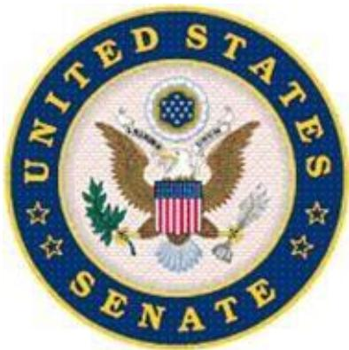

# SELECT COMMITTEE ON INTELLIGENCE

UNITED STATES SENATE

Additional Pre-Hearing Questions for Dr. Stacey Dixon upon her nomination to be Principal Deputy Director of National Intelligence

QUESTION 1: Please explain your understanding of the responsibility of the Principal Deputy Director of National Intelligence (PDDNI) in the following capacities:

a. To assist the Director of National Intelligence (DNI) in carrying out the DNI’s duties and responsibilities; and   
b. To act in the DNI’s place in the DNI’s absence.

The PDDNI is statutorily required to assist the DNI in carrying out the duties and responsibilities of the DNI, to act for and exercise her powers in the event of an absence or disability. In practice, both the DNI and PDDNI execute the daily management of the Office of the Director of National Intelligence (ODNI) as it engages in its Intelligence Community (IC) integration, oversight, and support functions. In this manner, the PDDNI advises, assists, and reinforces the DNI’s priorities while implementing her strategic direction and vision for the ODNI and the Intelligence Community (IC) as a whole.

QUESTION 2: Is your understanding that you and the DNI will divide responsibilities and that you will have a specific portfolio as PDDNI? If so, please describe this portfolio as you understand it. If not, please describe what you believe your primary responsibilities and activities will be, and on what areas you will concentrate.

In addition to the responsibilities of the PDDNI outlined in statute, regulation, and policy, I understand from DNI Haines that if I am confirmed, she would like me to leverage my background to focus on the integration of the IC’s budget and resources, policies, capabilities, collection, and technology. I will also engage with the IC Human Capital and IC Diversity, Equity, and Inclusion offices on initiatives underway to improve how we build and support our workforce. Director Haines also previously stated during her confirmation process that she is looking for the following qualities in a principal deputy: a commitment to the IC workforce itself, a commitment to the apolitical nature of the IC’s work, a commitment to tighter coordination and synchronization across the IC, a commitment to being a responsible steward of our nation’s resources in the execution of an annual budget for the National Intelligence Program, and a commitment to transparency with the public and cooperation with Congressional oversight. If confirmed, my goal will be to exemplify those qualities.

QUESTION 3: What do you expect to be your specific management responsibilities within the Office of the Director of National Intelligence (ODNI)? Is it your understanding that anyone will report to you directly, if you are confirmed?

If confirmed, I will assist the DNI in leading the IC and managing the ODNI workforce. My direct reports will be the Deputy DNIs and the component leaders from the Centers, Offices, and Oversight functions that make up ODNI. As a full leadership team, we will advance IC integration and adapt our business models to support the changing intelligence environment.

QUESTION 4: What will your role and responsibilities be in relation to the Deputy Director of National Intelligence for Information Integration (DDNI/II)?

The DDNI for Information Integration has been renamed the DDNI for Mission Integration (MI). If confirmed, DDNI/MI will be one of my direct reports. MI is responsible for creating a consistent and holistic view of intelligence from collection to analysis and serving as the DNI's principal advisor on all aspects of intelligence. MI integrates mission capabilities, informs enterprise resource and policy decisions, and ensures the delivery of timely, objective, accurate, and relevant intelligence. MI’s efforts will inform my guidance and oversight of the IC’s budget and resources, policies, capabilities, collection, and technology.

QUESTION 5: Please explain your understanding of the role of the DNI in overseeing elements of the Intelligence Community (IC) that reside within various departments of the federal government and for elements that are not housed within other departments.

Congress established the DNI to oversee and to coordinate the activities of the other elements of the IC. That includes establishing objectives and priorities for the collection, analysis, production, and dissemination of national intelligence; ensuring maximum availability of and access to intelligence information within the IC; developing and ensuring the execution of an annual budget for the National Intelligence Program; and overseeing the coordination of relationships with the intelligence or security services of foreign governments and international organizations.

The IC is composed of 18 elements that reside within various departments of the federal government or as independent agencies. The DNI’s responsibility remains the same for both types of elements. As Director Haines previously stated the DNI’s relationships with the leaders of all the IC components and, where appropriate, the departments and agencies within which they reside are critical to advancing the integration of intelligence analysis and successfully executing the DNI’s coordination role. If confirmed, I will support her by ensuring that I have strong relationships with the component deputies, and where appropriate, the deputies of the departments or agencies within which they reside.

QUESTION 6: What issues have you discovered through your general observation, professional experience, or through your preparation for your confirmation, with respect to the DNI’s role in overseeing the Central Intelligence Agency (CIA)?

As Director Haines stated, the CIA is a critical partner for a successful DNI, therefore the relationship between the DNI and the Director of the CIA is particularly important. I have not discovered any issues with respect to the DNI’s role in overseeing the CIA. Through my personal experience, the DNI provides oversight of the CIA, in a similar manner as it does for all the other elements of the IC.

QUESTION 7: What issues have you discovered through your general observation, professional experience, or through your preparation for your confirmation, with respect to the DNI’s role in overseeing intelligence elements of the Department of Defense (DoD)?

I have not discovered any issues with respect to the DNI’s role in overseeing the intelligence elements of the Department of Defense (DoD). Additionally, it is my general observation and professional experience that the DNI and Secretary of Defense, through the USD(I&S), work well jointly overseeing the intelligence elements of the DoD.

In my experience, there is an opportunity to strengthen the relationship in the area of the intelligence budget and the funding structure within the Military Intelligence Program and the National Intelligence Program. There is also an opportunity to further discuss and agree on collection platforms and collection orchestration that supports the needs of decision-makers, warfighters and policymakers.

QUESTION 8: What issues have you discovered through your general observation, professional experience, or through your preparation for your confirmation, with respect to the DNI’s role in overseeing intelligence elements of other departments of the United States Government?

The DNI does a very good job overseeing the intelligence elements of the other departments of the U.S. Government. However, it is my general observation and professional experience as the Deputy Director of NGA, and a member of the Deputies Committee, that there is an opportunity to strengthen the ODNI’s ability to fully leverage the talent within the intelligence elements in other departments of the U.S. Government. As the rise of global competitors highlights the need to focus on areas that are within the purview of elements in other departments, resources may need to shift to those elements to bolster their missions.

QUESTION 9: Do you believe additional legislation is needed to clarify or strengthen the authorities and responsibilities of the DNI with respect to the IC?

At this time, I do not have sufficient information to suggest whether additional legislation is needed to clarify or strengthen the authorities and responsibilities of the DNI with respect to the IC. If confirmed, I will observe whether and where the ODNI has challenges exercising its authorities and responsibilities. The regular examination and review of current authorities is important, especially when there are frequent technology advances and changes in the threat environment.

# Keeping the Congressional Intelligence Committees Fully and Currently Informed

QUESTION 10: Please explain your understanding of the DNI’s obligations under Sections 502 and 503 of the National Security Act of 1947.

Section 502 of the National Security Act of 1947, describes the reporting requirements for intelligence activities. It requires the DNI and the heads of all departments and agencies involved in intelligence activities to keep the congressional intelligence committees fully and currently informed of all intelligence activities, including significant anticipated intelligence activities and any significant intelligence failures.

Section 503 of the National Security Act of 1947, describes presidential requirements for and procedures for covert action and the requirement to keep the congressional intelligence committees fully and currently informed of all covert actions programs. In extraordinary circumstances, notification of a covert action may be limited, consistent with the need to protect national security.

QUESTION 11: Does the PDDNI have any responsibilities to ensure that all departments, agencies, and other entities of the United States Government involved in intelligence activities in general, and covert action in particular, comply with the reporting requirements in Sections 502 and 503 of the National Security Act of 1947?

As the primary point of contact for the deputies of the other IC elements, the PDDNI assists the DNI in her responsibilities to comply with the reporting requirements in Sections 502 and 503 of the National Security Act of 1947.

QUESTION 12: Under what circumstances, if any, do you believe notification should be limited to the Chairman and Vice Chairman or Ranking Member of the congressional intelligence committees?

Under the law, congressional notifications must be made with due regard for the protection from unauthorized disclosure of classified intelligence sources and methods and other exceptionally sensitive matters. This is not a limit on whether the intelligence committees must be kept informed about intelligence activities; rather, it simply provides flexibility on how and when to bring extremely sensitive matters to the full committees’ attention.

Section 503 permits the President to temporarily limit access to a Covert Action finding or notification to meet extraordinary circumstances affecting the vital interests of the United States. I believe limited notifications should be rare and should be done only in exceptional circumstances. As the DNI stated, and I support, even in those circumstances, she would discuss concerns about further briefings with the Chairman and Vice Chairman and have an ongoing dialogue with them about how and when the full committee membership should be briefed on the matter.

# National Security Threats

QUESTION 13: What do you view as the principal threats to national security with which the IC must concern itself in the coming years? Please explain the basis for your views.

The 2021 Annual Threat Assessment (ATA) Report effectively captures the complexity of the current threat landscape. China, Russia, Iran and North Korea, continue to invest in military capabilities while also investing in nuclear capabilities, and space capabilities. They, and other nation states and non-nation states are also using cyber for espionage, attacks, and influence-operations. The ATA also addresses numerous transnational issues and conflicts that must be monitored in some cases and disrupted in others.

The principal nation-state threat to U.S. national security is from China, and specifically the plans and intentions of the Chinese Communist Party. As stated in the ATA, “Beijing is increasingly combining its growing military power with its economic, technological, and diplomatic clout to preserve the CCP, secure what it views as its territory and regional preeminence, and pursue international cooperation at Washington’s expense.”

The IC must balance its focus on the principal threats, while also addressing other threats that have the potential to threaten the United States or our allies.

QUESTION 14: In your opinion, and based on your experience in the IC, how has the IC performed in adjusting its policies, resource allocations, planning, training, and programs to address these threats?

The threats facing the nation today and in the coming years are sophisticated -- at times blurring the definition of state or non-state aggression. How we define, respond, defend, and act will be greatly dependent on how well we adapt and evolve our policies, resources, planning, training and programs. Over the years, the IC has generally performed well in adjusting its policies, resource allocations, planning, training, and programs to address changing threats. As the threats continue to change in the future, however, the IC must adjust more quickly. If confirmed, it is one of my primary goals to protect against these threats by increasing agility across the IC, anticipating the need to balance and shift to stay ahead of and forecast threats.

# Management Challenges Facing the Intelligence Community

QUESTION 15: Apart from national security threats discussed in your prior responses, and based on your experience in the IC, what do you consider to be the highest priority management challenges facing the ODNI and the broader IC?

During my 18 years of experience in the IC, I have observed that the highest priority management challenge is the recruitment, development, and retention of employees with the requisite skills needed to accomplish the IC’s present and future missions. The IC was late to modernize its human capital resources. While mission capabilities soared, a lack of investment in our human resources infrastructure has left us with a lasting challenge from which we need to catch up. Significant gains have been made, but we have to do more.

Additionally, the majority of undergraduates are unaware of the IC other than from movies and television shows and do not consider government service in general, and more specifically service in the IC, as a viable option. The ODNI needs to help educate the American public about the opportunities in the IC and the virtue of working in national security.

# Allocation of Resources

QUESTION 16: What are your views on the intelligence budget in the short-, medium-, and long-term?

The IC’s budget is complex. It requires constantly balancing the challenges we face today, and posturing the IC to address anticipated and unanticipated challenges of the future.

The IC budget must accommodate being responsive to both of these often competing requirements because failure either in the near-term or in the future could be catastrophic for the security of the United States. In my current position as Deputy Director NGA, my participation on the Deputies Committee has provided very insightful perspectives on community-wide budgetary discussions.

Short term, there are budget challenges. There are many investments to be made, but there are also government-wide investments that must be covered within the funding available to the entire government. There is no expectation of more resources, so the IC needs to rebalance what it does with the funds available,

prioritizing the most critical investments and accepting the fact that there are some things the IC might need to do that it will not be able to do in the short-term.

In the mid-term and long-term, it would be great if the budget could expand to enable the IC to both focus on the immediate threats, while also investing enough in areas that are lower risk now, but that have the potential to be future threats; however history has shown that hoping for more funds in the future isn’t always the best strategy. Therefore, the IC must plan for the possibility of no budget growth and the possibility of budget growth to cover emerging requirements simultaneously. In either scenario, we must efficiently apply the available resources to achieve maximum capability to inform policymakers, warfighters, and other customers, as appropriate, of the threats to our national security.

QUESTION 17: From your current experience as Deputy Director of the National Geospatial-Intelligence Agency and previously as Director of the Intelligence Advanced Research Projects Activity, please describe your understanding of the requirements and appropriate practice in obtaining Congressional concurrence for reprogramming’s and releases from reserves.

The National Security Act of 1947, as amended (50 U.S.C. $\$ 3024)$ , lays out the responsibilities of the DNI regarding transfers and reprogrammings. This statute is further amplified in each year’s annual appropriations and authorizations acts providing the DNI and IC the flexibility to accommodate changing requirements and priorities based upon world events. The laws surrounding these actions specifically require congressional notification for those actions that exceed the thresholds provided in the legislation for transfers and reprogrammings. It is the IC’s practice to engage proactively with Congress to understand what concerns may exist with these actions and attempt to resolve those before taking action on those matters.

Similarly, for releases from reserves for contingencies, congressional notifications occur and the IC works with congressional oversight to understand and address any concerns or issues prior to executing.

# Office of the Director of National Intelligence

There has been considerable debate in Congress concerning the appropriate size and function of the ODNI. Congress has considered various proposals to address these issues. In answering the questions that follow, please address the ODNI’s staff functions and the specific ODNI components.

QUESTION 18: What is your view of the ODNI’s size and function?

The ODNI plays a critical role in the IC and was formed in direct response to the findings outlined in the 9/11 Commission report. The Commissions clearly laid out the roles and tasks that ODNI should perform to better integrate the community to prevent intelligence failures. Based upon my observations from working both at and with ODNI, I believe the ODNI’s current design and structure adheres to the recommendations made in that report. In terms of its size, ODNI has made a concerted effort over the past few years to streamline the organization, shift to a shared services model to avoid duplication of effort, and thoughtfully examine its force structure to look at the scope and scale of its efforts. If confirmed, I will work with the DNI to ensure the current ODNI structure is appropriate for ODNI’s future success.

QUESTION 19: Do you believe that the ODNI has sufficient personnel resources to carry out its statutory responsibilities effectively?

I fully support the President’s Budget request for ODNI and I trust the judgment of the ODNI leadership team in developing a budget that balances risk against a wide variety of mission needs that require appropriate resourcing.

QUESTION 20: In your view, what are the competing values and interests at issue in determining to what degree there should be a permanent cadre of personnel at the ODNI, or at any of its components, and to what degree the ODNI should utilize detailees from the IC elements?

As someone who served in a detailee role at ODNI, I have experienced first-hand the richness that comes from bringing together IC officers from across the community. Detailees at ODNI help ensure that the views of the IC agencies are represented while also providing valuable reach-back to their home organizations. Having a permanent cadre at ODNI that is not tethered to the operational agencies helps foster the ODNI’s important role as an honest broker in oversight and integration. ODNI cadre officers are trained to see themselves as IC officers first, without bias for the individual preferences of any one agency and with the ability to bring together different voices and perspectives of the IC. As we further mature the concept of the IC officer, a mix of ODNI permanent cadre and detailees is optimal.

QUESTION 21: Do you believe that the ODNI is adding sufficient value to justify its large staff and budget? If not, what do you intend to do to reverse that perception?

Compared to other federal oversight organizations that perform similar roles and missions, most of which operate within a single department or agency with direct management lines of authority, ODNI must operate across 18 different IC organizations with distinct management structures. In my experience, ODNI is both efficient and effective in ensuring the Community is focused upon the most critical issues and providing common services and capabilities to enhance mission effectiveness in the IC. To reverse negative perceptions about ODNI’s size, one of my priorities will be to increase our information sharing with Congress to demonstrate how ODNI makes a difference in leading integration across the IC.

QUESTION 22: Describe your understanding of the role played by National Intelligence Managers (NIMs) under ODNI’s current structure and organization.

As Deputy Director of NGA, I attend the Deputies Committee and have the opportunity to hear from many of the NIMs. The NIMs fall under the National Intelligence Management Council (NIMC), which is part of the Directorate for Mission Integration. There are regional, functional, and domain NIMs that serve as the DNI’s principal advisors on all aspects of their particular mission areas. The NIMs lead and integrate IC efforts across the community developing Unifying Intelligence Strategies (UIS) and make recommendations for investments, risk management, and global coverage and posture.

# Cybersecurity

QUESTION 23: The ODNI has a central role to play in coordinating cybersecurity efforts, particularly with the respective roles of the Director of the National Security Agency and the head of U.S. Cyber Command.

A. Are there any changes that you would recommend for the DNI’s and IC’s roles within the nation’s cybersecurity infrastructure?

I expect to have an active role in overseeing cyber-related issues including IC policy development, operational considerations, and safeguarding IC systems. If confirmed, I will assist the DNI in her cybersecurity responsibilities and make sure the ODNI and IC have the resources needed to support our roles in the nation’s cybersecurity apparatus.

B. What is your view regarding the proposals to end the “dual-hat” relationship between the National Security Agency and U.S. Cyber Command?

There will certainly be, and I fully endorse, a continuing close and synergistic relationship between NSA and U.S. Cyber Command. I am committed to ensuring the right policies, processes and procedures are in place to ensure efficient NSA-U.S. Cyber Command integration across all lines of operations regardless of who is in charge. A series of agreements that NSA and U.S. Cyber Command have been operating under since 2018 codified the operational and support relationship in a way that ensures continued mission partnership. Regardless of the dual-hat decision, there will always be a strong link between the information gained from foreign intelligence and the development of operational capabilities.

C. What should be the IC’s role in helping to protect U.S. commercial computer networks? What cyber threat information (classified or unclassified) should be shared with U.S. private sector critical infrastructure entities to enable them to protect their networks from possible cyber-attack?

With the increasingly sophisticated tradecraft of foreign cyber adversaries, ODNI recognizes the partnership between government and industry has become more critical than ever to obtain insights into foreign cyber adversary activities within US systems. The ODNI provides support to FBI, DHS, and sector specific agencies (for example, DOE, Treasury, and DOD to include NSA) to provide classified information to appropriate individuals in the private sector.

QUESTION 24: How do you assess the state of research and development (R&D) activities within the IC?

My professional background has afforded me a number of positions across the IC’s Science & Technology (S&T) enterprise including being the Director of Intelligence Advanced Research Project Agency (IARPA). I am confident in stating these activities are powerful mission enablers that leverage academic, commercial, and government personnel, and resources to further our intelligence advantage. The IC’s R&D community benefits from the focused efforts of individual agencies as well as solving problems collaboratively across agencies. But we can do more. If confirmed, I will work to ensure the IC continues to emphasize R&D and S&T to serve both the development of unique capabilities and adoption of new technology to further the IC’s mission and protect national security.

QUESTION 25: What changes, if any, need to be made in the IC regarding R&D?

The IC’s mission is to collect, process, analyze, exploit, and disseminate information. R&D in the IC is about producing capabilities that enable mission and protect national security. To continue to do this the IC will have to harness accelerating technological change – from wherever it originates – to keep pace and evolve capabilities. There are increasingly sophisticated threats and the nature of conflicts are shifting. Now more than ever a stable funding base for IC technology partners in academia, industry, and government is crucial for the longterm fiscal health of the IC Science and Technology enterprise. The IC’s goal is to be more flexible and agile so state of the art breakthroughs are fielded on a reduced timeline. This may require different approaches to acquisition and contracting and will require a commitment to transparency between and among agencies regarding R&D investments.

QUESTION 26: How will you advance IC-ITE to ensure that the IC is working as a whole to capitalize on the efficiencies IC-ITE is expected to bring to the IC?

To ensure the IC capitalizes on the efficiencies the Intelligence Community Information Technology Enterprise (IC-ITE) is expected to bring to the

Community, if confirmed, I will continue the IC’s strategic shift from a common services model to federated information technology (IT) service model that promotes interoperability while also allowing mission-specific tailoring to optimize operational effectiveness.

# IC Missions and Capabilities

QUESTION 27: Please explain your views of the current quality of the IC’s intelligence analysis.

The Intelligence Reform and Terrorism Prevention Act of 2004 requires an annual evaluation of IC performance in analytic tradecraft. ODNI findings in 2020 indicate strong IC performance on the relevance standard, because the products provided threat context and factors affecting action, but weak performance on the uncertainty standard. Going forward, the IC should focus on accurately characterizing uncertainty. Adequate conveyance of the degree of confidence in a judgment will greatly improve that standard.

From my perspective as NGA Deputy Director, I am very impressed with the quality of the IC’s intelligence analysis. The IC does an outstanding job of covering a wide range of global issues. There is incredible analytic skill and capacity resident in the IC that enables timely policy and decision-making, which safeguards the American people, our allies, and U.S. interests. With that, we need to continue to challenge our assumptions and focus on how the world is changing and what profound impacts these changes will have on national security. Our investment in the next generation of intelligence analysts has to account for the changing nature of the talent and expertise we seek as the result of emerging new areas. A successful IC of the future has to become one IC and embrace an agile workforce.

QUESTION 28: If confirmed, what steps would you take to improve the IC’s intelligence analysis?

The IC should continue to expand its interactions with academia, the private sector, and foreign partners – bringing diversity of views and other forms of alternative futures into analytic writing. This will help challenge thinking and help flag potential future issues for our policymakers. The health and wellness of intelligence analysis is dependent on the constant investment in recruiting the right talent, fostering continuous learning opportunities, and providing analysts with an enterprise IT architecture built for their data and tailored to their work. IC analysts need to be able to access data easily and more quickly. Improving intelligence analysis depends upon improving data discovery, tagging, and processing using artificial intelligence and machine learning; aiding analysts in a variety of ways to improve their products.

QUESTION 29: Please explain your views of the current quality of the IC’s intelligence collection.

Collection capabilities in the five intelligence disciplines are strong, but demand continues to outpace supply. Part of effective collection management is balancing requirements across various collection systems. The IC has unique collection capabilities that are in constant high-demand. The IC identifies collections gaps with an enterprise approach and works together, to close collection gaps. The key to maximizing quality collection is prioritizing competing requirements against measured value; so the IC works the most critical questions achieving the best possible outcome for decision and policy-makers.

QUESTION 30: What are your recommendations for improving the quality of the IC’s intelligence collection?

To improve the quality of the IC’s intelligence collection, the IC must:

 Continue to advance artificial intelligence and machine learning capabilities to help process large amounts of data more effectively,   
 Continue enhancing multi-int collection across all collection types and modalities, Focus on acquisition agility with continued emphasis on the hardest of the hard problems, and   
 Strengthen the collection management workforce and associated skillsets.

Our adversaries are constantly improving their abilities to deny us information and we must seek innovative ways to defeat their efforts. To maintain our competitive advantage, the IC must continue to invest and re-invest in its most important collection assets. No one approach will work for the issues we face today.

If confirmed, I will encourage the development of innovative collection capabilities, strengthen our ability to process and exploit data, and enhance th skills of our teammates who collect information and manage our collection strategies.

We must also continue to look to where industry can help. The explosive growth of the commercial marketplace as it relates to computing power, processing speed, and data collection is driving the government away from government-specific solutions. We must embrace what is increasingly available and address how it can best be accessed and used. The growth in commercial imagery is one such example of commercially available information.

By investing in new technical capabilities, strengthening current critical assets, building the necessary supporting architecture, and leveraging a healthy commercial market, we will position ourselves to tackle current and future challenges.

QUESTION 31: If confirmed, what role would you have with regard to intelligence collection, and what steps would you take to improve the IC’s intelligence collection?

If confirmed, I would lead the Deputies Committee, which drives the discussion and decisions pertaining to the allocation of resources within the IC and would work to incorporate my earlier recommendations for intelligence collection. I would help spotlight areas in the IC demonstrating collection coordination and drive the IC towards that goal. In addition to our internal collection integration, I would work along with the DNI on our foreign partner integration, where able, bridging partner capabilities and common interests for combined collection operations.

QUESTION 32: Please explain your views of the IC’s use of contractors.

IC contractors are essential partners of the overall IC workforce strategy. The core contractor workforce complements the government workforce, bringing together a group of professionals with diversified skills and expertise. Contractors bring enormous value to difficult problem-sets, helping the IC address mission requirements.

QUESTION 33: In your view, has the IC achieved a proper balance of government and contractor personnel? Please explain the basis for your response.

The proper balance of government and contractor personnel should always be evaluated. In 2017, the Intelligence Authorization Act included a provision for the Multi-Sector Workforce. This enables conversion of contractors to government staff, providing IC elements the flexibility to shape and maintain a balanced workforce with the appropriate mix of government personnel and contractors. As the IC implements Right Trusted Agile Workforce, there will be more hybrid employment models and a more mobile workforce. If confirmed, I will monitor how the IC Human Capital office assesses the overall workforce requirements and the ratio of government –to- contractor personnel required to meet our mission.

QUESTION 34: In your view, are there some functions that contractors should not conduct, or for which the IC’s use of contractors should be discouraged or require additional approvals, including by the DNI? Please describe the basis for your response.

Yes. The government has well-established rules when it comes to contractor engagement, especially as it relates to tasks or functions considered inherently governmental. Contractors should not perform tasks or functions that involve the exercise of discretion required to make policy or other decisions regarding how we use or allocate resources, prioritize work, or expend funds. Further, contractors should not be the driver for more or new work. I believe and have acted on this foundational principle throughout my career and am committed to doing so in the future.

QUESTION 35: If confirmed, would you recommend changes to the security clearance process regarding IC contractors and/or Federal employees?

If confirmed, I would work to highlight the importance of personnel vetting reform and underscore personnel vetting as a priority. I will support the ongoing clearance reform effort of the Federal personnel vetting system – Trusted Workforce 2.0. This initiative directs bold action across the Government to transform the way the Federal Government builds and sustains a trusted Federal workforce devoted to the safety and well-being of the American people. For decades, there has been a tremendous strain on the personnel vetting enterprise. We can do better and must do better to support a revitalized workforce. We have a unique opportunity now to break the decade’s long cycle of challenges by adopting a framework that leverages new thinking, modern capabilities, and cutting-edge information technology. These reforms are essential for our Government to obtain the talent needed to fill mission-critical positions

with knowledgeable, skilled and motivated individuals. If confirmed, representing the Security Executive Agent role, I would support the Trusted Workforce 2.0 efforts to reform and improve the timeliness and efficiency of personnel vetting for hiring a trusted government workforce.

QUESTION 36: Please explain what your responsibilities would be, if confirmed, in making decisions or recommendations concerning IC officials’ accountability with respect to matters of serious misconduct.

IC elements have primary responsibility for investigating and addressing allegations of misconduct within their respective organizations. The Inspector General for the IC element, or the Inspector General for the IC, might perform the investigation when serious misconduct is alleged. If confirmed, my responsibilities in making decisions or recommendations concerning allegations of serious misconduct by IC officials would be to ensure such allegations are fully investigated promptly and objectively and that IC element heads take appropriate disciplinary actions when warranted. I expect that, in the event an IC element head fails to take appropriate action in response to allegations of serious misconduct, it would be my duty to raise the issue with the DNI and, if appropriate, recommend an accountability review.

QUESTION 37: Please explain your responsibilities, if confirmed, to ensure that performance and rewards systems across the IC agencies are fair and equitable.

IC employees are the IC’s most critical asset. Recognizing this, if confirmed, I will work closely with the IC Human Capital Office to ensure we are approaching the rewards process in a fair and equitable manner that emphasizes merit-based rewards for performance. I will also expect transparency in the IC’s performance and rewards processes, providing employees with insight and visibility into outcomes. Additionally, I expect IC elements, with leadership from the IC Human Capital Office, to continue to identify and implement performance and rewards programs that have shown both the greatest employee satisfaction with processes used, that rewards the best performance, and that yields merit-based and fair outcomes. The IC consistently ranks as one of the Best Places to Work by the Partnership for Public Service. If confirmed, I will work hard to maintain the IC’s place among the best places to work.

# Financial Management and Infrastructure

QUESTION 38: If confirmed, what role do you expect to have in reviewing business system investments in the IC?

The roles and responsibilities of the Office of Business Transformation are currently executed within the IC CIO’s office. If confirmed, I would engage with the organization to be aware of business system transformation across the IC elements and work across the ODNI staff and other elements of the IC to bring awareness of best practices and opportunities to leverage investments across IC elements.

QUESTION 39: What responsibilities have you had at the NGA for producing financial statements?

As Deputy Director of NGA, my primary role has been ensuring the accurate production of financial statements by NGA’s Chief Financial Executive (CFE) and her team in the Financial Management organization. NGA’s acquisition and contracting efforts are grounded in ethics, integrity, and the fundamental core values that promote good stewardship of appropriated resources.

# Acquisitions

QUESTION 40: What is your assessment of the IC’s current acquisitions capability?

The IC’s ultimate measure of successful performance is providing systems that meet mission requirements at costs that are affordable, ensuring taxpayer’s money is spent as productively as possible. IC Acquisition is adapting its frameworks to achieve flexible, agile, risk-managed processes and best practices. These important ongoing efforts are enabling streamlined approaches to meet mission requirements. If confirmed, I look forward to continuing to build on the work aimed at adapting the IC’s acquisition capability to promote efficient and effective delivery of innovative capabilities, data, and systems.

QUESTION 41: Do you believe the space industrial base specifically, and the intelligence industrial base more generally, are capable of producing the number of complex systems the IC and the DoD demand of them on time and within budget?

There is recognition across government and industry that we need to adapt our acquisition processes, where it makes sense, for our Nation’s security. This is $a$ hard problem, but not insurmountable. To be adaptive is to apply different solutions for different situations. The intelligence industrial base is capable of affordably producing the number of complex systems the IC and DoD demand when needed. The IC draws on a robust IC & DoD contractor base and with the expansion of commercial enterprises; there is an ever-increasing talent pool. The IC can shift further toward industrial based provisioned services and away from unique Government-centric acquisition of highly complex systems – such as commercial space imaging, and commercial launch capabilities.

# Department of Defense

QUESTION 42: Please explain your understanding of the need to balance the requirements of national and tactical consumers, specifically between establishing a unified intelligence effort that includes DoD intelligence elements with the continuing requirement that combat support agencies be able to respond to the needs of military commanders.

My home agency, NGA, is a member of the IC and a Combat Support Agency. Balancing the requirements of national and tactical users is what my agency does 24/7/365. In my current role, I have seen how effective a single collection architecture that supports both tactical and national requirements can be. Bringing all available collection platforms to bear against a problem yields more coverage for all of the highest priority missions, as opposed to being limited to either a national-only or a tactical-only architecture. Orchestrating collection by leveraging all available collection platforms yields the most optimal solution. If there is a crisis, systems and analysts can focus more on the crisis area, whether that is a war zone or a strategic area of interest. The collection ‘system of systems is capable of that.

Likewise, I understand how the entire community must work together to optimize the full scope of our collective capabilities and focus them effectively to deliver the information and products national and tactical consumers need to meet their diverse missions. This means not only working across national agencies, but also leveraging the vital partnerships we have with our international allies. For example at NGA, I have seen the power of multi-national co-production efforts to deliver critical foundation maps and charts that our forces use to safely navigate around the world.

I have also seen how critical it is to balance the information requirements of national and tactical consumers. Being able to deliver data, analysis and information at the classification levels across multiple platforms to meet the mission needs of the consumers is key to our overall success. From the most sensitive of programs to unclassified support to unclassified messaging, we must deliver information at the speed of relevance to our military commanders while continuing to protect our sources and methods.

I also acknowledge that there is a natural inclination to want to control ones sources of information, especially when lives are on the line. Therefore, it is incumbent upon those of us who support both the national and tactical users to be transparent about how we task systems, source data, ensure the accuracy and integrity of that data; we must also be transparent about what level of requirement satisfaction we can deliver. This is something NGA works hard to do daily.

QUESTION 43: What concerns do you have, if any, as to the IC’s ability to support war zones while retaining its full capabilities to conduct missions outside of war zones?

During my tenure at NGA, I have seen NGA provide products to war zones while still successfully conducting missions outside of war zones. Information supporting the President’s Intelligence Priorities and the National Intelligence Priorities must still be collected and analyzed even during times of war.

When it comes to information, if you are a user of the information, more is always better. No one is ever $100 \%$ satisfied. Despite that, being able to accomplish our mission to support requirements in war zones and outside of war zones is very doable. The system shifts to cover the most pressing needs. We invest in automation to speed up processes and increase efficiency. We optimize collection and analytic activities to support all partners and customers with their highest priority needs. The IC works with international and domestic partners to increase persistence and be more responsive to warfighter and policymaker’s priorities. The IC routinely takes steps to adjust collection and analytic postures to address emerging threats and monitor potential crises. We leverage modern IT architectures to deliver data where it needs to be and in the format that is most useful for the end user.

There is, however, a finite amount of data available at any given moment. If more resources shift to one location, they have to shift from another location. This is why collection orchestration is so powerful, and why it is so critical that we build diversity, redundancy, and resiliency throughout our intelligence and defense infrastructures. No changes are made without understanding the impact on other missions. Reductions in one type of collection can often be mitigated by increasing collection from a different type of platform. Communication in these situations is paramount. It is the only way the end user will trust that the data they need will be there in a crisis.

# Covert Action

QUESTION 44: What is your view of the DNI’s responsibility to supervise, direct, or control the conduct of covert action by the CIA?

Consistent with the National Security Act of 1947, any decision to employ covert action as a tool of national security strategy will be made by the President. Pursuant to Executive Order 12333, the President has charged the Director of the CIA with responsibility for the conduct of covert action activities, except where the President determines that another agency is more likely to achieve a particular objective. E.O. 12333 states that the DNI "shall oversee and provide advice to the President and the NSC with respect to all ongoing and proposed covert action programs." I understand these requirements to mean that the DNI must be kept informed of existing covert action programs and should participate in the national security process of approving and reviewing covert action findings. In addition, the DNI is responsible for engaging with CIA and OMB to identify funds for new covert action findings. Finally, the DNI has a statutory mandate to ensure that the activities of CIA, including covert action, comply with the Constitution and laws of the United States.

QUESTION 45: Do you believe that any additional authorities are necessary to ensure that covert action programs are lawful, meet the public policy goals of the United States, or for any other purpose?

While I am not aware of a specific need for additional authorities, if confirmed, I would inform the Committees in the event I identify such a need and work with the Committees to address that need.

QUESTION 46: What in your view is the appropriate role for the CIA Inspector General in auditing covert action programs?

My understanding is that the CIA Inspector General currently performs reviews and audits of covert action programs on a regular basis. I support these regular reviews.

QUESTION 47: If confirmed, what role will you have regarding covert actions?

If confirmed, I will assist Director Haines in her responsibilities as described in my response to Question 44. In addition, I would be prepared to act for, and exercise the powers of, the DNI should any circumstance arise where it would be necessary for me to do so.

# Privacy and Civil Liberties

QUESTION 48: Please describe the IC’s efforts to protect privacy and civil liberties, and what, if any, challenges face the IC in these areas.

The protection of privacy and civil liberties is -- and must be -- integral to every aspect of the IC’s mission. The IC cannot be successful unless we earn and retain the public’s trust. And as officers and Americans, we only truly protect our nation when we do so in a manner consistent with our values.

The protection of privacy and civil liberties begins with our adherence to legal safeguards. Intelligence authorities, including the National Security Act of 1947 and the Foreign Intelligence Surveillance Act of 1978, both authorize and provide real restraints on the activities of the IC. Executive Order 12333 also requires specific procedures, approved by the Attorney General after consultation with the DNI, governing the collection, retention, or dissemination of information concerning United States persons. Close collaboration with attorneys and privacy and civil liberties officers helps ensure that the execution of our mission is consistent with these core authorities. Effective oversight, both within the IC and by Congress, is also central to ensuring adherence to these critical protections.

While protecting privacy and civil liberties has been central to the work of the IC for my entire career, it has only been in more recent years that the IC has come to appreciate the need for true transparency. The strongest protections will not build public trust if the public does not know they exist. I have been encouraged by the efforts of the IC over the last decade to make public more information about the authorities and procedures under which it operates, and I believe we need to continue to enhance such transparency while protecting our sources and methods.

The IC’s most significant privacy and civil liberties challenge is ensuring that our protections keep pace with technological advancements. A data-rich environment with ever-improving analytic tools presents opportunities for intelligence collection and analysis, but also requires that we continue to conduct our activities in a manner that protects Americans’ rights. With the use of technology, that safeguards privacy, strong and clear rules that ensure our civil liberties, and effective oversight, I believe we can remain nimble and protect both our national security and our values.

QUESTION 49: Section 102A(f)(4) of the National Security Act of 1947 provides that “[t]he Director of National Intelligence shall ensure compliance with the Constitution and laws of the United States by the Central Intelligence Agency and shall ensure such compliance by other elements of the intelligence community through the host executive departments that manage the programs and activities that are part of the National Intelligence Program.” What are the most important subjects concerning compliance with the Constitution and laws that the DNI should address in fulfilling this responsibility?

Every intelligence officer swears an oath to support and defend the Constitution and must always act in compliance with the laws of the United States. Of central importance are our rights under the First and Fourth Amendments, the right to due process, and the right to equal protection under the law. These rights are also protected and enshrined in many statutes, including the Foreign Intelligence Surveillance Act, the National Security Act, the Privacy Act, and the Civil Rights Act of 1964.

QUESTION 50: What methods, and through what officials, should the DNI use to ensure compliance with the Constitution and laws, including, but not limited to, the Office of the General Counsel, the ODNI Inspector General, and the Civil Liberties Protection Officers?

I proudly share in the responsibility of every officer within the IC to conduct our intelligence activities in compliance with the Constitution and the laws of the United States. But, those in leadership positions have the additional responsibility of ensuring that the IC has put in place the right tools – including clear rules and guidance, effective training, and strong oversight mechanisms – that enable compliance. If confirmed and to that end, I will work closely with the Office of General Counsel, the Office of Civil Liberties, Privacy, and Transparency, the

Office of Equal Employment Opportunity, and the Office of the Inspector General for the IC.

# Expiring Foreign Intelligence Surveillance Act provisions

QUESTION 51: What is your view with respect to reauthorizing Title VII of the Foreign Intelligence Surveillance Act provisions that expire in 2023, and, specifically, whether any of the provisions should be revised?

As the DNI stated during her confirmation hearing, Title VII of FISA provides some of the most critical intelligence to protect our national security. I understand that there is a variety of proposals to modify Section 702 and that Director Haines has committed to working with elements of the IC, the Department of Justice and the Congress to determine whether any changes can be made that would improve the protection of privacy and civil liberties without compromising national security. If confirmed, I would support the DNI in those efforts.

QUESTION 52: The USA FREEDOM Act of 2015 (P.L. 114-53) reauthorized three national security tools – Business Records collection, Roving Surveillance, and the Lone Wolf provision – that expired on March 15, 2020. What, if any, concerns do you have with the expiration of these authorities?

The provisions of FISA that expired on March 15, 2020, have bipartisan support and provide tools to protect Americans while protecting their rights. During her confirmation process, Director Haines stated that she supports reauthorization of the expired provisions, and, if confirmed, I look forward to working with Congress to this end.

# Potential Politicization of Intelligence

QUESTION 53: How do you define the politicizing of intelligence?

Analytic Objectivity is the core ethic of the intelligence profession. Intelligence is the only great function of state that is expected to provide our customers – at the highest levels – unvarnished, unbiased assessments based on objective analysis of all the available facts. Under the law, Intelligence Reform and Terrorism Protection Act (IRTPA) Sections 1017, 1019, 1020, and described in further specificity in IC Directive 203, intelligence must be “objective and devoid of political considerations”.

QUESTION 54: What responsibilities does the PDDNI role entail, relative to ensuring the IC’s analysis remains objective and free from political consideration?

If confirmed, I will be a strong partner with the DNI to ensure objective analysis. The PDDNI has to ensure that the appropriate oversight is in place to identify the politicization, make independent judgments, and provide recommendations to leadership.

The PDDNI provides oversight and advice to the intelligence production elements of the IC. The PDDNI is obliged to recognize where intelligence is not upholding ICD 203 principles, solicit advice and leverage the Analytic Ombudsman. The PDDNI is obliged to take steps to correct the problem, including faithfully representing analysts’ work in interactions with decision-makers. Both the DNI and PDDNI set the tone for promoting a healthy challenge culture in and among analytic work units. The act of questioning is expected and encouraged rather than silenced or sidelined – instilling behavior congruent with the principle “speaking truth to power”.

QUESTION 55: In your view, how significant a concern is the risk of politicized intelligence?

I view politicization of analysis as an existential risk to the very reason why there is an IC. If we cannot provide objective analysis, or are perceived as being unable to do so, we run the risk of becoming irrelevant to policy-makers, our customers, and the American people.

As intelligence professionals, we should all be trained to deliver objective, independent analysis to consumers, especially when judgements are unwelcome. Beyond training for analysts and managers, if confirmed, I will provide consistent messaging, along with the DNI about the core ethic of objective analysis; workforce discussions about the positive value of objective analysis; and a network of advocates to promote a healthy challenge culture in the IC where divergent thoughts are discussed and alternative judgments are voiced – an environment in which politicization is not tolerated.

# Workforce-Related

QUESTION 56: Please describe how you envision your role in overseeing and implementing IC-wide diversity, equity, and inclusion initiatives.

In line with the President’s Executive Orders, it is critical to have continuous focus and investment in diversity, equity and inclusion across the IC. Recruiting and retaining an IC workforce that reflects America is one of Director Haines’s priorities. If confirmed, I will chair the Deputies Committee, hearing regularly and directly from IC elements leadership about their respective element’s diversity, equity, and inclusion policies, programs and initiatives. These efforts will take significant time, energy, continuous support and leadership engagement and I am committed to overseeing these important initiatives.