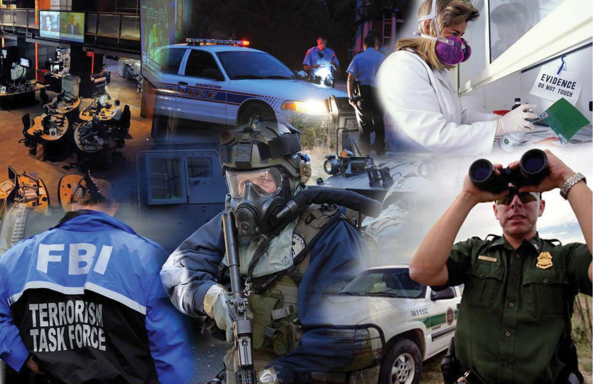
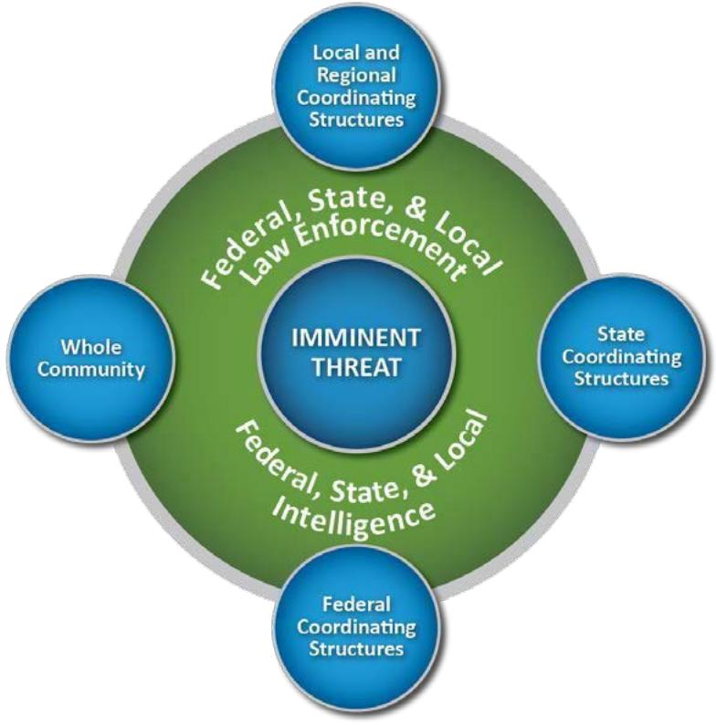

# National Prevention Framework

Second Edition June 2016

# Executive Summary

The National Prevention Framework describes what the whole community—from community members to senior leaders in government—should do upon the discovery of an imminent threat to the homeland. An imminent threat is intelligence or operational information that warns of a credible, specific, and impending terrorist threat or ongoing attack against the United States. This Framework helps achieve the National Preparedness Goal of a secure and resilient Nation that is optimally prepared to prevent an imminent terrorist attack within the United States.1 The processes and policies described in this document will be conducted in accordance with existing laws and regulations.

This Framework provides guidance to individuals and communities, the private and nonprofit sectors, faith-based organizations, and all levels of government (local, regional/metropolitan, state, tribal, territorial, and Federal) to prevent, avoid, or stop a threatened or actual act of terrorism by

 Describing the core capabilities needed to prevent an imminent act of terrorism;   
Aligning key roles and responsibilities to deliver Prevention capabilities in time-sensitive situations;   
 Describing coordinating structures that enable all stakeholders to work together; and Laying the foundation for further operational coordination and planning that will synchronize Prevention efforts within the whole community and across the Protection, Mitigation, Response and Recovery mission areas.

This Framework applies only to those capabilities, plans, and operations necessary to ensure the Nation is prepared to prevent an imminent act of terrorism against the United States and does not capture the full spectrum of the Nation’s efforts to counter terrorism. The seven Prevention core capabilities are planning; public information and warning; operational coordination; forensics and attribution; intelligence and information sharing; interdiction and disruption; and screening, search, and detection. This Framework sets out three principles that guide the development and execution of the core capabilities for Prevention: engaged partnerships; scalability, flexibility, and adaptability; and readiness to act.

A well-established capability to quickly collect, analyze, and further disseminate intelligence becomes critical in an imminent threat situation. To accomplish this, law enforcement, intelligence, homeland security professionals, and other members of the whole community must form engaged partnerships. These partnerships allow for the seamless acquisition and passage of information. In addition to Federal Bureau of Investigation (FBI) Joint Terrorism Task Forces (JTTF) and Field Intelligence Groups (FIG), as well as state and major urban area fusion centers, a variety of analytical and investigative efforts support the ability to identify and counter terrorist threats by executing these prevention support activities. These efforts include other local, state, tribal, territorial, and Federal law enforcement agencies, and various intelligence centers and related efforts such as High Intensity Drug Trafficking Areas, Regional Information Sharing Systems Centers, criminal intelligence units, real-time crime analysis centers, and others.

Coordinating structures facilitate problem solving, improve access to resources, and foster coordination and information sharing. Departments or agencies, as well as private and nonprofit entities, with unique missions in Prevention bring additional capabilities to bear through these structures. National-level structures include the Department of Homeland Security National

# National Prevention Framework

Operations Center (NOC), the National Cybersecurity and Communications Integration Center (NCCIC), the FBI Strategic Information and Operations Center (SIOC), the Office of the Director of National Intelligence National Counterterrorism Center, the Department of Defense National Military Command Center, the FBI National Joint Terrorism Task Force (NJTTF), the National Cyber Investigative Joint Task Force (NCIJTF), and others. Field coordinating structures include the FBI JTTFs and FIGs; state and major urban area fusion centers; and state and local counterterrorism and intelligence units. These coordinating structures are scalable, flexible, and adaptable.

The responsibility for prevention is shared, from the individual and the community to local jurisdictions; state, tribal, and territorial governments; and the Federal Government. Initiatives based on Prevention mission activities and core capabilities help guide communities to create conditions for a safer, more secure, and more resilient Nation by enhancing prevention through operational coordination and information sharing.

The environment in which the Nation operates grows ever more complex and unpredictable. In implementing the National Prevention Framework to build a culture of preparedness, partners are encouraged to develop a shared understanding of broad-level strategic implications as they make critical decisions in building future capacity and capability. The whole community should be engaged in examining and implementing the strategy and doctrine contained in this Framework, considering both current and future requirements in the process.

Note: FEMA has made minor administrative updates to this document as of March 2025 in compliance with executive orders.

#

Table of Contents   
EXECUTIVE SUMMARY... ....I   
INTRODUCTION...... ..... 1   
Framework Purpose and Organization.... ..... 1   
Intended Audience ... ...... 2   
SCOPE ........ ................... 2   
Guiding Principles .... ....... 4   
Risk Basis...... ....... 4   
ROLES AND RESPONSIBILITIES... ........ 5   
Individuals, Families, and Households... .............. ..... 5   
Communities....... .......... 5   
Nongovernmental Organizations............... .................... .................... 5   
Private Sector Entities .. .... 5   
Local Governments.......... ............................................................................................................... 5   
State and Territorial Governments ................................................................................... .................. 6   
Tribal Governments .. ...... 6   
Federal Government..... ................................................................................................................. 6   
CORE CAPABILITIES..... .................................. .................... 9   
Intelligence and Information Sharing ........ ........ 10   
Screening, Search, and Detection ...............   
Interdiction and Disruption .... ................ 13   
Forensics and Attribution ..... .................... ................. 14   
Planning ....... .......... 14   
Public Information and Warning....... ....... 15   
Operational Coordination.....   
COORDINATING STRUCTURES AND INTEGRATION... ....... 17   
Local and Regional Coordinating Structures.. ....... 18   
State Coordinating Structures .... ........... 19   
Federal Coordinating Structures... .............. ...... 20   
Integration ......... .......... 22   
RELATIONSHIP TO OTHER MISSION AREAS.. ........................ ................. 23   
Protection Mission Area... ........................ ...... 23   
Mitigation Mission Area..................................................................................................................... 23   
Response and Recovery Mission Areas..................... .............. ..................... 24

# National Prevention Framework

OPERATIONAL PLANNING... 24   
Prevention Operational Planning.. 24   
Planning Assumptions .... . 25   
Framework Application . 26   
SUPPORTING RESOURCES . 26   
CONCLUSION. 26

# Introduction

The National Preparedness System outlines an organized process for the whole community to move forward with their preparedness activities and achieve the National Preparedness Goal. The National Preparedness System integrates efforts across the five preparedness mission areas—Prevention, Protection, Mitigation, Response, and Recovery—in order to achieve the goal of a secure and resilient Nation. The National Prevention Framework, part of the National Preparedness System, sets the strategy and doctrine for how the whole community builds, sustains, and delivers the Prevention core capabilities identified in the National Preparedness Goal in an integrated manner with the other mission areas. This second edition of the National Prevention Framework reflects the insights and lessons learned from real-world incidents and the implementation of the National Preparedness System.

Prevention: The capabilities necessary to avoid, prevent, or stop a threatened or actual act of terrorism. Within the context of national preparedness, the term “prevention” refers to preventing imminent threats.

Protection: The capabilities necessary to secure the homeland against acts of terrorism and manmade or natural disasters.

Mitigation: The capabilities necessary to reduce loss of life and property by lessening the impact of disasters.

Response: The capabilities necessary to save lives, protect property and the environment, and meet basic human needs after an incident has occurred.

Recovery: The capabilities necessary to assist communities affected by an incident to recover effectively.

# Framework Purpose and Organization

The National Prevention Framework describes what the whole community2 —from community members to senior leaders in government—should do upon the discovery of an imminent terrorist threat to the homeland.

This Framework helps achieve the National Preparedness Goal of a secure and resilient Nation that is optimally prepared to prevent an imminent terrorist attack, including on-going attacks or stopping imminent follow-on attacks. The processes and policies described in this document will be conducted and applied in accordance with existing laws and regulations.

This Framework provides guidance to leaders and practitioners at all levels of government, private and nonprofit sector partners, and individuals to prevent, avoid, or stop a threatened or actual act of terrorism by

 Describing the core capabilities needed to prevent an imminent act of terrorism;

# National Prevention Framework

Aligning key roles and responsibilities to deliver Prevention capabilities in time-sensitive situations; - Describing coordinating structures that enable all stakeholders to work together; and Laying the foundation for further operational coordination and planning that will synchronize Prevention efforts within the whole community and across the Protection, Mitigation, Response, and Recovery mission areas.

# Intended Audience

This Framework applies to all levels of government, the private and nonprofit sectors, and individuals, as all play a role in preventing terrorism. It is especially useful for government leaders who have an obligation for public safety in their jurisdictions, including preventing imminent terrorist threats. Senior leaders (such as Federal department or agency heads, state and territorial governors, mayors, tribal leaders, police and fire chiefs, commissioners, sheriffs, public health and health system leaders, other city or county officials, and community leaders) should use this Framework as a comprehensive and accessible reference guide to the core capabilities and coordinating structures needed to prevent imminent acts of terrorism.

This Framework also provides guidance to intelligence, law enforcement, and homeland security professionals on how existing entities (such as the Federal Bureau of Investigation (FBI) Joint Terrorism Task Forces (JTTF), state and major urban area fusion centers, state and local counterterrorism and intelligence units, and other Executive Branch–sponsored task forces and initiatives that have an intelligence or information sharing role) can collaborate and prioritize their efforts to support the delivery of Prevention core capabilities.

This Framework explains how the general public and private sectors may serve as partners for law enforcement in terrorism prevention.3 Engaging the whole community is critical to success and individual and community preparedness is a key component. By providing equal access to acquire and use the necessary knowledge and skills, this Framework seeks to enable the whole community to contribute to and benefit from national preparedness. This includes children;4 older adults; individuals with disabilities and others with access and functional needs;5 and people with limited English proficiency. Their contributions must be integrated into the Nation’s efforts, and their needs must be incorporated as the whole community plans and executes the core capabilities.

# Scope

The United States carries out many programs and operations to prevent terrorism at home and abroad by stopping terrorist development, acquisition, and use of weapons of mass destruction, including

explosives; eliminating terrorist safe havens; building enduring counterterrorism partnerships;   
stopping terrorist use of malicious cyber activity capabilities; and countering terrorist ideology.

This Framework applies only to those capabilities, plans, and operations directly employed to ensure the Nation is prepared to prevent an imminent act of terrorism in the United States, and does not capture the full spectrum of the Nation’s efforts to counter terrorism. It is part of a broader U.S. policy to comprehensively address terrorism at its root by countering radicalization to violent extremism. Furthermore, in the global context, terrorism prevention activities should be conducted as early as possible before a plot becomes viable and as far from the intended target as possible. Therefore, it is preferable to prevent recruitment and radicalization toward violence, to deter terrorist plots, and to detect, disrupt, thwart, and interdict emerging terrorist plots at the earliest stages.

The National Prevention Framework acknowledges a host of ongoing support activities that enable terrorism prevention efforts. The support activities include those programs, initiatives, and information sharing efforts that directly support local communities in preventing terrorism, including understanding, recognizing, and preventing crimes and other activities that are precursors or indicators of terrorist activity and violent extremism. Additionally, these support activities position the whole community to be prepared to execute the core capabilities necessary to prevent imminent terrorist threats. Specifically, having the ability to quickly collect, analyze, and further disseminate intelligence already established becomes critical in an imminent threat situation. In order to accomplish this, law enforcement, intelligence, homeland security professionals, and other members of the whole community must form engaged partnerships.6 These partnerships allow for the seamless acquisition and passage of information. In addition to FBI JTTFs and FIGs, as well as state and major urban area fusion centers, a variety of analytical and investigative efforts support the ability to identify and counter terrorist threats by executing these prevention support activities. These efforts include other local, state, tribal, territorial, and Federal law enforcement agencies and various intelligence centers and related efforts, such as High Intensity Drug Trafficking Areas, Regional Information Sharing Systems Centers, criminal intelligence units, real-time crime analysis centers, and others.

A terrorist threat is considered imminent if intelligence or operational information warns of a credible, specific, and impending terrorist threat or ongoing attack against the United States that is sufficiently specific and credible to recommend implementation of additional measures to thwart an attack.

An imminent terrorist threat may emerge at any time and become known through one of several different means:

The U.S. intelligence community  Local, state, tribal, territorial, or Federal law enforcement The American public, through suspicious activity reporting.

How and where the threat emerges has important implications for how events unfold and the delivery of terrorism prevention capabilities. Intelligence or information concerning an imminent threat may include the locations of terrorists or terrorists’ weapons, or other locations associated with an investigation, and may occur in one or more major domains: air; cyberspace, maritime, borders and ports of entry, and the Nation’s interior. Each domain has distinct features and jurisdictional factors that affect how Prevention capabilities are delivered.

The National Prevention Framework focuses on how the whole community will marshal capabilities in a rapid, coordinated approach in two potential situations:

To avoid, prevent, or stop an imminent terrorist threat To prevent imminent follow-on terrorist attacks.

# Guiding Principles

The desired end-state of the Prevention mission area is a Nation optimally prepared to prevent an imminent terrorist attack within the United States. To achieve this end-state, this Framework sets out three principles that guide the development and execution of the core capabilities for Prevention: (1) Engaged Partnerships; (2) Scalability, Flexibility, and Adaptability; and (3) Readiness to Act.

1. Engaged Partnerships. The whole community has a role to play in preventing imminent terrorist threats through engaged partnerships. The prevention of terrorism is a shared responsibility among the various local, state, tribal, territorial, Federal, nonprofit, and private sector entities; individuals; and international partners. Each partner should play a prominent role in building capabilities, developing plans, and conducting exercises in preparation for preventing an imminent terrorist attack.

2. Scalability, Flexibility, and Adaptability. Core capabilities should be scalable, flexible, and adaptable and executed as needed to address the full range of threats as they evolve.

Depending on the type, scope, or location of the threat, officials from all levels of government may elect to execute some or all core capabilities covered in this Framework. The coordinating structures outlined in this Framework can be tailored and leveraged to marshal the appropriate core capabilities to defeat the threat.

3. Readiness to Act. Preventing a terrorist attack requires a unified effort in a timeconstrained environment. Therefore, once a threat is identified, the whole community must preemptively build and maintain the appropriate core capabilities prior to a threat and proactively deliver core capabilities in a coordinated fashion.

# Risk Basis

Results of the Strategic National Risk Assessment (SNRA), contained in the second edition of the National Preparedness Goal, indicate that a wide range of threats and hazards continue to pose a significant risk to the Nation, affirming the need for an all-hazards, capability-based approach to preparedness planning. The results contained in the Goal include:

Terrorist organizations or affiliates may seek to acquire, build, and use weapons of mass destruction (WMD). Conventional terrorist attacks, including those by “lone actors” employing physical threats such as explosives and armed attacks, present a continued risk to the Nation.

These threats may manifest as multiple, geographically dispersed, near-simultaneous attacks or as a coordinated campaign over a prolonged period of time.

Cybersecurity poses its own unique challenges. In addition to the risk that cyber-threats pose to the Nation, cybersecurity represents a core capability integral to preparedness efforts across the whole community. In order to meet the threat, the whole community must not only consider the unique core capability outlined in the Protection mission area, but must also consider integrating cyber-threat tasks in all of the Prevention core capabilities.

In addition to the SNRA results in the Goal, all levels of government, private and nonprofit sector organizations, communities, and households should assess their particular risks to identify capability requirements and mission essential functions and to prioritize their preparedness efforts.

# Roles and Responsibilities

This section provides an overview of who has a role to play in preventing terrorism. Local, state, tribal, territorial, and Federal partners have roles and responsibilities for Prevention. This Framework also includes an important role for community members and the private sector.

# Individuals, Families, and Households

Individuals, families, and households play an important role in the prevention of terrorism by identifying and reporting potential terrorism-related activity to law enforcement. Individual vigilance and awareness help communities remain safer and bolster prevention efforts.

# Communities

Communities are unified groups that share goals, values, or purposes and may operate independently of geographic boundaries or jurisdictions. Communities and community organizations foster the development of organizations and organizational capacity that act toward a common goal, such as a local neighborhood watch. These groups may possess the knowledge and understanding of the threats they face and have the capacity to alert authorities of potential terrorism-related information and/or suspicious activities.

# Nongovernmental Organizations

Nongovernmental organizations (NGO), including nonprofit entities, faith-based organizations, and academia, support terrorism prevention activities through information sharing by identifying and reporting potential terrorism-related information to law enforcement.

# Private Sector Entities

Private sector entities operate in all sectors of business, commerce, private universities, and industry that support the operation, security, and resilience of global trade systems. These entities should maintain situational awareness of the current threat environment, including potential terrorismrelated activities. This awareness allows private sector entities to assist in preventing terrorism by identifying and reporting potential terrorism-related activity to law enforcement.

# Local Governments

Local governments provide leadership for services such as law enforcement, fire, public safety, environmental response, public health, emergency management, emergency medical services, and public works for all manner of threats, hazards, and emergencies. Local governments coordinate prevention resources and capabilities with neighboring jurisdictions, the state, and the private and nonprofit sectors. Local law enforcement agencies are responsible for the protection of life and property, the preservation of peace, the prevention of crime, and the arrest of violators of the law. These agencies respond to incidents, conduct criminal investigations, collect criminal intelligence, and collaborate with other law enforcement agencies to resolve crime. They also engage in community, private industry, and interagency partnerships to identify and prevent criminal acts, including terrorism and transnational threats.

# State and Territorial Governments

State and territorial governments coordinate activities in support of cities, counties, and intrastate regions. State law enforcement agencies are responsible for the protection of life and property, the preservation of peace, the prevention of crime, and the arrest of violators of the law. These agencies respond to incidents, conduct criminal investigations, collect criminal intelligence, and collaborate with other law enforcement agencies to resolve crime. They also engage in community, private industry, and interagency partnerships to identify and prevent criminal acts, including terrorism and transnational threats, and are responsible for overseeing their state’s threat prevention activities.

Governors are responsible for the states’ or territories’ response to any emergency and serve as the states’ or territories’ chief communicator and primary source of information on an incident. Under the leadership of the governor, states and territories use their resources and capabilities, and often mobilize them in coordination with local and Federal efforts during an incident. Governors command their states’ and territories’ National Guard forces and are able to call them up to assist under state active duty. Except when federalized, National Guards remain under governors’ command. When faced with a threat, governors also make decisions regarding the provision of mutual aid and calls for Federal assistance. States and territories also administer Federal homeland security grants to local governments under certain grant programs, allocating key resources to bolster their prevention and preparedness capabilities.

# Tribal Governments

Tribal governments engage in government-to-government relationships with local, state, tribal, territorial, and Federal governments and have special status under Federal laws and treaties. Tribal governments provide essential services to members and nonmembers residing within their jurisdictional boundaries. Depending on the availability of resources and jurisdictional issues, tribal governments may provide law enforcement services for their members, in addition to fire and emergency services throughout their jurisdictions. Tribal leaders are responsible for overseeing their tribe’s engagement with local, state, territorial, and Federal programs.

# Federal Government

The President leads the Federal Government in preparing the Nation for acts of terrorism. To be successful, any approach to the delivery of Prevention capabilities will require an all-of-Nation approach. All Federal departments and agencies must cooperate with one another, and with local, state, tribal, and territorial governments, community members, and the private sector, to the maximum extent possible.

The Federal Government carries out statutory and regulatory responsibilities for a wide array of Prevention programs and provides assistance in a number of areas, including funding, research, coordination, oversight, and implementation. The following departments and agencies have specific roles regarding terrorism prevention:

 Department of Defense (DOD). The Secretary of Defense conducts homeland defense and civil support missions to prevent an imminent terrorist attack from occurring. DOD is responsible for domestic military activities that protect U.S. sovereignty, U.S. territory, the domestic population, and the critical defense infrastructure against external threats and aggression or other threats as directed by the President or the Secretary of Defense. DOD also provides Defense Support of Civil Authorities for domestic incidents as directed by the President or the Secretary of Defense, when consistent with military readiness and appropriate under the circumstances and the law.

Department of Homeland Security (DHS). By directive of the President, the Secretary of Homeland Security is the principal Federal official for domestic incident management. Pursuant to the Homeland Security Act of 2002, the Secretary is the focal point regarding natural and manmade crises and emergency planning. The primary DHS mission is to prevent terrorist attacks within the United States, reduce the vulnerability of the United States to terrorism, and to minimize the damage and assist in the recovery from terrorist attacks that do occur within the United States. In order to protect against, mitigate, and, when appropriate, prevent terrorist attacks, major disasters, and other emergencies, the Secretary is responsible for identifying strategic priorities and coordinating domestic all-hazards preparedness efforts of all Executive Branch departments and agencies, in consultation with local, state, tribal, and territorial governments, NGOs, faith-based organizations, private sector partners, and the general public.7

Specific DHS prevention activities include preventing terrorists from entering or remaining in the country; preventing the introduction or importation of weapons of mass destruction (WMD) and weapons-related material into the homeland through screening, search, detection, and interdiction; detecting potential WMD threats that might be already within the United States; preventing the use of U.S. transportation systems for terroristic purposes; interdicting terrorist activity within the maritime, air, and land domains; and, as appropriate, accessing, analyzing, and disseminating intelligence and information about terrorism and other threats to the Nation and critical infrastructure. DHS coordinates its prevention activities and shares intelligence and information, as appropriate, with local, state, tribal, and territorial governments and its partners in the Federal Government and private sector.

Department of Justice (DOJ). Like other Executive Branch departments and agencies, the DOJ and the FBI will endeavor to coordinate their activities with other members of the law enforcement community and with members of the Intelligence Community to achieve maximum cooperation consistent with the law and operational necessity.

The Attorney General has lead responsibility for criminal investigations of terrorist acts or terrorist threats by individuals or groups inside the United States, or directed at United States citizens or institutions abroad, where such acts are within the Federal criminal jurisdiction of the United States, as well as for related intelligence collection activities within the United States, subject to the National Security Act of 1947 (as amended) and other applicable law, Executive Order 12333 (as amended), and Attorney General-approved procedures pursuant to that Executive Order. Generally acting through the FBI, the Attorney General, in cooperation with other Federal departments and agencies engaged in activities to protect our national security, shall also coordinate the activities of the other members of the law enforcement community to detect, prevent, preempt, and disrupt terrorist attacks against the United States. Generally acting through the FBI Director, the Attorney General has primary responsibility to search for, find, and neutralize WMD within the United States.

The FBI Director exercises lead agency responsibility in investigating all crimes for which it has primary or concurrent jurisdiction and that involve terrorist activities, or acts in preparation of terrorist activities, within the statutory jurisdiction of the United States. Within the United States, this responsibility includes the collection, coordination, analysis, management, and dissemination of intelligence and criminal information in collaboration with other Executive Branch

departments as appropriate. This includes the receipt and resolution of suspicious activity reports of terrorist activities or acts in preparation of terrorist activities.

Relating to any foreign counterintelligence matter, the FBI Director is designated by Presidential directives to take charge of investigative work regarding espionage, sabotage, subversive activities, and other foreign counterintelligence matters, to include investigations of counterintelligence related to WMD proliferation.

Working with other departments when appropriate, the Attorney General, generally acting through the FBI Director, will reduce domestic threats and will thwart and investigate attacks on or criminal disruptions of – critical infrastructure. The FBI’s authority to lead terrorism investigations and prosecutions includes terrorist threats, acts in furtherance of terrorist attacks, attempts to commit a terrorist attack, or actual terrorist attacks. The Attorney General and the Secretary of Homeland Security shall use applicable statutory authority and attendant mechanisms for cooperation and coordination, including but not limited to those established by Presidential directive.

Following a terrorist threat or an actual incident that falls within the criminal jurisdiction of the United States, the full capabilities of the United States shall be dedicated, consistent with U.S. law and with activities of other Federal departments and agencies to protect our national security, to assist the Attorney General to identify the perpetrators and bring them to justice.

 Office of the Director of National Intelligence (ODNI). The Director of National Intelligence serves as the head of the Intelligence Community, acts as the principal advisor to the President for intelligence matters relating to national security, and oversees and directs implementation of the National Intelligence Program. The Intelligence Community, comprising 17 elements across the Federal Government, functions consistent with law, Executive Order, regulations, and policy to support the national security related missions of the U.S. Government. It provides a range of analytic products including those that assess threats to the homeland and inform planning, capability development, and operational activities of homeland security enterprise partners and stakeholders. In addition to intelligence community elements with specific homeland security missions, ODNI maintains a number of mission and support centers that provide unique capabilities for homeland security partners.

Department of State. The Secretary of State conducts the diplomacy and foreign policy of the United States and employs the Department of State’s authorities and resources pertaining to the international prevention of terrorist activities. The Department of State works closely with international partner nations and regional and multilateral organizations in these terrorism prevention efforts to address foreign threats against the U.S. homeland.

 Other Federal departments and agencies. Executive departments and agencies also have a role in terrorism prevention. In accordance with the President’s intent as outlined in the National Security Strategy, preventing a terrorist attack requires a whole-of-government approach. To that end, under the National Prevention Framework and consistent with existing laws, Executive Orders, regulations, and policies, various other Federal departments and agencies may play primary, coordinating, and/or supporting roles in the prevention of an imminent act of terrorism based on their authorities and resources and the nature of the threat or incident. While not called out individually, many Federal agencies and departments contribute greatly to the prevention effort.

# Core Capabilities

Building on the National Preparedness Goal, this section provides a more detailed explanation of what each Prevention core capability entails and the context in which the Nation must be prepared to execute it. This is not intended to be an exhaustive list of all capabilities and critical tasks that may be required to prevent an imminent terrorist threat; rather, it is a description of the capabilities and tasks the whole community will most likely need to achieve the desired end-state of a Nation that is optimally prepared to prevent an imminent terrorist attack on the homeland. Consistent with the National Preparedness System, efforts to build and sustain core capabilities should be based on a structured approach, such as the Plan, Organize, Equip, Train, Exercise (POETE) model.8 The delivery of Prevention core capabilities is compatible with the National Incident Management System.

Table 1: Core Capabilities by Mission Area9   

<table><tr><td>Prevention</td><td>Protection</td><td>Mitigation</td><td>Response</td><td>Recovery</td></tr><tr><td colspan="5">Planning</td></tr><tr><td colspan="5">Public Information and Warning</td></tr><tr><td colspan="5">Operational Coordination</td></tr><tr><td colspan="2">Intelligence and Information Sharing</td><td rowspan="6">Community Resilience Long-term Vulnerability Reduction Risk and Disaster Resilience Assessment Threats and Hazards Identification</td><td colspan="2">Infrastructure Systems</td></tr><tr><td colspan="2">Interdiction and Disruption Screening, Search, and Detection</td><td rowspan="6"></td><td rowspan="6">Critical Transportation Environmental Response/Health and Safety Fatality Management Services Fire Management and Suppression Logistics and Supply Chain Management</td><td rowspan="6">Economic Recovery Health and Social Services Housing Natural and Cultural Resources</td></tr><tr><td>Forensics and Attribution</td><td>Access Control and Identity Verification Cybersecurity Physical Protective Measures Risk</td></tr><tr><td>Management for Protection</td><td>Mass Care Services Mass Search and Rescue Operations</td></tr><tr><td>Programs and Activities Supply Chain Integrity and Security</td><td>On-scene Security, Protection, and Law Enforcement Operational</td></tr><tr><td></td><td>Communications Public Health, Healthcare, and</td></tr><tr><td></td><td>Emergency Medical Services Situational Assessment</td></tr></table>

# Intelligence and Information Sharing

Description: Identify, develop, and provide timely, accurate, and actionable information resulting from the planning, direction, collection, exploitation, processing, analysis, production, dissemination, evaluation, and feedback of available information concerning physical and cyber-threats to the United States, its people, property, or interests; the development, proliferation, or use of WMDs; or any other matter bearing on U.S. national or homeland security by local, state, tribal, territorial, and Federal governments and other stakeholders. Information sharing is the ability to exchange intelligence, information, data, or knowledge among government or private sector entities, as appropriate.10

The Intelligence and Information Sharing capability involves the effective implementation of the intelligence cycle and information integration process by local, state, tribal, territorial, and Federal intelligence entities, the private sector, the public, and international partners, as appropriate, to develop situational awareness on the actor(s), method(s), means, weapon(s), or target(s) related to an imminent terrorist threat within the United States.

Incidents over the last decade have demonstrated that the ability to responsibly share information is a prerequisite for preventing terrorist threats to our homeland. No single agency, department, or level of government can independently complete a threat picture of all terrorism and national security threats. With this in mind, the Intelligence and Information Sharing capability involves engagement across local, state, tribal, territorial, Federal, private sector, faith-based organizations, and international partners to facilitate the collection, analysis, and sharing of suspicious activity reports to further support the identification and prevention of terrorist threats; enhance situational awareness of threats, alerts, and warnings; and develop and disseminate risk assessments and analysis of national intelligence to local, state, tribal, territorial, and private sector partners, and across mission areas as appropriate.

This capability relies on intelligence and information sharing and analysis from the FBI and DHS field and headquarters elements; state and major urban area fusion centers; and the intelligence community during times of imminent terrorist threat and in accordance with existing laws, directives, and policies. Terrorist-related threat information collected domestically should be shared comprehensively and immediately to FBI JTTFs and other federal entities through the Nationwide Suspicious Activity Reporting (SAR) Initiative (NSI). Terrorism-related information should also be shared promptly with the ODNI National Counterterrorism Center (NCTC), DHS, the Terrorist Screening Center (TSC), and other federal agencies as authorized by law. It involves the reprioritization and redirection of law enforcement, intelligence, and homeland security assets, as necessary and appropriate. Amplifying information will also be obtained via law enforcement operations. Together, these efforts inform local policing and enable partners at all levels of government, the private sector, and the public to implement the most effective protective and preventive measures. Finally, the Intelligence and Information Sharing capability recognizes that efforts to identify counterterrorist threats will require ongoing coordination between the aforementioned efforts and other analytic and investigative efforts. This will also include coordination with the international community, as necessary.

# Critical Tasks

 Planning and Direction: Establish the intelligence and information requirements of the consumer.

o Rapidly reprioritize law enforcement and intelligence assets as necessary and appropriate.   
o Engage with public and private sector partners in order to determine what intelligence and information assets may be available for reprioritization.

# National Prevention Framework

o Obtain additional information through avenues such as law enforcement deployment, questioning of witnesses and suspects, increased surveillance activity, and community policing and outreach.

Collection: Gather the required raw data to produce the desired finished intelligence and information products.

O Gather/collect information via law enforcement operations, suspicious activity reporting, surveillance, community engagement, and other activities and sources as necessary.

 Exploitation and Processing: Convert raw data into comprehensible information.

 Analysis and Production: Integrate, evaluate, analyze, and prepare the processed information for inclusion in the finished product.

Dissemination: Deliver finished intelligence and information products to the consumer and others as applicable.

O Develop appropriately classified/unclassified products to disseminate threat information to local, state, tribal, territorial, Federal, international, private sector, nonprofit sector, faith-based organizations, and public partners.

 Feedback and Evaluation: Acquire continual feedback during the intelligence cycle that aids in refining each individual stage and the cycle as a whole.

Assessment: Continually assess threat information to inform continued prevention operations and ongoing response activities.

# Screening, Search, and Detection

Description: Identify, discover, or locate terrorist threats through active and passive surveillance and search procedures. This may include the use of systematic examinations and assessments, biosurveillance, sensor technologies, or physical investigation and intelligence.

These measures are ongoing and may be taken in response to actionable intelligence that indicates potential targets, approach vectors, or type of weapon to be used. They may also be taken to verify or characterize the threat of materials or weapons that have already been located. Search and detection operations may be conducted with limited or no intelligence about the location of the threat, which would require the Nation to prioritize its search and detection resources.

This capability includes action taken to detect terrorist activities in the planning or execution phases. The fully developed capability means the whole community is prepared to quickly and effectively identify and locate terrorists and their means, methods, and weapons to prevent a terrorist act within the United States.

# Critical Tasks

 Locate persons and networks associated with imminent terrorist threats. Develop and engage an observant Nation (i.e., individuals and families; communities; NGOs; private sector entities; and local, state, tribal, and territorial partners). Screen and/or scan inbound and outbound persons, baggage, mail, cargo, and conveyances using technical, nontechnical, intrusive, and nonintrusive means without unduly hampering commerce.   
 Apply additional measures for high-risk persons, conveyances, or items.   
Conduct physical searches. Conduct chemical, biological, radiological, nuclear, and explosive (CBRNE) surveillance search and detection operations.   
 Conduct ambient and active detection of CBRNE.   
 Operate in a hazardous environment.   
 Conduct technical search/detection operations.   
 Conduct nontechnical search/detection operations.   
 Conduct biosurveillance Search databases and other information and intelligence sources. Employ wide-area search and detection assets in targeted regions in concert with state, local, and tribal personnel or other Federal agencies (depending on the threat).

# Interdiction and Disruption

Description: Delay, divert, intercept, halt, apprehend, or secure threats and/or hazards.

This capability includes those interdiction and disruption activities that may be undertaken in response to specific, actionable intelligence of an imminent terrorist threat. Interdiction and disruption may include the targeting of persons or terrorist weapons to stop or thwart their movement or entry into the United States; preventing terrorist acquisition and transfer of CBRNE materials, precursors, and related technologies; preventing financial or material support for terrorist operations; employing technical and other means to prevent malicious cyber activities; and implementing tactical law enforcement operations to halt terrorist operations. It might also include urgent activities required when a CBRNE device is encountered unexpectedly. Interdiction and disruption capabilities help to thwart emerging or developing terrorist plots and neutralize terrorist cells, operatives, and operations. These capabilities should be conducted in a manner that preserves evidence and the Government’s ability to prosecute those that violate the law.

# Critical Tasks

Interdict conveyances, cargo, and persons associated with an imminent terrorist threat or ac   
 Prevent terrorist entry into the United States and its territories.   
 Prevent movement and operation of terrorists within the United States.   
 Render safe and dispose of CBRNE hazards in multiple locations and in all environments consistent with established protocols.   
 Disrupt terrorist financing or prevent other material support from reaching its target.   
 Prevent terrorist acquisition and transfer of CBRNE materials, precursors, and related technology.   
 Conduct antiterrorism operations in the United States.   
 Conduct tactical counterterrorism operations in the United States, potentially in multiple locations and in all environments.   
□: Strategically deploy assets to interdict, deter, or disrupt threats from reaching potential targe

# Forensics and Attribution

Description: Conduct forensic analysis and attribute terrorist acts (including the means and methods of terrorism) to their source(s), to include forensic analysis as well as attribution for an attack and for the preparation for an attack in an effort to prevent initial or follow-on acts and/or swiftly develop counter-options.

Forensics is the collection and examination of evidence associated with an act and is a critical part of the process supporting an attribution determination. Attribution involves the fusion of the sciencebased technical forensic examination results, all-source intelligence information, and other law enforcement/investigative information. The forensics and attribution capability is central to the identification of terrorist actors, co-conspirators, and sponsorship. They are conducted, in part, to inform government leadership of the responsible actor(s) and/or sponsorship and to assist in the prevention of initial or follow-on acts of terrorism. Attribution assessments always include a confidence determination.

This capability may need to be delivered in a time-constrained, hazardous, or crisis environment. Upon a terrorist act or incident, execution of this capability begins with the swift exploitation of evidence for the collection of intelligence information, and subsequent analysis that contributes to the attribution process. Evidence exploitation may occur at attack sites, identified support locations, networks, or at the site of prior and post activities.

# Critical Tasks

 Preserve the crime scene and conduct site exploitation for intelligence collection.   
 Conduct crime scene investigation.   
 Conduct forensic evidence examination, including biometric and DNA analysis.   
 Conduct CBRNE material analysis.   
 Conduct digital media, network exploitation, and cyber technical analysis.   
 Assess capabilities of perpetrating terrorists and compare with known terrorist capabilities and methods of operation.   
 Conduct investigations to identify the perpetrator(s), conspirator(s), and sponsorship.   
 Interview witnesses, potential associates, and/or perpetrators.   
 Analyze intelligence and forensics results to refine/confirm investigative leads. Fuse intelligence, law enforcement information, and technical forensic conclusions to develop attribution assessments.   
 Interpret and communicate attribution results, confidence levels, and their significance to nation decision makers.

# Planning

Description: Conduct a systematic process engaging the whole community as appropriate in the development of executable strategic, operational, and/or tactical-level approaches to meet defined objectives.

Planning is a required capability that spans all mission areas. In the context of Prevention, planning includes crisis action planning and the development of options upon the discovery of credible

information about an imminent threat to the homeland or to prevent imminent follow-on attacks.   
Both activities may occur in a time-constrained environment.

# Critical Tasks

Initiate a time-sensitive, flexible planning process that builds on existing plans and incorporate real-time intelligence.   
 Make appropriate assumptions to inform decision makers and counterterrorism professionals’ actions to prevent imminent attacks on the homeland.   
 Evaluate current intelligence and coordinate the development of options as appropriate. Identify possible terrorism targets and vulnerabilities. Identify law enforcement, intelligence, diplomatic, private sector, economic, and/or military options designed to prevent, deter, or disrupt imminent terrorist attacks on the homeland and imminent follow-on attacks. Present courses of action to decision makers to locate, interdict, deter, disrupt, or prevent imminent attacks on the homeland and imminent follow-on attacks. Implement, exercise, and maintain plans to ensure continuity of operations.

# Public Information and Warning

Description: Deliver coordinated, prompt, reliable, and actionable terrorism-related information to the whole community through the use of clear, consistent, accessible, and culturally and linguistically appropriate methods to effectively relay information regarding any threat and the actions being taken and the assistance being made available, as appropriate.

Public Information and Warning is a core capability that applies across all preparedness mission areas. In the context of Prevention, this is the capability to both provide the public with advance notice of a potential terrorist attack against the homeland and update information as an ongoing threat unfolds. The process of communicating terrorism-related information to the public must be timely and well-coordinated through standardized procedures. These procedures will inform stakeholders of pending threats, as appropriate, and provide instruction on the precautions necessary to protect themselves, their families, and their property. Since certain communities respond better to different types of media outreach, the method of communication with the public should be tailored to best meet the specific needs of the audience.11

The collection, protection, evaluation, and dissemination of critical threat information to the American public; local, state, tribal, and territorial governments; and the nonprofit and private sectors are central to this task. This information on credible terrorist threats is provided to the public, primarily through National Terrorism Advisory System (NTAS) advisories.12 The NTAS

disseminates information to local, state, tribal, territorial, and federal authorities, critical infrastructure owners and operators, and the public on the risk and degree of likelihood of terrorist acts. The NTAS consists of two types of advisories, NTAS Bulletins and NTAS Alerts, depending on the specificity and credibility of the threat information.13 An NTAS Bulletin will generally address broader or more general trends and developments regarding threats of terrorism. In contrast, NTAS Alerts will provide a more concise summary to warn of a specific credible threat. The advisories provide the Secretary with a scalable and agile means of disseminating information regarding threats or risks of terrorism to the homeland to federal, state, local, tribal, and territorial government authorities and to the people of the United States, as appropriate. Whether an NTAS Bulletin or NTAS Alert, the advisory will provide recommended actions to prevent or mitigate the risks associated with terrorism.

Should an NTAS Alert be issued, fusion centers may be leveraged to disseminate the Alert to fusion center partners and generate value-added analysis, information, and intelligence within a local context.

# Critical Tasks

Increase public awareness of indicators of terrorism and terrorism-related crime; for example, through the “If You See Something, Say Something”™ public awareness program.   
 Refine and consider options to release pre-event information publicly, and take action accordingly. Protect information so as not to compromise ongoing prevention operations (e.g., intelligence activities and investigations).   
 Share prompt and actionable messages, to include NTAS Alerts, with the public and other stakeholders, as appropriate, to aid in the prevention of imminent follow-on terrorist attacks.   
Use all appropriate communication means, such as the Integrated Public Alert and Warning System (IPAWS)14 and social media.

# Operational Coordination

Description: Establish and maintain a unified and coordinated operational structure and process that appropriately integrates all critical stakeholders and supports the execution of core capabilities.

This is the capability to conduct actions and activities that enable senior decision makers to determine appropriate courses of action and to provide oversight for complex operations to achieve unity of effort and effective outcomes. Effective operational coordination provides for cohesive command and control in order to ensure coordination of the investigative, intelligence, and other activities in the face of an imminent terrorist threat or following an act of terrorism committed in the homeland.

Operational Coordination includes efforts to coordinate activities across and among all levels of government, with appropriate private and nonprofit sector entities, and across the preparedness mission areas. This capability involves national- and field-level operations and intelligence centers, as well as on-scene command and control centers that coordinate multiagency efforts to prevent imminent threats or conduct law enforcement investigative and response activities after an act of terrorism.

# Critical Tasks

 Collaborate with all relevant stakeholders. Ensure clear lines and modes of communication among participating organizations and jurisdictions, both horizontally and vertically.   
 Facilitate effective intelligence and information sharing.   
 Define and communicate clear roles and responsibilities relative to courses of action.   
□ Integrate and synchronize actions of participating organizations and jurisdictions to ensure unity of effort.   
 Determine priorities, objectives, strategies, and resource allocations.   
 Coordinate activities across and among all levels of government and with critical nonprofit and private sector partners to prevent imminent terrorist threats and/or conduct law enforcement investigative and response activities after an act of terrorism.

# Coordinating Structures and Integration

A coordinating structure is composed of representatives from multiple departments or agencies and public and/or private sector organizations who are able to facilitate the preparedness and delivery of capabilities. Coordinating structures ensure ongoing communication and coordination among Federal agencies and corresponding local, state, tribal, and territorial authorities and nonprofit and private sector organizations, as applicable. Coordinating structures bring together those entities involved in conducting activities and operations to address the requirements of the mission and serve both a readiness and an operational role. The functions and benefits provided by these coordinating structures are not necessarily limited to Prevention; many coordinating structures also support the Protection, Response, and Recovery mission areas.

Coordinating structures facilitate problem solving, improve access to resources, and foster coordination and information sharing. Departments or agencies, as well as private and nonprofit entities, with unique missions in Prevention bring additional capabilities to bear through these structures. Coordinating structures can function on multiple levels, to include national-level coordinating structures, such as the DHS NOC, the FBI SIOC, NCTC, the DOD National Military Command Center (NMCC), the FBI NJTTF, the NCIJTF, and others. Field coordinating structures, such as the FBI JTTFs and FIGs; state and major urban area fusion centers; state and local counterterrorism and intelligence units; and others also play a critical role as coordinating structures for the prevention of imminent acts of terrorism. These coordinating structures are scalable, flexible, and adaptable. Staffing and location can be tailored to address specific terrorist threats.

The National Security Council (NSC) is the principal policy body for consideration of national security policy issues requiring Presidential determination. The NSC advises and assists the President in integrating all aspects of national security policy as it affects the United States—domestic, foreign, military, intelligence, and economic (in conjunction with the National Economic Council). Along with its subordinate committees, the NSC is the President’s principal means for coordinating Executive Branch departments and agencies in the development and implementation of national security policy.

While not a complete list, the following structures play key roles in delivering the Prevention core capabilities. At the end of each coordinating structure is a short list of core capabilities most relevant to that coordinating structure that delivers the listed capabilities. The capabilities listed are not intended to be exhaustive.

# Local and Regional Coordinating Structures

# Joint Operations Center

The Joint Operations Center (JOC) is a multijurisdictional interagency investigative and intelligence operations center led by the FBI On-scene Commander (OSC) and supported by a multiagency command group. The JOC is the place from which the FBI leads and coordinates law enforcement investigations, intelligence activities, and counterterrorism in response to terrorist threats or incidents. The FBI OSC establishes the JOC within a regional area of responsibility; the OSC is the designated senior FBI representative responsible for leading and coordinating all law enforcement and investigative operations to prevent or resolve terrorist threats or incidents and for preserving evidence for subsequent criminal prosecution. Additionally, for National Special Security Events (NSSE), the JOC is suspended in watch mode and is supported by an Intelligence Operations Center (IOC). The IOC leads and coordinates the law enforcement intelligence activities and analysis to deter, detect, and prevent threats related to the security of an NSSE. The JOC is staffed by Federal departments and agencies; local, state, tribal, territorial, and insular area law enforcement agencies; private industry, and other entities as may be appropriate.

Core Capabilities: Intelligence and Information Sharing; Screening, Search, and Detection;   
Interdiction and Disruption; Forensics and Attribution; Operational Coordination; Planning.

# Joint Terrorism Task Forces

JTTFs are FBI-led multijurisdictional task forces established to conduct terrorism-related investigations and are based in 103 cities nationwide. FBI JTTFs focus primarily on terrorism-related issues, with specific regard to terrorism investigations with local, regional, national, and international implications. Investigations conducted by JTTFs are focused on known threat actors or identified individuals who meet the thresholds established in accordance with the Attorney General’s Guidelines for Domestic FBI Operations to initiate assessments or investigations.

FBI JTTFs respond to WMD threats and other terrorism threats, bringing the law enforcement, homeland security, and intelligence communities’ counter-WMD capabilities to bear, ensuring that the whole of government is ready to respond to WMD threats if/when they emerge. This involves the development of comprehensive plans and policy at the strategic and operational levels that inform leaders, decision makers, and counterterrorism professionals about specific responsibilities and courses of action.

FBI JTTFs also conduct terrorism-related investigations and resolve reports of possible terrorism activity submitted from the public. This occurs via the FBI’s Guardian system and the FBI’s e-Guardian system, which is one of the reporting mechanisms for law enforcement agencies to share SAR information within the NSI.

Core Capabilities: Intelligence and Information Sharing; Screening, Search, and Detection;   
Interdiction and Disruption; Forensics and Attribution; Operational Coordination.

# State Coordinating Structures

# State and Major Urban Area Fusion Centers

Fusion centers serve as focal points within the state and local environment for the receipt, analysis, gathering, and sharing of threat-related information between the Federal Government and local, state, tribal, territorial, and private sector partners. 15 Fusion centers empower front-line law enforcement; public safety; fire service; emergency response; animal, environmental, and public health; critical infrastructure protection; and private sector security personnel to understand local implications of national intelligence, thus enabling officials to better protect their communities. Fusion centers provide interdisciplinary expertise and situational awareness to inform decision making at all levels of government. They conduct analysis and facilitate information sharing to assist law enforcement and homeland security partners in preventing, protecting against, and responding to crime and terrorism. Fusion centers are owned and operated by state and local entities with support from Federal partners in the form of deployed personnel, training, technical assistance, exercise support, security clearances, and connectivity to Federal systems, technology, and grant funding.

Fusion centers contribute to the Information Sharing Environment through their role in receiving threat information from the Federal Government; analyzing information in the context of their local environments; disseminating that information to tribal and local agencies; and gathering tips, leads, and SAR from tribal and local agencies and the public. Fusion center products assist homeland security partners at all levels of government in identifying and addressing imminent and emerging threats. With timely, accurate information on potential terrorist threats, fusion centers can directly contribute to and inform investigations initiated and conducted by Federal entities, such as the FBI JTTFs.

Core Capabilities: Intelligence and Information Sharing; Screening, Search, and Detection;   
Public Information and Warning.

# State and Local Intelligence and Analytic Entities16

State and local intelligence and analytic entities strengthen and coordinate the intelligence and information sharing capabilities and operations of local, state, tribal, territorial, and Federal law enforcement agencies to prevent and disrupt terrorism and criminal activities while protecting privacy, civil rights, and civil liberties. Complementing the national network of fusion centers and FBI JTTFs, these entities represent and support locally led counterterrorism, intelligence, and information sharing efforts. This may include supporting Federal investigations, intelligence collection and analysis activities, intelligence-led policing efforts, and community engagement for

# National Prevention Framework

the purpose of countering violent extremism. While locally led, these efforts are designed to support the prevention of terrorism threats and incidents in the homeland, as well as national and transnational crime.

Core Capabilities: Intelligence and Information Sharing; Screening, Search, and Detection;   
Interdiction and Disruption.

# Federal Coordinating Structures

# National Counterterrorism Center

The NCTC is an ODNI-led coordinating structure that leads the Nation’s efforts to combat terrorism by analyzing the threat and facilitating information sharing with local, state, tribal, territorial, and Federal partners. The NCTC is the primary organization for the analysis and integration of all intelligence pertaining to terrorism and counterterrorism, except with regard to solely domestic threats with no foreign nexus. The NCTC also conducts strategic and operational planning for integrated counterterrorism activities. 17 Intelligence and information sharing is accomplished via a collaborative report of finished intelligence that updates the President’s Daily Brief and daily National Terrorism Bulletin. The NCTC maintains oversight of the repository of information on international terrorist identities and provides an authoritative database supporting the TSC and the U.S. Government watch listing system. The NCTC also provides expertise and analysis of key terrorism-related issues.

Core Capabilities: Intelligence and Information Sharing; Screening, Search, and Detection; Forensics and Attribution; Planning.

# National Operations and Coordination Centers

National operations and coordination centers facilitate time-sensitive incident management coordination, situational awareness, and the sharing of critical intelligence and information. These centers provide valuable support in the prevention of terrorism and may be composed of representatives from local, state, tribal, territorial, and/or Federal entities. Examples include the FBI SIOC, DOD NMCC, NCTC Counterterrorism Watch, and DHS NOC,18 the National Infrastructure Coordinating Center (NICC), and the NCCIC. Pursuant to the Homeland Security Act of 2002, Section 515, the NOC is the principal operations center for DHS and shall (1) provide situational awareness and a common operating picture for the entire Federal Government, and for local, state, and tribal governments as appropriate, in the event of a natural disaster, act of terrorism, or other manmade disaster; and (2) ensure that critical terrorism and disaster-related information reaches government decision makers. The SIOC acts as the FBI’s worldwide emergency operations center (EOC) by maintaining situational awareness of criminal or terrorist threats, critical incidents, and crises; providing command, control, communications connectivity, and the FBI’s common operating picture for managing operational responses; establishing the headquarters command post and developing connectivity to JOCs; and sharing information and intelligence with other EOCs at all levels of government, to include the DHS NOC. The SIOC ensures effective coordination and liaison with partner agencies, strategic communications, and coordination and information sharing with other leaders, as appropriate and in accordance with classification and legal requirements, to manage the threat.

Core Capabilities: Intelligence and Information Sharing; Public Information and Warning;   
Operational Coordination.

# National Joint Terrorism Task Force

The FBI NJTTF provides program oversight and support to the FBI JTTFs throughout the United States; coordinates the efforts of all FBI JTTFs; and facilitates the coordination of local, state, tribal, territorial, and Federal agencies acting as an integrated force to combat terrorism on a national and international scale. The FBI NJTTF exchanges information, analyzes data, and plans counterterrorism strategies. The FBI NJTTF conducts its mission in close coordination with the NCTC.

 Core Capabilities: Intelligence and Information Sharing; Operational Coordination.

# Terrorist Screening Center

The TSC’s primary responsibility is to maintain and operate the Federal Government’s consolidated database of identity information about individuals known or reasonably suspected to be, or to have been, engaged in terrorism or terrorist activities. The TSC’s Terrorist Screening Database (TSDB) is the Federal Government’s consolidated database containing the identity information of known or suspected terrorists. The TSC shares, as appropriate, information from the TSDB with government agencies that conduct counterterrorism screening and serves as a bridge between the law enforcement, homeland security, and the intelligence communities, as well as select international partners. The TSC’s 24-hour operations center supports terrorist screening processes by determining whether a person being screened is an identity match to the TSDB. In addition to supporting Federal terrorism screening efforts, the TSC has also made terrorist identity information accessible through the National Crime Information Center (NCIC) system to law enforcement officers—including local, state, tribal, and territorial officers nationwide—adding those resources to the fight against terrorism. The TSC is dedicated to ensuring that data is maintained in a manner consistent with protecting privacy and safeguarding civil liberties.

Core Capabilities: Operation Coordination; Intelligence and Information Sharing; Screening, Search, and Detection.

# Nationwide Suspicious Activity Reporting Initiative

The NSI is a collaborative effort led jointly by DHS and the FBI, in partnership with local, state, tribal, territorial, and Federal law enforcement and homeland security partners. The NSI provides these partners with another tool to help prevent terrorism and other related criminal activity by establishing a national capacity for identifying, gathering, documenting, processing, analyzing, and sharing SAR information. The NSI establishes a standardized process—which includes stakeholder outreach, privacy and civil liberties protections, training, and enabling technology—to identify and report suspicious activity in jurisdictions across the country, and serves as the unified focal point for sharing SAR information. SAR data, shared via the SAR Data Repository (SDR), allows FBI JTTFs and fusion centers to seamlessly access and share SAR information. The NSI also includes comprehensive training for chief executives, analysts, front line officers, and public safety partners on SAR awareness, as well as how to identify and report pre-incident terrorism indicators, while ensuring protection of privacy, civil rights, and civil liberties.

 Core Capabilities: Intelligence and Information Sharing; Public Information and Warning.

# Integration

Figure 1 depicts how the coordinating structures identified in the National Prevention Framework contribute at all levels to preventing an imminent threat to the United States. This Framework stresses the importance of contributions made by individuals, community organizations, private and nonprofit sector partners, and local, state, tribal, territorial, and Federal entities that ultimately may result in thwarting the next attack.

  
Figure 1: Prevention Coordinating Structures

# Science and Technology

Science and technology (S&T) capabilities and investments are essential for enabling the delivery and continuous improvement of National Preparedness. The whole community should design, conduct, and improve operations based on the best, most rigorous scientific data, methods, and science-based understandings available. Commitments and investments that ensure global leadership in science and technology will yield leading-edge technology and scientific understanding to guide National Preparedness actions. In addition, coordination across the whole community, including scientific researchers, will ensure that scientific efforts are relevant to National Preparedness.

Prevention capabilities rely upon the awareness and readiness of individuals and communities, the private and nonprofit sectors, and all levels of government. Detection and reduction of the types of threats and hazards covered under the Prevention mission area -- such as chemical, biological, radiological, nuclear and explosive (CBRNE) threats; cybersecurity threats; and attacks on the electrical grid -- require investment in advances in science and technology in order to improve and maintain detection and readiness capabilities, particularly since terror threats continually change.

Ensuring long-term S&T investments advance the ability to predict and monitor emerging threats, and sustaining a healthy science and technology workforce, supports the Prevention mission area core capabilities for years into the future. Coordination between those with Prevention mission responsibilities and U.S. science and technology communities and institutions will be necessary to ensure that scientific efforts, education, and investments are relevant to prevention needs.

# Relationship to Other Mission Areas

The National Planning System is an essential part of the National Preparedness System, which guides, organizes, and unifies the Nation’s homeland security efforts to support the achievement of the National Preparedness Goal.

Many Prevention coordinating structures and organizations contribute directly to activities and inform efforts within the other mission areas. The Prevention mission area is focused exclusively on terrorist threats. The other four mission areas—Protection, Mitigation, Response, and Recovery—are “all-hazards.” In addition to the terrorist threats identified above, the SNRA identifies a range of hazards (e.g., natural disasters, pandemics, technological accidents, and malicious cyber activities) that pose a risk to the safety and security of the Nation. These hazards, and the core capabilities required to address them, are addressed in the other four preparedness mission areas, as appropriate.

Recognizing that Prevention efforts may interact with other efforts, especially those of Protection and Response, the core capabilities19 and coordinating structures of this Framework should be integrated with those of the other national planning frameworks. This integration will require the establishment of joint priorities.

# Protection Mission Area

Prevention and Protection are closely aligned. The Prevention mission area focuses on those intelligence, law enforcement, and homeland security activities that prevent an adversary from carrying out a terrorist attack within the United States. Protection activities include a focus on decreasing the likelihood of an attack within the homeland. Protection and Prevention share a number of common elements and rely on many of the same core capabilities. Many Protection and Prevention processes described in these frameworks are designed to operate simultaneously and to complement each other.

# Mitigation Mission Area

The law enforcement, intelligence, and homeland security communities play a significant role in the Mitigation mission area. Outreach and community involvement help to establish and maintain strong partnerships to increase awareness of potential threats. Intelligence-focused relationships among local, state, tribal, territorial, and Federal law enforcement; intelligence and homeland security entities; and with the public and private sector, academia, and other community organizations and NGOs facilitate information sharing. In turn, this creates more opportunities to thwart acts of terrorism and to lessen the effects of large-scale, manmade catastrophes should they occur. Through these dialogues, communities may better deter and detect specific threats and mitigate vulnerabilities. They may also develop new ways of reducing risks and reporting successful practices. Finally, through integrated and risk-informed planning efforts, law enforcement and homeland security partners can help improve the whole community’s ability to avoid future loss of life and property.

# Response and Recovery Mission Areas

In the post-attack environment, terrorism prevention activities continue in order to prevent potential follow-on attacks. These activities require the coordination of efforts with Response and Recovery, likely to occur in a JOC in conjunction with the Joint Field Office. Similarly, Prevention- and Response-related authorities must be in communication during times of an imminent threat so that Response assets, to the extent practical and appropriate, may be pre-positioned. Prevention may involve processing the scene of a terror attack for evidence while Response will likely be working at the same time in the same space to save lives and minimize loss. Actions to be taken involve prioritizing activities across the Prevention and Response mission areas. Furthermore, Prevention assets may provide Response and Recovery personnel data concerning contamination in the impacted area, which will assist Response and Recovery activities.

# Operational Planning

The national planning frameworks explain the role of each mission area in national preparedness and provide the overarching strategy and doctrine for how the whole community builds, sustains, and delivers the core capabilities. The concepts in the frameworks are used to guide operational planning, which provides further information regarding roles and responsibilities, identifies the critical tasks an entity will take in executing core capabilities, and identifies resourcing, personnel, and sourcing requirements. Operational planning is conducted across the whole community, including the private and nonprofit sectors and all levels of government. At the Federal level, each framework is supported by a mission area-specific Federal Interagency Operational Plan (FIOP). Comprehensive Preparedness Guide (CPG) 101 provides further information on the various types of plans and guidance on the fundamentals of planning.

The following sections outline how operational planning is applied within the Prevention mission area.

# Prevention Operational Planning

This section supports the planning core capability by providing guidance on the development of local, state, tribal, territorial, and Federal operational plans that support the National Prevention Framework. A plan is an explanation of anticipated actions that provides a starting point for operations. It provides three main benefits: (1) it allows jurisdictions to influence the course of events during an imminent threat by determining in advance the actions, policies, and processes that will be followed; (2) it contributes to unity of effort by providing a common blueprint for activity in the event of a crisis; and (3) it guides preparedness activities and resourcing.

Local, state, tribal, territorial, Federal, and private sector planning efforts supporting the National Prevention Framework should address the following:

Collaboration with all relevant stakeholders   
 An understanding of the situation expected during the intended operation   
A detailed concept of operations that explains how Prevention operations during an imminent threat will be executed in a coordinated fashion A description of critical tasks   
A description of roles and responsibilities   
□ Resource and personnel requirements

 Specific provisions for the rapid integration of resources and personnel Integration of provisions regarding the rights of individuals protected by civil rights laws, including individuals with disabilities, and individuals who have limited English proficiency Accounting for multiple, geographically dispersed attacks of an extended nature  Explanation of how Prevention plans may be executed simultaneously with other plans.

It is important to recognize that planning is an iterative process. Plans will need to be revised on a regular basis, including after exercises and real-world incidents.

# Planning Assumptions

A Prevention FIOP supports the implementation of this National Prevention Framework. The FIOP leverages current and past planning efforts to cover threats that exceed the capabilities of local, state, tribal, and territorial governments, such as CBRNE threats that involve multiple jurisdictions, states, regions, or the entire Nation.

The Prevention FIOP assumes the following:

The capabilities of individuals and households, communities and community organizations, the private and nonprofit sectors, and local, state, tribal, and territorial entities will play a critical role in preventing an imminent threat.   
 A terrorist attack will occur with little or no warning and involve multiple geographic areas.   
□ Multiple, near simultaneous terrorist attacks will exceed the capabilities of any one department or agency.

The Prevention FIOP will address unique planning considerations for terrorist threats identified in the SNRA:

 Aircraft as a weapon   
 Armed assault   
 Biological terrorism attack (non-food)   
 Chemical/biological food contamination terrorism attack  Chemical terrorism attack (non-food)   
 Explosives terrorism attack   
 Malicious cyber activities   
 Nuclear terrorism attack   
 Physical Attack on the power grid   
 Radiological terrorism attack.

The Prevention FIOP will serve as the foundation for department- and agency-level operational plans. Department- and agency-level operational plans will detail how a specific department or agency will fulfill their responsibilities, critical tasks, and resource requirements identified in the operational plan. Existing plans, protocols, or standard operating procedures can be used and will be updated as needed.

# Framework Application

CPG 101 provides guidance for developing emergency operations plans at the local, state, tribal, and territorial levels. It promotes a common understanding of the fundamentals of risk-informed planning and decision making to help planners produce integrated, coordinated, and synchronized plans. Even though CPG 101 was designed for emergency management planners, certain elements of CPG 101— the basics of planning, format and function of planning, and planning processes—also apply to prevention planning at the local, state, tribal, and territorial levels. 20 The Federal Government can also use this guidance, as appropriate.

Local, state, tribal, and territorial officials are strongly encouraged to develop a prevention plan in support of the National Prevention Framework. Prevention plans should explain how stakeholders will deliver the Prevention core capabilities, as appropriate, and execute the critical tasks outlined in the Core Capabilities section. Additionally, all plans should identify the type of tasks, scope of capabilities, and timeframe of support that each jurisdiction may need from the Federal Government, including any incident-specific considerations.

# Supporting Resources

U.S. Government departments and agencies and local, state, tribal, and territorial governments possess policies and/or plans to prevent imminent threats of terrorism, including ongoing attacks or imminent follow-on attacks. The Federal Government uses plans and strategic guidance documents, such as the Maritime Operational Threat Response Plan, the Aviation Operational Threat Response Plan, the National Strategy for Counterterrorism, and the National Strategy for Countering Biological Threats.

# Conclusion

The responsibility for prevention builds from the individual and the community to local jurisdictions; state, tribal, and territorial governments; and the Federal Government. This Framework assists the whole community in thwarting imminent threats, including ongoing attacks or stopping imminent follow-on attacks.

This Framework provides individuals, communities, and governmental, private sector, and nongovernmental decision makers with an understanding of the full spectrum of Prevention activities. Initiatives based on Prevention mission activities and core capabilities help guide communities to create conditions for a safer, more secure, and more resilient Nation by enhancing prevention through operational coordination and information sharing.

The environment in which the Nation operates grows ever more complex and unpredictable. In implementing the National Prevention Framework to build national preparedness, partners are encouraged to develop a shared understanding of broad-level strategic implications as they make critical decisions in building future capacity and capability. The whole community should be engaged in examining and implementing the strategy and doctrine contained in this Framework, considering both current and future requirements in the process. This means that this Framework is a living document, and it will be regularly reviewed to evaluate consistency with existing and new

policies, evolving conditions, and the experience gained from its use. Reviews will be conducted in order to evaluate the effectiveness of the Framework on a quadrennial basis.

DHS, DOJ/FBI, and ODNI will coordinate and oversee the review and maintenance process for the National Prevention Framework. The revision process includes developing or updating any documents necessary to carry out capabilities. Significant updates to the Framework will be vetted through a Federal senior-level interagency review process. This Framework will be reviewed in order to accomplish the following:

Assess and update information on the core capabilities in support of Prevention goals and objectives   
 Ensure that it adequately reflects the organization of responsible entities   
 Ensure that it is consistent with the other four mission areas   
Update processes based on changes in the national threat/hazard environment Incorporate lessons learned and effective practices from day-to-day operations, exercises, and actual incidents and alerts Reflect progress in the Nation’s Prevention mission activities, the need to execute new law, Executive Orders, and Presidential directives, as well as strategic changes to national priorities and guidance, critical tasks, or national capabilities.

The implementation and review of this Framework will consider effective practices and lessons learned from exercises and operations, as well as pertinent new processes and technologies. Effective practices include continuity planning, which ensures that the capabilities contained in this Framework can continue to be executed regardless of the threat or hazard. Pertinent new processes and technologies should enable the Nation to adapt efficiently to the evolving risk environment and use data relating to location, context, and interdependencies that allow for effective integration across all missions using a standards-based approach.

America’s security and resilience work is never finished. While the Nation is safer, stronger, and better prepared than a decade ago, the commitment to remain secure against the greatest risks it faces remains resolute. By bringing the whole community together now to support the collective and integrated action needed to address our shared future needs, the Nation will continue to ensure preparedness for whatever challenges unfold.