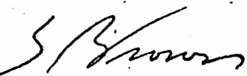
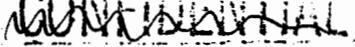

# The original documents are located in Box 6, folder “Intelligence - Decision Book (3)” of the Richard B. Cheney Files at the Gerald R. Ford Presidential Library.

# Copyright Notice

The copyright law of the United States (Title 17, United States Code) governs the making of photocopies or other reproductions of copyrighted material. Gerald Ford donated to the United States of America his copyrights in all of his unpublished writings in National Archives collections. Works prepared by U.S. Government employees as part of their official duties are in the public domain. The copyrights to materials written by other individuals or organizations are presumed to remain with them. If you think any of the information displayed in the PDF is subject to a valid copyright claim, please contact the Gerald R. Ford Presidential Library.

In the context of addressing the problems discussed in Section III, the study group examined a wide variety of Community leadership alternatives, ranging from total centralization of all intelligence resources and programs to elimination of any central intelligence coordinator. Four organizational options were analyzed in depth. These options are intended to present a range of choices and need not be adopted in their entirety. Key elements of these options are:

Identification of the overall leader of the Intelligence Community and definition of his place within the hierarchy of the Executive Branch and the Intelligence Community; Specification of operational responsibilitie s;   
● Specification of analytic and production responsibilities; Specification of resource responsibilities; and   
• Definition of the jurisdictions and organizational inter-relationshif of the major components of the Intelligence Community.

All options would accommodate an intelligence leader who could either continue in his traditional role as adviser to the NSC or himself become a member of the NSC. Full NSC membership, by increasing the intelligence leader's stature, would strengthen his role within the Community. Conferral of Cabinet rank or statutory direct access to the President could serve the same purpose. Retention of the adviser role has the advantage of keeping intelligence separated from policy and precludes over-identification of the Government's chief intelligence officer with specific policy choices.

Of the four options considered, legislation would be required to implement the first three. The fourth could be accomplished through administrative action.

Certain elements are common to all options. First, all options would accommodate an Inspector General under the direction of the Community leader to ensure legality and propriety in the conduct of intelligence activities. The more control the leader of the Community had, the more authority and access his Inspector General would have. .

Second, all options envisage the head of the Intelligence Community as Community spokesman in relations with Congress including the presentation of an overall intelligence budget and provision of substantive intelligence. The extent to which the DCI would speak for the Community is greater under options envisaging increased centralization than in those stressing departmental roles.

Third, all options envisage continuance of departmental intelligence production to support departmental missions and to contribute to national intelligence production.

Finally, all options would relieve the DCI of responsibility for day-today management of CIA and for reviewing tactical intelligence resources.

OPTION #I

OPTION #2

OPTION #3

OPTION #4

CENTRALIZED NATIONALINIELLIGENCE PROGRAM

CENTRALIZED RESOURCE CONTROL

DEP ARTMENT AL EMPHASIS

MODIFIED CURRENT ARRANGEMENTS

# SUMMARY

Leadership of Community

Director of Inteliigence(DI)

Director General for Intelligence (DGI)

Director, Foreign Intelligence (DFI)

Director, Central Intelligence (DcI)

Operational Responsibilities

DI line authority over CIAP，CCP，NRP

DGI no Iine authority

DFI no line authority

DCI delegates CIA Line authority to a 2nd Deputy

Resouroe Responsibilities

DI controls CcP, NRP, CIAP resources

DGI controls CcP, NRP, CIAP resources

DFI review only; Chairman, NRP ExCom

DCI controls CIAP; Chairman NRP & SIGINT ExComs; Reviews other resources

1 Collectfon Responsibilitles

DI controls all CIAP, CCP, NRP elements

DGI establishes requirements & priorities

DFI establishes requirements & priorities

DCI establishes requirements & priorities

#

Production Responsibilities

DI produces ell national intelligence

DGI produces national estimates; tasks other production elements

OPTION #2A: Provides DGI line control over present CIA   
production

DFI produces national estimates; tasks other production elements

OPTION #3A: Transfers CIA production components to departments

DcI produces national estimates; controls CTA production

Committee Structure

Most existing committees can be eliminated

Retain existing or similar committees; Eliminate IRAC

Retain existing or slmilar committees

Retain existing committees; Aad SIGINT ExCom

Legislation Required

Yes

Yes

No

SBCAR

# RATIONALE

This option is based on the premise that the present intelligence system suffers from a division of responsibility and control of resources and operations, and that the best approach to the problem is to centralize every element that reasonably can be centralized -- the CIA Program (CIAP), the Consolidated Cryptologic Program (CCP), and the National Reconnaissance Program (NRP). This option assumes that the gains in centralizing intelligence resources outweigh any disadvantages resulting from transferring some collection agencies from their primary customers. This new agency would serve the Government's intelligence needs much as the Justice Department serves its legal needs.

# SUMMAR Y DESCRIPTION

The major and most costly national intelligence activities, CIAP, NRP and CCP, would be combined into a single agency, headed by a Director of Intelligence. Departmental analysis and production centers would be retained, permitting the presentation of contrasting points of view in national intelligence production.

While this option creates the maximum centralization of intelligence of all the options presented, it does not encompass all intelligence. Thus, departmental intelligence components would remain basically unchanged.

# Leadership of Community

The Director of Intelligence would have line authority over national foreign intelligence activities, including the CCP, NRP and CIAP. This provides the maximum leadership authority of all the options.

# Operational Responsibilities

The Director of Intelligence would be fully responsible for operational and other aspects of national intelligence, including the CIAP, the CCP and the NRP.

# Resource Responsibilities

The new agency would include the budgets of the CCP, NRP and CIAP, which the Director of Intelligence would review and approve. The Director of Intelligence would develop and submit the overall intelligence budget to the President and Congress.

# Collection Responsibilities

All collection elements included within the CIAP, the CCP and the NRP would be contained in the new agency. Their organization would be left to the Director of Intelligence.

# Production Responsibilities

Production of national intelligence (national current intelligence production, national estimates, maintenance of national inteligence data, and specialized inteligence research) would be centralized in the new agency,

# BEOR个

but other departments would continue to produce departmental intelligence. The nucleus for the production component would be centralized in the new agency but other departments would continue to produce departmental int elligence. The nucleus for the production component would be the production elements of what is now the CIA, possibly with augmentation fr om analytical elements of other departments.

# Committee Structure

The Director of Inteligence would have authority to settle disputes without recourse to the present committee structure; however, some form of committee structure would be required for interaction with other departments.

# Effect on Intelligence Product

Centralization of control over national programs under the authority of one individual could result in improvements in overall product quality as collection, processing, and production resources are focused on highest priority problems. However, diversity and competition of views will be submerged to the extent that production is centralized at the expense of the departments.

# Effect on Intelligence Management

Combining resource and management control in one agency could result in the most effective and efficient intelligence management system of all options by eliminating conflicts between responsibility and control.

# SECRET

A short-coming is the possibility of decreased responsiveness to the requirements of Defense which currently generates the preponderance of intelligence requirements. At the outset, realignment and reorganization would be unsettling and would adversely affect efficiency.

The proposal to establish a new intelligence agency would encounter congressional and departmental opposition.

Finally, establishment of such an agency would focus attention on the intelligence budget and might increase demands for more open consideration of it.

# CENTRALIZED RESOURCE CONTROL

# RATIONALE

This option is based on the premise that there is a need for a stronger Community leader, but that Defense, with its military requirements, must retain a strong voice in the management of certain intelligence assets now under its direct control. This option strengthens the leader by giving him resource control over the national intelligence programs -- the CIAP, NRP and CCP -- while leaving Defense's operational control over the NRP and CCP intact. The leader is separated by statute from the CIA, reducing the conflict between his present roles as head of the Intelligence Community and head of the CIA. These changes are intended to strengthen the leader of the Community and relieve him of vested interest in any one segment of the Community.

# SUMMARY DESCRIPTION

The DCI would be separated from CIA and renamed the Director General for Intelligence (DGI). He would have no operational responsibilities but would continue to be the President's chief intelligence adviser. He would have control over the national intelligence budget which includes the CIAP, CCP and NRP. Defense would continue to manage the NRP and CCP; and a newly created Director of CIA would manage the CIAP. The Director of CIA would report to the NSC through the DGI. The Director of CIA would be responsible for day-to-day management of CIA and for management of national inteiligence production, drawing on other agencies, as now.

A variant of this option discussed as Option $\# 2 \mathbf { A }$ below would give the DGI direct management responsibility for intelligence analysis and production.

# PRIMARY CHANGES AND EFFECTS

# Leadership of Community

The DGI would be charged with overall policy direction for the Intelligence Community, without direct line management over any of its operational elements. His leadership authority would rely on resource control and independence from agency ties.

# Operational Responsibilities

The DGI would have a staf similar to the present DCI Staf, i.e., the National Intelligence Officers (NIO's) and the Intelligence Community Staff (IC Staff)， but no operational responsibilities. Operational control of the NRP, CCP and GDIP would be retained in Defense. Operational control of the CIAP would be vested in a Director of CIA.

# Resource Responsibilities

The DGI would control budgets for the three major national intelligence programs. Funds for these programs wouid be appropriated to the DGI for reallocation to program managers. The DGI would develop and submit the overall inteligence budget to the President and Congress.

# Collection Responsibilities

The DGI would provide guidance concerning information requirements, review the adequacy of collection requirements developed by the Community, and make recommendations for necessary improvements. He would use his control over the budgetary process to insure adherence to his policy guidance.

# Production Responsibilities

· The DGI would be directly responsible through his NIO Staff for the production of national intelligence estimates. He would be responsible for providing guidance to the Intelligence Community on needs and priorities and for arranging for the provision of intelligence support to the President, the NSC and Congress.

# Committee Structure

The DGI would require USIB, IRAC, ExComs or similar bodies to insure effective coordination and integration of resource and operational matters. This option presents an opportunity to streamline the committee structure.

# Effect on Intelligence Product

By giving the DGI basic authority over the resource allocation process, he should be able to focus collection systems on high priority production requirements and to evaluate the performance of both collectors and producers in meeting consumer needs. DGI control over resource decisions concerning the CCP and NRP might provide insufficient assurance of adequate resources

# SCRET

to meet the needs of military customers. Defense operational control over the CCP and NRP would be an offsetting factor.

Over the longer term, development of a resource review process in which fundamental trade-offs can be considered, and costs and benefits. can be evaluated, could have a positive effect upon overall product quality. Effect on Intelligence Management

The changes proposed would give one individual, the DGI, effective authority to establish a comprehensive and integrated resource review process for the three major national intelligence programs. This arrangement allows the DGI to establish priorities and effect trade-offs in developing an optimal intelligence program. By leaving operational control over the CCP in Defense, and by maintaining existing NRP arrangements, Defense would continue to exercise significant control over these programs in order to satisfy essential military requirements.

A potential problem with such an arrangement, most particularly in the case of the CCP, is whether a program manager could eficiently carry out his responsibilities while reporting to Defense on operational matters and to the DGI on resource matters. This could also create problems in ensuring that Defense planning was adequately related to resource decisions made by an independent DGI. However, analogous procedures, inciuding the NRP $\mathbf { E x C o m }$ , exist elsewhere in government.

# SOAA

OPTION #2A

This option is identical in all respects to Option #2 except that, under this variant, in order to concentrate his efforts on improving the national intelligence product, the DGI would retain full responsibility for ine management of present CIA production components.

The principal advantage of this variant is that it would give the DGI line control over production resources to carry out the substantive responsibilities given to him under the option. Also, it would disassociate present CIA production elements from operational components of CIA. The principal disadvantage of this variant is that it gives the DGI line management responsibility for a sizeable ·....· production program, thereby reducing his ability to carry out an impartial resource management role as established under the basic option.

OPTION #3

# DEPARTMENTAL EMPHASIS

# RATIONALE

This option is based on the concept that the necessary independence of the DCI within the Intelligence Community is compromised by his ties to the CIA, and that the responsibilities of the Department of Defense require a major voice for the Secretary of Defense in the development and management of intelligence assets. This option attempts to increase the DCI's stature as an independent leader of the Community by divesting him of his management responsibilities over the CIA, while retaining his role in major resource decisions. Resource control would reside in the departments and agencies.

# SUMMARY DESCRIPTION

Under this option, the present DCI would be renamed the Director, Foreign Intelligence (DFI); and the DFI would be organizationally separated from the CIA. The DFI would take the NIO structure and IC Staff from the DCI organization. The CIA would be rechartered under a Director of CIA reporting to the NSC through the DFI. Most present CIA SIGINT functions would be consolidated in the CCP in Defense. The DFI would have the primary responsibility of providing substantive intelligence support to the President and the NSC. The DFI would have a role in Community resource decisions concerning major national intelligence systems through his

# SECRET

authority to establish requirements and priorities and through his chairmanship of the IRAC and the NRP. The DFI would provide independent assessments regarding national intelligence on both substantive and resource matters, and he would task elements of the Community to aid him.

Under a variant, Option $\$ 3.4$ discussed below, CIA production elements would be transferred to other departments; and the DFI would be cast in the role of "coordinator' of departmental intelligence.

PRIMARY CHANGES AND EFFECTS

# Leadership of Community

The DFI would be charged with overall policy direction for the Intelligence Community, without direct line management or resource control over any of its operational elements. His authority would be vested in him thr ough appointment by the President as an independent leader.

# Operational Respon sibilities

The DFI would have a staff similar to the present DCI Staff, i.e., NIO's and the IC Staff, but no operational responsibilities. Control of the NRP, CCP and General Defense Inteligence Programs would be continued under the Secretary of Defense. ExCom arrangements for the NRP would remain essentially unchanged. NSA would remain under Defense (the Secretary of Defense is the Government's executive agent for SIGINT) with

SIGINT activities now conducted by CIA, except those in direct support of agent operations, included in the CCP. Operational control of the CIAP would be vested in a Director of CIA.

# Resource Responsibilities

Development of program budgets would remain as a departmental or agency responsibility. The DFI, in an advisory role, would provide the President with an independent review of the entire intelligence budget as at present. Funds for the CIAP, CCP and NRP would be' appropriated to operatini departments and agencies for reallocation to program managers.

# Collection Responsibilities

The DFI would establish requirements and priorities and provide recommendations regarding the national intelligence program, but would lack resource control. The Director of CIA would supervise all clandestine HUMINT collection activities, except those organic to combat units or in direct support of military activities. Defense would control all SIGINT collection activities except those in close support of CIA agent operations.

# Production Responsibilities

The DFI would have no production organization, but would be responsible for providing guidance to the Intelligence Community on intelligence needs and priorities, arranging for intelligence support to the President, the NSC and Congress, and for reviewing and evaluating the resulting national intelligence products. The DFI, through his NIO's, would coordinate and

arrange with departmental elements for the production of National Intelligence Estimates. The DFI would coordinate the integration of the intelligence production activities.

# Committee Structure

The present committee structure, or some similar structure, with the DFI chairing appropriate committees, would be needed.

# Effects on Intelligence Product

Emphasizing departmental responsibility for production could lead to improved responsiveness to departmental heads. An inherent danger could be the dimunition of an independent capability to produce and critique intelligence assessments.

# Efect on Intelligence Management

This approach effectively removes the present conflicts between the DCI's roles as Community leader and as head of CIA, but it leaves him with neither budget nor operational authority to shape the programs of the Intelligence Community. However, through presentation of annual budget recommendations to the President and his chairmanship of USIB, the IRAC and ExCom or similar committees, the DFI would still have a role in Community resource decisions concerning major national intelligence systems.

# SECR在Y

# OPTION #3A

This option is identical in all respects to Option $\yen 3$ except that, under this variant, present CIA production responsibilities and resources for intelligence analysis would be transferred to the relevant departments. The underlying assumption is that policy-makers would be better served by departmental producers than by a central agency.

The principal advantage of this option is that it would place primary stress on the value of str ong participation in the production process by the relevant departments, thereby better linking producers and consumers of intelligence. The principal disadvantage is that it would eliminate an independent analytical entity separate from policy-makers and thus independent of their operational or policy biases. There is also a question as to whether a DFI with only production coordination responsibilities could usefully serve as the senior intelligence adviser. This coordinator role was contemplated for the DCI with passage of the 1947 Act, but early Agency experience strongly suggests that the coordinator can only function effectively if he has direct access to a production capability which gives him an independent basis for judgment.

SEORET

# MODIFIED CURRENT ARRANGEMENTS

# RATIONALE

Each of the three prior options would require basic changes in the National Security Act of 1947. It is uncertain that such changes can be accomplished without a major controversy within the Executive Branch and without major legislative changes. A series of proposals which can largely be accomplished within existing legislation, or with only minor changes in existing statutes, may have appeal. The three options discussed above, and the variants to them, all solve certain perceived problems but may create others. Finally, it can be argued that Congressional legislative proposals are most likely to focus on the question of control of past abuses and only secondarily on major, largely unrelated, management and organizational changes. Much of what may be needed to reduce the potential for future abuses can be accomplished without considering major organizational change.

# SUMMAR Y DESCRIPTION

Changes addressed in this option involve the establishment of a second full Deputy for the DCI. This would allow the use of one Deputy for line management of the CIA and a second Deputy to carry out the present Intelligence Community responsibilities assigned under the President's November 1971 letter. Changes could also be made to the existing committee

structures regarding resources and to delegations of responsibility for production without changing the basic organization of the Community.

PRIMAR Y CHANGES AND EFFECTS

Leadership of the Community

Present arrangements for policy direction of the NRP, including the Executive Committe $\mathbf { E x C o m } .$ ) chaired by the DCI with Defense participation, have. helped assure that these programs meet the needs of all major producers The CCP and the CIA collection program, however, serve national as well as departmental interests. with increased dependence on technical collection, a similar ExCom arrangement could be established for the CCP to ensure that views of other producers are taken fully into account in tasking and processing. Consideration could aiso be given to an ExCom review of CIA collection programs. Since principals will remain essentially the same for consideration of NRP and CCP matters, consideration might also be given to consolidating the two review functions within one $\mathbf { \nabla \cdot E x C o m }$ , perhaps with an expanded membership to reflect consumer, as well as producer interests.

# Operational Responsibilities

The DCI would continue to be legally responsible for the operation of CIA. However, a second Deputy with responsibility for CIA management would absorb substantial responsibilities in this area.

# Resource Responsibilities

No basic change from present practice would occur, except that establishment of an ExCom chaired by the DCI and charged with the responsibility of policy overview and resource review of the CCP and CIA SIGINT activities could enhance the DCI's ability to influence the overall direction of these major programs.

# Collection Responsibilities

No change would occur. Production Responsibilities No change would occur.

# Committee Structure

Adjustments in the responsibilities of committees might be necessary in recognition of an enlarged ExCom.

# Effect on Intelligence Product

This option would largely continue present arrangements. The DCI woul retain unimpaired his Community-wide responsibility for production of nationa estimates, current intelligence, and crisis warning, and for evaluating the Community's performance. Existing independent and competing production capabilities in Defense, CIA, State and Treasury could be retained or augmented. Structural changes at the leadership level in CIA should free the DCI to devote more of his attention to production issues.

# Effect on Intelligence Management

As discussed under the summary description above, this option would clarify management arrangements within CIA and moderately enhance the DCI's ability to carry out his Community management-and resource review responsibilities. This option would not, however, give the DCI new basic authority to deal with these responsibilities.

# Covert Action Location

One last organizational issue cuts across all four options: the placement of a covert action capability. Covert action was originally placed within the CIA to accompany its clandestine collection capabilities. Transfer to the State Department would endanger the primary activities of this overt service and be contrary to international diplomatic practices. Transfer to the Defense Department would raise public apprehension over accountability given the size and scope of the Department's activities.. A number of observers have, however, strongly promoted placing the covert action capability in an entirely separate agency directly under the control of the NSC. They have argued:

If the covert action capability were isolated in a small agency, oversight would be easier; fewer resources and personnel would need to be kept under close supervision.   
The independent analytic capabilities of the CIA are biased because covert actions make it an operational agency. Covert actions create a departmental interest in the CIA which is contrary to its basic national functions.   
The CIA imight be better able to attract analysts and scientists if it shed its "dirty-tricks" image which is closely connected to its covert action capability.

On the other hand, a number of strong arguments exist for retaining the covert action capability in the CIA:

Separation, rather than improving possibilities for effective oversight, would create greater oversight problems by isolating this activity from conflicting agency demands and from agency supervision.   
During the brief period in the early l950's when clandestine collection and covert actions were in separate ofices, the two offices were in conflict for resources and attention, inevitable redundancy existed, and units worked at cross-purposes. That experience demonstrated the close connection in terms of contacts, methods, goals and support that is desirable between the two activities. For example, the covert action agent is often also an intelligence source, and clandestine tradecraft required to run a covert action agent is essentially the same as that for an intelligence agent.

The need for cover, already a difficult problem, would be further aggravated by the requirement to increase the number of officials requiring cover status.

Merely shifting around within the Government of the covert action capability will neither assuage public fears nor reduce attacks on the CIA. Outsiders will never believe that "dirty trick:

# BECREE

have been taken out of the CIA, and indeed, their perceptions may be somewhat accurate as the new organization would inevitably have to work closely with CIA clandestine activities.

# VI. MANAGEMENT IMPROVEMENTS

Although organizational reforms can help solve many of the identified problems of the Intelligence Community, sustained management attention will also be required to resolve these problems. The study group identified some possibilities for management improvements in areas of particular significance which should contribute both to a prevention of abuses and to a better intelligence product.

# A. Budgetary and Financial Controls

Financial and budgetary procedures provide an effective discipline in government operations for the President, the Congress and the agencies. The lack of public perception of the budget and financial controls over intelligence activities contributes to public and Congressional opinion that no system of checks and balances exists on the intelligence agencies within the Executive Branch or, for that matter, within the Congress.

In the present situation, while fiscal information on the intelligence agencies is contained in the President's budget, it is not openly identified. Centralized control over the financial execution of intelligence budgets is not exercised. Two options by which the budget process could be strengthened are • Provision by the President to Congress of a separate classified budget appendix that contained information similar to that provided for all other government activities; it would be prepared at the appropriate security level and would require special handling

#

within the Congress. This option has the advantage of a formal Executive Branch initiative (within acceptable security bounds) to the Congressional request for more information. The primary arguments against this pr oposal involve the precedent setting nature of a formal budget submission for intelligence and the inevitable congressional demand for more detailed information.

Implementation of controls by OMB·on the apportionment, reprogramming, transfer and outlay of intelligence funds, similar to those for other agencies. Initiation of these controls would increase OMB's involvement in the execution phase of the intelligence budget which is currently limited to the CIA reserves. Congressional reports have already identified the need for imposition of reprogramming controls on intelligence programs.

Arguing against this proposal is the appropriateness of relying on budget control for effective direction of an organization rather than establishing objectives and evaluating achievements against them. Also, imposition of reprogramming controls could adversely limit the flexibility to respond to crisis situations.

These proposals for providing budgetary information to the Congress and enhancing the visibility of Presidential budgetary control may not be particularly effective in identifying abuses, but they would enhance public and congressional confidence that the Intelligence Community is subject to the same set of checks and balances as all other agencies.

B. Compartmentation

Present arrangements for compartmenting sensitive information have impeded the flow of information to consumers. The NsC should assure itself that current Community studies of decompartmentation be intensified with an eye to improving consumer access to the intelligence product.

C. Consumer Interaction with the Intelligence Community

A number of improvements are required in the interactions of policy officials with the Intelligence Community:

The NSC should undertake a more active program to improve consumer interactions with the Intelligence Community. Surveys should be undertaken to identify the strengths and deficiencies that consumers find in intelligence support (fr om the NIE's, for example) and to determine what actions the policy consumers and inteligence producers should take to ensure more useful intelligence contributions to the decision-makers.

The NSC should specifically address problems identified in this report including the need for: guidance and feedback from decisionmakers to the Intelligence Community; a better intelligence appreciation of those policy and negotiating issues which might benefit fr om intelligence inputs; and arrangements within

#

the economic policy-making organizations required to promote a more effective interchange with the Intelligence Community. The NSC Intelligence Committee should also address the special problem of the need for better dissemination of sensitive memoranda, reports and telegraphic trafic to officials with a need to know.

# D. Performance Evaluation System

Measures are needed, particularly in certain high cost areas, which will permit a comparison of the value of certain intelligence contributions with their anticipated cost. The purpose of such measures is to ensure that intelligence collection and production are focused in a way which will achieve more effective expenditures in terms of consumer needs. These measures would be an important criterion in evaluating intelligence performan The DCI should intensify efforts, including consultations with consumers, to strengthen arrangements for evaluating Community performance.

# E. Cover and Clandestine Collection

The NsC could be tasked to conduct an interagency study addressing both the effectiveness of present cover arrangements and the adequacy of coordination of clandestine collection.

SECRET

1. Guidelines on Propriety

2. Executive Branch Oversight a. Within the Intel Community • Strengthen Agency IG Community-wide IG

b. Outside the Intel..Community Attorney General Staff Special Counsel to President Government-wide IG

C. Outside Government Advisers • Expand PFIAB Establish New Group

3. Intelligence Policy Coordination

Expanded Use of NSc Structure Intelligence Adviser to President Improved DcI/Agency Coordination

4. The 40 Committee

Reinstitute Formal Committee Mtgs Attorney General Membership Additional Staff

# COVERT ACTION

Remain in CIA Separate Agency

# MAIAGEENT IIPROVENENTS

Budgetary and Fiscal Controls

Classified Budget DCI/OMB Budget Execution Controls #state has decided not to comment at this time.

<table><tr><td>DEFENSE</td><td>JCS</td><td>DCI</td><td>STATE*</td><td>TREASURY</td><td>JUSTICE</td></tr><tr><td>Yes</td><td>Yes.</td><td>Yes</td><td></td><td>Yes</td><td>Yes</td></tr><tr><td>Yes</td><td>Yes</td><td>No</td><td></td><td>Yes</td><td>Yes</td></tr><tr><td>Yes -</td><td>Yes —</td><td>Yes-NSC ——</td><td></td><td>Yes</td><td>$1$ No</td></tr><tr><td>No No</td><td>Yes -</td><td></td><td></td><td>— Yes </td><td></td></tr><tr><td>Yes -</td><td>Yes. </td><td>Yes -</td><td>二</td><td>Yes </td><td>二</td></tr><tr><td>Yes optional -</td><td>Yes</td><td>Yes </td><td></td><td>Yes optional Yes</td><td>Yes —</td></tr><tr><td>Yes --</td><td>Yes </td><td>Yes -</td><td></td><td>Yes </td><td></td></tr><tr><td></td><td></td><td></td><td></td><td></td><td></td></tr><tr><td>No_</td><td>No</td><td>No</td><td></td><td>Yes</td><td></td></tr><tr><td></td><td></td><td></td><td></td><td></td><td></td></tr><tr><td></td><td></td><td></td><td></td><td></td><td></td></tr><tr><td></td><td></td><td></td><td></td><td></td><td></td></tr><tr><td></td><td></td><td></td><td></td><td></td><td></td></tr><tr><td></td><td></td><td></td><td></td><td></td><td></td></tr><tr><td></td><td></td><td></td><td></td><td></td><td></td></tr><tr><td></td><td></td><td></td><td></td><td></td><td></td></tr><tr><td></td><td></td><td></td><td></td><td></td><td></td></tr><tr><td></td><td></td><td></td><td></td><td></td><td></td></tr><tr><td></td><td></td><td></td><td></td><td></td><td></td></tr><tr><td></td><td></td><td></td><td></td><td></td><td></td></tr><tr><td></td><td></td><td></td><td></td><td></td><td></td></tr><tr><td></td><td></td><td></td><td></td><td></td><td></td></tr><tr><td></td><td></td><td></td><td></td><td></td><td></td></tr><tr><td></td><td></td><td></td><td></td><td></td><td></td></tr><tr><td></td><td></td><td></td><td></td><td></td><td></td></tr><tr><td></td><td></td><td></td><td></td><td></td><td></td></tr><tr><td>No</td><td></td><td></td><td></td><td></td><td></td></tr><tr><td></td><td>N</td><td>N$</td><td></td><td></td><td></td></tr><tr><td></td><td></td><td></td><td></td><td></td><td></td></tr><tr><td></td><td></td><td></td><td></td><td></td><td></td></tr><tr><td></td><td></td><td></td><td></td><td></td><td></td></tr><tr><td></td><td></td><td></td><td></td><td></td><td></td></tr><tr><td></td><td></td><td></td><td></td><td>NO</td><td></td></tr><tr><td></td><td></td><td></td><td></td><td></td><td></td></tr><tr><td></td><td></td><td></td><td></td><td></td><td></td></tr><tr><td></td><td></td><td></td><td></td><td></td><td></td></tr><tr><td></td><td></td><td></td><td></td><td></td><td></td></tr><tr><td></td><td></td><td></td><td></td><td></td><td></td></tr><tr><td></td><td></td><td></td><td></td><td></td><td></td></tr><tr><td></td><td></td><td></td><td></td><td></td><td></td></tr><tr><td></td><td></td><td></td><td></td><td></td><td></td></tr><tr><td></td><td></td><td></td><td></td><td></td><td></td></tr><tr><td></td><td></td><td></td><td></td><td></td><td></td></tr><tr><td></td><td></td><td></td><td></td><td></td><td></td></tr></table>

SUMMARY OF AGENCI COMMENDATIONS ON THE ORGANIZATION AND MANAGEMENT OF THE FOREIGN INTELLIGENCE COMMUNITY

ption #l - Centralized ational Intel Program .----------- ption #2 - Centralized esource Control

#2A - Separate Production Center Under DGI

(DcI prefers Option H4, but ir major organization is required, then Option #2 i8 preferred)

(Treasury, prefers Option #4, but also sees advantages in Option #2A)

ption #3 - Departmental mphasis

#3A - Transfer CIA Production to Departments

Option #3 plus   
• Deputy DFI a military officer All overhead programs under DoD, eliminate ExCom Transfer CIA production to the DFI   
Optlon #3 plus   
• Deputy DFI a military ofricer DFI fixed term of office DoD controls al1 scientific .and technical collection Byatems

ption H4 - Modiried urrent Arrangements

Option H4, including   
● 2nd Deputy Director Consolidate all existing committees into two: --NSc Exec Committee for Intel, chaired by Dci --National Intel. Board for production estimates

Option H4, including 2nd Deputy Director ● SIGINT ExCom Additional resource control for DcI

tate and Justice have decided not to comment on the leadership options.   
S believe the Intelligence Community reorganization should be addressed by the Nsc prior to decision.

<table><tr><td rowspan=1 colspan=4>NATIONAL ARCHIVES AND RECORDS SERVICEWITHDRAWAL SHEET (PRESIDENTIAL LIBRARIES)</td></tr><tr><td rowspan=1 colspan=1></td><td rowspan=1 colspan=1>CORRESPONDENTS OR TITLE</td><td rowspan=1 colspan=1>DATE</td><td rowspan=1 colspan=1>RESTRICTI</td></tr><tr><td></td><td></td><td rowspan=1 colspan=1>12/22/752118/75</td><td rowspan=2 colspan=1>AAA</td></tr><tr><td></td><td></td><td rowspan=1 colspan=1>1218175</td></tr><tr><td rowspan=1 colspan=4>Cheney FilesGeneral Subject FileIntelligence Community Decision Paper (i)-(4)          B035</td></tr><tr><td rowspan=1 colspan=4>CODES</td></tr></table>

MEMORANDUM FOR THE SECRETARY OF. DEFENSE

Subject: Organization and Management of the Foreign Intelligence Community (u)

1. (s) The Joint Chiefs of staff have reviewed the report on "organization and Management of the Foreign Intelligence Community" and have considered the options for reorganization contained in the report. In selecting'a preferred option, it was believed that any solution to the problems presented in the report must consider that:

a. Intelligence support to Us operating forces should not be degraded through organizational or management changes. b: while Us operating forces may receive important intelligence support from "national systems," they reguire a directly responsive: organic intelligence capability in order to meet full inteiligence needs.   
c. Improved oversight, within the executive branch, of certain intelligence activities is needed.   
d. Multiple, independent, analytical capabilities should be retained.   
e. cost effectiveness in peacetime must not be achieved at the expense of responsiveness in wartime.

2. (u) The Joint chiefs of staff have no fundamental criticism of the collection, analysis, and production performance of the foreign intelligence community. whiie improved production and performance must be primary goals in any intelligence restructuring, they are not in themselves sufficient justification for reorganization.

Classified by Director, J-5 SUBJECT TO GENERAL DECLASSIFICATION SCHEDULE OF EXECUTIVE ORDER L1652 AUTONATICALLY DOWNGRADED AT TWO YEAR INTERVALS DECLASSIFIED ON DECEMBER 31, 1983

#

3. (u) Any reorganization will·entail turbulence and uncertaintie thus, the full implications of change nust be clearly understood prior to implementation. The case for organizationai change rests primarily on the need for an improved ability to prevent the improper use of intelligence assets and, secondarily, on the need for fiscal savings by the elimination of unnecessary duplication. However, in determining the necessary realignment, it shouid be emphasized that military reconnaissance and intelligence forces are structured to support combat capability and cannot be judged solely on their contribution to the peacetime national inteiligence.effort. In this regard, it is essential that armed forces possess those intelligence resources which support their operational forces.

4. (u) The Joint Chiefs of staff concur.in the need for improved management control in the areas identified in section vI; however, that section has insufficient data for determining the specific option desired.

5. (s) In reviewing the proposed alternatives, the Joint Chiefs of staff are concerned over' the emphasis on resource control as the primary means for management control. While the threat of withholding funds is an effective means of conveying general lirection, it is not a conceptuaily sound or efficient means of directing an organization on a daiiy basis. It creates an adversary relationship between layers of leadership rather than the more desirable, effective attitude of cooperation that stems from a management by objective and evaluation process.

6. (u) The Joint Chiefs of staff consider that Options I and 2 and variants 2A and 3A could adversely impact on the intelligence support to the Armed Forces. At the same time, they consider that option 4 fails to address adequately the problems noted in the report. Detailed discussion of these options is contained in Appendix B.

7. (u) In viev of the considerations cited above, the Joint Chief: of Staff have concluded that Option 3, with modifications as specified in Appendix A, is the most viable option presented in the study. It creates proper safeguards to preclude abuses and provides the basis for improving the management of national intelligence assets, while proviaing for retention within the. Department of Defense of those inteiligence assets which are essential for military planning and operations.

#

3. (s) with regard to covert actions, the Joint chiefs of Staff favor retention of that responsibility in the restructured CIA--based on its close affinity to ciandestine collection and rcsponsibilitics for political intelliqence.

9. (U) On l4 December 1975, Mr. Donald Ogilvie, Associate Director of OmB and Chairman of the Senior Steering Group directing the study, forwarded a letter requesting agency positions on an attached matrix. Appendix C contains responses to the options contained in that matrix.

10. (U) In conciusion, given the ramifications on the security of the United States,-the Joint Chiefs of Staff believe the reorganization of the intelligence community should be addressed by the National Security Council prior to decision.

ll. (u) The Joint chiefs of Staff request that you take into account, in your response, the views of the Joint Chiefs of staff and insure that their views are.appropriately forwarded to the President.

·For the Joint Chiefs of Staff:

GEORGE S. BROWN Chairman. Joint Chiefs of Staff

# Attachments

# APPENDIX A

# OPTION 3

# study Provisions from Option 3

- Director, Foreign Intelligence - Principal intelligence adviscr to President and Nsc - Organizationally separated from cIA - Relieved of rcsponsibility for reviewing tactical intelligence

- Chairman of USIB, IRAC, and NRP ExcoM - Provide assessments on national intelligence both substantive and resource matters

- NIo and intclligence community staffs.nove with DFI   
- No operational or production responsibilities   
- Review entire intelligence community budget   
- Provide executive oversight through enhanced .Inspector General responsibilities   
- Responsible for NIEs   
- Integrate intelligence production activities   
- cIA would be rechartered under a Director (D/ciA) - Would report to Nsc through DFI   
- Most CIA SIGINT functions consolidated in CcP in DoD   
- Each department engage in intelligence production consistent with its mission.

Additional Jcs proposais for Option #3

- Designate a senior military cfficer as Deputy Director Foreign Intelligence.   
- DFI appointed by President and'confirmed by senate for fixed term of office.   
- Defense responsible for development and operation of all scientific and technical intelligence collection system.   
- NIos perform as DFI adviser/liaison to the UsiB in the preparation of national estimates and other national level estimates requested by Nsc and other agencies.

# APPENDIX B

JCS ANALYSIS OF THE PROPOSED STUDY GROUP OPTIONS OPrroN l: Centralized National Intelligence Program This alternative is considered the least practical solution. The creation of a Secretary of Intelligence is an expensive overreaction to the community's alleged improper activities and would tend to isolate the intelligence producers and consumers. Furthermore, it would inappropriately place intelligence at the same levcl as the senior national policy decision makers. Such an arrangenent would complicate the national intelligence effort, the national departmental interface, and provision of responsive national intelligence support to the operating forces. Additionally. such centralization of authority'could heighten rather than diminish congressional concern. creation of a new department · I4 with its attendant expenditures would ikely result in strong congressional and public opposition.

OPrioN 2: Centralized Resource Control

This option is undesirable from the Jcs viewpoint because it is contrary to efficient and effective management. separating resource from line control causes conflict and leadership ambiguity'which would seriously detract from Us national intelligence effort. It is inappropriate to rely solely on budget control for effective direction of intelligence activities. It is a check, but daily routine guidance and direction should. atem fxom establishing goals and evaluating the achicvement of same and not from the inefficient approach of periodically loosening or tightening the purse strings.

OPTION 3A: Deletion of CIA Production

This variation of option 3 should be withdrawn from further consideration. The Joint chiefs of staff support the retention of ciA as a separate organization disassociated with the present DCI responsibilities. Classified by..Director. .J=5.

SUBJECT TO CENERAL DECLASSIFICATION SCHEDULE OF FCCUTIVE ORDER 11652 AUTOATKIIY COWICRIDED AT TWO YELR INTERVLS GECLASSI:?1DECEMFER311983

#

OprToN 4: Modified Status Quo

rhis option is not supported because the prcposal does not respond to congressional desire for a strengthened executive cognizance of the intelligence community. It is also dcficient in that it continues the DcI as Director, CIA, with linc authority over one of the elements of the foreign intelligence community.

# APPENDIX C

# . COMMENTS ON LETTER FROM THE ASSOCIATE DIRECTOR OF ONB AND THE CHAIRLAN OF THE SENIOR STEERING GROUP

1. (s) on 14 December 1975, Mr. Donald Ogilvie, Associate Director, OMB, and chairman of the Senior Steering Group that dlrected the study on the Organization and Management of the Foreign Intelligence Community, requested agency recommendations on a number of specific issues addressed in that study. Detailed answers to Mr._Ogilvie's letter are contained below.

. (s) The Joint chiefs of Staff recomnend that: a. An executive order providing for guidelines for intelligence agencies be approved and promulgated. b. A community-wide Inspector General under the DFI (as defined in Option #3) be established. C. The Attorney General ba assigned a staff within the Department of Justice to advise the President on the legal aspects of intelligence activities. d. The PFIAB charter be expanded to give it an oversight function but members not be approved by Congress as some have   
. recently suggested. e. Intelligence policy coordination be strengthened by an expanded use of the Nsc structure. £. control of 40 Committee activities could be improved by reinstituting formal committee meetings on all.significant ： covert and sensitive recommendations and periodic review of ongoing activities as recomnended by the Murphy Commission. Questions on monberghip of the 40 Committee and staff   
reguiremonts are more properly addressed by the President. g. option f3, as modified by comments in the basic memorandum, be considered'the only viable option developed. Specific reasons for rejection of Options l, 2, 2A, 3A, and 4 are also presented.   
h. Covert action remain within the cIA under any circumstances, including any of the four options developed in the study.   
1. No decision be made on the two options presented to change the budget process since the Intelligence Organization Group did not consider all possible options. Furthermore, neither of the two options proposed is considered sufficiently   
promising nor adequately developed to warrant serious consideration without detailed study in the context of an effort devoted to a review of the financial and budgetary aspects of management of the foreign intelligence community. rhis study addressed the subject in only an indirect and incomplete manner. However, the provision of a classified intelligence budget has some merit.

# CENTRAL INTELLIGENcE AGENCY

WASHINGTON,D.C. 20505

The Honorable James T. Lynn   
Director, Office of Management and Budget   
old Executive Office Buiiding   
Washington, D.C. 20503

Dear Jim:

The following are my comments on the report prepared by Don Ogilvie and his colleagues. Each of us wiii have his own personal views and his own problems with the paper. in stating my own, I do not want to detract from the effort and expertise that went into it, especially against the deadlines imposed. what follows, however, must necessarily emphasize the problems rather than the strengths.

In responding to the outline that accompanied the report, I discuss the full range of topics covered by. the Study Group (Attachment B). Here I wish to concentrate on organization and management, the most difficult and ultimately the most important of the issues we face.

I believe the future structure for American intelligence should rest on the following principles:

--The Dci shouid have full, .easy, and regular access to the President and National security Councii, but should not act as a partisan political supporter of the Administration. Two way communication between the DcI and the President is essential.

DECLASSIFIED · E.O. 12958 SeC. 3.8 With PORTIONS EXEMPTED E.O. 12958 Sec. 1.5(c) 3.4()(1)   
MR94-31;C1AL1194   
By_LtNARA,. Date_3)2000   
Cioid by 05827   
Exemp re   
of EO.  n (ee   
3 uness imele, n c d or

--He should be able to provide the President and the Nsc and, to the extent feasible, the Congress with assessments of foreign events based on analysis under his control and independent of the major government departments.

--The system that supports him should be shaped to provide the best possible intelligence; resource allocations, procedures, and organization should be driven by the. substantive goals set by national needs for intelligence.

--The DcI should have an established relationship with the Secretaries of state and Defense that enables them to work efficiently together.

--The Department of Defense should be assured that the intelligence capabilities it needs in wartime wiil be avilable.

--That portion of the Defense budget allotted to national intelligence resources should be clearly identified and segregated from the Defense budget proper.

--In assessing foreign events competition in analysis should be encouraged. In collection, duplication should be avoided except where it greatly increases the chances of acquiring vital intelligence.

--The Intelligence Community should be managed with due regard for resource constraints. (This point is put last for a reason. Too many studies of intelligence approach it with a total focus on economy. Economy is necessary, indeed it is incumbent on ali intelligence managers to make hard choices to that end, but it should not be an end in itself. The primary purpose must be to produce good inteiligence).

Effective management of an intelligence organization built on these principles will depend to a considerable extent on the way it structures the relationship between the DcI and the Secretary of Defense. My basic difficulty with the Study Group's report is that it deals with a number of separate aspects of this problem, but does not pull them together so as to focus attention

# WNAL

on a matter of such $\cdot ^ { * }$ fundamental importance. In simplest terms, the Dci is supposedly responsibie for "planning and reviewing all intelligence activities and the allocation of ali intelligence resources." of the total intelligence budqet, however, the Secretary of Defense controls ·... .... and the DcI.... On the other hand, the CIAP, NRP, and ccP make up the bulk of the national intelligence budget, yet they are equal to less than of the Defense budget. These two statistics mean that:

--Defense has a preponderant voice in how intelligence money is spent. --When faced with a choice between primary and secondary goals, warfighting capabiiities or inteiligence capabilities, Defense will tend to choose warfighting. --Intelligence money is so small a part of the total Defense picture that it cannot get the attention I think it deserves.

Together these facts mean that, under present arrangements, unless a DcI and a Secretary of Defense see things the same way, the former is not going to be able to do his job.

There are several other topics which must be addressed in any study of Inteliigence Community management that seem to me not fuily treated in this report.

a. I have noted the importance to the DcI of an independent analytic capability. This is crucial to an understanding of the Dci's role. without it, no matter what the DcI's paper independence, he is the prisoner of departmental analysis. with it, he can challenge longstanding departmental positions and stimulate new attacks on stubborn problems.

b. The paper gives insufficient emphasis to the importance of an authoritative and informed focus in the Executive for preparing the intelligence program and defending the budget before

Congress.  Congress is moving aggressively toward assuming what are essentially management functions over intelligence programs. This trend can only be reversed if the congressional members of the oversight committees develop confidence in the Executive both with respect to the intelligence . program and the execution of its budget.

c. The document does not discuss the importance of maintaining an independent and innovative capability for deveioping technology and applying this technology to technical collection programs.

Against this background, my reaction to the options developed by the Study Group paper is that they get ahead of the problem by being too specific on compiicated issues. The fact is we are not yet ready to ask the President to make a definitive choice on a future intelligence structure. There is no "one" solution to the problems that face us, and every change in one function has repercussions in others that may be impossible to foresee. The Study Group's options will be extremely useful in illustrating for the President the range of choice, but should not be used as a basis for decision: In my view, we shouid use them to seek from the President a general indication of the direction in which he wants to move. On that basis we can then set in motion detailed studies of the consequences that will ensue from a given choice, and can present for him in some detaii the choices he has in reaching that goal.

My comments on the Options themselves are derived by testing them against the principles stated above. By that standard:

--Option l, which centralizes control of national systems under a DcI, cannot meet Defense's iegitimate requirements.

--Option 3 effectively destroys the Dcr's present limited authority, and thereby makes it impossible for him to be an effective advocate of independent intelligence positions at the Nsc level.

--Options 2 and 4 would appear compatible with the principles stated. Option 2 in its. present form has serious workability probiems but goes as far as I think we can go in strengthening the DcI relative to Defense. Option 4 does not have these problems but, as it stands, leaves the basic problems of management and resource allocation about where they are now.

The first question that the President must decide is whether major change in intelligence organization is a goal to be sought this year. Congress appears to be moving in this direction, but I doubt that the disruption of our effort that would resuit from major reorganization would be repaid by the results. I would propose instead to take the initiative by moving to achieve better management of the Community in a way that will not require lengthy Congressional debate. Option 4 provides a basis for such a move, but I believe it is somewhat too weak for the purpose. For this reason I suggest a stronger modification.

This proposal, Attachment A, aiffers from Option 4 more in intent than in substance. It is specifically aimed at reaching the kind of DcI-SecDef relationship that I believe essential, but without the traumatic change in bureaucratic equities required by Option 2. (on the other hand, it gives no additional muscle to the Dci). It provides a central mechanism for managing the Community, and it makes a clearer distinction between resource issues, where the Dci is at best first among equals, and substantive issues, where he is and shouid be a great deal more. I think it offers promise for real progress with a minimum of disruption.

While it is true, as the Study Group emphasizes, that Option 4 (or the attached modification) could be carried out by administrative rather than legislative action, I believe that strong confirmatory legislation will eventually be required if the recommended changes are to endure.' The authorities and responsibilities of our complex Intelligence Community should not be left to bureaucratic conflict and changes in Administration. Executive action could start us on our way to the changes we think essential, but the ambiguities. of the existent statutes must be corrected if there is to be any degree of stability in the new organizational arrangements, and if the Congress is to stand behind them.

# 66NENNA

All of the above is predicated on a decision by the President to avoid major change this year. If, however, the President feels that a major reorganization is required, then I believe we should iook to some form of Option 2. I believe it provides a tentative basis for planning a proposal, primarily because it seeks a solution to the central DcI-SecDef problem. Should the President go that route I would recommend that he give the departments and agencies time to consider the detailed consequences of the Option 2 approach before finally committing himself to it.

sincerely, WEcoiby XDikector

Attachments: Attachment A Attachment B

# Option 4, Modified - "Coilective Management"

# RATIONALE

This Option starts from the premise that stronger management of the Intelligence Community is highly desirable, but that the balance of interests refiected in the present structure is a realistic one and should be maintained. It presents a concept for achieving a degree of collective management whiie preserving present organizational reiationships. It requires a minimum of legislative change.

# SUMMARY DESCRIPTION

The DcI would continue to be advisor to the President, coordinator of the Community, and Director of cIA. The present structure of Committees and Boards would be consolidated into two, both chaired by the DcI: an Executive Committee of the Nsc for Intelligence at the deputy secretary level, responsible for ail Community management and policy matters, and a National Intelligence Board at the present UsIB Principals level, responsibie for substantive production. To enable the DcI to give more attention to his Community responsibilities he would be provided with a second deputy.

PRIMARY CHANGES AND EFFECTS

# The DcI's Responsibilities

The DcI wouid be the President's chief intelligence advisor, and would remain Director of cIA. with a view to raising the' stature of the job, consideration shouid be given to granting him Cabinet rank. He would be responsible, under the Nsc, for the coordination of national intelligence policy and for the production of national inteiligence. A clear distinction would be made, however, between his Community and CIA roles.

To this end, he would be provided with an additional Deputy, appointed by the President and confirmed by Congress. The present Deputy would be specifically responsible for managing the Agency under the Dci; the other Deputy would be responsible under the DcI for coordination of the Community. The DcI would have an Agency office at Langley and a Community office downtown, where his Community Deputy would be located.

# Coordination of National Intelligence

The present structure of boards and committees would be rationalized, on the basic principle that policy and resource matters requiring a balancing of departmental interests woula be considered collectively by the senior officers controlling the assets and resources concerned. A separate forum would be provided for substantive intelligence issues, on the grounds that these are inappropriate for poiicy officers to adjudicate and that departmental interests are protected by the right of dissent.

# Policy and Resources

For the first of these purposes the Dci would chair an Nsc Executive Committee for Intelligence, with Deputy Secretaries of State and' Defense as members. The committee would have under control of its members all important intelligence assets, and would act as a board of directors for national intelligence. ExcoM(I) would absorb the functions of NscIC, ExcoM (NRo plus equivalent responsibilities for NsA), IRAC, and UsIB (except national. intelligence production).

#

The DcI's Community Deputy would be his alternate in Excom(I) but would not serve as Chairman in his absence. The IC Staff would be the secretariat of ExcoM(I). The DcI would carry out his existing responsibilities for the NFIP (less its tactical and departmental components) with the assistance of the Committee. Excom(I) wouid have approval authority for the NFIP (CIAP, NRP, CcP, and some elements of the GDIP) and its decisions wouid be binding. The DcI would have administrative and resource authority only over CIA. Present administrative arrangements for the NRP and ccP would be preserved.

# Production of National Intelligence

UsIB woula be reconstituted as a National Intelligence Board, limited by charter to substantive matters, and advisory to the Dci. The NIo's would act as the Dci's staff for the NIB. The Board would be chaired by the DcI, with his Agency Deputy as CIA member. The Iatter would serve as Chairman in his absence.

# Covert Action

The Dci would be a member of the 40 Committee, but not its Chairman, with his Agency Deputy as alternate. Clandestine collection and covert action would remain assigned to CIA, without change in present arrangements.

# Oversight

.. without administrative authority over the Community. it would be inappropriate for the Dci to have an IG responsibility except over CIA. This Option assumes Executive oversight at the NsC or White House level.

# Congress

The DcI would continue to be the Community spokesmar to Congress.

# National/Tactical Problems

Excom(I) would handle matters relating to the relationship between tactical and national intelligence. The DcI wouid have no responsibility for the tactical intelligence budgets of the military services.

# A. "Abuses"

# 1. Guidelines on Propriety

An Executive Order which promulgates a code of standards for the conduct of intelligence activities, as proposed, could serve constructive purposes, both internaiiy and publicly.

# 2. Executive Branch Oversight

a. I have already taken steps to strengthen the CIA Inspector-General, in accordance with the Rockefeller Commission recommendations. As to a Community-wide IG, this should depend on the degree of authority vested in the DcI. Under Option l he could exercise this responsibility. Under Option 2, 3, and 4 he clearly could not.

b. I believe that the current efrorts of. the Congress and the changed attitudes of the Executive will provide more than enough oversight over the Community. The problem of the future may be to protect the Community from being so over-overseen as to be hamstrung. If, however, the President feels that an additionai body is needed, then I would only urge that this be made a responsibility of the National Security Council Inteliigence Committee or of the PFIAB. My preferred course is Option 4 Modified, which would change markedly the character of NscIc. Moreover, the missions of preventing abuses and improving product do not mix well. As to PFIAB, I have the same problem of mixing imcompatible functions. Despite the findings of the Rockefeller and Murphy Commissions it is doubtful that a part-time Board, even with a greatly expanded permanent staff, couid effectively engage this problem.

#

# 3. Intelligence Policy Coordination

Intelligence policy coordination should follow the same lines as Executive oversight, in view of the Nsc's statutory duty of integrating domestic, foreign, and military policies relating to national security. This suggests that whatever new coordination arrangements are necessary should be made through the Nsc structure, expanding it when and if needed.' A second Intelligence Advisor to the President for this purpose does not appear politic or advisable. On the other hand, the Dci shouid not be involved in matters concerning domestic affairs. It is unfortunate that the Study Group's charter did not extend to counterintelligence, because it is here that the problem of intelligence policy coordination is thorniest.

# 4. The 40 Committee

I believe the 40 Committee shoula be continued and strengthened to provide policy approval for covert action.

# B. Intelligence Community Leadership

My position on these matters is contained in my basic letter and the Modified Option 4 appended thereto. The only other comment I have is that I strongly support the study Group's recommendation that the DcI be relieved of the responsibility for the tactical intelligence budget assigned to him by the Presidential Letter of 197i. This is an unworkabie arrangement. I believe the DcI should be responsible for ensuring the integration of tactical and national systems\* but that the armed services should propose, defend, and execute their own budgets for their own tactical intelligence requirements.

# C. Covert Action

I believe it essential that responsibility for covert. action remain in CiA and remain an integral function of CIA's Clandestine Service. For the reasons stated in the study Group report, separation of clandestine collection and covert action is a recipe for operational disaster.

# D. Management Improvements

# 1. Budgetary and Fiscal Controls

a. As I have stated on numerous occasions, I am opposed to the publication of any U.s. intelligence budget figures. I recognize, however, there is need to improve the flow of budget information to those members the Congress selects to review the intelligence budget, under appropriate security safeguards.

b. I believe that additional controls by OmB, particularly on reprogramming, wouid serve no purpose whatever in preventing "abuses" or reassuring the public: Rather, they would further reduce the ability of us intelligence to respond to new challenges. If the purpose is better intelligence, we are aiready going in the wrong direction.' In the past flexibiiity in intelligence budget execution has been provided primarily through informal understandings between the Executive and key congressmen and senators. Changes in Congress have iargely negated this flexibility and no adequate alternatives have been developed. It is particularly important that the intelligence budget not be subjected to all Defense appropriation expenditure rules. The FY-76 Appropriation Bill contains language moving strongly in that direction. I believe what is needed is legislation establishing rules uniquely tailored to intelligence programs.

# 2. Miscellaneous

a. In regard to compartmentation, I would note that there is no barrier to provision of any intelligence to the senior consumer who really needs to know. The problem is somewhat more complicated, and I have a study in progress on how to simplify and rationalize the present system.

# CONTDENTAL

b. The Study's comments on consumer interaction with the Intelligence Community and needed improvements are valid.

c. with respect to a Performance Evaluation system, we are continuing to develop such a system, with the advice and cooperation of UsiB and IRAc, through the mechanisms of the Key Intelligence Question Evaluation Program.

d. I would put rather more strongly the need for the Nsc to address the problem of cover for ciA abroad. without adequate cover, pious affirmations of the value of clandestine collection have no meaning.

e.. Lastly, although it does not fall within the strict definition of the Study Group's responsibility, I would note yet again the necessity for better iegislation to protect intelligence sources and methods.

# 60NENENNAL

# Memorandum

TO: James T. Lynn OMB From: Joseph J. Siscog

Subject: Preliminary Comments on Draft Report to the President on Organization and Management of the Foreign Intelligence Community

We have reviewed the final draft of the Intelligence Organization Group's (IoG) study of possible future reorganization of the Intelligence Community. As your staff knows, the State Department has commented in detail at· each stage in the study's aeveiopment.

Secretary Kissinger has been abroad and will have had no opportunity to review the report and familiarize himself with the issues it poses prior to the noon deadline December l8. Therefore, I am sure you will understand why the Department's comments on each of the specific issues could only be tentative and preliminary at this stage.

We believe that this report does a good job in raising and presenting the fundamental issues that have to be faced in any consideration of the future organization of the us Government's intelligence effort. It will provide a good basis for inter-Departmentai discussion.

However, because any decisions taken could set the shape of the community for many years and would have potentiaily major foreign policy implications, we believe that time must now be ailowed for discussion at an interDepartmental high level before the formulation of final Departmental views and specific recommendations for decision to the President. we intend to suggest this approach to the $\cdot$ Secretary. It seems to us that handling of the report now that it has been completed could well be discussed in an appropriate Cabinet-level forum as soon as the report is turned over to it.