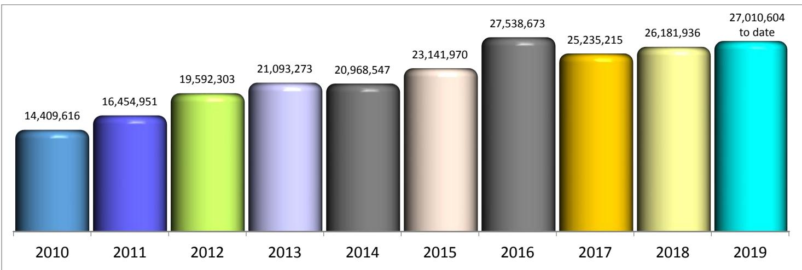

# FY 2021 Authorization and Budget Request to Congress

# Table of Contents

Page No.

I. Overview… 1-1

II. Summary of Program Changes…… .. 2-1

III. Appropriations Language and Analysis of Appropriations Language…… . 3-1

IV. Program Activity Justification… . 4-1

A. Intelligence Decision Unit… 4-1 1. Program Description 2. Performance Tables 3. Performance, Resources, and Strategies

B. Counterterrorism/Counterintelligence Decision Unit 4-12

1. Program Description   
2. Performance Tables   
3. Performance, Resources, and Strategies

C. Criminal Enterprises and Federal Crimes Decision Unit… . 4-24

1. Program Description   
2. Performance Tables   
3. Performance, Resources, and Strategies

D. Criminal Justice Services Decision Unit… ..4-32

1. Program Description   
2. Performance Tables   
3. Performance, Resources, and Strategies

V. Program Increases by Item… . 5-1

A. Combatting Crime and Corruption… 5-1   
B. Cyber… ….. 5-7   
C. Data Analytics and Technical Tools… …5-8   
D. Combatting Foreign Threats... ..5-9   
E. National Instant Criminal Background Check System/National Threat Operations Center. 5-10   
F. Cell Site Simulator… …. 5-16   
E. National Security Threat Program… …5-17   
H. Counter-Unmanned Aircraft Systems…...… 5-18

VI. Exhibits

A. Organizational Chart B. Summary of Requirements

C. FY 2021 Program Changes by Decision Unit   
D. Resources by DOJ Strategic Goal/Objective   
E. Justification for Technical and Base Adjustments   
F. Crosswalk of 2019 Availability   
G. Crosswalk of 2020 Availability   
H. Summary of Reimbursable Resources   
I. Detail of Permanent Positions by Category   
J. Financial Analysis of Program Changes   
K. Summary of Requirements by Object Class   
L. Status of Congressional Requests Studies, Reports, and Evaluations   
M. Senior Executive Service Reporting

VII. Construction .... .... 7-1

Overview ...... .... 7-1

Appropriations and Analysis of Appropriations Language ....... .... 7-4

# Exhibits

A. Organizational Chart (Not Applicable)   
B. Summary of Requirements   
C. FY 2021 Program Changes by Decision Unit (Not Applicable)   
D. Resources by DOJ Strategic Goal/Objective   
E. Justification for Technical and Base Adjustments   
F. Crosswalk of 2019 Availability   
G. Crosswalk of 2020 Availability   
H. Summary of Reimbursable Resources (Not Applicable)   
I. Detail of Permanent Positions by Category (Not Applicable)   
J. Financial Analysis of Program Changes (Not Applicable)   
K. Summary of Requirements by Object Class   
L. Status of Congressional Requests Studies, Reports, and Evaluations (Not Applicable)   
M. Senior Executive Service Reporting (Not Applicable)

VIII. Glossary...... . 8-1

# I. OVERVIEW

A. Introduction

Budget Request Summary: The Federal Bureau of Investigation’s (FBI’s) Fiscal Year (FY) 2021 budget request proposes a total of $\$ 9,800,724,00$ in direct budget authority, of which \$9,748,829,000 is for Salaries and Expenses (S&E) and $\$ 51,895,000$ is for Construction.

The S&E request includes a total of 35,842 direct positions and 34,293 direct full time equivalents (FTE); the positions include:

13,340 Special Agents (SAs)  3,150 Intelligence Analysts (IAs) 19,352 Professional Staff (PS)

The S&E program increases total \$199,673,000; 513 positions (182 SAs, 68 IAs, and 263 PS), and 257 FTE, for the following:

$\$ 43,482,000$ for Combatting Crime and Corruption   
$\$ 36,976,000$ for Cyber Investigative Capabilities   
$\$ 32,478,000$ for Data Analytics and the Development of Technical Tools   
$\$ 26,742,000$ for Combatting Foreign Threats   
$\$ 19,880,000$ to support the National Instant Criminal Background Check System and the   
National Threat Operations Center   
$\$ 16,103,000$ for Cell Site Simulators   
$\$ 14,208,000$ for the National Security Threat Program   
$\$ 9,304,000$ to Counter-Unmanned Aircraft Systems

The FY 2021 Adjustments to Base (ATBs) include an increase of \$81,254,000 for continued support of the FBI’s base resources.

The $\$ 51,895,000$ requested in the Construction account is to maintain the Secure Work Environment (SWE) Program and provide modest facility upgrades at the FBI Academy campus.

The FBI continues to strategically assess current and prospective operations to ensure it meets mission requirements at the lowest possible cost to the U.S. taxpayer. The FY 2021 budget request is a product of these assessments and provides the resources to aggressively continue the FBI’s strategic vision into the future.

Electronic copies of the Department of Justice’s Congressional Budget Justification and Capital Asset Plan and Business Case exhibits can be viewed or downloaded from the Internet using the address: http://www.justice.gov/doj/budget-and-performance

The FBI’s Mission: The mission of the FBI is to protect the American people and uphold the Constitution of the U.S.

The FBI contributes to the achievement of the following DOJ Strategic Goals:

 Strategic Goal 1: Enhance National Security and Counter the Threat of Terrorism  Strategic Goal 3: Reduce Violent Crime and Promote Public Safety  Strategic Goal 4: Promote Rule of Law, Integrity, and Good Government

The FBI Strategy and Budget Request: The FBI’s vision, mission, and strategic objectives are supported by its overall enterprise strategy. The mission of the FBI is to protect the American people and uphold the Constitution. The FBI’s vision – ahead of the threat – outlines the FBI’s desired strategic position. The FBI will achieve this by continuously evolving to mitigate existing threats and recognizing and anticipating threats it has not yet seen.

The FBI’s headquarters divisions must align to the enterprise strategy cascading strategic objectives with associated measures or initiatives within their division’s strategy. This vertical alignment within the organization ensures all divisions are strategically focused on the same objectives and working collectively towards the FBI mission and vision. Strategy reviews are held with each headquarters division to discuss progress towards the strategic objectives throughout the fiscal year, and the FBI’s senior executive management routinely evaluates the organization’s progress.

The FBI tracks the execution of its mission and operational strategy across headquarters operational programs, field offices, and legal attaché (Legat) offices through the Integrated Program Management process. This process enables threats to be identified across the organization with accompanying strategies. Every two years, headquarters operational divisions prioritize national threats, determine FBI National Threat Priorities (NTPs), and develop national-level strategies to mitigate the threats. The field offices and Legat offices use this information to formulate a prioritization of threats in their areas of responsibility and their own strategic plans. These strategies undergo mid-year and end-of-year evaluations, and the field and Legat offices are held accountable to their performance targets. FBI executives and program managers hold regular meetings to review and evaluate strategy effectiveness throughout the fiscal year.

The FBI’s budget strategy and future resource requirements and requests are designed to enable the FBI to address the current range of threats while also focusing on the future needs of the FBI. An increasing number of the FBI's programs and initiatives are multi-year in nature and require phased development, deployment, and operations and maintenance funding. Moreover, a multiyear planning approach allows FBI management to better understand the implications of proposed initiatives. This FY 2021 budget request is designed to promote capabilities and strategies that are sufficiently agile to meet ongoing, emerging, and unknown national security, cyber, and criminal threats.

Organization of the FBI: The FBI operates field offices in 56 major U.S. cities and 349 resident agencies (RAs) throughout the country. RAs are satellite offices, typically staffed at fewer than

20 personnel, who support the larger field offices and enable the FBI to maintain a presence in and serve a greater number of communities. FBI employees assigned to field offices and RAs perform the majority of the investigative and intelligence work for the FBI. Special Agents in Charge (SACs) and Assistant Directors in Charge (ADICs) of FBI field offices report directly to the Director and Deputy Director.

The FBI also operates 63 Legat offices and 27 sub-offices in over 70 countries around the world. These offices are typically staffed with fewer than 10 personnel who enable the FBI’s presence in these countries and liaise with foreign counterparts and partners. These numbers fluctuate based upon the global threat environment.

The FBI Headquarters, located in Washington, D.C., provides centralized operational, policy, and administrative support to FBI investigations and programs. Under the direction of the FBI Director and Deputy Director, this support is provided by:

The National Security Branch (NSB), which includes the Counterterrorism Division (CTD), Counterintelligence Division (CD), and the Weapons of Mass Destruction Directorate (WMDD).   
The Intelligence Branch (IB), which includes the Directorate of Intelligence (DI) and the Office of Partner Engagement (OPE).   
The Criminal, Cyber, Response and Services Branch (CCRSB), which includes the Criminal Investigative Division (CID), the Cyber Division (CyD), the Critical Incident Response Group (CIRG), and the International Operations Division (IOD).   
The Science and Technology Branch (STB), which includes the Criminal Justice Information Services (CJIS) Division, the Laboratory Division (LD), and the Operational Technology Division (OTD).

A number of other Headquarters offices also provide FBI-wide mission support:

The Information and Technology Branch (ITB) oversees the IT Enterprise Services Division (ITESD), the IT Applications and Data Division (ITADD), and the IT   
Infrastructure Division (ITID).   
The Human Resources Branch (HRB) includes the Human Resources Division (HRD), the Training Division (TD), and the Security Division (SecD).   
Administrative and financial management support is provided by the Facilities and Logistics Services Division (FLSD), the Finance Division (FD), the Records Management Division (RMD), the Resource Planning Office (RPO), and the Inspection Division (InSD).   
Specialized support is provided directly to the Director and Deputy Director through a number of staff offices, including the Office of Public Affairs (OPA), the Office of Congressional Affairs (OCA), the Office of the General Counsel (OGC), the Office of Equal Employment Opportunity Affairs (OEEOA), the Office of Professional   
Responsibility (OPR), the Office of the Ombudsman, and the Office of Integrity and Compliance (OIC).

Budget Structure: The FBI’s S&E funding is appropriated among four decision units that are reflective of the FBI’s key mission areas:

1. Intelligence   
2. Counterterrorism/Counterintelligence (CT/CI)   
3. Criminal Enterprises/Federal Crimes (CEFC)   
4. Criminal Justice Services (CJS)

Resources are allocated to these four decision units in one of three ways:

Based on core mission function: Certain FBI divisions support one mission area exclusively, and thus are allocated entirely to the corresponding decision unit. For example, all of the resources of the DI are allocated to the Intelligence Decision Unit while all of the resources of the CJIS Division are allocated to the CJS decision unit.   
 Based on workload: Critical investigative enablers, such as the LD, the IOD, and the OTD, are allocated to the decision units based on workload. For example, 21 percent of the LD’s workload is in support of counterterrorism investigations and, accordingly, 21 percent of the LD’s resources are allocated to the CT/CI decision unit. These percentage assignments may be revised upon review of workload.   
 Pro-rated across all decision units: Administrative enablers, such as the ITB, the FLSD, and the HRD, are pro-rated across all four decision units since these Divisions support the entire organization. This pro-rata spread is based on the allocation of operational divisions and critical investigative enablers.

The FBI’s Construction funding is a separate appropriation and all resources contained therein are allocated to the CJS decision unit.

# B. Threats to the U.S. and its Interests

In an effort to better address all aspects of the FBI’s requirements, the FBI formulates and structures its budget according to the threats that the FBI works to deter. The FBI Director identifies these threats through the National Threat Priorities process and they are resourced accordingly. This document lists each threat and activity the FBI is engaging in as well as achievements, where applicable, in these areas.

Terrorism: The FBI continues to work to identify individuals who seek to join the ranks of foreign fighters traveling in support of the Islamic State of Iraq and ash-Sham (ISIS), as well as homegrown violent extremists (HVE) who may aspire to attack the U.S. from within. These terrorism threats remain among the highest priorities for the FBI and the Intelligence Community (IC).

The conflicts in Syria and Iraq have served as the most attractive overseas theaters for Western extremists who want to engage in violence. More than 35,000 people from approximately 120 countries have traveled to join the fighting in Syria and Iraq, the large majority of which traveled to join ISIS. ISIS and other terrorist organizations in the region have used these travelers to facilitate terrorist activity beyond Iraq and Syria, particularly in their home countries. Returning foreign fighters could radicalize members of the communities that they came from originally.

ISIS has aggressively promoted its hateful message – attracting like-minded extremists including Westerners – and has persistently used the Internet to communicate. ISIS blends traditional media platforms, glossy photos, in-depth articles, and social media campaigns that can go viral in a matter of seconds. No matter the format, the message of radicalization now spreads faster than thought possible just a few years ago, aided by technology.

As a communication medium, social media is a critical tool for terror groups to exploit. One recent example includes an individual arrested for providing material support to ISIS by facilitating an associate’s travel to Syria to join ISIS. The arrested individual had multiple connections via a social media networking site with other like-minded individuals.

HVEs aspire to carry out attacks in the U.S. or travel overseas to participate in terrorist activity. Countering the HVE threat is especially challenging for law enforcement because HVEs often act with little to no warning. The FBI has HVE cases that span all 56 FBI field offices across all 50 states.

Foreign Intelligence: The foreign intelligence threat to the U.S. continues to increase as foreign powers seek to establish economic, military, and political preeminence and to position themselves to compete with the U.S. in economic and diplomatic arenas. The most desirable U.S. targets are political and military plans, technology, and economic institutions, both governmental and non-governmental. Foreign intelligence services continue to target and recruit U.S. travelers abroad to acquire intelligence and information. Foreign adversaries are increasingly employing non-traditional collectors – e.g., students and visiting scientists, scholars, and businesspersons – as well as cyber-based tools to target, penetrate, and influence U.S. institutions.

Recent notable successes include the espionage convictions of three former U.S. Intelligence Community (USIC) officers in cases demonstrating the threat posed by Chinese intelligence services targeting former U.S. security clearance holders for recruitment. In March 2019, former Defense Intelligence Agency (DIA) officer and retired U.S. Army warrant officer Ron Rockwell Hansen pleaded guilty to attempted espionage, admitting he regularly met with Chinese intelligence officers in China and received hundreds of thousands of dollars in compensation for information he illegally provided them. In May 2019, former Central Intelligence Agency (CIA) officer Jerry Chun Shing Lee pleaded guilty to conspiring to commit espionage, admitting he created documents detailing intelligence provided by CIA assets, true names of assets, operational meeting locations and phone numbers, and information about covert facilities in response to taskings from Chinese intelligence officers who paid him hundreds of thousands of dollars and offered to take care of him “for life” in exchange for his cooperation. Also in May 2019, former CIA case officer and DIA intelligence officer Kevin P. Mallory was sentenced to 20 years in prison after a federal jury convicted him of conspiring to transmit national defense information – including unique identifiers for confidential human sources who had helped the U.S. Government – to a Chinese intelligence officer.

Cyber: Nation state and criminal actors continue to use cyber operations as a low cost means to target the U.S. and advance their interests. The U.S. continues to face cyber threats from criminals, terrorists, and nation states whose activities are manifested through organized crime syndicates seeking to defraud financial systems and/or entities who conduct espionage activities or network attacks.

While these threats are not new, adversaries are constantly changing and evolving the ways in which they carry out their activities. Cyber actors are using new technologies to obfuscate their activities, further complicating identification and attribution efforts. Although cyber has expanded industry profitability, it has also served as a platform for nefarious activity. Despite formidable investments and concerted efforts by the private sector and government to build more secure and defensible computer networks, risks remain high and cybersecurity remains a rapidly growing concern with no easy solutions in sight.

The FBI’s cyber mission is to counter these cyber threats through its investigative and intelligence authorities. Through its authorities, the FBI works to identify criminal, terrorist, and nation-state actors and engage in activities to reduce or neutralize these threats. At the same time, the FBI collects and disseminates information helpful to those responsible for defending networks, including information regarding threat actor targets and techniques. The FBI’s jurisdiction is not defined by network boundaries; rather, it includes all territory governed by U.S. law, whether domestic or overseas, and spans individual citizens, private industry, critical infrastructure, U.S. government, and other interests alike. As a federal law enforcement agency and member of the USIC, the FBI is in a unique position to further its own operations and enhance those of interagency partners.

Collectively, the FBI and its federal partners take a whole-of-government approach to help deter future threats and bring closure to current threats that would otherwise continue to infiltrate and harm network defenses. An example includes international efforts to dismantle the GozNym network, operating out of Europe, on May 16, 2019. This cybercrime network, using the GozNym malware, attempted to steal an estimated $\$ 100$ million from victims in the U.S. and around the world, infecting tens of thousands of victim computers. On the same day of this dismantlement, an indictment was unsealed charging 10 members of this cyber-criminal network with computer fraud, wire/bank fraud, and money laundering. These actors infected victims with the GozNym malware to capture their banking login credentials, used those credentials to gain unauthorized access to their bank accounts, and then stole/laundered money from the victims. Five of the defendants remain fugitives from justice, as they reside in Russia, but the rest are facing criminal prosecutions in their respective countries. The dismantlement and indictment are a direct result of the cooperation between the U.S. and international partners (Georgia, Ukraine, Moldova, Germany, Bulgaria, Europol, and Eurojust) and highlights the importance of collaboration when facing cyber threats.

White Collar Crime: The White Collar Crime (WCC) program addresses Public Corruption, Border Corruption, Corporate Fraud, Securities/Commodities Fraud, Mortgage Fraud and Other Financial Institution Fraud, Health Care Fraud, Other Complex Financial Crimes (Insurance, Bankruptcy, and Mass Marketing Fraud), and Intellectual Property Rights.

Public Corruption, which involves the corruption of local, state, and federally elected, appointed, or contracted officials, undermines democratic institutions and threatens public safety and national security. Government fraud affects U.S. border security, neighborhood safety, judicial integrity, and public infrastructure quality such as schools and roads.

The documented presence of corrupt border officials facilitates a wide range of illegal activities along the northern and southern borders. Resource-rich cartels and criminal enterprises employ a variety of methods to target and recruit U.S. Border Patrol Agents, Customs and Border Protection Officers, and local police officers who can facilitate criminal activity. Corrupt officials assist these entities by providing intelligence and facilitate the movement of contraband across the borders. To help address this threat, the FBI established the Border Corruption Initiative (BCI), which has developed a threat-tiered methodology, targeting border corruption at all land, air, and sea ports of entry to mitigate the threat posed to national security.

Corporate fraud encompasses myriad schemes, including falsification of financial information pertaining to public and private corporations via false accounting entries; fraudulent trades designed to inflate profit or hide losses; illicit transactions designed to evade regulatory oversight; self-dealing activities by corporate insiders, including embezzlement by high level managers; misuse of corporate property for personal gain; and the solicitation, offer, receipt, or provision of kickbacks for collusion in corrupt corporate activity. Past examples of perpetrators in companies include the positions of Chief Executive Officer (CEO), Chief Financial Officer (CFO), Controller, President, and Treasurer. Self-dealing activities and falsification of financial documents by corporate insiders continues to be a common theme in the corporate fraud threat environment. Self-dealing corporate employees with access and placement to steer corporate contractual agreements receive kickbacks, engage in gross misuse of corporate property for personal gain, and commit outright embezzlement. The falsification of corporate financial documents to hide or fictitiously elevate the perception of a corporation by insiders threatens the integrity of regulatory processes, investment activities, and long-term corporate viability.

Insider trading is the purchase or sale of securities based on material, non-public information. The material criterion pertains to any information that can be reasonably expected to influence an investment decision. Non-public information refers to data which is not available to the general investing public or not attainable through analysis of publicly available data. The demand for material, non-public information remains high among financial professionals and will likely continue to increase as traders seek informational advantages in an increasingly competitive marketplace. Insider trading may diminish investor confidence in particular firms, discourage participation in the securities and commodities markets, distort financial markets, and offer an unfair advantage to those possessing inside information.

Investment fraud schemes involve the illegal sale or purported sale of financial instruments - both registered and unregistered securities and commodities (including virtual currencies). Investment fraud encompasses a wide array of schemes, including Ponzi and pyramid schemes, prime bank and advance fee investment frauds, commodities frauds, affinity frauds, sales of fraudulent promissory notes, and the emerging initial coin offering threat. Investment fraud also includes activities such as unauthorized trading within companies or embezzling from their own clients; solicitation or receipt of kickbacks in exchange for investment advice; and purposeful misstatements or omissions in offering materials by investment managers, advisers, and brokers.

Market manipulation encompasses a wide range of schemes in which perpetrators deliberately attempt to interfere with free and fair market operations for the purpose of gaining trading advantages over other market participants. Market manipulation perpetrators seek to create the false illusion of market activity by artificially inflating, deflating, or maintaining the prices of securities, commodities, or currencies to profit at the expense of other market participants. Common forms of market manipulation include traditional "pump-and-dump" scams, in which perpetrators artificially create liquidity and volume of a manipulated stock, thus causing the stock price to artificially go up in value. Primary funding transactions such as private investment into public equity (PIPE) involve the issuance of convertible notes to alleged investors in exchange for cash. For both "pump-and-dump" and PIPE deals, the perpetrators sell their shares at the inflated price, thereby reaping profits and causing unwitting investors to absorb losses as the share price declines following the manipulation. Variations of this scam involve cyber intrusions, in which perpetrators compromise online brokerage accounts to purchase shares of and thereby raise the price of low-value, illiquid securities or use it to purchase the inflated value stock.

Mortgage fraud, a subset of financial institution fraud, continues to absorb considerable FBI resources. As long as houses are bought and sold and banks lend to consumers, mortgage fraud will continue. The majority of FBI Mortgage Fraud cases are broken into three types of schemes: (1) Loan Origination Schemes; (2) Illegal property-flipping; and (3) Bailout Schemes.

The FBI identifies and pursues investigations against the most egregious offenders involved in health care fraud and abuse, including criminal enterprises and other crime groups, corporations, companies, and providers whose schemes affect public safety. Besides federal health benefit programs, such as Medicare and Medicaid, private insurance programs also lose billions of dollars each year to fraud schemes in every sector of the industry.

The FBI also investigates other complex financial crimes that may impact the health of the U.S. economy. For example, if insurance fraud continues to increase, this will contribute to increases in insurance premiums as well as threaten the financial viability of insurance companies. Furthermore, since 2006, the year after bankruptcy laws were changed to make it more difficult for an individual to discharge all debts, bankruptcy filings have significantly increased each year, according to the U.S. Bankruptcy Courts, leading to higher potential for fraud within this area.

The FBI’s overall strategy for Intellectual Property Rights (IPR) enforcement is to disrupt and dismantle international and domestic criminal organizations and individuals that manufacture or traffic in counterfeit and pirated goods and/or steal, distribute, or otherwise profit from the theft of intellectual property. Investigative priorities include theft of trade secrets; counterfeit goods that pose a threat to health and safety; and copyright and trademark infringement cases having a national security, organized crime, or significant economic impact.

Gang Violence: Across the country, violent street gangs operate in communities of all sizes regardless if they are urban, suburban, or rural areas. FBI Violent Gang Safe Streets Task Forces (VGSSTFs) report that violent street gangs, whether they are neighborhood-based or national gangs, are a top threat to communities, followed by prison gangs and outlaw motorcycle gangs. In FY 2019, the FBI led 174 VGSSTFs. The FBI's Violent Gang strategy is designed to reduce gang related violence by identifying, prioritizing, and targeting the most violent gangs whose activities constitute criminal enterprises.

Gangs continue to proliferate, committing violent crime while expanding to suburban and rural areas. This is believed to be a result of better organized urban gangs. They are expanding their criminal networks into new market areas in suburban and rural locations, where they can absorb local unaffiliated gangs or use violence to intimidate them. As these expanding gangs encounter resistance from local gangs or other drug distributors in these communities, violent crimes, such as assaults, drive-by shootings, and murders can be expected to increase. Furthermore, gangs are partaking in less typical gang-related crime, such as human trafficking, white-collar crime (such as bank fraud), and cybercrime.

Transnational Criminal Organizations (TCO) and Enterprises: Transnational organized crime is an immediate and increasing concern of the domestic and international law enforcement and intelligence communities. Geopolitical, economic, social, and technological changes within the last two decades have allowed these criminal enterprises to become increasingly active worldwide. The criminal enterprises include the following distinct groups: Eurasian Organizations that have emerged since the fall of the Soviet Union; Asian Criminal Enterprises; traditional organizations, such as the La Cosa Nostra (LCN) and Italian Organized Crime; Balkan Organized Crime; Middle Eastern Criminal Enterprises; and African Criminal Enterprises.

The potential for terrorism-related events associated with criminal enterprises is ever-increasing. This is due to alien smuggling across the southwest border by drug and gang criminal enterprises; Colombian-based narco-terrorism groups influencing or associating with traditional drug trafficking organizations; prison gangs recruited by religious, political, or social extremist groups; and major theft criminal enterprises conducting criminal activities in association with terrorist-related groups, or to facilitate funding of terrorist-related groups. There is also the ever present concern that criminal enterprises are, or can, facilitate the smuggling of chemical, biological, radioactive, or nuclear weapons and materials.

Civil Rights: The FBI has primary responsibility for investigating all alleged violations of federal civil rights laws that protect all citizens and persons within the U.S., including Hate Crimes, Color of Law (COL), Human Trafficking, and Freedom of Access.

Investigating hate crimes is the leading priority of the FBI’s Civil Rights Program due to the devastating impact that the crimes have on individuals, families, and communities. A hate crime is a traditional criminal offense, such as murder, arson, or vandalism, motivated in whole or in part by an offender’s bias against a victim’s actual or perceived race, religion, national origin, disability, gender, gender identity, or sexual orientation.

COL violations are the deprivation of any rights, privileges, or immunities secured or protected by the U.S. Constitution by someone in his/her official, governmental capacity. The FBI has investigative responsibility for federal COL matters involving local and state law enforcement and concurrent responsibility with the Office of Inspectors General for other federal agencies.

Human trafficking is a form of modern-day slavery and is a significant and persistent problem in the U.S. and internationally. Victims are often lured with false promises of good jobs and better lives and then forced to work under brutal and inhumane conditions. Many trafficking victims are forced to work in the sex industry; however, trafficking can also take place in labor settings involving domestic servitude, prison-like factories, and migrant agricultural work. Human trafficking cases require extensive outreach and cooperation with local, state, and federal agencies, as well as non-governmental organizations.

Under the Freedom of Access to Clinic Entrances (FACE) Act, the FBI has the sole investigative responsibility for conducting investigations of potential FACE Act violations. Incidents include murder, death threats, invasions, burglaries, and other acts of intimidation. The number of FACE Act violations remains relatively low, with occasional spikes during dates which mark significant events in the pro-choice and pro-life movements.

Crimes Against Children: The FBI is the only federal agency with sole jurisdiction to investigate child abductions. The FBI’s Crimes Against Children and Human Trafficking Unit supports the Child Abduction Rapid Deployment (CARD) Team, Innocence Lost National Initiative, Innocent Images National Initiative, and the Child Sex Tourism (CST) Initiative. The Violent Crimes Against Children Program has developed a nationwide capacity to:

Provide a rapid and effective investigative response to reported federal crimes involving the victimization of children; Reduce the vulnerability of children to acts of sexual exploitation and abuse; Reduce the negative impacts of international parental rights disputes; and, Strengthen the capabilities of federal, state, local, and tribal law enforcement agencies through training programs and investigative assistance.

The FBI’s Violent Crime Section, in coordination with the Critical Incident Response Group (CIRG) Behavior Analysis Unit III (BAU III), created regional CARD Teams in order to enhance the FBI's response to abductions and the mysterious disappearance of children. The teams are geographically distributed throughout five regions of the U.S. The CARD Teams, collectively, consist of over 60 experienced Crimes Against Children investigators.

The Innocence Lost Initiative addresses the commercial sexual exploitation of children. Investigations have identified national criminal organizations responsible for the sex trafficking of hundreds of children, some as young as nine years old. Furthermore, subjects of these investigations are regularly sentenced to terms of 25 years or more, while ten offenders have received life sentences.

The Child Sex Tourism (CST) Initiative targets U.S. citizens who travel to foreign countries and engage in sexual activity with children under the age of 18. The initiative has also organized and participated in capacity building for foreign law enforcement, prosecutors, and non-government organizations in these countries.

Indian Country: Due to jurisdictional issues and the remote nature of many reservations, the FBI is the primary law enforcement entity in Indian Country. The Bureau of Indian Affairs has a limited number of investigators, and they are not present on every reservation. Additionally, tribal authorities can generally only prosecute misdemeanor violations involving Indian subjects, and state/local law enforcement does not have jurisdiction within the boundaries of the reservation, with the exception of Public Law (P.L.) 280 states1 and tribes.

The Indian Country Crimes Unit (ICCU) has developed and implemented strategies to address the most egregious crime problems in Indian Country, pursuant to the FBI’s jurisdiction. These matters generally focus on death investigations, child sexual assault and physical abuse, assault resulting in serious bodily injury, gang/criminal

In FY 2019, there were 1,293 arrests, 1,354 indictments (information /complaints) and 918 convictions in Indian Country.

enterprise investigations, and financial crimes. ICCU supports joint investigative efforts with the Bureau of Indian Affairs and tribal law enforcement agencies. ICCU also manages 20 Safe Trails Task Forces (STTFs) and conducts essential investigative training to support these STTFs, as well as approximately 150 FBI agents and other law enforcement partners, who focus on Indian Country crimes. Although Indian Country cases are generally reactive, many are crossprogrammatic in nature, including Indian gaming, public corruption, and complex financial fraud.

Southwest Border: The volatility among TCOs and violent gangs (e.g., Mexican Mafia, Barrio Azteca, and $1 8 ^ { \mathrm { t h } }$ Street) along the Southwest Border has resulted in increased levels of drugrelated violence. As rival TCOs and gangs battle for control over the lucrative drug markets, spikes in kidnappings, homicides, and a myriad of other violent acts have occurred along the U.S.-Mexico border. In addition, these transnational groups use several “tools” to aid in their objectives, such as public corruption, money laundering, human trafficking, and threats to law enforcement.

To address the Southwest Border threat, the FBI has developed an intelligence-driven, crossprogrammatic strategy to penetrate, disrupt, and dismantle the most dangerous organizations, as well as identify and target individuals in leadership roles. This strategy includes the deployment of hybrid squads in areas assessed to be particularly vulnerable to violence and criminality associated with TCOs, regardless of their physical proximity to the border. The primary goal of the hybrid squad model is to bring a threat-based domain view of these dynamic, multi-faceted enterprises, thus fusing strategic and tactical intelligence with investigative operations. In turn, this can increase the likelihood that the FBI is aware of every facet of illicit activity within the organization at all levels and can link these back to priority targets outside of the U.S.

Transportation Crimes: Personal and property crimes continue to be a concern within Special Jurisdiction Crimes areas such as within federal penal institutions, on other Federal government properties, and in special jurisdictional areas, such as on the high seas.

# C. Intelligence-Driven Operations

The FBI’s Intelligence Branch (IB) serves as the strategic leader of the FBI’s Intelligence Program, driving the integration of intelligence and operations, and proactively engaging with partners in federal, state, and local law enforcement, and the intelligence and U.S. private-sector communities. The IB provides strategic direction and oversight for all aspects of the FBI’s Intelligence Program, overseeing the implementation of its intelligence strategy and the six areas of focus: workforce success, culture and mindset, technology capabilities, information sharing, collection, and exploitation and analysis.

The Executive Assistant Directors (EADs) for Intelligence, National Security, and the Criminal, Cyber, Response, and Services Branches work closely to manage all of the FBI’s intelligence and national security operational components, including CD, CTD, CyD, DI, the High-Value Detainee Interrogation Group, Terrorist Screening Center, and WMDD. Additionally, the IB coordinates the management of the FBI’s National Intelligence Program (NIP)-funded resources, supporting engagement with FBI partners as well as intelligence-related training, technology, and SWE.

The EAD for Intelligence serves as the FBI’s Foreign Language Program Manager, as well as the Executive Agent for the National Virtual Translation Center, and is the primary point of contact for the FBI’s engagement with the Office of the Director of National Intelligence on NIP matters.

The FBI uses intelligence to understand national security threats, and to conduct operations to dismantle or disrupt those threats. Some examples include:

Field Intelligence Groups (FIGs): The FBI utilizes a standardized model for field intelligence that can adapt to the size and complexity of small, medium, and large offices. There are now 56 FIGs, located in every FBI Field Office throughout the U.S. Fusion Cells: Fusion Cells are intelligence teams within operational divisions designed to integrate all aspects of the intelligence cycle for a unique threat. Fusion Cells integrate intelligence and operations and collaborate across work roles to ensure intelligence drives and supports operations. Fusion Cells consist of intelligence analysts who perform the strategic, domain, collection, and tactical intelligence functions. The structure and process of the Fusion Cells are designed to streamline intelligence support and more directly collaborate with operational personnel.

# D. Environmental Accountability

The FBI maintains an organizational Environmental Management System (EMS) that provides corporate policy and guidance for all FBI facilities, including Field Offices and major owned/operated facilities. The FBI established an overarching environmental policy to serve as the guiding framework for developing, implementing, and continually improving the EMS, which will be replaced by an Environmental, Energy, and Sustainable Operations Policy Guide currently under development. The FBI implements the organizational EMS through Environmental Protection Programs (EPPs) that are carried out at the facility and division level through full-time and part-time environmental, safety, and health (ESH) staff. The FBI is in the process of updating its ESH Framework policy to clarify the roles and responsibilities of FBI leadership and implementers within the ESH program.

The FBI actively participates in DOJ’s overall efforts to implement Executive Order 13834, “Efficient Federal Operations.” The FBI provided data and input into the Department’s Strategic Sustainability Performance Plan (SSPP) in 2019, and routinely corresponds with DOJ and other government components to determine the most efficient, effective methods to protect the environment. The FBI tracks energy and water usage and audit findings to prioritize facility maintenance projects and forecast future consumption and costs based on identified Energy Conservation Measures (ECMs) and Water Conservation Measures (WCMs). In FY 2018, the FBI established the FBI Energy and Water Conservation Investment Program (FEWCIP) to provide centralized funding of ECMs and WCMs at FBI facilities. In the initial year, the FBI made thirteen awards totaling $\$ 1.6$ million to a variety of project types distributed among the FBI’s owned and operated facilities. Collectively, these projects are expected to save almost $\$ 700$ thousand annually and $\$ 12.5$ million over the life of the projects. The launch of FEWCIP has greatly increased interest in energy and water conservation projects and the program will continue in FY 2020.

FBI policy requires that new FBI-owned facilities over $\$ 25$ million be designed and constructed to meet the minimum of a Leadership in Energy and Environmental Design (LEED) Certified Silver Rating in the New Construction category, and that all other new construction and major renovations conform to the Guiding Principles for Federal Sustainable Buildings. The FBI made significant strides in sustainable design and construction in FY 2018 and FY 2019. The FBI sustainable design and construction specification is now used in nearly all new construction and major renovation projects in FBI-owned and operated buildings. The FBI works with its facilities to ensure the integration of the Guiding Principles for Federal Sustainable Buildings throughout the design, construction, renovation, and maintenance of FBI buildings. The FBI has LEED certified and Guiding Principles-compliant buildings in Clarksburg, West Virginia; Huntsville, Alabama; and Quantico, Virginia. Additionally, the new FBI Central Records Complex in Winchester, Virginia, will be Guiding Principles, LEED Silver and Sustainable Sites Initiative (SITES) certified. The FBI obtained LEED Gold certification for the new Biometrics Technology Center (BTC) at FBI Clarksburg, and the Laboratory Building and Collaboration Center at the new TEDAC facility in Huntsville, Alabama.

In addition to improving the environmental accountability of its facilities, the FBI has taken steps to improve its electronic recycling. In FY 2019, the FBI put a contract in place for large-scale hard drive and electronics recycling that is currently focused on the Washington, D.C. Metro Area. The money recouped from the sale of the recycled material is put into an account through the Recycling Proceeds Recoupment Program (RP2) and will be used for environmental priorities across the FBI.

In FY 2019, the FBI targeted contracts with the greatest sustainable acquisition requirements— beginning with cafeteria and janitorial contracts—to create templates for appropriate sustainability contract language prior to the rebid process. Additionally, the FBI launched the

Electric Vehicle Charging Station Initiative. Using the new FBI-wide charging station guidance, FBI facility managers can now install EV charging stations for both fleet and personally-owned vehicles that comply with the Fixing America’s Surface Transportation (FAST) Act of FY 2015. Compliant charging stations are operational at the Los Angeles Field Office, with more charging stations planned for FBI facilities in Huntsville, Quantico, and other locations across the country.

# II. SUMMARY OF PROGRAM CHANGES

<table><tr><td rowspan=1 colspan=1>Program</td><td rowspan=1 colspan=1>Description</td><td rowspan=1 colspan=1>Pos.</td><td rowspan=1 colspan=1>FTE</td><td rowspan=1 colspan=1>Dollars($000)</td><td rowspan=1 colspan=1>Page</td></tr><tr><td rowspan=1 colspan=1> Salaries and Expenses Enhancements</td><td></td><td></td><td></td><td rowspan=1 colspan=2></td></tr><tr><td rowspan=1 colspan=1>Combatting Crime andCorruption</td><td rowspan=1 colspan=1>To effectively address the growingthreat posed by criminal and corruptorganizations that exploittechnology and international jurisdictions to conduct criminalactivities detrimental to nationalsecurity, public health and safety,and economic stability.</td><td rowspan=1 colspan=1>80</td><td rowspan=1 colspan=1>40</td><td rowspan=1 colspan=1>$43,982</td><td rowspan=1 colspan=1>5-1</td></tr><tr><td rowspan=1 colspan=1>Cyber</td><td rowspan=1 colspan=1>To effectively address the rapidlyevolving cyber threats facing thenation with resources to supportcyber investigations, includingpersonnel, technical tools, andpartnerships.</td><td rowspan=1 colspan=1>81</td><td rowspan=1 colspan=1>41</td><td rowspan=1 colspan=1>$36,976</td><td rowspan=1 colspan=1>5-7</td></tr><tr><td rowspan=1 colspan=1>Data Analytics andTechnical Tools</td><td rowspan=1 colspan=1>To provide resources for tools toenhance investigative capabilitiesthroughout the enterprise.</td><td rowspan=1 colspan=1>87</td><td rowspan=1 colspan=1>44</td><td rowspan=1 colspan=1>$32,478</td><td rowspan=1 colspan=1>5-8</td></tr><tr><td rowspan=1 colspan=1>Combatting ForeignThreats</td><td rowspan=1 colspan=1>To address threats posed by foreign intelligence.</td><td rowspan=1 colspan=1>130</td><td rowspan=1 colspan=1>65</td><td rowspan=1 colspan=1>$26,742</td><td rowspan=1 colspan=1>5-9</td></tr><tr><td rowspan=1 colspan=1>National Instant CriminalBackground CheckSystem / National ThreatOperations Center</td><td rowspan=1 colspan=1>To provide personnel, equipment,and technology to process firearmsbackground checks, as well asadequately handle incoming tipsfrom the public.</td><td rowspan=1 colspan=1>120</td><td rowspan=1 colspan=1>60</td><td rowspan=1 colspan=1>$19,880</td><td rowspan=1 colspan=1>5-10</td></tr><tr><td rowspan=1 colspan=1>Cell Site Simulator</td><td rowspan=1 colspan=1>To upgrade Cell Site Simulatorsystems that are capable of operatingagainst evolving wirelesscommunication technology.</td><td rowspan=1 colspan=1>…</td><td rowspan=1 colspan=1>…</td><td rowspan=1 colspan=1>$16,103</td><td rowspan=1 colspan=1>5-16</td></tr><tr><td rowspan=1 colspan=1>National Security ThreatProgram</td><td rowspan=1 colspan=1>To effectively address the emergingrequirements associated with theNational Security Threat Program.</td><td rowspan=1 colspan=1>15</td><td rowspan=1 colspan=1>7</td><td rowspan=1 colspan=1>$14,208</td><td rowspan=1 colspan=1>5-17</td></tr><tr><td rowspan=1 colspan=1>Counter-UnmannedAircraft Systems</td><td rowspan=1 colspan=1>To effectively address the emergingrequirements associated with thepotential threat of UnmannedAircraft Systems (UAS).</td><td rowspan=1 colspan=1>…</td><td rowspan=1 colspan=1>…</td><td rowspan=1 colspan=1>$9,304</td><td rowspan=1 colspan=1>5-18</td></tr><tr><td rowspan=1 colspan=2>Total, Salaries and Expenses Enhancements</td><td rowspan=1 colspan=1>513</td><td rowspan=1 colspan=1>257</td><td rowspan=1 colspan=1>$199,673</td><td rowspan=1 colspan=1>-</td></tr></table>

# III. Appropriations Language and Analysis of Appropriations Language

# Appropriations Language for Salaries and Expenses

For necessary expenses of the Federal Bureau of Investigation for detection, investigation, and prosecution of crimes against the United States, [\$9,467,902,000] $\delta 9 , 7 4 8 , 8 2 9 , 0 0 0$ of which not to exceed $\$ 216,900,000$ shall remain available until expended: Provided, That not to exceed $\$ 284,000$ shall be available for official reception and representation expenses.

# (CANCELLATION)

Of the unobligated balances available under this heading, \$80,000,000 are hereby permanently cancelled, including from, but not limited to, fees collected to defray expenses for the automation of fingerprint identification and criminal justice information services and associated costs: Provided, That no amounts may be cancelled from amounts that were designated by the Congress as an emergency requirement pursuant to the Concurrent Resolution on the Budget or the Balanced Budget and Emergency Deficit Control Act of 1985.

# Analysis of Appropriations Language

 No substantive changes.

# IV. Program Activity Justification

A. Intelligence Decision Unit

<table><tr><td rowspan=1 colspan=1>Intelligence Decision Unit Total</td><td rowspan=1 colspan=1>DirectPos.</td><td rowspan=1 colspan=1>FTE</td><td rowspan=1 colspan=1>Amount($000)</td></tr><tr><td rowspan=1 colspan=1>2019 Enacted</td><td rowspan=1 colspan=1>6,672</td><td rowspan=1 colspan=1>6,263</td><td rowspan=1 colspan=1>$1,711,070</td></tr><tr><td rowspan=1 colspan=1>2020 Enacted</td><td rowspan=1 colspan=1>6,679</td><td rowspan=1 colspan=1>6,378</td><td rowspan=1 colspan=1>$1,764,562</td></tr><tr><td rowspan=1 colspan=1>Adjustments to Base and Technical Adjustments</td><td rowspan=1 colspan=1>(54)</td><td rowspan=1 colspan=1>(63)</td><td rowspan=1 colspan=1>$31,852</td></tr><tr><td rowspan=1 colspan=1>2021 Current Services</td><td rowspan=1 colspan=1>6,625</td><td rowspan=1 colspan=1>6,315</td><td rowspan=1 colspan=1>$1,796,414</td></tr><tr><td rowspan=1 colspan=1>2021 Program Increases</td><td rowspan=1 colspan=1>82</td><td rowspan=1 colspan=1>41</td><td rowspan=1 colspan=1>$36,462</td></tr><tr><td rowspan=1 colspan=1>2021 Request</td><td rowspan=1 colspan=1>6,707</td><td rowspan=1 colspan=1>6,356</td><td rowspan=1 colspan=1>$1,832,876</td></tr><tr><td rowspan=1 colspan=1>Total Change 2020-2021</td><td rowspan=1 colspan=1>28</td><td rowspan=1 colspan=1>(22)</td><td rowspan=1 colspan=1>$68,314</td></tr></table>

# 1. Program Description

The FBI’s Intelligence Decision Unit (IDU) is comprised of the entirety of the Intelligence Branch (IB), including the Bureau Intelligence Council (BIC), Directorate of Intelligence (DI), the Office of Partner Engagement (OPE), and the Office of Private Sector (OPS); the intelligence functions within the Counterterrorism, Counterintelligence, Cyber, and Criminal Investigative Division, the Weapons of Mass Destruction Directorate, Field Intelligence Groups (FIGs), the Terrorist Screening Center (TSC), Infrastructure and Technology (e.g., SCIFs and SCINet), and Intelligence Training. The IDU also includes a portion of CIRG, Laboratory Division, and International Operations Division based on the work that those divisions do in support of intelligence activities. Additionally, to capture all resources that support these programs, a prorated share of resources from the FBI's operational support divisions (including Training, Finance Division, Facilities and Logistics Services Division, Information Technology (IT), and Human Resources Division) are calculated and allocated to the decision unit.

# Intelligence Branch

As the leader of the FBI’s Intelligence Program, the IB drives collaboration to achieve the full integration of intelligence and operations throughout the FBI. The branch has centralized authority and responsibility for all FBI intelligence strategy, resources, policy, and functions for actively engaging with the FBI’s partners across the intelligence, law enforcement, and private sector communities. The FBI’s Intelligence Program Strategy guides the IB direction and oversight of all aspects of the FBI’s intelligence work.

The Bureau Intelligence Council (BIC) provides FBI leaders with a consolidated, integrated perspective on threats while helping to integrate and balance the FBI’s priorities with those of the broader IC and U.S. government (USG). Led by a Deputy Assistant Director, the BIC is made up of Senior National Intelligence Officers with subject-matter expertise on geographic and functional programs who help integrate the FBI’s understanding of priority threat issues. The BIC also houses the Bureau Control Office, which manages the FBI’s sensitive compartmented information program.

# Directorate of Intelligence

The Directorate of Intelligence (DI or Directorate) is the FBI’s dedicated national intelligence workforce, with clear authority and responsibility for all FBI intelligence functions. The Directorate’s mission is to provide strategic support, direction, and oversight to the FBI’s Intelligence Program, and its vision is to drive the complete integration of intelligence and operations within the FBI. The DI carries out these functions through embedded intelligence elements at FBI Headquarters (FBI HQ) and in each Field Office.

# Intelligence Analysts

The work performed by Intelligence Analysts (IAs) is essential to the FBI's ability to understand national security and criminal threats, and to develop a deeper understanding of potential threats. To safeguard national security, the FBI must focus collection and analytic resources to analyze threats, determine potential courses of action, and place analysis in the context of ongoing intelligence and investigative operations.

The FBI’s IA cadre performs the following functions:

Understanding emerging threat streams to enhance domain knowledge and exploit collection opportunities;   
Enhancing collection capabilities through the deployment of collection strategies; Reporting raw intelligence in a timely manner;   
Identifying human and technical source collection opportunities;   
Performing domain analysis in the field to articulate the existence of a threat in the Field Offices’ areas of responsibility (AORs);   
Performing strategic analysis at FBI HQ to ascertain the ability to collect against a national threat;   
Serving as a bridge between intelligence and operations;   
Performing confidential human source validation; and,   
Recommending collection exploitation opportunities at all levels.

The products generated by intelligence analysis ensure FBI investigative and operational strategies are based on an enterprise-wide understanding of the current and future threat environments. FBI intelligence products also serve to inform the FBI’s partners about ongoing and emerging threats.

# Field Office Intelligence Programs

Field Intelligence Groups (FIGs) are the centralized intelligence components within Field Offices responsible for the management, execution, and coordination of intelligence functions, to include the collection, analysis, production, and dissemination of strategic and tactical intelligence to all FBI investigative programs and other federal, state, local, tribal, and territorial partners. FIGs integrate the intelligence cycle (requirements; planning and direction; collection; processing and exploitation; analysis and production; dissemination) to meet current and future national security and criminal threats.

# Foreign Language Program

The Foreign Language Program (FLP) provides quality language solutions, analysis, and cultural expertise to the FBI and its partners. The FBI’s success at protecting the U.S. from future terrorist attacks, countering foreign intelligence operations and espionage, and dismantling transnational criminal enterprises is increasingly dependent upon maximizing the use and deployment of its linguist workforce, language tools, and technology. The FBI workforce has qualified capabilities in 142 languages and dialects, spanning approximately 100 FBI domestic and overseas locations. The FLP promulgates policies and compliance requirements to ensure integrity of intelligence products. Additionally, the FLP develops the foreign language skills of the FBI employees through ongoing language testing, assessments, and multi-tiered training strategies designed to build and sustain a high performing intelligence workforce.

# Language Analysis

Nearly every major FBI investigation has a foreign language component, and the demand for highly qualified linguists and foreign language and culture training continues to increase. Language analysis is a critical component of the FBI’s effort to acquire and accurately process real-time, actionable intelligence to detect and prevent terrorist attacks against the nation. The FBI’s language analysis capabilities address all of its highest priority counterterrorism intelligence translation requirements. Language Analysts and English Monitor Analysts also play a significant role in the FBI’s cyber, counterintelligence, and criminal investigative missions.

# National Virtual Translation Center

The National Virtual Translation Center (NVTC) provides timely and accurate translation services to support national intelligence priorities and protect the nation and its interests. NVTC was established under Section 907 of the USA Patriot Act (2001) and designated an IC service of common concern in 2014. Since its inception, NVTC has complemented IC elements’ foreign language translation capabilities by supporting tasks ranging from high-volume surges to immediate translation requirements in 142 languages and dialects. NVTC operates within a virtual model that connects NVTC program staff, translators, field offices, and customers globally via a common web-based workflow management system.

# Intelligence Training

Ensuring each subset of the FBI’s intelligence workforce is equipped with the necessary specialized skills and expertise is critical to the organization’s ability to successfully fulfill its mission. The FBI’s extensive intelligence training program leverages expertise within the organization and amongst its partners in the intelligence and academic communities and private industry to ensure the best educational opportunities are available to the FBI’s workforce. In addition, the FBI’s training program identifies and coordinates the certification of adjunct faculty, communicates educational and developmental opportunities available outside the FBI, and facilitates opportunities for research related to intelligence analysis. Moreover, the FBI has instituted an integrated approach to training that brings employees together at the beginning of their careers to understand the importance and impact of an integrated intelligence and operational methodology – a model that continues across the FBI’s intermediate and advanced courses of instruction.

# Office of Partner Engagement

The Office of Partner Engagement (OPE) implements initiatives and strategies which support engagement, communication, coordination, and cooperation efforts with federal, state, local, tribal, and territorial (SLTT) law enforcement, and intelligence information sharing in a continuous effort to enhance the FBI's capabilities in the Domestic Information-Sharing Architecture. The OPE accomplishes this mission by establishing and maintaining key partner relationships, methods, and practices to enhance engagement, coordination, and information sharing with the IC and SLTT law enforcement. OPE leads the FBI's approach to intelligence supporting the Domestic Information-Sharing Architecture, provides program management for the FBI's engagement with state and local fusion centers, and proactively reviews and disseminates relevant and appropriate threat information to FBI, federal, and SLTT partners.

# Office of Private Sector

The primary mission of the FBI’s Office of Private Sector (OPS) is to protect the nation’s economy and national security by strengthening the FBI’s relationships with the U.S. private sector. OPS builds, supports, facilitates, and enhances strategic relationships between the FBI, private industry, and academia. OPS also develops tools to support those relationships, and facilitates information sharing, while maintaining an enterprise focus of the FBI’s engagement efforts. OPS enhances understanding of the private sector, to include academia and associations, increasing collaboration and information-sharing to mitigate risk and remain ahead of the threat. OPS works toward the following objectives: Facilitating one “FBI voice” by providing a consistent contact for the private sector; focusing on meaningful dialogue with private sector partners to build trust between the FBI and the private sector; and assisting companies whose innovative technologies may be targeted. OPS is strategically focused on engaging the private sector on priorities including insider threat, emerging technologies, foreign influence, and lawful access. In addition to its main office at FBI HQ, OPS is represented in each FBI Field Office by at least one Private Sector Coordinator (PSC) to develop and maintain private sector partnerships in each Field Office’s AOR. OPS also manages two private sector information-sharing legacy programs: The Domestic Security Alliance Council (DSAC) and InfraGard, promoting effective information exchanges through public-private partnerships.

# Technology and Data Innovation Section

The mission of the Technology and Data Innovation Section (TDI) is to support the effort to defeat terrorism by targeting communications data, exploiting digital media, and enhancing FBI capabilities to address the technological needs of counterterrorism personnel. TDI processes ingested data, obtains and prioritizes technical requirements, and develops agile solutions for the counterterrorism mission.

# Foreign Terrorist Tracking Task Force

The Foreign Terrorist Tracking Task Force (FTTTF) exploits intelligence intended to prevent travelers and their supporters who are identified as potential threats from entering the U.S. FTTTF leverages this information, when appropriate, to facilitate these individuals’ location, detention, prosecution, removal, or other appropriate action. FTTTF uses specialized analytical techniques, technologies, and data analysis to enhance terrorist identification, tracking, and risk assessments.

# Terrorist Screening Center

The Terrorist Screening Center (TSC) consolidates and coordinates the USG approach to threat screening and facilitates the sharing of information to protect the Nation and foreign partners. To carry out and support the implementation of national policies directing the integration of information on threat actors and address the growing needs of identity management systems, the TSC’s mission and responsibilities have expanded to lead watchlisting and screening for all national security threats (cyber, foreign intelligence, military, transnational criminal, and weapons proliferator threat actors). This effort provides direct support for the FBI, DOJ, Department of Homeland Security, Department of State, the Office of the Director of National Intelligence (ODNI), the IC, and other major federal law enforcement, screening, and regulatory agencies. The TSC accomplishes this mission through a unique, interagency business model that incorporates information technology and information sharing, as well as operational and analytical expertise from its interagency specialists.

# Infrastructure and Technology

The FBI’s information technology infrastructure and technology help to manage, process, share, and protect classified and unclassified information critical to national security. Taken together, these efforts form a comprehensive system of security and efficiency. The classified side of the comprehensive system includes secure workspaces, or SCIFs, and a secure information sharing capability through the SCINet. It also includes the FBI enterprise network for processing, transmitting, storing, and sharing information at the Top Secret (TS)/Sensitive Compartmented Information (SCI) level, enabling FBI analysts to connect with the IC through a connection to the Joint Worldwide Intelligence Communication System (JWICS) and use powerful applications to extract and analyze intelligence data in an efficient and timely manner. As part of the enhancements to the FBI’s connection to other agencies, the FBI is a participant in the Intelligence Community Information Technology Enterprise (ICITE), an ODNI-led multi-year IT initiative to create an IC-wide information sharing infrastructure.

The unclassified side of the comprehensive system includes the FBI’s ability to share unclassified information with other federal, state, and local governments and other partners through the CJIS’ Law Enforcement Enterprise Portal (LEEP) system and UNet, the FBI’s unclassified connection to the Internet.

# Secure Work Environment

Secure Work Environment (SWE) includes two main components - a SCIF and SCINet. A SCIF is an accredited room, group of rooms, floors, or buildings where national security professionals collect, process, exploit, analyze, disseminate, and/or store Sensitive Compartmented Information. SCIFs are outfitted with information technology, telecommunications, general office machines, and requisite infrastructure to process unclassified through Top Secret information. SCIFs are equipped with intrusion detection and access control systems to prevent the entry of unauthorized personnel. SCINet is a compartmented network for Top Secret information, which is administered by employing increased security measures, enforcing user accountability, and enhancing information assurance methodology.

# 2. Performance and Resource Tables

<table><tr><td rowspan=1 colspan=11>PERFORMANCE AND RESOURCES TABLE</td><td rowspan=2 colspan=1>(cid:)</td></tr><tr><td rowspan=1 colspan=11>Decision Unit: Intelligence</td></tr><tr><td rowspan=2 colspan=1>RESOURCES</td><td rowspan=1 colspan=2>Target</td><td rowspan=1 colspan=2>Actual</td><td rowspan=1 colspan=2>Enacted</td><td rowspan=1 colspan=2>Changes</td><td rowspan=1 colspan=2>Requested(Total)</td><td rowspan=1 colspan=1>(cid:)</td></tr><tr><td rowspan=1 colspan=2>FY 2019</td><td rowspan=1 colspan=2>FY 2019</td><td rowspan=1 colspan=2>FY2020</td><td rowspan=1 colspan=2>Current ServicesAdjustments &amp;FY 2021 ProgramChanges</td><td rowspan=1 colspan=2>FY 2021 Request</td><td rowspan=1 colspan=1>(cid:)</td></tr><tr><td rowspan=2 colspan=1>Total Costs and FTE</td><td rowspan=1 colspan=1>FTE</td><td rowspan=1 colspan=1>$000</td><td rowspan=1 colspan=1>FTE</td><td rowspan=1 colspan=1>$000</td><td rowspan=1 colspan=1>FTE</td><td rowspan=1 colspan=1>$000</td><td rowspan=1 colspan=1>FTE</td><td rowspan=1 colspan=1>$000</td><td rowspan=1 colspan=1>FTE</td><td rowspan=1 colspan=1>$000</td><td rowspan=1 colspan=1>(cid:)</td></tr><tr><td rowspan=1 colspan=1>6,384</td><td rowspan=1 colspan=1>$1,711,070</td><td rowspan=1 colspan=1>6,263</td><td rowspan=1 colspan=1>$1,731,038</td><td rowspan=1 colspan=1>6,378</td><td rowspan=1 colspan=1>$1,764,562</td><td rowspan=1 colspan=1>(22)</td><td rowspan=1 colspan=1>$68,314</td><td rowspan=1 colspan=1>6,356</td><td rowspan=1 colspan=1>$1,832,876</td><td rowspan=1 colspan=1>(cid:)</td></tr></table>

<table><tr><td rowspan=2 colspan=2> Strategy Performance</td><td rowspan=1 colspan=2>FY17</td><td rowspan=1 colspan=2>FY18</td><td rowspan=1 colspan=2>FY19</td><td rowspan=1 colspan=1>FY20</td><td rowspan=1 colspan=1>FY21</td></tr><tr><td rowspan=1 colspan=1>Target</td><td rowspan=1 colspan=1>Actual</td><td rowspan=1 colspan=1>Target</td><td rowspan=1 colspan=1>Actual</td><td rowspan=1 colspan=1>Target</td><td rowspan=1 colspan=1>Actual</td><td rowspan=1 colspan=1>Target</td><td rowspan=1 colspan=1>Target</td></tr><tr><td rowspan=1 colspan=1>MeasureDOJObjective1.1)</td><td rowspan=1 colspan=1>Median velocity ofConfidential HumanSource (CHS)-derivedIntelligence InformationReports (IIRs)</td><td rowspan=1 colspan=1>25 days or less</td><td rowspan=1 colspan=1>21.6</td><td rowspan=1 colspan=1>25 days or less</td><td rowspan=1 colspan=1>23.7</td><td rowspan=1 colspan=1>25 days or less</td><td rowspan=1 colspan=1>22.39</td><td rowspan=1 colspan=1>25 days or less</td><td rowspan=1 colspan=1>20 days or less</td></tr><tr><td rowspan=1 colspan=1>Measure(DOJObjective1.1)</td><td rowspan=1 colspan=1>Percent of FBI Intelligence InformationReports (IIRs) used inthe development ofUnited States Intelligence Community(USIC) IntelligenceProducts</td><td rowspan=1 colspan=1>12%</td><td rowspan=1 colspan=1>9%</td><td rowspan=1 colspan=1>12%</td><td rowspan=1 colspan=1>12%</td><td rowspan=1 colspan=1>12%</td><td rowspan=1 colspan=1>15%</td><td rowspan=1 colspan=1>15%</td><td rowspan=1 colspan=1>15%</td></tr><tr><td rowspan=1 colspan=1>Measure(DOJObjective1.1)</td><td rowspan=1 colspan=1>Percent of FBIIntelligence InformationReports (IIRs) citingNational IntelligencePriorities Framework(NIPF) Priority 1 &amp; 2Requirements</td><td rowspan=1 colspan=1>80%</td><td rowspan=1 colspan=1>82%</td><td rowspan=1 colspan=1>80%</td><td rowspan=1 colspan=1>84%</td><td rowspan=1 colspan=1>80%</td><td rowspan=1 colspan=1>82%</td><td rowspan=1 colspan=1>80%</td><td rowspan=1 colspan=1>80%</td></tr><tr><td rowspan=1 colspan=1>Measure(DOJObjective1.1)</td><td rowspan=1 colspan=1>Number of IntelligenceTraining CoursesOffered to State, Local,Territorial, and Tribal(SLTT) Partners</td><td rowspan=1 colspan=1>N/A</td><td rowspan=1 colspan=1>N/A</td><td rowspan=1 colspan=1>10</td><td rowspan=1 colspan=1>12</td><td rowspan=1 colspan=1>15</td><td rowspan=1 colspan=1>16</td><td rowspan=1 colspan=1>20</td><td rowspan=1 colspan=1>27</td></tr><tr><td rowspan=1 colspan=1>Measure(DOJObjective1.1)</td><td rowspan=1 colspan=1>Greatest percent of netanalyst-edits rejected byNationalCounterterrorism Center (NCTC) for inaccuracy</td><td rowspan=1 colspan=1>9%</td><td rowspan=1 colspan=1>3.1%</td><td rowspan=1 colspan=1>7%</td><td rowspan=1 colspan=1>24%</td><td rowspan=1 colspan=1>7%</td><td rowspan=1 colspan=1>.325%</td><td rowspan=1 colspan=1>5%</td><td rowspan=1 colspan=1>5%</td></tr><tr><td rowspan=1 colspan=1>Measure(DOJObjective1.1)</td><td rowspan=1 colspan=1>Percent of TerroristScreening Data Base(TSDB) addition anddeletion nominationsprocessed within 24hours of receipt</td><td rowspan=1 colspan=1>90%</td><td rowspan=1 colspan=1>99%</td><td rowspan=1 colspan=1>95%</td><td rowspan=1 colspan=1>99%</td><td rowspan=1 colspan=1>95%</td><td rowspan=1 colspan=1>99.6%</td><td rowspan=1 colspan=1>97%</td><td rowspan=1 colspan=1>97%</td></tr></table>

# 3. Resources and Strategies

# Directorate of Intelligence a. Performance Plan and Report for Outcomes

The vision for the Intelligence Program Strategy is to “create a more secure nation through an integrated, agile, and innovative Intelligence Program that drives that FBI’s ability to address current and emerging threats.” All three performance measures identified for reporting in FY 2021 directly support this vision statement. As the premier producer of valuable and actionable intelligence, the DI will drive the complete integration of Intelligence and Operations through improving its collection and dissemination of intelligence that enable the FBI to identify and mitigate current and emerging threats.

Performance Measure: Median velocity of Confidential Human Source (CHS)-derived Intelligence Information Reports (IIRs)

FY19 Target: 25 days or less FY19 Actual: 23 FY20 Target: 25 days or less FY21 Target: 20 days or less

Performance Measure: Percent of FBI IIRs used in the development of USIC Intelligence Products

FY19 Target: $12 \%$ FY19 Actual: $1 5 \%$ FY20 Target: $1 5 \%$ FY21 Target: $1 5 \%$

Performance Measure: Percent of FBI IIRs citing NIPF Priority 1 & 2 Requirements

FY19 Target: $80 \%$ FY19 Actual: $82 \%$ FY20 Target: $80 \%$ FY21 Target: $80 \%$

# Discussion

The overall velocity for CHS-derived IIRs disseminated during the reporting period is calculated by measuring, in days, from the acquisition of information to the dissemination of IIRs. The overall velocity for the CHS-derived IIRs is sorted in ascending order to identify the median value in the range.

In order to determine the percentage of FBI IIRs used in the development of USIC Intelligence Products, the impact is measured by taking the total number of IIR citations for the reporting period and calculating it as a percentage of total IIRs disseminated during the last eight quarters. The total IIR citations reflect only unique IIRs, not the total number of times an individual IIR is cited in various products.

In order to determine the percentage of FBI IIRs citing National Intelligence Priorities Framework (NIPF) Priority 1 & 2 Requirements, the measure calculates the number of unique IIRs matching NIPF Priority 1 & 2 Requirements for the reporting period, divided by the total number of IIRs disseminated in Sentinel during the reporting period. The NIPF scores in the FBI’s intelligence data tracking system are matched with the NIPF Entity & Topic associated with the IIRs disseminated in Sentinel for the reporting period.

# b. Strategies to Accomplish Outcomes

The IB recently produced an updated Intelligence Program Five-Year Strategy, outlining the strategic direction for moving forward in an ever-changing threat environment. The mission statement of the new strategy is to “provide insightful, timely and actionable intelligence and support to uphold the Constitution and protect the American people,” while the vision statement is to “create a more secure nation through an integrated, agile, and innovative Intelligence Program that drives that FBI’s ability to address current and emerging threats.” These performance measures identified for FY 2021 directly support the new Intelligence Program Strategy by emphasizing the importance of incorporating intelligence in all that the FBI does as well as emphasizing the importance of building and maintaining partnerships with law enforcement and other USIC partners.

# Office of Partner Engagement a. Performance Plan and Report for Outcomes

The OPE currently offers three intelligence training courses for Fusion Center and state and local law enforcement (LE) partners, to include: Intelligence for Supervisors (IntelSup), Analytic Writing for Fusion Centers (AWFC), and Introduction to Intelligence (IntroTel). These courses provide immediate and ongoing support to the integration of intelligence into traditionally operational units, teams, and departments. Operations supported by actionable, relative intelligence helps the FBI and its state and local law enforcement partners mitigate both current and future threats, thus enhancing national security and protecting the U.S. from domestic terrorism, mass casualty attacks, and other significant crimes against the American people.

Performance Measure: Number of Intelligence Training Courses Offered to State, Local, Territorial, and Tribal (SLTT) Partners

FY19 Target: 15   
FY19 Actual: 16   
FY20 Target: 20   
FY21 Target: 27

# Discussion

Intelligence Training for fusion center and SLTT LE partners is defined as a set of intelligencecentric courses designed to educate law enforcement intelligence commanders and personnel on a common set of practices and production methods in writing, producing, and disseminating intelligence products within their respective departments and communities. Additionally, it provides a venue to teach common intelligence practice constructs between federal, state, and local law enforcement, and creates a more common operating language on intelligence practices.

# b. Strategies to Accomplish Outcomes

The OPE’s strategy enables the FBI to strengthen relationships and increase collaboration with federal, state, local, and tribal partners by providing partners with mission support through the communication of priorities, intelligence sharing, training, and enhanced capabilities. The OPE has been offering courses over the last several years and is currently addressing the increased demand from partner agencies by sourcing contract channels to bring on administrative support to free up instructors in order to meet the increased demand. Intelligence sharing initiatives are a key part of how the FBI and DOJ enhance their engagement with state and local law enforcement partners on a national level, allowing commonalities in threat mitigation techniques and practices.

# Terrorist Screening Center

# a. Performance Plan and Report for Outcomes

The TSC measures are indicators of TSC's commitment to maintaining the highest level of quality while ensuring the most up-to-date known or suspected terrorist (KST) identity information is provided to its partners. The TSC will continue to use these measures as a tool to improve organizational agility and refine information sharing processes for watchlisting, screening, encounter management, and identity resolution. These stringent measures reflect the TSC’s resolve to disseminate up-to-date KST identity information to partners and highlight the TSC’s commitment to being the USG’s authority in watchlisting and identity resolution.

Performance Measure: Percent of net analyst-edits rejected by National Counterterrorism Center (NCTC) for inaccuracy

FY19 Target: $7 \%$ FY19 Actual: . $32 5 \%$ FY20 Target: $5 \%$ FY21 Target: $5 \%$

Performance Measure: Percent of Terrorist Screening Data Base (TSDB) addition and deletion nominations processed within 24 hours of receipt

FY19 Target: $9 5 \%$ FY19 Actual: $9 9 . 6 \%$ FY20 Target: $9 7 \%$ FY21 Target: $9 7 \%$

# Discussion

The TSC receives nominations for international KSTs from the USIC via the NCTC; and nominations for domestic terrorists directly from the FBI. To provide the most accurate and upto-date information possible to its partners, TSC analysts strive to process all nominations for addition or removal from the TSDB within 24 hours of receipt.

In addition, if edits are made to the nominations submitted to the TSC by NCTC, those records are referred back to NCTC for verification and concurrence. NCTC's review of TSC analyst edits represent a quality control mechanism that helps ensure the thoroughness and accuracy of the information contained in the TSDB. As such, the TSC will strive to ensure that 5 percent or less of these edits submitted to NCTC are rejected as an indicator of TSC's commitment to maintaining the highest level of quality while balancing its complex watchlisting missionfunction.

# b. Strategies to Accomplish Outcomes

Monitoring the timeliness and quality of additions, deletions, and edits to the TSDB through a monthly dashboard allows TSC management to maintain situational awareness and respond quickly to changes. TSC management is then able to reallocate resources as appropriate and determine when procedural or policy changes are necessary to ensure the accuracy and thoroughness of the TSDB. By maintaining situational awareness of the measures as well as the flexibility to reallocate resources as necessary, TSC management will be able to ensure its ability to refine information sharing operations in order to improve organizational agility in support of the FBI as well as the broader IC.

B. Counterterrorism/Counterintelligence Decision Unit   

<table><tr><td rowspan=1 colspan=1>Counterterrorism/CounterintelligenceDecision Unit Total</td><td rowspan=1 colspan=1>Direct Pos.</td><td rowspan=1 colspan=1>FTE</td><td rowspan=1 colspan=1>Amount($000)</td></tr><tr><td rowspan=1 colspan=1>2019 Enacted</td><td rowspan=1 colspan=1>13,539</td><td rowspan=1 colspan=1>12,663</td><td rowspan=1 colspan=1>$3,746,167</td></tr><tr><td rowspan=1 colspan=1>2020 Enacted</td><td rowspan=1 colspan=1>13,608</td><td rowspan=1 colspan=1>12,932</td><td rowspan=1 colspan=1>$3,823,856</td></tr><tr><td rowspan=1 colspan=1>Adjustments to Base and Technical Adjustments</td><td rowspan=1 colspan=1>(63)</td><td rowspan=1 colspan=1>(43)</td><td rowspan=1 colspan=1>$42,914</td></tr><tr><td rowspan=1 colspan=1>2021 Current Services</td><td rowspan=1 colspan=1>13,545</td><td rowspan=1 colspan=1>12,889</td><td rowspan=1 colspan=1>$3,866,770</td></tr><tr><td rowspan=1 colspan=1>2021 Program Increases</td><td rowspan=1 colspan=1>182</td><td rowspan=1 colspan=1>91</td><td rowspan=1 colspan=1>$77,692</td></tr><tr><td rowspan=1 colspan=1>2021 Request</td><td rowspan=1 colspan=1>13,727</td><td rowspan=1 colspan=1>12,980</td><td rowspan=1 colspan=1>$3,944,462</td></tr><tr><td rowspan=1 colspan=1>Total Change 2020-2021</td><td rowspan=1 colspan=1>119</td><td rowspan=1 colspan=1>48</td><td rowspan=1 colspan=1>$120,606</td></tr></table>

# 1. Program Description

The FBI’s Counterterrorism/Counterintelligence (CT/CI) Decision Unit comprises the Counterterrorism (CT) Program, WMDD, the Counterintelligence (CI) Program, a portion of the Cyber Computer Intrusions Program, a portion of CIRG, and the portion of the Legat Program that supports the FBI’s CT and CI missions. Additionally, to capture all resources that support these programs, a prorated share of resources from the FBI's operational support divisions (including Training, Laboratory, Security, Information Technology Divisions, administrative divisions, and staff offices) are calculated and scored to the decision unit.

# Counterterrorism Program

The mission of the FBI’s CT program is to lead law enforcement and domestic intelligence efforts to:

 Prevent, disrupt, and defeat terrorist operations before they occur,  Pursue the appropriate sanctions for those who have conducted, aided, and abetted those engaged in terrorist acts, and  Provide crisis management following acts of terrorism against the U.S. and its interests.

The FBI’s vision is to eliminate the risk of international and domestic terrorism. This mission is accomplished by gathering intelligence from all sources and using analysis to enhance preventive efforts and exploit links between terrorist groups and their support networks. Threat information is shared with all affected agencies and personnel to create and maintain efficient threat mitigation response procedures and provide timely and accurate analysis to the IC and senior policy makers.

The FBI is committed to stopping terrorism at any stage, from thwarting those intending to conduct an act of terrorism, to investigating those who provide financial or other support to terrorist operations. FBI Headquarters maintains oversight of all CT investigations, thereby employing and enhancing a national perspective that focuses on the CT strategy of creating an inhospitable terrorist environment.

The FBI aims to protect the U.S. from terrorist attacks by disrupting terrorists’ ability to perpetrate harm. Training, finances, recruiting, logistical support, pre-attack planning, and preparation are all required components of terrorist operations. These requirements create vulnerabilities, and the FBI focuses on building a comprehensive intelligence base to exploit these vulnerabilities.

The FBI has a multi-year CT strategic plan with the following areas of focus:

 Rigorous program management to ensure standardization of the FBI’s policies and procedures related to countering terrorism. Development of technical tools to collect and exploit data, in order to enhance targeting and overcome barriers to intelligence gathering.   
 Provision of training opportunities to ensure the workforce is able to successfully mitigate national security threats in a dynamic operational environment. Evaluation of Human Intelligence (HUMINT) to effect disruptions and help anticipate adversaries’ future intentions.   
 Development of intelligence products to inform both strategic and tactical operational decisions and ensure the FBI remains agile in its mitigation efforts against threats to the Homeland and U.S. interests abroad.

The CT strategy postures the FBI to achieve long-term agility and flexibility to meet the changing needs of the CT mission and larger FBI priorities.

The FBI has divided CT operations geographically and by threat, with each program focusing on a different aspect of the current terrorism threat facing the nation. These components are staffed with SAs, IAs, and subject matter experts who work closely with investigators in the field and integrate intelligence across component lines. This integration allows for real-time responses to threat information and quick communication with decision-makers and the field.

The FBI has also established strong working relationships with other members of the IC. Through daily meetings with other IC executives, the regular exchange of personnel among agencies, joint efforts in specific investigations and in the NCTC, the TSC, other multi-agency entities, and the collocation of personnel at Liberty Crossing, the FBI and its partners in the IC are integrated at every level of operations.

With terrorists traveling, communicating, and planning attacks all around the world, coordination with foreign partners has become more critical than ever before. The FBI has steadily increased its overseas presence, and now routinely deploys SAs and crime scene experts to assist in the investigation of overseas attacks. Their work has played a major role in successful international operations.

# Weapons of Mass Destruction Directorate

The WMDD’s mission is to lead USG law enforcement and domestic intelligence efforts to prevent and neutralize weapons of mass destruction (WMD) threats against the homeland and support interests abroad. Establishing the WMDD in FY 2006 unified this distinctive combination of law enforcement authorities, intelligence analysis capabilities, and technical subject matter expertise into an effective national approach to preventing and responding to WMD threats.

Preparing, assessing, and responding to WMD threats and incidents is challenging due to WMD materials and events being unique in character, response requirements, and potential consequences. To accomplish its mission, while adhering to the FBI’s core values, the WMDD integrates the necessary counterterrorism, intelligence, counterintelligence, and scientific and technological components in direct WMD cases and in support of its partners (CTD, CD, DI, CID, and CyD).

The WMDD coordinates the FBI’s WMD program through a multifaceted approach that addresses all areas of the WMD incident spectrum, from prevention through response. This approach includes:

<table><tr><td rowspan=1 colspan=1>Preparedness</td><td rowspan=1 colspan=1>Preparedness incorporates the development of comprehensive plans andpolicies. It also implements planning, training, and practice exercises toensure that the FBI and its USG partners are ready to respond to WMDthreats.</td></tr><tr><td rowspan=1 colspan=1>Countermeasures</td><td rowspan=1 colspan=1>Countermeasures are actions taken to counter, eliminate, or offset theWMD threat. This includes outreach activities, tripwires, and morespecialized countermeasures.</td></tr><tr><td rowspan=1 colspan=1>Investigations andOperations</td><td rowspan=1 colspan=1>The WMDD investigates the threatened, attempted, and actual use of aWMD, as well as the attempted or actual transfer of materials,knowledge, and technology needed to create a WMD. The WMDDcoordinates the FBI&#x27;s efforts to ensure a robust capability that can collectevidence in contaminated areas, disarm hazardous devices, and providedirect command and control support in on-scene situations.</td></tr><tr><td rowspan=1 colspan=1>Intelligence</td><td rowspan=1 colspan=1>The WMDD proactively leverages timely, relevant, and actionable intelligence to collaborate with key stakeholders – other FBI divisions,USIC, and law enforcement, foreign, and private sector partners - toidentify, understand, and mitigate priority current and emerging WMDthreats and vulnerabilities.</td></tr></table>

The FBI combined the operational activities of the CD's counterproliferation program with the subject matter expertise of the WMDD and the analytical capabilities of the DI to create a Counterproliferation Center (CPC) to detect, deter, and defeat the threat posed by statesponsored groups, individuals, and/or organizations as they attempt to obtain WMD or other sensitive technologies. The CPC, in conjunction with the National Counterproliferation Center (NCPC), manages all investigations concerning counterproliferation, including all investigations directed to prevent the acquisition of information and technologies, which would enhance a foreign government’s abilities to create, use, share, or sell WMDs.

The WMDD has become more involved in bomb threat matters as explosive devices have become recognized as a viable WMD-chemical, biological, radiological, and nuclear (CBRN) dispersal method. As such, the WMDD began working related cases in FY 2017 and in FY19 had 386 arrests, 71 disruptions, 123 indictments, 184 convictions, and 83 sentencings. The

number of chemical cases has tripled since FY 2017, while all other biological, radiological, nuclear, or high yielding explosive (BRNE) cases have nearly doubled in the same time frame.

# Counterintelligence Program

Executive Order 12333 assigns to the Director of the FBI, under the Attorney General, oversight and supervision responsibility for conducting and coordinating counterintelligence (CI) activities within the U.S. The FBI’s CI mission is to defeat hostile intelligence activities targeting the U.S. To secure the American way of life, retain our place as a global leader, and defeat our adversaries, the FBI works to identify and understand our foes while protecting vital U.S. entities—in particular, state secrets, intellectual property, and democratic values—through a culture of sharing, collaboration, and integration with our private, public, and international partners.

The domestic CI environment is more complex than ever, posing a continuous threat to U.S. national security and the economy by targeting sensitive U.S. strategic technologies, industries, sectors, and critical infrastructures. Historically, asymmetric CI threats involved foreign intelligence service officers seeking U.S. Government and USIC information. Within the past few years, the FBI has observed foreign adversaries employing a wide range of nontraditional collection techniques, including the use of human collectors not affiliated with intelligence services, foreign investment in critical U.S. sectors, and infiltration of U.S. supply chains. The FBI continues to adjust its CI priorities and posture to address the evolving and multifaceted threat.

# Cyber Program

The FBI Cyber Program leverages Headquarters and field resources dedicated to the full range of criminal, counterterrorism, counterintelligence, and foreign intelligence authorities addressing cyber threat actors of all types and motivations. Summarily, the FBI Cyber Program is focused on identifying state and non-state actors, or those supporting them, and countering their efforts through predictive means and investigative partnerships to impose consequences.

Included in the FBI Cyber Program is the FBI-led National Cyber Investigative Joint Task Force (NCIJTF). The NCIJTF serves as a multi-agency national focal point for coordinating, integrating, and sharing pertinent information relating to cybersecurity threat investigations. The NCIJTF maximizes government impact under a unified strategy that identifies, mitigates, and neutralizes cyber threats through the combined counterintelligence, counterterrorism, intelligence, law enforcement authorities, and capabilities of its member agencies.

Key external partnerships of the FBI Cyber Program include senior detailees and liaisons to the Center for Cyber Intelligence of the CIA, the National Cybersecurity and Communications Integration Center of the DHS, the National Security Agency and the United States Cyber Command, the Cyber Solarium Commission, the White House National Security Council Staff, Microsoft, and the Cyber Threat Intelligence Integration Center in ODNI. These external partners regularly ensure the FBI Cyber Program informs relevant stakeholders in operations and intelligence for a whole of government approach.

# Critical Incident Response Program

CIRG facilitates the FBI's rapid response to, and management of, crisis incidents and special events integrating tactical response and resolution, negotiations, behavioral analysis and assessments, surveillance, bomb technician and Render Safe programs, operations centers and crisis management resources. CIRG personnel are on call around the clock to respond to crisis incidents requiring an immediate law enforcement response and to support FBI planning and coordination of special events. CIRG also furnishes distinctive training to FBI field personnel as well as state, local, federal, tribal, and international law enforcement partners in support of this mission. This includes Hazardous Device School (HDS) certification and recertification, as well as advanced training to all U.S. public safety bomb technicians and accreditation of all U.S. public safety bomb squads.

CIRG encompasses the Hostage Rescue Team (HRT), a full-time national tactical counterterrorism team, and manages the SWAT program in all FBI Field Offices. CIRG also manages the FBI’s mobile surveillance programs – the Special Operations Group (SOG) and the Special Surveillance Group (SSG) – and its Aviation Surveillance program, including the Unmanned Aerial Surveillance (UAS) Program. SOGs are comprised of armed agents who perform surveillances of targets that might have the propensity for violence; SSGs are comprised of unarmed investigative specialists who perform surveillances of targets who are unlikely to be violent. SOGs, SSGs, and Aviation Surveillance provide critical support to all programs. CIRG operates the Strategic Information and Operations Center (SIOC) to maintain 24/7/365 enterprise-wide situational awareness. In addition, the CIRG oversees the National Center for the Analysis of Violent Crime (NCAVC) Program and provides behavioral analysis and assessments for complex and time-sensitive investigations across multiple programs.

CIRG’s readiness posture provides the USG with deployment capabilities to counter a myriad of CT/CI and criminal threats—from incidents involving WMDs to a mass hostage taking. The FBI's crisis response protocols are built upon lessons learned from past incidents, resulting in a tiered response, streamlined command and control, standardized training, equipment, and operating procedures, and collaboration and coordination with other partners. To counter the range of potential crises, an integrated response package that brings command and control, aviation, and technical and tactical assets under a unified structure is essential, and CIRG encompasses all of these elements.

# Legal Attaché Program

Legats are the forward element of the FBI's international law enforcement effort and often provide the first response to crimes against the U.S. and its citizens that have an international nexus. The counterterrorism component of the Legat Program is comprised of SAs stationed overseas who work closely with their foreign counterparts to prevent terrorism from reaching into the U.S., help solve crimes, and assist with the apprehension of international terrorists who violate U.S. laws.

# 2. Performance and Resource Tables

PERFORMANCE AND RESOURCES TABLE   

<table><tr><td colspan="11" rowspan="1">Decision Unit: Counterterrorism/Counterintelligence</td></tr><tr><td colspan="1" rowspan="2">RESOURCES</td><td colspan="2" rowspan="1">Target</td><td colspan="2" rowspan="1">Actual</td><td colspan="2" rowspan="1">Enacted</td><td colspan="2" rowspan="1">Changes</td><td colspan="2" rowspan="1">Requested (Total)</td></tr><tr><td colspan="2" rowspan="1">FY 2019</td><td colspan="2" rowspan="1">FY 2019</td><td colspan="2" rowspan="1">FY2020</td><td colspan="2" rowspan="1">Current ServicesAdjustments &amp;FY2021ProgramChanges</td><td colspan="2" rowspan="1">FY 2021 Request</td></tr><tr><td colspan="1" rowspan="2">Total Costs and FTE</td><td colspan="1" rowspan="1">FTE</td><td colspan="1" rowspan="1">$000</td><td colspan="1" rowspan="1">FTE</td><td colspan="1" rowspan="1">$000</td><td colspan="1" rowspan="1">FTE</td><td colspan="1" rowspan="1">$000</td><td colspan="1" rowspan="1">FTE</td><td colspan="1" rowspan="1">$000</td><td colspan="1" rowspan="1">FTE</td><td colspan="1" rowspan="1">$000</td></tr><tr><td colspan="1" rowspan="1">12,892</td><td colspan="1" rowspan="1">$3,746,167</td><td colspan="1" rowspan="1">12,663</td><td colspan="1" rowspan="1">$3,675,521</td><td colspan="1" rowspan="1">12,932</td><td colspan="1" rowspan="1">$3,823,856</td><td colspan="1" rowspan="1">48</td><td colspan="1" rowspan="1">$120,606</td><td colspan="1" rowspan="1">12,980</td><td colspan="1" rowspan="1">$3,944,462</td></tr><tr><td colspan="2" rowspan="2">Strategy Performance</td><td colspan="2" rowspan="1">FY17</td><td colspan="2" rowspan="1">FY18</td><td colspan="2" rowspan="1">FY19</td><td colspan="1" rowspan="1">FY20</td><td colspan="2" rowspan="1">FY21</td></tr><tr><td colspan="1" rowspan="1">Target</td><td colspan="1" rowspan="1">Actual</td><td colspan="1" rowspan="1">Target</td><td colspan="1" rowspan="1">Actual</td><td colspan="1" rowspan="1">Target</td><td colspan="1" rowspan="1">Actual</td><td colspan="1" rowspan="1">Target</td><td colspan="2" rowspan="1">Target</td></tr><tr><td colspan="1" rowspan="1">Measure(DOJObjective1.1)</td><td colspan="1" rowspan="1">Number of terrorismdisruptions (effectedthroughinvestigations)</td><td colspan="1" rowspan="1">200</td><td colspan="1" rowspan="1">783</td><td colspan="1" rowspan="1">200</td><td colspan="1" rowspan="1">641</td><td colspan="1" rowspan="1">250</td><td colspan="1" rowspan="1">518</td><td colspan="1" rowspan="1">400</td><td colspan="2" rowspan="1">400</td></tr><tr><td colspan="1" rowspan="1">Measure(DOJObjective1.2)</td><td colspan="1" rowspan="1">Number of computer intrusion programdeters, detects,disruptions, anddismantlementsconducted</td><td colspan="1" rowspan="1">N/A</td><td colspan="1" rowspan="1">9,139</td><td colspan="1" rowspan="1">4,000</td><td colspan="1" rowspan="1">11,540</td><td colspan="1" rowspan="1">8,000</td><td colspan="1" rowspan="1">15,897</td><td colspan="1" rowspan="1">8,000</td><td colspan="2" rowspan="1">8,000</td></tr><tr><td colspan="1" rowspan="1">Measure(DOJObjective1.2)</td><td colspan="1" rowspan="1">Percent of privatesector lossesrecovered by theFBI's Internet CrimeComplaint Center(IC3)</td><td colspan="1" rowspan="1">N/A</td><td colspan="1" rowspan="1">30%</td><td colspan="1" rowspan="1">N/A</td><td colspan="1" rowspan="1">73%</td><td colspan="1" rowspan="1">74%</td><td colspan="1" rowspan="1">78%</td><td colspan="1" rowspan="1">77%</td><td colspan="2" rowspan="1">78%</td></tr><tr><td colspan="1" rowspan="1">Measure(DOJObjective1.3)</td><td colspan="1" rowspan="1">Number of National Insider Threat TaskForce Insider ThreatHUB OperationsCourses conducted</td><td colspan="1" rowspan="1">N/A</td><td colspan="1" rowspan="1">8</td><td colspan="1" rowspan="1">6</td><td colspan="1" rowspan="1">10</td><td colspan="1" rowspan="1">6</td><td colspan="1" rowspan="1">9</td><td colspan="1" rowspan="1">6</td><td colspan="2" rowspan="1">6</td></tr><tr><td colspan="1" rowspan="1">Measure(DOJObjective1.3)</td><td colspan="1" rowspan="1">Number ofcounterintelligenceprogram disruptionsand dismantlementsconducted</td><td colspan="1" rowspan="1">N/A</td><td colspan="1" rowspan="1">454</td><td colspan="1" rowspan="1">400</td><td colspan="1" rowspan="1">698</td><td colspan="1" rowspan="1">400</td><td colspan="1" rowspan="1">529</td><td colspan="1" rowspan="1">400</td><td colspan="2" rowspan="1">400</td></tr></table>

# 3. Resources and Strategies

# Counterterrorism Division

# a. Performance Plan and Report for Outcomes

The number of terrorism disruptions that the FBI accomplishes is evidence of the FBI’s capability in achieving DOJ Strategic Objective 1.1, “disrupting and defeating terrorist operations”. Disrupting terrorist operations is a core objective of the FBI in preserving national security and protecting the U.S. from terrorist attacks. The FBI’s ability to continually meet this performance goal justifies its budget requests by proving its ability to accomplish the DOJ objective.

Performance Measure: Number of Terrorism Disruptions (effected through investigations)

FY19 Target: 250   
FY19 Actual: 518   
FY20 Target: 400   
FY21 Target: 400

# Discussion

A disruption is defined as interrupting or inhibiting a threat actor from engaging in criminal or national security related activity. A disruption is the result of direct actions and may include, but is not limited to, the arrest, seizure of assets, or impairing the operational capabilities of threat actors.

# b. Strategies to Accomplish Outcomes

The FBI’s operational priorities in disrupting terrorism operations are classified.

CTD emphasizes strategic capabilities that maximize the FBI’s impact on the threat and ability to achieve terrorism disruptions. In FY 2019, CTD developed a three year strategic plan and highlighted a few focal areas to ensure optimal operational capacity in disrupting and defeating terrorism: Rigorous Program Management, Accelerating Innovation, Workforce Development, Human Intelligence, and Intelligence Analysis.

# Cyber Division

# a. Performance Plan and Report for Outcomes

CyD focuses on DOJ and FBI strategic priorities by combatting cyber-based threats and increasing private sector engagement trust through key performance efforts. The Computer Intrusion Program (CIP) is a top priority of the FBI. The mission of the CIP is to identify, assess, and neutralize computer intrusion threats emanating from terrorist organizations, state sponsored threat actors, and criminal groups targeting the national information infrastructure. CyD anticipates the number of detections, determents, disruptions, and dismantlements will increase in FY 2021 due to significant emphasis placed on FBI field offices to achieve judicial, operational, and preventative outcomes through the annual Field Office Strategic Plan (FOSP) creation and evaluations processes.

The Recovery Asset Team (RAT) was established in February 2018 by CyD’s Internet Crime Complaint Center (IC3) to assist the field and streamline communications to financial institutions in an effort to recover funds for victims of any crime type that transfers funds to fraudulent domestic accounts. The IC3’s continued efforts to establish and maintain partnerships with the private sector, specifically with banking institutions, has aided in the ability to provide robust recovery numbers over the last year. By continuing to make contact with new banking institutions and foster the relationship established with current partners, CyD is able to create a platform of data sharing that is beneficial to both parties and, thus, beneficial to the victims.

Performance Measure: Number of computer intrusion program deters, detections, disruptions, and dismantlements conducted

FY19 Target: 8,000   
FY19 Actual: 15,897   
FY20 Target: 8,000   
FY21 Target: 8,000

Performance Measure: Percent of private sector losses recovered by the FBI’s Internet Crime Complaint Center (IC3)

FY19 Target: $74 \%$ FY19 Actual: $78 \%$ FY20 Target: $7 7 \%$ FY21 Target: $78 \%$

# Discussion

Deterrence is the FBI prevention of a threat actor from engaging in criminal or national security related activity through defensive countermeasures which are implemented by the FBI, or implemented by strategic partners due to FBI engagement. The deterrence should be claimed when countermeasures were implemented by the FBI or implemented by strategic partners due to FBI engagement.

Detection is the FBI identification of a threat actor and/or criminal or national security related activity. The detect should be claimed by the FBI when known or suspected personnel, assets, front company/cover organizations, funding, operations, objectives, or tradecraft are detected or identified.

Disruption is interrupting or inhibiting a threat actor from engaging in criminal or national security-related activity. A disruption is the result of direct actions and may include but is not limited to the arrest; seizure of assets; or impairing the operational capabilities of key threat actors. A disruption should be claimed in conjunction with an affirmative law enforcement action (e.g. Arrest, Indictment, Conviction, Seizure) and/or regulatory action that impedes the normal and effective operation of the targeted criminal enterprise as indicated by changes in the organizational leadership or methods of operation (e.g., including but not limited to financing, trafficking patterns, communications, or drug production). An affirmative law enforcement action resulting in multiple arrests, seizures, indictments, or convictions of an organization’s

members should be reported as one disruption of that organization. An organization, generally speaking, cannot be disrupted more than once on the same day.

A dismantlement occurs when the targeted organization's leadership, financial base, and supply network has been destroyed, such that the organization is incapable of operating and/or reconstituting itself. By definition, an organization can only be dismantled once. However, in the case of large organizations, a number of individual identifiable cells or subgroups may be present. Each of these cells or subgroups maintains and provides a distinct function supporting the entire organization. If properly documented, multiple dismantlement statistical accomplishments can be claimed as they pertain to identifiable cells or subgroups.

The RAT defines a “loss” as funds diverted from a victim’s account to a fraudulent recipient account via deception techniques employed by fraud actors. A “recovered loss” is defined as funds frozen, or held, at the recipient financial institution and unable to be retrieved by the bad actor.

# b. Strategies to Accomplish Outcomes

In order to achieve the operational outcomes identified in the performance measures and actions, CyD addresses the growing criminal and national security threat of unauthorized computer intrusions by targeting investigative and mitigation resources on top-priority cyber threat actors and continuing outreach to private sector institutions. CyD seeks to significantly degrade threat actor intrusion capabilities through detection, deterrence, disruption, and dismantlement operations. Each fiscal year, CyD communicates cyber threat-level guidance to all FBI field offices in order to direct FBI progress towards achieving these mitigation outcomes against the most important cyber threats. CyD will continue outreach to the private sector to educate victims on filing with IC3 in a complete and timely manner as domestic transfers are quickly dispersed, as well as partner with regulators to monitor the effects of legal guidance that influence how the financial sector conducts the recovery of fraudulent funds.

# Insider Threat Office

# a. Performance Plan and Report for Outcomes

A workforce trained in internal and external threats is better able to secure its information. Effective personnel security measures can deter and prevent insider threats, and robust information systems and physical security can create a hardened target for external actors. Therefore, the FBI’s Insider Threat Office (InTO) will ensure a well-trained workforce by supporting multiple iterations of the National Insider Threat Task Force’s (NITTF) Insider Threat Hub Operations Courses. The course is designed to introduce employees who support executive branch agency insider threat programs, DOJ senior leaders, and other leaders across the Executive Branch, to the operational and process dynamics of insider threat activities.

Performance Measure: Number of National Insider Threat Task Force Threat HUB Operations Courses Conducted

FY19 Target: 6   
FY19 Actual: 9   
FY20 Target: 6   
FY21 Target: 6

# Discussion

The Hub Operations training is a collaborative effort between the FBI and the National Counterintelligence and Security Center (NCSC) conducted through the NITTF. Attendees from across the Executive Branch have completed the course. Because the course teaches insider threat program staff from different programs within the Department of Defense, the IC, and NT50 agencies, the course facilitates the development of professional networks between insider threat programs, which strengthens collaboration and coordination in addressing insider threats, information sharing, and problem solving. Additionally, the course provides further awareness to insider threat activities to better prepare programs to deter, detect, and mitigate insider threats.

# b. Strategies to Accomplish Outcomes

The FBI’s InTO will continue supporting Hub Operations courses in various formats. Training has been delivered in formal classroom settings, practical exercises, forums, working groups, and conferences. Additionally, InTO will develop innovative training opportunities, for example, in FY 2019 a regional Hub Ops training platform was piloted to provide accessible training opportunities and to diversify course attendees.

# Counterintelligence Division

# a. Performance Plan and Report for Outcomes

CD uses the performance measure, number of counterintelligence programs disrupted and dismantled, to count the counterintelligence operational outcomes with the greatest impact on threat actors. Disruptions and dismantlements are high impact, low frequency accomplishments demonstrating the FBI’s capacity to interrupt adverse operations and impede threat actors from conducting future operations. This metric directly measures the impact of FBI actions to achieve DOJ Strategic Goal 1: Enhance National Security and Counter the Threat of Terrorism via Strategic Objective 1.3: Combat Unauthorized Disclosures, Insider Threats, and Hostile Intelligence Activities. As a direct measure of effectiveness, this performance measure provides an ideal justification for the annual budget, demonstrating the operational outcomes that rely on appropriate resourcing.

Performance Measure: Number of counterintelligence program disruptions and dismantlements conducted

FY19 Target: 400   
FY19 Actual: 529   
FY20 Target: 400   
FY21 Target: 400

# Discussion

FBI counterintelligence actions can have a number of beneficial effects on U.S. national security. The highest impact actions are disruptions and dismantlements. A disruption is defined as “interrupting or inhibiting a threat actor from engaging in criminal or national security related activity”; a dismantlement as “when the targeted organization's leadership, financial base and

supply network has been destroyed, such that the organization is incapable of operating and/or reconstituting itself.” Threats are ever evolving, come from all sides, and impact all sectors of the U.S. government and economy. The FBI is consistently learning new tactics and making new connections to combat these threats; as such, the number of disruptions and dismantlements may fluctuate as adversaries change strategies and the FBI develops new techniques to counter the new threats. A consistent annual target allows for these numerical fluctuations and gives the agency the time to learn and develop new opportunities to have the strongest impact against the most threatening actors.

# b. Strategies to Accomplish Outcomes

CD released a new Division Strategy to begin in FY 2020, delineating a top priority of “Drive the Organization to Have the Greatest Impact” with an objective of “Align Resources to Meet the Threat.” Reorganization of CD to improve communications and operational coordination through a threat “Mission Center” orientation puts direct emphasis on effectively combatting the highest priority threats as determined through FBI and USIC intelligence analysis and strategic vision. Aligning operational, intelligence, financial, and personnel resources to the highest priority threats will direct future operational outcomes to have the strongest impact on U.S. national security.

# C. Criminal Enterprises and Federal Crimes Decision Unit

<table><tr><td rowspan=1 colspan=1>Criminal Enterprises and Federal CrimesDecision Unit Total</td><td rowspan=1 colspan=1>Direct Pos.</td><td rowspan=1 colspan=1>FTE</td><td rowspan=1 colspan=1>Amount($000)</td></tr><tr><td rowspan=1 colspan=1>2019 Enacted</td><td rowspan=1 colspan=1>12,874</td><td rowspan=1 colspan=1>12,465</td><td rowspan=1 colspan=1>$3,165,800</td></tr><tr><td rowspan=1 colspan=1>2020 Enacted</td><td rowspan=1 colspan=1>12,924</td><td rowspan=1 colspan=1>12,597</td><td rowspan=1 colspan=1>$3,303,519</td></tr><tr><td rowspan=1 colspan=1>Adjustments to Base and Technical Adjustments</td><td rowspan=1 colspan=1>(77)</td><td rowspan=1 colspan=1>(51)</td><td rowspan=1 colspan=1>$5,378</td></tr><tr><td rowspan=1 colspan=1>2021 Current Services</td><td rowspan=1 colspan=1>12,847</td><td rowspan=1 colspan=1>12,546</td><td rowspan=1 colspan=1>$3,308,897</td></tr><tr><td rowspan=1 colspan=1>2021 Program Increases</td><td rowspan=1 colspan=1>129</td><td rowspan=1 colspan=1>65</td><td rowspan=1 colspan=1>$67,601</td></tr><tr><td rowspan=1 colspan=1>2021 Request</td><td rowspan=1 colspan=1>12,976</td><td rowspan=1 colspan=1>12,611</td><td rowspan=1 colspan=1>$3,376,498</td></tr><tr><td rowspan=1 colspan=1>Total Change 2020-2021</td><td rowspan=1 colspan=1>52</td><td rowspan=1 colspan=1>14</td><td rowspan=1 colspan=1>$72,979</td></tr></table>

# 1. Program Description

The Criminal Enterprises and Federal Crimes (CEFC) decision unit (DU) comprises all headquarters and field programs that support the FBI's criminal investigative missions, which are managed by CID. The DU includes:

The FBI’s Organized Crime, Gang/Criminal Enterprise (G/CE), and Criminal Intelligence programs The Financial Crime, Integrity in Government/Civil Rights, and Violent Crime programs The Public Corruption and Government Fraud programs, and part of the Financial Crime program, which investigate state, local and federal government acts of impropriety, including the rising level of federal and state legislative corruption  The criminal investigative components of the CyD's programs including, Criminal Computer Intrusions, the Internet Crime Complaint Center (IC3), and a share of the FBI's Legat program

Additionally, to capture all resources that support these programs, a prorated share of resources from the FBI's operational support divisions (including Training, Laboratory, Security, Information Technology Divisions, administrative divisions, and staff offices) are calculated and scored to the decision unit.

The structure of the FBI’s Criminal Intelligence Program maximizes the effectiveness of resources; improves investigation and intelligence gathering processes; focuses on threats from criminal enterprises; and promotes the collection, exchange, and dissemination of intelligence throughout the FBI and other authorized agencies.

# Financial Crime

The White Collar Crime (WCC) program addresses principal threats, including public corruption (including government fraud and border corruption), corporate fraud; securities and commodities fraud, mortgage fraud and other financial institution fraud, health care fraud, money laundering, and other complex financial crimes.

# Violent Crime and Gang Threats

The mission of the Violent Crime and Gang Section (VCGS) is to combat violent criminal threats and to disrupt and dismantle local, regional, national, and transnational cells of criminal enterprises that pose the greatest threat to the economic and national security of the U.S.

The FBI’s Violent Crime (VC) component combats the most significant violent crime offenders and threats falling within the FBI's investigative jurisdiction. Violent crime continues to threaten communities within the U.S. and its citizens. Major violent crime incidents such as mass killings, school shootings, serial killings, and violent fugitives can paralyze whole communities and stretch state and local law enforcement resources to their limits. Particular emphasis is directed toward matters involving serial violent offenders and significant violence, including bank robberies, armored car robberies, fugitives, kidnappings for ransom, extortions, police killings, and assault on federal officers.

# Cyber Program

Included under the purview of the Cyber Program within the CEFC DU are criminal computer intrusion investigations conducted by the CyD and the FBI’s Internet Crime Complaint Center.

# Legal Attaché Program

Crime-fighting in an era of increasing globalization and interconnectivity is a truly international effort, and the people who make up the FBI’s International Operations Division (IOD) and Legat Program work together to lead and direct the FBI’s growing number of operations around the globe.

The FBI’s Legats and their staffs work hard to combat crime and strengthen the bonds between law enforcement personnel throughout the world. Special Agents and professional staff working in IOD use their unique skill sets and knowledge to coordinate investigations large and small. Legats partner with the FBI’s criminal and intelligence divisions, foreign law enforcement, and U.S. and foreign intelligence and security services.

The IOD and Legat Program also includes a major training component, which includes efforts such as supporting the International Law Enforcement Academies and teaching law enforcement partners about proper investigation techniques at crime scenes or crisis management.

# 2. Performance and Resource Tables

<table><tr><td colspan="11" rowspan="1">PERFORMANCE AND RESOURCES TABLE</td></tr><tr><td colspan="11" rowspan="1">Decision Unit: Criminal Enterprises and Federal Crimes</td></tr><tr><td colspan="1" rowspan="2">RESOURCES</td><td colspan="2" rowspan="1">Target</td><td colspan="2" rowspan="1">Actual</td><td colspan="2" rowspan="1">Enacted</td><td colspan="2" rowspan="1">Changes</td><td colspan="2" rowspan="1">Requested (Total)</td></tr><tr><td colspan="2" rowspan="1">FY2019</td><td colspan="2" rowspan="1">FY 2019</td><td colspan="2" rowspan="1">FY2020</td><td colspan="2" rowspan="1">Current ServicesAdjustments &amp;FY 2021 ProgramChanges</td><td colspan="2" rowspan="1">FY 2021 Request</td></tr><tr><td colspan="1" rowspan="2">Total Costs and FTE</td><td colspan="1" rowspan="1">FTE</td><td colspan="1" rowspan="1">$000</td><td colspan="1" rowspan="1">FTE</td><td colspan="1" rowspan="1">$000</td><td colspan="1" rowspan="1">FTE</td><td colspan="1" rowspan="1">$000</td><td colspan="1" rowspan="1">FTE</td><td colspan="1" rowspan="1">$000</td><td colspan="1" rowspan="1">FTE</td><td colspan="1" rowspan="1">$000</td></tr><tr><td colspan="1" rowspan="1">12,557</td><td colspan="1" rowspan="1">$3,165,800</td><td colspan="1" rowspan="1">12,465</td><td colspan="1" rowspan="1">$3,136,485</td><td colspan="1" rowspan="1">12,597</td><td colspan="1" rowspan="1">$3,303,519</td><td colspan="1" rowspan="1">14</td><td colspan="1" rowspan="1">$72,979</td><td colspan="1" rowspan="1">12,611</td><td colspan="1" rowspan="1">$3,376,498</td></tr><tr><td colspan="2" rowspan="2"> Strategy Performance</td><td colspan="2" rowspan="1">FY17</td><td colspan="2" rowspan="1">FY18</td><td colspan="2" rowspan="1">FY19</td><td colspan="1" rowspan="1">FY20</td><td colspan="2" rowspan="1">FY21</td></tr><tr><td colspan="1" rowspan="1">Target</td><td colspan="1" rowspan="1">Actual</td><td colspan="1" rowspan="1">Target</td><td colspan="1" rowspan="1">Actual</td><td colspan="1" rowspan="1">Target</td><td colspan="1" rowspan="1">Actual</td><td colspan="1" rowspan="1">Target</td><td colspan="2" rowspan="1">Target</td></tr><tr><td colspan="1" rowspan="1">Measure(DOJObjective3.1)</td><td colspan="1" rowspan="1">Percentage increaseof gang/criminalenterprisedismantlements(non-consolidatedpriority organized target (CPOT)) fromprior FY*</td><td colspan="1" rowspan="1">160</td><td colspan="1" rowspan="1">147</td><td colspan="1" rowspan="1">15%(173)</td><td colspan="1" rowspan="1">29%(194)</td><td colspan="1" rowspan="1">15%(198)</td><td colspan="1" rowspan="1">16%(217)</td><td colspan="1" rowspan="1">15%(227)</td><td colspan="2" rowspan="1">15%(261)</td></tr><tr><td colspan="1" rowspan="1">Measure(DOJObjective4.1)</td><td colspan="1" rowspan="1">Number of CriminalOrganizationsEngaging in White-Collar CrimesDismantled</td><td colspan="1" rowspan="1">400</td><td colspan="1" rowspan="1">389</td><td colspan="1" rowspan="1">400</td><td colspan="1" rowspan="1">510</td><td colspan="1" rowspan="1">400</td><td colspan="1" rowspan="1">388</td><td colspan="1" rowspan="1">400</td><td colspan="2" rowspan="1">400</td></tr><tr><td colspan="1" rowspan="1">Measure(DOJObjective3.1)</td><td colspan="1" rowspan="1">CPOT-linked drug-traffickingorganizations(DTOs) disrupted**</td><td colspan="1" rowspan="1">50</td><td colspan="1" rowspan="1">57</td><td colspan="1" rowspan="1">50</td><td colspan="1" rowspan="1">50</td><td colspan="1" rowspan="1">50</td><td colspan="1" rowspan="1">58</td><td colspan="1" rowspan="1">50</td><td colspan="2" rowspan="1">50</td></tr><tr><td colspan="1" rowspan="1">Measure(DOJObjective3.1)</td><td colspan="1" rowspan="1">CPOT-linked DTOsdismantled**</td><td colspan="1" rowspan="1">20</td><td colspan="1" rowspan="1">23</td><td colspan="1" rowspan="1">20</td><td colspan="1" rowspan="1">21</td><td colspan="1" rowspan="1">20</td><td colspan="1" rowspan="1">14</td><td colspan="1" rowspan="1">20</td><td colspan="2" rowspan="1">20</td></tr><tr><td colspan="1" rowspan="1">Measure(DOJObjective3.1)</td><td colspan="1" rowspan="1">Number ofinvestigationsopened on ElderFraud</td><td colspan="1" rowspan="1">N/A</td><td colspan="1" rowspan="1">N/A</td><td colspan="1" rowspan="1">N/A</td><td colspan="1" rowspan="1">N/A</td><td colspan="1" rowspan="1">60</td><td colspan="1" rowspan="1">146</td><td colspan="1" rowspan="1">90</td><td colspan="2" rowspan="1">110</td></tr></table>

\* Targets for FY16 and FY17 were a flat target at 160 organized criminal enterprise dismantlements. For FY18, this changed to the $\%$ increase of gang/criminal enterprise dismantlements (non-CPOT) from the prior FY. \*\*While the FBI reports on the CPOT-linked DTOs disrupted and the CPOT-linked DTOs dismantled, these are primarily metrics used to evaluate OCDETF Program effectiveness.

# 3. Resources and Strategies

# Criminal Investigative Division a. Performance Plan and Report for Outcomes

The FBI’s CID addresses numerous criminal threats, to include violent crimes, violent gangs, transnational organized crime, violent crimes against children, Indian Country crimes, human trafficking, complex financial crimes, fraud, money laundering, public corruption, and civil rights. The below measures, as identified by DOJ, provide a limited snapshot of the FBI’s work within the Criminal Program. As such, the measures cannot adequately demonstrate all of the work performed within CID’s budget/resources, which is allocated across all criminal threats, not just those posed by gangs, criminal enterprises/organizations, and drug trafficking organizations.

However, gangs, criminal enterprises, criminal organizations engaging in white collar crime and money laundering, and drug trafficking organizations are some of the highest priority threats, as identified by DOJ and the FBI. As disruptions and dismantlements of these criminal groups hinders or eliminates their ability to commit crimes, these performance measures demonstrate the most impactful work performed by the FBI against these threats.

Performance Measure: Percentage increase of gang/criminal enterprise dismantlements (nonCPOT) from prior FY

FY19 Target: $1 5 \%$ (198) FY19 Actual: $1 6 \%$ (217) FY20 Target: $1 5 \%$ (227) FY21 Target: $1 5 \%$ (261)

# Discussion

A dismantlement occurs when the targeted organization's leadership, financial base, and supply network has been destroyed, such that the organization is incapable of operating and/or reconstituting itself. By definition, an organization can only be dismantled once. However, in the case of large organizations, a number of individual identifiable cells or subgroups may be present. Each of these cells or subgroups maintains and provides a distinct function supporting the entire organization. The point in which a dismantlement will be claimed is only at the time of the conviction of the last subject in the organization and/or the conviction of the primary target of the organization/identifiable cell or subgroups.

The intent of this performance measure is to assess the FBI’s efforts to mitigate the threat posed by gangs and criminal enterprises by dismantling these gangs and criminal enterprises. For Violent Criminal Threat matters, an organization is a group of three or more individuals knowingly involved in a criminal activity.

# Performance Measure: Number of Criminal Organizations Engaging in White-Collar Crimes Dismantled

FY19 Target: 400   
FY19 Actual: 388   
FY20 Target: 400   
FY21 Target: 400

# Discussion

The intent of this performance measure is to assess the FBI’s efforts to mitigate the threat posed by criminal organizations engaging in white-collar crimes by dismantling these organizations.

Performance Measure: CPOT-linked DTOs disrupted

FY19 Target: 50   
FY19 Actual: 58   
FY20 Target: 50   
FY21 Target: 50

# Discussion

A disruption is interrupting or inhibiting a threat actor from engaging in criminal or national security related activity. A disruption is the result of direct actions and may include but is not limited to the arrest; seizure of assets; or impairing the operational capabilities of key threat actors. A disruption should be claimed in conjunction with an affirmative law enforcement action (e.g. Arrest, Indictment, Conviction, Seizure) and/or regulatory action that impedes the normal and effective operation of the targeted criminal enterprise as indicated by changes in the organizational leadership or methods of operation (e.g., including but not limited to financing, trafficking patterns, communications, or drug production). An affirmative law enforcement action resulting in multiple arrests, seizures, indictments, or convictions of an organization’s members should be reported as one disruption of that organization.

The intent of this performance measure is to assess the FBI’s efforts to mitigate the threat posed by the most prolific international drug trafficking and money laundering organizations by disrupting the criminal activities of the "command and control" elements and their organizations.

Performance Measure: CPOT-linked DTOs dismantled

FY19 Target: 20   
FY19 Actual: 14   
FY20 Target: 20   
FY21 Target: 20

# Discussion

The intent of this performance measure is to assess the FBI’s efforts to mitigate the threat posed by the most prolific international drug trafficking and money laundering organizations by dismantling these organizations.

Performance Measure: Number of investigations opened on Elder Fraud

FY19 Target: 60   
FY19 Actual: 146   
FY20 Target: 90   
FY21 Target: 110

# Discussion

An investigation opened on Elder fraud indicates the FBI’s proactive action to enhance elder justice and advance one of DOJ’s Agency Priority Goals.

# b. Strategies to Accomplish Outcomes

In order to achieve the operational outcomes identified in the performance measures and successfully mitigate the threats, the FBI utilizes the Integrated Performance Management (IPM) process to develop comprehensive strategies and guidance for Field Offices to follow. Through the IPM process, the FBI implements the identified strategies against each specific threat and evaluates progress towards mitigating these threats throughout the FY.

In addition to the IPM process, the FBI will continue to work with federal, state, local, tribal, and international law enforcement and intelligence partners, as well as the private and public sector, to mitigate the threat posed by these criminal organizations.

The FBI aligns its strategies to mitigate the threat posed by gangs, criminal enterprises, criminal organizations engaged in white collar crimes, money laundering organizations, and drug trafficking organizations with DOJ’s strategy, to include:

Strategic Goal 3: Reduce Violent Crime and Promote Public Safety  Objective 3.1: Combat violent crime, promote safe communities, and uphold the rights of victims of crime Objective 3.2: Disrupt and dismantle drug trafficking organizations to curb opioid and other illicit drug use in our nation.

The FBI has partnered with DOJ for several of its key initiatives to target gangs, criminal enterprises, and drug trafficking organizations, such as the Joint Criminal Opioid and Darknet Enforcement (J-CODE) Team, Joint Task Force Vulcan targeting MS-13, and DOJ’s

Transnational Organized Crime Task Force also targeting MS-13, Cartel de Jalisco Nueva Generacion (CJNG), Sinaloa Cartel, Clan del Golfo, and Lebanese Hezbollah.

Strategic Goal 4: Promote Integrity, Good Government, and the Rule of Law  Objective 4.1: Uphold the rule of law and integrity in the proper administration of justice

The FBI made elder fraud a priority and up-banded Frauds and Swindles as a national initiative. The FCS mandated each field office designate a Special Agent Elder Justice Coordinator. These agents work closely with the U.S. Attorney's Office's designated Elder Justice Coordinators, conduct elder fraud awareness outreach, review elder fraud complaints, and report to ECU any investigative actions for their field office to target elder fraud perpetrators. In response to growing challenges to identify and disrupt kingpins of transnational elder fraud schemes, the Department of Justice recently launched a Transnational Elder Fraud Strike Force (TEFSF) to execute a full-scale assault on these schemes and the organizations which perpetuate them.

The TEFSF is an interagency effort comprised of AUSAs, the FBI, U.S. Postal Service, and Homeland Security Investigations in communities particularly vulnerable to foreign-based elder fraud activity. Based on USAO support, resources, and analysis of Bank Secrecy Act filings, FBI New York, Miami, Tampa, Los Angeles, Houston, and Atlanta field offices will host the new TEFSFs.

# D. Criminal Justice Services Decision Unit

<table><tr><td rowspan=1 colspan=1>Criminal Justice Services Decision Unit Total</td><td rowspan=1 colspan=1>Pos.</td><td rowspan=1 colspan=1>FTE</td><td rowspan=1 colspan=1>Amount($000)</td></tr><tr><td rowspan=1 colspan=1>2019 Enacted</td><td rowspan=1 colspan=1>2,331</td><td rowspan=1 colspan=1>2,185</td><td rowspan=1 colspan=1>$569,100</td></tr><tr><td rowspan=1 colspan=1>2020 Enacted</td><td rowspan=1 colspan=1>2,323</td><td rowspan=1 colspan=1>2,276</td><td rowspan=1 colspan=1>$575,965</td></tr><tr><td rowspan=1 colspan=1>Adjustments to Base and Technical Adjustments</td><td rowspan=1 colspan=1>(11)</td><td rowspan=1 colspan=1>10</td><td rowspan=1 colspan=1>$1,110</td></tr><tr><td rowspan=1 colspan=1>2021 Current Services</td><td rowspan=1 colspan=1>2,312</td><td rowspan=1 colspan=1>2,286</td><td rowspan=1 colspan=1>$577,075</td></tr><tr><td rowspan=1 colspan=1>2021 Program Increases</td><td rowspan=1 colspan=1>120</td><td rowspan=1 colspan=1>60</td><td rowspan=1 colspan=1>$17,918</td></tr><tr><td rowspan=1 colspan=1>2021 Request</td><td rowspan=1 colspan=1>2,432</td><td rowspan=1 colspan=1>2,346</td><td rowspan=1 colspan=1>$594,993</td></tr><tr><td rowspan=1 colspan=1>Total Change 2020-2021</td><td rowspan=1 colspan=1>109</td><td rowspan=1 colspan=1>70</td><td rowspan=1 colspan=1>$19,028</td></tr></table>

# 1. Program Description

The Criminal Justice Services (CJS) Decision Unit comprises the following:

All programs of the CJIS Division The portion of the LD that provides criminal justice information and forensic services to the FBI's state and local law enforcement partners, as well as the state and local training programs of TD International training program of IOD A prorated share of resources from the FBI's operational support divisions (including Training, Laboratory, Security, Information Technology Divisions, administrative divisions, and staff offices)

# Criminal Justice Information Services Division

The mission of CJIS is to equip law enforcement, national security, and intelligence community partners with the criminal justice information needed to protect the U.S. while preserving civil liberties. CJIS includes several major program activities that support this mission, all of which are described below.

Next Generation Identification (NGI): NGI provides timely and accurate identification services in a paperless environment 24 hours a day, 7 days a week. The NGI system, which expanded and significantly enhanced the FBI’s biometric identification capabilities, became fully operational in September 2014, providing the criminal justice community with the world’s largest and most efficient electronic repository of biometric and identity history information.

The NGI services connectivity for 106,981 federal, state, local, and tribal law enforcement customers. These customers have existing statutory authorization to conduct background checks using the NGI system, however only about one third, 38,108, of those regularly do so.

The NGI also improved major features such as system flexibility, storage capacity, accuracy, and timeliness of responses, as well as the interoperability with the biometric matching systems of the Department of Homeland Security and the Department of Defense.

The NGI system’s operating efficiency is an assessment of the overall availability, accuracy, and its robustness. The NGI’s operating efficiency has increased along with its overall biometric capacity.

Availability – The NGI system continues to operate at a high performance level and exceeds all availability and accuracy performance goals. The NGI had a 100 percent availability rate in three of the twelve months of FY 2019; with the remaining nine months averaging a 99.84 percent availability rate. The overall system availability for FY 2019 was 99.90 percent. This is a .23 percent increase over FY2018.

Accuracy – The NGI system has not changed since it deployed. From a tenprint perspective, the NGI system algorithm, when combined with human examiners, continues to satisfy the 99.999 percent accuracy rate. The latent match system continues to exceed the required 85 percent accuracy rate requirement and facial recognition searches continue to meet the 85 percent accuracy rate requirement. A new facial recognition algorithm is in the final stages of acceptance which is expected to increase accuracy to 99.1 percent.

The following is a snapshot of the contents of the NGI:

Tenprint Fingerprint - The NGI system contains over 188 million unique fingerprint identity records. Fingerprint responses continue to exceed customer expectations. On an average day, Ten Print Rap Sheet (TPRS) submissions are processed within 6 seconds. Criminal Answer Required (CAR) submissions are processed within 5 minutes and civil submissions are processed within 15 minutes.

The total number of fingerprint submissions processed by the NGI system in FY 2017 were 76,769,505; 70,074,260 in FY 2018; and 69,232,790 million in FY 2019. The reduction in volume seen during FY 2018 and FY 2019 is the result of several factors including, but not limited to, the adaption of the “best seven of ten fingerprint solutions” to allow the sytem to raise the image quality score by removing up to three of the lowest quality fingerprints. This was implemented during FY 2017 to reduce rejects and retain more fingerprint submissions. Since the CJIS is rejecting less back to customers, a subsequent secondary submission is not needed. Additionally, the addition of Rap Back services and legislative changes have reduced the number of subsequent checks.

Latent Fingerprint - In May 2013, the FBI enhanced legacy latent investigative services within the Integrated Automated Fingerprint Identification System (IAFIS) and deployed new investigative tools within the Next Generation Identification (NGI) system to provide law enforcement and national security partners with the ability to search latent prints obtained from crime scene evidence against a national repository of retained criminal and civil biometric identities, as well as unidentified latent prints to produce new leads within criminal, terrorism, and cold case/unknown deceased investigations.

The NGI System also expanded cascade or reverse search services to include newly submitted criminal, select civil, and other investigative biometric events to produce new investigative leads after initial search and retention of latent prints within the Unsolved Latent File (ULF). The

ULF contains latent finger and palm prints from criminal and terrorist subjects that have searched against the legacy IAFIS and/or the NGI system but remain unidentified. As of September 30, 2019, the ULF consisted of 865,199 unidentified latent prints contributed by local, state, federal, and international law enforcement agencies, as well as LD and members of the USIC from evidence within both criminal and terrorism investigations.

National Palm Print System (NPPS) and Interstate Photo System (IPS) - In FY 2013, NGI added the NPPS, containing over 20 million biometric images, and the IPS, as well as new services, such as rapid mobile searches, facial recognition, and Rap Back, a service which is designed to assist federal, state, and local agencies in the continuous vetting of individuals in a position of trust. The IPS, through Facial Recognition, now provides a method to search over 32 million booking photos of criminals – data the FBI has collected for decades – and generates a list of ranked candidates to be used as potential investigative leads by authorized agencies, adding another way biometrics can be used as an investigative tool.

RAP BACK Services (RBS) - In September 2014, the NGI RBS were deployed with the implementation of the “Increment $4 ^ { \circ }$ enhancement. There are two domains within the NGI RBS: Non-Criminal Justice (NCJ) and Criminal Justice (CJ).

The NGI NCJ RBS is designed to assist local, state, and federal agencies in the continuous vetting of individuals in positions of trust. Once the initial fingerprint is retained in the NGI system and a Rap Back subscription is set on the NGI Identity, any activity on the identity history for that individual subscribed will immediately be released to the subscriber. This service alleviates the re-fingerprinting of an individual for the same position over a period of time.

The NGI CJ Rap Back Service is designed to provide immediate notifications to law enforcement on an NGI Identity of subscribed individuals currently under an active criminal investigation, active probation, or parole (custody and supervision).

Currently, three of the largest submitting agencies include the State of Utah, the State of Texas, and the Transportation Security Administration (TSA). Utah has enrolled 269,939 and Texas has enrolled 823,997 Rap Back subscriptions to include teachers, nurses, and EMS workers. The TSA has enrolled 625,195 Rap Back subscriptions from numerous airports and airlines throughout the U.S.

IRIS Services - The NGI system was designed to allow the addition of future biometric modalities. A pilot has been completed and a nationwide Iris Identification System will be operational in the future.

Interstate Identification Index (III or “triple I”) – The III is an integral part of the NGI system and coordinates the exchange of Criminal History Record Information (CHRI). The III can be accessed after positive identification has been made via fingerprint identification or by namebased direct queries of the index. The name-based (QH) query will determine whether the III contains a record matching the descriptive information provided. A positive result will return a unique identifying number referred to as a Universal Control Number (UCN). A Quoted UCN or

State Identification Number (SID) (QR) query can be made with a UCN or a SID to request the CHRI of a specific individual.

The following is a snapshot of the activity related to the III for FY 2019:

Name Based Queries $\mathrm { ( Q H ) } - 4 5 4 , 5 6 7 , 7 7 0$ Quoted UCN or SID Queries - (QR) – 49,212,562 Total number of incoming III transactions – 503,780,332

Electronic Departmental Order (eDO) – The NGI eDO system is utilized by private citizens to 1) request a DO (copy of their identity history summary, or proof that one does not exist), 2) challenge the information on their identity history summary, 3) request the reason for their firearm-related denial, and 4) challenge/appeal the reason for their firearm-related denial. The eDO system allows for less than 24 hour response time.

National Crime Information Center (NCIC): The NCIC is a computerized database of documented criminal justice information available to law enforcement agencies nationwide, 24 hours a day, 365 days a year with an average up-time of 99.83 percent in the last 12 months. The NCIC became operational on January 27, 1967, with the goal of assisting law enforcement in apprehending fugitives and locating stolen property. This goal has since expanded to include locating missing persons and further protecting law enforcement personnel and the public.

In FY 2019, NCIC processed over 3.9 billion transactions with an average response time of less than .01 seconds.

NCIC is a valuable tool that aids law enforcement officers, investigators, judges, prosecutors, correction officers, court administrators, and other law enforcement and criminal justice agency officials in the execution of their day-to-day operations. The NCIC contains over 15.4 million active records and processes an average of 10.6 million transactions a day.

The last major upgrade to NCIC occurred in July 1999, with the NCIC 2000 project. To meet the needs of the criminal justice community, the FBI has implemented many system/technical enhancements since July 1999. However, as the lifecycle of the current technology deployed in NCIC 2000 nears its end, the FBI is preparing for the next major upgrade to the NCIC known as NCIC 3rd Generation (N3G).

The goal of N3G is to improve, modernize, and expand the existing NCIC system so it will continue to provide real time, accurate, and complete criminal justice information to support the law enforcement and criminal justice communities.

National Instant Criminal Background Check System (NICS): The NICS is a national system established to enforce the provisions of the Brady Handgun Violence Prevention Act of 1993. The NICS allows Federal Firearms Licensees to determine whether receipt of a firearm by a prospective purchaser would violate state or federal law. The system ensures the timely transfer of firearms to individuals who are not specifically prohibited and denies transfer to prohibited persons.

Uniform Crime Reporting (UCR): The FBI’s UCR Program has served as the national clearinghouse for the collection of data regarding crimes reported to law enforcement since 1930. The FBI collects, analyzes, reviews, and publishes the data collected from participating local, state, tribal, and federal law enforcement agencies. The FBI UCR Program has two types of collections — Summary Reporting System (SRS) and the National Incident-Based Reporting System (NIBRS). Information derived from the data collected within the UCR Program is the basis for the annual publications Crime in the U.S. (which includes cargo theft and federal reporting), Law Enforcement Officers Killed and Assaulted (LEOKA), Hate Crime Statistics, and National Incident-Based Reporting System. The publications provide statistical compilations of crimes such as murder, forcible rape, robbery, aggravated assault, burglary, larceny-theft, motor vehicle theft, and arson; officers killed and assaulted in the line of duty; and hate crime statistics. These publications also fulfill the FBI’s obligations under Title 28, U.S. Code, Section 534.

CJIS has chartered the FBI’s New UCR Project (Technical Refresh) to manage the acquisition, development, and integration of a new and improved crime data collection system. The stated goal for this project is to improve the accuracy and timeliness of the crime data collection and delivery process. The FBI’s Crime Data Explorer serves as the digital front door for the UCR data. This interactive online tool enables law enforcement and the general public to easily access, use, and understand the massive amounts of UCR data currently collected. With it, users can view charts and agency-level data without having to mine through data tables.

The FBI has established the need to generate a pathway to greater crime data collection and to improve the nation’s crime statistics for reliability, accuracy, accessibility, and timeliness, and to expand the depth and breadth of data collected. This effort will be achieved through the completion of a five-prong approach. Prong One is to transition local, state, and tribal law enforcement agencies (LEAs) from the SRS to the NIBRS. The FBI seeks to sunset the SRS and replace it with the NIBRS as the national standard for crime reporting by January 1, 2021. Prong Two is to develop a National Use-of-Force Data Collection to encompass all non-fatal/fatal police officer-involved incidents at the local, state, tribal, and federal levels. Prong Three and Prong Four both focus on facilitating federal LEAs to comply with the Uniform Federal Crime Reporting Act of 1988, which mandates all federal agencies report their crime statistics. Prong Five is to develop technical efforts to ensure crime data is accessible and timely.

In FY 2019, 7,361 agencies reported crime data to the FBI UCR Program using the NIBRS Technical Specification. The UCR Program is actively working to increase NIBRS participation by partnering with the Bureau of Justice Statistics on the National Crime Statistics Exchange, working with advocacy groups to emphasize the importance of NIBRS data for the public and the law enforcement community, and transitioning the UCR Program to a NIBRS only data collection within three years.

Law Enforcement Enterprise Portal (LEEP): The FBI’s LEEP is a gateway for thousands of users in the criminal justice, intelligence, and military communities to gain access to critical data protected at the Controlled Unclassified Information level in one centralized location. With one click, users can securely access national security, public safety, and terrorism information contained within dozens of federal information systems. Consistent with the National Strategy for Information Sharing and Safeguarding, LEEP also connects users to other federations serving the USIC, the criminal intelligence community, and the homeland security community. LEEP gives users the ability to transfer and use information efficiently and effectively in a consistent manner across multiple organizations and systems to accomplish operational goals.

National Data Exchange (N-DEx): The FBI’s N-DEx System is an unclassified national strategic investigative information sharing system, which enables criminal justice agencies to search, link, analyze, and share local, state, tribal, and federal records across jurisdictional boundaries. The N-DEx System contains incident, arrest, and booking reports; pretrial investigations; supervised release reports; calls for service; photos; and field contact/identification records.

By using the N-DEx System as a pointer system and for data discovery, users can uncover relationships between people, crime characteristics, property, and locations; generate integrated biographies of subjects; eliminate information gaps by linking information across jurisdictions; discover relationships between non-obvious and seemingly unrelated data; and obtain collaboration among agencies by allowing its users to coordinate efforts in a secure online environment.

The N-DEx System connects many regional and local information-sharing systems and leverages their collective power to provide access to millions of records. The N-DEx System complements existing state and regional systems and is positioned to fill in gaps in the many areas of the country where no information sharing system or program currently exists. The N-DEx System contains over 500 million searchable records from over 7,300 criminal justice agencies. The NDEx System provides access to an additional 325 million records from the Department of Homeland Security, the Interstate Identification Index, the National Crime Information Center, and INTERPOL.

National Threat Operations Center (NTOC): The FBI’s NTOC serves as the central intake point in the FBI for the general public and other government agencies to provide tip information about potential or ongoing crimes, threats to life (TTL), and national security threats. The NTOC’s Threat Intake Examiners (TIEs) process these telephonic and electronic tips (E-Tips), completing preliminary research and analysis on the information received and documenting all relevant information in the TIPS database. The TIEs make a determination on the threat level associated with the tip, determine if the tip needs immediate action or if it should be sent forward as a routine tip, build subject profiles, and refer the information to the appropriate FBI entity or other appropriate law enforcement agency. The NTOC works 24/7/365 to provide reliable, actionable, and high-value information to the field and other partner agencies.

Additionally, the NTOC is a key component in the FBI’s initiative to provide timely and direct notification of every TTL tip received by the NTOC to the appropriate FBI Field Office (FO) Operation Center. The NTOC also provides direct communication to state, local, and tribal partners on emergent TTL matters to ensure a timely response. The TIEs receive, analyze, and disseminate information pertaining to potential and actual emergencies and national security situations through the use of probing questions to determine the existence of a threat or crime. The TIEs are supervised by Supervisory Special Agents, who are trained to handle the triage of national security and emergency situations such as cyber threats, bomb threats, active shooter incidents, and hostage situations; take appropriate actions; and carry out established procedures to ensure timely responses.

From October 1, 2018 through September 30, 2019, the NTOC processed a total of 1,013,440 tips, resulting in 59,662 Guardian entries (referrals to a FO for further action). Of these tips, 89 percent were criminal, 7 percent were counterterrorism, and approximately 4 percent were counterintelligence, weapons of mass destruction, or cyber referrals. Of the 59,662 Guardians generated, 72 percent were referred to other law enforcement agencies, 13 percent were used to open new FBI cases, and 15 percent added information to existing FBI cases.

In addition, NTOC holdings are made available to FBI staff via “read-only” access through the Law Enforcement Enterprise Portal. This unprecedented access allows FBI FO’s with more opportunities to enhance on-going investigations/assessments and provide better situational awareness in individual FO Area of Responsibility.

# Laboratory Division

The FBI Laboratory is a full-service civilian federal forensic laboratory that applies scientific capabilities and technical services to the collection, processing, and exploitation of evidence to support the FBI, other duly constituted law enforcement and intelligence agencies, and some foreign law enforcement agencies unable to perform the examinations on their own in support of investigative and intelligence priorities.

# Training Division

In addition to training FBI agents, the FBI provides instruction for state and local law enforcement partners, both at the FBI Academy and throughout the U.S. at state, regional, and local training facilities. The principal course for state and local law enforcement officers is the 10-week multidisciplinary course at the FBI National Academy. FBI also conducts and/or participates in courses and

In FY 2019, 889 state and local law enforcement officers, and 132 international law enforcement officers graduated from the National Academy program at the FBI Academy.

seminars at state, regional, and local training facilities. These training sessions cover the full range of law enforcement training topics, such as hostage negotiation, computer-related crimes, and arson.

# International Operations Division

Due to the increasingly global nature of many of the FBI's investigative initiatives, the FBI has in recent years emphasized the need to train its foreign law enforcement partners through the international training and assistance program.

# 2. Performance and Resources Tables

<table><tr><td colspan="11" rowspan="1">PERFORMANCE AND RESOURCES TABLE</td></tr><tr><td colspan="11" rowspan="1">Decision Unit: Criminal Justice Services</td></tr><tr><td colspan="1" rowspan="2">RESOURCES</td><td colspan="2" rowspan="1">Target</td><td colspan="2" rowspan="1">Actual</td><td colspan="2" rowspan="1">Enacted</td><td colspan="2" rowspan="1">Changes</td><td colspan="2" rowspan="1">Requested(Total)</td></tr><tr><td colspan="2" rowspan="1">FY 2019</td><td colspan="2" rowspan="1">FY 2019</td><td colspan="2" rowspan="1">FY2020</td><td colspan="2" rowspan="1">CurrentServicesAdjustments &amp;FY2021ProgramChanges</td><td colspan="2" rowspan="1">FY 2021 Request</td></tr><tr><td colspan="1" rowspan="2">Total Costs and FTE</td><td colspan="1" rowspan="1">FTE</td><td colspan="1" rowspan="1">$000</td><td colspan="1" rowspan="1">FTE</td><td colspan="1" rowspan="1">$000</td><td colspan="1" rowspan="1">FTE</td><td colspan="1" rowspan="1">$000</td><td colspan="1" rowspan="1">FTE</td><td colspan="1" rowspan="1">$000</td><td colspan="1" rowspan="1">FTE</td><td colspan="1" rowspan="1">$000</td></tr><tr><td colspan="1" rowspan="1">2,278</td><td colspan="1" rowspan="1">$569,100</td><td colspan="1" rowspan="1">2,185</td><td colspan="1" rowspan="1">$542,248</td><td colspan="1" rowspan="1">2,276</td><td colspan="1" rowspan="1">$575,965</td><td colspan="1" rowspan="1">70</td><td colspan="1" rowspan="1">$19,028</td><td colspan="1" rowspan="1">2,346</td><td colspan="1" rowspan="1">$594,993</td></tr><tr><td colspan="2" rowspan="2">Strategy Performance</td><td colspan="2" rowspan="1">FY17</td><td colspan="2" rowspan="1">FY18</td><td colspan="2" rowspan="1">FY19</td><td colspan="1" rowspan="1">FY20</td><td colspan="2" rowspan="1">FY21</td></tr><tr><td colspan="1" rowspan="1">Target</td><td colspan="1" rowspan="1">Actual</td><td colspan="1" rowspan="1">Target</td><td colspan="1" rowspan="1">Actual</td><td colspan="1" rowspan="1">Target</td><td colspan="1" rowspan="1">Actual</td><td colspan="1" rowspan="1">Target</td><td colspan="2" rowspan="1">Target</td></tr><tr><td colspan="1" rowspan="1">Measure(DOJObjective4.4)</td><td colspan="1" rowspan="1">Percent of NextGenerationIdentification (NGI)system availability</td><td colspan="1" rowspan="1">N/A</td><td colspan="1" rowspan="1">N/A</td><td colspan="1" rowspan="1">99.5%</td><td colspan="1" rowspan="1">99.66%</td><td colspan="1" rowspan="1">99.5%</td><td colspan="1" rowspan="1">99.90%</td><td colspan="1" rowspan="1">99.5%</td><td colspan="2" rowspan="1">99.5%</td></tr><tr><td colspan="1" rowspan="1">Measure(DOJObjective4.4)</td><td colspan="1" rowspan="1">Percent of NationalCrime InformationCenter (NCIC)system availability</td><td colspan="1" rowspan="1">99.5%</td><td colspan="1" rowspan="1">99.73%</td><td colspan="1" rowspan="1">99.5%</td><td colspan="1" rowspan="1">99.78%</td><td colspan="1" rowspan="1">99.5%</td><td colspan="1" rowspan="1">99.82%</td><td colspan="1" rowspan="1">99.5%</td><td colspan="2" rowspan="1">99.5%</td></tr><tr><td colspan="1" rowspan="1">Measure(DOJObjective4.4)</td><td colspan="1" rowspan="1">Percent of NationalInstant CriminalBackground CheckSystem (NICS)system availabilityfor any user of theNICS</td><td colspan="1" rowspan="1">98%</td><td colspan="1" rowspan="1">98.98%</td><td colspan="1" rowspan="1">98%</td><td colspan="1" rowspan="1">99.46%</td><td colspan="1" rowspan="1">98%</td><td colspan="1" rowspan="1">99.80%</td><td colspan="1" rowspan="1">98%</td><td colspan="2" rowspan="1">98%</td></tr><tr><td colspan="1" rowspan="1">Measure(DOJObjective4.4)</td><td colspan="1" rowspan="1">Number of DNAprofiles in profilesin the NationalDNA Index System(NDIS) changed</td><td colspan="1" rowspan="1">950,000</td><td colspan="1" rowspan="1">938,006</td><td colspan="1" rowspan="1">950,000</td><td colspan="1" rowspan="1">1,017,843</td><td colspan="1" rowspan="1">950,000</td><td colspan="1" rowspan="1">469,534</td><td colspan="1" rowspan="1">950,000</td><td colspan="2" rowspan="1">950,000</td></tr><tr><td colspan="1" rowspan="1">Measure(DOJObjective4.4)</td><td colspan="1" rowspan="1">Number of Counter-Unmanned AerialSystem (C-UAS)deployments</td><td colspan="1" rowspan="1">10</td><td colspan="1" rowspan="1">13</td><td colspan="1" rowspan="1">10</td><td colspan="1" rowspan="1">14</td><td colspan="1" rowspan="1">15</td><td colspan="1" rowspan="1">TBD</td><td colspan="1" rowspan="1">20</td><td colspan="2" rowspan="1">20</td></tr><tr><td colspan="1" rowspan="1">Measure(DOJObjective4.4)</td><td colspan="1" rowspan="1">Percent of multi-band radiosdistributedsupporting multi-agencyinteroperability</td><td colspan="1" rowspan="1">2%</td><td colspan="1" rowspan="1">2%</td><td colspan="1" rowspan="1">8%</td><td colspan="1" rowspan="1">7%</td><td colspan="1" rowspan="1">8%</td><td colspan="1" rowspan="1">TBD</td><td colspan="1" rowspan="1">7%</td><td colspan="2" rowspan="1">9%</td></tr></table>

# 3. Resources and Strategies

# Criminal Justice Information Services (CJIS)

# a. Performance Plan and Report for Outcomes

CJIS will improve information technology management, infrastructure, and services by deploying innovative solutions in collaboration with the FBI’s Science and Technology Branch (STB), the Information Technology Branch (ITB), and the FBI Office of the Chief Information Officer (OCIO). CJIS will architect, engineer, develop, deliver, operate, and maintain secure networks and computing environments which enable the efficient delivery and hosting of information and technical services to protect the American people.

CJIS intends to provide target percentages quarterly to demonstrate system availability for the NGI. The outcome goal for this measure is $9 9 . 5 \%$ system availability to ensure operational efficiencies.

CJIS intends to provide target percentages quarterly to demonstrate system availability for the NCIC.   
The outcome goal for this measure is 99.5 percent system availability to ensure operational efficiencies.

CJIS intends to provide target percentages quarterly to demonstrate system availability for the NICS. The outcome goal for this measure is 98 percent system availability to ensure operational efficiencies. This measure justifies the FY 2021 budget enhancement for NICS as it ensures the NICS system is functioning as expected and providing a service to users and partners. The volume of NICS transactions continues to grow and additional resources are needed to meet this demand.

Performance Measure: Percent of NGI system availability

FY19 Target: $9 9 . 5 \%$ FY19 Actual: $9 9 . 9 \%$ FY20 Target: $9 9 . 5 \%$ FY21 Target: $9 9 . 5 \%$

# Discussion

NGI system availability $9 9 . 5 \%$ of the time is an indication of exemplary system availability to ensure the most complete and up-to-date records possible for criminal and noncriminal justice purposes.

Performance Measure: Percent of NCIC system availability

FY19 Target: $9 9 . 5 \%$ FY19 Actual: $9 9 . 8 2 \%$ FY20 Target: $9 9 . 5 \%$ FY21 Target: $9 9 . 5 \%$

# Discussion

NCIC provides real time, accurate, and complete criminal justice information to support law enforcement and criminal justice communities.

Performance Measure: Percent of National Instant Criminal Background Check System (NICS) system availability for any user of the NICS

FY19 Target: $9 8 \%$ FY19 Actual: $9 9 . 8 \%$ FY20 Target: $9 8 \%$ FY21 Target: $9 8 \%$

# Discussion

Reliable availability of the NICS to save lives and protect people from harm by ensuring the timely transfer of firearms or firearm and explosive-related permits to eligible persons.

The system availability for NGI, NCIC, and NICS measures the probability that these major information sharing systems are functioning when needed, under normal operating conditions.

# b. Strategies to Accomplish Outcomes

CJIS will collect daily statistics for the three system availabilities during the quarter and report outcomes as necessary. The FBI’s STB will monitor and manage quarterly strategic goals and objectives set by the Branch Executive Management. STB’s fiscal, strategic and Intel program managers will work collaboratively with the CJIS division counterparts and CJIS systems subject matter experts in meeting FY 2021 goals and objectives.

# Laboratory Division

# a. Performance Plan and Report for Outcomes

The LD will measure the change in the number of profiles in the National DNA Index System (NDIS) with the aim of demonstrating the overall impact of the national DNA database. DNA profiles in NDIS support the exchange and comparison of forensic DNA evidence from violent crime investigations. NDIS submissions, the highest level of the Combined DNA Index System (CODIS) hierarchy, enable the exchange and comparison of DNA profiles on a national level from partner laboratories. An increase in the volume of profiles provides insight into the potential for providing aid to investigations and obtaining hits.

An increase in this number impacts LD budget and resource requirements. Further analysis of the types of DNA profiles (offender vs. forensic), how they are utilized, and how they are obtained will contribute to knowledge on any funding enhancements that are being requested.

Rapid DNA Booking Station Capability will result in the collection of samples that will ultimately become DNA profiles entered into NDIS.

Performance Measure: Number of DNA profiles in the NDIS changed

FY19 Target: N/A FY19 Actual: 469,534 FY20 Target: N/A FY21 Target: 950,000

# Discussion

The greater the number of DNA profiles in NDIS, the greater the ability to obtain forensic and offender hits, which link two or more cases or link a forensic sample to a sample that falls under the “offender” category of profiles in NDIS, as well as aid investigations by adding value to the investigative process in a case.

# b. Strategies to Accomplish Outcomes

LD will introduce novel techniques that can be applied to laboratory services to better serve its stakeholders and customers. LD will enhance forensic capabilities by ensuring research is relevant, well, managed, and aligned to DOJ and FBI gaps and strategic priorities. LD will support this strategic direction through communication and collaboration with CODIS partners and stakeholders (conferences, Advisory Policy Board (APB) working groups, etc.) and implementation of Rapid DNA capability and booking stations. LD will also participate in the development of relevant policies that impact the submission of DNA samples.

# Operational Technology Division a. Performance Plan and Report for Outcomes

OTD will deliver technology-based solutions to enable and enhance the FBI’s intelligence, national security, and law enforcement operations.

C-UAS Measure: OTD mission space in the FBI’s Counter-Unmanned Aircraft System (C-UAS) Program is a defensive one where OTD actively deploys C-UAS technology in support of National Special Security Events (NSSEs) and Special Event Assessment Rating (SEAR) events. Current defensive capabilities include detection, tracking, locating, and identification of small UAS devices utilizing an array of technologies to include: radio frequency (RF) direction finding, RF decoding and demodulation, radar, and infrared/electro-optical camera systems. CIRG handles the offensive mission of approving all FBI UAS procurement and flights. CIRG reports all FBI UAS inventory and use to DOJ, Congress, and the White House.

OTD’s C-UAS Program has various mission profiles which are dependent on field office requests, the level of field office support, and specialized legal authorities. The C-UAS Program’s core mission is to identify, track, and locate UAS operating within the airspace surrounding an event or location. The CUAS Program provides UAS operator location information to response personnel who will attempt to intercept and educate the UAS operator. If mitigation authority has been obtained for the event, the CUAS Program will deploy and utilize technologies capable of mitigating a UAS while in flight. UAS Mitigation capabilities are categorized as either Cyber, RF Jamming, or Kinetic (from least to most destructive). Cyber-based mitigation involves a man-in-the-middle style attack, essentially, hijacking the UAS command and control (C2) signal – this allows for the C-UAS Operator to take control of the UAS providing several options. RF Jamming overwhelms the UAS command and control link within a given environment. This technique may or may not lead to a predictable outcome. Kinetic mitigation is any method that makes physical contact with the UAS while in operation. The FBI’s C-UAS Program currently has limited UAS mitigation capabilities and is working to acquire, develop and integrate additional CONUS appropriate mitigation technologies.

In addition to traditional RF based tracking capabilities, OTD’s C-UAS Program is exploring means to support research and development of new technological methods which would identify, track, and locate

UAS that utilize cellular and/or satellite communication for C2. The FBI currently utilizes equipment capable of detecting and tracking traditional UAS C2 technologies, which are limited in range and to line-of-site communication. Recent technological developments have provided industry and hobbyists with commercially available and inexpensive equipment which allow for UAS C2 over cellular and satellite communications networks. This advancement is very likely to be adopted by industry and hobbyists in the near future, in part, because it eliminates the range and line-of-site restrictions of traditional UAS C2. Although current cellular based tracking technology is very capable, it is not able to identify and/or distinguish the difference between cellular-based UAS C2 and standard cellular communications traffic. Additional program funding will grant the FBI the ability to identify, track and locate UAS being controlled over cellular or satellite communications networks.

Multi-band radio Measure: The intent of the Multi-band radio Measure is for the OTD to refresh the Shared Land Mobile Radio (SLMR) program by replacing single-band radios with multi-band radios that provide the capability necessary to ensure effective communications during National Security Events and investigative operational activities between the FBI and their law enforcement partners.

Performance Measure: Number of Counter-Unmanned Aircraft System (C-UAS) deployments

FY19 Target: 15   
FY19 Actual: 20   
FY20 Target: 20   
FY21 Target: 20

Performance Measure: Percent of multi-band radios distributed supporting multi-agency interoperability

FY19 Target: $8 \%$ FY19 Actual: $5 \%$ FY20 Target: $7 \%$ FY21 Target: $9 \%$

# Discussion

C-UAS Measure: Within the past few years, UAS experienced rapid advancements in technology and market growth resulting in highly capable, simple-to-use aircraft which are easily accessible to the general public. As UAS continue to become more complex and integrated into everyday life, so will the exploitation of UAS by individuals with nefarious intent. Recent events involving UAS in the Middle East, the United Kingdom, and closer to home have highlighted serious security gaps and emphasized the need for C-UAS capabilities. With limited personnel and financial resources, the FBI established itself as one of the preeminent experts on C-UAS matters among our international and domestic law enforcement partners. The C-UAS Program has experienced drastic increases in requests to provide both operational support to the field as well as institutional knowledge to its partners. In order to mitigate the ever growing threat posed by UAS, the C-UAS Program is exploring means to expand research and development capabilities as well as operational capacity.

Multi-band radio Measure: The inability to refresh the SLMR has created a serious impact on National Security investigations. As of 2019, 70 percent of the FBI's portable radios and 67 percent of the FBI's mobile radios will be unsupported by the manufacturer, creating an urgent need for replacement to support FBI Investigations. OTD’s ability to upgrade and refresh old and outdated radios will allow for more efficient multi-agency collaboration.

# b. Strategies to Accomplish Outcomes

OTD’s strategy focuses on mitigating risks through improvements to capabilities, stronger policies, and regionalization.

C-UAS Measure: The C-UAS program received little attention until October 2018, when legislation was passed authorizing mitigation authority to the FBI. Since that time C-UAS requests have become more numerous than personnel can support. The FBI’s C-UAS program is years ahead of any other agency. OTD has recently started to be able to track viable statistics to identify and mitigate UAS.

OTD will continue to strengthen its C-UAS program through collaboration activities with not only the FBI’s joint partners in the UAS program but with domestic and international law enforcement partners deploying temporary strategic and tactical communications capabilities for FBI personnel worldwide during crises, special events, and significant investigations. Identifying critical shortfalls, providing transparency, and working diligently will help mitigate any outlined risks to the program, in addition to strengthening policy and regulations and ensuring the deployment of C-UAS assets to the most needed National Special Security Events.

Multi-band radio Measure: OTD’s strategy is to work towards the goal of refreshing a percentage of existing FBI single band radios utilizing a regional approach. OTD, via input from FBI field divisions, has gathered relevant and pertinent data surrounding the percentage of radios unsupported in FBI field divisions. Having gathered this data, OTD will continue to work with FBI Finance Division, as well as other headquarters units, to work towards this refresh. Additionally, OTD will continue to work with the DOJ components (ATF, DEA, USMS) through the Wireless Communications Board (WCB) to understand and work towards common goals that can meet the DOJ requirements. By working together through the WCB, the FBI and its partners will continue to meet regularly and identify areas of concern within their perspective radio units. OTD will specifically target ideas for building out the FBI radio inventory based upon the successes of other DOJ law enforcement partners. Ultimately, this will allow for better FBI communication with federal, state, and local law enforcement partners. The increase in the number of multi-band radios for the FBI will allow for more efficient and safe multi-agency collaboration.

# V. Program Increases by Item

# Item Name:

# Combatting Crime and Corruption

Strategic Goals & Objectives:

3.1, 3.2, 4.1

Budget Decision Unit(s):

Criminal Enterprises and Federal Crimes

Organizational Program:

Criminal Investigative

Program Increase: Positions 80 Agt 56 FTE 40 Dollars \$43,982,000 (\$18,217,000 non-personnel)

# Description of Item

The FBI requests 80 positions (56 Special Agents) and \$43,982,000 (\$18,217,000 non-personnel) to effectively address the growing threat posed by criminal and corrupt organizations that exploit technology and international jurisdictions to conduct criminal activities detrimental to U.S. national security, public health and safety, and economic stability.

Specifically, the requested resources will be used to enhance the following areas:

Evolving Criminal Technology: The FBI requests 40 positions (32 Special Agents) and \$22,640,000 (\$12,464,000 non-personnel) to develop technical tools and a skilled workforce to address emerging methods used by the most dangerous criminal offenders and groups. Transnational Organized Crime (TOC): The FBI requests 40 positions (24 Special Agents) and \$21,342,000 (\$5,753,000 non-personnel) to disrupt and dismantle TOC groups exploiting international boundaries to conduct their criminal activities.

Justification

# Evolving Criminal Technology: 40 Positions (32 Special Agents) and \$22,640,000 (\$12,464,000 non-personnel)

Criminals are increasingly using advanced technologies to obfuscate their activities, challenging the FBI’s ability to identify these actors and criminal networks. In particular, Darknet marketplaces and forums serve as specialized hidden services that enable drug/illegal goods trafficking and the collection/distribution of child sexual abuse materials (CSAM) that further discussions of criminal activity, such as sexually abusing children and evading law enforcement. Additional advancement of communications technology (e.g., encrypted platforms, 5G technology) furthers the ability of criminals to conduct their activities without detection.

# Online Criminal Activity

The global online sexual exploitation threat to children has seen significant growth in recent years. In 2017, the National Center for Missing and Exploited Children (NCMEC) processed 10.2 million reports of online CSAM from providers; in 2018, the number increased to 18.4 million. In 2018, the Department of Justice (DOJ) prosecuted 60 percent more individuals for the production of CSAM than five years ago. The increase in CSAM is primarily fueled by three factors:

The ease of access for offenders and victims to smartphone devices equipped with highresolution cameras.   
The surge of, and membership in, Darknet-based child exploitation forums.   
The age at which children are given unmonitored Internet access (i.e., 8 to 11 years old), allowing offenders to engage with and groom them.

The number and variety of agencies that focus on the global online sexual exploitation of children threat require robust information sharing. Hash values, referred to as digital fingerprints, can identify CSAM without exposing investigators to traumatic imagery. Currently, each major law enforcement agency collects and maintains their own list of hash values, with limited technical ability to share those values. The FBI is requesting $\$ 425,000$ to establish a data repository and sharing mechanism for hash values of CSAM.

The FBI is currently conducting investigations into Darknet-based child exploitation forums with over one million users. This massive community helps to normalize child sexual exploitation by reinforcing offenders’ desires to commit hands-on offenses. Investigated content is trending towards younger, preverbal victims, with many forums dedicated to the sexual abuse of infants and toddlers. Offenders also discuss methods to avoid detection by law enforcement, to include location anonymization as well as encryption of communications and CSAM. Advanced technological tools are required to intercept and exploit encrypted communications to acquire valuable evidence for prosecution. To acquire, develop, and deploy these technical solutions, the FBI requests an enhancement of $\$ 2,500,000$ for information technology (IT) development, operational funds, and travel.

The FBI workforce must understand how to exploit this technology and adapt to changes in criminal methodologies. Training is needed to combat these methodologies, including advanced training to develop the skillset to infiltrate criminal networks and engage with offenders using undercover techniques. To support these efforts, the FBI requests $\$ 1,700,000$ for training courses and development. The FBI is also requesting an increase of 10 Special Agents (SA) to better address the significant growth of the online sexual exploitation threat and 7 Professional Staff to strengthen innovation and strategically target criminals.

# Criminal Communications

Evolution in the use of encryption and changes in modes of communication hinder the ability of law enforcement to make lawful intercepts. Software and hardware encryption continues to evolve and change; some examples are Apple and Google removing the “backdoor” or “key” that was previously included, the end-to-end encryption protocol in the WhatsApp messaging system, and full disk encryption such as Filevault and BitLocker.

Criminal enterprises are increasingly using end-to-end encryption to communicate, which hinders the FBI’s ability to lawfully intercept communications. While the FBI is exploring alternative technological methods, the technology is frequently changing too quickly for this to aid investigations. Furthermore, these criminal actors routinely change their communications technology due to changes in law enforcement capabilities. This has significantly impacted the FBI’s ability to identify and investigate criminal actors.

The FBI has had some successes in addressing the use of encrypted communications, such as the take down of Phantom Secure, a Canadian-based encrypted communication service that provided secure communications to over 20,000 high-level drug traffickers and other leaders of criminal organizations.

However, the FBI’s current ability to conduct these types of investigations or thwart criminal use of encrypted communications is limited.

The FBI’s Cellular Analysis Survey Team (CAST) currently provides field offices, legal attachés (Legats), and law enforcement partners with mobile telecommunications support during the course of their investigations. While the commercial deployment of 5G wireless technology complicates current investigative efforts, it also offers additional opportunities for exploitation if properly resourced. 5G allows cellular devices to utilize traditional cell towers and trillions of small coverage access points to provide seamless cellular and data coverage. Combined with the use of smartphone communication applications, 5G will exponentially increase and complicate real time and historic wireless geolocation operations. That said, this increase in available data provides opportunities to improve the accuracy of cellular records.

In order to successfully exploit mobile communication platforms, the CAST program requires trained, multi-disciplinary personnel equipped with the most current technology. As such, the FBI requests 22 SAs and 1 IA to support the CAST program from field offices. The FBI also requests $\$ 6,680,000$ for technical equipment and $\$ 1,159,000$ in training funds to support the program.

# Transnational Organized Crime (TOC): 40 Positions (24 Special Agents) and \$21,342,000 (\$5,753,000 non-personnel)

TOC poses a significant and growing threat to national and international security with implications for public safety, public health, democratic institutions, and economic stability. The TOC threat encompasses a myriad of activities that impact the U.S., including drug and weapons trafficking, human trafficking and smuggling, violence, corruption, money laundering, and fraud. Furthermore, TOC groups increasingly exploit jurisdictional boundaries to conduct their criminal activities overseas.

While much of the volume of TOC passes through traditional pathways, technological change is reshaping the manner in which criminals operate. An ongoing evolution in communications has created new cross-border market opportunities; exposed a wider swath of society to transnational criminal activity; and fostered the growth of crime-as-a-service. Though many illicit activities will continue to involve physical commodities—people, drugs, and guns—many criminals no longer require a presence within the U.S. or physical contact with victims, customers, or associated networks.

FBI investigations have revealed TOC groups’ ability to undermine foreign governments and financial institutions across the globe, destabilizing entire regions and creating safe havens where illicit actors operate.

One of the FBI’s most high-profile cases resulted in the conviction of the most notorious international drug cartel leader ever apprehended, Joaquin Guzman Loera, aka “El Chapo.” Guzman was a principal leader of the Sinaloa Cartel, a Mexico-based international drug trafficking organization responsible for importing and distributing hundreds of tons of cocaine, methamphetamine, and heroin into the U.S. over a 30-year period. The cartel controlled Mexico through extreme violence and systematic corruption, deciding which fugitives were arrested and extradited and which political candidates became president. Guzman and his partner, Ismael Zambada, perfected the corruption of municipal, state, and federal authorities, creating an umbrella for all other Mexican cartels to operate. Guzman directed his hitmen to kidnap, interrogate, torture, and kill members of rival drug organizations.

Over time, Guzman adapted to constant pressure from rivals and foreign governments by using encrypted communications and hiding in remote mountainous areas, ultimately making his capture next to impossible. The investigative team worked as an ad-hoc task force out of necessity to coordinate and maximize efforts. Agents repeatedly recruited well-placed informants and cultivated relationships with select tactical teams in Mexico capable of apprehending Guzman. Guzman was captured in February 2014 and again in January 2016 following a globally publicized July 2015 escape. Guzman was ultimately extradited to the Eastern District of New York (EDNY) to face the most comprehensive case against him, alleging a 25-year Continuing Criminal Enterprise and numerous substantive international narcotics trafficking and weapons charges. To prepare for trial, the team consolidated evidence from eleven U.S. judicial districts and four foreign countries, to include wiretaps in five jurisdictions and over 130,000 kilograms of seized narcotics. Fifty-six witnesses testified during a 12-week trial. On February 12, 2019, Guzman was convicted on all counts of the indictment. This successful prosecution was the capstone to a decade’s long effort by the U.S. Government.

This case highlights some of the greatest difficulties in combatting transnational organized crime – the complexity and breadth of TOC investigations that not only span the globe but require decades of resource-intensive work. The FBI currently deploys SAs and IAs to support these types of criminal investigations abroad and to coordinate with host country law enforcement and intelligence agencies to enhance FBI investigations, develop sources, and identify new threats. FBI personnel also oversee task forces or vetted teams of host country law enforcement officers that conduct investigations and operations. Given the nature of TOC, many threats in the U.S. (e.g., opioids, fraud, foreign influence, transnational gangs) originate overseas and continue to grow in severity and magnitude.

In particular, the threat posed by transnational gangs continues to be a high-priority for DOJ and the FBI. In November 2018, FBI-led Transnational Anti-Gang (TAG) Teams, comprised of host country law enforcement and FBI personnel, in Guatemala, El Salvador, and Honduras participated in Operation Regional Shield III, an initiative to combat transnational gangs in Central America. Three-hundred ninety-eight MS-13 and $1 8 ^ { \mathrm { t h } }$ Street gang members were arrested. Among those arrested was the MS-13 U.S. “East Coast Program” leader in El Salvador. The success of this operation was primarily due to the overseas law enforcement and Intelligence Community partnerships, which build the capacity of FBI foreign partners to investigate and to prosecute transnational gangs before they reach our borders.

The FBI’s Top Gear investigation highlights the need for an FBI presence overseas. This investigation dismantled a global criminal enterprise spanning 17 countries involved in online auto auction fraud, business email compromise, drug trafficking, bank and wire fraud, and money laundering. The investigation resulted in 58 arrests, including a Russian Thief-in-Law; $\$ 1.1$ million of seized assets; and $\$ 60$ million of victim funds returned or disrupted. FBI personnel in Hungary oversaw the Budapest Organized Crime Task Force and worked with the Hungarian National Bureau of Investigation to target and arrest Hungarian-based subjects. Furthermore, the FBI’s strong relationship with foreign partners enabled the Israeli National Police to conduct a parallel investigation, resulting in the arrest and prosecution of an additional 22 subjects based on FBI-collected evidence.

To continue and expand upon these efforts, the FBI is requesting an enhancement of 12 SAs, 3 IAs, and 4 Professional Staff to be stationed overseas and $\$ 3,400,000$ to support Temporary Duty Assignments (TDY) in critical Legat locations until permanent positions are established. The FBI also requests $\$ 653,000$ in operational funds to support domestic and international investigative and intelligence efforts. In order to build foreign partners’ capabilities, the FBI requests $\$ 600,000$ to conduct programmatic and skills-based training for international task forces/vetted teams.

Illicit financial networks are inherent to illegal activity and are often at the center of TOC investigations; however, due to the international movement of illicit funds and technological developments (e.g., virtual currency), thorough financial analysis is limited. In order to identify and target TOC networks,

facilitators, and illegal proceeds, the FBI is requesting an enhancement of $\$ 1,500,000$ for 6 contract analysts. To improve field office capabilities to combat TOC and related threats, the FBI requests an enhancement of 12 SAs, 2 IAs, and 7 Professional Staff to support task forces and/or investigative squads targeting these threats.

# Impact on Performance

This request supports DOJ’s Strategic Objectives: Combatting Cyber-based Threats and Attacks;   
Combatting the Opioid Crisis; and Reducing Violent Crime and Promoting Public Safety.

Criminals, especially child sex offenders, are frequently early adopters of technology and, combined with the rapid pace of general technological advancements, are constantly adapting to evade law enforcement. This enhancement will provide the FBI with the ability to invest in workforce development, technological tools and methods, and information-sharing capabilities to combat the everchanging methods of the most dangerous criminal offenders engaging in child exploitation.

This enhancement will also significantly improve the FBI’s domestic and international capability to effectively mitigate threats emanating from overseas. The additional resources will serve as a force multiplier by significantly improving our foreign partners’ ability to combat crime within their borders, successfully addressing the threat through a minimal use of FBI resources.

Without these resources, the FBI will be unable to address the threat posed by criminal and corrupt organizations that obfuscate their criminal activities through technology or international boundaries. Drug trafficking and the opioid crisis will continue to threaten public health and safety; child sex offenders will continue to exploit children and develop more advanced methods to do so while evading law enforcement; and TOC will continue to threaten national security, public safety, and economic stability.

# Funding

Base Funding   

<table><tr><td rowspan=1 colspan=4>FY 2019 Enacted</td><td rowspan=1 colspan=4>FY 2020 Enacted</td><td rowspan=1 colspan=4>FY 2021 Current Services</td></tr><tr><td rowspan=1 colspan=1>Pos</td><td rowspan=1 colspan=1>Agt</td><td rowspan=1 colspan=1>FTE</td><td rowspan=1 colspan=1>$(000)</td><td rowspan=1 colspan=1>Pos</td><td rowspan=1 colspan=1>Agt</td><td rowspan=1 colspan=1>FTE</td><td rowspan=1 colspan=1>$(000)</td><td rowspan=1 colspan=1>Pos</td><td rowspan=1 colspan=1>Agt</td><td rowspan=1 colspan=1>FTE</td><td rowspan=1 colspan=1>$(000)</td></tr><tr><td rowspan=1 colspan=1>2,570</td><td rowspan=1 colspan=1>1,340</td><td rowspan=1 colspan=1>2,522</td><td rowspan=1 colspan=1>$432,042</td><td rowspan=1 colspan=1>2,543</td><td rowspan=1 colspan=1>1,356</td><td rowspan=1 colspan=1>2,463</td><td rowspan=1 colspan=1>$446,157</td><td rowspan=1 colspan=1>2,553</td><td rowspan=1 colspan=1>1,366</td><td rowspan=1 colspan=1>2,496</td><td rowspan=1 colspan=1>$472,808</td></tr></table>

# Personnel Increase Cost Summary

Non-Personnel Increase/Reduction Cost Summary   

<table><tr><td rowspan=1 colspan=1>Type of Position/Series</td><td rowspan=1 colspan=1>Full-yearModularCostperPosition($000)</td><td rowspan=1 colspan=1>1st YearAnnual-ization</td><td rowspan=1 colspan=1>Number ofPositionsRequested</td><td rowspan=1 colspan=1>FY 2021Request($000)</td><td rowspan=1 colspan=1>2nd YearAnnual-ization</td><td rowspan=1 colspan=1>FY2022NetAnnuali-zation(changefrom 2021)($000)</td><td rowspan=1 colspan=1>FY2023NetAnnuali-zation(changefrom 2022)($000)</td></tr><tr><td rowspan=1 colspan=1>Foreign Special Agent</td><td rowspan=1 colspan=1>$959</td><td rowspan=1 colspan=1>$746</td><td rowspan=1 colspan=1>12</td><td rowspan=1 colspan=1>$8,952</td><td rowspan=1 colspan=1>($209)</td><td rowspan=1 colspan=1>($2,508)</td><td rowspan=1 colspan=1>$372</td></tr><tr><td rowspan=1 colspan=1>Foreign IntelligenceAnalyst</td><td rowspan=1 colspan=1>$459</td><td rowspan=1 colspan=1>$321</td><td rowspan=1 colspan=1>3</td><td rowspan=1 colspan=1>$963</td><td rowspan=1 colspan=1>($12)</td><td rowspan=1 colspan=1>($36)</td><td rowspan=1 colspan=1>$168</td></tr><tr><td rowspan=1 colspan=1>Foreign ProfessionalSupport</td><td rowspan=1 colspan=1>$433</td><td rowspan=1 colspan=1>$298</td><td rowspan=1 colspan=1>4</td><td rowspan=1 colspan=1>$1,192</td><td rowspan=1 colspan=1>($2)</td><td rowspan=1 colspan=1>($8)</td><td rowspan=1 colspan=1>$232</td></tr><tr><td rowspan=1 colspan=1>Special Agent</td><td rowspan=1 colspan=1>$372</td><td rowspan=1 colspan=1>$291</td><td rowspan=1 colspan=1>44</td><td rowspan=1 colspan=1>$12,804</td><td rowspan=1 colspan=1>($61)</td><td rowspan=1 colspan=1>($2,684)</td><td rowspan=1 colspan=1>$4,400</td></tr><tr><td rowspan=1 colspan=1>Intelligence Analyst</td><td rowspan=1 colspan=1>$223</td><td rowspan=1 colspan=1>$171</td><td rowspan=1 colspan=1>3</td><td rowspan=1 colspan=1>$513</td><td rowspan=1 colspan=1>$3</td><td rowspan=1 colspan=1>$9</td><td rowspan=1 colspan=1>$186</td></tr><tr><td rowspan=1 colspan=1>Forensic Accountant</td><td rowspan=1 colspan=1>$163</td><td rowspan=1 colspan=1>$102</td><td rowspan=1 colspan=1>3</td><td rowspan=1 colspan=1>$306</td><td rowspan=1 colspan=1>$59</td><td rowspan=1 colspan=1>$177</td><td rowspan=1 colspan=1>$81</td></tr><tr><td rowspan=1 colspan=1>Staff OperationsSpecialists</td><td rowspan=1 colspan=1>$151</td><td rowspan=1 colspan=1>$99</td><td rowspan=1 colspan=1>9</td><td rowspan=1 colspan=1>$891</td><td rowspan=1 colspan=1>$37</td><td rowspan=1 colspan=1>$333</td><td rowspan=1 colspan=1>$666</td></tr><tr><td rowspan=1 colspan=1>Clerical</td><td rowspan=1 colspan=1>$109</td><td rowspan=1 colspan=1>$72</td><td rowspan=1 colspan=1>2</td><td rowspan=1 colspan=1>$144</td><td rowspan=1 colspan=1>$37</td><td rowspan=1 colspan=1>$74</td><td rowspan=1 colspan=1>$34</td></tr><tr><td rowspan=1 colspan=1>Total Personnel</td><td rowspan=1 colspan=1>$..</td><td rowspan=1 colspan=1>$..</td><td rowspan=1 colspan=1>80</td><td rowspan=1 colspan=1>$25,765</td><td rowspan=1 colspan=1>$..</td><td rowspan=1 colspan=1>($4,643)</td><td rowspan=1 colspan=1>$6,139</td></tr></table>

<table><tr><td rowspan=1 colspan=1>Non-Personnel Item</td><td rowspan=1 colspan=1>Unit</td><td rowspan=1 colspan=1>Quantity</td><td rowspan=1 colspan=1>FY 2021Request($000)</td><td rowspan=1 colspan=1>FY 2022 NetAnnualization(change from 2021)($000)</td><td rowspan=1 colspan=1>FY 2023 NetAnnualization(change from 2022)($000)</td></tr><tr><td rowspan=1 colspan=1>Contract - Services</td><td rowspan=1 colspan=1>…</td><td rowspan=1 colspan=1>…</td><td rowspan=1 colspan=1>$6,931</td><td rowspan=1 colspan=1>($200)</td><td rowspan=1 colspan=1>$..</td></tr><tr><td rowspan=1 colspan=1>Equipment</td><td rowspan=1 colspan=1>…</td><td rowspan=1 colspan=1>…</td><td rowspan=1 colspan=1>$7,400</td><td rowspan=1 colspan=1>($4,840)</td><td rowspan=1 colspan=1>$..</td></tr><tr><td rowspan=1 colspan=1>Rental Payments</td><td rowspan=1 colspan=1> ·</td><td rowspan=1 colspan=1></td><td rowspan=1 colspan=1>$30</td><td rowspan=1 colspan=1>$..</td><td rowspan=1 colspan=1>$.</td></tr><tr><td rowspan=1 colspan=1>Case Funds</td><td rowspan=1 colspan=1></td><td rowspan=1 colspan=1>…</td><td rowspan=1 colspan=1>$653</td><td rowspan=1 colspan=1>$..</td><td rowspan=1 colspan=1>$..</td></tr><tr><td rowspan=1 colspan=1>Travel</td><td rowspan=1 colspan=1>…</td><td rowspan=1 colspan=1>…</td><td rowspan=1 colspan=1>$3,203</td><td rowspan=1 colspan=1>$..</td><td rowspan=1 colspan=1>($3,000)</td></tr><tr><td rowspan=1 colspan=1>Total Non-Personnel</td><td rowspan=1 colspan=1></td><td rowspan=1 colspan=1>..</td><td rowspan=1 colspan=1>$18,217</td><td rowspan=1 colspan=1>($5,040)</td><td rowspan=1 colspan=1>($3,000)</td></tr></table>

Total Request for this Item

<table><tr><td rowspan=1 colspan=1></td><td rowspan=1 colspan=1>Pos</td><td rowspan=1 colspan=1>Agt</td><td rowspan=1 colspan=1>FTE</td><td rowspan=1 colspan=1>Personnel($000)</td><td rowspan=1 colspan=1>Non-Personnel($000)</td><td rowspan=1 colspan=1>Total($000)</td><td rowspan=1 colspan=1>FY2022 NetAnnualization(change from2020)($000)</td><td rowspan=1 colspan=1>FY 2023 NetAnnualization(change from2021)($000)</td></tr><tr><td rowspan=1 colspan=1>CurrentServices</td><td rowspan=1 colspan=1>2,553</td><td rowspan=1 colspan=1>1,366</td><td rowspan=1 colspan=1>2,496</td><td rowspan=1 colspan=1>$441,112</td><td rowspan=1 colspan=1>$31,696</td><td rowspan=1 colspan=1>$472,808</td><td rowspan=1 colspan=1>$…</td><td rowspan=1 colspan=1>$</td></tr><tr><td rowspan=1 colspan=1>Increases</td><td rowspan=1 colspan=1>80</td><td rowspan=1 colspan=1>56</td><td rowspan=1 colspan=1>40</td><td rowspan=1 colspan=1>$25,765</td><td rowspan=1 colspan=1>$18,217</td><td rowspan=1 colspan=1>$43,982</td><td rowspan=1 colspan=1>($9,683)</td><td rowspan=1 colspan=1>($3,139)</td></tr><tr><td rowspan=1 colspan=1>GrandTotal</td><td rowspan=1 colspan=1>2,633</td><td rowspan=1 colspan=1>1,422</td><td rowspan=1 colspan=1>2,536</td><td rowspan=1 colspan=1>$466,877</td><td rowspan=1 colspan=1>$49,913</td><td rowspan=1 colspan=1>$516,790</td><td rowspan=1 colspan=1>($9,683)</td><td rowspan=1 colspan=1>($3,139)</td></tr></table>

# Item Name:

# Cyber

Strategic Goals & Objectives: 1.2

Budget Decision Unit(s): All

Organizational Program: Cyber

Program Increase:

Positions 81 Agt 72 FTE 41 Dollars \$36,976,000 (\$11,549,000 non-personnel)

# Description of Item

Please refer to the classified addendum for details on this request.

# Item Name:

# Data Analytics and Technical Tools

Strategic Goals and Objectives:

1.1, 1.2, 1.3, 3.1, 3.2, 4.1, 4.2

Budget Decision Unit(s):

All

Organizational Program: Operations

Information Technology, Operational Technology, International

Program Increase: non-personnel)

Positions 87 Agt 2 FTE 44 Dollars \$32,478,000 (\$17,000,000

Description of Item

Please refer to the classified addendum for details on this request.

# Item Name:

# Combatting Foreign Threats

Strategic Goals and Objectives:

1.1, 1.2, 1.3, 3.1, 3.2, 4.1, 4.2

Budget Decision Unit(s):

All

Organizational Program:

Counterintelligence

Program Increase:

Positions 130 Agt 52 FTE 65 Dollars \$26,742,000 (all personnel)

Description of Item

Please refer to the classified addendum for details on this request.

# Item Name: National Instant Criminal Background Check System and National Threat Operations Center

Strategic Goals & Objectives:

1.1, 1.2, 3.1, 3.2, 4.1

Budget Decision Unit(s):

Criminal Justice Services

Organizational Program:

Criminal Justice Information Services

Program Increase: Positions 120 Agt … FTE 60 Dollars \$19,880,000 (\$8,000,000 nonpersonnel)

# Description of Item

The FBI requests 120 positions and $\$ 19,880,000$ (\$8,000,000 non-personnel) to support the statutorily required firearm background checks conducted by the National Instant Criminal Background Check System (NICS) Section and to support the National Threat Operations Center (NTOC) receipt, prioritization, and processing of actionable tips from the public 24 hours a day, 7 days a week, and 365 days a year. Specifically, the requested resources will be used for the following efforts:

 NICS Staffing and Information Technology (IT) Improvements  NTOC Staffing

Justification

# NICS Staffing: 53 Positions and \$13,247,000 (\$8,000,000 non-personnel)

The FBI requests 53 positions and $\$ 13,247,000$ (\$8,000,000 non-personnel) to increase its capacity to perform NICS background checks for firearm purchases. The Brady Handgun Violence Prevention Act of 1993 allows a Federal Firearms Licensee (FFL) to legally transfer a firearm to a purchaser if the background check is not completed within three business days. The FBI has implemented technical refinements and operational efficiencies; however, the volume of calls, complexity of the work, and introduction of new mandates, such as the Fix NICS Act, require the FBI to request additional resources.2

Since calendar year 2016, the FBI has been able to take action on the majority of firearm background checks within the three business day turnaround with the exception of a small percent of applicants (see table below). These applicants may be denied their Constitutional right to purchase a firearm if the FFL refuses to transfer the weapon without a completed NICS check.

<table><tr><td rowspan=1 colspan=1>Calendar Year</td><td rowspan=1 colspan=1> Unresolved transactions exceeding three business days(Number and percentage of total checks)</td></tr><tr><td rowspan=1 colspan=1>2016</td><td rowspan=1 colspan=1>303,146 (3.24%)</td></tr><tr><td rowspan=1 colspan=1>2017</td><td rowspan=1 colspan=1>310,232 (3.72%)</td></tr><tr><td rowspan=1 colspan=1>2018</td><td rowspan=1 colspan=1>275,879 (3.53%)</td></tr></table>

However, as a result of allocating additional resources to meet the three business day turnaround, backlogs have developed and increased for other important activities, as shown below.

<table><tr><td rowspan=3 colspan=1>Activity</td><td rowspan=1 colspan=4>Backlogs</td></tr><tr><td rowspan=1 colspan=4>Calendar Year</td></tr><tr><td rowspan=1 colspan=1>2016</td><td rowspan=1 colspan=1>2017</td><td rowspan=1 colspan=1>2018</td><td rowspan=1 colspan=1>2019(as of12/17/2019)</td></tr><tr><td rowspan=1 colspan=1>Voluntary Appeal File Entries3</td><td rowspan=1 colspan=1>17 Months</td><td rowspan=1 colspan=1>29 Months</td><td rowspan=1 colspan=1>37 Months</td><td rowspan=1 colspan=1>12 Months</td></tr><tr><td rowspan=1 colspan=1>Explosives Checks</td><td rowspan=1 colspan=1>N/A</td><td rowspan=1 colspan=1>N/A</td><td rowspan=1 colspan=1>N/A</td><td rowspan=1 colspan=1>5 Days*</td></tr><tr><td rowspan=1 colspan=1>Fingerprint Background4(Bureau of Alcohol, Tobacco, Firearmsand Explosives (ATF) Licensing)</td><td rowspan=1 colspan=1>N/A</td><td rowspan=1 colspan=1>N/A</td><td rowspan=1 colspan=1>N/A</td><td rowspan=1 colspan=1>5 Days*</td></tr></table>

\*The Explosives and Federal Background Check (FBC) backlogs were reduced due to the ability to utilize a considerable amount of the contract support staff for those particular work functions.

As firearm background check volumes continue to increase, the additional staff will ensure that information provided from federal, state, and tribal agencies for the NICS Indices is updated into the system in a timely manner and that technical assistance is available to these partners to identify the required records and transfer them to the FBI. In addition, this enhancement to the NICS staff will allow the Legal Instrument Examiners to search the National Data Exchange (N-DEx) for more detailed case files and court records, which will improve the accuracy and timeliness of the checks. Further, timely processing of Voluntary Appeal File entries ensures that the applicant can exert his/her Second

Amendment rights. The following chart illustrates the number of background checks processed through the NICS since calendar year 2010.

# Total NICS Background Checks by Calendar Year

January 1, 2010–December 17, 2019

NICS System Development: \$8,000,000 (all non-personnel)

The NICS development effort is being completed using a Scaled Agile Framework (SAFe) development environment which will prioritize the currently identified requirements with any operational system defects which may be discovered and with any newly identified system requirements through Program Increment Planning sessions. In effect, the funding will support a team of developers which will have the capacity to do a set amount of work at a steady velocity. The exact requirements will change as priorities change. Major drivers of priority changes will be newly identified system vulnerabilities or defects and changes in the operational environment such as changes in gun laws, new Congressional mandates, and new Executive Orders.

The funds requested herein will allow the FBI to procure IT development expertise to improve the efficiency and effectiveness of operations and improve system performance to include the following:

Request for Validation will allow the system to automatically contact the point of contact, provide the information from a NICS record, and enable the point of contact to respond. Chatbot will provide an easier method for NICS personnel to refer to state policies and Standard Operating Procedures (SOP) stored on the CJIS SharePoint site. These informational pieces are vital in the decision making process to determine if an applicant is able to possess a firearm.  Computer Telephony Interface (CTI) integration will enable integration between the NICS application and the phone system at CJIS. This will reduce or eliminate the talk times, making the Call Center transfer process as efficient as the E-Check transfer process. Asynchronous background checks will allow partial and non-serial searches of the external databases that the NICS system queries, which will improve performance and allow rapid turnaround of partial responses. Warrants Administrative Message Scripts (WAMS) integration with NICS will save examiners time by eliminating a manual process for looking up criminal history records. XML for NICS Indices will provide a new interface for states to update NICS Indices records.

# NTOC Staffing: 67 positions and \$6,633,000 (all personnel)

The NTOC serves as a central intake point where the public and other government agencies can provide tips about crimes and national security concerns. NTOC Examiners research and analyze the information received from the call; determine the threat level; build subject profiles; and refer the information to the appropriate FBI entity or other appropriate law enforcement agency. NTOC Examiners are supervised by Supervisory Special Agents (SSAs) who are trained to respond to national security and emergency situations such as cyber threats, bomb threats, active shooter incidents, and hostage situations. This set up has helped reduce the administrative burden on field offices. Also, incoming information can now be tracked and analyzed more efficiently.

The NTOC has been successful in bringing fugitives to justice. Some examples include:

December 2018: An E-Tip was received about an individual who said in an online chat forum that he intended to become a school shooter at a specific time and specific location. The NTOC Examiner provided information to the Jacksonville Field Office, which coordinated efforts with local law enforcement. The individual confessed while being interviewed and he was subsequently arrested by the Fernandina Beach Police Department. January 2019: A caller from El Paso, Texas, provided information on the location of Terry A.D. Strickland, an FBI Ten Most Wanted Fugitive, after seeing his wanted poster on the Internet. The NTOC Examiner provided the information to the Milwaukee Field Office, which successfully led to Mr. Strickland being arrested within 48 hours.  May 2019: An individual contacted the NTOC claiming his current girlfriend, a New York Police Department officer, was looking to hire someone to kill her ex-husband and the complainant’s 13-year-old daughter. NTOC provided the information to the New York Field Office. Ultimately, the subject was arrested and held without bail for interstate commerce murder for hire.

Despite numerous successes, the NTOC has a critical gap in providing this mission-critical service. The volume of calls and E-Tips far exceed the ability of the NTOC to properly respond to each tip. In August 2019, 31 percent of the calls received were not answered due to excessive call volume. During high-volume periods, such as on Friday afternoons, an average of 35 percent of calls are dropped. Peak times, crisis events, and major cases result in more tips, which lead to a higher number of dropped calls due to wait times, and this delays processing of E-Tips. In addition, the transfer of staff to the NTOC to handle the burgeoning workload has created gaps in other areas. In most cases, work has not been eliminated, but the remaining staff is working overtime or compensatory time in order to handle the additional workload.

To mitigate this problem, the FBI has already employed the following strategies:

Established an Operations Center to monitor incoming work and handle call spikes by moving Threat Intake Examiners from working on E-Tips to the phone lines. Utilized more than 30,440 hours of overtime in FY 2019. Required all non-operational personnel assigned to NTOC to take E-Tips training and to handle incoming tips during periods of high-volume.   
 Permanently reassigned staff from other CJIS programs to NTOC. Temporarily surged staff (for up to two years) from the CJIS and field offices to NTOC. Delayed all non-critical, non-mandatory training.

 Offered voluntary overtime to all E-Tips trained employees who are no longer assigned to NTOC. Hired contractor staff to assist with E-Tips. Established efficiencies such as a screening tool that diverts callers who have made numerou non-value reports.

Despite previous mitigations more than 50 percent of the incoming tips (i.e., 90 percent of incoming ETips) are processed by temporarily surged staff, non-NTOC volunteers, and contractors. The additional positions are requested to ensure that the FBI effectively handles all incoming tips, especially those containing critical information.

# Impact on Performance

# NICS

The request for additional resources will improve the NICS program by providing timely and accurate determinations of each individual’s eligibility to possess firearms and/or explosives in accordance with federal law, allowing individuals to exert their Second Amendment rights. The increase in positions will help to alleviate backlogs in the Voluntary Appeal File (VAF), explosives checks, and the NICS Indices, which will improve the accuracy and timeliness of all NICS transactions. An increase in resources will allow the staff assigned to the VAF, explosives checks, and NICS Indices to perform that function throughout the year and not be reassigned to process firearm transactions when the volume dictates. Based on estimated annual productivity and volume, the NICS Section expects to receive 3,840 VAF requests and process 5,040 requests in FY 2021. With approval of the increased resources, the VAF backlog is anticipated to decrease by 1,200 transactions annually. The current VAF backlog number is 3,140, so the VAF backlog would be eliminated approximately three years after the new staff is on board and trained. Additionally, the estimated yearly volume of Explosives background checks is 92,000 and the expected yearly productivity, with the additional resources, would be 96,000. With approval of the increased resources, the Explosives backlog is anticipated to decrease by 4,000 transactions annually. As of January 2020, the Explosives backlog number is 115, this backlog would be eliminated approximately three years after the new staff is on board and trained. The Fingerprint Background check backlog would potentially be eliminated within the first year after the new staff is on board and trained.

The position increase will also facilitate more comprehensive background checks by allowing the FBI to conduct additional research during a background check by including an N-DEx search to assist in obtaining the required information. The ability to process background checks more efficiently will help to minimize the number of firearm sales to prohibited persons and decrease the workload for ATF, the federal agency tasked with retrieving firearms from prohibited persons who are in possession of a firearm due to delays in a NICS final determination.

# NTOC

The additional personnel resources will improve the NTOC program by significantly improving the call wait time and reducing the number of dropped calls. The ability of the NTOC to fully research calls and E-Tips; ensure that they are sent to the correct entity for further investigation and response; and conduct intelligence analysis based on the content of and the trends in the incoming calls will also be enhanced.

# Funding

Base Funding   

<table><tr><td rowspan=1 colspan=4>FY 2019 Enacted</td><td rowspan=1 colspan=4>FY 2020 Enacted</td><td rowspan=1 colspan=4>FY 2021 Current Services</td></tr><tr><td rowspan=1 colspan=1>Pos</td><td rowspan=1 colspan=1>Agt/Atty</td><td rowspan=1 colspan=1>FTE</td><td rowspan=1 colspan=1>($000)</td><td rowspan=1 colspan=1>Pos</td><td rowspan=1 colspan=1>Agt/Atty</td><td rowspan=1 colspan=1>FTE</td><td rowspan=1 colspan=1>($000)</td><td rowspan=1 colspan=1>Pos</td><td rowspan=1 colspan=1>Agt/Atty</td><td rowspan=1 colspan=1>FTE</td><td rowspan=1 colspan=1>($000)</td></tr><tr><td rowspan=1 colspan=1>963</td><td rowspan=1 colspan=1>25</td><td rowspan=1 colspan=1>929</td><td rowspan=1 colspan=1>$129,649</td><td rowspan=1 colspan=1>1,072</td><td rowspan=1 colspan=1>25</td><td rowspan=1 colspan=1>1,042</td><td rowspan=1 colspan=1>$142,804</td><td rowspan=1 colspan=1>1,070</td><td rowspan=1 colspan=1>25</td><td rowspan=1 colspan=1>1,066</td><td rowspan=1 colspan=1>$147,584</td></tr></table>

Personnel Increase Cost Summary   

<table><tr><td>Type of Position/Series</td><td>Full-year Modular Cost per Position ($000)</td><td>1st Year Annual- ization</td><td>Number of Positions Requested</td><td>FY 2021 Request ($000)</td><td>2nd Year Annual- ization</td><td>FY2022 Net Annuali- zation (change from 2021)</td><td>FY 2023 Net Annuali- zation (change from 2022)</td></tr><tr><td>Professional Support</td><td>$151</td><td>$99</td><td>120</td><td>$11,880</td><td>$37</td><td>($000) $4,440</td><td>($000) $8,880</td></tr><tr><td>Total Personnel</td><td>$..</td><td>$..</td><td>120</td><td>$11,880</td><td>$..</td><td>$4,440</td><td>$8,880</td></tr></table>

Non-Personnel Increase/Reduction Cost Summary   

<table><tr><td rowspan=1 colspan=1>Non-Personnel Item</td><td rowspan=1 colspan=1>UnitCost</td><td rowspan=1 colspan=1>Quantity</td><td rowspan=1 colspan=1>FY2021Request($000)</td><td rowspan=1 colspan=1>FY 2022Net Annualization(change from 2021)($000)</td><td rowspan=1 colspan=1>FY 2023Net Annualization(change from 2022)($000)</td></tr><tr><td rowspan=1 colspan=1>IT Software</td><td rowspan=1 colspan=1>…</td><td rowspan=1 colspan=1>…</td><td rowspan=1 colspan=1>$8,000</td><td rowspan=1 colspan=1>$..</td><td rowspan=1 colspan=1>$..</td></tr><tr><td rowspan=1 colspan=1>Total Non-Personnel</td><td rowspan=1 colspan=1>= = =</td><td rowspan=1 colspan=1></td><td rowspan=1 colspan=1>$8,000</td><td rowspan=1 colspan=1>$..</td><td rowspan=1 colspan=1>$..</td></tr></table>

Total Request for this Item

<table><tr><td rowspan=1 colspan=1></td><td rowspan=1 colspan=1>Pos</td><td rowspan=1 colspan=1>Agt</td><td rowspan=1 colspan=1>FTE</td><td rowspan=1 colspan=1>Personnel($000)</td><td rowspan=1 colspan=1>Non-Personnel($000)</td><td rowspan=1 colspan=1>Total($000)</td><td rowspan=1 colspan=1>FY 2022NetAnnualization(change from2021)($000)</td><td rowspan=1 colspan=1>FY2023NetAnnualization(change from2022)($000)</td></tr><tr><td rowspan=1 colspan=1>Current Services</td><td rowspan=1 colspan=1>1,070</td><td rowspan=1 colspan=1>25</td><td rowspan=1 colspan=1>1,066</td><td rowspan=1 colspan=1>$107,342</td><td rowspan=1 colspan=1>$40,242</td><td rowspan=1 colspan=1>$147,584</td><td rowspan=1 colspan=1>$...</td><td rowspan=1 colspan=1>$.</td></tr><tr><td rowspan=1 colspan=1>Increases</td><td rowspan=1 colspan=1>120</td><td rowspan=1 colspan=1>…</td><td rowspan=1 colspan=1>60</td><td rowspan=1 colspan=1>$11,880</td><td rowspan=1 colspan=1>$8,000</td><td rowspan=1 colspan=1>$19,880</td><td rowspan=1 colspan=1>$..</td><td rowspan=1 colspan=1>$..</td></tr><tr><td rowspan=1 colspan=1>Grand Total</td><td rowspan=1 colspan=1>1,134</td><td rowspan=1 colspan=1>21</td><td rowspan=1 colspan=1>1,078</td><td rowspan=1 colspan=1>$119,222</td><td rowspan=1 colspan=1>$48,242</td><td rowspan=1 colspan=1>$167,464</td><td rowspan=1 colspan=1>$..</td><td rowspan=1 colspan=1>$...</td></tr></table>

# Item Name:

# Cell Site Simulator (CSS)

Strategic Goals and Objectives:

1.1, 1.2, 1.3, 3.1, 4.1, 4.2

Budget Decision Unit(s):

Criminal Enterprises/Federal Crimes

Organizational Program:

Operational Technology

Program Increase:

Positions … Agt … FTE … Dollars \$16,103,000 (all nonpersonnel)

# Description of Item

Please refer to the classified addendum for details on this request.

# Item Name:

# National Security Threat Program

Strategic Goals & Objectives:

1.1, 3.1, 4.1

Budget Decision Unit(s):

All

Organizational Program:

Terrorist Screening Center

Program Increase: personnel)

Positions 15 Agt … FTE 8 Dollars \$14,208,000 (\$12,291,000 non

Description of Item

Please refer to the classified addendum for details on this request.

# Item Name:

# Counter-Unmanned Aircraft Systems (C-UAS)

Strategic Goals and Objectives:

1.1, 1.2, 1.3, 3.1, 4.1, 4.2

Budget Decision Unit(s): Federal Crimes

Counterterrorism/Counterintelligence and Criminal Enterprises/

Organizational Programs:

Critical Incident Response, Operational Technology, Laboratory

Program Increase:

Positions … Agt … FTE … Dollars \$9,304,000 (all non-personnel)

Description of Item

Please refer to the classified addendum for details on this request.

# VII. Construction

Overview: The FBI uses Construction funding for costs related to the planning, design, construction, modification or acquisition of buildings; and for the operation and maintenance of secure work environment facilities and secure networking capabilities. Construction funding supports both the national security and law enforcement missions of the FBI. The FBI and DOJ look forward to working with OMB and Congress to secure the remaining funding needed for the HQ consolidation effort.

The FBI requests $\$ 51,895,000$ in the Construction account for the Secure Work Environment (SWE) program as well as the modest renovation to facilities at Quantico.

SWE funds are used to apply Intelligence Community SWE standards to FBI facilities – both their physical (e.g., SCIFs) and IT infrastructure (e.g., SCINet). They are also used for SCIF construction and renovation, as well as the installation and maintenance of Top Secret networks.

Quantico construction funds are executed to sustain, restore, and modernize the FBI’s footprint on the Quantico campus. This includes any number of life safety and critical repair issues, as well as the modernization of buildings nearing end-of-life.

FBI Clarksburg: The FBI Clarksburg campus encompasses nearly 1,000 acres in Clarksburg, West Virginia. The campus was originally the home to CJIS but has since expanded to house staff from nine other FBI Headquarters divisions and offices, including the HRD, FD, FLSD, and TSC, among others.

Additionally, the campus hosts staff from other government agencies, including the ATF, DHS, and

Department of Defense (DoD). The campus, built on land acquired by the FBI, was completed in 1995. The heart of the complex is a 500,000-square foot main office building, which is nearly the length of three football fields. The campus also includes a central utility plant, shipping and receiving facility, visitor’s center, and related support facilities. Approximately 3,600 FBI and other agency personnel work at the FBI Clarksburg campus.

With the emergence of advanced biometric technologies in law enforcement, intelligence, and defense activities, the FBI partnered with the DoD to construct the Biometric Technology Center (BTC) at the Clarksburg campus. The BTC is a 360,000-square foot facility that houses both

FBI and DoD personnel. Shortly after the BTC was completed in December 2015, the facility was renovated to accommodate a 10,000 square foot data center as part of the DOJ Data Center Optimization Initiative (DCOI).

FBI Redstone Arsenal. The U.S. Army has permitted approximately 1,600 acres of land at Redstone Arsenal to the FBI, which enables the FBI to enhance operational, operational support, technology, training, and research and development capabilities. The FBI, in close collaboration with Redstone Garrison Directorate of Public Works, seeks to leverage Redstone Arsenal’s long-range goal to transform itself as a key U.S.

government (defense and non-defense) research, development, test and evaluation center, and technology hub.

The FBI plan centers around three key opportunities:

Creating a center for collocating FBI explosives and counter-IED programs and activities;  Creating advanced and specialized training capacities and capabilities to address requirements that cannot be satisfied at the FBI Academy campus; and Creating options for FBI Executive management to proactively meet future operational and facilities requirements.

The FBI has secured sites in two Redstone Arsenal planning zones:

North Campus, which presently consists of approximately 243 acres and has the potential to expand to approximately 400 acres, is located in the professional zone. The North Campus consists of three primary districts; and   
South Campus, which consists of approximately 1,200 acres, is located in the industrial zone and consists of three districts.

FBI Pocatello. The Pocatello Information Technology Center (PITC) is an FBI-owned enterprise asset that houses over 200 employees from eight different FBI Headquarters divisions, the Salt Lake City Field Office, and the DOJ Office of the Chief Information Officer staff who support the DCOI. The FBI Pocatello site encompasses 17.5 acres of land.

The site, formerly a Naval Ordnance Plant, was purchased by the FBI in 1984 to serve as one of six planned regional computer support centers. Upon purchase, the FBI renovated the facility and constructed a data center, completed in 1987. FBI Headquarters Divisions and Offices with staff at FBI Pocatello include the OTD, ITID, ITADD, ITESD, CJIS, DI, RMD, FD, and FLSD.

Under the DOJ DCOI, the Department will reduce the number of data centers that exist today and consolidate into three Core Enterprise Facilities (CEFs) by the end of FY 2019. The FBI will host two of the three CEFs – one at FBI Clarksburg and one at FBI Pocatello. In October 2017, the FBI and local government leaders broke ground on a new 25,000 square foot data hall and 40,000 square foot office space, which will house approximately 250 staff to be relocated from the NCR under the HQ Consolidation strategy. The project includes telecommunications upgrades, parking expansion, security improvements, and related site upgrades to accommodate the increased mission and personnel. FBI Pocatello now supports Department-wide data operations, complementing its counterpart data center at FBI Clarksburg.

FBI Quantico. The journey for every FBI employee starts at the FBI Academy. It hosts world-class Special Agent, Intelligence Analyst, and Professional Staff training, equipping them with the skills to investigate the nation’s most critical threats. But the Academy doesn’t only train FBI employees – it is also home to the best and brightest law enforcement personnel from around the world for 10 weeks at the National Academy and 2 weeks at the Law Enforcement Executive Development Seminar, as well as critical private

sector partners. Quantico has become a premier learning and research center, a model for best practices throughout the global criminal justice community, and most importantly, a place where lasting partnerships are forged among law enforcement and intelligence professionals worldwide.

Over the years, the Quantico complex has grown from supporting a single FBI entity and mission – Training Division – to a multi-tenant/multi-mission venue. In addition to serving as a national training asset, Quantico also houses key operational entities, including the FBI’s Critical Incident Response Group, the FBI’s Laboratory, Facilities and Logistics Services, and Operational Technology Divisions. Today, the FBI Quantico site encompasses nearly 2.3 million sq. ft. of facilities and supports approximately 3,400 personnel, 13,500 students, and 20,000 visitors annually.

FBI Winchester. Construction of the Central Records Complex (CRC) in Frederick County, Winchester, Virginia began in April 2017. Facility completion is estimated in 2020. The CRC will centralize FBI records from around the world, including FBI Headquarters, field offices, and legal attachés. The CRC will ensure FBI records are stored in a facility which is compliant with the National Archives and Records Administration's federal records storage standards.

In addition to records storage, the new facility will include office space, a visitor screening area, a guard booth, and parking. The facility will house more than 400 Information Management Division personnel. The Interim Central Records Complex will house the remainder of the division's personnel.

# Appropriations Language and Analysis of Appropriations Language

# Appropriations Language for Construction

For necessary expenses, to include the cost of equipment, furniture, and information technology requirements, related to construction or acquisition of buildings, facilities and sites by purchase, or as otherwise authorized by law; conversion, modification and extension of federally owned buildings; preliminary planning and design of projects; and operation and maintenance and development of secure work environment facilities and secure networking capabilities; $\$ 51,895,000$ , to remain available until expended.

# (CANCELLATION)

Of the unobligated balances available under this heading, \$150,000,000 are hereby permanently cancelled: Provided, That no amounts may be cancelled from amounts that were designated by the Congress as an emergency requirement pursuant to the Concurrent Resolution on the Budget or the Balanced Budget and Emergency Deficit Control Act of 1985.

# Analysis of Appropriations Language

 No substantive change

1MDB 1Malaysia Development Berhad (Public Limited Company)   
5G $5 ^ { \mathrm { t h } }$ Generation   
3D 3 Dimensional   
ACE Asian Criminal Enterprises   
ACRx Adaptive Central Receive Systems   
AFIT Advanced Fingerprint Identification Technology   
AG Attorney General   
Agt Special Agent   
A.I. Artificial Intelligence   
ALAT Assistant Legal Attaché   
AML Applications Mall   
APB Advisory Policy Board   
ASCLD-LAB American Society of Crime Laboratory Directors - Lab Accreditation B   
ASRS Automated Storage and Retrieval System   
ATB Adjustment to Base   
ATF Bureau of Alcohol, Tobacco, Firearms, and Explosives   
ATM Automated Teller Machine   
AWFC Advanced Wireless Services   
AWS Analytic Writing for Fusion Centers (AWFC)   
BAU III Behavior Analysis Unit III   
BCI Border Corruption Initiative   
BCTF Border Corruption Task Force   
BCWG Border Corruption Working Group   
BEC Business Email Compromise   
BICES Battlefield Information Collection and Exploitation System   
BLO Border Liaison Officer   
BMR Black Market Reloaded   
BOP Bureau of Prisons   
BTC Biometrics Technology Center   
C2 Command and Control (UAS)   
C2S Commercial Cloud Service   
CART Computer Analysis Response Team   
CAST Cellular Analysis Survey Team   
CAT Cyber Action Team   
CARD Child Abduction Rapid Deployment   
CBADT Chemical/Biological Advance Detection Technology   
CBP Customs and Border Patrol   
CD Counterintelligence Division   
CDC Cleared Defense Contractor   
CEFC Criminal Enterprises Federal Crimes Decision Unit   
CETT Cyber Enterprise Threat Team   
CHS Confidential Human Source   
CI Counterintelligence CID Criminal Investigative Division   
CIP Computer Intrusion Program   
CIRG Critical Incident Response Group   
CJIS Criminal Justice Information Systems   
CJNG Cartel de Jalisco Nueva Generacion   
CJS Criminal Justice Services Decision Unit   
CM Corrective Maintenance   
CNE Computer Network Exploitation   
CNO Computer Network Operations   
CODIS Combined DNA Index System   
COL Color of Law   
CONOPS Concept of Operations   
COTS Commercial Off-The-Shelf   
CPC Counterproliferation Center   
CPOT Consolidated Priority Organization Target   
CRC Central Records Complex   
CSAM Child Sexual Abuse Materials   
CS Computer Scientist   
CST Child Sex Tourism   
CT Counterterrorism   
CT/CI Counterterrorism/Counterintelligence Decision Unit   
CTD Counterterrorism Division   
C-UAS Counter-Unmanned Aircraft System   
CVE Countering Violent Extremism   
Cyd Cyber   
DA Data Analyst   
Darknet Overlaying networks that use the public Internet but require specific software, Configuration, or authorization to access.   
DCOI Data Center Optimization Initiative   
DEA Drug Enforcement Administration   
DHS Department of Homeland Security   
DI Directorate of Intelligence   
DNA Deoxyribonucleic Acid   
DocLab Digital Conversion Laboratory   
DOD Department of Defense   
DOE Department of Energy   
DOJ Department of Justice   
DOS Department of State   
DOS Digital Operations Specialist   
DS Data Scientist   
DTE Desktop Environment   
DTO Drug-trafficking organizations   
DU Decision Unit   
EAD-I Executive Assistant Director for Intelligence   
ECE Eurasian Criminal Enterprises   
EDAM   
EE   
EFCON   
EFTS   
EMS   
EMT   
EO/IR   
EPCRA   
EPP   
ERF   
ESOC   
ESTA   
ET   
E-Tip   
FAA   
FACE   
FBI   
FCOP   
FCPA   
FFL   
FIG   
FIS   
FISA   
FISC   
FLP   
FO   
FOIA   
FOIPA   
FOSP   
FTE   
FTTTF   
G/CE   
GangTECC   
GAO   
GB   
GEOINT   
GS Caltex   
GSA   
HDS   
HHS   
HIDTA   
HLT   
HMA   
HQ   
HSI   
Enterprise Data Access Management   
Electronic Engineer   
Electronic Fingerprint Conversion   
Electronic Fingerprint Transaction Standard   
Environmental Management System   
Enterprise Management Service   
Electro-Optical and Infrared Sensor   
Emergency Planning & Community Right-to-know Act   
Environmental Protection Program   
Engineering Research Facility   
Enterprise Security Operations Center   
Electronic System for Travel Authorization   
Electronic Technician   
Electronic Tip   
Federal Aviation Administration   
Freedom of Access to Clinic Entrances   
Federal Bureau of Investigation   
Federal Convicted Offender Program   
Foreign Corrupt Practices Act   
Federal Firearms Licensee   
Field Intelligence Group   
Foreign Intelligence Service   
Foreign Intelligence Surveillance Act   
Foreign Intelligence Surveillance Court   
Foreign Language Program   
Field Office   
Freedom of Information Act   
Freedom of Information/Privacy Act   
Field Office Strategic Plan   
Full time equivalent   
The Foreign Threat Tracking Task Force   
Gang/Criminal Enterprise   
National Gang Tracking Enforcement Coordination Center   
Government Accountability Office   
Gigabyte   
Geospatial Intelligence   
Korea’s second largest refinery   
General Services Administration   
Hazardous Devices School   
Health and Human Services   
High Intensity Drug Trafficking Area   
Human Language Technology   
Huntsville Metropolitan Area   
Headquarters   
Homeland Security Investigations   
HSPB   
Hub Ops   
HUMINT   
I2AR   
IA   
IAA/IdAM   
IAFIS   
IAVCA   
IC   
IC ITE   
IC3   
ICC   
ICE   
ICRC   
ICU   
IDU   
IED   
IIR   
ILNI   
IntelSup   
InTO   
IntroTel   
IOD   
IoT   
IP   
IPM   
IPR   
ISP   
ISSM   
IT   
ITB   
ITS   
ITS-FE   
JCA   
J-CODE   
JEH   
JIATF-S   
JPO C-IE   
JWICS   
KST   
LAB   
LCN   
LD   
LE   
LEED   
Homeland Security Presidential Directive   
Hub Operations   
Human intelligence   
I2 Analytic Resource   
Intelligence Analyst   
Identity Authentication Authorization/Identity and Access Managem   
Integrated Automated Fingerprint Identification System   
Investigative Assistance for Violent Crimes Act of 2012   
Intelligence Community   
Intelligence Community Information Technology Enterprise   
Internet Crime Complaint Center   
Indian Country Crimes   
Immigration and Customs Enforcement   
Interim Central Records Complex   
International Corruption Unit   
Intelligence Decision Unit   
Improvised explosive devices   
Intelligence Information Report   
Innocence Lost National Initiative   
Intelligence for Supervisors   
Insider Threat Office   
Introduction to Intelligence   
International Operations Division   
Internet of Things   
Internet Protocol   
Integrated Performance Management   
Intellectual Property Rights   
Internet Service Provider   
Information System Security Manager   
Information Technology   
Information and Technology Branch   
Information Technology Specialist   
Information Technology Specialist-Forensic Examiner   
Joint Community Assessment   
Joint Criminal Opioid and Darknet Enforcement   
J. Edgar Hoover   
Joint Interagency Task Force- South   
Joint Program Office for Countering Improvised Explosive Devices   
Joint Worldwide Intelligence Communication System   
Known or Suspected Terrorist   
Laboratory Division   
La Cosa Nostra   
Laboratory Division   
Law Enforcement   
Leadership in Energy and Environmental Design   
LEEP   
LEGATS   
LEO   
LEOKA   
LMR   
LSMS   
LTFE   
MAPA CAS   
MISP   
MS-13   
MLAT   
MOU   
NARA   
NATO   
NBTF   
NCIC   
NCIJTF CMEC   
NCPC   
NCR   
NCSC   
NCTC   
NDCA   
N-DEx   
NDIS   
NEPA   
NGC   
NGI   
NHCAA   
NIBRS   
NICS   
NIE   
NIP   
NIPF   
NIST   
NITTF   
NIV   
NJTTF   
NNCP   
NOC   
NRES   
NSPM   
NSSE   
NST   
Law Enforcement Enterprise Portal   
Legal Attaché Offices Overseas - Legal Attaché   
Law Enforcement Online   
Law Enforcement Officers Killed and Assaulted   
Land Mobile Radio   
Language Services Management System   
Limited Term Federal Employees   
Management and Program Analyst   
Malicious Cyber Actor System   
Malware Information Sharing Platform   
Mara Salvatrucha 13   
Mutual Legal Assistance Treaty   
Memorandum of Understanding   
National Archives and Records Administration   
North Atlantic Treaty Organization   
National Border Corruption Task Force   
National Crime Information Center   
National Cyber Investigative Joint Task Force   
National Center for Missing and Exploited Children   
National Counter-proliferation Center   
National Capital Region   
National Counterintelligence and Security Center   
National Counterterrorism Center   
National Defense Cyber Alliance   
National Data Exchange   
National DNA Index System   
National Environmental Policy Act   
Next Generation Cyber   
Next Generation Identification   
National Health Care Anti-Fraud Association   
National Incident-Based Reporting System   
National Instant Criminal Background Check System   
National Intelligence Estimates   
National Intelligence Program   
National Intelligence Priorities Framework   
National Institute of Standards and Technology   
National Insider Threat Task Force   
Non-Immigrant Visa   
National Joint Terrorism Task Force   
National Name Check Program   
Networks Operation Center   
Network Requirements and Engineering Services   
National Security Presidential Memorandum   
National Special Security Event   
National Security Threat   
NT-50 Non-title 50 USG organization   
NTOC National Threat Operations Center   
NVC National Vetting Center   
NVE National Vetting Enterprise   
NVTC National Virtual Translation Center   
O&M Operations and Maintenance   
OCC Office of Campaign Coordination   
OCDETF Organized Crime Drug Enforcement Task Force Program   
OCIO Office of the Chief Information Officer   
OCP Organized Crime Program   
ODNI Office of the Director of National Intelligence   
OMB Office of Management and Budget   
ONDCP White House Office of National Drug Control Policy   
OPE Office of Partner Engagement   
OPM Office of Personnel Management   
OPS 1 Operations Building 1   
OPS 2 Operations Building 2   
OSG Operational Section: Gangs   
OTD Operational Technology Division   
OTT Over-The-Top   
PB Petabyte   
PC Personal Computer   
PDB Presidential Daily Briefing   
PdM Predictive Maintenance   
PITC Pocatello Information Technology Center   
PM Preventive Maintenance   
PM Program Manager   
PMO Program Management Office   
POE Ports of Entry   
POL Petroleum, Oil, & Lubricants   
Pos. Positions   
POS Point-of-Sale   
PS Professional Staff   
QA Quality Assurance   
RA Resident Agencies - satellite offices throughout the country   
Rapid DNA Fully-integrated system for performing DNA cheek swab analysis in 1-2 hours   
RF Radio Frequency   
RISC Repository for Individuals of Special Concern   
RDT&E Research, Development, Testing, and Evaluation (RDT&E)   
RSA Redstone Arsenal   
RSF Rentable Square Feet   
S&E Salaries & Expenses   
SAO Security Advisory Opinion   
SAR Suspicious Activity Reports   
SCC IC Security Coordination Center   
SCI Sensitive Compartmented Information   
SCIF Sensitive Compartmented Information Facilities   
SCINet Sensitive Compartmented Information Operations Network   
SDE Stored Digital Evidence   
SEAR Special Event Assessment Rating   
SEP Surreptitious Entry Program   
SIA Special Interest Alien   
SIG Special Interest Group   
SIOC Strategic Information and Operations Center   
SIT System Integration and Test   
SIV Special Interest Visa   
SLTT State, Local, Territorial, and Tribal   
SMC System Management Center   
SOCM Sense of the Community Memoranda   
SOD Special Operations Division   
SOG Special Operations Group   
SOS Staff Operation Specialist   
Sq. Ft. Square Feet   
SR Service Requests   
SRF Spectrum Relocation Fund   
SSA Supervisory Special Agent   
SSG Special Surveillance Group