# Joint Publication 2-01

# Joint and National Intelligence Support to Military Operations

# PREFACE

# 1. Scope

This publication provides doctrine for joint and national intelligence products, services, and support to joint military operations. It describes the organization of joint intelligence forces and the national intelligence community, intelligence responsibilities, command relationships, and national intelligence support mechanisms. It provides information regarding the fundamentals of intelligence planning, execution, dissemination, and assessment and discusses how intelligence supports the full range of joint and multinational operations.

# 2. Purpose

This publication has been prepared under the direction of the Chairman of the Joint Chiefs of Staff. It sets forth doctrine to govern the joint activities and performance of the Armed Forces of the United States in joint operations and provides the doctrinal basis for interagency coordination and US military involvement in multinational operations. It provides military guidance for the exercise of authority by combatant commanders and other joint force commanders (JFCs) and prescribes doctrine for joint operations and training. It provides military guidance for use by the Armed Forces in preparing their appropriate plans. It is not the intent of this publication to restrict the authority of the JFC from organizing the force and executing the mission in a manner the JFC deems most appropriate to ensure unity of effort in the accomplishment of the overall mission.

# 3. Application

a. Doctrine and guidance established in this publication apply to the commanders of combatant commands, subunified commands, joint task forces, and subordinate components of these commands. These principles and guidance also may apply when significant forces of one Service are attached to forces of another Service or when significant forces of one Service support forces of another Service.

b. The guidance in this publication is authoritative; as such, this doctrine will be followed except when, in the judgment of the commander, exceptional circumstances dictate otherwise. If conflicts arise between the contents of this publication and the contents of Service publications, this publication will take precedence for the activities of joint forces unless the Chairman of the Joint Chiefs of Staff, normally in coordination with the other members of the Joint Chiefs of Staff, has provided more current and specific guidance. Commanders of forces operating as part of a multinational (alliance or coalition) military command should follow multinational doctrine and procedures ratified by the United States.

For doctrine and procedures not ratified by the United States, commanders should evaluate and follow the multinational command's doctrine and procedures, where applicable and consistent with US law, regulations, and doctrine.

For the Chairman of the Joint Chiefs of Staff:

WILLIAM E. GORTNEY VADM, USN Director, Joint Staff

# SUMMARY OF CHANGES

# REVISION OF JOINT PUBLICATION 2-01 DATED 07 OCTOBER 2004

Revises the mission statements and organizational structures of Department of Defense (DOD) intelligence organizations.

Clarifies the functions performed by a joint intelligence operations center.

Deletes references to the Defense Intelligence Operations Coordination Center and the Global Intelligence Operations Center.

Restructured Chapter IV, "Intelligence Support to Joint Operation Planning," by providing an overview of intelligence planning (IP) and how IP supports the joint operation planning process.

• Clarifies the national intelligence support plan development and staffing process.

Emphasizes joint intelligence preparation of the operational environment as a continuous process that supports the overall planning effort.

Modifies the description of information operations.

Clarifies the differences between information requirements, essential elements of information, and intelligence requirements.

Clarifies the role of United States Strategic Command as the Joint Functional Manager responsible for the DOD intelligence, surveillance, and reconnaissance force management mission.

Adds discussion of weapons technical intelligence, biometric-enabled intelligence, and forensic-enabled intelligence.

Replaces the Global Information Grid with the DOD information networks.

# CHAPTER ITHE ROLE OF INTELLIGENCE IN MILITARY OPERATIONS

Introduction.. [-] Intelligence Challenges. .I-2 Intelligence Support to Military Operations. .I-3

# CHAPTER II JOINT AND NATIONAL INTELLIGENCE ORGANIZATIONS, RESPONSIBILITIES, AND PROCEDURES

Overview.... II-1

Section A. Joint Intelligence . ..II-1

Introduction.. II-1   
Combatant Command Intelligence Organizations and Responsibilities .II-1   
Subordinate Joint Force Intelligence Organizations and Responsibilities …..-7

Section B. National Intelligence … II-11

Introduction.. II-11   
Department of Defense Intellgence and Combat Support Agency   
Organizations and Responsibilities. .I1-13   
National Intelligence Community Organizations and Responsibilities.… .II-18   
Joint and National Intelligence Support Mechanisms ..-20

Section C. Interagency, Intergovernmental, and Multinational .11-24

Introduction. II-24   
Multinational Intelligence Collaboration…… ..1-26   
Interagency Intelligence Collaboration. ..1-27

# CHAPTER II

INTELLIGENCE OPERATIONS

Introduction. III-1   
The Intelligence Process. I-11

Section A. Planning and Direction. ..1-4

Overview... II1-4

Augmentation Requirements. II1-4   
Intelligence Requirements . .II-5   
Crisis Intelligence Federation Planning Guidance . .I-7   
Intelligence, Surveillance, and Reconnaissance Concept of Operations.. .I  
Intelligence, Surveillance, and Reconnaissance Resource Allocation . . II-10   
Procedures for Requesting National Intelligence Support.. . I-11

# Section B. Collection. III-13

Overview. III-13   
Principles of Collection Management III-14   
Collection Management. III-16   
Collection Requirements Management.. III-18   
Collection Operations Management . .I1-28   
Intelligence, Surveillance, and Reconnaissance Visualization III-30

# Section C. Processing and Exploitation. III-33

Overview. .II-33   
Human Intelligence. III-34   
Geospatial Intelligence III-36   
Signals Intelligence... III-37   
Measurement and Signature Intelligence. III-37   
Open-Source Intelligence ….-8   
Technical Intelligence. .II-38   
Counterintelligence. II-39

# Section D. Analysis and Production. III-40

Overview. III-40   
Conversion of Information into Intelligence. III-40   
Collaboration.… III-43   
Databases and Virtual Knowledge Bases III-43   
Products . III-44   
Support to Operational Commanders . III-52   
Production Responsibilities …. III-56   
Request Management.. III-57   
Prioritizing Requirements . .III-58

# Section E. Dissemination and Integration. III-60

Overview.. III-60   
Dissemination Methods . .II-2   
Integration of Intelligence and Operations …… ..II-63

# Section F. Evaluation and Feedback. III-64

Overview. III-64   
Evaluation. .II-65   
Feedback. .III-66

# CHAPTER IVINTELLIGENCE SUPPORT TO JOINT OPERATION PLANNING

Introduction. .IV-1

Section A. Intelligence Planning Overview. .IV-1   
Intelligence Planning Component of Adaptive Planning and Execution.. IV-1   
Intelligence Planning Guidance. .IV-6

Section B. Intelligence Support to the Joint Operation Planning Process …..IV-6

Situational Awareness .IV-6   
Planning.. .IV- 7   
Execution... ..IV-15   
Assessment .IV-15

# CHAPTER VINTELLIGENCE AND THE DEPARTMENT OF DEFENSE INFORMATIONNETWORKS

Introduction.. V-1 Intelligence-Related Components of the Department of Defense Information Networks... V-2 Intelligence Communications Architecture Planning…… 00 .V-7

# APPENDIX

N .B  
C Document and Media Exploitation . ….C--1   
D Analytic Tradecraft .D-1   
E Security.. ..E-1   
F Intelligence Resource Programs. .F-1   
G References …. .G-1   
H Administrative Instructions. . H-1

# GLOSSARY

Part I Abbreviations and Acronyms. .GL-1   
Part II Terms and Definitions. .GL-9

# FIGURE

1-2ac}\$ Intelligence Staffs' Responsibilities.. ..1-2   
Primary Joint Intelligence Support Functions . ..1-4   
II-1 Notional Combatant Command Joint Intelligence Operations   
Center Organization.… .II-4   
II-2 Notional Joint Intelligence Support Element and Joint Intelligence   
Operations Center … ….-.9   
II-3 National Intelligence Leadership Structure.… ..I-12   
II-4 Common Entities Encountered in Multinational Operations .. ..1-25   
1I-5 Interagency Crisis Response Information Flow.…… ….I-29   
III-1 The Intelligence Proces.… .II-2   
I1-22 Intelligence Planning and Direction Activities …… .-4   
III-3 Relationship Between Intelligence Requirements and Information   
Requirements.. .I1-6   
-4 Inteligence  equest low, Crsis. .I  
III-5 Intelligence Request Flow, Noncrisis. .III-12   
III-6 Collection  anageent Principles … .II-15   
III-7 Collection Management .. .II-17   
III-8 Sample Collection Plan Format.…   
II1-9 Asset and/or Resource Availability and Capability Factors .I-21   
III-10 Collection Timeliness.… .III-23   
III-11 Collection Tasking Worksheet. .I1-25   
III-12 Guidelines for Requesting National Resource Collection.. .II-27   
III-13 Collection Operations Management.…… .III-29   
III-14 Intelligence, Surveillance, and Reconnaissance Visualization . .I1-32   
III-15 Processing and Exploitation Activities … ..I-34   
II-16 Analysis and Production Activities.… .I-41   
II-17 Notional Intelligence Data Processing Example .I-42   
III-18 Virtual Knowledge Bases. .I-45   
III-19 Intelligence Products.… .I1-46   
III-20 General Military Intelligence Concerns … .III-49   
II1-21 Functional Support and Production Responsibiitie …..I-53   
II1-22 Production Requests … .II-59   
I-23 Dissemination… .III-61   
II-24 Integration of Intelligence and Operations.…… .III-5   
II1-25 Attributes of ood Itelgence … .III-66   
IV-1 Joint Operation Planning Activities, Functions, and Products. ….IV-2   
IV-2 Intelligence Planning Construct .IV-3   
IV-3 Annex B (Intelligence) Contents.…… .IV-4   
IV-4 Intelligence Support to Joint Operation Planning ..IV-.7   
IV-5 Intelligence Activities During the Joint Operation Planning   
Process... …….IV-9   
IV-6 Flow Diagram of the Crisis Action Procedures . ..IV-14   
IV-7 Intelligence Support to Joint Operation Execution . .IV-16

V-1 Intelligence-Related Components of the Department of Defense   
Information Networks . ….V-3 V-2 INTELINK Concept… .V-6 V-3 Joint Force Intelligence Communications Planning Methodology ….. V-8 V4 Joint Force Intelligence and Communications System Staff Planning . -9 A-1 Membership of the Military Intelligence Board.. .. --5 A-2 Nonmilitary Members of the Intelligence Community … . -6 A-3 Authorities of Secretary of Defense and Director of National   
Intelligence. ..A-12 A-4 Defense Intelligence Agency Organization..   
A-5 National Geospatial-Intelligence Agency Organization.   
A-6 National Reconnaissance Office Organization   
D-1 Intelligence Analytical Cycle. .D-2 D-2 Seven Analytical Steps... .D-3 D-3 Hierarchy of Intelligence Analysis Types . D-5 D-4 Types of Intelligence Data . .. D-6 D-5 Time-Event Chart.… .D-10 D-6 Association Matrix. .D-11 D-7 Activities Matrix .. .D-13 D-8 Link Diagram D-14 D-9 Notional Analyst Notebook Chart. .D-15 D-10 Open-Source Information Sources D-19 E-1 Sample Tactical Sensitive Compartmented Information Facility   
Operations Message Format.. .E-3 E-2 National Disclosure Policy Functional Categories of   
Classified Military Intelligence.… ..E-7 E-3 Exceptions to National Disclosure Policy Committee-Controlled   
Classified Information. ..E-8 E-4 Release of Classified Material. ..E-9 F-1 Intelligence Program Funding ..F-2 F-2 The Department of Defense Military Intelligence Program Process ….. F-9

# EXECUTIVE SUMMARY COMMANDER'S OVERVIEW

Explains the Role of Intelligence in Military Operations Describes Joint and National Intelligence Organizations, Responsibilities, and Procedures Discusses Intelligence Operations and the Intelligence Process Describes Inteligence Support to Joint Operation Planning Discusses Intelligence and Department of Defense Networks

# The Role of Intelligence in Military Operations

The objective of joint intelligence operations is to integrate Service and national intelligence capabilities into a unified effort that surpasses any single organizational effort and provides the most accurate and timely intelligence to commanders.

Joint intelligence is produced by joint and Service intelligence organizations and relies heavily on timely and integrated intelligence afforded by national intelligence agencies. This joint intelligence effort facilitates dominance in the information environment, which permits successful conduct of operations (i.e., information superiority). In order to accomplish this, intelligence must provide the joint force commander (JFC) with as timely, complete, and accurate understanding as possible of the operational environment, particularly with regard to the adversary's forces, capabilities, and intentions. Intelligence staffs must anticipate and fully understand the intelligence requirements (IRs) of their superior and subordinate commands and components, identify intelligence capabilities and shortfalls, access theater and/or national systems to alleviate shortfalls, and ensure that timely and appropriate intelligence is provided or available to the JFC and subordinate commands and components.

Intelligence plays a critical role across the range of military operations.

Commanders use intelligence to anticipate the battle, visualize and understand the full spectrum of the operational environment, and influence the outcome of operations. Intelligence enables commanders at all levels to focus their combat power and to provide fulldimensional force protection across the range of military operations. In war, intelligence focuses on enemy military capabilities, centers of gravity (COGs), and potential courses of action (COAs) to provide operational and tactical commanders the information they need to plan and conduct operations. Today's operational environment requires consideration of more than military factors and the intelligence directorate of a joint staff (J-2) must be flexible in its ability to integrate nonmilitary considerations into its analysis. The J-2 must modify and tailor intelligence support to meet the unique challenges presented in each operation.

Joint and National Intelligence Organizations, Responsibilities, and Procedures

Joint intelligence organizations are directly responsible for providing the combatant command (CCMD) and subordinate joint force with a common, coordinated intelligence picture by fusing national and theater intelligence, law enforcement, and counterintelligence information into all-source assessments and estimates.

Joint intelligence activities focus on determining the joint force's intelligence needs based on the mission and commander's guidance; prioritizing IRs; developing an optimal collection plan and strategy; identifying collection or production shortfalls that may require resource augmentation, intelligence federation, or direct national level analytic/collection support; and then evaluating satisfaction of needs and requirements and adjusting intelligence services and support accordingly.

The combatant commands (CCMD) J-2 assists the commander and staff in developing strategy; planning major operations and campaigns; coordinating the intelligence structure and architecture; recommending appropriate command relationships for intelligence, surveillance, and reconnaissance (ISR) assets; and supervising the production and dissemination of appropriate intelligence products. Additionally, the J-2 is responsible for determining the requirements and direction needed to enable unity of the intelligence effort in support of the commander's objectives.

The joint intelligence operations center (JIOC) is the focal point for the CCMD's intelligence planning (IP), collection management, analysis, and production effort, and is organized in a manner best suited to satisfy the combatant commander's (CCDR's) IRs. The primary responsibility of the JIOC is to integrate all Department of Defense (DOD) intelligence functions and disciplines, and facilitate access to all sources of intelligence in a prescribed timeline and appropriate format to positively affect CCMD missions and operations. CCMD JIOCs use a task-oriented approach similar to joint interagency task forces, utilizing personnel assigned to the command, military and civilian personnel detailed to the command from other commands and Services, and defense agency personnel in direct support of the command mission.

The size and organizational structure of a subordinate joint force's intelligence element is determined by the JFC based on the situation, mission, and available intelligence resources. The roles and functions of a JFC's J-2 are varied based upon the scope of the JFC's mission and required support relationships. The commander, at the recommendation of the J-2, may choose to form a joint intelligence support element (JISE). The JISE provides the joint task force with tailored intelligence products and services with a continuous analytical capability. Capabilities of the JISE include order of battle analysis, collection management, targeting, information operations analysis, an indications and warning (I&W) watch, and a request for information desk. In coordination with the theater J-2, the JFC normally establishes a joint force counterintelligence (CI) and human intelligence (HUMINT) staff element (J-2X). This concept is designed to integrate HUMINT and CI by combining the HUMINT operations cell, the task force CI coordinating authority, a HUMINT analysis cell, and a CI analysis cell, all of which comprise the J-2X.

National intelligence organizations conduct extensive collection, processing, analysis, and dissemination activities.

National intelligence organizations employ specialized resources and dedicated personnel to gain information about potential adversaries, events, and other worldwide IRs. The national intelligence organizations routinely provide support to the JFC while continuing to support national decision makers. However, the focus of these national organizations is not evenly split among intelligence customers and varies according to the situation and competing requirements. The intelligence community (IC) refers in the aggregate to those Executive Branch agencies and organizations that are funded in the National Intelligence Program. The IC consists of 17 member organizations.

The Under Secretary of Defense for Inteligence serves as the principal advisor to the Secretary of Defense (SecDef) and Deputy Secretary of Defense regarding intelligence, CI, security, sensitive activities, and other intelligence-related matters.

The National Joint Operations and Intelligence Center (NJOIC) is an integrated Joint Staff J-2/J-3 (operations directorate of a joint staff)/J-5 (plans directorate of a joint staff) element that monitors the global situation on a continual basis and provides the Chairman of the Joint Chiefs of Staff (CJCS), and SecDef a DOD planning and crisis response capability. The intelligence component of the NJOIC maintains an alert center that consists of the Deputy Director for Intelligence; regional desks corresponding to each geographic CCMD; and representatives from each Service intelligence staff element, the intelligence combat support agencies (CSAs), and the Central Intelligence Agency (CIA).

Defense Intelligence Agency's (DIA's) mission is to satisfy the military and military-related IRs of SecDef and the Deputy Secretary of Defense, the CJCS, and the Director of National Intelligence, and provide the military intelligence contribution to national foreign intelligence and CI. DIA also leads efforts to align ISR activities and links and synchronizes national, defense, and military intelligence. DIA also provides intelligence analytical and operational support in areas such as CI, counterterrorism, counterdrug operations, computer network operations, personnel recovery, counterproliferation of weapons of mass destruction and associated delivery means, United Nations peacekeeping and multinational support, measurement and signature intelligence, noncombatant evacuation efforts, I& W, targeting, battle damage assessment, current intelligence, collection management, intelligence architecture and systems support, document and media exploitation, and counterinsurgency support (including the forensic collection and exploitation of improvised explosive devices and other weapons systems derived from weapons technical intelligence).

National Security Agency/Central Security Service is a unified organization structured to provide the signals intelligence mission of the US and ensure the protection of national security systems for all departments and agencies of the United States Government (USG).

National Geospatial-Intelligence Agency conducts geospatial intelligence analysis to combine imagery, imagery intelligence, and geospatial information to produce tailored, actionable intelligence to support customers across a broad range of DOD and the USG.

National Reconnaissance Office is responsible for research and development, acquisition, launch, deployment, and operation of overhead systems and related data processing facilities to collect intelligence and information to support national and departmental missions and other USG needs.

Service Intelligence Organizations. The Chiefs of the Services provide intelligence support for DOD missions related to military systems, equipment, training, and national intelligence activities. The Services also provide support to DOD entities, including CCMDs and their components and each CCMD's JIOC.

Central Intelligence Agency is the largest producer of all-source national security intelligence to senior US policymakers, and provides extensive political and economic intelligence to DOD senior decision makers.

The Department of State (DOS) Bureau of Intelligence and Research performs intelligence analysis and produces studies on a wide range of political and economic topics essential to foreign policy determination and execution.

The Federal Bureau of Investigation (FBI) has primary responsibility for CI and counterterrorism operations conducted in the United States. FBI CI operations overseas are coordinated with the CIA.

The Department of the Treasury analyzes foreign intelligence related to US economic policy and participates with DOS in the overt collection of general foreign economic information.

Department of Energy analyzes foreign information relevant to US energy policies and nonproliferation issues and the national science laboratories under its authority.

The Department of Homeland Security (DHS) Directorate for Information Analysis and Infrastructure Protection analyzes the vulnerabilities of US critical infrastructure, assesses the scope of terrorist threats to the US homeland, and provides input to the Homeland Security Advisory System.

The United States Coast Guard (USCG), a component of DHS, operates as an armed force, a law enforcement organization, and an IC element. The USCG's Intelligence Coordination Center and maritime intelligence fusion centers operate under the direction of the Assistant Commandant for Intelligence and Criminal Investigations and serve as the central hub for collection, fusion, analysis, and dissemination of maritime intelligence and information to Coast Guard operating units, DHS, and all members of the IC including DOD and key decision makers at the national level.

# Intelligence Operations

Joint and national intelligence supports military operations by providing critical intelligence, other finished intelligence products, and crucial information to the CCMD, the subordinate Service and functional component commands, and subordinate joint forces.

The intelligence process describes how the various types of intelligence operations interact to meet the commander's intelligence needs.

Commanders at all levels depend on timely, accurate information and intelligence on an adversary's dispositions, strategy， tactics, intent, objectives, strengths, weaknesses, values, capabilities, and critical vulnerabilities. The intelligence process is comprised of a wide variety of interrelated intelligence operations: planning and direction, tasking and collection, processing and exploitation, analysis and production, dissemination and integration, and evaluation and feedback. These intelligence operations must focus on the commander's mission and concept of operations.

The intelligence process provides a useful model that facilitates understanding the wide variety of intelligence operations and their interrelationships. There are no firm boundaries delineating where each operation within the intelligence process begins or ends. Intelligence operations are not sequential; rather, they are nearly simultaneous. Additionally, not all operations necessarily continue throughout the entire intelligence process. The increased tempo of military operations requires an unimpeded flow of automatically processed and exploited data that is both timely and relevant to the commander's needs. This unanalyzed combat information must be simultaneously available to both the commander (for time-critical decision making) and the intelligence analyst (for the production of current intelligence assessments). Likewise, the analysis, production, and dissemination of intelligence products must be accomplished in time to support the commander's decision-making needs.

Planning and Direction

Joint intelligence operations are founded on an understanding of the commander's mission and intent. This understanding also provides the basis for the identification of intelligence gaps regarding relevant aspects of the operational environment, especially the adversary. These intelligence needs are identified by the commander and all joint force staff elements and are formalized by the J-2 as IRs during the planning and direction portion of the intelligence process.

# Collection

The tasking and collection portion of the intelligence process involves tasking appropriate collection assets and/or resources to acquire data and information required to satisfy collection requirements. Tasking and collection includes the identification, coordination, and positioning of assets and/or resources and levying tasking against them to satisfy collection objectives.

# Processing and Exploitation

Once the data that might satisfy the requirement is collected, it undergoes processing and exploitation. Through processing and exploitation, the collected raw data is transformed into information that can be readily disseminated and used by intelligence analysts to produce multidiscipline intelligence products. Relevant, critical information should also be disseminated to the commander and joint force staff to facilitate time-sensitive decision making. Processing and exploitation time varies depending on the characteristics of specific collection assets and associated processing and exploitation architectures.

Analysis and Production

The analysis and production portion of the intelligence process involves integrating, evaluating, analyzing, and interpreting information from single or multiple sources into a finished intelligence product. Depending on exploitation requirements (a last look at a target for situational awareness, monitoring activity levels at a high-value target, in-depth targeting, etc.), analysis and production of products may require immediate dissemination. Moreover, the demands of the modern aperational environment require intelligence products that anticipate the needs of the commander and are timely, accurate, usable, complete, relevant, objective, and available.

Dissemination and Integration

Properly formatted intelligence products are disseminated to the requester, who integrates the intelligence into the decision-making and planning processes.

# Evaluation and Feedback

Intelligence operations, activities, and products are continuously evaluated. These evaluations are essential to the process and may lead to actions to focus the performance of intelligence operations and the overall functioning of the intelligence process.

# Intelligence Support to Joint Operation Planning

Intelligence planning provides a methodology for synchronizing, integrating, and managing all available CCMD and national-level capabilities to meet the combatant commander's intelligence requirements and ensure combat support agency and Service intelligence centers'suppor properly aligns with each phase of the operation.

IP ensures that the intelligence system is focused on providing the commander with the intelligence required to create desired effects and achieve operational objectives. The IP construct includes three major products. Each is described below.

Dynamic Threat Assessment (DTA) or Theater Intelligence Assessment (TIA). The DTA is a defense strategic intelligence assessment developed by DIA that identifies the capabilities and intentions of adversaries for top-priority plans. The TIA is a theater-wide defense strategic intelligence assessment that is scoped in accordance with the actors of concern with particular emphasis on how these actors are affected by the strategic environment.

Annex B is the intelligence annex to a plan or order that provides detailed information on the adversary situation, establishes priorities, assigns intelligence tasks, identifies required intelligence products, requests support from higher echelons, describes the concept of intelligence operations, and specifies intelligence procedures.

National Intelligence Support Plan is a supporting plan to a CCMD plan that details how the intelligence capabilities of CSAs, Services, and other DOD Intelligence Enterprise organizations will be employed to meet the CCDR's stated IRs. It facilitates the integration of theater and national intelligence capabilities and synchronizes intelligence operations.

Joint operation planning encompasses a number of elements, including three broad operational activities (situational awareness, planning process, and assessment), four planning functions, and a number of related products.

Intelligence supports situational awareness by identifying IRs, developing a collection plan, monitoring I&W problem sets, analyzing adversary activity, and providing intelligence assessments of adversary capabilities, vulnerabilities, COGs, intentions, and possible COAs.

The planning process falls into two types: contingency (plans based on assumptions of what might happen) and crisis (reactionary planning based on real-world conditions/events). The joint operation planning process is used for both. Intelligence activities during joint operation planning process include:

Monitor I& W problem sets Analyze adversary activity and assess adversary capabilities Initiate joint intelligence preparation of the operational environment effort Support the wargaming process by "playing" the red force Develop adversary COAs Highlight advantages and disadvantages from the intelligence perspective Provide intelligence update to the JFC Produce the situation paragraph to the base plan or order

• Produce annex B

● Produce the meteorological and oceanographic operations annex

Produce the geospatial information and services annex

Assessment is a continuous process that measures the overall effectiveness of employing joint force capabilities during military operations. The joint force J-2, through the CCMD JIOC, helps the JFC by assessing adversary capabilities, vulnerabilities, and intentions, and monitoring the numerous aspects of the operational environment that can influence the outcome of operations.

# Intelligence and Department of Defense Information Networks

Department of Defense's information networks are a globally interconnected, end-to-end set of information capabilities, associated processes, and personnel for collecting, processing, storing, disseminating, and managing information on demand to joint forces and support personnel.

The DOD information networks include all communications and computing systems and services, software (including applications), data, security services, other associated services, and national security systems. This environment supports all DOD and IC missions and functions, in war and peace, at all operating locations. The DOD information networks provide interfaces to multinational and non-DOD users and systems.

The communications networks and information processing, storage, and management systems that comprise the DOD information networks provide the basic framework for the timely transfer of data and information to support military operations. The DOD information networks also provide the means for the timely dissemination of information and finished intelligence to commanders and other key decision makers, thereby facilitating information superiority. The intelligence portion of the DOD information networks is designed to provide an architecture that can be individually tailored to the specific needs of a joint force, ensures survivability and flexibility through distributed operations, and can be rapidly reconfigured to accommodate changing demands and responsibilities including facilitating relationships among federated intelligence partners. This tailorable, distributed, and rapidly reconfigurable joint architecture provides all relevant available operational environment information to the user in the form of a common operational picture. Within the DOD information networks, the Department of Defense Intelligence Information System (DODIIS) is the aggregation of personnel, procedures, equipment, computer programs, and supporting communications of the military IC. DODIIS defines the standards for intelligence system and application interoperability. The system concept provides an integrated strategic, operational, and tactical user environment for performing identical intelligence support functions on compatible systems. DODIIS provides a robust and flexible intelligence capability for subordinate joint forces as long as supporting communications lines are available. DODIIS tools support the movement of intelligence between DIA, the CCMDs, the Services, and other intelligence production and customer activities worldwide.

The joint intelligence communications subarchitecture encompasses collection, processing, exploitation, analysis, and dissemination nodes. These nodes are supported by a robust communications infrastructure and automated systems equipped with tailored applications to meet the broad array of intelligence activities. Command, Service, and CSA intelligence processes rely on a communications backbone consisting of JWICS [Joint Worldwide Intelligence Communications System] and SIPRNET [SECRET Internet Protocol Router Network]. This infrastructure is supplemented by a distributed, common exploitation and dissemination system, tactical data links, and intelligence broadcast services to enable information sharing and collaboration.

# CONCLUSION

This publication provides doctrine for joint and national intelligence products, services, and support to joint military operations. It describes the organization of joint intelligence forces and the national intelligence community, intelligence responsibilities, command relationships, and national intelligence support mechanisms. It provides information regarding the fundamentals of IP, execution, dissemination, and assessment, and discusses how intelligence supports the full range of joint and multinational operations.

# CHAPTER I

# THE ROLE OF INTELLIGENCE IN MILITARY OPERATIONS

We must develop betterintelligence capabilities to detect, recognize, and analyze new forms of warfare as wellas explore joint approaches and strategies to counter them."

National Defense Strategy June 2008

# 1. Introduction

The objective of joint intelligence operations is to integrate Service and national intelligence capabilities into a unified effort that surpasses any single organizational effort and provides the most accurate and timely intelligence to commanders. Joint intelligence is produced by joint and Service intelligence organizations and relies heavily on timely and integrated intelligence afforded by national intelligence agencies. This joint intelligence effort facilitates dominance in the information environment, which permits successful conduct of operations (i.e., information superiority). In order to accomplish this, intelligence must provide the joint force commander (JFC) with as timely, complete, and accurate understanding as possible of the operational environment, particularly with regard to the adversary's forces, capabilities, and intentions. Intelligence staffs must anticipate and fully understand the intelligence requirements (IRs) of their superior and subordinate commands and components, identify intelligence capabilities and shortfalls, access theater and/or national systems to alleviate shortfalls, and ensure that timely and appropriate intelligence is provided or available to the JFC and subordinate commands and components (see Figure I-1). These objectives are achieved through the cooperative and comprehensive efforts of all intelligence personnel throughout the intelligence process.

a. The Department of Defense (DOD) has instituted several changes to the DOD intelligence community (IC) since the terrorist atacks on the United States in September 2001. Notably, the Office of the Under Secretary of Defense for Intelligence (USD[I) was created in the Office of the Secretary of Defense (OSD), and joint intelligence operations centers (JIOCs) were created at combatant and subunified commands. The functions of these new intelligence elements will be covered in detail in the remainder of this publication. They were created to improve the efficiency of DOD intelligence capabilities through enhanced planning and more flexible tasking.

b. Joint intelligence doctrine describes the roles and relationships of intelligence organizations at the national level, in the combatant commands (CCMDs), and in subordinate joint forces. The intelligence directorates of a joint staff (J-2s) and JIOCs, and the subordinate joint force J-2s and joint intelligence support elements (JISEs) are parts of a mutually supporting intelligence enterprise. This intelligence enterprise is capable of providing support to the JFC while minimizing the number of organizations and echelons upon which the JFC must rely in order to accomplish intelligence support missions. The goal is to maximize intelligence support to military operations by increasing the efficiency of the intelligence process and the effectiveness of the intelligence organizations that support the JFC. Robust intelligence resources, methodologies, and products for every military option and scenario should be developed, reviewed, and exercised regularly. Intelligence that is anticipatory, timely, accurate, usable, complete, relevant, objective, and available is a crucial enabler of decisive unified action and successful military operations.

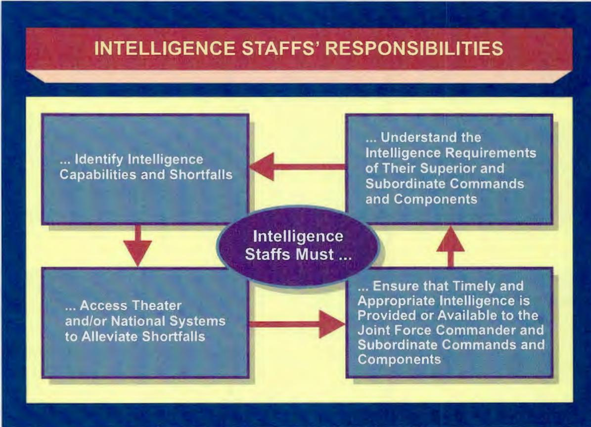  
Figure I-1. Intelligence Staffs' Responsibilities

# 2. Intelligence Challenges

a. Today's security environment presents increasingly difficult intelligence challenges. Over the past century, the predominant threat to the US was understood to be in the form of a military attack from a belligerent nation-state. US dominance in conventional warfare has given prospective adversaries, particularly non-state actors and their state sponsors, strong motivation to adopt asymmetric methods to counter our advantages. Some adversaries seek to develop or acquire capabilities, which have the potential to produce catastrophic results. Small groups or individuals can harness chemical, biological, or even crude radiological or nuclear devices to cause extensive damage and harm. Similarly, they can attack via cyberspace, online systems to disrupt commercial and daily life, cause economic damage, compromise sensitive and/or technical information, and interrupt critical services such as power and information networks. Although much emphasis has been placed on irregular warfare and chemical, biological, radiological, nuclear, and high-yield explosives (CBRNE) attacks, the IC cannot afford to disregard the prospect of regional conflicts with nation-states. Some regional powers are capable of challenging US security interests in geographically diverse areas. The global availability of new technology provides regional powers with the means to rapidly develop new military capabilities without the traditional warning time associated with normal buildup indicators. The inherent deniability of dual-use technologies, particularly in the chemical and biological industries, makes future technical assessments and estimates even more difficult. Furthermore, intelligence support to military operations will be affected by non-threat-related environmental factors such as resource limitations and the ability of adversaries to deny effective collection. To meet these formidable challenges, the intelligence process must be sufficiently agile and intelligence organizations prepared and ready to respond to myriad anticipated and unanticipated requirements in a wide variety of situations across the full range of military operations. At the same time, the quality of the intelligence product remains of paramount importance and must be sufficiently detailed and timely to satisfy the commander's decision-making needs.

b. Today's information environment offers unparalleled technological opportunities for meeting these challenges by dramatically increasing the timeliness of relevant information and by virtually integrating operations and intelligence. Advances in data processing, such as artificial intelligence, knowledge bases, and iterative search tools, have created a new paradigm in which the timelines of intelligence operations and the intelligence process have been greatly compressed. Likewise, the traditional delineations among the various types of intelligence operations have been blurred. Exploitation and dissemination now occur nearly simultaneously as multimedia products resident in knowledge bases are automatically updated with new information as it is collected and processed. Dynamic iterative search tools, virtual collaborative work environments, and a common operational picture (COP) enable intelligence personnel to nearly simultaneously exploit, analyze, produce, and disseminate relevant intelligence. Secure digital communication links and automated exploitation tools now make it possible to immediately process collected data and disseminate the resulting information to support the commander's decision-making needs and provide the timely feedback required to support the dynamic management of inteligence collection assets. Likewise, direct "sensor-to-shooter”connectivity dramatically increases the timeliness and precision of information required to successfully engage adversary timesensitive targets.

We must develop the ability to gather and maintain an unprecedented level of situational awareness-not only without being overwhelmed by it, but using it to develop and evaluate coherent long-range strategies."

Admiral Michael Mullen, US Navy Chairman of the Joint Chiefs of Staff, 2008

# 3. Intelligence Support to Military Operations

Intelligence plays a critical role across the range of military operations. Commanders use intelligence to anticipate the battle, visualize and understand the full spectrum of the operational environment, and influence the outcome of operations.

Intelligence enables commanders at all levels to focus their combat power and to provide full-dimensional force protection across the range of military operations. Figure I-2 depicts the primary support functions of joint intelligence.

a. In war, intelligence focuses on enemy military capabilities, centers of gravity (COGs), and potential courses of action (COAs) to provide operational and tactical commanders the information they need to plan and conduct operations. The nature of modern warfare requires intelligence to consider all relevant aspects of the operational environment. Today's operational environment requires consideration of more than military factors and the J-2 must be flexible in its ability to integrate nonmilitary considerations into its analysis. Although not all-inclusive, nonmilitary aspects can include political, economic, social, information, and infrastructure considerations.

operations.

# PRIMARY JOINT INTELLIGENCE SUPPORT FUNCTIONS

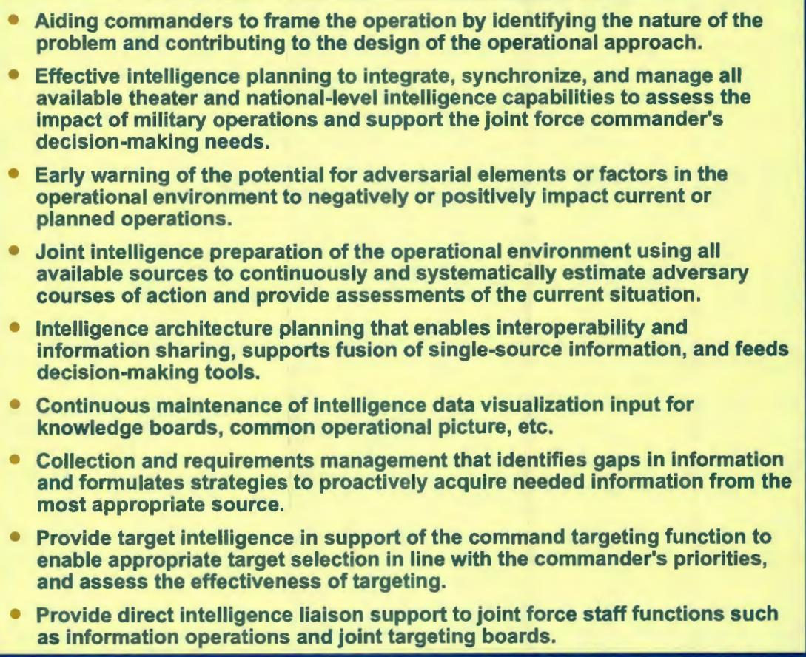  
Figure I-2. Primary Joint Intelligence Support Functions

b. The J-2 must modify and tailor intelligence support to meet the unique challenges presented in each operation. In addition, the nature and intensity of a potential threat can change suddenly and dramatically. For example, a peacekeeping operation may abruptly transition to a peace enforcement operation should any of the belligerents fail to honor the terms of a truce. Therefore, intelligence resources at every echelon should be structured to provide support that is proactive, aggressive, predictive, and flexible.

c. Across the range of military operations, intelligence provides threat assessments that are crucial to force protection and homeland defense (HD). The timely horizontal integration and sharing of intelligence and appropriate law enforcement information among CCMDs, interagency members, and multinational partners is vital to this effort. To achieve such an end state, the DOD works with the Department of Homeland Security (DHS), the Department of the Treasury, and the Department of Justice (DOJ) to arrive at a single coherent security policy and architecture that includes personnel security policies and practices and supporting information technologies. Of particular importance to force protection is the timely sharing of counterintelligence (CI), key leader engagement information, law enforcement information, and other actionable intelligence regarding threats from terrorism, weapons of mass destruction (WMD), information operations (IO), and cyberspace.

(1) CI support is crucial to protecting US forces and combating terrorism, and must be fully integrated into operation planning and execution. The DOD CI program has five separate but interelated functions: investigations, collection, operations, analysis and production, and functional services. All five functions will be incorporated into CI planning and support activities. CI activities are conducted to detect, identify, assess, exploit, and counter or neutralize the threat posed by foreign intelligence entities, or by individuals engaged in espionage, sabotage, subversion, or terrorism. An effective CI program uses a multidisciplined approach that relies on the timely fusion of information from law enforcement, CI, and other intelligence sources. The Defense Counterintelligence and Human Intelligence Center (DCHC) and CI elements from the Services and DOD agencies participate in this multidisciplined effort and facilitate information sharing among CCMDs, interagency partners, and law enforcement organizations.

Basic CI policy is contained in Department of Defense Directive (DODD) O-5240.02, Counterintelligence. Additional information on CI support to operations can be found in JP 2-01.2, Counterintelligence and Human Intelligence Support to Joint Operations.

(2) Intelligence is a critical enabler of our efforts to protect the force from WMD and to support counterproliferation and nonproliferation efforts. At the strategic level, intelligence facilitates nonproliferation activities and the development of effective counterproliferation plans by providing intelligence of activities between suppliers of WMD (and their associated materials, technology, and expertise necessary to create and sustain a WMD program) and states and non-state actors attempting to acquire WMD and by providing assessments of adversary WMD capabilities. Likewise, at the operational level, commanders require timely all-source, actionable intelligence to take decisive actions against WMD threats. Intelligence provides warning of WMD attacks and is vital to the identification, tracking, and interdiction of proliferation attempts. Locating WMD and/or toxic industrial materials (TIMs) (chemical, biological, or radiological) in the area of concern are critical aspects since they can create an environment requiring extraordinary protection and produce long-term health hazards with massive environmental damage.

Additional information on intelligence support to combating WMD and operations in chemical, biological, radiological, and nuclear (CBRN) environments can be found in JP 3- 40, Combating Weapons of Mass Destruction, and JP 3-11, Operations in Chemical, Biological, Radiological, and Nuclear (CBRN) Environments.

(3) Rapid and continuing advances in information technology (IT) present US forces, United States Government (USG) departments and agencies, partner nations, and host nations with significant opportunities and vulnerabilities relevant to full dimensional protection. IO has become increasingly important to protect US and multinational force decision makers and decision-making processes with a heavy reliance on IT. A growing percentage of inteligence manpower, technical resources, products, and efforts are dedicated to supporting information operations intelligence integration (IOIl) activities. Successful IOlI involves multiple disciplines and analytic methods to identify vulnerabilities to, determine effects of, characterize, forecast, and assess the threats posed by the information environment to operational forces.

For more information, see DODD 3600.01, Information Operations.

(4) Operations in cyberspace have taken on an increasing role by the US military and potential adversaries, creating additional vulnerabilities and opportunities. The world has become dependent upon cyberspace to facilitate commerce and for the ability to exchange information. Access to cyberspace is a virtual necessity for the majority of the world today. Intelligence is critical to providing commanders and planners an understanding of the threats to US operations from adversary use of cyberspace.

# INTELLIGENCE SUPPORT TO OPERATION ENDURING FREEDOM

On 11 September 2001, members of Osama Bin Laden's al Qaida organization launched the most devastating, synchronized terrorist attack on US soil, resulting in the loss of several thousand lives. In response to this attack, Operation ENDURING FREEDOM was launched to track down and neutralize the terrorist leaders and organizations responsible for the attack. ENDURING FREEDOM provides an excellent example of an operation that spans the full range of military operations and demonstrates the need for precise, timely, and accurate information and intelligence. Specifically, Operation ENDURING FREEDOM demonstrates the importance of:

A rational global allocation of high-demand national intelligence, surveillance, and reconnaissance (ISR) assets based on valid intelligence collection requirements;   
A theater IsR concept of operations based on a coherent collection strategy that fully integrates and optimizes the use of all assigned, multinational, allied, commercial, and requested national IsR assets; A persistent or near-continuous surveillance capability of the area of interest as opposed to periodic reconnaissance;   
A dynamic intelligence process that delivers reliable information simultaneously to commanders (for time-sensitive decision making) and to intelligence analysts (for multisource intelligence production); Thorough planning for the deployment, employment, communications architecture, and concept of operations for air-delivered and individually emplaced unattended ground sensors;   
Sufficient processing, exploitation, and dissemination resources to handle increased volumes of collected data;   
Adequate planning for intelligence reachback and crisis intelligence federation;   
Incorporation of medical intelligence from the National Center for Medical Intelligence into al-source intelligence;   
Sufficient numbers of chemical, biological, radiological, nuclear, and high-yield explosive experts/analysts along with specialized collection, transport, and exploitation teams;   
Sufficient numbers of in-theater human intelligence and counterintelligence personnel, area specialists, and linguists;   
Reachback and distributed operations in ISR processing, exploitation, and command and control; and   
An understanding of the operational environment that includes culture, demographics, the adversary's will, virtual centers of gravity, and other factors that drive the adversary's operations.

Various Sources

# CHAPTER II JOINT AND NATIONAL INTELLIGENCE ORGANIzATIONS, RESPONSIBILITIES, AND PROCEDURES

"The importance ofintegrated, all-source analysis cannot be overstated. Withoutit, it is not possible to 'connect the dots.'No one component holds al the relevant infomation."

The 9/11 Commission Report

# 1. Overview

JFCs exercise control over an impressive array of assigned, allocated, and attached intelligence collection and analytic capabilities. Nevertheless, these alone will not be capable of satisfying all the joint force's intelligence requirements. The joint force J-2 will have to rely on both theater and national intelligence organizations for support in order to provide the JFC with the most accurate intelligence possible. The resources of the National Joint Operations and Intelligence Center (NJOIC), CCMD JIOCs, Defense Intelligence Agency (DIA) forward elements (DFEs), representatives from intelligence combat support agencies, and national intelligence support teams (NISTs) provide the means to integrate national intelligence capabilities into a comprehensive intelligence effort designed to support the joint force. The J-2 must understand the organization, procedures, production responsibilities, and expertise resident in the various multinational and national intelligence agencies in order to exploit their capabilities efficiently. This is increasingly important as new technology facilitates collaborative analysis and production and blurs the traditional distinction between joint force and national-level intelligence.

# SECTION A. JOINT INTELLIGENCE

# 2. Introduction

Joint intelligence organizations are directly responsible for providing the CCMD and subordinate joint force with a common, coordinated intelligence picture by fusing national and theater intelligence, law enforcement, and CI information into all-source assessments and estimates. Joint intelligence activities focus on determining the joint force's intelligence needs based on the mission and commander's guidance; prioritizing intelligence requirements; developing an optimal collection plan and strategy; identifying collection or production shortfalls that may require resource augmentation, intelligence federation, or direct national-level analytic/collection support; and then evaluating satisfaction of needs and requirements and adjusting intelligence services and support accordingly.

# 3. Combatant Command Intelligence Organizations and Responsibilities

a. Combatant Command J-2. The CCMD J-2 assists the commander and staff in developing strategy; planning major operations and campaigns; coordinating the intelligence structure and architecture; recommending appropriate command relationships for intelligence, surveillance, and reconnaissance (IsR) assets; and supervising the production and dissemination of appropriate intelligence products. Additionally, the J-2 is responsible for determining the requirements and direction needed to enable unity of the intelligence effort in support of the commander's objectives. The J-2 provides higher echelons, up to and including the NJOIC, and subordinate commands with a common, coordinated, all-source intelligence picture in the form that the primary user of the inforation requires and at the point in time that it is neede.Te J-accomplishes his employing joint force intelligence resources and identifying and integrating intelligence from various sources, including senior and subordinate commands, the IC, international partners, other government departments and agencies, law enforcement, and nongovernmental organizations (NGOs). Specifically, the CCMD J-2 should:

(1) Plan and coordinate the overall joint intelligence structure and support mechanisms for the combatant commander (CCDR) and staff, and the subordinate component commanders and joint task forces (JTFs). Establish an intelligence systems architecture that supports intelligence production and effective dissemination throughout the command, to include tactical levels, allies, and multinational members.

(2) Usually exercise staff supervision over the JIOC.

(3) Determine and recommend prioritized intelligence needs based on mission analysis and commander's planning guidance, specifi cally priority intelligence requirements (PIRs) (focusing on the adversary and the operational environment to drive collection and production requirements [PRs]) to support the commander's decision making.

(4) Develop and manage an optimal collection plan that fully supports, and is completely synchronized with, current and planned joint operations.

(5) Identify available intelligence and information resources, match those resources against requirements, and identify potential analytic or collection resource shortfalls.

(6) Request, as required, additional collection resources and analysis and production support from national intelligence organizations.

(7) If applicable, assume modernized integrated database (MIDB) responsible production authority in crisis/wartime for the specified area of responsibility (AOR) and properly delegate responsibilities to federated producers. In conjunction with DIA, produce orders of battle (OBs) in electronic databases.

(8) Coordinate the intelligence effort of subordinate commands.

(9) Assist the operations directorate of a joint staff (J-3) and plans directorate of a joint staff (J-5) in development of mission objectives and determine the availability, quality, and quantity of intelligence assessments, knowledge, and information to support the CCDR's decisions, guidance, and intent relative to the joint mission.

(10) Provide target intelligence for plans, ensuring the DOD IC, national IC, federated relationships, component intelligence directorates, and partner nations are leveraged to support target intelligence production.

(11) Manage no-strike lists for each country in the CCMD AOR.

b. Combatant Command Joint Intelligence Operations Center. Each CCMD; United States Cyber Command (USCYBERCOM), a subunified command under United States Strategic Command (USSTRATCOM); and the United States Forces Korea (USFK), a subunified command under United States Pacific Command (USPACOM), operate JIOCs to interlink operations, planning, and all-source intelligence capabilities in support of the command mission. The JIOC is the focal point for the CCMD's intelligence planning (IP), collection management, analysis, and production effort, and is organized in a manner best suited to satisfy the CCDR's intelligence requirements. The CCMD JIOC supports joint operation planning and conducts intelligence operations in support of the commander and staff, subordinate component commands, and JTFs. The JIOC integrates all DOD intelligence from external defense and national intelligence organizations, multinational/partner nations, NGOs, other government department and agencies, and law enforcement to ensure that accurate, timely, and complete intelligence is available to positively affect CCMD operations. The CCMD JIOC maintains visibility on all intelligence collection resources available to the command, aids the CCDR and staff in determining intelligence gaps and shortfalls in intelligence collection capability, and recommends solutions to mitigate them. The JIOC also seeks to ensure timely support by submitting requests to IC production centers through the national agency representatives in direct support to the command.

(1) Organization. A JIOC is organized in accordance with (IAW) the CCDR's prerogatives as specified in the command's intelligence tactics, techniques, and procedures (TTP) or standard operating procedures. A notional CCMD JIOC structure is shown in Figure I-1. Normally, a JIOC responds to crisis situations by shifting its focus and assets, rather than by altering its organizational structure. Although there is no "'standard" JIOC organizational structure, and each JIOC will vary depending on CCMD requirements, JIOCs are organized around a set of key principles and functions. These include:

(a) Integrate intelligence with traditional operations and plans capabilities. (b) Institutionalize and strengthen IP. (c) Improve Reserve Component integration. (d) More closely align partner nations. (e) Improve intelligence mission/collection management. (f) Expand red teaming/alternative analysis capabilities. (g) Improve all-source analysis and multidiscipline intelligence. (h) Establish a horizontal integration/collaborative $\boldsymbol { \Pi }$ enterprise in a netcentric environment. (i) Improve training, education, and readiness.

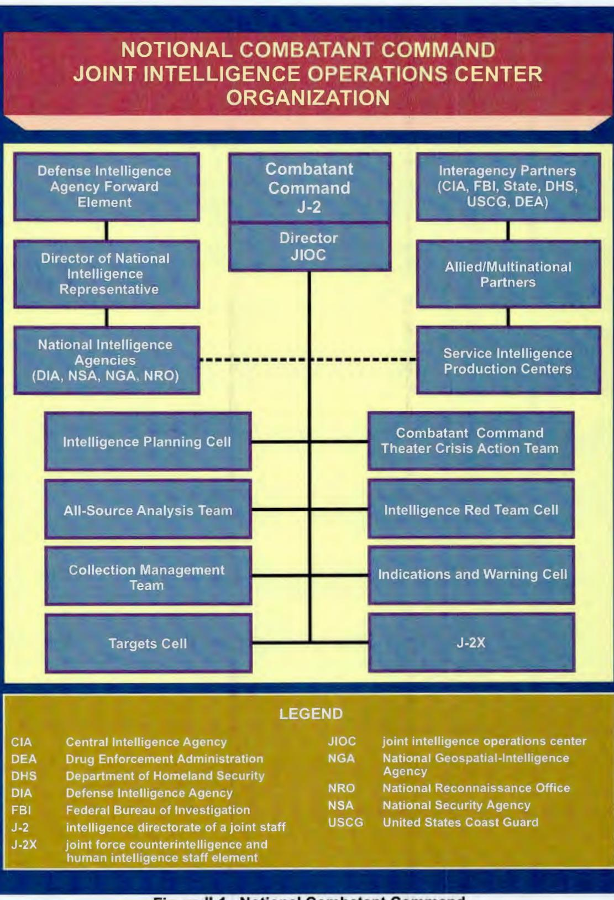  
Figure Il-1. Notional Combatant Command Joint Intelligence Operations Center Organization

(i) Integrate national inteligence and combat support agency (CSA) capabilities.

(2) Concept of Operations (CONOPS). CCMD JIOCs use a task-oriented approach similar to joint interagency task forces, utilizing personnel assigned to the command, military and civilian personnel detailed to the command from other commands and Services, and DOD agency personnel in direct support of the command mission. The defense attaché office and Service CI elements are in general support and are expected to respond to JIOC requirements consistent with national priorities.

(a) JIOCs conduct an intelligence mission operations function to plan intelligence operations to fll gaps in information and produce all-source intelligence. The JIOC coordinates with CCMD and subordinate JFC and Service component intelligence staff directorates, as well as external defense and national intelligence organizations, to accomplish this mission. The JIOC leverages the efforts of the IC and interagency partners to achieve an integrated, all-source intelligence mission operations capability. The JIOC is organized in a manner to facilitate fusion of all information and intelligence received from available sources. The JIOC coordinates with all mission partners, including CCMD and Service component staffs, the DFE, and the CCMD's Director of National Intelligence (DNI) representative to actively task and integrate intelligence from all sources and levels to satisfy command PIRs.

(b) JIOCs plan for the transition from peacetime to wartime. IP for rapid response to possible crises occurs well ahead of time as part of a command's overall joint operation planning process (JOPP). The planning effort includes determining the personnel, equipment, and intelligence architecture essential for generic support to deployed forces.

(c) JIOCs conduct analysis-driven collection management. Analysts and collection managers work in tandem to design collection plans to fill known information gaps. To coordinate with external defense and national intelligence organizations, the JIOC analysis/collection team, via the IP cell, engages joint operation planners at the CCMD, component commands, and national agencies through the DFE, the CCMD DNI representative, and the CCMD CSA representatives to task appropriate intelligence capabilities to satisfy CCMD requirements. The JIOC executes collection management authority (CMA) on behalf of the J-2 and exercises collection requirements management (CRM) for certain assets and all national resources. Through coordination with the J-3 via fragmentary orders and operation orders (OPORDs), the JIOC delegates or identifies collection management authorities for subordinate components and JTFs.

(d) A JIOC red team, composed of experienced personnel with knowledge of known and potential adversaries, reviews all intelligence assessments and operation plan (OPLAN) assumptions in order to provide alternative analysis and reduce the potential for operational surprises. Red team work involves a comprehensive multi-perspective approach to assessing an adversary's or potential adversary's points of view, intentions, COAs, and responses, and then devising alternatives for operational planning.

(e) The JIOC establishes working relationships and TTP for exchanging intelligence with all potential intelligence contributors, including national intelligence agencies, Service intelligence production centers, Service and functional component intelligence elements, and joint reserve intelligence centers. If applicable, the JIOC establishes and maintains ties and connectivity with interagency partners such as the Central Intelligence Agency (CIA), Federal Bureau of Investigation (FBI), Department of State (DOS) and country teams, DHS and United States Coast Guard (USCG), and the Drug Enforcement Administration (DEA). The JIOC also establishes intelligence exchange relationships with allied and coalition partners to ascertain their potential and willingness to contribute to a combined intelligence effort.

(3) Responsibilities. The primary responsibility of the JIOC is to integrate all DOD intelligence functions and disciplines, and facilitate access to all sources of intelligence in a prescribed timeline and appropriate format to positively affect CCMD missions and operations. Other responsibilities include, but are not limited to:

(a) Coordinating with the Joint Staff J-2 and DOD IC agencies to address PIRs, essential elements of information (EEIs), and collection requirements with specific tasks to support joint operation planning, execution, and assessment.

(b) Determining gaps in intelligence, information, and capabilities.

(c) Developing and maintaining an integrated intelligence architecture that upports planning, operations, and targeting.

(d) Maintaining and coordinating the CCMD intelligence collection plan in coordination with components and other IC agencies.

(e) Conducting IP in support of CCMD plans, in coordination with external intelligence organizations via the Joint Staff J-2, as determined by the CCMD J-2.

(f) Ensuring target intelligence and battle damage assessment (BDA) is being produced by the appropriate echelon within the CCMD organizational structure, and, if it cannot be produced with assigned assets, coordinate target intelligence production requests and BDA requirements with the appropriate DOD commands, Services, and agencies.

(g) Providing continuous indications and warning (I&W) intelligence assessments, and maintaining awareness and providing amplification as required of intelligence-derived threat warning events and actions.

(h) Directing the joint intelligence preparation of the operational environment (JIPOE) effort, integrating analyses with all products produced by subordinate commands and other organizations, and ensuring that the JIPOE process encompasses a systematic analysis of all relevant aspects of the operational environment with tailored products continuously developed and updated to support the planning effort.

(i) Providing intelligence support to, and augmenting, the intelligence infrastructure of, subordinate joint forces.

# 4. Subordinate Joint Force Intelligence Organizations and Responsibiities

a. The size and organizational structure of a subordinate joint force's intelligence element is determined by the JFC based on the situation, mission, and available intelligence resources. The roles and functions of a JFC's J-2 are varied based upon the scope of the JFC's mission and required support relationships. Generally, the JFC's J-2 will be required to conduct the following activities:

(1) Plan and direct the overall intelligence effort on behalf of the JFC. The J-2 develops and recommends PIRs based on the JFC's guidance, identifies shortfalls in intelligence capabilities and submits requests for additional augmentation, and ensures the intelligence needs of the JFC and joint force staff are satisfied in a timely manner. Additionally, at the discretion of the JFC, the J-2 provides administrative support to augmentation forces and the JISE, or JFC's JIOC, including personnel, information, and physical security.

(2) Provide situation awareness to the JTF commander, battle staff, and other staff elements, including components, if applicable. Integrate all-source intelligence and relevant information into the JTF-specific COP.

(3) Manage the JTF collection plan using all assigned ISR capabilities and ISR assets in direct support. Request additional intelligence capability from the CCMD JIOC.

(4) Request production of JTF JIPOE products by the CCMD JIOC. Integrate JIPOE products into JTF intelligence assessments.

(5) Provide continuous threat warning to the JTF commander, batle staff, component units, and multinational forces, as appropriate.

(6) Provide targeting expertise, target materials and products, BDA, and intelligence inputs for combat assessment (CA) as necessary.

(7) Conduct liaison and provide intelligence products and support to the following JTF entities, as applicable:

(a) The joint targeting coordination board;   
(b) The joint collection management board (JCMB);   
(c) The IO cell;   
(d) The joint personnel recovery team;   
(e) The civil-military operations cell;   
(f) The joint planning group (JPG);   
(g) The geospatial intelligence (GEOINT) cell;

(h) The red team cell; and (i) The JIPOE coordination cell.

Appendix B, "Joint Force Intelligence Directorate Quick Reaction Checklist," contains a detailed list and generic descriptions of joint force J-2 tasks and responsibilities.

b. In order to accomplish the assigned mission, the joint force J-2 uses a combination of the following elements:

(1) The commander, at the recommendation of the J-2, may choose to form a JISE. The JISE provides the JTF with tailored intelligence products and services with a continuous analytical capability. Capabilities of the JISE include OB analysis, collection management, targeting, IO analysis, an I& W watch, and a request for information (RFI) desk.

(2) Alternatively, in a particularly large or protracted campaign, the JTF commander may decide to deploy an operational-level JIOC. An operational-level JIOC incorporates the capabilities inherent in a JISE, but is generally more robust. The JIOC incorporates liaison elements from the theater JIOC as well as national intelligence agencies and includes IP and operations functions not present in the JISE. A notional JISE and JIOC organization is provided in Figure II-2.

(3) Joint Force J-2 CI and Human Intelligence (HUMINT) Staff Element (J2X). In coordination with the theater J-2, the JFC normally establishes a J-2X. This concept is designed to integrate HUMINT and CI by combining the human intelligence operations cell (HOC), the task force CI coordinating authority (TFCICA), a HUMINT analysis cell, and a CI analysis cell, all of which comprise the J-2X. The J-2X should also include an operational support cell staffed to operate continuously. The J-2X may also include an operational support element to provide services of common concern to the HOC and TFCICA, such as report and source administration, linguistic support, and polygraph support. A J-2X is the HUMINT and CI focal point for the JFC. As the JFC's tasking authority for HUMINT and CI collection, the J-2X is responsible for the management, coordination, and deconfliction of HUMINT and CI collection within the operational area. The J-2X monitors and supports the activities of the joint document exploitation centers (JDECs), maintains the command source registry, deconflicts source matters, and performs liaison functions with external organizations. It is imperative that a secure communications/systems architecture be established for the J-2X that is compatible with component HUMINT elements and other intelligence organizations. The J-2X should be located in a sensitive compartmented information facility (SCIF).

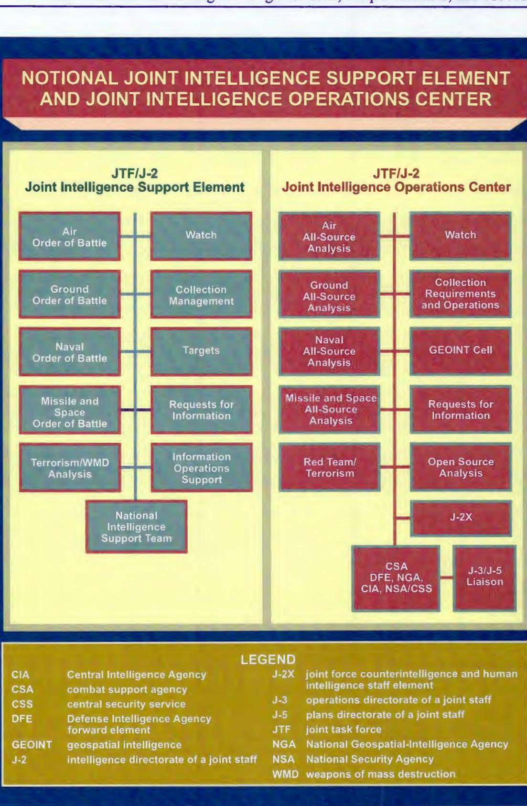  
Figure ll-2. Notional Joint Intelligence Support Element and Joint Intelligence Operations Center

Additional informationon theJ-2Xorganization and responsibiliies anbe found inJ2 01.2, Counterintelligence and Human Intelligence Support to Joint Operations.

(4) Joint Geospatial Intelligence Cell. The JFC may create a GEOINT cell and designate a GEOINT officer to manage the framework for accessing GEOINT data to enhance the joint force's COP for situational awareness and decision making. GEOINT support includes imagery, imagery intelligence (IMINT), and geospatial information.

For more detailed guidance, see JP 2-03, Geospatial Intelligence Support to Joint Operations.

(5) NIST. The JFC, at the recommendation of the J-2, may request that the national IC deploy a NIST to support a JISE or operational-level JIOC. For more information on NIST composition and request procedures, see paragraph 8e, "National Intelligence Support Teams."

c. The JTF J-2 should assist subordinate component command directors of intelligence in achieving their objectives through seamless integration with the CCMD J-2, JIOC, and JTF J-2 processes. Component command directors of intelligence have the capability, as required, either organically or via Service reachback, to provide support to the joint force through the following functions:

(1) Interface with CCMD J-2-directed intelligence systems architecture and targeting automation.

(2) Integrate into CCMD J-2-directed ISR strategy.

(3) Notify CCMD and/or JTF J-2 regarding component commands' commander's critical information requirements (CCIRs), PIRs, and EEIs.

(4) Support CCMD J-2 and/or JTF J-2 I&W processes.

(5) Develop RFIs to fil intelligence gaps, and process those RFIs through the CCMD J-2-directed RFI process.

(6) Participate in the CCMD J-2 or JTF J-2 JIPOE process.

(7) Develop collection for the CCMD J-2 or JTF J-2 collection management board.

(8) Integrate in CCMD J-2 geospatial information and services (GI&S) process and architecture.

(9) Participate in CCMD J-2 document/material exploitation and interrogation processes.

(10) Produce target intelligence products as required and formulate target nomination lists that support their component commander's objectives.

(11) Integrate into and support CMD J-2 OB and electronic OB processes. (12) Provide battle damage indications and other directed information to support CCMD J-2 BDA processes. (13) Support CCMD J-2 BDA or federated BDA process as directed. (14) Provide mensurated coordinates to support subordinate forces per CCMD J-2 guidance and obtain CCMD J-2 point mensurated certification as required. (15) Provide intellgence support to, and augment the intelligence infrastructure of, subordinate joint forces. (16) Maintain awareness and provide amplification as required of intelligencederived threat warning events and actions.

# SECTION B. NATIONAL INTELLIGENCE

# 5. Introduction

The IC is defined in the National Security Act of 1947, amended by the Intelligence Reform and Terrorism Prevention Act (IRTPA) of 2004, and guided by Executive Order (EO) 12333, as updated in 2008. It refers in the aggregate to those Executive Branch agencies and organizations that are funded in the National Intelligence Program (NIP). The IC consists of 17 member organizations (see Figure I-3).

a. IC Governance. The IRTPA established the Office of the Director of National Intelligence (ODNI) with authority over IC budgeting, appointment of IC agency heads, IC personnel policies, tasking for collection and analysis, foreign liaison, and protection of intelligence sources and methods.

b. National intelligence organizations conduct extensive collection, processing, analysis, and dissemination activities. These intelligence organizations employ specialized resources and dedicated personnel to gain information about potential adversaries, events, and other worldwide intelligence requirements. The national intelligence organizations routinely provide support to the JFC while continuing to support national decision makers. However, the focus of these national organizations is not evenly split among intelligence customers and varies according to the situation and competing requirements. Planning ahead for integration of national intelligence capabilities, intelligence product reporting, and database access is critical for a joint force during crises or contingencies. The joint force J-2 then would be in a position to take advantage of the extensive capabilities provided by these organizations. For more information on IP and CSAs, see Chapter IV, "Intelligence Support to Joint Operation Planning."

c. Successful national support to JFCs depends upon efficient and effective cooperation and interoperability both vertically (among national and subordinate echelons) and horizontally (among national organizations). Each agency is assigned clearly defined functions and areas of concern to minimize confusion over functional responsibilities and to avoid duplication of effort.

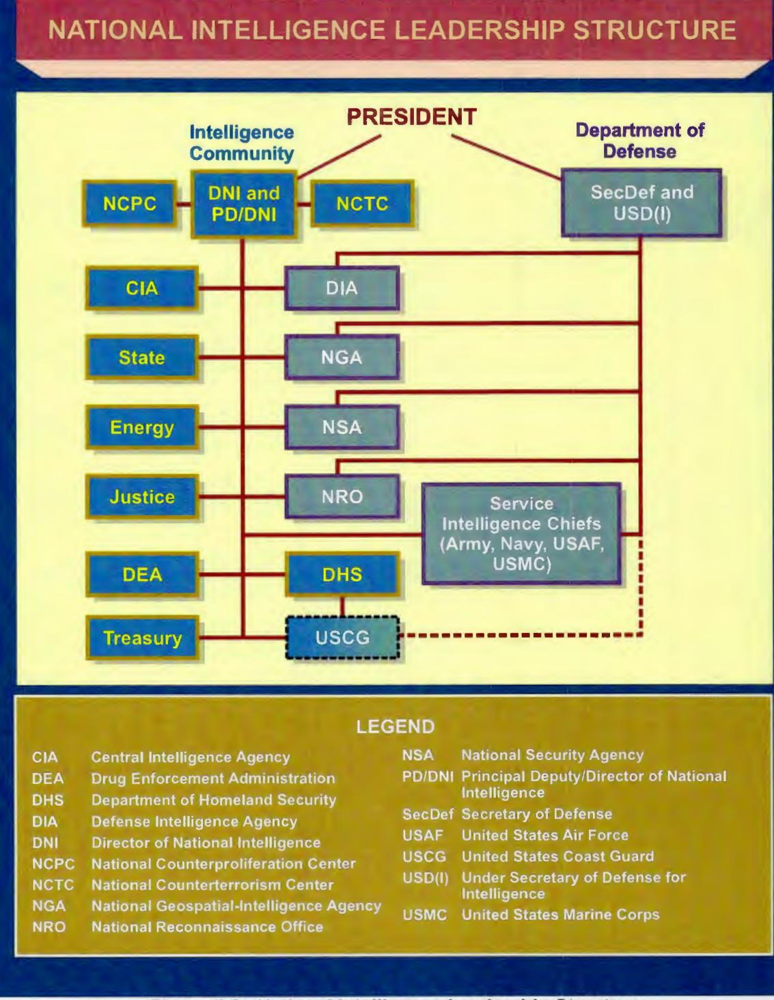  
Figure Il-3. National Intelligence Leadership Structure

# 6. Department of Defense Inteligence and Combat Support Agency Organizations and Responsibilities

a. The Under Secretary of Defense for Intelligence. The USD(I) serves as the principal advisor to the Secretary of Defense (SecDef) and Deputy Secretary of Defense regarding intelligence, CI, security, sensitive activities, and other intelligence-related matters. The USD(I) also exercises SecDef's authority, direction, and control over DOD agencies and field activities that are defense intelligence, CI, or security components and exercises planning, policy, and strategic oversight over all DOD intelligence, CI, and security policy, plans, and programs.

b. The National Joint Operations and Intelligence Center. The NJOIC is an integrated Joint Staff J-2/J-3/J-5 element that monitors the global situation on a continual basis and provides the Chairman of the Joint Chiefs of Staff (CJCS), and SecDef a DOD planning and crisis response capability. The intelligence component of the NJOIC maintains an alert center that consists of the Deputy Director for Intelligence; regional desks corresponding to each geographic CCMD; and representatives from each Service intelligence staff element, the intelligence combat support agencies, and the CIA. The Alert Center is a continuously manned, all-source, multidiscipline intelligence center providing defense intelligence situational awareness, I& W, and crisis management intelligence support to the President of the United States, SecDef, Joint Chiefs of Staff(JCS), CCMDs, deployed forces, Services, and other intelligence consumers during peace, crisis and war. It provides planning, management, and infrastructure for intelligence working groups (TWGs) and intelligence task forces (ITFs) that provide direct intelligence support during major conflicts. To provide intelligence analytical depth, DIA maintains a 24/7 Direct Support Element (DSE) at the NJOIC, tailored to the current global situation and operations tempo. The NJOIC coordinates the intelligence response to immediate crises and contingencies.

(1) If a developing situation escalates into a crisis, the relevant Alert Center regional desk officer is augmented with analytical support; an intelligence cell, IWG, or ITF is formed. Thus, support may range from a few additional analysts in an intelligence cell to a continuously staffed IWG or ITF augmented as required.

(a) Intelligence Cell or Focus Group. A cell or focus group is established upon indications that a threat to US interests or personnel may exist, or when other potential crisis situations arise. The cell or group is formed to respond to the requirements levied by the NJOIC or CCMD JIOCs. The cell is responsible for monitoring and providing a continuous assessment of the developing situation. An intelligence cell is generally formed with personnel from the Joint Staff J-2, and the size of the cell or unit is determined by the crisis. While the cell or focus group is not continually manned, extended duty hours or 24– hour operations and augmentation from DIA may be warranted.

(b) Intelligence Working Group. As a crisis develops, an IWG may be established within the NJOIC Alert Center to provide focused coverage of crisis requirements. Specifically, the IWG is formed at the lowest level of response to a particular crisis situation; provides all-source intelligence on the crisis situation to the OSD, CJCS, Joint Staff, Services, CCMDs, and deployed operational forces; and is normally manned from J-2 and DIA resources with reserve augmentation. The IWG is continually manned if warranted by the level of crisis.

(c) Intelligence Task Force. If a crisis situation continues to escalate, or SecDef orders a significant military response to the crisis, the Joint Staff J-2 may decide to form an ITF to provide increased capabilities for focused all-source intelligence support. The size of the ITF depends on the severity, complexity, and duration of the crisis and may be formed using an IWG as its core. The DIA, National Security Agency (NSA), National Geospatial-Intelligence Agency (NGA), CIA, the Services, and other major government organizations generally augment an existing IWG to form an ITF. The ITF focuses intelligence resources, answers RFIs, expedites dissemination of intelligence, and provides rapid responses to special tasking. Specifically, the ITF:

$\underline { { 1 . } }$ Is convened by the Joint Staff J-2 whenever a crisis action team (CAT) is convened by the J-3. (An ITF may be convened by the J-2 without a CAT being convened if it is required to support the NJOIC.)

2. Provides time-critical responses to requirements from the OSD, CJCS, Staff, Services, CCMDs, and deployed operational forces.

3. Provides timely warning to the OSD, CJCS, Joint Staff, Services, and CCMDs of hostilities or potential threats to US interests in the ITF's area of concern.

4. Develops and tailors an all-source intelligence collection strategy plan for the DOD response to the crisis.

$\underline { { 5 } } .$ Responds to requirements from other USG agencies responsible for crisis response activities.

$\underline { { 6 . } }$ Responds to requirements of the United Nations (UN) and/or foreign governments consistent with DNI guidelines and in coordination with the DIA Foreign Disclosure Office.

$\underline { { 7 } } .$ Coordinates tasking of other USG departments and agencies in support of the OSD, CJCS, CCDRs, subordinate JFCs, and other consumers.

c. Defense Intelligence Agency. DIA is an intelligence CSA under SecDef and is also a member of the national IC. The Director, DIA, reports to SecDef through the CJCS. DIA's mission is to satisfy the military and military-related intelligence requirements of SecDef and the Deputy Secretary of Defense, the CJCS, and the DNI, and provide the military intelligence (Ml) contribution to national foreign intelligence and CI. The Director, DIA, recommends to SecDef, via the CJCS, COAs to meet CCMD intelligence support requirements. DIA also leads efforts to align ISR activities and links and synchronizes national, defense, and military intelligence. DIA also provides intelligence analytical and operational support in areas such as CI, counterterrorism, counterdrug operations, computer network operations (CNO), personnel recovery, counterproliferation of WMD and associated delivery means, UN peacekeeping and multinational support, measurement and signature intelligence (MASINT), noncombatant evacuation efforts, I& W, targeting, BDA, current intelligence, collection management, intelligence architecture and systems support, document and media exploitation (DOMEX), and counterinsurgency support (including the forensic collection and exploitation of improvised explosive devices [IEDs] and other weapons systems derived from weapons technical intelligence [WTI). The Director, DIA, also serves as the Commander, Joint Functional Component Command for Intellgence, Surveillance, and Reconnaissance (JFCC-ISR), a functional component of USSTRATCOM. Additional functions of DIA:

(1) Intelligence, Surveillance, and Reconnaissance. USSTRATCOM is assigned the Unified Command Plan mission to plan, integrate, and coordinate ISR in support of strategic and global operations. USSTRATCOM established JFCC-ISR to optimize ISR planning and force management. JFCC-ISR recommends allocation of ISR capabilities to include DOD mobile collection assets and associated processing, exploitation, and dissemination (PED) systems to satisfy strategic/high-priority CCMD and national intelligence requirements; advocates for ISR capabilities; and provides functional support for USSTRATCOM's other missions. JFCC-ISR supports CCDRs by matching information requirements to available ISR, synchronizing national and allied ISR capabilities where appropriate, and recommending sourcing solutions through the Global Force Management (GFM) process.

(2) Collection Management. Operates as the defense intelligence collection manager. Maintains a 24/7 DIA Defense Collection Watch (DCW) and plans, in coordination with the CCMDs and the National Intelligence Coordination Center (NIC-C), employment of national and theater ISR resources to meet CCMD, DOD, and national requirements. Performs mission analysis on emerging crisis inteligence requirements and determines the appropriate office of primary responsibility to respond. Receives, validates, and prioritizes collection requirements from the CCMDs, and coordinates collection and production responsibility with appropriate agencies. Maintains global visibility of DOD ISR operations and capabilities, provides an ISR global situation awareness display, and assesses effectiveness of intelligence operations. Deconflicts competing requirements for intelligence collection and processing resources and forwards recommendations to resolve conflicts to SecDef, through the CJCS, for approval.

(3) Intelligence Planning. Leads the DOD IP process in support of the CCMDs and in conformance with adaptive planning principles. Coordinates with CCMDs, DOD intelligence agencies, and the NIC-C to synchronize planning efforts and develop national intelligence support plans (NISPs) to support the development and execution of President, SecDef, or CJCS directed CCDR plans. Assists the CCMDs in evaluating NISP intelligence task lists (ITLs).

For more information on $I P _ { i }$ see Chapter $I V ,$ "Intelligence Support to Joint Operation Planning.'

(4) Support to CCMD JIOCs and JFCs. Provides recommendations to CCMD JIOCs concerning intelligence collection and tasking, PED issues. Provides personnel and resources to support CCMD intelligence directorates and JIOCs. Provides a DFE to each CCMD JIOC to advise on collection capabilities and IP. Serves as the DOD global force manager for the defense intelligence enterprise. Prepares, equips, trains, and deploys NISTs in support of CCMD or JFC requirements.

d. National Security Agency/Central Security Service (CSS). NSA/CSS is a unified organization structured to provide the signals intelligence (SIGINT) mission of the US and ensure the protection of national security systems for all departments and agencies of the USG. NSA is an intelligence CSA under SecDef and is dual tasked as a member of the national IC under the DNI. NSA provides direct cryptologic and cyberspace support to the CCMD JIOCs through the CSS (comprised of the Service cryptologic components [SCCs]) and cyberspace support element, respectively. The Director, National Security Agency (DIRNSA):

(1) Serves concurrently as the Commander, USCYBERCOM, a subunified command under USSTRATCOM;

(2) Acts as the principal SIGINT advisor to SecDef, the DNI, and the JCS;

(3) Is designated as the national manager responsible for securing the USG's national security telecommunications and information systems; and

(4) Exercises operational control (OPCON) over the United States Cryptologic System (USCS)—the SIGINT and information assurance (IA) activities of the USG.

e. National Geospatial-Intelligence Agency. NGA is an intelligence CSA under SecDef and is dual tasked as a member of the national IC under the DNI. The Director, NGA, serves as the functional manager for GEOINT and is the principal GEOINT advisor to the DNI, SecDef, CJCS, and CCDRs. As functional manager, NGA develops strategic guidance and procedures, sets tradecraft standards, develops and enforces IT architecture and standards, and ensures coordination across intelligence disciplines and IC elements. GEOINT consists of imagery, the intelligence derived from imagery, and GI&S. GEOINT exploitation includes analysis of electro-optical, infrared, and radar imagery; full motion video; moving target indicators; geospatial information; and spectral, laser infrared, radiometric, polarimetric, spatial, and temporal data. It employs ancillary data, signature information, and fused data products. NGA conducts GEOINT analysis to combine imagery, IMINT, and geospatial information to produce tailored, actionable intelligence to support customers across a broad range of DOD and the USG. NGA provides direct support to the CCMD JIOCs and procures and disseminates commercial remotely sensed imagery for DOD and the IC.

f. National Reconnaissance Ofice (NRO). The NRO is a DOD agency and a member of the IC. The Director, NRO, reports to both the DNI and SecDef. NRO is responsible for research and development, acquisition, launch, deployment, and operation of overhead systems and related data processing facilities to collect intelligence and information to support national and departmental missions and other USG needs. NRO activities provide support to I&W, monitoring arms control agreements, access to denied areas, and the planning and execution of military operations. NRO provides direct support to the CCMD JIOCs.

g. Service Intelligence Organizations. The Chiefs of the Services provide intelligence support for DOD missions related to military systems, equipment, training, and national intelligence activities. The Services also provide support to DOD entities, including CCMDs and their components and each CCMD's JIOC.

(1) Army Intelligence. The Army Deputy Chief of Staff for Intelligence (G-2) is responsible for policy formulation, planning, programming, budgeting, management, staff supervision, evaluation, and oversight of intelligence, weather, and geospatial activities for the Department of the Army. The G-2 also exercises staff supervision over the United States Army Intelligence and Security Command (INSCOM) and 650th MI Group. INSCOM provides intelligence support to strategic and operational level commanders in the areas of GEOINT, MASINT, SIGINT, tactical and strategic HUMINT, CI, IO, and general military and scientific and technical intelligence (S&TI). INSCOM elements include the National Ground Intelligence Center (NGIC) (production of all-source intelligence), the 902nd MI Group (CID), the Army Operations Group (HUMINT), 1st IO Command (IO), and theater MI brigades (multidiscipline collection and analysis). NGIC's operational support mission also includes WTI, biometrics-enabled intelligence (BEI), and forensic-enabled intelligence (FEI) for DOD and national customers.

(2) Air Force Intelligence. The Air Force Director of Intelligence, Surveillance, and Reconnaissance (AF/A2) is responsible for intelligence policy, planning, programming, evaluation, and resource allocation. The Air Force Intelligence, Surveillance, and Reconnaissance Agency (AFISRA), is a field operating agency subordinate to AF/A2 responsible for executing AF/A2's globally integrated ISR responsibilities. AFISRA organizes, trains, equips, presents assigned forces and integrates their all-source intelligence capabilities to the Air Force, CCDRs, and the nation. AFISRA also acts as the Air Force Cryptologic Component under the NSA/CSS. Additional Air Force intelligence organizations include:

(a) The Air Force Targeting Center, which provides targeting-related ntelligence to air component forces;

(b) 688th Information Operations Wing, which provides IO-related intellgence;

(c) The Air Force Intelligence Analysis Agency (AFIAA), which supports the Air Force senior leadership;

(d) The Air Force Office of Special Investigations (AFOSI), which is responsible to the United States Air Force (USAF) Inspector General and provides a full range of CI services; and

(e) The 480th Intelligence, Surveillance, and Reconnaissance Wing, which global distributed and reachback ISR.

(3) Navy Intelligence. The Director of Naval Intelligence is the Navy's intelligence executive to the Chief of Naval Operations and his staff. As such, the Director of Naval Intelligence exercises overall authority through the Department of the Navy on matters pertaining to intelligence, cryptology, CI, and special security. The Director of Naval Intelligence manages the Navy portion of the NIP, sets naval intelligence policy, and directs naval intelligence planning and programs. The Commander, Fleet Cyber Command (FLTCYBERCOM), serves as the Navy's Service cryptologic commander. The Naval Criminal Investigative Service (NCIS) provides law enforcement and security services in the form of combating terrorism programs to the Navy and Marine Corps on a worldwide basis.

(4) Marine Corps Intelligence. The Director of Intelligence (DIRINT) is the Commandant's principal intelligence staff officer and exercises supervision over the Marine Corps Intelligence Activity (MCIA). The Marine Corps Intelligence Department is responsible for policy, plans, programming, budgets, and staff supervision of intelligence and supporting activities within the US Marine Corps. The Marine Corps Intelligence Department supports the Commandant in his role as a member of the JCS and represents the Service in joint and IC matters. The Marine Corps Intelligence Department has Service staff responsibility for GEOINT (to include advanced GEOINT), SIGINT, HUMINT, MASINT, CI, tactical exploitation of national capabilities program (TENCAP) and ensures there is a single synchronized strategy for the Marine Corps ISR Enterprise.

(5) National Guard Intelligence. While the National Guard is not a separate military service, National Guard intelligence assets can provide a dissemination and communications bridge between state/local authorities and DOD agencies. These forces can serve as a liaison between DOD and state/local agencies, provide augmentation and liaison to state and local agencies, as well as serve the needs of the DOD for local intelligence support.

# 7. National Intelligence Community Organizations and Responsibilities

a. The IRTPA created the ODNI to improve information sharing; promote a unified, strategic direction for the IC; and ensure integration of effort across the IC. ODNI is lead by the DNI. The DNI serves as the principal advisor to the President and the National Security Council (NSC) and the Homeland Security Council (HSC) for intelligence matters related to national security, and oversees and directs the implementation of the NIP. The DNI works closely with a Presidentially appointed, Senate-confirmed Principal Deputy Director of National Intelligence and with his leadership team and core mission, enablers, and oversight offices to effectively integrate foreign, military, and domestic intelligence in defense of the homeland and in support of US national security interests at home and abroad. The ODNI is comprised of several components, including the National Counterterrorism Center (NCTC), the National Counterproliferation Center, the National Counterintelligence Executive, and the National Intelligence Council.

(1) Congress also directed in the IRTPA the establishment of national mission managers under the DNI. Mission managers are the principal IC officials overseeing all aspects of national intelligence related to their respective mission areas. Mission areas are enduring problem sets involving either a regional actor or a transnational issue, such as proliferation of WMD. The mission managers are tasked with understanding the requirements of their customers and ensuring intelligence capabilities are appropriately tasked, information is processed, and analysis is performed to satisfy those requirements.

Where intelligence gaps are identified, mission managers are tasked to plan strategies to collect the data and to evaluate IC performance in fulfilling assigned tasks.

(2) The NIC-C is the DNI's central node for deconflicting US and DOD intelligence activities and enhancing collection management efforts within the IC.

b. Central Intelligence Agency. The CIA is the largest producer of all-source national security intelligence to senior US policymakers, and provides extensive political and economic intelligence to DOD senior decision makers. CIA also oversees the Open-Source Intelligence (OSINT) Center.

(1) The Director, CIA, serves as the National HUMINT Manager and coordinates, deconflicts, and evaluates clandestine HUMINT operations across the IC.

(2) The Director, CIA, is also responsible for the National Clandestine Service (NCS), directing clandestine collection (primarily HUMINT) of foreign intelligence that is not obtainable through other means. The NCS also engages in CI to protect US activities and institutions from penetration by hostile foreign organizations and individuals.

(3) The CIA Directorate of Intelligence analyzes all-source intelligence and produces finished intelligence products on key foreign intelligence issues. This information comes from a variety of sources and methods, including US personnel overseas, HUMINT reports, satellite imagery, open-source information, and other sensors.

(4) The Directorate of Science and Technology accesses, collects, and exploits information to facilitate the execution of the CIA's mission by applying innovative scientific, engineering, and technical solutions to the most critical intelligence problems.

c. Department of State. The DOS Bureau of Intelligence and Research (INR) performs intelligence analysis and produces studies on a wide range of political and economic topics essential to foreign policy determination and execution.

d. Federal Bureau of Investigation. The FBI has primary responsibility for CI and counterterrorism operations conducted in the United States. FBI CI operations overseas are coordinated with the CIA. The FBI shares law enforcement/CI information with appropriate DOD entities and CCMDs.

e. Department of the Treasury. The Department of the Treasury analyzes foreign intelligence related to US economic policy and participates with DOS in the overt collection of general foreign economic information.

f. Department of Energy (DOE). DOE analyzes foreign information relevant to US energy policies and nonproliferation issues and the national science laboratories under its authority.

g. Department of Homeland Security. The DHS Directorate for Information Analysis and Infrastructure Protection analyzes the vulnerabilities of US critical infrastructure, assesses the scope of terrorist threats to the US homeland, and provides input to the Homeland Security Advisory System. DHS is also a member of the NIC-C.

h. United States Coast Guard. The USCG, a component of DHS, operates as an armed force, a law enforcement organization, and an IC element. The USCG's Intelligence Coordination Center (ICC) and maritime intelligence fusion centers operate under the direction of the Assistant Commandant for Intelligence and Criminal Investigations and serve as the central hub for collection, fusion, analysis, and dissemination of maritime intelligence and information to Coast Guard operating units, DHS, and all members of the IC including DOD and key decision makers at the national level.

i. Drug Enforcement Administration. DEA enforces laws and regulations governing narcotics and controlled substances, chemical diversion, and traficking. It is also the lead agency overseas for counterdrug law enforcement activities and investigations. DEA makes ancillary contributions to the national IC via efforts to build legal cases against narcotics traffickers. DEA-collected and produced information is valuable in homeland security efforts due to the traditional close association between narcotics trafficking and illegal alien smuggling. This results in DEA information potentially having significant value in counterterrorism applications.

Appendix A, "National Intelligence," contains more detailed information regarding the organization, capabilities, and responsibilities of IC members.

# 8. Joint and National Intelligence Support Mechanisms

Combatant command JIOCs. The CCMD JIOC is the first stop for CCMD staff, component service commands, and subordinate joint force headquarters (HQ) intelligence requirements. For non-time-sensitive requirements, JIOCs receive RFIs from CCMD staff elements and subordinate intelligence organizations through the community on-line intelligence system for end-users and managers (COLISEUM). The RFIs are validated and researched to determine whether the information exists in either theater or national intelligence databases that are accessible to the JIOC. If the JIOC determines that the RFI asks for information that is unavailable or represents an intelligence collection gap, the JIOC RFI manager forwards it for action to the JIOC element that performs mission operations. The JIOC employs theater analysts and collection managers to conduct mission analysis on the requirement, choose the best COA for requirement satisfaction, and task theater ISR assets or request national collection agency support to obtain the information. Requests for national agency support are normally forwarded to DIA using COLISEUM. Time-sensitive collection requirements may go directly to the appropriate national intelligence agency using its on-site representative, with a follow-up request using the requested intelligence discipline's requirements management tool. Time-sensitive RFIs that require production may also go directly to the appropriate national intelligence agency with a follow-up request in COLISEUM.

a. Director of National Intelligence Representative. The DNI provides representatives to each of the CCMDs to coordinate national IC support to the command and to facilitate access to IC resources. DNI representatives also advise and assist the command regarding secondary and follow-on dissemination of originator-controlled material and HUMINT control system information.

b. Defense Intelligence Agency Forward Element. DIA maintains DFEs at each of the CCMDs, USFK, and Supreme HQ Allied Powers Europe and North Atlantic Treaty Organization (NATO) HQ. Each DFE includes a senior intelligence oficer (SIO) who serves as chief of the DFE and as the personal representative of the DIA Director, an administrative assistant, and a varying number of DIA functional intelligence specialists based on the needs of the supported command. The typical DFE includes a HUMINT support element consisting of one or more DIA HUMINT personnel, an intelligence production liaison officer (LNO), and a measurement and signature intelligence liaison officer (MASLO). Some DFEs also have IT and Joint Intelligence Task Force for Combating Terrorism (JITF-CT) representatives. The DFE, as the forward representative of DIA, enhances and expedites the exchange of information between DIA and the supported command. It provides an on-site interface between DLA and the command, advising them on the roles, missions, and capabilities of DIA while ensuring that command requirements are understood by DIA.

(1) The National Measurement and Signature Intelligence Office (NMO) LNO. NMO provides MASINT representatives to the CCMDs in the form of MASLOs. The MASLO helps expedite a broad spectrum of MASINT operational support between NMO and the supported command. For example, the MASLO provides technical assistance on MASINT capabilities available to support military operations. Additionally, MASLOs are the means for providing feedback on the commander's operational needs for integration into MASINT-related current operations and future acquisition requirements.

(2) The DSE, located in the NJOIC, serves as the crisis management office for Defense Intelligence Agency's Directorate for Analysis (DI). The DSE is the single point of contact (POC) in DI for requirements involving analytical support during crisis situations and for sustained military operations. Response times are driven by criticality, time sensitivity, and requestor priority. The DSE transitions to 24-hour operations as required, and the size and number of DsE watch teams varies depending upon the nature and duration of each crisis.

c. National Intelligence Coordination Center. The NIC-C is the DNI's primary interface with the DOD for integrating the application of intelligence resources against the nation's highest priorities. The NIC-C coordinates intelligence collection across the entire government, using senior policymaker and analytical requirements as guides. It coordinates with departments, agencies, and organizations to ensure IC, DOD, and domestic capabilities are captured in integrated strategies.

d. National Agency Combatant Command Representatives. CIA, NSA, NGA, and NRO support the CCDRs on a full-time basis through representatives. Some of these representatives are located full time at the command JIOC. These representatives serve as the CCDR's advisors on how to best employ their organization's capabilities and provide liaison with their parent organizations. The CCDR and J-2 should fully utilize these representatives to ensure that the command is familiar with the current responsibilities, capabilities, and operations of the representative's parent organization.

(1) NSA/CSS Representatives. NSA/CSS provides representatives to the CCMDs in the form of National Security Agency/Central Security Service representatives (NCRs) and cryptologic services groups (CSGs).

(a) NCRs are senior representatives of the Director, NSA, accredited to the CCMDs, other senior military commands, the DOS, and DOD. The NCRs at the military commands are the senior cryptologic authorities in the region and are the special advisors to the CCDR for all cryptologic matters.

(b) CSGs are extensions of the National Security Operations Center (NSOC) and are the primary mechanism for the supported organization to gain entrance into and support from the USCS. CSGs provide cryptologic interpretation, advice, and assistance. They advise organizations of UsCS capabilities and limitations that might affect its cryptologic requirements and recommend to NSA/CSS those actions to ensure cryptologic responsiveness to the supported command.

(2) NGA Representatives. NGA provides representatives to the CCMDs in the form of National Geospatial-Intelligence Support Agency support teams (NSTs) composed of staff officers, imagery, and geospatial analysts. The NST is the central POC for all operational and training support from NGA. In addition, the NST helps CCMDs understand emerging GEOINT concepts, technologies, and procedures; supports developing GEOINT system services; and arranges meteorological and oceanographic (METOC) support from the joint METOC officer.

(3) NRO Representatives. NRO provides field representatives to the CCMDs. These NRO field representatives provide technical assistance relating to the capabilities of NRO systems to support operations. These field representatives also provide insights on warfighter operational needs for integration into NRO present operations and future acquisitions.

e. National Intelligence Support Teams. The NIST mission is to provide national level, all-source intelligence support from throughout the IC to deployed commanders during crisis or contingency operations. NISTs are comprised of intelligence and communications experts from DIA, CIA, NGA, NSA, and other agencies as required to support the specific needs of the JFC. DIA is the NIST program's lead agent. The responsibilities of the lead agent include selection, training, deployment, support while deployed, redeployment, and interagency coordination for all NISTs. The respective intelligence agencies are responsible for the selection and training of their selectees.

(1) Team Composition and Size. DIA selects the NIST team chief from nominations submitted by participating agencies. Team composition is tailored to ensure it meets the needs of the JFC and to eliminate duplication of skills and functions. Throughout its tenure, the size and composition of the team will be reviewed and modified as required in coordination with the supported commander. A baseline team normally consists of approximately 24 personnel. Each agency is responsible for communication equipment and workstations.

(2) Required Command Support. A NIST is not self-sufficient; it requires infrastructure, transportation, logistic, and bandwidth support from the supported command. At a minimum, a NIsT requires electric power, adequate workspace within a temporary SCIF, and "expendable" administrative supply items. The supported command arranges the transportation for personnel and equipment from the continental United States (CONUS) marshalling area to the operational area during initial deployment and redeployment. Lodging and dining facilities are provided and funded by the supported command. Additionally, the supported command may need to provide mission-specific military equipment. The supported command should work to provide the NIST with dedicated communications paths (i.e., bandwidth) sufficient to meet the demands of the scale of operations and requested support.

(3) NIST and Joint Force Relationship. The NIST is deployed in direct support of the JFC, under the staff supervision of the J-2, and will perform functions as so designated. Subject to restrictions based on security clearance and program access, all intelligence generated by the NIST is available to the J-2 organization and JFC.

f. Crisis Intelligence Federation. In response to an unforeseen situation, joint forces may garner support from the IC through the crisis intelligence federation process. Federation identifies in-theater intelligence functions, which can be accomplished by intelligence and appropriate non-intelligence DOD organizations operating from their home stations. The supported CCMD J-2 is responsible for coordinating crisis intelligence federation support with the NJOIC. Specific planning guidance for crisis intelligence federation is discussed in Chapter II, "Intelligence Operations," Section A, "Planning and Direction."

g. Other Sources of National Augmentation. Several sources of intelligence-related augmentation are available to support a joint force during crises and contingencies. The Joint Staff J-2 Global Force Management Branch coordinates the specialized intelligence support provided by various organizations to supported CCMDs in order to preclude redundancy with any support being provided by crisis federation partners.

(1) NGA and DIA provide augmentation support to the joint force in the form of subject matter experts or functional analysts as well as facilitating the deployment of sensors capable of providing specialized GEOINT or MASINT support. Augmentees may also provide specialized support in areas such as DOMEX, WTI, forensic-enabled intelligence, and biometric-enabled intelligence specifically related to counterinsurgency and countering IEDs. These capabilities may deploy with a NIST or other joint force units, as requested.

(2) NSA's Special Support Activity (SSA) provides special support teams (SSTs) for crisis response missions. The SST provides enhanced situational awareness, threat warning, personnel recovery support, and tailored intelligence products as required. During the initial stabilization stages of crisis or sensitive joint operations, a CCDR can request the immediate deployment of an SST to provide remote, imited access to NSA threat warning and intelligence networks. To further expedite augmentation during time-sensitive planning, SST notification procedures for activation and deployment of an SST can be predetermined by a memorandum of agreement between NSA and the supported command. Upon request/notification, an SST can be deployed within 4 hours or as required by the requesting command. The team is self-sustaining for up to 3 days, requires logistic and transportation support, and usually redeploys after arrival of a NIsT or other augmentation.

# SECTION C. INTERAGENCY, INTERGOVERNMENTAL, AND MULTINATIONAL INTELLIGENCE SHARING

# 9. Introduction

Operations with a wide variety of partners, both US and multinational, are becoming the norm, making intelligence sharing with interagency and multinational allies and partners increasingly important. See Figure I-4 for examples of potential organizations with which DOD intelligence forces may form relationships. In operations involving interagency, intergovernmental, nongovernmental, or multinational partners, one of the most critical functions of the JFC is establishing a common view of the problem and shared situational awareness among all partners. Although intelligence sharing is accomplished at all levels during crises, in most operations the requirement expands with proximity to the operational forces. Therefore, it is imperative that the JFC and J-2 understand the limits and restrictions on information sharing.

a. All operations conducted in conjunction with interagency, intergovernmental, nongovernmental, or multinational partners involve intelligence sharing to some degree. The amount of intelligence required to be shared varies widely based on the nature of the military operation. In general, combat operations with multinational military coalitions require much more robust intelligence sharing than humanitarian or peacekeeping operations. The joint force J-2 must scale the organization's capability to provide intelligence sharing accordingly.

b. The foreign disclosure officer (FDO) of the CCMD is key in any intelligence sharing plan with interagency, intergovernmental, nongovernmental, or multinational partners. The FDO is versed in all relevant national disclosure policy (NDP) and can guide the JFC and staff in the proper procedures for the release of classified or sensitive information. The FDO provides staff review and advises the JFC on approval of sanitized or downgraded MI products. In the absence of an on-site FDO, intelligence products that require sanitization or downgrading for release to third parties should be referred to the producing agency through the command representative from that agency or may be coordinated through the RFI process. Since this process may be time-consuming, the JTF/J-2 should request deployed FDO support to satisfy timely intelligence sharing requirements.

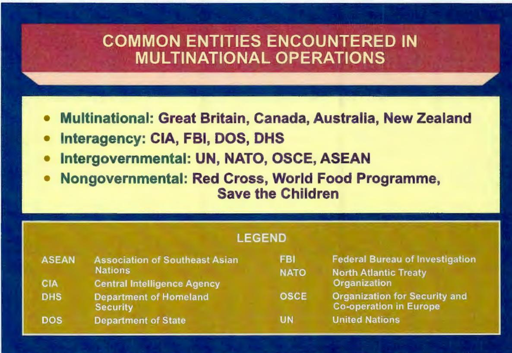  
Figure ll-4. Common Entities Encountered in Multinational Operations

c. For most contingencies, the DNI willissue guidelines to the IC covering:

(1) The types of intelligence products that may be sanitized (2) Guidelines for sanitizing intelligence products.   
(3) Who is authorized to sanitize intelligence products.   
(4) Organizations authorized to receive US intelligence.   
(5) Classification markings to use on sanitized products.   
(6)Procedures in case of unauthorized disclosure.   
(7) Organizational responsibilities.

d. The FDO will use NDP and the DNI guidance to promulgate directives to CCMD intelligence analytical elements on sanitization processes and procedures, including tear line reporting. Tear line reports are derived from US intelligence products and written in such a way as to readily and quickly provide essential operational information without revealing the information's source. Tear line reporting is a mechanism for analytical elements at the CCMD, JTF/J-2, and component levels to provide intelligence-derived reporting and warnings to partners (allies and coalition members without established intelligence sharing agreements; state, local, and tribal elements; and intergovernmental and nongovernmental entities). CCDRs are delegated authority to conduct tear line reporting, which can be further delegated in writing to the JTF commander and below. The J-2 should use the principle of "write to release'" when deciding whether to produce a tear line. That is, the information should be provided to the interagency, intergovernmental, nongovernmental, or multinational partners if it is determined that the information contained in the report is relevant to the partner's mission and can be released to the partner.

# 10. Multinational Intelligence Collaboration

a. Typically, in a multinational operation, allied military partner intelligence counterparts will cluster around the JTF HQ in the form of national intelligence cells. It is imperative for the JTF/J-2 in this environment to establish good working relationships with allied and coalition partners to encourage a shared view of the operational environment. Allied nations also bring valuable intelligence contributions and can often provide niche capabilities in support of the overall JTF mission.

b. There is no standard template for a JTF/J-2's relationship with allies and coalition partners, since it is situation dependent. Detailed planning for information sharing should be accomplished well in advance of operations with allied and coalition members, if possible. A JTF/J-2 must decide how much intelligence can be provided and the mechanisms to use for sharing. This is made more complicated by the multiple classification levels allowed by the nature of the partners involved in the operation. Some allied countries have established intelligence-sharing agreements with the United States, which permit almost seamless two-way flow of intelligence. A Presidential Decision directed access for Commonwealth allies (Great Britain, Australia, New Zealand, and Canada) to information at the collateral level via a commonwealth releasable segment of the US SECRET Internet Protocol Router Network (SIPRNET) in order to enhance information sharing. STONEGHOST is an encrypted communications network designed to support collaboration and intelligence sharing between the US Defense IC and its Commonwealth allies during combat operations. Other allies have long-standing relationships with US Services and intelligence agencies, but release of US-produced intelligence is subject to review by the FDO. Many coalition partners have no established intelligence relationship with the US and operate on a strict need to know and tear line reporting basis for operational necessity.

c. There exist a number of robust, multinational networks used as a backbone for intelligence exchange. Examples include Combined Enterprise Regional Information Exchange System (CENTRIXS); NATO's Battlefield Information Collection and Exploitation System (BICES); Griffin; and the Supreme HQ Allied Powers, Europe's local area network (LAN), Cronos. These networks provide multiple intelligence applications, typical office software and Web browsing capabilities, and may also include collaboration and near real time (NRT) data access tools, as well as secure Voice over Internet Protocol telephony. CENTRIXS, in particular, uses commercially available computers, software applications, and network equipment that are generally releasable to foreign partners. CENTRIXS, Grifin, and BICES all have the advantage of having a direct interface

# with national intelligence producing agencies such as NGA and DIA for direct insertion of products and databases.

d. If no existing information system network is in place for the coalition partners providing forces, either the multinational HQ or the JTF may establish a LAN. CENTRIxS/Griffin standards are used as the model for establishing and maintaining multinational connectivity at the tactical and operational level. The basic CENTRIXS operational architecture framework is the same for al CCMDs and leverages existing networks, technology, and network centers. The JTF/J-2 should request network connectivity through the JTF commander, and must identify resources and establish procedures to transfer appropriate, releasable intelligence from US systems to the shared network as expeditiously as possible.

e. In an extended or large-scale operation involving multinational forces, the JTF commander may elect to establish a multinational intelligence center to share the responsibility for receiving, analyzing, and disseminating intelligence from all sources. The multinational intelligence center is manned by members of the multinational coalition who can contribute intelligence capabilities and is normally equipped and funded by the JTF or multinational command. Its function is to fuse all-source intelligence from coalition members, create a COP, provide early warning to the multinational command and operational forces, and conduct JIPOE. The presence of a multinational intelligence center does not alleviate the need for a US JISE or operational JIOC at the JTF to receive and process US-only intelligence information in support of the JTF commander and staff. In many cases, the US JISE or JIOC will respond to requests for information from the multinational intelligence center.

NATO uses fully developed and coordinated doctrine, contained in Allied JPs and standardization agreements. NATO doctrine is paramount to US joint doctrine when engaged in operations as a member of a NATO force.

# 11. Interagency Intelligence Collaboration

a. The role of DOD intelligence elements in an operation involving USG interagency partners is dictated by the nature of the support relationship. DOD operations, in conjunction with other USG departments and agencies, such as DHS, within the United States or its territories can be characterized as either HD or civil support (CS). DOD intelligence organizations should expect to operate alongside federal, state, local, and tribal elements in security or disaster relief/incident response events.

b. At the national level, the National Operations Center (NOC), operated by DHS, is the primary node for incident management across the federal government. The NOC operates 24/7 and includes IC LNOs. One of the primary functions of the NOC is providing situational awareness of potential incidents and threats to the US. The NOC maintains continuous contact with other federal agency operations centers, including the NJOIC, and issues situation reports on emerging crises.

c. During HD, military forces are used to counter threats and aggression against the United States. Normally, DOD will be designated as the lead federal agency (LFA), supported by other USG departments and agencies, in defending against traditional threats/aggression. When ordered to conduct HD operations, United States Northern Command (USNORTHCOM) or USPACOM will normally designate a JTF, functional component, or single service task force, to command US military operations and coordinate with other agencies. The JTF normally coordinates an interagency response to the crisis through the joint interagency coordination groups. In addition, the JTF may request the presence of liaison elements representing other USG departments and agencies.

d. CS includes a broad array of government responses to man-made or natural emergencies. In CS missions, DOD capabilities will always be used in a support role. Regardless of the supporting relationship, DOD elements maintain the normal chain of command from the President, through SecDef and the CCDR. The DHS or the Federal Emergency Management Agency (FEMA) will designate an LFA to coordinate the USG response. The nature of the emergency drives the selection of the LFA, with FBI taking the lead in terrorism or security-related incidents in most cases. The LFA will establish a joint field office (JFO) in proximity to the emergency area. The JFO may be thought of as a rough equivalent to the DOD JTF, and includes local, state, and federal agencies involved in emergency response. There will not be a J-2 staff element present in the JFO in all cases. If the crisis is a response to a security incident, the FBI may activate a joint operations center (JOC) and colocate the JOC within the JFO. The JOC will act as the lead for all investigative and intelligence issues. National intelligence agencies will work with the JOC to provide and receive situational awareness. Additional information on the structure and concepts of operation for the JOC and JFO can be found in the National Response Framework.

e. In CS emergency response events, USNORTHCOM normally designates a defense coordinating officer (DCO) upon receipt of a request for assistance from the LFA. The DCO is typically an Army North (a USNORTHCOM component) 06-level staff officer assigned to one of the nine FEMA regions and has interagency experience. The DCO works to integrate DOD efforts in support of the operation and serves as the on-scene military POC for the JFO and principal representatives of other USG agencies and NGOs. The DCO may have a defense coordinating element at the JFO consisting of a staff and LNOs to help coordinate military support. The defense coordinating element may include an intelligence officer. All DOD organizations, to include intelligence and incident awareness and assessment (IAA) forces providing direct support to the JFO, coordinate their support with the DCO. This includes DOD intelligence CSAs that have received requests for support from the LFA or JFO.

f. Intelligence sharing between interagency participants frequently occurs on an ad hoc basis (see Figure I-5). It is imperative that the JTF J-2, if designated, dedicate sufficient resources to provide liaison to interagency IC elements to encourage more robust exchange of information. The lack of an LFA J-2 staff function in most USG crisis response operations means there is little pre-planning for intelligence operations. In many cases, the LFA will refrain from using the term "intelligence" and instead prefer to substitute the term "information'” for its situational awareness needs. The DHS uses its Homeland

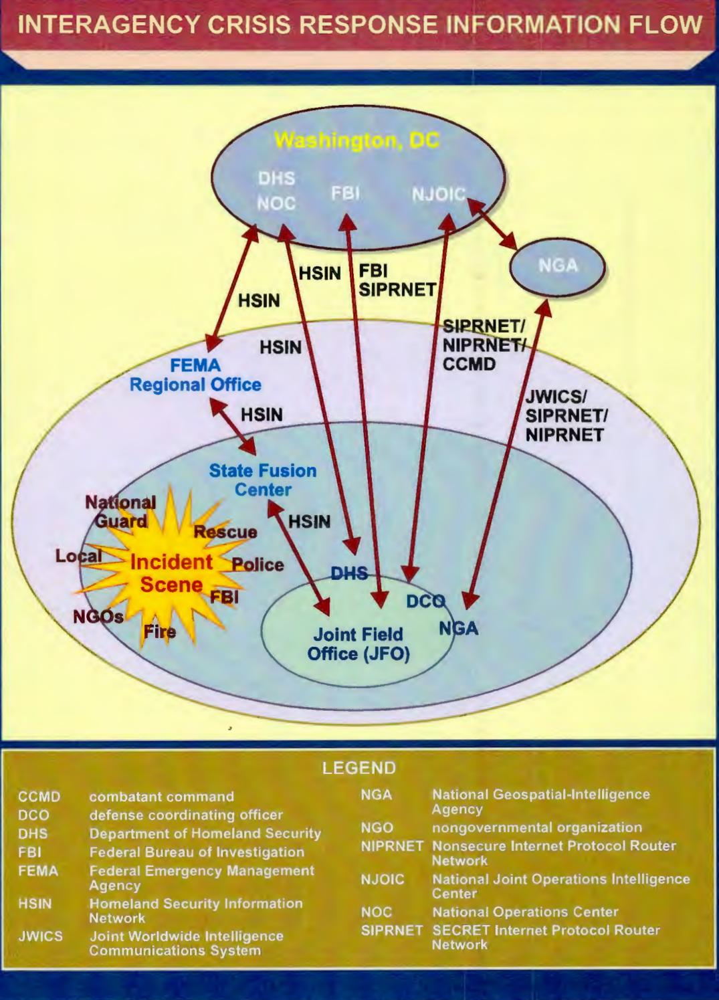  
Figure Il-5. Interagency Crisis Response Information Flow

Security Information Network (HSIN) as its primary command and control (C2) and situational awareness tool. The HSIN includes a classified intelligence module that provides a COP, an RFI management tool, and collaboration software. However, each responding interagency partner brings their own internal communications system and databases, and interacts primarily with their respective home agencies. Therefore, national IC agencies often lack connectivity at the JFO level.

g. The JFO may require a broad array of intelligence. In HD operations, interagency partners require warning information and intelligence concerning threats originating from abroad, especially concerning international terrorist groups and WMD proliferation issues. During CS incidents, the most common request is for GI&S of the area around the incident scene. The NGA will frequently deploy a forward element with connectivity to NGA data in support of a CS response operation. NGA can provide reachback to national databases for products and analysis.

h. Several USG agencies outside of DOD have imagery collection means that may be employed in the incident scene area. DHS will activate the interagency remote sensing coordination cell (IRSCC) at the national level to coordinate and deconflict collection efforts. Any DOD intelligence collection of imagery within the United States must conform to US law. During CS operations, military IAA elements should coordinate eforts with the DHS IRSCC.

i. In some cases, high profile events such as Presidential Inaugurations and Olympic games hosted in the US are designated as national special security events, allowing for detailed pre-planning of a government-wide security operation. Depending on the venue and purpose of the event, the US Secret Service, FBI, or DHS will normally act as the LFA and establish a JFO and/or JOC. These events normally call for increased IC participation, including DOD intelligence elements in support of USNORTHCOM. The NJOIC may stand up a CAT with a corresponding ITF or working group in response.

j. Most states and many major local jurisdictions have established fusion centers (also known as information sharing and analysis centers) in support of the homeland security mission and the 9/11 Commission guidance to share information. These entities are designed to support collection, analysis, and dissemination of intelligence to meet standing information needs. Many operate 24/7 watch centers. State and local level fusion centers are typically structured to include the following mission areas:

(1) Information collection and threat recognition.   
(2) Intelligence fusion and analysis.   
(3) Information sharing and collaboration.   
(4) Risk analysis.

k. A number of cleared federal representatives may be available to assist in communication with these centers, including representatives from FBI, DHS, and state National Guard elements. The FBI has made an effort to place special agents and analysts in state fusion centers with access to the FBI's secure network, SIPRNET, and Joint Worldwide Intelligence Communications System (JWICS). Sensitive but unclassified connectivity to these centers is provided through a variety of shared situational awareness and collaboration tools, including HSIN.

Hurricane Katrina was the costliest and one of the deadliest hurricanes in the history of the United States. It was the sixth-strongest Atlantic hurricane ever recorded and the third-strongest hurricane on record that made landfall in the United States. Katrina formed on August 23, 2005, and made landfall along the Gulf Coast on August 29. It caused devastation along much of the Gulf Coast of the United States. Most notable in media coverage were the catastrophic effects on the city of New Orleans, Louisiana, and in coastal Mississippi. Due to its sheer size, Katrina devastated the Gulf Coast as far as 100 miles (160 kilometers) from the storm's center.

The United States Northern Command established Joint Task Force (JTF) Katrina based at Camp Shelby, Mississippi, to act as the military's on-scene command on Sunday, August 28. Approximately 58,000 National Guard personnel were activated to deal with the storm's aftermath, with troops coming from all 50 states. The Department of Defense (DOD) also activated volunteer members of the Civil Air Patrol.

During the immediate aftermath of Katrina, rescue personnel and the corps of engineers requested support from the National Geospatial-intelligence Agency (NGA). NGA produced commercial imagery and analysis of the operational environment in support of extensive rescue and recovery efforts.

Prior to Katrina making landfall, NGA, working directly with the Federal Emergency Management Agency (FEMA), Department of Homeland Security (DHS), and JTF Katrina, tasked and collected large amounts of commercial and national imagery of the New Orleans area to use as a reference point. It was the first extensive use of geospatial products declassified for use by FEMA, United States Coast Guard (UsCG), and state and local authorities. Once Katrina made landfall, NGA products depicted areas most devastated by flooding and wind damage, and created a common operating picture for all organizations involved in humanitarian aid and search and rescue. To support strategic communication efforts, NGA published a public access internet page of commercial imagery products taken before and after Katrina landfall identifying the extent of devastation. In addition to massive flooding of New Orleans, several above-water bridges were damaged to the extent that they were unusable and thereby severely limited vehicle movement into the affected areas. Again, NGA products accurately depicted the extent of damage to the area's infrastructure. Unique imagery products were also created for the UsCG and the Environmental Protection Agency of petrochemical plants and oil platforms impacted by Katrina. The images depicted, in some cases, oil spills, leaks, and damaged platforms and refineries.

NGA deployed 50 personnel to nine sites in the affected area along with two self-contained Mobile Integrated Geospatial Intelligence Systems (MIGSs). MiGs incorporates the capabilities of a robust geospatial intelligence exploitation system with reachback capability provided by an integrated Trojan Lite Il antenna. The ability to reach back allowed NGA to leverage numerous NGA production elements throughout the IC for specialized image processing, exploitation, and dissemination of finished products. Working with FEMA, an embedded NGA liaison officer (LNO) supported JTF Katrina and DHS/FEMA imagery requirement needs.

The established process for the DOD intelligence, surveillance, and reconnaissance (ISR) support proved to be cumbersome. FEMA submitted a request for assistance through the defense coordinating officers to the Joint Director of Military Support (JDOMS). JDOMS staffed, approved, and made mission assignments. The Office of the Secretary of Defense made the final approval. JDoMs then coordinated with the Joint Functional Component Command for ISR for asset allocation. Once assets were identified, they were chopped to Us Northern Command. Requirements were then deconficted during daily Interagency Collection Management Board meetings with NGA as a participant. NGA coordinated with the 9th Intelligence Squadron/Reconnaissance Squadron, Beale Air Force Base, California, on wet film processing, digitization, and dissemination in order to make the imagery available to community customers in a timely manner.

For national and commercial imagery collection, NGA America's Division worked closely with NGA analysts and source strategists, the DHS requirements officers, and the FEMA LNO, to identify requirements and craft collection strategies. Once identified, the collection strategies were set in motion. For national imagery, the Requirements Management System was the mechanism for creating and submitting collection nominations approved by NGA for tasking. For commercial imagery, a specialized tasking form, hosted on INTELINK and NGA's sensitive but unclassified network, was submitted. In some cases, an e-mail and phone call to NGA's commercial team initiated collection and production.

Throughput of the image data and products was the timeliest through the established national architecture. Secondary unclassified products were pushed to the lowest dissemination levels for FEMA and state and local authorities for immediate use.

During the immediate aftermath of Katrina, The unavailability of DoD airborne assets to support pre- and post-hurricane efforts proved to be a shortfall. In the case of Us Customs aircraft, the image data was not in a DoD standard format and had limited utility. These problems posed significant barriers to mission accomplishment. However, in spite of the difficulties, NGA was singled out as "what went right" in a post-Katrina White House after-action report.

Various Sources

# CHAPTER IIIINTELLIGENCE OPERATIONS

"The specialprcessing thatpartillydefines intelience is the continualcollection verification, and analysis of information that allows us to understand the problem or situation in actionable terms and then tailor a product in the context of the customer's circumstances. If any of these essential attributes are missing, then the product remains information rather than intelligence."

Captain William S. Brei, Us Air Force Getting Intelligence Right: The Power of Logical Procedure, Joint Military Intelligence College, January 1996

# 1. Introduction

Joint and national intelligence supports military operations by providing critical intelligence, other finished intelligence products, and crucial information to the CCMD, the subordinate Service and functional component commands, and subordinate joint forces. Commanders at all levels depend on timely, accurate information and intelligence on an adversary's dispositions, strategy, tactics, intent, objectives, strengths, weaknesses, values, capabilities, and critical vulnerabilities. Intelligence also contributes heavily to understanding the operational environment. The intelligence process is comprised of a wide variety of interrelated intelligence operations: planning and direction, tasking and collection, processing and exploitation, analysis and production, dissemination and integration, and evaluation and feedback. These intelligence operations must focus on the commander's mission and CONOPS (see Figure II-1).

# 2. The Intelligence Process

The intelligence process describes how the various types of intelligence operations interact to meet the commander's intelligence needs. The intelligence process provides a useful model that facilitates understanding the wide variety of intelligence operations and their interrelationships. There are no firm boundaries delineating where each operation within the intelligence process begins or ends. Intelligence operations are not sequential; rather, they are nearly simultaneous. For example, electronic intelligence (ELINT) data may be automatically processed and disseminated by the distributed common ground/surface system (DCGS) while simultaneously cross-cueing additional platforms for further intelligence collection. Additionally, not all operations necessarily continue throughout the entire intelligence process. For example, during processing and exploitation, information may be disseminated directly to the user from an unmanned aerial vehicle or other source, without first undergoing detailed all-source analysis and intelligence production. The increased tempo of military operations requires an unimpeded flow of automatically processed and exploited data that is both timely and relevant to the commander's needs. This unanalyzed combat information must be simultaneously available to both the commander (for time-critical decision making) and to the intelligence analyst (for the production of current intelligence assessments). Examples of uses for such unanalyzed combat information include, but are not limited to, time-sensitive targeting, personnel recovery operations, and threat warning alerts. Likewise, the analysis, production, and dissemination of intelligence products must be accomplished in time to support the commander's decision-making needs. Many collection system products require some level of processing and exploitation to render the information intelligible to the customer.

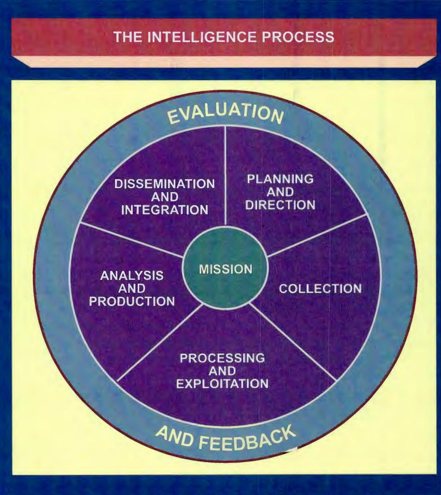  
Figure Il-1. The Intelligence Process

a. Joint intelligence operations are founded on an understanding of the commander's mission and intent. This understanding also provides the basis for the identification of intelligence gaps regarding relevant aspects of the operational environment, especially the adversary. These intelligence needs are identified by the commander and all joint force staff elements and are formalized by the J-2 as intelligence requirements during the planning and direction portion of the intelligence process.

b. The tasking and collection portion of the intelligence process involves tasking appropriate collection assets and/or resources to acquire data and information required to satisfy collection requirements. Tasking and collection includes the identification, coordination, and positioning of assets and/or resources and levying tasking against them to satisfy collection objectives.

c. Once the data that might satisfy the requirement is collected, it undergoes processing and exploitation. Through processing and exploitation, the collected raw data is transformed into information that can be readily disseminated and used by intelligence analysts to produce multidiscipline intelligence products. Relevant, critical information should also be disseminated to the commander and joint force staff to facilitate timesensitive decision making. Processing and exploitation time varies depending on the characteristics of specific collection assets and associated processing and exploitation architectures. For example, some ISR systems accomplish processing and exploitation automatically and nearly simultaneous with collection, while other collection assets, such as HUMINT teams, may require substantially more time. In addition, some ISR sensors create data files unique to that sensor and platform and may require re-processing and/or reformatting prior to exploitation. Processing and exploitation requirements are prioritized and synchronized with the commander's PIRs. National level exploitation and production priorities should be in line with their associated collection priority, if applicable.

d. The analysis and production portion of the intelligence process involves integrating, evaluating, analyzing, and interpreting information from single or multiple sources into a finished intelligence product that may be as little as a few textual lines in message format, or a multipage, multisource, multimedia soft copy file. Depending on exploitation requirements (a last look at a target for situational awareness, monitoring activity levels at a high-value target, in-depth targeting, etc.), analysis and production of products may require immediate dissemination. Moreover, the demands of the modern operational environment require intelligence products that anticipate the needs of the commander and are timely, accurate, usable, complete, relevant, objective, and available.

e. Properly formatted intelligence products are disseminated to the requester, who integrates the intelligence into the decision-making and planning processes. In the case of threat warning alerts essential to the preservation of life and/or vital resources, such information must be immediately communicated directly to those forces, platforms, or personnel identified at risk so that the appropriate responsive action can be taken once such notification has been acknowledged.

f. Inteligence operations, activities, and products are continuously evaluated. These evaluations are essential to the process and may lead to actions to focus the performance of intelligence operations and the overall functioning of the intelligence process.

g. The remainder of this chapter discusses each type of intelligence operation and its associated activities in detail.

# SECTIoN A. PLANNING AND DIREcTION

# 3. Overview

Intelligence planning and direction occurs continuously as the intelligence component of the command's steady-state campaign and contingency adaptive planning effort. Intelligence planners, through the development of the concept of intelligence operations, lay the foundation for how the joint force J-2 will manage preplanned collection and production tasks to satisfy the intelligence needs of the commander and staff. JIPOE helps the joint force J-2 focus by providing a proper foundation for the entire inteligence process. Planing and directing involves the activities shown in Figure Il-2.

# 4. Augmentation Requirements

a. The demand for intelligence increases significantly at all levels during crisis and wartime operations. Optimal synchronization of available intelligence assets throughout the

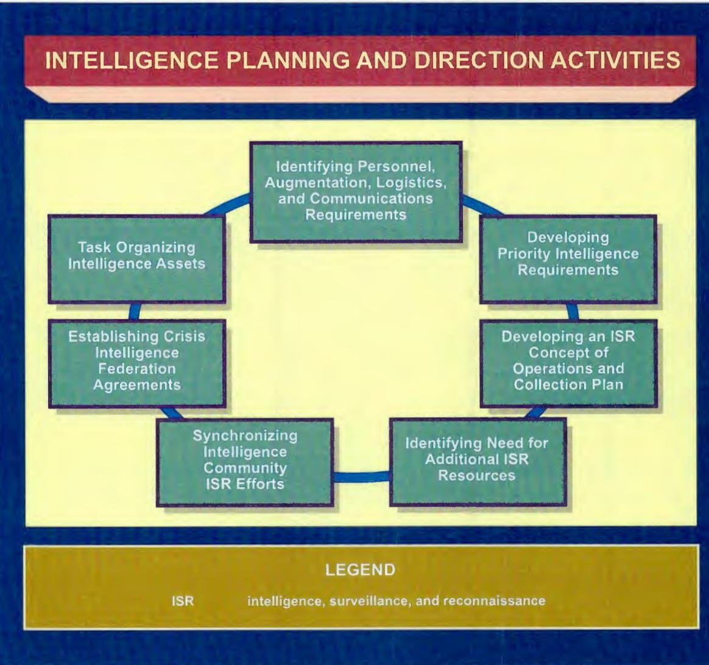  
Figure Il-2. Intelligence Planning and Direction Activities

IC and CCMDs is essential to meeting these increasing customer needs. The joint force, in order to meet its increased demand for intelligence, may find it necessary to request augmentation of its assigned ISR assets and intelligence personnel.

b. The JFC initiates augmentation by defining personnel shortfalls beyond those that can be filled through the components. The Joint Staff uses GFM force management procedures to adjudicate manning requests from the commands.

For further information regarding mobilization of reserve personnel for augmentation, refer to JP 4-05, Joint Mobilization Planning.

# 5. Intelligence Requirements

Successful intelligence support to military operations demands that some universal principles be understood and applied. The J-2 participates fully in the planning and decision-making process, contributing knowledge concerning the operational environment, and receiving guidance to help focus the intelligence effort. The intelligence planner examines mission success criteria (i.e., desired effects, operational objectives, and end states) and their associated metrics and then determines what intelligence support and information will be required to assess the impact of military operations and inform the commander's decisions.

a. As an output of the JOPP, all elements of the staff nominate CCIRs to the commander for approval. CCIRs comprise a limited number of information requirements that enable the staff to focus limited resources on those aspects of the operation the commander is interested in closely monitoring and upon which a decision may be based. CCIRs consist of either PIRs or friendly force information requirements (FFIRs). The J-5 is the overall staff proponent for the development of FFIRs, and the J-3 is the overall staff proponent responsible for monitoring FFIRs. The J-2 is the overal staff proponent for PIR development and monitoring. The J-2 leads the development of IRs (general or specific subjects upon which there is a need for the collection of information or the production of intelligence to fill intelligence gaps) and the development of information requirements (items of information regarding the adversary and other aspects of the operational environment that need to be collected and processed to meet the IRs). IRs deemed most important to mission accomplishment are identified by the commander as PIRs. Information requirements that are most critical or that would answer PIRs are known as EEIs. EEIs may require answering numerous specific questions regarding the collected area/target, such as adversary OB, operational status and readiness of troops and equipment, or identification of unique signature information as well as human factor analysis and IOII. Figure I-3 illustrates the relationship between IRs, PIRs, information requirements, and EEIs.

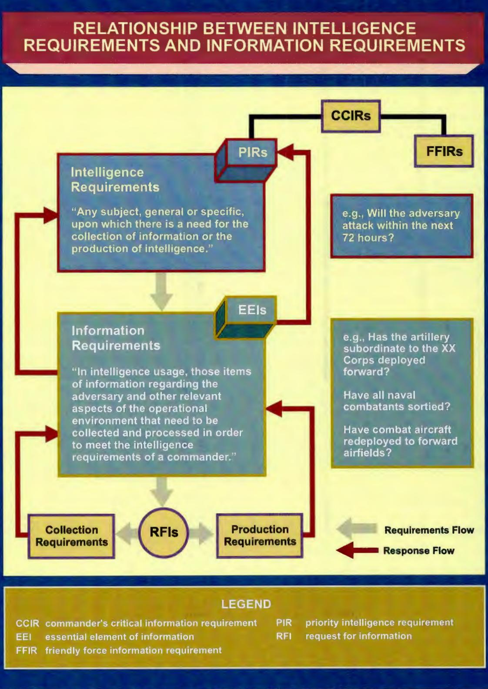  
Figure ll-3. Relationship Between Intelligence Requirements and Information Requirements

b. The categories, types, and level of detail of IRs differ from echelon to echelon. Intelligence necessary to support the operational level might be inappropriate at the tactical level. With some exceptions, the higher echelon commander's intelligence requirements are less detailed and much broader in scope than those of subordinate commanders. An intelligence planner who tries to use intelligence beyond what is required to support the organization may overburden the intelligence infrastructure with too much information and needlessly complicate the commander's decision-making process.

c. An RFI responds to customer requirements, ranging from dissemination of existing products through the integration or tailoring of on-hand information to scheduling, tasking, and collecting of data for original production. The information must be timely, accurate, and in a usable format. The intelligence office translating the customer's requirement and the primary intelligence producer determine how best to meet the customer's needs. If it is determined that new, finished intelligence derived from original research is required to satisfy all or a portion of the RFI, then that need is expressed formally within the Defense Intelligence Analysis Program (DIAP) as a PR. If it is determined that insufficient information exists to answer an RFI, then a collection requirement is prepared and entered into the appropriate CRM application.

(1) Requirements that cannot be satisfied are submitted as RFIs or collection requirements to the next higher echelon. Each echelon is responsible for validating, prioritizing, and, if possible, satisfying the RFI or collection requirement before forwarding it to the next level. RFIs should be satisfied at the lowest level possible. If the information required to satisfy an RFI does not exist, the requester is informed and a decision is made to initiate collection and/or production. Decisions to expend collection resources should be made at the lowest level possible.

(2) Validation is a process associated with the tasking, collection, and production of intelligence and confirms that an intelligence collection or PR is sufficiently important to justify the dedication of intelligence resources, does not duplicate an existing requirement, and may not be satisfied by previous collection or production. Information copies of the requirement should be forwarded to supporting intelligence organizations to alert potential respondents to the requirement.

# 6. Crisis Intelligence Federation Planning Guidance

The intelligence federation process enables CCMDs to form support relationships with other JIOCs, Service intelligence centers, reserve organizations, or other intelligence agencies to assist with the accomplishment of the joint force's mission. The supported CCMD J-2 should coordinate with the NJOIC to establish an ad hoc crisis intelligence federation. CCMDs initiate the federation process by assessing their intelligence shortfalls and requesting federated partnership support. Federated support can be provided in specific functional areas directly related to the crisis, or by assuming temporary responsibility for noncrisis-related areas within the CCMD's AOR, thereby freeing the supported command's assets to refocus on crisis support.

a. Supporting JIOCs, Service intelligence centers, and intelligence agencies will be considered as being in direct support of the supported CCMD J-2. Specific command relationships will be developed as part of crisis federation planning. Federated relationships may include assigning certain partners a reinforcing mission (e.g., taking over support requirements from a supporting partner when the organization cannot continue its federated mission).

b. The NJOIC adjudicates conflicting partnership requirements, facilitates the establishment of crisis intelligence federations, and is responsible for providing overall supervision, guidance, and assistance to the crisis intelligence federation process. The NJOIC coordinates the re-prioritization of support when necessary, including the relief of supporting partners when resources are no longer available to continue assigned crisis federation support. Figure I-4 depicts the process for crisis intellgence augmentation and federation support.

Guidance related to noncrisis or contingency intelligence federation as part of $I P$ is contained in Chapter IV, "Intelligence Support to Joint Operation Planning.

# 7. Intelligence, Surveillance, and Reconnaissance Concept of Operations

The ISR CONOPS documents the synchronization, integration, and operation of ISR resources in direct support of current and future operations. It outlines the capability to task, collect, process, exploit, and disseminate accurate and timely information that provides the awareness necessary to successfully plan and conduct operations. It addresses how all available ISR collection assets and associated PED infrastructure, including multinational and commercial assets, wil be used to satisfy the joint force's anticipated collection tasks. To facilitate the optimum utilization of all available ISR assets, an ISR CONOPS should be developed in conjunction with the command's planning effort. The ISR CONOPS should be based on the collection strategy and ISR execution planning, and should be developed jointly by the joint force J-2 and J-3. The ISR CONOPS should also identify and discuss any ISR asset gaps and shortfalls relative to the joint force's validated PIRs and may be used as a vehicle for justifying a request for the allocation of additional ISR resources. It should also require a periodic evaluation of the capabilities and contributions of all available ISR assets relative to the joint force mission in order to maximize their efficient utilization and to ensure the timely release of allocated ISR resources when no longer needed by the joint force.

# a. The ISR CONOPS is the first step to building an ISR appendix and consists of two parts:

(1) A brief description of validated intelligence requirements and ISR force organization, allocations, employment priorities, and C2 relationships.

(2) A general depiction of employed or planned employment of ISR assets to support daily joint and component-level operations.

b. The following are factors that should be considered when developing an ISR CONOPS:

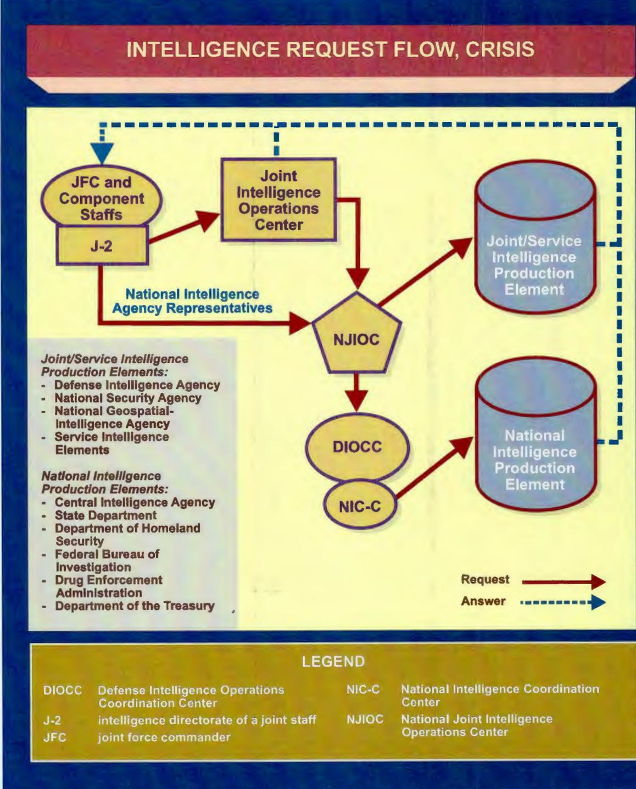  
Figure lll-4. Intelligence Request Flow, Crisis

(1) JFC Guidance. The JFC translates strategic guidance into operational objectives necessary to plan and execute the military campaign. The JFC apportions the ISR effort based on campaign objectives. JIPOE will assist in identifying gaps in the knowledge of the operational environment based on JFC guidance and mission analysis. Some of these gaps become the initial priorities for intelligence collection, providing the baseline focus for planning ISR asset employment.

(2) PIRs. ISR asset managers must understand the joint force's CONOPS. This includes routine monitoring of the commander's intelligence requirements and updated ISR guidance.

(3) Collection Management Authority. CMA usually resides at the CCMD level, but it may be delegated to the JTF or component level. In some cases, it may be federated among all three.

(4) US and multinational ISR efforts should be deconflicted and fully integrated.

(5) ISR Force Structure. The J-2 must determine the overall intelligence requirements and the ISR force structure required to properly support operations. Following that, a determination will be made on the ability of theater assigned forces to satisfy those requirements and whether additional assets are required.

(6) Distributed ISR Operations. Distributed ISR operations, conducted from multiple independent nodes within an intelligence network, facilitate and enhance accomplishment of JFC objectives. The design of a distributed operation should enable a more survivable operation through distribution and sharing of assets and tasks while operating with common databases across a redundant communications network.

(7) PED Architecture. The DOD information networks and near-global computer access has enabled joint force collection managers to submit their own tasking, collection, and PRs directly to their higher level supporting CCMD to levy tasking against multiintelligence assets and resources (airborne, space borne, commercial). They are also able to leverage databases to retrieve historical and current raw and exploited products via reachback and distributed architectures. However, much of the PED of collected intelligence information may occur outside the theater in order to prevent duplication of effort and reduce the forward deployed "footprint' of ISR forces.

(8) Cross-AOR ISR Support. Where ISR operations cross AOR boundaries, JFCC-ISR coordinates among the applicable CCMDs.

# 8. Intelligence, Surveillance, and Reconnaissance Resource Allocation

ISR resources are typically in high demand, and requirements usually exceed platform capabilities and inventory. The mission may require ISR resources not assigned to the theater or components of the subordinate joint force. The joint force collection manager must ensure that all requests for additional ISR resources are based on validated needs as established by the command's formal intelligence requirements process. The proper allocation of collection and associated PED capabilities ensures that limited ISR resources are optimally aligned against DOD's highest-priority IRs.

a. The Joint Staff J-2 and J-3 receive and analyze requests from CCMDs for additional intelligence unit, personnel capabilities, and ISR resources. The Joint Staff J-2 develops and recommends globally optimized sourcing solutions for intelligence unit and personnel capabilities. The Joint Staff J-3 tasks USSTRATCOM, which in turn tasks JFCC-ISR to develop and recommend globally optimized sourcing solutions for DOD ISR and associated

PED capabilities. This is accomplished by evaluating the theater ISR CONOPS, consolidating theater intelligence requirements, analyzing the resulting collection need, modeling it against national agency databases, and ranking it against competing ISR requirements of other CCMDs. These procedures ensure limited ISR resources and associated PED are aligned against DOD's highest-priority IRs and are synchronized with DOD/national-level collection support codified in appropriate functional support plans (FSPs) to NISPs. Additionally, optimizing ISR resource allocation identifies critical unfilled requirements and flags them for possible programmatic recommendations.

b. The JFCC-ISR identifies the optimum allocation of airborne ISR resources by collating, analyzing, and comparing competing theater ISR requirements. Deconfliction for airborne ISR assets is coordinated by the joint force air component commander (JFACC) or Air Force component commander if a JFACC is not designated, who deconflicts theater asset requests through the Planning Tool for Resource Integration, Synchronization, and Management (PRISM) planned intelligence day. The Air Force component commander or JFACC (if designated) deconflicts the tracks of all multi-ISR airborne platforms.

c. A centralized database is used to maintain standardized business processes for scheduling and management of ISR missions, managing track and operations areas, and reporting ISR and sensitive reconnaissance operations missiors.

# 9. Procedures for Requesting National Intelligence Support

a. National Intelligence Production Support. The JIOC is the primary focal point for providing intelligence support to the CCMD. The JIOC must analyze theater intelligence PRs, collection requirements, and RFIs from subordinate commands to determine whether such intelligence needs can be met with assigned resources or may require national-level assistance. If the JIOC determines national-level production assistance is required, a formal request will be prepared in the form of an RFI. The flow of RFIs from JIOCs to national intelligence agencies differs only slightly from peacetime to crisis. In all situations, DIA serves as the CCMD's portal for requesting national-level intelligence production support. DIA will interface with other DOD intelligence agencies or the national IC through the NIC-C to provide support. If DIA determines that the information required has not been produced by any agency in the IC, DIA will coordinate with the CCMD JIOC and NIC-C to recommend an appropriate strategy to collect, process, analyze, produce, and disseminate the required information.

(1) Noncrisis Request Procedures. DIA ensures the expeditious flow of MI from the national level through the JIOCs to deployed forces during peacetime. RFIs are forwarded from the JIOC to DIA and/or the production agency. If the JIOC determines national-level intelligence collection is required to meet theater intelligence PRs, a formal collection request will be prepared and forwarded to the DIA DCW for resolution. (See Figure II-5.)

(2) Crisis Request Procedures. The NJOIC is the focal point for all crisis intelligence, and will receive, adjudicate, and task collection requirements and RFIs to DIA or other IC element, as required. Additionally, deployed NISTs may serve as a direct link to the NJOIC, DIA DCW, JFCC-ISR, and NIC-C when the joint force J-2 and CCMD JIOC determines that time-sensitive collection requirements or RFIs require national support. For tracking purposes, the JIOC wil receive a simultaneous copy of all RFIs forwarded by the NIST (see Figure I-4 for crisis RFI flow).

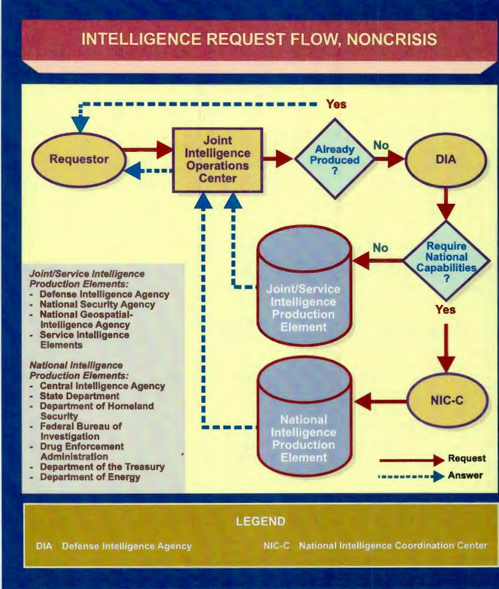  
Figure Il-5. Intelligence Request Flow, Noncrisis

b. National Intelligence Augmentation Support. CCMDs coordinate with the Joint Staff J-2 via record message all requests for external support from NISTs, federation, and augmentation from national intelligence agencies that involve personnel and/or equipment.

All support requests, with the exception of requests for CIA support, are submitted to the Joint Staff J-2 via the CCMD for validation and subsequent action. Requests for CIA personnel/equipment support should be submitted directly to the CIA for action.

c. The National Intelligence Priority Framework (NIPF) is the DNI's sole mechanism for establishing national intelligence priorities. Intelligence topics reviewed by the NSC Principals Committee and approved by the President annually form the basis of the NIPF and the detailed priorities established by the DNI. The ODNI and the IC elements use the NIPF to allocate national collection and analytical resources. The NIPF is the DNI's guidance to the IC on the national intelligence priorities for planning, collection, and analysis. The NIPF serves as the basic guidance for US foreign intelligence collection and analysis. It balances intelligence issues and countries to formulate a global standing priority matrix. National collection requirements and analysis and production efforts are tied to the NIPF priorities. The Deputy DNI for Analysis manages the NIPF. The review process includes input from Services, OSD, and CCMDs. The NIPF matrix reflects customers' priorities for intelligence support and ensures that long-term intelligence issues are addressed. Ad hoc modification may be made to reflect the changing world event and policy priorities. The contents of the NIPF are classified.

d. DIA uses the NIPF as the basis to develop and manage the defense intelligence priorities framework (DIPF), which translates NIPF topics into DIAP topics. DIA implements the NIPF through the DIPF. Defense priorities from the CCMDs and the Services are also integrated into the DIPF.

e. The DIAP uses the NIPF to prioritize analysis and determine levels of effort for the DOD IC. When the new NIPF priorities are approved, DIAP priorities are adjusted and reflected in the DIPF. The approved DIPF is DOD's intelligence application of NIPF priorities to DIAP topics.

# SECTION B. COLLECTION

# 10.Overview

a. Collection operations acquire information about the adversary and other relevant aspects of the operational environment and provide that information to intelligence processing and exploitation elements. Collection management, which occurs at all levels of intelligence, converts validated RFIs into collection requirements; establishes, tasks, or coordinates actions with appropriate collection sources or agencies; and monitors results and retasks as required. The foremost challenge of collection management is to maximize the effectiveness of limited collection resources within the time constraints imposed by operational requirements.

b. The terms "collection asset' and "collection resource'" need to be clarified in order to understand the collection management process and the appropriate tasking procedures. A collection asset or a collection resource is a collection system, platform, or capability. A collection asset is subordinate to the requesting unit or echelon, while a collection resource is not. Requests for collection resources must be coordinated through the chain of command with the echelon that directs and controls them.

# 11. Principles of Collection Management

a. Collection managers develop collection plans and strategies based on validated IRs of commanders and decision makers. Intelligence analysts support the collection management process by identifying intelligence gaps and collection opportunities. The collection manager's task is to first verify that the requirements have been validated. Once they have been verified, the manager begins the process to obtain the necessary information in response to the requirement. To do this, the collection manager:

(1) Identifies allexisting intelligence collection previously collected and exploited that may satisfy the RFI without new collection.

(2) Develops and manages a collection strategy that integrates requirements with target characteristics.

(3) Compares the strategy to the capabilities and limitations of the available collection assets.

(4) Develops a collection strategy to optimize the effective and efficient use of all available, capable, and suitable collection assets and resources.

(5) In coordination with the J-3, forwards collection requirements to the component commander or national agency exercising control over the ISR resources, who will then task the resource to satisfy the requirement.

(6) Identifies collection requirements that cannot be satisfied by available assets and forwards them up the chain of command for tasking of intelligence resources.

(7) Directs processing and dissemination of collected data. Collection managers must understand the capabilities and limitations of each discipline (sensor, platform, PED architecture, product format) and the procedures for ensuring target coverage by the appropriate collection asset and/or resource and PED assets. Collection managers keep analysts and requesters informed of collection status and capabilities, so that there are realistic expectations of what can be collected and what level of confidence can be placed in the information.

b. Collection managers should follow four principles in all collection considerations (see Figure III-6).

(1) Early Identification of Requirements. Collection managers should be involved early in the identification and validation of requirements. Early consideration of collection factors enhances the ability to respond in a timely manner, ensures thorough planning, and increases flexibility in the choice of disciplines and systems. Early requirement identification also allows the collection manager time to accomplish needed research, run predication analysis tools if required, and establish and/or refine a POC list.

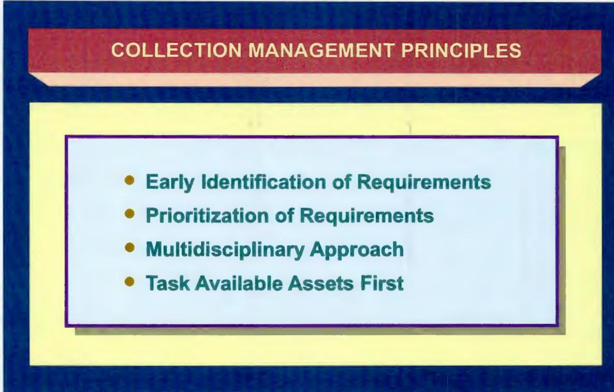  
Figure Ill-6. Collection Management Principles

(2) Prioritization of Requirements. Prioritization assigns a distinct ranking to each collection requirement. Collection decisions can be made rationally only if requirements are prioritized and the resulting trade-offs are fully understood. Time constraints and the finite number of collection, processing, and exploitation assets and/or resources mandate the prioritization of collection requirements. Prioritization based on the commander's guidance, objectives, and the current situation ensures that limited assets and/or resources are directed against the most critical requirements. Collection requirements that are not time-sensitive may initially be submitted at lower priorities in the expectation that such requirements may be satisfied during routine collection operations. If collection does not occur at the lower priority, the requirement should be reviewed for a possible increase in stated priority.

(a) The CCMD J-2 will determine and recommend prioritized intelligence needs based on mission analysis and commander's planning guidance, specifically PIRs for projected decisions being considered by the commander.

(b) The collection manager for national tasking purposes is required to associate a collection requirement to an appropriate NIPF issue in order to establish a numerical tasking priority value. Depending on the intelligence issue, timelines, and criticality, priority exceptions may be applied in order to satisfy a requirement.

(c) The collection manager may have an additional locally established tiered riority framework to further refine the ranking of identical NIPF priority requirements.

(d) Short-term priority exceptions that support crisis issues, such as personnel recovery, time-sensitive targeting, and response to natural disasters, may also be submitted on a case-by-case basis.

(3) Multidisciplinary Approach. Collection disciplines complement each other, and the collection manager must resist favoring or becoming too reliant on a particular sensor, source, system, or technique. Each discipline's limitations can be mitigated by the capabilities of the others, as different systems provide additional, and alternative, insights into the requirement. While a sensor, source, and/or system may seem to be an obvious choice to satisfy a requirement, flexibility is the key. Collection managers are advised to match collection resources to the type of requirements and information gaps that are most likely to be satisfied by a particular collection operation (e.g., HUMINT and/or SIGINT can capture adversary intent but GEOINT cannot). Rigid dependence on a single source may result in mission failure, especially if that source becomes unavailable or if the adversary becomes aware of the use of that single source and takes countermeasures. The use of a multidisciplinary approach minimizes the adversary's ability to detect discernable patterns and thus may hamper his CI or denial and deception efforts. The CCMD JIOC performs integrated collection planning and direction to determine, validate, and task multiintelligence discipline collection requirements based on CCDR mission needs and priority. Collection managers and ISR collection operation managers specifically define all-source collection needs, followed by the theater ISR collection strategy, plan, and CONOPS. Allsource CRM is done by the CCMD collection manager, with the prioritization, validation, and distribution of the collection requirements. The CCMD J-2/JIOC directs, supervises, and guides the execution of the strategic theater collection management process. The objective is to orchestrate an all-source collection effort to efficiently and effectively satisfy the CCMD and components' collection requirements. The JIOC identifies all available and required ISR collection assets and develops a theater collection plan that will be used to provide cross-validation with the National ISR CONOPS to ensure coordinated collection operations.

(4) Task Available Assets First. Use of available collection assets allows a timely and tailored response to collection requirements and serves to lessen the burden on collection resources controlled by other units, agencies, and organizations. However, if requirements cannot be satisfied by available assets, the collection manager should request collection support from higher, adjacent, and subordinate units, agencies, and organizations.

# 12. Collection Management

Collection management has two distinct functions: CRM——defining what intelligence systems must collect——and collection operations management (COM)—specifying how to satisfy the requirement. CRM focuses on the requirements of the customer, is all-source oriented, and advocates what information is necessary for collection. COM focuses on the selection of the specific intelligence discipline(s) and specific systems within a discipline to collect information to satisfy the customer's request. COM is conducted by organizations to determine which collection assets can best satisfy the customers' requests (see Figure I-7).

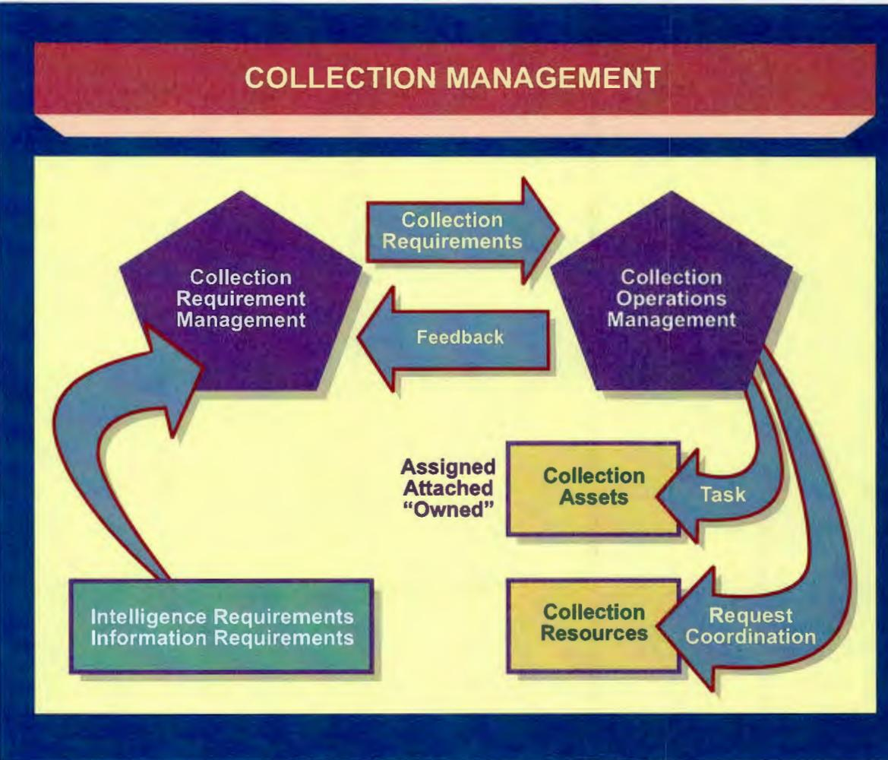  
Figure Il-7. Collection Management

a. Depending on the size of the collection management element, the CRM and COM functions may not be organizationally distinct and may in fact be performed by a single individual. Although considered separate to facilitate the understanding of their different objectives, in practice, there may be no distinction between them. If performed by separate individual/staffs, constant interaction must be maintained between the two.

b. COM and CRM are performed at all levels of the IC. Each level interacts with the levels above and below, and among units, agencies, and organizations on the same level. The further up the chain, the broader the perspective and scope of responsibility; the lower, the more specific the function and narrow the scope. COM is conducted by organizations possessing collection assets and/or resources to determine which collection assets can best satisfy the customers' product requests.

c. In the event of war or periods of crisis, the President may direct the military to exercise greater responsibilities for tasking of collection systems. When directed, national intelligence collection tasking authority may pass from the DNI to SecDef. This collection tasking authority approves all national collection requirements, determines national collection priorities, and resolves conflicts among collection priorities.

# RELATIONSHIP BETWEEN COLLECTION MANAGEMENT AND OPERATIONS

The joint force commander's collection manager prioritizes collection requirements, defines the required collection parameters, and recommends the appropriate asset to be assigned to collect against a particular target. The collection manager, in coordination with the operations directorate, forwards collection requirements to the component commander exercising operational and/or tactical control over the theater reconnaissance and surveillance assets. A mission tasking order goes to the unit selected to be responsible for the accomplishment of the collection operations. The selected unit makes the final choice of specific platforms that can satisfy the collection parameters, equipment, and personnel based on such operational consideration as maintenance schedules, training, and experience.

Various Sources

d. Joint Staff J-2. The J-2 is the principal intelligence advisor to the CJCS and provides crisis intelligence to OSD, CJCS, and the Joint Staff. The J-2 also manages crisis response for the Joint Staff and mans the intelligence portion of the NJOIC. The J-2 advocates for CCMD intelligence requirements to the Joint Staff, the intelligence combat support agencies, OSD, and ODNI.

e. Theater Collection Management. The theater J-2 must be kept apprised of all intelligence collection requirements being levied on assets and resources within the CCMD's AOR. The theater J-2 retains full management authority (i.e., to validate, to modify, or to nonconcur) over all intelligence collection requirements within the AOR. This authority may be delegated to a subordinate JFC. Collection requirements should be satisfied at the lowest possible level. Requirements that cannot be satisfied, and that have been validated by the command's collection manager or J-2, are then forwarded to the next higher echelon for action. This process continues until the requirement is satisfied, the intelligence is no longer needed, or it is determined that the requirement cannot be satisfied. Validated collection requirements and collection requests for theater and national systems will be forwarded for action to the theater intelligence collection management office. Validated collection requirements from components will become part of the theater collection plan and will be collected by theater.

# 13. Collection Requirements Management

Management and validation of collection requirement requests for a theater reside at the CCMD level. The validation process parallels that for RFIs and is responsive to operational requirements. The JIOC validates and submits collection requirements to the DIA DCW if requirements cannot be satisfied by subordinate assets. The JIOC collection manager directs, organizes, assesses, and monitors the determination, organization, and prioritization of theater requirements. Collection managers execute CMA and prepare, maintain, validate, and levy collection requirements on theater ISR collection assets. Validated collection requirements from components will become part of the theater collection plan for collection by theater collectors or forwarded to DIA for national-level ISR tasking.

a. Requirements origination. The subordinate joint force J-2 originates or validates collection requirements from subordinate components and submits requests for additional collection resources to the CCMD J-2, if they do not have the capability to collect the data. The CCMD J-2 validates or modifies standing collection requirements submitted by subordinate joint force or component commands. The CCMD JIOC tracks the status of research, validation, submission, and satisfaction of all collection requests received. At the JFC's discretion, a JCMB may be formed to serve as a joint forum for the management of collection requirements and the coordination of collection operations. The JCMB is chaired by the J-2 and should include J-3 and component representatives. If formed, the JCMB receives collection target nominations from the components and the JFC's staff, validates and prioritizes these requirements into a joint integrated prioritized collection list (JIPCL), and recommends the employment of ISR assets to meet JIPCL requirements.

# b. Collection Planning

(1) Collection planning is a continuous process that coordinates and integrates the efforts of all collection units and agencies. CRM begins with an understanding of the commander's PIRs to provide context to the overall intelligence problem. Based on the PIRs, the intelligence staff (usually the intelligence planner and the analyst) develops more specific questions known as EEIs. Analysts then develop RFIs, which are routed to CRM personnel. In the context of collection management, RFIs are queries to see if the information already exists and, if not, they form the basis of a collection requirement. The collection manager checks any ongoing collection operation that might contribute to satisfying the requirement. When previously collected information will not suffice, collection requirements will be developed. When the RFI manager positively determines that the information is neither available nor extractable from archived information or from lateral or higher echelons, an information gap is identified. It becomes the responsibility of collection management to obtain the information.

(2) The collection plan may be either a simple hard copy or automated worksheet used solely by the intelligence staff or a more formal document, depending on the complexity of the requirements to be satisfied. The collection plan includes PIRs, their associated EEIs and related indicators, specific information requirements, collection assets to be tasked or additional collection resources to be requested, when the information report is needed, and who is to receive it. The completed collection plan forms the basis for further collection actions (see Figure I-8 for a sample collection planning worksheet).

For information on how collaborative collection planning tools are used in the context of IP, refer to Chapter IV, "Intelligence Support to Joint Operation Planning."

(3) After establishing a collection plan, the collection manager transforms each requirement from the plan into a specific effort that ensures optimum employment of collection capabilities. For eficient management of collection requests, it is important to create, continuously update, and monitor a registry of active, prioritized requirements, such as a JIPCL.

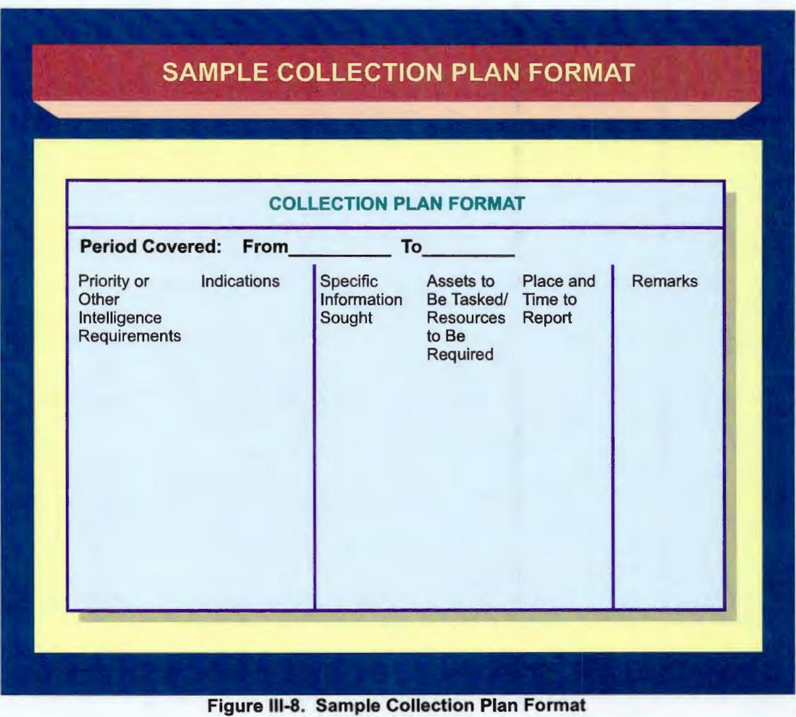

c. Resource Availability and Capability. After defining the requirement, the collection manager determines the availability and capability of collection assets and resources that might contribute to requirement satisfaction. A set of key EEIs is developed that can be used to compare characteristics of the requirement's target with the characteristics of available assets or resources to determine colection suitability. Capability factors are shown in Figure III-9.

(1) Key Element Sets. Key elements are the parameters of the target's characteristics that can be compared with the characteristics of the available assets and/or resources and serve as discriminators in discipline and/or sensor selection. A complete set of key elements provides the basis for identifying sensors fully capable of performing the collection task. The key elements commonly considered are target characteristics, range to the target, and timeliness.

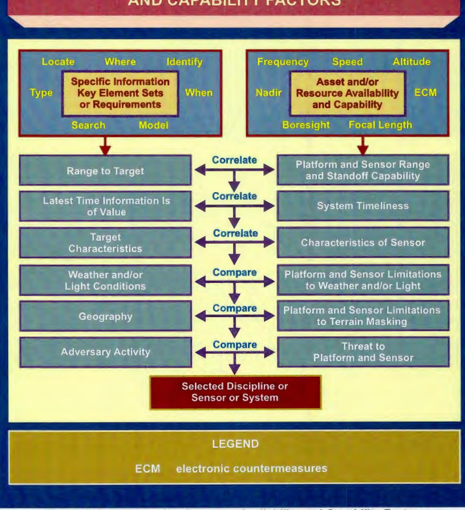  
Figure Ill-9. Asset and/or Resource Availability and Capability Factors

(a) Target characteristics are the discernible physical, operational, and technical features of an object or event. These characteristics may be observable and/or collectible. Observables are the unique descriptive features associated with the visible description of the target, whether it is specific units, equipment, or facilities. Collectibles are the unique descriptive features associated with emanations from the target. Observables are associated with GEOINT and HUMINT/CI, collectibles with SIGINT, and both are associated with MASINT. One or more target characteristics may be associated with a key element, and these characteristics can be compared to a sensor or sensors' capability to collect. From the continuation of this process for each of the collection disciplines, a complete key element set is developed for the target.

(b) Range is measured as distance from a predetermined reference to the target location. The range to the target can be used to quickly eliminate from consideration both those standoff sensors that are unable to cover the target area and those sensors on penetration platforms not capable of reaching the target area. In HUMINT/CI, the analogous consideration would be the source's access.

(c) Timeliness is when the information requested must be received in order to be of value (latest time information is of value [LTIOV]). In order to ensure timeliness, CRM planners must consider the entire intelligence process—not only collection time, but also the lead time required for processing and exploiting collected data and disseminating the resulting information.

(2) Collection Capabilities Factors. CRM translates the capabilities and limitations of the available sensors, systems, or disciplines into a set of collection capability factors that can be directly compared with the key element sets. The capabilities and limitations of various disciplines and systems are considered, together with their availability, to decide whether they should be tasked. Sensor capability factors are technical or performance characteristics, range, dwell time, revisit times, and timeliness.

(a) Performance characteristics are concerned with the system's ability to collect the requested information, output quality, and location accuracy.

$\underline { { 1 . } }$ A system within a particular discipline may or may not be able to collect information on a particular target. For example, SIGINT collection systems operate in discrete frequency ranges; therefore, if the adversary system being sought operates outside those ranges, that particular collector is not viable as a potential source.

2. The data quality relates to the level of detail that can be derived from the collected information. For example, diferent imagery systems provide varying degrees of image resolution.

3. The importance of location accuracy depends on the planned use of the information collected. For example, information collected for targeting purposes, particularly in support of coordinate-seeking weapons, demands greater locational accuracy than information collected for updating OBs.

(b) Platform/sensor range deals with the system's ability to provide target coverage. This characteristic is used to determine which platforms are capable of reaching a location to bring its sensors to bear on the target area. This location is determined by limitations of the operational environment (primarily weather and threats), commander's guidance and rules of engagement, the physical capability of the platform to reach the specified location, and, where applicable, platform/sensor data transmission/receive ranges (e.g., airborne tether). The collections requirements manager assesses combinations of these various range factors to determine a sensor's potential to meet operational requirements.

(c) Dwell time is the length of time a given collector can maintain access to the target, an important consideration in persistent surveillance, tracking, threat warning, and time-sensitive targeting scenarios, especially those involving mobile targets.

(d) Revisit time is the period an asset or resource can return and acquire additional collection against a specific target or issue. Revisit times may be hours to days and may have a direct impact on a requirement that calls for multiple collections within a specified timeframe. In some cases, a gap in collection is desired in order to acquire indications of change that may be suspected.

(e) Timeliness considers the time required to complete each collection event and is calculated or estimated for each available sensor based on the tactical situation and the local circumstances (see Figure II-10). Times vary depending on mission priority assigned, specific system availability, time required to plan the mission, and related information processing and dissemination means. These times are added to find an overallelapsed time, which is then compared with the LTIOV. If the system's timeliness exceeds the LTIOV, then it fails to contribute to satisfying the specific requirement and should not be considered for collection planning purposes.

(3) Correlation. Target collection and target characteristics are correlated with sensor capabilities. Specifically, key element sets are compared with collection capability factors to provide a preliminary list of sensors that are technically able to collect the desired data within the range to the target and time required.

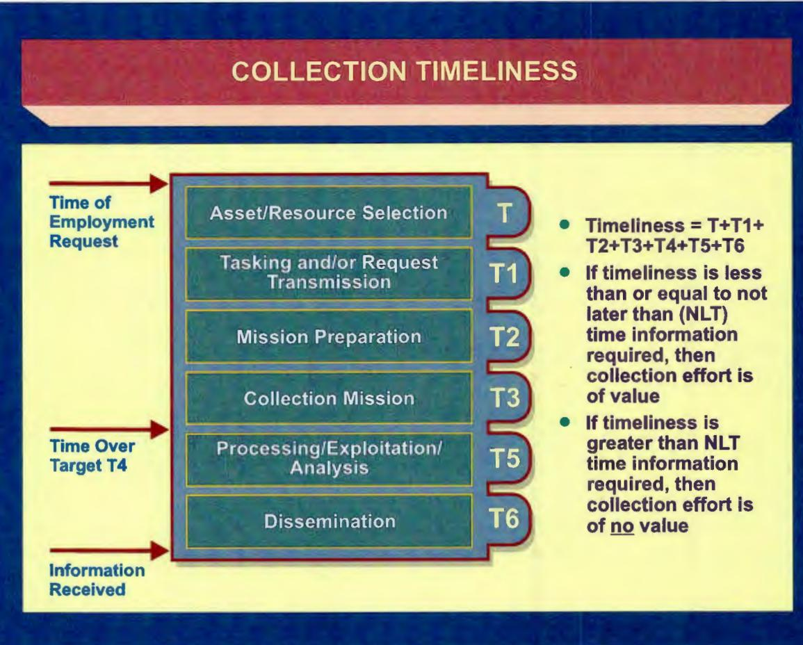  
Figure Ill-10. Collection Timeliness

(4) Operational Environment Factors. After correlation, the candidate sensors are compared with operational environment factors to support final sensor selection. Those operational environment factors include the threat, terrain, contamination, solar position, electromagnetic interference, and weather that might influence the particular discipline or sensor selection. Depending on the operational environment factors, a technically capable sensor may be dropped from consideration.

(a) Sensor vulnerability is the degree to which adversary countermeasures may affect the collection platform and/or sensor. In general, the sensor platforms that must penetrate adversary territory or airspace are the most vulnerable, stand-off sensors less so, and satellite sensors the least vulnerable (though not completely invulnerable). Threat assessment is an evaluation of risk (military risk and political sensitivity) versus inteligence gain. When so designated by the commander, sensitive reconnaissance operations can be employed within predetermined high-threat areas. Such operations require additional protective measures, some of which involve increased and/or specialized tasking of intelligence assets looking for adversary reactions that may require a threat warning alert.

(b) Weather and light conditions are also considerations, particularly with electro-optical sensors. Weather conditions in and around the collection area may affect the collection platform and/or sensor capability to "see"” the area.

(c) Terrain is also a consideration. It may mask a target, thereby dictating both the choice of platform and the direction a sensor must point.

(d) CBRN contamination may be present from the use of warfare agents or materials, collateral damage, or release other than attack. Selection criteria for sensors must include their vulnerability to contamination, their ability to withstand decontamination, and their potential for spreading contamination. This concept is known as CBRN survivability.

(5) Availability. The list of viable collection disciplines, systems, and sensors is reviewed for current availability (to include estimated downtime if not available) and the addition or deletion of capabilities. Coordination with adjacent and higher HQ and national agencies will determine the availability of theater and national resources.

# d. Task Assets or Request Tasking of Resources

(1) The collection manager begins by considering the highest priority requirement, then proceeds through the active requirements list to determine how each request can be satisfied (see Figure I-1 1). The manager for CRM transmits to the manager for COM the requirements and recommendations for planning, scheduling, and control of the prioritized list. The resulting tasking provides specific guidance that identifies the activity to undertake collection operations, the target to be covered, the date-time the mission is to be accomplished, and the place and time data is to be reported. Collection tasking includes PED, tasking, guidance, and instructions.

# COLLECTION TASKING WORKSHEET

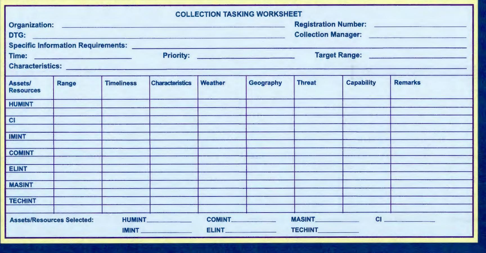  
Figure Il-11. Collection Tasking Worksheet

(2) Collection to satisfy the requirement may occur at any level. For example, if a CCDR determines that the information needed to answer an RFI is unavailable, the commander may task collection assets or request multinational or national-level support to satisfy the requirement. When preparing the tasking and/or request, consideration should be given whether to integrate the requirement into an ongoing, planned, or new mission.

(3) Tasking request forms or messages are dependent on the tactical situation, type of sensor, and type of asset or resource (i.e., supporting, theater, national, or multinational). Many specific data elements in these requests and the transmission procedures are classified. In the case of assigned and direct support assets, requesters follow instructions provided in the OPLAN or OPORD intelligence annex or by message. In addition, the Joint Tactical Exploitation of National Systems Manual, DIA manuals, and the classified DIA HUMINT Executor-M-3301.001, DIA HUMINT Manual, Volume I: Collection Requirements, Reporting, and Evaluation Procedures, provide guidance for requesting support from national resources, establish procedures, and authorize responsibilities within the collection enterprise. In preparing requests for national resources, the collection manager should consider the guidelines in Figure II-12.

(4) Intelligence Collection Strategy. A collection strategy is a systematic scheme to optimize the effective and efficient tasking of all capable, available, and appropriate collection assets and/or resources against requirements. Collection system effectiveness is determined by analyzing the capability and availability of ISR assets and resources to collect against specific targets. Collection system efficiency is determined by comparing the appropriateness of all available and capable ISR assets to collect against specific targets in a given environment. For example, an RC-135 might provide a greater collection capability than is required to support a given mission. In such situations, an RC12 Guardrail might be sufficiently capable of meeting the joint force's requirements, and would therefore serve as an appropriate substitute for the more capable RC-135, which could be more efficiently used elsewhere. The collection strategy considers all outstanding intelligence requirements, their relative priority, and the immediate tactical situation.

(a) Resource integration is a process whereby a new collection requirement is integrated with current or planned missions to increase the efficiency of the overall collection effort. By tasking a mission already in progress, it may be possible to reduce timelines, make collection more responsive to the request, and decrease cost and risk. This is weighed against the priority of scheduled targets that may have to be dropped to accommodate new targets and the impact of a mission change on the effectiveness of the ongoing mission. In cases where intelligence collection assets may augment and clarify ongoing threat warning events, a rapid intelligence gain/loss assessment must be made and agreed upon by ISR planners for retasking of collection missions already in progress. Situations may warrant such dynamic retasking of intelligence assets to support the commander's urgent force protection as opposed to intelligence requirements. When integration of a new collection requirement with current or already planned missions is not feasible, a new mission should be planned.

(b) While one source may be suitable to collect against different requirements, in some cases multiple sources are necessary to satisfy a single, high-priority requirement.

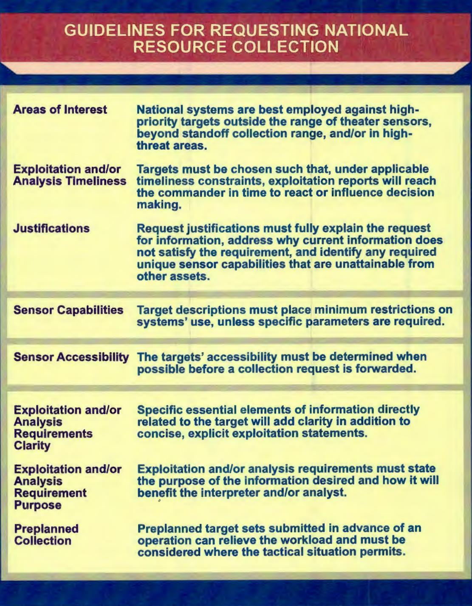  
Figure Ill-12. Guidelines for Requesting National Resource Collection

Tipping is the use of one intelligence discipline, asset, or sensor type to cross-cue or initiate collection by a more precise sensor. In some cases, cueing, tasking, and collection activities may be semiautomated to optimize and speed the intelligence process.

(c) Asset mix and/or redundancy uses a combination of assets of differing disciplines (asset mix) or similar disciplines (asset redundancy) against high-priority targets. When the probability of success of one sensor to completely satisfy the requirement is lower than acceptable, the use of multiple capabilities of different systems or disciplines is required to increase the likelihood of success. Asset mix or redundancy places greater demands on the limited assets and/or resources available and has to be clearly justified by the potential intelligence gain.

(d) Across the range of military operations, collection strategies against highvalue targets should emphasize and provide for the near-continuous, al-weather, day/night surveillance of the target through the efficient utilization of all appropriate ISR assets in persistent surveillance, as opposed to periodic reconnaissance, mode. Persistent surveillance, as part of a collection strategy, enables timely decisions by the commander and the effective use of precision-guided munitions and is critical to countering the adversary's use of military deception (MILDEC). Long-dwell ISR platforms such as remotely piloted aircraft, distributed undersea and unattended ground sensors, battlefield surveillance radars, and special operations forces (SOF) have enabled a paradigm shift in which it is possible to provide continuous surveillance over large portions of the area of interest to monitor, tag, track, characterize, and report on movements and activities associated with the target. Persistent surveillance is facilitated by the effective integration and synchronization of all theater and national ISR assets and resources in a coherent collection strategy. Because persistent surveillance depends heavily on resources that are in high demand and usually few in number, requirements for persistent surveillance must be prioritized.

e. Evaluate Reporting. The evaluation process tracks the status of collection requirements and provides feedback to the requesters. Monitoring outstanding requirements ensures that orders and requests for collection activities are understood and the right information is being sought. When the collection results are provided, the collection manager evaluates the report(s) for completeness, ensures that the requesters receive a copy, and determines, in conjunction with the requester, if the requirement has been satisfied. Requester feedback establishes customer satisfaction, permits tasking deletion, and frees collection assets and resources to be redirected to satisfy other active requirements.

f. Collection Plan Update. Based on the requester's assessment of requirement satisfaction, the collection manager reviews priorities for currency. The collection plan is updated to include retasking (if the requirement is not satisfied), adding new requirements, or canceling satisfied requirements.

# 14. Collection Operations Management

The COM process organizes, directs, and monitors the equipment and personnel that and who actually collect the data to satisfy requirements. COM develops strategies for collection against requirements in cooperation with CRM; predicts how well a system can satisfy requirements; evaluates the performance of the collection systems; allocates and tasks collection assets and/or resources and processing and/or exploitation systems; and monitors and reports the operational status of collection systems (see Figure II-13). The COM process is directly linked to collection plan execution through ISR visualization.

# a. Collection Mission Planning

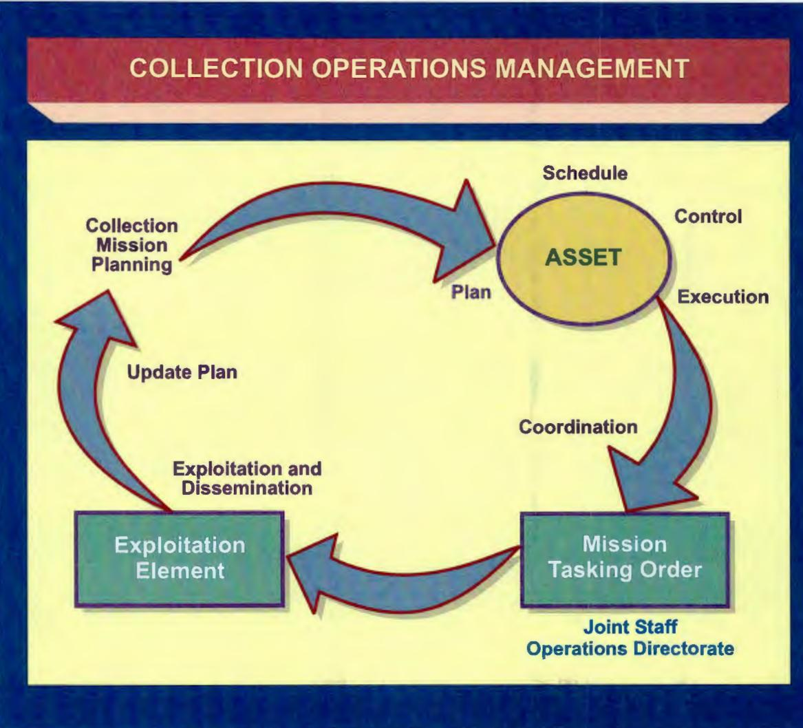  
Figure Il-13. Collection Operations Management

(1) Planning is concerned with the identification, scheduling, and controlling of collection assets and/or resources. The operations planner reviews mission requirements for sensor and target range, system responsiveness, timeliness, threat, weather, and reporting requirements. These elements are considered with the detailed technical, administrative, and logistic data of the collection system to identify and determine asset and/or resource availability and capability. The requirements are then translated into specific mission tasking orders.

(2) The CCMD J-2 staff/JIOC and J-3/joint reconnaissance center need to dynamically manage theater ISR assets. They also need to ensure ISR support is synchronized with the CCDR's intent, national requirements, campaign objectives, operational objectives, and other guiding priorities as established by the components. In parallel, the CCDR, through the batle staff and supporting intelligence analysts, obtains and maintains access to processed and unprocessed intelligence data and products to determine mission accomplishment and/or requirement satisfaction. With aircraft collection platforms in particular, many different staff elements are involved: operations, weather, maintenance and logistics, and communications. They must all be closely integrated into the mission planning efort. Intelligence sensor planners and managers of processing and exploitation elements must fully understand the requirements and mission profile. It is strongly recommended that COM personnel and resources be located in proximity to the operations staff elements that are responsible for tasking reconnaissance assets.

b. Execution. A mission tasking order or mission type order goes to the unit selected to be responsible for the accomplishment of the collection operation. The selected unit makes the final choice of specific platforms, equipment, and personnel based on such operational considerations as maintenance schedules, training, and experience.

c. Exploitation. Exploitation of collected information is closely associated with the management of collection assets and resources. Generally, the staff that allocated a collection capability also controls the sensor-unique PED equipment. Exploitation is discussed further in Section C,"Processing and Exploitation," and dissemination in Section E,"Dissemination and Integration."

d. Collection Planning Update. Following exploitation, the report or processed data is disseminated to the requester. If the data is insufficient, the requester coordinates with the collection manager for additional coverage. At this point, the processed requirement transitions back to theCRM function.The collection manager and the exploitation manager in coordination with requesters, continually assess how collection operations quality and timeliness may be improved. This effort relies heavily on supporting organizations and other units or agencies that own and operate collection and exploitation assets or resources.

"Our satellites and plaforms that collect ISR [intelligence, surveilance, and reconnaissance] data had dificulty in a real-time, emerging target situation like we had in Kosovo. It's not that we can't do it, it's that we don't practice it.no target ever died in the collection process.we don't pop the cork when the picture arrives; we pop the cork when the target is dead."

General John Jumper Commander, United States Air Force Europe, 1999

# 15. Intelligence, Surveillance, and Reconnaissance Visualization

ISR visualization is a subset of the COP available in the Global Command and Control System (GCCS) and Service C2 communications systems. It is an enabling capability within the COP that facilitates coordination and synchronization of ISR activities supporting the joint force and component commands. This visual planning and decisionmaking aid is supported by a common data set of planning and execution information and by a process performed by the joint force and component command staffs that ensures continuous and responsive synchronization of current intelligence collection with current joint operations. The ISR visualization process is a J-2/J-3 and Service team effort intended to bridge the gaps between national, operational, and tactical level ISR systems and to fuse their activities to the joint force's operational tempo. ISR visualization facilitates a timesensitive decision-making process driven by a rapidly changing operational environment.

ISR visualization optimizes the use of limited ISR collection assets, contributing NRT ISR information that promotes persistent surveillance of the area of interest and enhances the JFC's battle management of the operation. Successful ISR visualization is contingent on timely reporting of ISR assets status, vigilant maintenance of the COP and its supporting data set, and successful integration with ISR asset ground station activities (see Figure III14).

a. ISR Display. ISR visualization provides an easily comprehended, readily accessible, graphic display that depicts the current and future locations of ISR assets, their capabilities, their field of regard, and their tasked targets. ISR visualization requires continuous feedback regarding the current and projected locations of all ISR assets relative to their planned ground tracks. The ISR visualization display correlates in real time the collection status and location of all planned collection targets and the specific ISR asset tasked to collect on each target. ISR visualization displays also depict the effects of the operational environment, to include METOC effects, on the collection capabilities of individual airborne ISR platforms as they progress along preplanned or ad hoc flight paths (e.g., the impact of terrain masking on sensor fields of regard at various altitudes). ISR visualization includes both collateral-level and sensitive compartmented information (SCID)- level displays.

b. ISR Visualization and Current Operations. ISR visualization is integrated in NRT with current military operations. From planning through execution, ISR visualization provides the J-2/J-3 a valuable tool for conducting ISR operations and rapidly responding to changing collection requirements. ISR visualization is merged with JIPOE products such as event and decision support templates. The interface between ISR visualization and JIPOE products is crucial and helps to optimize collection opportunities by projecting the possible future locations of adversary time-sensitive targets in time and space. Additionally, in order to assess the risk to ISR operations, ISR visualization includes current intelligence overlays depicting changes in adversary defensive capabilities. ISR visualization facilitates the integration and synchronization of the joint force's and component commands' ISR activities and capabilities.

c. Time-Sensitive Decision Making. Based on the current military situation and the overall ISR picture, ISR visualization helps the commander and J-2/J-3 identify fleeting opportunities for intelligence collection or strike operations against adversary time-sensitive targets that may warrant dynamic retasking of collection platforms or re-targeting of strike assets. Additionally, time-sensitive decision making is directly enhanced by ISR tasking and support to friendly force situational awareness and combat identification efforts. ISR visualization also helps clarify ambiguous operational situations by optimizing the reconnaissance and surveillance of possible new targets or emergent, high-probability threats to friendly forces developed through intelligence tip-offs. At the request of, and in coordination with, the J-3 current operations staff, the J-2 collection management staff forwards a request for dynamic retasking to the controlling authority of the most appropriate ISR asset. The collection operations manager controlling the ISR platform accomplishes the actual retasking of the appropriate collection asset.

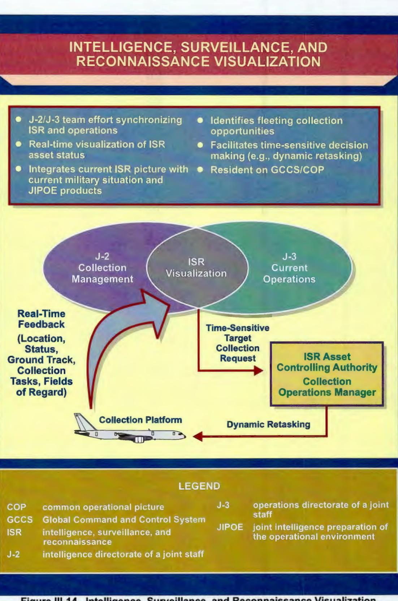  
Figure Ill-14. Intelligence, Surveillance, and Reconnaissance Visualization

d. ISR Visualization Architecture. At the joint force level, personnel performing ISR visualization maintenance in support of current operations should be fully integrated into the joint force J-3 current operations element, either through physical collocation or by virtual connectivity. Likewise, the joint force's ISR visualization operation must be integrated and interoperable with corresponding ISR battle management operations conducted at the component commands. A common set of ISR visualization tools provided through the joint GCCS and Service C2 communications system variants must be fully integrated into these battle management operations and must support the commander's information requirements through the COP.

For a more detailed discussion of JIPOE products and ISR, see JP 2-01.3, Joint Intelligence Preparation of the Operational Environment.

# SECTION C. PROCESSING AND EXPLOITATION

# 16. Overview

During processing and exploitation, collected data is correlated and converted into a format suitable for subsequent analysis and production of intelligence. Processing remains distinct from analysis and production in that the resulting information is not yet fully subject to analytical assessment. Nevertheless, relevant time-sensitive information resulting from processing and exploitation (especially targeting, personnel recovery, or threat warning information) should be immediately disseminated to decision makers (to facilitate timely operations) and to intelligence personnel (for all-source intelligence analysis). Processed data should be automatically integrated with existing information in the GCCs COP to provide the most current view of the operational environment (see Figure II15).

a. At the CCMD level, the J-2 manages theater processing systems and capabilities. Prior planning is critical to ensure that preparation is made for system interoperability problems that may arise from a complex joint, interagency, and multinational systems and communications environment. The potential for operations involving both nonmilitary organizations and NGOs complicates this environment. The J-2 should consider these factors and be flexible in developing work-around procedures. Intelligence processing elements should be prepared to set up both US-only and multinational segments.

b. Processing and exploitation of collected information by the components and their subordinate units is closely associated with the effective management of ISR assets. Normally, the collection operation element also controls the sensor-unique processing, exploitation, and analysis equipment. Various exploitation capabilities exist to serve several different collection systems. The exploitation manager must plan the workload and develop a priority system for accomplishing the work, to include reporting status of ISR assets.

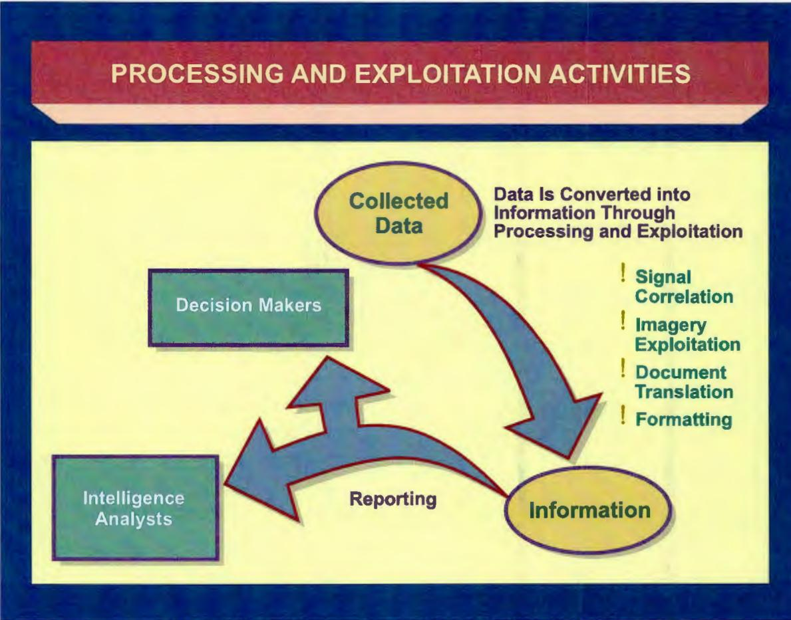  
Figure Ill-15. Processing and Exploitation Activities

# 17. Human Intelligence

HUMINT is a category of intelligence derived from information collected and provided by human sources. Processing of HUMINT information primarily involves report preparation by collection activities at both the joint force and component levels. Processing may also be accomplished within the joint force J-2X. Exploitation of human resource reporting is conducted by the JIOC and joint force analytical and/or production activities; this primarily involves analyzing HUMINT reporting for inclusion in all-source production and/or for database maintenance, but might also include HUMINT/CI targeting and source validation. Documents and media captured by US and allied personnel are processed outside HUMINT channels at J-2 JDECs, if established. All captured documents and media should be forwarded to the JDEC for centralized processing and safeguarding.

Additional information on the J-2X organization and responsibilities can be found in JP 2- 01.2, Counterintelligence and Human Intelligence Support to Joint Operations.

For more information on DOMEX, refer to Appendix C, "Document and Media Exploitation.

# THE CAPTURE OF THE GERMAN ROCKET SECRETS

Early in 1929, German engineers had begun studying rocket and jet propulsion to be used for transporting mail. In 1933, when Adolf Hitler became Chancellor, these studies were shifted to military uses, and the scientists were instructed to explore allideas, however fanciful. Huge sums were made available to the Speer Ministry, where Dr. Wernher von Braun and a group of scientists conducted rocket research. The research enabled the "doomsday" weapons of the era to be produced, the best known of which were the V-1 rocket and V-2 ballistic missiles.

In the spring of 1945, as the outcome of World War llin Europe became more and more apparent, a principal focus of Us intelligence units in Europe was to capture all possible information pertaining to rocket weapons. Accordingly, these units followed closely behind advancing Allied forces, particularly in the Black Forest area where technical personnel with key documents from the Speer Ministry had scattered under heavy pressure of aerial bombing in Berlin. It was up to the intelligence units to find these individuals and gain information from them. The search began by interrogating the Germans who were in custody as a result of the Allied advance.

This method of collection, while painstaking, proved fruitful. Through such interrogations, Us intelligence officers learned that the former director general of German rocket production, George Richkey, was in captivity, working in a salt mine in the Black Forest. The following is the account of Norman Beasley, who told the story of his brother, Colonel Peter Beasley, the senior intelligence collection officer in the area.

"'ve got a job for you that is different than working in the salt mine,' Colonel Beasley told Richkey at the first interrogation. 'I want you to begin right now writing out a full description of yourself and all the activities of the V-2 factory.'

When Richkey's report was completed, Colonel Beasley made it clear, 'we accept you as an official of the German Government; we have patience and time and lots of people you have lost the war and so as far as I am concerned you are a man who knows a lot about rockets. As an American officer, I want my country to have full possession of all your knowledge. To my superiors, I shall recommend that you be taken to the United States.'

Richkey nodded his assent, explained he was a scientist and wanted only to develop his knowledge in pleasant surroundings, such as the United States, and agreed to tell where the records were hidden, and to show the colonel the place.

Only hours later, under a heavily armed escort, Richkey led Colonel Beasley into the Black Forest to a cave, 5 feet wide and 5 feet high, running 300 feet into a mountain. There, records were found intact. Upon examination, the records disclosed basic blueprints, worksheets, engineering tables, and advanced plans for virtually every secret weapon in the possession of German scientists."

SOURCE: Norman Beasley, The Capture of the German Rocket Secrets, and Military Intelligence: Its Heroes and Legends, compiled by Diane L. Hamm, Us Army Intelligence and Security Command History Office, October 1987

# 18. Geospatial Intelligence

a. GEOINT is the exploitation and analysis of imagery and geospatial information to describe, assess, and visually depict physical features and geographically referenced activities on the Earth. GEOINT consists of imagery, IMINT, and geospatial information. GEOINT provides the geographical context to precisely locate, analyze, and monitor activities and provide the basis for developing shared awareness of the operational environment. GEOINT supports operations across the range of military operations from the national level to the CCMDs, the JTF, and below. All functions within a military HQ use geospatially referenced information to fuse, visualize, analyze, and share information for operational awareness and decision making. The GEOINT cell at the CCMD coordinates closely with the JFC's GEOINT cell to ensure continuity in operations across all functions, organization levels, and levels of warfare.

(1) When properly maintained and ready for access, GEOINT enables area familiarization, area monitoring for I&W, feasibility assessment, preliminary planning, peacetime operations, and emergency operations worldwide. Once intensified and refreshed for an operational area in response to mission needs, it supports detailed mission planning, mission rehearsal, and combat and stability operations.

(2) GEOINT activities necessary to support joint operations include capability to define GEOINT requirements; discover and obtain GEOINT; put GEOINT in a useable form; and then maintain, use, and share GEOINT. The GEOINT cell interfaces directly with mission customers to define user requirements and then interfaces with the National System for Geospatial Intelligence (NSG) to obtain and provide the best quality GEOINT possible directly to the joint warfi ghter in fulfillment of the broad range of requirements depicted by the various mission functions.

(3) NGA conducts GEOINT processing, analysis, and production at the national level, supporting strategy and policy development, operational planning, and tactical missions. Joint, Service, and theater organizations also have the capability to process and exploit GEOINT and combine it with operational data and intelligence from other sources (blue and red force disposition, historical adversary action, population data, SIGINT, etc.) to create tailored GEOINT products for operational planning and tactical missions. These products include, but are not imited to basic geographic information on charts or maps, realistic mission simulations (ground, air, or sea), input to the COP, or two-color multi-view images indicating OB changes, troop movements, or significant geographic changes.

b. Imagery may be processed and exploited at multiple locations simultaneously, both in and out of theater, by the JIOC or equivalent, component command intelligence units, Service intelligence centers, and national intelligence organizations. The JIOCs, or other organizations, process the digital data and display the down-linked imagery on a workstation in soft copy form for immediate exploitation. The imagery can also be sent to a digital library for later use. Imagery exploitation results, such as reporting, annotated images, and shape files, may be incorporated into an all-source product focusing on a given target or target type, topic, or activity. IMINT may also be used to update databases resident with Global Command and Control System Integrated Imagery and Intelligence (GCCS-I3). Non-time-dominant exploitation results may be distributed via normal dissemination methods.

c. Geospatial information identifies the geographic location and characteristics of natural or constructed features and boundaries on the Earth, including statistical data and information derived from, among other things, remote sensing, mapping, and surveying technologies; and mapping, charting, geodetic data, and related products. Geospatial information provides the basic framework for visualizing the operational environment. The geospatial component of information allows for fusion, visualization, analysis, and sharing based on geospatial capabilities. It may be presented in a variety of forms: printed maps, charts, and publications; digital databases; photographs; or digitized maps and charts or attributed data.

# 19. Signals Intelligence

SIGINT support to joint operations includes communications intelligence (COMINT), ELINT, and foreign instrumentation signals intelligence (FISINT). COMINT processing is accomplished by NSA/CSS elements either assigned to or in support of the joint force mission. Depending on the level required for subsequent analysis and reporting, processing may be performed by assigned units in the operational area, at the regional JIOCs, or by specialized Service component or Defense activities. ELINT processing in support of a joint force may come from a number of sources including assets attached to the joint force, national ELINT centers, and CCMD JIOCs. FISINT processing is accomplished by specialized, national-level Service and DOD organizations. Requests for SIGINT support should be forwarded through the theater J-2 to the NJOIC for tasking to the appropriate organizations. Where applicable, requests for SIGINT support should be entered into approved systems such as PRISM, for approval by the designated signals intelligence operational tasking authority (SOTA).

# 20. Measurement and Signature Intelligence

MASINT provides technically derived intelligence to detect; tag, track, and locate; and describe the specific characteristics of fixed and dynamic target objects and sources. As an integral part of the all-source collection environment, MASINT contributes both a unique and complementary information component to the information requirements of commanders.

Specialized MASINT processing and exploitation techniques on collected raw data may be able to broaden the usefulness of data collected by other intelligence systems. MASIN'T is employed as a global system with capabilities to exploit opportunities worldwide. Service S&TI centers play a critical role in processing, exploiting, and analyzing MASINT data. Additionally, the Services generate MASINT products in support of their respective components assigned to joint forces. The resulting MASINT products contribute to but are not limited to I& W, JIPOE, force protection, and foreign materiel exploitation. In addition, MASINT provides intelligence on WMD capabilities as well as weapons system capabilities based on analysis of collected telemetry data.

# 21. Open-Source Intelligence

OSINT is obtained from commercial radio and television broadcasts, computer and Web-based sources, newspapers, magazines, and other written publications. OSINT processing transforms (converts, translates, and formats) text, graphics, sound, and motion video in response to user requirements. For example, at the national level, the DNI Open Source Center (OSC) provides translations of foreign broadcast and print media. OSINT is also available from commercial companies that collect information using their own assets or that buy informnation from independent contractors who listen to daily radio/television news broadcasts, and/or read daily newspapers.

# 22. Technical Intelligence

a. Exploitation of captured adversary equipment can provide critical information on adversary strengths and weaknesses that may favorably influence operation planning. Exploitation of adversary equipment, excluding computer storage media, video and digital recording media, and media equipment, is generally performed in the CCMD by a joint captured materiel exploitation center (JCMEC), which is staffed by Foreign Materiel Program personnel from the Services' technical intelligence (TECHINT) organizations and Naval Explosive Ordnance Disposal Technical Division. CCMDs or subordinate joint forces should notify the NJOIC through command channels when they require JCMEC support. This will help to ensure that appropriate Service component resources are requested to meet the support requirement.

b. Traditional technical intelligence processes were replaced in Iraq and Afghanistan by more responsive exploitation and collections activities to address the enemy's rapid improvisation of weapons, IEDs in particular, on the battlefield. To meet the asymmetric weapon threat posed by insurgents, there is the need to embrace nontraditional players, accommodate newly formed capabilities, and incorporate a technical and forensic exploitation process at all levels of command. There has been a paradigm shift in commanders' expectations for battlefield recovery and exploitation of captured or found enemy materials and weapons, both conventional and improvised. They demand rapid feedback from the exploitation process at all levels. This is driven by the requirement to maximize the intelligence value of an IED event or cache find to facilitate the following:

(1) Develop force protection measures.

(2) Support dynamic intelligence-led targeting.

(3) Source IED components and weapons of concern.

(4) Provide evidence to link a detainee to a particular event, weapon or device in support of the rule of law.

c. WTI evolved from traditional TECHINT and leverages an enterprise architecture that spans tactical collection through strategic forensic/technical processing and exploitation to focus on IEDs, associated components, improvised weapons, and other weapons systems. This includes site exploitation, forensic material handling and chain of custody, technical characterization, latent biometrics collection and analysis, electronic engineering, and the application of forensic science and the analysis of its findings. WTI utilizes the processes and capabilities of BEI and FEI to support targeting, force protection, component materiel sourcing, and legal prosecution of detainees.

(1) BEI is derived from the collection, processing, and exploitation of biometric signatures; the contextual data associated with those signatures; and other available information that answers a commander's or other decision maker's information needs concerning persons, networks, or populations of interest.

(2) FEI is derived from the collection, scientific analysis, and exploitation of materials, weapons, equipment, output signals, and debris that link persons, places, and events to produce tactical and strategic intelligence in support of the JFC and national decision makers. FEI includes, but is not limited to the following scientific areas: deoxyribonucleic acid, CBRNE analysis, chemistry, metallurgy, firearms and tool marks, fingerprint analysis (record and latent prints), facial and voice recognition, image analysis, video forensics, captured documents, and trace material analysis.

# 23. Counterintelligence

CI uses collection techniques that are similar to HUMINT, but CI targets those entities that are targeting friendly forces, a more narrow focus than HUMINT. Nonetheless, exploitation of data collected by CI assets can yield information critical to I&W and force protection. Service component CI elements conduct CI collection using liaison; elicitation; passive collection; review of open sources; military CI collections; and screening, interviews, and debriefing of displaced persons, defectors, refugees, and US persons with access to information of CI interest. Additionally, law enforcement information and suspicious activity reports are important sources of information that need to be processed, exploited, and fused with other CI sources. Processing of CI information primarily involves report preparation by collection activities at both the joint force and component levels. At the joint force level, this processing may also be accomplished within the J-2X.

For more detailed information regarding CI processing, exploitation, and reporting, see JP 2-01.2, Counterintelligence and Human Intelligence Support to Joint Operations.

# SECTION D. ANALYSIS AND PRODUCTION

# 24.Overview

a. Intelligence analysis and production is accomplished in response to expressed and anticipated user requirements. Intelligence (in the form of both products and services) responds to the chain of command and the decision-making authority it supports; US policy decisions and military operational requirements; and changes in strategy, tactics, equipment, and overall capabilities of US and foreign military forces. Fused joint intelligence assessments, such as assessments of the current state of the operational environment, assessments of how the situation might affect friendly or adversary forces, current assessments of military capabilities, and estimates of adversary COAs assessments, are also frequently used to present the most thorough and accurate intelligence to support the JFC's decision-making process.

b. Intelligence is produced through the integration, evaluation, analysis, and interpretation of information from single or multiple sources. Intelligence production must be coordinated and directed by the J-2 to provide nonduplicative all-source intelligence products to the requester. Production for joint operations is accomplished by organizations at every echelon from national to subordinate joint force level. Effective production management ensures that the CCDR and/or subordinate JFC receives the intelligence products and services required to accomplish the assigned mission. Automated database systems provide current tailorable data appropriate to the mission (see Figure III-16).

# 25. Conversion of Information into Inteligence

a. Data initially received from the sensor arrives in various forms depending on the nature of the sensing device. Depending on the source, the raw input may be in the form of digitized data, unintelligible voice transmissions, large digital files containing unrectified images of the Earth, or spools of unprocessed film. In order to be usable for a planner, decision maker, or intelligence analyst, this raw data must first be processed into an intelligible form. Trained intelligence specialists resident at JIOCs, JISEs, Service components, Service intelligence centers, and intelligence combat support agencies typically convert raw data into usable information by processing and exploiting the data (see Figure III-17). The amount of time required to complete this process depends on the type of sensor and data transmission method. It could range from minutes to days.

(1) In the first step, collection output is converted by sensor-specific processing measures into visual, auditory, or textual information that is intelligible to humans.

(2) A separate process is required to further translate and contextualize the information that results from initial processing. It is not until the end of this step that the planner, decision maker, or intelligence analyst can cognitively assimilate the information.

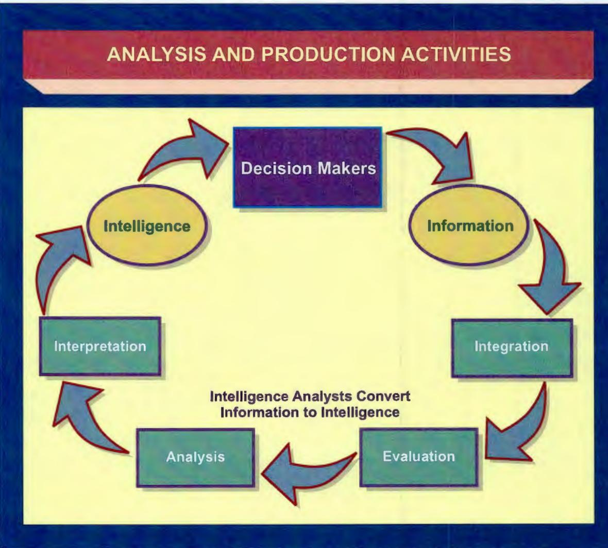  
Figure Il-16. Analysis and Production Activities

b. CCDRs require timely access to crucial, relevant information; therefore, intelligence producers must continually balance access requirements with the need to protect sources and methods. Intelligence-producing agencies must make information available to intelligence analysts and other intelligence users at the earliest time possible. Service components, intelligence centers, or intelligence CSAs engaged in the processing and exploitation of collected data should make the resulting information available in libraries, Web pages, databases, or message traffic as soon as the information can be understood by the consumer.

c. Information is converted into intelligence products through a structured series of actions that, although set out sequentially, may take place concurrently. These actions include the integration, evaluation, analysis, and interpretation of information in response to known or anticipated intelligence PRs.

(1) Integration. Information from single or multiple sources is received, collated, and entered into appropriate databases by the analysis and production elements of IC organizations, the theater JIOCs or equivalents, or subordinate joint force JISE. Information is integrated and grouped with related pieces of information according to predetermined criteria to facilitate the evaluation of newly received information.

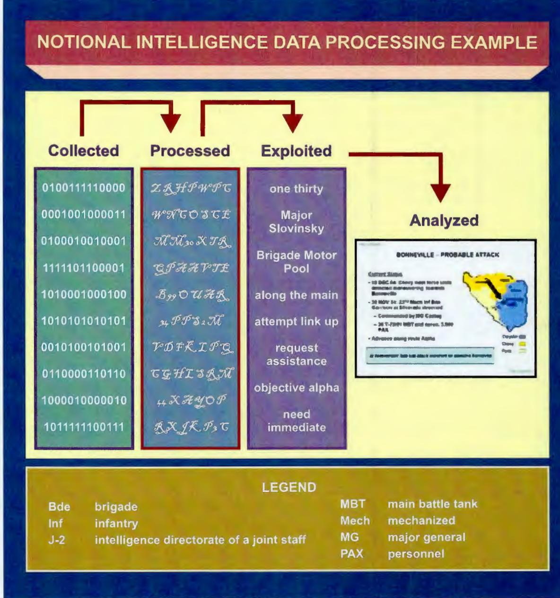  
Figure Il-17. Notional Intelligence Data Processing Example

(2) Evaluation. Each new item of information is evaluated by the appropriate analysis and production element with respect to the reliability of the source and the credibility of the information. An alphanumeric rating is assigned to each piece of information to indicate the degree of confidence the evaluator places on the information. This rating is based on the subjective judgment of the evaluator, the accuracy of previous information produced by the same source, and knowledge of the capabilities of particular sensor systems. The reliability of the source and the credibility of the information must be assessed independently to avoid the possibility of one factor evaluation biasing the other.

(3) Analysis. During analysis, deductions are made by comparing integrated and evaluated information with known facts and predetermined assumptions. These deductions are combined and assessed to discern patterns or recognize events.

(4) Interpretation. Interpretation is an objective mental process of comparison and deduction based on common sense, life experience, military knowledge covering both adversary and friendly forces, and existing information and intelligence. This mental process involves the identification of new activity, recognizing the absence of activity, and a postulation regarding the significance of that activity.

For more information on analytical methodology, see Appendix D, "Analytic Tradecraft."

# 26. Collaboration

Collaboration among intelligence producers is imperative not only to overcome shortages of analysis and production resources, but also to improve the overall quality of intelligence by providing access to recognized, but geographically separated, subject matter experts. Through collaboration, intelligence analysts are able to share information, discuss opinions, debate hypotheses, and identify or resolve analytic disagreements.

a. During crisis situations or contingency operations, some formnal collaboration will be facilitated by preplanned federated intelligence partnerships. However, even in the absence of a federated support arangement, JIOC analysts and their counterparts in other theaters and at the national level should collaborate as the situational requirements dictate. During peacetime, routine, informal collaboration among intelligence analysts should be encouraged within guidelines established by the JFC or joint force J-2.

b. The IC has incorporated a variety of tools on both JWICS and SIPRNET to foster greater collaboration within the IC. For more information on these, see Appendix D, "Analytic Tradecraft."

# 27. Databases and Virtual Knowledge Bases

a. Intelligence databases are repositories of collected data, processed information, and finished intelligence products that provide analysts with the technological means to rapidly retrieve, sort, and correlate relevant information. Intelligence databases are usually designed to support specific requirements and functions, and are therefore often stovepiped according to intelligence disciplines. For example, the NGA National Exploitation System is the repository for imagery analysis and production, and the SIGINT On-Line Information System contains current and historical finished SIGINT products. The stovepiping of information by intelligence discipline or production category limits the potential timeliness and quality of intelligence production, as analysts are forced to search multiple databases for relevant information. Furthermore, as databases grow in volume and complexity, potentially vital pieces of information may become increasingly difficult for analysts to find and retrieve. In order to overcome this limitation, virtual knowledge bases have been designed to serve as integrated repositories of multiple databases as well as reference documents and open-source material.

Intelligence databases are described in greater detail in Chapter V, "'Intelligence and the Global Information Grid."

b. Virtual knowledge bases are essentially databases of databases organized around geographical or topical communities of interest. They provide the means for analysts and intelligence consumers to easily access the most current information and intelligence available in multiple databases and other reference sources. Knowledge bases consist of elements (knowledge objects and knowledge packets) that can stand alone or be combined to make virtual documents that can be tailored to the users' needs. Knowledge bases logically organize intelligence issues in a hierarchy that facilitates analytic problem solving (see Figure II-18). Additionally, dynarnic links among knowledge base elements make it possible to automatically and simultaneously update intelligence products as new information is received.

# 28. Products

Intelligence products produced by or for the subordinate joint force are described below and in Figure II-19.

# a. I&w

(1) The I&W process analyzes and integrates operations and intelligence information to assess the probability of hostile actions and provides suficient warning to preempt, counter, or otherwise moderate their outcome. The focus of I& W varies at each echelon, and is most specific at the operational and tactical levels.

(2) Subordinate joint force I& W relies on tip-offs from all sources at all levels. An integrated and responsive intelligence architecture must be established to satisfy theater requirements. I& W intelligence requirements include the following:

(a) Local or regional government capability to deal with the situation.

(b) Adversary intentions, capabilities, preparations, deployments and related activities, and possible methods of attack.

(c) Adversary motivations, possible triggering events, goals, and objectives.

(d) Changes in adversary force dispositions, military activities, and nobilization status.

(e) IO capabilities in the region.

(f) Activities related to cyberspace attack preparations by regional and international actors with interests in the area.

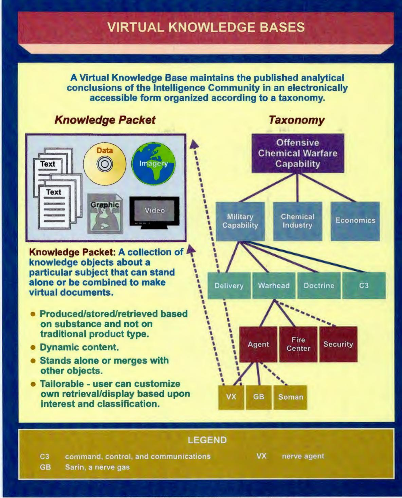  
Figure Il-18. Virtual Knowledge Bases

(g) Required military and civil mobilization preparations prior to military

action taking place.

(h) Nonmilitary activity that could alter the situation, such as drastic changes in either friendly or opposing forces' political, economic, or social situations. Other nonmilitary activities may include environmental factors such as weather, disease, and/or dispersion of TIMs.

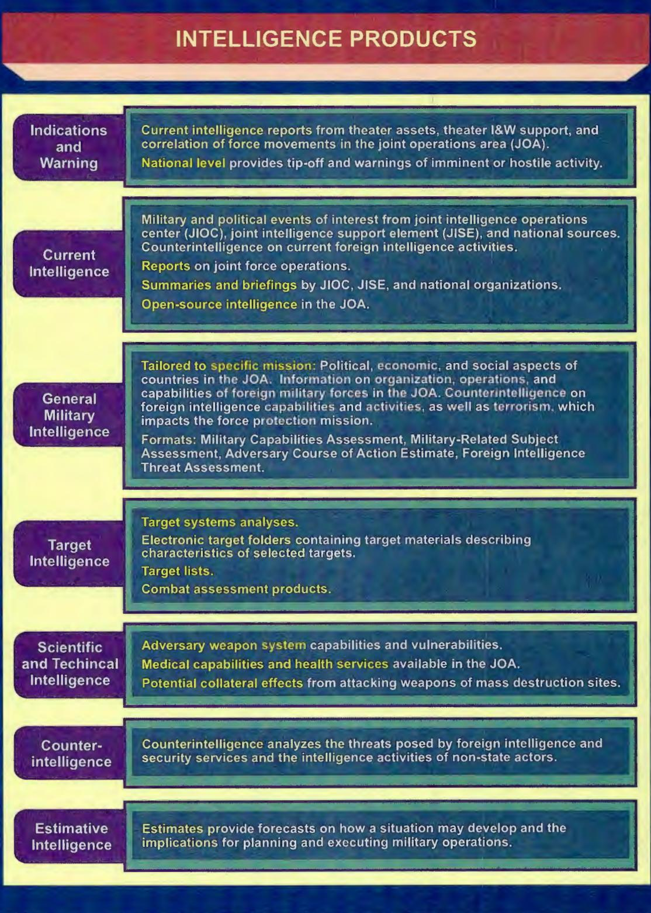  
Figure Il-19. Intelligence Products

# THREAT WARNING

Threat warning is closely associated with, but functionally distinct from, indications and warnings. Threat warning is the urgent communication and acknowledgment of time-critical information essential to the preservation of life and/or resources. The nature of threat warning is urgency. The sender of threat warning must always strive for acknowledgment of receipt of the alert. Although often initiated by intelligence reporting and/ortip-ofs, threat warning is an operations function that can be similarly initiated by operating forces, security elements, law enforcement, or civilian organizations. Different operational environments and situations lend themselves to different intelligence disciplines contributing to threat warning. Military operations in urban terrain may benefit from human intelligence-derived threat warning, whereas signals intelligence or measurement and signature intelligence-derived threat warning may prove critical during stabilization or air operations.

Various Sources

(i) Status of other military forces in the operational area.

# b. Current Intelligence

(1) Current intelligence involves producing and disseminating all-source intelligence on the current situation in a particular area. It is similar to I& W in that both depend upon continuous monitoring of world events and specific activities in the CCMD's AOR. The subordinate joint force receives current information from al levels of the IC.

(2) During the initial stages of an operation, the subordinate joint force J-2 should assess the adequacy of intelligence provided by the CCMD JIOC and available through networked databases and submit prioritized RFIs to satisfy immediate intelligence needs and gaps in coverage. During sustained operations, the subordinate joint force's collection assets will be supplemented by theater and national support, to provide the joint force with current intelligence for use in intelligence assessments. Information required includes, but is not limited to, the following:

(a) Adversary capabilities, probable intentions, and wil to use military force, where, when, in what strength, and with what forces and weapons.

(b) The adversary's operational plans.

(c) The adversary's COGs.

(d) The adversary's vulnerabilities.

(e) Analysis of the operational area including terrain, hydrology, hydrography, infectious disease and environmental factors, man-made features, demographics, and the location, type, and quantities of TIMs.

(f) The impacts of current and forecast METOC conditions, which include the entire range of atmospheric phenomena extending from the Earth's surface (cloud cover, precipitation, winds, and other METOC conditions) into space (space weather), as well as all of the marine environment from the bottom of the ocean to the air and/or sea interface (surf, sea conditions, or other sea interfaces).

(g) Military and political events.

(h) Status of strategic transportation nodes, to include major airfields, seaports, and surface networks.

(i) Adversary WMD assets, WMD-related facilities, and activities (e.g., movement of WMD materials, technology, and expertise). Location and characterization of TIMs resident in or transiting the area of interest. Potentially dual-use facilities (e.g.. pharmaceutical plants, fertilizer-production facilities, nuclear reactors), including those with legitimate industrial or military functions.

(j) Adversary foreign intelligence and security activities.

(k) Adversary or potential adversary cyberspace capabilities.

(3) Current intelligence and general military intelligence (GMI) efforts are interdependent. The intelligence gained during development of current intelligence forms the basis for the GMI effort.

# c. General Military Intelligence

(1) GMI is tailored to specific subordinate joint force missions and includes information on the organization, operations, facilities, and capabilities of selected foreign military forces and pertinent information concerning the environment (political, economic, topographic, geodetic, demographic, and sociological aspects of foreign countries). Specifically, GMI deals with information on the items listed in Figure III-20.

(2) Fused joint intelligence assessments are listed below.

(a) Military Capabilities Assessment. Determining the adversary's potential military capability includes the identification of forces and dispositions, an evaluation of the adversary's vulnerabilities, and an assessment of the adversary's ability to employ military force to counter the objectives of friendly forces. The CCMD JIOC is the subordinate joint force's primary source for all types of military capabilities assessments. Subordinate joint force components continuously provide information to the joint force JIOC or JISE to update military capabilities databases. The six major components of an opposing force addressed in the assessment are as follows:

$\underline { { 1 . } }$ Leadership and C2. An assessment of the adversary's ability to direct forces to accomplish a designated mission. Includes information on C2 nodes, lines of authority and reporting chains, and biographical data on key personnel.

#

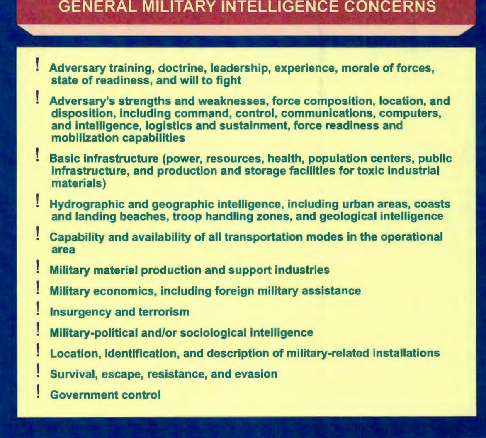  
Figure Ill-20. General Military Intelligence Concerns

(i $\underline { { 2 . } }$ OB. Identifies force components and assesses the strengths, structures, and dispositions of the personnel and equipment of the opposing military force, to include WMD.

$\underline { { 3 } } .$ Force Readiness and Mission. Assesses the adversary's readiness, as well as the doctrine it would follow and strategy and tactics it would employ, to achieve its objectives.

$\underline { { 4 . } }$ Force Sustainability. Assesses the ability of the force to logistically maintain the level and duration of combat activity (i.e., industrial, transportation, fuel and military infrastructur, supply status, arition rates,and the adversary's morale) necessary to achieve objectives.

5. Technical Intelligence. Assesses the technical sophistication of forces, units, and weapon systems, to include WMD, as well as their capabilities, constraints, vulnerabilities, and countermeasures.

6. Cyberspace Threat Assessments. Assesses the ability of potential adversaries to disrupt US and alied C2 systems, and determines the vulnerability of hostile C2 to friendly exploitation or attack.

(b) Military-Related Subjects Assessment. This type of assessment can provide indicators of an opposing force's capabilities and vulnerabilities, including its warfighting sustainability. Examples are as follows:

$\underline { { 1 . } }$ Communications System and Cyberspace. An assessment of the adversary's communications system (i.e., telecommunications nodes and networks) to determine availability, connectivity, and vulnerabilities.

2. Defense Industries. An assessment of industrial production capacity, available stockpiles of goods and raw materials, natural resources, C2 system, and reconstitution capability.

3. Energy. A listing of power and fuel sources and their distribution is and capabilities.

4. Military Geography. A study of the impact that geographic features may have on planned operations, force deployment, and movement within the operational area.

5. Demography. Understanding the dispersion and cultural composition of the population (i.e., language, religion, socioeconomic status, and nationality or ethnic groups) in the operational area critical to the nature of the operations to be conducted.

6. Transportation. The lines of communications (LOCs) (i.e., location and capacities of airports, ports, and harbors; types, locations and capacities of roads, bridges, railways, and waterways) and equipment required by military and/or civil-military activities.

7. Space Systems. An assessment of the adversary (red), allied (green), and neutral (grey) inherent and available space capabilities and infrastructure.

δ. Environmental Consiaerauons. An assessment oI environmental factors that could affect military operations such as oil dumping/fires, TIMs industries and storage/waste sites, trash/waste dumping, and even space debris. This assessment should also include any cultural/historicalreligious sites and even endangered species habitats. The CCMD JIOC is the primary source for the latest intelligence assessments of environmental considerations.

9. Medical. Availability and capability of foreign military and civilian medical facilities, equipment, and supplies, as well as professional medical personnel to treat casualties. Availability and capability of a partner nation to provide or assist with aeromedical evacuation. Infectious disease and environmental health risks, and scientific and technical (S&T) developments in biotechnology and biomedical subjects of military importance. An assessment of preventive medicine efforts and the medical environment in which multinational forces will operate is important to ensure the correct medicine, clothing, and immunizations are available to the friendly forces and the local population. Particular attention must be paid to biological warfare (BW) threats because they may be dificult to detect. Due to the potential use of vectors, to include humans, and the limitations of automated Bw detection systems, medical intelligence and epidemiological reporting may provide the first indication of a biological attack.

10. METOC. Climatology and METOC patterns affect friendly and adversary military operations. Understanding the opposing force's ability to assess METOC data is important in analyzing how the adversary may plan and conduct operations. For example, chemical and biological weapons effects are highly dependent on weather conditions. (The CCMD JIOC or equivalent and the joint METOC forecast unit or designated theater METOC unit are primary sources for assessing climatology and METOC patterns and the adversary's METOC capabilities.)

d. Target Intelligence. Target intelligence portrays and locates the components of a target or target complex, networks, and support infrastructure. Targetable information may include characterizing the target's physical or functional construct, significance, location, vulnerability, and other attributes for both traditional targets, such as buildings, structures, and equipment, and nontraditional targets, such as cyberspace, space, and IO entities. Intelligence forms the basis for target analysis and development, tracking and fixing information for moving or perishable targets, and weaponeering. It is critical that intelligence analyses supporting targeting remain consistent throughout the joint force and component commands. The COP and its supporting GCCS capability promote this unity of effort in providing a common set of data, information, and intelligence. Target development information for all target types is resident in MIDB. Target intelligence PRs include the following:

(1) Target system analysis.   
(2) Electronic target folders.   
(3) Target materials.   
(4) Target lists.   
(5) Collateral damage estimates.   
(6) Addition, modification, and validation of target data in MIDB.   
(7) Combat assessments.

e. Scientific and Technical Intelligence. S&TI looks at foreign S&T developments that have or indicate a warfare potential. This includes medical capabilities and weapon

# COUNTERINTELLIGENCE

Counterintelligence (Cl) input to vulnerability assessments identifies weaknesses and vulnerabilities to friendly operations and activities that may be exploited by an adversary. Cl input to threat assessments includes the current or projected capability of a foreign intelligence service to limit, neutralize, or negate the effectiveness of a friendly mission, organization, or material item through collection efforts, subversion, espionage, or sabotage. A personalities, organizations, installations, and incidents database provides indications and insights into the motivations and ideologies of those who may come into contact with or influence the joint force's operational area. Investigative reports provide insight into potential weaknesses of foreign intelligence services among many other benefits. A commander can request and use Cl information to protect personnel, equipment, and facilities.

Various Sources

system characteristics, capabilities, vulnerabilities, limitations, and effectiveness; research and development activities related to those systems; and related manufacturing information. S&TI supports the research and development of friendly systems and countermeasures to known or postulated threats. Obtained through the foreign materiel exploitation, foreign materiel acquisition, and captured enemy equipment programs, the information is analyzed to preclude scientific and technological surprises and advantages by an adversary that could be detrimental to friendly personnel and operations.

f. Counterintelligence. Multidisciplined CI threat analysis evaluates all foreign intelligence and security services disciplines, terrorism, foreign-directed sabotage, and related security threats. Analysis focuses on the JFC's ability to sustain forward operations and protect LOCs and main supply routes. Multidisciplined CI analysis includes detailed input to JIPOE.

g. Estimative Intelligence. Once a basic understanding of the threat and pertinent military-related subjects has been gained, it is necessary to try to view the situation through the adversary's eyes, visualize which COAs are available to the adversary, analyze the advantages and disadvantages of each from the adversary's perspective, and estimate which is the most likely option to be chosen. The intelligence estimate should also contain an assessment of all adversary COAs, especially the adversary's most likely COA and the COA determined to be most dangerous to friendly mission accomplishment. The joint force JISE and the CCMD JIOC are the primary sources of information in support of these estimates.

# 29. Support to Operational Commanders

a. CCMD, Service, and DOD agency production centers provide the Defense Intelligence Production Functional Manager with periodic status reports on their respective center's capability to meet assigned tasks. Production-related responsibilities of CCMD J-2s (see Figure II-21) include the following:

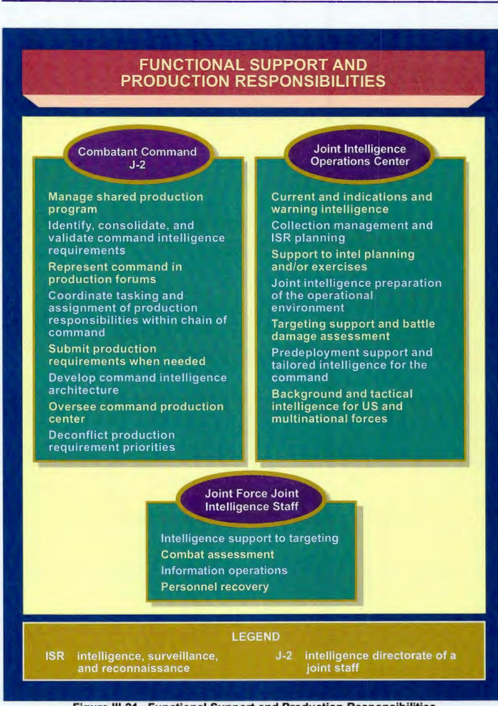  
Figure Il-21. Functional Support and Production Responsibilities

(1) To serve as overall production managers for their respective production center.

(2) To develop intelligence plans to include the annex B for all CCMD OPLANs and operation plans in concept format (CONPLANs), and direct the NISP effort on behalf of the CCDR (see Chapter IV, "Intelligence Support to Joint Operation Planning," for more information on NISP production).

(3) To identify, consolidate, and validate command intelligence requirements for which intelligence production must be satisfied by maintenance and entry of data in command automated databases.

(4) To participate in production program reviews and other forums.

(5) To coordinate the tasking and assignment of production responsibilities to the production center within the command's chain of command. For areas outside the theater JIOC capabilities and responsibilities, forward a request for production to DIA or the appropriate command or Service.

(6) To develop command architectures with the necessary capacity, connectivity, and processing power to host, manipulate, and exchange intelligence required to support command operations.

(7) To oversee activities of the command production center to ensure provision of timely, accurate intelligence to theater consumers and/or operators.

(8) To deconflict PR priorities.

b. A CCMD's intelligence analysis and production is performed by its JIOC. JIOCs are the cornerstones for fulfilling the intelligence requirements of CCDRs and their subordinate commanders. The JIOCs provide tailored, finished intelligence products in support of mission planning and execution. Production-related responsibilities of the JIOC include analysis and production of the follwing:

(1) Current and/or I& W intelligence for forces deployed in the command's AOR.

(2) Support to IP in collaboration with CCMD J-5 plans personnel.

(3) ISR planning in collaboration with CCMD J-3 COM personnel.

(4) JIPOE in support of joint operation planning and ongoing operations.

(5) Target support to subordinate JFC's, such as supporting development of target materials, target analysis, and maintaining no-strike lists.

(6) Information to support command-sponsored joint planning and exercises.

(7) Predeployment support and tailored intelligence produced elsewhere to meet the specific requirements of the command's customers.

(8) Background and tactical intellgence for customers within the theater, including US and multinational forces.

c. Detailed intelligence is a critical requirement for conducting targeting. Responsibility for targeting resides with the JFC. However, JFCs normally will delegate the authority to conduct execution planning, coordination, and deconfliction associated with targeting and will ensure that the process is also a joint effort involving applicable subordinate commands. The JFC's guidance directs and focuses operation planning and targeting to support the CONOPS. The joint force J-2 is responsible for target intelligence. The targeting process selects and prioritizes targets (geographical areas, installations, activities, or facilities planned for capture, disruption, or destruction by military forces) and matches the appropriate response to them, taking into account operational requirements and capabilities. Targeting entails the analysis of adversary situations relative to the mission objectives.

Adeta 3-60, Joint Targeting.

d. CA is the determination of the overal effectiveness of force employment during military operations. CA is composed of three major components: BDA, munitions effectiveness assessment, and reattack recommendation. Intelligence production support for CA includes detailed assessments of any physical and/or functional damage to the adversary's target systems and combat capability, analysis of collateral damage, estimative weapon effectiveness, and targeting recommendations for future operations. The J-3, with input from component commanders and the J-2, has primary responsibility for CA. The J-2 has the responsibility to accumulate, consolidate, and report battle damage inflicted on the adversary as a result of combat operations. Timely and accurate BDA facilitates current and future operations. The JFC requires continuous feedback on the status of mission objectives, and operators need BDA input to determine the relative success of completed attacks, the necessity and timing of restrikes, and the selection of follow-on targets.

More information on CA can be found in JP 3-60, Joint Targeting.

e. Information Operations. IO is the integrated employment, during military operations, of information-related capabilities in concert with other lines of operation to influence, disrupt, corrupt, or usurp the decision making of adversaries and potential adversaries while protecting our own. DIA and the national S& TI centers provide technical analytical support and parametric database information to the combatant commands in a variety of recurring and ad hoc documents and reports to support IO.

For more information on IO, refer to DODD 3600.01, Information Operations, and JP 3-13, Information Operations.

# HUMAN INTELLIGENCE AND TARGETING

"Identifying military targets was difficult [during DESERT STORM]; however, information acquired by human intelligence (HUMINT) operations improved targeting and destruction of significant military facilities in Baghdad, including the MOD [Ministry of Defense] and various communications nodes. In addition to blueprints and plans, HUMinT sources provided detailed memory sketches and were able to pinpoint on maps and photographs key locations, which subsequently were targeted.

Sources detailed the locations of bunkers underneath key facilities, including the Iraqi Air Force headquarters, which was composed of several main buildings and five underground bunkers, and the iraqi practice of stringing coaxial communication cable under bridges rather than under the river beds in Baghdad and southern Iraq. This information was the deciding factor in the decision to target key bridges in Baghdad. Sources identified the communications center in Baghdad; less than 12 hours later, this facility was destroyed. Information obtained from EPWs [enemy prisoners of war] also helped planners direct effective air attacks against troops and logistics targets."

SOURCE: Final Report to Congress Conduct of the Persian Guif War, April 1992

# 30. Production Responsibilities

a. Production centers at all levels are assigned clearly delineated areas of analytical responsibility across the range of military operations. These centers support the efficient use of production community resources, prevent duplication of effort, and provide timely support to customer requirements. Production centers are designated as either responsible or collaborative.

(1) Responsible production centers produce the bulk of finished intelligence products. A center designated as responsible will be the authoritative source within the DIAP for finished intelligence on designated topics and geographical areas.

(2) Collaborative production centers are designated because they possess a production capability distinct and unique from that possessed by the designated primary production center for the same topics and geographical areas. A center designated as collaborative will be the authoritative source within the DIAP for finished intelligence on designated subsets of the topics and geographical areas for which the primary production center is responsible.

(3) Responsibilities of all production centers include:

(a) Accomplishing the required production for the specified combination of substantive topic (intelligence fusion center) and geographical areas.

(b) Identifying resources for the topic, including systems, funding, and specialists. (c) Assuming lead or contributing production center responsibilities for validated PRs. (d) Requesting collection for any essential information gaps. (e) Completing original research on the topic. (f) Producing assigned categories in shared national-level databases (such as MIDB) within the topic and/or geographical area. (g) Providing analysis and substantive judgments in response to validated customer requirements.

b. The CCMD J-2 identifies and validates command IRs. The command's production center (e.g., JIOC) schedules and accomplishes production activities, focusing on producing tailored, finished intelligence in support of mission planning and execution.

c. At the subordinate joint force level, production focuses on the fusion of allsource intelligence from components, the CCMD JIOC, and national sources to support the joint force mission and operations. The CCMD JIOC receives information from all echelons and performs all-source analysis and production. It is the primary source from which subordinate joint forces receive intelligence and intelligence products on their areas of interest.

d. Lower echelons request, or pull, the tailored intelligence products they need from intelligence databases electronically available at intelligence centers at all levels. This concept allows JFCs to acquire relevant intelligence, based on their mission and the specific phase of the ongoing operation, using intelligence databases physically maintained at other echelons and locations. The CCMD J-2 remains responsible for the coordination of intelligence information in-theater and manages the flow of intelligence through direct communication with each command and Service. The push and pull concepts are discussed further in Section E, "Dissemination and Integration."

# 31. Request Management

Customers communicate requirements to their supporting intelligence office at an existing military element, which articulates the customers' needs as an RFI. RFIs state questions the customer wants answered or contain other specific intelligence needs, such as countries and topics required, in databases, target materials, and hard copy or other production media. RFIs also specify the various levels of detail required as well as the periodicity of production and updates. An RFI template is contained in COLISEUM. COLISEUM automates the DIAP procedures for registration and assignment of RFIs and subsequent tracking of the RFI.

a. After the supporting intelligence office surveys local resources to ensure the requirement does not duplicate existing or scheduled production, it completes and forwards the RFI to the supporting intelligence center (SIC) at the next level in the Service, CCMD, or DIA chain. At the joint force command or Service component, the next level sIC is resident at the CCMD JIOC. DIA/DI, each Service, and each CCMD has a SIC to process and validate the RFIs submitted by their organizations' supporting intelligence offices. The CCMD SIC will normally accept RFIs via e-mail or other informal means. However, the SIC must input the RFI into COLISEUM to initiate IC production. The validation process shall include a determination as to whether the requirement submitted by the supporting intelligence office has been properly identified as a PR or should be addressed by other means (e.g., as a collection requirement or request for personnel or operational support).

b. Upon validation, the SIC determines if the requirement should be divided among multiple producers based upon the specifics of the PR and the expertise of the various production centers. The SIC then assigns production responsibilities and transmits the assigned PR(s) to the appropriate production center(s) with information copies to possible collaborative production centers. Simultaneously, information copies are sent to the Defense Intelligence Production Functional Manager, who is an element of DIA/DI.

c. Once requirements are assigned to a primary production center, the center coordinates the efforts of all collaborating production centers for the designated product. All centers schedule the production of each PR consistent with other assigned projects and DIAP priorities. The commander and/or director of each production center is responsible for submitting a binding, for-the-record assessment of the center's ability to respond to each PR.

d. After coordination with collaborating centers, the primary production office provides a written interim response to the customer, stating the format and type of document it will produce and citing a final response date. Copies of the response are sent simultaneously to the assigning SICs, the collaborating production centers, and the Defense Intelligence Production Functional Manager.

# 32. Prioritizing Requirements

a. All requirements must be identified, documented, and prioritized. Whenever possible, customer requirements should be satisfied with either existing intelligence products or modifications to existing products to prevent duplication of effort. Intelligence products must be in a format that the customer can understand and apply.

b. The joint force J-2 is the focus for all intelligence requirements generated within the joint force staffs and/or at lower echelons. These requirements are satisfied by the joint force J-2 through information the J-2 holds, can access via databases, or can acquire by available collection assets. If internally generated requirements cannot be satisfied by available joint force assets, the joint force J-2 shall validate and prioritize these requirements and submit them as RFIs to the CCMD JIOC. This includes production and/or collection requirements that can be satisfied only by CCMD resources or by national agencies. If a CCMD JIOC cannot satisfy these RFIs, it will forward them directly to DIA or the DIAP responsible organization for production or assignment to the appropriate national agency as necessary. Once RFIs and/or PRs have been submitted and accepted at any echelon, collection action is initiated as necessary. While the status of the RF/PR is managed at each echelon, the subordinate joint force J-2 is responsible for tracking the status of joint force and component RFIs and ensuring feedback to components on the status of their requirements (see Figure -2).

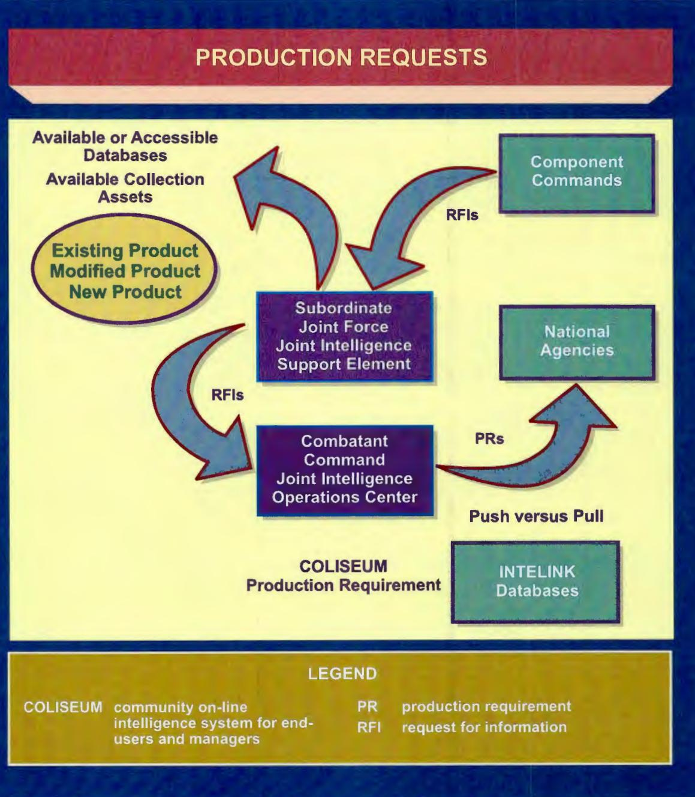  
Figure Il-22. Production Requests

# SECTION E. DISSEMINATION AND INTEGRATION

# 33.Overview

The timely dissemination of critical information and finished intelligence to appropriate consumers is paramount to attaining and maintaining information superiority. Intelligence must be disseminated in such a manner that it is readily accessible by the user. Time considerations dictate that information is "pushed"' in a way that is automatically rendered or visualized in the GCCS COP. The integration of intelligence into the COP is facilitated by the GCCS mission application. GCCS enhances the COP by providing a standard set of integrated, linked tools and services which give ready access to imagery and intelligence that is seamlessly plotted on the COP.

a. The J-2, at each echelon, manages the dissemination of intelligence to the user. Intelligence must be provided in a form that is readily understood and directly usable by the recipient in a timely manner without overloading the user and, at the same time, minimizing the load on communications capabilities. It is also important to provide for maximum possible release of appropriate classified reporting, analysis, and targeting data to multinational forces. When a joint force J-2 is supported by a NIST, national RFIs are routed to the NIST for immediate action, in addition to the NJOIC. The NIST and NJOIC deconflict RFIs, and the joint force J-2 or CCMD JIOC maintain the responsibility to enter the RFIs into COLISEUM.

b. Dissemination consists of both "push'" and “pull" control principles (see Figure III-23). The "push" concept allows the higher echelons to push intelligence down to satisfy existing lower echelon requirements or to relay other relevant information to the lower level. This includes warning data initially received only at the national or theater level; other critical, previously unanticipated material affecting joint operations; inteligence that satisfies standing information requirements by a subordinate unit; or specially prepared studies requested in advance by the subordinate joint force J-2. The "pull" concept involves direct electronic access to databases, intelligence files, or other repositories by intelligence organizations at all levels. An increasing number of intelligence “pull'” products are available on INTELINK or INTELINK-S (collateral version), STONEGHOST (Commonwealth version of INTELINK), INTELINK-P (Policynet), and other national and theater file servers. One means of improving the pull method across the IC is establishment of the Library of National Intelligence (LNI). The LNI has more than 1.7 million documents and includes disseminated analytic reports from the CIA, DIA, NGA, NSA, US Coast Guard ICC, OSC, Service intelligence centers, and others. The "pull"' method is far quicker and more streamlined than RFI/PR submission, provided the desired information already exists in a usable form. However, a judicious push may be needed to avoid overloading the lower support HQ. The Global Broadcast Service also provides a greatly enhanced capability to distribute multiple kinds of data, including bandwidth-intensive video and imagery, to all levels of command. Additionally, the capability to directly broadcast threat warning alert notifications by means such as the NSA-provided TRIBUTARY voice threat warning network, enables the direct "push" of time-critical information from an ISR source to those friendly assets most at risk. Similarly, the utilization of collaborative tools and related capability of secure Internet relay chat enables the collective "pul' of threat warning information by all subscribers.

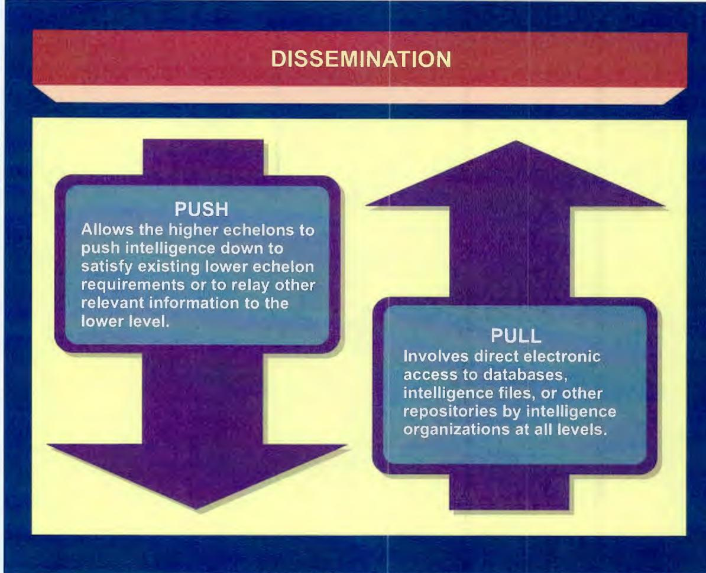  
Figure Il-23. Dissemination

c. The J-2 must be involved with the other staff elements to ensure that the logistic and communication infrastructures will be capable of supporting intelligence operations and dissemination. Special dissemination planning considerations may be required when assets and infrastructure are austere and LOCs are extended.

d. A key to operational success is the timely and accurate dissemination of intelligence to deployed units. The dissemination manager ensures the efficient dissemination of intelligence products to the user. A dissemination program manager (DPM) works with the dissemination systems to get the product to the user. Dissemination managers, in cooperation with the CCMD's DPM, must ensure that appropriate mailing addresses, automated message handling system (AMHS) message addresses and routing indicators, and special security office security accreditation are requested and established for those units. This administrative information must be communicated to and validated by the command DPM, who will provide the information to DIA and other supporting national agencies. Further, the subordinate joint force J-2 should coordinate communications requirements with the communications system directorate of a joint staff (J-6) during the planning phase of the operation.

# 34. Dissemination Methods

# a. Soft Copy Dissemination

(1) Digital dissemination has become the predominant method of communicating finished intelligence products to the consumer. Publication producers and consumers have transitioned to an all-electronic product environment to improve the timeliness of intelligence dissemination and to reduce the amount of hard copy distribution required. Reporting and archiving using electronic methods increase the IC's capability to use electronic means to deliver intelligence to operational forces. Communications tools and intelligence systems such as the JWICS, SIPRNET, joint deployable intelligence support system (JDISS), Nonsecure Internet Protocol Router Network (NIPRNET), GCCS, INTELINK and/or INTELINK-S, and Integrated Broadcast Service are being integrated within the DOD information networks to deliver intelligence whenever and wherever required.

(2) JWICS and SIPRNET sites that have electronic publishing capability can pull electronic products. INTELINK and INTELINK-S constitute the IC architecture for sharing and disseminating intelligence, allowing organizations to have the ability to produce their own documents or contribute (collaborative publishing) to the creation of other documents throughout the electronic publishing community.

(3) Each J-2 site routinely has access to several daily current intelligence documents, including a variety of DOD and national agency products. Other documents, (current and finished intelligence) as well as intelligence information reports (IIRs) and imagery, are also being posted to servers (e.g., INTELINK, INTELINK-S, NIPRNET— unclassified only) for access by the CCMDs and subordinate joint forces. Other sof copy products include messages and intelligence databases maintained by national-level agencies or theater JIOCs.

(4) Electronic documents dissemination media varies (e.g., soft copy, compact disc read-only memory [CD-ROM], digital video disk), depending on the requirements of the end user. For example, JIOCs with INTELINK dissemination capability can pass the finished intelligence documents to their subordinate sites and/or create tailored intelligence products using CD-ROM or electronic publishing technology.

(5) Much of the material on INTELINK/INTELINK-S is available to anyone with access to a JWICS or SIPRNET terminal. With many documents already located on INTELINK/INTELINK -S, it may only be necessary for a site to tell the requester where the document exists. Requests for other existing electronic documents should be made directly via INTELINK or, if not directly accessible, the request should be directed to the appropriate DPM to satisfy the request. The soft copy document will in turn be placed either on the dissemination server for requester pull or electronic push.

(6) The Services and CCMDs are integrating digital dissemination technologies into their intelligence architectures. The subordinate joint force J-2 should quickly assess the equipment assets and training levels of all assigned forces to ensure timely dissemination of intelligence to all users.

(7) DOD and Service DCGS architectures are integrated components of the joint force intelligence processing and dissemination system. They are designed to provide commanders with timely intelligence information derived from national, commercial, DOD, and combined force ISR nodes via a variety of point-to-point, broadcast, and Web-based communications networks.

b. Hard Copy Dissemination. The capability to deliver intelligence by facsimile (FAX), message, or courier in hard copy still remains a requirement in many situations. In any operation involving multinational forces, this is especially true as US intelligence equipment and system architectures are often not compatible or at the same security level. Additionally, some products, such as maps, are often available only in hard copy when large quantities are required.

(1) CCMDs manage the movement of hard copy intelligence to deployed subordinate joint forces in coordination with the J-3, the logistics directorate of a joint staff (J-4), the DPM, and the dissemination manager. Past operations and communication limitations associated with transmitting large format and/or color products have validated the continuing requirement to ship some critical hard copy products to consumers. However, many Service elements now are equipped with large format plotters with the ability to print from digital sources. The DPM should check for availability and coordinate access for intelligence personnel.

(2) From the beginning of any operation, the CCMD (J-2, JIOC, or subordinate joint force J-2) establishes a dedicated procedure for moving hard copy intelligence from the production centers to the theater and distributing it within the operational area. This includes nominating priorities to the JFC relative to available air and/or sea lift resources for delivery of hard copy intelligence support products.

# 35. Integration of Intelligence and Operations

Information superiority requires the timely integration of intelligence with operations in an easily understood format that facilitates decision making at all levels while at the same time maximizing the amount of relevant information available. Furthermore, the integration of intelligence and operations on a continuous basis allows commanders and all operational planners access to the most current information available, thereby optimizing intelligence support to operation planning, preparation, execution, and CA functions. The primary vehicle for integrating intelligence and operations is the COP. Intelligence must be disseminated in such a manner that it can be automatically rendered or visualized in the COP and facilitate a shared operations/intelligence view of the operational environment.

"Success in developing information superiority depends upon integrating information from a range of sensors, platforms, commands, and centers to produce all-source intelligence. This intelligence must be part of a portrayal of the operational environment characterized by accurate assessments and visual depiction of friendly and enemy operations which makes the operational environment considerably more transparent for a United States commander than for the adversary and forms the basis for superior decision making. In shor, intelligence must be displayable, digestible, and manageable. Interoperable will not be good enough.' Integration into the Common Operational Picture is required."

Rear Admiral L. E. Jacoby, Us Navy Joint Staff J-2, 2001

a. The GCCS COP is the integrated capability to receive, correlate, and display all available operationally relevant information, including planning applications and theatergenerated overlays/projections. The COP is a broad merging of inputs from a wide variety of tactical, operational, and national sources into a single picture that serves a broad set of users for multiple purposes. It facilitates decision making and planning at all levels, from SecDef policy decisions to joint force operation planning. The COP depicts friendly, adversary, and third-party force dispositions and contacts on three types of graphical backgrounds: vector maps (ordinary color graphic maps), digital terrain elevation data maps (topographical relief maps), and compressed digitized raster graphics (topographic and aeronautical charts). It includes a variety ofNRT friendly and adversary air, ground, and maritime tracks; threat/warning data; and intelligence broadcasts. Information received from the Integrated Broadcast System (IBS) ELINT feeds from orbiting satellites and other passive ELINT sensors is automatically plotted on COP graphic displays. Additionally, operators can manually plot information received from other sources (see Figure II-24).

b. GCCS-I3 provides the means for automatically integrating imagery and other relevant information and finished intelligence into the COP. Areas of interest within exploited images may be annotated, cropped, and loaded on GCCS-I3 by national-level and/or CCMD intelligence organizations. After this initial download, GCCS-I3 is automatically updated with the latest imagery available in various imagery product libraries. Metadata, such as basic encyclopedia numbers, should be added to these imagery files in order to facilitate linkage to OB databases, message traffic, and the air tasking order. This linkage between imagery and intelligence and operational databases facilitates intelligence analysis, operational environment awareness, operation planning, and BDA by providing intelligence and operations staffs with simultaneous access to the same information.

# SECTION F. EVALUATION AND FEEDBACK

# 36. Overview

All intelligence operations are interrelated, and the success or failure of one operation will impact the rest of the intelligence process. It is imperative that intelligence personnel and consumers at all levels honestly evaluate and provide immediate feedback throughout the intelligence process on how well the various intelligence operations perform to meet the commander's intelligence requirements. If the intelligence provided to the requester is complete, timely, and in a usable format, the requirement is satisfied and subsequently closed. If the resulting intelligence does not meet the above criteria, the requirement must not be considered satisfied and, ime permiting, the requirement should be extended and/or retasked for collection or production. Concurrently, remedial action must be immediately initiated to identify the reasons why the intelligence process failed to satisfy the requirement and to ensure that such failure is not repeated.

  
Figure Il-24. Integration of Intelligence and Operations

# 37. Evaluation

All operations in the intelligence process are interrelated and must be evaluated to determine the degree to which they facilitate each other and ultimately succeed in meeting the customer's requirements. For example, planning and direction establishes the groundwork for all other intelligence operations, but it is also dependent on the results achieved by other operations in the intelligence process. The collection manager evaluates collection reports, ensures that the appropriate requesters receive a copy, and determines, in conjunction with the requesters, if the requirements have been satisfied. Requester feedback establishes customer satisfaction and frees collection assets and resources to be redirected to satisfy other active requirements. Processing and exploitation, and analysis and production are evaluated based on the degree to which customers are satisfied that the resulting information or intelligence answers their requirements. Intelligence personnel and consumers at all levels evaluate the quality of intelligence products relative to all the attributes of good intelligence. These attributes include the degree to which intelligence anticipates the needs of the commander, and is timely, accurate, usable, complete, relevant, objective, and available (see Figure Il-25). Finally, intelligence and operations personnel jointly evaluate how well intelligence is disseminated and integrated with operations, and make changes as needed to improve the overal intelligence process.

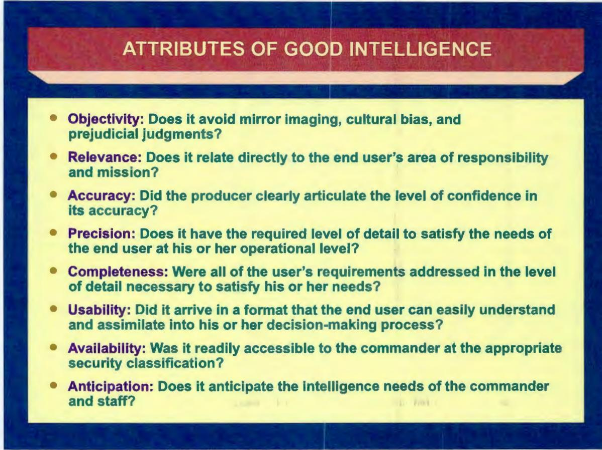  
Figure Il-25. Attributes of Good Intelligence

For more information on the attributes of good intelligence, see JP 2-0, Joint Intelligence.

# 38. Feedback

All intelligence personnel and consumers are responsible for providing timely feedback to the joint force J-2 staff regarding both successes and problems with the functioning of the intelligence process. Inasmuch as all intelligence operations are interrelated, a functional problem in one type of operation can result in a ripple effect with ramifications for the intelligence process as a whole. It is therefore imperative that the J-2 staff initiate appropriate remedial measures as soon as fedback is received that identifies a current or potential problem. Additionally, the J-2 staff should periodically solicit intelligence personnel and consumers for ideas to improve the intelligence process.

# CHAPTER IVINTELLIGENCE SUPPORT TO JOINT OPERATION PLANNING

"One should know one's enemies, their alliances, their resources and nature of their country, in order to plan a campaign. One should know what to expect of one's friends, what resources one has, and foresee the future effects to determine what one has to fear or hope from political maneuvers."

Frederick the Great Instructions for His Generals, 1747

# 1. Introduction

The JFC's planning efforts guide joint operation planning at the operational level, which links the operational and tactical employment of forces to strategic objectives. The joint OPLAN provides a common basis for discussion, understanding, and change for the joint force, its subordinates and higher HQ, the joint planning and execution community(JPEC), and the national leadership. Joint operation planning encompasses a number of elements, including three broad operational activities, four planning functions, and a number of related products (see Figure IV-1).

For more detail on joint operational planning, see JP 5-0, Joint Operation Planning.

# SECTION A. INTELLIGENCE PLANNING OVERVIEW

# 2. Intelligence Planning Component of Adaptive Planning and Execution

IP provides a methodology for synchronizing, integrating, and managing all available CCMD and national-level capabilities to meet the CCDR's intelligence requirements and ensure CSA and Service intelligence centers' support properly aligns with each phase of the operation. It ensures that the intelligence system is focused on providing the commander with the intelligence required to create desired effects and achieve operational objectives. The $\mathbf { I P }$ construct is shown in Figure IV-2 and includes three major products. Each is described below:

#

a. Dynamic Threat Assessment (DTA) or Theater Intelligence Assessment (TIA). The DTA is a defense strategic intelligence assessment developed by DIA, which identifies the capabilities and intentions of adversaries for top-priority plans. DIA produces and provides the CCMD an updated DTA prior to mission analysis and updates DTAs as strategic factors in the operational environment change. For theater campaign plans, DIA produces a TIA. The TIA is a theater-wide defense strategic intelligence assessment that is scoped IA W the actors of concern with particular emphasis on how these actors are affected by the strategic environment. These DIA-produced strategic intelligence assessments enable development of the CCMD intelligence staff estimate in order to conduct mission analysis and develop COAs.

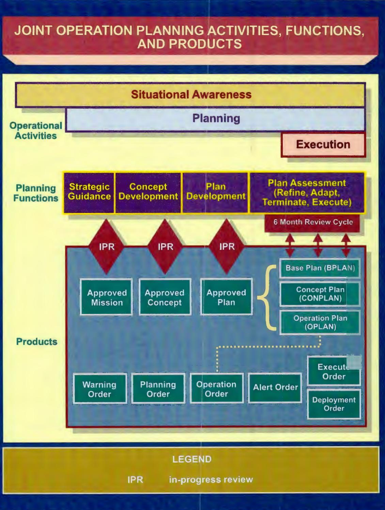  
Figure IV-1. Joint Operation Planning Activities, Functions, and Products

  
Figure IV-2. Intelligence Planning Construct

b. Annex B. Annex B is the intelligence annex to a plan or order that provides detailed information on the adversary situation, establishes priorities, assigns intelligence tasks, identifies required intellgence products, requests support from higher echelons, describes the concept of intelligence operations, and specifies intelligence procedures. CCMD J-2s lead development of annex B (Intelligence). Format and guidance for annex B (Intelligence) is contained in Chairman of the Joint Chiefs of Staff Manual (CJCSM) 3122.03C, Joint Operation Planning and Execution System, Volume II, Planning Formats. Figure IV-3 depicts annex B (Intelligence) contents. Two critical processes inform annex B (Intelligence): the intelligence estimate and the J-2 staff estimate.

(1) Intelligence Estimate. An appraisal, expressed in writing or orally, of available inteligence relating to a specific situation or condition with a view to determining the COAs open to the enemy or adversary and their order of probability of adoption.

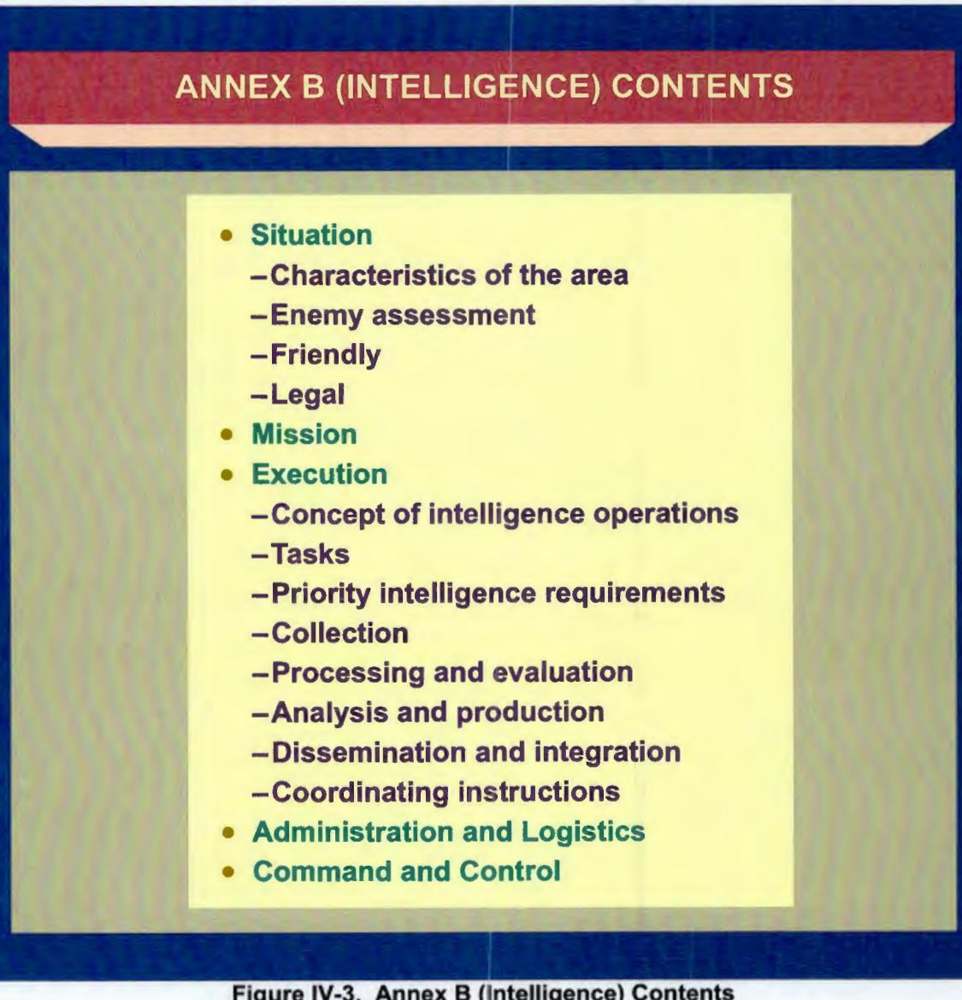

(2) J-2 Staff Estimate. An assessment of intelligence and CI capabilities of all assigned or apportioned intelligence assets available to support the operation and required capabilities neither assigned nor apportioned. It identifies and addresses known or anticipated factors pertaining to CI or intelligence collection, processing and exploitation, analysis and production, and dissemination and integration that may limit the intelligence staff function's ability to support proposed friendly COAs.

c. National Intelligence Support Plan. The NISP is a supporting plan to a CCMD plan that details how the intelligence capabilities of CSAs, Services, and other DOD Intelligence Enterprise organizations will be employed to meet the CCDR's stated intelligence requirements. It facilitates the integration of theater and national intelligence capabilities and synchronizes intelligence operations. The NISP will also identify tasks requiring non-DOD Intelligence Enterprise support. It contains annexes from applicable defense intelligence agencies / organizations that detail their concept for function support. A NISP consists of four primary components: the NISP base plan, an ITL, capability assessments, and FSPs.

(1) NIsP Base Plan. The base plan provides overall guidance to integrate and synchronize the DOD Intelligence Enterprise effort for the supported CCMD plan. It contains the concept of intelligence operations, assigns tasks and responsibilities, requests interagency support as required, and identifies major gaps and shortfalls.

(2) Intelligence Task List. The ITL is a compilation of prioritized, focused, allsource analysis and PRs to support all phases of the plan. It is organized into a two-tier hierarchy of tasks and subtasks. Subtasks are the constituent elements of the task, which, when taken together, define the tasks' scope and content. The CCMD JIOC divides the ITL into tasks that can be performed solely by its subordinate elements and those that it will pass to the DOD Intelligence Enterprise for satisfaction. The ITL and the ${ \bf J } { - } 2 ^ { * } { \bf s }$ staff estimate are the basis for developing federated analysis and production plans. It is important to remember that tasks are defined as the actions taken by intelligence to support the CCMD plan. The term “"intelligence task"” is not a synonym for an intelligence need or an intelligence requirement.

(3) Capability Assessments. A capability assessment is a brief evaluation of a CCMD JIOC, CSA, or Service intelligence center capability and capacity to satisfy CCMD intelligence requirements, recorded in matrix format. These assessments form the basis for identification of capability shortfalls and knowledge gaps.

(4) FSPs. An FSP is an intelligence agency/organization's annex to a NISP that describes the intelligence capabilities and concept for their employment in direct support of the CCMD plan. The FSP also identifies significant gaps and shortfalls in supporting the CCMD mission and identifies mitigation strategies.

For more information on IP products and processes, see CJCSM 3314.01, Intelligence Planning.

# 3. Intelligence Planning Guidance

The Guidance for Employment of the Force and Joint Strategic Capabilities Plan (JSCP) specify the level of planning required for each plan and provide general guidance for the level of the upporting DOD IP efforts. CCMDs may request DOD IC intelligence planning support for any plan for which a comprehensive annex B (Intelligence) is under development. Priority of effort for NISP development is prescribed by Chairman ofthe Joint Chiefs of Staf Instruction (CJCSI) 3110.02, Intelligence Planning Guidance, Objectives, and Tasks.

# SECTON B. INTELLIGENCE SUPPORT TO THE JOINT OPERATIONPLANNING PROCESS

Joint operation planning encompasses a number of elements, including three broad operational activities, four planning functions, and a number of related products. Each of these planning functions will include as many in-progress reviews (IPRs) as necessary to complete the plan. IPR participants are based on the initiating authority/level. For example, formal plans directed by the JSCP require SecDef-level IPRs while plans directed by a CCDR may require only CCDR-level review.

# 4. Situational Awareness

a. Description. Situational awareness involves recognition of events with possible national security implications and the timely reporting to senior leadership. Intelligence activities include those described in the following paragraphs.

# b. Intelligence Activities Under Situational Awareness

(1) Intelligence supports situational awareness by identifying intelligence requirements, developing a collection plan, monitoring I&W problem sets, analyzing adversary activity, and providing intelligence assessments of adversary capabilities, vulnerabilities, COGs, intentions, and possible COAs. Effective situational awareness requires intelligence support that is collaborative, adaptive to changing conditions, and anticipates the needs of the commander. The intelligence effort during situational awareness focuses on intelligence collection, I& W, and JIPOE to iluminate the situation for the CCDR, components, subordinate JFCs, OSD, and CJCS.

(2) The CCMD J-5, with the assistance of the J-2, reviews existing plans to determine if the particular event driving the operation planning effort has been considered in contingency planning. If an existing plan does not apply, the commander will need to develop PIRs tailored to the mission early in the planning process to assess intelligence information gaps. Preliminary recommendations on the appropriate JTF composition should be considered at this point.

# 5. Planning

The planning process falls into two types, contingency (plans based on assumptions of what might happen) and crisis (planning based on real-world conditions/events); JOPP is used for both. JOPP is the process used to translate strategic guidance and direction into plans and orders (see Figures IV-4 and IV-5). It provides an orderly, analytical process to analyze a mission; develop, analyze, and compare alternative COAs against criteria of success and each other; select the best COA; and produce a plan or order. Organizations without Adaptive Planning and Execution responsibilities can also use JOPP to support their planning activities.

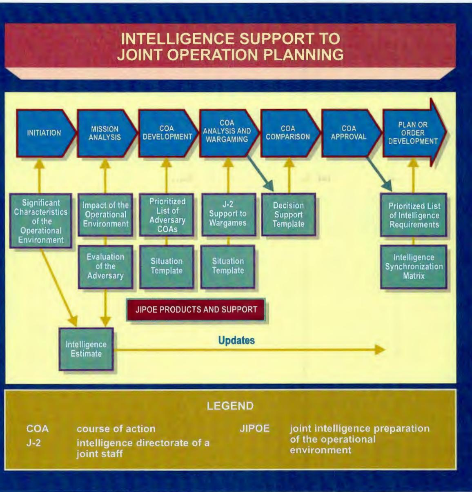  
Figure IV-4. Intelligence Support to Joint Operation Planning

<table><tr><td colspan="3">Intelligence Activities During Joint Operation Planning Process</td></tr><tr><td>Strategic</td><td>Intelligence Support to Joint Operations Planning • Monitor indications and warning</td><td>Planning Intelligence Operations • Fully understand the current guidance</td></tr><tr><td>theater and below</td><td>problem sets Analyze adversary activity and assess adversary capabilities • Initiate joint intelligence preparation of the operational environment effort • Support the wargaming process by &quot;playing&quot; the red force • Develop adversary courses of action • Highlight advantages and disadvantages from the intelligence perspective • Provide intelligence update to the joint force commander • Produce the situation paragraph to the base plan or order • Produce annex B • Produce the meteorological and oceanographic operations annex • Produce the geospatial information and services annex</td><td>Understand the initial joint force commander&#x27;s guidance • Identify intelligence requirements Make staffing recommendation or subordinate joint force intelligence directorate of a joint staff review higher headquarters intelligence guidance • Assess current theater collection strategy • Assess current theater production strategy Determine specified, implied, and essential intelligence tasks • Begin development of the intelligence, surveillance, and reconnaissance (ISR) plan (blue ISR, human intelligence/counterintelligence capabilities, collection and processing, exploitation, and dissemination capabilities) Determine intelligence constraints and restraints Begin development of intelligence directorate of a joint staff intent to support commander&#x27;s intent Identify/recommend commander&#x27;s critical information requirements Develop guidance on intelligence operations for subordinate and supporting commands and agencies Determine how each intelligence discipline can support the developed courses of action • Produce the ISR support strategy • Identify potential tasks for national agencies Capture potential detectable signatures • Capture assumptions for potential collection tasking • Begin development of initial collection and production plans • Develop supporting collection plan • Revise the intelligence staff estimate • Receive joint force commander&#x27;s selection and guidance • Revise priority intelligence requirements</td></tr></table>

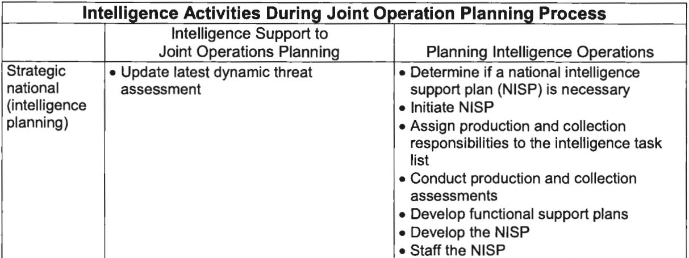  
Figure IV-5. Intelligence Activities During Joint Operation Planning Process

# a. JOPP Step 1: Initiation

(1) Description. The decision-making process begins with the receipt of a new mission or in anticipation of a new mission. New missions may be ordered by a higher HQ or may be derived from ongoing operations. As soon as a new mission is received, the joint force J-5 calls for a meeting of the JPG, alerting the staff of the pending planning process. The staff prepares for the mission analysis immediately upon notification of the JPG meeting by gathering the tools needed to do mission analysis. These include the higher HQ order or plan, maps of the operational area, and any existing staff estimates. The joint force J-2 should begin development of JIPOE to support the planning process. The purpose of this phase is to optimize the JFC's use of time and resources. The last step in the initiation phase is to issue a warning order to subordinate and supporting units. This order should include, at a minimum, the type of operation, the general location of the operation, and the initial planning timeline. This facilitates parallel planning.

(2) Intelligence Support to Step 1: Initiation. The joint force J-2 first must:

(a) Fully understand the current guidance;   
(b) Develop JIPOE products to support joint operation planning;   
(c) Understand the initial JFC's guidance;   
(d) Review higher HQ intelligence guidance;   
(e) Assess current theater collection strategy and posture; and (f) Assess current theater production strategy.

# b. JOPP Step 2: Mission Analysis

(1) Description. An analysis is done of the higher HQ warning order to ensure complete understanding of the commander's intent; the mission, to include tasks, constraints, risk, and available assets; and the commander's CONOPS.

# (2) Intelligence Support to Step 2: Mission Analysis

(a) Develop JIPOE parallel to planning.

(b) Determine specified, implied, and essential intelligence tasks.

(c) Begin development of the J-2 staff estimate (blue ISR; HUMINT/CI; zollection, production, and dissemination capabilities).

(d) Determine intelligence constraints and restraints.

(e) Begin development of J-2 intent to support commander's intent.

(f) Identify/recommend CCIRs.

(g) Develop guidance on intelligence operations for subordinate and supporting commands and agencies.

(h) Evaluate relevant database, and identify intelligence gaps and priorities.

(i) Evaluate whether targeting is necessary to accomplish the operation. If so, conduct target system analysis, target development, and target list management.

(j) Evaluate existing collection, exploitation, analytic, and PRs.

(k) Begin development of intelligence assumptions and identification of limitations as mission analysis is completed within the planning process in conjunction with the DIA. If the plan is a JSCP-designated plan and the CCMD J-2 requests NISP support, the Joint Staff J-2 will coordinate with the CCMD and publish a message announcing a NISP effort with a rough timeline. This message serves as a warning order for CSAs and Service intelligence centers.

(1) Accomplish a preliminary assessment of global ISR assets and capabilities in conjunction with the jFCC-ISR to prepare for development of an ISR strategy.

(m) Begin development of the intelligence estimate, which supports the

# CCDR's estimate.

(n) When directed by the JSCP, DIA develops and maintains a DTA or TIA that supports plan development.

# c. JOPP Step 3: COA Development

(1) Description. After conducting mission analysis and receiving guidance from the JFC, the staff develops potential COAs to accomplish the assigned mission for analysis and comparison.

# (2) Intelligence Support to Step 3: COA Development

COAs.

(a) Determine how each intelligence discipline can support the developed (b) Capture assumptions for potential collection tasking.   
(c) Revise the intelligence staff estimate.   
(d) Begin development of initial collection and production plans.   
(e) Identify potential tasks for national agencies.

# d. JOPP Step 4: COA Analysis and Wargaming

(1) Description. COA analysis identifies which COA accomplishes the mission with the minimum expenditure of resources while best positioning the joint force to retain the initiative for future operations. Analysis and wargaming is a disciplined process that attempts to visualize the flow of the operation. It considers friendly dispositions, strengths, and weaknesses; enemy assets and probable COAs; and characteristics of the joint operations area. CCMD JIOCs play an integral role in the wargaming effort by accurately role playing the adversary through use of the CCMD red team. The J-2 staff develops viable adversary COAs and provides what it assesses to be the adversary's most likely and most dangerous COA. The intelligence planner must also develop the intelligence support strategy to support blue force operations to include the collection plan required to support blue force operations and answer the CCIRs identified in the war game.

# (2) Intelligence Support to Step 4: COA Analysis and Wargaming

(a) Intelligence planners have multiple roles to play in the wargaming process. The intelligence planner must be able to "fight"” the red force: As blue forces outline their operations, how would the adversary counter the action? The intelligence planner must develop the intelligence support strategy to support blue operations. The intelligence planner also must develop the collection plan to support blue operations and answer the CCIRs identified in the war game.

(b) To accomplish the above, lessons learned indicate that the joint force J-2 needs representatives within the JPG during the war game, to include intelligence planners to work the blue intelligence support strategy, JISE or red team representatives to conduct threat emulation, intelligence analysts to capture potential detectable signatures, and collection managers to develop the supporting collection plan.

# e. JOPP Step 5: COA Comparison

(1) Description. The COA comparison starts with each staff section analyzing and evaluating the advantages and disadvantages of each COA from his perspective and presenting his findings to the JPG. The JPG then outlines each COA, highlighting its advantages and disadvantages. Comparing the strengths and weaknesses of the COAs identifies their advantages and disadvantages with respect to each other. The staff compares feasible COAs to identify the one that has the highest probability of success against the most likely enemy COA and the most dangerous enemy COA. The selected COA should also pose the minimum risk, best position force for future operations, and provide the best flexibility to meet "unknowns"during execution. The actual comparison of COAs is critical. The JPG may use any technique that facilitates reaching the best recommendation and the JFC making the best decision.

# (2) Intelligence Support to Step 5: COA Comparison

(a) Determine intelligence governing factors.   
(b) Highlight advantages and disadvantages from the intelligence perspective.   
(c) Refine collection plan, task list, and PRs.

# f. JOPP Step 6: COA Approval

(1) Description. The JPG then presents the COAs and their recommended COA to the JFC for approval. The JFC can approve the recommended COA, modify the COA, propose an entirely new one, or reject all. Based on the JFC's decision, the JPG issues a warning order and begins production of the final operations plan/order.

# (2) Intelligence Support to Step 6: COA Approval

(a) Provide intelligence update to the JFC.   
(b) Receive JFC's selection and guidance.   
(c) Revise PIRs.

# g. JOPP Step 7: Plan or Order Development

(1) The CCMD completes detailed planning and produces the base plan with required annexes. The plan should express clearly and concisely what the JFC intends to accomplish and how it will be done using available resources. The CCDR then submits his plan summary, basic plan, and required annexes to the CJCS for JPEC review and to OSD for policy review. Following JPEC and OSD review, the CCDR will brief the plan to SecDef in the plan approval IPR.

# (2) Intelligence Support to Step 7: Plan or Order Development

(a) The CCMD J-2 develops the situation paragraph to the base plan or order.

(b) The CCMD J-2 develops the annex B (Intelligence), which articulates a concept of intelligence operations that support the CCDR's CONOPs. The concept of intelligence operations provides broad guidance regarding the intelligence mission, assumptions, intent, limitations, and priority of effort for each phase of the operation. In general, annex B contains information shown in Figure IV-3.

(c) The CCMD J-2 develops the METOC operations annex.

(d) The CCMD J-2 develops the GI&S annex.

(e) The CCMD J-2 provides input to numerous appendices, per the Joint Operation Planning and Execution System.

(f) The JIOC identifies the minimum resource requirements necessary to support the OPLAN and develops mitigation strategies to reduce the risk associated with any shortfalls in collection, analysis, and production capabilities.

(g) Based on the CCMD J-2 staff estimate and IAW CJCSI 3110.02, Intelligence Planning Guidance, Objectives, and Tasks, guidance, the CCMD J-2 will determine whether a NISP is required and will request IP support from the Joint Staff J-2 to initiate NISP development. The Joint Staff J-2 is responsible for publishing a message announcing the NISP effort and requesting POCs from the relevant communities of interest. This message serves as a warning order for CSAs and SICs. Development of the NISP is based on the supported CCMD's PIRs/EEIs, concept of intelligence operations, draft ITL, anticipated collection requirements, and the CCMD J-2 estimate of available capabilities to satisfy them. Collaboration between the CCMD and Joint Staff J-2 is encouraged and can occur at any time during the planning process, but NISP development begins when the CCMD J-2 judges that supported plan development has progressed to the point that intelligence collection requirements have been identified and a draft ITL and intelligence synchronization matrix are ready for submission to the Joint Staff J-2. As a goal, the Joint Staff J-2 should coordinate the production of FSPs and submit the NISP to the CCDR's designated representative for approval no later than 120 days following receipt of the final ITL and collection matrix.

(h) Through the DIAP, the responsibility for shared analysis and production to satisfy these tasks is assigned to the CSAs, Service intelligence centers, and the CCMD's production elements. The ITL is also provided to DOD intelligence collection, processing, exploitation, and reporting organizations for incorporation into their respective FSPs. The FSPs are synchronized with annex B, ITL assessments are finalized, and gaps and shortfalls identified.

(i) Once the NISP is approved, the CCMD JIOC enters select portions of the ITL as analysis and PRs into the appropriate tasking systems (COLISEUM, etc.). The CCMD JIOC and DIA monitor analysis and production efforts by supporting organizations to ensure satisfaction of ITL requirements as specified in the FSPs. ITL requirements not adequately satisfied are reported by the supported CCMD to DIA.

For details on NISP structure, development, and staffing process, see CJCSM 3314.01, Intelligence Planning.

(j) Through the JPEC review process, the Joint Staff J-2, Services, and intelligence CSAs review the annex B (Intelligence), and annex M (GI&S), and associated CSA FSPs for the CJCS.

h. JOPP Link to Crisis Action Planning (CAP). CAP activities are similar to contingency planning activities, but CAP is based on real-world conditions vice static assumptions. These operational activities are linked to the four core adaptive planning functions, as shown in Figure IV-6. JOPP is embedded within these core functions.

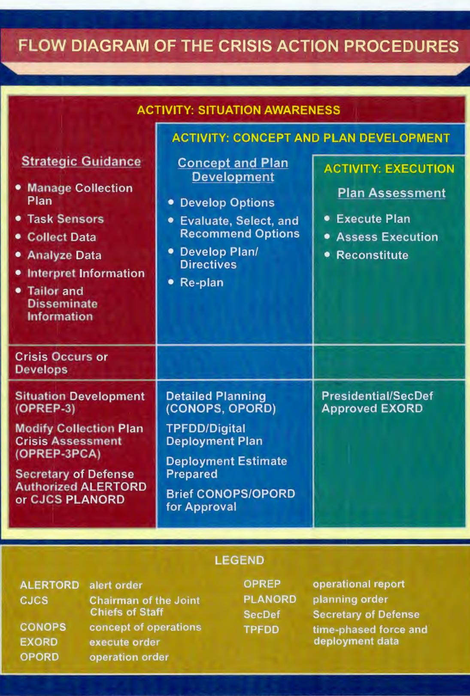  
Figure IV-6. Flow Diagram of the Crisis Action Procedures

# 6. Execution

If the President or SecDef decides to execute the selected COA, the CJCS issues an execute order. The execute order directs the deployment and employment of forces, defines the timing for initiation of operations, and conveys guidance not provided in earlier joint operation planning orders and instructions. The execution portion of joint operation planning continues as circumstances change and missions are revised. If the crisis expands to major conflict or war, CAP will evolve into and be absorbed within the larger context of implementation planning for the conduct of the war. The subordinate joint force J-2 provides intelligence critical to current and future operations, planning, targeting, and force protection. Collection, analysis, and reporting must answer the JFC's PIRs and provide predictive intelligence and assessments, with emphasis on intelligence involving the movement and disposition of hostile forces. Adversary movements of interest to SOF are among the top joint force reporting priorities during execution. The supported CCMD J-2 must be prepared to assume this reporting responsibility until the subordinate joint force J-2 has reached full operational status at the deployed location. Figure IV-7 shows how intelligence provides support to joint operation execution, to include JIPOE.

# 7. Assessment

a. Assessment is a continuous process that measures the overall effectiveness of employing joint force capabilities during military operations. Intelligence plays a critical role in the assessment process. The joint force J-2, through the CCMD JIOC, helps the JFC by assessing adversary capabilities, vulnerabilities, and intentions, and monitoring the numerous aspects of the operational environment that can influence the outcome of operations. The J-2 also helps the JFC and staff decide what aspects of the operational environment to measure and how to measure them to determine progress toward accomplishing a task, creating an effect, or achieving an objective. Inteligence personnel use the JIPOE process to provide JFCs and their staffs with a detailed understanding of the adversary and other aspects of the operational environment. JP 2-0, Joint Inteligence, and JP 2-01.3, Joint Intelligence Preparation of the Operational Environment, provide more information about the assessment process and the support that intelligence provides.

b. The Joint Staff J-5 selects specific plans to review through the joint combat capability assessment process. The Joint Staff J-2 coordinates with the IC to provide the following assessments:

(1) Execution probability assessment based on warning. (2) CSA readiness assessment. (3) National intelligence supportability based on the latest NISP collection and production capability assessment.

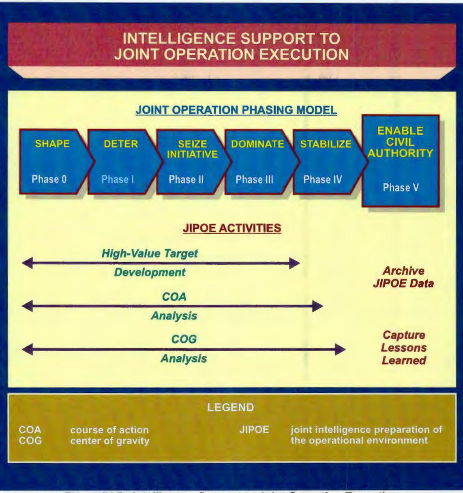  
Figure IV-7. Intelligence Support to Joint Operation Execution

# CHAPTER VINTELLIGENCE AND THE DEPARTMENT OF DEFENSE INFORMATIONNETWORKS

"The success of any crisis deployment hinges on the existence of a reliable command and control system and of a flexible, reliable system for gathering, analyzing, and disseminating strategic and tactical intelligence."

General H. Norman Schwarzkopf, US Army Commander, United States Central Command Operation DESERT STORM, 1991

# 1. Introduction

a. DOD's information networks are a globally interconnected, end-to-end set of information capabilities, associated processes, and personnel for collecting, processing, storing, disseminating, and managing information on demand to joint forces and support personnel. The DOD information networks include all communications and computing systems and services, software (including applications), data, security services, other associated services, and national security systems. This environment supports all DOD and IC missions and functions, in war and peace, at all operating locations. The DOD information networks provide interfaces to multinational and non-DOD users and systems.

b. The DOD information networks enable intelligence and operations information and schematics to provide a COP, facilitate interoperability between previously stovepiped Service information systems, and provide assured, secure, and tailorable information on demand to al appropriate users. The modern communications and IT that make the DOD information networks possible is undergoing continuous and rapid evolution. This technological dynamism affects all the various subarchitectures, systems, and applications resident in the DOD information networks. This presents challenges regarding operator familiarization, the integration and interoperability of systems and networks, and the efficient utilization of available resources. These challenges can be overcome through dedicated, professional training; hands-on experience; and clear, workable architectural standards.

(1) As stated in $\scriptstyle \mathrm { J P } \ 2 - 0$ , Joint Intelligence, DIA establishes defense-wide intelligence priorities for attaining interoperability among the tactical, theater, and national intelligence systems and the respective communications systems at each level. The Director, DIA, coordinates planning and programming of intelligence resources, including those for selected information systems, telecommunications, and survivability. DIA has established a standard communications architecture that supports joint intelligence operations. The CCMD then takes this standard "package" and, in coordination with DIA, builds a theater intelligence architecture based on the mission, CCDR guidance, and command requirements.

(2) Developers, installers, and other information systems professionals must continuously improve the quality of their support to commanders by successfully creating and refining communications and information systems. However, technological development must be realistically tempered by the limitations of fielded and deployed systems and of the consumers themselves.

# 2. Intelligence-Related Components of the Department of Defense Information Networks

The communications networks and information processing, storage, and management systems that comprise the DOD information networks provide the basic framework for the timely transfer of data and information to support military operations. The DOD information networks also provide the means for the timely dissemination of information and finished intelligence to commanders and other key decision makers, thereby facilitating information superiority. The DOD information networks architecture implements common procedures, standards, and streamlined support, and continues to evolve. The intelligence portion of the DOD information networks is designed to provide an architecture that can be individually tailored to the specific needs of a joint force, ensures survivability and flexibility through distributed operations, and can be rapidly reconfigured to accommodate changing demands and responsibilities including facilitating relationships among federated intelligence partners. This tailorable, distributed, and rapidly reconfigurable joint architecture provides all relevant available operational environment information to the user in the form of a COP. Within the DOD information networks, the Department of Defense Intelligence Information System (DODIIS) is the aggregation of personnel, procedures, equipment, computer programs, and supporting communications of the military IC. DODiS defines the standards for intelligence system and application interoperability. The system concept provides an integrated strategic, operational, and tactical user environment for performing identical intelligence support functions on compatible systems. DODIIS provides a robust and flexible intelligence capability for subordinate joint forces as long as supporting communications lines are available. DODIIS tools support the movement of intelligence between DIA, the CCMDs, the Services, and other intelligence production and customer activities worldwide. This includes hard copy products, digital or soft copy products, on line access to databases, the ability to "push" or "pull" files of information between producers and consumers, CD-ROM storage, document imaging, electronic publishing, and networked (via internal LANs or JWICS) corporate mass storage devices, which contain large volumes of digitized intelligence information. DODIIS manages over 200 different systems, software tools, and databases. Figure V-1 lists the most commonly used applications.

a. Intelligence-Related Communications Infrastructure. The joint intelligence communications subarchitecture encompasses collection, processing, exploitation, analysis, and dissemination nodes. These nodes are supported by a robust communications infrastructure and automated systems equipped with tailored applications to meet the broad array of intelligence activities. Command, Service, and CSA intelligence processes rely on a communications backbone consisting of JWICS and SIPRNET. This infrastructure is supplemented by a distributed, common exploitation and dissemination system, tactical data links, and intelligence broadcast services to enable information sharing and collaboration.

# INTELLIGENCE-RELATED COMPONENTS ORTHE DEPARTMENT OF DEFENSEINFORMATION NETWORKS

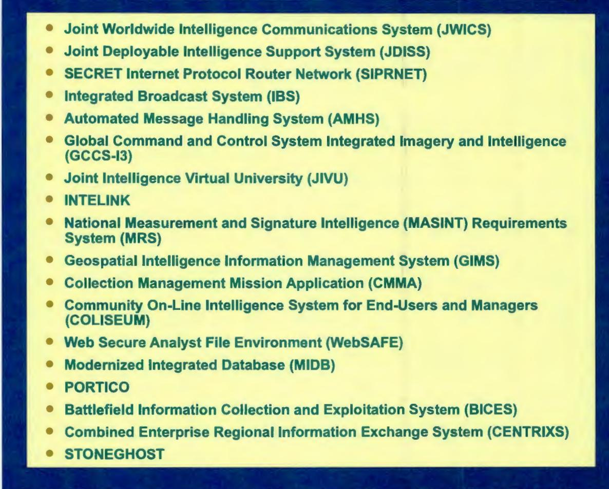  
Figure V-1. Intelligence-Related Components of the Department of Defense Information Networks

(1) Joint Worldwide Intelligence Communications System. JWICS is the IC's global communications network that provides DOD and IC users a mature, reliable, and flexible SCI communications architecture. JWICS is designed to deliver secure, assured, efficient, interoperable information on a global basis to national and defense intelligence consumers. JWICS provides real-time SCI data and video teleconferencing (VTC) capability and connects deployed forces, on land and at sea, with their parent commands, the Services, national intelligence producers, senior DOD leadership, and other USG departments and agencies.

(a) JWICS is best described as a multiplexer-based secure (Top Secret/SCI), high-speed multimedia intelligence communications network. JwICS meets the requirements for dedicated, interactive, and high bandwidth video-capable communications.

The strategic objective of JWICS is to provide interoperable and responsive intelligence communications connectivity for the military IC. This effort has included the development of JWICS in three modes (i.e., fixed, containerized, and mobile) with the capability of supporting a joint force or NIST in a fixed structure and/or field site.

(b) The complementary architecture of JWICS (data and/or video) and JDISS workstations (data) spans strategic, operational, and tactical levels. The major JWICS applications are electronic publishing, VTC, and bulk data transfer, including very large file imagery.

(c) Containerized Joint Worldwide Intelligence Communications System (CJWICS). C-JWICS is a lightweight, deployable JWICS capability developed to support contingency requirements through the use of military or commercial satellites or terrestrial earth terminals. C-JWICS I is the current iteration. The C-JWICS I supports SCI video, data, and National Secure Telephone System.

(d) Joint Worldwide Intelligence Communications System Mobile Integrated Communication System (JMICS). JMICS provides a scalable, deployable JWICS that is self-contained on a heavy, high-mobility, multipurpose, wheeled vehicle for rapid deployment in all-weather, austere environments. Key features include satellite connectivity, FAX, NIPRNET, SIPRNET LAN, SCI LAN workstations, JDISS network servers, and SCI VTC equipment. JMICS is controlled by Joint Staff J-2 and is deployed in support of NIST or joint force requirements.

(2) Joint Deployable Intelligence Support System. JDISS bundles commercial off-the-shelf hardware and software applications in a standard desktop environment. JDISS provides a field-deployable office automation suite built upon the system security infrastructure provided by client-server environment system services. JDISS also allows electronic mail and chat between intelligence echelons via the site's existing communications architecture. JDISS provides access to theater, Service, and national intelligence resources, such as databases, basic imagery analysis and dissemination capabilities, specific analytical tools, and support functions required to execute the intelligence mission.

(3) IBS disseminates NRT tactically/operationally significant intelligence and information to the warfi ghter, providing situational awareness, rapid threat warning, blue force tracking, combat search and rescue, theater missile defense missile threat/warning, and other vital data to the decision-making processes. IBS is a theater-tailored information and intelligence dissemination architecture with global connectivity that uses a standardized broadcast data format and a common receiver family, and is interoperable with current and programmed tactical and strategic warfare systems. IBS is an interactive service that provides intelligence producers the means to disseminate strategic, operational, and tactical information to the warfighter via multiple transmission paths IA W dynamic, user-generated dissemination priorities. This information is continually refined by data from strategic, operational, and tactical sensors.

(4) SIPRNET is the Secret-level wide-area network (WAN), with a worldwide backbone router system. Various DOD router services and systems are migrating onto the

SIPRNET backbone router network to serve the long-haul transport needs of the users. This network supports national defense C2 system requirements.

(5) AMHS is a multilevel secure, high mission assurance system for transmission of record message traffic in support of DOD.

b. Intelligence-Related Information Processing, Storage, and Management Systems. The Communications Handbook for Intelligence Planners provides more information on the systems briefly described below. These components of the DOD information networks consist of information processing, storage, and management applications specificall tailored to meet the broad array of intellgence activities supportig joint military operations.

(1) GCCS-I3 provides the commander and staffs with ready access to imagery and intelligence through a standard set of integrated, inked tools and services. It enhances the commander's operational environment awareness and maximizes commonality and interoperability across tactical, theater, and national levels. GCCS-I3 operates in both joint and Service-specific environments and is deployed in both SCI and collateral domains.

(2) Joint Intelligence Virtual University (JIVU) is a set of information processing and management applications that permit intelligence personnel to enroll in and attend online training courses.

(3) INTELINK is a principal electronic means for intelligence product dissemination. INTELINK builds on ongoing architectural initiatives at the Top Secret/SCI and Secret classification levels (see Figure V-2). INTELINK provides a comprehensive set of tools to query, access, and retrieve information. INTELINK permits collaboration among policy developers, analysts, and users, and will simplify access to a wide variety of services. The J-2 should assess the availability of INTELINK access among assigned and en route forces. The J-2 should also ensure that users have adequate system training and are aware of available products, content, and access procedures.

(4) National Measurement and Signature Intelligence Requirements System provides national and DOD intelligence organizations with a common MASINT requirements submission and tracking system.

(5) GEOINT Information Management System provides the national and DOD imagery communities with a uniform automated collection management system.

(6) Collection Management Mission Application (CMMA). CMMA is accessed through JWICS and SIPRNET and comprises a tailorable suite of interoperable automated tools designed to enhance the collection planning, execution, and ISR battle management capability of CCMDs, subordinate joint forces, and components. CMMA includes PRISM, which is used in collection planning, operations, and managing of intellgence collection assets that are deployed to all CCMDs and USFK.

(7) COLISEUM is a database application that allows the user to identify and track the status of all validated intelligence PRs and RFIs.

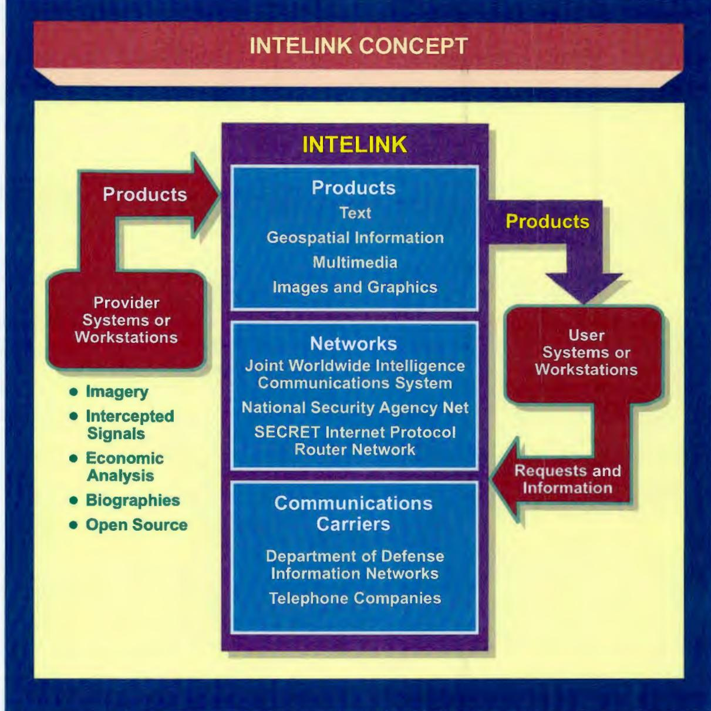  
Figure V-2. INTELINK Concept

(8) Web Secure Analyst File Environment provides intelligence analysts with the means of retrieving classified message traffic, IIRs, and abstracts of hard copy all-source intelligence documents produced by DIA.

(9) MIDB provides sets of data elements and the capability to relate items of intelligence information with other items within the database itself; for example, relating OB and military infrastructure information to installations.

(10) PORTICO is a Web-based system designed to improve the quality, availability, timeliness, and sharing of information across the DOD CI community to facilitate common situational awareness.

# c. Other Communication Resources

(1) The Joint Com munications Support Element (JCSE). The JCSE is a unique communications organization that provides contingency and crisis communications to meet the operational and support needs of the JCS, Services, CCMDs, DOD agencies and nonDOD agencies. Requests for support should be completed IA W CJCSI 61 10.01A, CJCSControlled Communications Assets. The JCSE provides tactical communications support for two simultaneously deployed subordinate joint forces and two joint special operations task forces. The JCSE possesses a wide range of communications capabilities tailored to meet a variety of contingency missions, including intelligence.

(2) Army forces and SOF use TROJAN SPIRIT II; Marine Corps forces use TROJAN LITE. Army, Marine Corps, and SOF all use JMICS and tactical LAN in support of joint requirements for intelligence support to subordinate joint forces and NIsT. These systems provide communications connectivity to support full JWICS, JDISS data, secure voice, and other unique intelligence communication needs.

(3) Liaison with other agencies or Service elements with communications capabilities, such as NSA or a public affairs group, may reveal existing or available communications links in place. While these organizations have their own requirements, in a crisis, the J-2, in coordination with the J-6, may arrange to temporarily share their circuits to meet critical needs.

# 3. Intelligence Communications Architecture Planning

A wide range of national, theater, and component intelligence and communication systems are available to a JFC. The existence of this capability does not, however, ensure that intelligence and communications systems can be deployed without significant planning and coordination. Supporting and supported communications paths must be established through prior coordination to extend DOD information network services to the JFC. The CCMD J-2 must sufficiently understand current systems to tailor an architecture integrating intelligence sensors, processors, dissemination systems， databases, information systems, and communications systems. The J-2 needs to maximize the use of the in-theater communication resources and then deploy ancilary equipment to extend the communications links to the warfighter. Since the preferred equipment or communications paths may not be available for a quick reaction to a contingency, alternative systems and/or subsystems and communications paths may have to be used or procured. The subordinate joint force J-2 must effectively coordinate communications architecture requirements with the J-6 and coordinate with the J-4 and other logistic elements for the timely delivery and installation of intelligence and communications systems. In addition, communications systems requirements for national-level connectivity for NIST support should be forwarded to the Joint Staff J-2 for validation and tasking. The CCMD or the joint force J-6 should coordinate with the NIST for communications planning and support. Interoperability problems need to be addressed and resolved during the planning phase.

a. Communications Planning Methodology. Key concepts to successful intelligence systems support are joint interoperability, streamlined flow of information, and providing pull-down of intelligence tailored to the needs of the operating forces. The ability to provide the tactical commander with real-time/NRT intelligence continues to be a critical factor. The following steps provide a useful methodology for planning an intellgence communications architecture (see Figure V-3):

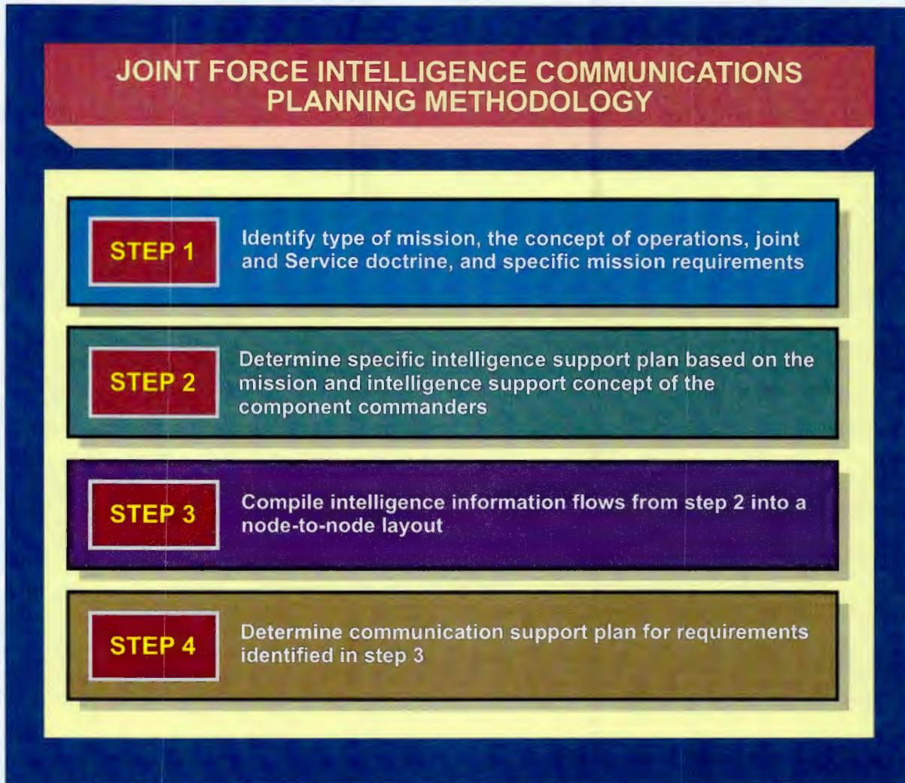  
Figure V-3. Joint Force Intelligence Communications Planning Methodology

(1) In planning a communications architecture, step 1 includes identifying the type of mission, the CONOPS, joint and Service doctrine, and the specific mission requirements. Step I functions are developed to meet specific mission objectives of the JFC and each of the subordinate commanders and an operational scenario for the mission. Step 1 products include lists of the subordinate joint force composition and the assets assigned from national, theater, and Service levels, and a specific activity timeline for operations planned by the JFC and each subordinate commander.

(2) In step 2, the specific communication intelligence support plan for the joint force is determined by the mission and the intelligence support concept developed by the component commanders in the operational area. This model identifies the intelligence functions required to support the subordinate JFC and the intelligence information flows required to support each function.

(3) Step 3 compiles the intelligence information flows from step 2 into a node-tonode layout of intelligence information transactions. Nodes are used to represent the HQ and the external supported and/or supporting organizations. This is done by numbering the nodes of interest and developing needlines. A needline represents the flow from one node to another.

(4) During step 4, the joint force J-6 staff will determine the communications support plan for requirements identified in step 3. The requirements developed by the J-2 planning staff can either be analyzed separately or combined with similar inputs from the manpower and personnel directorate of a joint staff (J-1), J-3, J-4, J-5, and J-6 staffs at each security level.

b. Architecture Planning. The CCMD J-2 and J-6 should plan and set up adequate communications paths for the JFC and/or subordinate joint force intelligence needs prior to operational deployment (see Figure V-4). The joint force should use established WANs as the basis for planning its communications, information systems support, and dissemination to the joint force component commanders at the Top Secret/SCI and Secret levels. In coordination with the J-6, the J-2 builds a tailored, integrated architecture that incorporates sensors, processors, and dissemination systems with information systems and communications systems (e.g., JWICS). This architecture links the subordinate joint force with the Service components and coalition or allied units as wel as with the CCMDs and the NJOIC. The major components of the joint intelligence architecture provide connectivity between the joint force and the national and component levels. This tailored architecture includes prototype equipment and units with different or unique systems. Once the architecture is defined, the J-2works with the J-3 and J-4 toupdate the time-phased force and deployment data (TPFDD). The J-2 and J-6 should solve any interoperability problems prior to resource deployment.

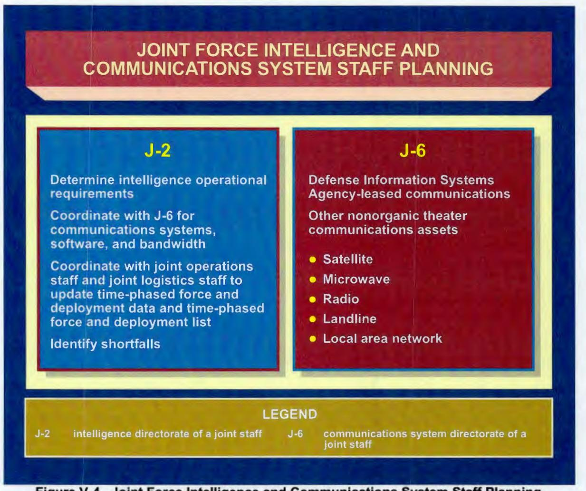  
Figure V-4. Joint Force Intelligence and Communications System Staff Planning

# c. System Planning

(1) Communications asset requirements must be identified to the J-6. As soon as the subordinate joint force J-2 determines operational and dissemination requirements, the J2 coordinates support from the subordinate joint force J-6 for the necessary communications systems, communications security (COMSEC), application software, and communications bandwidth needed to provide simultaneous transmission of secure, interactive VTC; dissemination of selected products using graphics, desktop publishing, data, and secondary imagery; and secure voice. Shortfalls in communications support are identified and submitted to higher HQ for resolution.

(2) Subordinate joint force communications links include satellite, microwave, radio, landline, and LANs. The subordinate joint force J-2 and J-6 identify the proper frequencies, communications protocols, network security management requirements, encryption devices, and procedures for the architecture components. The resulting communications capability interfaces with the global intelligence infrastructure (i.e., the national IC, the CCMD JIOC, the subordinate joint force and components, and allies and/or coalition partners).

(3) Requests to the CCMD J-6 for Defense Information Systems Agency (DISA)- leased or nonorganic theater communications resources may become complex. For example, if requesting a WAN service such as JWICS, the subordinate joint force wil likely need Joint Staff and DISA coordination and DIA and/or NSA requirement validation. The J-6 requires detailed information for formal request documentation. Information required includes the type of telecommunications support required, proposed location, time required to be operational, duration, funding, and justification. For a circuit requirement, the request should indicate terminal types at all locations; estimated intelligence traffic volumes; precedence and security levels; types of available encryption; specific locations; POC; any recommended restoration priority; usage duration; and type of circuit special considerations. The subordinate joint force prepares a telecommunications request for service and submits it to the appropriate command or J-6 validating authority. This process can be completed in advance by establishing contingency or on-call circuitry activation IAW an approved OPLAN.

(4) The standard tactical entry point and teleport sites make this process easier, using existing Defense Satellite Communication System strategic earth terminals and commercial earth terminals to provide warfi ghters with a standardized set of pre-positioned circuits for entry into the DOD information network. These sites serve as a communications hub to maximize satellte resource eficiency and access to services.

# d. Planning Considerations

(1) Joint intelligence dissemination relies on a federated architecture across many agencies and domains. This concept allows JFCs access to relevant intelligence when needed, based on their mission and the specific phase of the ongoing operation, using services or service-oriented architectures to access intelligence data physically located and maintained at various locations. Additionally, the theater JIOC should determine the desired intelligence and enable access to the information directly to all echelons requiring it.

(2) Every subordinate joint force operation requires planning for the exchange of intelligence within a deployed joint force and between the deployed joint force and supporting intelligence organizations. Intra-subordinate joint force communications should support the exchange of situation data, RFIs, intelligence, and tasking of collection resources among the major elements of the deployed joint force and supporting intelligence organizations worldwide. These exchanges include the following:

(a) Intelligence exchanges within and between each component assigned or attached to the subordinate joint force. Each Service and functional component should deploy with an organic tactical communications capability that meets intra-Service exchange requirements.

(b) Exchanges between the HQ of the subordinate joint force and, if designated, the HQ of the components. Any intra-subordinate joint force requirements for intelligence exchanges at lower echelons can either be routed through these HQ or identified as special requirements that must be planned separately.

(c) Connectivity requirements of the subordinate JFC to the CCDR and to the national intelligence support agencies (e.g., connectivity for the NIsT that may deploy to support the subordinate JFC), to other supporting commanders and, in special cases, to other subordinate joint forces.

(d) Connectivity requirements from the assigned components to Service intelligence centers in theater and CONUS must also be addressed.

(e) Exchanges between the HQ of the joint force and supporting crisis intelligence federation partners operating from home stations.

(f) Connectivity with and among coalition intelligence partners.

(3) The requirement to exchange large quantities of perishable data among dispersed forces places special demands on many communications networks. Additionally, commanders and planners must understand the possible adverse effect large volumes of intelligence data may have on a limited bandwidth transmission system. CCDRs will determine the priorities of C2 systems and allocate communications circuits and channels

(4) Required communications capabilities considered by J-6 and J-2 planners include channel capacity, defined as the maximum rate at which information can be sent over a communication channel without error. Imagery transmission requirements are of particular concern because of their high bandwidth requirements, which are directly proportional to the degree of resolution desired (i.e., the higher the resolution, the longer the transmission time via a given bandwidth). The J-6 and J-2 planners must ensure that high-bandwidth transmissions such as imagery do not preclude or delay the receipt of other transmissions (e.g., messages), affecting the operation. wideband circuits required to resolve this problem are costly and not always available in intratheater locations. while satellite transmission systems offer high volume and broad coverage (compared to landline and line of sight radio systems), overall transmission capacity is limited to the radio frequency spectrum and how the CCDR apportions available satellite bandwidth. Landline system capacity is limited by the amount of wire or fi ber in place throughout the system.

# THE PEARL HARBOR WARNING MESSAGE

Even the best of intelligence is useless if it fails to arrive in time to support the decision maker. Just hours prior to the Japanese attack on Pear Harbor, Us code breakers reading Japanese diplomatic traffic convinced Army Chief of Staff Marshal to send a message to Us forces in the Pacific alerting them to the possibility of a Japanese attack at approximately 0800 hours on 7 December. The following account of how Marshal's warning message was tragically mishandled that fateful day is condensed from Rear Admiral Layton's book "And I Was There."

"Colonel Bratton [Chief of the Army G-2 Far Eastern Section] arrived at the Munitions Building shortly before nine. He was reading the fourteenth part of the Tokyo message and comparing it with the previous afternoon's thirteen parts when he was handed a much shorter message that had just been decrypted: 'Wil the ambassador please submit to the United States Government (if possible the Secretary of State) our reply to the United States at $1 : 0 0 \ \mathsf { p } . \mathsf { m }$ . on 7th, your time.'

'This immediately stunned me into frenzied activity because of its implications,' Bratton testified. 'The vital factor in my mind was the date and hour of delivery of the 14-part message.' That Tokyo would want a diplomatic message delivered on a Sunday was unusual enough, but the specific timing was its real significance. Dawn was an ideal time to launch a surprise attack, and a brief Iook at a time chart left Bratton 'convinced the Japanese were going to attack some American installation in the Pacific area.'

Nearly two hours had elapsed from the receipt of the deadline message to the time that General Marshall arrived at his office. Marshall eventually agreed that another alert should be 'sent at once by the fastest possible means.' Despite the 'awful urgency' about beating the deadline, which was little more than an hour away, for security reasons Marshall did not want to use the scrambler telephone.

Time was running out, as Bratton well appreciated. When he arrived at the signal center he was 'very much exercised,' according to Colonel Edward F. French who was in charge of the army's signal center. Bratton had to translate Marshall's hastily scrawled dispatch, which read:

'Japanese are presenting at one p.m. eastern standard time today what amounts to an ultimatum. Also they are under orders to destroy their code machine immediately. Just what significance the hour set may have we do not know but be on the alert accordingly. Inform naval authorities of this communication. Marshall.'

Marshall might have changed his mind about using the Navy facilities, or his scrambler telephone, to reach General Short [Commander, Us Army Hawaian Department] if French had reported that heavy static had blocked out the Army's radio circuits to Honolulu since 1030. When French learned of this holdup, he decided to send the message to Hawaii using his teleprinter link to the Western Union Washington office.

Because the coded telegram containing Marshal's warning had been inadvertently sent out without a priority designation, when it reached the RCA Honolulu office at three minutes after the deadline had expired in Washington, it was pigeonholed for routine delivery to Fort Shafter.

Kimmel [Commander in Chief, Us Pacific Fleet] stood by the window of his office at the submarine base, his jaw set in stony anguish. As he watched the disaster across the harbor unfold with terrible fury, a spent .50-caliber machine gun bullet crashed through the glass. It brushed the admiral before it clanged to the floor. It cut his white jacket and raised a welt on his chest. 'It would have been merciful had it killed me,' Kimmel murmured to his communications officer, Commander Maurice 'Germany' Curts.

Tadeo Fuchimaki, the RCA messenger who had been delayed for more than an hour and a half in the panicky traffic jams, finally gunned his motorbike up to the gates of Fort Shafter. The communications staff was flooded with incoming and outgoing reports, so it was almost four hours before anyone thought of decoding the low-priority cable from Washington. When Short finally saw a copy of Marshal's warning, it was nearly eight hours old.

Military annals have provided few more glaring examples ofinformation that arrived too late to change the course of history. To his dying day Admiral Kimmel considered the delayed warning of Tokyo's one o'clock deadline as the most shocking example of Washington's mishandling of the whole matter of intelligence."

SOURCE: Rear Admiral Edwin Layton, US Navy (Retired), "And I Was There": Pearl Harbor and Midway-Breaking the Secrets, William Morrow and Company, Inc., New York, 1985

Intentionally Blank

# APPENDIX ANATIONAL INTELLIGENCE

"Tell me what you know.tell me what you dont know.tel me what you think..always distinguish which is which.

General Colin Powell Chairman of the Joint Chiefs of Staff, 1989–1993

# 1. Introduction

The joint force J-2 will generally need the support of national intelligence organizations in order to provide the JFC with timely, relevant, and accurate intelligence. The J-2 must understand how the national intelligence organizations are organized and how they operate in order to best exploit their capabilities. This appendix provides information about the national-level intelligence organizations that could provide support to joint operations.

# SECTION A. LEGAL AUTHORITIES FOR THE CONDUCT OF INTELLIGENCE ACTIVITIES

# 2. Congressional Mandates

a. National Security Act. The National Security Act of 1947 created the framework for the IC. The act established the NSC, Director of Central Intelligence (DCI), and DOD and identifies the organizations that make up the IC.

b. The Intelligence Reform and Terrorism Prevention Act of 2004. The IRTPA amended the National Security Act of 1947, creating the position of DNI and his or her office. The IRTPA gave the DNI authority over the intelligence budget, authority to shift a certain amount of resources among agencies to accomplish specified missions, and approval authority concerning personnel decisions for top leadership positions in the IC outside of DOD. The IRTPA also established issue-oriented $\mathbf { I P }$ centers to coordinate national level intelligence positions on functional or regional problem sets, such as counterterrorism. The IRTPA defined the term national intelligence to mean: All intelligence, regardless of the source from which derived and including information gathered within or outside the United States that (1) pertains to more than one USG agency, and (2) involves threats to the US, its people, and property or interests; the development, proliferation, or use of WMD; or any other matter bearing on US national or homeland security.

c. Titte 10 and Title 50, US Code, in combination, regulate the activities and funding of the US IC, including the DOD elements of the IC. Both Titles 10 and 50, US Code, reinforce with legislative authority the roles of SecDef and his subordinate officers in the conduct of intelligence. The statutory authority provided to the President by Title

10, US Code; Title 50, US Code; and the IRTPA, are relied on as the legal foundation for EO 12333.

d. EO 12333 of 1981, as amended, is the Presidential directive that provides the goals, direction, duties, and responsibilities that pertain to the national intelligence effort, including the DOD elements. It also outlines the national IC, its elements, and its roles and functions, and includes guidelines on oversight and implementation.

# 3. Management and Oversight Boards and Advisory Groups

a. National Security Council. The NSC is the principal forum to consider national security issues that require Presidential decision. The NSC is chaired by the President. Its regular attendees are the Vice President, the Secretary of State, the Secretary of the Treasury, SecDef, and the Assistant to the President for National Security Affairs. The CJCS is the statutory military advisor to the council, and the DNI is the intelligence advisor. The NSC drafts, coordinates, and approves national security presidential directives, which are an instrument for communicating Presidential decisions about US national security policy. The National Security Advisor is responsible for the NSC's dayto-day operations. Council functions are supported by the NSC staff that includes the White House Situation Room and regional and functional desks.

b. Homeland Security Council. The HSC coordinates all homeland security related activities among executive departments and agencies, and promotes the effective development and implementation of homeland security policies. The HSC is chaired by the President, and includes the Vice President, the Secretary of Homeland Security, Secretary of the Treasury, SecDef, Attorney General, Secretary of Health and Human Services, Secretary of Transportation, DNI, Director of the FBI, and the Assistant to the President for National Security Affairs. The HSC drafts, coordinates, and approves homeland security presidential directives, which are an instrument for communicating Presidential decisions about US homeland security policy.

c. The President's Intelligence Advisory Board (PIAB). The PIAB consists of 16 members, appointed by the President, who are senior civilian and former military leaders. The PIAB reports directly to and advises the President on the performance of all government agencies engaged in the collection, analysis, or production of intelligence or in the execution of intelligence policy. Additionally, the PIAB advises the President concerning the objective, conduct, and coordination of the activities in these agencies. The PIAB is specifically charged to make appropriate recommendations for actions to improve and enhance the performance of intelligence efforts.

d. Intelligence Oversight Board (IOB). The IOB is a committee of the PIAB and informs the President of intelligence activities it believes may be unlawful or contrary to EO or Presidential directive and that are not being adequately addressed by the Attorney General, DNI, or the head of the department concerned. It also advises the President on intelligence activities it believes should be reported to him immediately.

e. Intelligence Community Executive Committee (IC/EXCOM). The IC/EXCOM is an advisory body that supports the DNI on issues involving leadership, governance, and management of the IC. The IC/EXCOM is chaired by the DNI, and its membership is as follows: The Principal Deputy DNI; the Director of Staff, ODNI, who serves as the ODNI participant; the director of each national intelligence agency; the intelligence principals from each Service intelligence component; plus the Director, FBI, and the chiefs of the intelligence components of DEA, DOE, DOS, Department of Transportation, DHS, and USCG; and the USD(I). Others may be invited, including the Vice Chairman, JCS. IC/EXCOM meetings are convened at the discretion of the DNI.

f. Defense Intelligence Executive Board (DIEB). The DIEB is the senior corporate advisory body to SecDef for review and oversight of defense intelligence programs and activities. Further, the DIEB is the senior management body providing fiscal and programmatic guidance to the Military Intelligence Program (MIP). Upon the establishment of the MIP, SecDef created the DIEB as a management mechanism to provide effective oversight of DOD intelligence programs and to make key decisions for efficient allocation of available resources to address department needs. The DIEB is chaired by the Deputy Secretary of Defense, with the USD(I) serving as its executive secretary. Additional members include the Director, CIA; representatives of the Services; a number of senior OSD officials; the Vice Chairman of the JCS; the Director of the Joint Staff; and the directors of all DOD agencies involved in the MIP. The DIEB provides a forum for discussion and review of existing and emerging issues and challenges for intelligence in support of defense needs and develops immediate solutions when necessary. The composition of this board ensures significant issues are identified and addressed. Through careful corporate examination of defense intelligence capabilities, the DIEB develops alternatives and recommendations that foster the most effective allocation of these resources. The board meets not less than twice a year to provide advice and counsel on defense intelligence issues.

g. The White House Privacy and Civil Liberties Oversight Board was established by the IRTPA of 2004. The board advises the President and other senior executive branch officials to ensure that concerns with respect to privacy and civil liberties are appropriately considered in the implementation of all laws, regulations, and executive branch policies related to efforts to protect the nation against terrorism. The White House Privacy and Civil Liberties Oversight Board is assisted by offices, such as the Chief Privacy Office of DHS and the Civil Liberties Protection Office of ODNI, to counterbalance surveillance authority that resulted from the creation of DHS and the consolidation of the intelligence agencies in the federal government by advising on whether adequate guidelines, supervision, and oversight exist to protect privacy and civil liberties. Thus, the board and the above-noted offices are designed to provide an enhanced system of checks and balances to protect these important legal rights of all Americans.

h. ISR Integration Council. The ISR Integration Council serves as DOD's senior deliberative body for intelligence issues. It provides a forum through which the integrators of ISR capabilities for each of the Services and agencies can routinely interact with each other to ensure unity of effort and to preclude unnecessary duplication of effort. The scope of the council's responsibilities includes all issues necessary to assist the Office of the Under Secretary of Defense (OUSD[I]) in establishing the department's overall direction for ISR capabilities and identifying and advocating the capabilities required for ISR transformation. The ISR Integration Council uses the Joint Requirements Oversight Council process through its Battlespace Awareness Working Group. The ISR Integration Council also has a deputies council that meets beforehand to set the agenda in preparation for the ISR Integration Council. The ISR Integration Council meets monthly and is chaired by the USD(I). Statutory members include SIOs of the Services and United States Special Operations Command (USSOCOM); directors of DOD intelligence CSAs; Joint Staff J-2, J-3, and J-8 (Directorate for Force Structure, Resource, and Assessment, Joint Staff); and a representative from the ODNI.

i. The Military Intelligence Board (MIB). The MIB serves as the senior board of governors for the military IC and works to develop cooperation and consensus on crossagency, Service, and command issues. The MIB is chaired by the Director of DIA. The membership of the MIB is shown in Figure A-1.

(1) The MIB is a key element involved in guiding and supporting DOD intelligence operations. The MIB coordinates intelligence support to military operations and provides a forum for the discussion of issues going before the DIEB, IC/EXCOM, and other national-level intelligence forums.

(2) The MIB may assist in obtaining intelligence support to military operations during periods of crisis or contingency operations within a CCMD's AOR. During major combat operations, the MIB meets on an almost daily basis to address theater intelligence shortfalls identified by CCDRs and to coordinate the deployment of needed personnel, equipment, and systems to support operations.

# SECTION B. NONMILITARY MEMBERS OF THE INTELLIGENCECOMMUNITY

# 4. Introduction

The efforts of non-DOD IC members will primarily focus on strategic intelligence and support to the President and SecDef (see Figure A-2). These agencies identify global and regional issues and threats to the President and SecDef, military leadership, and CCDRs. This responsibility includes assessing potential issues and situations that could impact US national security interests and objectives. Intelligence provided by these agencies is essential in support of some military operations, across the range of military operations. The following descriptions of the non-DOD members of the IC include subordinate offices that support IC activities but are not necessarily considered a part of, or funded by, the IC.

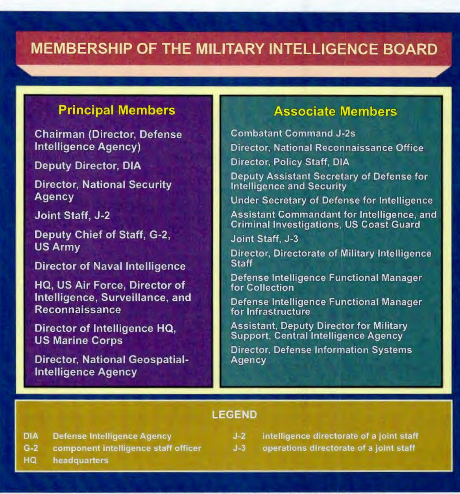  
Figure A-1. Membership of the Military Intelligence Board

# 5. Elements of the Nonmilitary Intelligence Community

a. Director of National Intelligence. As the principal advisor to the President, the NSC, and the HSC on intelligence matters related to national security, the DNI is responsible for overseeing the NIP and execution of the NIP budget and is ultimately responsible for tasking, production, and dissemination of national intelligence. The DNI coordinates the relationships between elements of the IC and the intelligence or security services of foreign governments on all matters involving intelligence related to the national security. The DNI is also responsible for providing guidance to the IC concerning standards for collection, analysis, production, dissemination, and sharing of national intelligence, and publishes National Intelligence Estimates that provide top decision makers with the sense of the IC on timely topics of interest. To aid the DNI in conducting these responsibilities, Congress authorized creation of the ODNI and gave the DNI authority to establish functional issue managers and mission managers to coordinate IC activities with respect to designated countries, regions, topics, or functional issues. At the time the IRTPA was enacted, Congress established two national intelligence centers, responsible for counterterrorism and counterproliferation, and authorized the DNI to establish other issue-oriented intelligence centers and to transfer personnel from IC elements to those centers.

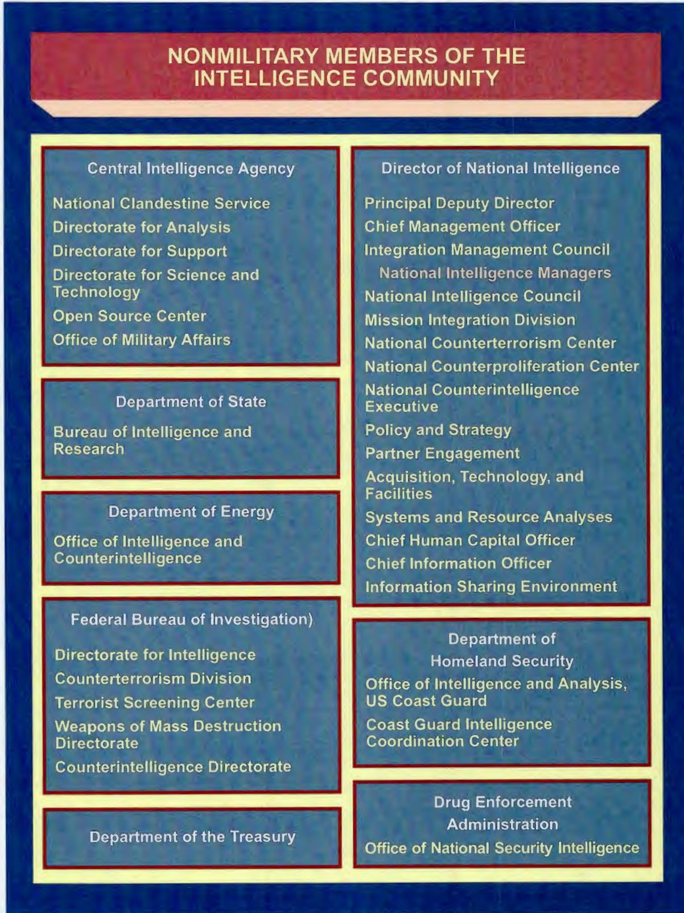  
Figure A-2. Nonmilitary Members of the Intelligence Community

(1) The DNI has designated the USD(I) for Intelligence as his Director of Defense Intelligence (DDI) to facilitate coordination between the defense and nondefense elements of the IC.

(2) The DNI oversees the National Intelligence Council, which oversees the production of National Intelligence Estimates and manages the national I& W System.

(3) The DNI established the NIC-C, colocated with DIA, to coordinate the requirements management, tasking, and operation of national collection means to satisfy intelligence needs across the IC.

b. Central Intelligence Agency. The CIA's primary areas of expertise are in HUMINT collection, all-source analysis, and the production of political and economic intelligence. The Director, CIA, also serves as the national HUMINT manager and the NCS Director. The CIA has three deputy directors: Deputy Director for Intelligence; Deputy Director for Science and Technology; and Deputy Director for Support.

(1) The NCS has responsibility for the clandestine collection of foreign intelligence that is not obtainable by other means. The NCS engages in CI activities overseas by protecting classified US activities and institutions from penetration by hostile foreign organizations and individuals. NCS also carries out covert action in support of US policy goals when legally and properly directed and authorized by the President.

(2) The Directorate of Intelligence analyzes all-source intelligence and produces reports, briefings, and papers on key foreign intelligence issues. This information comes from a variety of sources and methods, including US personnel overseas, HUMINT reports, satellite imagery, open-source information, and sensors.

(3) The Directorate of Science and Technology accesses, collects, and exploits information to facilitate the execution of CLA's mission by applying innovative scientific, engineering, and technical solutions to the most critical intelligence problems.

(4) The Directorate of Support supports the rest of the agency with acquisition, communications, facilities, financial management, IT, medical services, logistics, and security.

(5) CIA is the executive director for In-Q-Tel, a nonprofit, strategic venture capital firm chartered to connect the technology demands of the CLA and IC partners' intelligence missions with the emerging technology of the entrepreneurial community.

(6) Office of Military Affairs (OMA). The OMA falls under the Associate DCI for Military Support, a fl ag rank military officer. OMA is staffed by CIA and military personnel. As the agency's single POC for military support, OMA negotiates, coordinates, manages, and monitors all aspects of agency support for miitary operations. This support is a continuous process that can be enhanced or modified to respond to a crisis or developing operation. Interaction between OMA and the CIA representatives to the OSD, the Joint Staff, and the CCMDs facilitates the provision of national-level intelligence in support of joint operations， operation planning, and exercises.

c. Open Source Center. The OSC replaced the Foreign Broadcast Information Service. It is an element of DNI, and the Director, CIA, acts as the executive agent. The OSC produces translations， transcriptions， analyses， reports， video compilations， and geospatial information that addresses short-term needs and longer-term issues. Its products cover issues that range from foreign political, military, economic, science, and technology topics, to counterterrorism, counterproliferation, counternarcotics, and other homeland security topics. The OSC is charged with:

(1) Collecting, translating, producing, and disseminating open-source information that meets the needs of policymakers, the military, state and local law enforcement, operations officers, and analysts throughout the USG.

(2) Helping to enable open-source capabilities in other parts of the govermment and military.

(3) Hosting open source material on an easily accessible Web page for government-wide use.

(4) Collecting "gray literature," which is material with very limited distribution, such as academic papers, brochures, leaflets, and other publicly distributed materials.

(5) Providing training through its Open Source Academy, consultative services, and personnel exchanges.

d. Department of State Bureau of Intelligence and Research. The INR coordinates programs for intelligence, analysis, and research and produces intelligence studies and current intelligence analyses for the Secretary of State and other DOS, including ambassadors, special negotiators, country directors, and desk oficers. INR is also responsible for policy and coordination of intelligence activities in support of diplomacy and conducts open-source public opinion surveys, polls, and media trend analyses.

e. Department of Energy. DOE formulates energy policy for the US and has a system of national laboratories and technical centers, which conduct energy-related research in the national interest. The Office of Intelligence and Counterintelligence directs the development of the DOE's policy, plans, and procedures relating to arms control, nonproliferation, export controls, and safeguard activities. It provides access to DOE's energy information and technical expertise to the rest of the IC. Additionally, this office is responsible for managing the DOE's research and development program, for verifying and monitoring arms implementation and compliance activities, and for providing threat assessments and support to HQ and field offices.

f. Federal Bureau of Investigation. FBI is an intelligence and law enforcement agency. It is responsible for understanding threats to our national security and penetrating national and transnational networks that have a desire and capacity to harm the US. The FBI coordinates these efforts with its IC and law enforcement partners. It focuses on terrorist organizations, foreign intelligence services, WMD proliferators, and criminal enterprises. As the principal investigative arm of DOJ, the FBI is primarily responsible for CI and counterterrorism operations conducted in the United States. CI operations contemplated by any other organizations in the United States must be coordinated with the FBI. Any overseas CI operation conducted by the FBI must be coordinated with the CIA. The FBI includes the following subordinate organizations of direct interest to the IC:

(1) Directorate for Intelligence. The FBI's intelligence analysis unit. It has employees embedded in each field ofice and at FBI HQ to analyze the threat.

(2) Counterterrorism Division. Focuses on both domestic and international terrorism, and oversees the joint terrorism task forces.

(3) Terrorist Screening Center. Created to consolidate the government's approach to terrorist screening and to create a single comprehensive watch list of known or suspected terrorists.

(4) WMD Directorate. Uses all available operational and S&T capabilities to help prevent individuals and groups from acquiring WMD capabilities and technologies.

(5) Counterintelligence Division. Prevents and investigates foreign intelligence activities within the US and espionage activities in the US and overseas.

g. Department of the Treasury. Intelligence-related missions include the production and dissemination of foreign intelligence relating to US economic policy and participation with DOS in the overt collection of general foreign economic information.

h. Department of Homeland Security. The DHS Office of Intelligence and Analysis (I&A) provides I&W support to the Homeland Security Advisory System, assesses the scope of terrorist threats to the US homeland, and integrates terrorist-related information from DHS components, other USG agencies, state and local government authorities, and private sector entities. I&A focuses on threats related to border security, CBRNE issues, critical infrastructure protection, naturally occurring infectious diseases, extremists within the homeland, and travelers entering the homeland.

i. USCG, DHS. The USCG has unique missions and responsibilities as both an armed force and a law enforcement agency that make it a significant player in several national security issues. To accomplish these diverse objectives, the USCG intelligence program consists of two distinct elements——the Law Enforcement Intelligence Program (LEIP) and the National Intelligence Element, which conducts activities as described in EO 12333 and the National Security Act of 1947. USCG intelligence efforts support counterdrug operations, alien migration interdiction operations, living marine resource enforcement, maritime intercept operations, port status and/or safety, counterterrorism, coastal and harbor defense operations, and marine safety and/or environmental protection. The LEIP is not part of the IC, but collects information using USCG law enforcement and regulatory authorities.

(1) The USCG ICC is a tenant command within the National Maritime Intelligence Center (NMIC) in Suitland, Maryland, and maintains a 24-hour intelligence watch, providing I&W input to the NMIC. The ICC acts as the strategic center with ties to both national intelligence agencies and the HQ-level law enforcement intelligence activities. The ICC supports strategic analysis, manages Coast Guard collection, and provides national imagery exploitation support, including tactical support to operational commanders.

(2) USCG area intelligence components provide regional and operational intelligence for USCG operations through the Atlantic and Pacific Maritime Intelligence Fusion Centers. Coast Guard intelligence entities have the capability to access SIPRNET, Navy, and IC databases and C2 systems, including JWICS, the Anti-Drug Network, and the Joint Maritime Information Element.

(3) United States Coast Guard Investigative Service (CGIS) is a federal investigative and protective agency chartered to conduct internal and external criminal and personnel security investigations, assist in providing personal security protection, and conduct CI investigations. Responsibilities include criminal investigations of maritime crimes, investigating fraud, personal protection services, and security background investigations. CGIS criminal investigations and intelligence operations focus on drug smuggling, environmental crimes, illegal immigration by sea, and assistance as required by other federal law enforcement agencies.

(4) USCG National Response Center (NRC) serves as the central national POC for reporting environmental data for all oil, chemical, radiological, and biological discharges into the environment in the United States and its territories. The NRC gathers and distributes intelligence data for federal on-scene coordinators and serves as the communication and operations center for the deployable national response team.

(5) Coast Guard Counterintelligence Service (CGCIS). CGCIS is the counterintelligence component of the USCG National Intelligence Element and has agents assigned to each USCG area command, subordinate districts, and select sectors. CGCIS detects, deters, neutralizes, and exploits the efforts of foreign intelligence entities targeting the USCG, with a range of CI and HUMINT authorities similar to those in the other Services. CGCIS conducts CI investigations, collections, operations, analysis, and provides the full range of most CI functional services to the USCG.

(6) Coast Guard Cryptologic Group (CGCG). CGCG is the cryptologic component of the USCG National Intelligence Element and provides a unique maritime cryptologic perspective within the SIGINT community, helping to satisfy validated national SIGINT requirements, which also support Coast Guard and DHS missions. CGCG brings cryptologic capabilities and full interoperability with US Navy and US cryptologic assets to enhance maritime domain awareness for operational commanders as they plan and execute Coast Guard missions.

j Drug Enforcement Administration Office of National Security Intelligence. DEA enforces the laws and regulations of the US with respect to controled substances. It brings to the criminal justice system of the US, or another competent jurisdiction, any individuals or organizations involved in the growing, manufacturing, or distributing of controlled substances appearing in or destined for the US. The Office of National Security Intelligence facilitates appropriate intelligence coordination and information sharing with other members of the Us IC and homeland security. Its mission is to help reduce the supply of illegal drugs, protect national security, and combat global terrorism.

# SECTION C. MILITARY INTELLIGENCE COMMUNITY

# 6. Elements of the Military Intelligence Community

a. The Office of the Secretary of Defense. As shown in Figure A-3, SecDef, assisted by the USD(T), exercises full authority, direction, and control over the intelligence activities of DOD. SecDef is responsible for collecting, processing, producing, and disseminating military and military-related foreign intelligence and CI. As a member of the NSC, SecDef participates in the development of national-level policy. SecDef has a major responsibility to ensure timely development and submission of proposed national programs and budgets.

b. USD(T). The USD(I) is the principal staff assistant and advisor to SecDef on all intelligence, CI and security, and other intelligence-related matters. On behalf of SecDef, the USD(I) exercises authority, direction, and control of intelligence and CI organizations within DOD to ensure that they are manned, trained, equipped, and organized to support DOD missions and are responsive to DNI requirements. The USD(I) also serves as the DDI and is the DOD's principal advisor to the DNI and ODNI on all matters concerning DOD intelligence, CI, security, and intelligence-related matters. The DDI serves as the DNI's representative on DOD intelligence activities to SecDef and staff, heads of DOD components, including the CJCS, and the JCS, as well as elements of the Joint Staff, IC, and any other elements of the USG as determined by the DNI. The USD(I) is assisted by the following deputies:

(1) The Deputy Under Secretary of Defense (DUSD) for Technical Collection and Analysis provides direction and oversight of all DOD Intelligence Enterprise analytical and collection functions. It stimulates, develops, and implements advanced concepts, responsive strategies, and cutting-edge analytic and collection capabilities. Acts as DOD Discipline Manager for all intelligence disciplines. Identifies future analytic functional needs and drives collection strategies accordingly. Synchronizes and optimizes cross-discipline, intra-OUSD(I), and inter-departmental collaboration and coordination.

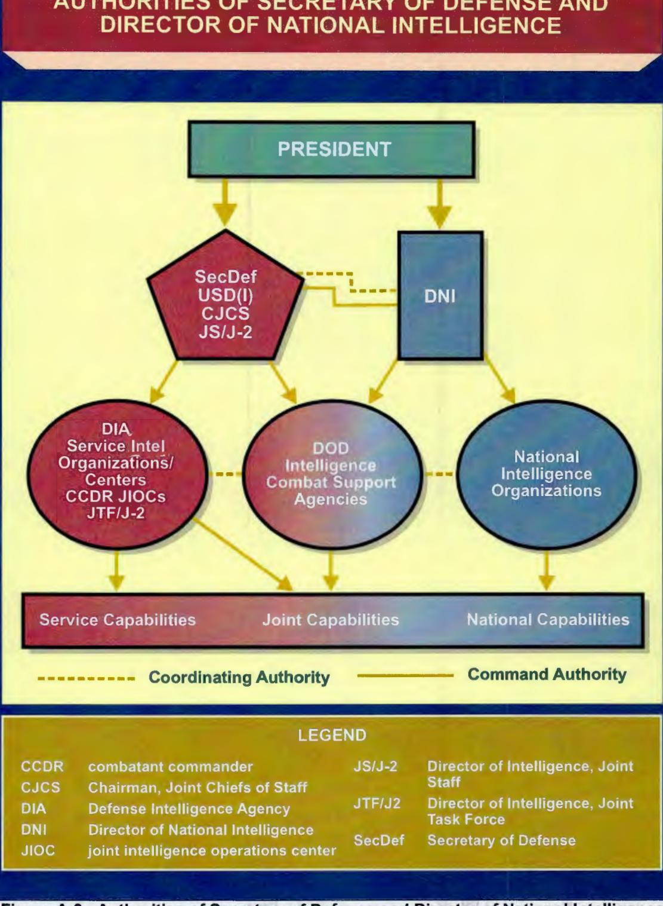  
Figure A-3. Authorities of Secretary of Defense and Director of National Intelligence

(2) The DUSD for Joint and Coalition Warfighter Support serves as the principal office for operational support concerning DOD intelligence and related activities directly supporting the warfighter. The DUSD for Joint and Coalition Warfighter Support develops new intelligence policies, strategies, and programs to facilitate the agility, speed, and persistence required of intelligence platforms and operational forces; provides cyberspace expertise on new technologies, methodologies, and processes to increase the integration and delivery of actionable intelligence from the defense intelligence enterprise to provide a decisive military advantage to the warfighter; evaluates and oversees special reconnaissance operations, national programs, and critical operations and support within DOD and to other government agencies; integrates operations and intelligence in emerging warfighting areas to include irregular warfare, counter-insurgency, sensitive technical operations, IO, and cyberspace operations; provides strategic assessments as part of the management and oversight of integrated operations and intelligence activities considering IC, interagency, and international contexts to produce strategic effects for joint and coalition commands and the nation; provides ISR capacity for operational forces; and ensures coordination and deconfliction of activities within DOD.

(3) DUSD for CI and Security guides DOD CI and security, develops CI and security policy, oversees CI and security programs, and provides staff support on CI and security issues. DUSD for CI and Security oversees the Defense Security Service and represents USD(I) at defense, national, international, and industry forums. DUSD for CI and Security is the counterpart to the DNI National Counterintelligence Executive and the ODNI Security Directorate.

(4) DUSD for Portfolio, Programs, and Resources is responsible for planning, programming and budgeting activities pertaining to the MIP (for more information on the MIP, see Appendix F, "Intelligence Resource Programs'"). This includes coordinating with other OUSD(I) elements to formulate programmatic recommendations and working with the CSAs to ensure their budgets satisfy DOD IRs.

# 7. Defense Intelligence Agency

DIA is a CSA and a major intelligence planner, collector, and producer in the DOD IC. DIA is responsible for managing military and military-related intelligence and CI requirements of SecDef and Deputy Secretary of Defense, CJCS, other DOD components, and non-DOD agencies of the federal government when appropriate. Its mission is to provide timely, objective, and MI to warfighters, defense planners, and defense and national security policymakers. DIA's support to policymakers focuses on developing national-level intelligence assessments, presenting and providing perspectives for defense policy, and providing I& W of potential crises.

a. Responsibilities. The Director, DIA, advises SecDef and Deputy Secretary of Defense, the CJCS, CCDRs, and USD(I), on all matters concerning military and militaryrelated intelligence; is the principal DOD intelligence representative in the national foreign intelligence process; and, with the agreement of the heads of DOD intelligence components, is responsible for coordinating the budgeting and allocation of DOD intelligence component personnel and resources to satisfy DOD IRs. DIA's support flows across a wide spectrum of military activities to include: CI; counterterrorism; counterdrug; medical intelligence; counterproliferation; UN peacekeeping and coalition support; personnel recovery and prisoner of war/missing in action intelligence; missile and space intelligence; noncombatant evacuation efforts; targeting and BDA. The DIA Director functions concurrently as the Commander of the JFCC-ISR. DIA responsibilities include the following:

(1) Provides all-source intelligence support to JTFs and CCDRs, as well as to defense planners and national security policymakers.

(2) Centrally manages the DOD-wide HUMINT enterprise and conducts DIA HUMINT collection activities worldwide.

(3) Operates the J-2 to respond to the direct intelligence support requirements of the CJCS and SecDef.

(4) Designs, implements, and operates a secure IT infrastructure and an assured data environment of the all-source intelligence enterprise.

(5) Conducts integrated planning, coordination, and execution of DOD MASINT and designated technical collection management activities.

(6) Performs assigned CI functions, as well as SCI policy and implementation, security clearance adjudication, and facility accreditation.

(7) Enters into military and military-related intelligence agreements and arrangements with foreign governments and other entities. Manages foreign visits and supports foreign defense attaché corps' interaction with senior defense officials.

(8) Operates the Joint Military Intelligence Training Center, the Joint Military Attaché School, JIVU, and the National Defense Intelligence College (NDIC).

(9) Develops and manages DIA MIP resources and capabilities, the General Defense Intelligence Program (GDIP), and the DIA portion of the Foreign Counterintelligence Program as an element of the NIP.

(a) Provides planning, programming, and budgeting advice to the CJCS and USD(I) concerning the use of intelligence resources.

(b) Develops joint and initial capabilities documents on DIA functional ivities.

(c) Evaluates the contribution of intelligence collection disciplines in support of all-source intelligence analysis.

(10) Serves as the Joint Reserve Intelligence Program (JRIP) manager. Plans, implements, and integrates the JRIP throughout DOD.

(11) Facilitates defense intelligence support for civil agency requirements in emergency situations.

(12) Serves as the DOD executive agent for the Foreign Material Program.

(13) Serves as the IC executive agent for the National Media Exploitation Center (NMEC) and the Underground Facilities Analysis Center (UFAC).

(14) Leads DOD for WTI, to include the processes and capabilities that have produced results supporting the counter-IED, counterterrorism, counterinsurgency, irregular warfare, and counterproliferation mission areas.

b. Organization. DIA is organized into six directorates, three centers, and the NDIC, in addition to the staff comprising the command element (see Figure A-4). These directorates are discussed below.

(1) The Joint Staff Directorate for Intelligence, J-2. The Joint Staff J-2 is a unique organization, in that it is both a component of DIA, as well as a fully integrated element of the Joint Staff. The Joint Staff J-2 operates the intelligence portion of the National Joint Operations Intelligence Center (see Chapter I “Joint and National Intelligence Organizations, Responsibilities, and Procedures," for more information on the NJOIC), providing direct intelligence support to national decision makers and Joint Staff planners in times of crisis. The Joint Staff J-2 also represents and advocates CCMD intelligence interests to the Joint Staff, OSD, and the ODNI. The J-2 supports Joint Staff planning for current and future intelligence capabilities using CCMD statements of requirements, submits budget proposals for required intelligence capabilities, and supports planning for continuity of operations.

(2) Directorate for Analysis (DI). DI produces a broad range of intelligence for support to joint operations. As the functional manager for analysis (FM/A), DI oversees the DIAP in support of the DNI's National Intelligence Production Framework, and manages the production of MI throughout the DOD IC in response to the needs of DOD and non-DOD customers. In anticipation of crisis and during crisis or deployed US military operations, DI draws on analytic expertise throughout the DOD IC and, where appropriate, from non-DOD agencies. DI responsibilities include the following:

(a) Defense Intelligence Production Management. As the FM/A for the DIAP, the DI is responsible for overseeing defense intelligence all-source analysis in DIA, the Service intelligence centers, and the CCMD JIOCs, whether these activities are funded in the NIP or MIP. The FM/A does not manage the daily activities of these organizations; rather, he is responsible for defining and prioritizing analysis requirements, assigning organizational responsibilities, and ensuring overall satisfaction of customer needs. The FM/A also leads the defense intelligence analytic community by implementing analytic training and tradecraft standards, documenting and prioritizing analytic IT functional requirements, and speaking for the community in a variety of forums. FM/A responsibilities are executed through the Community Enterprise Operations Staff .

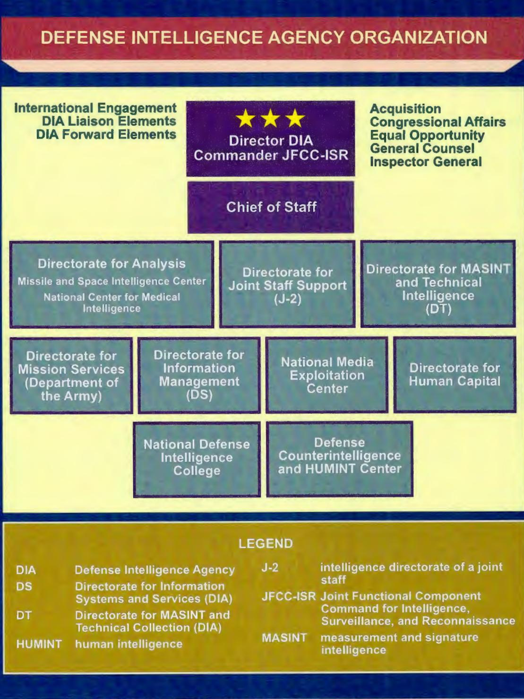  
Figure A-4. Defense Intelligence Agency Organization

(b) All-Source Analysis and Reporting. DI provides written products to support senior level customers on a variety of issues. Types of written products include the Defense Intelligence Digest (DID), defense analysis reports, information memorandums, response memorandums, and defense intelligence assessments. DIA is a full-time partner in production of the President's daily brief. Much of DI's intelligence work is documented in online data and knowledge bases.

(c) Managing Intelligence Production Centers. DI takes a leadership role in maintaining, funding, and managing intelligence production centers in support of the IC. Intelligence production centers maintained by DI are described below:

$\underline { { 1 } } .$ Underground Facilities Analysis Center. The UFAC leads DOD and IC in all efforts related to finding, characterizing, and assessing strategic underground facilities for defeat. The UFAC provides timely detailed analysis and characterization of underground facilities and associated programs worldwide, including their underlying technologies and infrastructures. UFAC builds, maintains, enhances, and employs effective all-source collection and analysis capabilities using IC, DOD, academia, and commercial enterprises. It partners with and supports national decision makers, weapons developers, and US and multinational operational forces to ensure the threats posed by the functions housed in underground facilities are appropriately addressed.

federated partners perform assessments of foreign and domestic health threats and issues to protect and advance US interests worldwide. Mission responsibilities include the preparation, coordination, and dissemination of integrated all-source medical intelligence in support of DOD and its components, national policymakers, and other US Government departments and agencies. Assessments, forecasts, and databases are prepared on foreign military and civilian health care capabilities and trends, worldwide infectious disease occurrence, global environmental health risks, militarily significant life science technologies, and foreign biological warfare programs to include dual-use biotechnology.

current and comprehensive S&TI to US decision makers, weapon system developers, and CCDRs. It develops and disseminates intelligence concerning the threat from offensive and defensive guided-missile systems, directed-energy weapons, selected space programs and/or systems, and related C2 communications systems to support operationally deployed forces and the materiel acquisition process. Additionally, it develops and distributes digital threat simulations to force developers and operational forces.

4. Joint intemgence Iask rorce Ior Compaung Ierrorism. J11rCT serves as the single national-level, all-source terrorism intelligence effort within the DOD and the defense intelligence enterprise counterterrorism mission manager. JITF-CT manages two principal mission sets in support of the enterprise—indications, warning, and threat assessment and intelligence support to DOD operations, plans, and policy. JITF-CT manages counterterrorism warning for DOD and is DOD's representative to the NCTC for national-level counterterrorism warning. The JITF-CT warning and fusion center serves as DOD's counterterrorism watch, monitoring and assessing global terrorist activity and potential threats in support of force protection and DOD operations. JITFCT produces integrated, all-source intelligence in support of US combating terrorism plans and operations, both offensive and defensive; exposes and exploits terrorist vulnerabilities in support of DOD combating terrorism operations designed to prevent terrorists from acquiring increased capabilities; and manages and directs the agency's combating terrorism intelligence activities in support of OSD, the Joint Staff J-2, and the CCMDs.

(3) Directorate for Measurement and Signature Inteligence and Technical Collection (DT). DT manages collection requirements and operations and ensures the effective acquisition and application of all-source intelligence collection resources to satisfy DOD collection requirements. DT also provides a broad range of MASINT support to joint operations, and national, strategic, and non-DOD customers. DT performs the following functions:

(a) As program manager for Technical Collection and MASINT, DT develops, coordinates, and advocates for defense intelligence positions on technical collection needs, capabilities, and strategies; collection management applications; and future collection management systems and architectures. DT conducts research, development, testing, and evaluation to enhance TECHINT collection means. DT develops and implements standards, architectures, and procedures providing for integrated MASINT capabilities, and coordinates with CCMDs and Services to present consolidated TECHINT collection issues to the USD(I) and CJCS.

(b) Conducts technical collection operations and training involving integrated, multidiscipline, end-to-end technical collection, and signature support. Responds to national and military requirements on foreign missile, CBRN and conventional high-yield explosive materials, hazards, and incidents; irregular warfare, counterterrorism, CI, and counterdrug targets. Develops long-term technical collection strategies and capabilities focused on these areas. Executes the tasking of DOD technical collection platforms and conducts end-to-end monitoring and oversight of PED and customer outcomes. Manages and implements technical identity management and biometric plans.

(4) Directorate for Information Management and Chief Information Officer (DS). DS provides information systems and services to the IC in support of warfighters, national policymakers, and defense acquisition authorities. Its functions include information systems and communication engineering development, integration, and operations for DIA and the IC; information library services; hard copy and electronic publication and dissemination; video and visual information services; GDIP intelligence infrastructure functional management; and DODIIS planning, engineering, and life-cycle management efforts. Additional responsibilities include:

(a) Overseeing the research and development, procurement, and operation of DOD inteligence infrastructure-related programs, systems, and activities funded in the GDIP, to include printing, processing, communications, and information systems.

(b) Providing centralized intelligence dissemination services and supervising an IC and DOD-wide intelligence dissemination system.

(5) Directorate for Human Capital (HC). HC develops and implements DIA personnel management policies, procedures， and programs. HC supports agency missions for recruitment, hiring, training, and career development of personnel in DIA MIP billets worldwide. HC also manages the DIA training portfolio, including the Joint Military Attaché School and the Joint Military Intelligence Training Center.

(6) Directorate for Mission Services (DA). DA provides the employees of DIA a wide range of services, including personnel safety; facilities engineering; and protection, logistics and supply; travel and transportation; and deployment preparation training and services. The DIA CI and security activity (DAC) is an element of DA that manages security and CI programs to safeguard DIA personnel, information, facilities, systems, and operations. DAC also serves as the manager for all DID CI collection, production, and operations requirements, implements SCI security policy within DOD, and develops and publishes security policy manuals, regulations, and handbooks for DOD. The overseas branch provides tailored technical security support and monitors the threats to the security of US customers.

(7) Defense CI and HUMINT Center. DCHC centrally manages the DODwide CI and HUMINT enterprises that support DOD component CI and HUMINT functions, and executes assigned CI and HUMINT activities worldwide. DCHC provides strategic guidance to the DOD CI and HUMINT elements that support the accomplishment of operational, CCMD, departmental, and national requirements. DCHC provides services of common concern to defense CI and HUMINT elements in the areas of cover, source registration, asset validation, technical support, and selected operational targeting. DCHC operates as the focal point for all joint CI issues arising from or in support of the CJCS and CCDRs, and serves as the coordination point among Joint Staff directorates and the Service CI elements. It provides CI analysis, production, and staff support to OSD, the CJCS, CCMDs, DOD agencies, DOD special activities, and the national IC for assigned regions. DCHC also serves as the CI and HUMINT requirements manager for DOD. In this role, DCHC validates, prioritizes, registers, and publishes DOD CI and HUMINT collection requirements. The DCHC leads the DOD HUMINT and CI enterprises' IP process in the development and coordination of HUMINT and CI FSPs for CCMD OPLANs and CONPLANs. DCHC also ensures the appropriate level of effort is expended and the results of collection efforts are made visible to commanders and decision makers, and assesses the effectiveness of the DOD CI and HUMINT enterprise on behalf of the USD(T). DCHC maintains the CI and HUMINT training program for DOD, and guides the development of IT systems for CI and HUMINT. DCHC also exercises administrative and management oversight of national security investigations of CI matters.

(8) NMEC. As a service of common concern to the IC, the NMEC advances the IC's collective capabilities to conduct DOMEX on behalf of the DNI. The NMEC develops training, tradecraft, and tools and technology and integrates IC and DOD DOMEX policies, standards, and procedures to the maximum extent possible. The NMEC provides prompt and responsive DOMEX support to the IC consistent with the protection of sources and methods. DOMEX elements provide services to ensure the rapid PED of all acquired and seized documents and media from strategic/national through tactical/local levels across the intelligence, counter-intelligence, military, and law enforcement communities. Forward-deployed DOMEX locations, including the JDEC and Service DOMEX elements, conduct exploitation activities according to their capabilities. They collaborate with one another to share work, maintain accountability and chain of custody, and to ensure all captured and acquired documents and media are sent to the national archives.

Appendix C, "Document and Media Exploitation,'" contains more information on NMEC and DOMEX capabilities.

(9) National Defense Intelligence College. The NDIC, located at DIA, educates military and civilian intelligence professionals. A regionally accredited institution, the NDIC is authorized by Congress to award two degrees: The Master of Science of Strategic Intelligence and the Bachelor of Science in Intelligence. Its educational programs prepare military and civilian personnel for command, staff, and policymaking positions. The NDIC manages an intelligence research program that conducts and disseminates relevant academic research on topics of significance to present and future intelligence missions.

# 8. National Security Agency/Central Security Service and the United States Cryptologic System

The NSA/CSS is a unified organization structured to protect the security of US signals and information systems and provide intelligence information derived from the exploitation of the signals and information systems of America's adversaries. The NSA/CSS has a unique position among the defense agencies because of its governmentwide responsibilities providing products and services to the DOD IC, government agencies, industry partners, and select allies and coalition partners. NSA/CSS is also designated as a CSA performing 22 specific combat support activities for DOD.

a. The CSS was established to promote a full partnership between the NSA and the cryptologic elements of the Armed Forces. By combining NSA and CSS, a more unified DOD cryptologic effort is provided. The CSS is composed of the SCCs.

b. The USCS is a term used to describe the USG entities tasked with collecting, processing, analyzing, producing, and disseminating SIGINT and with preserving the availability, integrity, authentication, confidentiality, and nonrepudiation of national security systems. The NSA/CSS manages cryptologic planning and operations in support of the USCS. As the functional manager for SIGINT and the National Manager for National Security Systems, the DIRNSA is responsible for the overall management and OPCON of the UsCs.

c. NSA/CSS has two core missions: SIGINT and IA.

(1) SIGINT comprises either individually or in combination all COMINT, ELINT, and FISINT.

(2) IA encompasses the disciplines and activities that ensure the availability, integrity, authentication, confidentiality, and nonrepudiation of national security information and systems.

d. To meet management readiness and operational responsibilities, NSA/CSS performs the following functions:

(1) Management

(a) Exercises SIGINT OPCON over the USCS and executes the responsibilities of SecDef as executive agent for US IA and interagency operations security (OPSEC) training.

(b) Functions as the SIGINT and IA advisor to SecDef, the DNI, CJCS, and the Joint Staff. Provides cryptologic advice and assistance to the CCMDs and other military commands through colocated NSA/CSS representatives.

(c) Determines, in conjunction with the CCDRs, when to delegate SOTA.

(d) Implements programs and initiatives that promote interaction among ational and tactical cryptologic assets.

(e) Functions as the National Manager for National Security communication and Information System Security.

(2) Readiness

(a) Responds directly and quickly to the validated and prioritized readiness nformation requirements.

(b) Ensures that designated wartime and contingency cryptologic resources re adequate to support readiness requirements.

(c) Provides security assessments to assist in determining the vulnerability of national security systems.

(d) Assists in developing IA capabilities; evaluating and developing national security system architectures and standards; managing associated encryption systems; and designing secure Internet architectures, standards, and protocols.

(e) Assists in defining national security systems transmission security

standards.

(f) Evaluates jam-resistant, low-probability-of-interception, and other detection systems.

(g) Develops, tests, and implements new concepts, plans, capabilities, and procedures to improve cryptologic support functions.

(h) Provides systems development, engineering, and programmatic support to national or multinational cryptologic initiatives.

(i) Ensures the technical adequacy of all cryptologic training.

(i) Conducts, participates in, and supports both US and allied exercises to facilitate use of cryptologic resources.

(3) Operations

(a) Provides information systems encryption materials during peacetime, in S, contingency, and war.

(b) Provides cryptologic support to IO.

(c) Integrates US and allied cryptologic activities.

(d) Supports, in coordination with other national intelligence activities, US contingency operations consistent with procedures defined in CJCSMs for support to conventional and special operations missions.

(e) Supports special technical operations.

(f) Provides SIGINT and IA support through appropriate channels to the commanders responsible for C2 of mobile SIGINT platforms.

(g) Provides direct and dedicated interoperable cryptologic communications support to facilitate the delivery of perishable SIGINT and provides for continued cryptologic support to emergency or rapid recovery and reconstitution teams.

e. Organizational Framework for Cryptologic Support. NSA/CSS provides cryptologic support to departments, agencies, commands, and other USG activities and provides expeditious responses to user information needs. The USCS is responsive to the needs of all authorized cryptologic users, including military commanders for whom special support arrangements have been devised as part of the system. The following are the mechanisms that support departments, agencies, commands, and other USG activities:

(1) National Security Operations Center. The NSOC is DIRNSA's cryptologic mission management center for USCS time-sensitive SIGINT and IA operations. The NSOC continuously monitors world events and the status of the USCS, and manages the NSA/CSS mission in real time. The NSOC also directly supports activities required for mission execution.

(2) Expeditionary Support Team (EST). The EST, located in NSA/NSOC, is the reachback point for forward elements and has primary responsibility for global military situational awareness, force protection, threat warning, operational support and growing crisis and contingency support.

(3) NSA/CSS Representatives. NCRs are senior representatives of the DIRNSA, accredited to the CCMDs, other senior military commands, and the DOS and DOD. The NCRs at the CCMDs are the senior cryptologic authorities in the region and are the special advisors to the CCDR for cryptologic matters.

(4) Cryptologic Services Groups. The CSGs are extensions of the NSOC and are the primary mechanism for the supported organization to gain entrance into and support from the USCS. CSGs provide cryptologic advice and assistance. They advise organizations of USCS capabilities and limitations that might affect its cryptologic requirements and recommend to NSA/CSS those actions necessary to ensure cryptologic responsiveness.

(5) The Joint Communications Security Monitor Activity (JCMA). JCMA is a JCS-sponsored organization operating under the auspices of the NSA. The mission of the JCMA is to conduct COMSEC monitoring (collection, analysis, and reporting) of DOD encrypted and unencrypted telecommunications signals and automated information systems and monitoring of related non-communications signals. The purpose is to identify vulnerabilities exploitable by potential adversaries and to recommend countermeasures and corrective actions.

(6) NSA/CSS Customer LNOs. NSA/CSS customer LNOs act as representatives to customers that do not have an assigned NCR. LNOs are provided to various executive branch agencies, such as the Departments of Justice and Commerce, which use SIGINT products, but not on the scale of DOD or DOS.

(7) Support to the DOD and the JCS. DIRNSA is the principal cryptologic advisor to both SecDef and the CJCS, keeping both fully informed on cryptologic matters. In addition to the national cryptologic representative defense (NCRDEF) who provides day-to-day advice and support to the DOD, the DIA, the JCS, and the Military Departments, the Joint Staff CSG provides the JCS with time-sensitive cryptologic services. Additionally, both the NCRDEF and the Joint Staff CSG provide NSA/CSS with advance warning and advice on DOD policies, Joint Staff plans, and IA and IRs.

# 9. National Geospatial-Intelligence Agency

NGA is both an IC organization and a DOD CSA whose mission is to provide timely, relevant, and accurate GEOINT in support of national security. To do so, NGA capitalizes on all forms of what is traditionally categorized as imagery, IMINT, and geospatial data and information to provide the foundation for support of national intelligence analysis, planning, decision, and action. NGA creates tailored, customerspecific GEOINT, analytic services, and solutions.

a. Responsibilities. NGA provides GEOINT and services to national decision makers, military commanders, the IC, and other USG entities, as appropriate. The Director of NGA advises the DNI, SecDef, CJCS, and the CCDRs on all issues related to GEOINT. This support extends to the departments and agencies of the federal govement t the extent allwed by lawTheDirector of NGAalso serves as functional manager for the NSG.

b. Organization. NGA is organized to ensure support for current requirements while simultaneously facilitating the transformation necessary to fulfill the GEOINT mission (see Figure A-5).

(1) NGA is composed of an Executive Leadership Group, staff offices, and directorates. The Executive Leadership Group is the senior corporate body and provides leadership direction for NGA's internal and external activities.

(2) SeeraNGA staff fis prvidesentiluofor iitay peaos. This support includes:

(a) Managing and tasking national imagery collection operations on behalf of the DNI to include the integration of national and NGA-purchased commercial imagery, and selected airborne collection requirements.

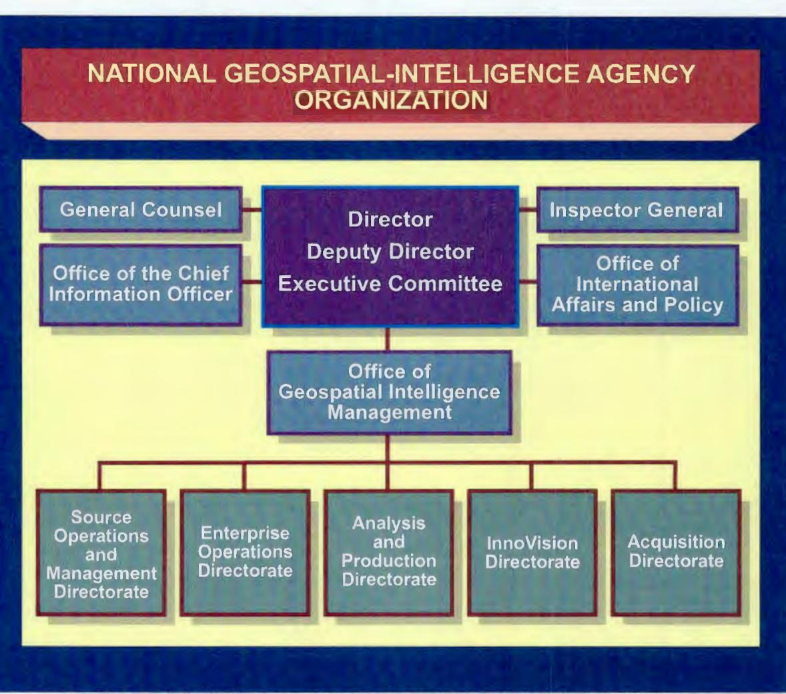  
Figure A-5. National Geospatial-Intelligence Agency Organization

(b) Developing and disseminating GEOINT policy and guidance on behalf of the DNI and SecDef. NGA also develops and implements GEOINT release and disclosure policy.

(c) Providing planning and programmatic guidance to the members of the SG for GEOINT programs and activities.

(d) Developing, negotiating, and managing international agreements for GEOINT data sharing and co-production with foreign partners.

(3) Five of NGA's directorates are considered line organizations:

(a) Source Operations and Management Directorate: executes the nation's end-to-end space-based, airborne, and commercial imagery requirements for GEOINT.

(b) Enterprise Operations Directorate: responsible for day-to-day systems operations and leveraging technology to ensure and protect NGA's mission by operating the NSG and providing enterprise, corporate, dissemination, and information services.

(c) Analysis and Production Directorate: provides GEOINT analysis and duction to meet customer requirements

(d) InnoVision Directorate: forecasts environments, defines future needs, and develops innovative solutions and technologies through focused research and development and systems engineering.

(e) Acquisition Directorate: plans and implements acquisition of GEOINT systems for the NSG.

(4) The remaining directorates, the enabling organizations, and staff offices provide specialized support for NSG community activities, including:

(a) Beginning, intermediate, and advanced geospatial and imagery analysis training to NGA, the Services, and the IC through the National Geospatial Intelligence College.

(b) On-site training support for GEOINT systems and procedures through mobile training teams. Though these teams typically train during peacetime, they often deploy during crisis situations.

(c) Program guidance to the NSG.

(d) GEOINT support to deployed customers and deployed NGA support

teams.

(e) IT architecture and standards, IT strategic planning and policy, IT vestment review, and information security oversight.

c. NGA Support to Military Operations. NGA provides GEOINT to support military planning, decision making, targeting, and intelligence production during peacetime and crisis. This support includes:

(1) Conducting GEOINT exploitation. NGA exploits all forms of traditional and nontraditional data, from national, civil, and commercial sources.

(2) Providing traditional and specialized hard copy geospatial products and electronic data.

(3) Providing safety of navigation products and services.

(4) Populating and maintaining national databases that provide the visualization and analytical framework to support decision making.

(5) Managing the acquisition of commercial and foreign government remote sensing data for DOD users.

(6) Maintaining crisis-specific GEOINT products and data on NGA's JWICS, SIPRNET, and NIPRNET systems to complement its direct support activities.

d. NGA Customer Support. The NST is the primary mechanism for NGA interaction with its customers. The NST coordinates NGA's operational, policy, and training support to its customers.

(1) NGA maintains NSTs at the Joint Staff, CCMDs, Services, and national and DOD agencies. Additional NSTs are located at several non-DOD government organizations (e.g., DOS). A typical NGA NST at the CCMDs and Service HQ is composed of a senior representative, staff officers, and imagery and geospatial analysts. A reachback component at NGA HQ focuses NGA production support.

(2) In addition to using NSTs, NGA may deploy crisis support teams of imagery and geospatial analysts upon request, either independently, as augmentation to an existing NST, or as part of a NIST. These teams of government and/or contract personnel employ deployable GEOINT production systems. NST personnel can reach back to NGA for data and products, fuse this information with tactical and theater sources, and work with users to produce products tailored to their needs.

# 10. National Reconnaissance Office

The mission of the NRO is to provide innovative overhead intelligence systems for national security. The NRO is responsible for the application of unique and innovative technology, large scale systems engineering, development and acquisition, and operations of space reconnaissance systems and related intelligence activities.

a. Organization. The NRO's organizational structure is shown in Figure A-6. The Director NRO (DNRO) is appointed by SecDef with concurrence of the DNI. The Principal Deputy Director, NRO is nominated by the Director, CIA and approved by

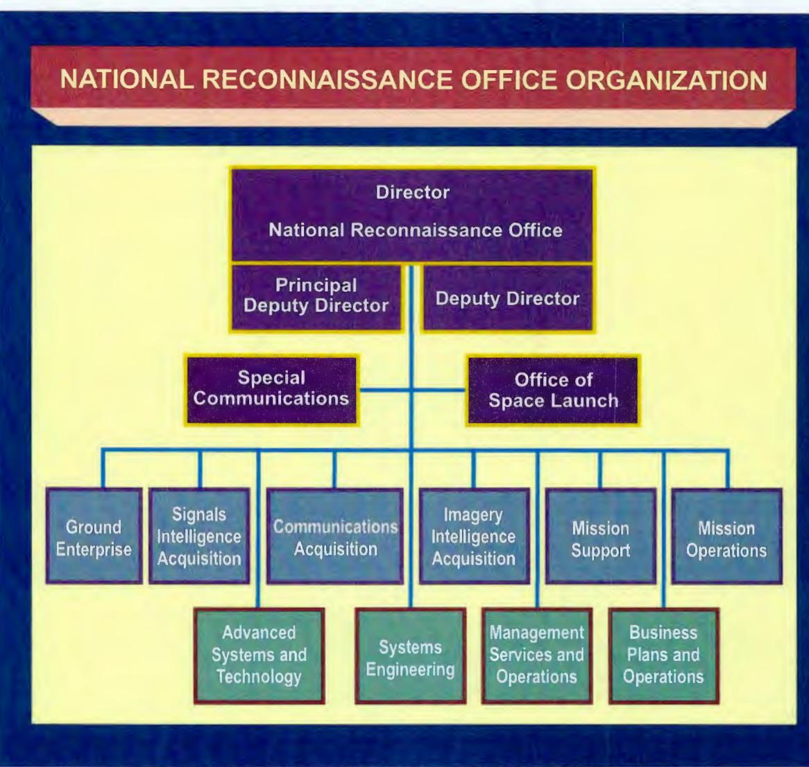  
Figure A-6. National Reconnaissance Office Organization

SecDef and the DNI. The Deputy Director, NRO, is nominated by the Secretary of the Air Force and approved by the DNRO. The Mission Support Directorate supports military operations with products and services via the NRO field representatives that are collocated with the CCMDs.

b. Responsibilities. The NRO is responsible for research and development, acquisition, launch, deployment and operation of overhead systems and related processing facilities to collect intelligence and information to support national and departmental missions and other USG needs.

c. Application of Data. NRO field representatives located with each of the CCMDs serve as direct links to NRO for the CCDRs and their staffs. NRO support must be continuously incorporated into the planning process. As a key element in achieving information superiority, it should be viewed as part of all aspects of full spectrum dominance, not simply those areas that fall within the purview of the joint force J-2. Many of the greatest gains can be realized in nontraditional areas such as supporting logistics with terrain data from NRO systems or providing warning for force protection. The NRO accommodates the functional needs of information dominance with nearcontinuous coverage architectures in partnerships with the OSD, JCS, IC, and USSTRATCOM. Advances in technology enable the NRO to provide greater amounts of useful information to ever lower tactical echelons, with the primary impact of NRO data being realized at the operational level. With regard to security, the goal is to downgrade classification and disseminate products essential to operations.

d. Obtaining Support. DIA is the overall coordinator of national systems support for DOD, which it manages with on-line systems. GEOINT requirements are tasked through NGA, SIGINT requirements through NSA, and MASINT requirements through DIA. NRO field representatives and the NRO's Integrated Support Office, Mission Support Directorate, facilitate end-to-end support ranging firom pre-deployment training, education, weapon system integration, to dissemination of products and services. The basic reference for obtaining support is the Joint Tactical Exploitation of National Systems Manual.

# 11. Service Intelligence Organizations

The Chiefs of the Military Services provide intelligence support for departmental missions related to military systems, equipment, training, and national intelligence activities. The Services act to support DOD entities, including CCMDs and the Service components of those commands.

# a. US Army

(1) Deputy Chief of Staff (DCS), G-2. The Army G-2 is responsible to the Chief of Staff, Army for long-range planning and policy guidance on all matters relating to Army intelligence, security, and CI activities. The G-2 manages the Army portion of the NIP, Army departmental-level GMI and S&TI production missions, intelligence readiness training, the Army language program, and the Army Foreign Material Program. The G-2 exercises staff supervision over the INSCOM and provides direction to its departmental production resources.

(2) INSCOM. The Army INSCOM is a direct reporting unit of the Headquarters, Department of the Army (HQDA) under the staff supervision of the DCS, DIRINT, G-2. The Director of the Army Staff has designated the INSCOM commanding general as assistant DCS, G-2, for intelligence operations, which enhances the Army G2's ability to carry out efficient and effective CI and HUMINT programs Army-wide. INSCOM is also designated as the Army SCC and serves as the principal Army authority for all operations, programming, budgeting, training, personnel, policy, doctrine, and foreign relationships for cryptologic activities. HQ, INSCOM is at Fort Belvoir, Virginia, and INSCOM subordinate units are located worldwide. INSCOM is a major participant in national intelligence activities. There are two types of INSCOM subordinate units—functional commands and theater MI brigades. Functional commands have missions and capabilities focused on specific intelligence or operational disciplines. INSCOM theater MI brigades operate under the OPCON of a geographic

Army Service component command. Through its theater MI brigades and functional commands, INSCOM:

(a) Conducts multidiscipline intelligence (HUMINT, SIGINT, MASINT, TECHINT, CI, GEOINT, and OSINT), BEI, FEI, and all-source intelligence operations, including collection, processing, retention, and dissemination.

(b) Executes offensive network operations.

(c) Provides information management for the Army intelligence enterprise.

(d) Delivers specialized quick reaction capabilities, advanced skills training, and inguist support for deploying forces to enable battle command to support Army, joint, multinational, and interagency full spectrum operations worldwide.

(e) Provides direct support operational intelligence units to Army nt commanders.

(f) Manages the United States signal intelligence directives for Army SIGINT activities.

(g) Implements and manages the inteligence oversight program for all rmy SIGINT operations.

(h) Performs worldwide SIGINT operations.

(i) Supports the National SIGINT Special Activities Ofice Program.

(j) Supports DOD and Department of the Army SIGINT programs.

(k) Monitors intelligence and electronic warfare systems development by he Army, NSA/CSS, and other Services and Military Departments.

(3) INSCOM functional commands are as follows:

(a) The NGIC is an INSCOM functional command under the direction of HQDA, DCS, G-2. The NGIC is responsible for the development of finished, all-source intelligence on foreign ground forces under the federated DIAP. It provides S& TI and GMI on foreign ground forces to support senior defense and Army leadership, warfighting commanders, and force and materiel developers. The NGIC also manages the Army's Foreign Materiel Exploitation Program and manages the DOMEX Harmony database as a service of common concern for the IC. NGIC manages Army foreign materiel acquisition requirements and constitutes a single authoritative source for comprehensive ground forces threat to the Army and other Services.

(b) The 1st IO Command (Land) is the only Army facilitator for the conduct of full-spectrum IO in all phases of warfare. The 1st IO Command is a multicomponent functional command under the administrative control (ADCON) of Army INSCOM and under the OPCON of the HQDA, DCS, G-3/5/7.

(c) 300th MI Brigade (Linguist) provides linguist and MI support to multiple contingencies with HUMINT companies, SIGINT companies, and intelligence coordination detachments providing linguist and MI augmentation support to the Army. The brigade has five subordinate National Guard battalions. The 300th MI Brigade is operationally aligned to support INSCOM, and also has a state mission to conduct military assistance to civilian authorities on order from the respective state governor over the unit.

(d) The 704th MI Brigade operates under the ADCON of Army INSCOM and under the OPCON of NSA/CSS. The 704th MI Brigade provides Army personnel with expertise in SIGINT and information security to support the national decision makers, CCMDs, national agencies, and DOD in response to their IRs. The brigade leverages the national SIGINT system to facilitate intelligence integration between tactical SIGINT units and NSA/CSS. The brigade conducts SIGINT, GEOINT, CNO, and IA operations to support Army, joint, combined, and national decision makers and to shape future Army intelligence capabilities.

(e) 706th Military Intelligence (MI) Group operates under ADCON to INSCOM and under OPCON to NSA/CSS. The 706th MI Group, located at Fort Gordon, GA, provides personnel, intelligence assets, and technical support to conduct SIGINT operations worldwide.

(f) The 902d MI Group is assigned to Army INSCOM. The group——the largest CI unit in DOD—conducts CI and collection operations activities to support Army commanders and to protect Army forces, secrets, and technologies by detecting, identifying, neutralizing, and exploiting foreign intelligence and security services' and international terrorist organizations' intelligence collection efforts. During peace or war, CI identifies these collection operations directed at the Army, its decision makers, forces and personnel, installations and infrastructures, technologies, and information to neutralize the threat such activities pose. The 902d MI Group conducts the full spectrum of CI investigations, CI operations (both offensive and defensive), CI collection, multidiscipline CI analysis and production, and CI and security countermeasures. It conducts offensive CI operations worldwide on a general support basis. It also provides the full spectrum of CI capability, especially technical CI and functional services, and general support reinforcement, through INSCOM's theater MI brigades, to Army Service component commands worldwide. On order, the group deploys tailored packages of capabilities worldwide.

(g) Army Operations Activity is assigned to INSCOM. It includes HUMINT operations and provides HUMINT subject matter expertise worldwide to support ground component commander PIRs using the full spectrum of HUMINT collection methods.

(h) Army Field Support Center (AFSC), assigned to INSCOM, provides personnel actions, finance, and other support to specified Army HUMINT, CI, and IOrelated activities. The AFSC includes the Military Intelligence Civilian Excepted Career Program Management Division, Great Skill Division, Operations Support Division, and the Army Attaché Management Division.

(i) 138th MI Company, Joint Surveillance Target Attack Radar System (JSTARS), is under ADCON to INSCOM. The JSTARS company provides worldwide, NRT wide area surveillance and moving target indicators to the supported commander.

(4) Theater MI Brigades and/or Groups. INSCOM theater MI brigades and/or groups conduct multidiscipline intelligence activities in support of the respective theater's Army component commander and, if one is designated by the JFC, the joint force land component commander. The five brigades/groups are:

(a) 66th MI Brigade, United States Army, European Command (USAREUR). The 66th MI Brigade conducts theater level multidiscipline (SIGINT, CI, HUMINT, GEOINT, MASINT) and all-source intelligence to include collection, analysis, production and dissemination; provides advanced skills training and linguist support; when directed deploys tailored expeditionary forces in support of full-spectrum USAREUR, US European Command, and other CCMD operations; and provides CI support to HQ US Africa Command, and US Army Africa Command. The brigade is headquartered at Wiesbaden Army Airfield with intelligence units spread out over five countries (Germany, Italy, Belgium, Netherlands, and the United Kingdom); provides support to theater operations in Romania, Bulgaria and Poland; and provides administrative support to force protection detachments in Georgia, Cyprus and Israel.

(b) 500th MI Brigade, United States Army Pacific (USARPAC). The 500th MI Brigade is a theater MI brigade operating under the ADCON of INSCOM and under the OPCON of USARPAC. The brigade's mission is to conduct intelligence to support USARPAC full-spectrum operations throughout the USPACOM AOR to defeat adversaries, promote regional stability, support allies, and protect US national interests.

(c) 501st MI Brigade, Eighth US Army, USFK. The 501st MI Brigade operates under the ADCON of INSCOM and under the OPCON of Operational Command Post-Korea. The brigade, headquartered in Seoul, Republic of Korea, is a uniquely configured MI organization incorporating al forms of traditional and developing intelligence collection, analysis, and dissemination technologies.

(d) 513th MI Brigade, United States Army Central Command (USARCENT). The 513th MI Brigade, headquartered at Fort Gordon, Georgia, is a theater MI brigade that operates under the ADCON of INSCOM and under the OPCON of USARCENT/3d Army. The 513th MI Brigade deploys in strength or in tailored elements to conduct multidiscipline intelligence and security operations in support of USARCENT and US Central Command.

(e) 470th MI Brigade, United States Army South (USARSO). The 470th MI Brigade is headquartered in San Antonio, Texas. It is a theater MI brigade that operates under the ADCON of INSCOM and under the OPCON of USARSO. The 470th MI Brigade mission is to provide timely and fused multidiscipline intelligence support to USARSO, US Southern Command, and national intelligence agencies. The brigade supports national, theater, and tactical intelligence operations in every intelligence discipline.

(f) The Army Operations Group (AOG), Army INSCOM. The AOG is assigned to INSCOM. The AOG's mission is to conduct HUMINT operations and provide expertise in support of ground component PIRs using a full spectrum of HUMINT collection methods. The AOG conducts HUMINT operations to support commanders from the tactical to strategic levels, including units involved in combat operations worldwide. The AOG also supports Army decision makers in efforts to expand and improve Army HUMINT capabilities.

# b. US Navy

(1) Director of Naval Intelligence. The DNI is the intelligence executive to the Chief of Naval Operations, exercising overall authority throughout the Department of the Navy on matters pertaining to intelligence, cryptology, CI, and special security. The Director of Naval Intelligence manages the Navy portion of national foreign intelligence, sets naval intelligence policy, and directs naval $\mathbf { I P }$ and programs.

(2) Office of Naval Intelligence (OND). ONI is located within the NMIC in Suitland, Maryland, and is the nation's center of excellence for maritime-related intelligence. ONI's primary mission is to provide maritime intelligence to key strategic, operational, and tactical decision makers. This mission includes intelligence production on seaborne terrorism, weapons and technology proliferation, and narcotics and smuggling activities that directly supports joint warfighters, the Navy, and civil and national decision makers and agencies.

(a) Nimitz Operational Intelligence Center functions to meet the increasing demand for rapid access to operational intelligence by aligning with globallynetted maritime operations centers. The Nimitz center is composed of cells and detachments of numbered fleets and naval warfare enterprises. The Nimitz center performs the nation's substantive analysis on worldwide maritime weapons systems. Areas of interest include characteristics and performance data, tactics, and operational doctrine on non-US maritime platforms and systems that US forces may encounter around the world. Inside the Nimitz center are three specialized divisions to assess adversary capabilities, doctrine, and TTP: SPEAR (air warfare), SWORD (undersea warfare), and SABER (surface/littoral operations).

(b) Farragut Technical Analysis Center is focused on foreign S&T research, development, and proliferation. The Farragut Center's mission is to deliver knowledge of current and future foreign navy capabilities to enable long range planning and research, guide future acquisitions, and prevent technological surprise.

(c) Kennedy Irregular Warfare Center functions to meet the expanding demands of Naval Surface Warfare Center and Navy Expeditionary Combat Command. It is comprised of two cell: a deployed forces cell which embeds into naval special warfare squadrons and a global analysis cell, which provides all-source operational intelligence reachback and imagery services to expeditionary forces.

(d) Hopper Information Services Center provides mission-related IT services and ensures the rapid and reliable delivery of intelligence to operational forces and intelligence customers worldwide through Service oriented architecture. The Hopper Center manages naval SCI networks and provides program management of the JDIsS.

(3) FLTCYBERCOM and Commander, Tenth Fleet (COMTENTHFLT), support the Navy's move from platform-centric to information-centric processes. The new FLTCYBERCOM and COMTENTHFLT are headquartered at Fort George G. Meade, Maryland.

(a) FLTCYBERCOM serves as the Navy component command to USSTRATCOM and USCYBERCOM. Its mission is to direct Navy cyberspace operations globally to deter and defeat aggression and to ensure freedom of action to achieve military objectives in and through cyberspace; to organize and direct Navy cryptologic operations worldwide and support IO and space planning and operations; to direct, operate, maintain, secure, and defend the Navy's portion of the DOD information networks; to deliver integrated cyberspace, IO, cryptologic, and space capabilities; and to deliver global Navy cyberspace network common operational requirements.

(b) COMTENTHFLT's mission is to serve as the numbered fleet for FLTCYBERCOM and exercise OPCON of assigned naval forces and to coordinate with coalition naval forces and JTFs to execute the full spectrum of cyberspace, IO, and SIGINT capabilities.

(c) Navy Network Warfare Command (NNWC) subordinate to FLTCYBERCOM directs the operations and security of the Navy's portion of the DOD information networks. NNwC ensures the delivery of reliable and secure net-centric and space capabilities in support of strategic, operational, and tactical missions.

(4) Naval Criminal Investigative Service. NCIS is a federal law enforcement agency that protects and defends the Department of the Navy against terrorism and foreign intelligence threats, investigates major criminal offenses, enforces the criminal laws of the US and the Uniform Code of Military Justice, assists commands in maintaining good order and discipline, and provides law enforcement and security services to the Navy and Marine Corps on a worldwide basis. NCIS programs and operational activity complement other efforts within the DON to defend against espionage, terrorism, subversion, sabotage, criminal activity, and major security violations. With over 150 offices worldwide and agents assigned to interagency task forces, CCDR and joint staffs, selected US Navy ships and staffs, and Marine Corps elements, NCIS activities keep the supported commanders apprised of potential threats. NCIS leverages organic investigative and analytic capabilities as well as liaison relationships to identify, neutralize, and/or exploit potential breaches of security. NCIs also provides a comprehensive briefing program to educate military and civilian personnel on threats posed by foreign intelligence and security services and terrorist groups..

# c. US Air Force

(1) AF/A2 is responsible to the Air Force Chief of Staff for policy, planning, programming, resource allocation, and program evaluation activities aimed at ensuring information superiority in peace, crisis, and war.

(2) Air Force Intelligence, Surveillance, and Reconnaissance Agency. AFISRA, subordinate to AF/A2 as an agency and headquartered at Lackland Air Force Base (AFB), Texas, oversees collection, processing, and production elements worldwide. It provides customers at all echelons with multisource intelligence products, applications, and services and provides intelligence expertise in the areas of IO (to include information protection), acquisition, foreign weapons systems and technology, and treaty monitoring. Additionally, AFISRA serves as the Air Force Validation Office for Production and Application Requirements under the DIAP. When Air Force component IRs exceed the theater's capabilities, AFISRA may reinforce the CCMD with analytical expertise and products.

(3) National Air and Space Intelligence Center (NASIC). NASIC, subordinate to AFISRA, is the principal agency for assessing the foreign air and space threat. NASIC's mission is to produce integrated, predictive air and space intelligence to enable military operations, force modernization, and policymaking. HQ NASIC is located at Wright-Patterson AFB, Ohio; subordinate NASIC elements operate in Washington, D.C.; Langley AFB, Virginia; and Offutt AFB, Nebraska.

(4) 688th Information Operations Wing. The 688th IOW conducts, plans, and develops IO programs to satisfy to support warfighter requirements. The wing delivers IO capabilities such as the Automated Security Incident Measurement System and the Common Intrusion Detection Director System. The 688th IOW is responsible for training IO and how to integrate IO. The 688th IOW is also the focal point for Air Force MILDEC and counter-deception training and is the lead agent for Air Force OPSEC training. The 688th IOW conducts adversary IO and vulnerability assessments.

(5) The Air Force Intelligence Analysis Agency. AFIAA produces authoritative air, air defense, and regional assessments for the Secretary of the Air Force, Chief of Staff of the Air Force, and HQ USAF staff elements. AFIAA is the national intelligence lead for foreign civil air analysis. AFIAA prepares GMI documents for use by deployed air and joint forces. AFIAA also maintains HQ USAF SCI local area network components for the National Capital Region. AFIAA is a field operating agency of HQ USAF.

(6) Air Force Office of Special Investigations. AFOSI is responsible to the US Air Force Inspector General, Ofice of the Secretary of the Air Force, and provides a full range of CI services encompassing four primary mission areas: collection, analysis and production, operations, and investigations. These missions are accomplished through proactive and reactive programs in support of Service, CCMD, and national-level agencies. AFOSI's primary responsibility during all levels of conflict is to provide Air Force commanders CI support to identify and neutralize the sabotage, clandestine intelligence, subversive, terrorist, and criminal threat to resources.

(7) 480th Intelligence, Surveillance, and Reconnaissance Wing (ISR WG). The 480th ISR WG is the Air Force leader in globally networked ISR operations. The wing operates and maintains the Air Force Distributed Common Ground System as well.

# d. US Marine Corps

(1) Director of Intelligence. The DIRINT is the Commandant's principal intelligence staff officer and exercises supervision over the MCIA. The Marine Corps Intelligence Department is responsible for plans, policy, programming, budgets, and staff supervision of intelligence and supporting activities within the United States Marine Corps.

(a) US Marine Corps Intelligence Activity. MCIA is a field activity under the DIRINT and the Marine Corps Service production center. MCIA is located at Quantico, Virginia, with an element at Fort Meade. MCIA supports:

$\underline { { 1 . } }$ The Commandant of the Marine Corps and his staff with threat assessments, estimates, and intelligence for Service planning and decision making.

2. Combat developers with threat data and other intelligence support for doctrine and force structure development, systems and equipment acquisition, wargaming, and training and education.

$\underline { { 3 } } .$ Operating force requirements for predeployment planning, training, and exercise, as well as support to contingency planning and other production not satisfied by either theater, other Service, or national research and analytic capabilities.

(b) As the production manager and validation authority for the Marine Corps PRs, MCIA is fully integrated into the DIAP. Through DIAP, and the federated production program, MCIA can be tasked to provide expeditionary warfare intelligence to support any national, theater, or operational command in the Armed Forces of the United States. Thus, MCIA's unique and tailored analysis and production capabilities, to include its reserve production elements, supports not only the Marine Corps, but also national decision makers, CCDRs, and operational forces.

(2) The Marine Cryptologic Support Battalion (MCSB) and its eight companies support the NSA/CSS national mission. The Marines of MCSB are assigned worldwide and are fully incorporated into all facets of the NSA's mission. MCSB also provides a ready group of trained cryptologists that can augment Marine Corps radio battalions in support of tactical SIGINT missions.

Intentionally Blank

# APPENDIX B JOINT FORCE INTELLIGENCE DIRECTORATE QUICK REACTION CHECKLIST

# 1.Overview

This checklist can assist a CCMD or a subordinate joint force J-2 and staff by providing a quick reference guide during a crisis situation. This is a guideline or point of departure, and should not be construed as all-inclusive. Depending upon the nature of the crisis and military operations required, many of these variables may or may not apply. Other considerations not listed may also become factors.

# 2. Conduct Intelligence Planning

a. Provide intelligence support to operations planning. In many cases, an OPLAN or CONPLAN may already exist and require modification, but often a crisis is unanticipated and crisis action plans are developed in the days or months before military action. Below are steps toward effective intelligence support to planning.

See Chapter IV, "Intelligence Support to Joint Operation Planning," and CJCSM 3122.03, Joint Operation Planning and Execution System, for more detail on planning responsibilities.

(1) Coordinate with the command J-3/J-5 to develop the commander's estimate (Refer to Appendix B of JP 5-0, Joint Operation Planning). Report major capability limiting factors (shortfalls) in any area for possible inclusion in the commander's estimate.

(2) Prepare annex B to the commander's operations plan or concept plan, as required (refer to CJCSM 3122 Series, Joint Operation Planning and Execution System). Identify in annex B all possible requirements for intelligence collection, production, processing, reporting, and/or dissemination assistance. State what assistance will be required, when it will be needed, and the duration of the requirement.

(3) Coordinate geospatial requirements with annex M (Geospatial Information and Services), to the commander's operation or concept plan, as required.

(4) Coordinate with the national IC through the Joint Staff J-2 to develop a NISP, if required. (See CJCSM 3314.01, Intelligence Planning.)

(5) Direct a detailed JIPOE effort and notify command planners immediately of any changes in the situation. (See JP 2-01.3, Joint Intelligence Preparation of the Operational Environment.)

b. Prepare commander's PIRs and CCIRs. Produce an ISR CONOPS in coordination with the joint force J-3. Disseminate general collection priorities and requirements for subordinate joint force support and coordinate requirements with the subordinate JFC J-2. Cordinate with the Joint Staff J-2 to notify them of impending national intelligence requirements and to determine the availability of ISR resources.

(1) Identify theater ISR asset shortfalls, and in conjunction with J-3, begin development of an ISR CONOPS for the optimal use of ISR assets and requested resources.

(2) Coordinate with DIA for MASINT support or augmentation.

(3) Determine HUMINT support and augmentation requirements and coordinate with Joint Staff J-2X to submit a request for forces (RFF) through the command J-3.

(4) Coordinate with the command NSA representative to obtain required SIGINT support.

(5) Coordinate with NGA for GEOINT support including NGA support team deployment.

(6) Coordinate with the counterintelligence coordinating authority (CICA) for initiation of critical predeployment activities, realignment of ongoing CI support, and augmentation from the Services.

(7) Implement and enforce procedures for requesting support from theater, DOD and non-DOD organizations, and any multinational forces. Identify problems and sensitivities. Requests for sensitive support will be coordinated with and processed through J-3 operations channels IAW DODD S-5210.36, Provision of DOD' Sensitive Support to DOD Components and Other Departments and Agencies of the US Government. All intelligence and other government agencies affected by or involved with sensitive support must also be kept informed.

c. Establish effective external liaison relationships with required national and DOD intelligence elements, interagency, and multinational entities.

(1) Coordinate with USSTRATCOM and Joint Functional Component Command for Space for space support. The designated space coordinating authority (SCA) wil ensure space support is provided to the commander. The SCA will reach back to the Joint Space Operations Center for any additional space support requirements.

(2) Coordinate through the Joint Staff Joint Information Operations Warfare Center (JIOwC) and USCYBERCOM, as appropriate, for augmentation support to cyberspace operations and planning.

(3) Coordinate with the JIOWC through the Joint Staff for augmentation support to IO.

(4) Request liaison support from interagency or multinational partners as appropriate to the operation.

d. Determine ISR and associated PED requirements and coordinate with JFCC-ISR for allocation recommendations. Determine intelligence unit and personnel capabilities and coordinate with DIA for allocation recommendation.

(1) Coordinate with Joint Staff J-2 for intelligence augmentation, federation, or NIsT support, if required. Be prepared to define the supported command, required team capabilities, number of teams required, geographic locations for deployment, and required deployment data.

(2) If required, request TENCAP support. The J-2 can request additional TENCAP support, including prototype and demonstration systems, through Service TENCAP offices. If required, additional support may be requested from NRO.

(3) Request assessments on disease threats, environmental and industrial health hazards, and foreign military and civilian health care capabilities from DIA's NCMI.

e. Identify CCMD, Service, or subordinate joint force J-2 requirements for communications support. Coordinate all requirements for systems and frequencies with the CCMD and subordinate joint force J-6. Forward requests for national-level communications support through the CCMD J-6 to the Joint Staff for validation and tasking.

(1) Determine theater intelligence architecture for flow of secure communications, collection, dissemination, and information systems assets. Identify problems regarding coordination, interoperability of systems, or supply issues.

(2) Coordinate a joint restricted frequency list with the command J-2, J-6, and NSA.

(3) Place the CCMD J-2 on distribution for all crisis-related traffic generated by theater and national intelligence activities. Ensure that the CCMD J-2 has access to any compartmented message traffic. Review the command's statements of intelligence interest, which are key to receipt of intelligence traffic and special requests for documents. Coordinate changes with DIA.

(4) Establish new AMHS addressee lists for receiving and sending pertinent subordinate joint force J-2 message traffic.

f. Consult with the Joint Staff J-2 on the status of possible multinational actions and associated intelligence support requirements.

(1) Identify, in coordination with the J-3 and J-4, requirements and/or requests from foreign countries for assistance or information.

(2) Establish POCs with multinational forces. Determine if any special language or translation requirements exist which will necessitate linguist augmentation. Inform the command J-2 of anticipated augmentation requirements with specific language skills. The J-2 will include specific language skills requirements in the command's RFF, the joint manning document, or the annual collection requirements submission.

(3) Beginplanintostablisha lination inteligechiteuui CENTRIXS capabilities as a model.

(4) Coordinate requests for foreign disclosure and/or release issues with DIA and NGA, as appropriate. Request release approval from DNI through DIA, and request a forward deployed FDO through GFM processes. Obtain waivers for release of appropriate levels of intelligence to multinational partners if required.

g. Review facility security requirements. Prepare request(s) for accreditation of facilities, if required. Refer to Appendix E, "Security," for detailed instructions regarding SCIF accreditation.

# 3. Establish Missions and/or Tasks

a. As required, the J-2 should nominate a subordinate joint force J-2 for consideration by the subordinate JFC. Once identified, the subordinate joint force J-2 then needs to coordinate with the CCMD J-2 and begin organizing, equipping, and preparing for the impending mission. CJCSI 1301.01, Joint Individual Augmentation Procedures, prescribes the guidance for requesting joint individual augmentation. The CCDR validates the joint augmentation personnel requirements in a joint manning document and the requirements are filled either by a Service component or through the joint force provider. Reserves should be included in sustainment plans for long term joint force requirements.

(1) Intelligence responsibilities must be clearly delineated among subordinate joint force, CCMD, and national levels. Determine whether any subordinate joint force units (SOF in particular) require intelligence support from the CCMD or national level that the theater JIOC cannot provide.

(2) Clarify and prioritize the subordinate joint force J-2's missions, tasks, and requirements with input from the subordinate joint force J-3.

(3) Assist the J-3 in development of mission objectives and determining the potential availability of the intelligence/information required to support the JFC's decisions, guidance, and intent relative to the joint mission.

b. Ensure distribution and complete understanding of the tasking and guidance from the commander, and that it has been analyzed and applied to regional and/or theater assessments. Update or revise assessments, if necessary, to conform to the commander's guidance.

c. Ensure that regularly updated intelligence collection and production priorities are passed throughout the entire chain of command, including components and supported commands.

d. Determine status (number, type, readiness condition) of subordinate joint force's intelligence collection, production, exploitation, dissemination, and communications assets.

e. Verify that all intelligence personnel and equipment are listed in the appropriate priority on the time-phased force and deployment list.

f Conduct liaison, supervise, and coordinate other intelligence-related functions with appropriate staff elements and subordinate and supporting commands. Specific responsibilities include the following:

(1) Joint reconnaissance operations (J-3).

(2) IO (J-3). IO core capabilities include:

(a) Electronic warfare (EW) (J-3, or EW officer when assigned).

(b) Military deception (J-3).

(c) Military information support operations (MISO) to include an estimate of target audience conditions and vulnerabilities, susceptibility, and accessibility of prospective target groups; an estimate analysis of the effectiveness of friendly MIsO and adversary propaganda; and planning assistance for the joint military information support task force or joint special operations task force (whichever is applicable) and supervision of training activities concerning defense against adversary propaganda (J-3).

(d) OPSEC (J-3).

(e) Computer network operations (J-3).

(3) Counterproliferation (J-3).

(4) Counterintelligence (J-2).

(5) Personnel recovery (including survival, evasion, resistance, and escape) 1.

(6) Counterterrorism (J-3).

(7) Antiterrorism and/or force protection (J-3).

(8) Handling of enemy prisoners of war (EPWs), enemy combatants, detainees, and captured documents and materiel (J-3/J-4).

(9) Debriefing of EPW and refugees, exploitation of captured documents and equipment (J-2/J-3/J-4).

(10) Transportation intelligence (US Transportation Command /J-2 and DIA for red force transportation assessments).

(11) Adversary employment of special weapos (WMD) (J-3 and/or CBRN officer). See JP 3-11, Operations in Chemical, Biologial, Radiological, and Nuclear (CBRN) Environments, for further detail.

(12) Targeting, to include target systems analysis, electronic target folder production, target list management, and CA product production.

(13) Medical intelligence (staff surgeon and/or DIA).   
(14) Civil-military operations.   
(15) Barrier and denial operations (J-3).   
(16) Language, regional expertise, and cultural awareness skills.   
(17) Classified courier ssues (J-1).   
(18) GI&S officer.   
(19) Blue force situational awareness and combat identificatior

# 4. Identify Support Needed

# a. Intelligence Services and/or Products

(1) Identify available intelligence assets in-theater, including information systems and/or tools.

(2) Determine whether there is a requirement for Service, theater, or national intelligence agency support (e.g., NIST, JwICS, DOMEX). If so, identify entities to be tasked and mix of skills and capabilities needed. Use RFF process for augmentation.

(3) Identify and analyze crisis intelligence federation requirements. Request activation or modification of existing crisis intelligence federations or the formation of new federation partnerships in support of the JFC.

b. Personnel. Ensure that required and/or additional expertise is available, with sufficient personnel to meet watchstanding, courier, security, and liaison requirements.

(1) Identify any requirements for personnel augmentation, to include regional or functional experts, linguists, and/or reservists.

(2) Determine augmentation support that can be obtained from theater assets. Coordinate tasking for those assets through the CCDR's staff.

(3) Determine augmentation support that must be obtained from outside the theater. Coordinate with the J-3 as early as possible in the planning process to request support from external sources.

(4) Assume that the operation for which the subordinate joint force was established will continue for an extended period of time, then make plans to request and accommodate rotation of staff and support elements and additional augmentation.

(5) Identify any need for a deployable element fo support the subordinate joint force's efforts in collection management, regionalarea expertise, CI/HUMINT collection, Service expertise, communications, tactical or in-depth analysis, debriefing, DOMEX, and polygraph support.

(6) Identify any needed requirements for a deployable MASINT element to support the subordinate joint force's efforts.

# c. Logistics

(1) In concert with the CCMD J-2 and the subordinate joint force J-2, J-3, and J-4, ensure that transportation requirements for high priority personnel and materiel are documented and prioritized. If this is an unforeseen contingency or crisis, there will not be existing TPFDD for personnel and materiel, and the J-2 must assist the J-4 to ensure that intelligence needs are documented and met.

(2) Ensurehat spoatioquireent fr igprioiinte personnel and or materiel are in concert with J-3 requirements.

d. GI&S Support. Shortfalls of critical GI&S products and digita data severely restrict the planning and analysis phases and may hinder operations during the execution phase. Early coordination with NGA and other GI&S producers is essential. Outdated or missing geospatial data may negatively impact the ability of forces to accomplish the mission.

(1) Initiate single GI&S POC. Notify subordinate forces of correct requisition procedures for predeployment maps, charts, and digital data.

(2) Notify CCMD GI&S staff of the GI&S support POC in the subordinate joint force.

(3) Identify subordinate joint staff GI&S requirements to the CCMD GI&S staff with respect to forces deploying and the operational area. Include map production quantities, personnel, and equipment to operate a map depot, and staff support personnel.

(4) Request the following from the CCMD GI&S staff: the production schedule; status of products and digital data required and date of first shipment; status of host-nation support for GI&xS products, digital data and capabilities; and the status on disclosure and/or release of geospatial information to coalition forces.

(5) Verify and/or submit OPORD annex M.

(6) Request that supporting forces provide a GI&S distribution plan. Ensure that CCMD and joint force GI&S staffs are provided a copy of all distribution plans.

(7) Send a message reminding forces about accuracies, datums, and coordinates of GI&S products and digital data.

(8) Coordinate shipment of deployment stock to the map depot. Obtain weight, cubic feet, number of pallets, and ready-for-shipment date from the CCMD GI&S staff. Forward unit line number to the CCMD GI&S staff.

(9) Establish map depot inventory quantities to include reorder levels. Report results to the CCMD GI&S staff via AMHS message, electronic mail, or JDISS.

(10) Request that the CCMD GI&S staff have NGA publish a special operation catalog.

e. METOC Support. METOC support can help optimize intelligence support in a variety of ways (assisting in collection management, helping to anticipate adversary actions). Coordinate with the joint force METOC officer through the J-3, if applicable, for needed METOC products and services and for the transfer of METOC data received through intelligence resources that could supplement the METOC database.

f. MASINT Support. MASINT support will help optimize intelligence support by enhancing the product and providing a more comprehensive view of the COP.

g. DOMEX Support. DOMEX support will assist deployed maneuver elements and/or the ground component command in initially establishing a document exploitation capability in a remote or distant area of operations.

5. Establish a Forward Joint Intelligence Operations Center or Joint Intelligence Support Element

a. Determine whether a JIOC or JISE is required to support the subordinate joint force. Establishment of a JIOC/JISE will be theater and/or situation dependent.

See Chapter II, "Joint and National Intelligence Organizations, Responsibilities, and Procedures, "' for more information on JIOC/JISE.

b. Determine whether a JIOC or JISE is to be established. A JIOC will normally be larger than a JISE, and include additional plans personnel, a robust intelligence mission management functionality with extensive liaison with JFC collections operations management personnel and intelligence agencies, and an active red team. Considerations for establishing a JIOC or JISE include:

(1) Facility location and physical security requirements.

(2) JISE requirements:

(a) Collection management section.

(b) Intelligence analysis section.

(c) Target intelligence section.

(d) Counterintelligence.

(e) Communications and information systems support.

(f) Soft-copy and/or electronic and hard-copy product dissemination to components.

(g) Receipt, processing, and exploitation of imagery and production of   
imagery-based materials. (3) JIOC requirements: (a) Intelligence mission operations center. 1. Collections requirements and collections operations. 2.I&W. 3. JFC's J-3 liaison elements. 4. Target intelligence. 5. Human intelligence and counterintelligence (J-2X). 6. External liaison elements (joint targeting board, IO cell, collection   
management board, provisional reconstruction team, and civil-military operations center). $\underline { { 7 . } }$ Interagency and coalition liaison elements. (b) All-source analysis center. 1. HUMINT, SIGINT, GEOINT, MASINT, OSINT, and CI analysis. 2. Air, ground, naval, IO, cyberspace, space, and missile, and terrorism   
analysis. 3. Regional/cultural subject matter experts. 4. JIPOE production cell. 5. Collection management liaison. (c) Intelligence plans center (joint operation plan, annex B, and as required,   
NISP development and coordination). (d) Red team.

c. Develop intelligence communications and systems architecture with reporting and requesting channels.

# 6. Intelligence Collection Management

a. In concert with the CCMD J-2 and the subordinate joint force J-3, ensure that all intelligence collection requirements are identified as early as possible.

b. Develop and publish intelligence collection requirements. Establish time schedule for updates.

c. Identify available collection capabilities and status of all component and supporting units as well as those en route to the operational area.

d. Identify any shortfalls in collection capabilities relative to the joint force's validated intelligence requirements. Ensure that collection requirements to cover such shortfalls are developed and forwarded through the CCMD JIOC to DIA for subsequent national resource tasking.

e. Prepare an ISR CONOPS in collaboration with the command J-3 that fully integrates the capabilities of available and commercial ISR assets and resources and that maximizes the efficiency of the tasking and PED architecture. Forward ISR CONOPS to the command JIOC, Joint Staff J-2/J-3, and JFCC-ISR with all RFFs and with all OPLANs.

f. Ensure that collection activities are coordinated with DIA through the CCMD JIOC for subsequent national resource tasking.

# g. CI/HUMINT collection

(1) Establish the need for a subordinate J-2X to manage, coordinate, and deconflict HUMINT, CI, country team, and/or joint force unit operations.

(2) Establish the need for a joint interrogation and debriefing center (JIDC) to conduct joint interrogation operations, a JCMEC, and JDEC (see Appendix C, "Document and Media Exploitation'") to satisfy subordinate joint force and CCMD PIRs. Request staffing through the RFF process, as required.

(3) Establish the need for and request further C/HUMINT collection augmentation and support through RFF.

# h. GEOINT collection

(1） Obtain emergency dissemination authority for GEOINT and GEOINT products. Emergency dissemination authority is a powerful tool, designed to support military operations, including those involving allies.

(2) Make all imagery or image products available to the requestor. The requestor should be notified of product availability.

(3) Establish the need for and request further GEOINT collection augmentation and support from the Services or NGA.

(4) Initiate coordination with NGA as early as possible. Shortfalls in GEOINT products, data, and services may adversely impact planning and analysis and may hinder operations during execution.

For more information, see JP 2-03, Geospatial Intelligence Support to Joint Operations.

# i. SIGINT collection

(1) Coordination of SIGINT support for JTF operations should be accomplished through the command's cryptologic support division in concert with the respective CSG and command NCR.

(2) Establish the need for and request further SIGINT collection augmentation and support from the Services or NSA.

# j. MASINT collection

(1) Coordination of MASINT support for JTF operations should be accomplished through the command's MASLO.

(2) Establish the need for and request further MASINT collection augmentation and support from the Services and the DIA MASINT/Technical Collection Directorate.

# 7. Intelligence Production Management

a. Coordinate with theater JIOC to determine whether PIRs have already been established for current situation. PIRs are built around commander's operational requirements.

(1) As needed, in concert with J-3 and theater JIOC, tailor PIRs for current situation. (2) Keep PIRs current and update periodically.

b. Develop or acquire a complete intelligence assessment of the situation.

(1) Conduct a JIPOE effort to identify adversary and potential adversary COGs and assist in developing potential COAs. See JP 2-01.3, Joint Intelligence Preparation of the Operational Environment.

(2) Periodically update situation assessment using on-going JIPOE assessments.

(3) Submit periodic situation assessments to the commander and chain of   
command. c. Ensure regional and threat assessments are current. d. Ensure key friendly and neutral forces have been identified. e. Coordinate the theater and national assessments and provide copies to   
subordinates and components. f. Ensure al required intelligence annexes have been incorporated into the OPLAN   
or OPORD. g. Closely track intelligence collection and PRs to completion.

# 8. Communications System Support (For Subordinate Joint Force Intelligence)

a. Identify the common intelligence systems, programs, Web portals, collaboration tools, and processes that will be utilized by the joint force to conduct intelligence operations. Ensure personnel are trained to operate these systems.

b. The joint force J-2 should establish and maintain regular dialogue with the CCMD J-2 and the Service component intelligence staff officers.

c. Request JCSE support/augmentation.

d. As soon as possible, coordinate with the J-6 to ensure communications lines are available.

e. Know the capacity of communications paths serving the subordinate joint force, between the subordinate joint force and its components and with allied or coalition units.

(1) Assess the communications system capabilities and requirements of all assigned intelligence elements and those en route to the operational area.

(2) Minimize. Keep communications paths open by eliminating extraneous traffic. Units with global missions routinely subscribe to numerous summaries from all theaters. Assign lowest possible precedence on summary messages. Cancel summaries for the subordinate joint force staff and components and rely on tailored support from the JIOC and NIST.

f. Fully apprise subordinate joint force and senior commanders of all relevant   
current events. g. Ensure subordinate joint force $\mathbf { J - } 2 \mathbf { s } ^ { \prime }$ information systems equipment is compatible   
with theater and subordinate systems. For coalition forces, ensure systems are   
compatible. h. Ensure communications lines have sufficient rate capacity or bandwidth.

i. If necessary, establish a tactical SCIF.

j. Identify COMSEC needs (devices, keying material) and determine availability.

k. Ensure all router tables are updated.

1. Ensure a AMHS addresses are updated, complete, and used.

m. Eliminate duplicate data being disseminated to the same users by different means.

# 9. Multinational Interaction

a. Establish liaison between joint and multinational force intelligence organizations.

b. Ensure foreign disclosure procedures have been established and reviewed to expedite sanitization and sharing of US-generated intelligence products with allies and coalition partners.

c. Ensure friendly objectives, intentions, and plans are fully communicated to appropriate intelligence organizations.

d. Ensure interoperability of communications systems.

e. Be aware of, and remain sensitive to, cultural and/or religious differences among allies and coalition members. In some instances, these may result in periods of increased vulnerability for the joint force, or may require scheduling changes for meetings and/or briefings.

# 10. Counterintelligence

a. In coordination with the J-3 and multinational intelligence and/or CI elements, develop and implement CI and counterterrorism plans.

b. The CICA should recommend to the J-2, or JFC, appointment of the TFCICA or counterintelligence operational tasking authority upon the establishment of a JTF.

c. Ensure CI functions/activities are incorporated into planning, especially force protection planning.

d. Ensure CI is included in collection management planning.

e. Advise component CI organizations and begin planning coordination with the joint CI division and other CCMD CICAs for national-level joint CI assistance.

f. Ensure intelligence security guidelines have been developed and disseminated.

g. Ensure the development and required approval of a military counterinteligence collection umbrella concept.

h. Ensure early deployment of CI assets in order to provide critical threat/vunerability assessments asnecessary.

Additional information on CI can be found in JP 2-01.2, Counterintelligence and Human Intelligence Support to Joint Operations.

# 11. Security

a. Ensure facilities, personnel, and information security measures, including those applying to information systems, are enforced throughout the joint force.

b. Enforce need to know criteria for release of all information related to the operation.

# APPENDIX C DOCUMENT AND MEDIA EXPLOITATION

# 1. General

DOMEX is the processing, translation, analysis, and dissemination of collected hard copy documents and digital/electronic media, which are under the USG's physical control and are not publicly available. This excludes both the handling of documents and media during the collection, initial review, and inventory process and documents and media withheld from the IC DOMEX dissemination system IAW DNIsanctioned agreements and policies to protect sources and methods.

a. DOMEX includes any information storage media and the means by which it was created (e.g., written, mechanical, chemical, electronic, optical, or magnetic form). A document is any recorded information regardless of its physical form or characteristics, including, but not limited to, all written material, whether handwritten, printed, engraved, or photographic matter, which may contain information relative to adversary forces or individuals and groups under investigation for criminal acts. Such information includes weather and terrain data, maps, sketches, photographs, orders, tactical and technical manuals and instructions, code books, logbooks, maintenance records, shipping and packing slips and lists, war and field diaries, personal diaries, pay books, newspapers, service records, postal savings books, payrolls, postcards, letters, notes, and other detainee-related material. Media is any chemically, mechanically, electronically, or digitally recorded media such as computer files, hard drives, thumb drives, microdrives, media cards, CD-ROMs, MP3 (Moving Pictures Expert Group [MPEG] Audio Layer 3) players, floppy disks, tape recordings, video, sound or voice recordings, DVDs (digital video discs), movie and photographic film, cellular phones, Global Positioning System devices, and typewriter and printer ribbons.

b. Captured or acquired documents and media provide information on adversary intentions and planning, locations, dispositions, tactics, communications, logistics, morale, intelligence requirements and assessments, and adversary propaganda activities aimed at friendly forces. The forensic and biometric exploitation of captured or acquired documents and media may also result in the development of FEI and/or BEI data and products to support urgent information needs and operational planning.

# 2. Function

As the service of common concern for DOMEX, the NMEC advances the IC's collective capabilities on behalf of the DNI. The NMEC develops training, tradecraft, and tools and technology and integrates IC and DOD DOMEX policies, standards, and procedures to the maximum extent possible. The NMEC provides prompt and responsive DOMEX support to the IC consistent with the protection of sources and methods.

a. DOMEX is both a CCMD and national responsibility. The Services conduct tactical DOMEX with organic assets in support of tactical forces. The NMEC provides national/theater support through the JDEC, as required.

b. DOMEX elements provide services to ensure the rapid PED of all acquired and seized documents and media from strategic/national through tactical/local levels across the intelligence, counter-intelligence, military, and law enforcement communities. Forward-deployed DOMEX locations, including the JDEC and Service DOMEX elements, conduct exploitation activities according to their capabilities. They collaborate with one another to share work, maintain accountability and chain of custody, and to ensure all captured and acquired documents and media are sent to the national archives. Specific DOMEX organizations and entities include:

(1) DOMEX Senior Staff Element. This element functions as part of the theater commander's J-2 staff to coordinate and synchronize theater DOMEX operations.

(2) JDEC. This is a strategic exploitation center deployed by NMEC to provide dedicated DOMEX support to a CCDR during contingency operations. The JDEC may be under the OPCON of the CCDR or in direct support of the CCDR and under the staff supervision of the CCMD J-2. It receives enemy documents and media from capturing units and other customers and conducts the initial preparation, screening, digitization, translation, and reporting on raw DOMEX data. The JDEC will also serve as the theater "clearing house" for captured and acquired documents, providing reachback to national DOMEX assets and ensuring that all exploited media is uploaded to national repositories. The JDEC is also capable of sending teams to lucrative sites for limited durations. The size and composition of the JDEC depend on mission requirements. While the NMEC wil provide key personnel and mission equipment for the JDEC, it may require augmentation from the Services or component commands, CI elements, and other intelligence and law enforcement elements as the mission dictates.

(3) Service/Component Level DOMEX Elements. These elements conduct initial triage and tactical exploitation of documents captured by US forces on land or sea. They ensure documents of strategic or operational value are expeditiously transferred to the JDEC for exploitation and inclusion in databases accessible to the IC.

# 3. Location

The JDEC and other DOMEX elements may be colocated with the joint strategic exploitation center, the JIDC, or the JCMEC to provide mutual support and concurrent exploitation of captured enemy personnel and equipment.

# 4. Processing

Military forces and individual agencies collect media of various types, classify that media as appropriate, and deliver the media to NMEC, one of its exploitation centers, or organic DOMEX elements for exploitation. The one exception to this policy is EPW/detainee property ('pocket litter') that remains with the detainee. When possible, the JDEC and Service DOMEX elements will provide direct support to the JIDC and other EPW holding areas in exploiting pocket litter.

a. The handling and classification of captured and acquired media will be based on sensitivity and means of acquisition. The capturing unit is the data owner and will determine classification and dissemination controls. As a general rule, captured and acquired documents and media are considered unclassified unless they originated in the US and/or an allied nation and are marked as classified. Capturing units may classify document and media to protect sources and methods or on-going operations, however, such classification should be kept to the lowest level possible and with minimal use of caveats. Documents that bear foreign classification markings are handled according to US classification standards, regardless of their original foreign classification.

b. Acquiring units need to protect material in its captured form and document and report the capturing unit, date, time, place (preferably grid coordinates), and circumstances of capture. This information and chain of custody documents need to be forwarded with the original items to the nearest DOMEX location. Only qualified personnel should attempt to exploit media.

c. DOMEX personnel receive and account for arriving documents and media. They ensure that acquiring units report all critical data and that accountability and chain of custody are strictly maintained. DOMEX personnel should debrief customers to ensure a mutual understanding of customer requirements, such as key information sought from the collection, classification and dissemination guidance, and priority of processing. Once the transfer of custody has been executed, they assign a batch number to catalog a group of documents and media from a single location, target, or detainee. Material should be segregated by batch and clearly marked with a batch information sheet throughout the exploitation process.

d. DOMEX elements maintain and safeguard all captured documents and media. Original documents should never be altered, marked upon, or separated from the batch to which they belong. Physical security requires restricting facility access to personnel involved in the DOMEX process. When at all possible, DOMEX facilities should be fire-protected, have humidity and temperature control systems to maintain the temperature between 55 and 85 degrees Fahrenheit, and implement dust control measures to prevent damage to the equipment. Once exploitation is complete, documents should be moved to a storage facility for long-term storage, returned to the capturing unit, or disposed of as directed by the supported command. Documents designated for destruction should be handled in the same manner prescribed for US classified documents to preclude compromise of US and multinational interests.

# 5. Screening

Document screening is the key step of the DOMEX process. During this step, DOMEX linguists and analysts screen an incoming batch to identify content of potential intelligence value and to prioritize individual documents and items of media for translation, special handling, or advanced exploitation. The focus of the screening process is to identify actionable intelligence and information in response to the commander's PIRs. DOMEX personnel categorize individual records within the batch by identifying and separating items as having content of potential inteligence value from items that have no apparent intelligence value. Next, documents and media containing content of potential intelligence value are further assessed and divided into high and low priority categories. High priority content is subject to expeditious processing and reporting. Media determined to contain no information of apparent intelligence value is returned to the data owner or disposed of IA W the procedures of the supported command.

# 6. Digitizing and Imaging

a. DOMEX elements digitize documents and media into a searchable local database using a deployable Harmony application. This is done to create working copies and to allow for the electronic transfer of exploited material to DOMEX repositories. Documents are either scanned or photographed to create a digital record. Media is also digitized into an uncompressed format to obtain the highest quality copy. Only the imaged copies of electronic media are subject to additional forensic examination on a stand-alone system. This is done to preserve the integrity of the original media, and to guard against virus or malware contamination of communications networks.

b. The IC has two centralized national DOMEX repositories. The National Harmony database, maintained by the NGIC, serves as the repository for exploited DOMEX material. The national level repository for "forensically pure" images of captured or acquired documents and media is maintained by the NMEC. This database is the archive of complete media images and uncompressed audio and video files which is available to analysts across the IC.

# 7. Translating

There are four levels of document translation: full, summary, partial, and gist. The method and level of translation is determined by the content, source, and assigned priority of a given document or item of media. Where feasible, machine translation software may facilitate keyword searches to enhance the capabilities of analysts and linguists to further exploit the document. A full translation is a complete and exact translation of a document, while a summary translation is an abbreviated translation, which captures the key elements of the contents. The summary translation should include all information of intelligence value found in the document. A partial translation translates only those elements of the document identified as having potential intelligence value. A gist translation is an abbreviated summary highlighting the contents of the document. All documents and media of potential intelligence value should receive at least a gist translation.

# 8. Reporting and Dissemination

DOMEX elements report significant information to the supported CCDR through tactical intelligence reports, or spot reports (SPOTREPs), and to the IC through IIRs. Each element determines which information meets the threshold for SPOTREP generation and whether or not an IIR should be submitted. Document metadata records, digitized original documents, and associated translations and reporting will all be uploaded to the NGIC to be disseminated through the national Harmony database. The exploited source and associated reporting are linked together within the

Harmony database for future analysis. All forensically pure images collected are transferred to NMEC for inclusion in the national repository for IC analysts to conduct additional evaluations of the data. When possible, a theater exploitation database may be used to allow partner nation access to AOR specific documents.

# Intentionally Blank

# APPENDIX D ANALYTIC TRADECRAFT

"t is by comparing a variety of information, we are frequently enabled to investigate facts, which were so intricate or hidden that no single clue could have led to the knowledge of them. In this point of view, inteligence becomes interesting which but from its connection and collateral circumstances, would not be important."

General George Washington From a letter to Governor Livingston 20 January 1778

# 1. Introduction

Intelligence analysis is the application of individual and collective cognitive methods to weigh data and test hypotheses. It is divided into "how-to" tools and techniques and cognitive processes. These are not mutually exclusive, but work together. Intelligence analysis, by nature, encompasses a range of styles, levels, and customers. It starts with the proper framing of the intelligence question to solving the puzzle that surrounds it. Intelligence analysis is the act of processing collected information, classified or unclassified, about a situation and entities of strategic, operational, or tactical importance. The analysis process is an intellectual process of organization and atention to detail, as well as sifting through deliberately deceptive information. An intelligence analyst reduces the ambiguity of highly ambiguous situations so that the military leader or decision maker can perceive the operational environment clearly and make well-informed decisions.

# SECTION A. THE INTELLIGENCE ANALYSIS PROCESS

# 2. Collection of Raw Data

Intelligence analysis is a cycle that begins with the determination of policymakers and military leaders' needs and the requirement to have answers to specific questions and issues in order to make the best informed decision possible. Figure D-i depicts the analytical cycle, while Figure D-2 shows seven steps to producing analysis. The policymakers and military leaders pose their questions to the IC. From there, the intelligence analyst will define the problem so that a strategy or analytic COA can be planned. The intelligence analyst looks for possible source candidates of information to help solve the problem. The intelligence analyst will also begin to develop a collection plan to aid in the compilation of all available data, both classified and unclassified. The intelligence analysis cycle then enters the resource tasking and collection management phase where the requests for information go out to the various intelligence collection disciplines, such as HUMINT, GEOINT, and SIGINT.

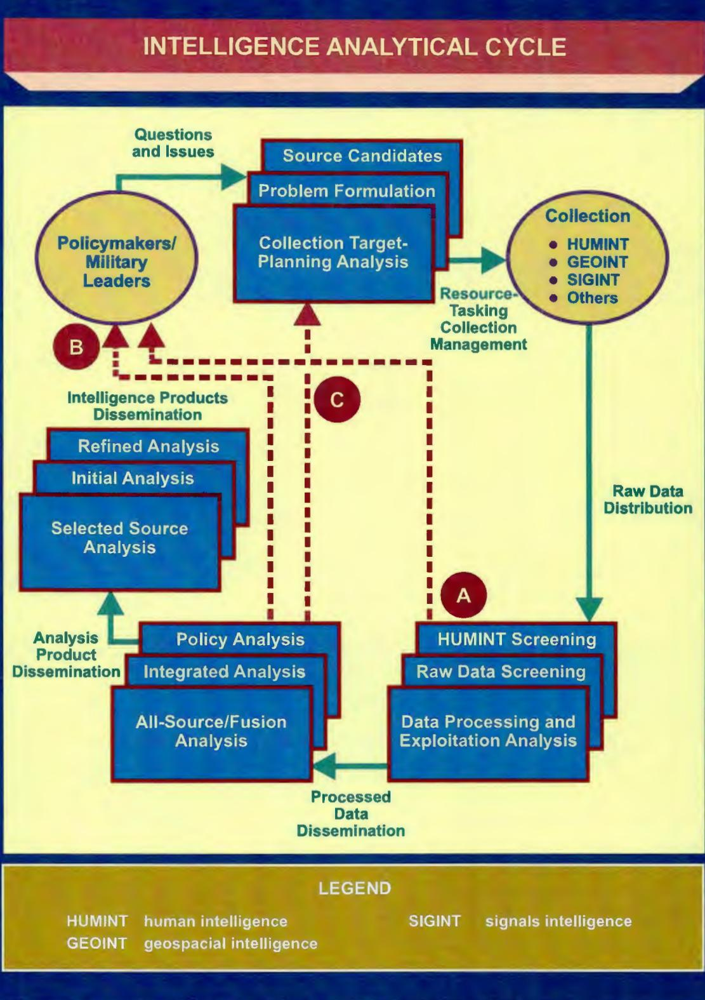  
Figure D-1. Intelligence Analytical Cycle

# SEVEN ANALYTICAL STEPS

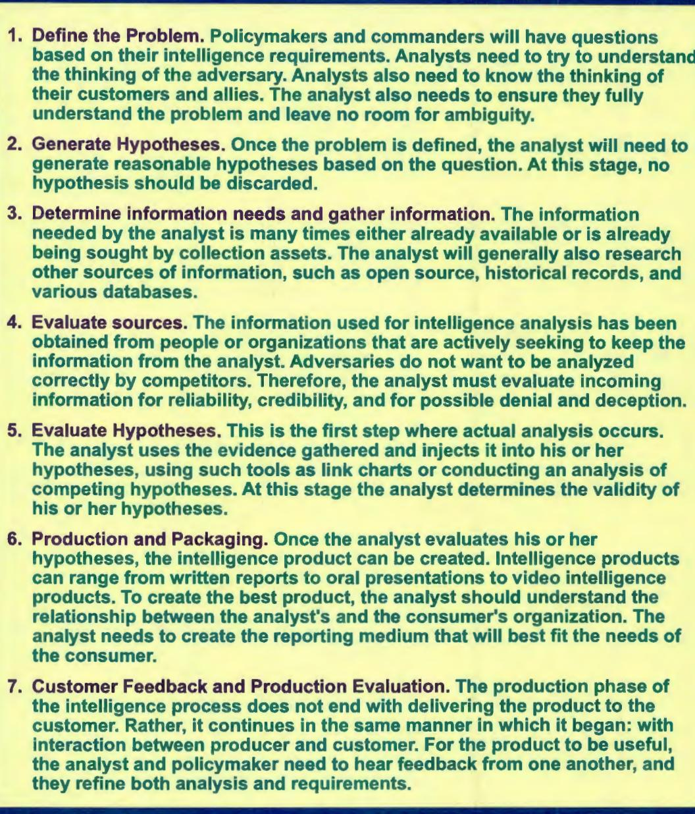  
Figure D-2. Seven Analytical Steps

# 3. Processing

After the data is collected, it is processed so that it can be used by the analyst. The HUMINT is screened by experts in the field to ensure that it is reliable information. Raw data from GEOINT and SIGINT is processed and screened so that it can be exploited. Some raw data gives enough information to be distributed directly to decision makers, but in many cases, it arrives in forms that are not legible. In these cases, experts in each of the disciplines translate or process the data to make it readable. After this step, the processed data is disseminated to the intelligence analysts that need the data to help formulate their analysis.

# 4. Analysis and Assessment

Upon receipt of the raw data from intelligence collectors, analysts format and synthesize the data to the point at which it can be used in the decision makers' policy, integrated into analytical reports and intelligence briefings, or incorporated into allsource/fusion analysis. If there is enough information to formulate a complete analytic response, the analysts take one of two paths. First, the analysts may report back to the decision makers on their answer to the intelligence problem that was posed, or use the information in a formal intelligence product to be released to the community. However, there might not be enough information to craft a fully informed product. If this is the case, the analysts will reformulate the intelligence question and re-enter it into the cycle, trying to find the additional information that is needed.

# 5. Analytical Tasks

Analysis covers a broad range of activities, each involving its own special set of skills and analytical tools. Figure D-3 shows a hierarchy of types of analysis starting with the initial processing of raw intelligence data to production of the final end product that incorporates the kind of reasoned synthesis of a problem that decision makers need to make decisions. As the analyst moves up the pyramid, there are intermediate levels of analysis that are useful to different sets of customers independently, as well as being building blocks for higher levels of analysis. Analysis is not this "clean," however. Information from the lowest level can feed directly into the highest-level policy documents, and intermediate-level information may also skip echelons from lower levels into higher levels.

a. The first task of analysis, represented by the base of the pyramid in Figure D-3 involves the initial processing of raw intelligence received from various collection systems. This can be either a manual or automated process depending on the type of system used to collect the data. The second level shown on the pyramid in Figure D-3 is a modest refinement of the first. For example, screening imagery for things of interest is critical in military support where time is of the essence.

b. The middle level of the hierarchy focuses on more refined analysis of data from multiple sources. The analyst uses data regardless of source or format, and applies various tools and techniques to derive some level of intelligence value. Finally, at the highest level of the pyramid, the intelligence analysis is highly refined and ready for the decision maker.

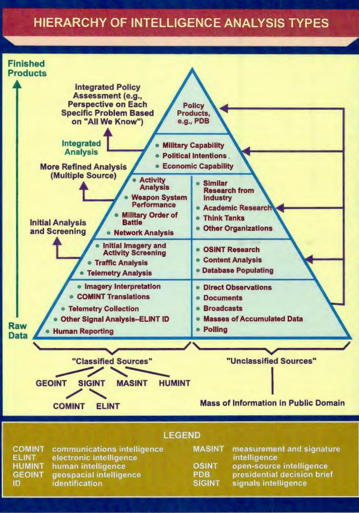  
Figure D-3. Hierarchy of Intelligence Analysis Types

# 6. Organizing the Data

a. One of the most daunting tasks for intelligence analysts is determining the best way to organize the data that was collected. The collection process provides analysts with varied types of information, some important and some ielevant, and many shades in between. When analyzing the information, the analyst must determine the type that is available. For intelligence analysis purposes, there are five major categories of information. Figure D-4 defines and provides examples of each.

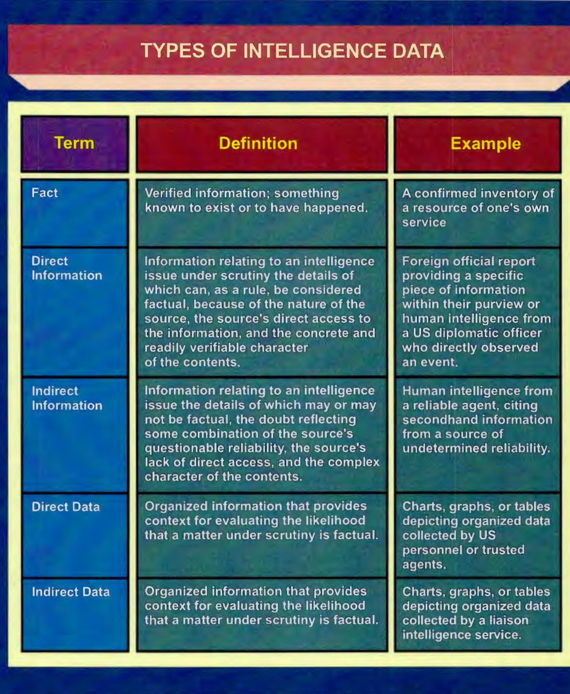  
Figure D-4. Types of Intelligence Data

b. After determining the types of data available, the analyst then must collate it. Collation describes the process of organizing raw data, interpolating known data, evaluating the value of data, and putting it into working hypotheses. The simplest approaches often are an excellent start. With due regard for protecting documents and information, a great deal can be done with pieces of paper, a whiteboard, or a table for organizing the raw data. Maps often are vital adjuncts, maps that can be written upon. Regardless of its form or setting, an effective collation method will have the following attributes. The collated data should:

(1) Be impersonal. It should not depend on the memory of one analyst; another person knowledgeable in the subject should be able to carry out the operation.

(2) Not become an end in itself; analysis is not a rote function.

(3) Be free of bias in integrating the information.

(4) Be receptive to new data without extensive alteration of the collating criterion.

# SECTION B. ANALYTIC PRINCIPLES

# 7. Follow Established Analytical Principles

When conducting intelligence analysis, the analyst should attempt to follow the below principles:

a. Be precise about what is known. Decision makers and military leaders need to be informed precisely what the analysts know and the source reliability of that information. Analysts should never exaggerate what is known. They should report any important gaps in information bearing on decision making and potential COAs, as well as relevant information that may contradict the analyst's leading hypothesis. Analysts should be precise as well in sourcing information. The phrase, according to the Us embassy, for example, does not inform the reader whether the information is direct or indirect.

b. Distinguish carefully between information and fact. Analysts may have direct information on what a foreign leader said, for example, and thereby report this as factual. But what a foreign leader believes, intends to do, and will do cannot be known to be true on the basis of a report on what he or she said. From the analytic standpoint, the intelligence should be reported as such.

c. Distinguish carefully between information and estimative judgment. Analysts' estimative judgments are an important element in the process of supporting decision makers, but they must be formulated using the entire body of available information and sound inferential reasoning. Also, care should be taken to avoid confusion over whether the analyst is stating a fact or an estimative judgment.

d. Take account of substantive complexity. The more complicated an issue, the greater the demand to determine what is factual. For example, the burden of proof in determining what a terrorist group intends to do is much greater than that required for determining what they have done or said. Analysts may properly make a conditional judgment about what an entity intends to do, but this should not be stated as verified or factual information.

e. Take account of controversial sensitivities. As with substantively complex matters, the burden of proof is high on matters that are controversial among decision makers. For controversial issues, analysts should place emphasis on the relevant information, and not on estimative conclusions.

f. Take account of the possibiity of deception. Deception is the manipulation of information by a foreign government, group, or individual to get intelligence analysts to reach an erroneous conclusion. Deception often works because it gives busy analysts what they are seeking—seemingly reliable information on which to base a conclusion. One test for detecting and countering deception is to determine whether all the sources and collection platforms that should be reporting on a matter have indeed done so. Databases and organized information in general help detect the possibility of deception, as does critical thinking.

g. Use the term “evidence" sparingly. Many times the term information is used synonymously with the term evidence. Both are used to refer to the content of reports and research that helps reduce the uncertainty surrounding intelligence questions. Evidence is more appropriate for law enforcement collectors and analysts. DOD analysts should avoid using the term when 'information' serves their purposes just as well. At times, characterization of the information is sufficient to make the analysts' point for the benefit of consumers.

# SECTION C. ANALYTICAL TOOLS

# 8. Introduction

There exists a wide and varying set of tools that analysts can use in order to help assist in the analysis of the intelligence. While each organization within the IC has its own distinctive array of tools that deal with the specific data with which they specialize, there are also general toolsets that analysts can use in the conduct of their daily business. Analytical tools assist in the processing of relevant information that decision makers use to enhance the probability of successful operations. Tools assist in deriving a logical and well thought out conclusion in complex situations. Tools themselves are not intelligence products and are not intended to be used to brief decision makers, but to help derive the intelligence that will.

a. The analyst needs to identify the tools that best match information on hand and functionality requirements. When determining the best tool to use, intelligence analysts can use commercial-off-the-shelf (COTS)/government-off-the-shelf (GOTS) applications.

As technology changes so must the intelligence analyst. The intelligence analyst needs to find tools that may be the best tool for the need or one that fits best.

b. One set are the traditional tools, such as time-event charts/timelines, association matrices, activities matrices, and ink diagrams. These tools assist in processing events, personnel, and relationships between individuals and activities. Other categories of tools that analysts are using to support decision makers are geographic information system (GIS) tools. Used together, these tools can help transform diverse, seemingly unrelated, and incomplete data or information within a complex situation into understandable analytical products that answer the intelligence questions that are posed.

# 9. Time-Event Chart

A time-event chart is a chronological record of individual or group activities. It is designed to store and display large amounts of information in as litle space as possible. In the traditional tool, analysts use triangles to show the beginning and end of the chart. Triangles are also used to show shifts in method of operation or change in ideology. Rectangles or diamonds are used to indicate significant events or activities. Analysts highlight noteworthy or important events by drawing an X through the event symbol. Each symbol contains a chronological number and date (day, month, and year). The incident description is a very brief explanation of the incident. It may include size, type of incident or activity, place and method of operation, and duration of incident. Arrows indicate time flow. While the diagram in Figure D-5 illustrates the basic concept of the tool, there are numbers of both COTS and GOTS tools that support this and other timeevent and time-line tools.

# 10. Association Matrix

The association matrix displays a relationship between individuals. It reflects associations within a group or similar activity, and is based on the assumption that people involved in a collective activity know one another. The basic format of an association matrix is a right triangle; each name requires a row and column. The association matrix shows known and suspected associations. Analysts determine a known association by "direct contact" between individuals. Direct contact is defined as face-to-face meetings or confirmed telephonic conversation between known parties and all members of a particular organization. This is depicted as a filled shape and placed in the square where the two names meet within the matrix. An unfilled shape indicates suspected or weak associations. Figure D-6 is a basic example.

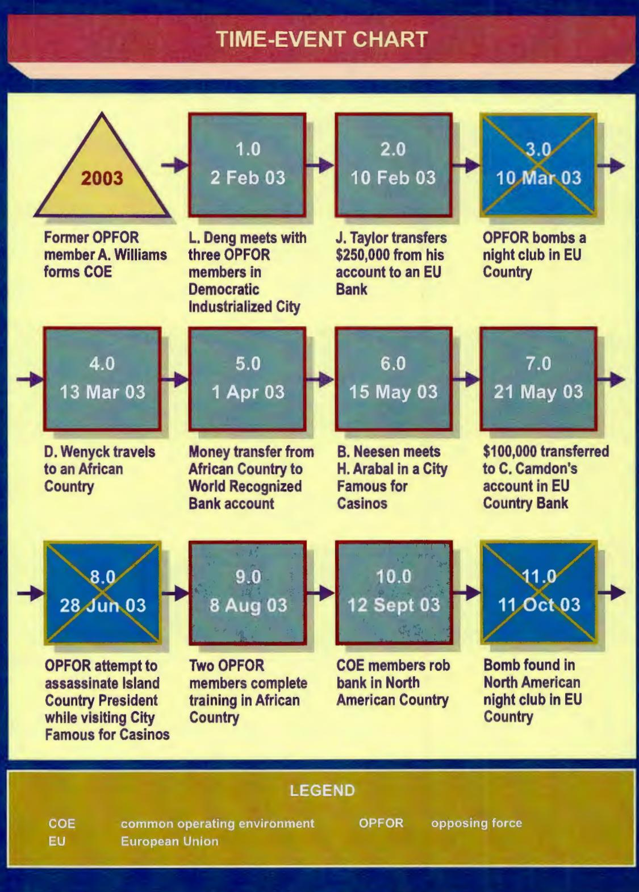  
Figure D-5. Time-Event Chart

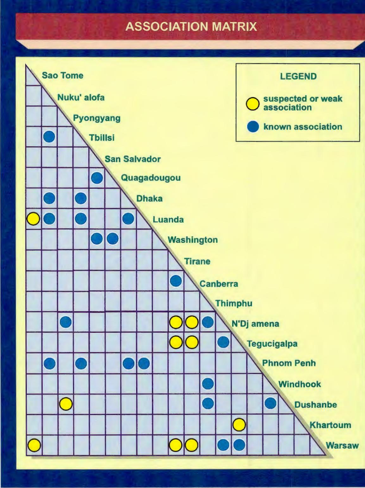  
Figure D-6. Association Matrix

# 11. Activities Matrix

The activities matrix (see Figure D-7) determines connectivity between individuals and anything other than persons (interests/entities). Analysts develop a tab to the matrix listing the short titles of each interest/entity. Each short title explains its significance as an interest or entity. The activities matrix reveals an organization's membership, organizational structure, cell structure and size, communications network, support structure, linkages with other organizations and entities, group activities and operations, and national or international ties. The activities matrix format uses a rectangular base. Rows are determined by the names from the association matrix, and columns are determined by the interest or entity short titles. The activities matrix shows known and suspected connections. Analysts develop the criteria for known connectivity. Criteria may be determined and defined from a number of sources to include commander's intent or directive, insurgent doctrine, or other decision maker's guidance. This can be accomplished from the simple use of an Excel spreadsheet to other COTS tools that have been developed to support this tasking.

# 12. Link Diagram

Link diagrams depict the linkages between interests or entities, individuals, events, organizations, or other interests or entities. Analysts use the link diagram to support investigative efforts in terrorism, CI, and criminal activity, and to graphically portray pertinent information from the association matrix and activities matrix, independently or synthesized. The link diagram format is the organization of symbols and rules. The link diagram displays known and suspected linkages. A solid figure represents known linkages. Suspected or weak linkages are dashed figures. Each individual and interest or entity is shown only once in a link diagram. This is common across the IC. One of the standard tools across the IC is Analyst Notebook. Both a general link diagram and an example of an Analyst Notebook chart are depicted in Figures D-8 and D-9.

# 13. Geographic Information System

a. A GIS, commonly referred to as a "mapping tool," captures, stores, analyzes, manages, and presents data that is linked to a location. GIS includes mapping software and applications for remote sensing, land surveying, aerial photography, mathematics, geography, and other tools. GIS packages are increasingly including analytical tools as standard built-in functionalities or as optional toolsets and add-ins. GIS can be used to depict two- and three-dimensional characteristics of the Earth's surface. The various GIS systems that are available to the analyst allow the analyst to conduct a myriad of tasks ranging from the basic location of their target to complex pattern of life analysis.

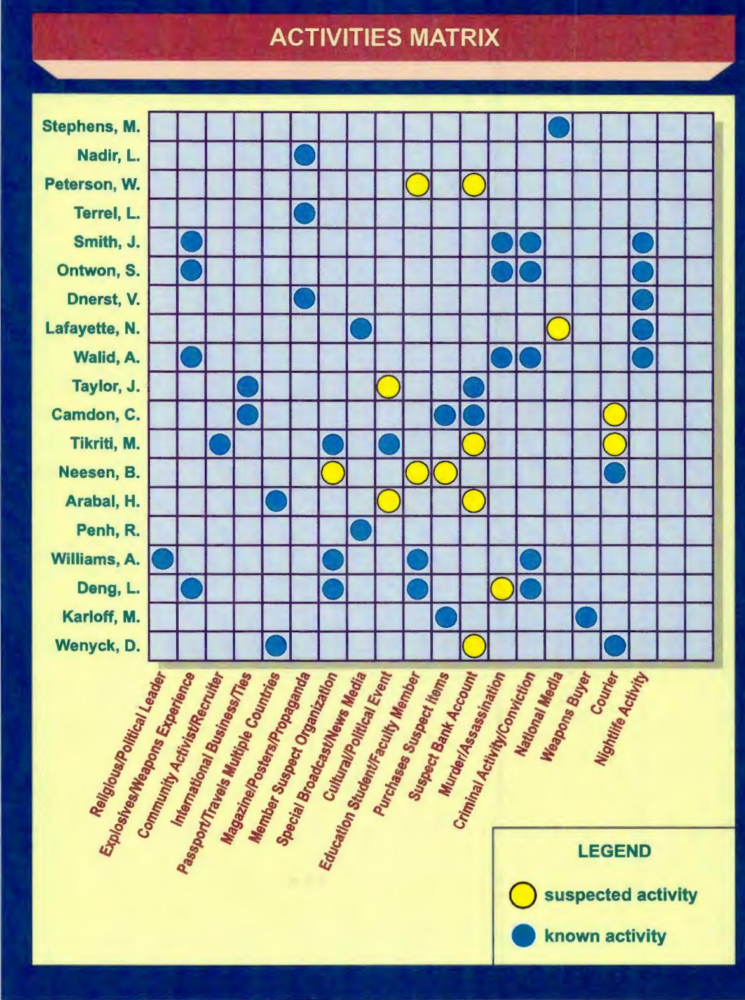  
Figure D-7. Activities Matrix

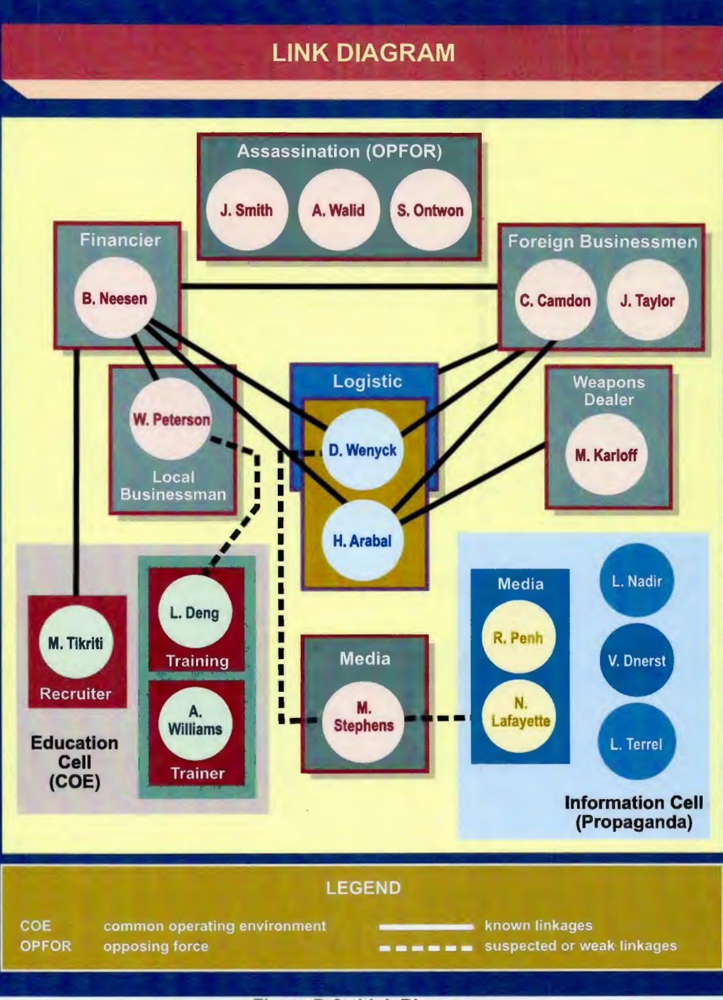  
Figure D-8. Link Diagram

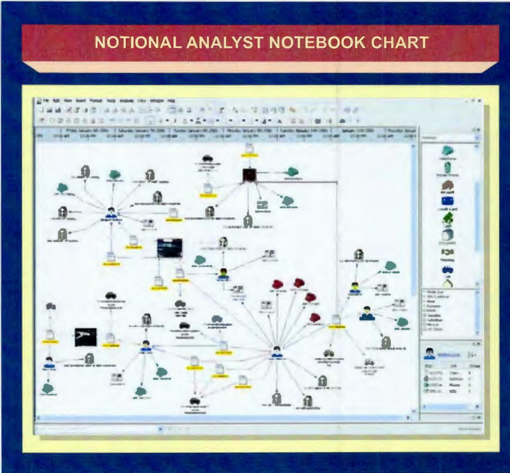  
Figure D-9. Notional Analyst Notebook Chart

b. GIs technology also provides the tools to collect, analyze, and disseminate information quickly and easily. The various GISs available to the analysts allow them to associate the location of events and the personnel associated with those events. GIS can help link previously unrelated information as well as uncover new leads to follow. GISs help develop a comprehensive picture of the intelligence situation. GIS allows data to be integrated from multiple sources to build the intelligence picture.

# SECTION D. WEB TOOLS

# 14. Introduction

Web tools refer to Web development and design that facilitate communication, secure information sharing, interoperability, and collaboration. Web tools development and evolution of Web-based communities, hosted services, and applications such as social networking sites, video-sharing sites, wikis, and blogs enhance and facilitate collaborative communications.

# 15. Analytic Space

a. The IC's Analytic Space (A-Space), is a project of the ODNI's Directorate of Analytic Transformation and Technology to develop a common collaborative workspace for all analysts from the IC. A-Space is a collaborative community that is accessible from common workstations and provides unprecedented access to interagency databases, a capability to search classified and unclassified sources simultaneously, webbased messaging, and collaboration tools. The focus of A-Space is to transform analysis, focusing on three areas.

# GOALS OF ANALYTIC SPACE (A-SPACE)

Enhancing the quality of analytical products   
Managing the mission more effectively at a community level   
Building more integrated analytic operations across the   
Intelligence community

b. A-Space accesses a number of large databases as well as Intellipedia. Reports are able to be tagged with important related words or phrases via a system called TagConnect and labeled by usefulness. Other core aspects of A-Space include:

(1) The Library of National Intelligence: The LNI is an ODNI project to create a repository of all IC-disseminated intelligence, regardless of classification with the CIA as the executive agent. The Library's electronic card catalog contains summary information for each report, permitting analysts to discover everything that has been published by the IC regardless of the original classification of the document. Analysts will be able to request the products IA W individual access levels and security guidelines.

(2) CIA WIRe: The CIA WIRe takes the entire agency's intelligence information and makes it available to CIA analysts in one database.

(3) Social Networking: Social networking is another critical part of A-Space. Analysts can create trusted contacts with other analysts and post profiles that contain updated contact information and details of their areas of expertise. In the IC, analysts may be unaware that they have a counterpart in another IC agency working on a related problem and that they could assist one another. This is equally true of intelligence consumers; a policymaker might be aware of a CIA report of interest, but not one from the DOS's INR. Indeed, both analysts and consumers may be unaware of the common interests.

# 16. Wikis/Intellipedia

A wiki is a website that uses wiki software, allowing the easy creation and editing of any number of interlinked web pages, using a simplified markup language within the browser. Wikis are often used to create collaborative websites, to power community websites, and for note taking. The external Wikipedia and the IC's internal versions are powerful tools for the analyst because they hold great amounts of information and provide an information management system. No analyst by him or herself knows everything about every aspect of the target. As the intelligence analyst continues to build information and evidence on their target, wikis or Intellipedia is useful to both help store information as well as post information for others to look at, comment upon, and launch new lines of query. wikis aid intelligence analysis for analysts to quickly and easily post data to share across the community. wikis allow the user to move away from hoarding information as well as limiting collaboration through e-mail or other similar systems.

# 17. Really Simple Syndication Feeds

Really simple syndication (RSS), also referred to as rich site summary, is a family of Web feed formats used to publish frequently updated works—such as blog entries, news headlines, audio, and video—in a standardized format. An RSS document includes full or summarized text, plus metadata, such as publishing dates and authorship. Web feeds benefit publishers by letting them syndicate content automatically. They benefit readers who want to subscribe to timely updates from favored websites or to aggregate feeds from many sites into one place. RSS feeds have entered the IC as well. RSS feeds have become an important feed of intelligence from sources both inside and outside the IC. External to the IC, the intelligence analyst can set up RSS feeds from various news sites as well as other sites that provide NRT information. RSS feeds from these sites can provide situational awareness to the analyst and provide insight into events as they are happening versus waiting for information to be reported through intelligence or defense channels. The early tip-off of this information can allow the analyst to be in a proactive response versus a reactive response. Internal to the IC, RSS feeds can be set up where data and intelligence flow to the analyst from disparate sources within the community. With the large number of data sources and databases available, it is difficult for the analyst to monitor all of them, all of the time. The RSS feed enables the analyst to receive pushed data versus having to pull it. This provides the analyst more time to focus on the analysis and not on trying to find the data.

# 18. Blogs

A blog is a type of web site, usually maintained by an individual, with regular entries of commentary, descriptions of events, or other material such as graphics or video. Entries are commonly displayed in reverse-chronological order. Intelligence analysts can use blogs for a myriad of reasons. Analysts can use blogs to provide commentary on a particular subject; or use it as an online diary. Blogs can contain a number of different data types to include text, images, and links to other blogs, web pages, and other media related to the topic of interest. Analysts can also use blogs to elicit comments from fellow analysts on ideas or concepts that may not have enough data from which to draw conclusions or to help build up knowledge on the topic. It is important to note that blogs are not authoritative sources of information as the data cannot be confirmed.

# 19. Mash-Ups

A mash-up is a composite application created from preexisting sources, to create a new original application. Digital text mash-ups, for example, appear by the thousands every day as users of blogs and online forums copy and paste digital text in juxtaposition to comment on topics of interest. Mash-ups represent a new phase in the reuse of existing work, not so much conceptually, as it is ease of use. As the intelligence analyst becomes more familiar with the technology, the ability for them to create mash-ups grows exponentially. With coding becoming more streamlined, the analyst is capable of doing more work themselves than in previous years. Within the IC, the analyst can create mash-ups which collect data sources such as RSS feeds, Internet maps and information from the DIA network, and present them in a common reference picture. Other mash-ups may include legacy systems in conjunction with new data sources in systems such as Google Earth.

# SECTION E. ALTERNATE INTELLIGENCE SOURCES

# 20. Open-Source Intelligence

OSINT is an intelligence source that involves discovering, selecting, and acquiring information from publicly available sources and then analyzing it to produce actionable intelligence. OsINT includes a wide variety of information and sources as shown in Figure D-10:

a. Most information has geospatial dimensions, but many often overlook the geospatial side of OSINT: not all open-source data is unstructured text. Examples of geospatial open source include hard and softcopy maps, atlases, gazetteers, port plans, gravity data, aeronautical data, navigation data, geodetic data, human terrain data (cultural and economic), environmental data, commercial imagery, light detection and ranging, hyper- and multi-spectral data, airborne imagery, geo-names, geo-features, urban terrain, vertical obstruction data, boundary marker data, geospatial mash-ups, spatial databases, and Web services.

b. These are all different sources that intelligence analysts can use to glean information that could be useful to their analysis. Each of these various sources should not be discounted. Additionally, these are all communications and technologies that are available to the adversary, so the intelligence analyst must be aware of these sources as well.

# 21. Social Networking Sites

a. A social network site focuses on building an online community of people who share interests and/or activities, or who are interested in exploring the interests and activities of others. Most social network services are web based and provide a variety of ways for users to interact, such as e-mail and instant messaging services. As social networking has encouraged new ways to communicate and share information, the same can be said for the adversary as well. Social networking sites are large and therefore can create a level of anonymity that can keep the adversary's actions concealed. A beneficial aspect of social networking sites is that they can help the intelligence analyst compile the information for link diagrams and various points of entry into the network.

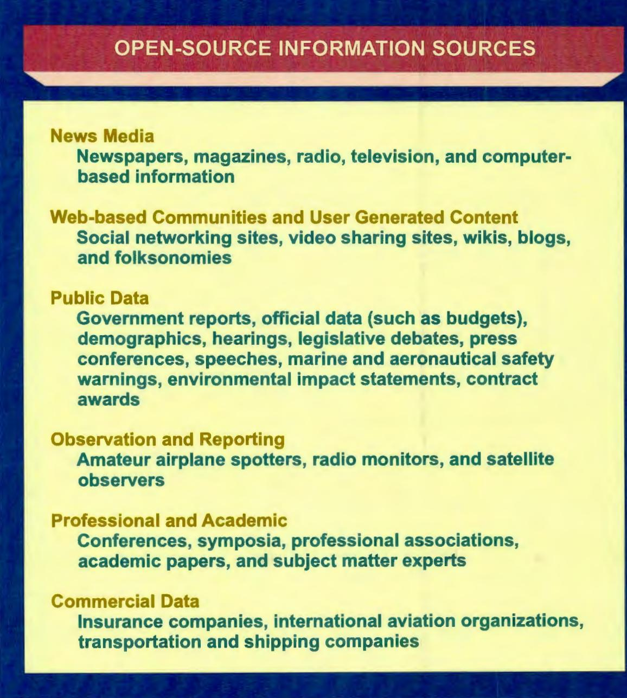  
Figure D-10. Open-Source Information Sources

b. The main types of social networking services are those which contain category divisions and the means to connect with friends and a recommendation system linked to trust.

Intentionally Blank

# APPENDIX E SECURITY

"The necessity of procuring good intelligence is apparent and need not be further urged. Allthat remains for me to add, is that you keep the whole matter as secret as possible. For upon secrecy, success depends in most enterprises ofthe kind, and for want of it, they are generally defeated, however well planned and promising a favorable issue."

General George Washington 1778

# 1. Overview

a. Security doctrine and procedures safeguard and protect lives, information sources, and operations, and facilitate the timely movement and/or flow and dissemination of raw data and finished inteligence.All intelligence operations aredependent upon the proper implementation and enforcement of security procedures to prevent violations and compromises, and to provide valuable time-sensitive intelligence to commanders. In a crisis situation, especially in a multinational environment, the J-2 must continue to maintain and enforce thorough and effective security procedures.

b. The J-2 makes a major contribution to the success of operational missions through peacetime security planning and preparation of tailored support to potential operations, as well as careful consideration of possible security-related contingencies. This preplanning is especially significant during operations involving multinational forces, which complicates dissemination and releasability procedures. In all environments, the J-2 must consider and assess such issues as:

(1) Properly classifying and/or sanitizing intelligence material to ensure the timely flow of critical intelligence to the requester, while considering the security implications of intelligence exchanges; and

(2) Using effective CI to enhance deception planning and operations.

# 2. Personnel Security

a. Among intelligence professionals, vigilance is the watchword, and periodic security training for all personnel is the method used to stress awareness and rectify procedural deficiencies and shortcomings. An interlocking and mutually supporting series of program elements (e.g., need to know, investigation, binding contractual obligations on those granted access, security education and awareness, and individual responsibility) provides reasonable assurances against compromise of classified information. The primary security principle in safeguarding classified information is to ensure that it is accessible only by those persons with an appropriate clearance, access approval, clearly identified need to know, signed nondisclosure agreement, and an appropriate indoctrination (for SCI).

b. CCDRs can grant interim clearances, administratively withdraw clearances, and grant or deny access to classified information per the guidelines contained in DOD 5200.2-R, DOD Personnel Security Program. The Services' senior officers of the intelligence community (SOICs) or their designees may grant SCI access for their respective Military Departments. The Director, DIA, is responsible for OSD, Joint Staff, the DOD agencies, and DOD field activities (less NSA/CSS and NRO).

# 3. Sensitive Compartmented Information Facility

Before SCI can be handled, processed, or stored, a SCIF must be accredited based on established physical security guidelines. The special security officer (SSO) is the POC for information on accreditation authorities and SCIF physical security guidelines.

# a. Establishing and Accrediting a Temporary and/or Emergency SCIF

(1) A SCIF at any level of accreditation may be established upon the verbal order of a general and/or commander during declared hostilities or general war. Reconciliation of SCIF activation and operational data will be made no more than 180 days after SCIF activation.

(2) For operational contingencies, and with prior DIA coordination, an SOIC may approve a temporary SCIF for up to 60 days. DIA will assign a SCIF identification number and retain authority to cancel, extend, or change the accreditation. There are no specific physical requirements for such a SCIF, although sound attenuation problems should be addressed, the SCIF should be staffed around-the-clock, and appropriate guards should monitor and/or patrol the area.

(3) A tactical SCIF is a military field operation established during crisis, contingency, or exercise. A tactical SCIF can be set up and temporarily accredited by a SOIC. This authority may be further delegated in writing to one lower level of command. The local approving authority may require use of a local tactical deployment checklist. The element authorizing establishment of a tactical SCIF notifies the accreditation authority and DIA by message before starting SCIF operations. The message format is shown in Figure E1.

(4) A tactical SCIF may be operated within a selected structure for the duration of an exercise. If reused within 36 months for SCI discussion, a technical surveillance countermeasures evaluation is recommended. During crisis and hostilities, there is no restriction over SCI discussion within a tactical SCIF.

# SAMPLE TACTICAL SENSITIVE COMPARTMENTEDINFORMATION FACILITY OPERATIONS MESSAGE FORMAT

FROM: (Originator's Message Address) TO: SSO DIA/DAC-2A/I CLASSIFICATION SUBJECT: TACTICAL SCIF OPERATION (U)

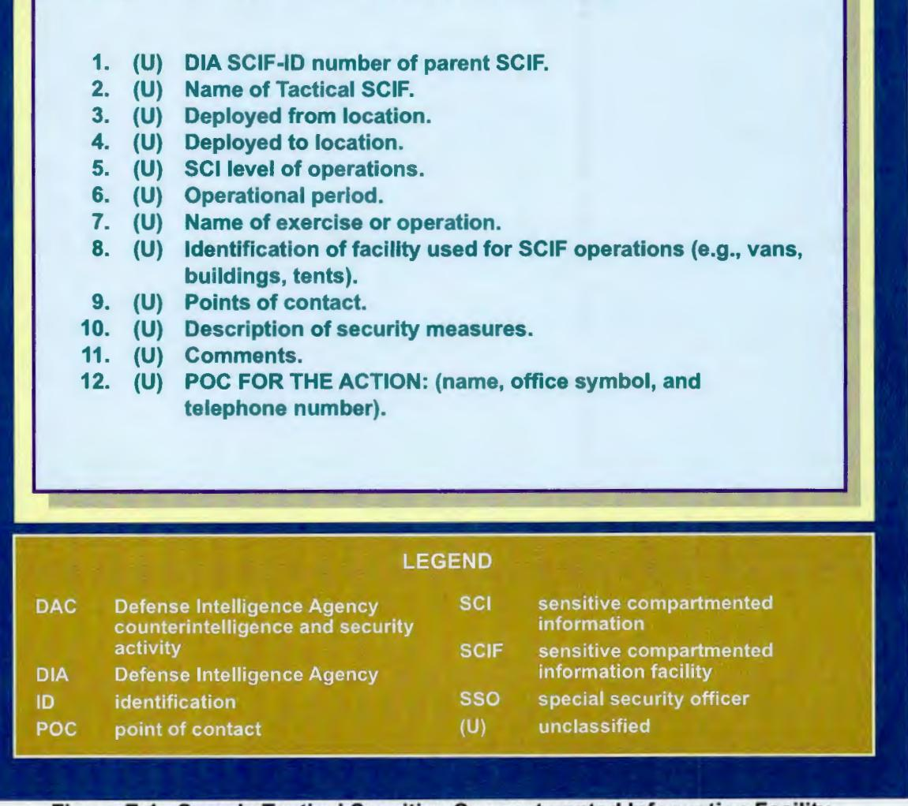  
Figure E-1. Sample Tactical Sensitive Compartmented Information Facility Operations Message Format

(5) A temporary secure working area (TSWA) is a temporarily accredited facility used no more than 40 hours per month for handling or discussing SCI. SOICs and CCMD SIOs may approve TSWAs for all levels of SCI. SOICs, SIOs, and DIA may approve electronic processing of SCI in a TSwA. Approval of temporary storage of SCI, not to exceed 6 months, may be granted by DIA or a Service.

(6) Shipboard SCIFs. A shipboard tactical facility requires submission of the shipboard accreditation checklist to the Navy accreditation authority. Temporary shipboard accreditation is approved by SOIC Navy for units which may deploy for emergency contingencies, not to exceed a 12-month deployment period. Permanent accreditation is approved by SOIC DIA.

(7) Aircraft SCIFs. Aircraft will be accredited through established accreditation channels. Transports and courier aircraft transporting SCI material between airfields do not require accreditation; however, compliance with SCI material and communications directives are mandatory. Aircraft temporarily confi gured for SCI missions by installing pallets, vans, or containers aboard, wil be accredited by the appropriate SOIC having SCI cognizance. Contingency and emergency deployment aircraf, operating with SCI processing aboard, may be operated as a tactical SCIF IA W Director of Central Intelligence Directive (DCID) 6/9, Physical Security Standards for SCIFs.

b. Tactical SCIF Security. Although security is necessary for the integrity of a SCIF, the SSO determines the degree of security to be maintained, taking the operators' needs and the local situation into account. Security should support, rather than restrict, the mission. Recommended guidelines for maintaining SCIF security include the following:

(1) Staff the tactical SCIF with sufficient personnel as determined by the onsite security authority based on the local threat conditions.

(2) Locate the tactical SCIF within the supported HQ's defense perimeter.

(3) Post armed guards to protect the entire perimeter of the SCIF compound. Maintain radio or wire communications with the guard and reserve force.

(4) Use a single entrance and access control procedures.

(5) Keep emergency destruction and evacuation plans current and displayed.

(6) Store SCI materials in lockable containers when not in use.

(7) Incorporate the SCIF physical security plan into the perimeter defense plan.

(8) Store no more intelligence than can be destroyed in a reasonable amount of time.

c. Assignments of Foreign Representatives to a SCIF. Prior to the assignment of foreign personnel to a SCIF, the subordinate joint force J-2 must consider the scope of the foreigner's role in relation to the environment. Foreign representatives in a SCIF should be physically located so that they may work effectively without being inadvertently exposed to restricted data. If a tactical SCIF is in a multinational environment with a US-only area, the US-only area must be kept separate from any multinational operations. The guard(s) must be a US citizen. The J-2, in coordination with the SSO, should ensure constant oversight of nonintelligence elements residing in the SCIF to ensure that there will be no compromise of operational matters.

# 4. Sanitizing and/or Releasing Intelligence

USG policy is to treat classified military information as a national security asset, which may be shared with foreign governments and international organizations only when there is a clearly defined advantage to the United States. US national interests require that foreign governments provide US classified information with a degree of security protection comparable to what it would receive while under US control. There are a number of international and bilateral security agreements in effect to ensure this. However, in exceptional cases it will be in US interests to make information available to a foreign government before concluding an agreement, even if the recipient government's safeguards appear inadequate. In these cases, when authorized by the National Disclosure Policy Committee (NDPC) as exceptions to policy, a balance is sought between US national interests and the security of the classified information.

a. National Disclosure Policy (NDP)-1, National Disclosure Policy, governs how the United States releases military information to foreign governments and international organizations and establishes eligibility criteria to receive releasable information. Detailed procedures for handling, processing, downgrading, release, and sanitization of these materials exist. An official designated in writing may disclose or deny classified military information IA W the provisions of the NDP, provided the information is originated by the official's department or agency and the official is responsible for the information to be disclosed. Only those officials with such specific authority may make foreign disclosure decisions.

b. Intelligence information, even though it bears no restrictive control markings, may only be released in its original form to foreign governments or international organizations with the permission of the originator and IA W DCID $_ { 6 / 7 }$ , Intelligence Disclosure Policy, and NDP-1, National Disclosure Policy. Information contained in intelligence products or reports of another IC component, which bears no restrictive control markings, may be used by recipient IC components in reports provided to foreign governments under the following conditions:

(1) Foreign release occurs through established foreign disclosure procedures by designated disclosure officials.

(2) No reference is made to the originating agency or to the source documents upon which the released product is based.

(3) The information is extracted or paraphrased to ensure that the source or manner of acquisition of the intelligence and/or location where the intelligence was collected (if relevant to protect sources or methods) is not revealed and cannot be deduced in any manner.

(4) RESTRICTED DATA and FORMERLY RESTRICTED DATA are prohibited from foreign dissemination under the provisions of Public Law 585, Atomic Energy Act of 1954, as amended.

c. Even though it bears no restrictive control markings, intelligence will not be released, either in its original form or otherwise, to foreign nationals or immigrant aliens (including those employed by, used by, or integrated into the UsG) without the permission of the originator and IAW DCID 6/7, Intelligence Disclosure Policy, and NDP-1, National Disclosure Policy.

d. An SSO can provide more detailed information on SCI policy and procedures, and the DFE assigned to the cognizant CCMD can help to seek exemptions to security policy from national agencies. The CCDR is responsible for the release of intelligence and should request that intelligence producers tailor their product so as to minimize the use of caveats.

e. As shown in Figure E-2, and apart from the exceptions listed in Figure E-3, military information is divided into eight functional categories by the NDPC. In almost all cases, intelligence under consideration for release at the subordinate joint force J-2 level will be in Category 8. CCMD requests for disclosure of NDPC-exception categories of intelligence information will be made IA W the policies and directives of the DOD, IC members, or other office responsible for the information.

f. Classified information may only be disclosed when the following applies:

(1) Disclosure is consistent with US foreign policy and national security objectives concerning the recipient foreign government or international organization.

(2) Disclosure can be expected to result in a clearly identifiable advantage to the United States.

(3) It can be reasonably assumed that the disclosed information would not be used against US interests.

g. Release Policies and Procedures. J-2s should consider the following when determining whether to release classified information:

(1) Determine recipient country's eligibility to receive MI. If the country is not eligible yet meets the conditions listed below, a request for exemption to NDP can be made through the CCMD's FDO.

(2) Determine recipient's need to know. Any recipient, whether a member of the US military or a foreign government, must have a "need to know" before being provided with US intelligence. While determining need may be difficult, the J-2 may rely on common sense and knowledge of the situation. For example, Country X has a legitimate need to know about Country Y-sponsored terrorist activities in the region. However, since Country X faces no direct military threat from Country Y, it has no need to know and is not eligible to receive information on Country Y's OB. Where necessary, a decision may be based on political and/or military expediency.

(3) The gain must clearly outweigh the risk of compromising the source. This is most easily ensured by sanitizing the original report to protect the source.

(4) Release intelligence only to the level of command necessary, as determined by the J-2.

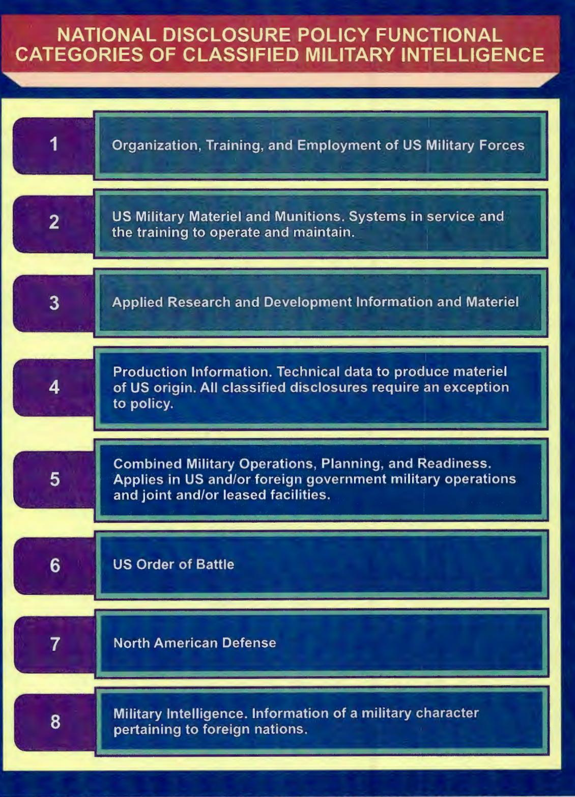  
Figure E-2. National Disclosure Policy Functional Categories of Classified Military Intelligence

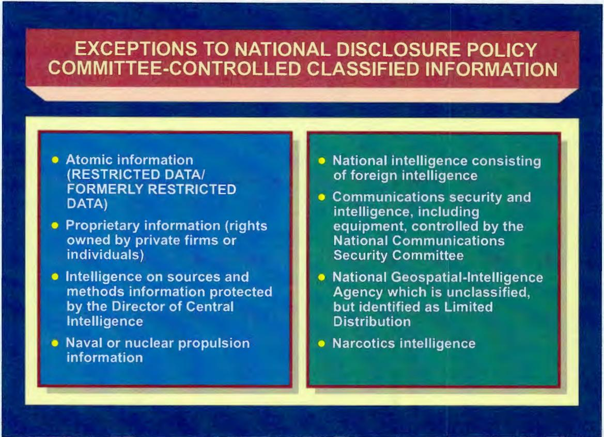  
Figure E-3. Exceptions to National Disclosure Policy Committee-Controlled Classified Information

(5) As noted above,ecepinexceptional cirumstances, theorganization recivig the inteligence must reasonably be expected to afford the same degree of protection against compromise as would US channels.

h. Key points on release of classified material are listed in Figure E-4.

# 5. Information Systems Security

a. The authority to permit the automated processing of intelligence information is vested in the Director, DIA, who has the responsibility to ensure that the risks posed during processing are outweighed by the gain. Specifically, this means that adequate security of contractor and DOD (less NSA/CSS) automated information systems and the security of systems (networks) that store, process, and/or transmit sensitive foreign intelligence information are under the cognizance of the Director, DIA. DIA manages the DODIIS Computer Security Program IA W the appropriate DOD and IC directives.

b. As far in advance of joint operations as possible, personnel responsible for establishing security (in coordination with those responsible for determining the information system and/or connectivity requirements) should contact DIA. They must inform DIA of the names and accreditation status of systems to be used during the operation, as well as planned inter-connectivity. DIA works with planners to balance security requirements with operational requirements.

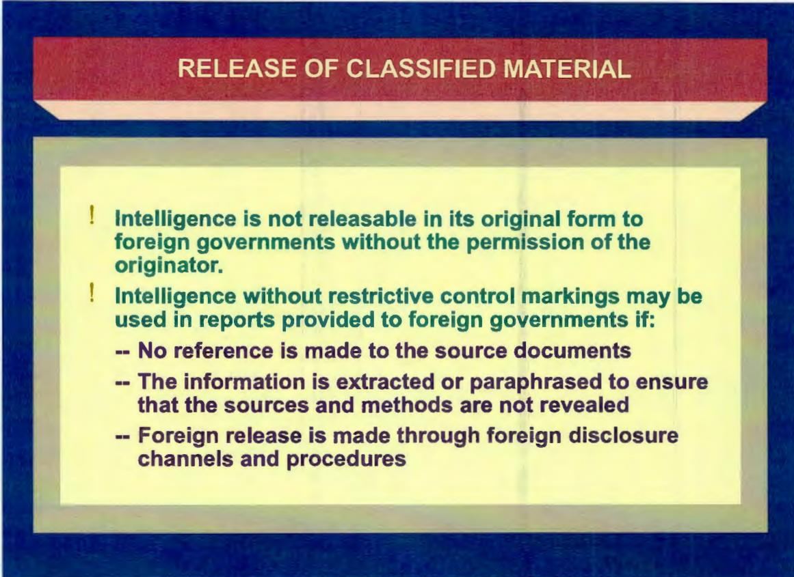  
Figure E-4. Release of Classified Material

Intentionally Blank

APPENDIX F INTELLIGENCE RESOURCE PROGRAMS

# 1. Introduction

The IC resource programs have evolved to manage intelligence-related activities in a more dynamic and comprehensive manner. The numerous activities and assets that comprise the total IC fall within a broad spectrum ranging from strategic to tactical. There are two major intelligence programs that directly contribute to the effective and coherent support to MI consumers: the NIP and the MIP. The NIP primarily serves national-level decision makers across multiple government agencies and departments. The MIP primarily provides intelligence to joint mission-oriented customers defense-wide and the Services or agencies whose principal consumers are operational and tactical military commanders. Each of these intelligence programs is addressed in this appendix.

# 2. Resource Programs

a. Intelligence activities and assets are grouped and funded according to their function and/or purpose. Strategic intelligence typically is considered to be national-level activities and assets funded under a number of resource programs referred to collectively as the NIP. Strategic or national intelligence primarily supports the President and national-level political and military leadership. It is primarily strategic in nature, concerns plans and intentions of foreign entities, and serves as the basis for the national military strategy. The NIP is jointly managed by the USD(I) and the ODNI. The NIP provides resources for intelligence activities and assets necessary for intelligence operations to support the US military to the national CSAs down to the Service intelligence centers (see top arrow, Figure F-1).

b. The MIP provides resources for all DOD requirements, to include tactical, joint and defense-wide initiatives, activities, and programs that provide more effective and coherent intelligence programmatic decision making (see bottom arrow, Figure F-1). MI consumers supported include the warfighter, policymaker, and force modernization planners. The USD(I) manages the MIP, and it is designed, built, and operated by the Services and DOD agencies and competes for funding with combat and combat-support programs. A universal "rule of thumb" is anything that is not NIP funded must be considered MIP.

# 3. National Intelligence Program

The NIP provides funds for the bulk of national-level intelligence, foreign CI, and reconnaissance activities of the IC, as well as other USG intelligence programs designated for inclusion in the NIP by the heads of the executive department involved and the ODNI or the President.

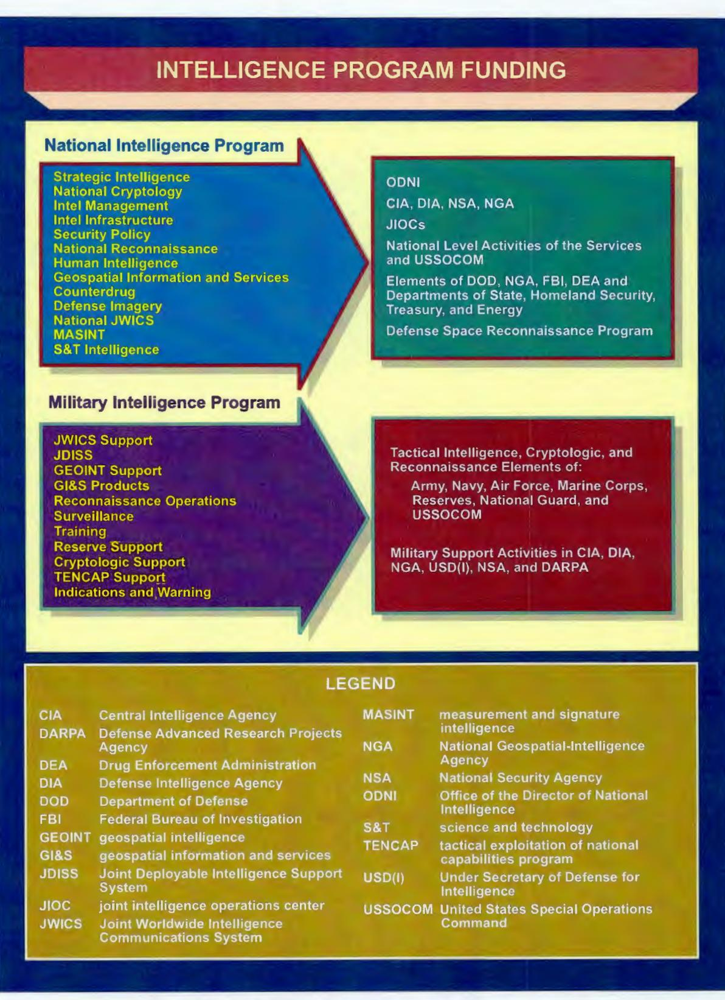  
Figure F-1. Intelligence Program Funding

a. Each NIP program is headed by a program manager who prepares the program's annual budget and oversees the expenditure of the funds allocated to the program. while some NIP programs are managed by the heads of organizations most closely associated with them (e.g., the consolidated cryptologic program [CCP] by the Director of NSA), others are not (e.g., the Central Intelligence Agency Program [CIAP] is not managed by the ODNI, but by the Deputy Director of CIA). The program managers receive policy and fiscal guidance from the ODNI and prepare and submit their programs' budget for ODNI approval and consolidation into the single NIP budget which is submitted to the President.

b. The NIP budget is not openly published for national security reasons. NIP funding is actually embedded within elements of the DOD budget. These funds are administered by the Services, but under the close scrutiny of NIP program managers.

# 4. General Defense Intelligence Program

The broadest-based NIP program within DOD and the Services is the GDIP. This program funds activities that involve functions other than cryptology, CI, and certain types of specialized reconnaissance. It includes DIA (which includes the MSIC, NCMI, JITF-CT), the Service intelligence centers (which include NGIC, NASIC, ONI, and the MCIA) in each of the Military Departments.

a. The GDIP encompasses the following activities.

(1) All defense intelligence production not funded elsewhere in the NIP.

(2) All national-level DOD human source intelligence.

(3) A wide range of activities that provide defense intelligence infrastructure.

(4) Significant collection (other than cryptologic and CI) against geographic targets, foreign forces, and foreign weapon systems.

b. GDIP-funded units and activities collect information, process and analyze data, and produce MI for the following spectrum of missions:

# (1) Support to warfighting

(a) Input to national military strategy.

(b) I&W.

(c) Countermeasures and military contingency operations.

(d) Theater-level batle planning and direction of combat operations.

(e) Planning and conducting small scale contingency operations (e.g., 1oncombatant evacuation operations).

(f) Counterterrorism analysis.

(g) Synchronization and GFM of defense ISR and associated PED capabilities and activities in DOD.

# (2) Equipping and training of forces

(a) Weapons and countermeasures acquisition.   
(b) Force structure development.   
(c) Doctrine and tactics training.   
(d) Military education and training.

(3) Direct support for national-level priorities

(a) Foreign policy development.   
(b) Arms control negotiations and treaty monitoring.

c. Activities funded by the GDIP perform their principal intelligence mission and support missions of the DOD, a Military Department, a CCMD, or more than one component command.

(1) The GDIP supports OSD and JCS decision making; Service training and equipping; production and collection; and provides resources for the JWICS, within CCMDs, to include the JIOCs.

(2) GDIP is affected by resource decisions and actions of other programs within the NIP and MIP. For example, GDIP often funds the training of operators of new systems acquired through other programs. It also provides equipment and communications for other systems to ensure interoperability and compatibility with other systems funded outside the GDIP.

d. GDIP funds are expended mainly in the four following areas of intelligence:

# (1) Production

(a) GDIP-funded production includes all defense intelligence production in the NIP (except SIGINT, MASINT, and CI) and supports the timely production of fused allsource finished intelligence for warfighters and the national, Service, and departmental leadership. Its products include databases of foreign military forces and programs, targeting materials, S&T analyses, and threat assessment.

(b) The Director, DIA, is the program manager of the GDIP and the agency is one of the major producers. DIA produces a full range of basic, current, warning, and estimative intelligence that supports geographic CCDRs and operational forces, the Military Departments, and national policymakers.

(c) Military Service producers focus mainly on national-level intelligence needed to equip and train forces to support the CCDRs and maintain S&T centers and operational intelligence centers funded through the GDIP.

(d) A significant portion of GDIP intelligence production is accomplished in leater intelligence production centers, imagery centers, and component analytical centers.

(2) Collection. The GDIP funds intelligence collection primarily in three areas.

(a) HUMINT.

(b) MASINT conducted through a variety of systems ranging from national technical means to ground-based systems.

(c) Collection (other than SIGINT and certain other types of collection conducted through other NIP programs) against geographic targets and foreign forces and weapon systems. The collection is achieved mainly through technical sensors on airborne reconnaissance platforms and aboard a variety of other collection systems.

(3) Infrastructure. This third aspect of the GDIP includes the following:

(a) Automation. DODIIS intelligence systems support and automated intelligence systems, as well as non-cryptologic communications for SCI dissemination.

(b) Reproduction, presentation, and dissemination of a wide range of intelligence materials and data.

(c) Physical， personnel, industrial, computer, telecommunications, and OPSEC. This includes non-cryptologic SCI policy and operations as well as adjudication of special background investigations.

(d) Intelligence training and education, such as the courses conducted at the

NDIC.

(4) Management. GDIP funds three types of intelligence management: program intelligence management, functional management, and fiscal management. Program management was discussed earlier in this appendix. Functional managers and their staffs are oriented along the three broad functional areas of production, collection, and infrastructure, which encompass the full range of activities funded under the GDIP. Fiscal management involves the GDIP programming and budget process, a structured sequence within the NIP that runs parallel to that of all other NIP programs against which GDIP requests eventually compete for a share of the NIP budget. The process begins when the GDIP program manager receives guidance from the ODNI and uses it to develop his own "'top-down" policy and fiscal guidance, in the program manager's guidance memorandum (PMGM), to the Service intelligence elements, DIA, and the CCMDs. Based on the program manager's guidance, the functional managers provide funding priorities and specific guidance relative to their respective area of concern which is included in the PMGM.

# 5. Other National Intelligence Programs

a. Central Intelligence Agency Program. The activities of CIA are funded under the CIAP. This NIP program provides funds for analytical and controlled activities, administration, field operations, and research and development.

b. National Geospatial-Intelligence Agency Program (NGP). The NGP funds all NGA national level programs. The Director, NGA, is designated as the program manager of the NGP.

c. Consolidated Cryptologic Program. CCP is operated and managed by NSA, with the Director, NSA, serving as the program manager. In addition to its own worldwide SIGINT and OPSEC operations, NSA also oversees national-level operations of the five SCCs. These include the cryptologic components of the Army's INSCOM, Navy's FLTCYBERCOM, the AFISRA, the Marine Corps' DIRINT, and the Coast Guard's Assistant Commandant for Intelligence.

d. DOD Foreign CI Program. This component of the NIP conducts CI activities in support of DOD components in foreign countries in coordination with the CIA, and within the US in coordination with the FBI, pursuant to procedures agreed upon by the Attorney General and SecDef.

e. National Reconnaissance Program. This program sustains the infrastructure and research and development activities of the NRO.

f. Department of the Treasury Intelligence Program. This NIP program is that element of the Department of the Treasury responsible for:

(1) Analysis of foreign financial and monetary information. (2) Participation with the DOS in the overt collection of general foreign economic   
information. (3) Production and dissemination of foreign intelligence relating to US economic   
policy as required for the execution of the responsibilities of the Secretary of the Treasury.

g. Department of State's Bureau of Intelligence and Research. This NIP organization is that element of DOS that:

(1) Overtly collects information relevant to US foreign policy concerns. (2) Produces and disseminates foreign intellgence relating to US foreign policy as   
required for the execution of the Secretary of State's responsibilities. (3) Disseminates, as appropriate, reports received from US diplomatic and consular   
posts. (4) Transmits reporting requirements of the IC to the chiefs of US missions abroad.

(5) Supports chiefs of missions in discharging their statutory responsibilities for direction and coordination of mission activities.

h. DHS Office of Intelligence and Analysis. Provides resources for intelligence analysis on threats within Us borders to protect infrastructure, to secure borders and to support preparedness. In concert with the Coast Guard, provides maritime intelligence focused on counterterrorism, drug trafficking, illegal alien migration, and infrastructure protection.

i. Department of Justice Program. This NIP element provides resources for the FBI and the DEA intelligence related activities to include:

(1) Collection, analysis, and exploitation of intelligence to detect, prevent, and disrupt terrorist attacks, hostile foreign intelligence activities, and cyberspace-based efforts directed at US interests.

(2) Research, development, and procurement of technical systems and devices related to their authorized functions.

j. Department of Energy Office of Inteligence and CI. This program is responsible for:

(1) Participating with the DOS in overtly collecting information with respect to foreign energy matters.

(2) Participating in formulating intelligence collection and analysis requirements where the special expert capability of the DOS can contribute.

(3) Providing expert technical, analytical, and research capability to other agencies within the IC.

k. Special NIP Accounts. In addition to the programs described above, there are two additional accounts managed as part of the NIP. These two accounts are the CIA Retirement and Disability System and the Security Evaluation Program.

# 6. Military Intelligence Program

The MIP consists of programs, projects, or activities that support SecDef 's intelligence, CI, and related intelligence responsibilities, to include those which meet the warfighter's operational and tactical requirements. The term MIP replaces the terms Joint Military Intelligence Program and Tactical Intelligence and Related Activities.

a. As the program executive, the USD(I) provides policy and substantive programmatic and fiscal guidance for the MIP and exercises review and approval authority over MIP and any subsequent program modifications that significantly alter cost, schedule, or capability. Reprogramming of MIP funds requires the approval of the USD(I).

b. The MIP is organized into major organizational components and functional areas of emphasis. The USD(I) assigns MIP component managers as the individual responsible for managing MIP resources within a respective MIP component. Those MIP components are:

(1) DIA MIP. Consists of DIA's intelligence activities focused on support to the CCMDs. The CCMD JIOCs and the DOD CI and HUMINT center resources are included here. The Director DIA is the component manager.

(2) NGA MIP. The NGA MIP Program funds defense-wide GEOINT activities, including communication, and production system improvements, as well as the defense imagery activities of NGA. Also funded are selected defense airborne and space reconnaissance activities managed by NGA. The component manager is the Director, NGA.

(3) NSA MIP. The NSA MIP consists of cryptologic and SIGINT support to the )OD. The component manager is the Director, NSA.

(4) NRO MIP. Augments the NRO NIP resources addressing specific DOD requirements. The component manager is the Director, NRO.

(5) Service MIP Components. Consists of the service-unique intelligence capabilities and contributions primarily for that Service from the JTF to the tactical warfighter. MIP funds reside within the respective Service total obligation authority or budget. USSOCOM is dual-hatted as a warfi ghting functional command and a service-like force provider. As such, the USSOCOM JIOC is funded through the DIA MIP, and special operations unique intelligence capabilities are funded primarily through USSOCOM MIP. Generally, the Secretaries of the Military Departments and the Commandant of the Marine Corps designate the SIO as the MIP component manager for their Service.

(6) OsD MIP. Provides resources for the USD(I) to exercise planning, policy, and strategic oversight of al DOD intelligence, CI, and security policy, plans and programs. Also provides counternarcotics intelligence support managed by the Deputy Assistant Secretary of Defense for Counternarcotics and Global Threats.

(7) Other MP accounts not considered MIP Components: Provides resources for intelligence support to Defense Threat Reduction Agency, Defense Security Service, and DISA.

c. The MIP uses the existing DOD Planning, Programming, Budgeting, and Execution process and leverages the Battlespace A wareness Capability Portfolio Management process to ensure that all ISR requirements are properly addressed (see Figure F-2). The USD(I) leads program development by issuing guidance, then oversees program/budget development and execution in coordination with the OSD comptroller.

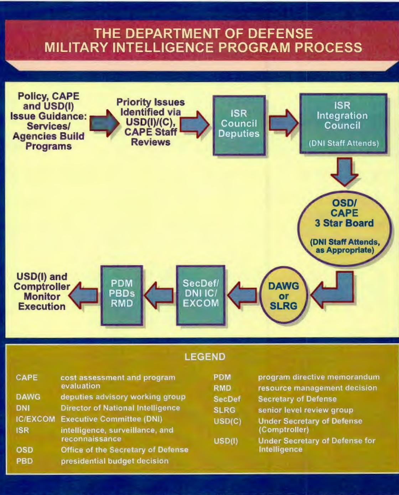  
Figure F-2. The Department of Defense Military Intelligence Program Process

# Appendix F

Intentionally Blank

# APPENDIX G REFERENCES

The development of JP 2-01 is based upon the following primary references.

# 1. General

a. National Security Act of 1947.   
b. Title 10, United States Code.   
c. Title 50, United States Code.   
d. Goldwater-Nichols Department of Defense Reorganization Act of 1986.   
e. Intelligence Reform and Terrorism Prevention Act (IRTPA) of 2004.   
f. The National Security Strategy of the United States.   
g. The National Military Strategy.   
h. National Strategy to Combat Weapons of Mass Destruction.   
i. National Strategy for Homeland Security.   
j. National Strategy for Combating Terrorism.   
k. National Intelligence Strategy.   
1. Defense Intelligence Strategy.   
m. EO 12333, United States Intelligence Activities, as amended.   
n. EO 12958, Classified National Security Information.   
0. NDP-1, National Policy and Procedures for the Disclosure of Classified rmation to Foreign Governments and International Organizations (Short Title: closure Policv).

# 2. DOD Publications

a. DODD 3000.06, Combat Support Agencies.   
b. DODD 3000.07, Irregular Warfare (IW).   
c. DODD 3600.01, Information Operations.   
d. DODD 5100.1, Functions of the Department of Defense and its Major Components.

# Appendix G

e. DODD 5100.3, Support of the Headquarters of Combatant and Subordinate Joint   
Force Commands. f. DODD 5100.20, National Security Agency/Central Security Service (NSA/CSS). g. DODD 5105.21, Defense Intelligence Agency (DIA). h. DODD 5105.60, National Geospatial-Intelligence Agency (NGA). i. DODD 5143.01, Undersecretary of Defense for Intelligence (USD(I1)). j. DODD 5200.2, DOD Personnel Security Program. k. DOD 5200.2-R, DOD Personnel Security Program. 1. DODD 5200.27, Acquisition of Information Concerning Persons and Organizations   
not Affiliated with the Department of Defense. m. DODD 5205.12, Military Intellgence Program (MIP). n. DODD 5230.11, Disclosure of Classified Military Information to Foreign   
Governments and International Organizations. 0. DODD 5240.01, DOD Intelligence Activities. p. DODD O-5240.02, Counterintelligence. q. Department of Defense Instruction (DODI) O-3115.07, Signals Intelligence   
(SIGINT). r. DODI 3115.10E, Intelligence Support to Personnel Recovery. s. DODI C-5205.01, DOD Foreign Military Intelligence Collection Activities   
(FORMICA)(U). t. DODI 5240.10, Counterintelligence Support to the Combatant Commands and the   
Defense Agencies. u. DODI 6420.01, National Center for Medical Intelligence. v. DODI 8110.1, Multinational Information Sharing Networks Implementation.

# 3. CJCS Publications

a. JP 1, Doctrine for the Armed Forces of the United States.   
b. JP 1-0, Personnel Support to Joint Operations.   
c. JP 2-0, Joint Intelligence. d. JP 2-01.2, Counterintelligence and Human Intelligence Support to Joint Operations.   
e. JP 2-01.3, Joint Intelligence Preparation of the Operational Environment.   
f. JP 2-03, Geospatial Intelligence Support to Joint Operations.   
g. JP 3-0, Joint Operations.   
h. JP 3-05, Special Operations.   
i. JP 3-06, Joint Urban Operations.   
j. JP 3-08, Interorganizational Coordination During Joint Operations.   
k. JP 3-11, Operations in Chemical Biological, Radiological, and Nuclear (CBRN) ironments.   
1. JP 3-13, Information Operations.   
m. JP 3-13.2, Military Information Support Operations.   
n. JP 3-16, Multinational Operations.   
0. JP 3-24, Counterinsurgency Operations.   
p. JP 3-27, Homeland Defense.   
q. JP 3-28, Civil Support.   
r. JP 3-29, Foreign Humanitarian Assistance.   
s. JP 3-33, Joint Task Force Headquarters.   
t. JP 3-40, Combating Weapons of Mass Destruction.   
u. JP 3-50, Personnel Recovery.   
v. JP 3-57, Civil-Military Operations.   
w. JP 3-60, Joint Targeting.   
x. JP 5-0, Joint Operation Planning.   
y. JP 6-0, Joint Communications System.   
Z. CJCSI 1301.01D, Joint Individual Augmentation Procedures.   
aa. CJCSI 3110.02F, Intelligence Planning Guidance, Objectives, and Tasks.   
bb. CJCSI 3340.02A, Horizontal Integration of Warfighter Intelligence.

# Appendix G

cc. CJCSI 5120.02B, Joint Doctrine Development System.

dd. CJCSI 5221.01B, Delegation of Authority to Commanders of Combatant Commands to Disclose Classified Military Information to Foreign Governments and International Organizations.

ee. CJCSM 3122.03C, Joint Operation Planning and Execution System, Volume II, Planning Formats.

ff. CJCSM 3314.01, Intelligence Planning.

# APPENDIX H ADMINISTRATIVE INSTRUCTIONS

# 1. User Comments

Users in the field are highly encouraged to submit comments on this publication to: Joint Staff J-7, Deputy Director, Joint and Coalition Warfi ghting, Joint and Coalition Warfighting Center, ATTN: Joint Doctrine Support Division, 116 Lake View Parkway, Suffolk, VA 23435-2697. These comments should address content (accuracy, usefulness, consistency, and organization), writing, and appearance.

# 2. Authorship

The lead agent and the Joint Staff doctrine sponsor for this publication is the Director for Intelligence (J-2).

# 3. Supersession

This publication supersedes JP 2-01, 07 October 2004, Joint and National Intelligence Support to Military Operations.

# 4. Change Recommendations

a. Recommendations for urgent changes to this publication should be submitted:

TO: JOINT STAFF WASHINGTON DC/J2-J25/J7-JEDD// INFO: JOINT STAFF WASHINGTON DC/J7-JEDD//

b. Routine changes should be submitted electronically to the Deputy Director, Joint and Coalition Warfighting, Joint and Coalition Warfighting Center, Joint Doctrine Support Division and info the lead agent and the Director for Joint Force Development, J-7/JEDD.

c. When a Joint Staff directorate submits a proposal to the CJCS that would change source document information reflected in this publication, that directorate will include a proposed change to this publication as an enclosure to its proposal. The Services and other organizations are requested to notify the Joint Staff J-7 when changes to source documents reflected in this publication are initiated.

# 5. Distribution

Local reproduction is authorized and access to unclassified publications is unrestricted. However, access to and reproduction authorization for classified JPs must be in accordance with DOD 5200.1-R, Information Security Program.

# 6. Distribution of Electronic Publications

a. Joint Staff J-7 will not print copies of JPs for distribution. Electronic versions are available on JDEIS at https:/jdeis.js.mil (NIPRNET) and http:/jdeis.js.smil.mil (SIPRNET), and on the JEL at http://www.dtic.mil/doctrine (NIPRNET).

b. Only approved JPs and joint test publications are releasable outside the CCMDs, Services, and Joint Staff. Release of any classified JP to foreign governments or foreign nationals must be requested through the local embassy (Defense Attaché Office) to DIA, Defense Foreign Liaison/IE-3, 200 MacDill Blvd., Joint Base Anacostia-Bolling, Washington, DC 20340-5100.

c. JEL CD-ROM. Upon request of a joint doctrine development community member, the Joint Staff J-7 will produce and deliver one CD-ROM with current JPs. This JEL CDROM will be updated not less than semi-annually and when received can be locally reproduced for use within the combatant commands and Services.

ADCON AF/A2

AFB AFIAA AFISRA

AFOSI AFSC AMHS AOG AOR A-Space

BDA BEI BICES

BW

C2   
CA   
CAP   
CAT   
CBRN   
CBRNE   
CCDR   
CCIR   
CCMD   
CCP   
CD-ROM   
CENTRIXS

CGCGCGCISCGISCICIACIAPCICAcJcSCJCSI

administrative control   
Air Force Director of Intelligence, Surveillance, and Reconnaissance   
Air Force base   
Air Force Intelligence Analysis Agency   
Air Force Intelligence, Surveillance, and Reconnaissance Agency   
Air Force Office of Special Investigations   
Army Field Support Center   
automated message handling system   
Army Operations Group   
area of responsibility   
Analytic Space   
battle damage assessment   
biometrics-enabled intelligence   
battlefield information collection and exploitation system (NATO)   
biological warfare   
command and control   
combat assessment   
crisis action planning   
crisis action team   
chemical, biological, radiological, and nuclear   
chemical, biological, radiological, nuclear, and high-yield explosives   
combatant commander   
commander's critical information requirement   
combatant command   
consolidated cryptologic program   
compact disc read-only memory   
Combined Enterprise Regional Information Exchange System   
Coast Guard Cryptologic Group   
Coast Guard Counterintelligence Service   
United States Coast Guard Investigative Service   
counterintelligence   
Central Intelligence Agency   
Central Intelligence Agency program   
counterintelligence coordinating authority   
Chairman of the Joint Chiefs of Staff   
Chairman of the Joint Chiefs of Staff instruction

CJCSM C-JWICS

CMA   
CMMA   
CNO   
COA   
COG   
COLISEUM   
Chairman of the Joint Chiefs of Staff manual   
Containerized Joint Worldwide Intelligence Communications System   
collection management authority   
collection management mission application   
computer network operations   
course of action   
center of gravity   
community on-line intelligence system for end-users and managers   
collection operations management   
communications intelligence   
communications security   
Commander, Tenth Fleet   
concept of operations   
operation plan in concept format   
continental United States   
common operational picture   
commercial off-the-shelf   
collection requirements management   
civil support   
combat support agency   
cryptologic services group   
central security service   
COM   
COMINT   
COMSEC   
COMTENTHFLT   
CONOPS   
CONPLAN   
CONUS   
COP   
COTS   
CRM   
CS   
CSA   
CSG   
CSS

DA DAC

DCGS DCHC

Directorate for Mission Services (DIA)   
Defense Intelligence Agency (DIA) counterintelligence and security activity   
distributed common ground/surface system   
Defense Counterintelligence and Human Intelligence Center   
Director of Central Intelligence   
Director of Central Intelligence directive   
defense coordinating officer   
deputy chief of staff   
Defense Collection Watch (DIA)   
Director of Defense Intelligence   
Deputy Director for Military Support (NRO)   
Drug Enforcement Administration   
Defense Intelligence Agency (DIA) forward element   
Department of Homeland Security   
Defense Intelligence Agency (DIA) Directorate for Analysis   
Defense Intelligence Agency   
Defense Intelligence Analysis Program   
Defense Intelligence Digest

DCI DCID DCO DCS DCW DDI DDMS DEA DFE DHS DI

DIADIAPDID

DIEB   
DIPF   
DIRINT   
DIRNSA   
DISA   
DNI   
DOD   
DODD   
DODI   
DODIIS   
DOE   
DOJ   
DOMEX   
DON   
DOS   
DPM   
DS   
Defense Intelligence Executive Board   
defense intelligence priorities framework   
Director of Intelligence (USMC)   
Director, National Security Agency   
Defense Information Systems Agency   
Director of National Intelligence   
Department of Defense   
Department of Defense directive   
Department of Defense instruction   
Department of Defense Intelligence Information System   
Department of Energy   
Department of Justice   
document and media exploitation   
Department of the Navy   
Department of State   
dissemination program manager   
Directorate for Information Management and Chief Information Officer (DIA)   
direct support element   
Directorate for MASINT and Technical Collection (DIA)   
dynamic threat assessment   
deputy under Secretary of Defense

DSE DT DTA DUSD

EEI   
ELINT   
EO   
EPW   
EW   
essential element of information   
electronic intelligence   
executive order   
enemy prisoner of war   
electronic warfare   
FAX   
FBI   
FDO   
FEI   
FEMA   
FFIR   
FISINT   
FLTCYBERCOM   
FM/A   
FSP   
facsimile   
Federal Bureau of Investigation   
foreign disclosure officer   
forensic-enabled intelligence   
Federal Emergency Management Agency   
friendly force information requirement   
foreign instrumentation signals intelligence   
Fleet Cyber Command (Navy)   
functional manager for analysis   
functional support plan

G-2 GCCS GCCS-I3

Army Deputy Chief of Staff for Intelligence   
Global Command and Control System   
Global Command and Control System Integrated Imagery and Intelligence   
General Defense Intelligence Program   
geospatial intelligence

GDIP GEOINT

GFM GI&S GIS GMI GOTS

Global Force Management geospatial information and services geographic information system general military intelligence government off-the-shelf

HC   
HD   
HOC   
HQ   
HQDA   
HSC   
HSIN   
HUMINT   
Directorate for Human Capital (DIA)   
homeland defense   
human intelligence operations cell   
headquarters   
Headquarters, Department of the Army   
Homeland Security Council   
Homeland Security Information Network (DHS)   
human intelligence   
I&A   
I&W   
IA   
IAA   
IAW   
IBS   
IC   
ICC   
IC/EXCOM   
IED   
IIR   
IMINT   
INR   
INSCOM   
10   
IOB   
IOII   
IOW   
IP   
IPR   
IR   
IRSCC   
IRTPA   
ISR   
ISR WG   
IT   
ITF   
ITL   
IWG   
Office of Intelligence and Analysis (DHS)   
indications and warning   
information assurance   
incident awareness and assessment   
in accordance with   
Integrated Broadcast System   
intelligence community   
Intelligence Coordination Center (USCG)   
Intelligence Community Executive Committee   
improvised explosive device   
intelligence information report   
imagery intelligence   
Bureau of Intelligence and Research (DOS)   
United States Army Intelligence and Security Command   
information operations   
intelligence oversight board   
information operations intelligence integration   
information operations wing   
intelligence planning   
in-progress review   
intelligence requirement   
interagency remote sensing coordination cell   
Intelligence Reform and Terrorism Prevention Act   
intelligence, surveillance, and reconnaissance   
Intelligence, Surveillance, and Reconnaissance Wing   
information technology   
intelligence task force (DIA)   
intelligence task list   
intelligence working group

J-1

manpower and personnel directorate of a joint staff intelligence directorate of a joint staff joint force counterintelligence and human intelligence

J-3   
J-4   
J-5   
J-6   
JCMA   
JCMB   
JCMEC   
JCS   
JCSE   
JDEC   
JDISS   
JFACC   
JFC   
JFCC-ISF staff element   
operations directorate of a joint staff   
logistics directorate of a joint staff   
plans directorate of a joint staff   
communications system directorate of a joint staff   
joint communications security monitor activity   
Joint Collection Management Board   
joint captured materiel exploitation center   
Joint Chiefs of Staff   
joint communications support element   
joint document exploitation center   
joint deployable intelligence support system   
joint force air component commander   
joint force commander   
Joint Functional Component Command for Intelligenc

JFO JIDC JIOC JIOWC JIPCL JIPOE

Surveillance, and Reconnaissance joint field office joint interrogation and debriefing center joint intelligence operations center joint information operations warfare center joint integrated prioritized collection list joint intelligence preparation of the

JISE JITF-CT JIVU JMICS

operational environment   
joint intelligence support element   
Joint Intelligence Task Force for Combating Terrorism   
Joint Intelligence Virtual University   
Joint Worldwide Intelligence Communications System   
JOC   
JOPP   
JP   
JPEC   
JPG   
JRIP   
JSCP   
JSTARS   
JTF   
JWICS mobile integrated communications system   
joint operations center   
joint operation planning process   
joint publication   
joint planning and execution community   
joint planning group   
Joint Reserve Intelligence Program   
Joint Strategic Capabilities Plan   
Joint Surveillance Target Attack Radar System   
joint task force   
Joint Worldwide Intelligence Communications System

LAN LEIP LFA LNI LNO

local area network   
Law Enforcement Intelligence Program (USCG)   
lead federal agency   
Library of National Intelligence   
liaison officer

LOC LTIOV

line of communications latest time information is of value

MASINT MASLO MCIA   
MCSB   
METOC MI   
MIB   
MIDB   
MILDEC MIP   
MISO   
MSIC   
MTAC   
measurement and signature intelligence   
measurement and signature intelligence liaison officer   
Marine Corps Intelligence Activity   
Marine Cryptologic Support Battalion   
meteorological and oceanographic   
military intelligence   
Military Intelligence Board   
modernized integrated database   
military deception   
Military Intelligence Program   
military information support operations   
Missile and Space Intelligence Center   
Multiple Threat Alert Center (DON)

NASIC NATO NCIS NCMI NCR

National Air and Space Intelligence Center   
North Atlantic Treaty Organization   
Naval Criminal Investigative Service   
National Center for Medical Intelligence   
National Security Agency/Central Security Service representative   
national cryptologic representative defense   
National Clandestine Service   
National Counterterrorism Center   
National Defense Intelligence College   
national disclosure policy   
National Disclosure Policy Committee   
National Geospatial-Inteligence Agency   
National Ground Intelligence Center   
nongovernmental organization   
National Geospatial-Intelligence Agency Program   
National Intelligence Coordination Center   
National Intelligence Program   
National Intelligence Priority Framework   
Nonsecure Internet Protocol Router Network   
national intelligence support plan   
national intelligence support team   
National Joint Operations and Intelligence Center   
National Media Exploitation Center   
National Maritime Intelligence Center   
National Measurement and Signature Intelligence Office   
Naval Network Warfare Command   
National Operations Center (DHS)   
National Response Center (USCG)   
NCRDEF   
NCS   
NCTC   
NDIC   
NDP   
NDPC   
NGA   
NGIC   
NGO   
NGP   
NICC   
NIP   
NIPF   
NIPRNET   
NISP   
NIST   
NJOIC   
NMEC   
NMIC   
NMO   
NNWC   
NOC   
NRC

NRO NRT NSA NSC NSG NSOC NST

National Reconnaissance Office   
near real time   
National Security Agency   
National Security Council   
National System for Geospatial Intelligence   
National Security Operations Center   
National Geospatial-Intelligence Agency support team OB   
ODNI   
OMA   
ONI   
OPCON OPLAN OPORD OPSEC   
OSC   
OSD   
OSINT   
OUSD(I)   
order of battle   
Office of the Director of National Intelligence   
Office of Military Affairs (CIA and USAID)   
Office of Naval Intelligence   
operational control   
operation plan   
operation order   
operations security   
Open Source Center (CIA)   
Office of the Secretary of Defense   
open-source intelligence   
Office of the Under Secretary of Defense (Intelligence)   
PED   
PIAB   
PIR   
PMGM   
POC   
PR   
PRISM   
processing, exploitation, and dissemination   
President's Intelligence Advisory Board   
priority intelligence requirement   
program manager's guidance memorandum   
point of contact   
production requirement   
Planning Tool for Resource Integration, Synchronization, and Management

RFF RFI RSS

request for forces request for information really simple syndication

S&T   
S&TI   
SCA   
SCC   
SCI   
SCIF   
SecDef   
SIC   
SIGINT   
SIO   
SIPRNET   
SOF   
scientific and technical   
scientific and technical intelligence   
space coordinating authority   
service cryptologic component   
sensitive compartmented information   
sensitive compartmented information facility   
Secretary of Defense   
supporting intelligence center   
signals intelligence   
senior intelligence officer   
SECRET Internet Protocol Router Network   
special operations forces   
SOIC   
SOTA   
SPOTREP   
SSA   
sSO   
SST   
senior officer of the intelligence community   
signals intelligence operational tasking authority   
spot report   
special support activity (NSA)   
special security officer   
special support team (National Security Agency)   
TECHINT   
TENCAP   
TFCICA   
TIA   
TIM   
TPFDD   
TSWA   
TTP   
technical intelligence   
tactical exploitation of national capabilities program   
task force counterintelligence coordinating authority   
theater intelligence assessment   
toxic industrial material   
time-phased force and deployment data   
temporary secure working area   
tactics, techniques, and procedures   
UFAC   
UN   
USAF   
USARCENT   
USAREUR   
USARPAC   
USARSO   
USCG   
USCS   
USCYBERCOM   
USD(I)   
USFK   
USG   
USNORTHCOM   
USPACOM   
USSOCOM   
USSTRATCOM   
Underground Facilities Analysis Center   
United Nations   
United States Air Force   
United States Army, Central Command   
United States Army, European Command   
United States Army, Pacific Command   
United States Army, Southern Command   
United States Coast Guard   
United States Cryptologic System   
United States Cyber Command   
Under Secretary of Defense for Intelligence   
United States Forces, Korea   
United States Government   
United States Northern Command   
United States Pacific Command   
United States Special Operations Command   
United States Strategic Command

VTC

video teleconferencing

WAN WMD WTI

wide-area network weapons of mass destruction weapons technical intelligence

# PART I—TERMS AND DEFINITIONS

access to classified information. The ability and opportunity to obtain knowledge of classified information by persons with the proper security clearance and a need to know of specified classified information. (Approved for incorporation into JP 1-02.)

agency. In intelligence usage, an organization or individual engaged in collecting and/or processing information. Also called collection agency. (JP 1-02. SOURCE: JP 2-01)

analysis and production. In intelligence usage, the conversion of processed information into intelligence through the integration, evaluation, analysis, and interpretation of all source data and the preparation of intelligence products in support of known or anticipated user requirements. (JP 1-02. SOURCE: JP 2-01)

armament delivery recording. None. (Approved for removal from JP 1-02.)

arms control agreement. The written or unwritten embodiment of the acceptance of one or more arms control measures by two or more nations. (Approved for incorporation into JP 1-02 with JP 2-01 as the source JP.)

basic encyclopedia. A compilation of identified installations and physical areas of potential significance as objectives for attack. Also called BE. (Approved for incorporation into JP 1-02 with JP 2-01 as the source JP.)

basic intelligence. None. (Approved for removal from JP 1-02.)

battlespace awareness. None. (Approved for removal from JP 1-02.)

biographical intelligence. None. (Approved for removal from JP 1-02.)

cipher. None. (Approved for removal from JP 1-02.)

collection. In intelligence usage, the acquisition of information and the provision of this information to processing elements. (JP 1-02. SOURCE: JP 2-01)

collection agency. Any individual, organization, or unit that has access to sources of information and the capability of collecting information from them. (Approved for incorporation into JP 1-02 with JP 2-01 as the source JP.)

collection asset. A collection system, platform, or capability that is supporting, assigned, or attached to a particular commander. (JP 1-02. SOURCE: JP 2-01)

collection manager. An individual with responsibility for the timely and eficient tasking of organic collection resources and the development of requirements for theater and national assets that could satisfy specific information needs in support of the mission. Also called CM. (JP 1-02. SOURCE: JP 2-01)

collection plan. A plan for collecting information from all available sources to meet intelligence requirements and for transforming those requirements into orders and requests to appropriate agencies. (JP 1-02: SOURCE: JP 2-01)

collection resource. A collection system, platform, or capability that is not assigned or attached to a specific unit or echelon which must be requested and coordinated through the chain of command. (JP 1-02. SOURCE: JP 2-01)

combat information. Unevaluated data, gathered by or provided directly to the tactical commander which, due to its highly perishable nature or the criticality of the situation, cannot be processed into tactical intelligence in time to satisfy the user's tactical intelligence requirements. (Approved for incorporation into JP 1-02 with JP 2-01 as the source JP.)

consumer. Person or agency that uses information or intelligence produced by either its own staff or other agencies. (Approved for incorporation into JP 1-02 with JP 2-01 as the source JP.)

counterreconnaissance. None. (Approved for removal from JP 1-02.)

courier. A messenger (usually a commissioned or warrant officer) responsible for the secure physical transmission and delivery of documents and material. (Approved for incorporation into JP 1-02.)

cover (military). None. (Approved for removal from JP 1-02.)

cryptanalysis. None. (Approved for removal from JP 1-02.)

cryptochannel. None. (Approved for removal from JP 1-02.)

cryptographic information. None. (Approved for removal from JP 1-02.)

cryptologic. None. (Approved for removal from JP 1-02.)

cryptology. None. (Approved for removal from JP 1-02.)

cryptomaterial. None. (Approved for removal from JP 1-02.)

cryptosystem. None. (Approved for removal from JP 1-02.)

daily intelligence summary. None. (Approved for removal from JP 1-02.)

departmental intelligence. None. (Approved for removal from JP 1-02.)

dissemination and integration. In intelligence usage, the delivery of intelligence to users in a suitable form and the application of the intelligence to appropriate missions, tasks, and functions. (JP 1-02. SOURCE: JP 2-01)

estimate. 1. An analysis of a foreign situation, development, or trend that identifies its major elements, interprets the significance, and appraises the future possibilities and the prospective results of the various actions that might be taken. 2. An appraisal of the capabilities, vulnerabilities, and potential courses of action of a foreign nation or combination of nations in consequence of a specific national plan, policy, decision, or contemplated course of action. 3. An analysis of an actual or contemplated clandestine operation in relation to the situation in which it is or would be conducted in order to identify and appraise such factors as available as well as needed assets and potential obstacles, accomplishments, and consequences. (Approved for incorporation into JP 1- 02 with JP 2-01 as the source JP.)

evaluation. In intelligence usage, appraisal of an item of information in terms of credibility, reliability, pertinence, and accuracy. (Approved for incorporation into JP 1-02 with JP 2-01 as the source JP.)

evaluation and feedback. In intelligence usage, continuous assessment of intelligence operations throughout the intelligence process to ensure that the commander's intelligence requirements are being met. (JP 1-02. SOURCE: JP 2-01)

foreign instrumentation signals intelligence. A subcategory of signals intelligence, consisting of technical information and intelligence derived from the intercept of foreign electromagnetic emissions associated with the testing and operational deployment of non-US aerospace, surface, and subsurface systems. Foreign instrumentation signals include but are not limited to telemetry, beaconry, electronic interrogators, and video data links. Also called FISINT. (Approved for incorporation into JP 1-02.)

formerly restricted data. Information removed from the restricted data category upon a joint determination by the Department of Energy (or antecedent agencies) and Department of Defense that such information relates primarily to the military utilization of atomic weapons and that such information can be adequately safeguarded as classified defense information. (Section 142d, Atomic Energy Act of 1954, as amended). (Approved for incorporation into JP 1-02 with JP 2-01 as the source JP.)

information report. Report used to forward raw information collected to fulfill intelligence requirements. (Approved for incorporation into JP 1-02 with JP 2-01 as the source JP.)

intelligence annex. A supporting document of an operation plan or order that provides detailed information on the enemy situation, assignment of intelligence tasks, and intelligence administrative procedures. (Approved for incorporation into JP 1-02 with JP 2-01 as the source JP.)

intelligence collection plan. None. (Approved for removal from JP 1-02.)

intelligence contingency funds. None. (Approved for removal from JP 1-02.)

intelligence database. The sum of holdings of intelligence data and finished intelligence products at a given organization. (Approved for incorporation into JP 1-02 with JP 2-01 as the source JP.)

intelligence data handling systems. None. (Approved for removal from JP 1-02.)

intelligence federation. A formal agreement in which a combatant command joint intelligence center receives preplanned intelligence support from other joint intelligence centers, Service intelligence organizations, reserve organizations, and national agencies during crisis or contingency operations. (Approved for incorporation into JP 1-02.)

intelligence gathering. None. (Approved for removal from JP 1-02.)

intelligence journal None. (Approved for removal from JP -1-02).

intelligence mission management. A systematic process by a joint intelligence staff to proactively and continuously formulate and revise command intelligence requirements, and track the resulting information through the processing, exploitation, and dissemination process to satisfy user requirements. Also called IMM. (Approved for inclusion in JP 1-02.)

intelligence operations. The variety of intelligence and counterintelligence tasks that are carried out by various intelligence organizations and activities within the intelligence process. (Approved for incorporation into JP 1-02.)

intelligence process. The process by which information is converted into intelligence and made available to users, consisting of the six interrelated intelligence operations: planning and direction, collection, processing and exploitation, analysis and production, dissemination and integration, and evaluation and feedback. (Approved for incorporation into JP 1-02.)

intelligence-related activities. Those activities outside the consolidated defense intelligence program that: respond to operational commanders' tasking for timesensitive information on foreign entities; respond to national intelligence community tasking of systems whose primary mission is support to operating forces; train personnel for intelligence duties; provide an intelligence reserve; or are devoted to research and development of intelligence or related capabilities. (Specifically excluded are programs that are so closely integrated with a weapon system that their primary function is to provide immediate-use targeting data.) (JP 1-02. SOURCE: JP 2-01)

intelligence report. A specific report of information, usually on a single item, made at any level of command in tactical operations and disseminated as rapidly as possible in keeping with the timeliness of the information. Also called INTREP. (Approved for incorporation into JP 1-02 with JP 2-01 as the source JP.)

intelligence subject code. None. (Approved for removal from JP 1-02.)

intelligence, surveillance, and reconnaissance. An activity that synchronizes and integrates the planning and operation of sensors, assets, and processing, exploitation, and dissemination systems in direct support of current and future operations. This is an integrated intelligence and operations function. Also called ISR. (JP 1-02. SOURCE: JP 2-01)

intelligence, surveillance, and reconnaissance visualization. The capability to graphically display the current and future locations of intelligence, surveillance, and reconnaissance sensors, their projected platform tracks, vulnerability to threat capabilities and meteorological and oceanographic phenomena, fields of regard, tasked collection targets, and products to provide a basis for dynamic retasking and time-sensitive decision making. Also called ISR visualization. (Approved for incorporation into JP 1-02.)

intelligence system. Any formal or informal system to manage data gathering, to obtain and process the data, to interpret the data, and to provide reasoned judgments to decision makers as a basis for action. (Approved for incorporation into JP 1-02.)

intention. None. (Approved for removal from JP 1-02.)

interdepartmental intelligence. None. (Approved for removal from JP 1-02.)

interpretation. A part of the analysis and production phase in the intelligence process in which the significance of information is judged in relation to the current body of knowledge. (JP 1-02. SOURCE: JP 2-01)

interview (intelligence). None. (Approved for removal from JP 1-02.)

joint captured materiel exploitation center. An element responsible for deriving intelligence information from captured enemy materiel. It is normally subordinate to the intelligence directorate of a joint staff. Also called JCMEC. (Approved for incorporation into JP 1-02.)

joint document exploitation center. An element, normally subordinate to the intelligence directorate of a joint staff, responsible for deriving intelligence information from captured adversary documents including all forms of electronic data and other forms of stored textual and graphic information. Also called JDEC. (Approved for incorporation into JP 1-02.)

joint intelligence support element. A subordinate joint force element whose focus is on intelligence support for joint operations, providing the joint force commander, joint staff, and components with the complete air, space, ground, and maritime adversary situation. Also called JISE. (JP 1-02. SOURCE: JP 2-01)

joint interrogation operations. 1. Activities conducted by a joint or interagency organization to extract information for intelligence purposes from enemy prisoners of war, dislocated civilians, enemy combatants, or other uncategorized detainees. 2. Activities conducted in support of law enforcement efforts to adjudicate enemy combatants who are believed to have committed crimes against US persons or property. Also called JIO. (JP 1-02. SOURCE: JP 2-01)

Measurement and Signature Intelligence Requirements System. A system for the management of theater and national measurement and signature intelligence collection requirements, providing automated tools for users in support of submission, review, and validation of measurement and signature intelligence nominations of requirements to be tasked for national and Department of Defense measurement and signature intelligence collection, production, and exploitation resources. Also called MRS. (Approved for incorporation into JP 1-02.)

medical intelligence. That category of intelligence resulting from collection, evaluation, analysis, and interpretation of foreign medical, bio-scientific, and environmental information that is of interest to strategic planning and to military medical planning and operations for the conservation of the fighting strength of friendly forces and the formation of assessments of foreign medical capabilities in both military and civilian sectors. Also called MEDINT. (JP 1-02. SOURCE: JP 2-01)

military intelligence. None. (Approved for removal from JP 1-02)

Modernized Integrated Database. The national level repository for the general military intelligence available to the entire Department of Defense Intelligence Information System community and, through Global Command and Control System integrated imagery and intelligence, to tactical units. Also called MIDB. (Approved for incorporation into JP 1-02.)

munitions effectiveness assessment. Conducted concurrently and interactively with battle damage assessment, the assessment of the military force applied in terms of the weapon system and munitions effectiveness to determine and recommend any required changes to the methodology, tactics, weapon system, munitions, fusing, and/or weapon delivery parameters to increase force effectiveness. Munitions effectiveness assessment is primarily the responsibility of operations with required inputs and coordination from the intelligence community. Also called MEA. (JP 1-02. SOURCE: JP 2-01)

national intelligence. All intelligence, regardless of the source from which derived, and including that which is gathered within or outside the United States, that pertains to more than one agency, and involves (1) threats to the United States, its people, property, or interests, (2) the development, proliferation, or use of weapons of mass destruction, or (3) any other matter bearing on US national or homeland security. (Approved for incorporation into JP 1-02.)

national intelligence estimate. A strategic estimate of the capabilities, vulnerabilities, and probable courses of action of foreign nations produced at the national level as a composite of the views of the intelligence community. Also called NIE. (JP 1-02. SOURCE: JP 2-01)

national intelligence surveys. None. (Approved for removal from JP 1-02.)

originator. The command by whose authority a message is sent, which includes the responsibility for the functions of the drafter and the releasing officer. (Approved for incorporation into JP 1-02.)

personnel security investigation. An inquiry into the activities of an individual, designed to develop pertinent information pertaining to trustworthiness and suitability for a position of trust as related to loyalty, character, emotional stability, and reliability. Also called PSI. (Approved for incorporation into JP 1-02.)

planning and direction. In intelligence usage, the determination of intelligence requirements, development of appropriate intelligence architecture, preparation of a collection plan, and issuance of orders and requests to information collection agencies. (JP 1-02. SOURCE: JP 2-01)

political intelligence. None. (Approved for removal from JP 1-02.)

prestrike reconnaissance. None. (Approved for removal from JP 1-02.)

priority intelligence requirement. An intelligence requirement, stated as a priority for intelligence support, that the commander and staff need to understand the adversary or other aspects of the operational environment. Also called PIR. (Approved for incorporation into JP 1-02.)

priority national intelligence objectives. None. (Approved for removal from JP 1-02.' processing and exploitation. In intelligence usage, the conversion of collected information into forms suitable to the production of intelligence. (JP 1-02. SOURCE: JP 2-01)

reconnaissance in force. None. (Approved for removal from JP 1-02.)

requirements management system. A system for the management of theater and national imagery collection requirements that provides automated tools for users in support of submission, review, and validation of imagery nominations as requirements to be tasked on national or Department of Defense imagery collection, production, and exploitation resources. Also called RMS. (JP 1-02. SOURCE: JP 2-01)

scientific and technical intelligence. The product resulting from the collection, evaluation, analysis, and interpretation of foreign scientific and technical information that covers: a. foreign developments in basic and applied research and in applied engineering techniques; and b. scientific and technical characteristics, capabilities, and limitations of all foreign military systems, weapons, weapon systems, and materiel; the research and development related thereto; and the production methods employed for their manufacture. Also called S&TI. (JP 1-02. SOURCE: JP 2-01)

sensitive. An agency, installation, person, position, document, material, or activity requiring special protection from disclosure that could cause embarrassment, compromise, or threat to the security of the sponsoring power. (Approved for incorporation into JP 1- 02.

sensitive compartmented information. All information and materials bearing special community controls indicating restricted handling within present and future community intelligence collection programs and their end products for which community systems of compartmentation have been or will be formally established. (These controls are over and above the provisions of DOD 5200.1-R, Information Security Program Regulation.)

Also called SCI. (Approved for incorporation into JP 1-02 with JP 2-01 as the source JP.)

sensitive compartmented information facility. An accredited area, room, group of rooms, or installation where sensitive compartmented information may be stored, used, discussed, and/or electronically processed, where procedural and physical measures prevent the free access of persons unless they have been formally indoctrinated for the particular sensitive compartmented information authorized for use or storage within the sensitive compartmented information facility. Also called SCIF. (Approved for incorporation into JP 1-02.)

shadowing. None. (Approved for removal from JP 1-02.)

short title. A short, identifying combination of letters, and/or numbers assigned to a document or device for purposes of brevity and/or security. (Approved for incorporation into JP 1-02 with JP 2-01 as the source JP.)

SIGINT direct service. None. (Approved for removal from JP 1-02.)

SIGINT direct service activity. None. (Approved for removal from JP 1-02.)

SIGINT direct support. None. (Approved for removal from JP 1-02.)

SIGINT direct support unit. None. (Approved for removal from JP 1-02.)

SIGINT operational tasking. None. (Approved for removal from JP 1-02.)

SIGINT resources. None. (Approved for removal from JP 1-02.)

signals intelligence operational control. The authoritative direction of signals intelligence activities, including tasking and allocation of effort, and the authoritative prescription of those uniform techniques and standards by which signals intelligence information is collected, processed, and reported. (Approved for replacement of "SIGINT operational control" and its definition in JP 1-02.)

signals intelligence operational tasking authority. A military commander's authority to operationally direct and levy signals intelligence requirements on designated signals intelligence resources; includes authority to deploy and redeploy all or part of the signals intelligence resources for which signals intelligence operational tasking authority has been delegated. Also called SOTA. (Approved for replacement of "SIGINT operational tasking authority" and its definition in JP 1-02.)

source. 1. A person, thing, or activity from which information is obtained. 2. In clandestine activities, a person (agent), normally a foreign national, in the employ of an intelligence activity for intelligence purposes. 3. In interrogation activities, any person who furnishes information, either with or without the knowledge that the information is being used for intelligence purposes. (Approved for incorporation into JP 1-02.)

specific intelligence collection requirement. None. (Approved for removal from JP 1-02.)

tactical exploitation of national capabilities. Congressionally mandated program to improve the combat effectiveness of the Services through more effective military use of national programs. Also called TENCAP. (Approved for incorporation into JP 1-02 with JP 2-01 as the source JP.)

tactical intelligence and related activities. None. (Approved for removal from JP 1-02.)

technical information. None. (Approved for removal from JP 1-02.)

threat warning. The urgent communication and acknowledgement of time-critical information essential for the preservation of life and/or vital resources. (JP 1-02. SOURCE: JP 2-01)

traficability. None. (Approved for removal from JP 1-02.)

validation. 1. A process associated with the collection and production of intelligence that confirms that an intelligence collection or production requirement is sufficiently important to justify the dedication of intelligence resources, does not duplicate an existing requirement, and has not been previously satisfied. (JP 2-01) 2. A part of target development that ensures all vetted targets meet the objectives and criteria outlined in the commander's guidance and ensures compliance with the law of armed conflict and rules of engagement. (JP 3-60) 3. In computer modeling and simulation, the process of determining the degree to which a model or simulation is an accurate representation of the real world from the perspective of the intended uses of the model or simulation. (JP 3-35) 4. Execution procedure used by combatant command components, supporting combatant commanders, and providing organizations to confirm to the supported commander and United States Transportation Command that all the information records in a time-phased force and deployment data not only are error free for automation purposes, but also accurately reflect the current status, attributes, and availability of units and requirements. (JP 3-35) (Approved for incorporation into JP 1-02.)

Intentionally Blank

# JOINT DOCTRINE PUBLICATIONS HIERARCHY

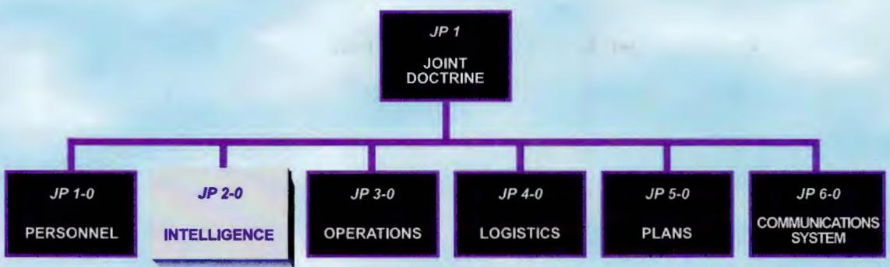

Alljintpublications are organized into a comprehensive hierarchy as shown in the chart above. Joint Publication (JP) 2-01 is in the Intelligence series of joint doctrine publications. The diagram below ilustrates an overview ofthe developmentprocess:

STEP #4 - Maintenance STEP#1 - Initiation   
• JP published and continuously Joint doctrine development assessed by users community(JDDC)submission tofil Formal assessment begins extant operational void 24-27months following Joint Staff (JS) J-7conducts frontpublication end analysis Revision begins 3.5 years Joint Doctrine Planning Conference after publication validation EachJP revision is completed Program directive(PD)development no later than5 years affer andstafgining signature PD includes scope, references, outine,milestones,anddraft authorship JS J-7 approves and releases PD to lead agent(LA)(Service, combatant Maintenance command, JS directorate) Initiation ENHANCED JOINT JOINT WARFIGHTING DOCTRINE CAPABILITY PUBLICATION Approval Development STEP #3 -Approval STEP #2 - Development   
• JSDS delivers adjudicated matrix to JS J-7 LA selects primary review authonty (PRA) to develop the frst   
• JS J-7 prepares publication for signature draft(FD)   
• JSDS prepares JS staffing package •PRA develops FD for staffing with JDDC JSDSstaffs the publication via JSAP for FD comment matrix adjudication signature JSJ-7produces the final coordination(FC)draff, staffsto JDDCandJS via Joint StaffAction Processing (JSAP)system JointStaff doctrine sponsor (JSDS)adjudicates FC comment matrix • FC joint working group

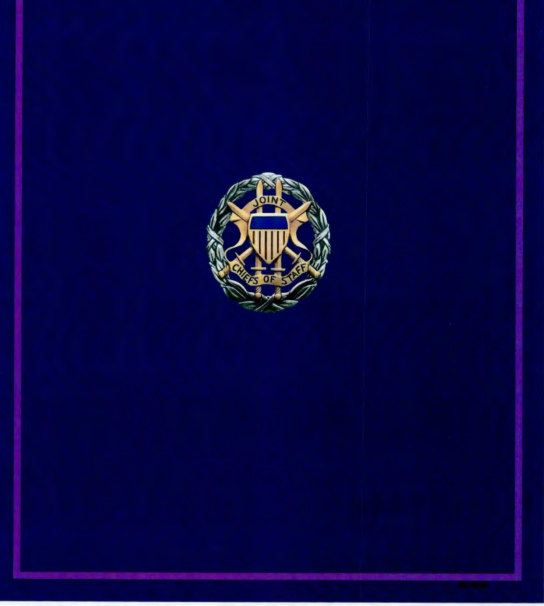